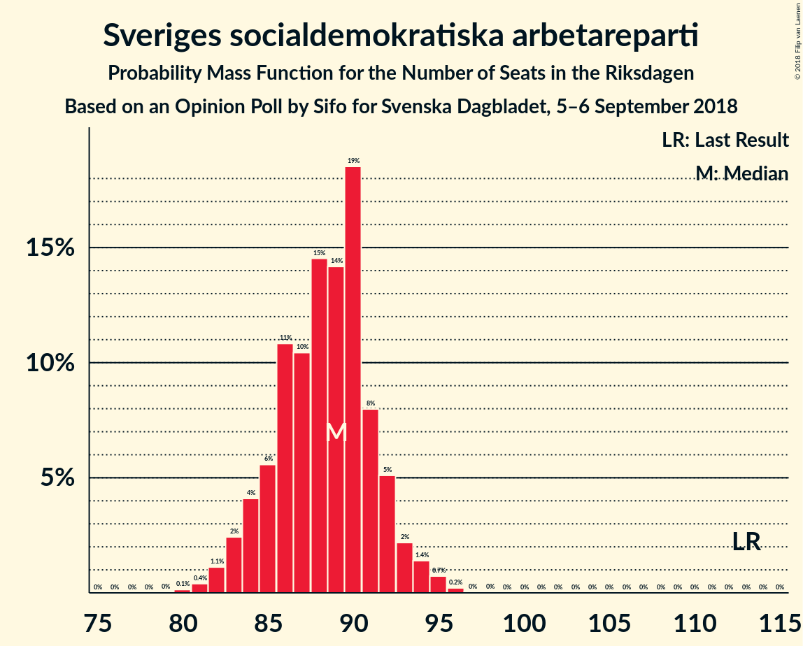
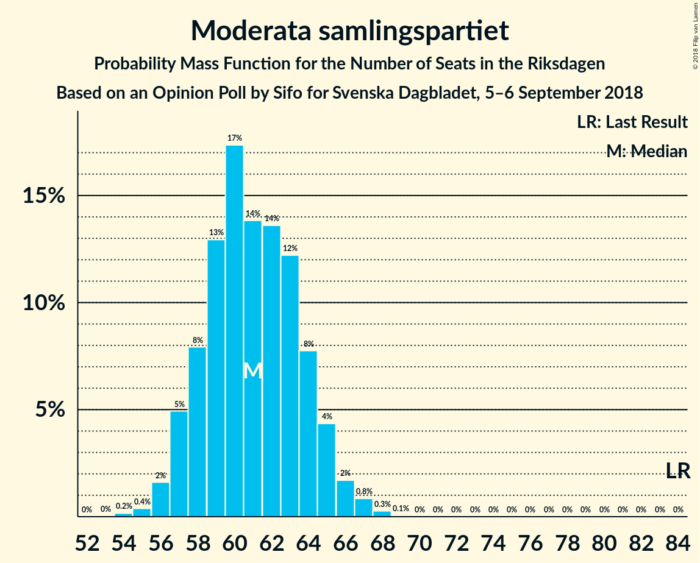
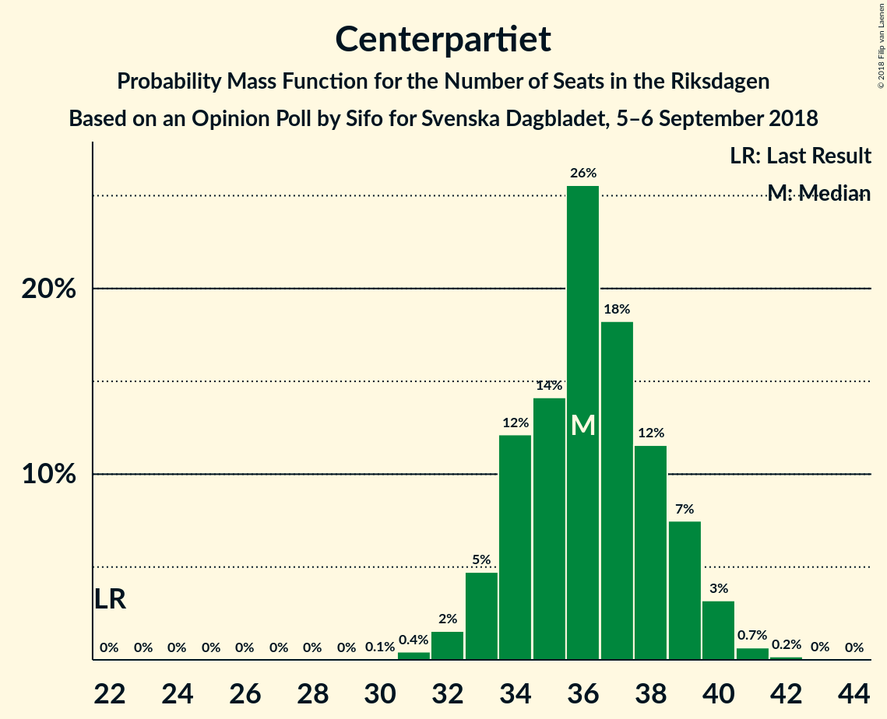
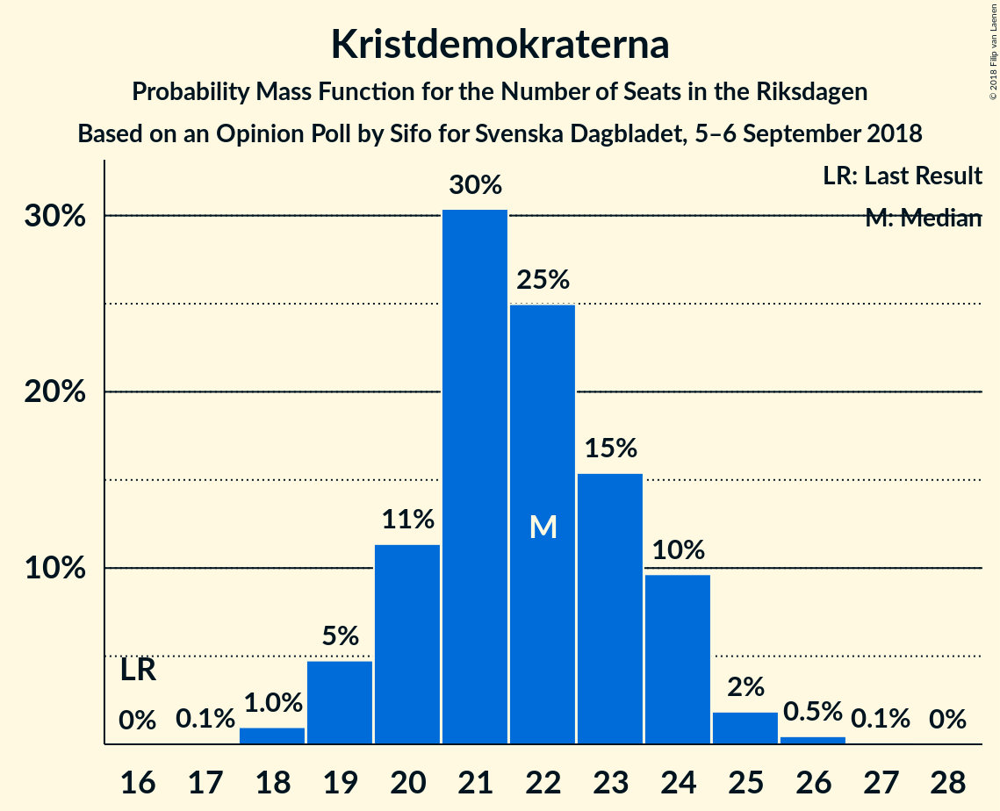

# Opinion Poll by Sifo for Svenska Dagbladet, 5–6 September 2018

<a href="#voting-intentions">Voting Intentions</a> | <a href="#seats">Seats</a> | <a href="#coalitions">Coalitions</a> | <a href="#technical-information">Technical Information</a>

## Voting Intentions

### Confidence Intervals

| Party | Last Result | Poll Result | 80% Confidence Interval | 90% Confidence Interval | 95% Confidence Interval | 99% Confidence Interval |
|:-----:|:-----------:|:-----------:|:-----------------------:|:-----------------------:|:-----------------------:|:-----------------------:|
| Sveriges socialdemokratiska arbetareparti | 31.0% | 24.5% | 23.6–25.4% |23.3–25.7% |23.1–25.9% |22.6–26.4% |
| Sverigedemokraterna | 12.9% | 17.0% | 16.2–17.9% |16.0–18.1% |15.8–18.3% |15.4–18.7% |
| Moderata samlingspartiet | 23.3% | 17.0% | 16.2–17.8% |15.9–18.0% |15.7–18.2% |15.4–18.7% |
| Centerpartiet | 6.1% | 10.0% | 9.4–10.7% |9.2–10.9% |9.1–11.1% |8.8–11.4% |
| Vänsterpartiet | 5.7% | 10.0% | 9.4–10.7% |9.2–10.9% |9.1–11.1% |8.8–11.4% |
| Miljöpartiet de gröna | 6.9% | 6.2% | 5.7–6.8% |5.6–6.9% |5.4–7.1% |5.2–7.3% |
| Liberalerna | 5.4% | 6.0% | 5.5–6.6% |5.4–6.7% |5.3–6.9% |5.0–7.1% |
| Kristdemokraterna | 4.6% | 6.0% | 5.5–6.6% |5.4–6.7% |5.3–6.9% |5.0–7.1% |

*Note:* The poll result column reflects the actual value used in the calculations. Published results may vary slightly, and in addition be rounded to fewer digits.

## Seats

### Confidence Intervals

| Party | Last Result | Median | 80% Confidence Interval | 90% Confidence Interval | 95% Confidence Interval | 99% Confidence Interval |
|:-----:|:-----------:|:------:|:-----------------------:|:-----------------------:|:-----------------------:|:-----------------------:|
| <a href="#sveriges-socialdemokratiska-arbetareparti">Sveriges socialdemokratiska arbetareparti</a> | 113 | 89 | 84–92 |83–93 |82–94 |81–96 |
| <a href="#sverigedemokraterna">Sverigedemokraterna</a> | 49 | 61 | 58–65 |58–66 |57–67 |55–68 |
| <a href="#moderata-samlingspartiet">Moderata samlingspartiet</a> | 84 | 60 | 58–64 |57–66 |56–67 |55–68 |
| <a href="#centerpartiet">Centerpartiet</a> | 22 | 36 | 34–39 |33–40 |33–40 |32–41 |
| <a href="#vänsterpartiet">Vänsterpartiet</a> | 21 | 36 | 34–39 |33–39 |32–40 |31–41 |
| <a href="#miljöpartiet-de-gröna">Miljöpartiet de gröna</a> | 25 | 23 | 21–24 |20–25 |20–26 |19–26 |
| <a href="#liberalerna">Liberalerna</a> | 19 | 22 | 20–24 |20–24 |19–24 |18–26 |
| <a href="#kristdemokraterna">Kristdemokraterna</a> | 16 | 22 | 20–24 |19–24 |19–24 |18–26 |

### Sveriges socialdemokratiska arbetareparti

*For a full overview of the results for this party, see the [Sveriges socialdemokratiska arbetareparti](party-sverigessocialdemokratiskaarbetareparti.html) page.*

| Number of Seats | Probability | Accumulated | Special Marks |
|:---------------:|:-----------:|:-----------:|:-------------:|
| 79 | 0% | 100% |  |
| 80 | 0.2% | 99.9% |  |
| 81 | 0.4% | 99.8% |  |
| 82 | 2% | 99.4% |  |
| 83 | 5% | 97% |  |
| 84 | 2% | 92% |  |
| 85 | 6% | 90% |  |
| 86 | 4% | 84% |  |
| 87 | 9% | 80% |  |
| 88 | 8% | 71% |  |
| 89 | 17% | 63% | Median |
| 90 | 27% | 46% |  |
| 91 | 7% | 19% |  |
| 92 | 6% | 12% |  |
| 93 | 1.1% | 6% |  |
| 94 | 3% | 5% |  |
| 95 | 0.4% | 1.0% |  |
| 96 | 0.6% | 0.6% |  |
| 97 | 0% | 0.1% |  |
| 98 | 0% | 0% |  |
| 99 | 0% | 0% |  |
| 100 | 0% | 0% |  |
| 101 | 0% | 0% |  |
| 102 | 0% | 0% |  |
| 103 | 0% | 0% |  |
| 104 | 0% | 0% |  |
| 105 | 0% | 0% |  |
| 106 | 0% | 0% |  |
| 107 | 0% | 0% |  |
| 108 | 0% | 0% |  |
| 109 | 0% | 0% |  |
| 110 | 0% | 0% |  |
| 111 | 0% | 0% |  |
| 112 | 0% | 0% |  |
| 113 | 0% | 0% | Last Result |

### Sverigedemokraterna

*For a full overview of the results for this party, see the [Sverigedemokraterna](party-sverigedemokraterna.html) page.*

| Number of Seats | Probability | Accumulated | Special Marks |
|:---------------:|:-----------:|:-----------:|:-------------:|
| 49 | 0% | 100% | Last Result |
| 50 | 0% | 100% |  |
| 51 | 0% | 100% |  |
| 52 | 0% | 100% |  |
| 53 | 0% | 100% |  |
| 54 | 0.1% | 100% |  |
| 55 | 0.4% | 99.8% |  |
| 56 | 1.0% | 99.4% |  |
| 57 | 3% | 98% |  |
| 58 | 6% | 96% |  |
| 59 | 7% | 90% |  |
| 60 | 31% | 82% |  |
| 61 | 12% | 51% | Median |
| 62 | 6% | 39% |  |
| 63 | 17% | 33% |  |
| 64 | 5% | 16% |  |
| 65 | 5% | 11% |  |
| 66 | 4% | 6% |  |
| 67 | 2% | 3% |  |
| 68 | 0.8% | 1.0% |  |
| 69 | 0.2% | 0.2% |  |
| 70 | 0% | 0% |  |

### Moderata samlingspartiet

*For a full overview of the results for this party, see the [Moderata samlingspartiet](party-moderatasamlingspartiet.html) page.*

| Number of Seats | Probability | Accumulated | Special Marks |
|:---------------:|:-----------:|:-----------:|:-------------:|
| 54 | 0.1% | 100% |  |
| 55 | 0.5% | 99.8% |  |
| 56 | 2% | 99.3% |  |
| 57 | 7% | 97% |  |
| 58 | 6% | 90% |  |
| 59 | 28% | 84% |  |
| 60 | 8% | 56% | Median |
| 61 | 13% | 47% |  |
| 62 | 8% | 35% |  |
| 63 | 11% | 27% |  |
| 64 | 7% | 16% |  |
| 65 | 2% | 9% |  |
| 66 | 3% | 7% |  |
| 67 | 2% | 3% |  |
| 68 | 1.1% | 1.2% |  |
| 69 | 0.1% | 0.1% |  |
| 70 | 0% | 0% |  |
| 71 | 0% | 0% |  |
| 72 | 0% | 0% |  |
| 73 | 0% | 0% |  |
| 74 | 0% | 0% |  |
| 75 | 0% | 0% |  |
| 76 | 0% | 0% |  |
| 77 | 0% | 0% |  |
| 78 | 0% | 0% |  |
| 79 | 0% | 0% |  |
| 80 | 0% | 0% |  |
| 81 | 0% | 0% |  |
| 82 | 0% | 0% |  |
| 83 | 0% | 0% |  |
| 84 | 0% | 0% | Last Result |

### Centerpartiet

*For a full overview of the results for this party, see the [Centerpartiet](party-centerpartiet.html) page.*

| Number of Seats | Probability | Accumulated | Special Marks |
|:---------------:|:-----------:|:-----------:|:-------------:|
| 22 | 0% | 100% | Last Result |
| 23 | 0% | 100% |  |
| 24 | 0% | 100% |  |
| 25 | 0% | 100% |  |
| 26 | 0% | 100% |  |
| 27 | 0% | 100% |  |
| 28 | 0% | 100% |  |
| 29 | 0% | 100% |  |
| 30 | 0.1% | 100% |  |
| 31 | 0.3% | 99.9% |  |
| 32 | 1.3% | 99.6% |  |
| 33 | 6% | 98% |  |
| 34 | 10% | 92% |  |
| 35 | 28% | 82% |  |
| 36 | 12% | 54% | Median |
| 37 | 16% | 42% |  |
| 38 | 15% | 25% |  |
| 39 | 5% | 11% |  |
| 40 | 5% | 6% |  |
| 41 | 0.6% | 1.0% |  |
| 42 | 0.2% | 0.3% |  |
| 43 | 0.1% | 0.1% |  |
| 44 | 0% | 0% |  |

### Vänsterpartiet

*For a full overview of the results for this party, see the [Vänsterpartiet](party-vänsterpartiet.html) page.*

| Number of Seats | Probability | Accumulated | Special Marks |
|:---------------:|:-----------:|:-----------:|:-------------:|
| 21 | 0% | 100% | Last Result |
| 22 | 0% | 100% |  |
| 23 | 0% | 100% |  |
| 24 | 0% | 100% |  |
| 25 | 0% | 100% |  |
| 26 | 0% | 100% |  |
| 27 | 0% | 100% |  |
| 28 | 0% | 100% |  |
| 29 | 0% | 100% |  |
| 30 | 0.1% | 100% |  |
| 31 | 0.5% | 99.9% |  |
| 32 | 4% | 99.4% |  |
| 33 | 2% | 96% |  |
| 34 | 7% | 93% |  |
| 35 | 28% | 86% |  |
| 36 | 14% | 58% | Median |
| 37 | 22% | 43% |  |
| 38 | 11% | 21% |  |
| 39 | 7% | 11% |  |
| 40 | 2% | 4% |  |
| 41 | 1.1% | 1.4% |  |
| 42 | 0.3% | 0.3% |  |
| 43 | 0.1% | 0.1% |  |
| 44 | 0% | 0% |  |

### Miljöpartiet de gröna

*For a full overview of the results for this party, see the [Miljöpartiet de gröna](party-miljöpartietdegröna.html) page.*

| Number of Seats | Probability | Accumulated | Special Marks |
|:---------------:|:-----------:|:-----------:|:-------------:|
| 18 | 0.2% | 100% |  |
| 19 | 2% | 99.7% |  |
| 20 | 7% | 98% |  |
| 21 | 15% | 91% |  |
| 22 | 21% | 75% |  |
| 23 | 37% | 55% | Median |
| 24 | 10% | 18% |  |
| 25 | 5% | 8% | Last Result |
| 26 | 2% | 3% |  |
| 27 | 0.4% | 0.5% |  |
| 28 | 0.1% | 0.1% |  |
| 29 | 0% | 0% |  |

### Liberalerna

*For a full overview of the results for this party, see the [Liberalerna](party-liberalerna.html) page.*

| Number of Seats | Probability | Accumulated | Special Marks |
|:---------------:|:-----------:|:-----------:|:-------------:|
| 18 | 1.4% | 100% |  |
| 19 | 2% | 98.5% | Last Result |
| 20 | 27% | 96% |  |
| 21 | 11% | 69% |  |
| 22 | 27% | 59% | Median |
| 23 | 19% | 32% |  |
| 24 | 11% | 13% |  |
| 25 | 1.0% | 2% |  |
| 26 | 0.5% | 0.6% |  |
| 27 | 0.1% | 0.1% |  |
| 28 | 0% | 0% |  |

### Kristdemokraterna

*For a full overview of the results for this party, see the [Kristdemokraterna](party-kristdemokraterna.html) page.*

| Number of Seats | Probability | Accumulated | Special Marks |
|:---------------:|:-----------:|:-----------:|:-------------:|
| 16 | 0% | 100% | Last Result |
| 17 | 0.1% | 100% |  |
| 18 | 1.1% | 99.9% |  |
| 19 | 7% | 98.8% |  |
| 20 | 7% | 92% |  |
| 21 | 28% | 85% |  |
| 22 | 33% | 57% | Median |
| 23 | 9% | 24% |  |
| 24 | 13% | 16% |  |
| 25 | 2% | 2% |  |
| 26 | 0.5% | 0.7% |  |
| 27 | 0.2% | 0.2% |  |
| 28 | 0% | 0% |  |

## Coalitions

### Confidence Intervals

| Coalition | Last Result | Median | Majority? | 80% Confidence Interval | 90% Confidence Interval | 95% Confidence Interval | 99% Confidence Interval |
|:---------:|:-----------:|:------:|:---------:|:-----------------------:|:-----------------------:|:-----------------------:|:-----------------------:|
| Sveriges socialdemokratiska arbetareparti – Moderata samlingspartiet – Centerpartiet | 219 | 185 | 99.5% | 182–190 | 180–192 | 179–192 | 175–194 |
| Sveriges socialdemokratiska arbetareparti – Moderata samlingspartiet | 197 | 149 | 0% | 145–154 | 145–156 | 143–157 | 141–157 |
| Sveriges socialdemokratiska arbetareparti – Vänsterpartiet – Miljöpartiet de gröna | 159 | 148 | 0% | 142–150 | 141–152 | 140–153 | 138–156 |
| Sverigedemokraterna – Moderata samlingspartiet – Kristdemokraterna | 149 | 143 | 0% | 141–148 | 139–149 | 138–150 | 136–152 |
| Moderata samlingspartiet – Centerpartiet – Kristdemokraterna – Liberalerna | 141 | 139 | 0% | 137–144 | 136–146 | 134–147 | 133–148 |
| Sveriges socialdemokratiska arbetareparti – Vänsterpartiet | 134 | 125 | 0% | 120–128 | 118–129 | 118–130 | 117–133 |
| Sverigedemokraterna – Moderata samlingspartiet | 133 | 122 | 0% | 118–126 | 117–127 | 116–129 | 114–130 |
| Moderata samlingspartiet – Centerpartiet – Kristdemokraterna | 122 | 118 | 0% | 115–123 | 114–124 | 113–125 | 111–127 |
| Moderata samlingspartiet – Centerpartiet – Liberalerna | 125 | 118 | 0% | 115–122 | 114–124 | 113–125 | 111–126 |
| Sveriges socialdemokratiska arbetareparti – Miljöpartiet de gröna | 138 | 112 | 0% | 107–115 | 105–115 | 105–115 | 103–118 |
| Moderata samlingspartiet – Centerpartiet | 106 | 97 | 0% | 94–101 | 93–103 | 91–103 | 90–105 |

