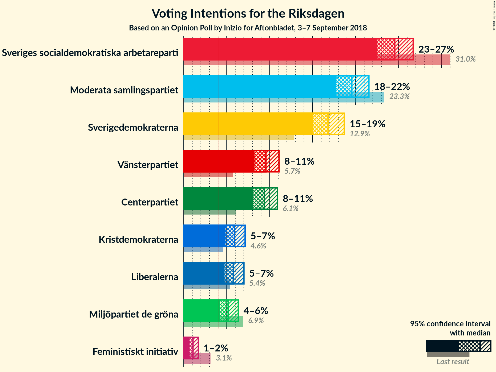
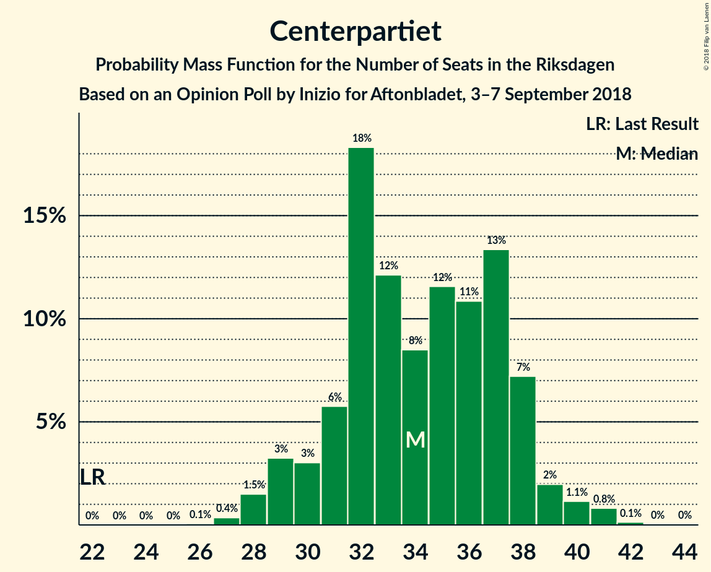
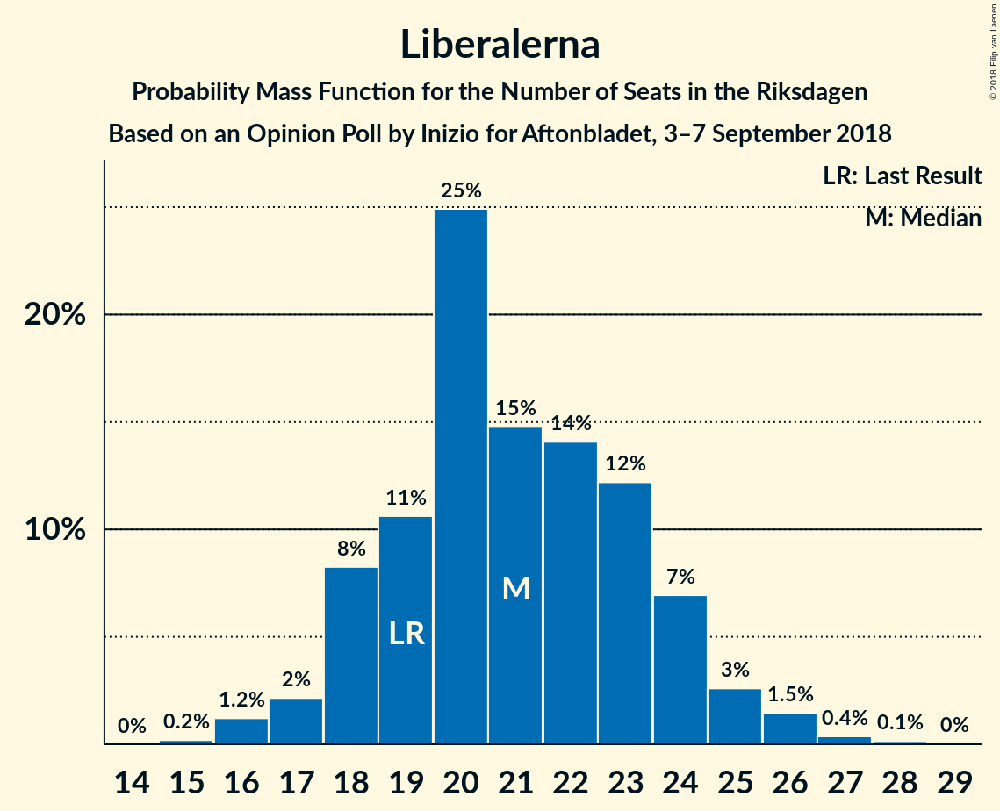
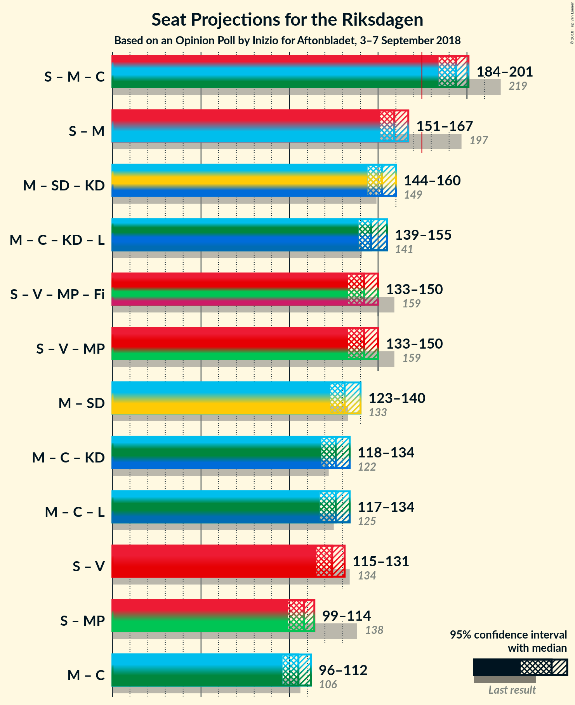

# Opinion Poll by Inizio for Aftonbladet, 3–7 September 2018

<a href="#voting-intentions">Voting Intentions</a> | <a href="#seats">Seats</a> | <a href="#coalitions">Coalitions</a> | <a href="#technical-information">Technical Information</a>

## Voting Intentions

### Confidence Intervals

| Party | Last Result | Poll Result | 80% Confidence Interval | 90% Confidence Interval | 95% Confidence Interval | 99% Confidence Interval |
|:-----:|:-----------:|:-----------:|:-----------------------:|:-----------------------:|:-----------------------:|:-----------------------:|
| Sveriges socialdemokratiska arbetareparti | 31.0% | 24.6% | 23.2–26.0% |22.9–26.4% |22.5–26.7% |21.9–27.4% |
| Moderata samlingspartiet | 23.3% | 19.6% | 18.4–20.9% |18.0–21.2% |17.7–21.6% |17.2–22.2% |
| Sverigedemokraterna | 12.9% | 16.8% | 15.7–18.0% |15.3–18.4% |15.1–18.7% |14.5–19.3% |
| Vänsterpartiet | 5.7% | 9.6% | 8.7–10.6% |8.5–10.9% |8.2–11.1% |7.8–11.6% |
| Centerpartiet | 6.1% | 9.4% | 8.5–10.4% |8.3–10.7% |8.1–10.9% |7.7–11.4% |
| Kristdemokraterna | 4.6% | 5.9% | 5.2–6.7% |5.0–7.0% |4.9–7.1% |4.6–7.6% |
| Liberalerna | 5.4% | 5.8% | 5.1–6.6% |4.9–6.8% |4.8–7.0% |4.5–7.4% |
| Miljöpartiet de gröna | 6.9% | 5.2% | 4.5–5.9% |4.4–6.2% |4.2–6.4% |3.9–6.8% |
| Feministiskt initiativ | 3.1% | 1.1% | 0.8–1.5% |0.7–1.6% |0.7–1.7% |0.6–1.9% |

*Note:* The poll result column reflects the actual value used in the calculations. Published results may vary slightly, and in addition be rounded to fewer digits.

## Seats

### Confidence Intervals

| Party | Last Result | Median | 80% Confidence Interval | 90% Confidence Interval | 95% Confidence Interval | 99% Confidence Interval |
|:-----:|:-----------:|:------:|:-----------------------:|:-----------------------:|:-----------------------:|:-----------------------:|
| <a href="#sveriges-socialdemokratiska-arbetareparti">Sveriges socialdemokratiska arbetareparti</a> | 113 | 88 | 83–93 |81–94 |81–96 |79–98 |
| <a href="#moderata-samlingspartiet">Moderata samlingspartiet</a> | 84 | 70 | 65–76 |65–77 |64–78 |63–79 |
| <a href="#sverigedemokraterna">Sverigedemokraterna</a> | 49 | 61 | 57–65 |56–67 |54–67 |52–69 |
| <a href="#vänsterpartiet">Vänsterpartiet</a> | 21 | 34 | 32–38 |30–39 |30–40 |28–42 |
| <a href="#centerpartiet">Centerpartiet</a> | 22 | 34 | 31–38 |30–38 |29–39 |28–41 |
| <a href="#kristdemokraterna">Kristdemokraterna</a> | 16 | 21 | 19–24 |17–25 |17–26 |16–27 |
| <a href="#liberalerna">Liberalerna</a> | 19 | 21 | 18–24 |18–24 |17–25 |16–27 |
| <a href="#miljöpartiet-de-gröna">Miljöpartiet de gröna</a> | 25 | 19 | 16–21 |16–22 |15–23 |0–24 |
| <a href="#feministiskt-initiativ">Feministiskt initiativ</a> | 0 | 0 | 0 |0 |0 |0 |

### Sveriges socialdemokratiska arbetareparti

*For a full overview of the results for this party, see the [Sveriges socialdemokratiska arbetareparti](party-sverigessocialdemokratiskaarbetareparti.html) page.*

| Number of Seats | Probability | Accumulated | Special Marks |
|:---------------:|:-----------:|:-----------:|:-------------:|
| 76 | 0% | 100% |  |
| 77 | 0.1% | 99.9% |  |
| 78 | 0.2% | 99.8% |  |
| 79 | 0.4% | 99.6% |  |
| 80 | 0.7% | 99.2% |  |
| 81 | 6% | 98.5% |  |
| 82 | 3% | 93% |  |
| 83 | 4% | 90% |  |
| 84 | 6% | 86% |  |
| 85 | 10% | 80% |  |
| 86 | 4% | 70% |  |
| 87 | 12% | 67% |  |
| 88 | 7% | 55% | Median |
| 89 | 10% | 48% |  |
| 90 | 7% | 38% |  |
| 91 | 6% | 31% |  |
| 92 | 13% | 25% |  |
| 93 | 3% | 12% |  |
| 94 | 4% | 8% |  |
| 95 | 0.8% | 5% |  |
| 96 | 3% | 4% |  |
| 97 | 0.6% | 1.2% |  |
| 98 | 0.2% | 0.6% |  |
| 99 | 0.1% | 0.3% |  |
| 100 | 0.1% | 0.3% |  |
| 101 | 0% | 0.1% |  |
| 102 | 0.1% | 0.1% |  |
| 103 | 0% | 0% |  |
| 104 | 0% | 0% |  |
| 105 | 0% | 0% |  |
| 106 | 0% | 0% |  |
| 107 | 0% | 0% |  |
| 108 | 0% | 0% |  |
| 109 | 0% | 0% |  |
| 110 | 0% | 0% |  |
| 111 | 0% | 0% |  |
| 112 | 0% | 0% |  |
| 113 | 0% | 0% | Last Result |

### Moderata samlingspartiet

*For a full overview of the results for this party, see the [Moderata samlingspartiet](party-moderatasamlingspartiet.html) page.*

| Number of Seats | Probability | Accumulated | Special Marks |
|:---------------:|:-----------:|:-----------:|:-------------:|
| 59 | 0% | 100% |  |
| 60 | 0.1% | 99.9% |  |
| 61 | 0.1% | 99.9% |  |
| 62 | 0.2% | 99.8% |  |
| 63 | 2% | 99.5% |  |
| 64 | 2% | 98% |  |
| 65 | 6% | 96% |  |
| 66 | 7% | 90% |  |
| 67 | 4% | 82% |  |
| 68 | 2% | 78% |  |
| 69 | 16% | 76% |  |
| 70 | 12% | 60% | Median |
| 71 | 11% | 48% |  |
| 72 | 7% | 37% |  |
| 73 | 11% | 30% |  |
| 74 | 3% | 19% |  |
| 75 | 1.3% | 16% |  |
| 76 | 7% | 14% |  |
| 77 | 4% | 8% |  |
| 78 | 3% | 4% |  |
| 79 | 0.6% | 0.9% |  |
| 80 | 0.1% | 0.3% |  |
| 81 | 0% | 0.2% |  |
| 82 | 0% | 0.1% |  |
| 83 | 0% | 0.1% |  |
| 84 | 0% | 0% | Last Result |

### Sverigedemokraterna

*For a full overview of the results for this party, see the [Sverigedemokraterna](party-sverigedemokraterna.html) page.*

| Number of Seats | Probability | Accumulated | Special Marks |
|:---------------:|:-----------:|:-----------:|:-------------:|
| 49 | 0% | 100% | Last Result |
| 50 | 0% | 100% |  |
| 51 | 0.2% | 100% |  |
| 52 | 0.6% | 99.8% |  |
| 53 | 0.6% | 99.2% |  |
| 54 | 1.4% | 98.7% |  |
| 55 | 2% | 97% |  |
| 56 | 4% | 95% |  |
| 57 | 5% | 92% |  |
| 58 | 19% | 87% |  |
| 59 | 8% | 68% |  |
| 60 | 6% | 59% |  |
| 61 | 5% | 54% | Median |
| 62 | 11% | 49% |  |
| 63 | 22% | 38% |  |
| 64 | 5% | 16% |  |
| 65 | 2% | 11% |  |
| 66 | 2% | 9% |  |
| 67 | 5% | 7% |  |
| 68 | 1.0% | 2% |  |
| 69 | 0.3% | 0.6% |  |
| 70 | 0.1% | 0.3% |  |
| 71 | 0.2% | 0.2% |  |
| 72 | 0% | 0.1% |  |
| 73 | 0% | 0% |  |

### Vänsterpartiet

*For a full overview of the results for this party, see the [Vänsterpartiet](party-vänsterpartiet.html) page.*

| Number of Seats | Probability | Accumulated | Special Marks |
|:---------------:|:-----------:|:-----------:|:-------------:|
| 21 | 0% | 100% | Last Result |
| 22 | 0% | 100% |  |
| 23 | 0% | 100% |  |
| 24 | 0% | 100% |  |
| 25 | 0% | 100% |  |
| 26 | 0% | 100% |  |
| 27 | 0.1% | 100% |  |
| 28 | 0.8% | 99.9% |  |
| 29 | 1.2% | 99.1% |  |
| 30 | 3% | 98% |  |
| 31 | 4% | 95% |  |
| 32 | 15% | 91% |  |
| 33 | 13% | 76% |  |
| 34 | 18% | 63% | Median |
| 35 | 10% | 45% |  |
| 36 | 12% | 34% |  |
| 37 | 7% | 22% |  |
| 38 | 6% | 15% |  |
| 39 | 4% | 8% |  |
| 40 | 2% | 4% |  |
| 41 | 1.2% | 2% |  |
| 42 | 0.6% | 1.1% |  |
| 43 | 0.4% | 0.5% |  |
| 44 | 0% | 0.1% |  |
| 45 | 0% | 0% |  |

### Centerpartiet

*For a full overview of the results for this party, see the [Centerpartiet](party-centerpartiet.html) page.*

| Number of Seats | Probability | Accumulated | Special Marks |
|:---------------:|:-----------:|:-----------:|:-------------:|
| 22 | 0% | 100% | Last Result |
| 23 | 0% | 100% |  |
| 24 | 0% | 100% |  |
| 25 | 0% | 100% |  |
| 26 | 0.1% | 100% |  |
| 27 | 0.3% | 99.9% |  |
| 28 | 1.2% | 99.7% |  |
| 29 | 3% | 98% |  |
| 30 | 4% | 96% |  |
| 31 | 7% | 92% |  |
| 32 | 18% | 85% |  |
| 33 | 16% | 67% |  |
| 34 | 7% | 51% | Median |
| 35 | 11% | 44% |  |
| 36 | 12% | 33% |  |
| 37 | 6% | 21% |  |
| 38 | 11% | 15% |  |
| 39 | 2% | 5% |  |
| 40 | 1.2% | 2% |  |
| 41 | 1.0% | 1.2% |  |
| 42 | 0.2% | 0.2% |  |
| 43 | 0% | 0.1% |  |
| 44 | 0% | 0% |  |

### Kristdemokraterna

*For a full overview of the results for this party, see the [Kristdemokraterna](party-kristdemokraterna.html) page.*

| Number of Seats | Probability | Accumulated | Special Marks |
|:---------------:|:-----------:|:-----------:|:-------------:|
| 15 | 0.1% | 100% |  |
| 16 | 0.6% | 99.9% | Last Result |
| 17 | 4% | 99.4% |  |
| 18 | 3% | 95% |  |
| 19 | 17% | 92% |  |
| 20 | 16% | 75% |  |
| 21 | 14% | 58% | Median |
| 22 | 14% | 44% |  |
| 23 | 17% | 30% |  |
| 24 | 7% | 14% |  |
| 25 | 4% | 7% |  |
| 26 | 2% | 3% |  |
| 27 | 0.7% | 1.1% |  |
| 28 | 0.3% | 0.4% |  |
| 29 | 0.1% | 0.1% |  |
| 30 | 0% | 0% |  |

### Liberalerna

*For a full overview of the results for this party, see the [Liberalerna](party-liberalerna.html) page.*

| Number of Seats | Probability | Accumulated | Special Marks |
|:---------------:|:-----------:|:-----------:|:-------------:|
| 15 | 0.2% | 100% |  |
| 16 | 0.7% | 99.7% |  |
| 17 | 2% | 99.0% |  |
| 18 | 11% | 97% |  |
| 19 | 7% | 86% | Last Result |
| 20 | 19% | 79% |  |
| 21 | 16% | 60% | Median |
| 22 | 17% | 44% |  |
| 23 | 12% | 27% |  |
| 24 | 11% | 16% |  |
| 25 | 3% | 5% |  |
| 26 | 2% | 2% |  |
| 27 | 0.4% | 0.5% |  |
| 28 | 0.1% | 0.1% |  |
| 29 | 0% | 0% |  |

### Miljöpartiet de gröna

*For a full overview of the results for this party, see the [Miljöpartiet de gröna](party-miljöpartietdegröna.html) page.*

| Number of Seats | Probability | Accumulated | Special Marks |
|:---------------:|:-----------:|:-----------:|:-------------:|
| 0 | 1.4% | 100% |  |
| 1 | 0% | 98.6% |  |
| 2 | 0% | 98.6% |  |
| 3 | 0% | 98.6% |  |
| 4 | 0% | 98.6% |  |
| 5 | 0% | 98.6% |  |
| 6 | 0% | 98.6% |  |
| 7 | 0% | 98.6% |  |
| 8 | 0% | 98.6% |  |
| 9 | 0% | 98.6% |  |
| 10 | 0% | 98.6% |  |
| 11 | 0% | 98.6% |  |
| 12 | 0% | 98.6% |  |
| 13 | 0% | 98.6% |  |
| 14 | 0% | 98.6% |  |
| 15 | 3% | 98.6% |  |
| 16 | 6% | 95% |  |
| 17 | 18% | 89% |  |
| 18 | 11% | 71% |  |
| 19 | 27% | 60% | Median |
| 20 | 13% | 32% |  |
| 21 | 10% | 19% |  |
| 22 | 7% | 10% |  |
| 23 | 1.2% | 3% |  |
| 24 | 1.0% | 1.4% |  |
| 25 | 0.3% | 0.3% | Last Result |
| 26 | 0% | 0.1% |  |
| 27 | 0% | 0% |  |

### Feministiskt initiativ

*For a full overview of the results for this party, see the [Feministiskt initiativ](party-feministisktinitiativ.html) page.*

| Number of Seats | Probability | Accumulated | Special Marks |
|:---------------:|:-----------:|:-----------:|:-------------:|
| 0 | 100% | 100% | Last Result, Median |

## Coalitions

### Confidence Intervals

| Coalition | Last Result | Median | Majority? | 80% Confidence Interval | 90% Confidence Interval | 95% Confidence Interval | 99% Confidence Interval |
|:---------:|:-----------:|:------:|:---------:|:-----------------------:|:-----------------------:|:-----------------------:|:-----------------------:|
| Sveriges socialdemokratiska arbetareparti – Moderata samlingspartiet – Centerpartiet | 219 | 193 | 100% | 186–199 | 186–201 | 184–202 | 182–205 |
| Sveriges socialdemokratiska arbetareparti – Moderata samlingspartiet | 197 | 158 | 0.1% | 153–165 | 151–166 | 150–167 | 148–171 |
| Moderata samlingspartiet – Sverigedemokraterna – Kristdemokraterna | 149 | 153 | 0% | 147–158 | 145–160 | 144–161 | 141–165 |
| Moderata samlingspartiet – Centerpartiet – Kristdemokraterna – Liberalerna | 141 | 146 | 0% | 142–152 | 139–154 | 139–156 | 135–159 |
| Sveriges socialdemokratiska arbetareparti – Vänsterpartiet – Miljöpartiet de gröna – Feministiskt initiativ | 159 | 141 | 0% | 136–147 | 135–148 | 133–150 | 128–152 |
| Sveriges socialdemokratiska arbetareparti – Vänsterpartiet – Miljöpartiet de gröna | 159 | 141 | 0% | 136–147 | 135–148 | 133–150 | 128–152 |
| Moderata samlingspartiet – Sverigedemokraterna | 133 | 131 | 0% | 125–138 | 123–139 | 123–140 | 120–142 |
| Moderata samlingspartiet – Centerpartiet – Kristdemokraterna | 122 | 126 | 0% | 119–132 | 119–134 | 118–134 | 116–137 |
| Moderata samlingspartiet – Centerpartiet – Liberalerna | 125 | 126 | 0% | 120–131 | 118–132 | 118–134 | 114–137 |
| Sveriges socialdemokratiska arbetareparti – Vänsterpartiet | 134 | 122 | 0% | 118–128 | 116–130 | 115–131 | 112–134 |
| Sveriges socialdemokratiska arbetareparti – Miljöpartiet de gröna | 138 | 107 | 0% | 101–113 | 100–113 | 99–114 | 91–117 |
| Moderata samlingspartiet – Centerpartiet | 106 | 105 | 0% | 99–110 | 98–112 | 97–113 | 95–115 |

### Sveriges socialdemokratiska arbetareparti – Moderata samlingspartiet – Centerpartiet

| Number of Seats | Probability | Accumulated | Special Marks |
|:---------------:|:-----------:|:-----------:|:-------------:|
| 178 | 0% | 100% |  |
| 179 | 0.1% | 99.9% |  |
| 180 | 0.1% | 99.9% |  |
| 181 | 0.1% | 99.7% |  |
| 182 | 0.2% | 99.6% |  |
| 183 | 2% | 99.4% |  |
| 184 | 0.7% | 98% |  |
| 185 | 1.1% | 97% |  |
| 186 | 8% | 96% |  |
| 187 | 4% | 88% |  |
| 188 | 4% | 84% |  |
| 189 | 11% | 80% |  |
| 190 | 5% | 70% |  |
| 191 | 4% | 65% |  |
| 192 | 8% | 61% | Median |
| 193 | 6% | 53% |  |
| 194 | 13% | 46% |  |
| 195 | 6% | 33% |  |
| 196 | 3% | 27% |  |
| 197 | 10% | 24% |  |
| 198 | 4% | 14% |  |
| 199 | 1.2% | 11% |  |
| 200 | 2% | 9% |  |
| 201 | 5% | 8% |  |
| 202 | 0.7% | 3% |  |
| 203 | 0.4% | 2% |  |
| 204 | 0.5% | 2% |  |
| 205 | 0.8% | 1.2% |  |
| 206 | 0.1% | 0.5% |  |
| 207 | 0.1% | 0.4% |  |
| 208 | 0.2% | 0.3% |  |
| 209 | 0% | 0.1% |  |
| 210 | 0% | 0.1% |  |
| 211 | 0% | 0.1% |  |
| 212 | 0.1% | 0.1% |  |
| 213 | 0% | 0% |  |
| 214 | 0% | 0% |  |
| 215 | 0% | 0% |  |
| 216 | 0% | 0% |  |
| 217 | 0% | 0% |  |
| 218 | 0% | 0% |  |
| 219 | 0% | 0% | Last Result |

### Sveriges socialdemokratiska arbetareparti – Moderata samlingspartiet

| Number of Seats | Probability | Accumulated | Special Marks |
|:---------------:|:-----------:|:-----------:|:-------------:|
| 144 | 0.1% | 100% |  |
| 145 | 0% | 99.9% |  |
| 146 | 0.1% | 99.9% |  |
| 147 | 0.2% | 99.8% |  |
| 148 | 0.3% | 99.6% |  |
| 149 | 0.4% | 99.2% |  |
| 150 | 1.4% | 98.8% |  |
| 151 | 4% | 97% |  |
| 152 | 3% | 93% |  |
| 153 | 4% | 90% |  |
| 154 | 4% | 86% |  |
| 155 | 7% | 82% |  |
| 156 | 16% | 75% |  |
| 157 | 6% | 58% |  |
| 158 | 8% | 52% | Median |
| 159 | 6% | 44% |  |
| 160 | 3% | 38% |  |
| 161 | 4% | 35% |  |
| 162 | 4% | 31% |  |
| 163 | 6% | 27% |  |
| 164 | 2% | 21% |  |
| 165 | 12% | 19% |  |
| 166 | 3% | 7% |  |
| 167 | 2% | 4% |  |
| 168 | 1.0% | 2% |  |
| 169 | 0.5% | 1.3% |  |
| 170 | 0.2% | 0.8% |  |
| 171 | 0.3% | 0.5% |  |
| 172 | 0.1% | 0.3% |  |
| 173 | 0.1% | 0.2% |  |
| 174 | 0% | 0.1% |  |
| 175 | 0% | 0.1% | Majority |
| 176 | 0% | 0% |  |
| 177 | 0% | 0% |  |
| 178 | 0% | 0% |  |
| 179 | 0% | 0% |  |
| 180 | 0% | 0% |  |
| 181 | 0% | 0% |  |
| 182 | 0% | 0% |  |
| 183 | 0% | 0% |  |
| 184 | 0% | 0% |  |
| 185 | 0% | 0% |  |
| 186 | 0% | 0% |  |
| 187 | 0% | 0% |  |
| 188 | 0% | 0% |  |
| 189 | 0% | 0% |  |
| 190 | 0% | 0% |  |
| 191 | 0% | 0% |  |
| 192 | 0% | 0% |  |
| 193 | 0% | 0% |  |
| 194 | 0% | 0% |  |
| 195 | 0% | 0% |  |
| 196 | 0% | 0% |  |
| 197 | 0% | 0% | Last Result |

### Moderata samlingspartiet – Sverigedemokraterna – Kristdemokraterna

| Number of Seats | Probability | Accumulated | Special Marks |
|:---------------:|:-----------:|:-----------:|:-------------:|
| 138 | 0.1% | 100% |  |
| 139 | 0% | 99.9% |  |
| 140 | 0.1% | 99.8% |  |
| 141 | 0.4% | 99.8% |  |
| 142 | 0.5% | 99.3% |  |
| 143 | 1.3% | 98.8% |  |
| 144 | 1.4% | 98% |  |
| 145 | 4% | 96% |  |
| 146 | 2% | 93% |  |
| 147 | 3% | 90% |  |
| 148 | 4% | 88% |  |
| 149 | 7% | 84% | Last Result |
| 150 | 15% | 76% |  |
| 151 | 5% | 61% |  |
| 152 | 6% | 57% | Median |
| 153 | 6% | 51% |  |
| 154 | 5% | 45% |  |
| 155 | 16% | 40% |  |
| 156 | 9% | 25% |  |
| 157 | 2% | 16% |  |
| 158 | 4% | 14% |  |
| 159 | 3% | 9% |  |
| 160 | 3% | 6% |  |
| 161 | 1.0% | 3% |  |
| 162 | 0.3% | 2% |  |
| 163 | 0.4% | 2% |  |
| 164 | 0.7% | 1.2% |  |
| 165 | 0.1% | 0.5% |  |
| 166 | 0.1% | 0.4% |  |
| 167 | 0.1% | 0.3% |  |
| 168 | 0.1% | 0.1% |  |
| 169 | 0% | 0% |  |

### Moderata samlingspartiet – Centerpartiet – Kristdemokraterna – Liberalerna

| Number of Seats | Probability | Accumulated | Special Marks |
|:---------------:|:-----------:|:-----------:|:-------------:|
| 133 | 0.1% | 100% |  |
| 134 | 0.1% | 99.9% |  |
| 135 | 0.4% | 99.8% |  |
| 136 | 0.3% | 99.4% |  |
| 137 | 0.3% | 99.1% |  |
| 138 | 0.9% | 98.8% |  |
| 139 | 3% | 98% |  |
| 140 | 2% | 95% |  |
| 141 | 1.4% | 93% | Last Result |
| 142 | 4% | 91% |  |
| 143 | 8% | 87% |  |
| 144 | 9% | 79% |  |
| 145 | 2% | 70% |  |
| 146 | 20% | 68% | Median |
| 147 | 4% | 48% |  |
| 148 | 6% | 43% |  |
| 149 | 6% | 37% |  |
| 150 | 14% | 31% |  |
| 151 | 1.4% | 17% |  |
| 152 | 7% | 16% |  |
| 153 | 2% | 9% |  |
| 154 | 2% | 6% |  |
| 155 | 2% | 4% |  |
| 156 | 0.8% | 3% |  |
| 157 | 1.0% | 2% |  |
| 158 | 0.2% | 0.9% |  |
| 159 | 0.2% | 0.7% |  |
| 160 | 0.2% | 0.4% |  |
| 161 | 0.1% | 0.3% |  |
| 162 | 0.1% | 0.2% |  |
| 163 | 0.1% | 0.1% |  |
| 164 | 0% | 0% |  |

### Sveriges socialdemokratiska arbetareparti – Vänsterpartiet – Miljöpartiet de gröna – Feministiskt initiativ

| Number of Seats | Probability | Accumulated | Special Marks |
|:---------------:|:-----------:|:-----------:|:-------------:|
| 122 | 0% | 100% |  |
| 123 | 0% | 99.9% |  |
| 124 | 0% | 99.9% |  |
| 125 | 0.1% | 99.9% |  |
| 126 | 0.1% | 99.9% |  |
| 127 | 0.1% | 99.8% |  |
| 128 | 0.8% | 99.7% |  |
| 129 | 0.1% | 99.0% |  |
| 130 | 0.2% | 98.8% |  |
| 131 | 0.3% | 98.6% |  |
| 132 | 0.7% | 98% |  |
| 133 | 0.6% | 98% |  |
| 134 | 1.4% | 97% |  |
| 135 | 2% | 96% |  |
| 136 | 11% | 93% |  |
| 137 | 5% | 82% |  |
| 138 | 7% | 78% |  |
| 139 | 10% | 70% |  |
| 140 | 7% | 60% |  |
| 141 | 3% | 53% | Median |
| 142 | 5% | 49% |  |
| 143 | 12% | 44% |  |
| 144 | 4% | 32% |  |
| 145 | 12% | 29% |  |
| 146 | 4% | 16% |  |
| 147 | 5% | 12% |  |
| 148 | 2% | 7% |  |
| 149 | 1.3% | 5% |  |
| 150 | 2% | 3% |  |
| 151 | 0.8% | 2% |  |
| 152 | 0.4% | 0.9% |  |
| 153 | 0.2% | 0.5% |  |
| 154 | 0.1% | 0.3% |  |
| 155 | 0.1% | 0.2% |  |
| 156 | 0% | 0.1% |  |
| 157 | 0% | 0% |  |
| 158 | 0% | 0% |  |
| 159 | 0% | 0% | Last Result |

### Sveriges socialdemokratiska arbetareparti – Vänsterpartiet – Miljöpartiet de gröna

| Number of Seats | Probability | Accumulated | Special Marks |
|:---------------:|:-----------:|:-----------:|:-------------:|
| 122 | 0% | 100% |  |
| 123 | 0% | 99.9% |  |
| 124 | 0% | 99.9% |  |
| 125 | 0.1% | 99.9% |  |
| 126 | 0.1% | 99.9% |  |
| 127 | 0.1% | 99.8% |  |
| 128 | 0.8% | 99.7% |  |
| 129 | 0.1% | 99.0% |  |
| 130 | 0.2% | 98.8% |  |
| 131 | 0.3% | 98.6% |  |
| 132 | 0.7% | 98% |  |
| 133 | 0.6% | 98% |  |
| 134 | 1.4% | 97% |  |
| 135 | 2% | 96% |  |
| 136 | 11% | 93% |  |
| 137 | 5% | 82% |  |
| 138 | 7% | 78% |  |
| 139 | 10% | 70% |  |
| 140 | 7% | 60% |  |
| 141 | 3% | 53% | Median |
| 142 | 5% | 49% |  |
| 143 | 12% | 44% |  |
| 144 | 4% | 32% |  |
| 145 | 12% | 29% |  |
| 146 | 4% | 16% |  |
| 147 | 5% | 12% |  |
| 148 | 2% | 7% |  |
| 149 | 1.3% | 5% |  |
| 150 | 2% | 3% |  |
| 151 | 0.8% | 2% |  |
| 152 | 0.4% | 0.9% |  |
| 153 | 0.2% | 0.5% |  |
| 154 | 0.1% | 0.3% |  |
| 155 | 0.1% | 0.2% |  |
| 156 | 0% | 0.1% |  |
| 157 | 0% | 0% |  |
| 158 | 0% | 0% |  |
| 159 | 0% | 0% | Last Result |

### Moderata samlingspartiet – Sverigedemokraterna

| Number of Seats | Probability | Accumulated | Special Marks |
|:---------------:|:-----------:|:-----------:|:-------------:|
| 117 | 0% | 100% |  |
| 118 | 0% | 99.9% |  |
| 119 | 0.3% | 99.9% |  |
| 120 | 0.1% | 99.6% |  |
| 121 | 0.4% | 99.5% |  |
| 122 | 1.3% | 99.1% |  |
| 123 | 4% | 98% |  |
| 124 | 2% | 94% |  |
| 125 | 2% | 92% |  |
| 126 | 3% | 90% |  |
| 127 | 4% | 86% |  |
| 128 | 6% | 83% |  |
| 129 | 8% | 77% |  |
| 130 | 8% | 69% |  |
| 131 | 14% | 62% | Median |
| 132 | 10% | 48% |  |
| 133 | 10% | 38% | Last Result |
| 134 | 10% | 28% |  |
| 135 | 3% | 18% |  |
| 136 | 3% | 15% |  |
| 137 | 2% | 12% |  |
| 138 | 2% | 10% |  |
| 139 | 3% | 8% |  |
| 140 | 3% | 5% |  |
| 141 | 0.8% | 1.4% |  |
| 142 | 0.2% | 0.6% |  |
| 143 | 0.1% | 0.4% |  |
| 144 | 0.2% | 0.3% |  |
| 145 | 0% | 0.2% |  |
| 146 | 0.1% | 0.1% |  |
| 147 | 0.1% | 0.1% |  |
| 148 | 0% | 0% |  |

### Moderata samlingspartiet – Centerpartiet – Kristdemokraterna

| Number of Seats | Probability | Accumulated | Special Marks |
|:---------------:|:-----------:|:-----------:|:-------------:|
| 113 | 0.1% | 100% |  |
| 114 | 0.1% | 99.9% |  |
| 115 | 0.3% | 99.8% |  |
| 116 | 0.7% | 99.5% |  |
| 117 | 0.6% | 98.8% |  |
| 118 | 2% | 98% |  |
| 119 | 7% | 96% |  |
| 120 | 2% | 89% |  |
| 121 | 5% | 87% |  |
| 122 | 5% | 82% | Last Result |
| 123 | 7% | 77% |  |
| 124 | 15% | 70% |  |
| 125 | 3% | 55% | Median |
| 126 | 11% | 52% |  |
| 127 | 4% | 41% |  |
| 128 | 7% | 38% |  |
| 129 | 7% | 30% |  |
| 130 | 10% | 23% |  |
| 131 | 2% | 13% |  |
| 132 | 5% | 12% |  |
| 133 | 0.6% | 7% |  |
| 134 | 4% | 6% |  |
| 135 | 0.5% | 2% |  |
| 136 | 0.3% | 2% |  |
| 137 | 1.0% | 1.5% |  |
| 138 | 0.1% | 0.4% |  |
| 139 | 0.1% | 0.3% |  |
| 140 | 0.1% | 0.3% |  |
| 141 | 0.1% | 0.1% |  |
| 142 | 0% | 0% |  |

### Moderata samlingspartiet – Centerpartiet – Liberalerna

| Number of Seats | Probability | Accumulated | Special Marks |
|:---------------:|:-----------:|:-----------:|:-------------:|
| 112 | 0.1% | 100% |  |
| 113 | 0.2% | 99.9% |  |
| 114 | 0.3% | 99.7% |  |
| 115 | 0.2% | 99.4% |  |
| 116 | 0.5% | 99.3% |  |
| 117 | 0.7% | 98.7% |  |
| 118 | 3% | 98% |  |
| 119 | 2% | 95% |  |
| 120 | 4% | 92% |  |
| 121 | 1.5% | 88% |  |
| 122 | 4% | 86% |  |
| 123 | 11% | 82% |  |
| 124 | 8% | 71% |  |
| 125 | 10% | 63% | Last Result, Median |
| 126 | 6% | 53% |  |
| 127 | 19% | 47% |  |
| 128 | 4% | 28% |  |
| 129 | 4% | 23% |  |
| 130 | 6% | 20% |  |
| 131 | 5% | 13% |  |
| 132 | 3% | 8% |  |
| 133 | 1.0% | 5% |  |
| 134 | 3% | 4% |  |
| 135 | 0.3% | 1.3% |  |
| 136 | 0.3% | 1.1% |  |
| 137 | 0.4% | 0.8% |  |
| 138 | 0% | 0.4% |  |
| 139 | 0.1% | 0.3% |  |
| 140 | 0.1% | 0.2% |  |
| 141 | 0.1% | 0.1% |  |
| 142 | 0% | 0% |  |

### Sveriges socialdemokratiska arbetareparti – Vänsterpartiet

| Number of Seats | Probability | Accumulated | Special Marks |
|:---------------:|:-----------:|:-----------:|:-------------:|
| 109 | 0% | 100% |  |
| 110 | 0.2% | 99.9% |  |
| 111 | 0.2% | 99.7% |  |
| 112 | 0.2% | 99.6% |  |
| 113 | 0.2% | 99.4% |  |
| 114 | 0.5% | 99.1% |  |
| 115 | 1.4% | 98.6% |  |
| 116 | 4% | 97% |  |
| 117 | 2% | 93% |  |
| 118 | 6% | 91% |  |
| 119 | 14% | 85% |  |
| 120 | 7% | 70% |  |
| 121 | 6% | 63% |  |
| 122 | 8% | 57% | Median |
| 123 | 3% | 50% |  |
| 124 | 14% | 46% |  |
| 125 | 3% | 32% |  |
| 126 | 11% | 29% |  |
| 127 | 4% | 18% |  |
| 128 | 7% | 14% |  |
| 129 | 2% | 7% |  |
| 130 | 2% | 5% |  |
| 131 | 1.0% | 3% |  |
| 132 | 1.0% | 2% |  |
| 133 | 0.3% | 1.0% |  |
| 134 | 0.3% | 0.7% | Last Result |
| 135 | 0.1% | 0.4% |  |
| 136 | 0.2% | 0.3% |  |
| 137 | 0% | 0.1% |  |
| 138 | 0% | 0.1% |  |
| 139 | 0% | 0% |  |

### Sveriges socialdemokratiska arbetareparti – Miljöpartiet de gröna

| Number of Seats | Probability | Accumulated | Special Marks |
|:---------------:|:-----------:|:-----------:|:-------------:|
| 88 | 0% | 100% |  |
| 89 | 0.1% | 99.9% |  |
| 90 | 0% | 99.9% |  |
| 91 | 0.6% | 99.8% |  |
| 92 | 0.1% | 99.3% |  |
| 93 | 0.1% | 99.2% |  |
| 94 | 0.3% | 99.1% |  |
| 95 | 0.1% | 98.8% |  |
| 96 | 0.3% | 98.6% |  |
| 97 | 0.3% | 98% |  |
| 98 | 0.1% | 98% |  |
| 99 | 2% | 98% |  |
| 100 | 0.7% | 96% |  |
| 101 | 8% | 95% |  |
| 102 | 5% | 87% |  |
| 103 | 5% | 82% |  |
| 104 | 15% | 78% |  |
| 105 | 5% | 63% |  |
| 106 | 8% | 58% |  |
| 107 | 8% | 50% | Median |
| 108 | 3% | 42% |  |
| 109 | 10% | 40% |  |
| 110 | 4% | 30% |  |
| 111 | 13% | 26% |  |
| 112 | 3% | 13% |  |
| 113 | 6% | 11% |  |
| 114 | 3% | 5% |  |
| 115 | 0.9% | 2% |  |
| 116 | 0.7% | 1.3% |  |
| 117 | 0.2% | 0.6% |  |
| 118 | 0.2% | 0.4% |  |
| 119 | 0.1% | 0.2% |  |
| 120 | 0% | 0.1% |  |
| 121 | 0.1% | 0.1% |  |
| 122 | 0% | 0% |  |
| 123 | 0% | 0% |  |
| 124 | 0% | 0% |  |
| 125 | 0% | 0% |  |
| 126 | 0% | 0% |  |
| 127 | 0% | 0% |  |
| 128 | 0% | 0% |  |
| 129 | 0% | 0% |  |
| 130 | 0% | 0% |  |
| 131 | 0% | 0% |  |
| 132 | 0% | 0% |  |
| 133 | 0% | 0% |  |
| 134 | 0% | 0% |  |
| 135 | 0% | 0% |  |
| 136 | 0% | 0% |  |
| 137 | 0% | 0% |  |
| 138 | 0% | 0% | Last Result |

### Moderata samlingspartiet – Centerpartiet

| Number of Seats | Probability | Accumulated | Special Marks |
|:---------------:|:-----------:|:-----------:|:-------------:|
| 92 | 0% | 100% |  |
| 93 | 0.1% | 99.9% |  |
| 94 | 0.2% | 99.9% |  |
| 95 | 1.3% | 99.7% |  |
| 96 | 0.7% | 98% |  |
| 97 | 3% | 98% |  |
| 98 | 1.4% | 95% |  |
| 99 | 7% | 94% |  |
| 100 | 4% | 87% |  |
| 101 | 3% | 82% |  |
| 102 | 10% | 79% |  |
| 103 | 5% | 69% |  |
| 104 | 10% | 64% | Median |
| 105 | 18% | 54% |  |
| 106 | 2% | 36% | Last Result |
| 107 | 12% | 33% |  |
| 108 | 4% | 21% |  |
| 109 | 3% | 17% |  |
| 110 | 5% | 14% |  |
| 111 | 1.3% | 9% |  |
| 112 | 5% | 8% |  |
| 113 | 0.7% | 3% |  |
| 114 | 1.1% | 2% |  |
| 115 | 0.3% | 0.7% |  |
| 116 | 0.2% | 0.5% |  |
| 117 | 0.1% | 0.3% |  |
| 118 | 0.1% | 0.2% |  |
| 119 | 0.1% | 0.1% |  |
| 120 | 0% | 0% |  |

## Technical Information

### Opinion Poll

+ **Polling firm:** Inizio
+ **Commissioner(s):** Aftonbladet
+ **Fieldwork period:** 3–7 September 2018

### Calculations

+ **Sample size:** 1661
+ **Simulations done:** 524,288
+ **Error estimate:** 1.45%

