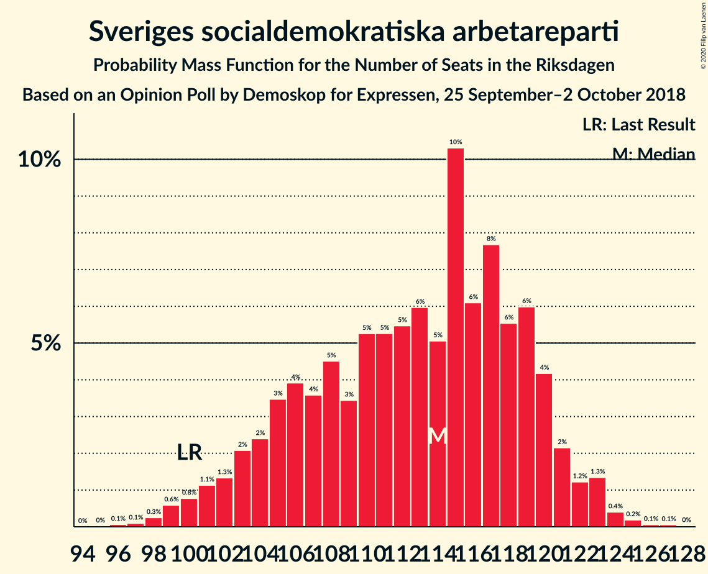
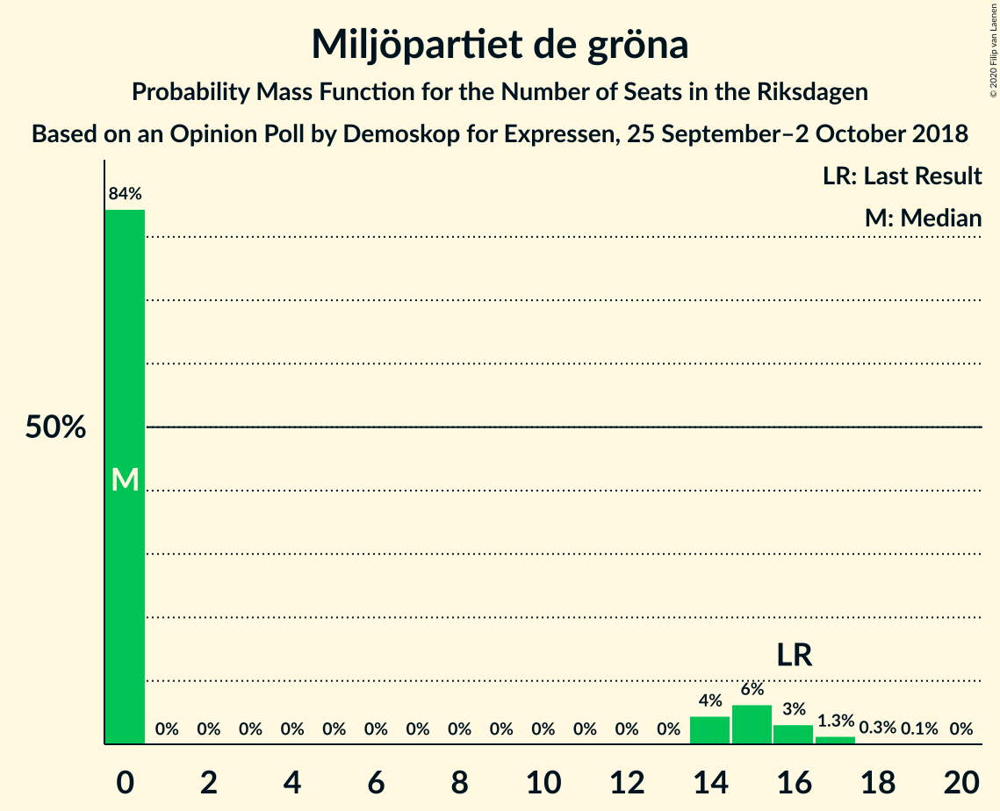
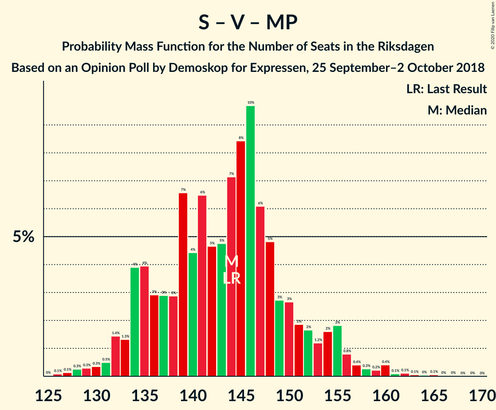

# Opinion Poll by Demoskop for Expressen, 25 September–2 October 2018

<a href="#voting-intentions">Voting Intentions</a> | <a href="#seats">Seats</a> | <a href="#coalitions">Coalitions</a> | <a href="#technical-information">Technical Information</a>

## Voting Intentions

### Confidence Intervals

| Party | Last Result | Poll Result | 80% Confidence Interval | 90% Confidence Interval | 95% Confidence Interval | 99% Confidence Interval |
|:-----:|:-----------:|:-----------:|:-----------------------:|:-----------------------:|:-----------------------:|:-----------------------:|
| Sveriges socialdemokratiska arbetareparti | 28.3% | 30.6% | 29.1–32.1% |28.7–32.5% |28.4–32.9% |27.7–33.6% |
| Moderata samlingspartiet | 19.8% | 18.8% | 17.6–20.1% |17.3–20.5% |17.0–20.8% |16.4–21.4% |
| Sverigedemokraterna | 17.5% | 18.0% | 16.8–19.3% |16.5–19.6% |16.2–20.0% |15.7–20.6% |
| Centerpartiet | 8.6% | 8.7% | 7.9–9.7% |7.6–10.0% |7.4–10.2% |7.1–10.7% |
| Vänsterpartiet | 8.0% | 7.7% | 6.9–8.6% |6.7–8.9% |6.5–9.1% |6.1–9.5% |
| Kristdemokraterna | 6.3% | 6.1% | 5.4–7.0% |5.2–7.2% |5.0–7.4% |4.7–7.8% |
| Liberalerna | 5.5% | 4.8% | 4.2–5.6% |4.0–5.8% |3.9–6.0% |3.6–6.4% |
| Miljöpartiet de gröna | 4.4% | 3.5% | 3.0–4.2% |2.9–4.4% |2.7–4.6% |2.5–4.9% |

*Note:* The poll result column reflects the actual value used in the calculations. Published results may vary slightly, and in addition be rounded to fewer digits.

## Seats

### Confidence Intervals

| Party | Last Result | Median | 80% Confidence Interval | 90% Confidence Interval | 95% Confidence Interval | 99% Confidence Interval |
|:-----:|:-----------:|:------:|:-----------------------:|:-----------------------:|:-----------------------:|:-----------------------:|
| <a href="#sveriges-socialdemokratiska-arbetareparti">Sveriges socialdemokratiska arbetareparti</a> | 100 | 114 | 105–119 |103–121 |101–122 |99–124 |
| <a href="#moderata-samlingspartiet">Moderata samlingspartiet</a> | 70 | 68 | 63–73 |62–75 |61–77 |59–79 |
| <a href="#sverigedemokraterna">Sverigedemokraterna</a> | 62 | 66 | 61–71 |59–72 |59–74 |57–76 |
| <a href="#centerpartiet">Centerpartiet</a> | 31 | 32 | 29–36 |28–37 |27–38 |26–39 |
| <a href="#vänsterpartiet">Vänsterpartiet</a> | 28 | 28 | 25–31 |24–32 |24–33 |22–35 |
| <a href="#kristdemokraterna">Kristdemokraterna</a> | 22 | 22 | 20–26 |19–26 |18–27 |17–29 |
| <a href="#liberalerna">Liberalerna</a> | 20 | 17 | 15–21 |0–22 |0–22 |0–24 |
| <a href="#miljöpartiet-de-gröna">Miljöpartiet de gröna</a> | 16 | 0 | 0–15 |0–15 |0–16 |0–17 |

### Sveriges socialdemokratiska arbetareparti

*For a full overview of the results for this party, see the [Sveriges socialdemokratiska arbetareparti](party-sverigessocialdemokratiskaarbetareparti.html) page.*

| Number of Seats | Probability | Accumulated | Special Marks |
|:---------------:|:-----------:|:-----------:|:-------------:|
| 96 | 0.1% | 100% |  |
| 97 | 0.1% | 99.9% |  |
| 98 | 0.3% | 99.8% |  |
| 99 | 0.6% | 99.6% |  |
| 100 | 0.8% | 99.0% | Last Result |
| 101 | 1.1% | 98% |  |
| 102 | 1.3% | 97% |  |
| 103 | 2% | 96% |  |
| 104 | 2% | 94% |  |
| 105 | 3% | 91% |  |
| 106 | 4% | 88% |  |
| 107 | 4% | 84% |  |
| 108 | 5% | 80% |  |
| 109 | 3% | 76% |  |
| 110 | 5% | 72% |  |
| 111 | 5% | 67% |  |
| 112 | 5% | 62% |  |
| 113 | 6% | 56% |  |
| 114 | 5% | 50% | Median |
| 115 | 10% | 45% |  |
| 116 | 6% | 35% |  |
| 117 | 8% | 29% |  |
| 118 | 6% | 21% |  |
| 119 | 6% | 16% |  |
| 120 | 4% | 10% |  |
| 121 | 2% | 5% |  |
| 122 | 1.2% | 3% |  |
| 123 | 1.3% | 2% |  |
| 124 | 0.4% | 0.8% |  |
| 125 | 0.2% | 0.3% |  |
| 126 | 0.1% | 0.2% |  |
| 127 | 0.1% | 0.1% |  |
| 128 | 0% | 0% |  |

### Moderata samlingspartiet

*For a full overview of the results for this party, see the [Moderata samlingspartiet](party-moderatasamlingspartiet.html) page.*

| Number of Seats | Probability | Accumulated | Special Marks |
|:---------------:|:-----------:|:-----------:|:-------------:|
| 56 | 0% | 100% |  |
| 57 | 0.1% | 99.9% |  |
| 58 | 0.3% | 99.8% |  |
| 59 | 0.5% | 99.5% |  |
| 60 | 0.8% | 99.1% |  |
| 61 | 1.4% | 98% |  |
| 62 | 3% | 97% |  |
| 63 | 4% | 94% |  |
| 64 | 7% | 90% |  |
| 65 | 8% | 83% |  |
| 66 | 8% | 74% |  |
| 67 | 8% | 67% |  |
| 68 | 10% | 59% | Median |
| 69 | 9% | 49% |  |
| 70 | 9% | 39% | Last Result |
| 71 | 11% | 31% |  |
| 72 | 5% | 20% |  |
| 73 | 6% | 15% |  |
| 74 | 3% | 9% |  |
| 75 | 2% | 6% |  |
| 76 | 1.2% | 4% |  |
| 77 | 1.3% | 3% |  |
| 78 | 0.8% | 2% |  |
| 79 | 0.4% | 0.8% |  |
| 80 | 0.2% | 0.4% |  |
| 81 | 0.1% | 0.1% |  |
| 82 | 0% | 0.1% |  |
| 83 | 0% | 0% |  |

### Sverigedemokraterna

*For a full overview of the results for this party, see the [Sverigedemokraterna](party-sverigedemokraterna.html) page.*

| Number of Seats | Probability | Accumulated | Special Marks |
|:---------------:|:-----------:|:-----------:|:-------------:|
| 54 | 0.1% | 100% |  |
| 55 | 0.1% | 99.9% |  |
| 56 | 0.3% | 99.8% |  |
| 57 | 0.6% | 99.5% |  |
| 58 | 1.1% | 98.9% |  |
| 59 | 3% | 98% |  |
| 60 | 3% | 95% |  |
| 61 | 5% | 92% |  |
| 62 | 7% | 87% | Last Result |
| 63 | 7% | 80% |  |
| 64 | 9% | 73% |  |
| 65 | 9% | 64% |  |
| 66 | 12% | 54% | Median |
| 67 | 11% | 43% |  |
| 68 | 8% | 32% |  |
| 69 | 8% | 24% |  |
| 70 | 5% | 16% |  |
| 71 | 3% | 10% |  |
| 72 | 3% | 7% |  |
| 73 | 2% | 4% |  |
| 74 | 1.1% | 3% |  |
| 75 | 0.8% | 1.5% |  |
| 76 | 0.4% | 0.7% |  |
| 77 | 0.2% | 0.3% |  |
| 78 | 0.1% | 0.2% |  |
| 79 | 0.1% | 0.1% |  |
| 80 | 0% | 0% |  |

### Centerpartiet

*For a full overview of the results for this party, see the [Centerpartiet](party-centerpartiet.html) page.*

| Number of Seats | Probability | Accumulated | Special Marks |
|:---------------:|:-----------:|:-----------:|:-------------:|
| 24 | 0.1% | 100% |  |
| 25 | 0.4% | 99.9% |  |
| 26 | 1.3% | 99.5% |  |
| 27 | 2% | 98% |  |
| 28 | 3% | 96% |  |
| 29 | 5% | 93% |  |
| 30 | 9% | 88% |  |
| 31 | 16% | 78% | Last Result |
| 32 | 13% | 62% | Median |
| 33 | 14% | 49% |  |
| 34 | 10% | 35% |  |
| 35 | 8% | 25% |  |
| 36 | 8% | 17% |  |
| 37 | 5% | 10% |  |
| 38 | 3% | 4% |  |
| 39 | 0.8% | 1.3% |  |
| 40 | 0.3% | 0.4% |  |
| 41 | 0.1% | 0.2% |  |
| 42 | 0.1% | 0.1% |  |
| 43 | 0% | 0% |  |

### Vänsterpartiet

*For a full overview of the results for this party, see the [Vänsterpartiet](party-vänsterpartiet.html) page.*

| Number of Seats | Probability | Accumulated | Special Marks |
|:---------------:|:-----------:|:-----------:|:-------------:|
| 21 | 0.1% | 100% |  |
| 22 | 0.5% | 99.8% |  |
| 23 | 2% | 99.3% |  |
| 24 | 4% | 98% |  |
| 25 | 9% | 94% |  |
| 26 | 12% | 85% |  |
| 27 | 13% | 72% |  |
| 28 | 15% | 60% | Last Result, Median |
| 29 | 16% | 44% |  |
| 30 | 12% | 29% |  |
| 31 | 8% | 17% |  |
| 32 | 4% | 9% |  |
| 33 | 2% | 5% |  |
| 34 | 1.3% | 2% |  |
| 35 | 0.7% | 1.0% |  |
| 36 | 0.2% | 0.3% |  |
| 37 | 0.1% | 0.1% |  |
| 38 | 0% | 0% |  |

### Kristdemokraterna

*For a full overview of the results for this party, see the [Kristdemokraterna](party-kristdemokraterna.html) page.*

| Number of Seats | Probability | Accumulated | Special Marks |
|:---------------:|:-----------:|:-----------:|:-------------:|
| 16 | 0.2% | 100% |  |
| 17 | 0.8% | 99.8% |  |
| 18 | 3% | 99.0% |  |
| 19 | 6% | 96% |  |
| 20 | 10% | 90% |  |
| 21 | 16% | 80% |  |
| 22 | 18% | 64% | Last Result, Median |
| 23 | 13% | 46% |  |
| 24 | 15% | 33% |  |
| 25 | 8% | 18% |  |
| 26 | 6% | 10% |  |
| 27 | 3% | 4% |  |
| 28 | 1.3% | 2% |  |
| 29 | 0.4% | 0.6% |  |
| 30 | 0.2% | 0.2% |  |
| 31 | 0.1% | 0.1% |  |
| 32 | 0% | 0% |  |

### Liberalerna

*For a full overview of the results for this party, see the [Liberalerna](party-liberalerna.html) page.*

| Number of Seats | Probability | Accumulated | Special Marks |
|:---------------:|:-----------:|:-----------:|:-------------:|
| 0 | 7% | 100% |  |
| 1 | 0% | 93% |  |
| 2 | 0% | 93% |  |
| 3 | 0% | 93% |  |
| 4 | 0% | 93% |  |
| 5 | 0% | 93% |  |
| 6 | 0% | 93% |  |
| 7 | 0% | 93% |  |
| 8 | 0% | 93% |  |
| 9 | 0% | 93% |  |
| 10 | 0% | 93% |  |
| 11 | 0% | 93% |  |
| 12 | 0% | 93% |  |
| 13 | 0% | 93% |  |
| 14 | 0.8% | 93% |  |
| 15 | 13% | 92% |  |
| 16 | 16% | 80% |  |
| 17 | 21% | 64% | Median |
| 18 | 14% | 43% |  |
| 19 | 10% | 29% |  |
| 20 | 8% | 19% | Last Result |
| 21 | 5% | 11% |  |
| 22 | 3% | 5% |  |
| 23 | 2% | 2% |  |
| 24 | 0.5% | 0.6% |  |
| 25 | 0.1% | 0.2% |  |
| 26 | 0% | 0% |  |

### Miljöpartiet de gröna

*For a full overview of the results for this party, see the [Miljöpartiet de gröna](party-miljöpartietdegröna.html) page.*

| Number of Seats | Probability | Accumulated | Special Marks |
|:---------------:|:-----------:|:-----------:|:-------------:|
| 0 | 84% | 100% | Median |
| 1 | 0% | 16% |  |
| 2 | 0% | 16% |  |
| 3 | 0% | 16% |  |
| 4 | 0% | 16% |  |
| 5 | 0% | 16% |  |
| 6 | 0% | 16% |  |
| 7 | 0% | 16% |  |
| 8 | 0% | 16% |  |
| 9 | 0% | 16% |  |
| 10 | 0% | 16% |  |
| 11 | 0% | 16% |  |
| 12 | 0% | 16% |  |
| 13 | 0% | 16% |  |
| 14 | 4% | 16% |  |
| 15 | 6% | 11% |  |
| 16 | 3% | 5% | Last Result |
| 17 | 1.3% | 2% |  |
| 18 | 0.3% | 0.3% |  |
| 19 | 0.1% | 0.1% |  |
| 20 | 0% | 0% |  |

## Coalitions

### Confidence Intervals

| Coalition | Last Result | Median | Majority? | 80% Confidence Interval | 90% Confidence Interval | 95% Confidence Interval | 99% Confidence Interval |
|:---------:|:-----------:|:------:|:---------:|:-----------------------:|:-----------------------:|:-----------------------:|:-----------------------:|
| Sveriges socialdemokratiska arbetareparti – Moderata samlingspartiet – Centerpartiet | 201 | 214 | 100% | 205–221 | 202–224 | 199–226 | 196–231 |
| Sveriges socialdemokratiska arbetareparti – Moderata samlingspartiet | 170 | 181 | 87% | 173–189 | 171–191 | 169–193 | 166–198 |
| Moderata samlingspartiet – Sverigedemokraterna – Kristdemokraterna | 154 | 156 | 0.1% | 150–164 | 147–167 | 145–169 | 142–171 |
| Sveriges socialdemokratiska arbetareparti – Vänsterpartiet – Miljöpartiet de gröna | 144 | 144 | 0% | 135–151 | 134–154 | 132–155 | 128–160 |
| Sveriges socialdemokratiska arbetareparti – Vänsterpartiet | 128 | 141 | 0% | 133–148 | 130–150 | 128–151 | 126–154 |
| Moderata samlingspartiet – Centerpartiet – Kristdemokraterna – Liberalerna | 143 | 140 | 0% | 132–148 | 129–150 | 127–151 | 123–153 |
| Moderata samlingspartiet – Sverigedemokraterna | 132 | 134 | 0% | 127–141 | 125–143 | 124–145 | 121–148 |
| Moderata samlingspartiet – Centerpartiet – Kristdemokraterna | 123 | 124 | 0% | 116–130 | 115–131 | 114–133 | 110–137 |
| Moderata samlingspartiet – Centerpartiet – Liberalerna | 121 | 118 | 0% | 110–124 | 107–126 | 104–128 | 99–131 |
| Sveriges socialdemokratiska arbetareparti – Miljöpartiet de gröna | 116 | 115 | 0% | 107–123 | 105–125 | 104–128 | 101–132 |
| Moderata samlingspartiet – Centerpartiet | 101 | 101 | 0% | 95–107 | 94–108 | 92–110 | 89–113 |

### Sveriges socialdemokratiska arbetareparti – Moderata samlingspartiet – Centerpartiet

| Number of Seats | Probability | Accumulated | Special Marks |
|:---------------:|:-----------:|:-----------:|:-------------:|
| 192 | 0% | 100% |  |
| 193 | 0% | 99.9% |  |
| 194 | 0.1% | 99.9% |  |
| 195 | 0.2% | 99.8% |  |
| 196 | 0.2% | 99.6% |  |
| 197 | 0.3% | 99.4% |  |
| 198 | 0.5% | 99.1% |  |
| 199 | 1.1% | 98.6% |  |
| 200 | 0.6% | 97% |  |
| 201 | 0.7% | 97% | Last Result |
| 202 | 2% | 96% |  |
| 203 | 2% | 94% |  |
| 204 | 2% | 93% |  |
| 205 | 2% | 91% |  |
| 206 | 3% | 89% |  |
| 207 | 3% | 86% |  |
| 208 | 5% | 83% |  |
| 209 | 5% | 79% |  |
| 210 | 3% | 74% |  |
| 211 | 6% | 71% |  |
| 212 | 5% | 66% |  |
| 213 | 7% | 61% |  |
| 214 | 6% | 54% | Median |
| 215 | 5% | 48% |  |
| 216 | 6% | 43% |  |
| 217 | 9% | 37% |  |
| 218 | 6% | 28% |  |
| 219 | 4% | 22% |  |
| 220 | 5% | 18% |  |
| 221 | 3% | 13% |  |
| 222 | 2% | 10% |  |
| 223 | 3% | 8% |  |
| 224 | 1.0% | 5% |  |
| 225 | 2% | 4% |  |
| 226 | 0.3% | 3% |  |
| 227 | 0.4% | 2% |  |
| 228 | 0.7% | 2% |  |
| 229 | 0.1% | 1.2% |  |
| 230 | 0.2% | 1.0% |  |
| 231 | 0.4% | 0.8% |  |
| 232 | 0.1% | 0.5% |  |
| 233 | 0.2% | 0.4% |  |
| 234 | 0.2% | 0.2% |  |
| 235 | 0% | 0.1% |  |
| 236 | 0% | 0.1% |  |
| 237 | 0% | 0% |  |

### Sveriges socialdemokratiska arbetareparti – Moderata samlingspartiet

| Number of Seats | Probability | Accumulated | Special Marks |
|:---------------:|:-----------:|:-----------:|:-------------:|
| 162 | 0% | 100% |  |
| 163 | 0.1% | 99.9% |  |
| 164 | 0.1% | 99.8% |  |
| 165 | 0.2% | 99.7% |  |
| 166 | 0.4% | 99.5% |  |
| 167 | 0.4% | 99.2% |  |
| 168 | 1.1% | 98.8% |  |
| 169 | 0.7% | 98% |  |
| 170 | 1.3% | 97% | Last Result |
| 171 | 2% | 96% |  |
| 172 | 2% | 93% |  |
| 173 | 2% | 91% |  |
| 174 | 3% | 90% |  |
| 175 | 5% | 87% | Majority |
| 176 | 4% | 82% |  |
| 177 | 4% | 78% |  |
| 178 | 5% | 73% |  |
| 179 | 7% | 68% |  |
| 180 | 7% | 61% |  |
| 181 | 6% | 55% |  |
| 182 | 6% | 49% | Median |
| 183 | 6% | 43% |  |
| 184 | 8% | 36% |  |
| 185 | 5% | 29% |  |
| 186 | 4% | 23% |  |
| 187 | 5% | 19% |  |
| 188 | 4% | 15% |  |
| 189 | 2% | 10% |  |
| 190 | 2% | 8% |  |
| 191 | 1.4% | 6% |  |
| 192 | 1.3% | 4% |  |
| 193 | 0.7% | 3% |  |
| 194 | 0.8% | 2% |  |
| 195 | 0.3% | 1.3% |  |
| 196 | 0.2% | 1.1% |  |
| 197 | 0.1% | 0.9% |  |
| 198 | 0.3% | 0.8% |  |
| 199 | 0.2% | 0.5% |  |
| 200 | 0.1% | 0.3% |  |
| 201 | 0% | 0.2% |  |
| 202 | 0.1% | 0.1% |  |
| 203 | 0.1% | 0.1% |  |
| 204 | 0% | 0% |  |

### Moderata samlingspartiet – Sverigedemokraterna – Kristdemokraterna

| Number of Seats | Probability | Accumulated | Special Marks |
|:---------------:|:-----------:|:-----------:|:-------------:|
| 139 | 0% | 100% |  |
| 140 | 0% | 99.9% |  |
| 141 | 0.2% | 99.9% |  |
| 142 | 0.3% | 99.7% |  |
| 143 | 0.2% | 99.4% |  |
| 144 | 0.4% | 99.2% |  |
| 145 | 2% | 98.7% |  |
| 146 | 1.1% | 97% |  |
| 147 | 1.2% | 96% |  |
| 148 | 2% | 95% |  |
| 149 | 3% | 93% |  |
| 150 | 4% | 91% |  |
| 151 | 5% | 87% |  |
| 152 | 5% | 82% |  |
| 153 | 4% | 77% |  |
| 154 | 8% | 73% | Last Result |
| 155 | 7% | 64% |  |
| 156 | 8% | 57% | Median |
| 157 | 8% | 49% |  |
| 158 | 6% | 41% |  |
| 159 | 8% | 35% |  |
| 160 | 4% | 27% |  |
| 161 | 3% | 23% |  |
| 162 | 4% | 19% |  |
| 163 | 3% | 15% |  |
| 164 | 3% | 12% |  |
| 165 | 2% | 10% |  |
| 166 | 2% | 8% |  |
| 167 | 2% | 6% |  |
| 168 | 1.0% | 4% |  |
| 169 | 0.9% | 3% |  |
| 170 | 1.0% | 2% |  |
| 171 | 0.3% | 0.8% |  |
| 172 | 0.3% | 0.5% |  |
| 173 | 0.1% | 0.2% |  |
| 174 | 0.1% | 0.1% |  |
| 175 | 0% | 0.1% | Majority |
| 176 | 0% | 0% |  |

### Sveriges socialdemokratiska arbetareparti – Vänsterpartiet – Miljöpartiet de gröna

| Number of Seats | Probability | Accumulated | Special Marks |
|:---------------:|:-----------:|:-----------:|:-------------:|
| 126 | 0.1% | 100% |  |
| 127 | 0.1% | 99.9% |  |
| 128 | 0.3% | 99.8% |  |
| 129 | 0.3% | 99.5% |  |
| 130 | 0.3% | 99.2% |  |
| 131 | 0.5% | 98.9% |  |
| 132 | 1.4% | 98% |  |
| 133 | 1.3% | 97% |  |
| 134 | 4% | 96% |  |
| 135 | 4% | 92% |  |
| 136 | 3% | 88% |  |
| 137 | 3% | 85% |  |
| 138 | 3% | 82% |  |
| 139 | 7% | 79% |  |
| 140 | 4% | 72% |  |
| 141 | 6% | 68% |  |
| 142 | 5% | 62% | Median |
| 143 | 5% | 57% |  |
| 144 | 7% | 52% | Last Result |
| 145 | 8% | 45% |  |
| 146 | 10% | 37% |  |
| 147 | 6% | 27% |  |
| 148 | 5% | 21% |  |
| 149 | 3% | 16% |  |
| 150 | 3% | 13% |  |
| 151 | 2% | 11% |  |
| 152 | 2% | 9% |  |
| 153 | 1.2% | 7% |  |
| 154 | 2% | 6% |  |
| 155 | 2% | 4% |  |
| 156 | 0.8% | 2% |  |
| 157 | 0.4% | 2% |  |
| 158 | 0.3% | 1.3% |  |
| 159 | 0.2% | 1.0% |  |
| 160 | 0.4% | 0.8% |  |
| 161 | 0.1% | 0.4% |  |
| 162 | 0.1% | 0.3% |  |
| 163 | 0.1% | 0.2% |  |
| 164 | 0% | 0.1% |  |
| 165 | 0.1% | 0.1% |  |
| 166 | 0% | 0% |  |

### Sveriges socialdemokratiska arbetareparti – Vänsterpartiet

| Number of Seats | Probability | Accumulated | Special Marks |
|:---------------:|:-----------:|:-----------:|:-------------:|
| 122 | 0% | 100% |  |
| 123 | 0% | 99.9% |  |
| 124 | 0.1% | 99.9% |  |
| 125 | 0.3% | 99.8% |  |
| 126 | 0.5% | 99.6% |  |
| 127 | 1.2% | 99.1% |  |
| 128 | 1.2% | 98% | Last Result |
| 129 | 1.3% | 97% |  |
| 130 | 0.8% | 95% |  |
| 131 | 0.9% | 95% |  |
| 132 | 3% | 94% |  |
| 133 | 2% | 91% |  |
| 134 | 5% | 89% |  |
| 135 | 5% | 84% |  |
| 136 | 4% | 79% |  |
| 137 | 4% | 76% |  |
| 138 | 4% | 72% |  |
| 139 | 8% | 69% |  |
| 140 | 5% | 61% |  |
| 141 | 8% | 56% |  |
| 142 | 4% | 48% | Median |
| 143 | 4% | 44% |  |
| 144 | 6% | 40% |  |
| 145 | 8% | 33% |  |
| 146 | 9% | 25% |  |
| 147 | 6% | 17% |  |
| 148 | 4% | 11% |  |
| 149 | 2% | 7% |  |
| 150 | 2% | 5% |  |
| 151 | 0.9% | 3% |  |
| 152 | 1.3% | 2% |  |
| 153 | 0.4% | 1.0% |  |
| 154 | 0.3% | 0.7% |  |
| 155 | 0.1% | 0.4% |  |
| 156 | 0.1% | 0.3% |  |
| 157 | 0% | 0.2% |  |
| 158 | 0.1% | 0.1% |  |
| 159 | 0% | 0% |  |

### Moderata samlingspartiet – Centerpartiet – Kristdemokraterna – Liberalerna

| Number of Seats | Probability | Accumulated | Special Marks |
|:---------------:|:-----------:|:-----------:|:-------------:|
| 116 | 0.1% | 100% |  |
| 117 | 0% | 99.9% |  |
| 118 | 0% | 99.9% |  |
| 119 | 0.1% | 99.9% |  |
| 120 | 0.1% | 99.8% |  |
| 121 | 0.1% | 99.7% |  |
| 122 | 0.1% | 99.6% |  |
| 123 | 0.2% | 99.5% |  |
| 124 | 0.3% | 99.4% |  |
| 125 | 0.3% | 99.0% |  |
| 126 | 0.9% | 98.7% |  |
| 127 | 1.1% | 98% |  |
| 128 | 1.2% | 97% |  |
| 129 | 0.7% | 96% |  |
| 130 | 1.1% | 95% |  |
| 131 | 2% | 94% |  |
| 132 | 2% | 91% |  |
| 133 | 5% | 90% |  |
| 134 | 3% | 84% |  |
| 135 | 5% | 81% |  |
| 136 | 3% | 77% |  |
| 137 | 3% | 73% |  |
| 138 | 10% | 70% |  |
| 139 | 5% | 60% | Median |
| 140 | 7% | 55% |  |
| 141 | 7% | 48% |  |
| 142 | 7% | 41% |  |
| 143 | 7% | 34% | Last Result |
| 144 | 5% | 27% |  |
| 145 | 4% | 22% |  |
| 146 | 5% | 18% |  |
| 147 | 2% | 13% |  |
| 148 | 4% | 11% |  |
| 149 | 2% | 8% |  |
| 150 | 2% | 6% |  |
| 151 | 2% | 4% |  |
| 152 | 0.7% | 2% |  |
| 153 | 0.6% | 1.1% |  |
| 154 | 0.2% | 0.5% |  |
| 155 | 0.2% | 0.3% |  |
| 156 | 0.1% | 0.1% |  |
| 157 | 0% | 0.1% |  |
| 158 | 0% | 0% |  |

### Moderata samlingspartiet – Sverigedemokraterna

| Number of Seats | Probability | Accumulated | Special Marks |
|:---------------:|:-----------:|:-----------:|:-------------:|
| 118 | 0% | 100% |  |
| 119 | 0.1% | 99.9% |  |
| 120 | 0.2% | 99.8% |  |
| 121 | 0.3% | 99.6% |  |
| 122 | 0.3% | 99.3% |  |
| 123 | 0.5% | 99.0% |  |
| 124 | 1.1% | 98.6% |  |
| 125 | 3% | 97% |  |
| 126 | 3% | 94% |  |
| 127 | 2% | 92% |  |
| 128 | 2% | 90% |  |
| 129 | 3% | 87% |  |
| 130 | 9% | 85% |  |
| 131 | 6% | 76% |  |
| 132 | 10% | 70% | Last Result |
| 133 | 7% | 60% |  |
| 134 | 5% | 52% | Median |
| 135 | 5% | 47% |  |
| 136 | 8% | 42% |  |
| 137 | 8% | 34% |  |
| 138 | 8% | 26% |  |
| 139 | 4% | 18% |  |
| 140 | 3% | 14% |  |
| 141 | 3% | 11% |  |
| 142 | 2% | 8% |  |
| 143 | 1.4% | 6% |  |
| 144 | 1.0% | 5% |  |
| 145 | 2% | 4% |  |
| 146 | 0.9% | 2% |  |
| 147 | 0.6% | 1.2% |  |
| 148 | 0.1% | 0.6% |  |
| 149 | 0.1% | 0.5% |  |
| 150 | 0.1% | 0.3% |  |
| 151 | 0.1% | 0.2% |  |
| 152 | 0.1% | 0.1% |  |
| 153 | 0% | 0% |  |

### Moderata samlingspartiet – Centerpartiet – Kristdemokraterna

| Number of Seats | Probability | Accumulated | Special Marks |
|:---------------:|:-----------:|:-----------:|:-------------:|
| 107 | 0% | 100% |  |
| 108 | 0.1% | 99.9% |  |
| 109 | 0.1% | 99.8% |  |
| 110 | 0.2% | 99.6% |  |
| 111 | 0.4% | 99.5% |  |
| 112 | 0.6% | 99.0% |  |
| 113 | 0.8% | 98% |  |
| 114 | 1.0% | 98% |  |
| 115 | 2% | 97% |  |
| 116 | 5% | 95% |  |
| 117 | 3% | 90% |  |
| 118 | 6% | 86% |  |
| 119 | 3% | 81% |  |
| 120 | 5% | 78% |  |
| 121 | 7% | 73% |  |
| 122 | 7% | 66% | Median |
| 123 | 8% | 59% | Last Result |
| 124 | 9% | 51% |  |
| 125 | 8% | 41% |  |
| 126 | 7% | 33% |  |
| 127 | 5% | 26% |  |
| 128 | 5% | 21% |  |
| 129 | 5% | 17% |  |
| 130 | 4% | 11% |  |
| 131 | 2% | 7% |  |
| 132 | 1.1% | 5% |  |
| 133 | 1.2% | 4% |  |
| 134 | 0.8% | 2% |  |
| 135 | 0.7% | 2% |  |
| 136 | 0.3% | 0.9% |  |
| 137 | 0.2% | 0.6% |  |
| 138 | 0.2% | 0.5% |  |
| 139 | 0.1% | 0.3% |  |
| 140 | 0.1% | 0.2% |  |
| 141 | 0% | 0% |  |

### Moderata samlingspartiet – Centerpartiet – Liberalerna

| Number of Seats | Probability | Accumulated | Special Marks |
|:---------------:|:-----------:|:-----------:|:-------------:|
| 94 | 0% | 100% |  |
| 95 | 0% | 99.9% |  |
| 96 | 0% | 99.9% |  |
| 97 | 0.1% | 99.9% |  |
| 98 | 0.2% | 99.8% |  |
| 99 | 0.1% | 99.6% |  |
| 100 | 0.3% | 99.5% |  |
| 101 | 0.3% | 99.2% |  |
| 102 | 0.7% | 98.9% |  |
| 103 | 0.2% | 98% |  |
| 104 | 0.6% | 98% |  |
| 105 | 0.9% | 97% |  |
| 106 | 1.2% | 96% |  |
| 107 | 1.1% | 95% |  |
| 108 | 1.3% | 94% |  |
| 109 | 2% | 93% |  |
| 110 | 2% | 91% |  |
| 111 | 3% | 89% |  |
| 112 | 3% | 87% |  |
| 113 | 6% | 83% |  |
| 114 | 4% | 78% |  |
| 115 | 7% | 74% |  |
| 116 | 6% | 67% |  |
| 117 | 10% | 61% | Median |
| 118 | 5% | 50% |  |
| 119 | 10% | 46% |  |
| 120 | 7% | 36% |  |
| 121 | 4% | 29% | Last Result |
| 122 | 6% | 25% |  |
| 123 | 6% | 19% |  |
| 124 | 4% | 13% |  |
| 125 | 2% | 10% |  |
| 126 | 3% | 7% |  |
| 127 | 1.5% | 4% |  |
| 128 | 1.4% | 3% |  |
| 129 | 0.5% | 2% |  |
| 130 | 0.5% | 1.0% |  |
| 131 | 0.3% | 0.5% |  |
| 132 | 0.1% | 0.3% |  |
| 133 | 0.1% | 0.1% |  |
| 134 | 0% | 0.1% |  |
| 135 | 0% | 0% |  |

### Sveriges socialdemokratiska arbetareparti – Miljöpartiet de gröna

| Number of Seats | Probability | Accumulated | Special Marks |
|:---------------:|:-----------:|:-----------:|:-------------:|
| 99 | 0.1% | 100% |  |
| 100 | 0.2% | 99.9% |  |
| 101 | 0.4% | 99.7% |  |
| 102 | 0.7% | 99.3% |  |
| 103 | 0.9% | 98.6% |  |
| 104 | 2% | 98% |  |
| 105 | 3% | 96% |  |
| 106 | 3% | 93% |  |
| 107 | 2% | 90% |  |
| 108 | 4% | 88% |  |
| 109 | 2% | 84% |  |
| 110 | 4% | 82% |  |
| 111 | 5% | 78% |  |
| 112 | 4% | 73% |  |
| 113 | 6% | 70% |  |
| 114 | 5% | 64% | Median |
| 115 | 11% | 59% |  |
| 116 | 6% | 48% | Last Result |
| 117 | 8% | 42% |  |
| 118 | 7% | 34% |  |
| 119 | 6% | 27% |  |
| 120 | 5% | 21% |  |
| 121 | 4% | 16% |  |
| 122 | 2% | 12% |  |
| 123 | 3% | 10% |  |
| 124 | 0.8% | 7% |  |
| 125 | 1.4% | 6% |  |
| 126 | 1.4% | 5% |  |
| 127 | 1.0% | 4% |  |
| 128 | 0.5% | 3% |  |
| 129 | 0.5% | 2% |  |
| 130 | 0.5% | 2% |  |
| 131 | 0.3% | 1.0% |  |
| 132 | 0.3% | 0.8% |  |
| 133 | 0.1% | 0.5% |  |
| 134 | 0.1% | 0.3% |  |
| 135 | 0.1% | 0.2% |  |
| 136 | 0% | 0.1% |  |
| 137 | 0% | 0.1% |  |
| 138 | 0% | 0% |  |

### Moderata samlingspartiet – Centerpartiet

| Number of Seats | Probability | Accumulated | Special Marks |
|:---------------:|:-----------:|:-----------:|:-------------:|
| 86 | 0% | 100% |  |
| 87 | 0.1% | 99.9% |  |
| 88 | 0.2% | 99.9% |  |
| 89 | 0.3% | 99.7% |  |
| 90 | 0.4% | 99.4% |  |
| 91 | 0.8% | 99.0% |  |
| 92 | 1.1% | 98% |  |
| 93 | 2% | 97% |  |
| 94 | 2% | 95% |  |
| 95 | 4% | 93% |  |
| 96 | 7% | 89% |  |
| 97 | 5% | 82% |  |
| 98 | 7% | 77% |  |
| 99 | 8% | 70% |  |
| 100 | 8% | 62% | Median |
| 101 | 7% | 55% | Last Result |
| 102 | 12% | 47% |  |
| 103 | 7% | 35% |  |
| 104 | 6% | 28% |  |
| 105 | 6% | 22% |  |
| 106 | 5% | 16% |  |
| 107 | 4% | 11% |  |
| 108 | 3% | 8% |  |
| 109 | 1.3% | 4% |  |
| 110 | 1.2% | 3% |  |
| 111 | 0.6% | 2% |  |
| 112 | 0.5% | 1.1% |  |
| 113 | 0.3% | 0.7% |  |
| 114 | 0.1% | 0.4% |  |
| 115 | 0.1% | 0.3% |  |
| 116 | 0.1% | 0.1% |  |
| 117 | 0.1% | 0.1% |  |
| 118 | 0% | 0% |  |

## Technical Information

### Opinion Poll

+ **Polling firm:** Demoskop
+ **Commissioner(s):** Expressen
+ **Fieldwork period:** 25 September–2 October 2018

### Calculations

+ **Sample size:** 1616
+ **Simulations done:** 1,048,576
+ **Error estimate:** 1.36%

