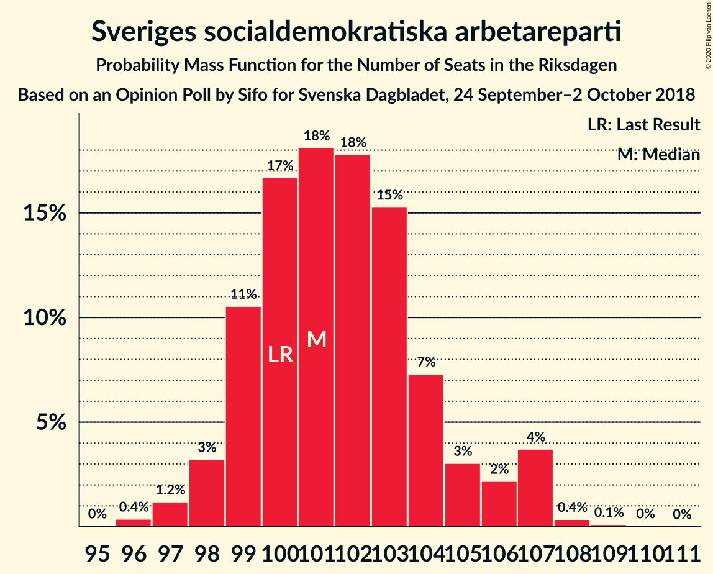
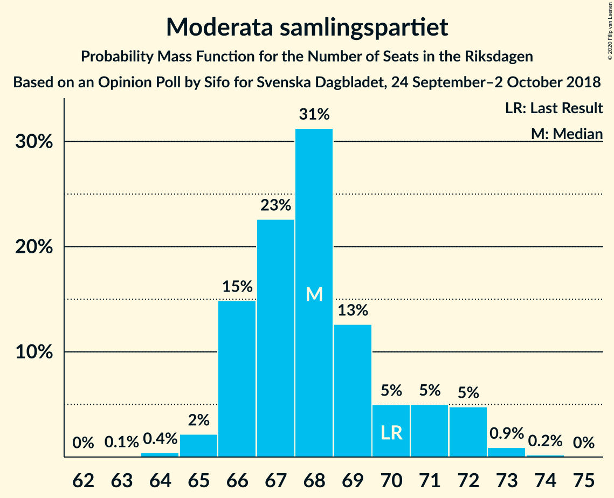

# Opinion Poll by Sifo for Svenska Dagbladet, 24 September–2 October 2018

<a href="#voting-intentions">Voting Intentions</a> | <a href="#seats">Seats</a> | <a href="#coalitions">Coalitions</a> | <a href="#technical-information">Technical Information</a>

## Voting Intentions

### Confidence Intervals

| Party | Last Result | Poll Result | 80% Confidence Interval | 90% Confidence Interval | 95% Confidence Interval | 99% Confidence Interval |
|:-----:|:-----------:|:-----------:|:-----------------------:|:-----------------------:|:-----------------------:|:-----------------------:|
| Sveriges socialdemokratiska arbetareparti | 28.3% | 28.5% | 27.9–29.2% |27.7–29.4% |27.5–29.5% |27.3–29.8% |
| Moderata samlingspartiet | 19.8% | 19.2% | 18.7–19.8% |18.5–20.0% |18.4–20.1% |18.1–20.4% |
| Sverigedemokraterna | 17.5% | 18.3% | 17.8–18.9% |17.6–19.0% |17.5–19.2% |17.2–19.4% |
| Centerpartiet | 8.6% | 8.8% | 8.4–9.2% |8.3–9.3% |8.2–9.4% |8.0–9.6% |
| Vänsterpartiet | 8.0% | 7.8% | 7.4–8.2% |7.3–8.3% |7.2–8.4% |7.1–8.6% |
| Kristdemokraterna | 6.3% | 6.4% | 6.1–6.8% |6.0–6.9% |5.9–7.0% |5.7–7.1% |
| Liberalerna | 5.5% | 5.3% | 5.0–5.6% |4.9–5.7% |4.8–5.8% |4.7–6.0% |
| Miljöpartiet de gröna | 4.4% | 4.3% | 4.0–4.6% |3.9–4.7% |3.9–4.8% |3.7–4.9% |

*Note:* The poll result column reflects the actual value used in the calculations. Published results may vary slightly, and in addition be rounded to fewer digits.

## Seats

### Confidence Intervals

| Party | Last Result | Median | 80% Confidence Interval | 90% Confidence Interval | 95% Confidence Interval | 99% Confidence Interval |
|:-----:|:-----------:|:------:|:-----------------------:|:-----------------------:|:-----------------------:|:-----------------------:|
| <a href="#sveriges-socialdemokratiska-arbetareparti">Sveriges socialdemokratiska arbetareparti</a> | 100 | 106 | 106 |106 |106 |106 |
| <a href="#moderata-samlingspartiet">Moderata samlingspartiet</a> | 70 | 69 | 69 |69 |69 |69 |
| <a href="#sverigedemokraterna">Sverigedemokraterna</a> | 62 | 66 | 66 |66 |66 |66 |
| <a href="#centerpartiet">Centerpartiet</a> | 31 | N/A | 35 |35 |35 |35 |
| <a href="#vänsterpartiet">Vänsterpartiet</a> | 28 | N/A | 29 |29 |29 |29 |
| <a href="#kristdemokraterna">Kristdemokraterna</a> | 22 | N/A | 26 |26 |26 |26 |
| <a href="#liberalerna">Liberalerna</a> | 20 | N/A | 18 |18 |18 |18 |
| <a href="#miljöpartiet-de-gröna">Miljöpartiet de gröna</a> | 16 | N/A | 0 |0 |0 |0 |

### Sveriges socialdemokratiska arbetareparti

*For a full overview of the results for this party, see the [Sveriges socialdemokratiska arbetareparti](party-sverigessocialdemokratiskaarbetareparti.html) page.*

| Number of Seats | Probability | Accumulated | Special Marks |
|:---------------:|:-----------:|:-----------:|:-------------:|
| 100 | 0% | 100% | Last Result |
| 101 | 0% | 100% |  |
| 102 | 0% | 100% |  |
| 103 | 0% | 100% |  |
| 104 | 0% | 100% |  |
| 105 | 0% | 100% |  |
| 106 | 100% | 100% | Median |

### Moderata samlingspartiet

*For a full overview of the results for this party, see the [Moderata samlingspartiet](party-moderatasamlingspartiet.html) page.*

| Number of Seats | Probability | Accumulated | Special Marks |
|:---------------:|:-----------:|:-----------:|:-------------:|
| 69 | 100% | 100% | Median |
| 70 | 0% | 0% | Last Result |

### Sverigedemokraterna

*For a full overview of the results for this party, see the [Sverigedemokraterna](party-sverigedemokraterna.html) page.*

| Number of Seats | Probability | Accumulated | Special Marks |
|:---------------:|:-----------:|:-----------:|:-------------:|
| 62 | 0% | 100% | Last Result |
| 63 | 0% | 100% |  |
| 64 | 0% | 100% |  |
| 65 | 0% | 100% |  |
| 66 | 100% | 100% | Median |

## Coalitions

### Confidence Intervals

| Coalition | Last Result | Median | Majority? | 80% Confidence Interval | 90% Confidence Interval | 95% Confidence Interval | 99% Confidence Interval |
|:---------:|:-----------:|:------:|:---------:|:-----------------------:|:-----------------------:|:-----------------------:|:-----------------------:|
| Sveriges socialdemokratiska arbetareparti – Moderata samlingspartiet – Centerpartiet | 201 | 213 | 100% | 213 | 213 | 213 | 213 |
| Sveriges socialdemokratiska arbetareparti – Moderata samlingspartiet | 170 | 179 | 100% | 179 | 179 | 179 | 179 |
| Moderata samlingspartiet – Sverigedemokraterna – Kristdemokraterna | 154 | 162 | 0% | 162 | 162 | 162 | 162 |
| Moderata samlingspartiet – Centerpartiet – Kristdemokraterna – Liberalerna | 143 | 145 | 0% | 145 | 145 | 145 | 145 |
| Moderata samlingspartiet – Sverigedemokraterna | 132 | 140 | 0% | 140 | 140 | 140 | 140 |
| Sveriges socialdemokratiska arbetareparti – Vänsterpartiet – Miljöpartiet de gröna | 144 | 136 | 0% | 136 | 136 | 136 | 136 |
| Sveriges socialdemokratiska arbetareparti – Vänsterpartiet | 128 | 136 | 0% | 136 | 136 | 136 | 136 |
| Moderata samlingspartiet – Centerpartiet – Kristdemokraterna | 123 | 128 | 0% | 128 | 128 | 128 | 128 |
| Moderata samlingspartiet – Centerpartiet – Liberalerna | 121 | 123 | 0% | 123 | 123 | 123 | 123 |
| Sveriges socialdemokratiska arbetareparti – Miljöpartiet de gröna | 116 | 107 | 0% | 107 | 107 | 107 | 107 |
| Moderata samlingspartiet – Centerpartiet | 101 | 106 | 0% | 106 | 106 | 106 | 106 |

### Sveriges socialdemokratiska arbetareparti – Moderata samlingspartiet – Centerpartiet

| Number of Seats | Probability | Accumulated | Special Marks |
|:---------------:|:-----------:|:-----------:|:-------------:|
| 201 | 0% | 100% | Last Result |
| 202 | 0% | 100% |  |
| 203 | 0% | 100% |  |
| 204 | 0% | 100% |  |
| 205 | 0% | 100% |  |
| 206 | 0% | 100% |  |
| 207 | 0% | 100% |  |
| 208 | 0% | 100% |  |
| 209 | 0% | 100% |  |
| 210 | 0% | 100% |  |
| 211 | 0% | 100% |  |
| 212 | 0% | 100% |  |
| 213 | 100% | 100% |  |

### Sveriges socialdemokratiska arbetareparti – Moderata samlingspartiet

| Number of Seats | Probability | Accumulated | Special Marks |
|:---------------:|:-----------:|:-----------:|:-------------:|
| 170 | 0% | 100% | Last Result |
| 171 | 0% | 100% |  |
| 172 | 0% | 100% |  |
| 173 | 0% | 100% |  |
| 174 | 0% | 100% |  |
| 175 | 0% | 100% | Median, Majority |
| 176 | 0% | 100% |  |
| 177 | 0% | 100% |  |
| 178 | 0% | 100% |  |
| 179 | 100% | 100% |  |

### Moderata samlingspartiet – Sverigedemokraterna – Kristdemokraterna

| Number of Seats | Probability | Accumulated | Special Marks |
|:---------------:|:-----------:|:-----------:|:-------------:|
| 154 | 0% | 100% | Last Result |
| 155 | 0% | 100% |  |
| 156 | 0% | 100% |  |
| 157 | 0% | 100% |  |
| 158 | 0% | 100% |  |
| 159 | 0% | 100% |  |
| 160 | 0% | 100% |  |
| 161 | 0% | 100% |  |
| 162 | 100% | 100% |  |

### Moderata samlingspartiet – Centerpartiet – Kristdemokraterna – Liberalerna

| Number of Seats | Probability | Accumulated | Special Marks |
|:---------------:|:-----------:|:-----------:|:-------------:|
| 143 | 0% | 100% | Last Result |
| 144 | 0% | 100% |  |
| 145 | 100% | 100% |  |

### Moderata samlingspartiet – Sverigedemokraterna

| Number of Seats | Probability | Accumulated | Special Marks |
|:---------------:|:-----------:|:-----------:|:-------------:|
| 132 | 0% | 100% | Last Result |
| 133 | 0% | 100% |  |
| 134 | 0% | 100% |  |
| 135 | 0% | 100% | Median |
| 136 | 0% | 100% |  |
| 137 | 0% | 100% |  |
| 138 | 0% | 100% |  |
| 139 | 0% | 100% |  |
| 140 | 100% | 100% |  |

### Sveriges socialdemokratiska arbetareparti – Vänsterpartiet – Miljöpartiet de gröna

| Number of Seats | Probability | Accumulated | Special Marks |
|:---------------:|:-----------:|:-----------:|:-------------:|
| 136 | 100% | 100% |  |
| 137 | 0% | 0% |  |
| 138 | 0% | 0% |  |
| 139 | 0% | 0% |  |
| 140 | 0% | 0% |  |
| 141 | 0% | 0% |  |
| 142 | 0% | 0% |  |
| 143 | 0% | 0% |  |
| 144 | 0% | 0% | Last Result |

### Sveriges socialdemokratiska arbetareparti – Vänsterpartiet

| Number of Seats | Probability | Accumulated | Special Marks |
|:---------------:|:-----------:|:-----------:|:-------------:|
| 128 | 0% | 100% | Last Result |
| 129 | 0% | 100% |  |
| 130 | 0% | 100% |  |
| 131 | 0% | 100% |  |
| 132 | 0% | 100% |  |
| 133 | 0% | 100% |  |
| 134 | 0% | 100% |  |
| 135 | 0% | 100% |  |
| 136 | 100% | 100% |  |

### Moderata samlingspartiet – Centerpartiet – Kristdemokraterna

| Number of Seats | Probability | Accumulated | Special Marks |
|:---------------:|:-----------:|:-----------:|:-------------:|
| 123 | 0% | 100% | Last Result |
| 124 | 0% | 100% |  |
| 125 | 0% | 100% |  |
| 126 | 0% | 100% |  |
| 127 | 0% | 100% |  |
| 128 | 100% | 100% |  |

### Moderata samlingspartiet – Centerpartiet – Liberalerna

| Number of Seats | Probability | Accumulated | Special Marks |
|:---------------:|:-----------:|:-----------:|:-------------:|
| 121 | 0% | 100% | Last Result |
| 122 | 0% | 100% |  |
| 123 | 100% | 100% |  |

### Sveriges socialdemokratiska arbetareparti – Miljöpartiet de gröna

| Number of Seats | Probability | Accumulated | Special Marks |
|:---------------:|:-----------:|:-----------:|:-------------:|
| 107 | 100% | 100% |  |
| 108 | 0% | 0% |  |
| 109 | 0% | 0% |  |
| 110 | 0% | 0% |  |
| 111 | 0% | 0% |  |
| 112 | 0% | 0% |  |
| 113 | 0% | 0% |  |
| 114 | 0% | 0% |  |
| 115 | 0% | 0% |  |
| 116 | 0% | 0% | Last Result |

### Moderata samlingspartiet – Centerpartiet

| Number of Seats | Probability | Accumulated | Special Marks |
|:---------------:|:-----------:|:-----------:|:-------------:|
| 101 | 0% | 100% | Last Result |
| 102 | 0% | 100% |  |
| 103 | 0% | 100% |  |
| 104 | 0% | 100% |  |
| 105 | 0% | 100% |  |
| 106 | 100% | 100% |  |

## Technical Information

### Opinion Poll

+ **Polling firm:** Sifo
+ **Commissioner(s):** Svenska Dagbladet
+ **Fieldwork period:** 24 September–2 October 2018

### Calculations

+ **Sample size:** 8108
+ **Simulations done:** 4
+ **Error estimate:** 1.62%

