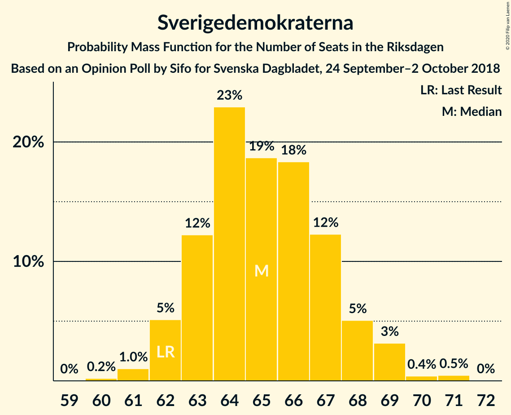
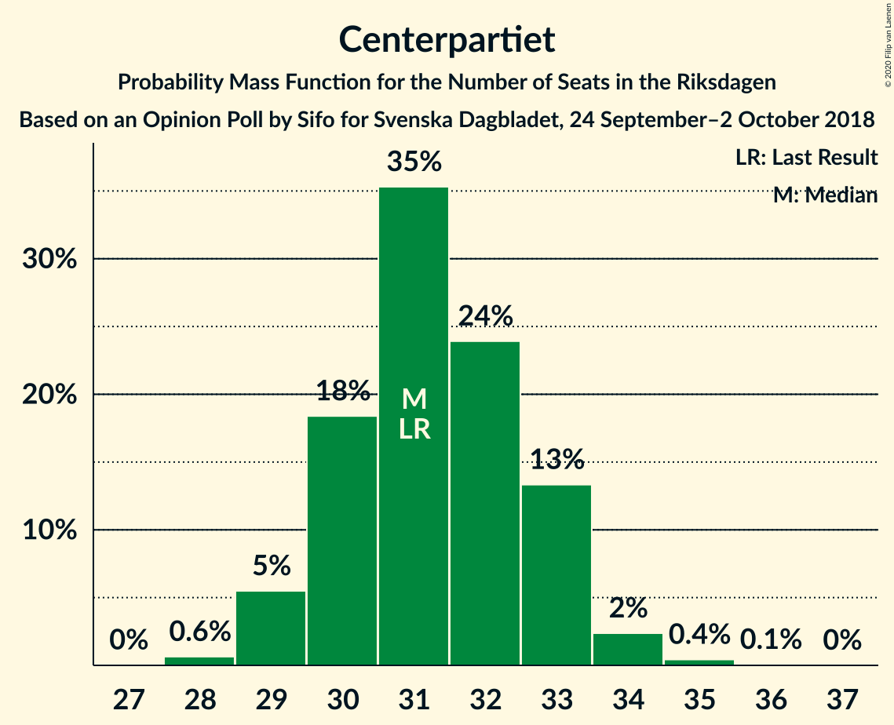
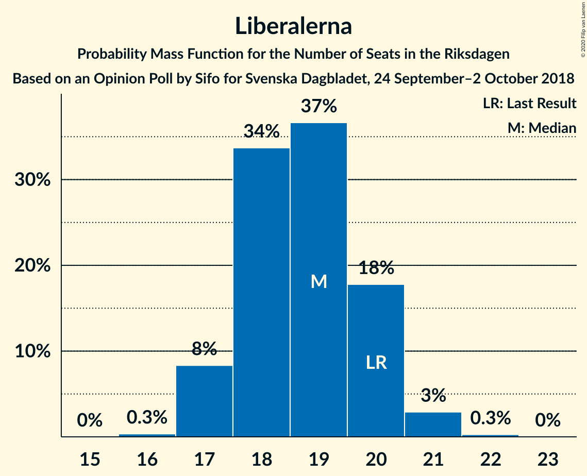
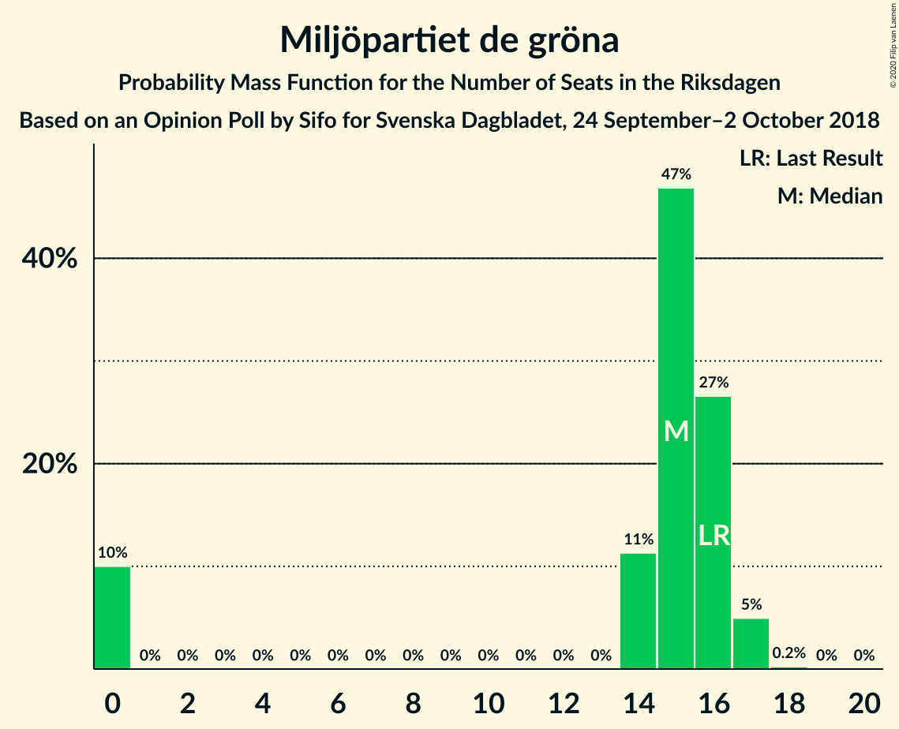

# Opinion Poll by Sifo for Svenska Dagbladet, 24 September–2 October 2018

<a href="#voting-intentions">Voting Intentions</a> | <a href="#seats">Seats</a> | <a href="#coalitions">Coalitions</a> | <a href="#technical-information">Technical Information</a>

## Voting Intentions

### Confidence Intervals

| Party | Last Result | Poll Result | 80% Confidence Interval | 90% Confidence Interval | 95% Confidence Interval | 99% Confidence Interval |
|:-----:|:-----------:|:-----------:|:-----------------------:|:-----------------------:|:-----------------------:|:-----------------------:|
| Sveriges socialdemokratiska arbetareparti | 28.3% | 28.5% | 27.9–29.2% |27.7–29.4% |27.5–29.5% |27.3–29.8% |
| Moderata samlingspartiet | 19.8% | 19.2% | 18.7–19.8% |18.5–20.0% |18.4–20.1% |18.1–20.4% |
| Sverigedemokraterna | 17.5% | 18.3% | 17.8–18.9% |17.6–19.0% |17.5–19.2% |17.2–19.4% |
| Centerpartiet | 8.6% | 8.8% | 8.4–9.2% |8.3–9.3% |8.2–9.4% |8.0–9.6% |
| Vänsterpartiet | 8.0% | 7.8% | 7.4–8.2% |7.3–8.3% |7.2–8.4% |7.1–8.6% |
| Kristdemokraterna | 6.3% | 6.4% | 6.1–6.8% |6.0–6.9% |5.9–7.0% |5.7–7.1% |
| Liberalerna | 5.5% | 5.3% | 5.0–5.6% |4.9–5.7% |4.8–5.8% |4.7–6.0% |
| Miljöpartiet de gröna | 4.4% | 4.3% | 4.0–4.6% |3.9–4.7% |3.9–4.8% |3.7–4.9% |

*Note:* The poll result column reflects the actual value used in the calculations. Published results may vary slightly, and in addition be rounded to fewer digits.

## Seats

### Confidence Intervals

| Party | Last Result | Median | 80% Confidence Interval | 90% Confidence Interval | 95% Confidence Interval | 99% Confidence Interval |
|:-----:|:-----------:|:------:|:-----------------------:|:-----------------------:|:-----------------------:|:-----------------------:|
| <a href="#sveriges-socialdemokratiska-arbetareparti">Sveriges socialdemokratiska arbetareparti</a> | 100 | 101 | 99–104 |99–106 |98–107 |97–108 |
| <a href="#moderata-samlingspartiet">Moderata samlingspartiet</a> | 70 | 68 | 66–71 |66–72 |65–72 |64–73 |
| <a href="#sverigedemokraterna">Sverigedemokraterna</a> | 62 | 65 | 63–67 |62–68 |62–69 |61–71 |
| <a href="#centerpartiet">Centerpartiet</a> | 31 | 31 | 30–33 |29–33 |29–34 |28–34 |
| <a href="#vänsterpartiet">Vänsterpartiet</a> | 28 | 28 | 26–29 |26–30 |26–30 |25–31 |
| <a href="#kristdemokraterna">Kristdemokraterna</a> | 22 | 23 | 22–24 |21–24 |21–25 |20–25 |
| <a href="#liberalerna">Liberalerna</a> | 20 | 19 | 18–20 |17–20 |17–21 |17–21 |
| <a href="#miljöpartiet-de-gröna">Miljöpartiet de gröna</a> | 16 | 15 | 0–16 |0–17 |0–17 |0–17 |

### Sveriges socialdemokratiska arbetareparti

*For a full overview of the results for this party, see the [Sveriges socialdemokratiska arbetareparti](party-sverigessocialdemokratiskaarbetareparti.html) page.*

| Number of Seats | Probability | Accumulated | Special Marks |
|:---------------:|:-----------:|:-----------:|:-------------:|
| 95 | 0% | 100% |  |
| 96 | 0.4% | 99.9% |  |
| 97 | 1.2% | 99.6% |  |
| 98 | 3% | 98% |  |
| 99 | 11% | 95% |  |
| 100 | 17% | 85% | Last Result |
| 101 | 18% | 68% | Median |
| 102 | 18% | 50% |  |
| 103 | 15% | 32% |  |
| 104 | 7% | 17% |  |
| 105 | 3% | 9% |  |
| 106 | 2% | 6% |  |
| 107 | 4% | 4% |  |
| 108 | 0.4% | 0.5% |  |
| 109 | 0.1% | 0.2% |  |
| 110 | 0% | 0.1% |  |
| 111 | 0% | 0% |  |

### Moderata samlingspartiet

*For a full overview of the results for this party, see the [Moderata samlingspartiet](party-moderatasamlingspartiet.html) page.*

| Number of Seats | Probability | Accumulated | Special Marks |
|:---------------:|:-----------:|:-----------:|:-------------:|
| 63 | 0.1% | 100% |  |
| 64 | 0.4% | 99.9% |  |
| 65 | 2% | 99.5% |  |
| 66 | 15% | 97% |  |
| 67 | 23% | 82% |  |
| 68 | 31% | 60% | Median |
| 69 | 13% | 29% |  |
| 70 | 5% | 16% | Last Result |
| 71 | 5% | 11% |  |
| 72 | 5% | 6% |  |
| 73 | 0.9% | 1.1% |  |
| 74 | 0.2% | 0.2% |  |
| 75 | 0% | 0% |  |

### Sverigedemokraterna

*For a full overview of the results for this party, see the [Sverigedemokraterna](party-sverigedemokraterna.html) page.*

| Number of Seats | Probability | Accumulated | Special Marks |
|:---------------:|:-----------:|:-----------:|:-------------:|
| 60 | 0.2% | 100% |  |
| 61 | 1.0% | 99.8% |  |
| 62 | 5% | 98.7% | Last Result |
| 63 | 12% | 94% |  |
| 64 | 23% | 81% |  |
| 65 | 19% | 58% | Median |
| 66 | 18% | 40% |  |
| 67 | 12% | 21% |  |
| 68 | 5% | 9% |  |
| 69 | 3% | 4% |  |
| 70 | 0.4% | 0.9% |  |
| 71 | 0.5% | 0.5% |  |
| 72 | 0% | 0% |  |

### Centerpartiet

*For a full overview of the results for this party, see the [Centerpartiet](party-centerpartiet.html) page.*

| Number of Seats | Probability | Accumulated | Special Marks |
|:---------------:|:-----------:|:-----------:|:-------------:|
| 28 | 0.6% | 100% |  |
| 29 | 5% | 99.3% |  |
| 30 | 18% | 94% |  |
| 31 | 35% | 75% | Last Result, Median |
| 32 | 24% | 40% |  |
| 33 | 13% | 16% |  |
| 34 | 2% | 3% |  |
| 35 | 0.4% | 0.5% |  |
| 36 | 0.1% | 0.1% |  |
| 37 | 0% | 0% |  |

### Vänsterpartiet

*For a full overview of the results for this party, see the [Vänsterpartiet](party-vänsterpartiet.html) page.*

| Number of Seats | Probability | Accumulated | Special Marks |
|:---------------:|:-----------:|:-----------:|:-------------:|
| 24 | 0.1% | 100% |  |
| 25 | 2% | 99.9% |  |
| 26 | 15% | 98% |  |
| 27 | 27% | 83% |  |
| 28 | 27% | 56% | Last Result, Median |
| 29 | 22% | 29% |  |
| 30 | 6% | 7% |  |
| 31 | 0.9% | 1.0% |  |
| 32 | 0.1% | 0.1% |  |
| 33 | 0% | 0% |  |

### Kristdemokraterna

*For a full overview of the results for this party, see the [Kristdemokraterna](party-kristdemokraterna.html) page.*

| Number of Seats | Probability | Accumulated | Special Marks |
|:---------------:|:-----------:|:-----------:|:-------------:|
| 20 | 0.6% | 100% |  |
| 21 | 7% | 99.4% |  |
| 22 | 29% | 92% | Last Result |
| 23 | 47% | 63% | Median |
| 24 | 13% | 16% |  |
| 25 | 3% | 3% |  |
| 26 | 0.2% | 0.3% |  |
| 27 | 0% | 0% |  |

### Liberalerna

*For a full overview of the results for this party, see the [Liberalerna](party-liberalerna.html) page.*

| Number of Seats | Probability | Accumulated | Special Marks |
|:---------------:|:-----------:|:-----------:|:-------------:|
| 16 | 0.3% | 100% |  |
| 17 | 8% | 99.6% |  |
| 18 | 34% | 91% |  |
| 19 | 37% | 58% | Median |
| 20 | 18% | 21% | Last Result |
| 21 | 3% | 3% |  |
| 22 | 0.3% | 0.3% |  |
| 23 | 0% | 0% |  |

### Miljöpartiet de gröna

*For a full overview of the results for this party, see the [Miljöpartiet de gröna](party-miljöpartietdegröna.html) page.*

| Number of Seats | Probability | Accumulated | Special Marks |
|:---------------:|:-----------:|:-----------:|:-------------:|
| 0 | 10% | 100% |  |
| 1 | 0% | 90% |  |
| 2 | 0% | 90% |  |
| 3 | 0% | 90% |  |
| 4 | 0% | 90% |  |
| 5 | 0% | 90% |  |
| 6 | 0% | 90% |  |
| 7 | 0% | 90% |  |
| 8 | 0% | 90% |  |
| 9 | 0% | 90% |  |
| 10 | 0% | 90% |  |
| 11 | 0% | 90% |  |
| 12 | 0% | 90% |  |
| 13 | 0% | 90% |  |
| 14 | 11% | 90% |  |
| 15 | 47% | 79% | Median |
| 16 | 27% | 32% | Last Result |
| 17 | 5% | 5% |  |
| 18 | 0.2% | 0.2% |  |
| 19 | 0% | 0% |  |

## Coalitions

### Confidence Intervals

| Coalition | Last Result | Median | Majority? | 80% Confidence Interval | 90% Confidence Interval | 95% Confidence Interval | 99% Confidence Interval |
|:---------:|:-----------:|:------:|:---------:|:-----------------------:|:-----------------------:|:-----------------------:|:-----------------------:|
| Sveriges socialdemokratiska arbetareparti – Moderata samlingspartiet – Centerpartiet | 201 | 200 | 100% | 198–206 | 197–209 | 196–211 | 195–212 |
| Sveriges socialdemokratiska arbetareparti – Moderata samlingspartiet | 170 | 169 | 9% | 166–174 | 166–177 | 165–179 | 164–179 |
| Moderata samlingspartiet – Sverigedemokraterna – Kristdemokraterna | 154 | 156 | 0% | 152–160 | 152–162 | 151–163 | 150–165 |
| Sveriges socialdemokratiska arbetareparti – Vänsterpartiet – Miljöpartiet de gröna | 144 | 144 | 0% | 138–147 | 135–147 | 133–148 | 132–149 |
| Moderata samlingspartiet – Centerpartiet – Kristdemokraterna – Liberalerna | 143 | 140 | 0% | 138–145 | 137–146 | 137–147 | 136–150 |
| Moderata samlingspartiet – Sverigedemokraterna | 132 | 133 | 0% | 130–137 | 130–139 | 129–140 | 128–141 |
| Sveriges socialdemokratiska arbetareparti – Vänsterpartiet | 128 | 129 | 0% | 127–133 | 126–135 | 125–136 | 124–136 |
| Moderata samlingspartiet – Centerpartiet – Kristdemokraterna | 123 | 122 | 0% | 119–126 | 119–127 | 118–128 | 117–130 |
| Moderata samlingspartiet – Centerpartiet – Liberalerna | 121 | 118 | 0% | 115–122 | 115–123 | 114–124 | 114–126 |
| Sveriges socialdemokratiska arbetareparti – Miljöpartiet de gröna | 116 | 116 | 0% | 110–119 | 106–119 | 105–120 | 103–121 |
| Moderata samlingspartiet – Centerpartiet | 101 | 99 | 0% | 97–102 | 97–104 | 96–104 | 95–106 |

### Sveriges socialdemokratiska arbetareparti – Moderata samlingspartiet – Centerpartiet

| Number of Seats | Probability | Accumulated | Special Marks |
|:---------------:|:-----------:|:-----------:|:-------------:|
| 194 | 0.3% | 100% |  |
| 195 | 0.5% | 99.6% |  |
| 196 | 2% | 99.2% |  |
| 197 | 4% | 97% |  |
| 198 | 15% | 93% |  |
| 199 | 22% | 79% |  |
| 200 | 11% | 56% | Median |
| 201 | 13% | 45% | Last Result |
| 202 | 4% | 32% |  |
| 203 | 16% | 28% |  |
| 204 | 0.9% | 12% |  |
| 205 | 0.6% | 11% |  |
| 206 | 0.8% | 10% |  |
| 207 | 0.7% | 9% |  |
| 208 | 2% | 9% |  |
| 209 | 2% | 7% |  |
| 210 | 0.5% | 5% |  |
| 211 | 4% | 4% |  |
| 212 | 0.5% | 0.8% |  |
| 213 | 0.2% | 0.3% |  |
| 214 | 0.1% | 0.1% |  |
| 215 | 0% | 0% |  |

### Sveriges socialdemokratiska arbetareparti – Moderata samlingspartiet

| Number of Seats | Probability | Accumulated | Special Marks |
|:---------------:|:-----------:|:-----------:|:-------------:|
| 162 | 0% | 100% |  |
| 163 | 0.2% | 99.9% |  |
| 164 | 0.9% | 99.7% |  |
| 165 | 2% | 98.8% |  |
| 166 | 9% | 97% |  |
| 167 | 8% | 88% |  |
| 168 | 23% | 80% |  |
| 169 | 14% | 56% | Median |
| 170 | 14% | 42% | Last Result |
| 171 | 8% | 28% |  |
| 172 | 8% | 21% |  |
| 173 | 3% | 13% |  |
| 174 | 2% | 10% |  |
| 175 | 0.6% | 9% | Majority |
| 176 | 2% | 8% |  |
| 177 | 2% | 6% |  |
| 178 | 0.4% | 4% |  |
| 179 | 4% | 4% |  |
| 180 | 0.1% | 0.3% |  |
| 181 | 0.2% | 0.3% |  |
| 182 | 0% | 0% |  |

### Moderata samlingspartiet – Sverigedemokraterna – Kristdemokraterna

| Number of Seats | Probability | Accumulated | Special Marks |
|:---------------:|:-----------:|:-----------:|:-------------:|
| 149 | 0.2% | 100% |  |
| 150 | 0.5% | 99.8% |  |
| 151 | 2% | 99.3% |  |
| 152 | 9% | 97% |  |
| 153 | 9% | 88% |  |
| 154 | 14% | 79% | Last Result |
| 155 | 15% | 65% |  |
| 156 | 16% | 51% | Median |
| 157 | 15% | 34% |  |
| 158 | 6% | 20% |  |
| 159 | 3% | 14% |  |
| 160 | 1.1% | 11% |  |
| 161 | 1.1% | 10% |  |
| 162 | 4% | 8% |  |
| 163 | 2% | 4% |  |
| 164 | 1.1% | 2% |  |
| 165 | 0.6% | 1.1% |  |
| 166 | 0.3% | 0.4% |  |
| 167 | 0% | 0.1% |  |
| 168 | 0.1% | 0.1% |  |
| 169 | 0% | 0% |  |

### Sveriges socialdemokratiska arbetareparti – Vänsterpartiet – Miljöpartiet de gröna

| Number of Seats | Probability | Accumulated | Special Marks |
|:---------------:|:-----------:|:-----------:|:-------------:|
| 130 | 0.1% | 100% |  |
| 131 | 0.1% | 99.9% |  |
| 132 | 1.1% | 99.7% |  |
| 133 | 2% | 98.6% |  |
| 134 | 0.2% | 96% |  |
| 135 | 1.4% | 96% |  |
| 136 | 4% | 95% |  |
| 137 | 0.2% | 90% |  |
| 138 | 0.4% | 90% |  |
| 139 | 0.9% | 90% |  |
| 140 | 1.3% | 89% |  |
| 141 | 4% | 88% |  |
| 142 | 17% | 83% |  |
| 143 | 14% | 66% |  |
| 144 | 12% | 52% | Last Result, Median |
| 145 | 13% | 40% |  |
| 146 | 16% | 27% |  |
| 147 | 8% | 10% |  |
| 148 | 2% | 3% |  |
| 149 | 0.6% | 0.8% |  |
| 150 | 0.2% | 0.2% |  |
| 151 | 0% | 0% |  |

### Moderata samlingspartiet – Centerpartiet – Kristdemokraterna – Liberalerna

| Number of Seats | Probability | Accumulated | Special Marks |
|:---------------:|:-----------:|:-----------:|:-------------:|
| 134 | 0.1% | 100% |  |
| 135 | 0.4% | 99.9% |  |
| 136 | 2% | 99.5% |  |
| 137 | 7% | 98% |  |
| 138 | 8% | 91% |  |
| 139 | 14% | 82% |  |
| 140 | 23% | 68% |  |
| 141 | 14% | 45% | Median |
| 142 | 13% | 32% |  |
| 143 | 5% | 19% | Last Result |
| 144 | 3% | 14% |  |
| 145 | 3% | 11% |  |
| 146 | 3% | 8% |  |
| 147 | 2% | 5% |  |
| 148 | 1.2% | 2% |  |
| 149 | 0.5% | 1.2% |  |
| 150 | 0.5% | 0.7% |  |
| 151 | 0.1% | 0.2% |  |
| 152 | 0.1% | 0.1% |  |
| 153 | 0% | 0% |  |

### Moderata samlingspartiet – Sverigedemokraterna

| Number of Seats | Probability | Accumulated | Special Marks |
|:---------------:|:-----------:|:-----------:|:-------------:|
| 127 | 0.2% | 100% |  |
| 128 | 0.8% | 99.8% |  |
| 129 | 2% | 99.0% |  |
| 130 | 10% | 97% |  |
| 131 | 16% | 87% |  |
| 132 | 19% | 71% | Last Result |
| 133 | 15% | 52% | Median |
| 134 | 17% | 37% |  |
| 135 | 6% | 20% |  |
| 136 | 3% | 14% |  |
| 137 | 1.1% | 11% |  |
| 138 | 1.4% | 9% |  |
| 139 | 4% | 8% |  |
| 140 | 2% | 4% |  |
| 141 | 1.0% | 1.4% |  |
| 142 | 0.2% | 0.3% |  |
| 143 | 0.1% | 0.1% |  |
| 144 | 0% | 0.1% |  |
| 145 | 0% | 0% |  |

### Sveriges socialdemokratiska arbetareparti – Vänsterpartiet

| Number of Seats | Probability | Accumulated | Special Marks |
|:---------------:|:-----------:|:-----------:|:-------------:|
| 123 | 0.3% | 100% |  |
| 124 | 1.4% | 99.6% |  |
| 125 | 0.7% | 98% |  |
| 126 | 5% | 97% |  |
| 127 | 22% | 93% |  |
| 128 | 15% | 71% | Last Result |
| 129 | 7% | 57% | Median |
| 130 | 19% | 50% |  |
| 131 | 17% | 31% |  |
| 132 | 3% | 13% |  |
| 133 | 3% | 10% |  |
| 134 | 0.7% | 7% |  |
| 135 | 1.5% | 6% |  |
| 136 | 4% | 5% |  |
| 137 | 0.1% | 0.4% |  |
| 138 | 0.1% | 0.2% |  |
| 139 | 0.1% | 0.1% |  |
| 140 | 0% | 0% |  |

### Moderata samlingspartiet – Centerpartiet – Kristdemokraterna

| Number of Seats | Probability | Accumulated | Special Marks |
|:---------------:|:-----------:|:-----------:|:-------------:|
| 116 | 0.3% | 100% |  |
| 117 | 0.8% | 99.7% |  |
| 118 | 2% | 98.8% |  |
| 119 | 14% | 97% |  |
| 120 | 11% | 83% |  |
| 121 | 16% | 72% |  |
| 122 | 17% | 56% | Median |
| 123 | 20% | 39% | Last Result |
| 124 | 5% | 19% |  |
| 125 | 4% | 14% |  |
| 126 | 3% | 11% |  |
| 127 | 5% | 8% |  |
| 128 | 1.0% | 3% |  |
| 129 | 0.8% | 2% |  |
| 130 | 0.4% | 0.9% |  |
| 131 | 0.4% | 0.4% |  |
| 132 | 0.1% | 0.1% |  |
| 133 | 0% | 0% |  |

### Moderata samlingspartiet – Centerpartiet – Liberalerna

| Number of Seats | Probability | Accumulated | Special Marks |
|:---------------:|:-----------:|:-----------:|:-------------:|
| 112 | 0.1% | 100% |  |
| 113 | 0.4% | 99.9% |  |
| 114 | 2% | 99.5% |  |
| 115 | 9% | 97% |  |
| 116 | 12% | 88% |  |
| 117 | 20% | 76% |  |
| 118 | 27% | 56% | Median |
| 119 | 11% | 29% |  |
| 120 | 4% | 18% |  |
| 121 | 3% | 14% | Last Result |
| 122 | 3% | 10% |  |
| 123 | 4% | 8% |  |
| 124 | 3% | 4% |  |
| 125 | 0.7% | 1.3% |  |
| 126 | 0.4% | 0.6% |  |
| 127 | 0.1% | 0.2% |  |
| 128 | 0% | 0% |  |

### Sveriges socialdemokratiska arbetareparti – Miljöpartiet de gröna

| Number of Seats | Probability | Accumulated | Special Marks |
|:---------------:|:-----------:|:-----------:|:-------------:|
| 101 | 0.1% | 100% |  |
| 102 | 0.3% | 99.9% |  |
| 103 | 0.4% | 99.6% |  |
| 104 | 1.4% | 99.2% |  |
| 105 | 2% | 98% |  |
| 106 | 2% | 96% |  |
| 107 | 4% | 94% |  |
| 108 | 0.4% | 91% |  |
| 109 | 0.1% | 90% |  |
| 110 | 0.1% | 90% |  |
| 111 | 0.3% | 90% |  |
| 112 | 0.9% | 90% |  |
| 113 | 3% | 89% |  |
| 114 | 9% | 86% |  |
| 115 | 16% | 77% |  |
| 116 | 17% | 61% | Last Result, Median |
| 117 | 15% | 44% |  |
| 118 | 15% | 29% |  |
| 119 | 11% | 14% |  |
| 120 | 2% | 3% |  |
| 121 | 0.8% | 1.2% |  |
| 122 | 0.3% | 0.3% |  |
| 123 | 0% | 0% |  |

### Moderata samlingspartiet – Centerpartiet

| Number of Seats | Probability | Accumulated | Special Marks |
|:---------------:|:-----------:|:-----------:|:-------------:|
| 93 | 0.1% | 100% |  |
| 94 | 0.1% | 99.9% |  |
| 95 | 1.0% | 99.8% |  |
| 96 | 3% | 98.8% |  |
| 97 | 19% | 96% |  |
| 98 | 13% | 77% |  |
| 99 | 22% | 64% | Median |
| 100 | 24% | 42% |  |
| 101 | 5% | 19% | Last Result |
| 102 | 4% | 14% |  |
| 103 | 2% | 9% |  |
| 104 | 6% | 8% |  |
| 105 | 0.4% | 1.4% |  |
| 106 | 0.7% | 1.1% |  |
| 107 | 0.3% | 0.3% |  |
| 108 | 0% | 0% |  |

## Technical Information

### Opinion Poll

+ **Polling firm:** Sifo
+ **Commissioner(s):** Svenska Dagbladet
+ **Fieldwork period:** 24 September–2 October 2018

### Calculations

+ **Sample size:** 8108
+ **Simulations done:** 1,048,576
+ **Error estimate:** 0.72%

