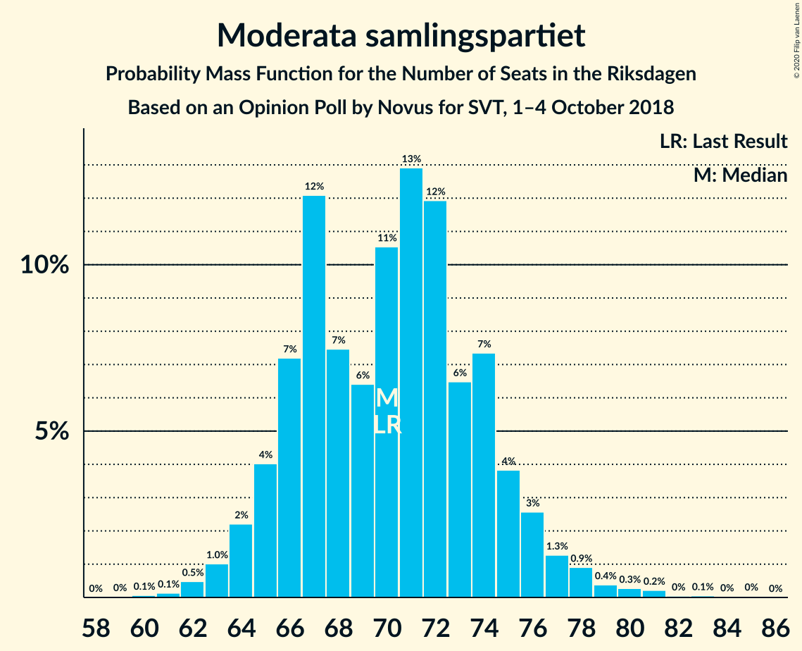

# Opinion Poll by Novus for SVT, 1–4 October 2018

<a href="#voting-intentions">Voting Intentions</a> | <a href="#seats">Seats</a> | <a href="#coalitions">Coalitions</a> | <a href="#technical-information">Technical Information</a>

## Voting Intentions

### Confidence Intervals

| Party | Last Result | Poll Result | 80% Confidence Interval | 90% Confidence Interval | 95% Confidence Interval | 99% Confidence Interval |
|:-----:|:-----------:|:-----------:|:-----------------------:|:-----------------------:|:-----------------------:|:-----------------------:|
| Sveriges socialdemokratiska arbetareparti | 28.3% | 28.3% | 27.1–29.6% |26.8–29.9% |26.5–30.2% |25.9–30.8% |
| Moderata samlingspartiet | 19.8% | 19.7% | 18.6–20.8% |18.3–21.1% |18.1–21.4% |17.6–21.9% |
| Sverigedemokraterna | 17.5% | 18.8% | 17.8–19.9% |17.5–20.2% |17.2–20.5% |16.8–21.0% |
| Centerpartiet | 8.6% | 8.4% | 7.7–9.2% |7.5–9.4% |7.3–9.6% |7.0–10.0% |
| Vänsterpartiet | 8.0% | 8.4% | 7.7–9.2% |7.5–9.4% |7.3–9.6% |7.0–10.0% |
| Kristdemokraterna | 6.3% | 6.0% | 5.4–6.7% |5.2–6.9% |5.1–7.1% |4.8–7.4% |
| Liberalerna | 5.5% | 4.6% | 4.1–5.2% |3.9–5.4% |3.8–5.5% |3.6–5.9% |
| Miljöpartiet de gröna | 4.4% | 4.4% | 3.9–5.0% |3.7–5.2% |3.6–5.4% |3.4–5.7% |

*Note:* The poll result column reflects the actual value used in the calculations. Published results may vary slightly, and in addition be rounded to fewer digits.

## Seats

### Confidence Intervals

| Party | Last Result | Median | 80% Confidence Interval | 90% Confidence Interval | 95% Confidence Interval | 99% Confidence Interval |
|:-----:|:-----------:|:------:|:-----------------------:|:-----------------------:|:-----------------------:|:-----------------------:|
| <a href="#sveriges-socialdemokratiska-arbetareparti">Sveriges socialdemokratiska arbetareparti</a> | 100 | 101 | 96–106 |95–108 |94–109 |92–113 |
| <a href="#moderata-samlingspartiet">Moderata samlingspartiet</a> | 70 | 70 | 66–75 |65–76 |64–77 |62–80 |
| <a href="#sverigedemokraterna">Sverigedemokraterna</a> | 62 | 67 | 63–71 |62–72 |61–74 |59–77 |
| <a href="#centerpartiet">Centerpartiet</a> | 31 | 30 | 27–33 |27–34 |26–35 |25–36 |
| <a href="#vänsterpartiet">Vänsterpartiet</a> | 28 | 30 | 28–33 |27–34 |26–34 |25–36 |
| <a href="#kristdemokraterna">Kristdemokraterna</a> | 22 | 22 | 19–24 |18–25 |18–26 |17–27 |
| <a href="#liberalerna">Liberalerna</a> | 20 | 16 | 14–19 |0–19 |0–20 |0–21 |
| <a href="#miljöpartiet-de-gröna">Miljöpartiet de gröna</a> | 16 | 16 | 0–18 |0–19 |0–19 |0–20 |

### Sveriges socialdemokratiska arbetareparti

*For a full overview of the results for this party, see the [Sveriges socialdemokratiska arbetareparti](party-sverigessocialdemokratiskaarbetareparti.html) page.*

| Number of Seats | Probability | Accumulated | Special Marks |
|:---------------:|:-----------:|:-----------:|:-------------:|
| 90 | 0.1% | 100% |  |
| 91 | 0.1% | 99.8% |  |
| 92 | 0.8% | 99.7% |  |
| 93 | 0.8% | 98.9% |  |
| 94 | 1.4% | 98% |  |
| 95 | 5% | 97% |  |
| 96 | 2% | 91% |  |
| 97 | 12% | 89% |  |
| 98 | 2% | 77% |  |
| 99 | 13% | 75% |  |
| 100 | 8% | 62% | Last Result |
| 101 | 13% | 54% | Median |
| 102 | 8% | 41% |  |
| 103 | 6% | 33% |  |
| 104 | 9% | 27% |  |
| 105 | 5% | 19% |  |
| 106 | 5% | 13% |  |
| 107 | 1.0% | 8% |  |
| 108 | 3% | 7% |  |
| 109 | 1.2% | 3% |  |
| 110 | 1.0% | 2% |  |
| 111 | 0.4% | 1.3% |  |
| 112 | 0.3% | 0.9% |  |
| 113 | 0.1% | 0.6% |  |
| 114 | 0.2% | 0.5% |  |
| 115 | 0.2% | 0.3% |  |
| 116 | 0% | 0.1% |  |
| 117 | 0% | 0.1% |  |
| 118 | 0% | 0% |  |

### Moderata samlingspartiet

*For a full overview of the results for this party, see the [Moderata samlingspartiet](party-moderatasamlingspartiet.html) page.*

| Number of Seats | Probability | Accumulated | Special Marks |
|:---------------:|:-----------:|:-----------:|:-------------:|
| 60 | 0% | 100% |  |
| 61 | 0.2% | 99.9% |  |
| 62 | 0.6% | 99.7% |  |
| 63 | 0.8% | 99.2% |  |
| 64 | 1.2% | 98% |  |
| 65 | 4% | 97% |  |
| 66 | 10% | 93% |  |
| 67 | 14% | 84% |  |
| 68 | 6% | 70% |  |
| 69 | 9% | 64% |  |
| 70 | 11% | 55% | Last Result, Median |
| 71 | 12% | 44% |  |
| 72 | 9% | 32% |  |
| 73 | 6% | 23% |  |
| 74 | 7% | 17% |  |
| 75 | 4% | 10% |  |
| 76 | 2% | 6% |  |
| 77 | 2% | 4% |  |
| 78 | 1.1% | 2% |  |
| 79 | 0.3% | 0.9% |  |
| 80 | 0.2% | 0.6% |  |
| 81 | 0.2% | 0.4% |  |
| 82 | 0.1% | 0.2% |  |
| 83 | 0% | 0.1% |  |
| 84 | 0% | 0.1% |  |
| 85 | 0.1% | 0.1% |  |
| 86 | 0% | 0% |  |

### Sverigedemokraterna

*For a full overview of the results for this party, see the [Sverigedemokraterna](party-sverigedemokraterna.html) page.*

| Number of Seats | Probability | Accumulated | Special Marks |
|:---------------:|:-----------:|:-----------:|:-------------:|
| 57 | 0% | 100% |  |
| 58 | 0.2% | 99.9% |  |
| 59 | 0.4% | 99.7% |  |
| 60 | 1.4% | 99.3% |  |
| 61 | 2% | 98% |  |
| 62 | 3% | 96% | Last Result |
| 63 | 4% | 94% |  |
| 64 | 11% | 89% |  |
| 65 | 8% | 79% |  |
| 66 | 16% | 70% |  |
| 67 | 12% | 55% | Median |
| 68 | 8% | 43% |  |
| 69 | 15% | 34% |  |
| 70 | 5% | 20% |  |
| 71 | 6% | 14% |  |
| 72 | 4% | 8% |  |
| 73 | 2% | 5% |  |
| 74 | 1.1% | 3% |  |
| 75 | 0.8% | 2% |  |
| 76 | 0.5% | 1.1% |  |
| 77 | 0.3% | 0.6% |  |
| 78 | 0.1% | 0.2% |  |
| 79 | 0% | 0.1% |  |
| 80 | 0% | 0.1% |  |
| 81 | 0.1% | 0.1% |  |
| 82 | 0% | 0% |  |

### Centerpartiet

*For a full overview of the results for this party, see the [Centerpartiet](party-centerpartiet.html) page.*

| Number of Seats | Probability | Accumulated | Special Marks |
|:---------------:|:-----------:|:-----------:|:-------------:|
| 24 | 0.4% | 100% |  |
| 25 | 1.1% | 99.5% |  |
| 26 | 2% | 98% |  |
| 27 | 10% | 96% |  |
| 28 | 11% | 86% |  |
| 29 | 11% | 75% |  |
| 30 | 24% | 63% | Median |
| 31 | 14% | 39% | Last Result |
| 32 | 8% | 25% |  |
| 33 | 10% | 17% |  |
| 34 | 5% | 7% |  |
| 35 | 2% | 3% |  |
| 36 | 0.7% | 1.1% |  |
| 37 | 0.3% | 0.4% |  |
| 38 | 0% | 0.1% |  |
| 39 | 0% | 0% |  |

### Vänsterpartiet

*For a full overview of the results for this party, see the [Vänsterpartiet](party-vänsterpartiet.html) page.*

| Number of Seats | Probability | Accumulated | Special Marks |
|:---------------:|:-----------:|:-----------:|:-------------:|
| 23 | 0.1% | 100% |  |
| 24 | 0.2% | 99.9% |  |
| 25 | 0.7% | 99.7% |  |
| 26 | 3% | 99.0% |  |
| 27 | 6% | 96% |  |
| 28 | 12% | 90% | Last Result |
| 29 | 17% | 78% |  |
| 30 | 16% | 61% | Median |
| 31 | 21% | 44% |  |
| 32 | 12% | 23% |  |
| 33 | 7% | 12% |  |
| 34 | 3% | 5% |  |
| 35 | 1.1% | 2% |  |
| 36 | 0.5% | 0.8% |  |
| 37 | 0.2% | 0.3% |  |
| 38 | 0.1% | 0.1% |  |
| 39 | 0% | 0% |  |

### Kristdemokraterna

*For a full overview of the results for this party, see the [Kristdemokraterna](party-kristdemokraterna.html) page.*

| Number of Seats | Probability | Accumulated | Special Marks |
|:---------------:|:-----------:|:-----------:|:-------------:|
| 16 | 0.1% | 100% |  |
| 17 | 0.8% | 99.9% |  |
| 18 | 6% | 99.1% |  |
| 19 | 9% | 93% |  |
| 20 | 14% | 85% |  |
| 21 | 20% | 71% |  |
| 22 | 20% | 51% | Last Result, Median |
| 23 | 18% | 31% |  |
| 24 | 7% | 13% |  |
| 25 | 3% | 5% |  |
| 26 | 2% | 3% |  |
| 27 | 0.5% | 0.7% |  |
| 28 | 0.2% | 0.2% |  |
| 29 | 0% | 0% |  |

### Liberalerna

*For a full overview of the results for this party, see the [Liberalerna](party-liberalerna.html) page.*

| Number of Seats | Probability | Accumulated | Special Marks |
|:---------------:|:-----------:|:-----------:|:-------------:|
| 0 | 8% | 100% |  |
| 1 | 0% | 92% |  |
| 2 | 0% | 92% |  |
| 3 | 0% | 92% |  |
| 4 | 0% | 92% |  |
| 5 | 0% | 92% |  |
| 6 | 0% | 92% |  |
| 7 | 0% | 92% |  |
| 8 | 0% | 92% |  |
| 9 | 0% | 92% |  |
| 10 | 0% | 92% |  |
| 11 | 0% | 92% |  |
| 12 | 0% | 92% |  |
| 13 | 0% | 92% |  |
| 14 | 6% | 92% |  |
| 15 | 16% | 87% |  |
| 16 | 22% | 71% | Median |
| 17 | 23% | 49% |  |
| 18 | 15% | 26% |  |
| 19 | 8% | 11% |  |
| 20 | 2% | 3% | Last Result |
| 21 | 0.9% | 1.0% |  |
| 22 | 0.1% | 0.2% |  |
| 23 | 0% | 0% |  |

### Miljöpartiet de gröna

*For a full overview of the results for this party, see the [Miljöpartiet de gröna](party-miljöpartietdegröna.html) page.*

| Number of Seats | Probability | Accumulated | Special Marks |
|:---------------:|:-----------:|:-----------:|:-------------:|
| 0 | 15% | 100% |  |
| 1 | 0% | 85% |  |
| 2 | 0% | 85% |  |
| 3 | 0% | 85% |  |
| 4 | 0% | 85% |  |
| 5 | 0% | 85% |  |
| 6 | 0% | 85% |  |
| 7 | 0% | 85% |  |
| 8 | 0% | 85% |  |
| 9 | 0% | 85% |  |
| 10 | 0% | 85% |  |
| 11 | 0% | 85% |  |
| 12 | 0% | 85% |  |
| 13 | 0% | 85% |  |
| 14 | 6% | 85% |  |
| 15 | 25% | 80% |  |
| 16 | 27% | 55% | Last Result, Median |
| 17 | 14% | 28% |  |
| 18 | 8% | 13% |  |
| 19 | 4% | 5% |  |
| 20 | 1.1% | 1.3% |  |
| 21 | 0.2% | 0.2% |  |
| 22 | 0% | 0% |  |

## Coalitions

### Confidence Intervals

| Coalition | Last Result | Median | Majority? | 80% Confidence Interval | 90% Confidence Interval | 95% Confidence Interval | 99% Confidence Interval |
|:---------:|:-----------:|:------:|:---------:|:-----------------------:|:-----------------------:|:-----------------------:|:-----------------------:|
| Sveriges socialdemokratiska arbetareparti – Moderata samlingspartiet – Centerpartiet | 201 | 200 | 100% | 195–209 | 193–213 | 192–214 | 190–221 |
| Sveriges socialdemokratiska arbetareparti – Moderata samlingspartiet | 170 | 170 | 22% | 165–179 | 164–181 | 163–182 | 160–189 |
| Moderata samlingspartiet – Sverigedemokraterna – Kristdemokraterna | 154 | 158 | 0.4% | 153–166 | 151–168 | 151–170 | 148–174 |
| Sveriges socialdemokratiska arbetareparti – Vänsterpartiet – Miljöpartiet de gröna | 144 | 145 | 0% | 137–152 | 134–154 | 132–155 | 129–157 |
| Moderata samlingspartiet – Sverigedemokraterna | 132 | 136 | 0% | 132–144 | 131–145 | 129–148 | 127–152 |
| Moderata samlingspartiet – Centerpartiet – Kristdemokraterna – Liberalerna | 143 | 136 | 0% | 130–145 | 129–146 | 125–147 | 121–150 |
| Sveriges socialdemokratiska arbetareparti – Vänsterpartiet | 128 | 131 | 0% | 125–137 | 124–139 | 123–140 | 120–145 |
| Moderata samlingspartiet – Centerpartiet – Kristdemokraterna | 123 | 121 | 0% | 116–128 | 115–130 | 114–132 | 113–136 |
| Moderata samlingspartiet – Centerpartiet – Liberalerna | 121 | 115 | 0% | 110–122 | 106–124 | 103–125 | 99–128 |
| Sveriges socialdemokratiska arbetareparti – Miljöpartiet de gröna | 116 | 116 | 0% | 106–121 | 104–123 | 101–125 | 98–127 |
| Moderata samlingspartiet – Centerpartiet | 101 | 100 | 0% | 95–106 | 93–108 | 93–109 | 91–112 |

### Sveriges socialdemokratiska arbetareparti – Moderata samlingspartiet – Centerpartiet

| Number of Seats | Probability | Accumulated | Special Marks |
|:---------------:|:-----------:|:-----------:|:-------------:|
| 187 | 0% | 100% |  |
| 188 | 0.1% | 99.9% |  |
| 189 | 0.2% | 99.9% |  |
| 190 | 0.5% | 99.6% |  |
| 191 | 0.4% | 99.1% |  |
| 192 | 3% | 98.7% |  |
| 193 | 2% | 96% |  |
| 194 | 2% | 94% |  |
| 195 | 6% | 92% |  |
| 196 | 4% | 87% |  |
| 197 | 7% | 82% |  |
| 198 | 14% | 75% |  |
| 199 | 8% | 61% |  |
| 200 | 8% | 53% |  |
| 201 | 7% | 45% | Last Result, Median |
| 202 | 9% | 38% |  |
| 203 | 3% | 29% |  |
| 204 | 3% | 26% |  |
| 205 | 2% | 23% |  |
| 206 | 3% | 21% |  |
| 207 | 3% | 18% |  |
| 208 | 2% | 15% |  |
| 209 | 4% | 14% |  |
| 210 | 2% | 10% |  |
| 211 | 2% | 8% |  |
| 212 | 0.7% | 7% |  |
| 213 | 2% | 6% |  |
| 214 | 2% | 4% |  |
| 215 | 0.4% | 2% |  |
| 216 | 0.7% | 2% |  |
| 217 | 0.1% | 1.2% |  |
| 218 | 0.1% | 1.1% |  |
| 219 | 0.4% | 1.0% |  |
| 220 | 0% | 0.6% |  |
| 221 | 0.1% | 0.5% |  |
| 222 | 0% | 0.4% |  |
| 223 | 0.1% | 0.4% |  |
| 224 | 0.1% | 0.3% |  |
| 225 | 0.1% | 0.2% |  |
| 226 | 0% | 0.1% |  |
| 227 | 0% | 0% |  |

### Sveriges socialdemokratiska arbetareparti – Moderata samlingspartiet

| Number of Seats | Probability | Accumulated | Special Marks |
|:---------------:|:-----------:|:-----------:|:-------------:|
| 157 | 0% | 100% |  |
| 158 | 0.1% | 99.9% |  |
| 159 | 0.3% | 99.8% |  |
| 160 | 0.3% | 99.6% |  |
| 161 | 0.5% | 99.3% |  |
| 162 | 0.6% | 98.8% |  |
| 163 | 2% | 98% |  |
| 164 | 4% | 96% |  |
| 165 | 2% | 92% |  |
| 166 | 7% | 90% |  |
| 167 | 5% | 82% |  |
| 168 | 14% | 77% |  |
| 169 | 9% | 63% |  |
| 170 | 7% | 54% | Last Result |
| 171 | 12% | 47% | Median |
| 172 | 5% | 35% |  |
| 173 | 4% | 30% |  |
| 174 | 4% | 26% |  |
| 175 | 2% | 22% | Majority |
| 176 | 3% | 19% |  |
| 177 | 2% | 17% |  |
| 178 | 2% | 14% |  |
| 179 | 4% | 12% |  |
| 180 | 3% | 8% |  |
| 181 | 2% | 5% |  |
| 182 | 1.0% | 4% |  |
| 183 | 0.5% | 2% |  |
| 184 | 0.7% | 2% |  |
| 185 | 0.3% | 1.3% |  |
| 186 | 0.2% | 1.0% |  |
| 187 | 0.2% | 0.7% |  |
| 188 | 0% | 0.5% |  |
| 189 | 0.1% | 0.5% |  |
| 190 | 0.1% | 0.4% |  |
| 191 | 0.1% | 0.3% |  |
| 192 | 0% | 0.1% |  |
| 193 | 0.1% | 0.1% |  |
| 194 | 0% | 0% |  |

### Moderata samlingspartiet – Sverigedemokraterna – Kristdemokraterna

| Number of Seats | Probability | Accumulated | Special Marks |
|:---------------:|:-----------:|:-----------:|:-------------:|
| 145 | 0% | 100% |  |
| 146 | 0.1% | 99.9% |  |
| 147 | 0.1% | 99.9% |  |
| 148 | 0.3% | 99.7% |  |
| 149 | 0.8% | 99.4% |  |
| 150 | 1.1% | 98.6% |  |
| 151 | 4% | 98% |  |
| 152 | 3% | 94% |  |
| 153 | 6% | 91% |  |
| 154 | 11% | 85% | Last Result |
| 155 | 5% | 74% |  |
| 156 | 7% | 70% |  |
| 157 | 7% | 63% |  |
| 158 | 7% | 56% |  |
| 159 | 10% | 49% | Median |
| 160 | 8% | 39% |  |
| 161 | 7% | 31% |  |
| 162 | 3% | 24% |  |
| 163 | 4% | 21% |  |
| 164 | 2% | 17% |  |
| 165 | 3% | 14% |  |
| 166 | 4% | 12% |  |
| 167 | 1.2% | 7% |  |
| 168 | 2% | 6% |  |
| 169 | 2% | 5% |  |
| 170 | 0.8% | 3% |  |
| 171 | 0.8% | 2% |  |
| 172 | 0.1% | 1.1% |  |
| 173 | 0.2% | 1.0% |  |
| 174 | 0.3% | 0.8% |  |
| 175 | 0% | 0.4% | Majority |
| 176 | 0.1% | 0.4% |  |
| 177 | 0.1% | 0.3% |  |
| 178 | 0% | 0.3% |  |
| 179 | 0.1% | 0.2% |  |
| 180 | 0% | 0.2% |  |
| 181 | 0.1% | 0.1% |  |
| 182 | 0% | 0.1% |  |
| 183 | 0% | 0% |  |

### Sveriges socialdemokratiska arbetareparti – Vänsterpartiet – Miljöpartiet de gröna

| Number of Seats | Probability | Accumulated | Special Marks |
|:---------------:|:-----------:|:-----------:|:-------------:|
| 125 | 0.1% | 100% |  |
| 126 | 0.1% | 99.9% |  |
| 127 | 0% | 99.8% |  |
| 128 | 0.1% | 99.8% |  |
| 129 | 0.4% | 99.7% |  |
| 130 | 0.5% | 99.3% |  |
| 131 | 0.8% | 98.9% |  |
| 132 | 1.3% | 98% |  |
| 133 | 0.5% | 97% |  |
| 134 | 2% | 96% |  |
| 135 | 3% | 94% |  |
| 136 | 2% | 92% |  |
| 137 | 2% | 90% |  |
| 138 | 1.0% | 88% |  |
| 139 | 3% | 87% |  |
| 140 | 7% | 84% |  |
| 141 | 2% | 77% |  |
| 142 | 2% | 75% |  |
| 143 | 8% | 73% |  |
| 144 | 7% | 65% | Last Result |
| 145 | 10% | 58% |  |
| 146 | 7% | 48% |  |
| 147 | 3% | 41% | Median |
| 148 | 13% | 38% |  |
| 149 | 9% | 25% |  |
| 150 | 4% | 16% |  |
| 151 | 1.3% | 12% |  |
| 152 | 2% | 11% |  |
| 153 | 2% | 9% |  |
| 154 | 4% | 7% |  |
| 155 | 0.9% | 3% |  |
| 156 | 0.9% | 2% |  |
| 157 | 0.7% | 1.1% |  |
| 158 | 0.1% | 0.3% |  |
| 159 | 0.1% | 0.2% |  |
| 160 | 0.1% | 0.2% |  |
| 161 | 0% | 0.1% |  |
| 162 | 0% | 0% |  |

### Moderata samlingspartiet – Sverigedemokraterna

| Number of Seats | Probability | Accumulated | Special Marks |
|:---------------:|:-----------:|:-----------:|:-------------:|
| 124 | 0% | 100% |  |
| 125 | 0.1% | 99.9% |  |
| 126 | 0.2% | 99.9% |  |
| 127 | 0.3% | 99.7% |  |
| 128 | 0.6% | 99.4% |  |
| 129 | 2% | 98.8% |  |
| 130 | 2% | 97% |  |
| 131 | 5% | 95% |  |
| 132 | 4% | 90% | Last Result |
| 133 | 12% | 86% |  |
| 134 | 6% | 74% |  |
| 135 | 9% | 69% |  |
| 136 | 11% | 60% |  |
| 137 | 6% | 48% | Median |
| 138 | 8% | 42% |  |
| 139 | 4% | 34% |  |
| 140 | 9% | 30% |  |
| 141 | 3% | 21% |  |
| 142 | 2% | 18% |  |
| 143 | 5% | 15% |  |
| 144 | 3% | 10% |  |
| 145 | 3% | 7% |  |
| 146 | 0.6% | 5% |  |
| 147 | 1.3% | 4% |  |
| 148 | 1.3% | 3% |  |
| 149 | 0.4% | 1.3% |  |
| 150 | 0.2% | 0.9% |  |
| 151 | 0.2% | 0.7% |  |
| 152 | 0.1% | 0.5% |  |
| 153 | 0.1% | 0.4% |  |
| 154 | 0.1% | 0.3% |  |
| 155 | 0.1% | 0.2% |  |
| 156 | 0% | 0.1% |  |
| 157 | 0% | 0.1% |  |
| 158 | 0.1% | 0.1% |  |
| 159 | 0% | 0% |  |

### Moderata samlingspartiet – Centerpartiet – Kristdemokraterna – Liberalerna

| Number of Seats | Probability | Accumulated | Special Marks |
|:---------------:|:-----------:|:-----------:|:-------------:|
| 119 | 0.1% | 100% |  |
| 120 | 0.3% | 99.9% |  |
| 121 | 0.3% | 99.6% |  |
| 122 | 0.5% | 99.3% |  |
| 123 | 0.5% | 98.8% |  |
| 124 | 0.5% | 98% |  |
| 125 | 0.9% | 98% |  |
| 126 | 0.2% | 97% |  |
| 127 | 0.3% | 97% |  |
| 128 | 0.6% | 96% |  |
| 129 | 1.4% | 96% |  |
| 130 | 5% | 94% |  |
| 131 | 2% | 90% |  |
| 132 | 7% | 88% |  |
| 133 | 10% | 81% |  |
| 134 | 5% | 71% |  |
| 135 | 12% | 66% |  |
| 136 | 5% | 54% |  |
| 137 | 7% | 49% |  |
| 138 | 3% | 42% | Median |
| 139 | 3% | 39% |  |
| 140 | 5% | 36% |  |
| 141 | 5% | 31% |  |
| 142 | 10% | 26% |  |
| 143 | 3% | 15% | Last Result |
| 144 | 2% | 12% |  |
| 145 | 4% | 10% |  |
| 146 | 3% | 6% |  |
| 147 | 1.0% | 3% |  |
| 148 | 0.7% | 2% |  |
| 149 | 0.5% | 1.4% |  |
| 150 | 0.7% | 0.9% |  |
| 151 | 0.1% | 0.3% |  |
| 152 | 0% | 0.2% |  |
| 153 | 0.1% | 0.1% |  |
| 154 | 0% | 0.1% |  |
| 155 | 0% | 0.1% |  |
| 156 | 0% | 0% |  |

### Sveriges socialdemokratiska arbetareparti – Vänsterpartiet

| Number of Seats | Probability | Accumulated | Special Marks |
|:---------------:|:-----------:|:-----------:|:-------------:|
| 118 | 0.1% | 100% |  |
| 119 | 0.1% | 99.9% |  |
| 120 | 0.3% | 99.8% |  |
| 121 | 0.3% | 99.5% |  |
| 122 | 0.9% | 99.1% |  |
| 123 | 2% | 98% |  |
| 124 | 5% | 97% |  |
| 125 | 4% | 92% |  |
| 126 | 4% | 88% |  |
| 127 | 4% | 83% |  |
| 128 | 9% | 80% | Last Result |
| 129 | 6% | 70% |  |
| 130 | 12% | 65% |  |
| 131 | 5% | 52% | Median |
| 132 | 13% | 47% |  |
| 133 | 4% | 34% |  |
| 134 | 10% | 31% |  |
| 135 | 4% | 20% |  |
| 136 | 4% | 16% |  |
| 137 | 3% | 13% |  |
| 138 | 4% | 9% |  |
| 139 | 3% | 6% |  |
| 140 | 0.6% | 3% |  |
| 141 | 0.9% | 2% |  |
| 142 | 0.4% | 2% |  |
| 143 | 0.2% | 1.2% |  |
| 144 | 0.3% | 1.1% |  |
| 145 | 0.3% | 0.8% |  |
| 146 | 0.2% | 0.5% |  |
| 147 | 0.2% | 0.3% |  |
| 148 | 0% | 0.1% |  |
| 149 | 0% | 0.1% |  |
| 150 | 0% | 0.1% |  |
| 151 | 0% | 0% |  |

### Moderata samlingspartiet – Centerpartiet – Kristdemokraterna

| Number of Seats | Probability | Accumulated | Special Marks |
|:---------------:|:-----------:|:-----------:|:-------------:|
| 109 | 0.1% | 100% |  |
| 110 | 0% | 99.9% |  |
| 111 | 0.1% | 99.8% |  |
| 112 | 0.2% | 99.7% |  |
| 113 | 1.1% | 99.6% |  |
| 114 | 3% | 98% |  |
| 115 | 4% | 95% |  |
| 116 | 6% | 91% |  |
| 117 | 6% | 86% |  |
| 118 | 17% | 79% |  |
| 119 | 6% | 62% |  |
| 120 | 4% | 56% |  |
| 121 | 2% | 52% |  |
| 122 | 5% | 50% | Median |
| 123 | 8% | 44% | Last Result |
| 124 | 4% | 36% |  |
| 125 | 7% | 32% |  |
| 126 | 7% | 25% |  |
| 127 | 5% | 18% |  |
| 128 | 3% | 13% |  |
| 129 | 2% | 9% |  |
| 130 | 4% | 7% |  |
| 131 | 0.7% | 3% |  |
| 132 | 1.3% | 3% |  |
| 133 | 0.3% | 1.3% |  |
| 134 | 0.1% | 1.0% |  |
| 135 | 0.2% | 0.9% |  |
| 136 | 0.3% | 0.7% |  |
| 137 | 0.2% | 0.4% |  |
| 138 | 0.1% | 0.2% |  |
| 139 | 0.1% | 0.1% |  |
| 140 | 0% | 0% |  |

### Moderata samlingspartiet – Centerpartiet – Liberalerna

| Number of Seats | Probability | Accumulated | Special Marks |
|:---------------:|:-----------:|:-----------:|:-------------:|
| 96 | 0% | 100% |  |
| 97 | 0.1% | 99.9% |  |
| 98 | 0.3% | 99.9% |  |
| 99 | 0.2% | 99.6% |  |
| 100 | 0.6% | 99.3% |  |
| 101 | 0.3% | 98.7% |  |
| 102 | 0.2% | 98% |  |
| 103 | 0.8% | 98% |  |
| 104 | 1.2% | 97% |  |
| 105 | 0.2% | 96% |  |
| 106 | 1.1% | 96% |  |
| 107 | 0.6% | 95% |  |
| 108 | 2% | 94% |  |
| 109 | 2% | 92% |  |
| 110 | 6% | 90% |  |
| 111 | 5% | 84% |  |
| 112 | 3% | 79% |  |
| 113 | 4% | 75% |  |
| 114 | 17% | 71% |  |
| 115 | 7% | 54% |  |
| 116 | 6% | 47% | Median |
| 117 | 5% | 41% |  |
| 118 | 5% | 36% |  |
| 119 | 8% | 31% |  |
| 120 | 6% | 22% |  |
| 121 | 5% | 17% | Last Result |
| 122 | 4% | 12% |  |
| 123 | 2% | 8% |  |
| 124 | 3% | 6% |  |
| 125 | 1.2% | 4% |  |
| 126 | 1.2% | 2% |  |
| 127 | 0.6% | 1.2% |  |
| 128 | 0.1% | 0.6% |  |
| 129 | 0.3% | 0.4% |  |
| 130 | 0.1% | 0.1% |  |
| 131 | 0% | 0.1% |  |
| 132 | 0% | 0.1% |  |
| 133 | 0% | 0% |  |

### Sveriges socialdemokratiska arbetareparti – Miljöpartiet de gröna

| Number of Seats | Probability | Accumulated | Special Marks |
|:---------------:|:-----------:|:-----------:|:-------------:|
| 95 | 0% | 100% |  |
| 96 | 0.1% | 99.9% |  |
| 97 | 0% | 99.8% |  |
| 98 | 0.5% | 99.8% |  |
| 99 | 0.6% | 99.3% |  |
| 100 | 0.4% | 98.6% |  |
| 101 | 1.3% | 98% |  |
| 102 | 0.6% | 97% |  |
| 103 | 1.1% | 96% |  |
| 104 | 1.2% | 95% |  |
| 105 | 4% | 94% |  |
| 106 | 1.3% | 90% |  |
| 107 | 0.6% | 89% |  |
| 108 | 2% | 88% |  |
| 109 | 2% | 87% |  |
| 110 | 1.4% | 85% |  |
| 111 | 5% | 83% |  |
| 112 | 7% | 78% |  |
| 113 | 2% | 72% |  |
| 114 | 13% | 69% |  |
| 115 | 4% | 56% |  |
| 116 | 9% | 52% | Last Result |
| 117 | 13% | 43% | Median |
| 118 | 8% | 31% |  |
| 119 | 5% | 22% |  |
| 120 | 6% | 18% |  |
| 121 | 2% | 12% |  |
| 122 | 4% | 10% |  |
| 123 | 2% | 6% |  |
| 124 | 0.9% | 4% |  |
| 125 | 1.3% | 3% |  |
| 126 | 1.0% | 2% |  |
| 127 | 0.3% | 0.6% |  |
| 128 | 0.1% | 0.2% |  |
| 129 | 0% | 0.2% |  |
| 130 | 0.1% | 0.1% |  |
| 131 | 0% | 0% |  |

### Moderata samlingspartiet – Centerpartiet

| Number of Seats | Probability | Accumulated | Special Marks |
|:---------------:|:-----------:|:-----------:|:-------------:|
| 89 | 0% | 100% |  |
| 90 | 0.2% | 99.9% |  |
| 91 | 0.6% | 99.7% |  |
| 92 | 2% | 99.2% |  |
| 93 | 3% | 98% |  |
| 94 | 2% | 95% |  |
| 95 | 6% | 93% |  |
| 96 | 8% | 87% |  |
| 97 | 13% | 79% |  |
| 98 | 8% | 66% |  |
| 99 | 8% | 58% |  |
| 100 | 8% | 51% | Median |
| 101 | 4% | 43% | Last Result |
| 102 | 7% | 39% |  |
| 103 | 11% | 32% |  |
| 104 | 6% | 21% |  |
| 105 | 4% | 16% |  |
| 106 | 3% | 12% |  |
| 107 | 2% | 9% |  |
| 108 | 4% | 7% |  |
| 109 | 2% | 3% |  |
| 110 | 0.7% | 2% |  |
| 111 | 0.3% | 0.9% |  |
| 112 | 0.2% | 0.6% |  |
| 113 | 0.1% | 0.4% |  |
| 114 | 0.1% | 0.3% |  |
| 115 | 0.1% | 0.2% |  |
| 116 | 0.1% | 0.1% |  |
| 117 | 0% | 0% |  |

## Technical Information

### Opinion Poll

+ **Polling firm:** Novus
+ **Commissioner(s):** SVT
+ **Fieldwork period:** 1–4 October 2018

### Calculations

+ **Sample size:** 2200
+ **Simulations done:** 524,288
+ **Error estimate:** 1.01%

