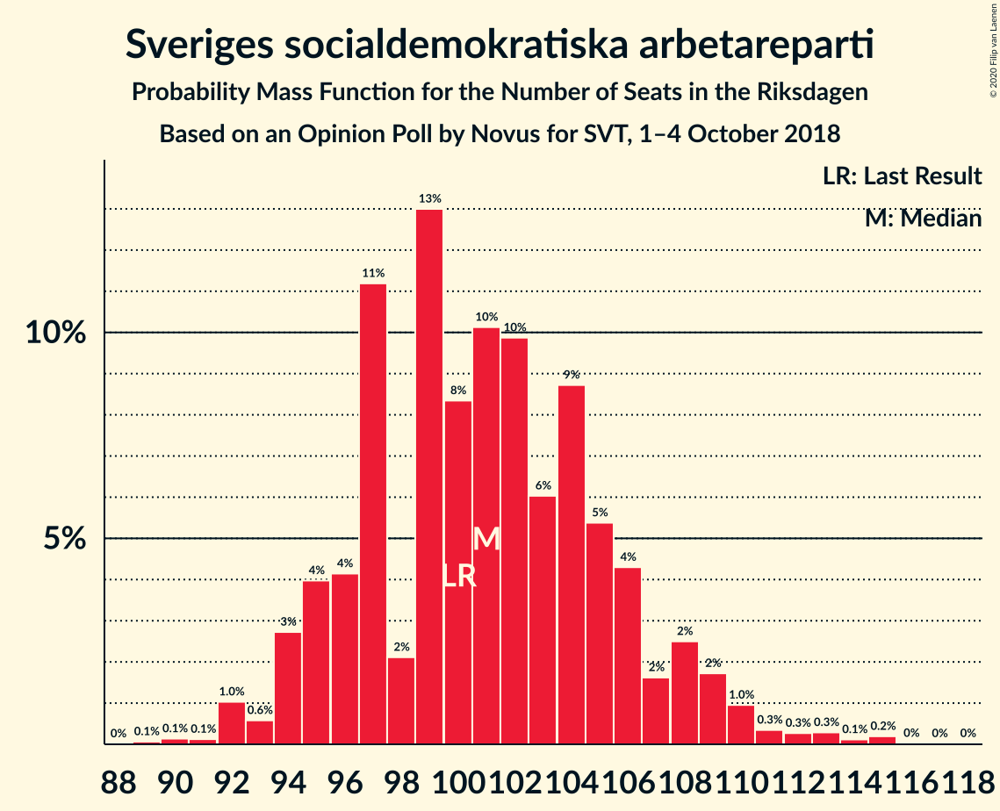
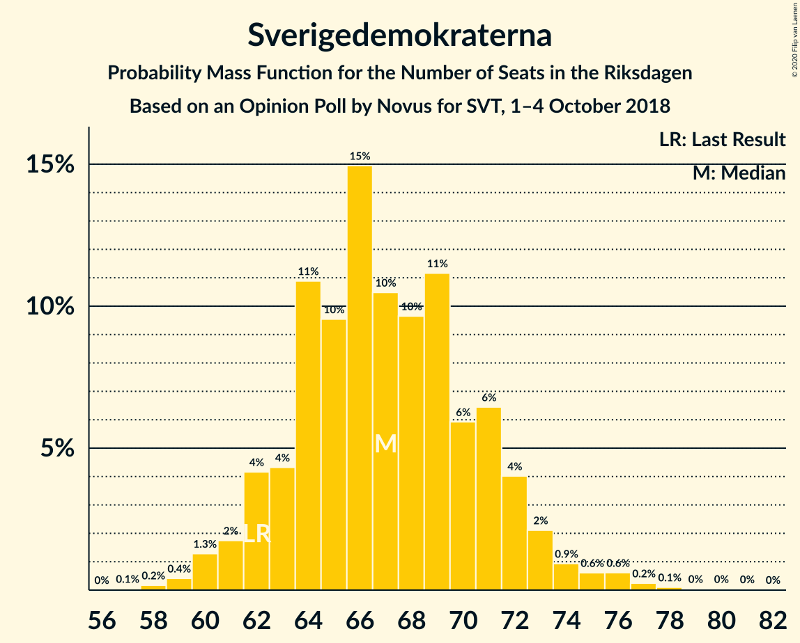
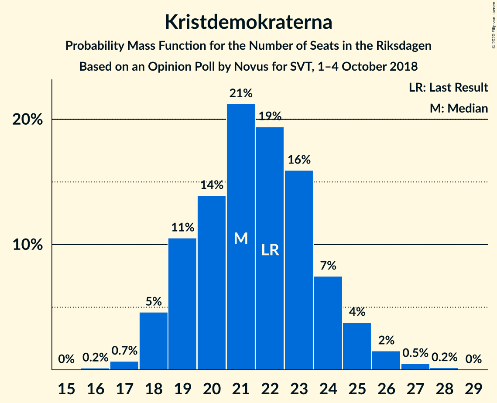
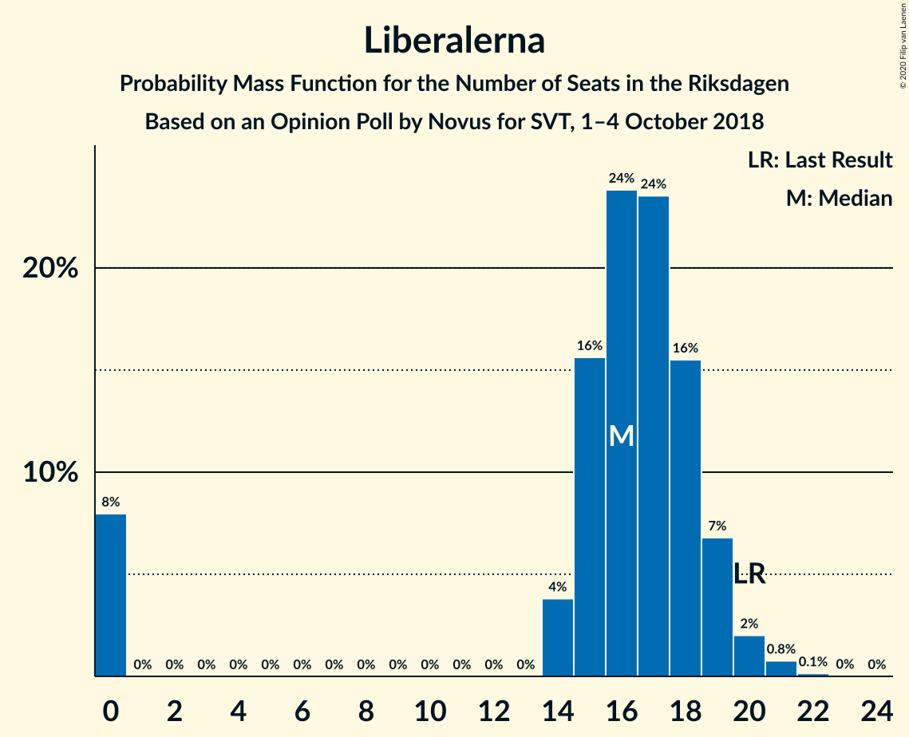
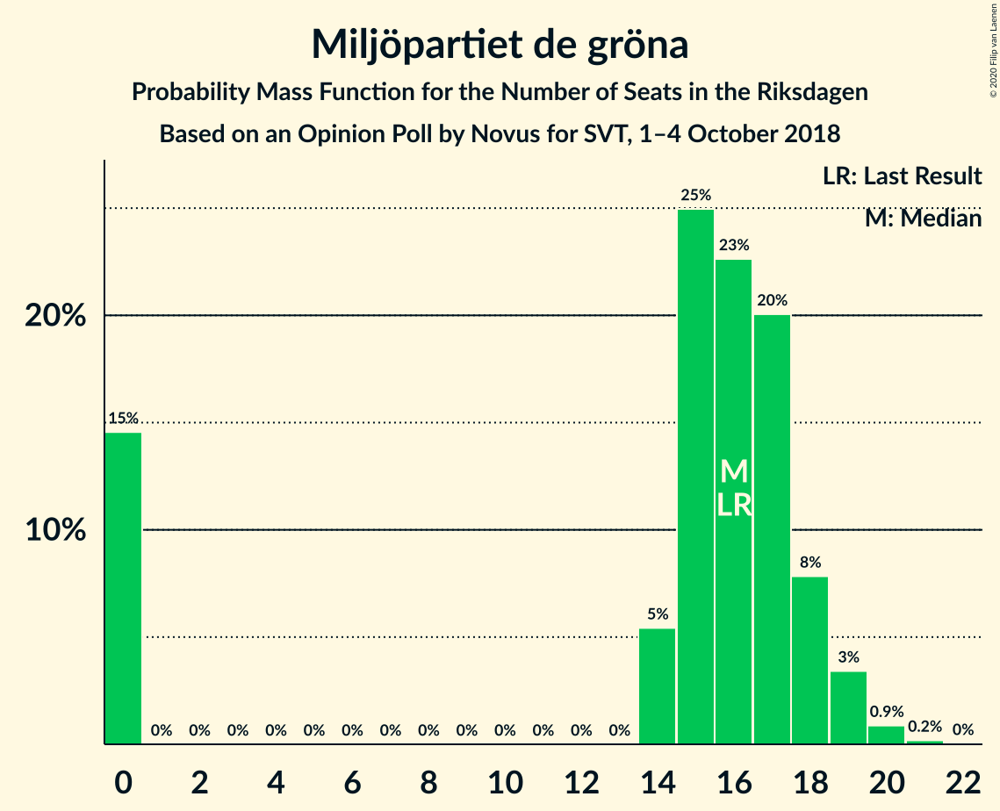

# Opinion Poll by Novus for SVT, 1–4 October 2018

<a href="#voting-intentions">Voting Intentions</a> | <a href="#seats">Seats</a> | <a href="#coalitions">Coalitions</a> | <a href="#technical-information">Technical Information</a>

## Voting Intentions

### Confidence Intervals

| Party | Last Result | Poll Result | 80% Confidence Interval | 90% Confidence Interval | 95% Confidence Interval | 99% Confidence Interval |
|:-----:|:-----------:|:-----------:|:-----------------------:|:-----------------------:|:-----------------------:|:-----------------------:|
| Sveriges socialdemokratiska arbetareparti | 28.3% | 28.3% | 27.1–29.6% |26.8–29.9% |26.5–30.2% |25.9–30.8% |
| Moderata samlingspartiet | 19.8% | 19.7% | 18.6–20.8% |18.3–21.1% |18.1–21.4% |17.6–21.9% |
| Sverigedemokraterna | 17.5% | 18.8% | 17.8–19.9% |17.5–20.2% |17.2–20.5% |16.8–21.0% |
| Centerpartiet | 8.6% | 8.4% | 7.7–9.2% |7.5–9.4% |7.3–9.6% |7.0–10.0% |
| Vänsterpartiet | 8.0% | 8.4% | 7.7–9.2% |7.5–9.4% |7.3–9.6% |7.0–10.0% |
| Kristdemokraterna | 6.3% | 6.0% | 5.4–6.7% |5.2–6.9% |5.1–7.1% |4.8–7.4% |
| Liberalerna | 5.5% | 4.6% | 4.1–5.2% |3.9–5.4% |3.8–5.5% |3.6–5.9% |
| Miljöpartiet de gröna | 4.4% | 4.4% | 3.9–5.0% |3.7–5.2% |3.6–5.4% |3.4–5.7% |

*Note:* The poll result column reflects the actual value used in the calculations. Published results may vary slightly, and in addition be rounded to fewer digits.

## Seats

### Confidence Intervals

| Party | Last Result | Median | 80% Confidence Interval | 90% Confidence Interval | 95% Confidence Interval | 99% Confidence Interval |
|:-----:|:-----------:|:------:|:-----------------------:|:-----------------------:|:-----------------------:|:-----------------------:|
| <a href="#sveriges-socialdemokratiska-arbetareparti">Sveriges socialdemokratiska arbetareparti</a> | 100 | 103 | 102–103 |102–107 |97–111 |97–114 |
| <a href="#moderata-samlingspartiet">Moderata samlingspartiet</a> | 70 | 73 | 72–73 |68–73 |65–74 |64–77 |
| <a href="#sverigedemokraterna">Sverigedemokraterna</a> | 62 | 67 | 67 |65–68 |63–68 |63–70 |
| <a href="#centerpartiet">Centerpartiet</a> | 31 | 31 | 28–31 |25–31 |25–31 |25–31 |
| <a href="#vänsterpartiet">Vänsterpartiet</a> | 28 | 31 | 29–31 |25–31 |25–32 |25–34 |
| <a href="#kristdemokraterna">Kristdemokraterna</a> | 22 | 28 | 24–28 |23–28 |23–28 |22–28 |
| <a href="#liberalerna">Liberalerna</a> | 20 | 0 | 0–17 |0–18 |0–21 |0–21 |
| <a href="#miljöpartiet-de-gröna">Miljöpartiet de gröna</a> | 16 | 16 | 16 |15–16 |0–17 |0–18 |

### Sveriges socialdemokratiska arbetareparti

*For a full overview of the results for this party, see the [Sveriges socialdemokratiska arbetareparti](party-sverigessocialdemokratiskaarbetareparti.html) page.*

| Number of Seats | Probability | Accumulated | Special Marks |
|:---------------:|:-----------:|:-----------:|:-------------:|
| 89 | 0.1% | 100% |  |
| 90 | 0% | 99.9% |  |
| 91 | 0% | 99.9% |  |
| 92 | 0.2% | 99.9% |  |
| 93 | 0% | 99.7% |  |
| 94 | 0% | 99.6% |  |
| 95 | 0% | 99.6% |  |
| 96 | 0% | 99.6% |  |
| 97 | 4% | 99.6% |  |
| 98 | 0.1% | 96% |  |
| 99 | 0.1% | 96% |  |
| 100 | 0% | 96% | Last Result |
| 101 | 0% | 96% |  |
| 102 | 7% | 96% |  |
| 103 | 83% | 89% | Median |
| 104 | 0% | 5% |  |
| 105 | 0% | 5% |  |
| 106 | 0% | 5% |  |
| 107 | 0.6% | 5% |  |
| 108 | 2% | 5% |  |
| 109 | 0% | 3% |  |
| 110 | 0% | 3% |  |
| 111 | 0.3% | 3% |  |
| 112 | 0.7% | 2% |  |
| 113 | 0% | 2% |  |
| 114 | 2% | 2% |  |
| 115 | 0% | 0% |  |

### Moderata samlingspartiet

*For a full overview of the results for this party, see the [Moderata samlingspartiet](party-moderatasamlingspartiet.html) page.*

| Number of Seats | Probability | Accumulated | Special Marks |
|:---------------:|:-----------:|:-----------:|:-------------:|
| 64 | 2% | 100% |  |
| 65 | 3% | 98% |  |
| 66 | 0% | 95% |  |
| 67 | 0% | 95% |  |
| 68 | 2% | 95% |  |
| 69 | 0% | 93% |  |
| 70 | 0% | 93% | Last Result |
| 71 | 0% | 93% |  |
| 72 | 7% | 93% |  |
| 73 | 84% | 86% | Median |
| 74 | 2% | 3% |  |
| 75 | 0% | 0.8% |  |
| 76 | 0% | 0.8% |  |
| 77 | 0.6% | 0.8% |  |
| 78 | 0% | 0.2% |  |
| 79 | 0.1% | 0.2% |  |
| 80 | 0% | 0.1% |  |
| 81 | 0.1% | 0.1% |  |
| 82 | 0% | 0% |  |

### Sverigedemokraterna

*For a full overview of the results for this party, see the [Sverigedemokraterna](party-sverigedemokraterna.html) page.*

| Number of Seats | Probability | Accumulated | Special Marks |
|:---------------:|:-----------:|:-----------:|:-------------:|
| 58 | 0% | 100% |  |
| 59 | 0.3% | 99.9% |  |
| 60 | 0% | 99.7% |  |
| 61 | 0% | 99.7% |  |
| 62 | 0% | 99.6% | Last Result |
| 63 | 2% | 99.6% |  |
| 64 | 2% | 97% |  |
| 65 | 2% | 95% |  |
| 66 | 2% | 93% |  |
| 67 | 83% | 92% | Median |
| 68 | 8% | 8% |  |
| 69 | 0% | 0.9% |  |
| 70 | 0.7% | 0.8% |  |
| 71 | 0.1% | 0.1% |  |
| 72 | 0% | 0% |  |

### Centerpartiet

*For a full overview of the results for this party, see the [Centerpartiet](party-centerpartiet.html) page.*

| Number of Seats | Probability | Accumulated | Special Marks |
|:---------------:|:-----------:|:-----------:|:-------------:|
| 25 | 8% | 100% |  |
| 26 | 2% | 92% |  |
| 27 | 0% | 90% |  |
| 28 | 2% | 90% |  |
| 29 | 0.1% | 88% |  |
| 30 | 3% | 88% |  |
| 31 | 85% | 85% | Last Result, Median |
| 32 | 0% | 0.1% |  |
| 33 | 0% | 0.1% |  |
| 34 | 0% | 0.1% |  |
| 35 | 0% | 0.1% |  |
| 36 | 0% | 0% |  |

### Vänsterpartiet

*For a full overview of the results for this party, see the [Vänsterpartiet](party-vänsterpartiet.html) page.*

| Number of Seats | Probability | Accumulated | Special Marks |
|:---------------:|:-----------:|:-----------:|:-------------:|
| 25 | 7% | 100% |  |
| 26 | 2% | 93% |  |
| 27 | 0.8% | 91% |  |
| 28 | 0% | 91% | Last Result |
| 29 | 2% | 91% |  |
| 30 | 3% | 89% |  |
| 31 | 83% | 86% | Median |
| 32 | 0.3% | 3% |  |
| 33 | 0% | 2% |  |
| 34 | 2% | 2% |  |
| 35 | 0% | 0.1% |  |
| 36 | 0.1% | 0.1% |  |
| 37 | 0% | 0% |  |

### Kristdemokraterna

*For a full overview of the results for this party, see the [Kristdemokraterna](party-kristdemokraterna.html) page.*

| Number of Seats | Probability | Accumulated | Special Marks |
|:---------------:|:-----------:|:-----------:|:-------------:|
| 21 | 0.3% | 100% |  |
| 22 | 2% | 99.6% | Last Result |
| 23 | 4% | 98% |  |
| 24 | 8% | 94% |  |
| 25 | 0.1% | 85% |  |
| 26 | 0.1% | 85% |  |
| 27 | 0% | 85% |  |
| 28 | 85% | 85% | Median |
| 29 | 0% | 0% |  |

### Liberalerna

*For a full overview of the results for this party, see the [Liberalerna](party-liberalerna.html) page.*

| Number of Seats | Probability | Accumulated | Special Marks |
|:---------------:|:-----------:|:-----------:|:-------------:|
| 0 | 84% | 100% | Median |
| 1 | 0% | 16% |  |
| 2 | 0% | 16% |  |
| 3 | 0% | 16% |  |
| 4 | 0% | 16% |  |
| 5 | 0% | 16% |  |
| 6 | 0% | 16% |  |
| 7 | 0% | 16% |  |
| 8 | 0% | 16% |  |
| 9 | 0% | 16% |  |
| 10 | 0% | 16% |  |
| 11 | 0% | 16% |  |
| 12 | 0% | 16% |  |
| 13 | 0% | 16% |  |
| 14 | 0.3% | 16% |  |
| 15 | 0% | 16% |  |
| 16 | 2% | 16% |  |
| 17 | 7% | 14% |  |
| 18 | 2% | 7% |  |
| 19 | 2% | 5% |  |
| 20 | 0% | 3% | Last Result |
| 21 | 3% | 3% |  |
| 22 | 0% | 0% |  |

### Miljöpartiet de gröna

*For a full overview of the results for this party, see the [Miljöpartiet de gröna](party-miljöpartietdegröna.html) page.*

| Number of Seats | Probability | Accumulated | Special Marks |
|:---------------:|:-----------:|:-----------:|:-------------:|
| 0 | 3% | 100% |  |
| 1 | 0% | 97% |  |
| 2 | 0% | 97% |  |
| 3 | 0% | 97% |  |
| 4 | 0% | 97% |  |
| 5 | 0% | 97% |  |
| 6 | 0% | 97% |  |
| 7 | 0% | 97% |  |
| 8 | 0% | 97% |  |
| 9 | 0% | 97% |  |
| 10 | 0% | 97% |  |
| 11 | 0% | 97% |  |
| 12 | 0% | 97% |  |
| 13 | 0% | 97% |  |
| 14 | 0.3% | 97% |  |
| 15 | 4% | 97% |  |
| 16 | 90% | 93% | Last Result, Median |
| 17 | 2% | 3% |  |
| 18 | 0.7% | 1.0% |  |
| 19 | 0% | 0.3% |  |
| 20 | 0.3% | 0.3% |  |
| 21 | 0% | 0% |  |

## Coalitions

### Confidence Intervals

| Coalition | Last Result | Median | Majority? | 80% Confidence Interval | 90% Confidence Interval | 95% Confidence Interval | 99% Confidence Interval |
|:---------:|:-----------:|:------:|:---------:|:-----------------------:|:-----------------------:|:-----------------------:|:-----------------------:|
| Sveriges socialdemokratiska arbetareparti – Moderata samlingspartiet – Centerpartiet | 201 | 207 | 100% | 199–207 | 199–207 | 196–209 | 191–214 |
| Sveriges socialdemokratiska arbetareparti – Moderata samlingspartiet | 170 | 176 | 87% | 174–176 | 173–176 | 165–184 | 161–188 |
| Moderata samlingspartiet – Sverigedemokraterna – Kristdemokraterna | 154 | 168 | 0.1% | 164–168 | 159–168 | 152–168 | 150–169 |
| Sveriges socialdemokratiska arbetareparti – Vänsterpartiet – Miljöpartiet de gröna | 144 | 150 | 0% | 143–150 | 143–150 | 139–153 | 138–155 |
| Moderata samlingspartiet – Centerpartiet – Kristdemokraterna – Liberalerna | 143 | 132 | 0% | 132–138 | 132–138 | 131–142 | 126–145 |
| Moderata samlingspartiet – Sverigedemokraterna | 132 | 140 | 0% | 140 | 134–140 | 130–140 | 127–145 |
| Sveriges socialdemokratiska arbetareparti – Vänsterpartiet | 128 | 134 | 0% | 131–134 | 127–137 | 127–139 | 123–143 |
| Moderata samlingspartiet – Centerpartiet – Kristdemokraterna | 123 | 132 | 0% | 121–132 | 119–132 | 117–132 | 115–132 |
| Sveriges socialdemokratiska arbetareparti – Miljöpartiet de gröna | 116 | 119 | 0% | 118–119 | 114–119 | 112–123 | 112–125 |
| Moderata samlingspartiet – Centerpartiet – Liberalerna | 121 | 104 | 0% | 104–114 | 104–115 | 104–117 | 102–119 |
| Moderata samlingspartiet – Centerpartiet | 101 | 104 | 0% | 97–104 | 97–104 | 94–104 | 93–104 |

### Sveriges socialdemokratiska arbetareparti – Moderata samlingspartiet – Centerpartiet

| Number of Seats | Probability | Accumulated | Special Marks |
|:---------------:|:-----------:|:-----------:|:-------------:|
| 191 | 2% | 100% |  |
| 192 | 0% | 98% |  |
| 193 | 0% | 98% |  |
| 194 | 0% | 98% |  |
| 195 | 0% | 98% |  |
| 196 | 2% | 98% |  |
| 197 | 0% | 96% |  |
| 198 | 0.1% | 96% |  |
| 199 | 7% | 96% |  |
| 200 | 0% | 89% |  |
| 201 | 2% | 89% | Last Result |
| 202 | 0% | 87% |  |
| 203 | 0% | 87% |  |
| 204 | 0% | 87% |  |
| 205 | 0% | 87% |  |
| 206 | 0% | 87% |  |
| 207 | 84% | 87% | Median |
| 208 | 0% | 3% |  |
| 209 | 0.9% | 3% |  |
| 210 | 0% | 2% |  |
| 211 | 0% | 2% |  |
| 212 | 0% | 2% |  |
| 213 | 0% | 2% |  |
| 214 | 2% | 2% |  |
| 215 | 0% | 0% |  |

### Sveriges socialdemokratiska arbetareparti – Moderata samlingspartiet

| Number of Seats | Probability | Accumulated | Special Marks |
|:---------------:|:-----------:|:-----------:|:-------------:|
| 161 | 2% | 100% |  |
| 162 | 0% | 98% |  |
| 163 | 0% | 98% |  |
| 164 | 0% | 98% |  |
| 165 | 2% | 98% |  |
| 166 | 0% | 96% |  |
| 167 | 0% | 96% |  |
| 168 | 0.1% | 96% |  |
| 169 | 0% | 96% |  |
| 170 | 0% | 96% | Last Result |
| 171 | 0.1% | 96% |  |
| 172 | 0% | 96% |  |
| 173 | 2% | 96% |  |
| 174 | 7% | 94% |  |
| 175 | 0% | 87% | Majority |
| 176 | 83% | 87% | Median |
| 177 | 0.7% | 4% |  |
| 178 | 0% | 3% |  |
| 179 | 0.1% | 3% |  |
| 180 | 0% | 3% |  |
| 181 | 0% | 3% |  |
| 182 | 0% | 3% |  |
| 183 | 0% | 3% |  |
| 184 | 0.9% | 3% |  |
| 185 | 0% | 2% |  |
| 186 | 0% | 2% |  |
| 187 | 0% | 2% |  |
| 188 | 2% | 2% |  |
| 189 | 0% | 0% |  |

### Moderata samlingspartiet – Sverigedemokraterna – Kristdemokraterna

| Number of Seats | Probability | Accumulated | Special Marks |
|:---------------:|:-----------:|:-----------:|:-------------:|
| 150 | 2% | 100% |  |
| 151 | 0% | 98% |  |
| 152 | 2% | 98% |  |
| 153 | 0.3% | 96% |  |
| 154 | 0% | 96% | Last Result |
| 155 | 0% | 96% |  |
| 156 | 0% | 96% |  |
| 157 | 0% | 96% |  |
| 158 | 0% | 96% |  |
| 159 | 0.8% | 96% |  |
| 160 | 0.2% | 95% |  |
| 161 | 2% | 95% |  |
| 162 | 2% | 93% |  |
| 163 | 0% | 91% |  |
| 164 | 7% | 91% |  |
| 165 | 0% | 84% |  |
| 166 | 0% | 84% |  |
| 167 | 0% | 84% |  |
| 168 | 83% | 84% | Median |
| 169 | 0.6% | 0.8% |  |
| 170 | 0% | 0.1% |  |
| 171 | 0% | 0.1% |  |
| 172 | 0% | 0.1% |  |
| 173 | 0% | 0.1% |  |
| 174 | 0% | 0.1% |  |
| 175 | 0% | 0.1% | Majority |
| 176 | 0% | 0.1% |  |
| 177 | 0.1% | 0.1% |  |
| 178 | 0% | 0% |  |

### Sveriges socialdemokratiska arbetareparti – Vänsterpartiet – Miljöpartiet de gröna

| Number of Seats | Probability | Accumulated | Special Marks |
|:---------------:|:-----------:|:-----------:|:-------------:|
| 127 | 0.1% | 100% |  |
| 128 | 0% | 99.9% |  |
| 129 | 0% | 99.9% |  |
| 130 | 0% | 99.9% |  |
| 131 | 0% | 99.9% |  |
| 132 | 0% | 99.9% |  |
| 133 | 0% | 99.9% |  |
| 134 | 0.1% | 99.9% |  |
| 135 | 0% | 99.8% |  |
| 136 | 0% | 99.8% |  |
| 137 | 0% | 99.8% |  |
| 138 | 2% | 99.8% |  |
| 139 | 0.7% | 98% |  |
| 140 | 0% | 97% |  |
| 141 | 0% | 97% |  |
| 142 | 0.1% | 97% |  |
| 143 | 9% | 97% |  |
| 144 | 0% | 89% | Last Result |
| 145 | 0% | 89% |  |
| 146 | 0.2% | 89% |  |
| 147 | 0% | 88% |  |
| 148 | 2% | 88% |  |
| 149 | 0% | 86% |  |
| 150 | 83% | 86% | Median |
| 151 | 0% | 3% |  |
| 152 | 0% | 3% |  |
| 153 | 2% | 3% |  |
| 154 | 0% | 0.9% |  |
| 155 | 0.6% | 0.9% |  |
| 156 | 0% | 0.3% |  |
| 157 | 0.3% | 0.3% |  |
| 158 | 0% | 0% |  |

### Moderata samlingspartiet – Centerpartiet – Kristdemokraterna – Liberalerna

| Number of Seats | Probability | Accumulated | Special Marks |
|:---------------:|:-----------:|:-----------:|:-------------:|
| 126 | 0.6% | 100% |  |
| 127 | 0% | 99.4% |  |
| 128 | 0% | 99.4% |  |
| 129 | 0% | 99.4% |  |
| 130 | 0% | 99.4% |  |
| 131 | 2% | 99.4% |  |
| 132 | 83% | 97% | Median |
| 133 | 0.3% | 14% |  |
| 134 | 0% | 14% |  |
| 135 | 0% | 14% |  |
| 136 | 0% | 14% |  |
| 137 | 0% | 14% |  |
| 138 | 9% | 14% |  |
| 139 | 0% | 5% |  |
| 140 | 1.0% | 5% |  |
| 141 | 0% | 4% |  |
| 142 | 2% | 4% |  |
| 143 | 0% | 2% | Last Result |
| 144 | 0% | 2% |  |
| 145 | 2% | 2% |  |
| 146 | 0% | 0.2% |  |
| 147 | 0% | 0.2% |  |
| 148 | 0% | 0.2% |  |
| 149 | 0% | 0.2% |  |
| 150 | 0% | 0.2% |  |
| 151 | 0.2% | 0.2% |  |
| 152 | 0% | 0% |  |

### Moderata samlingspartiet – Sverigedemokraterna

| Number of Seats | Probability | Accumulated | Special Marks |
|:---------------:|:-----------:|:-----------:|:-------------:|
| 127 | 2% | 100% |  |
| 128 | 0% | 98% |  |
| 129 | 0.1% | 98% |  |
| 130 | 2% | 98% |  |
| 131 | 0% | 96% |  |
| 132 | 0.3% | 96% | Last Result |
| 133 | 0% | 96% |  |
| 134 | 2% | 96% |  |
| 135 | 0.7% | 94% |  |
| 136 | 0.3% | 93% |  |
| 137 | 0% | 93% |  |
| 138 | 2% | 93% |  |
| 139 | 0% | 91% |  |
| 140 | 90% | 91% | Median |
| 141 | 0% | 0.9% |  |
| 142 | 0% | 0.9% |  |
| 143 | 0.1% | 0.8% |  |
| 144 | 0% | 0.8% |  |
| 145 | 0.6% | 0.7% |  |
| 146 | 0% | 0.1% |  |
| 147 | 0% | 0.1% |  |
| 148 | 0% | 0.1% |  |
| 149 | 0% | 0.1% |  |
| 150 | 0% | 0.1% |  |
| 151 | 0% | 0.1% |  |
| 152 | 0.1% | 0.1% |  |
| 153 | 0% | 0% |  |

### Sveriges socialdemokratiska arbetareparti – Vänsterpartiet

| Number of Seats | Probability | Accumulated | Special Marks |
|:---------------:|:-----------:|:-----------:|:-------------:|
| 116 | 0.1% | 100% |  |
| 117 | 0% | 99.9% |  |
| 118 | 0% | 99.9% |  |
| 119 | 0% | 99.9% |  |
| 120 | 0% | 99.9% |  |
| 121 | 0% | 99.9% |  |
| 122 | 0% | 99.9% |  |
| 123 | 2% | 99.9% |  |
| 124 | 0% | 98% |  |
| 125 | 0% | 98% |  |
| 126 | 0.2% | 98% |  |
| 127 | 7% | 98% |  |
| 128 | 0% | 91% | Last Result |
| 129 | 0% | 91% |  |
| 130 | 0% | 91% |  |
| 131 | 2% | 91% |  |
| 132 | 0% | 89% |  |
| 133 | 0% | 89% |  |
| 134 | 83% | 89% | Median |
| 135 | 0% | 5% |  |
| 136 | 0% | 5% |  |
| 137 | 0.6% | 5% |  |
| 138 | 2% | 5% |  |
| 139 | 0.7% | 3% |  |
| 140 | 0% | 2% |  |
| 141 | 0% | 2% |  |
| 142 | 0% | 2% |  |
| 143 | 2% | 2% |  |
| 144 | 0% | 0% |  |

### Moderata samlingspartiet – Centerpartiet – Kristdemokraterna

| Number of Seats | Probability | Accumulated | Special Marks |
|:---------------:|:-----------:|:-----------:|:-------------:|
| 115 | 2% | 100% |  |
| 116 | 0% | 98% |  |
| 117 | 2% | 98% |  |
| 118 | 0% | 96% |  |
| 119 | 1.0% | 96% |  |
| 120 | 0% | 95% |  |
| 121 | 7% | 95% |  |
| 122 | 0% | 88% |  |
| 123 | 2% | 88% | Last Result |
| 124 | 0% | 86% |  |
| 125 | 0% | 86% |  |
| 126 | 0.6% | 86% |  |
| 127 | 2% | 85% |  |
| 128 | 0% | 84% |  |
| 129 | 0% | 84% |  |
| 130 | 0.1% | 84% |  |
| 131 | 0% | 83% |  |
| 132 | 83% | 83% | Median |
| 133 | 0% | 0.1% |  |
| 134 | 0.1% | 0.1% |  |
| 135 | 0% | 0% |  |

### Sveriges socialdemokratiska arbetareparti – Miljöpartiet de gröna

| Number of Seats | Probability | Accumulated | Special Marks |
|:---------------:|:-----------:|:-----------:|:-------------:|
| 98 | 0.1% | 100% |  |
| 99 | 0% | 99.9% |  |
| 100 | 0% | 99.9% |  |
| 101 | 0% | 99.9% |  |
| 102 | 0% | 99.9% |  |
| 103 | 0% | 99.9% |  |
| 104 | 0% | 99.9% |  |
| 105 | 0% | 99.8% |  |
| 106 | 0% | 99.8% |  |
| 107 | 0.1% | 99.8% |  |
| 108 | 0% | 99.7% |  |
| 109 | 0% | 99.7% |  |
| 110 | 0% | 99.7% |  |
| 111 | 0% | 99.7% |  |
| 112 | 3% | 99.7% |  |
| 113 | 0% | 97% |  |
| 114 | 4% | 97% |  |
| 115 | 0% | 93% |  |
| 116 | 0% | 93% | Last Result |
| 117 | 0% | 93% |  |
| 118 | 7% | 93% |  |
| 119 | 83% | 86% | Median |
| 120 | 0% | 3% |  |
| 121 | 0% | 3% |  |
| 122 | 0% | 3% |  |
| 123 | 2% | 3% |  |
| 124 | 0% | 0.9% |  |
| 125 | 0.9% | 0.9% |  |
| 126 | 0% | 0% |  |

### Moderata samlingspartiet – Centerpartiet – Liberalerna

| Number of Seats | Probability | Accumulated | Special Marks |
|:---------------:|:-----------:|:-----------:|:-------------:|
| 102 | 0.6% | 100% |  |
| 103 | 0% | 99.4% |  |
| 104 | 83% | 99.4% | Median |
| 105 | 0% | 16% |  |
| 106 | 0% | 16% |  |
| 107 | 0% | 16% |  |
| 108 | 0% | 16% |  |
| 109 | 2% | 16% |  |
| 110 | 0% | 14% |  |
| 111 | 0% | 14% |  |
| 112 | 0.3% | 14% |  |
| 113 | 0% | 14% |  |
| 114 | 7% | 14% |  |
| 115 | 2% | 7% |  |
| 116 | 0.9% | 5% |  |
| 117 | 2% | 4% |  |
| 118 | 0% | 2% |  |
| 119 | 2% | 2% |  |
| 120 | 0% | 0.3% |  |
| 121 | 0% | 0.3% | Last Result |
| 122 | 0% | 0.2% |  |
| 123 | 0% | 0.2% |  |
| 124 | 0% | 0.2% |  |
| 125 | 0% | 0.2% |  |
| 126 | 0.1% | 0.2% |  |
| 127 | 0% | 0.1% |  |
| 128 | 0% | 0.1% |  |
| 129 | 0% | 0.1% |  |
| 130 | 0.1% | 0.1% |  |
| 131 | 0% | 0% |  |

### Moderata samlingspartiet – Centerpartiet

| Number of Seats | Probability | Accumulated | Special Marks |
|:---------------:|:-----------:|:-----------:|:-------------:|
| 93 | 2% | 100% |  |
| 94 | 2% | 98% |  |
| 95 | 0.7% | 96% |  |
| 96 | 0% | 95% |  |
| 97 | 7% | 95% |  |
| 98 | 0.3% | 88% |  |
| 99 | 2% | 88% |  |
| 100 | 2% | 86% |  |
| 101 | 0% | 84% | Last Result |
| 102 | 0.6% | 84% |  |
| 103 | 0% | 84% |  |
| 104 | 83% | 84% | Median |
| 105 | 0% | 0.3% |  |
| 106 | 0% | 0.2% |  |
| 107 | 0% | 0.2% |  |
| 108 | 0% | 0.2% |  |
| 109 | 0.2% | 0.2% |  |
| 110 | 0% | 0% |  |

## Technical Information

### Opinion Poll

+ **Polling firm:** Novus
+ **Commissioner(s):** SVT
+ **Fieldwork period:** 1–4 October 2018

### Calculations

+ **Sample size:** 2200
+ **Simulations done:** 1,024
+ **Error estimate:** 1.59%

