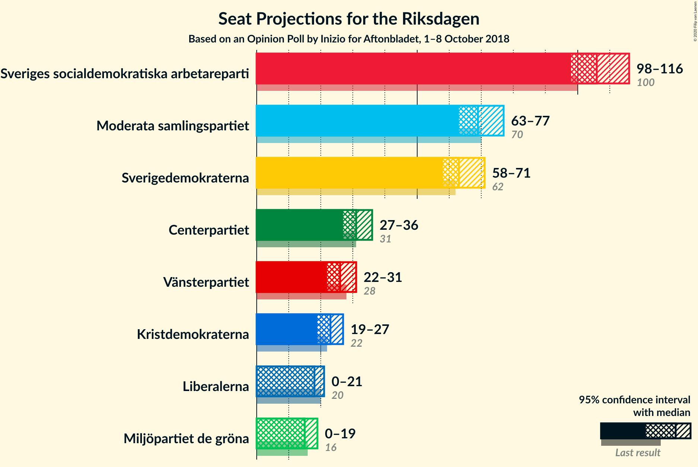
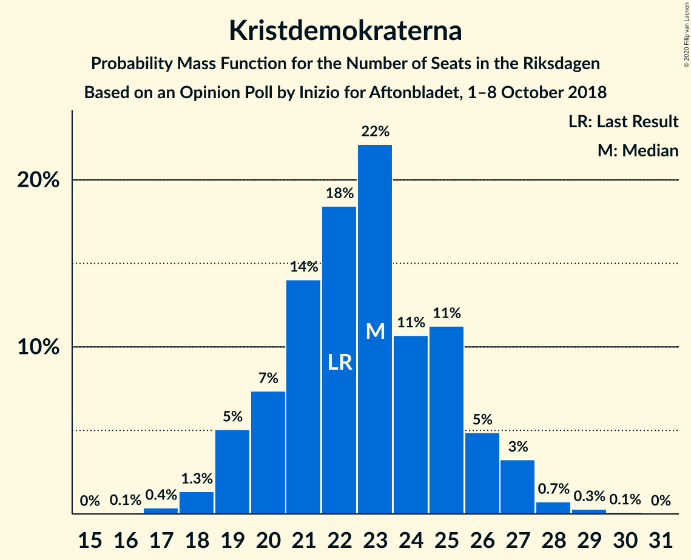
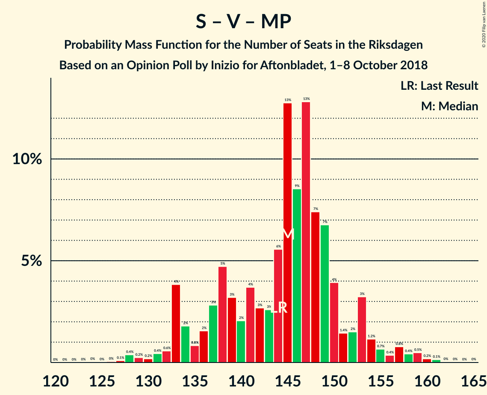

# Opinion Poll by Inizio for Aftonbladet, 1–8 October 2018

<a href="#voting-intentions">Voting Intentions</a> | <a href="#seats">Seats</a> | <a href="#coalitions">Coalitions</a> | <a href="#technical-information">Technical Information</a>

## Voting Intentions

### Confidence Intervals

| Party | Last Result | Poll Result | 80% Confidence Interval | 90% Confidence Interval | 95% Confidence Interval | 99% Confidence Interval |
|:-----:|:-----------:|:-----------:|:-----------------------:|:-----------------------:|:-----------------------:|:-----------------------:|
| Sveriges socialdemokratiska arbetareparti | 28.3% | 29.7% | 28.3–31.1% |27.9–31.5% |27.6–31.9% |26.9–32.5% |
| Moderata samlingspartiet | 19.8% | 19.3% | 18.2–20.6% |17.8–21.0% |17.6–21.3% |17.0–21.9% |
| Sverigedemokraterna | 17.5% | 17.9% | 16.7–19.1% |16.4–19.4% |16.1–19.7% |15.6–20.3% |
| Centerpartiet | 8.6% | 8.7% | 7.9–9.6% |7.6–9.9% |7.5–10.1% |7.1–10.5% |
| Vänsterpartiet | 8.0% | 7.3% | 6.5–8.1% |6.3–8.4% |6.1–8.6% |5.8–9.0% |
| Kristdemokraterna | 6.3% | 6.3% | 5.6–7.1% |5.4–7.3% |5.2–7.5% |4.9–7.9% |
| Liberalerna | 5.5% | 4.9% | 4.3–5.6% |4.1–5.8% |4.0–6.0% |3.7–6.4% |
| Miljöpartiet de gröna | 4.4% | 4.3% | 3.7–5.0% |3.6–5.2% |3.5–5.4% |3.2–5.7% |

*Note:* The poll result column reflects the actual value used in the calculations. Published results may vary slightly, and in addition be rounded to fewer digits.

## Seats

### Confidence Intervals

| Party | Last Result | Median | 80% Confidence Interval | 90% Confidence Interval | 95% Confidence Interval | 99% Confidence Interval |
|:-----:|:-----------:|:------:|:-----------------------:|:-----------------------:|:-----------------------:|:-----------------------:|
| <a href="#sveriges-socialdemokratiska-arbetareparti">Sveriges socialdemokratiska arbetareparti</a> | 100 | 106 | 101–112 |100–114 |98–116 |95–120 |
| <a href="#moderata-samlingspartiet">Moderata samlingspartiet</a> | 70 | 69 | 65–74 |64–75 |63–77 |60–80 |
| <a href="#sverigedemokraterna">Sverigedemokraterna</a> | 62 | 63 | 60–68 |58–70 |58–71 |55–74 |
| <a href="#centerpartiet">Centerpartiet</a> | 31 | 31 | 28–34 |27–35 |27–36 |25–38 |
| <a href="#vänsterpartiet">Vänsterpartiet</a> | 28 | 26 | 23–29 |23–30 |22–31 |21–32 |
| <a href="#kristdemokraterna">Kristdemokraterna</a> | 22 | 23 | 20–25 |19–26 |19–27 |18–28 |
| <a href="#liberalerna">Liberalerna</a> | 20 | 18 | 15–20 |15–21 |0–21 |0–23 |
| <a href="#miljöpartiet-de-gröna">Miljöpartiet de gröna</a> | 16 | 15 | 0–18 |0–18 |0–19 |0–20 |

### Sveriges socialdemokratiska arbetareparti

*For a full overview of the results for this party, see the [Sveriges socialdemokratiska arbetareparti](party-sverigessocialdemokratiskaarbetareparti.html) page.*

| Number of Seats | Probability | Accumulated | Special Marks |
|:---------------:|:-----------:|:-----------:|:-------------:|
| 93 | 0.1% | 100% |  |
| 94 | 0.1% | 99.9% |  |
| 95 | 0.4% | 99.8% |  |
| 96 | 0.5% | 99.4% |  |
| 97 | 0.8% | 98.9% |  |
| 98 | 1.5% | 98% |  |
| 99 | 2% | 97% |  |
| 100 | 3% | 95% | Last Result |
| 101 | 4% | 93% |  |
| 102 | 4% | 88% |  |
| 103 | 7% | 84% |  |
| 104 | 11% | 77% |  |
| 105 | 7% | 66% |  |
| 106 | 11% | 59% | Median |
| 107 | 15% | 47% |  |
| 108 | 8% | 32% |  |
| 109 | 5% | 24% |  |
| 110 | 3% | 19% |  |
| 111 | 3% | 15% |  |
| 112 | 5% | 12% |  |
| 113 | 2% | 8% |  |
| 114 | 2% | 6% |  |
| 115 | 1.4% | 4% |  |
| 116 | 0.9% | 3% |  |
| 117 | 0.5% | 2% |  |
| 118 | 0.3% | 1.2% |  |
| 119 | 0.4% | 1.0% |  |
| 120 | 0.3% | 0.5% |  |
| 121 | 0.1% | 0.2% |  |
| 122 | 0.1% | 0.1% |  |
| 123 | 0% | 0.1% |  |
| 124 | 0% | 0% |  |

### Moderata samlingspartiet

*For a full overview of the results for this party, see the [Moderata samlingspartiet](party-moderatasamlingspartiet.html) page.*

| Number of Seats | Probability | Accumulated | Special Marks |
|:---------------:|:-----------:|:-----------:|:-------------:|
| 58 | 0% | 100% |  |
| 59 | 0.1% | 99.9% |  |
| 60 | 0.4% | 99.9% |  |
| 61 | 0.7% | 99.5% |  |
| 62 | 1.2% | 98.8% |  |
| 63 | 2% | 98% |  |
| 64 | 3% | 95% |  |
| 65 | 3% | 92% |  |
| 66 | 5% | 89% |  |
| 67 | 8% | 85% |  |
| 68 | 23% | 77% |  |
| 69 | 10% | 54% | Median |
| 70 | 8% | 44% | Last Result |
| 71 | 9% | 36% |  |
| 72 | 7% | 27% |  |
| 73 | 5% | 20% |  |
| 74 | 6% | 15% |  |
| 75 | 5% | 9% |  |
| 76 | 2% | 4% |  |
| 77 | 1.4% | 3% |  |
| 78 | 0.6% | 1.4% |  |
| 79 | 0.2% | 0.8% |  |
| 80 | 0.2% | 0.5% |  |
| 81 | 0.3% | 0.4% |  |
| 82 | 0.1% | 0.1% |  |
| 83 | 0% | 0% |  |

### Sverigedemokraterna

*For a full overview of the results for this party, see the [Sverigedemokraterna](party-sverigedemokraterna.html) page.*

| Number of Seats | Probability | Accumulated | Special Marks |
|:---------------:|:-----------:|:-----------:|:-------------:|
| 53 | 0% | 100% |  |
| 54 | 0.1% | 99.9% |  |
| 55 | 0.4% | 99.8% |  |
| 56 | 0.8% | 99.4% |  |
| 57 | 1.0% | 98.6% |  |
| 58 | 3% | 98% |  |
| 59 | 2% | 95% |  |
| 60 | 8% | 92% |  |
| 61 | 7% | 84% |  |
| 62 | 12% | 78% | Last Result |
| 63 | 17% | 66% | Median |
| 64 | 9% | 49% |  |
| 65 | 10% | 40% |  |
| 66 | 6% | 31% |  |
| 67 | 7% | 24% |  |
| 68 | 8% | 17% |  |
| 69 | 4% | 10% |  |
| 70 | 3% | 6% |  |
| 71 | 2% | 4% |  |
| 72 | 0.7% | 2% |  |
| 73 | 0.4% | 0.9% |  |
| 74 | 0.3% | 0.6% |  |
| 75 | 0.1% | 0.2% |  |
| 76 | 0.1% | 0.1% |  |
| 77 | 0% | 0.1% |  |
| 78 | 0% | 0% |  |

### Centerpartiet

*For a full overview of the results for this party, see the [Centerpartiet](party-centerpartiet.html) page.*

| Number of Seats | Probability | Accumulated | Special Marks |
|:---------------:|:-----------:|:-----------:|:-------------:|
| 24 | 0.2% | 100% |  |
| 25 | 0.6% | 99.8% |  |
| 26 | 1.2% | 99.2% |  |
| 27 | 5% | 98% |  |
| 28 | 7% | 93% |  |
| 29 | 9% | 86% |  |
| 30 | 15% | 77% |  |
| 31 | 22% | 62% | Last Result, Median |
| 32 | 11% | 40% |  |
| 33 | 15% | 29% |  |
| 34 | 5% | 14% |  |
| 35 | 4% | 9% |  |
| 36 | 3% | 5% |  |
| 37 | 0.8% | 2% |  |
| 38 | 0.4% | 0.7% |  |
| 39 | 0.2% | 0.3% |  |
| 40 | 0% | 0.1% |  |
| 41 | 0% | 0% |  |

### Vänsterpartiet

*For a full overview of the results for this party, see the [Vänsterpartiet](party-vänsterpartiet.html) page.*

| Number of Seats | Probability | Accumulated | Special Marks |
|:---------------:|:-----------:|:-----------:|:-------------:|
| 20 | 0.4% | 100% |  |
| 21 | 1.0% | 99.6% |  |
| 22 | 3% | 98.6% |  |
| 23 | 7% | 96% |  |
| 24 | 14% | 89% |  |
| 25 | 11% | 75% |  |
| 26 | 23% | 64% | Median |
| 27 | 17% | 41% |  |
| 28 | 8% | 23% | Last Result |
| 29 | 7% | 15% |  |
| 30 | 4% | 9% |  |
| 31 | 3% | 5% |  |
| 32 | 0.9% | 1.4% |  |
| 33 | 0.3% | 0.5% |  |
| 34 | 0.1% | 0.1% |  |
| 35 | 0% | 0% |  |

### Kristdemokraterna

*For a full overview of the results for this party, see the [Kristdemokraterna](party-kristdemokraterna.html) page.*

| Number of Seats | Probability | Accumulated | Special Marks |
|:---------------:|:-----------:|:-----------:|:-------------:|
| 16 | 0.1% | 100% |  |
| 17 | 0.4% | 99.9% |  |
| 18 | 1.3% | 99.6% |  |
| 19 | 5% | 98% |  |
| 20 | 7% | 93% |  |
| 21 | 14% | 86% |  |
| 22 | 18% | 72% | Last Result |
| 23 | 22% | 53% | Median |
| 24 | 11% | 31% |  |
| 25 | 11% | 21% |  |
| 26 | 5% | 9% |  |
| 27 | 3% | 4% |  |
| 28 | 0.7% | 1.2% |  |
| 29 | 0.3% | 0.4% |  |
| 30 | 0.1% | 0.1% |  |
| 31 | 0% | 0% |  |

### Liberalerna

*For a full overview of the results for this party, see the [Liberalerna](party-liberalerna.html) page.*

| Number of Seats | Probability | Accumulated | Special Marks |
|:---------------:|:-----------:|:-----------:|:-------------:|
| 0 | 3% | 100% |  |
| 1 | 0% | 97% |  |
| 2 | 0% | 97% |  |
| 3 | 0% | 97% |  |
| 4 | 0% | 97% |  |
| 5 | 0% | 97% |  |
| 6 | 0% | 97% |  |
| 7 | 0% | 97% |  |
| 8 | 0% | 97% |  |
| 9 | 0% | 97% |  |
| 10 | 0% | 97% |  |
| 11 | 0% | 97% |  |
| 12 | 0% | 97% |  |
| 13 | 0% | 97% |  |
| 14 | 0.9% | 97% |  |
| 15 | 8% | 96% |  |
| 16 | 16% | 88% |  |
| 17 | 20% | 71% |  |
| 18 | 24% | 52% | Median |
| 19 | 13% | 28% |  |
| 20 | 7% | 15% | Last Result |
| 21 | 5% | 7% |  |
| 22 | 1.3% | 2% |  |
| 23 | 0.6% | 0.8% |  |
| 24 | 0.1% | 0.2% |  |
| 25 | 0% | 0% |  |

### Miljöpartiet de gröna

*For a full overview of the results for this party, see the [Miljöpartiet de gröna](party-miljöpartietdegröna.html) page.*

| Number of Seats | Probability | Accumulated | Special Marks |
|:---------------:|:-----------:|:-----------:|:-------------:|
| 0 | 24% | 100% |  |
| 1 | 0% | 76% |  |
| 2 | 0% | 76% |  |
| 3 | 0% | 76% |  |
| 4 | 0% | 76% |  |
| 5 | 0% | 76% |  |
| 6 | 0% | 76% |  |
| 7 | 0% | 76% |  |
| 8 | 0% | 76% |  |
| 9 | 0% | 76% |  |
| 10 | 0% | 76% |  |
| 11 | 0% | 76% |  |
| 12 | 0% | 76% |  |
| 13 | 0% | 76% |  |
| 14 | 11% | 76% |  |
| 15 | 22% | 65% | Median |
| 16 | 18% | 43% | Last Result |
| 17 | 13% | 25% |  |
| 18 | 8% | 12% |  |
| 19 | 4% | 5% |  |
| 20 | 0.7% | 1.0% |  |
| 21 | 0.2% | 0.3% |  |
| 22 | 0.1% | 0.1% |  |
| 23 | 0% | 0% |  |

## Coalitions

### Confidence Intervals

| Coalition | Last Result | Median | Majority? | 80% Confidence Interval | 90% Confidence Interval | 95% Confidence Interval | 99% Confidence Interval |
|:---------:|:-----------:|:------:|:---------:|:-----------------------:|:-----------------------:|:-----------------------:|:-----------------------:|
| Sveriges socialdemokratiska arbetareparti – Moderata samlingspartiet – Centerpartiet | 201 | 206 | 100% | 200–215 | 198–217 | 196–219 | 194–223 |
| Sveriges socialdemokratiska arbetareparti – Moderata samlingspartiet | 170 | 175 | 58% | 169–183 | 167–185 | 166–187 | 163–192 |
| Moderata samlingspartiet – Sverigedemokraterna – Kristdemokraterna | 154 | 156 | 0.1% | 150–164 | 148–166 | 147–167 | 144–171 |
| Sveriges socialdemokratiska arbetareparti – Vänsterpartiet – Miljöpartiet de gröna | 144 | 145 | 0% | 136–151 | 133–153 | 133–155 | 128–159 |
| Moderata samlingspartiet – Centerpartiet – Kristdemokraterna – Liberalerna | 143 | 140 | 0% | 134–147 | 132–149 | 129–151 | 125–155 |
| Moderata samlingspartiet – Sverigedemokraterna | 132 | 133 | 0% | 128–140 | 126–142 | 124–143 | 122–146 |
| Sveriges socialdemokratiska arbetareparti – Vänsterpartiet | 128 | 132 | 0% | 127–139 | 125–141 | 123–143 | 121–147 |
| Moderata samlingspartiet – Centerpartiet – Kristdemokraterna | 123 | 123 | 0% | 118–129 | 116–132 | 114–134 | 112–137 |
| Sveriges socialdemokratiska arbetareparti – Miljöpartiet de gröna | 116 | 121 | 0% | 108–125 | 107–128 | 105–129 | 102–132 |
| Moderata samlingspartiet – Centerpartiet – Liberalerna | 121 | 118 | 0% | 112–124 | 110–126 | 106–127 | 101–131 |
| Moderata samlingspartiet – Centerpartiet | 101 | 100 | 0% | 95–106 | 94–108 | 93–109 | 90–112 |

### Sveriges socialdemokratiska arbetareparti – Moderata samlingspartiet – Centerpartiet

| Number of Seats | Probability | Accumulated | Special Marks |
|:---------------:|:-----------:|:-----------:|:-------------:|
| 191 | 0% | 100% |  |
| 192 | 0.1% | 99.9% |  |
| 193 | 0.2% | 99.9% |  |
| 194 | 0.4% | 99.6% |  |
| 195 | 0.6% | 99.3% |  |
| 196 | 1.3% | 98.6% |  |
| 197 | 1.1% | 97% |  |
| 198 | 2% | 96% |  |
| 199 | 2% | 94% |  |
| 200 | 4% | 92% |  |
| 201 | 6% | 87% | Last Result |
| 202 | 5% | 82% |  |
| 203 | 5% | 77% |  |
| 204 | 8% | 72% |  |
| 205 | 3% | 64% |  |
| 206 | 13% | 61% | Median |
| 207 | 7% | 48% |  |
| 208 | 6% | 41% |  |
| 209 | 7% | 36% |  |
| 210 | 5% | 29% |  |
| 211 | 4% | 24% |  |
| 212 | 3% | 20% |  |
| 213 | 3% | 17% |  |
| 214 | 3% | 15% |  |
| 215 | 2% | 11% |  |
| 216 | 4% | 9% |  |
| 217 | 2% | 5% |  |
| 218 | 0.9% | 4% |  |
| 219 | 0.7% | 3% |  |
| 220 | 0.5% | 2% |  |
| 221 | 0.7% | 2% |  |
| 222 | 0.3% | 1.1% |  |
| 223 | 0.3% | 0.7% |  |
| 224 | 0.1% | 0.5% |  |
| 225 | 0.1% | 0.4% |  |
| 226 | 0.1% | 0.3% |  |
| 227 | 0% | 0.2% |  |
| 228 | 0% | 0.2% |  |
| 229 | 0% | 0.2% |  |
| 230 | 0% | 0.1% |  |
| 231 | 0% | 0.1% |  |
| 232 | 0% | 0.1% |  |
| 233 | 0% | 0% |  |

### Sveriges socialdemokratiska arbetareparti – Moderata samlingspartiet

| Number of Seats | Probability | Accumulated | Special Marks |
|:---------------:|:-----------:|:-----------:|:-------------:|
| 160 | 0% | 100% |  |
| 161 | 0.1% | 99.9% |  |
| 162 | 0.1% | 99.9% |  |
| 163 | 0.3% | 99.7% |  |
| 164 | 0.8% | 99.4% |  |
| 165 | 0.6% | 98.6% |  |
| 166 | 1.2% | 98% |  |
| 167 | 2% | 97% |  |
| 168 | 2% | 95% |  |
| 169 | 4% | 93% |  |
| 170 | 6% | 89% | Last Result |
| 171 | 4% | 84% |  |
| 172 | 5% | 80% |  |
| 173 | 7% | 74% |  |
| 174 | 10% | 68% |  |
| 175 | 12% | 58% | Median, Majority |
| 176 | 4% | 45% |  |
| 177 | 8% | 42% |  |
| 178 | 7% | 34% |  |
| 179 | 4% | 26% |  |
| 180 | 5% | 22% |  |
| 181 | 2% | 18% |  |
| 182 | 3% | 15% |  |
| 183 | 4% | 12% |  |
| 184 | 2% | 8% |  |
| 185 | 1.2% | 6% |  |
| 186 | 1.1% | 5% |  |
| 187 | 1.1% | 4% |  |
| 188 | 0.5% | 2% |  |
| 189 | 0.7% | 2% |  |
| 190 | 0.2% | 1.2% |  |
| 191 | 0.3% | 1.0% |  |
| 192 | 0.3% | 0.7% |  |
| 193 | 0.1% | 0.4% |  |
| 194 | 0.1% | 0.2% |  |
| 195 | 0% | 0.2% |  |
| 196 | 0% | 0.1% |  |
| 197 | 0% | 0.1% |  |
| 198 | 0% | 0.1% |  |
| 199 | 0% | 0.1% |  |
| 200 | 0% | 0% |  |

### Moderata samlingspartiet – Sverigedemokraterna – Kristdemokraterna

| Number of Seats | Probability | Accumulated | Special Marks |
|:---------------:|:-----------:|:-----------:|:-------------:|
| 141 | 0.1% | 100% |  |
| 142 | 0.1% | 99.9% |  |
| 143 | 0.2% | 99.8% |  |
| 144 | 0.4% | 99.6% |  |
| 145 | 0.6% | 99.2% |  |
| 146 | 0.7% | 98.6% |  |
| 147 | 1.1% | 98% |  |
| 148 | 2% | 97% |  |
| 149 | 3% | 95% |  |
| 150 | 3% | 91% |  |
| 151 | 4% | 89% |  |
| 152 | 6% | 85% |  |
| 153 | 16% | 79% |  |
| 154 | 6% | 62% | Last Result |
| 155 | 5% | 57% | Median |
| 156 | 9% | 51% |  |
| 157 | 9% | 43% |  |
| 158 | 6% | 33% |  |
| 159 | 3% | 28% |  |
| 160 | 4% | 24% |  |
| 161 | 4% | 20% |  |
| 162 | 4% | 17% |  |
| 163 | 2% | 13% |  |
| 164 | 2% | 10% |  |
| 165 | 2% | 8% |  |
| 166 | 1.5% | 6% |  |
| 167 | 2% | 5% |  |
| 168 | 1.2% | 2% |  |
| 169 | 0.2% | 1.2% |  |
| 170 | 0.3% | 0.9% |  |
| 171 | 0.2% | 0.6% |  |
| 172 | 0.1% | 0.4% |  |
| 173 | 0.1% | 0.3% |  |
| 174 | 0.1% | 0.2% |  |
| 175 | 0% | 0.1% | Majority |
| 176 | 0% | 0.1% |  |
| 177 | 0% | 0% |  |

### Sveriges socialdemokratiska arbetareparti – Vänsterpartiet – Miljöpartiet de gröna

| Number of Seats | Probability | Accumulated | Special Marks |
|:---------------:|:-----------:|:-----------:|:-------------:|
| 124 | 0% | 100% |  |
| 125 | 0% | 99.9% |  |
| 126 | 0% | 99.9% |  |
| 127 | 0.1% | 99.9% |  |
| 128 | 0.4% | 99.8% |  |
| 129 | 0.2% | 99.4% |  |
| 130 | 0.2% | 99.2% |  |
| 131 | 0.4% | 99.0% |  |
| 132 | 0.6% | 98.5% |  |
| 133 | 4% | 98% |  |
| 134 | 2% | 94% |  |
| 135 | 0.8% | 92% |  |
| 136 | 2% | 92% |  |
| 137 | 3% | 90% |  |
| 138 | 5% | 87% |  |
| 139 | 3% | 82% |  |
| 140 | 2% | 79% |  |
| 141 | 4% | 77% |  |
| 142 | 3% | 73% |  |
| 143 | 3% | 71% |  |
| 144 | 6% | 68% | Last Result |
| 145 | 13% | 63% |  |
| 146 | 9% | 50% |  |
| 147 | 13% | 41% | Median |
| 148 | 7% | 29% |  |
| 149 | 7% | 21% |  |
| 150 | 4% | 14% |  |
| 151 | 1.4% | 10% |  |
| 152 | 2% | 9% |  |
| 153 | 3% | 7% |  |
| 154 | 1.2% | 4% |  |
| 155 | 0.7% | 3% |  |
| 156 | 0.4% | 2% |  |
| 157 | 0.8% | 2% |  |
| 158 | 0.4% | 1.3% |  |
| 159 | 0.5% | 0.9% |  |
| 160 | 0.2% | 0.4% |  |
| 161 | 0.1% | 0.2% |  |
| 162 | 0% | 0.1% |  |
| 163 | 0% | 0.1% |  |
| 164 | 0% | 0% |  |

### Moderata samlingspartiet – Centerpartiet – Kristdemokraterna – Liberalerna

| Number of Seats | Probability | Accumulated | Special Marks |
|:---------------:|:-----------:|:-----------:|:-------------:|
| 120 | 0% | 100% |  |
| 121 | 0.1% | 99.9% |  |
| 122 | 0.1% | 99.8% |  |
| 123 | 0.1% | 99.8% |  |
| 124 | 0.2% | 99.7% |  |
| 125 | 0.6% | 99.5% |  |
| 126 | 0.1% | 98.9% |  |
| 127 | 0.7% | 98.8% |  |
| 128 | 0.3% | 98% |  |
| 129 | 0.4% | 98% |  |
| 130 | 0.8% | 97% |  |
| 131 | 1.2% | 97% |  |
| 132 | 1.1% | 95% |  |
| 133 | 2% | 94% |  |
| 134 | 3% | 92% |  |
| 135 | 3% | 89% |  |
| 136 | 4% | 86% |  |
| 137 | 6% | 82% |  |
| 138 | 7% | 77% |  |
| 139 | 13% | 69% |  |
| 140 | 10% | 56% |  |
| 141 | 10% | 46% | Median |
| 142 | 6% | 37% |  |
| 143 | 6% | 31% | Last Result |
| 144 | 5% | 25% |  |
| 145 | 4% | 20% |  |
| 146 | 2% | 16% |  |
| 147 | 4% | 13% |  |
| 148 | 2% | 9% |  |
| 149 | 3% | 8% |  |
| 150 | 2% | 5% |  |
| 151 | 0.7% | 3% |  |
| 152 | 0.8% | 2% |  |
| 153 | 0.5% | 1.4% |  |
| 154 | 0.3% | 0.8% |  |
| 155 | 0.3% | 0.5% |  |
| 156 | 0.1% | 0.3% |  |
| 157 | 0% | 0.1% |  |
| 158 | 0.1% | 0.1% |  |
| 159 | 0% | 0% |  |

### Moderata samlingspartiet – Sverigedemokraterna

| Number of Seats | Probability | Accumulated | Special Marks |
|:---------------:|:-----------:|:-----------:|:-------------:|
| 119 | 0.1% | 100% |  |
| 120 | 0.1% | 99.9% |  |
| 121 | 0.3% | 99.8% |  |
| 122 | 0.3% | 99.5% |  |
| 123 | 0.7% | 99.3% |  |
| 124 | 1.1% | 98.6% |  |
| 125 | 2% | 97% |  |
| 126 | 2% | 96% |  |
| 127 | 2% | 94% |  |
| 128 | 4% | 91% |  |
| 129 | 7% | 87% |  |
| 130 | 7% | 80% |  |
| 131 | 12% | 73% |  |
| 132 | 8% | 61% | Last Result, Median |
| 133 | 7% | 53% |  |
| 134 | 6% | 46% |  |
| 135 | 8% | 40% |  |
| 136 | 6% | 32% |  |
| 137 | 5% | 26% |  |
| 138 | 6% | 21% |  |
| 139 | 4% | 15% |  |
| 140 | 3% | 11% |  |
| 141 | 3% | 9% |  |
| 142 | 3% | 6% |  |
| 143 | 1.3% | 3% |  |
| 144 | 0.5% | 2% |  |
| 145 | 0.5% | 1.4% |  |
| 146 | 0.5% | 1.0% |  |
| 147 | 0.2% | 0.5% |  |
| 148 | 0.1% | 0.3% |  |
| 149 | 0.1% | 0.2% |  |
| 150 | 0.1% | 0.1% |  |
| 151 | 0% | 0.1% |  |
| 152 | 0% | 0.1% |  |
| 153 | 0% | 0% |  |

### Sveriges socialdemokratiska arbetareparti – Vänsterpartiet

| Number of Seats | Probability | Accumulated | Special Marks |
|:---------------:|:-----------:|:-----------:|:-------------:|
| 118 | 0.1% | 100% |  |
| 119 | 0.1% | 99.9% |  |
| 120 | 0.2% | 99.8% |  |
| 121 | 0.6% | 99.6% |  |
| 122 | 0.9% | 99.0% |  |
| 123 | 0.9% | 98% |  |
| 124 | 0.8% | 97% |  |
| 125 | 2% | 96% |  |
| 126 | 4% | 94% |  |
| 127 | 4% | 91% |  |
| 128 | 5% | 87% | Last Result |
| 129 | 5% | 82% |  |
| 130 | 13% | 77% |  |
| 131 | 10% | 64% |  |
| 132 | 8% | 54% | Median |
| 133 | 14% | 46% |  |
| 134 | 4% | 32% |  |
| 135 | 4% | 28% |  |
| 136 | 4% | 24% |  |
| 137 | 3% | 20% |  |
| 138 | 5% | 16% |  |
| 139 | 4% | 11% |  |
| 140 | 0.9% | 8% |  |
| 141 | 2% | 7% |  |
| 142 | 2% | 5% |  |
| 143 | 1.2% | 3% |  |
| 144 | 0.4% | 2% |  |
| 145 | 0.3% | 2% |  |
| 146 | 0.4% | 1.2% |  |
| 147 | 0.5% | 0.9% |  |
| 148 | 0.1% | 0.3% |  |
| 149 | 0.1% | 0.2% |  |
| 150 | 0% | 0.1% |  |
| 151 | 0% | 0% |  |

### Moderata samlingspartiet – Centerpartiet – Kristdemokraterna

| Number of Seats | Probability | Accumulated | Special Marks |
|:---------------:|:-----------:|:-----------:|:-------------:|
| 109 | 0% | 100% |  |
| 110 | 0.1% | 99.9% |  |
| 111 | 0.3% | 99.9% |  |
| 112 | 0.5% | 99.6% |  |
| 113 | 0.6% | 99.1% |  |
| 114 | 1.0% | 98.5% |  |
| 115 | 1.1% | 97% |  |
| 116 | 2% | 96% |  |
| 117 | 3% | 94% |  |
| 118 | 5% | 91% |  |
| 119 | 4% | 86% |  |
| 120 | 8% | 82% |  |
| 121 | 12% | 74% |  |
| 122 | 7% | 62% |  |
| 123 | 9% | 55% | Last Result, Median |
| 124 | 12% | 46% |  |
| 125 | 6% | 34% |  |
| 126 | 5% | 28% |  |
| 127 | 6% | 23% |  |
| 128 | 3% | 17% |  |
| 129 | 4% | 14% |  |
| 130 | 2% | 10% |  |
| 131 | 2% | 8% |  |
| 132 | 2% | 6% |  |
| 133 | 2% | 5% |  |
| 134 | 0.9% | 3% |  |
| 135 | 1.0% | 2% |  |
| 136 | 0.5% | 1.0% |  |
| 137 | 0.2% | 0.5% |  |
| 138 | 0.1% | 0.3% |  |
| 139 | 0.1% | 0.2% |  |
| 140 | 0% | 0.1% |  |
| 141 | 0% | 0% |  |

### Sveriges socialdemokratiska arbetareparti – Miljöpartiet de gröna

| Number of Seats | Probability | Accumulated | Special Marks |
|:---------------:|:-----------:|:-----------:|:-------------:|
| 99 | 0% | 100% |  |
| 100 | 0.1% | 99.9% |  |
| 101 | 0.2% | 99.8% |  |
| 102 | 0.2% | 99.6% |  |
| 103 | 0.3% | 99.4% |  |
| 104 | 0.9% | 99.1% |  |
| 105 | 1.4% | 98% |  |
| 106 | 0.6% | 97% |  |
| 107 | 3% | 96% |  |
| 108 | 3% | 93% |  |
| 109 | 2% | 90% |  |
| 110 | 2% | 88% |  |
| 111 | 2% | 85% |  |
| 112 | 4% | 83% |  |
| 113 | 2% | 80% |  |
| 114 | 2% | 78% |  |
| 115 | 2% | 76% |  |
| 116 | 3% | 74% | Last Result |
| 117 | 6% | 72% |  |
| 118 | 4% | 65% |  |
| 119 | 5% | 61% |  |
| 120 | 4% | 56% |  |
| 121 | 25% | 52% | Median |
| 122 | 5% | 27% |  |
| 123 | 5% | 22% |  |
| 124 | 6% | 16% |  |
| 125 | 2% | 10% |  |
| 126 | 2% | 8% |  |
| 127 | 1.0% | 6% |  |
| 128 | 1.1% | 5% |  |
| 129 | 2% | 4% |  |
| 130 | 0.5% | 2% |  |
| 131 | 0.3% | 1.0% |  |
| 132 | 0.4% | 0.7% |  |
| 133 | 0.1% | 0.3% |  |
| 134 | 0.1% | 0.2% |  |
| 135 | 0% | 0.1% |  |
| 136 | 0% | 0.1% |  |
| 137 | 0% | 0% |  |

### Moderata samlingspartiet – Centerpartiet – Liberalerna

| Number of Seats | Probability | Accumulated | Special Marks |
|:---------------:|:-----------:|:-----------:|:-------------:|
| 96 | 0% | 100% |  |
| 97 | 0% | 99.9% |  |
| 98 | 0.1% | 99.9% |  |
| 99 | 0.1% | 99.8% |  |
| 100 | 0.1% | 99.7% |  |
| 101 | 0.6% | 99.7% |  |
| 102 | 0.3% | 99.0% |  |
| 103 | 0.2% | 98.7% |  |
| 104 | 0.1% | 98% |  |
| 105 | 0.5% | 98% |  |
| 106 | 0.4% | 98% |  |
| 107 | 0.6% | 97% |  |
| 108 | 0.7% | 97% |  |
| 109 | 0.8% | 96% |  |
| 110 | 1.5% | 95% |  |
| 111 | 2% | 94% |  |
| 112 | 3% | 91% |  |
| 113 | 5% | 89% |  |
| 114 | 5% | 84% |  |
| 115 | 6% | 79% |  |
| 116 | 6% | 73% |  |
| 117 | 16% | 67% |  |
| 118 | 9% | 51% | Median |
| 119 | 7% | 42% |  |
| 120 | 11% | 35% |  |
| 121 | 4% | 24% | Last Result |
| 122 | 4% | 20% |  |
| 123 | 4% | 16% |  |
| 124 | 3% | 11% |  |
| 125 | 3% | 8% |  |
| 126 | 2% | 6% |  |
| 127 | 2% | 4% |  |
| 128 | 0.4% | 2% |  |
| 129 | 0.6% | 1.4% |  |
| 130 | 0.2% | 0.8% |  |
| 131 | 0.4% | 0.6% |  |
| 132 | 0.1% | 0.2% |  |
| 133 | 0.1% | 0.2% |  |
| 134 | 0% | 0.1% |  |
| 135 | 0% | 0% |  |

### Moderata samlingspartiet – Centerpartiet

| Number of Seats | Probability | Accumulated | Special Marks |
|:---------------:|:-----------:|:-----------:|:-------------:|
| 88 | 0.1% | 100% |  |
| 89 | 0.2% | 99.9% |  |
| 90 | 0.4% | 99.7% |  |
| 91 | 0.5% | 99.3% |  |
| 92 | 1.1% | 98.7% |  |
| 93 | 2% | 98% |  |
| 94 | 3% | 96% |  |
| 95 | 3% | 93% |  |
| 96 | 5% | 90% |  |
| 97 | 6% | 85% |  |
| 98 | 7% | 79% |  |
| 99 | 14% | 72% |  |
| 100 | 9% | 58% | Median |
| 101 | 13% | 49% | Last Result |
| 102 | 5% | 37% |  |
| 103 | 9% | 32% |  |
| 104 | 5% | 23% |  |
| 105 | 6% | 18% |  |
| 106 | 3% | 12% |  |
| 107 | 2% | 9% |  |
| 108 | 3% | 7% |  |
| 109 | 1.3% | 3% |  |
| 110 | 0.6% | 2% |  |
| 111 | 0.8% | 2% |  |
| 112 | 0.3% | 0.7% |  |
| 113 | 0.2% | 0.4% |  |
| 114 | 0.1% | 0.2% |  |
| 115 | 0% | 0.1% |  |
| 116 | 0% | 0.1% |  |
| 117 | 0% | 0% |  |

## Technical Information

### Opinion Poll

+ **Polling firm:** Inizio
+ **Commissioner(s):** Aftonbladet
+ **Fieldwork period:** 1–8 October 2018

### Calculations

+ **Sample size:** 1763
+ **Simulations done:** 1,048,576
+ **Error estimate:** 1.07%

