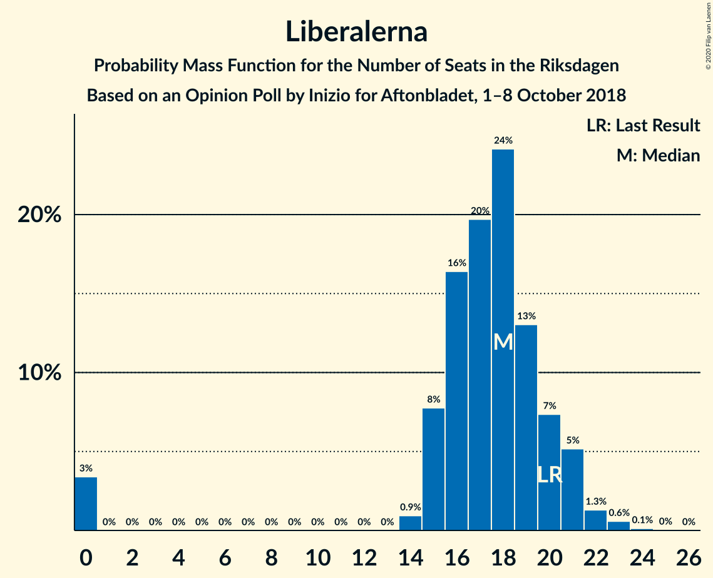
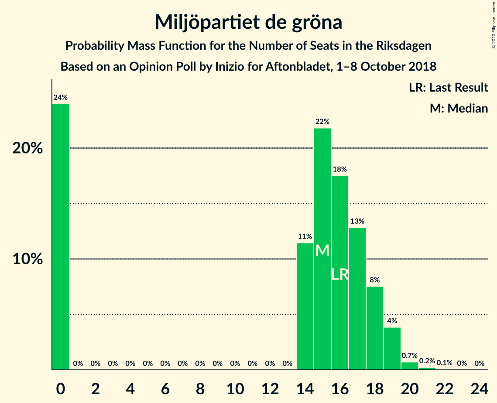
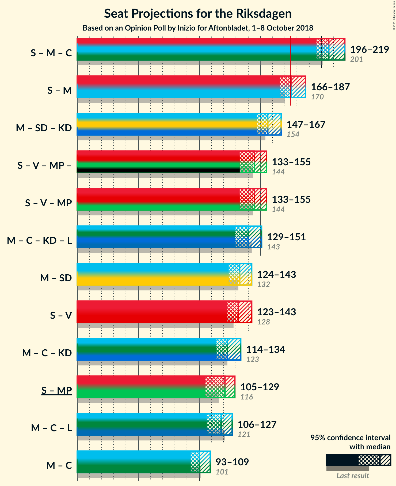

# Opinion Poll by Inizio for Aftonbladet, 1–8 October 2018

<a href="#voting-intentions">Voting Intentions</a> | <a href="#seats">Seats</a> | <a href="#coalitions">Coalitions</a> | <a href="#technical-information">Technical Information</a>

## Voting Intentions

### Confidence Intervals

| Party | Last Result | Poll Result | 80% Confidence Interval | 90% Confidence Interval | 95% Confidence Interval | 99% Confidence Interval |
|:-----:|:-----------:|:-----------:|:-----------------------:|:-----------------------:|:-----------------------:|:-----------------------:|
| Sveriges socialdemokratiska arbetareparti | 28.3% | 29.7% | 28.3–31.1% |27.9–31.5% |27.6–31.9% |26.9–32.5% |
| Moderata samlingspartiet | 19.8% | 19.3% | 18.2–20.6% |17.8–21.0% |17.6–21.3% |17.0–21.9% |
| Sverigedemokraterna | 17.5% | 17.9% | 16.7–19.1% |16.4–19.4% |16.1–19.7% |15.6–20.3% |
| Centerpartiet | 8.6% | 8.7% | 7.9–9.6% |7.6–9.9% |7.5–10.1% |7.1–10.5% |
| Vänsterpartiet | 8.0% | 7.3% | 6.5–8.1% |6.3–8.4% |6.1–8.6% |5.8–9.0% |
| Kristdemokraterna | 6.3% | 6.3% | 5.6–7.1% |5.4–7.3% |5.2–7.5% |4.9–7.9% |
| Liberalerna | 5.5% | 4.9% | 4.3–5.6% |4.1–5.8% |4.0–6.0% |3.7–6.4% |
| Miljöpartiet de gröna | 4.4% | 4.3% | 3.7–5.0% |3.6–5.2% |3.5–5.4% |3.2–5.7% |

*Note:* The poll result column reflects the actual value used in the calculations. Published results may vary slightly, and in addition be rounded to fewer digits.

## Seats

### Confidence Intervals

| Party | Last Result | Median | 80% Confidence Interval | 90% Confidence Interval | 95% Confidence Interval | 99% Confidence Interval |
|:-----:|:-----------:|:------:|:-----------------------:|:-----------------------:|:-----------------------:|:-----------------------:|
| <a href="#sveriges-socialdemokratiska-arbetareparti">Sveriges socialdemokratiska arbetareparti</a> | 100 | 107 | 95–108 |95–108 |95–113 |91–113 |
| <a href="#moderata-samlingspartiet">Moderata samlingspartiet</a> | 70 | 66 | 65–68 |65–71 |65–72 |58–74 |
| <a href="#sverigedemokraterna">Sverigedemokraterna</a> | 62 | 63 | 62–77 |62–78 |61–78 |61–78 |
| <a href="#centerpartiet">Centerpartiet</a> | 31 | 36 | 32–39 |29–39 |29–41 |29–42 |
| <a href="#vänsterpartiet">Vänsterpartiet</a> | 28 | 22 | 22–25 |22–27 |22–27 |22–33 |
| <a href="#kristdemokraterna">Kristdemokraterna</a> | 22 | 18 | 18–22 |18–23 |18–23 |18–24 |
| <a href="#liberalerna">Liberalerna</a> | 20 | 20 | 15–22 |15–22 |0–24 |0–24 |
| <a href="#miljöpartiet-de-gröna">Miljöpartiet de gröna</a> | 16 | 15 | 15–16 |0–17 |0–17 |0–22 |

### Sveriges socialdemokratiska arbetareparti

*For a full overview of the results for this party, see the [Sveriges socialdemokratiska arbetareparti](party-sverigessocialdemokratiskaarbetareparti.html) page.*

| Number of Seats | Probability | Accumulated | Special Marks |
|:---------------:|:-----------:|:-----------:|:-------------:|
| 91 | 0.5% | 100% |  |
| 92 | 1.0% | 99.4% |  |
| 93 | 0% | 98% |  |
| 94 | 0% | 98% |  |
| 95 | 28% | 98% |  |
| 96 | 0.2% | 70% |  |
| 97 | 0.2% | 70% |  |
| 98 | 4% | 70% |  |
| 99 | 0.6% | 66% |  |
| 100 | 0.8% | 65% | Last Result |
| 101 | 0.1% | 65% |  |
| 102 | 0.2% | 65% |  |
| 103 | 0% | 64% |  |
| 104 | 0% | 64% |  |
| 105 | 0% | 64% |  |
| 106 | 0.1% | 64% |  |
| 107 | 32% | 64% | Median |
| 108 | 28% | 32% |  |
| 109 | 0% | 4% |  |
| 110 | 0.3% | 4% |  |
| 111 | 0% | 4% |  |
| 112 | 0.1% | 4% |  |
| 113 | 4% | 4% |  |
| 114 | 0.1% | 0.1% |  |
| 115 | 0% | 0% |  |

### Moderata samlingspartiet

*For a full overview of the results for this party, see the [Moderata samlingspartiet](party-moderatasamlingspartiet.html) page.*

| Number of Seats | Probability | Accumulated | Special Marks |
|:---------------:|:-----------:|:-----------:|:-------------:|
| 57 | 0.4% | 100% |  |
| 58 | 0.4% | 99.6% |  |
| 59 | 0% | 99.2% |  |
| 60 | 0.2% | 99.2% |  |
| 61 | 0% | 99.0% |  |
| 62 | 0% | 99.0% |  |
| 63 | 0% | 99.0% |  |
| 64 | 0% | 99.0% |  |
| 65 | 27% | 99.0% |  |
| 66 | 33% | 72% | Median |
| 67 | 0.1% | 39% |  |
| 68 | 32% | 39% |  |
| 69 | 0% | 7% |  |
| 70 | 0% | 7% | Last Result |
| 71 | 4% | 7% |  |
| 72 | 2% | 3% |  |
| 73 | 0.1% | 1.4% |  |
| 74 | 0.9% | 1.3% |  |
| 75 | 0.2% | 0.3% |  |
| 76 | 0.1% | 0.1% |  |
| 77 | 0% | 0.1% |  |
| 78 | 0% | 0% |  |

### Sverigedemokraterna

*For a full overview of the results for this party, see the [Sverigedemokraterna](party-sverigedemokraterna.html) page.*

| Number of Seats | Probability | Accumulated | Special Marks |
|:---------------:|:-----------:|:-----------:|:-------------:|
| 57 | 0.1% | 100% |  |
| 58 | 0.1% | 99.9% |  |
| 59 | 0.1% | 99.8% |  |
| 60 | 0% | 99.7% |  |
| 61 | 4% | 99.6% |  |
| 62 | 29% | 95% | Last Result |
| 63 | 28% | 67% | Median |
| 64 | 0.2% | 39% |  |
| 65 | 1.2% | 39% |  |
| 66 | 0.1% | 38% |  |
| 67 | 1.0% | 37% |  |
| 68 | 4% | 36% |  |
| 69 | 0.1% | 32% |  |
| 70 | 0.1% | 32% |  |
| 71 | 0% | 32% |  |
| 72 | 0% | 32% |  |
| 73 | 0% | 32% |  |
| 74 | 0% | 32% |  |
| 75 | 0% | 32% |  |
| 76 | 21% | 32% |  |
| 77 | 4% | 11% |  |
| 78 | 7% | 7% |  |
| 79 | 0.2% | 0.2% |  |
| 80 | 0% | 0% |  |

### Centerpartiet

*For a full overview of the results for this party, see the [Centerpartiet](party-centerpartiet.html) page.*

| Number of Seats | Probability | Accumulated | Special Marks |
|:---------------:|:-----------:|:-----------:|:-------------:|
| 27 | 0.4% | 100% |  |
| 28 | 0% | 99.6% |  |
| 29 | 7% | 99.6% |  |
| 30 | 1.2% | 92% |  |
| 31 | 0.3% | 91% | Last Result |
| 32 | 21% | 91% |  |
| 33 | 0.7% | 70% |  |
| 34 | 0% | 69% |  |
| 35 | 4% | 69% |  |
| 36 | 31% | 65% | Median |
| 37 | 0.2% | 34% |  |
| 38 | 0.1% | 34% |  |
| 39 | 29% | 34% |  |
| 40 | 0% | 5% |  |
| 41 | 4% | 5% |  |
| 42 | 0.5% | 0.7% |  |
| 43 | 0% | 0.2% |  |
| 44 | 0.1% | 0.2% |  |
| 45 | 0.1% | 0.1% |  |
| 46 | 0% | 0% |  |

### Vänsterpartiet

*For a full overview of the results for this party, see the [Vänsterpartiet](party-vänsterpartiet.html) page.*

| Number of Seats | Probability | Accumulated | Special Marks |
|:---------------:|:-----------:|:-----------:|:-------------:|
| 19 | 0.2% | 100% |  |
| 20 | 0% | 99.8% |  |
| 21 | 0% | 99.8% |  |
| 22 | 60% | 99.8% | Median |
| 23 | 4% | 40% |  |
| 24 | 0% | 36% |  |
| 25 | 29% | 36% |  |
| 26 | 0.2% | 7% |  |
| 27 | 5% | 7% |  |
| 28 | 1.1% | 2% | Last Result |
| 29 | 0.1% | 0.8% |  |
| 30 | 0% | 0.8% |  |
| 31 | 0% | 0.8% |  |
| 32 | 0.2% | 0.7% |  |
| 33 | 0.5% | 0.5% |  |
| 34 | 0% | 0% |  |

### Kristdemokraterna

*For a full overview of the results for this party, see the [Kristdemokraterna](party-kristdemokraterna.html) page.*

| Number of Seats | Probability | Accumulated | Special Marks |
|:---------------:|:-----------:|:-----------:|:-------------:|
| 16 | 0.1% | 100% |  |
| 17 | 0.3% | 99.9% |  |
| 18 | 64% | 99.7% | Median |
| 19 | 0% | 36% |  |
| 20 | 0.9% | 36% |  |
| 21 | 0.2% | 35% |  |
| 22 | 28% | 35% | Last Result |
| 23 | 5% | 6% |  |
| 24 | 0.7% | 1.0% |  |
| 25 | 0% | 0.3% |  |
| 26 | 0.1% | 0.3% |  |
| 27 | 0% | 0.2% |  |
| 28 | 0% | 0.2% |  |
| 29 | 0.2% | 0.2% |  |
| 30 | 0% | 0% |  |

### Liberalerna

*For a full overview of the results for this party, see the [Liberalerna](party-liberalerna.html) page.*

| Number of Seats | Probability | Accumulated | Special Marks |
|:---------------:|:-----------:|:-----------:|:-------------:|
| 0 | 4% | 100% |  |
| 1 | 0% | 96% |  |
| 2 | 0% | 96% |  |
| 3 | 0% | 96% |  |
| 4 | 0% | 96% |  |
| 5 | 0% | 96% |  |
| 6 | 0% | 96% |  |
| 7 | 0% | 96% |  |
| 8 | 0% | 96% |  |
| 9 | 0% | 96% |  |
| 10 | 0% | 96% |  |
| 11 | 0% | 96% |  |
| 12 | 0% | 96% |  |
| 13 | 0% | 96% |  |
| 14 | 0% | 96% |  |
| 15 | 21% | 96% |  |
| 16 | 0.4% | 75% |  |
| 17 | 8% | 75% |  |
| 18 | 4% | 67% |  |
| 19 | 1.2% | 63% |  |
| 20 | 29% | 61% | Last Result, Median |
| 21 | 0.7% | 32% |  |
| 22 | 27% | 32% |  |
| 23 | 0.3% | 4% |  |
| 24 | 4% | 4% |  |
| 25 | 0.1% | 0.2% |  |
| 26 | 0.1% | 0.1% |  |
| 27 | 0% | 0% |  |

### Miljöpartiet de gröna

*For a full overview of the results for this party, see the [Miljöpartiet de gröna](party-miljöpartietdegröna.html) page.*

| Number of Seats | Probability | Accumulated | Special Marks |
|:---------------:|:-----------:|:-----------:|:-------------:|
| 0 | 5% | 100% |  |
| 1 | 0% | 95% |  |
| 2 | 0% | 95% |  |
| 3 | 0% | 95% |  |
| 4 | 0% | 95% |  |
| 5 | 0% | 95% |  |
| 6 | 0% | 95% |  |
| 7 | 0% | 95% |  |
| 8 | 0% | 95% |  |
| 9 | 0% | 95% |  |
| 10 | 0% | 95% |  |
| 11 | 0% | 95% |  |
| 12 | 0% | 95% |  |
| 13 | 0% | 95% |  |
| 14 | 0.2% | 95% |  |
| 15 | 63% | 95% | Median |
| 16 | 25% | 31% | Last Result |
| 17 | 4% | 6% |  |
| 18 | 0.3% | 2% |  |
| 19 | 0% | 2% |  |
| 20 | 0.5% | 2% |  |
| 21 | 1.1% | 2% |  |
| 22 | 0.5% | 0.6% |  |
| 23 | 0% | 0% |  |

## Coalitions

### Confidence Intervals

| Coalition | Last Result | Median | Majority? | 80% Confidence Interval | 90% Confidence Interval | 95% Confidence Interval | 99% Confidence Interval |
|:---------:|:-----------:|:------:|:---------:|:-----------------------:|:-----------------------:|:-----------------------:|:-----------------------:|
| Sveriges socialdemokratiska arbetareparti – Moderata samlingspartiet – Centerpartiet | 201 | 209 | 100% | 195–212 | 192–214 | 192–216 | 189–216 |
| Sveriges socialdemokratiska arbetareparti – Moderata samlingspartiet | 170 | 173 | 4% | 163–173 | 163–173 | 163–181 | 157–181 |
| Moderata samlingspartiet – Sverigedemokraterna – Kristdemokraterna | 154 | 146 | 0% | 146–168 | 146–168 | 145–171 | 143–171 |
| Moderata samlingspartiet – Sverigedemokraterna | 132 | 128 | 0% | 128–146 | 127–146 | 127–148 | 125–148 |
| Sveriges socialdemokratiska arbetareparti – Vänsterpartiet – Miljöpartiet de gröna | 144 | 144 | 0% | 136–145 | 135–145 | 135–145 | 125–152 |
| Moderata samlingspartiet – Centerpartiet – Kristdemokraterna – Liberalerna | 143 | 141 | 0% | 136–143 | 136–145 | 130–145 | 129–157 |
| Sveriges socialdemokratiska arbetareparti – Vänsterpartiet | 128 | 129 | 0% | 120–130 | 120–132 | 120–136 | 119–136 |
| Moderata samlingspartiet – Centerpartiet – Kristdemokraterna | 123 | 122 | 0% | 119–125 | 119–130 | 119–130 | 111–136 |
| Moderata samlingspartiet – Centerpartiet – Liberalerna | 121 | 123 | 0% | 114–125 | 114–125 | 107–127 | 106–137 |
| Sveriges socialdemokratiska arbetareparti – Miljöpartiet de gröna | 116 | 122 | 0% | 111–123 | 110–123 | 110–123 | 100–123 |
| Moderata samlingspartiet – Centerpartiet | 101 | 101 | 0% | 100–105 | 97–107 | 97–107 | 89–116 |

### Sveriges socialdemokratiska arbetareparti – Moderata samlingspartiet – Centerpartiet

| Number of Seats | Probability | Accumulated | Special Marks |
|:---------------:|:-----------:|:-----------:|:-------------:|
| 186 | 0.3% | 100% |  |
| 187 | 0% | 99.6% |  |
| 188 | 0% | 99.6% |  |
| 189 | 0.2% | 99.6% |  |
| 190 | 0% | 99.5% |  |
| 191 | 0.3% | 99.5% |  |
| 192 | 7% | 99.2% |  |
| 193 | 0% | 92% |  |
| 194 | 0.9% | 92% |  |
| 195 | 21% | 91% |  |
| 196 | 0.5% | 70% |  |
| 197 | 0.1% | 70% |  |
| 198 | 0% | 70% |  |
| 199 | 0.4% | 69% |  |
| 200 | 0% | 69% |  |
| 201 | 0% | 69% | Last Result |
| 202 | 0% | 69% |  |
| 203 | 0% | 69% |  |
| 204 | 0% | 69% |  |
| 205 | 4% | 69% |  |
| 206 | 0% | 65% |  |
| 207 | 0.1% | 65% |  |
| 208 | 0% | 65% |  |
| 209 | 27% | 65% | Median |
| 210 | 0% | 38% |  |
| 211 | 0% | 38% |  |
| 212 | 28% | 38% |  |
| 213 | 0.3% | 9% |  |
| 214 | 4% | 9% |  |
| 215 | 0% | 5% |  |
| 216 | 4% | 5% |  |
| 217 | 0.2% | 0.4% |  |
| 218 | 0.2% | 0.3% |  |
| 219 | 0% | 0.1% |  |
| 220 | 0% | 0.1% |  |
| 221 | 0% | 0.1% |  |
| 222 | 0% | 0.1% |  |
| 223 | 0% | 0.1% |  |
| 224 | 0% | 0.1% |  |
| 225 | 0% | 0.1% |  |
| 226 | 0% | 0.1% |  |
| 227 | 0% | 0.1% |  |
| 228 | 0% | 0.1% |  |
| 229 | 0.1% | 0.1% |  |
| 230 | 0% | 0% |  |

### Sveriges socialdemokratiska arbetareparti – Moderata samlingspartiet

| Number of Seats | Probability | Accumulated | Special Marks |
|:---------------:|:-----------:|:-----------:|:-------------:|
| 156 | 0.3% | 100% |  |
| 157 | 0.2% | 99.7% |  |
| 158 | 0% | 99.5% |  |
| 159 | 0% | 99.5% |  |
| 160 | 0% | 99.5% |  |
| 161 | 0.1% | 99.5% |  |
| 162 | 0.1% | 99.4% |  |
| 163 | 29% | 99.3% |  |
| 164 | 1.2% | 71% |  |
| 165 | 0% | 69% |  |
| 166 | 0% | 69% |  |
| 167 | 0% | 69% |  |
| 168 | 0.3% | 69% |  |
| 169 | 4% | 69% |  |
| 170 | 0% | 65% | Last Result |
| 171 | 0.1% | 65% |  |
| 172 | 0.2% | 65% |  |
| 173 | 60% | 65% | Median |
| 174 | 0.8% | 5% |  |
| 175 | 0% | 4% | Majority |
| 176 | 0% | 4% |  |
| 177 | 0% | 4% |  |
| 178 | 0% | 4% |  |
| 179 | 0% | 4% |  |
| 180 | 0.2% | 4% |  |
| 181 | 4% | 4% |  |
| 182 | 0% | 0.1% |  |
| 183 | 0% | 0.1% |  |
| 184 | 0% | 0.1% |  |
| 185 | 0% | 0.1% |  |
| 186 | 0% | 0.1% |  |
| 187 | 0% | 0.1% |  |
| 188 | 0.1% | 0.1% |  |
| 189 | 0% | 0% |  |

### Moderata samlingspartiet – Sverigedemokraterna – Kristdemokraterna

| Number of Seats | Probability | Accumulated | Special Marks |
|:---------------:|:-----------:|:-----------:|:-------------:|
| 139 | 0.1% | 100% |  |
| 140 | 0.1% | 99.9% |  |
| 141 | 0% | 99.8% |  |
| 142 | 0.3% | 99.8% |  |
| 143 | 0.1% | 99.5% |  |
| 144 | 0% | 99.4% |  |
| 145 | 4% | 99.4% |  |
| 146 | 56% | 95% |  |
| 147 | 0% | 40% | Median |
| 148 | 0% | 40% |  |
| 149 | 0.5% | 40% |  |
| 150 | 0% | 39% |  |
| 151 | 0.1% | 39% |  |
| 152 | 0% | 39% |  |
| 153 | 0% | 39% |  |
| 154 | 4% | 39% | Last Result |
| 155 | 0% | 35% |  |
| 156 | 0% | 35% |  |
| 157 | 0% | 35% |  |
| 158 | 0.6% | 35% |  |
| 159 | 0.1% | 35% |  |
| 160 | 1.1% | 34% |  |
| 161 | 0.7% | 33% |  |
| 162 | 0.3% | 33% |  |
| 163 | 0.1% | 32% |  |
| 164 | 0% | 32% |  |
| 165 | 0.2% | 32% |  |
| 166 | 21% | 32% |  |
| 167 | 0.1% | 11% |  |
| 168 | 7% | 11% |  |
| 169 | 0% | 4% |  |
| 170 | 0% | 4% |  |
| 171 | 4% | 4% |  |
| 172 | 0% | 0% |  |

### Moderata samlingspartiet – Sverigedemokraterna

| Number of Seats | Probability | Accumulated | Special Marks |
|:---------------:|:-----------:|:-----------:|:-------------:|
| 117 | 0.1% | 100% |  |
| 118 | 0.1% | 99.9% |  |
| 119 | 0% | 99.8% |  |
| 120 | 0% | 99.8% |  |
| 121 | 0% | 99.8% |  |
| 122 | 0% | 99.8% |  |
| 123 | 0% | 99.8% |  |
| 124 | 0% | 99.8% |  |
| 125 | 0.8% | 99.8% |  |
| 126 | 0% | 99.0% |  |
| 127 | 4% | 98.9% |  |
| 128 | 56% | 95% |  |
| 129 | 0% | 39% | Median |
| 130 | 0% | 39% |  |
| 131 | 0% | 39% |  |
| 132 | 0% | 39% | Last Result |
| 133 | 0% | 39% |  |
| 134 | 0.1% | 39% |  |
| 135 | 0.6% | 39% |  |
| 136 | 4% | 38% |  |
| 137 | 0.9% | 34% |  |
| 138 | 0.1% | 33% |  |
| 139 | 0.2% | 33% |  |
| 140 | 0% | 33% |  |
| 141 | 0.6% | 33% |  |
| 142 | 0.3% | 32% |  |
| 143 | 0% | 32% |  |
| 144 | 21% | 32% |  |
| 145 | 0% | 11% |  |
| 146 | 7% | 11% |  |
| 147 | 0.2% | 4% |  |
| 148 | 4% | 4% |  |
| 149 | 0% | 0% |  |

### Sveriges socialdemokratiska arbetareparti – Vänsterpartiet – Miljöpartiet de gröna

| Number of Seats | Probability | Accumulated | Special Marks |
|:---------------:|:-----------:|:-----------:|:-------------:|
| 125 | 0.9% | 100% |  |
| 126 | 0% | 99.1% |  |
| 127 | 0% | 99.1% |  |
| 128 | 0% | 99.1% |  |
| 129 | 0% | 99.1% |  |
| 130 | 0% | 99.1% |  |
| 131 | 0.2% | 99.0% |  |
| 132 | 0% | 98.8% |  |
| 133 | 0% | 98.8% |  |
| 134 | 0% | 98.8% |  |
| 135 | 7% | 98.8% |  |
| 136 | 25% | 91% |  |
| 137 | 0.1% | 67% |  |
| 138 | 0% | 67% |  |
| 139 | 0% | 67% |  |
| 140 | 1.1% | 67% |  |
| 141 | 0.6% | 66% |  |
| 142 | 4% | 65% |  |
| 143 | 0% | 61% |  |
| 144 | 28% | 61% | Last Result, Median |
| 145 | 31% | 33% |  |
| 146 | 0.1% | 1.2% |  |
| 147 | 0% | 1.1% |  |
| 148 | 0% | 1.1% |  |
| 149 | 0.2% | 1.1% |  |
| 150 | 0% | 0.8% |  |
| 151 | 0% | 0.8% |  |
| 152 | 0.5% | 0.8% |  |
| 153 | 0% | 0.3% |  |
| 154 | 0% | 0.3% |  |
| 155 | 0% | 0.3% |  |
| 156 | 0.3% | 0.3% |  |
| 157 | 0% | 0% |  |

### Moderata samlingspartiet – Centerpartiet – Kristdemokraterna – Liberalerna

| Number of Seats | Probability | Accumulated | Special Marks |
|:---------------:|:-----------:|:-----------:|:-------------:|
| 126 | 0.3% | 100% |  |
| 127 | 0% | 99.7% |  |
| 128 | 0% | 99.7% |  |
| 129 | 0.3% | 99.7% |  |
| 130 | 4% | 99.4% |  |
| 131 | 0% | 95% |  |
| 132 | 0% | 95% |  |
| 133 | 0% | 95% |  |
| 134 | 0% | 95% |  |
| 135 | 0.2% | 95% |  |
| 136 | 7% | 95% |  |
| 137 | 21% | 88% |  |
| 138 | 0% | 67% |  |
| 139 | 0% | 67% |  |
| 140 | 0% | 67% | Median |
| 141 | 27% | 67% |  |
| 142 | 0.1% | 40% |  |
| 143 | 33% | 39% | Last Result |
| 144 | 1.0% | 7% |  |
| 145 | 4% | 6% |  |
| 146 | 0% | 1.4% |  |
| 147 | 0% | 1.4% |  |
| 148 | 0% | 1.4% |  |
| 149 | 0.2% | 1.4% |  |
| 150 | 0% | 1.2% |  |
| 151 | 0% | 1.2% |  |
| 152 | 0% | 1.2% |  |
| 153 | 0% | 1.2% |  |
| 154 | 0% | 1.2% |  |
| 155 | 0% | 1.1% |  |
| 156 | 0.3% | 1.1% |  |
| 157 | 0.7% | 0.9% |  |
| 158 | 0% | 0.2% |  |
| 159 | 0.2% | 0.2% |  |
| 160 | 0% | 0% |  |

### Sveriges socialdemokratiska arbetareparti – Vänsterpartiet

| Number of Seats | Probability | Accumulated | Special Marks |
|:---------------:|:-----------:|:-----------:|:-------------:|
| 115 | 0.1% | 100% |  |
| 116 | 0.2% | 99.9% |  |
| 117 | 0% | 99.8% |  |
| 118 | 0% | 99.8% |  |
| 119 | 2% | 99.7% |  |
| 120 | 28% | 98% |  |
| 121 | 0.2% | 70% |  |
| 122 | 0% | 70% |  |
| 123 | 0% | 70% |  |
| 124 | 0% | 70% |  |
| 125 | 5% | 70% |  |
| 126 | 0% | 65% |  |
| 127 | 0% | 65% |  |
| 128 | 0% | 65% | Last Result |
| 129 | 33% | 65% | Median |
| 130 | 27% | 33% |  |
| 131 | 0% | 5% |  |
| 132 | 0.5% | 5% |  |
| 133 | 0.2% | 5% |  |
| 134 | 0.1% | 4% |  |
| 135 | 0% | 4% |  |
| 136 | 4% | 4% |  |
| 137 | 0.1% | 0.5% |  |
| 138 | 0.3% | 0.4% |  |
| 139 | 0% | 0.1% |  |
| 140 | 0% | 0.1% |  |
| 141 | 0.1% | 0.1% |  |
| 142 | 0% | 0.1% |  |
| 143 | 0% | 0% |  |

### Moderata samlingspartiet – Centerpartiet – Kristdemokraterna

| Number of Seats | Probability | Accumulated | Special Marks |
|:---------------:|:-----------:|:-----------:|:-------------:|
| 106 | 0.3% | 100% |  |
| 107 | 0% | 99.7% |  |
| 108 | 0% | 99.7% |  |
| 109 | 0% | 99.7% |  |
| 110 | 0% | 99.7% |  |
| 111 | 0.3% | 99.7% |  |
| 112 | 0% | 99.4% |  |
| 113 | 0% | 99.4% |  |
| 114 | 0.2% | 99.4% |  |
| 115 | 0% | 99.2% |  |
| 116 | 0.2% | 99.2% |  |
| 117 | 0.2% | 99.0% |  |
| 118 | 0% | 98.8% |  |
| 119 | 35% | 98.8% |  |
| 120 | 0.1% | 64% | Median |
| 121 | 4% | 64% |  |
| 122 | 21% | 60% |  |
| 123 | 28% | 39% | Last Result |
| 124 | 0% | 11% |  |
| 125 | 5% | 11% |  |
| 126 | 0% | 6% |  |
| 127 | 0% | 6% |  |
| 128 | 0.6% | 6% |  |
| 129 | 0.1% | 5% |  |
| 130 | 4% | 5% |  |
| 131 | 0.1% | 1.5% |  |
| 132 | 0% | 1.4% |  |
| 133 | 0.4% | 1.4% |  |
| 134 | 0% | 1.0% |  |
| 135 | 0% | 1.0% |  |
| 136 | 0.5% | 0.9% |  |
| 137 | 0.1% | 0.4% |  |
| 138 | 0% | 0.3% |  |
| 139 | 0.1% | 0.3% |  |
| 140 | 0.1% | 0.1% |  |
| 141 | 0% | 0.1% |  |
| 142 | 0% | 0.1% |  |
| 143 | 0.1% | 0.1% |  |
| 144 | 0% | 0% |  |

### Moderata samlingspartiet – Centerpartiet – Liberalerna

| Number of Seats | Probability | Accumulated | Special Marks |
|:---------------:|:-----------:|:-----------:|:-------------:|
| 103 | 0% | 100% |  |
| 104 | 0% | 99.9% |  |
| 105 | 0.3% | 99.9% |  |
| 106 | 0.2% | 99.6% |  |
| 107 | 4% | 99.5% |  |
| 108 | 0% | 96% |  |
| 109 | 0.3% | 96% |  |
| 110 | 0% | 95% |  |
| 111 | 0% | 95% |  |
| 112 | 0% | 95% |  |
| 113 | 0% | 95% |  |
| 114 | 7% | 95% |  |
| 115 | 21% | 88% |  |
| 116 | 0% | 67% |  |
| 117 | 0.1% | 67% |  |
| 118 | 0% | 67% |  |
| 119 | 0% | 67% |  |
| 120 | 0.3% | 67% |  |
| 121 | 1.0% | 67% | Last Result |
| 122 | 0.5% | 66% | Median |
| 123 | 28% | 65% |  |
| 124 | 0% | 38% |  |
| 125 | 33% | 38% |  |
| 126 | 0.1% | 5% |  |
| 127 | 4% | 5% |  |
| 128 | 0.2% | 1.2% |  |
| 129 | 0% | 1.0% |  |
| 130 | 0.1% | 1.0% |  |
| 131 | 0% | 0.9% |  |
| 132 | 0% | 0.9% |  |
| 133 | 0% | 0.9% |  |
| 134 | 0% | 0.9% |  |
| 135 | 0% | 0.9% |  |
| 136 | 0.3% | 0.9% |  |
| 137 | 0.5% | 0.7% |  |
| 138 | 0% | 0.1% |  |
| 139 | 0.1% | 0.1% |  |
| 140 | 0% | 0% |  |

### Sveriges socialdemokratiska arbetareparti – Miljöpartiet de gröna

| Number of Seats | Probability | Accumulated | Special Marks |
|:---------------:|:-----------:|:-----------:|:-------------:|
| 99 | 0.1% | 100% |  |
| 100 | 0.8% | 99.9% |  |
| 101 | 0% | 99.1% |  |
| 102 | 0% | 99.1% |  |
| 103 | 0% | 99.1% |  |
| 104 | 0% | 99.1% |  |
| 105 | 0% | 99.1% |  |
| 106 | 0% | 99.1% |  |
| 107 | 0% | 99.1% |  |
| 108 | 0.2% | 99.1% |  |
| 109 | 0% | 98.9% |  |
| 110 | 7% | 98.8% |  |
| 111 | 21% | 91% |  |
| 112 | 0.3% | 71% |  |
| 113 | 5% | 70% |  |
| 114 | 0.1% | 65% |  |
| 115 | 4% | 65% |  |
| 116 | 0% | 61% | Last Result |
| 117 | 0.2% | 61% |  |
| 118 | 0% | 61% |  |
| 119 | 0.5% | 61% |  |
| 120 | 0% | 60% |  |
| 121 | 0% | 60% |  |
| 122 | 28% | 60% | Median |
| 123 | 32% | 32% |  |
| 124 | 0% | 0.3% |  |
| 125 | 0% | 0.3% |  |
| 126 | 0% | 0.3% |  |
| 127 | 0% | 0.3% |  |
| 128 | 0.3% | 0.3% |  |
| 129 | 0% | 0% |  |

### Moderata samlingspartiet – Centerpartiet

| Number of Seats | Probability | Accumulated | Special Marks |
|:---------------:|:-----------:|:-----------:|:-------------:|
| 85 | 0% | 100% |  |
| 86 | 0% | 99.9% |  |
| 87 | 0.3% | 99.9% |  |
| 88 | 0% | 99.6% |  |
| 89 | 0.3% | 99.6% |  |
| 90 | 0.2% | 99.4% |  |
| 91 | 0% | 99.2% |  |
| 92 | 0% | 99.2% |  |
| 93 | 0% | 99.2% |  |
| 94 | 0% | 99.2% |  |
| 95 | 0.3% | 99.2% |  |
| 96 | 0% | 98.9% |  |
| 97 | 7% | 98.9% |  |
| 98 | 0.1% | 92% |  |
| 99 | 0.2% | 92% |  |
| 100 | 21% | 91% |  |
| 101 | 27% | 71% | Last Result |
| 102 | 0.9% | 43% | Median |
| 103 | 4% | 42% |  |
| 104 | 0% | 38% |  |
| 105 | 29% | 38% |  |
| 106 | 0.1% | 9% |  |
| 107 | 8% | 9% |  |
| 108 | 0.2% | 2% |  |
| 109 | 0.2% | 1.4% |  |
| 110 | 0.1% | 1.1% |  |
| 111 | 0.1% | 1.0% |  |
| 112 | 0% | 1.0% |  |
| 113 | 0.3% | 1.0% |  |
| 114 | 0% | 0.7% |  |
| 115 | 0% | 0.7% |  |
| 116 | 0.5% | 0.7% |  |
| 117 | 0.1% | 0.2% |  |
| 118 | 0% | 0.1% |  |
| 119 | 0.1% | 0.1% |  |
| 120 | 0% | 0% |  |

## Technical Information

### Opinion Poll

+ **Polling firm:** Inizio
+ **Commissioner(s):** Aftonbladet
+ **Fieldwork period:** 1–8 October 2018

### Calculations

+ **Sample size:** 1763
+ **Simulations done:** 1,024
+ **Error estimate:** 2.93%

