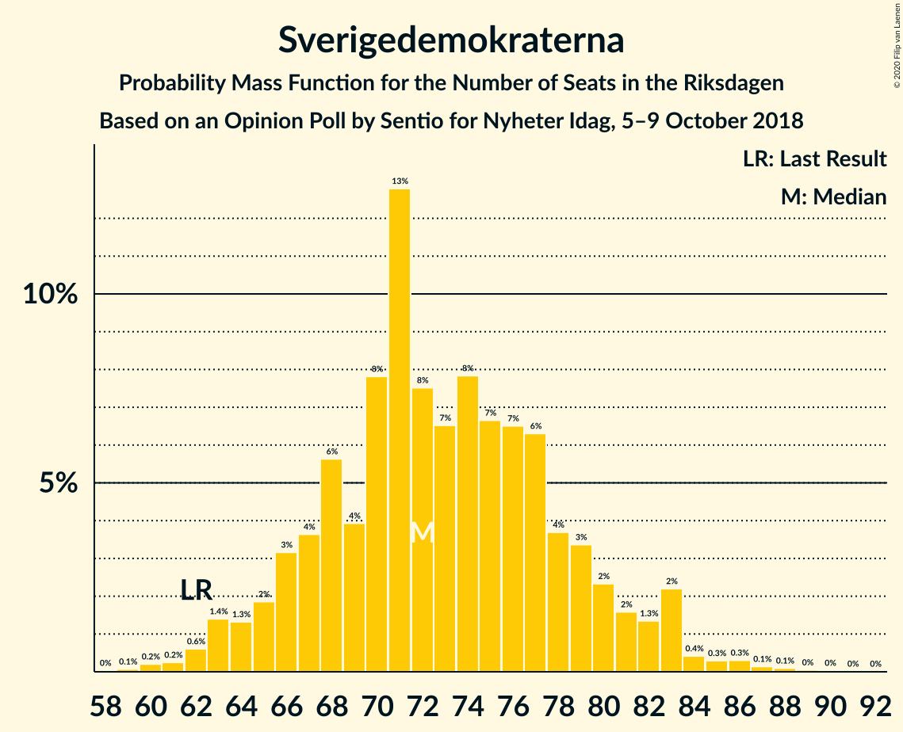
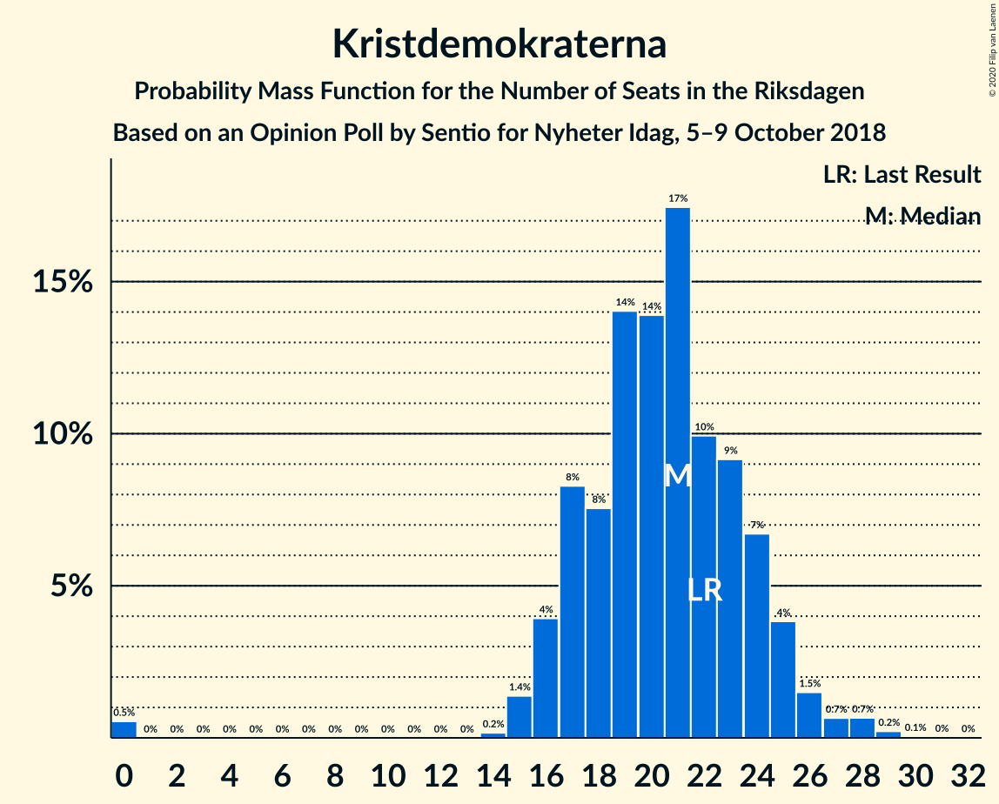
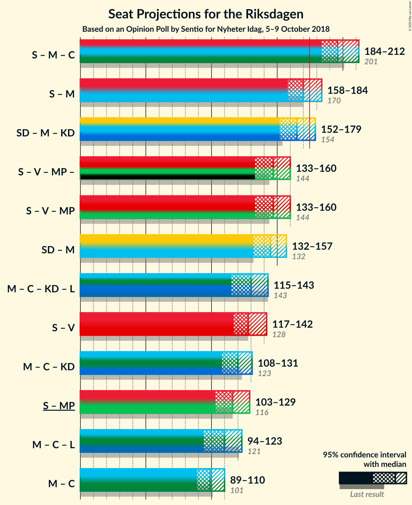

# Opinion Poll by Sentio for Nyheter Idag, 5–9 October 2018

<a href="#voting-intentions">Voting Intentions</a> | <a href="#seats">Seats</a> | <a href="#coalitions">Coalitions</a> | <a href="#technical-information">Technical Information</a>

## Voting Intentions

### Confidence Intervals

| Party | Last Result | Poll Result | 80% Confidence Interval | 90% Confidence Interval | 95% Confidence Interval | 99% Confidence Interval |
|:-----:|:-----------:|:-----------:|:-----------------------:|:-----------------------:|:-----------------------:|:-----------------------:|
| Sveriges socialdemokratiska arbetareparti | 28.3% | 27.4% | 25.7–29.3% |25.2–29.8% |24.7–30.2% |23.9–31.1% |
| Sverigedemokraterna | 17.5% | 20.3% | 18.7–22.0% |18.3–22.5% |17.9–22.9% |17.2–23.7% |
| Moderata samlingspartiet | 19.8% | 20.0% | 18.4–21.7% |18.0–22.1% |17.6–22.6% |16.9–23.4% |
| Vänsterpartiet | 8.0% | 8.4% | 7.4–9.6% |7.1–10.0% |6.8–10.3% |6.4–10.9% |
| Centerpartiet | 8.6% | 7.5% | 6.6–8.7% |6.3–9.0% |6.1–9.3% |5.6–9.9% |
| Kristdemokraterna | 6.3% | 5.6% | 4.8–6.7% |4.6–7.0% |4.4–7.2% |4.0–7.8% |
| Miljöpartiet de gröna | 4.4% | 5.0% | 4.3–6.1% |4.0–6.3% |3.9–6.6% |3.5–7.1% |
| Liberalerna | 5.5% | 4.2% | 3.4–5.1% |3.2–5.3% |3.1–5.6% |2.8–6.1% |

*Note:* The poll result column reflects the actual value used in the calculations. Published results may vary slightly, and in addition be rounded to fewer digits.

## Seats

### Confidence Intervals

| Party | Last Result | Median | 80% Confidence Interval | 90% Confidence Interval | 95% Confidence Interval | 99% Confidence Interval |
|:-----:|:-----------:|:------:|:-----------------------:|:-----------------------:|:-----------------------:|:-----------------------:|
| <a href="#sveriges-socialdemokratiska-arbetareparti">Sveriges socialdemokratiska arbetareparti</a> | 100 | 100 | 100 |100 |100 |87–106 |
| <a href="#sverigedemokraterna">Sverigedemokraterna</a> | 62 | 81 | 81 |81 |73–81 |72–81 |
| <a href="#moderata-samlingspartiet">Moderata samlingspartiet</a> | 70 | 72 | 72 |72 |70–72 |63–75 |
| <a href="#vänsterpartiet">Vänsterpartiet</a> | 28 | 27 | 27 |27 |27 |23–37 |
| <a href="#centerpartiet">Centerpartiet</a> | 31 | 26 | 26 |26 |25–26 |22–33 |
| <a href="#kristdemokraterna">Kristdemokraterna</a> | 22 | 21 | 21 |21 |21–23 |18–26 |
| <a href="#miljöpartiet-de-gröna">Miljöpartiet de gröna</a> | 16 | 22 | 22 |22 |17–22 |0–22 |
| <a href="#liberalerna">Liberalerna</a> | 20 | 0 | 0 |0 |0–16 |0–18 |

### Sveriges socialdemokratiska arbetareparti

*For a full overview of the results for this party, see the [Sveriges socialdemokratiska arbetareparti](party-sverigessocialdemokratiskaarbetareparti.html) page.*

| Number of Seats | Probability | Accumulated | Special Marks |
|:---------------:|:-----------:|:-----------:|:-------------:|
| 87 | 0.8% | 100% |  |
| 88 | 0% | 99.2% |  |
| 89 | 0% | 99.2% |  |
| 90 | 0% | 99.2% |  |
| 91 | 0% | 99.2% |  |
| 92 | 0% | 99.2% |  |
| 93 | 0.1% | 99.2% |  |
| 94 | 0.6% | 99.2% |  |
| 95 | 0% | 98.5% |  |
| 96 | 0% | 98% |  |
| 97 | 0.1% | 98% |  |
| 98 | 0% | 98% |  |
| 99 | 0% | 98% |  |
| 100 | 96% | 98% | Last Result, Median |
| 101 | 0% | 2% |  |
| 102 | 0% | 2% |  |
| 103 | 0% | 2% |  |
| 104 | 0% | 2% |  |
| 105 | 0% | 2% |  |
| 106 | 2% | 2% |  |
| 107 | 0% | 0.2% |  |
| 108 | 0% | 0.2% |  |
| 109 | 0.2% | 0.2% |  |
| 110 | 0% | 0% |  |

### Sverigedemokraterna

*For a full overview of the results for this party, see the [Sverigedemokraterna](party-sverigedemokraterna.html) page.*

| Number of Seats | Probability | Accumulated | Special Marks |
|:---------------:|:-----------:|:-----------:|:-------------:|
| 62 | 0% | 100% | Last Result |
| 63 | 0% | 100% |  |
| 64 | 0% | 100% |  |
| 65 | 0% | 100% |  |
| 66 | 0% | 100% |  |
| 67 | 0% | 100% |  |
| 68 | 0.1% | 100% |  |
| 69 | 0% | 99.9% |  |
| 70 | 0% | 99.9% |  |
| 71 | 0% | 99.8% |  |
| 72 | 0.8% | 99.8% |  |
| 73 | 2% | 99.1% |  |
| 74 | 0% | 97% |  |
| 75 | 0% | 97% |  |
| 76 | 0% | 97% |  |
| 77 | 0% | 97% |  |
| 78 | 0.2% | 97% |  |
| 79 | 0.7% | 96% |  |
| 80 | 0% | 96% |  |
| 81 | 96% | 96% | Median |
| 82 | 0% | 0.2% |  |
| 83 | 0% | 0.2% |  |
| 84 | 0% | 0.2% |  |
| 85 | 0% | 0.2% |  |
| 86 | 0.2% | 0.2% |  |
| 87 | 0% | 0% |  |

### Moderata samlingspartiet

*For a full overview of the results for this party, see the [Moderata samlingspartiet](party-moderatasamlingspartiet.html) page.*

| Number of Seats | Probability | Accumulated | Special Marks |
|:---------------:|:-----------:|:-----------:|:-------------:|
| 63 | 2% | 100% |  |
| 64 | 0% | 98% |  |
| 65 | 0.1% | 98% |  |
| 66 | 0% | 98% |  |
| 67 | 0.2% | 98% |  |
| 68 | 0% | 98% |  |
| 69 | 0% | 98% |  |
| 70 | 0.7% | 98% | Last Result |
| 71 | 0.5% | 97% |  |
| 72 | 96% | 96% | Median |
| 73 | 0.2% | 1.0% |  |
| 74 | 0% | 0.8% |  |
| 75 | 0.7% | 0.8% |  |
| 76 | 0% | 0.1% |  |
| 77 | 0% | 0.1% |  |
| 78 | 0% | 0.1% |  |
| 79 | 0% | 0.1% |  |
| 80 | 0% | 0.1% |  |
| 81 | 0% | 0.1% |  |
| 82 | 0% | 0.1% |  |
| 83 | 0% | 0.1% |  |
| 84 | 0% | 0.1% |  |
| 85 | 0% | 0.1% |  |
| 86 | 0% | 0.1% |  |
| 87 | 0% | 0.1% |  |
| 88 | 0% | 0.1% |  |
| 89 | 0% | 0.1% |  |
| 90 | 0.1% | 0.1% |  |
| 91 | 0% | 0% |  |

### Vänsterpartiet

*For a full overview of the results for this party, see the [Vänsterpartiet](party-vänsterpartiet.html) page.*

| Number of Seats | Probability | Accumulated | Special Marks |
|:---------------:|:-----------:|:-----------:|:-------------:|
| 23 | 2% | 100% |  |
| 24 | 0% | 98% |  |
| 25 | 0% | 98% |  |
| 26 | 0.4% | 98% |  |
| 27 | 96% | 98% | Median |
| 28 | 0.1% | 2% | Last Result |
| 29 | 0% | 2% |  |
| 30 | 0% | 2% |  |
| 31 | 0% | 2% |  |
| 32 | 0% | 2% |  |
| 33 | 0.6% | 2% |  |
| 34 | 0% | 1.5% |  |
| 35 | 0% | 1.5% |  |
| 36 | 0% | 1.5% |  |
| 37 | 1.4% | 1.4% |  |
| 38 | 0% | 0% |  |

### Centerpartiet

*For a full overview of the results for this party, see the [Centerpartiet](party-centerpartiet.html) page.*

| Number of Seats | Probability | Accumulated | Special Marks |
|:---------------:|:-----------:|:-----------:|:-------------:|
| 22 | 0.7% | 100% |  |
| 23 | 0.2% | 99.3% |  |
| 24 | 0.8% | 99.1% |  |
| 25 | 2% | 98% |  |
| 26 | 96% | 96% | Median |
| 27 | 0% | 0.7% |  |
| 28 | 0% | 0.7% |  |
| 29 | 0% | 0.7% |  |
| 30 | 0% | 0.6% |  |
| 31 | 0% | 0.6% | Last Result |
| 32 | 0% | 0.6% |  |
| 33 | 0.2% | 0.6% |  |
| 34 | 0% | 0.5% |  |
| 35 | 0% | 0.5% |  |
| 36 | 0% | 0.5% |  |
| 37 | 0% | 0.4% |  |
| 38 | 0% | 0.4% |  |
| 39 | 0.4% | 0.4% |  |
| 40 | 0% | 0% |  |

### Kristdemokraterna

*For a full overview of the results for this party, see the [Kristdemokraterna](party-kristdemokraterna.html) page.*

| Number of Seats | Probability | Accumulated | Special Marks |
|:---------------:|:-----------:|:-----------:|:-------------:|
| 16 | 0.4% | 100% |  |
| 17 | 0.1% | 99.6% |  |
| 18 | 0.7% | 99.6% |  |
| 19 | 0% | 98.9% |  |
| 20 | 0% | 98.9% |  |
| 21 | 96% | 98.9% | Median |
| 22 | 0% | 3% | Last Result |
| 23 | 0.8% | 3% |  |
| 24 | 0% | 2% |  |
| 25 | 0% | 2% |  |
| 26 | 2% | 2% |  |
| 27 | 0% | 0.1% |  |
| 28 | 0.1% | 0.1% |  |
| 29 | 0% | 0% |  |

### Miljöpartiet de gröna

*For a full overview of the results for this party, see the [Miljöpartiet de gröna](party-miljöpartietdegröna.html) page.*

| Number of Seats | Probability | Accumulated | Special Marks |
|:---------------:|:-----------:|:-----------:|:-------------:|
| 0 | 0.9% | 100% |  |
| 1 | 0% | 99.1% |  |
| 2 | 0% | 99.1% |  |
| 3 | 0% | 99.1% |  |
| 4 | 0% | 99.1% |  |
| 5 | 0% | 99.1% |  |
| 6 | 0% | 99.1% |  |
| 7 | 0% | 99.1% |  |
| 8 | 0% | 99.1% |  |
| 9 | 0% | 99.1% |  |
| 10 | 0% | 99.1% |  |
| 11 | 0% | 99.1% |  |
| 12 | 0% | 99.1% |  |
| 13 | 0% | 99.1% |  |
| 14 | 0% | 99.1% |  |
| 15 | 0.2% | 99.1% |  |
| 16 | 0.1% | 99.0% | Last Result |
| 17 | 2% | 98.9% |  |
| 18 | 0.4% | 97% |  |
| 19 | 0% | 96% |  |
| 20 | 0% | 96% |  |
| 21 | 0.8% | 96% |  |
| 22 | 96% | 96% | Median |
| 23 | 0% | 0% |  |

### Liberalerna

*For a full overview of the results for this party, see the [Liberalerna](party-liberalerna.html) page.*

| Number of Seats | Probability | Accumulated | Special Marks |
|:---------------:|:-----------:|:-----------:|:-------------:|
| 0 | 96% | 100% | Median |
| 1 | 0% | 4% |  |
| 2 | 0% | 4% |  |
| 3 | 0% | 4% |  |
| 4 | 0% | 4% |  |
| 5 | 0% | 4% |  |
| 6 | 0% | 4% |  |
| 7 | 0% | 4% |  |
| 8 | 0% | 4% |  |
| 9 | 0% | 4% |  |
| 10 | 0% | 4% |  |
| 11 | 0% | 4% |  |
| 12 | 0% | 4% |  |
| 13 | 0% | 4% |  |
| 14 | 0% | 4% |  |
| 15 | 0.7% | 4% |  |
| 16 | 2% | 3% |  |
| 17 | 0.1% | 1.0% |  |
| 18 | 0.7% | 0.9% |  |
| 19 | 0% | 0.2% |  |
| 20 | 0.2% | 0.2% | Last Result |
| 21 | 0% | 0% |  |

## Coalitions

### Confidence Intervals

| Coalition | Last Result | Median | Majority? | 80% Confidence Interval | 90% Confidence Interval | 95% Confidence Interval | 99% Confidence Interval |
|:---------:|:-----------:|:------:|:---------:|:-----------------------:|:-----------------------:|:-----------------------:|:-----------------------:|
| Sveriges socialdemokratiska arbetareparti – Moderata samlingspartiet – Centerpartiet | 201 | 198 | 100% | 198 | 198 | 194–198 | 181–204 |
| Sverigedemokraterna – Moderata samlingspartiet – Kristdemokraterna | 154 | 174 | 0.2% | 174 | 174 | 165–174 | 162–174 |
| Sveriges socialdemokratiska arbetareparti – Moderata samlingspartiet | 170 | 172 | 0.9% | 172 | 172 | 169–172 | 157–175 |
| Sverigedemokraterna – Moderata samlingspartiet | 132 | 153 | 0% | 153 | 153 | 142–153 | 136–154 |
| Sveriges socialdemokratiska arbetareparti – Vänsterpartiet – Miljöpartiet de gröna | 144 | 149 | 0% | 149 | 149 | 146–149 | 137–149 |
| Moderata samlingspartiet – Centerpartiet – Kristdemokraterna – Liberalerna | 143 | 119 | 0% | 119 | 119 | 119–130 | 119–133 |
| Sveriges socialdemokratiska arbetareparti – Vänsterpartiet | 128 | 127 | 0% | 127 | 127 | 127–129 | 124–137 |
| Sveriges socialdemokratiska arbetareparti – Miljöpartiet de gröna | 116 | 122 | 0% | 122 | 122 | 122 | 100–123 |
| Moderata samlingspartiet – Centerpartiet – Kristdemokraterna | 123 | 119 | 0% | 119 | 119 | 115–119 | 114–131 |
| Moderata samlingspartiet – Centerpartiet – Liberalerna | 121 | 98 | 0% | 98 | 98 | 98–104 | 98–115 |
| Moderata samlingspartiet – Centerpartiet | 101 | 98 | 0% | 98 | 98 | 94–98 | 88–110 |

### Sveriges socialdemokratiska arbetareparti – Moderata samlingspartiet – Centerpartiet

| Number of Seats | Probability | Accumulated | Special Marks |
|:---------------:|:-----------:|:-----------:|:-------------:|
| 181 | 0.8% | 100% |  |
| 182 | 0% | 99.2% |  |
| 183 | 0% | 99.2% |  |
| 184 | 0% | 99.2% |  |
| 185 | 0% | 99.2% |  |
| 186 | 0.1% | 99.2% |  |
| 187 | 0% | 99.1% |  |
| 188 | 0% | 99.1% |  |
| 189 | 0% | 99.1% |  |
| 190 | 0% | 99.1% |  |
| 191 | 0% | 99.1% |  |
| 192 | 0% | 99.1% |  |
| 193 | 0% | 99.1% |  |
| 194 | 2% | 99.1% |  |
| 195 | 0% | 97% |  |
| 196 | 0% | 97% |  |
| 197 | 0.7% | 97% |  |
| 198 | 96% | 96% | Median |
| 199 | 0% | 0.7% |  |
| 200 | 0% | 0.7% |  |
| 201 | 0% | 0.7% | Last Result |
| 202 | 0% | 0.7% |  |
| 203 | 0% | 0.7% |  |
| 204 | 0.4% | 0.7% |  |
| 205 | 0.2% | 0.2% |  |
| 206 | 0% | 0.1% |  |
| 207 | 0% | 0.1% |  |
| 208 | 0% | 0.1% |  |
| 209 | 0.1% | 0.1% |  |
| 210 | 0% | 0% |  |

### Sverigedemokraterna – Moderata samlingspartiet – Kristdemokraterna

| Number of Seats | Probability | Accumulated | Special Marks |
|:---------------:|:-----------:|:-----------:|:-------------:|
| 154 | 0% | 100% | Last Result |
| 155 | 0% | 100% |  |
| 156 | 0% | 100% |  |
| 157 | 0% | 100% |  |
| 158 | 0% | 100% |  |
| 159 | 0% | 100% |  |
| 160 | 0% | 100% |  |
| 161 | 0.3% | 100% |  |
| 162 | 2% | 99.7% |  |
| 163 | 0% | 98% |  |
| 164 | 0% | 98% |  |
| 165 | 1.2% | 98% |  |
| 166 | 0% | 97% |  |
| 167 | 0% | 96% |  |
| 168 | 0% | 96% |  |
| 169 | 0% | 96% |  |
| 170 | 0% | 96% |  |
| 171 | 0% | 96% |  |
| 172 | 0.7% | 96% |  |
| 173 | 0% | 96% |  |
| 174 | 96% | 96% | Median |
| 175 | 0.2% | 0.2% | Majority |
| 176 | 0% | 0.1% |  |
| 177 | 0% | 0.1% |  |
| 178 | 0% | 0.1% |  |
| 179 | 0% | 0.1% |  |
| 180 | 0% | 0.1% |  |
| 181 | 0% | 0.1% |  |
| 182 | 0% | 0.1% |  |
| 183 | 0% | 0.1% |  |
| 184 | 0% | 0.1% |  |
| 185 | 0% | 0.1% |  |
| 186 | 0.1% | 0.1% |  |
| 187 | 0% | 0% |  |

### Sveriges socialdemokratiska arbetareparti – Moderata samlingspartiet

| Number of Seats | Probability | Accumulated | Special Marks |
|:---------------:|:-----------:|:-----------:|:-------------:|
| 157 | 0.7% | 100% |  |
| 158 | 0% | 99.3% |  |
| 159 | 0% | 99.2% |  |
| 160 | 0% | 99.2% |  |
| 161 | 0.2% | 99.2% |  |
| 162 | 0.1% | 99.1% |  |
| 163 | 0% | 98.9% |  |
| 164 | 0% | 98.9% |  |
| 165 | 0.4% | 98.9% |  |
| 166 | 0% | 98% |  |
| 167 | 0% | 98% |  |
| 168 | 0% | 98% |  |
| 169 | 2% | 98% |  |
| 170 | 0% | 96% | Last Result |
| 171 | 0% | 96% |  |
| 172 | 96% | 96% | Median |
| 173 | 0% | 0.9% |  |
| 174 | 0% | 0.9% |  |
| 175 | 0.7% | 0.9% | Majority |
| 176 | 0% | 0.3% |  |
| 177 | 0% | 0.3% |  |
| 178 | 0% | 0.2% |  |
| 179 | 0% | 0.2% |  |
| 180 | 0% | 0.2% |  |
| 181 | 0% | 0.2% |  |
| 182 | 0.2% | 0.2% |  |
| 183 | 0.1% | 0.1% |  |
| 184 | 0% | 0% |  |

### Sverigedemokraterna – Moderata samlingspartiet

| Number of Seats | Probability | Accumulated | Special Marks |
|:---------------:|:-----------:|:-----------:|:-------------:|
| 132 | 0% | 100% | Last Result |
| 133 | 0.1% | 100% |  |
| 134 | 0% | 99.9% |  |
| 135 | 0% | 99.9% |  |
| 136 | 2% | 99.9% |  |
| 137 | 0% | 98% |  |
| 138 | 0% | 98% |  |
| 139 | 0% | 98% |  |
| 140 | 0% | 98% |  |
| 141 | 0% | 98% |  |
| 142 | 0.7% | 98% |  |
| 143 | 0% | 97% |  |
| 144 | 0.4% | 97% |  |
| 145 | 0.2% | 97% |  |
| 146 | 0% | 96% |  |
| 147 | 0% | 96% |  |
| 148 | 0% | 96% |  |
| 149 | 0% | 96% |  |
| 150 | 0% | 96% |  |
| 151 | 0% | 96% |  |
| 152 | 0% | 96% |  |
| 153 | 96% | 96% | Median |
| 154 | 0.7% | 0.9% |  |
| 155 | 0% | 0.2% |  |
| 156 | 0% | 0.2% |  |
| 157 | 0% | 0.2% |  |
| 158 | 0% | 0.2% |  |
| 159 | 0.2% | 0.2% |  |
| 160 | 0% | 0.1% |  |
| 161 | 0% | 0.1% |  |
| 162 | 0% | 0.1% |  |
| 163 | 0% | 0.1% |  |
| 164 | 0% | 0.1% |  |
| 165 | 0% | 0.1% |  |
| 166 | 0% | 0.1% |  |
| 167 | 0% | 0.1% |  |
| 168 | 0% | 0.1% |  |
| 169 | 0.1% | 0.1% |  |
| 170 | 0% | 0% |  |

### Sveriges socialdemokratiska arbetareparti – Vänsterpartiet – Miljöpartiet de gröna

| Number of Seats | Probability | Accumulated | Special Marks |
|:---------------:|:-----------:|:-----------:|:-------------:|
| 135 | 0.4% | 100% |  |
| 136 | 0% | 99.6% |  |
| 137 | 0.7% | 99.6% |  |
| 138 | 0% | 98.9% |  |
| 139 | 0% | 98.9% |  |
| 140 | 0% | 98.9% |  |
| 141 | 0% | 98.9% |  |
| 142 | 0% | 98.9% |  |
| 143 | 0% | 98.9% |  |
| 144 | 0.1% | 98.9% | Last Result |
| 145 | 1.2% | 98.8% |  |
| 146 | 2% | 98% |  |
| 147 | 0.1% | 96% |  |
| 148 | 0% | 96% |  |
| 149 | 96% | 96% | Median |
| 150 | 0% | 0.1% |  |
| 151 | 0% | 0.1% |  |
| 152 | 0% | 0% |  |

### Moderata samlingspartiet – Centerpartiet – Kristdemokraterna – Liberalerna

| Number of Seats | Probability | Accumulated | Special Marks |
|:---------------:|:-----------:|:-----------:|:-------------:|
| 119 | 96% | 100% | Median |
| 120 | 0% | 4% |  |
| 121 | 0% | 4% |  |
| 122 | 0% | 4% |  |
| 123 | 0% | 4% |  |
| 124 | 0% | 4% |  |
| 125 | 0% | 4% |  |
| 126 | 0% | 4% |  |
| 127 | 0% | 4% |  |
| 128 | 0.2% | 4% |  |
| 129 | 0% | 4% |  |
| 130 | 2% | 4% |  |
| 131 | 0.4% | 2% |  |
| 132 | 0.7% | 2% |  |
| 133 | 0.8% | 1.1% |  |
| 134 | 0.1% | 0.3% |  |
| 135 | 0% | 0.2% |  |
| 136 | 0.2% | 0.2% |  |
| 137 | 0% | 0% |  |
| 138 | 0% | 0% |  |
| 139 | 0% | 0% |  |
| 140 | 0% | 0% |  |
| 141 | 0% | 0% |  |
| 142 | 0% | 0% |  |
| 143 | 0% | 0% | Last Result |

### Sveriges socialdemokratiska arbetareparti – Vänsterpartiet

| Number of Seats | Probability | Accumulated | Special Marks |
|:---------------:|:-----------:|:-----------:|:-------------:|
| 120 | 0.2% | 100% |  |
| 121 | 0.1% | 99.8% |  |
| 122 | 0% | 99.7% |  |
| 123 | 0% | 99.7% |  |
| 124 | 0.7% | 99.7% |  |
| 125 | 0% | 99.0% |  |
| 126 | 0% | 99.0% |  |
| 127 | 96% | 99.0% | Median |
| 128 | 0% | 3% | Last Result |
| 129 | 2% | 3% |  |
| 130 | 0.1% | 1.0% |  |
| 131 | 0% | 0.9% |  |
| 132 | 0% | 0.9% |  |
| 133 | 0% | 0.9% |  |
| 134 | 0% | 0.9% |  |
| 135 | 0.2% | 0.9% |  |
| 136 | 0% | 0.7% |  |
| 137 | 0.7% | 0.7% |  |
| 138 | 0% | 0% |  |

### Sveriges socialdemokratiska arbetareparti – Miljöpartiet de gröna

| Number of Seats | Probability | Accumulated | Special Marks |
|:---------------:|:-----------:|:-----------:|:-------------:|
| 100 | 0.7% | 100% |  |
| 101 | 0% | 99.3% |  |
| 102 | 0% | 99.3% |  |
| 103 | 0% | 99.3% |  |
| 104 | 0% | 99.3% |  |
| 105 | 0% | 99.3% |  |
| 106 | 0% | 99.3% |  |
| 107 | 0% | 99.3% |  |
| 108 | 0.8% | 99.3% |  |
| 109 | 0.4% | 98.6% |  |
| 110 | 0% | 98% |  |
| 111 | 0% | 98% |  |
| 112 | 0.5% | 98% |  |
| 113 | 0% | 98% |  |
| 114 | 0.1% | 98% |  |
| 115 | 0% | 98% |  |
| 116 | 0% | 98% | Last Result |
| 117 | 0% | 98% |  |
| 118 | 0% | 98% |  |
| 119 | 0% | 98% |  |
| 120 | 0% | 98% |  |
| 121 | 0% | 98% |  |
| 122 | 96% | 98% | Median |
| 123 | 2% | 2% |  |
| 124 | 0% | 0% |  |

### Moderata samlingspartiet – Centerpartiet – Kristdemokraterna

| Number of Seats | Probability | Accumulated | Special Marks |
|:---------------:|:-----------:|:-----------:|:-------------:|
| 112 | 0.2% | 100% |  |
| 113 | 0% | 99.8% |  |
| 114 | 2% | 99.8% |  |
| 115 | 0.7% | 98% |  |
| 116 | 0.2% | 97% |  |
| 117 | 0.9% | 97% |  |
| 118 | 0% | 96% |  |
| 119 | 96% | 96% | Median |
| 120 | 0% | 0.6% |  |
| 121 | 0% | 0.6% |  |
| 122 | 0% | 0.6% |  |
| 123 | 0% | 0.6% | Last Result |
| 124 | 0% | 0.6% |  |
| 125 | 0% | 0.6% |  |
| 126 | 0% | 0.5% |  |
| 127 | 0% | 0.5% |  |
| 128 | 0% | 0.5% |  |
| 129 | 0% | 0.5% |  |
| 130 | 0% | 0.5% |  |
| 131 | 0.4% | 0.5% |  |
| 132 | 0% | 0.1% |  |
| 133 | 0.1% | 0.1% |  |
| 134 | 0% | 0% |  |

### Moderata samlingspartiet – Centerpartiet – Liberalerna

| Number of Seats | Probability | Accumulated | Special Marks |
|:---------------:|:-----------:|:-----------:|:-------------:|
| 98 | 96% | 100% | Median |
| 99 | 0% | 4% |  |
| 100 | 0% | 4% |  |
| 101 | 0% | 4% |  |
| 102 | 0% | 4% |  |
| 103 | 0.1% | 4% |  |
| 104 | 2% | 4% |  |
| 105 | 0% | 2% |  |
| 106 | 0.1% | 2% |  |
| 107 | 0% | 2% |  |
| 108 | 0% | 2% |  |
| 109 | 0.7% | 2% |  |
| 110 | 0.5% | 2% |  |
| 111 | 0% | 1.1% |  |
| 112 | 0.2% | 1.1% |  |
| 113 | 0% | 0.9% |  |
| 114 | 0% | 0.9% |  |
| 115 | 0.7% | 0.9% |  |
| 116 | 0.1% | 0.3% |  |
| 117 | 0% | 0.2% |  |
| 118 | 0% | 0.2% |  |
| 119 | 0% | 0.2% |  |
| 120 | 0.2% | 0.2% |  |
| 121 | 0% | 0% | Last Result |

### Moderata samlingspartiet – Centerpartiet

| Number of Seats | Probability | Accumulated | Special Marks |
|:---------------:|:-----------:|:-----------:|:-------------:|
| 88 | 2% | 100% |  |
| 89 | 0.1% | 98% |  |
| 90 | 0% | 98% |  |
| 91 | 0% | 98% |  |
| 92 | 0% | 98% |  |
| 93 | 0% | 98% |  |
| 94 | 0.8% | 98% |  |
| 95 | 0% | 97% |  |
| 96 | 0.2% | 97% |  |
| 97 | 0.7% | 97% |  |
| 98 | 96% | 96% | Median |
| 99 | 0% | 0.8% |  |
| 100 | 0.2% | 0.8% |  |
| 101 | 0% | 0.6% | Last Result |
| 102 | 0% | 0.6% |  |
| 103 | 0.1% | 0.6% |  |
| 104 | 0% | 0.5% |  |
| 105 | 0% | 0.5% |  |
| 106 | 0% | 0.5% |  |
| 107 | 0% | 0.5% |  |
| 108 | 0% | 0.5% |  |
| 109 | 0% | 0.5% |  |
| 110 | 0.4% | 0.5% |  |
| 111 | 0% | 0.1% |  |
| 112 | 0% | 0.1% |  |
| 113 | 0% | 0.1% |  |
| 114 | 0% | 0.1% |  |
| 115 | 0% | 0.1% |  |
| 116 | 0.1% | 0.1% |  |
| 117 | 0% | 0% |  |

## Technical Information

### Opinion Poll

+ **Polling firm:** Sentio
+ **Commissioner(s):** Nyheter Idag
+ **Fieldwork period:** 5–9 October 2018

### Calculations

+ **Sample size:** 1011
+ **Simulations done:** 1,024
+ **Error estimate:** 3.06%

