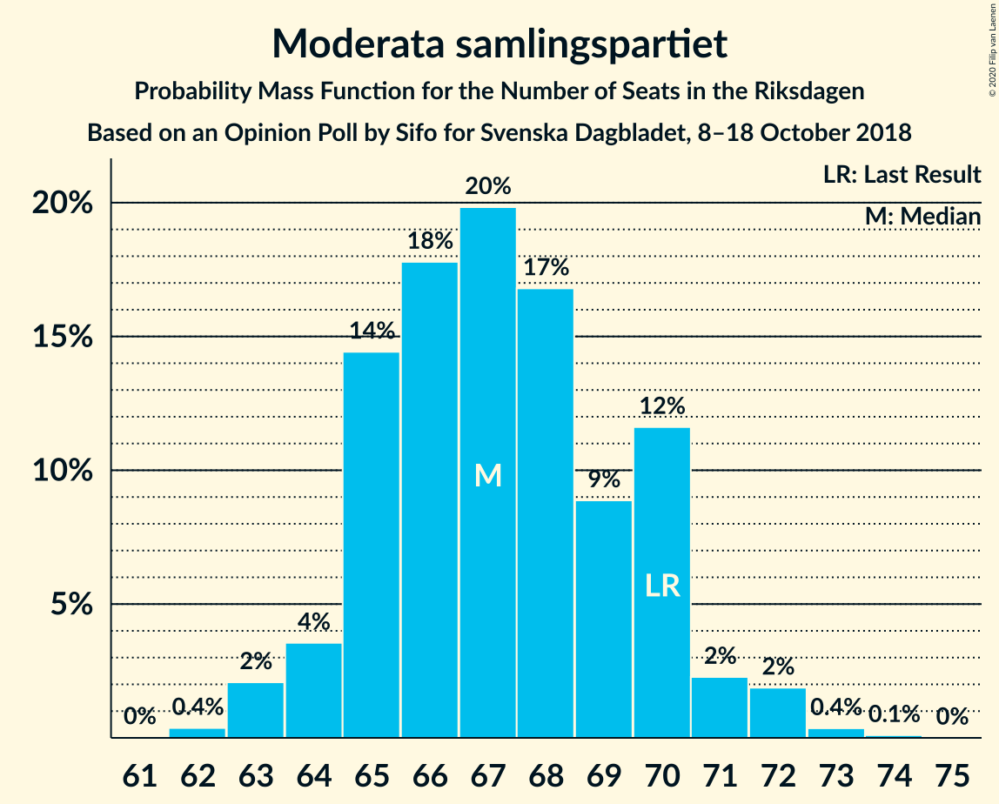
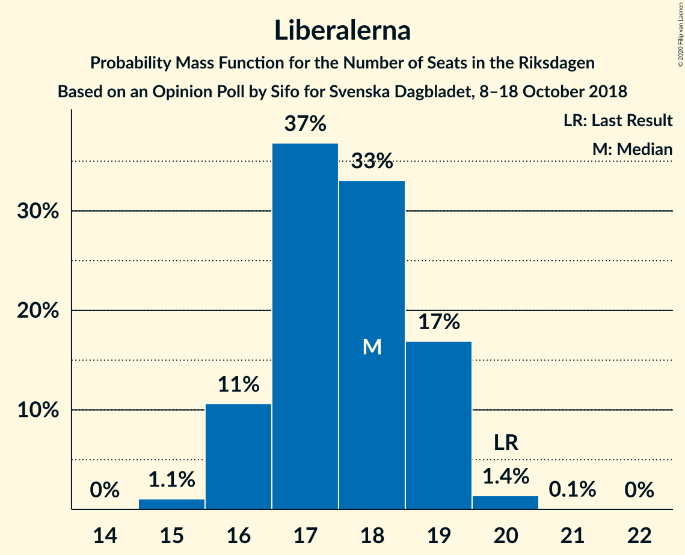

# Opinion Poll by Sifo for Svenska Dagbladet, 8–18 October 2018

<a href="#voting-intentions">Voting Intentions</a> | <a href="#seats">Seats</a> | <a href="#coalitions">Coalitions</a> | <a href="#technical-information">Technical Information</a>

## Voting Intentions

### Confidence Intervals

| Party | Last Result | Poll Result | 80% Confidence Interval | 90% Confidence Interval | 95% Confidence Interval | 99% Confidence Interval |
|:-----:|:-----------:|:-----------:|:-----------------------:|:-----------------------:|:-----------------------:|:-----------------------:|
| Sveriges socialdemokratiska arbetareparti | 28.3% | 29.4% | 28.7–30.0% |28.6–30.2% |28.4–30.3% |28.1–30.7% |
| Moderata samlingspartiet | 19.8% | 18.8% | 18.2–19.3% |18.1–19.5% |18.0–19.6% |17.7–19.9% |
| Sverigedemokraterna | 17.5% | 18.6% | 18.0–19.1% |17.9–19.3% |17.8–19.4% |17.5–19.7% |
| Centerpartiet | 8.6% | 9.1% | 8.7–9.5% |8.6–9.6% |8.5–9.7% |8.3–9.9% |
| Vänsterpartiet | 8.0% | 7.9% | 7.5–8.3% |7.4–8.4% |7.3–8.5% |7.2–8.7% |
| Kristdemokraterna | 6.3% | 6.0% | 5.7–6.3% |5.6–6.4% |5.5–6.5% |5.3–6.7% |
| Liberalerna | 5.5% | 4.9% | 4.6–5.2% |4.5–5.3% |4.5–5.4% |4.3–5.5% |
| Miljöpartiet de gröna | 4.4% | 4.1% | 3.8–4.4% |3.8–4.5% |3.7–4.5% |3.6–4.7% |

*Note:* The poll result column reflects the actual value used in the calculations. Published results may vary slightly, and in addition be rounded to fewer digits.

## Seats

### Confidence Intervals

| Party | Last Result | Median | 80% Confidence Interval | 90% Confidence Interval | 95% Confidence Interval | 99% Confidence Interval |
|:-----:|:-----------:|:------:|:-----------------------:|:-----------------------:|:-----------------------:|:-----------------------:|
| <a href="#sveriges-socialdemokratiska-arbetareparti">Sveriges socialdemokratiska arbetareparti</a> | 100 | 105 | 102–109 |101–110 |101–111 |99–112 |
| <a href="#moderata-samlingspartiet">Moderata samlingspartiet</a> | 70 | 67 | 65–70 |64–70 |64–71 |63–72 |
| <a href="#sverigedemokraterna">Sverigedemokraterna</a> | 62 | 66 | 64–69 |63–70 |63–71 |62–72 |
| <a href="#centerpartiet">Centerpartiet</a> | 31 | 32 | 31–34 |30–35 |30–35 |30–36 |
| <a href="#vänsterpartiet">Vänsterpartiet</a> | 28 | 28 | 27–30 |26–30 |26–31 |25–31 |
| <a href="#kristdemokraterna">Kristdemokraterna</a> | 22 | 22 | 20–23 |20–23 |20–23 |19–24 |
| <a href="#liberalerna">Liberalerna</a> | 20 | 18 | 16–19 |16–19 |16–19 |15–20 |
| <a href="#miljöpartiet-de-gröna">Miljöpartiet de gröna</a> | 16 | 15 | 0–15 |0–16 |0–16 |0–17 |

### Sveriges socialdemokratiska arbetareparti

*For a full overview of the results for this party, see the [Sveriges socialdemokratiska arbetareparti](party-sverigessocialdemokratiskaarbetareparti.html) page.*

| Number of Seats | Probability | Accumulated | Special Marks |
|:---------------:|:-----------:|:-----------:|:-------------:|
| 98 | 0.1% | 100% |  |
| 99 | 0.5% | 99.9% |  |
| 100 | 2% | 99.4% | Last Result |
| 101 | 3% | 98% |  |
| 102 | 13% | 94% |  |
| 103 | 9% | 81% |  |
| 104 | 19% | 72% |  |
| 105 | 14% | 54% | Median |
| 106 | 10% | 39% |  |
| 107 | 9% | 29% |  |
| 108 | 10% | 21% |  |
| 109 | 4% | 11% |  |
| 110 | 4% | 7% |  |
| 111 | 2% | 3% |  |
| 112 | 1.2% | 1.4% |  |
| 113 | 0.2% | 0.3% |  |
| 114 | 0.1% | 0.1% |  |
| 115 | 0% | 0% |  |

### Moderata samlingspartiet

*For a full overview of the results for this party, see the [Moderata samlingspartiet](party-moderatasamlingspartiet.html) page.*

| Number of Seats | Probability | Accumulated | Special Marks |
|:---------------:|:-----------:|:-----------:|:-------------:|
| 62 | 0.4% | 100% |  |
| 63 | 2% | 99.6% |  |
| 64 | 4% | 98% |  |
| 65 | 14% | 94% |  |
| 66 | 18% | 80% |  |
| 67 | 20% | 62% | Median |
| 68 | 17% | 42% |  |
| 69 | 9% | 25% |  |
| 70 | 12% | 16% | Last Result |
| 71 | 2% | 5% |  |
| 72 | 2% | 2% |  |
| 73 | 0.4% | 0.5% |  |
| 74 | 0.1% | 0.1% |  |
| 75 | 0% | 0% |  |

### Sverigedemokraterna

*For a full overview of the results for this party, see the [Sverigedemokraterna](party-sverigedemokraterna.html) page.*

| Number of Seats | Probability | Accumulated | Special Marks |
|:---------------:|:-----------:|:-----------:|:-------------:|
| 61 | 0.2% | 100% |  |
| 62 | 1.1% | 99.8% | Last Result |
| 63 | 4% | 98.7% |  |
| 64 | 10% | 94% |  |
| 65 | 17% | 85% |  |
| 66 | 19% | 67% | Median |
| 67 | 16% | 49% |  |
| 68 | 18% | 32% |  |
| 69 | 8% | 15% |  |
| 70 | 3% | 7% |  |
| 71 | 3% | 4% |  |
| 72 | 0.7% | 0.8% |  |
| 73 | 0.1% | 0.2% |  |
| 74 | 0% | 0% |  |

### Centerpartiet

*For a full overview of the results for this party, see the [Centerpartiet](party-centerpartiet.html) page.*

| Number of Seats | Probability | Accumulated | Special Marks |
|:---------------:|:-----------:|:-----------:|:-------------:|
| 29 | 0.4% | 100% |  |
| 30 | 5% | 99.6% |  |
| 31 | 18% | 95% | Last Result |
| 32 | 34% | 77% | Median |
| 33 | 21% | 43% |  |
| 34 | 14% | 22% |  |
| 35 | 7% | 8% |  |
| 36 | 1.1% | 1.3% |  |
| 37 | 0.2% | 0.2% |  |
| 38 | 0% | 0% |  |

### Vänsterpartiet

*For a full overview of the results for this party, see the [Vänsterpartiet](party-vänsterpartiet.html) page.*

| Number of Seats | Probability | Accumulated | Special Marks |
|:---------------:|:-----------:|:-----------:|:-------------:|
| 25 | 0.6% | 100% |  |
| 26 | 6% | 99.4% |  |
| 27 | 28% | 93% |  |
| 28 | 24% | 65% | Last Result, Median |
| 29 | 30% | 42% |  |
| 30 | 8% | 11% |  |
| 31 | 3% | 4% |  |
| 32 | 0.4% | 0.4% |  |
| 33 | 0% | 0% |  |

### Kristdemokraterna

*For a full overview of the results for this party, see the [Kristdemokraterna](party-kristdemokraterna.html) page.*

| Number of Seats | Probability | Accumulated | Special Marks |
|:---------------:|:-----------:|:-----------:|:-------------:|
| 18 | 0.1% | 100% |  |
| 19 | 2% | 99.9% |  |
| 20 | 20% | 98% |  |
| 21 | 28% | 78% |  |
| 22 | 32% | 50% | Last Result, Median |
| 23 | 16% | 18% |  |
| 24 | 2% | 2% |  |
| 25 | 0.2% | 0.2% |  |
| 26 | 0% | 0% |  |

### Liberalerna

*For a full overview of the results for this party, see the [Liberalerna](party-liberalerna.html) page.*

| Number of Seats | Probability | Accumulated | Special Marks |
|:---------------:|:-----------:|:-----------:|:-------------:|
| 15 | 1.1% | 100% |  |
| 16 | 11% | 98.9% |  |
| 17 | 37% | 88% |  |
| 18 | 33% | 51% | Median |
| 19 | 17% | 18% |  |
| 20 | 1.4% | 1.5% | Last Result |
| 21 | 0.1% | 0.1% |  |
| 22 | 0% | 0% |  |

### Miljöpartiet de gröna

*For a full overview of the results for this party, see the [Miljöpartiet de gröna](party-miljöpartietdegröna.html) page.*

| Number of Seats | Probability | Accumulated | Special Marks |
|:---------------:|:-----------:|:-----------:|:-------------:|
| 0 | 30% | 100% |  |
| 1 | 0% | 70% |  |
| 2 | 0% | 70% |  |
| 3 | 0% | 70% |  |
| 4 | 0% | 70% |  |
| 5 | 0% | 70% |  |
| 6 | 0% | 70% |  |
| 7 | 0% | 70% |  |
| 8 | 0% | 70% |  |
| 9 | 0% | 70% |  |
| 10 | 0% | 70% |  |
| 11 | 0% | 70% |  |
| 12 | 0% | 70% |  |
| 13 | 0% | 70% |  |
| 14 | 18% | 70% |  |
| 15 | 44% | 53% | Median |
| 16 | 8% | 8% | Last Result |
| 17 | 0.8% | 0.8% |  |
| 18 | 0% | 0% |  |

## Coalitions

### Confidence Intervals

| Coalition | Last Result | Median | Majority? | 80% Confidence Interval | 90% Confidence Interval | 95% Confidence Interval | 99% Confidence Interval |
|:---------:|:-----------:|:------:|:---------:|:-----------------------:|:-----------------------:|:-----------------------:|:-----------------------:|
| Sveriges socialdemokratiska arbetareparti – Moderata samlingspartiet – Centerpartiet | 201 | 203 | 100% | 200–212 | 200–213 | 199–213 | 198–215 |
| Sveriges socialdemokratiska arbetareparti – Moderata samlingspartiet | 170 | 171 | 29% | 168–178 | 167–179 | 167–180 | 165–182 |
| Moderata samlingspartiet – Sverigedemokraterna – Kristdemokraterna | 154 | 154 | 0% | 151–161 | 150–162 | 150–163 | 149–164 |
| Sveriges socialdemokratiska arbetareparti – Vänsterpartiet – Miljöpartiet de gröna | 144 | 145 | 0% | 136–148 | 135–149 | 135–150 | 134–151 |
| Moderata samlingspartiet – Centerpartiet – Kristdemokraterna – Liberalerna | 143 | 138 | 0% | 135–144 | 134–145 | 134–146 | 132–147 |
| Moderata samlingspartiet – Sverigedemokraterna | 132 | 133 | 0% | 130–138 | 129–139 | 129–141 | 127–142 |
| Sveriges socialdemokratiska arbetareparti – Vänsterpartiet | 128 | 133 | 0% | 129–138 | 129–139 | 128–140 | 127–141 |
| Moderata samlingspartiet – Centerpartiet – Kristdemokraterna | 123 | 120 | 0% | 118–126 | 117–127 | 116–128 | 115–129 |
| Moderata samlingspartiet – Centerpartiet – Liberalerna | 121 | 117 | 0% | 114–122 | 113–123 | 113–124 | 112–124 |
| Sveriges socialdemokratiska arbetareparti – Miljöpartiet de gröna | 116 | 118 | 0% | 108–121 | 107–121 | 106–122 | 105–123 |
| Moderata samlingspartiet – Centerpartiet | 101 | 99 | 0% | 97–104 | 96–104 | 95–105 | 94–106 |

### Sveriges socialdemokratiska arbetareparti – Moderata samlingspartiet – Centerpartiet

| Number of Seats | Probability | Accumulated | Special Marks |
|:---------------:|:-----------:|:-----------:|:-------------:|
| 196 | 0.1% | 100% |  |
| 197 | 0.3% | 99.9% |  |
| 198 | 1.5% | 99.6% |  |
| 199 | 3% | 98% |  |
| 200 | 11% | 95% |  |
| 201 | 10% | 84% | Last Result |
| 202 | 14% | 74% |  |
| 203 | 12% | 60% |  |
| 204 | 11% | 48% | Median |
| 205 | 4% | 37% |  |
| 206 | 2% | 32% |  |
| 207 | 2% | 30% |  |
| 208 | 1.0% | 28% |  |
| 209 | 3% | 27% |  |
| 210 | 6% | 24% |  |
| 211 | 4% | 18% |  |
| 212 | 8% | 14% |  |
| 213 | 4% | 7% |  |
| 214 | 2% | 2% |  |
| 215 | 0.7% | 0.9% |  |
| 216 | 0.1% | 0.2% |  |
| 217 | 0% | 0% |  |

### Sveriges socialdemokratiska arbetareparti – Moderata samlingspartiet

| Number of Seats | Probability | Accumulated | Special Marks |
|:---------------:|:-----------:|:-----------:|:-------------:|
| 164 | 0.1% | 100% |  |
| 165 | 0.5% | 99.8% |  |
| 166 | 2% | 99.4% |  |
| 167 | 4% | 98% |  |
| 168 | 9% | 94% |  |
| 169 | 9% | 85% |  |
| 170 | 15% | 76% | Last Result |
| 171 | 12% | 61% |  |
| 172 | 13% | 49% | Median |
| 173 | 5% | 36% |  |
| 174 | 2% | 31% |  |
| 175 | 3% | 29% | Majority |
| 176 | 4% | 26% |  |
| 177 | 7% | 22% |  |
| 178 | 8% | 15% |  |
| 179 | 4% | 7% |  |
| 180 | 2% | 3% |  |
| 181 | 0.9% | 2% |  |
| 182 | 0.4% | 0.6% |  |
| 183 | 0.2% | 0.2% |  |
| 184 | 0% | 0% |  |

### Moderata samlingspartiet – Sverigedemokraterna – Kristdemokraterna

| Number of Seats | Probability | Accumulated | Special Marks |
|:---------------:|:-----------:|:-----------:|:-------------:|
| 147 | 0.1% | 100% |  |
| 148 | 0.4% | 99.9% |  |
| 149 | 1.1% | 99.5% |  |
| 150 | 5% | 98% |  |
| 151 | 6% | 93% |  |
| 152 | 12% | 87% |  |
| 153 | 14% | 75% |  |
| 154 | 13% | 61% | Last Result |
| 155 | 8% | 48% | Median |
| 156 | 8% | 39% |  |
| 157 | 5% | 31% |  |
| 158 | 3% | 26% |  |
| 159 | 7% | 23% |  |
| 160 | 5% | 17% |  |
| 161 | 5% | 12% |  |
| 162 | 4% | 7% |  |
| 163 | 2% | 3% |  |
| 164 | 0.4% | 0.8% |  |
| 165 | 0.3% | 0.4% |  |
| 166 | 0% | 0% |  |

### Sveriges socialdemokratiska arbetareparti – Vänsterpartiet – Miljöpartiet de gröna

| Number of Seats | Probability | Accumulated | Special Marks |
|:---------------:|:-----------:|:-----------:|:-------------:|
| 132 | 0.1% | 100% |  |
| 133 | 0.3% | 99.9% |  |
| 134 | 1.2% | 99.6% |  |
| 135 | 4% | 98% |  |
| 136 | 6% | 95% |  |
| 137 | 6% | 89% |  |
| 138 | 4% | 83% |  |
| 139 | 5% | 78% |  |
| 140 | 2% | 74% |  |
| 141 | 1.0% | 72% |  |
| 142 | 1.0% | 71% |  |
| 143 | 3% | 70% |  |
| 144 | 10% | 67% | Last Result |
| 145 | 7% | 57% |  |
| 146 | 13% | 50% |  |
| 147 | 16% | 37% |  |
| 148 | 12% | 21% | Median |
| 149 | 5% | 9% |  |
| 150 | 3% | 4% |  |
| 151 | 0.5% | 0.8% |  |
| 152 | 0.2% | 0.3% |  |
| 153 | 0.1% | 0.1% |  |
| 154 | 0% | 0% |  |

### Moderata samlingspartiet – Centerpartiet – Kristdemokraterna – Liberalerna

| Number of Seats | Probability | Accumulated | Special Marks |
|:---------------:|:-----------:|:-----------:|:-------------:|
| 131 | 0.1% | 100% |  |
| 132 | 0.5% | 99.9% |  |
| 133 | 1.4% | 99.4% |  |
| 134 | 5% | 98% |  |
| 135 | 9% | 93% |  |
| 136 | 13% | 84% |  |
| 137 | 19% | 71% |  |
| 138 | 10% | 52% |  |
| 139 | 8% | 42% | Median |
| 140 | 5% | 34% |  |
| 141 | 3% | 29% |  |
| 142 | 6% | 26% |  |
| 143 | 4% | 19% | Last Result |
| 144 | 7% | 15% |  |
| 145 | 5% | 8% |  |
| 146 | 2% | 3% |  |
| 147 | 0.7% | 0.9% |  |
| 148 | 0.1% | 0.2% |  |
| 149 | 0% | 0.1% |  |
| 150 | 0% | 0% |  |

### Moderata samlingspartiet – Sverigedemokraterna

| Number of Seats | Probability | Accumulated | Special Marks |
|:---------------:|:-----------:|:-----------:|:-------------:|
| 126 | 0.1% | 100% |  |
| 127 | 0.5% | 99.9% |  |
| 128 | 1.3% | 99.5% |  |
| 129 | 5% | 98% |  |
| 130 | 8% | 94% |  |
| 131 | 12% | 86% |  |
| 132 | 16% | 74% | Last Result |
| 133 | 12% | 59% | Median |
| 134 | 13% | 47% |  |
| 135 | 7% | 34% |  |
| 136 | 5% | 27% |  |
| 137 | 5% | 22% |  |
| 138 | 7% | 17% |  |
| 139 | 5% | 10% |  |
| 140 | 2% | 5% |  |
| 141 | 2% | 3% |  |
| 142 | 0.6% | 0.8% |  |
| 143 | 0.1% | 0.2% |  |
| 144 | 0% | 0% |  |

### Sveriges socialdemokratiska arbetareparti – Vänsterpartiet

| Number of Seats | Probability | Accumulated | Special Marks |
|:---------------:|:-----------:|:-----------:|:-------------:|
| 126 | 0.1% | 100% |  |
| 127 | 0.6% | 99.9% |  |
| 128 | 2% | 99.2% | Last Result |
| 129 | 9% | 97% |  |
| 130 | 8% | 88% |  |
| 131 | 12% | 80% |  |
| 132 | 15% | 68% |  |
| 133 | 15% | 53% | Median |
| 134 | 7% | 38% |  |
| 135 | 7% | 32% |  |
| 136 | 7% | 25% |  |
| 137 | 6% | 18% |  |
| 138 | 4% | 12% |  |
| 139 | 5% | 8% |  |
| 140 | 2% | 3% |  |
| 141 | 0.9% | 1.3% |  |
| 142 | 0.3% | 0.4% |  |
| 143 | 0.1% | 0.1% |  |
| 144 | 0% | 0% |  |

### Moderata samlingspartiet – Centerpartiet – Kristdemokraterna

| Number of Seats | Probability | Accumulated | Special Marks |
|:---------------:|:-----------:|:-----------:|:-------------:|
| 114 | 0.1% | 100% |  |
| 115 | 0.7% | 99.9% |  |
| 116 | 3% | 99.1% |  |
| 117 | 6% | 96% |  |
| 118 | 10% | 91% |  |
| 119 | 14% | 81% |  |
| 120 | 18% | 66% |  |
| 121 | 10% | 48% | Median |
| 122 | 7% | 38% |  |
| 123 | 5% | 31% | Last Result |
| 124 | 8% | 26% |  |
| 125 | 6% | 18% |  |
| 126 | 6% | 12% |  |
| 127 | 3% | 6% |  |
| 128 | 2% | 3% |  |
| 129 | 0.4% | 0.6% |  |
| 130 | 0.1% | 0.2% |  |
| 131 | 0% | 0.1% |  |
| 132 | 0% | 0% |  |

### Moderata samlingspartiet – Centerpartiet – Liberalerna

| Number of Seats | Probability | Accumulated | Special Marks |
|:---------------:|:-----------:|:-----------:|:-------------:|
| 110 | 0% | 100% |  |
| 111 | 0.4% | 99.9% |  |
| 112 | 2% | 99.6% |  |
| 113 | 5% | 98% |  |
| 114 | 11% | 93% |  |
| 115 | 15% | 82% |  |
| 116 | 13% | 66% |  |
| 117 | 15% | 54% | Median |
| 118 | 9% | 39% |  |
| 119 | 5% | 30% |  |
| 120 | 7% | 25% |  |
| 121 | 5% | 18% | Last Result |
| 122 | 6% | 13% |  |
| 123 | 5% | 7% |  |
| 124 | 2% | 3% |  |
| 125 | 0.4% | 0.5% |  |
| 126 | 0.1% | 0.1% |  |
| 127 | 0% | 0% |  |

### Sveriges socialdemokratiska arbetareparti – Miljöpartiet de gröna

| Number of Seats | Probability | Accumulated | Special Marks |
|:---------------:|:-----------:|:-----------:|:-------------:|
| 104 | 0.4% | 100% |  |
| 105 | 1.1% | 99.5% |  |
| 106 | 2% | 98% |  |
| 107 | 7% | 97% |  |
| 108 | 9% | 90% |  |
| 109 | 4% | 81% |  |
| 110 | 4% | 77% |  |
| 111 | 2% | 73% |  |
| 112 | 1.2% | 72% |  |
| 113 | 0.3% | 71% |  |
| 114 | 1.0% | 70% |  |
| 115 | 2% | 69% |  |
| 116 | 5% | 67% | Last Result |
| 117 | 10% | 62% |  |
| 118 | 9% | 52% |  |
| 119 | 21% | 43% |  |
| 120 | 11% | 21% | Median |
| 121 | 7% | 10% |  |
| 122 | 2% | 3% |  |
| 123 | 0.9% | 1.1% |  |
| 124 | 0.2% | 0.2% |  |
| 125 | 0% | 0% |  |

### Moderata samlingspartiet – Centerpartiet

| Number of Seats | Probability | Accumulated | Special Marks |
|:---------------:|:-----------:|:-----------:|:-------------:|
| 93 | 0.1% | 100% |  |
| 94 | 0.7% | 99.9% |  |
| 95 | 2% | 99.3% |  |
| 96 | 5% | 97% |  |
| 97 | 14% | 92% |  |
| 98 | 15% | 77% |  |
| 99 | 15% | 62% | Median |
| 100 | 11% | 46% |  |
| 101 | 10% | 35% | Last Result |
| 102 | 7% | 25% |  |
| 103 | 8% | 19% |  |
| 104 | 6% | 11% |  |
| 105 | 2% | 4% |  |
| 106 | 2% | 2% |  |
| 107 | 0.3% | 0.4% |  |
| 108 | 0.1% | 0.1% |  |
| 109 | 0% | 0% |  |

## Technical Information

### Opinion Poll

+ **Polling firm:** Sifo
+ **Commissioner(s):** Svenska Dagbladet
+ **Fieldwork period:** 8–18 October 2018

### Calculations

+ **Sample size:** 8583
+ **Simulations done:** 1,048,576
+ **Error estimate:** 0.81%

