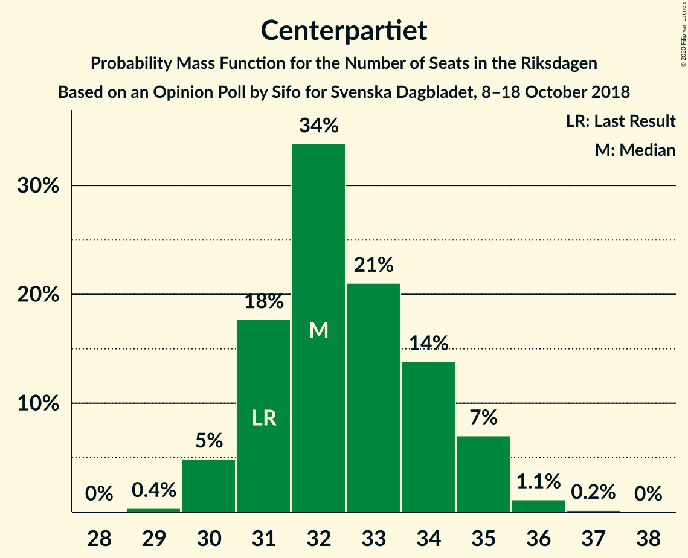
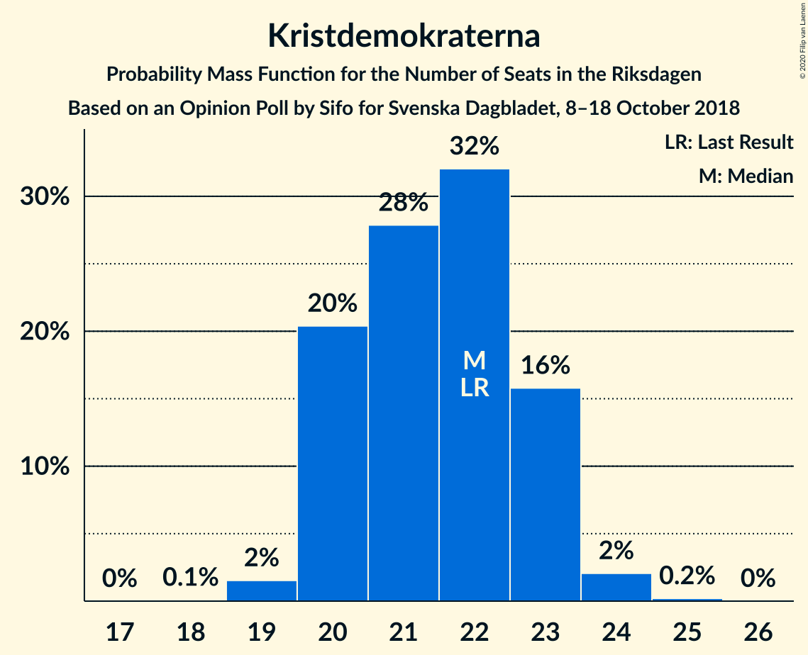

# Opinion Poll by Sifo for Svenska Dagbladet, 8–18 October 2018

<a href="#voting-intentions">Voting Intentions</a> | <a href="#seats">Seats</a> | <a href="#coalitions">Coalitions</a> | <a href="#technical-information">Technical Information</a>

## Voting Intentions

### Confidence Intervals

| Party | Last Result | Poll Result | 80% Confidence Interval | 90% Confidence Interval | 95% Confidence Interval | 99% Confidence Interval |
|:-----:|:-----------:|:-----------:|:-----------------------:|:-----------------------:|:-----------------------:|:-----------------------:|
| Sveriges socialdemokratiska arbetareparti | 28.3% | 29.4% | 28.7–30.0% |28.6–30.2% |28.4–30.3% |28.1–30.7% |
| Moderata samlingspartiet | 19.8% | 18.8% | 18.2–19.3% |18.1–19.5% |18.0–19.6% |17.7–19.9% |
| Sverigedemokraterna | 17.5% | 18.6% | 18.0–19.1% |17.9–19.3% |17.8–19.4% |17.5–19.7% |
| Centerpartiet | 8.6% | 9.1% | 8.7–9.5% |8.6–9.6% |8.5–9.7% |8.3–9.9% |
| Vänsterpartiet | 8.0% | 7.9% | 7.5–8.3% |7.4–8.4% |7.3–8.5% |7.2–8.7% |
| Kristdemokraterna | 6.3% | 6.0% | 5.7–6.3% |5.6–6.4% |5.5–6.5% |5.3–6.7% |
| Liberalerna | 5.5% | 4.9% | 4.6–5.2% |4.5–5.3% |4.5–5.4% |4.3–5.5% |
| Miljöpartiet de gröna | 4.4% | 4.1% | 3.8–4.4% |3.8–4.5% |3.7–4.5% |3.6–4.7% |

*Note:* The poll result column reflects the actual value used in the calculations. Published results may vary slightly, and in addition be rounded to fewer digits.

## Seats

### Confidence Intervals

| Party | Last Result | Median | 80% Confidence Interval | 90% Confidence Interval | 95% Confidence Interval | 99% Confidence Interval |
|:-----:|:-----------:|:------:|:-----------------------:|:-----------------------:|:-----------------------:|:-----------------------:|
| <a href="#sveriges-socialdemokratiska-arbetareparti">Sveriges socialdemokratiska arbetareparti</a> | 100 | 113 | 105–113 |105–113 |100–113 |99–113 |
| <a href="#moderata-samlingspartiet">Moderata samlingspartiet</a> | 70 | 69 | 69–74 |68–74 |65–74 |61–74 |
| <a href="#sverigedemokraterna">Sverigedemokraterna</a> | 62 | 66 | 66–70 |63–70 |62–70 |62–70 |
| <a href="#centerpartiet">Centerpartiet</a> | 31 | 35 | 32–37 |32–37 |32–37 |31–37 |
| <a href="#vänsterpartiet">Vänsterpartiet</a> | 28 | 29 | 26–29 |26–29 |26–29 |25–31 |
| <a href="#kristdemokraterna">Kristdemokraterna</a> | 22 | 19 | 19–23 |19–23 |19–23 |18–23 |
| <a href="#liberalerna">Liberalerna</a> | 20 | 18 | 18–20 |18–20 |16–20 |16–20 |
| <a href="#miljöpartiet-de-gröna">Miljöpartiet de gröna</a> | 16 | 0 | 0 |0–15 |0–16 |0–17 |

### Sveriges socialdemokratiska arbetareparti

*For a full overview of the results for this party, see the [Sveriges socialdemokratiska arbetareparti](party-sverigessocialdemokratiskaarbetareparti.html) page.*

| Number of Seats | Probability | Accumulated | Special Marks |
|:---------------:|:-----------:|:-----------:|:-------------:|
| 99 | 2% | 100% |  |
| 100 | 1.2% | 98% | Last Result |
| 101 | 0.2% | 97% |  |
| 102 | 0% | 96% |  |
| 103 | 0.4% | 96% |  |
| 104 | 0.1% | 96% |  |
| 105 | 32% | 96% |  |
| 106 | 0% | 64% |  |
| 107 | 0% | 64% |  |
| 108 | 3% | 64% |  |
| 109 | 0.1% | 61% |  |
| 110 | 0.2% | 61% |  |
| 111 | 0% | 61% |  |
| 112 | 0% | 61% |  |
| 113 | 61% | 61% | Median |
| 114 | 0.1% | 0.1% |  |
| 115 | 0% | 0% |  |

### Moderata samlingspartiet

*For a full overview of the results for this party, see the [Moderata samlingspartiet](party-moderatasamlingspartiet.html) page.*

| Number of Seats | Probability | Accumulated | Special Marks |
|:---------------:|:-----------:|:-----------:|:-------------:|
| 61 | 1.0% | 100% |  |
| 62 | 0.1% | 99.0% |  |
| 63 | 0% | 98.9% |  |
| 64 | 0% | 98.9% |  |
| 65 | 1.4% | 98.9% |  |
| 66 | 0.4% | 97% |  |
| 67 | 0% | 97% |  |
| 68 | 2% | 97% |  |
| 69 | 78% | 95% | Median |
| 70 | 1.4% | 17% | Last Result |
| 71 | 1.2% | 16% |  |
| 72 | 0% | 15% |  |
| 73 | 0% | 15% |  |
| 74 | 15% | 15% |  |
| 75 | 0% | 0% |  |

### Sverigedemokraterna

*For a full overview of the results for this party, see the [Sverigedemokraterna](party-sverigedemokraterna.html) page.*

| Number of Seats | Probability | Accumulated | Special Marks |
|:---------------:|:-----------:|:-----------:|:-------------:|
| 62 | 3% | 100% | Last Result |
| 63 | 2% | 97% |  |
| 64 | 0.1% | 94% |  |
| 65 | 0% | 94% |  |
| 66 | 61% | 94% | Median |
| 67 | 1.3% | 33% |  |
| 68 | 0% | 32% |  |
| 69 | 16% | 32% |  |
| 70 | 15% | 15% |  |
| 71 | 0.4% | 0.4% |  |
| 72 | 0.1% | 0.1% |  |
| 73 | 0% | 0% |  |

### Centerpartiet

*For a full overview of the results for this party, see the [Centerpartiet](party-centerpartiet.html) page.*

| Number of Seats | Probability | Accumulated | Special Marks |
|:---------------:|:-----------:|:-----------:|:-------------:|
| 30 | 0.3% | 100% |  |
| 31 | 0.5% | 99.7% | Last Result |
| 32 | 16% | 99.3% |  |
| 33 | 3% | 83% |  |
| 34 | 3% | 80% |  |
| 35 | 61% | 77% | Median |
| 36 | 0.4% | 16% |  |
| 37 | 16% | 16% |  |
| 38 | 0.1% | 0.1% |  |
| 39 | 0% | 0% |  |

### Vänsterpartiet

*For a full overview of the results for this party, see the [Vänsterpartiet](party-vänsterpartiet.html) page.*

| Number of Seats | Probability | Accumulated | Special Marks |
|:---------------:|:-----------:|:-----------:|:-------------:|
| 25 | 2% | 100% |  |
| 26 | 17% | 98% |  |
| 27 | 1.3% | 81% |  |
| 28 | 2% | 79% | Last Result |
| 29 | 76% | 78% | Median |
| 30 | 1.3% | 2% |  |
| 31 | 0.3% | 0.6% |  |
| 32 | 0.1% | 0.3% |  |
| 33 | 0.1% | 0.1% |  |
| 34 | 0% | 0% |  |

### Kristdemokraterna

*For a full overview of the results for this party, see the [Kristdemokraterna](party-kristdemokraterna.html) page.*

| Number of Seats | Probability | Accumulated | Special Marks |
|:---------------:|:-----------:|:-----------:|:-------------:|
| 18 | 1.4% | 100% |  |
| 19 | 61% | 98.6% | Median |
| 20 | 3% | 37% |  |
| 21 | 15% | 34% |  |
| 22 | 2% | 19% | Last Result |
| 23 | 16% | 17% |  |
| 24 | 0% | 0.4% |  |
| 25 | 0.3% | 0.4% |  |
| 26 | 0% | 0% |  |

### Liberalerna

*For a full overview of the results for this party, see the [Liberalerna](party-liberalerna.html) page.*

| Number of Seats | Probability | Accumulated | Special Marks |
|:---------------:|:-----------:|:-----------:|:-------------:|
| 16 | 3% | 100% |  |
| 17 | 1.0% | 97% |  |
| 18 | 78% | 96% | Median |
| 19 | 1.5% | 18% |  |
| 20 | 16% | 16% | Last Result |
| 21 | 0.2% | 0.2% |  |
| 22 | 0% | 0% |  |

### Miljöpartiet de gröna

*For a full overview of the results for this party, see the [Miljöpartiet de gröna](party-miljöpartietdegröna.html) page.*

| Number of Seats | Probability | Accumulated | Special Marks |
|:---------------:|:-----------:|:-----------:|:-------------:|
| 0 | 92% | 100% | Median |
| 1 | 0% | 8% |  |
| 2 | 0% | 8% |  |
| 3 | 0% | 8% |  |
| 4 | 0% | 8% |  |
| 5 | 0% | 8% |  |
| 6 | 0% | 8% |  |
| 7 | 0% | 8% |  |
| 8 | 0% | 8% |  |
| 9 | 0% | 8% |  |
| 10 | 0% | 8% |  |
| 11 | 0% | 8% |  |
| 12 | 0% | 8% |  |
| 13 | 0% | 8% |  |
| 14 | 0% | 8% |  |
| 15 | 4% | 8% |  |
| 16 | 3% | 4% | Last Result |
| 17 | 0.9% | 0.9% |  |
| 18 | 0% | 0% |  |

## Coalitions

### Confidence Intervals

| Coalition | Last Result | Median | Majority? | 80% Confidence Interval | 90% Confidence Interval | 95% Confidence Interval | 99% Confidence Interval |
|:---------:|:-----------:|:------:|:---------:|:-----------------------:|:-----------------------:|:-----------------------:|:-----------------------:|
| Sveriges socialdemokratiska arbetareparti – Moderata samlingspartiet – Centerpartiet | 201 | 217 | 100% | 211–217 | 204–217 | 203–217 | 198–217 |
| Sveriges socialdemokratiska arbetareparti – Moderata samlingspartiet | 170 | 182 | 78% | 174–182 | 170–182 | 169–182 | 166–182 |
| Moderata samlingspartiet – Sverigedemokraterna – Kristdemokraterna | 154 | 154 | 0% | 154–165 | 153–165 | 151–165 | 149–165 |
| Moderata samlingspartiet – Centerpartiet – Kristdemokraterna – Liberalerna | 143 | 141 | 0% | 141–149 | 140–149 | 137–149 | 133–149 |
| Sveriges socialdemokratiska arbetareparti – Vänsterpartiet – Miljöpartiet de gröna | 144 | 142 | 0% | 131–142 | 131–145 | 131–147 | 131–149 |
| Moderata samlingspartiet – Sverigedemokraterna | 132 | 135 | 0% | 135–144 | 131–144 | 130–144 | 127–144 |
| Sveriges socialdemokratiska arbetareparti – Vänsterpartiet | 128 | 142 | 0% | 131–142 | 131–142 | 130–142 | 126–142 |
| Moderata samlingspartiet – Centerpartiet – Kristdemokraterna | 123 | 123 | 0% | 123–129 | 122–129 | 121–129 | 116–129 |
| Moderata samlingspartiet – Centerpartiet – Liberalerna | 121 | 122 | 0% | 122–126 | 119–126 | 117–126 | 110–126 |
| Sveriges socialdemokratiska arbetareparti – Miljöpartiet de gröna | 116 | 113 | 0% | 105–113 | 105–116 | 105–121 | 105–124 |
| Moderata samlingspartiet – Centerpartiet | 101 | 104 | 0% | 104–106 | 102–106 | 99–106 | 93–106 |

### Sveriges socialdemokratiska arbetareparti – Moderata samlingspartiet – Centerpartiet

| Number of Seats | Probability | Accumulated | Special Marks |
|:---------------:|:-----------:|:-----------:|:-------------:|
| 197 | 0.2% | 100% |  |
| 198 | 1.2% | 99.8% |  |
| 199 | 0% | 98.5% |  |
| 200 | 0% | 98.5% |  |
| 201 | 0% | 98.5% | Last Result |
| 202 | 0% | 98.5% |  |
| 203 | 3% | 98.5% |  |
| 204 | 1.0% | 95% |  |
| 205 | 0.3% | 94% |  |
| 206 | 0% | 94% |  |
| 207 | 0.4% | 94% |  |
| 208 | 0% | 93% |  |
| 209 | 2% | 93% |  |
| 210 | 0.2% | 91% |  |
| 211 | 30% | 91% |  |
| 212 | 0% | 61% |  |
| 213 | 0% | 61% |  |
| 214 | 0.1% | 61% |  |
| 215 | 0.3% | 61% |  |
| 216 | 0% | 61% |  |
| 217 | 61% | 61% | Median |
| 218 | 0% | 0% |  |

### Sveriges socialdemokratiska arbetareparti – Moderata samlingspartiet

| Number of Seats | Probability | Accumulated | Special Marks |
|:---------------:|:-----------:|:-----------:|:-------------:|
| 166 | 1.2% | 100% |  |
| 167 | 0% | 98.8% |  |
| 168 | 0.2% | 98.8% |  |
| 169 | 2% | 98.5% |  |
| 170 | 2% | 96% | Last Result |
| 171 | 0.5% | 94% |  |
| 172 | 0% | 94% |  |
| 173 | 0.3% | 94% |  |
| 174 | 15% | 93% |  |
| 175 | 0% | 78% | Majority |
| 176 | 2% | 78% |  |
| 177 | 0.1% | 76% |  |
| 178 | 0.3% | 76% |  |
| 179 | 15% | 76% |  |
| 180 | 0% | 61% |  |
| 181 | 0% | 61% |  |
| 182 | 61% | 61% | Median |
| 183 | 0% | 0% |  |

### Moderata samlingspartiet – Sverigedemokraterna – Kristdemokraterna

| Number of Seats | Probability | Accumulated | Special Marks |
|:---------------:|:-----------:|:-----------:|:-------------:|
| 149 | 0.9% | 100% |  |
| 150 | 0.4% | 99.1% |  |
| 151 | 3% | 98.7% |  |
| 152 | 0% | 95% |  |
| 153 | 1.3% | 95% |  |
| 154 | 62% | 94% | Last Result, Median |
| 155 | 0.2% | 32% |  |
| 156 | 1.3% | 32% |  |
| 157 | 0.1% | 31% |  |
| 158 | 0.1% | 31% |  |
| 159 | 0.5% | 30% |  |
| 160 | 0% | 30% |  |
| 161 | 15% | 30% |  |
| 162 | 0% | 15% |  |
| 163 | 0.1% | 15% |  |
| 164 | 0% | 15% |  |
| 165 | 15% | 15% |  |
| 166 | 0% | 0% |  |

### Moderata samlingspartiet – Centerpartiet – Kristdemokraterna – Liberalerna

| Number of Seats | Probability | Accumulated | Special Marks |
|:---------------:|:-----------:|:-----------:|:-------------:|
| 130 | 0.2% | 100% |  |
| 131 | 0% | 99.8% |  |
| 132 | 0% | 99.8% |  |
| 133 | 1.0% | 99.8% |  |
| 134 | 0% | 98.8% |  |
| 135 | 0% | 98.8% |  |
| 136 | 0% | 98.8% |  |
| 137 | 2% | 98.7% |  |
| 138 | 0.1% | 97% |  |
| 139 | 0.4% | 97% |  |
| 140 | 2% | 96% |  |
| 141 | 62% | 95% | Median |
| 142 | 2% | 33% |  |
| 143 | 0.1% | 31% | Last Result |
| 144 | 0.9% | 31% |  |
| 145 | 15% | 30% |  |
| 146 | 0% | 15% |  |
| 147 | 0% | 15% |  |
| 148 | 0% | 15% |  |
| 149 | 15% | 15% |  |
| 150 | 0% | 0% |  |

### Sveriges socialdemokratiska arbetareparti – Vänsterpartiet – Miljöpartiet de gröna

| Number of Seats | Probability | Accumulated | Special Marks |
|:---------------:|:-----------:|:-----------:|:-------------:|
| 131 | 15% | 100% |  |
| 132 | 0% | 85% |  |
| 133 | 0% | 85% |  |
| 134 | 15% | 85% |  |
| 135 | 0% | 70% |  |
| 136 | 0.1% | 70% |  |
| 137 | 0.4% | 70% |  |
| 138 | 0.1% | 70% |  |
| 139 | 0% | 69% |  |
| 140 | 0.2% | 69% |  |
| 141 | 0% | 69% |  |
| 142 | 62% | 69% | Median |
| 143 | 0.9% | 7% |  |
| 144 | 0.1% | 6% | Last Result |
| 145 | 1.2% | 6% |  |
| 146 | 0.9% | 5% |  |
| 147 | 2% | 4% |  |
| 148 | 0.2% | 2% |  |
| 149 | 2% | 2% |  |
| 150 | 0% | 0% |  |

### Moderata samlingspartiet – Sverigedemokraterna

| Number of Seats | Probability | Accumulated | Special Marks |
|:---------------:|:-----------:|:-----------:|:-------------:|
| 127 | 0.9% | 100% |  |
| 128 | 0.6% | 99.1% |  |
| 129 | 0% | 98% |  |
| 130 | 1.0% | 98% |  |
| 131 | 3% | 97% |  |
| 132 | 1.1% | 94% | Last Result |
| 133 | 0.2% | 93% |  |
| 134 | 0.1% | 93% |  |
| 135 | 61% | 93% | Median |
| 136 | 0.3% | 32% |  |
| 137 | 0% | 32% |  |
| 138 | 17% | 32% |  |
| 139 | 0.1% | 15% |  |
| 140 | 0.4% | 15% |  |
| 141 | 0% | 15% |  |
| 142 | 0% | 15% |  |
| 143 | 0% | 15% |  |
| 144 | 15% | 15% |  |
| 145 | 0% | 0% |  |

### Sveriges socialdemokratiska arbetareparti – Vänsterpartiet

| Number of Seats | Probability | Accumulated | Special Marks |
|:---------------:|:-----------:|:-----------:|:-------------:|
| 126 | 0.9% | 100% |  |
| 127 | 1.2% | 99.1% |  |
| 128 | 0% | 98% | Last Result |
| 129 | 0% | 98% |  |
| 130 | 1.2% | 98% |  |
| 131 | 17% | 97% |  |
| 132 | 0.8% | 79% |  |
| 133 | 2% | 78% |  |
| 134 | 15% | 76% |  |
| 135 | 0% | 62% |  |
| 136 | 0.1% | 62% |  |
| 137 | 0.4% | 62% |  |
| 138 | 0.1% | 61% |  |
| 139 | 0% | 61% |  |
| 140 | 0.2% | 61% |  |
| 141 | 0% | 61% |  |
| 142 | 61% | 61% | Median |
| 143 | 0% | 0.1% |  |
| 144 | 0.1% | 0.1% |  |
| 145 | 0% | 0% |  |

### Moderata samlingspartiet – Centerpartiet – Kristdemokraterna

| Number of Seats | Probability | Accumulated | Special Marks |
|:---------------:|:-----------:|:-----------:|:-------------:|
| 114 | 0.2% | 100% |  |
| 115 | 0% | 99.8% |  |
| 116 | 1.0% | 99.8% |  |
| 117 | 0% | 98.8% |  |
| 118 | 0.1% | 98.8% |  |
| 119 | 0% | 98.7% |  |
| 120 | 0.2% | 98.7% |  |
| 121 | 3% | 98.5% |  |
| 122 | 1.4% | 95% |  |
| 123 | 62% | 94% | Last Result, Median |
| 124 | 0.4% | 32% |  |
| 125 | 0% | 31% |  |
| 126 | 1.2% | 31% |  |
| 127 | 15% | 30% |  |
| 128 | 0.1% | 15% |  |
| 129 | 15% | 15% |  |
| 130 | 0% | 0% |  |

### Moderata samlingspartiet – Centerpartiet – Liberalerna

| Number of Seats | Probability | Accumulated | Special Marks |
|:---------------:|:-----------:|:-----------:|:-------------:|
| 110 | 1.0% | 100% |  |
| 111 | 0.2% | 99.0% |  |
| 112 | 0% | 98.8% |  |
| 113 | 0.1% | 98.8% |  |
| 114 | 0.2% | 98.7% |  |
| 115 | 0.1% | 98% |  |
| 116 | 0% | 98% |  |
| 117 | 2% | 98% |  |
| 118 | 0.6% | 96% |  |
| 119 | 0.9% | 96% |  |
| 120 | 0% | 95% |  |
| 121 | 0.3% | 95% | Last Result |
| 122 | 64% | 95% | Median |
| 123 | 0.3% | 30% |  |
| 124 | 15% | 30% |  |
| 125 | 0% | 15% |  |
| 126 | 15% | 15% |  |
| 127 | 0% | 0% |  |

### Sveriges socialdemokratiska arbetareparti – Miljöpartiet de gröna

| Number of Seats | Probability | Accumulated | Special Marks |
|:---------------:|:-----------:|:-----------:|:-------------:|
| 104 | 0.1% | 100% |  |
| 105 | 30% | 99.9% |  |
| 106 | 0% | 70% |  |
| 107 | 0% | 70% |  |
| 108 | 0.5% | 70% |  |
| 109 | 0.1% | 70% |  |
| 110 | 0.2% | 69% |  |
| 111 | 0% | 69% |  |
| 112 | 0% | 69% |  |
| 113 | 61% | 69% | Median |
| 114 | 1.3% | 8% |  |
| 115 | 1.2% | 7% |  |
| 116 | 1.1% | 6% | Last Result |
| 117 | 0% | 5% |  |
| 118 | 0% | 5% |  |
| 119 | 0.4% | 5% |  |
| 120 | 1.3% | 4% |  |
| 121 | 1.0% | 3% |  |
| 122 | 0% | 2% |  |
| 123 | 0% | 2% |  |
| 124 | 2% | 2% |  |
| 125 | 0% | 0% |  |

### Moderata samlingspartiet – Centerpartiet

| Number of Seats | Probability | Accumulated | Special Marks |
|:---------------:|:-----------:|:-----------:|:-------------:|
| 93 | 1.0% | 100% |  |
| 94 | 0% | 99.0% |  |
| 95 | 0.2% | 99.0% |  |
| 96 | 0.3% | 98.8% |  |
| 97 | 0.1% | 98% |  |
| 98 | 0% | 98% |  |
| 99 | 0.9% | 98% |  |
| 100 | 0.2% | 97% |  |
| 101 | 2% | 97% | Last Result |
| 102 | 0.6% | 95% |  |
| 103 | 1.3% | 95% |  |
| 104 | 63% | 93% | Median |
| 105 | 0% | 30% |  |
| 106 | 30% | 30% |  |
| 107 | 0.3% | 0.3% |  |
| 108 | 0% | 0% |  |

## Technical Information

### Opinion Poll

+ **Polling firm:** Sifo
+ **Commissioner(s):** Svenska Dagbladet
+ **Fieldwork period:** 8–18 October 2018

### Calculations

+ **Sample size:** 8583
+ **Simulations done:** 1,024
+ **Error estimate:** 2.04%

