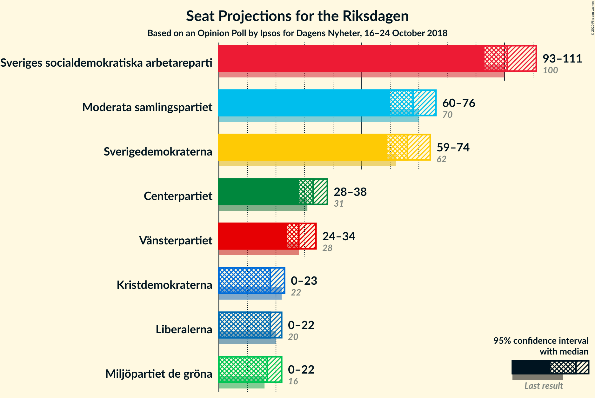
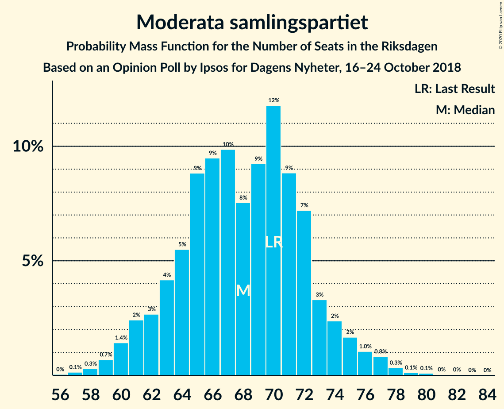
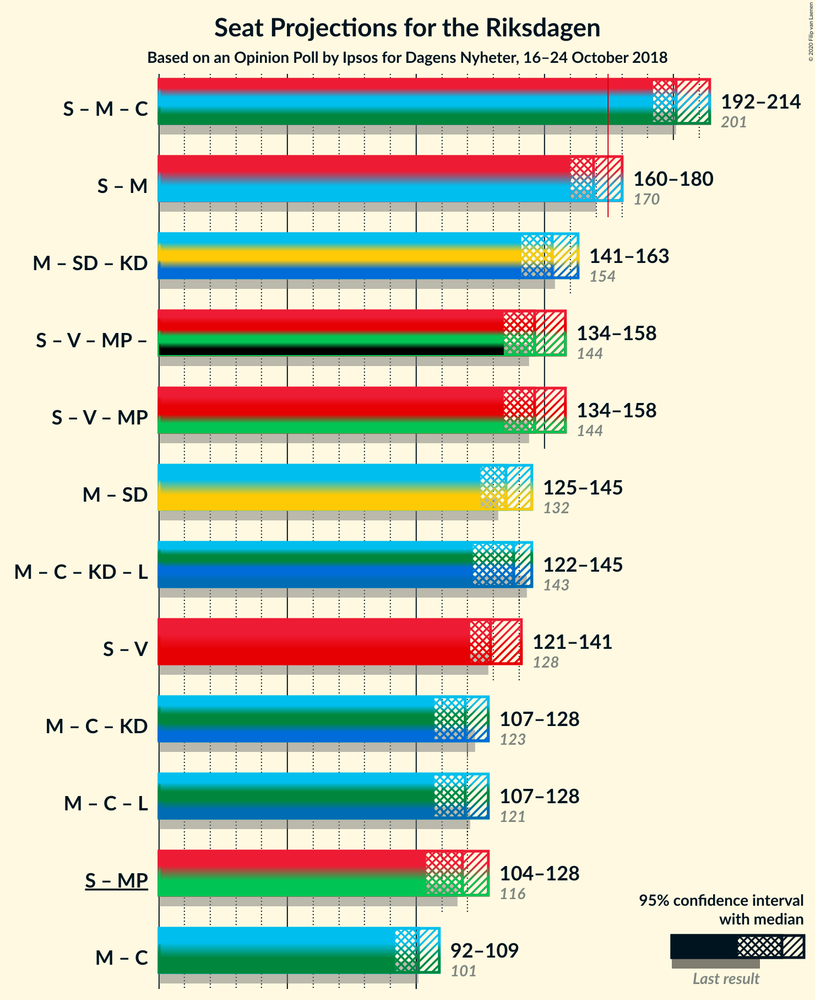

# Opinion Poll by Ipsos for Dagens Nyheter, 16–24 October 2018

<a href="#voting-intentions">Voting Intentions</a> | <a href="#seats">Seats</a> | <a href="#coalitions">Coalitions</a> | <a href="#technical-information">Technical Information</a>

## Voting Intentions

### Confidence Intervals

| Party | Last Result | Poll Result | 80% Confidence Interval | 90% Confidence Interval | 95% Confidence Interval | 99% Confidence Interval |
|:-----:|:-----------:|:-----------:|:-----------------------:|:-----------------------:|:-----------------------:|:-----------------------:|
| Sveriges socialdemokratiska arbetareparti | 28.3% | 28.6% | 27.2–30.1% |26.7–30.5% |26.4–30.9% |25.7–31.6% |
| Moderata samlingspartiet | 19.8% | 19.1% | 17.8–20.4% |17.5–20.8% |17.2–21.1% |16.6–21.8% |
| Sverigedemokraterna | 17.5% | 18.8% | 17.5–20.1% |17.2–20.5% |16.9–20.8% |16.3–21.4% |
| Centerpartiet | 8.6% | 9.2% | 8.3–10.2% |8.1–10.5% |7.8–10.7% |7.4–11.2% |
| Vänsterpartiet | 8.0% | 8.1% | 7.3–9.1% |7.0–9.3% |6.8–9.6% |6.5–10.0% |
| Kristdemokraterna | 6.3% | 5.1% | 4.4–5.9% |4.2–6.1% |4.1–6.3% |3.8–6.7% |
| Liberalerna | 5.5% | 5.0% | 4.4–5.8% |4.2–6.0% |4.0–6.2% |3.7–6.6% |
| Miljöpartiet de gröna | 4.4% | 4.8% | 4.2–5.6% |4.0–5.8% |3.9–6.0% |3.6–6.4% |

*Note:* The poll result column reflects the actual value used in the calculations. Published results may vary slightly, and in addition be rounded to fewer digits.

## Seats

### Confidence Intervals

| Party | Last Result | Median | 80% Confidence Interval | 90% Confidence Interval | 95% Confidence Interval | 99% Confidence Interval |
|:-----:|:-----------:|:------:|:-----------------------:|:-----------------------:|:-----------------------:|:-----------------------:|
| <a href="#sveriges-socialdemokratiska-arbetareparti">Sveriges socialdemokratiska arbetareparti</a> | 100 | 101 | 96–107 |94–109 |93–111 |91–113 |
| <a href="#moderata-samlingspartiet">Moderata samlingspartiet</a> | 70 | 68 | 63–72 |61–74 |60–76 |58–78 |
| <a href="#sverigedemokraterna">Sverigedemokraterna</a> | 62 | 66 | 62–72 |61–73 |59–74 |57–77 |
| <a href="#centerpartiet">Centerpartiet</a> | 31 | 33 | 29–36 |29–37 |28–38 |26–40 |
| <a href="#vänsterpartiet">Vänsterpartiet</a> | 28 | 28 | 26–32 |25–33 |24–34 |23–36 |
| <a href="#kristdemokraterna">Kristdemokraterna</a> | 22 | 18 | 15–21 |15–22 |0–23 |0–24 |
| <a href="#liberalerna">Liberalerna</a> | 20 | 18 | 15–21 |15–21 |0–22 |0–24 |
| <a href="#miljöpartiet-de-gröna">Miljöpartiet de gröna</a> | 16 | 17 | 14–20 |0–21 |0–22 |0–23 |

### Sveriges socialdemokratiska arbetareparti

*For a full overview of the results for this party, see the [Sveriges socialdemokratiska arbetareparti](party-sverigessocialdemokratiskaarbetareparti.html) page.*

| Number of Seats | Probability | Accumulated | Special Marks |
|:---------------:|:-----------:|:-----------:|:-------------:|
| 88 | 0.1% | 100% |  |
| 89 | 0.1% | 99.9% |  |
| 90 | 0.2% | 99.8% |  |
| 91 | 0.6% | 99.6% |  |
| 92 | 0.9% | 99.0% |  |
| 93 | 1.5% | 98% |  |
| 94 | 3% | 97% |  |
| 95 | 4% | 94% |  |
| 96 | 5% | 90% |  |
| 97 | 6% | 85% |  |
| 98 | 8% | 80% |  |
| 99 | 8% | 72% |  |
| 100 | 10% | 64% | Last Result |
| 101 | 7% | 54% | Median |
| 102 | 10% | 47% |  |
| 103 | 6% | 37% |  |
| 104 | 8% | 30% |  |
| 105 | 5% | 23% |  |
| 106 | 5% | 18% |  |
| 107 | 3% | 13% |  |
| 108 | 2% | 10% |  |
| 109 | 3% | 7% |  |
| 110 | 1.4% | 4% |  |
| 111 | 1.3% | 3% |  |
| 112 | 0.5% | 2% |  |
| 113 | 0.5% | 1.0% |  |
| 114 | 0.2% | 0.4% |  |
| 115 | 0.1% | 0.2% |  |
| 116 | 0.1% | 0.2% |  |
| 117 | 0% | 0.1% |  |
| 118 | 0% | 0% |  |

### Moderata samlingspartiet

*For a full overview of the results for this party, see the [Moderata samlingspartiet](party-moderatasamlingspartiet.html) page.*

| Number of Seats | Probability | Accumulated | Special Marks |
|:---------------:|:-----------:|:-----------:|:-------------:|
| 56 | 0% | 100% |  |
| 57 | 0.1% | 99.9% |  |
| 58 | 0.3% | 99.8% |  |
| 59 | 0.7% | 99.5% |  |
| 60 | 1.4% | 98.8% |  |
| 61 | 2% | 97% |  |
| 62 | 3% | 95% |  |
| 63 | 4% | 92% |  |
| 64 | 5% | 88% |  |
| 65 | 9% | 83% |  |
| 66 | 9% | 74% |  |
| 67 | 10% | 64% |  |
| 68 | 8% | 54% | Median |
| 69 | 9% | 47% |  |
| 70 | 12% | 38% | Last Result |
| 71 | 9% | 26% |  |
| 72 | 7% | 17% |  |
| 73 | 3% | 10% |  |
| 74 | 2% | 7% |  |
| 75 | 2% | 4% |  |
| 76 | 1.0% | 3% |  |
| 77 | 0.8% | 1.5% |  |
| 78 | 0.3% | 0.6% |  |
| 79 | 0.1% | 0.3% |  |
| 80 | 0.1% | 0.2% |  |
| 81 | 0% | 0.1% |  |
| 82 | 0% | 0.1% |  |
| 83 | 0% | 0% |  |

### Sverigedemokraterna

*For a full overview of the results for this party, see the [Sverigedemokraterna](party-sverigedemokraterna.html) page.*

| Number of Seats | Probability | Accumulated | Special Marks |
|:---------------:|:-----------:|:-----------:|:-------------:|
| 55 | 0.1% | 100% |  |
| 56 | 0.1% | 99.9% |  |
| 57 | 0.4% | 99.8% |  |
| 58 | 0.5% | 99.4% |  |
| 59 | 2% | 98.9% |  |
| 60 | 2% | 97% |  |
| 61 | 4% | 95% |  |
| 62 | 4% | 91% | Last Result |
| 63 | 5% | 87% |  |
| 64 | 11% | 81% |  |
| 65 | 11% | 70% |  |
| 66 | 11% | 59% | Median |
| 67 | 12% | 48% |  |
| 68 | 7% | 37% |  |
| 69 | 5% | 30% |  |
| 70 | 8% | 25% |  |
| 71 | 7% | 17% |  |
| 72 | 5% | 10% |  |
| 73 | 3% | 6% |  |
| 74 | 1.1% | 3% |  |
| 75 | 0.5% | 2% |  |
| 76 | 0.6% | 1.2% |  |
| 77 | 0.3% | 0.6% |  |
| 78 | 0.2% | 0.4% |  |
| 79 | 0.1% | 0.1% |  |
| 80 | 0% | 0.1% |  |
| 81 | 0% | 0% |  |

### Centerpartiet

*For a full overview of the results for this party, see the [Centerpartiet](party-centerpartiet.html) page.*

| Number of Seats | Probability | Accumulated | Special Marks |
|:---------------:|:-----------:|:-----------:|:-------------:|
| 25 | 0.1% | 100% |  |
| 26 | 0.6% | 99.8% |  |
| 27 | 1.0% | 99.3% |  |
| 28 | 2% | 98% |  |
| 29 | 7% | 96% |  |
| 30 | 11% | 89% |  |
| 31 | 15% | 78% | Last Result |
| 32 | 12% | 63% |  |
| 33 | 13% | 51% | Median |
| 34 | 11% | 38% |  |
| 35 | 8% | 27% |  |
| 36 | 10% | 19% |  |
| 37 | 5% | 9% |  |
| 38 | 2% | 4% |  |
| 39 | 1.1% | 2% |  |
| 40 | 0.6% | 0.9% |  |
| 41 | 0.2% | 0.3% |  |
| 42 | 0.1% | 0.2% |  |
| 43 | 0% | 0% |  |

### Vänsterpartiet

*For a full overview of the results for this party, see the [Vänsterpartiet](party-vänsterpartiet.html) page.*

| Number of Seats | Probability | Accumulated | Special Marks |
|:---------------:|:-----------:|:-----------:|:-------------:|
| 21 | 0.1% | 100% |  |
| 22 | 0.2% | 99.9% |  |
| 23 | 0.7% | 99.6% |  |
| 24 | 2% | 99.0% |  |
| 25 | 6% | 97% |  |
| 26 | 10% | 92% |  |
| 27 | 18% | 82% |  |
| 28 | 18% | 63% | Last Result, Median |
| 29 | 13% | 45% |  |
| 30 | 10% | 32% |  |
| 31 | 8% | 22% |  |
| 32 | 6% | 15% |  |
| 33 | 5% | 9% |  |
| 34 | 3% | 4% |  |
| 35 | 1.1% | 2% |  |
| 36 | 0.5% | 0.6% |  |
| 37 | 0.1% | 0.2% |  |
| 38 | 0.1% | 0.1% |  |
| 39 | 0% | 0% |  |

### Kristdemokraterna

*For a full overview of the results for this party, see the [Kristdemokraterna](party-kristdemokraterna.html) page.*

| Number of Seats | Probability | Accumulated | Special Marks |
|:---------------:|:-----------:|:-----------:|:-------------:|
| 0 | 3% | 100% |  |
| 1 | 0% | 97% |  |
| 2 | 0% | 97% |  |
| 3 | 0% | 97% |  |
| 4 | 0% | 97% |  |
| 5 | 0% | 97% |  |
| 6 | 0% | 97% |  |
| 7 | 0% | 97% |  |
| 8 | 0% | 97% |  |
| 9 | 0% | 97% |  |
| 10 | 0% | 97% |  |
| 11 | 0% | 97% |  |
| 12 | 0% | 97% |  |
| 13 | 0% | 97% |  |
| 14 | 1.4% | 97% |  |
| 15 | 7% | 96% |  |
| 16 | 11% | 89% |  |
| 17 | 13% | 78% |  |
| 18 | 18% | 65% | Median |
| 19 | 15% | 46% |  |
| 20 | 13% | 31% |  |
| 21 | 10% | 18% |  |
| 22 | 5% | 7% | Last Result |
| 23 | 2% | 3% |  |
| 24 | 0.5% | 0.6% |  |
| 25 | 0.1% | 0.2% |  |
| 26 | 0% | 0% |  |

### Liberalerna

*For a full overview of the results for this party, see the [Liberalerna](party-liberalerna.html) page.*

| Number of Seats | Probability | Accumulated | Special Marks |
|:---------------:|:-----------:|:-----------:|:-------------:|
| 0 | 3% | 100% |  |
| 1 | 0% | 97% |  |
| 2 | 0% | 97% |  |
| 3 | 0% | 97% |  |
| 4 | 0% | 97% |  |
| 5 | 0% | 97% |  |
| 6 | 0% | 97% |  |
| 7 | 0% | 97% |  |
| 8 | 0% | 97% |  |
| 9 | 0% | 97% |  |
| 10 | 0% | 97% |  |
| 11 | 0% | 97% |  |
| 12 | 0% | 97% |  |
| 13 | 0% | 97% |  |
| 14 | 1.2% | 97% |  |
| 15 | 8% | 96% |  |
| 16 | 14% | 88% |  |
| 17 | 12% | 74% |  |
| 18 | 25% | 62% | Median |
| 19 | 13% | 37% |  |
| 20 | 10% | 24% | Last Result |
| 21 | 9% | 14% |  |
| 22 | 3% | 5% |  |
| 23 | 1.4% | 2% |  |
| 24 | 0.3% | 0.5% |  |
| 25 | 0.2% | 0.2% |  |
| 26 | 0% | 0% |  |

### Miljöpartiet de gröna

*For a full overview of the results for this party, see the [Miljöpartiet de gröna](party-miljöpartietdegröna.html) page.*

| Number of Seats | Probability | Accumulated | Special Marks |
|:---------------:|:-----------:|:-----------:|:-------------:|
| 0 | 7% | 100% |  |
| 1 | 0% | 93% |  |
| 2 | 0% | 93% |  |
| 3 | 0% | 93% |  |
| 4 | 0% | 93% |  |
| 5 | 0% | 93% |  |
| 6 | 0% | 93% |  |
| 7 | 0% | 93% |  |
| 8 | 0% | 93% |  |
| 9 | 0% | 93% |  |
| 10 | 0% | 93% |  |
| 11 | 0% | 93% |  |
| 12 | 0% | 93% |  |
| 13 | 0% | 93% |  |
| 14 | 3% | 93% |  |
| 15 | 12% | 90% |  |
| 16 | 20% | 78% | Last Result |
| 17 | 18% | 58% | Median |
| 18 | 12% | 40% |  |
| 19 | 12% | 28% |  |
| 20 | 11% | 16% |  |
| 21 | 3% | 5% |  |
| 22 | 2% | 3% |  |
| 23 | 0.7% | 0.8% |  |
| 24 | 0.1% | 0.1% |  |
| 25 | 0% | 0% |  |

## Coalitions

### Confidence Intervals

| Coalition | Last Result | Median | Majority? | 80% Confidence Interval | 90% Confidence Interval | 95% Confidence Interval | 99% Confidence Interval |
|:---------:|:-----------:|:------:|:---------:|:-----------------------:|:-----------------------:|:-----------------------:|:-----------------------:|
| Sveriges socialdemokratiska arbetareparti – Moderata samlingspartiet – Centerpartiet | 201 | 201 | 100% | 195–210 | 194–213 | 192–214 | 189–218 |
| Sveriges socialdemokratiska arbetareparti – Moderata samlingspartiet | 170 | 169 | 16% | 163–176 | 161–179 | 160–180 | 157–184 |
| Moderata samlingspartiet – Sverigedemokraterna – Kristdemokraterna | 154 | 153 | 0% | 145–160 | 144–161 | 141–163 | 137–168 |
| Sveriges socialdemokratiska arbetareparti – Vänsterpartiet – Miljöpartiet de gröna | 144 | 146 | 0% | 139–154 | 136–156 | 134–158 | 130–161 |
| Moderata samlingspartiet – Sverigedemokraterna | 132 | 135 | 0% | 128–141 | 127–142 | 125–145 | 123–149 |
| Moderata samlingspartiet – Centerpartiet – Kristdemokraterna – Liberalerna | 143 | 138 | 0% | 128–144 | 125–145 | 122–145 | 119–148 |
| Sveriges socialdemokratiska arbetareparti – Vänsterpartiet | 128 | 129 | 0% | 123–137 | 122–139 | 121–141 | 118–144 |
| Moderata samlingspartiet – Centerpartiet – Kristdemokraterna | 123 | 119 | 0% | 111–125 | 109–126 | 107–128 | 102–131 |
| Moderata samlingspartiet – Centerpartiet – Liberalerna | 121 | 119 | 0% | 112–125 | 109–127 | 107–128 | 103–130 |
| Sveriges socialdemokratiska arbetareparti – Miljöpartiet de gröna | 116 | 118 | 0% | 110–125 | 107–126 | 104–128 | 100–131 |
| Moderata samlingspartiet – Centerpartiet | 101 | 101 | 0% | 95–107 | 93–108 | 92–109 | 90–113 |

### Sveriges socialdemokratiska arbetareparti – Moderata samlingspartiet – Centerpartiet

| Number of Seats | Probability | Accumulated | Special Marks |
|:---------------:|:-----------:|:-----------:|:-------------:|
| 186 | 0% | 100% |  |
| 187 | 0.1% | 99.9% |  |
| 188 | 0.2% | 99.8% |  |
| 189 | 0.2% | 99.7% |  |
| 190 | 0.5% | 99.5% |  |
| 191 | 0.6% | 98.9% |  |
| 192 | 1.0% | 98% |  |
| 193 | 2% | 97% |  |
| 194 | 3% | 95% |  |
| 195 | 3% | 93% |  |
| 196 | 4% | 90% |  |
| 197 | 7% | 86% |  |
| 198 | 4% | 78% |  |
| 199 | 7% | 74% |  |
| 200 | 10% | 67% |  |
| 201 | 7% | 57% | Last Result |
| 202 | 9% | 50% | Median |
| 203 | 6% | 41% |  |
| 204 | 6% | 35% |  |
| 205 | 5% | 30% |  |
| 206 | 5% | 24% |  |
| 207 | 4% | 20% |  |
| 208 | 2% | 15% |  |
| 209 | 3% | 13% |  |
| 210 | 2% | 10% |  |
| 211 | 1.1% | 8% |  |
| 212 | 1.2% | 7% |  |
| 213 | 2% | 5% |  |
| 214 | 1.1% | 3% |  |
| 215 | 0.7% | 2% |  |
| 216 | 0.5% | 2% |  |
| 217 | 0.2% | 1.1% |  |
| 218 | 0.4% | 0.9% |  |
| 219 | 0.1% | 0.5% |  |
| 220 | 0.2% | 0.4% |  |
| 221 | 0% | 0.2% |  |
| 222 | 0% | 0.2% |  |
| 223 | 0% | 0.1% |  |
| 224 | 0% | 0.1% |  |
| 225 | 0% | 0.1% |  |
| 226 | 0% | 0.1% |  |
| 227 | 0% | 0.1% |  |
| 228 | 0% | 0% |  |

### Sveriges socialdemokratiska arbetareparti – Moderata samlingspartiet

| Number of Seats | Probability | Accumulated | Special Marks |
|:---------------:|:-----------:|:-----------:|:-------------:|
| 154 | 0% | 100% |  |
| 155 | 0.1% | 99.9% |  |
| 156 | 0.2% | 99.8% |  |
| 157 | 0.3% | 99.6% |  |
| 158 | 0.6% | 99.2% |  |
| 159 | 0.9% | 98.6% |  |
| 160 | 1.4% | 98% |  |
| 161 | 3% | 96% |  |
| 162 | 3% | 94% |  |
| 163 | 5% | 91% |  |
| 164 | 5% | 87% |  |
| 165 | 6% | 82% |  |
| 166 | 8% | 76% |  |
| 167 | 6% | 68% |  |
| 168 | 8% | 62% |  |
| 169 | 7% | 54% | Median |
| 170 | 8% | 47% | Last Result |
| 171 | 6% | 38% |  |
| 172 | 7% | 32% |  |
| 173 | 5% | 25% |  |
| 174 | 4% | 20% |  |
| 175 | 3% | 16% | Majority |
| 176 | 3% | 13% |  |
| 177 | 2% | 10% |  |
| 178 | 3% | 8% |  |
| 179 | 2% | 5% |  |
| 180 | 1.1% | 3% |  |
| 181 | 0.7% | 2% |  |
| 182 | 0.6% | 2% |  |
| 183 | 0.3% | 0.9% |  |
| 184 | 0.1% | 0.6% |  |
| 185 | 0.1% | 0.4% |  |
| 186 | 0.1% | 0.3% |  |
| 187 | 0% | 0.2% |  |
| 188 | 0.1% | 0.2% |  |
| 189 | 0% | 0.1% |  |
| 190 | 0% | 0.1% |  |
| 191 | 0% | 0.1% |  |
| 192 | 0% | 0% |  |

### Moderata samlingspartiet – Sverigedemokraterna – Kristdemokraterna

| Number of Seats | Probability | Accumulated | Special Marks |
|:---------------:|:-----------:|:-----------:|:-------------:|
| 131 | 0.1% | 100% |  |
| 132 | 0% | 99.9% |  |
| 133 | 0% | 99.9% |  |
| 134 | 0% | 99.9% |  |
| 135 | 0% | 99.9% |  |
| 136 | 0.1% | 99.9% |  |
| 137 | 0.4% | 99.8% |  |
| 138 | 1.1% | 99.4% |  |
| 139 | 0.6% | 98% |  |
| 140 | 0.2% | 98% |  |
| 141 | 0.4% | 98% |  |
| 142 | 0.7% | 97% |  |
| 143 | 1.2% | 96% |  |
| 144 | 3% | 95% |  |
| 145 | 4% | 92% |  |
| 146 | 4% | 88% |  |
| 147 | 4% | 85% |  |
| 148 | 5% | 81% |  |
| 149 | 3% | 76% |  |
| 150 | 4% | 74% |  |
| 151 | 6% | 70% |  |
| 152 | 8% | 64% | Median |
| 153 | 10% | 55% |  |
| 154 | 12% | 45% | Last Result |
| 155 | 7% | 34% |  |
| 156 | 7% | 27% |  |
| 157 | 4% | 19% |  |
| 158 | 2% | 16% |  |
| 159 | 3% | 14% |  |
| 160 | 3% | 11% |  |
| 161 | 3% | 8% |  |
| 162 | 2% | 4% |  |
| 163 | 0.9% | 3% |  |
| 164 | 0.6% | 2% |  |
| 165 | 0.1% | 1.2% |  |
| 166 | 0.3% | 1.1% |  |
| 167 | 0.2% | 0.8% |  |
| 168 | 0.1% | 0.6% |  |
| 169 | 0.3% | 0.5% |  |
| 170 | 0% | 0.1% |  |
| 171 | 0% | 0.1% |  |
| 172 | 0% | 0.1% |  |
| 173 | 0% | 0% |  |

### Sveriges socialdemokratiska arbetareparti – Vänsterpartiet – Miljöpartiet de gröna

| Number of Seats | Probability | Accumulated | Special Marks |
|:---------------:|:-----------:|:-----------:|:-------------:|
| 126 | 0% | 100% |  |
| 127 | 0% | 99.9% |  |
| 128 | 0.1% | 99.9% |  |
| 129 | 0.1% | 99.8% |  |
| 130 | 0.2% | 99.6% |  |
| 131 | 0.1% | 99.4% |  |
| 132 | 0.4% | 99.3% |  |
| 133 | 0.5% | 98.8% |  |
| 134 | 1.4% | 98% |  |
| 135 | 0.6% | 97% |  |
| 136 | 2% | 96% |  |
| 137 | 1.4% | 95% |  |
| 138 | 2% | 93% |  |
| 139 | 3% | 91% |  |
| 140 | 4% | 88% |  |
| 141 | 6% | 84% |  |
| 142 | 3% | 77% |  |
| 143 | 8% | 75% |  |
| 144 | 11% | 67% | Last Result |
| 145 | 6% | 56% |  |
| 146 | 6% | 50% | Median |
| 147 | 4% | 44% |  |
| 148 | 8% | 40% |  |
| 149 | 5% | 33% |  |
| 150 | 5% | 28% |  |
| 151 | 3% | 23% |  |
| 152 | 4% | 19% |  |
| 153 | 3% | 16% |  |
| 154 | 4% | 13% |  |
| 155 | 3% | 9% |  |
| 156 | 2% | 6% |  |
| 157 | 2% | 4% |  |
| 158 | 0.8% | 3% |  |
| 159 | 0.9% | 2% |  |
| 160 | 0.2% | 0.8% |  |
| 161 | 0.3% | 0.6% |  |
| 162 | 0.2% | 0.3% |  |
| 163 | 0.1% | 0.2% |  |
| 164 | 0% | 0.1% |  |
| 165 | 0% | 0.1% |  |
| 166 | 0% | 0% |  |

### Moderata samlingspartiet – Sverigedemokraterna

| Number of Seats | Probability | Accumulated | Special Marks |
|:---------------:|:-----------:|:-----------:|:-------------:|
| 120 | 0% | 100% |  |
| 121 | 0.1% | 99.9% |  |
| 122 | 0.3% | 99.8% |  |
| 123 | 0.3% | 99.5% |  |
| 124 | 0.7% | 99.2% |  |
| 125 | 1.1% | 98.5% |  |
| 126 | 1.4% | 97% |  |
| 127 | 3% | 96% |  |
| 128 | 5% | 93% |  |
| 129 | 4% | 88% |  |
| 130 | 5% | 85% |  |
| 131 | 7% | 80% |  |
| 132 | 8% | 73% | Last Result |
| 133 | 5% | 65% |  |
| 134 | 8% | 60% | Median |
| 135 | 10% | 53% |  |
| 136 | 6% | 42% |  |
| 137 | 11% | 36% |  |
| 138 | 7% | 25% |  |
| 139 | 3% | 18% |  |
| 140 | 4% | 15% |  |
| 141 | 4% | 11% |  |
| 142 | 1.3% | 6% |  |
| 143 | 0.6% | 5% |  |
| 144 | 1.2% | 4% |  |
| 145 | 1.4% | 3% |  |
| 146 | 0.4% | 2% |  |
| 147 | 0.4% | 1.2% |  |
| 148 | 0.3% | 0.8% |  |
| 149 | 0.2% | 0.6% |  |
| 150 | 0.3% | 0.4% |  |
| 151 | 0.1% | 0.1% |  |
| 152 | 0% | 0.1% |  |
| 153 | 0% | 0.1% |  |
| 154 | 0% | 0% |  |

### Moderata samlingspartiet – Centerpartiet – Kristdemokraterna – Liberalerna

| Number of Seats | Probability | Accumulated | Special Marks |
|:---------------:|:-----------:|:-----------:|:-------------:|
| 116 | 0% | 100% |  |
| 117 | 0% | 99.9% |  |
| 118 | 0.1% | 99.9% |  |
| 119 | 0.3% | 99.8% |  |
| 120 | 0.4% | 99.5% |  |
| 121 | 1.3% | 99.0% |  |
| 122 | 0.3% | 98% |  |
| 123 | 0.6% | 97% |  |
| 124 | 0.9% | 97% |  |
| 125 | 1.0% | 96% |  |
| 126 | 1.1% | 95% |  |
| 127 | 3% | 94% |  |
| 128 | 4% | 91% |  |
| 129 | 4% | 87% |  |
| 130 | 4% | 83% |  |
| 131 | 5% | 79% |  |
| 132 | 3% | 74% |  |
| 133 | 3% | 71% |  |
| 134 | 4% | 68% |  |
| 135 | 3% | 64% |  |
| 136 | 3% | 61% |  |
| 137 | 5% | 59% | Median |
| 138 | 8% | 54% |  |
| 139 | 8% | 46% |  |
| 140 | 7% | 38% |  |
| 141 | 10% | 30% |  |
| 142 | 6% | 20% |  |
| 143 | 4% | 15% | Last Result |
| 144 | 5% | 10% |  |
| 145 | 3% | 5% |  |
| 146 | 1.1% | 2% |  |
| 147 | 0.8% | 1.4% |  |
| 148 | 0.2% | 0.5% |  |
| 149 | 0.1% | 0.3% |  |
| 150 | 0.1% | 0.2% |  |
| 151 | 0% | 0.1% |  |
| 152 | 0% | 0.1% |  |
| 153 | 0% | 0.1% |  |
| 154 | 0% | 0% |  |

### Sveriges socialdemokratiska arbetareparti – Vänsterpartiet

| Number of Seats | Probability | Accumulated | Special Marks |
|:---------------:|:-----------:|:-----------:|:-------------:|
| 116 | 0.1% | 100% |  |
| 117 | 0.2% | 99.9% |  |
| 118 | 0.3% | 99.7% |  |
| 119 | 0.6% | 99.4% |  |
| 120 | 1.0% | 98.9% |  |
| 121 | 2% | 98% |  |
| 122 | 2% | 96% |  |
| 123 | 5% | 95% |  |
| 124 | 3% | 90% |  |
| 125 | 6% | 87% |  |
| 126 | 8% | 81% |  |
| 127 | 8% | 74% |  |
| 128 | 7% | 65% | Last Result |
| 129 | 10% | 58% | Median |
| 130 | 7% | 48% |  |
| 131 | 5% | 41% |  |
| 132 | 7% | 35% |  |
| 133 | 4% | 28% |  |
| 134 | 5% | 25% |  |
| 135 | 4% | 19% |  |
| 136 | 3% | 15% |  |
| 137 | 3% | 12% |  |
| 138 | 3% | 9% |  |
| 139 | 1.3% | 6% |  |
| 140 | 2% | 5% |  |
| 141 | 1.0% | 3% |  |
| 142 | 0.6% | 2% |  |
| 143 | 0.3% | 0.9% |  |
| 144 | 0.2% | 0.6% |  |
| 145 | 0.1% | 0.4% |  |
| 146 | 0.1% | 0.2% |  |
| 147 | 0% | 0.1% |  |
| 148 | 0% | 0.1% |  |
| 149 | 0% | 0% |  |

### Moderata samlingspartiet – Centerpartiet – Kristdemokraterna

| Number of Seats | Probability | Accumulated | Special Marks |
|:---------------:|:-----------:|:-----------:|:-------------:|
| 98 | 0.2% | 100% |  |
| 99 | 0% | 99.8% |  |
| 100 | 0% | 99.8% |  |
| 101 | 0.1% | 99.7% |  |
| 102 | 0.5% | 99.6% |  |
| 103 | 0.3% | 99.2% |  |
| 104 | 0.1% | 98.9% |  |
| 105 | 0.3% | 98.8% |  |
| 106 | 0.6% | 98% |  |
| 107 | 0.8% | 98% |  |
| 108 | 0.8% | 97% |  |
| 109 | 1.4% | 96% |  |
| 110 | 3% | 95% |  |
| 111 | 3% | 92% |  |
| 112 | 4% | 88% |  |
| 113 | 4% | 85% |  |
| 114 | 4% | 81% |  |
| 115 | 5% | 77% |  |
| 116 | 4% | 72% |  |
| 117 | 3% | 68% |  |
| 118 | 10% | 64% |  |
| 119 | 5% | 55% | Median |
| 120 | 9% | 49% |  |
| 121 | 7% | 41% |  |
| 122 | 7% | 34% |  |
| 123 | 8% | 28% | Last Result |
| 124 | 4% | 19% |  |
| 125 | 6% | 15% |  |
| 126 | 5% | 9% |  |
| 127 | 2% | 4% |  |
| 128 | 1.2% | 3% |  |
| 129 | 0.4% | 1.3% |  |
| 130 | 0.3% | 0.9% |  |
| 131 | 0.3% | 0.7% |  |
| 132 | 0.1% | 0.3% |  |
| 133 | 0.1% | 0.2% |  |
| 134 | 0% | 0.2% |  |
| 135 | 0% | 0.1% |  |
| 136 | 0% | 0.1% |  |
| 137 | 0% | 0.1% |  |
| 138 | 0% | 0% |  |

### Moderata samlingspartiet – Centerpartiet – Liberalerna

| Number of Seats | Probability | Accumulated | Special Marks |
|:---------------:|:-----------:|:-----------:|:-------------:|
| 97 | 0% | 100% |  |
| 98 | 0% | 99.9% |  |
| 99 | 0% | 99.9% |  |
| 100 | 0.1% | 99.9% |  |
| 101 | 0.1% | 99.7% |  |
| 102 | 0.1% | 99.6% |  |
| 103 | 0.9% | 99.5% |  |
| 104 | 0.2% | 98.6% |  |
| 105 | 0.4% | 98% |  |
| 106 | 0.4% | 98% |  |
| 107 | 0.6% | 98% |  |
| 108 | 0.9% | 97% |  |
| 109 | 2% | 96% |  |
| 110 | 2% | 94% |  |
| 111 | 2% | 92% |  |
| 112 | 3% | 90% |  |
| 113 | 5% | 87% |  |
| 114 | 5% | 82% |  |
| 115 | 6% | 76% |  |
| 116 | 5% | 70% |  |
| 117 | 6% | 66% |  |
| 118 | 6% | 60% |  |
| 119 | 10% | 54% | Median |
| 120 | 6% | 44% |  |
| 121 | 9% | 37% | Last Result |
| 122 | 6% | 28% |  |
| 123 | 5% | 23% |  |
| 124 | 4% | 17% |  |
| 125 | 3% | 13% |  |
| 126 | 5% | 10% |  |
| 127 | 2% | 5% |  |
| 128 | 1.0% | 3% |  |
| 129 | 0.5% | 2% |  |
| 130 | 0.7% | 1.2% |  |
| 131 | 0.2% | 0.5% |  |
| 132 | 0.1% | 0.2% |  |
| 133 | 0.1% | 0.1% |  |
| 134 | 0% | 0.1% |  |
| 135 | 0% | 0% |  |

### Sveriges socialdemokratiska arbetareparti – Miljöpartiet de gröna

| Number of Seats | Probability | Accumulated | Special Marks |
|:---------------:|:-----------:|:-----------:|:-------------:|
| 96 | 0% | 100% |  |
| 97 | 0.1% | 99.9% |  |
| 98 | 0.1% | 99.9% |  |
| 99 | 0.1% | 99.8% |  |
| 100 | 0.3% | 99.6% |  |
| 101 | 0.5% | 99.4% |  |
| 102 | 0.5% | 98.9% |  |
| 103 | 0.3% | 98% |  |
| 104 | 0.8% | 98% |  |
| 105 | 1.0% | 97% |  |
| 106 | 0.4% | 96% |  |
| 107 | 0.8% | 96% |  |
| 108 | 0.9% | 95% |  |
| 109 | 2% | 94% |  |
| 110 | 2% | 92% |  |
| 111 | 4% | 90% |  |
| 112 | 2% | 86% |  |
| 113 | 5% | 83% |  |
| 114 | 5% | 78% |  |
| 115 | 7% | 73% |  |
| 116 | 9% | 66% | Last Result |
| 117 | 8% | 58% |  |
| 118 | 9% | 50% | Median |
| 119 | 7% | 41% |  |
| 120 | 6% | 35% |  |
| 121 | 4% | 28% |  |
| 122 | 5% | 24% |  |
| 123 | 4% | 19% |  |
| 124 | 3% | 15% |  |
| 125 | 4% | 12% |  |
| 126 | 3% | 8% |  |
| 127 | 1.5% | 5% |  |
| 128 | 0.8% | 3% |  |
| 129 | 1.3% | 2% |  |
| 130 | 0.4% | 1.0% |  |
| 131 | 0.3% | 0.6% |  |
| 132 | 0.2% | 0.3% |  |
| 133 | 0.1% | 0.2% |  |
| 134 | 0% | 0.1% |  |
| 135 | 0% | 0.1% |  |
| 136 | 0% | 0% |  |

### Moderata samlingspartiet – Centerpartiet

| Number of Seats | Probability | Accumulated | Special Marks |
|:---------------:|:-----------:|:-----------:|:-------------:|
| 87 | 0.1% | 100% |  |
| 88 | 0.1% | 99.9% |  |
| 89 | 0.2% | 99.8% |  |
| 90 | 0.5% | 99.6% |  |
| 91 | 1.0% | 99.1% |  |
| 92 | 1.5% | 98% |  |
| 93 | 3% | 97% |  |
| 94 | 3% | 94% |  |
| 95 | 5% | 91% |  |
| 96 | 4% | 86% |  |
| 97 | 6% | 82% |  |
| 98 | 7% | 76% |  |
| 99 | 8% | 69% |  |
| 100 | 8% | 60% |  |
| 101 | 10% | 53% | Last Result, Median |
| 102 | 7% | 43% |  |
| 103 | 7% | 36% |  |
| 104 | 7% | 28% |  |
| 105 | 5% | 21% |  |
| 106 | 4% | 16% |  |
| 107 | 4% | 11% |  |
| 108 | 3% | 7% |  |
| 109 | 2% | 4% |  |
| 110 | 1.0% | 2% |  |
| 111 | 0.6% | 1.3% |  |
| 112 | 0.2% | 0.7% |  |
| 113 | 0.2% | 0.5% |  |
| 114 | 0.1% | 0.3% |  |
| 115 | 0.1% | 0.2% |  |
| 116 | 0% | 0.1% |  |
| 117 | 0% | 0.1% |  |
| 118 | 0% | 0% |  |

## Technical Information

### Opinion Poll

+ **Polling firm:** Ipsos
+ **Commissioner(s):** Dagens Nyheter
+ **Fieldwork period:** 16–24 October 2018

### Calculations

+ **Sample size:** 1556
+ **Simulations done:** 1,048,576
+ **Error estimate:** 1.42%

