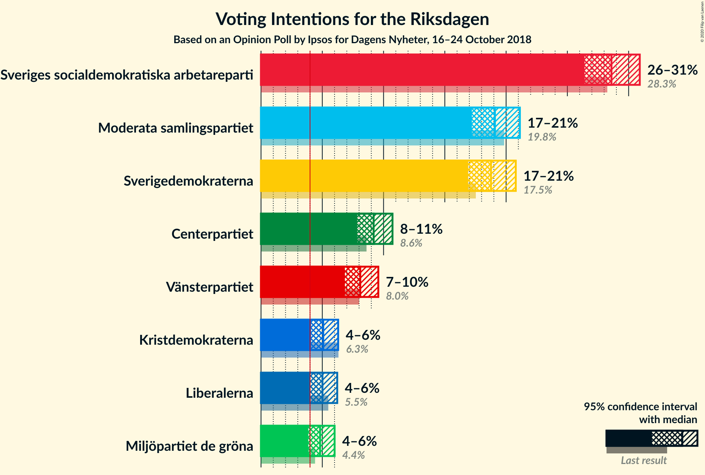
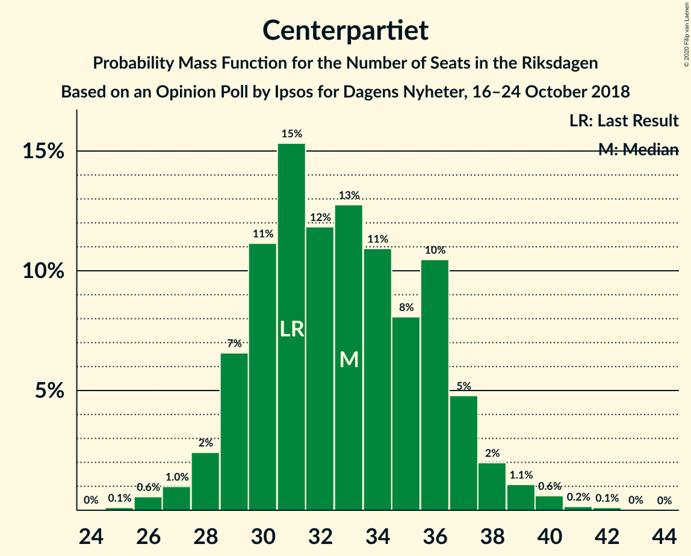
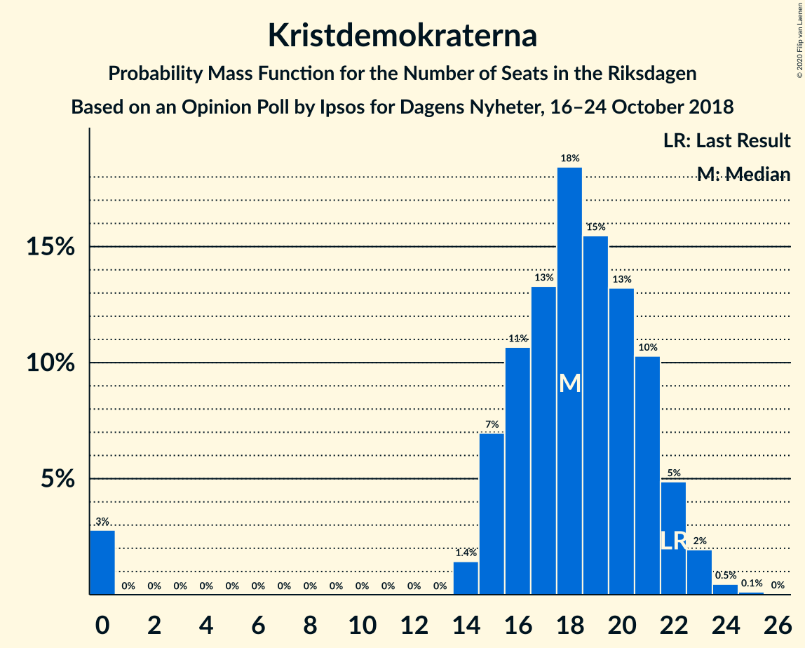
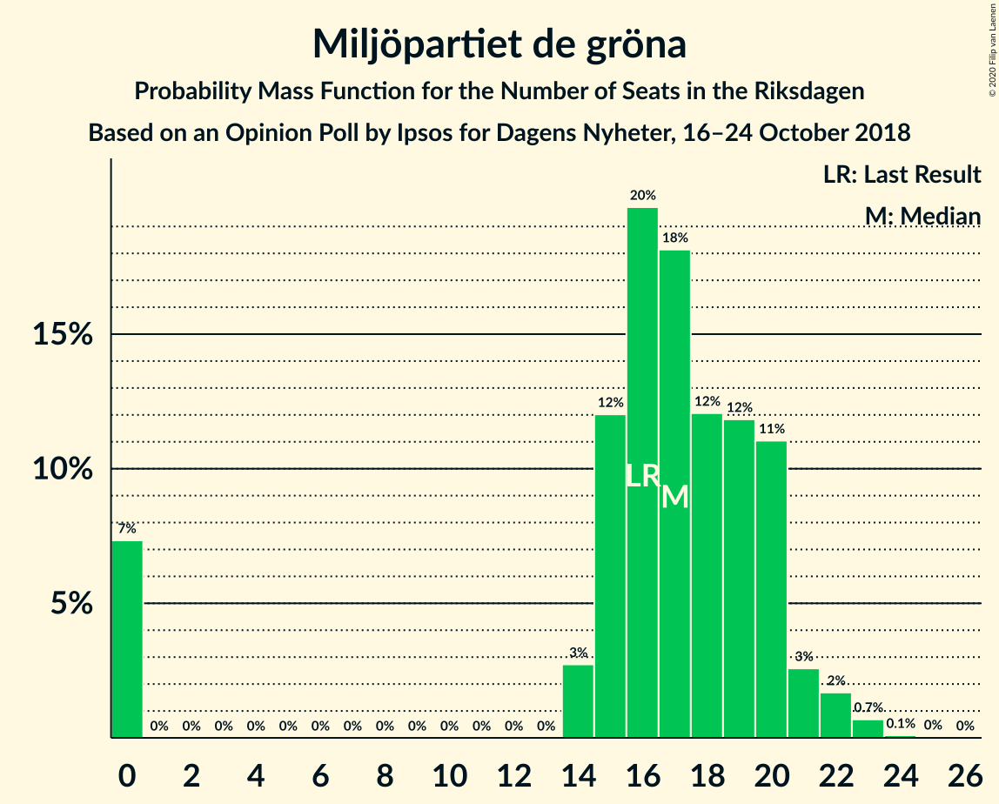

# Opinion Poll by Ipsos for Dagens Nyheter, 16–24 October 2018

<a href="#voting-intentions">Voting Intentions</a> | <a href="#seats">Seats</a> | <a href="#coalitions">Coalitions</a> | <a href="#technical-information">Technical Information</a>

## Voting Intentions

### Confidence Intervals

| Party | Last Result | Poll Result | 80% Confidence Interval | 90% Confidence Interval | 95% Confidence Interval | 99% Confidence Interval |
|:-----:|:-----------:|:-----------:|:-----------------------:|:-----------------------:|:-----------------------:|:-----------------------:|
| Sveriges socialdemokratiska arbetareparti | 28.3% | 28.6% | 27.2–30.1% |26.7–30.5% |26.4–30.9% |25.7–31.6% |
| Moderata samlingspartiet | 19.8% | 19.1% | 17.8–20.4% |17.5–20.8% |17.2–21.1% |16.6–21.8% |
| Sverigedemokraterna | 17.5% | 18.8% | 17.5–20.1% |17.2–20.5% |16.9–20.8% |16.3–21.4% |
| Centerpartiet | 8.6% | 9.2% | 8.3–10.2% |8.1–10.5% |7.8–10.7% |7.4–11.2% |
| Vänsterpartiet | 8.0% | 8.1% | 7.3–9.1% |7.0–9.3% |6.8–9.6% |6.5–10.0% |
| Kristdemokraterna | 6.3% | 5.1% | 4.4–5.9% |4.2–6.1% |4.1–6.3% |3.8–6.7% |
| Liberalerna | 5.5% | 5.0% | 4.4–5.8% |4.2–6.0% |4.0–6.2% |3.7–6.6% |
| Miljöpartiet de gröna | 4.4% | 4.8% | 4.2–5.6% |4.0–5.8% |3.9–6.0% |3.6–6.4% |

*Note:* The poll result column reflects the actual value used in the calculations. Published results may vary slightly, and in addition be rounded to fewer digits.

## Seats

### Confidence Intervals

| Party | Last Result | Median | 80% Confidence Interval | 90% Confidence Interval | 95% Confidence Interval | 99% Confidence Interval |
|:-----:|:-----------:|:------:|:-----------------------:|:-----------------------:|:-----------------------:|:-----------------------:|
| <a href="#sveriges-socialdemokratiska-arbetareparti">Sveriges socialdemokratiska arbetareparti</a> | 100 | 101 | 95–109 |94–109 |92–112 |90–114 |
| <a href="#moderata-samlingspartiet">Moderata samlingspartiet</a> | 70 | 68 | 62–73 |61–74 |60–75 |57–78 |
| <a href="#sverigedemokraterna">Sverigedemokraterna</a> | 62 | 67 | 62–72 |61–73 |60–76 |58–77 |
| <a href="#centerpartiet">Centerpartiet</a> | 31 | 32 | 29–36 |29–37 |27–38 |26–40 |
| <a href="#vänsterpartiet">Vänsterpartiet</a> | 28 | 28 | 26–33 |25–34 |24–34 |23–35 |
| <a href="#kristdemokraterna">Kristdemokraterna</a> | 22 | 18 | 15–21 |0–22 |0–23 |0–24 |
| <a href="#liberalerna">Liberalerna</a> | 20 | 18 | 15–21 |15–21 |0–22 |0–23 |
| <a href="#miljöpartiet-de-gröna">Miljöpartiet de gröna</a> | 16 | 17 | 14–20 |0–21 |0–22 |0–23 |

### Sveriges socialdemokratiska arbetareparti

*For a full overview of the results for this party, see the [Sveriges socialdemokratiska arbetareparti](party-sverigessocialdemokratiskaarbetareparti.html) page.*

| Number of Seats | Probability | Accumulated | Special Marks |
|:---------------:|:-----------:|:-----------:|:-------------:|
| 89 | 0.2% | 100% |  |
| 90 | 0.3% | 99.7% |  |
| 91 | 1.3% | 99.4% |  |
| 92 | 0.8% | 98% |  |
| 93 | 2% | 97% |  |
| 94 | 1.4% | 95% |  |
| 95 | 8% | 94% |  |
| 96 | 2% | 86% |  |
| 97 | 10% | 84% |  |
| 98 | 4% | 75% |  |
| 99 | 11% | 71% |  |
| 100 | 5% | 60% | Last Result |
| 101 | 5% | 55% | Median |
| 102 | 9% | 50% |  |
| 103 | 5% | 41% |  |
| 104 | 11% | 36% |  |
| 105 | 7% | 26% |  |
| 106 | 3% | 18% |  |
| 107 | 4% | 15% |  |
| 108 | 2% | 12% |  |
| 109 | 6% | 10% |  |
| 110 | 0.7% | 4% |  |
| 111 | 0.8% | 4% |  |
| 112 | 2% | 3% |  |
| 113 | 0.5% | 1.2% |  |
| 114 | 0.5% | 0.7% |  |
| 115 | 0.1% | 0.2% |  |
| 116 | 0% | 0.1% |  |
| 117 | 0% | 0.1% |  |
| 118 | 0% | 0% |  |

### Moderata samlingspartiet

*For a full overview of the results for this party, see the [Moderata samlingspartiet](party-moderatasamlingspartiet.html) page.*

| Number of Seats | Probability | Accumulated | Special Marks |
|:---------------:|:-----------:|:-----------:|:-------------:|
| 56 | 0.1% | 100% |  |
| 57 | 0.4% | 99.9% |  |
| 58 | 0.1% | 99.4% |  |
| 59 | 0.3% | 99.3% |  |
| 60 | 2% | 99.0% |  |
| 61 | 3% | 97% |  |
| 62 | 3% | 93% |  |
| 63 | 5% | 90% |  |
| 64 | 5% | 85% |  |
| 65 | 4% | 80% |  |
| 66 | 10% | 76% |  |
| 67 | 16% | 66% |  |
| 68 | 4% | 50% | Median |
| 69 | 3% | 46% |  |
| 70 | 12% | 43% | Last Result |
| 71 | 15% | 31% |  |
| 72 | 5% | 16% |  |
| 73 | 2% | 11% |  |
| 74 | 6% | 9% |  |
| 75 | 1.0% | 3% |  |
| 76 | 0.4% | 2% |  |
| 77 | 0.8% | 2% |  |
| 78 | 0.9% | 1.1% |  |
| 79 | 0.1% | 0.2% |  |
| 80 | 0% | 0.1% |  |
| 81 | 0% | 0% |  |

### Sverigedemokraterna

*For a full overview of the results for this party, see the [Sverigedemokraterna](party-sverigedemokraterna.html) page.*

| Number of Seats | Probability | Accumulated | Special Marks |
|:---------------:|:-----------:|:-----------:|:-------------:|
| 55 | 0.1% | 100% |  |
| 56 | 0.1% | 99.9% |  |
| 57 | 0.2% | 99.8% |  |
| 58 | 0.3% | 99.6% |  |
| 59 | 1.3% | 99.3% |  |
| 60 | 3% | 98% |  |
| 61 | 5% | 95% |  |
| 62 | 2% | 90% | Last Result |
| 63 | 4% | 88% |  |
| 64 | 9% | 84% |  |
| 65 | 7% | 75% |  |
| 66 | 14% | 68% |  |
| 67 | 5% | 54% | Median |
| 68 | 9% | 49% |  |
| 69 | 7% | 40% |  |
| 70 | 15% | 33% |  |
| 71 | 5% | 18% |  |
| 72 | 7% | 13% |  |
| 73 | 1.1% | 6% |  |
| 74 | 2% | 5% |  |
| 75 | 0.4% | 3% |  |
| 76 | 2% | 3% |  |
| 77 | 0.2% | 0.6% |  |
| 78 | 0.3% | 0.5% |  |
| 79 | 0.1% | 0.1% |  |
| 80 | 0% | 0% |  |

### Centerpartiet

*For a full overview of the results for this party, see the [Centerpartiet](party-centerpartiet.html) page.*

| Number of Seats | Probability | Accumulated | Special Marks |
|:---------------:|:-----------:|:-----------:|:-------------:|
| 25 | 0.1% | 100% |  |
| 26 | 1.3% | 99.8% |  |
| 27 | 2% | 98.6% |  |
| 28 | 2% | 97% |  |
| 29 | 16% | 95% |  |
| 30 | 10% | 79% |  |
| 31 | 12% | 70% | Last Result |
| 32 | 12% | 58% | Median |
| 33 | 5% | 46% |  |
| 34 | 8% | 41% |  |
| 35 | 7% | 33% |  |
| 36 | 17% | 26% |  |
| 37 | 5% | 9% |  |
| 38 | 1.3% | 3% |  |
| 39 | 2% | 2% |  |
| 40 | 0.3% | 0.6% |  |
| 41 | 0.1% | 0.3% |  |
| 42 | 0.1% | 0.2% |  |
| 43 | 0% | 0.1% |  |
| 44 | 0% | 0% |  |

### Vänsterpartiet

*For a full overview of the results for this party, see the [Vänsterpartiet](party-vänsterpartiet.html) page.*

| Number of Seats | Probability | Accumulated | Special Marks |
|:---------------:|:-----------:|:-----------:|:-------------:|
| 21 | 0% | 100% |  |
| 22 | 0.1% | 99.9% |  |
| 23 | 0.5% | 99.8% |  |
| 24 | 4% | 99.3% |  |
| 25 | 3% | 96% |  |
| 26 | 19% | 93% |  |
| 27 | 9% | 73% |  |
| 28 | 17% | 64% | Last Result, Median |
| 29 | 12% | 47% |  |
| 30 | 6% | 35% |  |
| 31 | 11% | 28% |  |
| 32 | 5% | 17% |  |
| 33 | 6% | 12% |  |
| 34 | 4% | 6% |  |
| 35 | 1.1% | 1.5% |  |
| 36 | 0.2% | 0.4% |  |
| 37 | 0.1% | 0.2% |  |
| 38 | 0.1% | 0.1% |  |
| 39 | 0% | 0.1% |  |
| 40 | 0% | 0% |  |

### Kristdemokraterna

*For a full overview of the results for this party, see the [Kristdemokraterna](party-kristdemokraterna.html) page.*

| Number of Seats | Probability | Accumulated | Special Marks |
|:---------------:|:-----------:|:-----------:|:-------------:|
| 0 | 5% | 100% |  |
| 1 | 0% | 95% |  |
| 2 | 0% | 95% |  |
| 3 | 0% | 95% |  |
| 4 | 0% | 95% |  |
| 5 | 0% | 95% |  |
| 6 | 0% | 95% |  |
| 7 | 0% | 95% |  |
| 8 | 0% | 95% |  |
| 9 | 0% | 95% |  |
| 10 | 0% | 95% |  |
| 11 | 0% | 95% |  |
| 12 | 0% | 95% |  |
| 13 | 0% | 95% |  |
| 14 | 0.7% | 95% |  |
| 15 | 15% | 94% |  |
| 16 | 5% | 79% |  |
| 17 | 14% | 75% |  |
| 18 | 19% | 60% | Median |
| 19 | 10% | 42% |  |
| 20 | 15% | 32% |  |
| 21 | 8% | 17% |  |
| 22 | 6% | 9% | Last Result |
| 23 | 3% | 4% |  |
| 24 | 0.5% | 0.8% |  |
| 25 | 0.3% | 0.4% |  |
| 26 | 0% | 0.1% |  |
| 27 | 0% | 0% |  |

### Liberalerna

*For a full overview of the results for this party, see the [Liberalerna](party-liberalerna.html) page.*

| Number of Seats | Probability | Accumulated | Special Marks |
|:---------------:|:-----------:|:-----------:|:-------------:|
| 0 | 3% | 100% |  |
| 1 | 0% | 97% |  |
| 2 | 0% | 97% |  |
| 3 | 0% | 97% |  |
| 4 | 0% | 97% |  |
| 5 | 0% | 97% |  |
| 6 | 0% | 97% |  |
| 7 | 0% | 97% |  |
| 8 | 0% | 97% |  |
| 9 | 0% | 97% |  |
| 10 | 0% | 97% |  |
| 11 | 0% | 97% |  |
| 12 | 0% | 97% |  |
| 13 | 0% | 97% |  |
| 14 | 1.2% | 97% |  |
| 15 | 8% | 96% |  |
| 16 | 12% | 88% |  |
| 17 | 11% | 77% |  |
| 18 | 22% | 65% | Median |
| 19 | 13% | 43% |  |
| 20 | 13% | 30% | Last Result |
| 21 | 14% | 17% |  |
| 22 | 1.2% | 3% |  |
| 23 | 1.0% | 1.4% |  |
| 24 | 0.3% | 0.5% |  |
| 25 | 0.1% | 0.2% |  |
| 26 | 0% | 0% |  |

### Miljöpartiet de gröna

*For a full overview of the results for this party, see the [Miljöpartiet de gröna](party-miljöpartietdegröna.html) page.*

| Number of Seats | Probability | Accumulated | Special Marks |
|:---------------:|:-----------:|:-----------:|:-------------:|
| 0 | 10% | 100% |  |
| 1 | 0% | 90% |  |
| 2 | 0% | 90% |  |
| 3 | 0% | 90% |  |
| 4 | 0% | 90% |  |
| 5 | 0% | 90% |  |
| 6 | 0% | 90% |  |
| 7 | 0% | 90% |  |
| 8 | 0% | 90% |  |
| 9 | 0% | 90% |  |
| 10 | 0% | 90% |  |
| 11 | 0% | 90% |  |
| 12 | 0% | 90% |  |
| 13 | 0% | 90% |  |
| 14 | 1.2% | 90% |  |
| 15 | 8% | 89% |  |
| 16 | 13% | 81% | Last Result |
| 17 | 34% | 68% | Median |
| 18 | 10% | 34% |  |
| 19 | 8% | 24% |  |
| 20 | 9% | 15% |  |
| 21 | 4% | 7% |  |
| 22 | 1.1% | 3% |  |
| 23 | 1.3% | 1.4% |  |
| 24 | 0.1% | 0.1% |  |
| 25 | 0% | 0% |  |

## Coalitions

### Confidence Intervals

| Coalition | Last Result | Median | Majority? | 80% Confidence Interval | 90% Confidence Interval | 95% Confidence Interval | 99% Confidence Interval |
|:---------:|:-----------:|:------:|:---------:|:-----------------------:|:-----------------------:|:-----------------------:|:-----------------------:|
| Sveriges socialdemokratiska arbetareparti – Moderata samlingspartiet – Centerpartiet | 201 | 202 | 100% | 194–211 | 193–215 | 192–215 | 190–220 |
| Sveriges socialdemokratiska arbetareparti – Moderata samlingspartiet | 170 | 168 | 20% | 162–178 | 160–179 | 160–181 | 156–184 |
| Moderata samlingspartiet – Sverigedemokraterna – Kristdemokraterna | 154 | 153 | 0% | 144–160 | 139–161 | 138–164 | 137–169 |
| Sveriges socialdemokratiska arbetareparti – Vänsterpartiet – Miljöpartiet de gröna | 144 | 145 | 0% | 138–155 | 135–157 | 133–157 | 132–161 |
| Moderata samlingspartiet – Centerpartiet – Kristdemokraterna – Liberalerna | 143 | 138 | 0% | 127–145 | 124–145 | 124–147 | 119–147 |
| Moderata samlingspartiet – Sverigedemokraterna | 132 | 137 | 0% | 128–141 | 126–144 | 125–144 | 123–148 |
| Sveriges socialdemokratiska arbetareparti – Vänsterpartiet | 128 | 129 | 0% | 123–138 | 123–140 | 120–140 | 117–145 |
| Moderata samlingspartiet – Centerpartiet – Liberalerna | 121 | 119 | 0% | 111–126 | 109–127 | 107–130 | 103–130 |
| Sveriges socialdemokratiska arbetareparti – Miljöpartiet de gröna | 116 | 118 | 0% | 109–125 | 105–126 | 104–129 | 100–131 |
| Moderata samlingspartiet – Centerpartiet – Kristdemokraterna | 123 | 118 | 0% | 110–126 | 106–127 | 106–128 | 101–132 |
| Moderata samlingspartiet – Centerpartiet | 101 | 100 | 0% | 94–107 | 93–109 | 92–110 | 89–113 |

### Sveriges socialdemokratiska arbetareparti – Moderata samlingspartiet – Centerpartiet

| Number of Seats | Probability | Accumulated | Special Marks |
|:---------------:|:-----------:|:-----------:|:-------------:|
| 186 | 0% | 100% |  |
| 187 | 0.2% | 99.9% |  |
| 188 | 0.1% | 99.7% |  |
| 189 | 0.1% | 99.7% |  |
| 190 | 0.8% | 99.6% |  |
| 191 | 1.3% | 98.9% |  |
| 192 | 0.4% | 98% |  |
| 193 | 3% | 97% |  |
| 194 | 5% | 94% |  |
| 195 | 3% | 90% |  |
| 196 | 2% | 87% |  |
| 197 | 13% | 84% |  |
| 198 | 3% | 72% |  |
| 199 | 6% | 69% |  |
| 200 | 3% | 62% |  |
| 201 | 7% | 59% | Last Result, Median |
| 202 | 20% | 52% |  |
| 203 | 3% | 32% |  |
| 204 | 3% | 29% |  |
| 205 | 3% | 27% |  |
| 206 | 1.3% | 24% |  |
| 207 | 3% | 23% |  |
| 208 | 2% | 20% |  |
| 209 | 4% | 17% |  |
| 210 | 2% | 14% |  |
| 211 | 2% | 11% |  |
| 212 | 0.7% | 9% |  |
| 213 | 2% | 9% |  |
| 214 | 1.5% | 6% |  |
| 215 | 4% | 5% |  |
| 216 | 0.2% | 1.3% |  |
| 217 | 0.1% | 1.1% |  |
| 218 | 0.1% | 1.0% |  |
| 219 | 0.2% | 0.9% |  |
| 220 | 0.5% | 0.7% |  |
| 221 | 0% | 0.2% |  |
| 222 | 0.1% | 0.2% |  |
| 223 | 0.1% | 0.1% |  |
| 224 | 0% | 0.1% |  |
| 225 | 0% | 0% |  |

### Sveriges socialdemokratiska arbetareparti – Moderata samlingspartiet

| Number of Seats | Probability | Accumulated | Special Marks |
|:---------------:|:-----------:|:-----------:|:-------------:|
| 154 | 0.1% | 100% |  |
| 155 | 0.2% | 99.9% |  |
| 156 | 0.3% | 99.7% |  |
| 157 | 0.6% | 99.4% |  |
| 158 | 0.2% | 98.8% |  |
| 159 | 0.7% | 98.7% |  |
| 160 | 3% | 98% |  |
| 161 | 3% | 95% |  |
| 162 | 4% | 91% |  |
| 163 | 2% | 87% |  |
| 164 | 2% | 85% |  |
| 165 | 5% | 83% |  |
| 166 | 15% | 78% |  |
| 167 | 11% | 63% |  |
| 168 | 5% | 53% |  |
| 169 | 2% | 48% | Median |
| 170 | 8% | 46% | Last Result |
| 171 | 2% | 37% |  |
| 172 | 4% | 35% |  |
| 173 | 9% | 31% |  |
| 174 | 2% | 22% |  |
| 175 | 2% | 20% | Majority |
| 176 | 5% | 18% |  |
| 177 | 0.6% | 14% |  |
| 178 | 5% | 13% |  |
| 179 | 4% | 8% |  |
| 180 | 0.9% | 4% |  |
| 181 | 2% | 3% |  |
| 182 | 0.5% | 2% |  |
| 183 | 0.5% | 1.0% |  |
| 184 | 0.2% | 0.5% |  |
| 185 | 0.1% | 0.3% |  |
| 186 | 0.1% | 0.2% |  |
| 187 | 0% | 0.1% |  |
| 188 | 0.1% | 0.1% |  |
| 189 | 0% | 0% |  |

### Moderata samlingspartiet – Sverigedemokraterna – Kristdemokraterna

| Number of Seats | Probability | Accumulated | Special Marks |
|:---------------:|:-----------:|:-----------:|:-------------:|
| 136 | 0.3% | 100% |  |
| 137 | 0.8% | 99.7% |  |
| 138 | 4% | 98.9% |  |
| 139 | 0.2% | 95% |  |
| 140 | 0.2% | 95% |  |
| 141 | 0.4% | 95% |  |
| 142 | 1.3% | 94% |  |
| 143 | 3% | 93% |  |
| 144 | 2% | 90% |  |
| 145 | 3% | 89% |  |
| 146 | 1.4% | 85% |  |
| 147 | 1.2% | 84% |  |
| 148 | 2% | 83% |  |
| 149 | 3% | 80% |  |
| 150 | 8% | 77% |  |
| 151 | 7% | 68% |  |
| 152 | 9% | 62% |  |
| 153 | 14% | 53% | Median |
| 154 | 2% | 39% | Last Result |
| 155 | 8% | 37% |  |
| 156 | 1.4% | 30% |  |
| 157 | 3% | 28% |  |
| 158 | 5% | 25% |  |
| 159 | 2% | 20% |  |
| 160 | 12% | 18% |  |
| 161 | 3% | 6% |  |
| 162 | 0.4% | 4% |  |
| 163 | 0.4% | 3% |  |
| 164 | 0.4% | 3% |  |
| 165 | 0.1% | 2% |  |
| 166 | 1.2% | 2% |  |
| 167 | 0.4% | 1.2% |  |
| 168 | 0.2% | 0.8% |  |
| 169 | 0.6% | 0.6% |  |
| 170 | 0% | 0% |  |

### Sveriges socialdemokratiska arbetareparti – Vänsterpartiet – Miljöpartiet de gröna

| Number of Seats | Probability | Accumulated | Special Marks |
|:---------------:|:-----------:|:-----------:|:-------------:|
| 127 | 0.1% | 100% |  |
| 128 | 0.1% | 99.9% |  |
| 129 | 0% | 99.8% |  |
| 130 | 0% | 99.8% |  |
| 131 | 0.1% | 99.8% |  |
| 132 | 2% | 99.6% |  |
| 133 | 1.0% | 98% |  |
| 134 | 0.7% | 97% |  |
| 135 | 2% | 96% |  |
| 136 | 2% | 94% |  |
| 137 | 0.5% | 93% |  |
| 138 | 3% | 92% |  |
| 139 | 1.1% | 89% |  |
| 140 | 12% | 88% |  |
| 141 | 2% | 76% |  |
| 142 | 2% | 74% |  |
| 143 | 4% | 72% |  |
| 144 | 9% | 68% | Last Result |
| 145 | 10% | 59% |  |
| 146 | 8% | 49% | Median |
| 147 | 2% | 41% |  |
| 148 | 2% | 39% |  |
| 149 | 10% | 37% |  |
| 150 | 3% | 27% |  |
| 151 | 4% | 23% |  |
| 152 | 3% | 20% |  |
| 153 | 1.5% | 16% |  |
| 154 | 2% | 15% |  |
| 155 | 5% | 13% |  |
| 156 | 3% | 9% |  |
| 157 | 4% | 6% |  |
| 158 | 0.6% | 2% |  |
| 159 | 0.1% | 1.5% |  |
| 160 | 0.5% | 1.3% |  |
| 161 | 0.7% | 0.8% |  |
| 162 | 0% | 0.1% |  |
| 163 | 0% | 0.1% |  |
| 164 | 0% | 0.1% |  |
| 165 | 0% | 0.1% |  |
| 166 | 0% | 0% |  |

### Moderata samlingspartiet – Centerpartiet – Kristdemokraterna – Liberalerna

| Number of Seats | Probability | Accumulated | Special Marks |
|:---------------:|:-----------:|:-----------:|:-------------:|
| 117 | 0.1% | 100% |  |
| 118 | 0.1% | 99.9% |  |
| 119 | 0.4% | 99.8% |  |
| 120 | 0.3% | 99.4% |  |
| 121 | 0.6% | 99.1% |  |
| 122 | 0.2% | 98% |  |
| 123 | 0.1% | 98% |  |
| 124 | 4% | 98% |  |
| 125 | 0.3% | 94% |  |
| 126 | 1.0% | 94% |  |
| 127 | 5% | 93% |  |
| 128 | 8% | 88% |  |
| 129 | 2% | 80% |  |
| 130 | 2% | 78% |  |
| 131 | 4% | 76% |  |
| 132 | 3% | 73% |  |
| 133 | 6% | 69% |  |
| 134 | 10% | 64% |  |
| 135 | 1.3% | 54% |  |
| 136 | 1.1% | 53% | Median |
| 137 | 1.4% | 52% |  |
| 138 | 4% | 50% |  |
| 139 | 16% | 46% |  |
| 140 | 6% | 30% |  |
| 141 | 3% | 24% |  |
| 142 | 6% | 22% |  |
| 143 | 2% | 16% | Last Result |
| 144 | 3% | 14% |  |
| 145 | 7% | 11% |  |
| 146 | 1.1% | 5% |  |
| 147 | 3% | 3% |  |
| 148 | 0.1% | 0.4% |  |
| 149 | 0% | 0.2% |  |
| 150 | 0.1% | 0.2% |  |
| 151 | 0% | 0.1% |  |
| 152 | 0% | 0.1% |  |
| 153 | 0% | 0.1% |  |
| 154 | 0% | 0% |  |

### Moderata samlingspartiet – Sverigedemokraterna

| Number of Seats | Probability | Accumulated | Special Marks |
|:---------------:|:-----------:|:-----------:|:-------------:|
| 120 | 0.1% | 100% |  |
| 121 | 0% | 99.9% |  |
| 122 | 0.3% | 99.8% |  |
| 123 | 0.3% | 99.6% |  |
| 124 | 1.1% | 99.3% |  |
| 125 | 2% | 98% |  |
| 126 | 2% | 96% |  |
| 127 | 1.3% | 94% |  |
| 128 | 7% | 93% |  |
| 129 | 3% | 86% |  |
| 130 | 4% | 83% |  |
| 131 | 3% | 79% |  |
| 132 | 7% | 76% | Last Result |
| 133 | 5% | 69% |  |
| 134 | 3% | 64% |  |
| 135 | 7% | 61% | Median |
| 136 | 2% | 54% |  |
| 137 | 15% | 52% |  |
| 138 | 12% | 37% |  |
| 139 | 4% | 24% |  |
| 140 | 9% | 20% |  |
| 141 | 3% | 11% |  |
| 142 | 1.0% | 8% |  |
| 143 | 0.3% | 7% |  |
| 144 | 4% | 6% |  |
| 145 | 0.9% | 2% |  |
| 146 | 0.3% | 2% |  |
| 147 | 0.4% | 1.3% |  |
| 148 | 0.5% | 0.8% |  |
| 149 | 0% | 0.3% |  |
| 150 | 0.2% | 0.3% |  |
| 151 | 0% | 0.1% |  |
| 152 | 0.1% | 0.1% |  |
| 153 | 0% | 0% |  |

### Sveriges socialdemokratiska arbetareparti – Vänsterpartiet

| Number of Seats | Probability | Accumulated | Special Marks |
|:---------------:|:-----------:|:-----------:|:-------------:|
| 116 | 0% | 100% |  |
| 117 | 0.6% | 99.9% |  |
| 118 | 0.7% | 99.3% |  |
| 119 | 0.4% | 98.6% |  |
| 120 | 2% | 98% |  |
| 121 | 0.4% | 97% |  |
| 122 | 0.8% | 96% |  |
| 123 | 11% | 95% |  |
| 124 | 5% | 85% |  |
| 125 | 1.0% | 80% |  |
| 126 | 5% | 79% |  |
| 127 | 2% | 74% |  |
| 128 | 16% | 72% | Last Result |
| 129 | 8% | 56% | Median |
| 130 | 4% | 47% |  |
| 131 | 4% | 43% |  |
| 132 | 9% | 39% |  |
| 133 | 5% | 31% |  |
| 134 | 3% | 25% |  |
| 135 | 6% | 22% |  |
| 136 | 0.9% | 16% |  |
| 137 | 2% | 16% |  |
| 138 | 5% | 14% |  |
| 139 | 1.2% | 9% |  |
| 140 | 6% | 8% |  |
| 141 | 0.3% | 2% |  |
| 142 | 0.3% | 2% |  |
| 143 | 0.6% | 1.4% |  |
| 144 | 0.2% | 0.9% |  |
| 145 | 0.4% | 0.6% |  |
| 146 | 0.1% | 0.2% |  |
| 147 | 0% | 0.1% |  |
| 148 | 0% | 0.1% |  |
| 149 | 0% | 0.1% |  |
| 150 | 0% | 0% |  |

### Moderata samlingspartiet – Centerpartiet – Liberalerna

| Number of Seats | Probability | Accumulated | Special Marks |
|:---------------:|:-----------:|:-----------:|:-------------:|
| 96 | 0% | 100% |  |
| 97 | 0% | 99.9% |  |
| 98 | 0.1% | 99.9% |  |
| 99 | 0% | 99.8% |  |
| 100 | 0% | 99.8% |  |
| 101 | 0% | 99.8% |  |
| 102 | 0.2% | 99.8% |  |
| 103 | 0.1% | 99.5% |  |
| 104 | 0.1% | 99.4% |  |
| 105 | 0.9% | 99.3% |  |
| 106 | 0.2% | 98% |  |
| 107 | 2% | 98% |  |
| 108 | 0.5% | 97% |  |
| 109 | 2% | 96% |  |
| 110 | 2% | 94% |  |
| 111 | 3% | 92% |  |
| 112 | 4% | 89% |  |
| 113 | 8% | 86% |  |
| 114 | 3% | 77% |  |
| 115 | 5% | 75% |  |
| 116 | 3% | 69% |  |
| 117 | 5% | 66% |  |
| 118 | 5% | 62% | Median |
| 119 | 16% | 56% |  |
| 120 | 4% | 40% |  |
| 121 | 11% | 36% | Last Result |
| 122 | 4% | 25% |  |
| 123 | 1.1% | 22% |  |
| 124 | 7% | 21% |  |
| 125 | 2% | 14% |  |
| 126 | 2% | 11% |  |
| 127 | 5% | 10% |  |
| 128 | 1.1% | 5% |  |
| 129 | 1.3% | 4% |  |
| 130 | 2% | 3% |  |
| 131 | 0.1% | 0.3% |  |
| 132 | 0.1% | 0.3% |  |
| 133 | 0.1% | 0.1% |  |
| 134 | 0% | 0.1% |  |
| 135 | 0% | 0% |  |

### Sveriges socialdemokratiska arbetareparti – Miljöpartiet de gröna

| Number of Seats | Probability | Accumulated | Special Marks |
|:---------------:|:-----------:|:-----------:|:-------------:|
| 97 | 0% | 100% |  |
| 98 | 0% | 99.9% |  |
| 99 | 0% | 99.9% |  |
| 100 | 1.1% | 99.9% |  |
| 101 | 0.4% | 98.8% |  |
| 102 | 0.3% | 98% |  |
| 103 | 0.1% | 98% |  |
| 104 | 2% | 98% |  |
| 105 | 3% | 96% |  |
| 106 | 0.2% | 93% |  |
| 107 | 0.2% | 93% |  |
| 108 | 2% | 93% |  |
| 109 | 4% | 91% |  |
| 110 | 2% | 88% |  |
| 111 | 0.3% | 85% |  |
| 112 | 5% | 85% |  |
| 113 | 3% | 80% |  |
| 114 | 8% | 77% |  |
| 115 | 3% | 69% |  |
| 116 | 11% | 66% | Last Result |
| 117 | 3% | 55% |  |
| 118 | 12% | 52% | Median |
| 119 | 4% | 40% |  |
| 120 | 5% | 36% |  |
| 121 | 9% | 32% |  |
| 122 | 3% | 23% |  |
| 123 | 3% | 20% |  |
| 124 | 2% | 17% |  |
| 125 | 6% | 15% |  |
| 126 | 5% | 9% |  |
| 127 | 0.9% | 4% |  |
| 128 | 0.5% | 3% |  |
| 129 | 0.4% | 3% |  |
| 130 | 2% | 2% |  |
| 131 | 0.4% | 0.7% |  |
| 132 | 0.1% | 0.3% |  |
| 133 | 0% | 0.1% |  |
| 134 | 0.1% | 0.1% |  |
| 135 | 0% | 0% |  |

### Moderata samlingspartiet – Centerpartiet – Kristdemokraterna

| Number of Seats | Probability | Accumulated | Special Marks |
|:---------------:|:-----------:|:-----------:|:-------------:|
| 98 | 0.4% | 100% |  |
| 99 | 0% | 99.6% |  |
| 100 | 0% | 99.6% |  |
| 101 | 0.2% | 99.6% |  |
| 102 | 0.1% | 99.3% |  |
| 103 | 0% | 99.2% |  |
| 104 | 0% | 99.2% |  |
| 105 | 0.8% | 99.2% |  |
| 106 | 3% | 98% |  |
| 107 | 0.3% | 95% |  |
| 108 | 0.4% | 95% |  |
| 109 | 0.2% | 94% |  |
| 110 | 8% | 94% |  |
| 111 | 3% | 86% |  |
| 112 | 4% | 83% |  |
| 113 | 3% | 78% |  |
| 114 | 4% | 75% |  |
| 115 | 2% | 70% |  |
| 116 | 5% | 68% |  |
| 117 | 1.3% | 63% |  |
| 118 | 16% | 62% | Median |
| 119 | 3% | 46% |  |
| 120 | 10% | 43% |  |
| 121 | 3% | 34% |  |
| 122 | 6% | 30% |  |
| 123 | 3% | 24% | Last Result |
| 124 | 7% | 22% |  |
| 125 | 5% | 15% |  |
| 126 | 3% | 10% |  |
| 127 | 3% | 7% |  |
| 128 | 2% | 4% |  |
| 129 | 0.2% | 2% |  |
| 130 | 0.6% | 2% |  |
| 131 | 0.4% | 1.3% |  |
| 132 | 0.6% | 0.8% |  |
| 133 | 0% | 0.2% |  |
| 134 | 0% | 0.2% |  |
| 135 | 0.1% | 0.1% |  |
| 136 | 0% | 0.1% |  |
| 137 | 0% | 0% |  |

### Moderata samlingspartiet – Centerpartiet

| Number of Seats | Probability | Accumulated | Special Marks |
|:---------------:|:-----------:|:-----------:|:-------------:|
| 87 | 0.2% | 100% |  |
| 88 | 0.1% | 99.8% |  |
| 89 | 0.4% | 99.7% |  |
| 90 | 0.1% | 99.4% |  |
| 91 | 0.6% | 99.3% |  |
| 92 | 2% | 98.6% |  |
| 93 | 6% | 97% |  |
| 94 | 1.2% | 91% |  |
| 95 | 9% | 90% |  |
| 96 | 4% | 81% |  |
| 97 | 3% | 77% |  |
| 98 | 5% | 74% |  |
| 99 | 8% | 69% |  |
| 100 | 16% | 60% | Median |
| 101 | 5% | 45% | Last Result |
| 102 | 6% | 40% |  |
| 103 | 8% | 34% |  |
| 104 | 2% | 26% |  |
| 105 | 5% | 24% |  |
| 106 | 5% | 19% |  |
| 107 | 6% | 14% |  |
| 108 | 0.9% | 8% |  |
| 109 | 4% | 7% |  |
| 110 | 1.5% | 3% |  |
| 111 | 0.8% | 2% |  |
| 112 | 0.2% | 0.8% |  |
| 113 | 0.3% | 0.6% |  |
| 114 | 0.2% | 0.3% |  |
| 115 | 0% | 0.1% |  |
| 116 | 0% | 0.1% |  |
| 117 | 0% | 0.1% |  |
| 118 | 0% | 0% |  |

## Technical Information

### Opinion Poll

+ **Polling firm:** Ipsos
+ **Commissioner(s):** Dagens Nyheter
+ **Fieldwork period:** 16–24 October 2018

### Calculations

+ **Sample size:** 1556
+ **Simulations done:** 131,072
+ **Error estimate:** 1.40%

