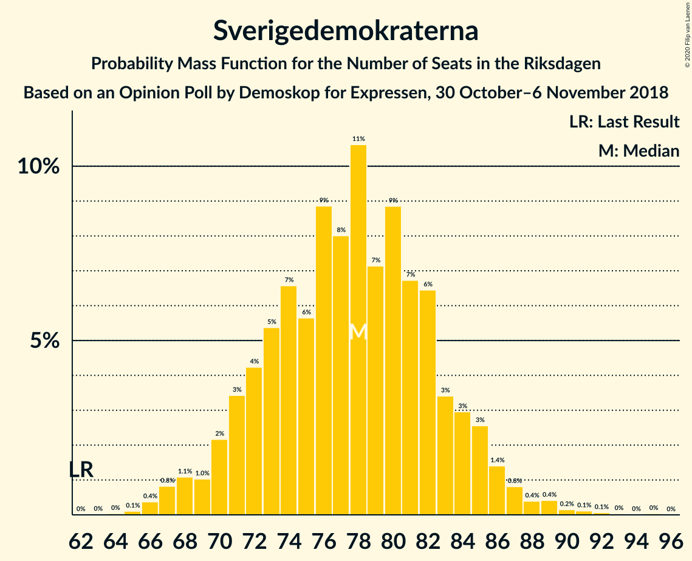
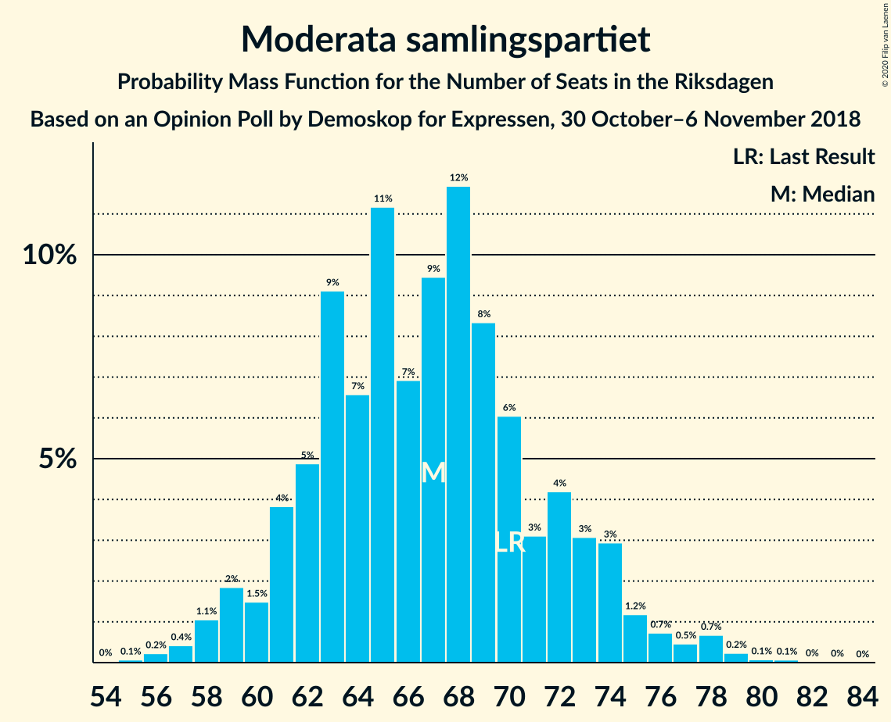
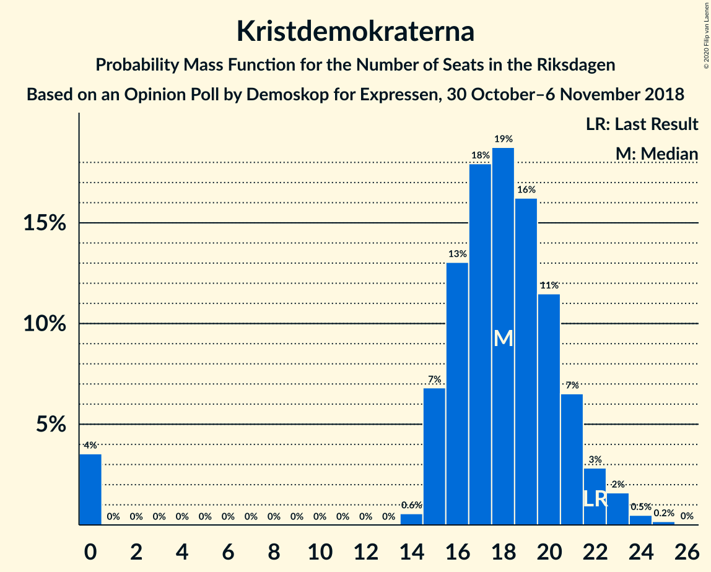
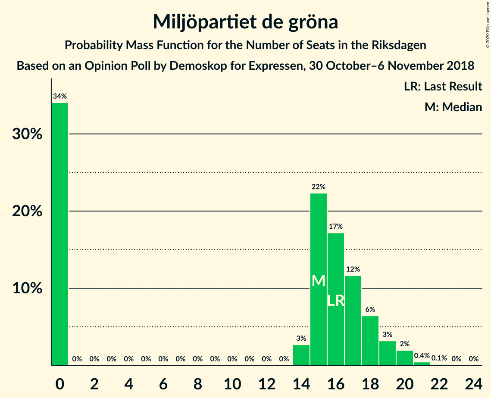
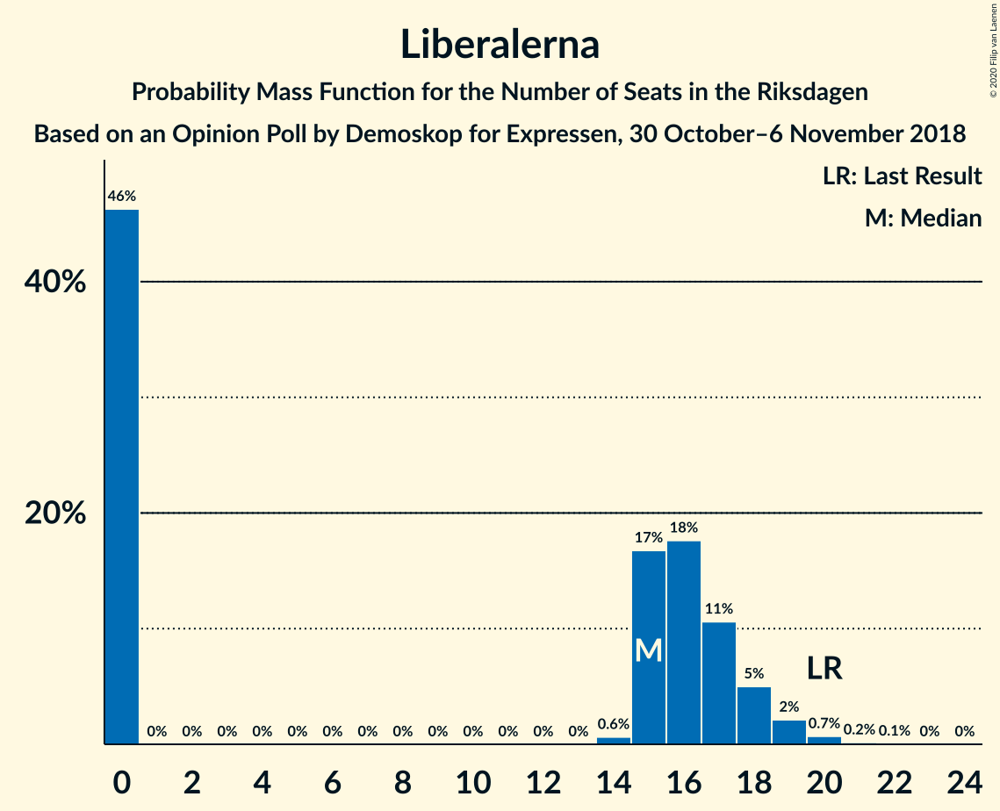
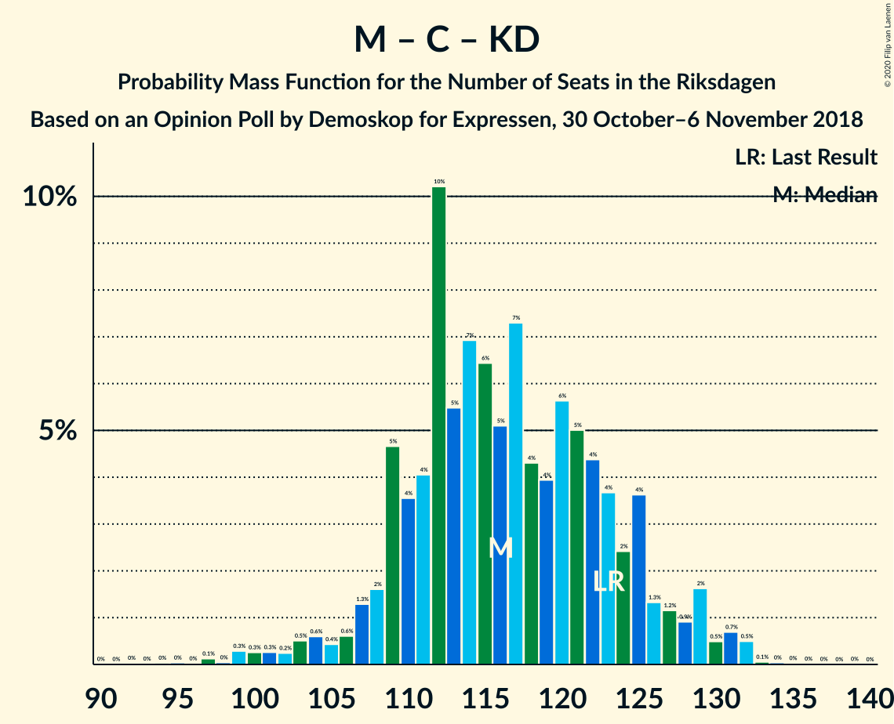

# Opinion Poll by Demoskop for Expressen, 30 October–6 November 2018

<a href="#voting-intentions">Voting Intentions</a> | <a href="#seats">Seats</a> | <a href="#coalitions">Coalitions</a> | <a href="#technical-information">Technical Information</a>

## Voting Intentions

### Confidence Intervals

| Party | Last Result | Poll Result | 80% Confidence Interval | 90% Confidence Interval | 95% Confidence Interval | 99% Confidence Interval |
|:-----:|:-----------:|:-----------:|:-----------------------:|:-----------------------:|:-----------------------:|:-----------------------:|
| Sveriges socialdemokratiska arbetareparti | 28.3% | 29.1% | 27.7–30.6% |27.3–31.0% |27.0–31.4% |26.3–32.1% |
| Sverigedemokraterna | 17.5% | 21.1% | 19.8–22.5% |19.5–22.8% |19.2–23.2% |18.6–23.8% |
| Moderata samlingspartiet | 19.8% | 18.3% | 17.1–19.5% |16.7–19.9% |16.4–20.2% |15.9–20.9% |
| Centerpartiet | 8.6% | 8.8% | 7.9–9.8% |7.7–10.0% |7.5–10.3% |7.1–10.8% |
| Vänsterpartiet | 8.0% | 7.8% | 7.0–8.7% |6.8–9.0% |6.6–9.2% |6.2–9.7% |
| Kristdemokraterna | 6.3% | 4.9% | 4.3–5.7% |4.1–5.9% |3.9–6.1% |3.7–6.4% |
| Miljöpartiet de gröna | 4.4% | 4.2% | 3.6–4.9% |3.5–5.1% |3.3–5.3% |3.1–5.7% |
| Liberalerna | 5.5% | 4.1% | 3.5–4.8% |3.4–5.0% |3.2–5.2% |3.0–5.5% |

*Note:* The poll result column reflects the actual value used in the calculations. Published results may vary slightly, and in addition be rounded to fewer digits.

## Seats

### Confidence Intervals

| Party | Last Result | Median | 80% Confidence Interval | 90% Confidence Interval | 95% Confidence Interval | 99% Confidence Interval |
|:-----:|:-----------:|:------:|:-----------------------:|:-----------------------:|:-----------------------:|:-----------------------:|
| <a href="#sveriges-socialdemokratiska-arbetareparti">Sveriges socialdemokratiska arbetareparti</a> | 100 | 107 | 100–113 |98–116 |97–118 |94–122 |
| <a href="#sverigedemokraterna">Sverigedemokraterna</a> | 62 | 78 | 72–83 |70–85 |69–86 |66–89 |
| <a href="#moderata-samlingspartiet">Moderata samlingspartiet</a> | 70 | 67 | 62–72 |60–74 |59–75 |57–78 |
| <a href="#centerpartiet">Centerpartiet</a> | 31 | 32 | 29–36 |28–37 |27–38 |26–40 |
| <a href="#vänsterpartiet">Vänsterpartiet</a> | 28 | 29 | 26–32 |25–33 |24–34 |23–36 |
| <a href="#kristdemokraterna">Kristdemokraterna</a> | 22 | 18 | 15–21 |15–22 |0–22 |0–24 |
| <a href="#miljöpartiet-de-gröna">Miljöpartiet de gröna</a> | 16 | 15 | 0–18 |0–19 |0–20 |0–21 |
| <a href="#liberalerna">Liberalerna</a> | 20 | 15 | 0–17 |0–18 |0–19 |0–20 |

### Sveriges socialdemokratiska arbetareparti

*For a full overview of the results for this party, see the [Sveriges socialdemokratiska arbetareparti](party-sverigessocialdemokratiskaarbetareparti.html) page.*

| Number of Seats | Probability | Accumulated | Special Marks |
|:---------------:|:-----------:|:-----------:|:-------------:|
| 91 | 0% | 100% |  |
| 92 | 0.1% | 99.9% |  |
| 93 | 0.1% | 99.8% |  |
| 94 | 0.3% | 99.7% |  |
| 95 | 0.6% | 99.4% |  |
| 96 | 0.7% | 98.8% |  |
| 97 | 2% | 98% |  |
| 98 | 2% | 96% |  |
| 99 | 2% | 95% |  |
| 100 | 4% | 92% | Last Result |
| 101 | 6% | 89% |  |
| 102 | 5% | 82% |  |
| 103 | 7% | 78% |  |
| 104 | 5% | 71% |  |
| 105 | 7% | 66% |  |
| 106 | 9% | 59% |  |
| 107 | 7% | 50% | Median |
| 108 | 5% | 43% |  |
| 109 | 6% | 39% |  |
| 110 | 9% | 33% |  |
| 111 | 4% | 23% |  |
| 112 | 5% | 20% |  |
| 113 | 6% | 15% |  |
| 114 | 2% | 9% |  |
| 115 | 1.4% | 7% |  |
| 116 | 2% | 5% |  |
| 117 | 1.0% | 4% |  |
| 118 | 0.8% | 3% |  |
| 119 | 1.0% | 2% |  |
| 120 | 0.2% | 1.1% |  |
| 121 | 0.3% | 0.9% |  |
| 122 | 0.3% | 0.6% |  |
| 123 | 0.2% | 0.3% |  |
| 124 | 0.1% | 0.1% |  |
| 125 | 0% | 0% |  |

### Sverigedemokraterna

*For a full overview of the results for this party, see the [Sverigedemokraterna](party-sverigedemokraterna.html) page.*

| Number of Seats | Probability | Accumulated | Special Marks |
|:---------------:|:-----------:|:-----------:|:-------------:|
| 62 | 0% | 100% | Last Result |
| 63 | 0% | 100% |  |
| 64 | 0% | 100% |  |
| 65 | 0.1% | 99.9% |  |
| 66 | 0.4% | 99.8% |  |
| 67 | 0.8% | 99.4% |  |
| 68 | 1.1% | 98.6% |  |
| 69 | 1.0% | 98% |  |
| 70 | 2% | 97% |  |
| 71 | 3% | 94% |  |
| 72 | 4% | 91% |  |
| 73 | 5% | 87% |  |
| 74 | 7% | 81% |  |
| 75 | 6% | 75% |  |
| 76 | 9% | 69% |  |
| 77 | 8% | 60% |  |
| 78 | 11% | 52% | Median |
| 79 | 7% | 42% |  |
| 80 | 9% | 34% |  |
| 81 | 7% | 26% |  |
| 82 | 6% | 19% |  |
| 83 | 3% | 12% |  |
| 84 | 3% | 9% |  |
| 85 | 3% | 6% |  |
| 86 | 1.4% | 3% |  |
| 87 | 0.8% | 2% |  |
| 88 | 0.4% | 1.2% |  |
| 89 | 0.4% | 0.8% |  |
| 90 | 0.2% | 0.4% |  |
| 91 | 0.1% | 0.3% |  |
| 92 | 0.1% | 0.2% |  |
| 93 | 0% | 0.1% |  |
| 94 | 0% | 0.1% |  |
| 95 | 0% | 0% |  |

### Moderata samlingspartiet

*For a full overview of the results for this party, see the [Moderata samlingspartiet](party-moderatasamlingspartiet.html) page.*

| Number of Seats | Probability | Accumulated | Special Marks |
|:---------------:|:-----------:|:-----------:|:-------------:|
| 55 | 0.1% | 100% |  |
| 56 | 0.2% | 99.9% |  |
| 57 | 0.4% | 99.7% |  |
| 58 | 1.1% | 99.2% |  |
| 59 | 2% | 98% |  |
| 60 | 1.5% | 96% |  |
| 61 | 4% | 95% |  |
| 62 | 5% | 91% |  |
| 63 | 9% | 86% |  |
| 64 | 7% | 77% |  |
| 65 | 11% | 70% |  |
| 66 | 7% | 59% |  |
| 67 | 9% | 52% | Median |
| 68 | 12% | 43% |  |
| 69 | 8% | 31% |  |
| 70 | 6% | 23% | Last Result |
| 71 | 3% | 17% |  |
| 72 | 4% | 14% |  |
| 73 | 3% | 10% |  |
| 74 | 3% | 6% |  |
| 75 | 1.2% | 3% |  |
| 76 | 0.7% | 2% |  |
| 77 | 0.5% | 2% |  |
| 78 | 0.7% | 1.1% |  |
| 79 | 0.2% | 0.4% |  |
| 80 | 0.1% | 0.2% |  |
| 81 | 0.1% | 0.1% |  |
| 82 | 0% | 0.1% |  |
| 83 | 0% | 0% |  |

### Centerpartiet

*For a full overview of the results for this party, see the [Centerpartiet](party-centerpartiet.html) page.*

| Number of Seats | Probability | Accumulated | Special Marks |
|:---------------:|:-----------:|:-----------:|:-------------:|
| 24 | 0.1% | 100% |  |
| 25 | 0.3% | 99.9% |  |
| 26 | 1.0% | 99.6% |  |
| 27 | 2% | 98.7% |  |
| 28 | 5% | 97% |  |
| 29 | 9% | 91% |  |
| 30 | 11% | 83% |  |
| 31 | 18% | 72% | Last Result |
| 32 | 10% | 54% | Median |
| 33 | 14% | 44% |  |
| 34 | 11% | 29% |  |
| 35 | 5% | 19% |  |
| 36 | 8% | 14% |  |
| 37 | 4% | 7% |  |
| 38 | 2% | 3% |  |
| 39 | 0.7% | 1.3% |  |
| 40 | 0.3% | 0.6% |  |
| 41 | 0.2% | 0.3% |  |
| 42 | 0% | 0.1% |  |
| 43 | 0% | 0.1% |  |
| 44 | 0% | 0% |  |

### Vänsterpartiet

*For a full overview of the results for this party, see the [Vänsterpartiet](party-vänsterpartiet.html) page.*

| Number of Seats | Probability | Accumulated | Special Marks |
|:---------------:|:-----------:|:-----------:|:-------------:|
| 21 | 0.1% | 100% |  |
| 22 | 0.3% | 99.9% |  |
| 23 | 2% | 99.5% |  |
| 24 | 2% | 98% |  |
| 25 | 5% | 96% |  |
| 26 | 9% | 90% |  |
| 27 | 12% | 81% |  |
| 28 | 16% | 69% | Last Result |
| 29 | 17% | 53% | Median |
| 30 | 13% | 36% |  |
| 31 | 9% | 24% |  |
| 32 | 8% | 14% |  |
| 33 | 3% | 7% |  |
| 34 | 1.5% | 4% |  |
| 35 | 2% | 2% |  |
| 36 | 0.7% | 0.9% |  |
| 37 | 0.1% | 0.2% |  |
| 38 | 0.1% | 0.1% |  |
| 39 | 0% | 0% |  |

### Kristdemokraterna

*For a full overview of the results for this party, see the [Kristdemokraterna](party-kristdemokraterna.html) page.*

| Number of Seats | Probability | Accumulated | Special Marks |
|:---------------:|:-----------:|:-----------:|:-------------:|
| 0 | 4% | 100% |  |
| 1 | 0% | 96% |  |
| 2 | 0% | 96% |  |
| 3 | 0% | 96% |  |
| 4 | 0% | 96% |  |
| 5 | 0% | 96% |  |
| 6 | 0% | 96% |  |
| 7 | 0% | 96% |  |
| 8 | 0% | 96% |  |
| 9 | 0% | 96% |  |
| 10 | 0% | 96% |  |
| 11 | 0% | 96% |  |
| 12 | 0% | 96% |  |
| 13 | 0% | 96% |  |
| 14 | 0.6% | 96% |  |
| 15 | 7% | 96% |  |
| 16 | 13% | 89% |  |
| 17 | 18% | 76% |  |
| 18 | 19% | 58% | Median |
| 19 | 16% | 39% |  |
| 20 | 11% | 23% |  |
| 21 | 7% | 12% |  |
| 22 | 3% | 5% | Last Result |
| 23 | 2% | 2% |  |
| 24 | 0.5% | 0.7% |  |
| 25 | 0.2% | 0.2% |  |
| 26 | 0% | 0% |  |

### Miljöpartiet de gröna

*For a full overview of the results for this party, see the [Miljöpartiet de gröna](party-miljöpartietdegröna.html) page.*

| Number of Seats | Probability | Accumulated | Special Marks |
|:---------------:|:-----------:|:-----------:|:-------------:|
| 0 | 34% | 100% |  |
| 1 | 0% | 66% |  |
| 2 | 0% | 66% |  |
| 3 | 0% | 66% |  |
| 4 | 0% | 66% |  |
| 5 | 0% | 66% |  |
| 6 | 0% | 66% |  |
| 7 | 0% | 66% |  |
| 8 | 0% | 66% |  |
| 9 | 0% | 66% |  |
| 10 | 0% | 66% |  |
| 11 | 0% | 66% |  |
| 12 | 0% | 66% |  |
| 13 | 0% | 66% |  |
| 14 | 3% | 66% |  |
| 15 | 22% | 63% | Median |
| 16 | 17% | 41% | Last Result |
| 17 | 12% | 24% |  |
| 18 | 6% | 12% |  |
| 19 | 3% | 6% |  |
| 20 | 2% | 3% |  |
| 21 | 0.4% | 0.6% |  |
| 22 | 0.1% | 0.1% |  |
| 23 | 0% | 0% |  |

### Liberalerna

*For a full overview of the results for this party, see the [Liberalerna](party-liberalerna.html) page.*

| Number of Seats | Probability | Accumulated | Special Marks |
|:---------------:|:-----------:|:-----------:|:-------------:|
| 0 | 46% | 100% |  |
| 1 | 0% | 54% |  |
| 2 | 0% | 54% |  |
| 3 | 0% | 54% |  |
| 4 | 0% | 54% |  |
| 5 | 0% | 54% |  |
| 6 | 0% | 54% |  |
| 7 | 0% | 54% |  |
| 8 | 0% | 54% |  |
| 9 | 0% | 54% |  |
| 10 | 0% | 54% |  |
| 11 | 0% | 54% |  |
| 12 | 0% | 54% |  |
| 13 | 0% | 54% |  |
| 14 | 0.6% | 54% |  |
| 15 | 17% | 53% | Median |
| 16 | 18% | 36% |  |
| 17 | 11% | 19% |  |
| 18 | 5% | 8% |  |
| 19 | 2% | 3% |  |
| 20 | 0.7% | 0.9% | Last Result |
| 21 | 0.2% | 0.2% |  |
| 22 | 0.1% | 0.1% |  |
| 23 | 0% | 0% |  |

## Coalitions

### Confidence Intervals

| Coalition | Last Result | Median | Majority? | 80% Confidence Interval | 90% Confidence Interval | 95% Confidence Interval | 99% Confidence Interval |
|:---------:|:-----------:|:------:|:---------:|:-----------------------:|:-----------------------:|:-----------------------:|:-----------------------:|
| Sveriges socialdemokratiska arbetareparti – Moderata samlingspartiet – Centerpartiet | 201 | 205 | 100% | 195–217 | 194–220 | 192–222 | 189–229 |
| Sveriges socialdemokratiska arbetareparti – Moderata samlingspartiet | 170 | 174 | 43% | 164–183 | 162–186 | 161–188 | 158–194 |
| Sverigedemokraterna – Moderata samlingspartiet – Kristdemokraterna | 154 | 162 | 4% | 153–171 | 151–173 | 148–176 | 143–179 |
| Sveriges socialdemokratiska arbetareparti – Vänsterpartiet – Miljöpartiet de gröna | 144 | 146 | 0% | 136–156 | 132–159 | 131–160 | 127–164 |
| Sverigedemokraterna – Moderata samlingspartiet | 132 | 144 | 0% | 136–152 | 134–155 | 132–157 | 129–163 |
| Sveriges socialdemokratiska arbetareparti – Vänsterpartiet | 128 | 135 | 0% | 128–144 | 126–145 | 124–148 | 121–152 |
| Moderata samlingspartiet – Centerpartiet – Kristdemokraterna – Liberalerna | 143 | 126 | 0% | 114–136 | 112–138 | 111–140 | 106–143 |
| Sveriges socialdemokratiska arbetareparti – Miljöpartiet de gröna | 116 | 118 | 0% | 107–127 | 104–129 | 102–131 | 100–134 |
| Moderata samlingspartiet – Centerpartiet – Kristdemokraterna | 123 | 116 | 0% | 109–125 | 108–127 | 105–129 | 99–132 |
| Moderata samlingspartiet – Centerpartiet – Liberalerna | 121 | 108 | 0% | 97–118 | 95–120 | 93–122 | 92–124 |
| Moderata samlingspartiet – Centerpartiet | 101 | 99 | 0% | 93–106 | 91–108 | 90–109 | 87–113 |

### Sveriges socialdemokratiska arbetareparti – Moderata samlingspartiet – Centerpartiet

| Number of Seats | Probability | Accumulated | Special Marks |
|:---------------:|:-----------:|:-----------:|:-------------:|
| 185 | 0.1% | 100% |  |
| 186 | 0.1% | 99.9% |  |
| 187 | 0.1% | 99.8% |  |
| 188 | 0.2% | 99.8% |  |
| 189 | 0.5% | 99.6% |  |
| 190 | 0.6% | 99.0% |  |
| 191 | 0.7% | 98% |  |
| 192 | 1.4% | 98% |  |
| 193 | 1.0% | 96% |  |
| 194 | 4% | 95% |  |
| 195 | 2% | 91% |  |
| 196 | 3% | 89% |  |
| 197 | 4% | 86% |  |
| 198 | 4% | 82% |  |
| 199 | 2% | 78% |  |
| 200 | 5% | 76% |  |
| 201 | 2% | 72% | Last Result |
| 202 | 3% | 70% |  |
| 203 | 6% | 67% |  |
| 204 | 3% | 61% |  |
| 205 | 9% | 58% |  |
| 206 | 4% | 49% | Median |
| 207 | 5% | 45% |  |
| 208 | 5% | 40% |  |
| 209 | 5% | 35% |  |
| 210 | 3% | 30% |  |
| 211 | 4% | 27% |  |
| 212 | 3% | 22% |  |
| 213 | 3% | 19% |  |
| 214 | 4% | 17% |  |
| 215 | 0.9% | 13% |  |
| 216 | 1.4% | 12% |  |
| 217 | 2% | 10% |  |
| 218 | 2% | 9% |  |
| 219 | 0.6% | 7% |  |
| 220 | 2% | 6% |  |
| 221 | 0.8% | 4% |  |
| 222 | 1.0% | 3% |  |
| 223 | 0.4% | 2% |  |
| 224 | 0.6% | 2% |  |
| 225 | 0.2% | 1.0% |  |
| 226 | 0.1% | 0.9% |  |
| 227 | 0.1% | 0.7% |  |
| 228 | 0.1% | 0.6% |  |
| 229 | 0.1% | 0.5% |  |
| 230 | 0.2% | 0.4% |  |
| 231 | 0.2% | 0.2% |  |
| 232 | 0% | 0.1% |  |
| 233 | 0% | 0% |  |

### Sveriges socialdemokratiska arbetareparti – Moderata samlingspartiet

| Number of Seats | Probability | Accumulated | Special Marks |
|:---------------:|:-----------:|:-----------:|:-------------:|
| 154 | 0.1% | 100% |  |
| 155 | 0.1% | 99.9% |  |
| 156 | 0.1% | 99.8% |  |
| 157 | 0.2% | 99.7% |  |
| 158 | 0.2% | 99.5% |  |
| 159 | 1.0% | 99.3% |  |
| 160 | 0.6% | 98% |  |
| 161 | 0.9% | 98% |  |
| 162 | 2% | 97% |  |
| 163 | 0.8% | 95% |  |
| 164 | 5% | 94% |  |
| 165 | 3% | 88% |  |
| 166 | 2% | 86% |  |
| 167 | 4% | 84% |  |
| 168 | 5% | 80% |  |
| 169 | 7% | 74% |  |
| 170 | 4% | 68% | Last Result |
| 171 | 2% | 64% |  |
| 172 | 6% | 62% |  |
| 173 | 4% | 56% |  |
| 174 | 8% | 51% | Median |
| 175 | 5% | 43% | Majority |
| 176 | 3% | 38% |  |
| 177 | 4% | 35% |  |
| 178 | 8% | 30% |  |
| 179 | 4% | 22% |  |
| 180 | 4% | 19% |  |
| 181 | 2% | 15% |  |
| 182 | 2% | 13% |  |
| 183 | 3% | 11% |  |
| 184 | 0.7% | 8% |  |
| 185 | 0.8% | 8% |  |
| 186 | 2% | 7% |  |
| 187 | 1.1% | 4% |  |
| 188 | 1.3% | 3% |  |
| 189 | 0.3% | 2% |  |
| 190 | 0.4% | 2% |  |
| 191 | 0.3% | 1.4% |  |
| 192 | 0.1% | 1.1% |  |
| 193 | 0.3% | 1.0% |  |
| 194 | 0.3% | 0.7% |  |
| 195 | 0.1% | 0.4% |  |
| 196 | 0.1% | 0.3% |  |
| 197 | 0.2% | 0.2% |  |
| 198 | 0% | 0% |  |

### Sverigedemokraterna – Moderata samlingspartiet – Kristdemokraterna

| Number of Seats | Probability | Accumulated | Special Marks |
|:---------------:|:-----------:|:-----------:|:-------------:|
| 139 | 0% | 100% |  |
| 140 | 0% | 99.9% |  |
| 141 | 0.2% | 99.9% |  |
| 142 | 0.1% | 99.7% |  |
| 143 | 0.1% | 99.5% |  |
| 144 | 0.2% | 99.5% |  |
| 145 | 0.2% | 99.2% |  |
| 146 | 0.4% | 99.1% |  |
| 147 | 0.7% | 98.7% |  |
| 148 | 0.8% | 98% |  |
| 149 | 0.6% | 97% |  |
| 150 | 1.4% | 97% |  |
| 151 | 2% | 95% |  |
| 152 | 1.1% | 93% |  |
| 153 | 3% | 92% |  |
| 154 | 4% | 89% | Last Result |
| 155 | 2% | 85% |  |
| 156 | 4% | 83% |  |
| 157 | 7% | 79% |  |
| 158 | 3% | 71% |  |
| 159 | 4% | 68% |  |
| 160 | 9% | 64% |  |
| 161 | 5% | 55% |  |
| 162 | 5% | 51% |  |
| 163 | 7% | 46% | Median |
| 164 | 4% | 39% |  |
| 165 | 6% | 35% |  |
| 166 | 3% | 29% |  |
| 167 | 2% | 26% |  |
| 168 | 7% | 24% |  |
| 169 | 3% | 17% |  |
| 170 | 3% | 14% |  |
| 171 | 3% | 11% |  |
| 172 | 1.3% | 8% |  |
| 173 | 3% | 7% |  |
| 174 | 0.8% | 5% |  |
| 175 | 1.0% | 4% | Majority |
| 176 | 0.7% | 3% |  |
| 177 | 0.5% | 2% |  |
| 178 | 0.6% | 1.4% |  |
| 179 | 0.4% | 0.8% |  |
| 180 | 0.1% | 0.5% |  |
| 181 | 0.1% | 0.3% |  |
| 182 | 0.1% | 0.2% |  |
| 183 | 0% | 0.1% |  |
| 184 | 0% | 0.1% |  |
| 185 | 0% | 0% |  |

### Sveriges socialdemokratiska arbetareparti – Vänsterpartiet – Miljöpartiet de gröna

| Number of Seats | Probability | Accumulated | Special Marks |
|:---------------:|:-----------:|:-----------:|:-------------:|
| 125 | 0.2% | 100% |  |
| 126 | 0.1% | 99.8% |  |
| 127 | 0.2% | 99.7% |  |
| 128 | 0.1% | 99.5% |  |
| 129 | 0.4% | 99.4% |  |
| 130 | 0.6% | 98.9% |  |
| 131 | 2% | 98% |  |
| 132 | 1.4% | 96% |  |
| 133 | 0.9% | 95% |  |
| 134 | 0.8% | 94% |  |
| 135 | 2% | 93% |  |
| 136 | 4% | 92% |  |
| 137 | 3% | 88% |  |
| 138 | 2% | 84% |  |
| 139 | 2% | 83% |  |
| 140 | 2% | 80% |  |
| 141 | 4% | 78% |  |
| 142 | 4% | 75% |  |
| 143 | 3% | 70% |  |
| 144 | 5% | 67% | Last Result |
| 145 | 9% | 61% |  |
| 146 | 3% | 53% |  |
| 147 | 3% | 49% |  |
| 148 | 7% | 46% |  |
| 149 | 3% | 39% |  |
| 150 | 6% | 36% |  |
| 151 | 5% | 30% | Median |
| 152 | 3% | 25% |  |
| 153 | 2% | 22% |  |
| 154 | 2% | 19% |  |
| 155 | 5% | 17% |  |
| 156 | 3% | 12% |  |
| 157 | 3% | 9% |  |
| 158 | 1.1% | 7% |  |
| 159 | 3% | 5% |  |
| 160 | 0.8% | 3% |  |
| 161 | 0.7% | 2% |  |
| 162 | 0.3% | 1.2% |  |
| 163 | 0.2% | 0.9% |  |
| 164 | 0.2% | 0.6% |  |
| 165 | 0.1% | 0.4% |  |
| 166 | 0.1% | 0.2% |  |
| 167 | 0% | 0.1% |  |
| 168 | 0.1% | 0.1% |  |
| 169 | 0% | 0% |  |

### Sverigedemokraterna – Moderata samlingspartiet

| Number of Seats | Probability | Accumulated | Special Marks |
|:---------------:|:-----------:|:-----------:|:-------------:|
| 126 | 0.1% | 100% |  |
| 127 | 0.1% | 99.9% |  |
| 128 | 0.1% | 99.9% |  |
| 129 | 0.3% | 99.7% |  |
| 130 | 0.5% | 99.4% |  |
| 131 | 0.6% | 98.9% |  |
| 132 | 1.4% | 98% | Last Result |
| 133 | 0.6% | 97% |  |
| 134 | 1.5% | 96% |  |
| 135 | 3% | 95% |  |
| 136 | 2% | 92% |  |
| 137 | 3% | 89% |  |
| 138 | 4% | 86% |  |
| 139 | 5% | 82% |  |
| 140 | 5% | 77% |  |
| 141 | 9% | 72% |  |
| 142 | 4% | 63% |  |
| 143 | 8% | 59% |  |
| 144 | 4% | 51% |  |
| 145 | 6% | 48% | Median |
| 146 | 5% | 41% |  |
| 147 | 3% | 36% |  |
| 148 | 6% | 33% |  |
| 149 | 4% | 28% |  |
| 150 | 6% | 23% |  |
| 151 | 3% | 17% |  |
| 152 | 5% | 14% |  |
| 153 | 2% | 10% |  |
| 154 | 2% | 8% |  |
| 155 | 1.3% | 6% |  |
| 156 | 2% | 4% |  |
| 157 | 0.8% | 3% |  |
| 158 | 0.6% | 2% |  |
| 159 | 0.2% | 1.4% |  |
| 160 | 0.4% | 1.2% |  |
| 161 | 0.1% | 0.8% |  |
| 162 | 0.2% | 0.7% |  |
| 163 | 0.1% | 0.5% |  |
| 164 | 0.1% | 0.4% |  |
| 165 | 0.2% | 0.3% |  |
| 166 | 0.1% | 0.1% |  |
| 167 | 0% | 0.1% |  |
| 168 | 0% | 0% |  |

### Sveriges socialdemokratiska arbetareparti – Vänsterpartiet

| Number of Seats | Probability | Accumulated | Special Marks |
|:---------------:|:-----------:|:-----------:|:-------------:|
| 118 | 0% | 100% |  |
| 119 | 0.1% | 99.9% |  |
| 120 | 0.3% | 99.9% |  |
| 121 | 0.3% | 99.5% |  |
| 122 | 0.3% | 99.2% |  |
| 123 | 0.7% | 98.9% |  |
| 124 | 0.9% | 98% |  |
| 125 | 2% | 97% |  |
| 126 | 2% | 95% |  |
| 127 | 2% | 93% |  |
| 128 | 2% | 91% | Last Result |
| 129 | 8% | 89% |  |
| 130 | 3% | 81% |  |
| 131 | 4% | 78% |  |
| 132 | 6% | 73% |  |
| 133 | 7% | 68% |  |
| 134 | 3% | 61% |  |
| 135 | 9% | 57% |  |
| 136 | 7% | 48% | Median |
| 137 | 6% | 42% |  |
| 138 | 3% | 36% |  |
| 139 | 3% | 32% |  |
| 140 | 8% | 29% |  |
| 141 | 4% | 22% |  |
| 142 | 5% | 18% |  |
| 143 | 2% | 13% |  |
| 144 | 2% | 11% |  |
| 145 | 4% | 9% |  |
| 146 | 1.1% | 5% |  |
| 147 | 0.7% | 4% |  |
| 148 | 1.0% | 3% |  |
| 149 | 0.4% | 2% |  |
| 150 | 0.5% | 2% |  |
| 151 | 0.1% | 1.0% |  |
| 152 | 0.5% | 0.9% |  |
| 153 | 0% | 0.4% |  |
| 154 | 0.1% | 0.4% |  |
| 155 | 0.1% | 0.3% |  |
| 156 | 0.1% | 0.2% |  |
| 157 | 0% | 0% |  |

### Moderata samlingspartiet – Centerpartiet – Kristdemokraterna – Liberalerna

| Number of Seats | Probability | Accumulated | Special Marks |
|:---------------:|:-----------:|:-----------:|:-------------:|
| 97 | 0.1% | 100% |  |
| 98 | 0% | 99.9% |  |
| 99 | 0% | 99.9% |  |
| 100 | 0% | 99.9% |  |
| 101 | 0% | 99.9% |  |
| 102 | 0% | 99.9% |  |
| 103 | 0.1% | 99.8% |  |
| 104 | 0% | 99.7% |  |
| 105 | 0.1% | 99.7% |  |
| 106 | 0.2% | 99.6% |  |
| 107 | 0.4% | 99.4% |  |
| 108 | 0.4% | 99.1% |  |
| 109 | 0.2% | 98.6% |  |
| 110 | 0.2% | 98% |  |
| 111 | 1.0% | 98% |  |
| 112 | 2% | 97% |  |
| 113 | 2% | 95% |  |
| 114 | 5% | 93% |  |
| 115 | 2% | 88% |  |
| 116 | 3% | 86% |  |
| 117 | 6% | 83% |  |
| 118 | 3% | 77% |  |
| 119 | 2% | 75% |  |
| 120 | 3% | 72% |  |
| 121 | 3% | 69% |  |
| 122 | 3% | 66% |  |
| 123 | 3% | 64% |  |
| 124 | 3% | 61% |  |
| 125 | 7% | 58% |  |
| 126 | 4% | 51% |  |
| 127 | 7% | 47% |  |
| 128 | 6% | 40% |  |
| 129 | 4% | 34% |  |
| 130 | 3% | 29% |  |
| 131 | 4% | 27% |  |
| 132 | 4% | 23% | Median |
| 133 | 3% | 19% |  |
| 134 | 2% | 16% |  |
| 135 | 3% | 14% |  |
| 136 | 3% | 12% |  |
| 137 | 3% | 8% |  |
| 138 | 1.2% | 5% |  |
| 139 | 0.8% | 4% |  |
| 140 | 1.4% | 3% |  |
| 141 | 1.0% | 2% |  |
| 142 | 0.3% | 0.9% |  |
| 143 | 0.4% | 0.7% | Last Result |
| 144 | 0.1% | 0.2% |  |
| 145 | 0.1% | 0.2% |  |
| 146 | 0% | 0.1% |  |
| 147 | 0% | 0% |  |

### Sveriges socialdemokratiska arbetareparti – Miljöpartiet de gröna

| Number of Seats | Probability | Accumulated | Special Marks |
|:---------------:|:-----------:|:-----------:|:-------------:|
| 97 | 0.2% | 100% |  |
| 98 | 0.1% | 99.7% |  |
| 99 | 0.1% | 99.7% |  |
| 100 | 0.6% | 99.5% |  |
| 101 | 1.4% | 99.0% |  |
| 102 | 0.5% | 98% |  |
| 103 | 1.3% | 97% |  |
| 104 | 0.7% | 96% |  |
| 105 | 1.5% | 95% |  |
| 106 | 2% | 94% |  |
| 107 | 3% | 91% |  |
| 108 | 2% | 88% |  |
| 109 | 3% | 86% |  |
| 110 | 2% | 83% |  |
| 111 | 3% | 81% |  |
| 112 | 4% | 78% |  |
| 113 | 5% | 74% |  |
| 114 | 3% | 69% |  |
| 115 | 3% | 66% |  |
| 116 | 5% | 63% | Last Result |
| 117 | 4% | 58% |  |
| 118 | 6% | 54% |  |
| 119 | 5% | 48% |  |
| 120 | 4% | 43% |  |
| 121 | 8% | 39% |  |
| 122 | 3% | 31% | Median |
| 123 | 5% | 28% |  |
| 124 | 3% | 23% |  |
| 125 | 5% | 20% |  |
| 126 | 3% | 15% |  |
| 127 | 3% | 12% |  |
| 128 | 3% | 8% |  |
| 129 | 1.1% | 6% |  |
| 130 | 1.0% | 4% |  |
| 131 | 2% | 3% |  |
| 132 | 0.7% | 2% |  |
| 133 | 0.4% | 1.2% |  |
| 134 | 0.3% | 0.8% |  |
| 135 | 0.2% | 0.4% |  |
| 136 | 0.1% | 0.3% |  |
| 137 | 0% | 0.2% |  |
| 138 | 0.1% | 0.1% |  |
| 139 | 0% | 0.1% |  |
| 140 | 0% | 0% |  |

### Moderata samlingspartiet – Centerpartiet – Kristdemokraterna

| Number of Seats | Probability | Accumulated | Special Marks |
|:---------------:|:-----------:|:-----------:|:-------------:|
| 92 | 0% | 100% |  |
| 93 | 0% | 99.9% |  |
| 94 | 0% | 99.9% |  |
| 95 | 0% | 99.9% |  |
| 96 | 0% | 99.9% |  |
| 97 | 0.1% | 99.8% |  |
| 98 | 0% | 99.7% |  |
| 99 | 0.3% | 99.7% |  |
| 100 | 0.3% | 99.4% |  |
| 101 | 0.3% | 99.1% |  |
| 102 | 0.2% | 98.9% |  |
| 103 | 0.5% | 98.6% |  |
| 104 | 0.6% | 98% |  |
| 105 | 0.4% | 98% |  |
| 106 | 0.6% | 97% |  |
| 107 | 1.3% | 96% |  |
| 108 | 2% | 95% |  |
| 109 | 5% | 94% |  |
| 110 | 4% | 89% |  |
| 111 | 4% | 85% |  |
| 112 | 10% | 81% |  |
| 113 | 5% | 71% |  |
| 114 | 7% | 66% |  |
| 115 | 6% | 59% |  |
| 116 | 5% | 52% |  |
| 117 | 7% | 47% | Median |
| 118 | 4% | 40% |  |
| 119 | 4% | 36% |  |
| 120 | 6% | 32% |  |
| 121 | 5% | 26% |  |
| 122 | 4% | 21% |  |
| 123 | 4% | 17% | Last Result |
| 124 | 2% | 13% |  |
| 125 | 4% | 10% |  |
| 126 | 1.3% | 7% |  |
| 127 | 1.2% | 6% |  |
| 128 | 0.9% | 4% |  |
| 129 | 2% | 3% |  |
| 130 | 0.5% | 2% |  |
| 131 | 0.7% | 1.4% |  |
| 132 | 0.5% | 0.7% |  |
| 133 | 0.1% | 0.2% |  |
| 134 | 0% | 0.1% |  |
| 135 | 0% | 0.1% |  |
| 136 | 0% | 0% |  |

### Moderata samlingspartiet – Centerpartiet – Liberalerna

| Number of Seats | Probability | Accumulated | Special Marks |
|:---------------:|:-----------:|:-----------:|:-------------:|
| 88 | 0% | 100% |  |
| 89 | 0.1% | 99.9% |  |
| 90 | 0.2% | 99.9% |  |
| 91 | 0.1% | 99.7% |  |
| 92 | 0.7% | 99.6% |  |
| 93 | 2% | 99.0% |  |
| 94 | 2% | 97% |  |
| 95 | 1.1% | 95% |  |
| 96 | 3% | 94% |  |
| 97 | 3% | 91% |  |
| 98 | 2% | 88% |  |
| 99 | 7% | 86% |  |
| 100 | 3% | 79% |  |
| 101 | 4% | 76% |  |
| 102 | 2% | 72% |  |
| 103 | 2% | 70% |  |
| 104 | 3% | 68% |  |
| 105 | 4% | 65% |  |
| 106 | 3% | 61% |  |
| 107 | 3% | 58% |  |
| 108 | 8% | 56% |  |
| 109 | 5% | 47% |  |
| 110 | 4% | 42% |  |
| 111 | 5% | 38% |  |
| 112 | 5% | 33% |  |
| 113 | 2% | 28% |  |
| 114 | 2% | 26% | Median |
| 115 | 6% | 23% |  |
| 116 | 2% | 17% |  |
| 117 | 4% | 15% |  |
| 118 | 4% | 11% |  |
| 119 | 0.8% | 7% |  |
| 120 | 2% | 6% |  |
| 121 | 1.0% | 4% | Last Result |
| 122 | 1.0% | 3% |  |
| 123 | 1.1% | 2% |  |
| 124 | 0.3% | 0.8% |  |
| 125 | 0.2% | 0.5% |  |
| 126 | 0.1% | 0.3% |  |
| 127 | 0% | 0.2% |  |
| 128 | 0.1% | 0.2% |  |
| 129 | 0% | 0.1% |  |
| 130 | 0% | 0.1% |  |
| 131 | 0% | 0% |  |

### Moderata samlingspartiet – Centerpartiet

| Number of Seats | Probability | Accumulated | Special Marks |
|:---------------:|:-----------:|:-----------:|:-------------:|
| 84 | 0% | 100% |  |
| 85 | 0.1% | 99.9% |  |
| 86 | 0.2% | 99.8% |  |
| 87 | 0.4% | 99.7% |  |
| 88 | 0.6% | 99.3% |  |
| 89 | 1.1% | 98.7% |  |
| 90 | 1.4% | 98% |  |
| 91 | 2% | 96% |  |
| 92 | 3% | 94% |  |
| 93 | 10% | 92% |  |
| 94 | 5% | 82% |  |
| 95 | 5% | 77% |  |
| 96 | 8% | 72% |  |
| 97 | 6% | 64% |  |
| 98 | 6% | 58% |  |
| 99 | 10% | 53% | Median |
| 100 | 7% | 43% |  |
| 101 | 7% | 36% | Last Result |
| 102 | 5% | 29% |  |
| 103 | 4% | 24% |  |
| 104 | 3% | 20% |  |
| 105 | 4% | 17% |  |
| 106 | 3% | 12% |  |
| 107 | 2% | 9% |  |
| 108 | 3% | 7% |  |
| 109 | 1.4% | 4% |  |
| 110 | 0.7% | 2% |  |
| 111 | 0.8% | 2% |  |
| 112 | 0.3% | 0.8% |  |
| 113 | 0.2% | 0.5% |  |
| 114 | 0.1% | 0.3% |  |
| 115 | 0.1% | 0.2% |  |
| 116 | 0.1% | 0.1% |  |
| 117 | 0% | 0.1% |  |
| 118 | 0% | 0% |  |

## Technical Information

### Opinion Poll

+ **Polling firm:** Demoskop
+ **Commissioner(s):** Expressen
+ **Fieldwork period:** 30 October–6 November 2018

### Calculations

+ **Sample size:** 1616
+ **Simulations done:** 1,048,576
+ **Error estimate:** 0.87%

