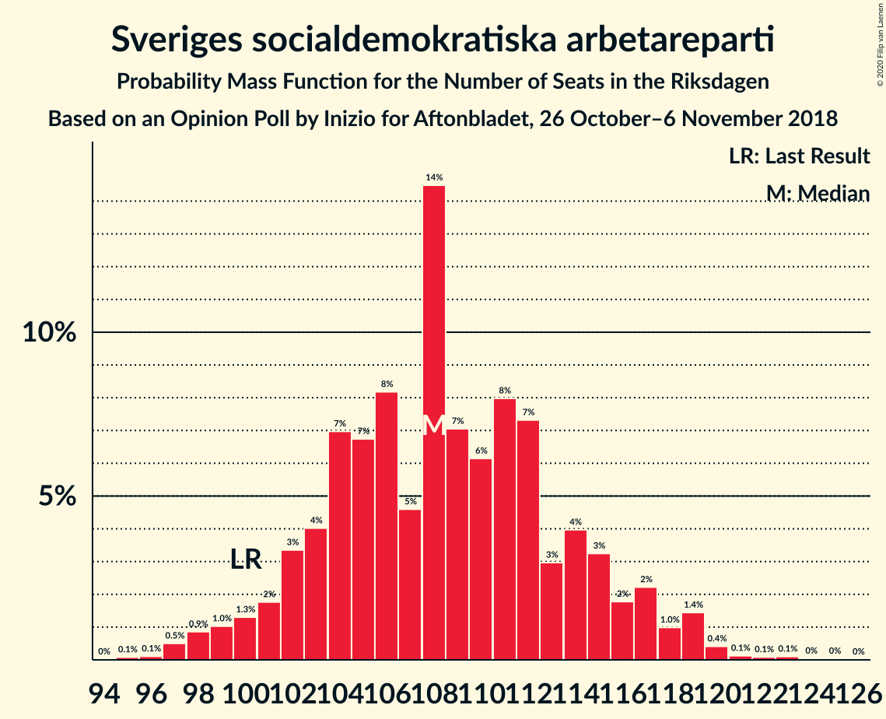
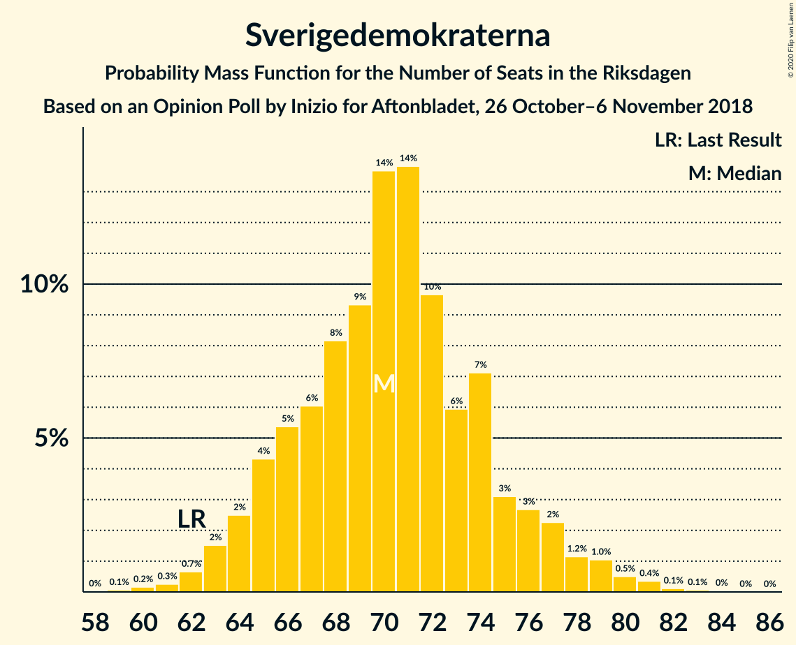
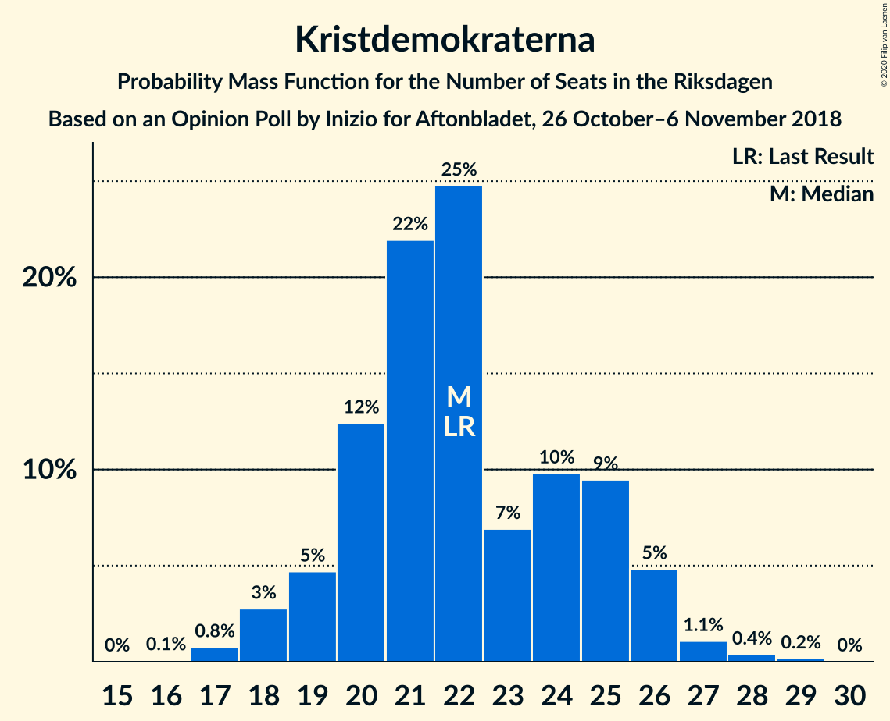
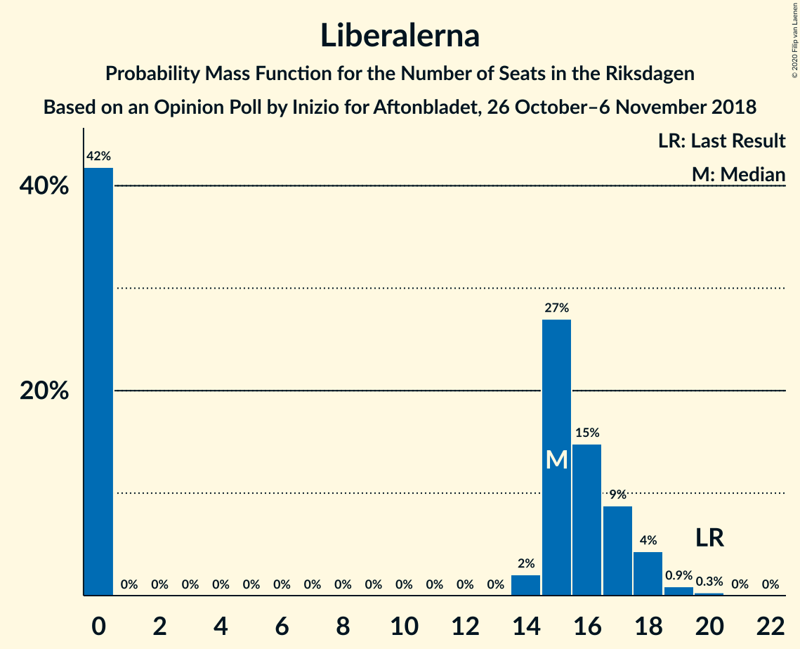

# Opinion Poll by Inizio for Aftonbladet, 26 October–6 November 2018

<a href="#voting-intentions">Voting Intentions</a> | <a href="#seats">Seats</a> | <a href="#coalitions">Coalitions</a> | <a href="#technical-information">Technical Information</a>

## Voting Intentions

### Confidence Intervals

| Party | Last Result | Poll Result | 80% Confidence Interval | 90% Confidence Interval | 95% Confidence Interval | 99% Confidence Interval |
|:-----:|:-----------:|:-----------:|:-----------------------:|:-----------------------:|:-----------------------:|:-----------------------:|
| Sveriges socialdemokratiska arbetareparti | 28.3% | 29.4% | 28.2–30.7% |27.9–31.1% |27.6–31.4% |27.0–32.0% |
| Sverigedemokraterna | 17.5% | 18.9% | 17.9–20.0% |17.6–20.4% |17.3–20.6% |16.8–21.2% |
| Moderata samlingspartiet | 19.8% | 18.2% | 17.2–19.3% |16.9–19.6% |16.6–19.9% |16.2–20.4% |
| Centerpartiet | 8.6% | 9.8% | 9.1–10.7% |8.8–10.9% |8.6–11.2% |8.3–11.6% |
| Vänsterpartiet | 8.0% | 7.8% | 7.1–8.6% |6.9–8.8% |6.8–9.0% |6.4–9.4% |
| Kristdemokraterna | 6.3% | 5.9% | 5.3–6.6% |5.1–6.8% |5.0–7.0% |4.7–7.3% |
| Liberalerna | 5.5% | 4.0% | 3.5–4.6% |3.4–4.8% |3.3–4.9% |3.0–5.2% |
| Miljöpartiet de gröna | 4.4% | 3.8% | 3.3–4.4% |3.2–4.5% |3.1–4.7% |2.9–5.0% |

*Note:* The poll result column reflects the actual value used in the calculations. Published results may vary slightly, and in addition be rounded to fewer digits.

## Seats

### Confidence Intervals

| Party | Last Result | Median | 80% Confidence Interval | 90% Confidence Interval | 95% Confidence Interval | 99% Confidence Interval |
|:-----:|:-----------:|:------:|:-----------------------:|:-----------------------:|:-----------------------:|:-----------------------:|
| <a href="#sveriges-socialdemokratiska-arbetareparti">Sveriges socialdemokratiska arbetareparti</a> | 100 | 108 | 103–115 |101–117 |99–118 |97–120 |
| <a href="#sverigedemokraterna">Sverigedemokraterna</a> | 62 | 70 | 66–75 |64–77 |63–78 |61–81 |
| <a href="#moderata-samlingspartiet">Moderata samlingspartiet</a> | 70 | 67 | 63–73 |62–74 |61–76 |59–77 |
| <a href="#centerpartiet">Centerpartiet</a> | 31 | 37 | 33–40 |32–41 |31–42 |30–44 |
| <a href="#vänsterpartiet">Vänsterpartiet</a> | 28 | 29 | 26–32 |25–33 |25–33 |23–35 |
| <a href="#kristdemokraterna">Kristdemokraterna</a> | 22 | 22 | 20–25 |19–26 |18–26 |17–28 |
| <a href="#liberalerna">Liberalerna</a> | 20 | 15 | 0–17 |0–18 |0–18 |0–19 |
| <a href="#miljöpartiet-de-gröna">Miljöpartiet de gröna</a> | 16 | 0 | 0–16 |0–17 |0–17 |0–18 |

### Sveriges socialdemokratiska arbetareparti

*For a full overview of the results for this party, see the [Sveriges socialdemokratiska arbetareparti](party-sverigessocialdemokratiskaarbetareparti.html) page.*

| Number of Seats | Probability | Accumulated | Special Marks |
|:---------------:|:-----------:|:-----------:|:-------------:|
| 95 | 0.1% | 100% |  |
| 96 | 0.1% | 99.9% |  |
| 97 | 0.5% | 99.8% |  |
| 98 | 0.9% | 99.3% |  |
| 99 | 1.0% | 98% |  |
| 100 | 1.3% | 97% | Last Result |
| 101 | 2% | 96% |  |
| 102 | 3% | 94% |  |
| 103 | 4% | 91% |  |
| 104 | 7% | 87% |  |
| 105 | 7% | 80% |  |
| 106 | 8% | 73% |  |
| 107 | 5% | 65% |  |
| 108 | 14% | 60% | Median |
| 109 | 7% | 46% |  |
| 110 | 6% | 39% |  |
| 111 | 8% | 33% |  |
| 112 | 7% | 25% |  |
| 113 | 3% | 17% |  |
| 114 | 4% | 14% |  |
| 115 | 3% | 11% |  |
| 116 | 2% | 7% |  |
| 117 | 2% | 5% |  |
| 118 | 1.0% | 3% |  |
| 119 | 1.4% | 2% |  |
| 120 | 0.4% | 0.8% |  |
| 121 | 0.1% | 0.4% |  |
| 122 | 0.1% | 0.3% |  |
| 123 | 0.1% | 0.2% |  |
| 124 | 0% | 0.1% |  |
| 125 | 0% | 0.1% |  |
| 126 | 0% | 0% |  |

### Sverigedemokraterna

*For a full overview of the results for this party, see the [Sverigedemokraterna](party-sverigedemokraterna.html) page.*

| Number of Seats | Probability | Accumulated | Special Marks |
|:---------------:|:-----------:|:-----------:|:-------------:|
| 59 | 0.1% | 100% |  |
| 60 | 0.2% | 99.9% |  |
| 61 | 0.3% | 99.7% |  |
| 62 | 0.7% | 99.5% | Last Result |
| 63 | 2% | 98.8% |  |
| 64 | 2% | 97% |  |
| 65 | 4% | 95% |  |
| 66 | 5% | 90% |  |
| 67 | 6% | 85% |  |
| 68 | 8% | 79% |  |
| 69 | 9% | 71% |  |
| 70 | 14% | 62% | Median |
| 71 | 14% | 48% |  |
| 72 | 10% | 34% |  |
| 73 | 6% | 24% |  |
| 74 | 7% | 18% |  |
| 75 | 3% | 11% |  |
| 76 | 3% | 8% |  |
| 77 | 2% | 6% |  |
| 78 | 1.2% | 3% |  |
| 79 | 1.0% | 2% |  |
| 80 | 0.5% | 1.1% |  |
| 81 | 0.4% | 0.6% |  |
| 82 | 0.1% | 0.2% |  |
| 83 | 0.1% | 0.1% |  |
| 84 | 0% | 0.1% |  |
| 85 | 0% | 0% |  |

### Moderata samlingspartiet

*For a full overview of the results for this party, see the [Moderata samlingspartiet](party-moderatasamlingspartiet.html) page.*

| Number of Seats | Probability | Accumulated | Special Marks |
|:---------------:|:-----------:|:-----------:|:-------------:|
| 57 | 0.1% | 100% |  |
| 58 | 0.3% | 99.8% |  |
| 59 | 0.5% | 99.6% |  |
| 60 | 1.5% | 99.1% |  |
| 61 | 2% | 98% |  |
| 62 | 3% | 95% |  |
| 63 | 4% | 92% |  |
| 64 | 7% | 88% |  |
| 65 | 7% | 81% |  |
| 66 | 9% | 74% |  |
| 67 | 17% | 65% | Median |
| 68 | 10% | 48% |  |
| 69 | 7% | 38% |  |
| 70 | 9% | 31% | Last Result |
| 71 | 6% | 22% |  |
| 72 | 4% | 16% |  |
| 73 | 4% | 12% |  |
| 74 | 4% | 8% |  |
| 75 | 1.2% | 4% |  |
| 76 | 2% | 3% |  |
| 77 | 0.6% | 1.0% |  |
| 78 | 0.2% | 0.4% |  |
| 79 | 0.1% | 0.2% |  |
| 80 | 0% | 0.1% |  |
| 81 | 0% | 0% |  |

### Centerpartiet

*For a full overview of the results for this party, see the [Centerpartiet](party-centerpartiet.html) page.*

| Number of Seats | Probability | Accumulated | Special Marks |
|:---------------:|:-----------:|:-----------:|:-------------:|
| 29 | 0.1% | 100% |  |
| 30 | 0.7% | 99.8% |  |
| 31 | 3% | 99.1% | Last Result |
| 32 | 3% | 96% |  |
| 33 | 5% | 93% |  |
| 34 | 8% | 88% |  |
| 35 | 9% | 80% |  |
| 36 | 14% | 71% |  |
| 37 | 14% | 57% | Median |
| 38 | 22% | 42% |  |
| 39 | 8% | 21% |  |
| 40 | 5% | 12% |  |
| 41 | 5% | 8% |  |
| 42 | 2% | 3% |  |
| 43 | 0.6% | 1.3% |  |
| 44 | 0.5% | 0.7% |  |
| 45 | 0.1% | 0.2% |  |
| 46 | 0% | 0.1% |  |
| 47 | 0% | 0% |  |

### Vänsterpartiet

*For a full overview of the results for this party, see the [Vänsterpartiet](party-vänsterpartiet.html) page.*

| Number of Seats | Probability | Accumulated | Special Marks |
|:---------------:|:-----------:|:-----------:|:-------------:|
| 22 | 0% | 100% |  |
| 23 | 0.5% | 99.9% |  |
| 24 | 1.1% | 99.4% |  |
| 25 | 4% | 98% |  |
| 26 | 11% | 94% |  |
| 27 | 13% | 83% |  |
| 28 | 15% | 70% | Last Result |
| 29 | 22% | 55% | Median |
| 30 | 14% | 33% |  |
| 31 | 7% | 19% |  |
| 32 | 7% | 12% |  |
| 33 | 4% | 6% |  |
| 34 | 1.3% | 2% |  |
| 35 | 0.4% | 0.9% |  |
| 36 | 0.3% | 0.4% |  |
| 37 | 0.1% | 0.1% |  |
| 38 | 0% | 0% |  |

### Kristdemokraterna

*For a full overview of the results for this party, see the [Kristdemokraterna](party-kristdemokraterna.html) page.*

| Number of Seats | Probability | Accumulated | Special Marks |
|:---------------:|:-----------:|:-----------:|:-------------:|
| 16 | 0.1% | 100% |  |
| 17 | 0.8% | 99.9% |  |
| 18 | 3% | 99.2% |  |
| 19 | 5% | 96% |  |
| 20 | 12% | 92% |  |
| 21 | 22% | 79% |  |
| 22 | 25% | 57% | Last Result, Median |
| 23 | 7% | 33% |  |
| 24 | 10% | 26% |  |
| 25 | 9% | 16% |  |
| 26 | 5% | 6% |  |
| 27 | 1.1% | 2% |  |
| 28 | 0.4% | 0.6% |  |
| 29 | 0.2% | 0.2% |  |
| 30 | 0% | 0% |  |

### Liberalerna

*For a full overview of the results for this party, see the [Liberalerna](party-liberalerna.html) page.*

| Number of Seats | Probability | Accumulated | Special Marks |
|:---------------:|:-----------:|:-----------:|:-------------:|
| 0 | 42% | 100% |  |
| 1 | 0% | 58% |  |
| 2 | 0% | 58% |  |
| 3 | 0% | 58% |  |
| 4 | 0% | 58% |  |
| 5 | 0% | 58% |  |
| 6 | 0% | 58% |  |
| 7 | 0% | 58% |  |
| 8 | 0% | 58% |  |
| 9 | 0% | 58% |  |
| 10 | 0% | 58% |  |
| 11 | 0% | 58% |  |
| 12 | 0% | 58% |  |
| 13 | 0% | 58% |  |
| 14 | 2% | 58% |  |
| 15 | 27% | 56% | Median |
| 16 | 15% | 29% |  |
| 17 | 9% | 14% |  |
| 18 | 4% | 6% |  |
| 19 | 0.9% | 1.2% |  |
| 20 | 0.3% | 0.3% | Last Result |
| 21 | 0% | 0% |  |

### Miljöpartiet de gröna

*For a full overview of the results for this party, see the [Miljöpartiet de gröna](party-miljöpartietdegröna.html) page.*

| Number of Seats | Probability | Accumulated | Special Marks |
|:---------------:|:-----------:|:-----------:|:-------------:|
| 0 | 63% | 100% | Median |
| 1 | 0% | 37% |  |
| 2 | 0% | 37% |  |
| 3 | 0% | 37% |  |
| 4 | 0% | 37% |  |
| 5 | 0% | 37% |  |
| 6 | 0% | 37% |  |
| 7 | 0% | 37% |  |
| 8 | 0% | 37% |  |
| 9 | 0% | 37% |  |
| 10 | 0% | 37% |  |
| 11 | 0% | 37% |  |
| 12 | 0% | 37% |  |
| 13 | 0% | 37% |  |
| 14 | 3% | 37% |  |
| 15 | 16% | 33% |  |
| 16 | 12% | 17% | Last Result |
| 17 | 3% | 5% |  |
| 18 | 1.5% | 2% |  |
| 19 | 0.2% | 0.2% |  |
| 20 | 0% | 0% |  |

## Coalitions

### Confidence Intervals

| Coalition | Last Result | Median | Majority? | 80% Confidence Interval | 90% Confidence Interval | 95% Confidence Interval | 99% Confidence Interval |
|:---------:|:-----------:|:------:|:---------:|:-----------------------:|:-----------------------:|:-----------------------:|:-----------------------:|
| Sveriges socialdemokratiska arbetareparti – Moderata samlingspartiet – Centerpartiet | 201 | 213 | 100% | 202–224 | 200–226 | 199–227 | 196–230 |
| Sveriges socialdemokratiska arbetareparti – Moderata samlingspartiet | 170 | 175 | 63% | 168–185 | 166–187 | 163–190 | 161–192 |
| Sverigedemokraterna – Moderata samlingspartiet – Kristdemokraterna | 154 | 160 | 0.8% | 152–169 | 149–171 | 148–172 | 145–176 |
| Sveriges socialdemokratiska arbetareparti – Vänsterpartiet – Miljöpartiet de gröna | 144 | 142 | 0% | 134–152 | 132–154 | 131–157 | 129–160 |
| Sverigedemokraterna – Moderata samlingspartiet | 132 | 138 | 0% | 131–145 | 129–147 | 127–150 | 124–152 |
| Sveriges socialdemokratiska arbetareparti – Vänsterpartiet | 128 | 137 | 0% | 131–145 | 129–147 | 127–149 | 125–152 |
| Moderata samlingspartiet – Centerpartiet – Kristdemokraterna – Liberalerna | 143 | 136 | 0% | 126–145 | 124–146 | 122–147 | 119–150 |
| Moderata samlingspartiet – Centerpartiet – Kristdemokraterna | 123 | 127 | 0% | 119–134 | 117–137 | 116–137 | 113–140 |
| Sveriges socialdemokratiska arbetareparti – Miljöpartiet de gröna | 116 | 113 | 0% | 106–124 | 104–127 | 103–128 | 101–131 |
| Moderata samlingspartiet – Centerpartiet – Liberalerna | 121 | 114 | 0% | 104–123 | 102–124 | 101–126 | 98–128 |
| Moderata samlingspartiet – Centerpartiet | 101 | 105 | 0% | 98–111 | 96–112 | 95–114 | 93–117 |

### Sveriges socialdemokratiska arbetareparti – Moderata samlingspartiet – Centerpartiet

| Number of Seats | Probability | Accumulated | Special Marks |
|:---------------:|:-----------:|:-----------:|:-------------:|
| 193 | 0% | 100% |  |
| 194 | 0.1% | 99.9% |  |
| 195 | 0.2% | 99.9% |  |
| 196 | 0.2% | 99.6% |  |
| 197 | 0.8% | 99.4% |  |
| 198 | 0.9% | 98.7% |  |
| 199 | 0.8% | 98% |  |
| 200 | 2% | 97% |  |
| 201 | 2% | 95% | Last Result |
| 202 | 3% | 93% |  |
| 203 | 4% | 90% |  |
| 204 | 2% | 86% |  |
| 205 | 3% | 84% |  |
| 206 | 2% | 82% |  |
| 207 | 2% | 79% |  |
| 208 | 4% | 78% |  |
| 209 | 5% | 74% |  |
| 210 | 4% | 69% |  |
| 211 | 5% | 65% |  |
| 212 | 5% | 60% | Median |
| 213 | 13% | 55% |  |
| 214 | 4% | 43% |  |
| 215 | 5% | 39% |  |
| 216 | 4% | 34% |  |
| 217 | 3% | 30% |  |
| 218 | 4% | 27% |  |
| 219 | 1.3% | 23% |  |
| 220 | 4% | 21% |  |
| 221 | 3% | 17% |  |
| 222 | 3% | 14% |  |
| 223 | 1.0% | 12% |  |
| 224 | 4% | 11% |  |
| 225 | 0.6% | 6% |  |
| 226 | 3% | 6% |  |
| 227 | 0.7% | 3% |  |
| 228 | 1.0% | 2% |  |
| 229 | 0.3% | 1.3% |  |
| 230 | 0.5% | 0.9% |  |
| 231 | 0.2% | 0.4% |  |
| 232 | 0.1% | 0.2% |  |
| 233 | 0.1% | 0.1% |  |
| 234 | 0% | 0% |  |

### Sveriges socialdemokratiska arbetareparti – Moderata samlingspartiet

| Number of Seats | Probability | Accumulated | Special Marks |
|:---------------:|:-----------:|:-----------:|:-------------:|
| 158 | 0% | 100% |  |
| 159 | 0.1% | 99.9% |  |
| 160 | 0.1% | 99.8% |  |
| 161 | 0.4% | 99.7% |  |
| 162 | 0.2% | 99.2% |  |
| 163 | 2% | 99.0% |  |
| 164 | 0.9% | 97% |  |
| 165 | 0.8% | 96% |  |
| 166 | 3% | 96% |  |
| 167 | 1.2% | 92% |  |
| 168 | 2% | 91% |  |
| 169 | 6% | 89% |  |
| 170 | 3% | 83% | Last Result |
| 171 | 3% | 80% |  |
| 172 | 5% | 77% |  |
| 173 | 8% | 72% |  |
| 174 | 2% | 65% |  |
| 175 | 14% | 63% | Median, Majority |
| 176 | 4% | 49% |  |
| 177 | 3% | 45% |  |
| 178 | 6% | 42% |  |
| 179 | 5% | 36% |  |
| 180 | 5% | 31% |  |
| 181 | 5% | 27% |  |
| 182 | 2% | 22% |  |
| 183 | 6% | 19% |  |
| 184 | 2% | 13% |  |
| 185 | 2% | 12% |  |
| 186 | 4% | 9% |  |
| 187 | 0.9% | 5% |  |
| 188 | 1.2% | 4% |  |
| 189 | 0.2% | 3% |  |
| 190 | 2% | 3% |  |
| 191 | 0.2% | 1.3% |  |
| 192 | 0.8% | 1.1% |  |
| 193 | 0.1% | 0.3% |  |
| 194 | 0.1% | 0.2% |  |
| 195 | 0.1% | 0.1% |  |
| 196 | 0% | 0% |  |

### Sverigedemokraterna – Moderata samlingspartiet – Kristdemokraterna

| Number of Seats | Probability | Accumulated | Special Marks |
|:---------------:|:-----------:|:-----------:|:-------------:|
| 142 | 0% | 100% |  |
| 143 | 0.1% | 99.9% |  |
| 144 | 0.2% | 99.9% |  |
| 145 | 0.3% | 99.7% |  |
| 146 | 0.5% | 99.3% |  |
| 147 | 0.9% | 98.9% |  |
| 148 | 0.5% | 98% |  |
| 149 | 3% | 97% |  |
| 150 | 3% | 95% |  |
| 151 | 1.1% | 92% |  |
| 152 | 5% | 91% |  |
| 153 | 3% | 87% |  |
| 154 | 3% | 83% | Last Result |
| 155 | 2% | 80% |  |
| 156 | 4% | 78% |  |
| 157 | 4% | 74% |  |
| 158 | 5% | 70% |  |
| 159 | 14% | 65% | Median |
| 160 | 5% | 50% |  |
| 161 | 6% | 45% |  |
| 162 | 7% | 39% |  |
| 163 | 4% | 33% |  |
| 164 | 4% | 29% |  |
| 165 | 4% | 25% |  |
| 166 | 3% | 21% |  |
| 167 | 5% | 18% |  |
| 168 | 2% | 13% |  |
| 169 | 2% | 11% |  |
| 170 | 1.4% | 9% |  |
| 171 | 4% | 8% |  |
| 172 | 1.1% | 3% |  |
| 173 | 0.9% | 2% |  |
| 174 | 0.3% | 1.2% |  |
| 175 | 0.3% | 0.8% | Majority |
| 176 | 0.3% | 0.5% |  |
| 177 | 0.1% | 0.2% |  |
| 178 | 0.1% | 0.1% |  |
| 179 | 0% | 0% |  |

### Sveriges socialdemokratiska arbetareparti – Vänsterpartiet – Miljöpartiet de gröna

| Number of Seats | Probability | Accumulated | Special Marks |
|:---------------:|:-----------:|:-----------:|:-------------:|
| 126 | 0% | 100% |  |
| 127 | 0% | 99.9% |  |
| 128 | 0.1% | 99.9% |  |
| 129 | 0.3% | 99.8% |  |
| 130 | 0.7% | 99.5% |  |
| 131 | 1.4% | 98.8% |  |
| 132 | 3% | 97% |  |
| 133 | 3% | 95% |  |
| 134 | 2% | 92% |  |
| 135 | 3% | 90% |  |
| 136 | 4% | 87% |  |
| 137 | 13% | 83% | Median |
| 138 | 3% | 70% |  |
| 139 | 3% | 68% |  |
| 140 | 7% | 65% |  |
| 141 | 4% | 57% |  |
| 142 | 4% | 53% |  |
| 143 | 2% | 49% |  |
| 144 | 5% | 47% | Last Result |
| 145 | 4% | 42% |  |
| 146 | 4% | 38% |  |
| 147 | 8% | 34% |  |
| 148 | 4% | 26% |  |
| 149 | 3% | 22% |  |
| 150 | 4% | 19% |  |
| 151 | 4% | 15% |  |
| 152 | 2% | 11% |  |
| 153 | 2% | 9% |  |
| 154 | 2% | 7% |  |
| 155 | 0.6% | 5% |  |
| 156 | 1.3% | 4% |  |
| 157 | 0.5% | 3% |  |
| 158 | 1.1% | 2% |  |
| 159 | 0.4% | 1.0% |  |
| 160 | 0.1% | 0.6% |  |
| 161 | 0.2% | 0.4% |  |
| 162 | 0.1% | 0.2% |  |
| 163 | 0% | 0.1% |  |
| 164 | 0.1% | 0.1% |  |
| 165 | 0% | 0% |  |

### Sverigedemokraterna – Moderata samlingspartiet

| Number of Seats | Probability | Accumulated | Special Marks |
|:---------------:|:-----------:|:-----------:|:-------------:|
| 121 | 0% | 100% |  |
| 122 | 0.1% | 99.9% |  |
| 123 | 0.1% | 99.8% |  |
| 124 | 0.3% | 99.8% |  |
| 125 | 0.5% | 99.5% |  |
| 126 | 0.8% | 99.0% |  |
| 127 | 2% | 98% |  |
| 128 | 1.3% | 96% |  |
| 129 | 2% | 95% |  |
| 130 | 2% | 93% |  |
| 131 | 3% | 90% |  |
| 132 | 2% | 87% | Last Result |
| 133 | 6% | 85% |  |
| 134 | 4% | 79% |  |
| 135 | 5% | 76% |  |
| 136 | 6% | 70% |  |
| 137 | 14% | 65% | Median |
| 138 | 7% | 51% |  |
| 139 | 4% | 43% |  |
| 140 | 7% | 39% |  |
| 141 | 5% | 32% |  |
| 142 | 4% | 27% |  |
| 143 | 3% | 23% |  |
| 144 | 4% | 20% |  |
| 145 | 7% | 15% |  |
| 146 | 3% | 8% |  |
| 147 | 1.0% | 6% |  |
| 148 | 1.2% | 5% |  |
| 149 | 0.8% | 4% |  |
| 150 | 2% | 3% |  |
| 151 | 0.3% | 1.0% |  |
| 152 | 0.4% | 0.7% |  |
| 153 | 0.2% | 0.3% |  |
| 154 | 0.1% | 0.2% |  |
| 155 | 0.1% | 0.1% |  |
| 156 | 0% | 0% |  |

### Sveriges socialdemokratiska arbetareparti – Vänsterpartiet

| Number of Seats | Probability | Accumulated | Special Marks |
|:---------------:|:-----------:|:-----------:|:-------------:|
| 122 | 0% | 100% |  |
| 123 | 0.1% | 99.9% |  |
| 124 | 0.1% | 99.9% |  |
| 125 | 0.5% | 99.8% |  |
| 126 | 1.1% | 99.2% |  |
| 127 | 2% | 98% |  |
| 128 | 0.8% | 97% | Last Result |
| 129 | 2% | 96% |  |
| 130 | 2% | 94% |  |
| 131 | 6% | 93% |  |
| 132 | 7% | 86% |  |
| 133 | 7% | 80% |  |
| 134 | 5% | 73% |  |
| 135 | 5% | 68% |  |
| 136 | 8% | 63% |  |
| 137 | 14% | 55% | Median |
| 138 | 5% | 41% |  |
| 139 | 4% | 36% |  |
| 140 | 8% | 32% |  |
| 141 | 4% | 24% |  |
| 142 | 3% | 20% |  |
| 143 | 2% | 17% |  |
| 144 | 4% | 15% |  |
| 145 | 3% | 11% |  |
| 146 | 2% | 8% |  |
| 147 | 2% | 6% |  |
| 148 | 1.0% | 4% |  |
| 149 | 0.9% | 3% |  |
| 150 | 1.1% | 2% |  |
| 151 | 0.6% | 1.2% |  |
| 152 | 0.2% | 0.6% |  |
| 153 | 0.2% | 0.4% |  |
| 154 | 0.1% | 0.2% |  |
| 155 | 0% | 0.1% |  |
| 156 | 0.1% | 0.1% |  |
| 157 | 0% | 0% |  |

### Moderata samlingspartiet – Centerpartiet – Kristdemokraterna – Liberalerna

| Number of Seats | Probability | Accumulated | Special Marks |
|:---------------:|:-----------:|:-----------:|:-------------:|
| 116 | 0.1% | 100% |  |
| 117 | 0.1% | 99.9% |  |
| 118 | 0.1% | 99.8% |  |
| 119 | 0.3% | 99.7% |  |
| 120 | 1.0% | 99.4% |  |
| 121 | 0.6% | 98% |  |
| 122 | 0.9% | 98% |  |
| 123 | 1.0% | 97% |  |
| 124 | 2% | 96% |  |
| 125 | 2% | 94% |  |
| 126 | 3% | 92% |  |
| 127 | 4% | 90% |  |
| 128 | 3% | 86% |  |
| 129 | 3% | 83% |  |
| 130 | 3% | 80% |  |
| 131 | 4% | 77% |  |
| 132 | 4% | 73% |  |
| 133 | 5% | 68% |  |
| 134 | 7% | 64% |  |
| 135 | 5% | 57% |  |
| 136 | 5% | 52% |  |
| 137 | 6% | 47% |  |
| 138 | 3% | 41% |  |
| 139 | 4% | 38% |  |
| 140 | 5% | 34% |  |
| 141 | 2% | 29% | Median |
| 142 | 10% | 27% |  |
| 143 | 2% | 17% | Last Result |
| 144 | 4% | 14% |  |
| 145 | 4% | 11% |  |
| 146 | 3% | 7% |  |
| 147 | 2% | 4% |  |
| 148 | 1.0% | 2% |  |
| 149 | 0.5% | 1.2% |  |
| 150 | 0.3% | 0.7% |  |
| 151 | 0.2% | 0.4% |  |
| 152 | 0.1% | 0.2% |  |
| 153 | 0.1% | 0.1% |  |
| 154 | 0% | 0% |  |

### Moderata samlingspartiet – Centerpartiet – Kristdemokraterna

| Number of Seats | Probability | Accumulated | Special Marks |
|:---------------:|:-----------:|:-----------:|:-------------:|
| 110 | 0% | 100% |  |
| 111 | 0.2% | 99.9% |  |
| 112 | 0.1% | 99.7% |  |
| 113 | 0.4% | 99.6% |  |
| 114 | 0.4% | 99.2% |  |
| 115 | 1.0% | 98.8% |  |
| 116 | 2% | 98% |  |
| 117 | 2% | 96% |  |
| 118 | 2% | 94% |  |
| 119 | 5% | 92% |  |
| 120 | 3% | 86% |  |
| 121 | 3% | 84% |  |
| 122 | 5% | 80% |  |
| 123 | 4% | 76% | Last Result |
| 124 | 5% | 72% |  |
| 125 | 6% | 66% |  |
| 126 | 5% | 60% | Median |
| 127 | 14% | 55% |  |
| 128 | 8% | 41% |  |
| 129 | 4% | 33% |  |
| 130 | 6% | 29% |  |
| 131 | 4% | 23% |  |
| 132 | 4% | 20% |  |
| 133 | 4% | 16% |  |
| 134 | 4% | 12% |  |
| 135 | 2% | 8% |  |
| 136 | 1.0% | 6% |  |
| 137 | 3% | 5% |  |
| 138 | 0.8% | 2% |  |
| 139 | 0.4% | 1.4% |  |
| 140 | 0.6% | 0.9% |  |
| 141 | 0.2% | 0.3% |  |
| 142 | 0% | 0.1% |  |
| 143 | 0% | 0.1% |  |
| 144 | 0% | 0% |  |

### Sveriges socialdemokratiska arbetareparti – Miljöpartiet de gröna

| Number of Seats | Probability | Accumulated | Special Marks |
|:---------------:|:-----------:|:-----------:|:-------------:|
| 98 | 0% | 100% |  |
| 99 | 0.1% | 99.9% |  |
| 100 | 0.2% | 99.8% |  |
| 101 | 0.3% | 99.7% |  |
| 102 | 1.0% | 99.4% |  |
| 103 | 2% | 98% |  |
| 104 | 3% | 96% |  |
| 105 | 3% | 94% |  |
| 106 | 2% | 91% |  |
| 107 | 2% | 88% |  |
| 108 | 13% | 87% | Median |
| 109 | 5% | 74% |  |
| 110 | 5% | 69% |  |
| 111 | 6% | 64% |  |
| 112 | 6% | 57% |  |
| 113 | 2% | 51% |  |
| 114 | 4% | 49% |  |
| 115 | 4% | 44% |  |
| 116 | 3% | 40% | Last Result |
| 117 | 4% | 37% |  |
| 118 | 4% | 33% |  |
| 119 | 3% | 29% |  |
| 120 | 5% | 26% |  |
| 121 | 6% | 22% |  |
| 122 | 3% | 16% |  |
| 123 | 2% | 13% |  |
| 124 | 2% | 11% |  |
| 125 | 1.5% | 8% |  |
| 126 | 2% | 7% |  |
| 127 | 2% | 5% |  |
| 128 | 1.3% | 4% |  |
| 129 | 0.9% | 2% |  |
| 130 | 0.3% | 1.3% |  |
| 131 | 0.6% | 1.1% |  |
| 132 | 0.2% | 0.4% |  |
| 133 | 0.1% | 0.2% |  |
| 134 | 0.1% | 0.1% |  |
| 135 | 0% | 0.1% |  |
| 136 | 0% | 0% |  |

### Moderata samlingspartiet – Centerpartiet – Liberalerna

| Number of Seats | Probability | Accumulated | Special Marks |
|:---------------:|:-----------:|:-----------:|:-------------:|
| 94 | 0% | 100% |  |
| 95 | 0.1% | 99.9% |  |
| 96 | 0.1% | 99.8% |  |
| 97 | 0.1% | 99.7% |  |
| 98 | 0.9% | 99.6% |  |
| 99 | 0.3% | 98.7% |  |
| 100 | 0.8% | 98% |  |
| 101 | 2% | 98% |  |
| 102 | 2% | 96% |  |
| 103 | 3% | 94% |  |
| 104 | 3% | 92% |  |
| 105 | 3% | 88% |  |
| 106 | 4% | 85% |  |
| 107 | 4% | 81% |  |
| 108 | 3% | 77% |  |
| 109 | 4% | 74% |  |
| 110 | 3% | 70% |  |
| 111 | 5% | 67% |  |
| 112 | 5% | 62% |  |
| 113 | 3% | 57% |  |
| 114 | 5% | 53% |  |
| 115 | 5% | 48% |  |
| 116 | 4% | 43% |  |
| 117 | 5% | 40% |  |
| 118 | 3% | 35% |  |
| 119 | 6% | 32% | Median |
| 120 | 10% | 26% |  |
| 121 | 4% | 17% | Last Result |
| 122 | 1.4% | 12% |  |
| 123 | 5% | 11% |  |
| 124 | 3% | 6% |  |
| 125 | 1.0% | 4% |  |
| 126 | 1.4% | 3% |  |
| 127 | 0.6% | 1.2% |  |
| 128 | 0.2% | 0.6% |  |
| 129 | 0.3% | 0.4% |  |
| 130 | 0.1% | 0.1% |  |
| 131 | 0% | 0% |  |

### Moderata samlingspartiet – Centerpartiet

| Number of Seats | Probability | Accumulated | Special Marks |
|:---------------:|:-----------:|:-----------:|:-------------:|
| 90 | 0.1% | 100% |  |
| 91 | 0.1% | 99.8% |  |
| 92 | 0.2% | 99.7% |  |
| 93 | 1.1% | 99.5% |  |
| 94 | 0.7% | 98% |  |
| 95 | 2% | 98% |  |
| 96 | 2% | 96% |  |
| 97 | 3% | 94% |  |
| 98 | 3% | 91% |  |
| 99 | 5% | 88% |  |
| 100 | 4% | 83% |  |
| 101 | 6% | 79% | Last Result |
| 102 | 6% | 74% |  |
| 103 | 6% | 68% |  |
| 104 | 8% | 62% | Median |
| 105 | 15% | 53% |  |
| 106 | 8% | 39% |  |
| 107 | 6% | 31% |  |
| 108 | 4% | 25% |  |
| 109 | 6% | 21% |  |
| 110 | 2% | 15% |  |
| 111 | 4% | 13% |  |
| 112 | 5% | 9% |  |
| 113 | 0.7% | 4% |  |
| 114 | 1.2% | 3% |  |
| 115 | 1.1% | 2% |  |
| 116 | 0.3% | 1.0% |  |
| 117 | 0.5% | 0.7% |  |
| 118 | 0.1% | 0.2% |  |
| 119 | 0.1% | 0.1% |  |
| 120 | 0% | 0% |  |

## Technical Information

### Opinion Poll

+ **Polling firm:** Inizio
+ **Commissioner(s):** Aftonbladet
+ **Fieldwork period:** 26 October–6 November 2018

### Calculations

+ **Sample size:** 2187
+ **Simulations done:** 1,048,576
+ **Error estimate:** 0.79%

