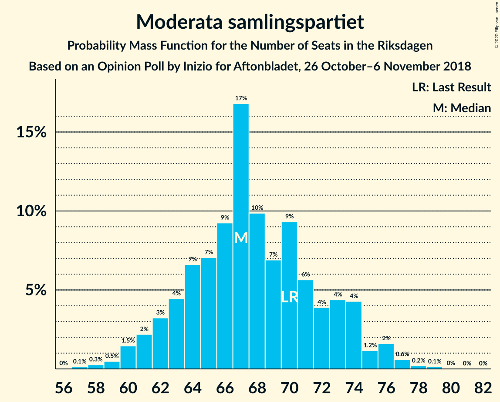
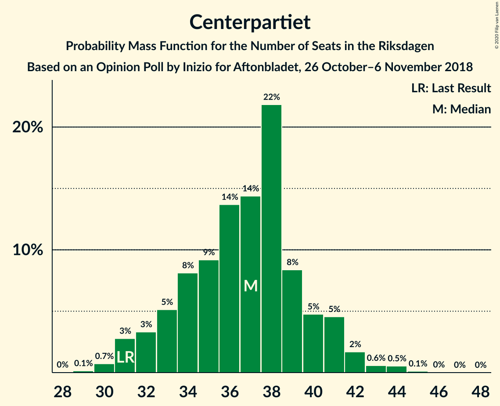
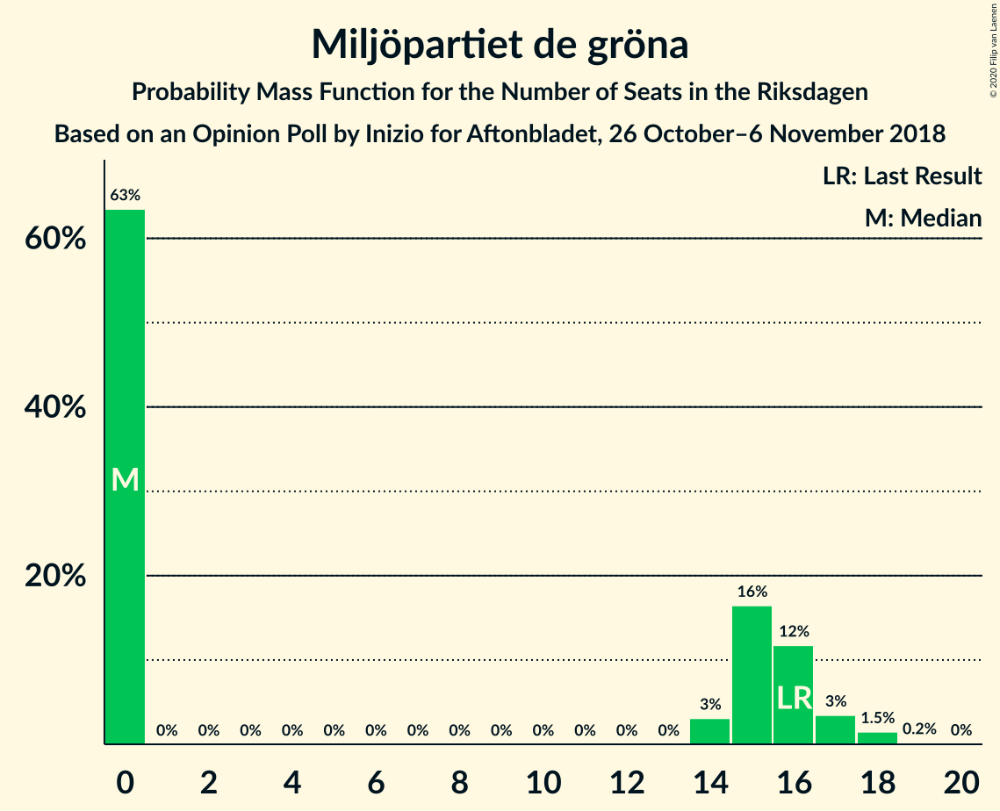

# Opinion Poll by Inizio for Aftonbladet, 26 October–6 November 2018

<a href="#voting-intentions">Voting Intentions</a> | <a href="#seats">Seats</a> | <a href="#coalitions">Coalitions</a> | <a href="#technical-information">Technical Information</a>

## Voting Intentions

### Confidence Intervals

| Party | Last Result | Poll Result | 80% Confidence Interval | 90% Confidence Interval | 95% Confidence Interval | 99% Confidence Interval |
|:-----:|:-----------:|:-----------:|:-----------------------:|:-----------------------:|:-----------------------:|:-----------------------:|
| Sveriges socialdemokratiska arbetareparti | 28.3% | 29.4% | 28.2–30.7% |27.9–31.1% |27.6–31.4% |27.0–32.0% |
| Sverigedemokraterna | 17.5% | 18.9% | 17.9–20.0% |17.6–20.4% |17.3–20.6% |16.8–21.2% |
| Moderata samlingspartiet | 19.8% | 18.2% | 17.2–19.3% |16.9–19.6% |16.6–19.9% |16.2–20.4% |
| Centerpartiet | 8.6% | 9.8% | 9.1–10.7% |8.8–10.9% |8.6–11.2% |8.3–11.6% |
| Vänsterpartiet | 8.0% | 7.8% | 7.1–8.6% |6.9–8.8% |6.8–9.0% |6.4–9.4% |
| Kristdemokraterna | 6.3% | 5.9% | 5.3–6.6% |5.1–6.8% |5.0–7.0% |4.7–7.3% |
| Liberalerna | 5.5% | 4.0% | 3.5–4.6% |3.4–4.8% |3.3–4.9% |3.0–5.2% |
| Miljöpartiet de gröna | 4.4% | 3.8% | 3.3–4.4% |3.2–4.5% |3.1–4.7% |2.9–5.0% |

*Note:* The poll result column reflects the actual value used in the calculations. Published results may vary slightly, and in addition be rounded to fewer digits.

## Seats

### Confidence Intervals

| Party | Last Result | Median | 80% Confidence Interval | 90% Confidence Interval | 95% Confidence Interval | 99% Confidence Interval |
|:-----:|:-----------:|:------:|:-----------------------:|:-----------------------:|:-----------------------:|:-----------------------:|
| <a href="#sveriges-socialdemokratiska-arbetareparti">Sveriges socialdemokratiska arbetareparti</a> | 100 | 108 | 102–116 |100–118 |99–120 |97–123 |
| <a href="#sverigedemokraterna">Sverigedemokraterna</a> | 62 | 69 | 66–76 |64–77 |63–78 |61–80 |
| <a href="#moderata-samlingspartiet">Moderata samlingspartiet</a> | 70 | 67 | 63–71 |62–73 |61–75 |59–77 |
| <a href="#centerpartiet">Centerpartiet</a> | 31 | 36 | 32–38 |31–39 |31–40 |30–43 |
| <a href="#vänsterpartiet">Vänsterpartiet</a> | 28 | 27 | 25–31 |24–33 |24–34 |23–36 |
| <a href="#kristdemokraterna">Kristdemokraterna</a> | 22 | 20 | 19–24 |19–25 |18–25 |18–27 |
| <a href="#liberalerna">Liberalerna</a> | 20 | 15 | 0–17 |0–17 |0–18 |0–20 |
| <a href="#miljöpartiet-de-gröna">Miljöpartiet de gröna</a> | 16 | 15 | 0–17 |0–17 |0–18 |0–18 |

### Sveriges socialdemokratiska arbetareparti

*For a full overview of the results for this party, see the [Sveriges socialdemokratiska arbetareparti](party-sverigessocialdemokratiskaarbetareparti.html) page.*

| Number of Seats | Probability | Accumulated | Special Marks |
|:---------------:|:-----------:|:-----------:|:-------------:|
| 94 | 0.1% | 100% |  |
| 95 | 0.2% | 99.9% |  |
| 96 | 0.1% | 99.7% |  |
| 97 | 0.7% | 99.6% |  |
| 98 | 0.8% | 98.9% |  |
| 99 | 2% | 98% |  |
| 100 | 2% | 97% | Last Result |
| 101 | 3% | 95% |  |
| 102 | 3% | 91% |  |
| 103 | 1.1% | 89% |  |
| 104 | 4% | 88% |  |
| 105 | 7% | 83% |  |
| 106 | 16% | 76% |  |
| 107 | 7% | 60% |  |
| 108 | 7% | 54% | Median |
| 109 | 7% | 47% |  |
| 110 | 7% | 40% |  |
| 111 | 4% | 33% |  |
| 112 | 6% | 29% |  |
| 113 | 7% | 23% |  |
| 114 | 3% | 15% |  |
| 115 | 1.2% | 12% |  |
| 116 | 3% | 11% |  |
| 117 | 2% | 8% |  |
| 118 | 2% | 6% |  |
| 119 | 1.0% | 5% |  |
| 120 | 2% | 3% |  |
| 121 | 0.4% | 2% |  |
| 122 | 0.2% | 1.3% |  |
| 123 | 0.8% | 1.1% |  |
| 124 | 0.1% | 0.3% |  |
| 125 | 0.1% | 0.2% |  |
| 126 | 0% | 0.1% |  |
| 127 | 0% | 0% |  |

### Sverigedemokraterna

*For a full overview of the results for this party, see the [Sverigedemokraterna](party-sverigedemokraterna.html) page.*

| Number of Seats | Probability | Accumulated | Special Marks |
|:---------------:|:-----------:|:-----------:|:-------------:|
| 59 | 0.1% | 100% |  |
| 60 | 0.2% | 99.9% |  |
| 61 | 0.5% | 99.8% |  |
| 62 | 0.8% | 99.3% | Last Result |
| 63 | 2% | 98.5% |  |
| 64 | 3% | 97% |  |
| 65 | 2% | 94% |  |
| 66 | 11% | 92% |  |
| 67 | 20% | 80% |  |
| 68 | 9% | 60% |  |
| 69 | 6% | 51% | Median |
| 70 | 5% | 45% |  |
| 71 | 12% | 40% |  |
| 72 | 4% | 28% |  |
| 73 | 3% | 24% |  |
| 74 | 6% | 21% |  |
| 75 | 5% | 15% |  |
| 76 | 4% | 10% |  |
| 77 | 3% | 6% |  |
| 78 | 2% | 4% |  |
| 79 | 1.4% | 2% |  |
| 80 | 0.4% | 0.6% |  |
| 81 | 0.2% | 0.3% |  |
| 82 | 0.1% | 0.1% |  |
| 83 | 0% | 0% |  |

### Moderata samlingspartiet

*For a full overview of the results for this party, see the [Moderata samlingspartiet](party-moderatasamlingspartiet.html) page.*

| Number of Seats | Probability | Accumulated | Special Marks |
|:---------------:|:-----------:|:-----------:|:-------------:|
| 57 | 0.1% | 100% |  |
| 58 | 0.2% | 99.8% |  |
| 59 | 0.6% | 99.6% |  |
| 60 | 0.9% | 99.0% |  |
| 61 | 2% | 98% |  |
| 62 | 5% | 96% |  |
| 63 | 5% | 90% |  |
| 64 | 6% | 85% |  |
| 65 | 8% | 80% |  |
| 66 | 20% | 72% |  |
| 67 | 8% | 52% | Median |
| 68 | 12% | 45% |  |
| 69 | 6% | 33% |  |
| 70 | 9% | 27% | Last Result |
| 71 | 8% | 17% |  |
| 72 | 3% | 10% |  |
| 73 | 3% | 7% |  |
| 74 | 0.6% | 4% |  |
| 75 | 2% | 3% |  |
| 76 | 0.6% | 1.2% |  |
| 77 | 0.5% | 0.6% |  |
| 78 | 0% | 0.1% |  |
| 79 | 0% | 0.1% |  |
| 80 | 0% | 0% |  |

### Centerpartiet

*For a full overview of the results for this party, see the [Centerpartiet](party-centerpartiet.html) page.*

| Number of Seats | Probability | Accumulated | Special Marks |
|:---------------:|:-----------:|:-----------:|:-------------:|
| 29 | 0.2% | 100% |  |
| 30 | 0.9% | 99.8% |  |
| 31 | 6% | 98.8% | Last Result |
| 32 | 6% | 93% |  |
| 33 | 6% | 87% |  |
| 34 | 10% | 81% |  |
| 35 | 12% | 71% |  |
| 36 | 12% | 59% | Median |
| 37 | 33% | 47% |  |
| 38 | 5% | 15% |  |
| 39 | 6% | 9% |  |
| 40 | 2% | 4% |  |
| 41 | 0.6% | 2% |  |
| 42 | 1.0% | 2% |  |
| 43 | 0.4% | 0.7% |  |
| 44 | 0.1% | 0.3% |  |
| 45 | 0.2% | 0.2% |  |
| 46 | 0% | 0% |  |

### Vänsterpartiet

*For a full overview of the results for this party, see the [Vänsterpartiet](party-vänsterpartiet.html) page.*

| Number of Seats | Probability | Accumulated | Special Marks |
|:---------------:|:-----------:|:-----------:|:-------------:|
| 22 | 0.1% | 100% |  |
| 23 | 2% | 99.9% |  |
| 24 | 4% | 98% |  |
| 25 | 21% | 93% |  |
| 26 | 10% | 72% |  |
| 27 | 20% | 62% | Median |
| 28 | 11% | 42% | Last Result |
| 29 | 9% | 30% |  |
| 30 | 8% | 21% |  |
| 31 | 4% | 13% |  |
| 32 | 3% | 9% |  |
| 33 | 4% | 6% |  |
| 34 | 1.5% | 3% |  |
| 35 | 0.4% | 1.1% |  |
| 36 | 0.3% | 0.8% |  |
| 37 | 0.3% | 0.4% |  |
| 38 | 0.1% | 0.1% |  |
| 39 | 0% | 0% |  |

### Kristdemokraterna

*For a full overview of the results for this party, see the [Kristdemokraterna](party-kristdemokraterna.html) page.*

| Number of Seats | Probability | Accumulated | Special Marks |
|:---------------:|:-----------:|:-----------:|:-------------:|
| 16 | 0.1% | 100% |  |
| 17 | 0.2% | 99.9% |  |
| 18 | 3% | 99.7% |  |
| 19 | 25% | 96% |  |
| 20 | 23% | 71% | Median |
| 21 | 15% | 48% |  |
| 22 | 5% | 33% | Last Result |
| 23 | 8% | 28% |  |
| 24 | 14% | 20% |  |
| 25 | 5% | 6% |  |
| 26 | 0.5% | 1.1% |  |
| 27 | 0.2% | 0.6% |  |
| 28 | 0.2% | 0.4% |  |
| 29 | 0.1% | 0.2% |  |
| 30 | 0% | 0% |  |

### Liberalerna

*For a full overview of the results for this party, see the [Liberalerna](party-liberalerna.html) page.*

| Number of Seats | Probability | Accumulated | Special Marks |
|:---------------:|:-----------:|:-----------:|:-------------:|
| 0 | 36% | 100% |  |
| 1 | 0% | 64% |  |
| 2 | 0% | 64% |  |
| 3 | 0% | 64% |  |
| 4 | 0% | 64% |  |
| 5 | 0% | 64% |  |
| 6 | 0% | 64% |  |
| 7 | 0% | 64% |  |
| 8 | 0% | 64% |  |
| 9 | 0% | 64% |  |
| 10 | 0% | 64% |  |
| 11 | 0% | 64% |  |
| 12 | 0% | 64% |  |
| 13 | 0% | 64% |  |
| 14 | 12% | 64% |  |
| 15 | 18% | 52% | Median |
| 16 | 13% | 34% |  |
| 17 | 16% | 21% |  |
| 18 | 3% | 5% |  |
| 19 | 1.2% | 2% |  |
| 20 | 0.5% | 0.5% | Last Result |
| 21 | 0% | 0.1% |  |
| 22 | 0% | 0% |  |

### Miljöpartiet de gröna

*For a full overview of the results for this party, see the [Miljöpartiet de gröna](party-miljöpartietdegröna.html) page.*

| Number of Seats | Probability | Accumulated | Special Marks |
|:---------------:|:-----------:|:-----------:|:-------------:|
| 0 | 42% | 100% |  |
| 1 | 0% | 58% |  |
| 2 | 0% | 58% |  |
| 3 | 0% | 58% |  |
| 4 | 0% | 58% |  |
| 5 | 0% | 58% |  |
| 6 | 0% | 58% |  |
| 7 | 0% | 58% |  |
| 8 | 0% | 58% |  |
| 9 | 0% | 58% |  |
| 10 | 0% | 58% |  |
| 11 | 0% | 58% |  |
| 12 | 0% | 58% |  |
| 13 | 0% | 58% |  |
| 14 | 2% | 58% |  |
| 15 | 27% | 56% | Median |
| 16 | 16% | 29% | Last Result |
| 17 | 9% | 12% |  |
| 18 | 3% | 3% |  |
| 19 | 0.4% | 0.4% |  |
| 20 | 0% | 0% |  |

## Coalitions

### Confidence Intervals

| Coalition | Last Result | Median | Majority? | 80% Confidence Interval | 90% Confidence Interval | 95% Confidence Interval | 99% Confidence Interval |
|:---------:|:-----------:|:------:|:---------:|:-----------------------:|:-----------------------:|:-----------------------:|:-----------------------:|
| Sveriges socialdemokratiska arbetareparti – Moderata samlingspartiet – Centerpartiet | 201 | 210 | 100% | 202–220 | 200–223 | 199–226 | 196–233 |
| Sveriges socialdemokratiska arbetareparti – Moderata samlingspartiet | 170 | 175 | 57% | 169–184 | 166–187 | 163–189 | 160–194 |
| Sverigedemokraterna – Moderata samlingspartiet – Kristdemokraterna | 154 | 158 | 0.3% | 151–165 | 150–167 | 148–170 | 144–173 |
| Sveriges socialdemokratiska arbetareparti – Vänsterpartiet – Miljöpartiet de gröna | 144 | 146 | 0% | 135–155 | 133–158 | 133–158 | 132–161 |
| Sveriges socialdemokratiska arbetareparti – Vänsterpartiet | 128 | 135 | 0% | 129–145 | 126–150 | 126–151 | 124–154 |
| Sverigedemokraterna – Moderata samlingspartiet | 132 | 136 | 0% | 130–144 | 128–145 | 127–146 | 125–150 |
| Moderata samlingspartiet – Centerpartiet – Kristdemokraterna – Liberalerna | 143 | 136 | 0% | 124–143 | 123–145 | 121–146 | 119–148 |
| Moderata samlingspartiet – Centerpartiet – Kristdemokraterna | 123 | 123 | 0% | 119–129 | 118–130 | 117–133 | 114–140 |
| Sveriges socialdemokratiska arbetareparti – Miljöpartiet de gröna | 116 | 119 | 0% | 108–127 | 107–128 | 106–129 | 102–132 |
| Moderata samlingspartiet – Centerpartiet – Liberalerna | 121 | 115 | 0% | 102–122 | 101–125 | 99–125 | 97–128 |
| Moderata samlingspartiet – Centerpartiet | 101 | 103 | 0% | 98–108 | 96–110 | 95–111 | 93–116 |

### Sveriges socialdemokratiska arbetareparti – Moderata samlingspartiet – Centerpartiet

| Number of Seats | Probability | Accumulated | Special Marks |
|:---------------:|:-----------:|:-----------:|:-------------:|
| 192 | 0.1% | 100% |  |
| 193 | 0.1% | 99.9% |  |
| 194 | 0.1% | 99.8% |  |
| 195 | 0.1% | 99.7% |  |
| 196 | 0.2% | 99.6% |  |
| 197 | 0.8% | 99.4% |  |
| 198 | 0.7% | 98.6% |  |
| 199 | 1.2% | 98% |  |
| 200 | 2% | 97% |  |
| 201 | 2% | 95% | Last Result |
| 202 | 4% | 93% |  |
| 203 | 2% | 89% |  |
| 204 | 1.0% | 87% |  |
| 205 | 5% | 86% |  |
| 206 | 3% | 81% |  |
| 207 | 4% | 77% |  |
| 208 | 4% | 74% |  |
| 209 | 15% | 69% |  |
| 210 | 5% | 55% |  |
| 211 | 2% | 50% | Median |
| 212 | 5% | 48% |  |
| 213 | 3% | 43% |  |
| 214 | 4% | 40% |  |
| 215 | 2% | 37% |  |
| 216 | 12% | 35% |  |
| 217 | 3% | 23% |  |
| 218 | 5% | 20% |  |
| 219 | 5% | 15% |  |
| 220 | 3% | 11% |  |
| 221 | 1.3% | 7% |  |
| 222 | 0.8% | 6% |  |
| 223 | 0.3% | 5% |  |
| 224 | 2% | 5% |  |
| 225 | 0.2% | 3% |  |
| 226 | 0.6% | 3% |  |
| 227 | 0.4% | 2% |  |
| 228 | 0.7% | 2% |  |
| 229 | 0% | 1.1% |  |
| 230 | 0.1% | 1.0% |  |
| 231 | 0.1% | 0.9% |  |
| 232 | 0.2% | 0.8% |  |
| 233 | 0.5% | 0.6% |  |
| 234 | 0% | 0.1% |  |
| 235 | 0.1% | 0.1% |  |
| 236 | 0% | 0% |  |

### Sveriges socialdemokratiska arbetareparti – Moderata samlingspartiet

| Number of Seats | Probability | Accumulated | Special Marks |
|:---------------:|:-----------:|:-----------:|:-------------:|
| 158 | 0.1% | 100% |  |
| 159 | 0% | 99.8% |  |
| 160 | 0.8% | 99.8% |  |
| 161 | 0.1% | 99.0% |  |
| 162 | 0.4% | 98.9% |  |
| 163 | 2% | 98% |  |
| 164 | 0.3% | 97% |  |
| 165 | 0.8% | 96% |  |
| 166 | 2% | 96% |  |
| 167 | 0.6% | 94% |  |
| 168 | 3% | 93% |  |
| 169 | 8% | 90% |  |
| 170 | 0.5% | 82% | Last Result |
| 171 | 6% | 81% |  |
| 172 | 15% | 75% |  |
| 173 | 1.1% | 60% |  |
| 174 | 2% | 59% |  |
| 175 | 9% | 57% | Median, Majority |
| 176 | 3% | 48% |  |
| 177 | 2% | 45% |  |
| 178 | 7% | 43% |  |
| 179 | 7% | 37% |  |
| 180 | 4% | 30% |  |
| 181 | 6% | 26% |  |
| 182 | 5% | 20% |  |
| 183 | 4% | 14% |  |
| 184 | 3% | 10% |  |
| 185 | 0.4% | 7% |  |
| 186 | 1.2% | 7% |  |
| 187 | 2% | 6% |  |
| 188 | 0.7% | 3% |  |
| 189 | 0.4% | 3% |  |
| 190 | 0.5% | 2% |  |
| 191 | 0.2% | 2% |  |
| 192 | 0.3% | 2% |  |
| 193 | 0.4% | 1.3% |  |
| 194 | 0.6% | 0.9% |  |
| 195 | 0.1% | 0.2% |  |
| 196 | 0% | 0.1% |  |
| 197 | 0.1% | 0.1% |  |
| 198 | 0% | 0% |  |

### Sverigedemokraterna – Moderata samlingspartiet – Kristdemokraterna

| Number of Seats | Probability | Accumulated | Special Marks |
|:---------------:|:-----------:|:-----------:|:-------------:|
| 140 | 0.1% | 100% |  |
| 141 | 0% | 99.9% |  |
| 142 | 0.1% | 99.9% |  |
| 143 | 0.1% | 99.9% |  |
| 144 | 0.5% | 99.8% |  |
| 145 | 0.1% | 99.3% |  |
| 146 | 0.6% | 99.2% |  |
| 147 | 0.7% | 98.6% |  |
| 148 | 0.7% | 98% |  |
| 149 | 2% | 97% |  |
| 150 | 4% | 95% |  |
| 151 | 1.3% | 91% |  |
| 152 | 13% | 90% |  |
| 153 | 3% | 77% |  |
| 154 | 4% | 73% | Last Result |
| 155 | 2% | 69% |  |
| 156 | 5% | 67% | Median |
| 157 | 9% | 62% |  |
| 158 | 9% | 53% |  |
| 159 | 5% | 44% |  |
| 160 | 6% | 40% |  |
| 161 | 5% | 34% |  |
| 162 | 8% | 29% |  |
| 163 | 6% | 20% |  |
| 164 | 2% | 15% |  |
| 165 | 4% | 12% |  |
| 166 | 2% | 8% |  |
| 167 | 2% | 6% |  |
| 168 | 1.2% | 4% |  |
| 169 | 0.5% | 3% |  |
| 170 | 0.6% | 3% |  |
| 171 | 0.3% | 2% |  |
| 172 | 1.0% | 2% |  |
| 173 | 0.3% | 0.7% |  |
| 174 | 0.1% | 0.4% |  |
| 175 | 0.2% | 0.3% | Majority |
| 176 | 0.1% | 0.1% |  |
| 177 | 0% | 0.1% |  |
| 178 | 0% | 0.1% |  |
| 179 | 0% | 0% |  |

### Sveriges socialdemokratiska arbetareparti – Vänsterpartiet – Miljöpartiet de gröna

| Number of Seats | Probability | Accumulated | Special Marks |
|:---------------:|:-----------:|:-----------:|:-------------:|
| 125 | 0% | 100% |  |
| 126 | 0% | 99.9% |  |
| 127 | 0% | 99.9% |  |
| 128 | 0.1% | 99.9% |  |
| 129 | 0% | 99.8% |  |
| 130 | 0.2% | 99.7% |  |
| 131 | 0.1% | 99.6% |  |
| 132 | 1.2% | 99.5% |  |
| 133 | 7% | 98% |  |
| 134 | 0.7% | 92% |  |
| 135 | 0.9% | 91% |  |
| 136 | 0.2% | 90% |  |
| 137 | 6% | 90% |  |
| 138 | 0.8% | 84% |  |
| 139 | 6% | 83% |  |
| 140 | 3% | 77% |  |
| 141 | 5% | 74% |  |
| 142 | 4% | 69% |  |
| 143 | 4% | 65% |  |
| 144 | 2% | 62% | Last Result |
| 145 | 4% | 59% |  |
| 146 | 16% | 55% |  |
| 147 | 5% | 39% |  |
| 148 | 0.9% | 34% |  |
| 149 | 2% | 33% |  |
| 150 | 7% | 31% | Median |
| 151 | 7% | 25% |  |
| 152 | 4% | 18% |  |
| 153 | 0.7% | 14% |  |
| 154 | 2% | 13% |  |
| 155 | 1.3% | 11% |  |
| 156 | 4% | 10% |  |
| 157 | 1.0% | 6% |  |
| 158 | 4% | 5% |  |
| 159 | 0% | 0.8% |  |
| 160 | 0.1% | 0.8% |  |
| 161 | 0.2% | 0.7% |  |
| 162 | 0.3% | 0.5% |  |
| 163 | 0% | 0.2% |  |
| 164 | 0.2% | 0.2% |  |
| 165 | 0% | 0% |  |

### Sveriges socialdemokratiska arbetareparti – Vänsterpartiet

| Number of Seats | Probability | Accumulated | Special Marks |
|:---------------:|:-----------:|:-----------:|:-------------:|
| 122 | 0% | 100% |  |
| 123 | 0.3% | 99.9% |  |
| 124 | 0.4% | 99.6% |  |
| 125 | 0.1% | 99.2% |  |
| 126 | 5% | 99.1% |  |
| 127 | 1.2% | 94% |  |
| 128 | 2% | 93% | Last Result |
| 129 | 2% | 90% |  |
| 130 | 0.3% | 88% |  |
| 131 | 19% | 88% |  |
| 132 | 3% | 69% |  |
| 133 | 12% | 67% |  |
| 134 | 3% | 55% |  |
| 135 | 3% | 52% | Median |
| 136 | 4% | 49% |  |
| 137 | 7% | 45% |  |
| 138 | 2% | 38% |  |
| 139 | 9% | 36% |  |
| 140 | 4% | 27% |  |
| 141 | 2% | 23% |  |
| 142 | 3% | 21% |  |
| 143 | 5% | 18% |  |
| 144 | 1.4% | 13% |  |
| 145 | 3% | 11% |  |
| 146 | 0.6% | 8% |  |
| 147 | 0.3% | 8% |  |
| 148 | 0.9% | 7% |  |
| 149 | 1.0% | 7% |  |
| 150 | 3% | 6% |  |
| 151 | 0.6% | 3% |  |
| 152 | 0.7% | 2% |  |
| 153 | 0.5% | 1.3% |  |
| 154 | 0.5% | 0.8% |  |
| 155 | 0.2% | 0.3% |  |
| 156 | 0.1% | 0.1% |  |
| 157 | 0% | 0% |  |

### Sverigedemokraterna – Moderata samlingspartiet

| Number of Seats | Probability | Accumulated | Special Marks |
|:---------------:|:-----------:|:-----------:|:-------------:|
| 120 | 0% | 100% |  |
| 121 | 0.1% | 99.9% |  |
| 122 | 0.1% | 99.8% |  |
| 123 | 0.3% | 99.8% |  |
| 124 | 0% | 99.5% |  |
| 125 | 0.9% | 99.5% |  |
| 126 | 0.9% | 98.6% |  |
| 127 | 0.9% | 98% |  |
| 128 | 3% | 97% |  |
| 129 | 0.5% | 94% |  |
| 130 | 6% | 94% |  |
| 131 | 2% | 88% |  |
| 132 | 2% | 86% | Last Result |
| 133 | 18% | 84% |  |
| 134 | 4% | 66% |  |
| 135 | 9% | 62% |  |
| 136 | 5% | 54% | Median |
| 137 | 2% | 49% |  |
| 138 | 9% | 47% |  |
| 139 | 3% | 39% |  |
| 140 | 5% | 35% |  |
| 141 | 8% | 30% |  |
| 142 | 6% | 22% |  |
| 143 | 5% | 16% |  |
| 144 | 3% | 11% |  |
| 145 | 2% | 7% |  |
| 146 | 3% | 5% |  |
| 147 | 0.4% | 2% |  |
| 148 | 0.7% | 2% |  |
| 149 | 0.6% | 1.2% |  |
| 150 | 0.2% | 0.5% |  |
| 151 | 0.2% | 0.4% |  |
| 152 | 0.1% | 0.2% |  |
| 153 | 0.1% | 0.1% |  |
| 154 | 0% | 0% |  |

### Moderata samlingspartiet – Centerpartiet – Kristdemokraterna – Liberalerna

| Number of Seats | Probability | Accumulated | Special Marks |
|:---------------:|:-----------:|:-----------:|:-------------:|
| 115 | 0.1% | 100% |  |
| 116 | 0.2% | 99.9% |  |
| 117 | 0% | 99.7% |  |
| 118 | 0.2% | 99.7% |  |
| 119 | 0.7% | 99.6% |  |
| 120 | 0.6% | 98.9% |  |
| 121 | 2% | 98% |  |
| 122 | 0.7% | 96% |  |
| 123 | 3% | 95% |  |
| 124 | 3% | 92% |  |
| 125 | 5% | 89% |  |
| 126 | 4% | 84% |  |
| 127 | 3% | 80% |  |
| 128 | 3% | 77% |  |
| 129 | 5% | 74% |  |
| 130 | 1.4% | 69% |  |
| 131 | 2% | 67% |  |
| 132 | 0.7% | 65% |  |
| 133 | 3% | 65% |  |
| 134 | 4% | 62% |  |
| 135 | 5% | 58% |  |
| 136 | 13% | 53% |  |
| 137 | 10% | 40% |  |
| 138 | 9% | 30% | Median |
| 139 | 2% | 21% |  |
| 140 | 3% | 19% |  |
| 141 | 2% | 17% |  |
| 142 | 1.5% | 15% |  |
| 143 | 4% | 13% | Last Result |
| 144 | 1.5% | 9% |  |
| 145 | 5% | 8% |  |
| 146 | 0.5% | 3% |  |
| 147 | 1.5% | 2% |  |
| 148 | 0.2% | 0.7% |  |
| 149 | 0.1% | 0.4% |  |
| 150 | 0.1% | 0.3% |  |
| 151 | 0.1% | 0.2% |  |
| 152 | 0% | 0.1% |  |
| 153 | 0% | 0% |  |

### Moderata samlingspartiet – Centerpartiet – Kristdemokraterna

| Number of Seats | Probability | Accumulated | Special Marks |
|:---------------:|:-----------:|:-----------:|:-------------:|
| 112 | 0.1% | 100% |  |
| 113 | 0.1% | 99.9% |  |
| 114 | 0.3% | 99.8% |  |
| 115 | 0.5% | 99.5% |  |
| 116 | 0.9% | 98.9% |  |
| 117 | 2% | 98% |  |
| 118 | 2% | 96% |  |
| 119 | 8% | 94% |  |
| 120 | 4% | 87% |  |
| 121 | 8% | 83% |  |
| 122 | 19% | 74% |  |
| 123 | 10% | 56% | Last Result, Median |
| 124 | 5% | 46% |  |
| 125 | 6% | 41% |  |
| 126 | 9% | 34% |  |
| 127 | 3% | 25% |  |
| 128 | 10% | 22% |  |
| 129 | 5% | 12% |  |
| 130 | 2% | 7% |  |
| 131 | 1.2% | 5% |  |
| 132 | 0.6% | 4% |  |
| 133 | 1.2% | 3% |  |
| 134 | 0.1% | 2% |  |
| 135 | 0.2% | 2% |  |
| 136 | 0.1% | 1.5% |  |
| 137 | 0.2% | 1.4% |  |
| 138 | 0.3% | 1.2% |  |
| 139 | 0.1% | 0.9% |  |
| 140 | 0.3% | 0.7% |  |
| 141 | 0.1% | 0.5% |  |
| 142 | 0.2% | 0.3% |  |
| 143 | 0% | 0.2% |  |
| 144 | 0.1% | 0.1% |  |
| 145 | 0% | 0% |  |

### Sveriges socialdemokratiska arbetareparti – Miljöpartiet de gröna

| Number of Seats | Probability | Accumulated | Special Marks |
|:---------------:|:-----------:|:-----------:|:-------------:|
| 99 | 0.1% | 100% |  |
| 100 | 0.1% | 99.9% |  |
| 101 | 0.2% | 99.8% |  |
| 102 | 0.2% | 99.6% |  |
| 103 | 0.2% | 99.4% |  |
| 104 | 0.3% | 99.3% |  |
| 105 | 1.3% | 98.9% |  |
| 106 | 2% | 98% |  |
| 107 | 1.3% | 96% |  |
| 108 | 6% | 94% |  |
| 109 | 3% | 89% |  |
| 110 | 5% | 86% |  |
| 111 | 3% | 80% |  |
| 112 | 4% | 78% |  |
| 113 | 5% | 74% |  |
| 114 | 3% | 69% |  |
| 115 | 2% | 66% |  |
| 116 | 7% | 64% | Last Result |
| 117 | 3% | 58% |  |
| 118 | 4% | 55% |  |
| 119 | 5% | 51% |  |
| 120 | 4% | 47% |  |
| 121 | 14% | 43% |  |
| 122 | 3% | 28% |  |
| 123 | 6% | 25% | Median |
| 124 | 4% | 20% |  |
| 125 | 4% | 16% |  |
| 126 | 1.5% | 12% |  |
| 127 | 2% | 11% |  |
| 128 | 4% | 9% |  |
| 129 | 3% | 5% |  |
| 130 | 0.4% | 2% |  |
| 131 | 0.4% | 2% |  |
| 132 | 1.2% | 1.5% |  |
| 133 | 0.1% | 0.3% |  |
| 134 | 0% | 0.2% |  |
| 135 | 0.2% | 0.2% |  |
| 136 | 0% | 0% |  |

### Moderata samlingspartiet – Centerpartiet – Liberalerna

| Number of Seats | Probability | Accumulated | Special Marks |
|:---------------:|:-----------:|:-----------:|:-------------:|
| 92 | 0.1% | 100% |  |
| 93 | 0% | 99.9% |  |
| 94 | 0.1% | 99.9% |  |
| 95 | 0.2% | 99.8% |  |
| 96 | 0% | 99.6% |  |
| 97 | 0.4% | 99.6% |  |
| 98 | 0.8% | 99.2% |  |
| 99 | 1.1% | 98% |  |
| 100 | 2% | 97% |  |
| 101 | 5% | 96% |  |
| 102 | 2% | 91% |  |
| 103 | 3% | 88% |  |
| 104 | 6% | 85% |  |
| 105 | 3% | 79% |  |
| 106 | 2% | 75% |  |
| 107 | 3% | 74% |  |
| 108 | 1.2% | 71% |  |
| 109 | 1.0% | 70% |  |
| 110 | 4% | 69% |  |
| 111 | 3% | 65% |  |
| 112 | 2% | 62% |  |
| 113 | 5% | 60% |  |
| 114 | 5% | 56% |  |
| 115 | 3% | 51% |  |
| 116 | 6% | 48% |  |
| 117 | 15% | 42% |  |
| 118 | 6% | 26% | Median |
| 119 | 4% | 21% |  |
| 120 | 1.3% | 16% |  |
| 121 | 1.1% | 15% | Last Result |
| 122 | 4% | 14% |  |
| 123 | 0.9% | 10% |  |
| 124 | 1.3% | 9% |  |
| 125 | 6% | 8% |  |
| 126 | 0.2% | 2% |  |
| 127 | 0.4% | 2% |  |
| 128 | 1.1% | 1.3% |  |
| 129 | 0.1% | 0.2% |  |
| 130 | 0.1% | 0.1% |  |
| 131 | 0% | 0% |  |

### Moderata samlingspartiet – Centerpartiet

| Number of Seats | Probability | Accumulated | Special Marks |
|:---------------:|:-----------:|:-----------:|:-------------:|
| 90 | 0.1% | 100% |  |
| 91 | 0.1% | 99.9% |  |
| 92 | 0.2% | 99.8% |  |
| 93 | 0.7% | 99.6% |  |
| 94 | 0.5% | 99.0% |  |
| 95 | 2% | 98% |  |
| 96 | 1.2% | 96% |  |
| 97 | 2% | 95% |  |
| 98 | 6% | 93% |  |
| 99 | 6% | 87% |  |
| 100 | 8% | 80% |  |
| 101 | 10% | 72% | Last Result |
| 102 | 5% | 62% |  |
| 103 | 18% | 57% | Median |
| 104 | 10% | 39% |  |
| 105 | 7% | 29% |  |
| 106 | 2% | 21% |  |
| 107 | 3% | 19% |  |
| 108 | 7% | 16% |  |
| 109 | 1.1% | 9% |  |
| 110 | 4% | 8% |  |
| 111 | 2% | 4% |  |
| 112 | 0.9% | 2% |  |
| 113 | 0.3% | 1.4% |  |
| 114 | 0.3% | 1.1% |  |
| 115 | 0.2% | 0.8% |  |
| 116 | 0.1% | 0.6% |  |
| 117 | 0.1% | 0.4% |  |
| 118 | 0.1% | 0.3% |  |
| 119 | 0.1% | 0.2% |  |
| 120 | 0.1% | 0.1% |  |
| 121 | 0% | 0% |  |

## Technical Information

### Opinion Poll

+ **Polling firm:** Inizio
+ **Commissioner(s):** Aftonbladet
+ **Fieldwork period:** 26 October–6 November 2018

### Calculations

+ **Sample size:** 2187
+ **Simulations done:** 131,072
+ **Error estimate:** 0.66%

