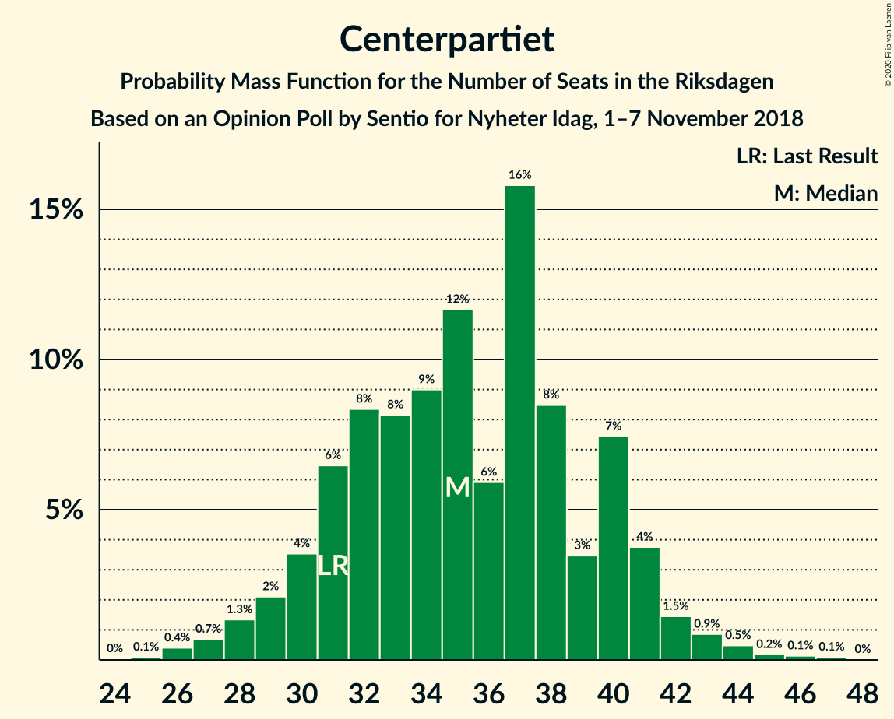

# Opinion Poll by Sentio for Nyheter Idag, 1–7 November 2018

<a href="#voting-intentions">Voting Intentions</a> | <a href="#seats">Seats</a> | <a href="#coalitions">Coalitions</a> | <a href="#technical-information">Technical Information</a>

## Voting Intentions

### Confidence Intervals

| Party | Last Result | Poll Result | 80% Confidence Interval | 90% Confidence Interval | 95% Confidence Interval | 99% Confidence Interval |
|:-----:|:-----------:|:-----------:|:-----------------------:|:-----------------------:|:-----------------------:|:-----------------------:|
| Sveriges socialdemokratiska arbetareparti | 28.3% | 28.2% | 26.5–30.1% |26.0–30.6% |25.5–31.1% |24.7–32.0% |
| Sverigedemokraterna | 17.5% | 20.3% | 18.7–22.0% |18.3–22.5% |17.9–22.9% |17.2–23.7% |
| Moderata samlingspartiet | 19.8% | 18.7% | 17.2–20.3% |16.8–20.8% |16.4–21.2% |15.7–22.0% |
| Centerpartiet | 8.6% | 9.3% | 8.3–10.6% |8.0–11.0% |7.7–11.3% |7.2–11.9% |
| Vänsterpartiet | 8.0% | 9.3% | 8.3–10.6% |8.0–11.0% |7.7–11.3% |7.2–11.9% |
| Kristdemokraterna | 6.3% | 5.4% | 4.6–6.4% |4.3–6.7% |4.1–7.0% |3.8–7.5% |
| Miljöpartiet de gröna | 4.4% | 3.8% | 3.1–4.7% |2.9–4.9% |2.8–5.2% |2.5–5.6% |
| Liberalerna | 5.5% | 3.3% | 2.7–4.1% |2.5–4.4% |2.3–4.6% |2.1–5.0% |

*Note:* The poll result column reflects the actual value used in the calculations. Published results may vary slightly, and in addition be rounded to fewer digits.

## Seats

### Confidence Intervals

| Party | Last Result | Median | 80% Confidence Interval | 90% Confidence Interval | 95% Confidence Interval | 99% Confidence Interval |
|:-----:|:-----------:|:------:|:-----------------------:|:-----------------------:|:-----------------------:|:-----------------------:|
| <a href="#sveriges-socialdemokratiska-arbetareparti">Sveriges socialdemokratiska arbetareparti</a> | 100 | 104 | 104–115 |100–118 |98–118 |92–118 |
| <a href="#sverigedemokraterna">Sverigedemokraterna</a> | 62 | 80 | 72–80 |70–80 |62–92 |62–100 |
| <a href="#moderata-samlingspartiet">Moderata samlingspartiet</a> | 70 | 66 | 58–75 |58–75 |58–75 |58–80 |
| <a href="#centerpartiet">Centerpartiet</a> | 31 | 32 | 32–39 |32–39 |32–39 |32–41 |
| <a href="#vänsterpartiet">Vänsterpartiet</a> | 28 | 28 | 28–39 |28–42 |28–42 |28–42 |
| <a href="#kristdemokraterna">Kristdemokraterna</a> | 22 | 19 | 0–20 |0–25 |0–25 |0–27 |
| <a href="#miljöpartiet-de-gröna">Miljöpartiet de gröna</a> | 16 | 20 | 0–20 |0–20 |0–20 |0–20 |
| <a href="#liberalerna">Liberalerna</a> | 20 | 0 | 0 |0 |0 |0–16 |

### Sveriges socialdemokratiska arbetareparti

*For a full overview of the results for this party, see the [Sveriges socialdemokratiska arbetareparti](party-sverigessocialdemokratiskaarbetareparti.html) page.*

| Number of Seats | Probability | Accumulated | Special Marks |
|:---------------:|:-----------:|:-----------:|:-------------:|
| 85 | 0.1% | 100% |  |
| 86 | 0.1% | 99.9% |  |
| 87 | 0% | 99.7% |  |
| 88 | 0% | 99.7% |  |
| 89 | 0% | 99.7% |  |
| 90 | 0% | 99.7% |  |
| 91 | 0% | 99.7% |  |
| 92 | 2% | 99.7% |  |
| 93 | 0.2% | 98% |  |
| 94 | 0% | 98% |  |
| 95 | 0% | 98% |  |
| 96 | 0.1% | 98% |  |
| 97 | 0% | 98% |  |
| 98 | 0.5% | 98% |  |
| 99 | 0.1% | 97% |  |
| 100 | 3% | 97% | Last Result |
| 101 | 4% | 94% |  |
| 102 | 0% | 90% |  |
| 103 | 0% | 90% |  |
| 104 | 67% | 90% | Median |
| 105 | 0% | 24% |  |
| 106 | 0% | 24% |  |
| 107 | 0% | 24% |  |
| 108 | 0% | 24% |  |
| 109 | 0% | 24% |  |
| 110 | 12% | 24% |  |
| 111 | 0.1% | 11% |  |
| 112 | 0.1% | 11% |  |
| 113 | 0% | 11% |  |
| 114 | 0% | 11% |  |
| 115 | 2% | 11% |  |
| 116 | 0% | 9% |  |
| 117 | 0% | 9% |  |
| 118 | 8% | 9% |  |
| 119 | 0% | 0.1% |  |
| 120 | 0.1% | 0.1% |  |
| 121 | 0% | 0% |  |

### Sverigedemokraterna

*For a full overview of the results for this party, see the [Sverigedemokraterna](party-sverigedemokraterna.html) page.*

| Number of Seats | Probability | Accumulated | Special Marks |
|:---------------:|:-----------:|:-----------:|:-------------:|
| 62 | 3% | 100% | Last Result |
| 63 | 0% | 97% |  |
| 64 | 0.1% | 97% |  |
| 65 | 0% | 97% |  |
| 66 | 0% | 97% |  |
| 67 | 0% | 97% |  |
| 68 | 0.1% | 97% |  |
| 69 | 0% | 97% |  |
| 70 | 2% | 97% |  |
| 71 | 0% | 95% |  |
| 72 | 8% | 95% |  |
| 73 | 0% | 86% |  |
| 74 | 0.3% | 86% |  |
| 75 | 13% | 86% |  |
| 76 | 0% | 74% |  |
| 77 | 2% | 74% |  |
| 78 | 0% | 71% |  |
| 79 | 0% | 71% |  |
| 80 | 67% | 71% | Median |
| 81 | 0% | 4% |  |
| 82 | 0% | 4% |  |
| 83 | 0.1% | 4% |  |
| 84 | 0% | 4% |  |
| 85 | 0% | 4% |  |
| 86 | 0% | 4% |  |
| 87 | 0% | 4% |  |
| 88 | 0% | 4% |  |
| 89 | 0% | 4% |  |
| 90 | 0% | 4% |  |
| 91 | 0% | 4% |  |
| 92 | 4% | 4% |  |
| 93 | 0% | 0.5% |  |
| 94 | 0% | 0.5% |  |
| 95 | 0% | 0.5% |  |
| 96 | 0% | 0.5% |  |
| 97 | 0% | 0.5% |  |
| 98 | 0% | 0.5% |  |
| 99 | 0% | 0.5% |  |
| 100 | 0.5% | 0.5% |  |
| 101 | 0% | 0% |  |

### Moderata samlingspartiet

*For a full overview of the results for this party, see the [Moderata samlingspartiet](party-moderatasamlingspartiet.html) page.*

| Number of Seats | Probability | Accumulated | Special Marks |
|:---------------:|:-----------:|:-----------:|:-------------:|
| 58 | 12% | 100% |  |
| 59 | 0% | 88% |  |
| 60 | 0% | 88% |  |
| 61 | 0% | 88% |  |
| 62 | 0% | 88% |  |
| 63 | 0% | 88% |  |
| 64 | 2% | 88% |  |
| 65 | 0% | 86% |  |
| 66 | 67% | 86% | Median |
| 67 | 0.1% | 20% |  |
| 68 | 0.1% | 20% |  |
| 69 | 2% | 19% |  |
| 70 | 0% | 17% | Last Result |
| 71 | 0.1% | 17% |  |
| 72 | 0% | 17% |  |
| 73 | 0% | 17% |  |
| 74 | 3% | 17% |  |
| 75 | 12% | 14% |  |
| 76 | 0% | 1.2% |  |
| 77 | 0% | 1.2% |  |
| 78 | 0% | 1.2% |  |
| 79 | 0.5% | 1.2% |  |
| 80 | 0.5% | 0.6% |  |
| 81 | 0% | 0.1% |  |
| 82 | 0% | 0.1% |  |
| 83 | 0% | 0.1% |  |
| 84 | 0% | 0.1% |  |
| 85 | 0.1% | 0.1% |  |
| 86 | 0% | 0% |  |

### Centerpartiet

*For a full overview of the results for this party, see the [Centerpartiet](party-centerpartiet.html) page.*

| Number of Seats | Probability | Accumulated | Special Marks |
|:---------------:|:-----------:|:-----------:|:-------------:|
| 21 | 0.1% | 100% |  |
| 22 | 0% | 99.9% |  |
| 23 | 0.2% | 99.9% |  |
| 24 | 0% | 99.7% |  |
| 25 | 0% | 99.7% |  |
| 26 | 0% | 99.7% |  |
| 27 | 0% | 99.7% |  |
| 28 | 0% | 99.7% |  |
| 29 | 0% | 99.7% |  |
| 30 | 0% | 99.7% |  |
| 31 | 0.1% | 99.7% | Last Result |
| 32 | 67% | 99.6% | Median |
| 33 | 0% | 33% |  |
| 34 | 15% | 33% |  |
| 35 | 0.5% | 18% |  |
| 36 | 0.3% | 18% |  |
| 37 | 3% | 17% |  |
| 38 | 4% | 14% |  |
| 39 | 8% | 10% |  |
| 40 | 0% | 2% |  |
| 41 | 2% | 2% |  |
| 42 | 0% | 0.3% |  |
| 43 | 0% | 0.3% |  |
| 44 | 0% | 0.3% |  |
| 45 | 0% | 0.3% |  |
| 46 | 0% | 0.3% |  |
| 47 | 0% | 0.3% |  |
| 48 | 0% | 0.3% |  |
| 49 | 0.2% | 0.3% |  |
| 50 | 0% | 0% |  |

### Vänsterpartiet

*For a full overview of the results for this party, see the [Vänsterpartiet](party-vänsterpartiet.html) page.*

| Number of Seats | Probability | Accumulated | Special Marks |
|:---------------:|:-----------:|:-----------:|:-------------:|
| 25 | 0.1% | 100% |  |
| 26 | 0% | 99.9% |  |
| 27 | 0% | 99.9% |  |
| 28 | 67% | 99.9% | Last Result, Median |
| 29 | 0.3% | 33% |  |
| 30 | 0.1% | 33% |  |
| 31 | 3% | 33% |  |
| 32 | 0% | 30% |  |
| 33 | 0% | 30% |  |
| 34 | 0% | 30% |  |
| 35 | 0% | 30% |  |
| 36 | 3% | 30% |  |
| 37 | 0.5% | 27% |  |
| 38 | 4% | 26% |  |
| 39 | 14% | 23% |  |
| 40 | 0% | 9% |  |
| 41 | 0% | 9% |  |
| 42 | 8% | 9% |  |
| 43 | 0% | 0.1% |  |
| 44 | 0% | 0.1% |  |
| 45 | 0.1% | 0.1% |  |
| 46 | 0% | 0% |  |

### Kristdemokraterna

*For a full overview of the results for this party, see the [Kristdemokraterna](party-kristdemokraterna.html) page.*

| Number of Seats | Probability | Accumulated | Special Marks |
|:---------------:|:-----------:|:-----------:|:-------------:|
| 0 | 13% | 100% |  |
| 1 | 0% | 87% |  |
| 2 | 0% | 87% |  |
| 3 | 0% | 87% |  |
| 4 | 0% | 87% |  |
| 5 | 0% | 87% |  |
| 6 | 0% | 87% |  |
| 7 | 0% | 87% |  |
| 8 | 0% | 87% |  |
| 9 | 0% | 87% |  |
| 10 | 0% | 87% |  |
| 11 | 0% | 87% |  |
| 12 | 0% | 87% |  |
| 13 | 0% | 87% |  |
| 14 | 0% | 87% |  |
| 15 | 0% | 87% |  |
| 16 | 0.1% | 87% |  |
| 17 | 0% | 87% |  |
| 18 | 3% | 87% |  |
| 19 | 67% | 84% | Median |
| 20 | 9% | 18% |  |
| 21 | 0.1% | 9% |  |
| 22 | 4% | 9% | Last Result |
| 23 | 0.1% | 5% |  |
| 24 | 0% | 5% |  |
| 25 | 3% | 5% |  |
| 26 | 0% | 2% |  |
| 27 | 2% | 2% |  |
| 28 | 0.1% | 0.1% |  |
| 29 | 0% | 0% |  |

### Miljöpartiet de gröna

*For a full overview of the results for this party, see the [Miljöpartiet de gröna](party-miljöpartietdegröna.html) page.*

| Number of Seats | Probability | Accumulated | Special Marks |
|:---------------:|:-----------:|:-----------:|:-------------:|
| 0 | 18% | 100% |  |
| 1 | 0% | 82% |  |
| 2 | 0% | 82% |  |
| 3 | 0% | 82% |  |
| 4 | 0% | 82% |  |
| 5 | 0% | 82% |  |
| 6 | 0% | 82% |  |
| 7 | 0% | 82% |  |
| 8 | 0% | 82% |  |
| 9 | 0% | 82% |  |
| 10 | 0% | 82% |  |
| 11 | 0% | 82% |  |
| 12 | 0% | 82% |  |
| 13 | 0% | 82% |  |
| 14 | 0% | 82% |  |
| 15 | 0% | 82% |  |
| 16 | 12% | 82% | Last Result |
| 17 | 0.1% | 70% |  |
| 18 | 0.1% | 70% |  |
| 19 | 0% | 70% |  |
| 20 | 70% | 70% | Median |
| 21 | 0% | 0% |  |

### Liberalerna

*For a full overview of the results for this party, see the [Liberalerna](party-liberalerna.html) page.*

| Number of Seats | Probability | Accumulated | Special Marks |
|:---------------:|:-----------:|:-----------:|:-------------:|
| 0 | 98% | 100% | Median |
| 1 | 0% | 2% |  |
| 2 | 0% | 2% |  |
| 3 | 0% | 2% |  |
| 4 | 0% | 2% |  |
| 5 | 0% | 2% |  |
| 6 | 0% | 2% |  |
| 7 | 0% | 2% |  |
| 8 | 0% | 2% |  |
| 9 | 0% | 2% |  |
| 10 | 0% | 2% |  |
| 11 | 0% | 2% |  |
| 12 | 0% | 2% |  |
| 13 | 0% | 2% |  |
| 14 | 0% | 2% |  |
| 15 | 0% | 2% |  |
| 16 | 2% | 2% |  |
| 17 | 0.2% | 0.4% |  |
| 18 | 0.1% | 0.2% |  |
| 19 | 0% | 0% |  |
| 20 | 0% | 0% | Last Result |

## Coalitions

### Confidence Intervals

| Coalition | Last Result | Median | Majority? | 80% Confidence Interval | 90% Confidence Interval | 95% Confidence Interval | 99% Confidence Interval |
|:---------:|:-----------:|:------:|:---------:|:-----------------------:|:-----------------------:|:-----------------------:|:-----------------------:|
| Sveriges socialdemokratiska arbetareparti – Moderata samlingspartiet – Centerpartiet | 201 | 202 | 100% | 202–219 | 197–219 | 197–219 | 197–219 |
| Sveriges socialdemokratiska arbetareparti – Moderata samlingspartiet | 170 | 170 | 24% | 170–185 | 159–185 | 159–185 | 156–185 |
| Sverigedemokraterna – Moderata samlingspartiet – Kristdemokraterna | 154 | 165 | 1.0% | 150–165 | 150–169 | 150–172 | 150–179 |
| Sveriges socialdemokratiska arbetareparti – Vänsterpartiet – Miljöpartiet de gröna | 144 | 152 | 0% | 151–165 | 139–165 | 135–165 | 122–165 |
| Sveriges socialdemokratiska arbetareparti – Vänsterpartiet | 128 | 132 | 0% | 132–151 | 131–160 | 131–160 | 122–160 |
| Sverigedemokraterna – Moderata samlingspartiet | 132 | 146 | 0.5% | 134–150 | 130–150 | 130–150 | 130–179 |
| Moderata samlingspartiet – Centerpartiet – Kristdemokraterna – Liberalerna | 143 | 117 | 0% | 109–118 | 109–136 | 109–136 | 109–148 |
| Moderata samlingspartiet – Centerpartiet – Kristdemokraterna | 123 | 117 | 0% | 109–118 | 109–132 | 109–136 | 109–136 |
| Sveriges socialdemokratiska arbetareparti – Miljöpartiet de gröna | 116 | 124 | 0% | 118–126 | 101–126 | 98–126 | 92–126 |
| Moderata samlingspartiet – Centerpartiet – Liberalerna | 121 | 98 | 0% | 97–109 | 97–111 | 96–114 | 96–129 |
| Moderata samlingspartiet – Centerpartiet | 101 | 98 | 0% | 97–109 | 97–109 | 96–111 | 96–116 |

### Sveriges socialdemokratiska arbetareparti – Moderata samlingspartiet – Centerpartiet

| Number of Seats | Probability | Accumulated | Special Marks |
|:---------------:|:-----------:|:-----------:|:-------------:|
| 184 | 0.1% | 100% |  |
| 185 | 0% | 99.9% |  |
| 186 | 0% | 99.9% |  |
| 187 | 0% | 99.9% |  |
| 188 | 0% | 99.9% |  |
| 189 | 0% | 99.9% |  |
| 190 | 0% | 99.9% |  |
| 191 | 0% | 99.9% |  |
| 192 | 0% | 99.9% |  |
| 193 | 0% | 99.9% |  |
| 194 | 0% | 99.9% |  |
| 195 | 0% | 99.9% |  |
| 196 | 0% | 99.9% |  |
| 197 | 5% | 99.9% |  |
| 198 | 0% | 95% |  |
| 199 | 0% | 94% |  |
| 200 | 0% | 94% |  |
| 201 | 0.1% | 94% | Last Result |
| 202 | 67% | 94% | Median |
| 203 | 0% | 28% |  |
| 204 | 0% | 28% |  |
| 205 | 0% | 28% |  |
| 206 | 0% | 28% |  |
| 207 | 0% | 28% |  |
| 208 | 0% | 28% |  |
| 209 | 0.1% | 28% |  |
| 210 | 0% | 27% |  |
| 211 | 3% | 27% |  |
| 212 | 0.6% | 24% |  |
| 213 | 0% | 24% |  |
| 214 | 0% | 24% |  |
| 215 | 8% | 24% |  |
| 216 | 0.1% | 15% |  |
| 217 | 0% | 15% |  |
| 218 | 2% | 15% |  |
| 219 | 12% | 13% |  |
| 220 | 0% | 0.4% |  |
| 221 | 0% | 0.4% |  |
| 222 | 0.3% | 0.4% |  |
| 223 | 0% | 0% |  |

### Sveriges socialdemokratiska arbetareparti – Moderata samlingspartiet

| Number of Seats | Probability | Accumulated | Special Marks |
|:---------------:|:-----------:|:-----------:|:-------------:|
| 156 | 2% | 100% |  |
| 157 | 0% | 98% |  |
| 158 | 0% | 98% |  |
| 159 | 4% | 98% |  |
| 160 | 0% | 95% |  |
| 161 | 0% | 95% |  |
| 162 | 0% | 95% |  |
| 163 | 0.1% | 95% |  |
| 164 | 0% | 94% |  |
| 165 | 0.1% | 94% |  |
| 166 | 0.1% | 94% |  |
| 167 | 0% | 94% |  |
| 168 | 0% | 94% |  |
| 169 | 0% | 94% |  |
| 170 | 67% | 94% | Last Result, Median |
| 171 | 0% | 28% |  |
| 172 | 0% | 28% |  |
| 173 | 0.2% | 28% |  |
| 174 | 3% | 27% |  |
| 175 | 0% | 24% | Majority |
| 176 | 8% | 24% |  |
| 177 | 0.5% | 16% |  |
| 178 | 0% | 15% |  |
| 179 | 0.1% | 15% |  |
| 180 | 0% | 15% |  |
| 181 | 0% | 15% |  |
| 182 | 0% | 15% |  |
| 183 | 0% | 15% |  |
| 184 | 2% | 15% |  |
| 185 | 12% | 13% |  |
| 186 | 0.1% | 0.2% |  |
| 187 | 0% | 0.1% |  |
| 188 | 0% | 0.1% |  |
| 189 | 0% | 0.1% |  |
| 190 | 0% | 0.1% |  |
| 191 | 0.1% | 0.1% |  |
| 192 | 0% | 0% |  |

### Sverigedemokraterna – Moderata samlingspartiet – Kristdemokraterna

| Number of Seats | Probability | Accumulated | Special Marks |
|:---------------:|:-----------:|:-----------:|:-------------:|
| 146 | 0% | 100% |  |
| 147 | 0% | 99.9% |  |
| 148 | 0% | 99.9% |  |
| 149 | 0% | 99.9% |  |
| 150 | 21% | 99.9% |  |
| 151 | 0.1% | 79% |  |
| 152 | 0% | 79% |  |
| 153 | 0% | 79% |  |
| 154 | 0% | 79% | Last Result |
| 155 | 0% | 79% |  |
| 156 | 0% | 79% |  |
| 157 | 0% | 79% |  |
| 158 | 0% | 79% |  |
| 159 | 0% | 79% |  |
| 160 | 0% | 79% |  |
| 161 | 5% | 79% |  |
| 162 | 0.1% | 74% |  |
| 163 | 0% | 74% |  |
| 164 | 2% | 74% |  |
| 165 | 67% | 72% | Median |
| 166 | 0% | 5% |  |
| 167 | 0% | 5% |  |
| 168 | 0% | 5% |  |
| 169 | 0.1% | 5% |  |
| 170 | 0% | 5% |  |
| 171 | 0% | 5% |  |
| 172 | 4% | 5% |  |
| 173 | 0% | 1.3% |  |
| 174 | 0.3% | 1.3% |  |
| 175 | 0% | 1.0% | Majority |
| 176 | 0.1% | 1.0% |  |
| 177 | 0% | 0.9% |  |
| 178 | 0.2% | 0.9% |  |
| 179 | 0.7% | 0.7% |  |
| 180 | 0% | 0% |  |

### Sveriges socialdemokratiska arbetareparti – Vänsterpartiet – Miljöpartiet de gröna

| Number of Seats | Probability | Accumulated | Special Marks |
|:---------------:|:-----------:|:-----------:|:-------------:|
| 121 | 0.1% | 100% |  |
| 122 | 0.4% | 99.9% |  |
| 123 | 0% | 99.5% |  |
| 124 | 0% | 99.5% |  |
| 125 | 0% | 99.5% |  |
| 126 | 0% | 99.5% |  |
| 127 | 0% | 99.5% |  |
| 128 | 0% | 99.5% |  |
| 129 | 0% | 99.5% |  |
| 130 | 0% | 99.5% |  |
| 131 | 2% | 99.5% |  |
| 132 | 0% | 98% |  |
| 133 | 0% | 98% |  |
| 134 | 0% | 98% |  |
| 135 | 0.5% | 98% |  |
| 136 | 0% | 97% |  |
| 137 | 0% | 97% |  |
| 138 | 0% | 97% |  |
| 139 | 4% | 97% |  |
| 140 | 0% | 94% |  |
| 141 | 0.1% | 94% |  |
| 142 | 0% | 93% |  |
| 143 | 0% | 93% |  |
| 144 | 0% | 93% | Last Result |
| 145 | 0% | 93% |  |
| 146 | 0% | 93% |  |
| 147 | 0.1% | 93% |  |
| 148 | 0% | 93% |  |
| 149 | 0% | 93% |  |
| 150 | 0.1% | 93% |  |
| 151 | 6% | 93% |  |
| 152 | 67% | 88% | Median |
| 153 | 0% | 21% |  |
| 154 | 0% | 21% |  |
| 155 | 0% | 21% |  |
| 156 | 0% | 21% |  |
| 157 | 0.1% | 21% |  |
| 158 | 0% | 21% |  |
| 159 | 0% | 21% |  |
| 160 | 8% | 21% |  |
| 161 | 0% | 12% |  |
| 162 | 0% | 12% |  |
| 163 | 0% | 12% |  |
| 164 | 0% | 12% |  |
| 165 | 12% | 12% |  |
| 166 | 0% | 0% |  |

### Sveriges socialdemokratiska arbetareparti – Vänsterpartiet

| Number of Seats | Probability | Accumulated | Special Marks |
|:---------------:|:-----------:|:-----------:|:-------------:|
| 121 | 0.1% | 100% |  |
| 122 | 0.4% | 99.9% |  |
| 123 | 0% | 99.5% |  |
| 124 | 0.1% | 99.5% |  |
| 125 | 0% | 99.4% |  |
| 126 | 0% | 99.4% |  |
| 127 | 0% | 99.4% |  |
| 128 | 0% | 99.4% | Last Result |
| 129 | 0% | 99.4% |  |
| 130 | 0% | 99.4% |  |
| 131 | 5% | 99.4% |  |
| 132 | 67% | 95% | Median |
| 133 | 0% | 28% |  |
| 134 | 0% | 28% |  |
| 135 | 0.5% | 28% |  |
| 136 | 0% | 27% |  |
| 137 | 0% | 27% |  |
| 138 | 0% | 27% |  |
| 139 | 4% | 27% |  |
| 140 | 0% | 24% |  |
| 141 | 0% | 24% |  |
| 142 | 0% | 24% |  |
| 143 | 0% | 24% |  |
| 144 | 0% | 24% |  |
| 145 | 0% | 24% |  |
| 146 | 0% | 24% |  |
| 147 | 0.1% | 24% |  |
| 148 | 0% | 23% |  |
| 149 | 12% | 23% |  |
| 150 | 0.1% | 11% |  |
| 151 | 2% | 11% |  |
| 152 | 0% | 9% |  |
| 153 | 0% | 9% |  |
| 154 | 0% | 9% |  |
| 155 | 0% | 9% |  |
| 156 | 0% | 9% |  |
| 157 | 0.1% | 9% |  |
| 158 | 0% | 8% |  |
| 159 | 0% | 8% |  |
| 160 | 8% | 8% |  |
| 161 | 0% | 0% |  |

### Sverigedemokraterna – Moderata samlingspartiet

| Number of Seats | Probability | Accumulated | Special Marks |
|:---------------:|:-----------:|:-----------:|:-------------:|
| 126 | 0% | 100% |  |
| 127 | 0% | 99.9% |  |
| 128 | 0% | 99.9% |  |
| 129 | 0% | 99.9% |  |
| 130 | 8% | 99.9% |  |
| 131 | 0% | 91% |  |
| 132 | 0% | 91% | Last Result |
| 133 | 0% | 91% |  |
| 134 | 2% | 91% |  |
| 135 | 0.1% | 90% |  |
| 136 | 3% | 90% |  |
| 137 | 0% | 87% |  |
| 138 | 0% | 87% |  |
| 139 | 0% | 87% |  |
| 140 | 0% | 87% |  |
| 141 | 0.1% | 87% |  |
| 142 | 0% | 86% |  |
| 143 | 0% | 86% |  |
| 144 | 0% | 86% |  |
| 145 | 0% | 86% |  |
| 146 | 69% | 86% | Median |
| 147 | 0% | 18% |  |
| 148 | 0% | 18% |  |
| 149 | 0.1% | 18% |  |
| 150 | 16% | 17% |  |
| 151 | 0.1% | 1.3% |  |
| 152 | 0% | 1.2% |  |
| 153 | 0.1% | 1.2% |  |
| 154 | 0.3% | 1.1% |  |
| 155 | 0% | 0.8% |  |
| 156 | 0% | 0.8% |  |
| 157 | 0% | 0.8% |  |
| 158 | 0% | 0.8% |  |
| 159 | 0% | 0.8% |  |
| 160 | 0.2% | 0.8% |  |
| 161 | 0% | 0.5% |  |
| 162 | 0% | 0.5% |  |
| 163 | 0% | 0.5% |  |
| 164 | 0% | 0.5% |  |
| 165 | 0% | 0.5% |  |
| 166 | 0% | 0.5% |  |
| 167 | 0% | 0.5% |  |
| 168 | 0% | 0.5% |  |
| 169 | 0% | 0.5% |  |
| 170 | 0% | 0.5% |  |
| 171 | 0% | 0.5% |  |
| 172 | 0% | 0.5% |  |
| 173 | 0% | 0.5% |  |
| 174 | 0% | 0.5% |  |
| 175 | 0% | 0.5% | Majority |
| 176 | 0% | 0.5% |  |
| 177 | 0% | 0.5% |  |
| 178 | 0% | 0.5% |  |
| 179 | 0.5% | 0.5% |  |
| 180 | 0% | 0% |  |

### Moderata samlingspartiet – Centerpartiet – Kristdemokraterna – Liberalerna

| Number of Seats | Probability | Accumulated | Special Marks |
|:---------------:|:-----------:|:-----------:|:-------------:|
| 109 | 12% | 100% |  |
| 110 | 0% | 88% |  |
| 111 | 0% | 88% |  |
| 112 | 0% | 88% |  |
| 113 | 0% | 88% |  |
| 114 | 0.5% | 88% |  |
| 115 | 0% | 87% |  |
| 116 | 0% | 87% |  |
| 117 | 75% | 87% | Median |
| 118 | 4% | 12% |  |
| 119 | 0.1% | 8% |  |
| 120 | 0% | 8% |  |
| 121 | 2% | 8% |  |
| 122 | 0% | 6% |  |
| 123 | 0% | 6% |  |
| 124 | 0% | 6% |  |
| 125 | 0.1% | 6% |  |
| 126 | 0% | 6% |  |
| 127 | 0% | 6% |  |
| 128 | 0% | 6% |  |
| 129 | 0% | 6% |  |
| 130 | 0% | 6% |  |
| 131 | 0% | 6% |  |
| 132 | 0% | 6% |  |
| 133 | 0% | 6% |  |
| 134 | 0% | 6% |  |
| 135 | 0.1% | 6% |  |
| 136 | 3% | 6% |  |
| 137 | 0% | 2% |  |
| 138 | 0% | 2% |  |
| 139 | 0% | 2% |  |
| 140 | 0.1% | 2% |  |
| 141 | 0% | 2% |  |
| 142 | 0% | 2% |  |
| 143 | 0% | 2% | Last Result |
| 144 | 0% | 2% |  |
| 145 | 0% | 2% |  |
| 146 | 0% | 2% |  |
| 147 | 0.2% | 2% |  |
| 148 | 2% | 2% |  |
| 149 | 0% | 0.3% |  |
| 150 | 0% | 0.3% |  |
| 151 | 0% | 0.3% |  |
| 152 | 0% | 0.3% |  |
| 153 | 0.1% | 0.3% |  |
| 154 | 0.1% | 0.1% |  |
| 155 | 0% | 0% |  |

### Moderata samlingspartiet – Centerpartiet – Kristdemokraterna

| Number of Seats | Probability | Accumulated | Special Marks |
|:---------------:|:-----------:|:-----------:|:-------------:|
| 109 | 13% | 100% |  |
| 110 | 0% | 87% |  |
| 111 | 0% | 87% |  |
| 112 | 0% | 87% |  |
| 113 | 0% | 87% |  |
| 114 | 0.5% | 87% |  |
| 115 | 0% | 87% |  |
| 116 | 0% | 87% |  |
| 117 | 75% | 87% | Median |
| 118 | 4% | 12% |  |
| 119 | 0.1% | 8% |  |
| 120 | 0% | 8% |  |
| 121 | 2% | 8% |  |
| 122 | 0% | 6% |  |
| 123 | 0% | 6% | Last Result |
| 124 | 0% | 6% |  |
| 125 | 0% | 6% |  |
| 126 | 0% | 6% |  |
| 127 | 0% | 6% |  |
| 128 | 0% | 6% |  |
| 129 | 0% | 6% |  |
| 130 | 0% | 6% |  |
| 131 | 0% | 6% |  |
| 132 | 2% | 6% |  |
| 133 | 0% | 4% |  |
| 134 | 0% | 4% |  |
| 135 | 0% | 4% |  |
| 136 | 3% | 4% |  |
| 137 | 0% | 0.4% |  |
| 138 | 0% | 0.4% |  |
| 139 | 0% | 0.4% |  |
| 140 | 0.1% | 0.4% |  |
| 141 | 0% | 0.3% |  |
| 142 | 0% | 0.3% |  |
| 143 | 0% | 0.3% |  |
| 144 | 0% | 0.3% |  |
| 145 | 0% | 0.3% |  |
| 146 | 0% | 0.3% |  |
| 147 | 0.2% | 0.2% |  |
| 148 | 0% | 0% |  |

### Sveriges socialdemokratiska arbetareparti – Miljöpartiet de gröna

| Number of Seats | Probability | Accumulated | Special Marks |
|:---------------:|:-----------:|:-----------:|:-------------:|
| 85 | 0.1% | 100% |  |
| 86 | 0.1% | 99.9% |  |
| 87 | 0% | 99.7% |  |
| 88 | 0% | 99.7% |  |
| 89 | 0% | 99.7% |  |
| 90 | 0% | 99.7% |  |
| 91 | 0% | 99.7% |  |
| 92 | 2% | 99.7% |  |
| 93 | 0.2% | 98% |  |
| 94 | 0% | 98% |  |
| 95 | 0% | 98% |  |
| 96 | 0% | 98% |  |
| 97 | 0% | 98% |  |
| 98 | 0.5% | 98% |  |
| 99 | 0% | 97% |  |
| 100 | 0% | 97% |  |
| 101 | 4% | 97% |  |
| 102 | 0% | 94% |  |
| 103 | 0% | 94% |  |
| 104 | 0% | 94% |  |
| 105 | 0% | 94% |  |
| 106 | 0% | 94% |  |
| 107 | 0% | 94% |  |
| 108 | 0% | 94% |  |
| 109 | 0% | 94% |  |
| 110 | 0% | 93% |  |
| 111 | 0.1% | 93% |  |
| 112 | 0.1% | 93% |  |
| 113 | 0% | 93% |  |
| 114 | 0.1% | 93% |  |
| 115 | 2% | 93% |  |
| 116 | 0.1% | 91% | Last Result |
| 117 | 0% | 91% |  |
| 118 | 8% | 91% |  |
| 119 | 0% | 82% |  |
| 120 | 3% | 82% |  |
| 121 | 0% | 79% |  |
| 122 | 0% | 79% |  |
| 123 | 0% | 79% |  |
| 124 | 67% | 79% | Median |
| 125 | 0% | 12% |  |
| 126 | 12% | 12% |  |
| 127 | 0% | 0% |  |

### Moderata samlingspartiet – Centerpartiet – Liberalerna

| Number of Seats | Probability | Accumulated | Special Marks |
|:---------------:|:-----------:|:-----------:|:-------------:|
| 91 | 0.1% | 100% |  |
| 92 | 0% | 99.9% |  |
| 93 | 0% | 99.9% |  |
| 94 | 0% | 99.9% |  |
| 95 | 0% | 99.9% |  |
| 96 | 4% | 99.9% |  |
| 97 | 9% | 96% |  |
| 98 | 67% | 88% | Median |
| 99 | 0% | 21% |  |
| 100 | 0% | 21% |  |
| 101 | 0% | 21% |  |
| 102 | 0% | 21% |  |
| 103 | 2% | 21% |  |
| 104 | 0.1% | 19% |  |
| 105 | 0% | 19% |  |
| 106 | 0% | 19% |  |
| 107 | 0% | 19% |  |
| 108 | 0% | 19% |  |
| 109 | 12% | 19% |  |
| 110 | 0% | 6% |  |
| 111 | 3% | 6% |  |
| 112 | 0% | 3% |  |
| 113 | 0% | 3% |  |
| 114 | 0.6% | 3% |  |
| 115 | 0% | 2% |  |
| 116 | 0% | 2% |  |
| 117 | 0.1% | 2% |  |
| 118 | 0% | 2% |  |
| 119 | 0.1% | 2% |  |
| 120 | 0% | 2% |  |
| 121 | 2% | 2% | Last Result |
| 122 | 0% | 0.5% |  |
| 123 | 0% | 0.5% |  |
| 124 | 0% | 0.5% |  |
| 125 | 0% | 0.5% |  |
| 126 | 0% | 0.5% |  |
| 127 | 0% | 0.5% |  |
| 128 | 0% | 0.5% |  |
| 129 | 0.3% | 0.5% |  |
| 130 | 0% | 0.3% |  |
| 131 | 0% | 0.3% |  |
| 132 | 0% | 0.3% |  |
| 133 | 0.1% | 0.3% |  |
| 134 | 0.1% | 0.1% |  |
| 135 | 0% | 0% |  |

### Moderata samlingspartiet – Centerpartiet

| Number of Seats | Probability | Accumulated | Special Marks |
|:---------------:|:-----------:|:-----------:|:-------------:|
| 88 | 0.1% | 100% |  |
| 89 | 0% | 99.9% |  |
| 90 | 0% | 99.9% |  |
| 91 | 0.1% | 99.9% |  |
| 92 | 0% | 99.8% |  |
| 93 | 0% | 99.8% |  |
| 94 | 0% | 99.7% |  |
| 95 | 0% | 99.7% |  |
| 96 | 4% | 99.7% |  |
| 97 | 9% | 96% |  |
| 98 | 67% | 88% | Median |
| 99 | 0% | 21% |  |
| 100 | 0% | 21% |  |
| 101 | 0% | 21% | Last Result |
| 102 | 0.1% | 21% |  |
| 103 | 2% | 21% |  |
| 104 | 0% | 19% |  |
| 105 | 2% | 19% |  |
| 106 | 0% | 17% |  |
| 107 | 0% | 17% |  |
| 108 | 0% | 17% |  |
| 109 | 12% | 17% |  |
| 110 | 0% | 4% |  |
| 111 | 3% | 4% |  |
| 112 | 0% | 1.2% |  |
| 113 | 0% | 1.2% |  |
| 114 | 0.6% | 1.2% |  |
| 115 | 0% | 0.6% |  |
| 116 | 0.3% | 0.6% |  |
| 117 | 0.1% | 0.4% |  |
| 118 | 0% | 0.3% |  |
| 119 | 0% | 0.3% |  |
| 120 | 0% | 0.3% |  |
| 121 | 0% | 0.3% |  |
| 122 | 0% | 0.3% |  |
| 123 | 0% | 0.3% |  |
| 124 | 0% | 0.3% |  |
| 125 | 0% | 0.3% |  |
| 126 | 0% | 0.3% |  |
| 127 | 0% | 0.3% |  |
| 128 | 0% | 0.3% |  |
| 129 | 0.3% | 0.3% |  |
| 130 | 0% | 0% |  |

## Technical Information

### Opinion Poll

+ **Polling firm:** Sentio
+ **Commissioner(s):** Nyheter Idag
+ **Fieldwork period:** 1–7 November 2018

### Calculations

+ **Sample size:** 1006
+ **Simulations done:** 1,024
+ **Error estimate:** 3.28%

