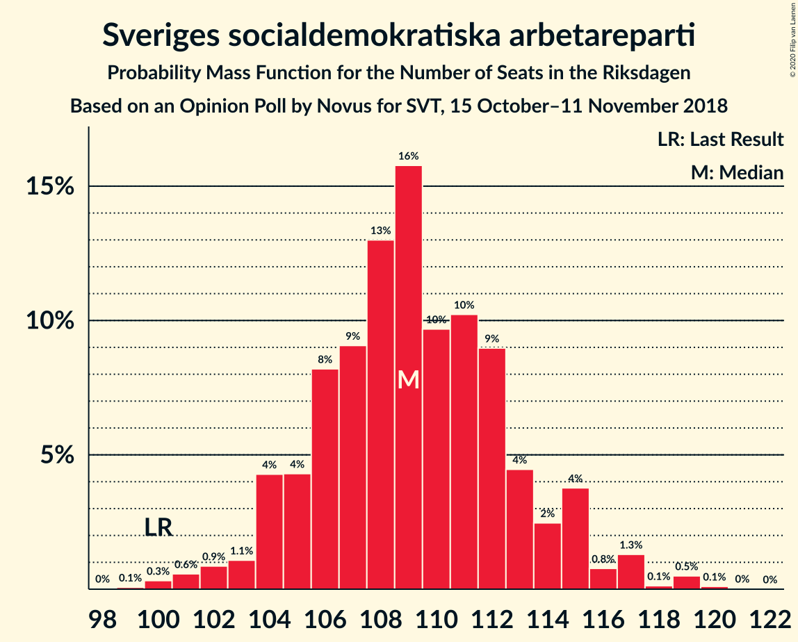
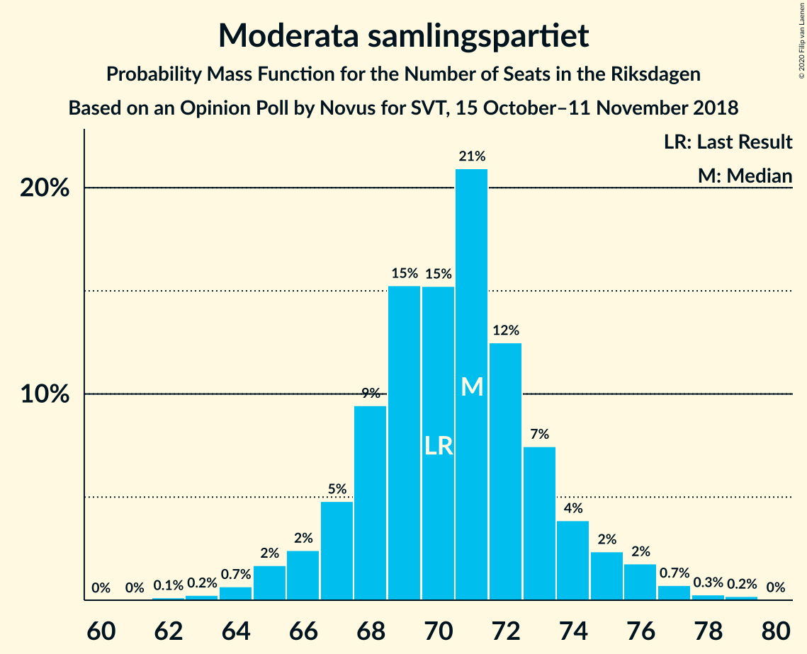
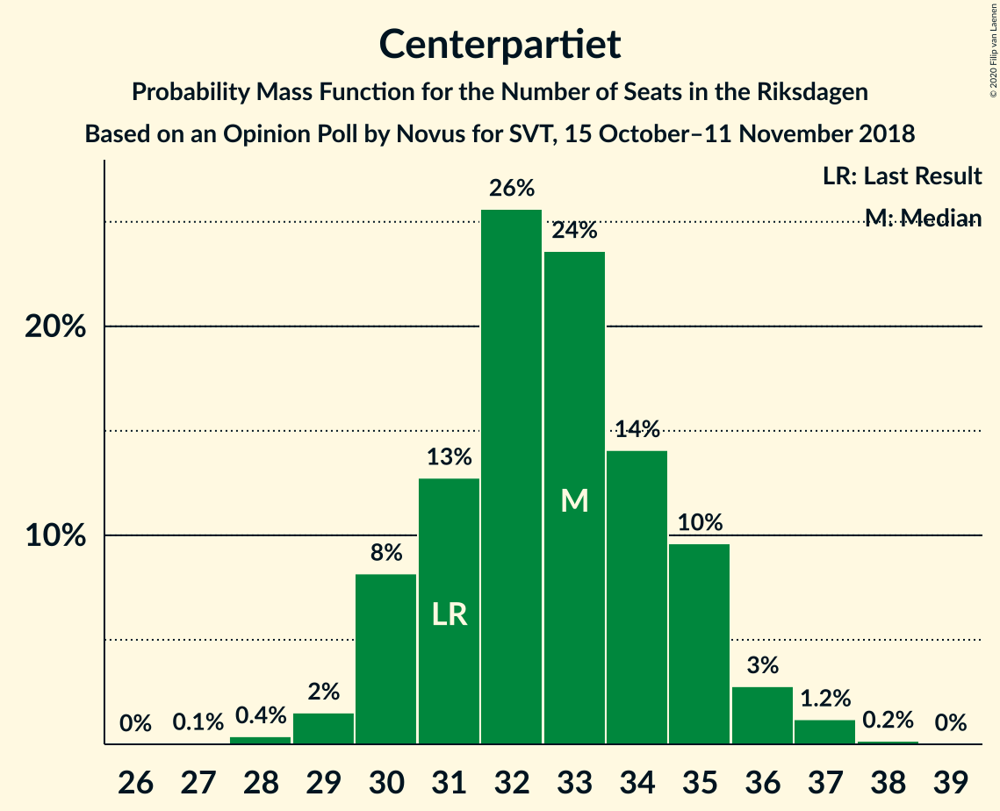

# Opinion Poll by Novus for SVT, 15 October–11 November 2018

<a href="#voting-intentions">Voting Intentions</a> | <a href="#seats">Seats</a> | <a href="#coalitions">Coalitions</a> | <a href="#technical-information">Technical Information</a>

## Voting Intentions

### Confidence Intervals

| Party | Last Result | Poll Result | 80% Confidence Interval | 90% Confidence Interval | 95% Confidence Interval | 99% Confidence Interval |
|:-----:|:-----------:|:-----------:|:-----------------------:|:-----------------------:|:-----------------------:|:-----------------------:|
| Sveriges socialdemokratiska arbetareparti | 28.3% | 29.8% | 29.0–30.7% |28.7–30.9% |28.5–31.1% |28.2–31.5% |
| Moderata samlingspartiet | 19.8% | 19.2% | 18.5–19.9% |18.3–20.1% |18.1–20.3% |17.8–20.7% |
| Sverigedemokraterna | 17.5% | 19.2% | 18.5–19.9% |18.3–20.1% |18.1–20.3% |17.8–20.7% |
| Centerpartiet | 8.6% | 8.9% | 8.4–9.4% |8.2–9.6% |8.1–9.7% |7.9–10.0% |
| Vänsterpartiet | 8.0% | 7.9% | 7.4–8.4% |7.3–8.6% |7.2–8.7% |7.0–8.9% |
| Kristdemokraterna | 6.3% | 5.9% | 5.5–6.4% |5.4–6.5% |5.3–6.6% |5.1–6.8% |
| Miljöpartiet de gröna | 4.4% | 4.3% | 3.9–4.7% |3.8–4.8% |3.8–4.9% |3.6–5.1% |
| Liberalerna | 5.5% | 3.7% | 3.4–4.1% |3.3–4.2% |3.2–4.3% |3.1–4.5% |

*Note:* The poll result column reflects the actual value used in the calculations. Published results may vary slightly, and in addition be rounded to fewer digits.

## Seats

### Confidence Intervals

| Party | Last Result | Median | 80% Confidence Interval | 90% Confidence Interval | 95% Confidence Interval | 99% Confidence Interval |
|:-----:|:-----------:|:------:|:-----------------------:|:-----------------------:|:-----------------------:|:-----------------------:|
| <a href="#sveriges-socialdemokratiska-arbetareparti">Sveriges socialdemokratiska arbetareparti</a> | 100 | 109 | 105–114 |104–115 |103–115 |102–119 |
| <a href="#moderata-samlingspartiet">Moderata samlingspartiet</a> | 70 | 71 | 67–74 |66–75 |65–75 |62–77 |
| <a href="#sverigedemokraterna">Sverigedemokraterna</a> | 62 | 72 | 68–74 |67–76 |66–76 |63–76 |
| <a href="#centerpartiet">Centerpartiet</a> | 31 | 32 | 31–35 |30–35 |30–36 |28–37 |
| <a href="#vänsterpartiet">Vänsterpartiet</a> | 28 | 29 | 27–31 |27–31 |27–32 |25–33 |
| <a href="#kristdemokraterna">Kristdemokraterna</a> | 22 | 21 | 20–23 |20–24 |19–24 |19–25 |
| <a href="#miljöpartiet-de-gröna">Miljöpartiet de gröna</a> | 16 | 15 | 0–17 |0–18 |0–18 |0–19 |
| <a href="#liberalerna">Liberalerna</a> | 20 | 0 | 0 |0–15 |0–15 |0–16 |

### Sveriges socialdemokratiska arbetareparti

*For a full overview of the results for this party, see the [Sveriges socialdemokratiska arbetareparti](party-sverigessocialdemokratiskaarbetareparti.html) page.*

| Number of Seats | Probability | Accumulated | Special Marks |
|:---------------:|:-----------:|:-----------:|:-------------:|
| 98 | 0.1% | 100% |  |
| 99 | 0.1% | 99.9% |  |
| 100 | 0.1% | 99.9% | Last Result |
| 101 | 0.1% | 99.8% |  |
| 102 | 1.5% | 99.7% |  |
| 103 | 0.9% | 98% |  |
| 104 | 3% | 97% |  |
| 105 | 6% | 94% |  |
| 106 | 12% | 88% |  |
| 107 | 11% | 76% |  |
| 108 | 9% | 66% |  |
| 109 | 13% | 57% | Median |
| 110 | 9% | 43% |  |
| 111 | 8% | 35% |  |
| 112 | 15% | 27% |  |
| 113 | 2% | 12% |  |
| 114 | 1.3% | 10% |  |
| 115 | 7% | 9% |  |
| 116 | 0.4% | 2% |  |
| 117 | 0.5% | 2% |  |
| 118 | 0% | 1.1% |  |
| 119 | 1.0% | 1.1% |  |
| 120 | 0% | 0.1% |  |
| 121 | 0% | 0% |  |

### Moderata samlingspartiet

*For a full overview of the results for this party, see the [Moderata samlingspartiet](party-moderatasamlingspartiet.html) page.*

| Number of Seats | Probability | Accumulated | Special Marks |
|:---------------:|:-----------:|:-----------:|:-------------:|
| 62 | 0.7% | 100% |  |
| 63 | 0.1% | 99.3% |  |
| 64 | 0.7% | 99.2% |  |
| 65 | 3% | 98.5% |  |
| 66 | 1.0% | 96% |  |
| 67 | 9% | 95% |  |
| 68 | 2% | 85% |  |
| 69 | 13% | 83% |  |
| 70 | 16% | 70% | Last Result |
| 71 | 25% | 54% | Median |
| 72 | 16% | 29% |  |
| 73 | 3% | 13% |  |
| 74 | 1.3% | 10% |  |
| 75 | 7% | 9% |  |
| 76 | 0.8% | 2% |  |
| 77 | 1.3% | 2% |  |
| 78 | 0.1% | 0.3% |  |
| 79 | 0% | 0.1% |  |
| 80 | 0.1% | 0.1% |  |
| 81 | 0% | 0% |  |

### Sverigedemokraterna

*For a full overview of the results for this party, see the [Sverigedemokraterna](party-sverigedemokraterna.html) page.*

| Number of Seats | Probability | Accumulated | Special Marks |
|:---------------:|:-----------:|:-----------:|:-------------:|
| 62 | 0.4% | 100% | Last Result |
| 63 | 0.2% | 99.6% |  |
| 64 | 0.3% | 99.5% |  |
| 65 | 0.9% | 99.1% |  |
| 66 | 1.1% | 98% |  |
| 67 | 2% | 97% |  |
| 68 | 8% | 95% |  |
| 69 | 15% | 87% |  |
| 70 | 14% | 72% |  |
| 71 | 7% | 59% |  |
| 72 | 20% | 51% | Median |
| 73 | 18% | 31% |  |
| 74 | 5% | 14% |  |
| 75 | 2% | 9% |  |
| 76 | 7% | 7% |  |
| 77 | 0.2% | 0.4% |  |
| 78 | 0.1% | 0.2% |  |
| 79 | 0.1% | 0.1% |  |
| 80 | 0% | 0% |  |

### Centerpartiet

*For a full overview of the results for this party, see the [Centerpartiet](party-centerpartiet.html) page.*

| Number of Seats | Probability | Accumulated | Special Marks |
|:---------------:|:-----------:|:-----------:|:-------------:|
| 27 | 0.1% | 100% |  |
| 28 | 0.6% | 99.9% |  |
| 29 | 1.0% | 99.3% |  |
| 30 | 3% | 98% |  |
| 31 | 13% | 95% | Last Result |
| 32 | 33% | 82% | Median |
| 33 | 17% | 49% |  |
| 34 | 14% | 32% |  |
| 35 | 16% | 18% |  |
| 36 | 2% | 3% |  |
| 37 | 0.8% | 0.8% |  |
| 38 | 0% | 0.1% |  |
| 39 | 0% | 0% |  |

### Vänsterpartiet

*For a full overview of the results for this party, see the [Vänsterpartiet](party-vänsterpartiet.html) page.*

| Number of Seats | Probability | Accumulated | Special Marks |
|:---------------:|:-----------:|:-----------:|:-------------:|
| 24 | 0.2% | 100% |  |
| 25 | 0.3% | 99.8% |  |
| 26 | 2% | 99.5% |  |
| 27 | 14% | 98% |  |
| 28 | 21% | 84% | Last Result |
| 29 | 39% | 63% | Median |
| 30 | 6% | 24% |  |
| 31 | 14% | 17% |  |
| 32 | 3% | 4% |  |
| 33 | 0.5% | 0.9% |  |
| 34 | 0.3% | 0.3% |  |
| 35 | 0% | 0% |  |

### Kristdemokraterna

*For a full overview of the results for this party, see the [Kristdemokraterna](party-kristdemokraterna.html) page.*

| Number of Seats | Probability | Accumulated | Special Marks |
|:---------------:|:-----------:|:-----------:|:-------------:|
| 18 | 0.4% | 100% |  |
| 19 | 2% | 99.6% |  |
| 20 | 20% | 97% |  |
| 21 | 38% | 77% | Median |
| 22 | 22% | 40% | Last Result |
| 23 | 11% | 18% |  |
| 24 | 6% | 7% |  |
| 25 | 0.5% | 0.6% |  |
| 26 | 0.1% | 0.1% |  |
| 27 | 0% | 0% |  |

### Miljöpartiet de gröna

*For a full overview of the results for this party, see the [Miljöpartiet de gröna](party-miljöpartietdegröna.html) page.*

| Number of Seats | Probability | Accumulated | Special Marks |
|:---------------:|:-----------:|:-----------:|:-------------:|
| 0 | 12% | 100% |  |
| 1 | 0% | 88% |  |
| 2 | 0% | 88% |  |
| 3 | 0% | 88% |  |
| 4 | 0% | 88% |  |
| 5 | 0% | 88% |  |
| 6 | 0% | 88% |  |
| 7 | 0% | 88% |  |
| 8 | 0% | 88% |  |
| 9 | 0% | 88% |  |
| 10 | 0% | 88% |  |
| 11 | 0% | 88% |  |
| 12 | 0% | 88% |  |
| 13 | 0% | 88% |  |
| 14 | 0.4% | 88% |  |
| 15 | 47% | 87% | Median |
| 16 | 28% | 41% | Last Result |
| 17 | 7% | 13% |  |
| 18 | 5% | 6% |  |
| 19 | 0.6% | 0.6% |  |
| 20 | 0% | 0% |  |

### Liberalerna

*For a full overview of the results for this party, see the [Liberalerna](party-liberalerna.html) page.*

| Number of Seats | Probability | Accumulated | Special Marks |
|:---------------:|:-----------:|:-----------:|:-------------:|
| 0 | 91% | 100% | Median |
| 1 | 0% | 9% |  |
| 2 | 0% | 9% |  |
| 3 | 0% | 9% |  |
| 4 | 0% | 9% |  |
| 5 | 0% | 9% |  |
| 6 | 0% | 9% |  |
| 7 | 0% | 9% |  |
| 8 | 0% | 9% |  |
| 9 | 0% | 9% |  |
| 10 | 0% | 9% |  |
| 11 | 0% | 9% |  |
| 12 | 0% | 9% |  |
| 13 | 0% | 9% |  |
| 14 | 4% | 9% |  |
| 15 | 4% | 5% |  |
| 16 | 2% | 2% |  |
| 17 | 0% | 0% |  |
| 18 | 0% | 0% |  |
| 19 | 0% | 0% |  |
| 20 | 0% | 0% | Last Result |

## Coalitions

### Confidence Intervals

| Coalition | Last Result | Median | Majority? | 80% Confidence Interval | 90% Confidence Interval | 95% Confidence Interval | 99% Confidence Interval |
|:---------:|:-----------:|:------:|:---------:|:-----------------------:|:-----------------------:|:-----------------------:|:-----------------------:|
| Sveriges socialdemokratiska arbetareparti – Moderata samlingspartiet – Centerpartiet | 201 | 212 | 100% | 207–220 | 204–222 | 202–222 | 199–225 |
| Sveriges socialdemokratiska arbetareparti – Moderata samlingspartiet | 170 | 179 | 91% | 175–187 | 173–190 | 170–190 | 169–191 |
| Moderata samlingspartiet – Sverigedemokraterna – Kristdemokraterna | 154 | 163 | 0.5% | 159–167 | 156–173 | 155–173 | 152–175 |
| Sveriges socialdemokratiska arbetareparti – Vänsterpartiet – Miljöpartiet de gröna | 144 | 153 | 0% | 144–157 | 144–159 | 141–159 | 138–160 |
| Moderata samlingspartiet – Sverigedemokraterna | 132 | 142 | 0% | 138–146 | 135–151 | 133–151 | 131–152 |
| Sveriges socialdemokratiska arbetareparti – Vänsterpartiet | 128 | 138 | 0% | 133–144 | 132–144 | 132–145 | 128–150 |
| Moderata samlingspartiet – Centerpartiet – Kristdemokraterna – Liberalerna | 143 | 125 | 0% | 122–131 | 121–134 | 118–137 | 118–141 |
| Moderata samlingspartiet – Centerpartiet – Kristdemokraterna | 123 | 125 | 0% | 120–129 | 118–129 | 118–130 | 114–136 |
| Sveriges socialdemokratiska arbetareparti – Miljöpartiet de gröna | 116 | 124 | 0% | 115–128 | 115–128 | 112–129 | 109–131 |
| Moderata samlingspartiet – Centerpartiet – Liberalerna | 121 | 104 | 0% | 101–109 | 99–112 | 98–116 | 98–118 |
| Moderata samlingspartiet – Centerpartiet | 101 | 104 | 0% | 99–107 | 98–107 | 97–109 | 93–112 |

### Sveriges socialdemokratiska arbetareparti – Moderata samlingspartiet – Centerpartiet

| Number of Seats | Probability | Accumulated | Special Marks |
|:---------------:|:-----------:|:-----------:|:-------------:|
| 197 | 0% | 100% |  |
| 198 | 0.3% | 99.9% |  |
| 199 | 0.1% | 99.6% |  |
| 200 | 0.9% | 99.5% |  |
| 201 | 0.4% | 98.6% | Last Result |
| 202 | 2% | 98% |  |
| 203 | 0.5% | 96% |  |
| 204 | 0.8% | 95% |  |
| 205 | 2% | 94% |  |
| 206 | 1.0% | 93% |  |
| 207 | 2% | 92% |  |
| 208 | 2% | 89% |  |
| 209 | 4% | 87% |  |
| 210 | 15% | 83% |  |
| 211 | 14% | 69% |  |
| 212 | 16% | 55% | Median |
| 213 | 6% | 39% |  |
| 214 | 5% | 33% |  |
| 215 | 8% | 27% |  |
| 216 | 0.8% | 19% |  |
| 217 | 8% | 19% |  |
| 218 | 0.5% | 11% |  |
| 219 | 0.2% | 10% |  |
| 220 | 0.4% | 10% |  |
| 221 | 0.4% | 10% |  |
| 222 | 7% | 9% |  |
| 223 | 1.1% | 2% |  |
| 224 | 0.3% | 1.2% |  |
| 225 | 0.5% | 0.9% |  |
| 226 | 0.1% | 0.4% |  |
| 227 | 0.1% | 0.2% |  |
| 228 | 0% | 0.1% |  |
| 229 | 0.1% | 0.1% |  |
| 230 | 0% | 0% |  |

### Sveriges socialdemokratiska arbetareparti – Moderata samlingspartiet

| Number of Seats | Probability | Accumulated | Special Marks |
|:---------------:|:-----------:|:-----------:|:-------------:|
| 165 | 0% | 100% |  |
| 166 | 0.1% | 99.9% |  |
| 167 | 0.1% | 99.9% |  |
| 168 | 0.1% | 99.8% |  |
| 169 | 1.0% | 99.7% |  |
| 170 | 3% | 98.7% | Last Result |
| 171 | 0.4% | 96% |  |
| 172 | 0.4% | 96% |  |
| 173 | 2% | 95% |  |
| 174 | 1.3% | 93% |  |
| 175 | 4% | 91% | Majority |
| 176 | 3% | 87% |  |
| 177 | 10% | 84% |  |
| 178 | 19% | 75% |  |
| 179 | 8% | 55% |  |
| 180 | 19% | 47% | Median |
| 181 | 0.9% | 28% |  |
| 182 | 6% | 27% |  |
| 183 | 8% | 21% |  |
| 184 | 0.4% | 12% |  |
| 185 | 1.3% | 12% |  |
| 186 | 0.4% | 11% |  |
| 187 | 1.4% | 10% |  |
| 188 | 0.8% | 9% |  |
| 189 | 0.1% | 8% |  |
| 190 | 6% | 8% |  |
| 191 | 1.0% | 1.5% |  |
| 192 | 0.3% | 0.4% |  |
| 193 | 0.1% | 0.1% |  |
| 194 | 0% | 0.1% |  |
| 195 | 0% | 0% |  |

### Moderata samlingspartiet – Sverigedemokraterna – Kristdemokraterna

| Number of Seats | Probability | Accumulated | Special Marks |
|:---------------:|:-----------:|:-----------:|:-------------:|
| 149 | 0% | 100% |  |
| 150 | 0.1% | 99.9% |  |
| 151 | 0.3% | 99.9% |  |
| 152 | 0.4% | 99.6% |  |
| 153 | 0.7% | 99.2% |  |
| 154 | 1.0% | 98.5% | Last Result |
| 155 | 0.5% | 98% |  |
| 156 | 4% | 97% |  |
| 157 | 0.2% | 93% |  |
| 158 | 3% | 93% |  |
| 159 | 6% | 91% |  |
| 160 | 17% | 84% |  |
| 161 | 12% | 67% |  |
| 162 | 0.8% | 55% |  |
| 163 | 7% | 54% |  |
| 164 | 18% | 48% | Median |
| 165 | 1.0% | 29% |  |
| 166 | 15% | 28% |  |
| 167 | 4% | 14% |  |
| 168 | 0.2% | 10% |  |
| 169 | 1.0% | 10% |  |
| 170 | 0.2% | 9% |  |
| 171 | 0.7% | 9% |  |
| 172 | 0.2% | 8% |  |
| 173 | 6% | 8% |  |
| 174 | 0.9% | 1.5% |  |
| 175 | 0.2% | 0.5% | Majority |
| 176 | 0.2% | 0.3% |  |
| 177 | 0% | 0.1% |  |
| 178 | 0.1% | 0.1% |  |
| 179 | 0% | 0% |  |

### Sveriges socialdemokratiska arbetareparti – Vänsterpartiet – Miljöpartiet de gröna

| Number of Seats | Probability | Accumulated | Special Marks |
|:---------------:|:-----------:|:-----------:|:-------------:|
| 136 | 0% | 100% |  |
| 137 | 0% | 99.9% |  |
| 138 | 0.4% | 99.9% |  |
| 139 | 0.4% | 99.5% |  |
| 140 | 1.3% | 99.1% |  |
| 141 | 0.3% | 98% |  |
| 142 | 0.2% | 97% |  |
| 143 | 1.1% | 97% |  |
| 144 | 6% | 96% | Last Result |
| 145 | 1.1% | 90% |  |
| 146 | 1.2% | 89% |  |
| 147 | 4% | 87% |  |
| 148 | 1.3% | 84% |  |
| 149 | 4% | 82% |  |
| 150 | 13% | 78% |  |
| 151 | 1.2% | 65% |  |
| 152 | 2% | 64% |  |
| 153 | 20% | 62% | Median |
| 154 | 20% | 42% |  |
| 155 | 10% | 22% |  |
| 156 | 0.4% | 12% |  |
| 157 | 4% | 11% |  |
| 158 | 2% | 7% |  |
| 159 | 5% | 5% |  |
| 160 | 0.5% | 0.6% |  |
| 161 | 0% | 0.1% |  |
| 162 | 0% | 0.1% |  |
| 163 | 0% | 0% |  |

### Moderata samlingspartiet – Sverigedemokraterna

| Number of Seats | Probability | Accumulated | Special Marks |
|:---------------:|:-----------:|:-----------:|:-------------:|
| 129 | 0% | 100% |  |
| 130 | 0.2% | 99.9% |  |
| 131 | 0.5% | 99.8% |  |
| 132 | 1.0% | 99.2% | Last Result |
| 133 | 0.8% | 98% |  |
| 134 | 0.3% | 97% |  |
| 135 | 3% | 97% |  |
| 136 | 2% | 94% |  |
| 137 | 2% | 92% |  |
| 138 | 9% | 91% |  |
| 139 | 18% | 82% |  |
| 140 | 11% | 64% |  |
| 141 | 3% | 53% |  |
| 142 | 6% | 50% |  |
| 143 | 16% | 44% | Median |
| 144 | 4% | 27% |  |
| 145 | 13% | 23% |  |
| 146 | 1.3% | 11% |  |
| 147 | 0.7% | 9% |  |
| 148 | 0.4% | 9% |  |
| 149 | 0.3% | 8% |  |
| 150 | 1.1% | 8% |  |
| 151 | 6% | 7% |  |
| 152 | 0.2% | 0.6% |  |
| 153 | 0.4% | 0.5% |  |
| 154 | 0% | 0.1% |  |
| 155 | 0.1% | 0.1% |  |
| 156 | 0% | 0% |  |

### Sveriges socialdemokratiska arbetareparti – Vänsterpartiet

| Number of Seats | Probability | Accumulated | Special Marks |
|:---------------:|:-----------:|:-----------:|:-------------:|
| 126 | 0% | 100% |  |
| 127 | 0.1% | 99.9% |  |
| 128 | 1.0% | 99.9% | Last Result |
| 129 | 0.1% | 98.9% |  |
| 130 | 0.5% | 98.8% |  |
| 131 | 0.7% | 98% |  |
| 132 | 6% | 98% |  |
| 133 | 3% | 92% |  |
| 134 | 0.9% | 89% |  |
| 135 | 15% | 88% |  |
| 136 | 2% | 73% |  |
| 137 | 7% | 70% |  |
| 138 | 24% | 63% | Median |
| 139 | 9% | 39% |  |
| 140 | 9% | 30% |  |
| 141 | 5% | 21% |  |
| 142 | 2% | 16% |  |
| 143 | 4% | 14% |  |
| 144 | 7% | 10% |  |
| 145 | 1.0% | 3% |  |
| 146 | 0.6% | 2% |  |
| 147 | 0.2% | 1.5% |  |
| 148 | 0.1% | 1.3% |  |
| 149 | 0% | 1.2% |  |
| 150 | 1.1% | 1.2% |  |
| 151 | 0.1% | 0.1% |  |
| 152 | 0% | 0% |  |

### Moderata samlingspartiet – Centerpartiet – Kristdemokraterna – Liberalerna

| Number of Seats | Probability | Accumulated | Special Marks |
|:---------------:|:-----------:|:-----------:|:-------------:|
| 116 | 0.1% | 100% |  |
| 117 | 0% | 99.9% |  |
| 118 | 3% | 99.9% |  |
| 119 | 0.4% | 96% |  |
| 120 | 0.6% | 96% |  |
| 121 | 2% | 95% |  |
| 122 | 8% | 94% |  |
| 123 | 4% | 85% |  |
| 124 | 17% | 81% | Median |
| 125 | 19% | 64% |  |
| 126 | 16% | 45% |  |
| 127 | 5% | 30% |  |
| 128 | 5% | 25% |  |
| 129 | 8% | 20% |  |
| 130 | 1.0% | 12% |  |
| 131 | 0.6% | 11% |  |
| 132 | 3% | 10% |  |
| 133 | 0.7% | 7% |  |
| 134 | 0.9% | 6% |  |
| 135 | 0.8% | 5% |  |
| 136 | 1.1% | 4% |  |
| 137 | 0.7% | 3% |  |
| 138 | 1.0% | 2% |  |
| 139 | 0.6% | 1.3% |  |
| 140 | 0.1% | 0.8% |  |
| 141 | 0.4% | 0.6% |  |
| 142 | 0.2% | 0.2% |  |
| 143 | 0% | 0% | Last Result |

### Moderata samlingspartiet – Centerpartiet – Kristdemokraterna

| Number of Seats | Probability | Accumulated | Special Marks |
|:---------------:|:-----------:|:-----------:|:-------------:|
| 113 | 0% | 100% |  |
| 114 | 0.7% | 99.9% |  |
| 115 | 0.1% | 99.3% |  |
| 116 | 0.6% | 99.2% |  |
| 117 | 0.3% | 98.6% |  |
| 118 | 7% | 98% |  |
| 119 | 0.8% | 92% |  |
| 120 | 1.1% | 91% |  |
| 121 | 2% | 90% |  |
| 122 | 9% | 88% |  |
| 123 | 5% | 79% | Last Result |
| 124 | 18% | 74% | Median |
| 125 | 20% | 56% |  |
| 126 | 16% | 37% |  |
| 127 | 5% | 21% |  |
| 128 | 5% | 16% |  |
| 129 | 8% | 12% |  |
| 130 | 0.9% | 3% |  |
| 131 | 0.4% | 2% |  |
| 132 | 0.2% | 2% |  |
| 133 | 0.4% | 2% |  |
| 134 | 0.3% | 2% |  |
| 135 | 0.2% | 1.2% |  |
| 136 | 0.9% | 0.9% |  |
| 137 | 0% | 0% |  |

### Sveriges socialdemokratiska arbetareparti – Miljöpartiet de gröna

| Number of Seats | Probability | Accumulated | Special Marks |
|:---------------:|:-----------:|:-----------:|:-------------:|
| 107 | 0% | 100% |  |
| 108 | 0.2% | 99.9% |  |
| 109 | 0.6% | 99.7% |  |
| 110 | 1.1% | 99.2% |  |
| 111 | 0.5% | 98% |  |
| 112 | 0.3% | 98% |  |
| 113 | 0.8% | 97% |  |
| 114 | 0.3% | 96% |  |
| 115 | 7% | 96% |  |
| 116 | 0.2% | 89% | Last Result |
| 117 | 2% | 89% |  |
| 118 | 0.9% | 87% |  |
| 119 | 2% | 87% |  |
| 120 | 3% | 85% |  |
| 121 | 16% | 82% |  |
| 122 | 1.3% | 66% |  |
| 123 | 12% | 65% |  |
| 124 | 13% | 52% | Median |
| 125 | 10% | 39% |  |
| 126 | 4% | 29% |  |
| 127 | 14% | 25% |  |
| 128 | 8% | 11% |  |
| 129 | 0.9% | 3% |  |
| 130 | 0.9% | 2% |  |
| 131 | 1.0% | 1.2% |  |
| 132 | 0.1% | 0.1% |  |
| 133 | 0% | 0.1% |  |
| 134 | 0% | 0% |  |

### Moderata samlingspartiet – Centerpartiet – Liberalerna

| Number of Seats | Probability | Accumulated | Special Marks |
|:---------------:|:-----------:|:-----------:|:-------------:|
| 96 | 0.1% | 100% |  |
| 97 | 0.1% | 99.8% |  |
| 98 | 4% | 99.7% |  |
| 99 | 1.3% | 96% |  |
| 100 | 3% | 94% |  |
| 101 | 7% | 91% |  |
| 102 | 10% | 85% |  |
| 103 | 15% | 75% | Median |
| 104 | 18% | 60% |  |
| 105 | 20% | 42% |  |
| 106 | 3% | 23% |  |
| 107 | 8% | 20% |  |
| 108 | 0.9% | 12% |  |
| 109 | 1.1% | 11% |  |
| 110 | 0.8% | 10% |  |
| 111 | 3% | 9% |  |
| 112 | 1.4% | 6% |  |
| 113 | 0.7% | 5% |  |
| 114 | 0.3% | 4% |  |
| 115 | 1.2% | 4% |  |
| 116 | 0.3% | 3% |  |
| 117 | 0.3% | 2% |  |
| 118 | 2% | 2% |  |
| 119 | 0.2% | 0.4% |  |
| 120 | 0.1% | 0.2% |  |
| 121 | 0.1% | 0.1% | Last Result |
| 122 | 0% | 0.1% |  |
| 123 | 0% | 0% |  |

### Moderata samlingspartiet – Centerpartiet

| Number of Seats | Probability | Accumulated | Special Marks |
|:---------------:|:-----------:|:-----------:|:-------------:|
| 93 | 0.7% | 100% |  |
| 94 | 0.1% | 99.3% |  |
| 95 | 0.5% | 99.3% |  |
| 96 | 0.7% | 98.8% |  |
| 97 | 3% | 98% |  |
| 98 | 4% | 95% |  |
| 99 | 2% | 91% |  |
| 100 | 4% | 89% |  |
| 101 | 7% | 85% | Last Result |
| 102 | 10% | 78% |  |
| 103 | 16% | 68% | Median |
| 104 | 18% | 52% |  |
| 105 | 20% | 34% |  |
| 106 | 3% | 14% |  |
| 107 | 7% | 11% |  |
| 108 | 0.9% | 4% |  |
| 109 | 0.7% | 3% |  |
| 110 | 0.6% | 2% |  |
| 111 | 0.3% | 1.5% |  |
| 112 | 0.9% | 1.2% |  |
| 113 | 0.1% | 0.3% |  |
| 114 | 0% | 0.2% |  |
| 115 | 0.1% | 0.1% |  |
| 116 | 0% | 0% |  |

## Technical Information

### Opinion Poll

+ **Polling firm:** Novus
+ **Commissioner(s):** SVT
+ **Fieldwork period:** 15 October–11 November 2018

### Calculations

+ **Sample size:** 5050
+ **Simulations done:** 131,072
+ **Error estimate:** 0.70%

