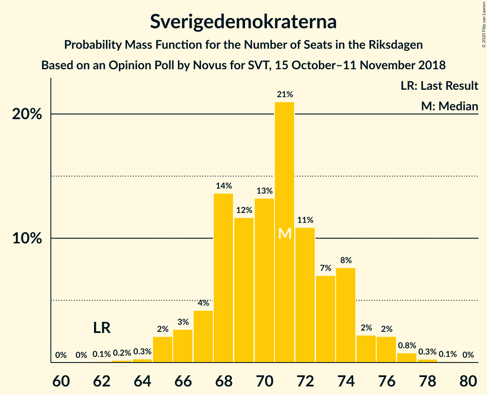
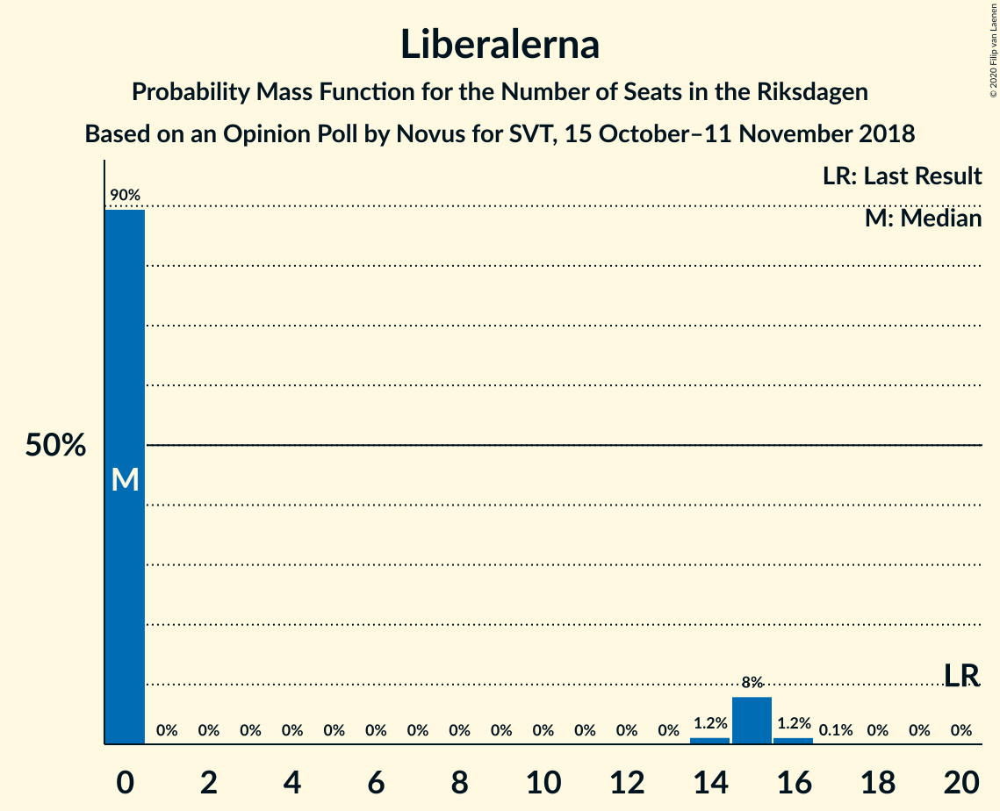

# Opinion Poll by Novus for SVT, 15 October–11 November 2018

<a href="#voting-intentions">Voting Intentions</a> | <a href="#seats">Seats</a> | <a href="#coalitions">Coalitions</a> | <a href="#technical-information">Technical Information</a>

## Voting Intentions

### Confidence Intervals

| Party | Last Result | Poll Result | 80% Confidence Interval | 90% Confidence Interval | 95% Confidence Interval | 99% Confidence Interval |
|:-----:|:-----------:|:-----------:|:-----------------------:|:-----------------------:|:-----------------------:|:-----------------------:|
| Sveriges socialdemokratiska arbetareparti | 28.3% | 29.8% | 29.0–30.7% |28.7–30.9% |28.5–31.1% |28.2–31.5% |
| Moderata samlingspartiet | 19.8% | 19.2% | 18.5–19.9% |18.3–20.1% |18.1–20.3% |17.8–20.7% |
| Sverigedemokraterna | 17.5% | 19.2% | 18.5–19.9% |18.3–20.1% |18.1–20.3% |17.8–20.7% |
| Centerpartiet | 8.6% | 8.9% | 8.4–9.4% |8.2–9.6% |8.1–9.7% |7.9–10.0% |
| Vänsterpartiet | 8.0% | 7.9% | 7.4–8.4% |7.3–8.6% |7.2–8.7% |7.0–8.9% |
| Kristdemokraterna | 6.3% | 5.9% | 5.5–6.4% |5.4–6.5% |5.3–6.6% |5.1–6.8% |
| Miljöpartiet de gröna | 4.4% | 4.3% | 3.9–4.7% |3.8–4.8% |3.8–4.9% |3.6–5.1% |
| Liberalerna | 5.5% | 3.7% | 3.4–4.1% |3.3–4.2% |3.2–4.3% |3.1–4.5% |

*Note:* The poll result column reflects the actual value used in the calculations. Published results may vary slightly, and in addition be rounded to fewer digits.

## Seats

### Confidence Intervals

| Party | Last Result | Median | 80% Confidence Interval | 90% Confidence Interval | 95% Confidence Interval | 99% Confidence Interval |
|:-----:|:-----------:|:------:|:-----------------------:|:-----------------------:|:-----------------------:|:-----------------------:|
| <a href="#sveriges-socialdemokratiska-arbetareparti">Sveriges socialdemokratiska arbetareparti</a> | 100 | 108 | 105–113 |104–115 |104–115 |102–119 |
| <a href="#moderata-samlingspartiet">Moderata samlingspartiet</a> | 70 | 70 | 67–73 |66–75 |65–75 |63–79 |
| <a href="#sverigedemokraterna">Sverigedemokraterna</a> | 62 | 70 | 68–74 |67–75 |66–76 |64–77 |
| <a href="#centerpartiet">Centerpartiet</a> | 31 | 32 | 31–35 |30–35 |30–36 |28–37 |
| <a href="#vänsterpartiet">Vänsterpartiet</a> | 28 | 29 | 27–31 |27–31 |26–32 |25–33 |
| <a href="#kristdemokraterna">Kristdemokraterna</a> | 22 | 22 | 20–23 |19–24 |19–24 |19–25 |
| <a href="#miljöpartiet-de-gröna">Miljöpartiet de gröna</a> | 16 | 15 | 15–17 |0–18 |0–18 |0–18 |
| <a href="#liberalerna">Liberalerna</a> | 20 | 0 | 0–14 |0–15 |0–15 |0–16 |

### Sveriges socialdemokratiska arbetareparti

*For a full overview of the results for this party, see the [Sveriges socialdemokratiska arbetareparti](party-sverigessocialdemokratiskaarbetareparti.html) page.*

| Number of Seats | Probability | Accumulated | Special Marks |
|:---------------:|:-----------:|:-----------:|:-------------:|
| 99 | 0% | 100% |  |
| 100 | 0.1% | 99.9% | Last Result |
| 101 | 0.2% | 99.8% |  |
| 102 | 0.9% | 99.6% |  |
| 103 | 0.9% | 98.8% |  |
| 104 | 6% | 98% |  |
| 105 | 3% | 92% |  |
| 106 | 9% | 89% |  |
| 107 | 9% | 80% |  |
| 108 | 21% | 71% | Median |
| 109 | 16% | 50% |  |
| 110 | 6% | 34% |  |
| 111 | 6% | 28% |  |
| 112 | 11% | 22% |  |
| 113 | 2% | 10% |  |
| 114 | 3% | 9% |  |
| 115 | 4% | 5% |  |
| 116 | 0.5% | 1.4% |  |
| 117 | 0.3% | 1.0% |  |
| 118 | 0% | 0.6% |  |
| 119 | 0.5% | 0.6% |  |
| 120 | 0.1% | 0.1% |  |
| 121 | 0% | 0% |  |

### Moderata samlingspartiet

*For a full overview of the results for this party, see the [Moderata samlingspartiet](party-moderatasamlingspartiet.html) page.*

| Number of Seats | Probability | Accumulated | Special Marks |
|:---------------:|:-----------:|:-----------:|:-------------:|
| 62 | 0.3% | 100% |  |
| 63 | 0.2% | 99.7% |  |
| 64 | 1.2% | 99.5% |  |
| 65 | 2% | 98% |  |
| 66 | 2% | 96% |  |
| 67 | 5% | 95% |  |
| 68 | 10% | 89% |  |
| 69 | 13% | 79% |  |
| 70 | 17% | 66% | Last Result, Median |
| 71 | 26% | 50% |  |
| 72 | 9% | 23% |  |
| 73 | 5% | 14% |  |
| 74 | 3% | 9% |  |
| 75 | 3% | 6% |  |
| 76 | 0.5% | 2% |  |
| 77 | 1.1% | 2% |  |
| 78 | 0.1% | 0.8% |  |
| 79 | 0.6% | 0.6% |  |
| 80 | 0.1% | 0.1% |  |
| 81 | 0% | 0% |  |

### Sverigedemokraterna

*For a full overview of the results for this party, see the [Sverigedemokraterna](party-sverigedemokraterna.html) page.*

| Number of Seats | Probability | Accumulated | Special Marks |
|:---------------:|:-----------:|:-----------:|:-------------:|
| 62 | 0.2% | 100% | Last Result |
| 63 | 0.1% | 99.8% |  |
| 64 | 0.3% | 99.7% |  |
| 65 | 1.0% | 99.4% |  |
| 66 | 1.4% | 98% |  |
| 67 | 5% | 97% |  |
| 68 | 12% | 92% |  |
| 69 | 12% | 80% |  |
| 70 | 23% | 68% | Median |
| 71 | 12% | 45% |  |
| 72 | 11% | 33% |  |
| 73 | 9% | 22% |  |
| 74 | 8% | 13% |  |
| 75 | 1.3% | 5% |  |
| 76 | 3% | 4% |  |
| 77 | 0.3% | 0.5% |  |
| 78 | 0.2% | 0.3% |  |
| 79 | 0% | 0.1% |  |
| 80 | 0% | 0% |  |

### Centerpartiet

*For a full overview of the results for this party, see the [Centerpartiet](party-centerpartiet.html) page.*

| Number of Seats | Probability | Accumulated | Special Marks |
|:---------------:|:-----------:|:-----------:|:-------------:|
| 27 | 0.1% | 100% |  |
| 28 | 0.5% | 99.9% |  |
| 29 | 0.9% | 99.4% |  |
| 30 | 4% | 98% |  |
| 31 | 17% | 95% | Last Result |
| 32 | 43% | 78% | Median |
| 33 | 14% | 35% |  |
| 34 | 9% | 21% |  |
| 35 | 9% | 13% |  |
| 36 | 3% | 4% |  |
| 37 | 0.8% | 1.0% |  |
| 38 | 0.2% | 0.2% |  |
| 39 | 0% | 0% |  |

### Vänsterpartiet

*For a full overview of the results for this party, see the [Vänsterpartiet](party-vänsterpartiet.html) page.*

| Number of Seats | Probability | Accumulated | Special Marks |
|:---------------:|:-----------:|:-----------:|:-------------:|
| 24 | 0.3% | 100% |  |
| 25 | 0.3% | 99.7% |  |
| 26 | 3% | 99.4% |  |
| 27 | 17% | 96% |  |
| 28 | 17% | 80% | Last Result |
| 29 | 21% | 62% | Median |
| 30 | 16% | 41% |  |
| 31 | 22% | 25% |  |
| 32 | 2% | 3% |  |
| 33 | 0.9% | 1.2% |  |
| 34 | 0.2% | 0.3% |  |
| 35 | 0% | 0% |  |

### Kristdemokraterna

*For a full overview of the results for this party, see the [Kristdemokraterna](party-kristdemokraterna.html) page.*

| Number of Seats | Probability | Accumulated | Special Marks |
|:---------------:|:-----------:|:-----------:|:-------------:|
| 18 | 0.3% | 100% |  |
| 19 | 7% | 99.7% |  |
| 20 | 11% | 92% |  |
| 21 | 27% | 82% |  |
| 22 | 34% | 55% | Last Result, Median |
| 23 | 13% | 21% |  |
| 24 | 6% | 7% |  |
| 25 | 1.1% | 1.4% |  |
| 26 | 0.3% | 0.3% |  |
| 27 | 0% | 0% |  |

### Miljöpartiet de gröna

*For a full overview of the results for this party, see the [Miljöpartiet de gröna](party-miljöpartietdegröna.html) page.*

| Number of Seats | Probability | Accumulated | Special Marks |
|:---------------:|:-----------:|:-----------:|:-------------:|
| 0 | 8% | 100% |  |
| 1 | 0% | 92% |  |
| 2 | 0% | 92% |  |
| 3 | 0% | 92% |  |
| 4 | 0% | 92% |  |
| 5 | 0% | 92% |  |
| 6 | 0% | 92% |  |
| 7 | 0% | 92% |  |
| 8 | 0% | 92% |  |
| 9 | 0% | 92% |  |
| 10 | 0% | 92% |  |
| 11 | 0% | 92% |  |
| 12 | 0% | 92% |  |
| 13 | 0% | 92% |  |
| 14 | 0.4% | 92% |  |
| 15 | 56% | 91% | Median |
| 16 | 19% | 35% | Last Result |
| 17 | 8% | 16% |  |
| 18 | 7% | 8% |  |
| 19 | 0.4% | 0.4% |  |
| 20 | 0% | 0% |  |

### Liberalerna

*For a full overview of the results for this party, see the [Liberalerna](party-liberalerna.html) page.*

| Number of Seats | Probability | Accumulated | Special Marks |
|:---------------:|:-----------:|:-----------:|:-------------:|
| 0 | 88% | 100% | Median |
| 1 | 0% | 12% |  |
| 2 | 0% | 12% |  |
| 3 | 0% | 12% |  |
| 4 | 0% | 12% |  |
| 5 | 0% | 12% |  |
| 6 | 0% | 12% |  |
| 7 | 0% | 12% |  |
| 8 | 0% | 12% |  |
| 9 | 0% | 12% |  |
| 10 | 0% | 12% |  |
| 11 | 0% | 12% |  |
| 12 | 0% | 12% |  |
| 13 | 0% | 12% |  |
| 14 | 3% | 12% |  |
| 15 | 8% | 9% |  |
| 16 | 1.1% | 1.2% |  |
| 17 | 0% | 0% |  |
| 18 | 0% | 0% |  |
| 19 | 0% | 0% |  |
| 20 | 0% | 0% | Last Result |

## Coalitions

### Confidence Intervals

| Coalition | Last Result | Median | Majority? | 80% Confidence Interval | 90% Confidence Interval | 95% Confidence Interval | 99% Confidence Interval |
|:---------:|:-----------:|:------:|:---------:|:-----------------------:|:-----------------------:|:-----------------------:|:-----------------------:|
| Sveriges socialdemokratiska arbetareparti – Moderata samlingspartiet – Centerpartiet | 201 | 211 | 100% | 205–217 | 204–222 | 202–223 | 200–226 |
| Sveriges socialdemokratiska arbetareparti – Moderata samlingspartiet | 170 | 179 | 88% | 174–184 | 172–188 | 170–190 | 169–193 |
| Moderata samlingspartiet – Sverigedemokraterna – Kristdemokraterna | 154 | 163 | 0.6% | 156–166 | 155–171 | 154–173 | 152–175 |
| Sveriges socialdemokratiska arbetareparti – Vänsterpartiet – Miljöpartiet de gröna | 144 | 153 | 0% | 147–157 | 144–158 | 143–159 | 139–159 |
| Moderata samlingspartiet – Sverigedemokraterna | 132 | 141 | 0% | 136–145 | 135–149 | 133–151 | 131–152 |
| Sveriges socialdemokratiska arbetareparti – Vänsterpartiet | 128 | 138 | 0% | 133–143 | 132–144 | 132–145 | 128–150 |
| Moderata samlingspartiet – Centerpartiet – Kristdemokraterna – Liberalerna | 143 | 125 | 0% | 122–133 | 121–134 | 120–136 | 118–141 |
| Moderata samlingspartiet – Centerpartiet – Kristdemokraterna | 123 | 125 | 0% | 119–128 | 118–129 | 118–132 | 115–136 |
| Sveriges socialdemokratiska arbetareparti – Miljöpartiet de gröna | 116 | 123 | 0% | 119–128 | 115–129 | 113–129 | 109–131 |
| Moderata samlingspartiet – Centerpartiet – Liberalerna | 121 | 103 | 0% | 101–111 | 99–115 | 98–115 | 98–119 |
| Moderata samlingspartiet – Centerpartiet | 101 | 103 | 0% | 99–106 | 98–107 | 96–109 | 95–112 |

### Sveriges socialdemokratiska arbetareparti – Moderata samlingspartiet – Centerpartiet

| Number of Seats | Probability | Accumulated | Special Marks |
|:---------------:|:-----------:|:-----------:|:-------------:|
| 197 | 0% | 100% |  |
| 198 | 0.2% | 99.9% |  |
| 199 | 0.1% | 99.8% |  |
| 200 | 0.8% | 99.7% |  |
| 201 | 1.1% | 98.9% | Last Result |
| 202 | 1.2% | 98% |  |
| 203 | 0.4% | 97% |  |
| 204 | 6% | 96% |  |
| 205 | 1.2% | 90% |  |
| 206 | 0.6% | 89% |  |
| 207 | 2% | 88% |  |
| 208 | 5% | 87% |  |
| 209 | 4% | 82% |  |
| 210 | 12% | 78% | Median |
| 211 | 21% | 66% |  |
| 212 | 12% | 45% |  |
| 213 | 8% | 33% |  |
| 214 | 3% | 26% |  |
| 215 | 7% | 23% |  |
| 216 | 2% | 15% |  |
| 217 | 5% | 13% |  |
| 218 | 1.0% | 8% |  |
| 219 | 0.2% | 7% |  |
| 220 | 0.3% | 7% |  |
| 221 | 0.3% | 6% |  |
| 222 | 3% | 6% |  |
| 223 | 1.2% | 3% |  |
| 224 | 0.4% | 2% |  |
| 225 | 0.4% | 1.1% |  |
| 226 | 0.5% | 0.7% |  |
| 227 | 0.1% | 0.2% |  |
| 228 | 0% | 0.1% |  |
| 229 | 0% | 0% |  |

### Sveriges socialdemokratiska arbetareparti – Moderata samlingspartiet

| Number of Seats | Probability | Accumulated | Special Marks |
|:---------------:|:-----------:|:-----------:|:-------------:|
| 166 | 0% | 100% |  |
| 167 | 0.1% | 99.9% |  |
| 168 | 0.3% | 99.9% |  |
| 169 | 0.7% | 99.6% |  |
| 170 | 2% | 98.9% | Last Result |
| 171 | 0.5% | 97% |  |
| 172 | 5% | 96% |  |
| 173 | 2% | 92% |  |
| 174 | 2% | 90% |  |
| 175 | 5% | 88% | Majority |
| 176 | 3% | 83% |  |
| 177 | 5% | 80% |  |
| 178 | 16% | 75% | Median |
| 179 | 19% | 59% |  |
| 180 | 10% | 40% |  |
| 181 | 6% | 29% |  |
| 182 | 8% | 24% |  |
| 183 | 5% | 16% |  |
| 184 | 3% | 11% |  |
| 185 | 2% | 9% |  |
| 186 | 0.7% | 7% |  |
| 187 | 0.7% | 6% |  |
| 188 | 0.4% | 5% |  |
| 189 | 0.1% | 5% |  |
| 190 | 3% | 5% |  |
| 191 | 0.6% | 2% |  |
| 192 | 0.5% | 1.0% |  |
| 193 | 0.5% | 0.5% |  |
| 194 | 0% | 0.1% |  |
| 195 | 0% | 0% |  |

### Moderata samlingspartiet – Sverigedemokraterna – Kristdemokraterna

| Number of Seats | Probability | Accumulated | Special Marks |
|:---------------:|:-----------:|:-----------:|:-------------:|
| 149 | 0% | 100% |  |
| 150 | 0.1% | 99.9% |  |
| 151 | 0.2% | 99.9% |  |
| 152 | 0.4% | 99.6% |  |
| 153 | 1.4% | 99.2% |  |
| 154 | 0.6% | 98% | Last Result |
| 155 | 5% | 97% |  |
| 156 | 2% | 92% |  |
| 157 | 0.6% | 90% |  |
| 158 | 5% | 89% |  |
| 159 | 4% | 84% |  |
| 160 | 10% | 80% |  |
| 161 | 12% | 71% |  |
| 162 | 0.9% | 58% | Median |
| 163 | 22% | 57% |  |
| 164 | 10% | 36% |  |
| 165 | 0.7% | 26% |  |
| 166 | 16% | 25% |  |
| 167 | 2% | 9% |  |
| 168 | 0.2% | 7% |  |
| 169 | 0.6% | 6% |  |
| 170 | 0.6% | 6% |  |
| 171 | 0.8% | 5% |  |
| 172 | 0.1% | 4% |  |
| 173 | 3% | 4% |  |
| 174 | 0.5% | 1.0% |  |
| 175 | 0.3% | 0.6% | Majority |
| 176 | 0.2% | 0.3% |  |
| 177 | 0% | 0.1% |  |
| 178 | 0% | 0% |  |

### Sveriges socialdemokratiska arbetareparti – Vänsterpartiet – Miljöpartiet de gröna

| Number of Seats | Probability | Accumulated | Special Marks |
|:---------------:|:-----------:|:-----------:|:-------------:|
| 134 | 0% | 100% |  |
| 135 | 0% | 99.9% |  |
| 136 | 0% | 99.9% |  |
| 137 | 0% | 99.9% |  |
| 138 | 0.4% | 99.9% |  |
| 139 | 0.3% | 99.5% |  |
| 140 | 0.9% | 99.2% |  |
| 141 | 0.4% | 98% |  |
| 142 | 0.3% | 98% |  |
| 143 | 0.7% | 98% |  |
| 144 | 3% | 97% | Last Result |
| 145 | 1.4% | 93% |  |
| 146 | 1.2% | 92% |  |
| 147 | 6% | 91% |  |
| 148 | 1.1% | 85% |  |
| 149 | 3% | 84% |  |
| 150 | 6% | 81% |  |
| 151 | 8% | 75% |  |
| 152 | 5% | 67% | Median |
| 153 | 13% | 62% |  |
| 154 | 27% | 49% |  |
| 155 | 6% | 22% |  |
| 156 | 0.9% | 16% |  |
| 157 | 7% | 15% |  |
| 158 | 4% | 8% |  |
| 159 | 3% | 3% |  |
| 160 | 0.4% | 0.5% |  |
| 161 | 0% | 0.1% |  |
| 162 | 0% | 0.1% |  |
| 163 | 0% | 0% |  |

### Moderata samlingspartiet – Sverigedemokraterna

| Number of Seats | Probability | Accumulated | Special Marks |
|:---------------:|:-----------:|:-----------:|:-------------:|
| 128 | 0% | 100% |  |
| 129 | 0% | 99.9% |  |
| 130 | 0.3% | 99.9% |  |
| 131 | 0.3% | 99.7% |  |
| 132 | 1.5% | 99.3% | Last Result |
| 133 | 0.4% | 98% |  |
| 134 | 2% | 97% |  |
| 135 | 2% | 96% |  |
| 136 | 5% | 94% |  |
| 137 | 5% | 89% |  |
| 138 | 5% | 83% |  |
| 139 | 17% | 78% |  |
| 140 | 7% | 61% | Median |
| 141 | 17% | 55% |  |
| 142 | 5% | 38% |  |
| 143 | 14% | 33% |  |
| 144 | 5% | 19% |  |
| 145 | 7% | 14% |  |
| 146 | 1.0% | 7% |  |
| 147 | 0.6% | 6% |  |
| 148 | 0.6% | 6% |  |
| 149 | 1.0% | 5% |  |
| 150 | 0.6% | 4% |  |
| 151 | 3% | 3% |  |
| 152 | 0.2% | 0.6% |  |
| 153 | 0.3% | 0.3% |  |
| 154 | 0% | 0.1% |  |
| 155 | 0% | 0% |  |

### Sveriges socialdemokratiska arbetareparti – Vänsterpartiet

| Number of Seats | Probability | Accumulated | Special Marks |
|:---------------:|:-----------:|:-----------:|:-------------:|
| 126 | 0% | 100% |  |
| 127 | 0.1% | 99.9% |  |
| 128 | 0.6% | 99.9% | Last Result |
| 129 | 0.3% | 99.3% |  |
| 130 | 0.5% | 99.0% |  |
| 131 | 0.8% | 98.5% |  |
| 132 | 7% | 98% |  |
| 133 | 2% | 91% |  |
| 134 | 1.5% | 89% |  |
| 135 | 10% | 87% |  |
| 136 | 11% | 77% |  |
| 137 | 8% | 66% | Median |
| 138 | 12% | 58% |  |
| 139 | 21% | 46% |  |
| 140 | 6% | 26% |  |
| 141 | 3% | 20% |  |
| 142 | 6% | 16% |  |
| 143 | 4% | 11% |  |
| 144 | 4% | 6% |  |
| 145 | 1.3% | 3% |  |
| 146 | 0.6% | 1.5% |  |
| 147 | 0.1% | 0.9% |  |
| 148 | 0.1% | 0.7% |  |
| 149 | 0% | 0.7% |  |
| 150 | 0.6% | 0.6% |  |
| 151 | 0% | 0% |  |

### Moderata samlingspartiet – Centerpartiet – Kristdemokraterna – Liberalerna

| Number of Seats | Probability | Accumulated | Special Marks |
|:---------------:|:-----------:|:-----------:|:-------------:|
| 117 | 0% | 100% |  |
| 118 | 2% | 99.9% |  |
| 119 | 0.3% | 98% |  |
| 120 | 3% | 98% |  |
| 121 | 2% | 95% |  |
| 122 | 5% | 94% |  |
| 123 | 7% | 89% |  |
| 124 | 15% | 82% | Median |
| 125 | 26% | 67% |  |
| 126 | 11% | 41% |  |
| 127 | 6% | 30% |  |
| 128 | 4% | 24% |  |
| 129 | 5% | 20% |  |
| 130 | 2% | 15% |  |
| 131 | 0.6% | 14% |  |
| 132 | 3% | 13% |  |
| 133 | 0.9% | 10% |  |
| 134 | 5% | 9% |  |
| 135 | 0.7% | 4% |  |
| 136 | 1.1% | 3% |  |
| 137 | 0.4% | 2% |  |
| 138 | 0.6% | 2% |  |
| 139 | 0.3% | 1.1% |  |
| 140 | 0.1% | 0.7% |  |
| 141 | 0.4% | 0.6% |  |
| 142 | 0.2% | 0.2% |  |
| 143 | 0% | 0.1% | Last Result |
| 144 | 0% | 0% |  |

### Moderata samlingspartiet – Centerpartiet – Kristdemokraterna

| Number of Seats | Probability | Accumulated | Special Marks |
|:---------------:|:-----------:|:-----------:|:-------------:|
| 114 | 0.3% | 100% |  |
| 115 | 1.1% | 99.6% |  |
| 116 | 0.3% | 98.5% |  |
| 117 | 0.3% | 98% |  |
| 118 | 4% | 98% |  |
| 119 | 5% | 94% |  |
| 120 | 3% | 89% |  |
| 121 | 2% | 86% |  |
| 122 | 5% | 84% |  |
| 123 | 8% | 78% | Last Result |
| 124 | 15% | 71% | Median |
| 125 | 26% | 55% |  |
| 126 | 11% | 29% |  |
| 127 | 6% | 18% |  |
| 128 | 4% | 12% |  |
| 129 | 5% | 8% |  |
| 130 | 0.5% | 4% |  |
| 131 | 0.4% | 3% |  |
| 132 | 0.6% | 3% |  |
| 133 | 0.5% | 2% |  |
| 134 | 0.6% | 1.4% |  |
| 135 | 0.3% | 0.8% |  |
| 136 | 0.4% | 0.6% |  |
| 137 | 0.1% | 0.1% |  |
| 138 | 0.1% | 0.1% |  |
| 139 | 0% | 0% |  |

### Sveriges socialdemokratiska arbetareparti – Miljöpartiet de gröna

| Number of Seats | Probability | Accumulated | Special Marks |
|:---------------:|:-----------:|:-----------:|:-------------:|
| 105 | 0% | 100% |  |
| 106 | 0% | 99.9% |  |
| 107 | 0% | 99.9% |  |
| 108 | 0.2% | 99.9% |  |
| 109 | 0.4% | 99.7% |  |
| 110 | 0.7% | 99.3% |  |
| 111 | 0.4% | 98.6% |  |
| 112 | 0.4% | 98% |  |
| 113 | 0.8% | 98% |  |
| 114 | 0.7% | 97% |  |
| 115 | 4% | 96% |  |
| 116 | 0.2% | 93% | Last Result |
| 117 | 1.1% | 92% |  |
| 118 | 0.6% | 91% |  |
| 119 | 5% | 91% |  |
| 120 | 2% | 85% |  |
| 121 | 8% | 83% |  |
| 122 | 1.1% | 75% |  |
| 123 | 24% | 74% | Median |
| 124 | 14% | 50% |  |
| 125 | 10% | 36% |  |
| 126 | 4% | 26% |  |
| 127 | 12% | 22% |  |
| 128 | 5% | 10% |  |
| 129 | 3% | 5% |  |
| 130 | 0.9% | 2% |  |
| 131 | 0.9% | 1.0% |  |
| 132 | 0.1% | 0.1% |  |
| 133 | 0% | 0% |  |

### Moderata samlingspartiet – Centerpartiet – Liberalerna

| Number of Seats | Probability | Accumulated | Special Marks |
|:---------------:|:-----------:|:-----------:|:-------------:|
| 96 | 0.1% | 100% |  |
| 97 | 0.3% | 99.9% |  |
| 98 | 2% | 99.6% |  |
| 99 | 3% | 97% |  |
| 100 | 2% | 95% |  |
| 101 | 15% | 92% |  |
| 102 | 7% | 77% | Median |
| 103 | 23% | 71% |  |
| 104 | 11% | 48% |  |
| 105 | 11% | 36% |  |
| 106 | 5% | 25% |  |
| 107 | 4% | 20% |  |
| 108 | 1.0% | 16% |  |
| 109 | 2% | 15% |  |
| 110 | 0.8% | 13% |  |
| 111 | 3% | 12% |  |
| 112 | 1.3% | 10% |  |
| 113 | 0.8% | 8% |  |
| 114 | 0.6% | 7% |  |
| 115 | 5% | 7% |  |
| 116 | 0.3% | 2% |  |
| 117 | 0.3% | 2% |  |
| 118 | 0.8% | 1.4% |  |
| 119 | 0.2% | 0.6% |  |
| 120 | 0.2% | 0.3% |  |
| 121 | 0.1% | 0.1% | Last Result |
| 122 | 0% | 0% |  |

### Moderata samlingspartiet – Centerpartiet

| Number of Seats | Probability | Accumulated | Special Marks |
|:---------------:|:-----------:|:-----------:|:-------------:|
| 93 | 0.3% | 100% |  |
| 94 | 0.1% | 99.7% |  |
| 95 | 1.1% | 99.5% |  |
| 96 | 1.3% | 98% |  |
| 97 | 2% | 97% |  |
| 98 | 3% | 95% |  |
| 99 | 3% | 93% |  |
| 100 | 7% | 89% |  |
| 101 | 16% | 82% | Last Result |
| 102 | 7% | 67% | Median |
| 103 | 24% | 60% |  |
| 104 | 12% | 36% |  |
| 105 | 11% | 24% |  |
| 106 | 5% | 13% |  |
| 107 | 4% | 8% |  |
| 108 | 0.9% | 4% |  |
| 109 | 0.8% | 3% |  |
| 110 | 0.6% | 2% |  |
| 111 | 0.4% | 2% |  |
| 112 | 0.8% | 1.2% |  |
| 113 | 0.2% | 0.3% |  |
| 114 | 0% | 0.1% |  |
| 115 | 0.1% | 0.1% |  |
| 116 | 0% | 0% |  |

## Technical Information

### Opinion Poll

+ **Polling firm:** Novus
+ **Commissioner(s):** SVT
+ **Fieldwork period:** 15 October–11 November 2018

### Calculations

+ **Sample size:** 5050
+ **Simulations done:** 262,144
+ **Error estimate:** 0.72%

