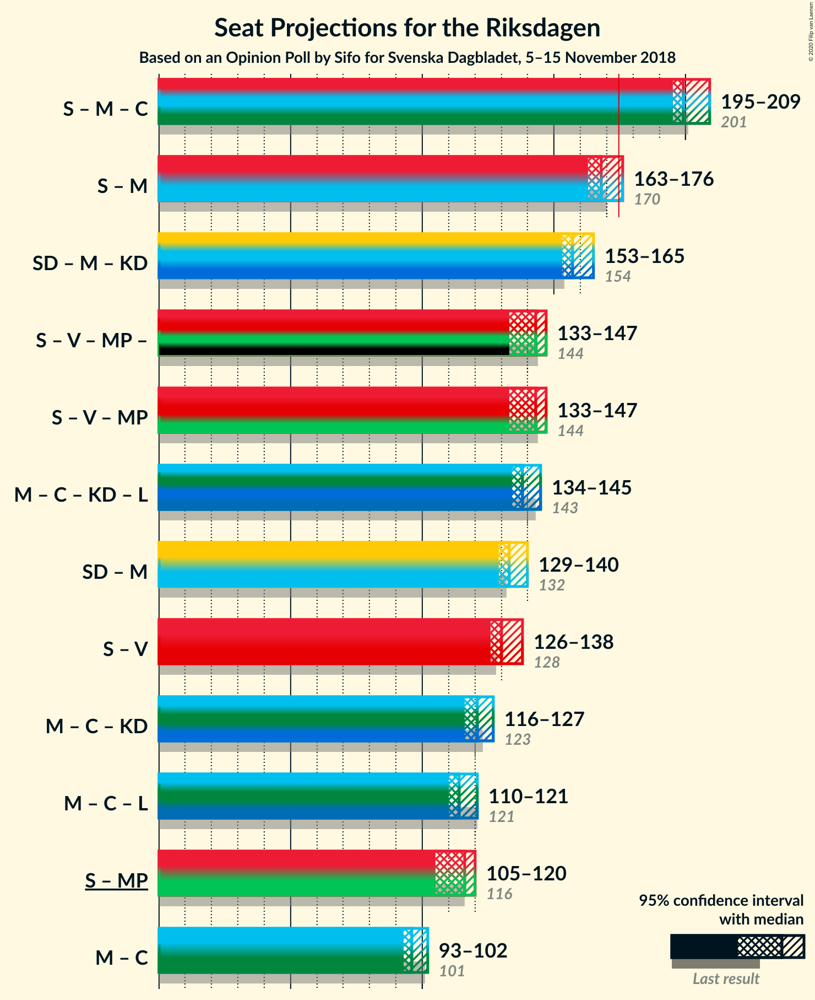

# Opinion Poll by Sifo for Svenska Dagbladet, 5–15 November 2018

<a href="#voting-intentions">Voting Intentions</a> | <a href="#seats">Seats</a> | <a href="#coalitions">Coalitions</a> | <a href="#technical-information">Technical Information</a>

## Voting Intentions

### Confidence Intervals

| Party | Last Result | Poll Result | 80% Confidence Interval | 90% Confidence Interval | 95% Confidence Interval | 99% Confidence Interval |
|:-----:|:-----------:|:-----------:|:-----------------------:|:-----------------------:|:-----------------------:|:-----------------------:|
| Sveriges socialdemokratiska arbetareparti | 28.3% | 29.0% | 28.4–29.6% |28.2–29.8% |28.0–29.9% |27.8–30.2% |
| Sverigedemokraterna | 17.5% | 19.3% | 18.8–19.8% |18.6–20.0% |18.5–20.1% |18.2–20.4% |
| Moderata samlingspartiet | 19.8% | 18.1% | 17.6–18.6% |17.4–18.8% |17.3–18.9% |17.1–19.1% |
| Centerpartiet | 8.6% | 9.0% | 8.6–9.4% |8.5–9.5% |8.4–9.6% |8.2–9.8% |
| Vänsterpartiet | 8.0% | 7.6% | 7.2–8.0% |7.1–8.1% |7.1–8.2% |6.9–8.3% |
| Kristdemokraterna | 6.3% | 6.7% | 6.4–7.0% |6.3–7.1% |6.2–7.2% |6.1–7.4% |
| Liberalerna | 5.5% | 4.9% | 4.6–5.2% |4.5–5.3% |4.5–5.3% |4.3–5.5% |
| Miljöpartiet de gröna | 4.4% | 4.1% | 3.8–4.4% |3.8–4.5% |3.7–4.5% |3.6–4.7% |

*Note:* The poll result column reflects the actual value used in the calculations. Published results may vary slightly, and in addition be rounded to fewer digits.

## Seats

### Confidence Intervals

| Party | Last Result | Median | 80% Confidence Interval | 90% Confidence Interval | 95% Confidence Interval | 99% Confidence Interval |
|:-----:|:-----------:|:------:|:-----------------------:|:-----------------------:|:-----------------------:|:-----------------------:|
| <a href="#sveriges-socialdemokratiska-arbetareparti">Sveriges socialdemokratiska arbetareparti</a> | 100 | 102 | 101–107 |99–108 |99–109 |99–110 |
| <a href="#sverigedemokraterna">Sverigedemokraterna</a> | 62 | 68 | 66–71 |66–73 |66–73 |65–73 |
| <a href="#moderata-samlingspartiet">Moderata samlingspartiet</a> | 70 | 64 | 63–66 |61–67 |61–68 |61–70 |
| <a href="#centerpartiet">Centerpartiet</a> | 31 | 32 | 31–34 |31–34 |31–35 |30–36 |
| <a href="#vänsterpartiet">Vänsterpartiet</a> | 28 | 27 | 27–28 |26–29 |26–29 |24–30 |
| <a href="#kristdemokraterna">Kristdemokraterna</a> | 22 | 24 | 22–25 |22–26 |22–26 |21–26 |
| <a href="#liberalerna">Liberalerna</a> | 20 | 17 | 17–18 |16–19 |16–19 |16–19 |
| <a href="#miljöpartiet-de-gröna">Miljöpartiet de gröna</a> | 16 | 15 | 0–16 |0–16 |0–16 |0–16 |

### Sveriges socialdemokratiska arbetareparti

*For a full overview of the results for this party, see the [Sveriges socialdemokratiska arbetareparti](party-sverigessocialdemokratiskaarbetareparti.html) page.*

| Number of Seats | Probability | Accumulated | Special Marks |
|:---------------:|:-----------:|:-----------:|:-------------:|
| 97 | 0.1% | 100% |  |
| 98 | 0.2% | 99.9% |  |
| 99 | 8% | 99.7% |  |
| 100 | 1.3% | 92% | Last Result |
| 101 | 15% | 90% |  |
| 102 | 38% | 75% | Median |
| 103 | 0.8% | 37% |  |
| 104 | 14% | 36% |  |
| 105 | 4% | 22% |  |
| 106 | 7% | 18% |  |
| 107 | 4% | 11% |  |
| 108 | 4% | 7% |  |
| 109 | 1.3% | 4% |  |
| 110 | 2% | 2% |  |
| 111 | 0.4% | 0.4% |  |
| 112 | 0% | 0% |  |

### Sverigedemokraterna

*For a full overview of the results for this party, see the [Sverigedemokraterna](party-sverigedemokraterna.html) page.*

| Number of Seats | Probability | Accumulated | Special Marks |
|:---------------:|:-----------:|:-----------:|:-------------:|
| 62 | 0% | 100% | Last Result |
| 63 | 0% | 100% |  |
| 64 | 0.3% | 100% |  |
| 65 | 0.9% | 99.7% |  |
| 66 | 20% | 98.8% |  |
| 67 | 16% | 79% |  |
| 68 | 32% | 63% | Median |
| 69 | 12% | 31% |  |
| 70 | 7% | 19% |  |
| 71 | 3% | 12% |  |
| 72 | 4% | 9% |  |
| 73 | 5% | 5% |  |
| 74 | 0.2% | 0.4% |  |
| 75 | 0.1% | 0.2% |  |
| 76 | 0.1% | 0.2% |  |
| 77 | 0% | 0% |  |

### Moderata samlingspartiet

*For a full overview of the results for this party, see the [Moderata samlingspartiet](party-moderatasamlingspartiet.html) page.*

| Number of Seats | Probability | Accumulated | Special Marks |
|:---------------:|:-----------:|:-----------:|:-------------:|
| 59 | 0.1% | 100% |  |
| 60 | 0.2% | 99.9% |  |
| 61 | 7% | 99.7% |  |
| 62 | 1.2% | 92% |  |
| 63 | 6% | 91% |  |
| 64 | 52% | 85% | Median |
| 65 | 17% | 33% |  |
| 66 | 7% | 16% |  |
| 67 | 4% | 9% |  |
| 68 | 3% | 5% |  |
| 69 | 0.7% | 2% |  |
| 70 | 2% | 2% | Last Result |
| 71 | 0% | 0% |  |

### Centerpartiet

*For a full overview of the results for this party, see the [Centerpartiet](party-centerpartiet.html) page.*

| Number of Seats | Probability | Accumulated | Special Marks |
|:---------------:|:-----------:|:-----------:|:-------------:|
| 29 | 0.4% | 100% |  |
| 30 | 2% | 99.6% |  |
| 31 | 26% | 98% | Last Result |
| 32 | 35% | 71% | Median |
| 33 | 22% | 37% |  |
| 34 | 12% | 14% |  |
| 35 | 2% | 3% |  |
| 36 | 0.9% | 0.9% |  |
| 37 | 0% | 0% |  |

### Vänsterpartiet

*For a full overview of the results for this party, see the [Vänsterpartiet](party-vänsterpartiet.html) page.*

| Number of Seats | Probability | Accumulated | Special Marks |
|:---------------:|:-----------:|:-----------:|:-------------:|
| 24 | 2% | 100% |  |
| 25 | 0.7% | 98% |  |
| 26 | 6% | 98% |  |
| 27 | 48% | 92% | Median |
| 28 | 37% | 44% | Last Result |
| 29 | 6% | 7% |  |
| 30 | 1.0% | 1.1% |  |
| 31 | 0.1% | 0.1% |  |
| 32 | 0% | 0% |  |

### Kristdemokraterna

*For a full overview of the results for this party, see the [Kristdemokraterna](party-kristdemokraterna.html) page.*

| Number of Seats | Probability | Accumulated | Special Marks |
|:---------------:|:-----------:|:-----------:|:-------------:|
| 21 | 0.6% | 100% |  |
| 22 | 17% | 99.4% | Last Result |
| 23 | 11% | 83% |  |
| 24 | 52% | 72% | Median |
| 25 | 15% | 20% |  |
| 26 | 5% | 5% |  |
| 27 | 0.4% | 0.4% |  |
| 28 | 0% | 0% |  |

### Liberalerna

*For a full overview of the results for this party, see the [Liberalerna](party-liberalerna.html) page.*

| Number of Seats | Probability | Accumulated | Special Marks |
|:---------------:|:-----------:|:-----------:|:-------------:|
| 15 | 0.4% | 100% |  |
| 16 | 6% | 99.5% |  |
| 17 | 44% | 94% | Median |
| 18 | 41% | 50% |  |
| 19 | 8% | 9% |  |
| 20 | 0.3% | 0.4% | Last Result |
| 21 | 0.1% | 0.1% |  |
| 22 | 0% | 0% |  |

### Miljöpartiet de gröna

*For a full overview of the results for this party, see the [Miljöpartiet de gröna](party-miljöpartietdegröna.html) page.*

| Number of Seats | Probability | Accumulated | Special Marks |
|:---------------:|:-----------:|:-----------:|:-------------:|
| 0 | 18% | 100% |  |
| 1 | 0% | 82% |  |
| 2 | 0% | 82% |  |
| 3 | 0% | 82% |  |
| 4 | 0% | 82% |  |
| 5 | 0% | 82% |  |
| 6 | 0% | 82% |  |
| 7 | 0% | 82% |  |
| 8 | 0% | 82% |  |
| 9 | 0% | 82% |  |
| 10 | 0% | 82% |  |
| 11 | 0% | 82% |  |
| 12 | 0% | 82% |  |
| 13 | 0% | 82% |  |
| 14 | 9% | 82% |  |
| 15 | 44% | 74% | Median |
| 16 | 30% | 30% | Last Result |
| 17 | 0.3% | 0.3% |  |
| 18 | 0% | 0% |  |

## Coalitions

### Confidence Intervals

| Coalition | Last Result | Median | Majority? | 80% Confidence Interval | 90% Confidence Interval | 95% Confidence Interval | 99% Confidence Interval |
|:---------:|:-----------:|:------:|:---------:|:-----------------------:|:-----------------------:|:-----------------------:|:-----------------------:|
| Sveriges socialdemokratiska arbetareparti – Moderata samlingspartiet – Centerpartiet | 201 | 199 | 100% | 196–207 | 194–208 | 194–209 | 194–210 |
| Sveriges socialdemokratiska arbetareparti – Moderata samlingspartiet | 170 | 166 | 4% | 164–173 | 162–174 | 162–176 | 162–177 |
| Sverigedemokraterna – Moderata samlingspartiet – Kristdemokraterna | 154 | 156 | 0% | 153–161 | 153–163 | 153–164 | 152–167 |
| Sveriges socialdemokratiska arbetareparti – Vänsterpartiet – Miljöpartiet de gröna | 144 | 144 | 0% | 135–147 | 134–147 | 134–147 | 132–148 |
| Moderata samlingspartiet – Centerpartiet – Kristdemokraterna – Liberalerna | 143 | 138 | 0% | 135–142 | 135–145 | 134–145 | 132–148 |
| Sverigedemokraterna – Moderata samlingspartiet | 132 | 132 | 0% | 130–137 | 130–138 | 130–139 | 128–142 |
| Sveriges socialdemokratiska arbetareparti – Vänsterpartiet | 128 | 130 | 0% | 127–134 | 127–136 | 127–138 | 125–139 |
| Moderata samlingspartiet – Centerpartiet – Kristdemokraterna | 123 | 120 | 0% | 118–125 | 117–126 | 117–127 | 115–129 |
| Moderata samlingspartiet – Centerpartiet – Liberalerna | 121 | 114 | 0% | 112–118 | 111–119 | 111–120 | 109–123 |
| Sveriges socialdemokratiska arbetareparti – Miljöpartiet de gröna | 116 | 117 | 0% | 107–120 | 106–120 | 106–120 | 104–121 |
| Moderata samlingspartiet – Centerpartiet | 101 | 97 | 0% | 95–100 | 93–101 | 93–102 | 92–104 |

### Sveriges socialdemokratiska arbetareparti – Moderata samlingspartiet – Centerpartiet

| Number of Seats | Probability | Accumulated | Special Marks |
|:---------------:|:-----------:|:-----------:|:-------------:|
| 193 | 0.1% | 100% |  |
| 194 | 7% | 99.9% |  |
| 195 | 0.5% | 93% |  |
| 196 | 11% | 93% |  |
| 197 | 19% | 82% |  |
| 198 | 8% | 63% | Median |
| 199 | 19% | 54% |  |
| 200 | 14% | 35% |  |
| 201 | 2% | 21% | Last Result |
| 202 | 0.8% | 19% |  |
| 203 | 0.6% | 18% |  |
| 204 | 0.6% | 17% |  |
| 205 | 0.4% | 17% |  |
| 206 | 6% | 16% |  |
| 207 | 4% | 10% |  |
| 208 | 2% | 6% |  |
| 209 | 1.2% | 4% |  |
| 210 | 2% | 2% |  |
| 211 | 0.2% | 0.3% |  |
| 212 | 0.1% | 0.1% |  |
| 213 | 0% | 0% |  |

### Sveriges socialdemokratiska arbetareparti – Moderata samlingspartiet

| Number of Seats | Probability | Accumulated | Special Marks |
|:---------------:|:-----------:|:-----------:|:-------------:|
| 161 | 0.2% | 100% |  |
| 162 | 6% | 99.8% |  |
| 163 | 1.0% | 94% |  |
| 164 | 11% | 93% |  |
| 165 | 3% | 82% |  |
| 166 | 40% | 79% | Median |
| 167 | 3% | 39% |  |
| 168 | 16% | 37% |  |
| 169 | 2% | 21% |  |
| 170 | 0.8% | 19% | Last Result |
| 171 | 2% | 18% |  |
| 172 | 3% | 15% |  |
| 173 | 4% | 13% |  |
| 174 | 4% | 9% |  |
| 175 | 1.0% | 4% | Majority |
| 176 | 2% | 3% |  |
| 177 | 1.3% | 1.4% |  |
| 178 | 0.1% | 0.2% |  |
| 179 | 0.1% | 0.1% |  |
| 180 | 0% | 0% |  |

### Sverigedemokraterna – Moderata samlingspartiet – Kristdemokraterna

| Number of Seats | Probability | Accumulated | Special Marks |
|:---------------:|:-----------:|:-----------:|:-------------:|
| 150 | 0.2% | 100% |  |
| 151 | 0.1% | 99.8% |  |
| 152 | 1.2% | 99.7% |  |
| 153 | 15% | 98.5% |  |
| 154 | 18% | 83% | Last Result |
| 155 | 10% | 65% |  |
| 156 | 23% | 55% | Median |
| 157 | 12% | 32% |  |
| 158 | 0.7% | 20% |  |
| 159 | 0.6% | 20% |  |
| 160 | 4% | 19% |  |
| 161 | 6% | 16% |  |
| 162 | 2% | 10% |  |
| 163 | 4% | 8% |  |
| 164 | 2% | 3% |  |
| 165 | 0.6% | 1.5% |  |
| 166 | 0.4% | 0.9% |  |
| 167 | 0.3% | 0.5% |  |
| 168 | 0.1% | 0.2% |  |
| 169 | 0% | 0% |  |

### Sveriges socialdemokratiska arbetareparti – Vänsterpartiet – Miljöpartiet de gröna

| Number of Seats | Probability | Accumulated | Special Marks |
|:---------------:|:-----------:|:-----------:|:-------------:|
| 129 | 0.1% | 100% |  |
| 130 | 0% | 99.9% |  |
| 131 | 0.2% | 99.9% |  |
| 132 | 0.4% | 99.7% |  |
| 133 | 2% | 99.2% |  |
| 134 | 7% | 98% |  |
| 135 | 2% | 91% |  |
| 136 | 3% | 89% |  |
| 137 | 1.3% | 86% |  |
| 138 | 2% | 85% |  |
| 139 | 2% | 83% |  |
| 140 | 0.6% | 82% |  |
| 141 | 0.1% | 81% |  |
| 142 | 5% | 81% |  |
| 143 | 12% | 76% |  |
| 144 | 25% | 64% | Last Result, Median |
| 145 | 21% | 39% |  |
| 146 | 1.5% | 18% |  |
| 147 | 15% | 17% |  |
| 148 | 2% | 2% |  |
| 149 | 0.2% | 0.3% |  |
| 150 | 0% | 0.1% |  |
| 151 | 0.1% | 0.1% |  |
| 152 | 0% | 0% |  |

### Moderata samlingspartiet – Centerpartiet – Kristdemokraterna – Liberalerna

| Number of Seats | Probability | Accumulated | Special Marks |
|:---------------:|:-----------:|:-----------:|:-------------:|
| 131 | 0.2% | 100% |  |
| 132 | 0.7% | 99.7% |  |
| 133 | 0.9% | 99.0% |  |
| 134 | 0.6% | 98% |  |
| 135 | 15% | 97% |  |
| 136 | 30% | 82% |  |
| 137 | 2% | 52% | Median |
| 138 | 11% | 50% |  |
| 139 | 22% | 40% |  |
| 140 | 3% | 17% |  |
| 141 | 2% | 15% |  |
| 142 | 2% | 12% |  |
| 143 | 2% | 10% | Last Result |
| 144 | 2% | 8% |  |
| 145 | 5% | 6% |  |
| 146 | 0.1% | 1.3% |  |
| 147 | 0.1% | 1.2% |  |
| 148 | 1.1% | 1.1% |  |
| 149 | 0% | 0% |  |

### Sverigedemokraterna – Moderata samlingspartiet

| Number of Seats | Probability | Accumulated | Special Marks |
|:---------------:|:-----------:|:-----------:|:-------------:|
| 127 | 0.2% | 100% |  |
| 128 | 1.0% | 99.7% |  |
| 129 | 0.3% | 98.8% |  |
| 130 | 25% | 98.5% |  |
| 131 | 15% | 73% |  |
| 132 | 21% | 58% | Last Result, Median |
| 133 | 17% | 38% |  |
| 134 | 2% | 21% |  |
| 135 | 3% | 20% |  |
| 136 | 3% | 16% |  |
| 137 | 5% | 13% |  |
| 138 | 4% | 8% |  |
| 139 | 2% | 4% |  |
| 140 | 0.6% | 2% |  |
| 141 | 0.5% | 1.0% |  |
| 142 | 0.1% | 0.5% |  |
| 143 | 0.3% | 0.4% |  |
| 144 | 0.1% | 0.1% |  |
| 145 | 0% | 0% |  |

### Sveriges socialdemokratiska arbetareparti – Vänsterpartiet

| Number of Seats | Probability | Accumulated | Special Marks |
|:---------------:|:-----------:|:-----------:|:-------------:|
| 124 | 0.1% | 100% |  |
| 125 | 1.3% | 99.9% |  |
| 126 | 0.2% | 98.6% |  |
| 127 | 10% | 98% |  |
| 128 | 12% | 88% | Last Result |
| 129 | 19% | 76% | Median |
| 130 | 22% | 58% |  |
| 131 | 15% | 36% |  |
| 132 | 3% | 22% |  |
| 133 | 3% | 19% |  |
| 134 | 7% | 16% |  |
| 135 | 2% | 8% |  |
| 136 | 3% | 7% |  |
| 137 | 1.3% | 4% |  |
| 138 | 2% | 3% |  |
| 139 | 0.4% | 0.7% |  |
| 140 | 0.3% | 0.3% |  |
| 141 | 0% | 0% |  |

### Moderata samlingspartiet – Centerpartiet – Kristdemokraterna

| Number of Seats | Probability | Accumulated | Special Marks |
|:---------------:|:-----------:|:-----------:|:-------------:|
| 114 | 0.2% | 100% |  |
| 115 | 0.3% | 99.7% |  |
| 116 | 2% | 99.5% |  |
| 117 | 3% | 98% |  |
| 118 | 21% | 94% |  |
| 119 | 20% | 74% |  |
| 120 | 5% | 54% | Median |
| 121 | 30% | 49% |  |
| 122 | 3% | 18% |  |
| 123 | 2% | 15% | Last Result |
| 124 | 3% | 13% |  |
| 125 | 3% | 10% |  |
| 126 | 2% | 7% |  |
| 127 | 4% | 5% |  |
| 128 | 0.1% | 1.3% |  |
| 129 | 1.1% | 1.2% |  |
| 130 | 0% | 0.1% |  |
| 131 | 0% | 0% |  |

### Moderata samlingspartiet – Centerpartiet – Liberalerna

| Number of Seats | Probability | Accumulated | Special Marks |
|:---------------:|:-----------:|:-----------:|:-------------:|
| 108 | 0.2% | 100% |  |
| 109 | 1.3% | 99.7% |  |
| 110 | 0.5% | 98% |  |
| 111 | 7% | 98% |  |
| 112 | 19% | 91% |  |
| 113 | 18% | 71% | Median |
| 114 | 13% | 53% |  |
| 115 | 22% | 40% |  |
| 116 | 2% | 18% |  |
| 117 | 5% | 16% |  |
| 118 | 3% | 11% |  |
| 119 | 5% | 8% |  |
| 120 | 0.6% | 3% |  |
| 121 | 1.1% | 2% | Last Result |
| 122 | 0.2% | 1.3% |  |
| 123 | 1.1% | 1.1% |  |
| 124 | 0% | 0% |  |

### Sveriges socialdemokratiska arbetareparti – Miljöpartiet de gröna

| Number of Seats | Probability | Accumulated | Special Marks |
|:---------------:|:-----------:|:-----------:|:-------------:|
| 101 | 0.1% | 100% |  |
| 102 | 0.1% | 99.9% |  |
| 103 | 0.2% | 99.9% |  |
| 104 | 0.2% | 99.7% |  |
| 105 | 0.5% | 99.5% |  |
| 106 | 6% | 98.9% |  |
| 107 | 4% | 93% |  |
| 108 | 4% | 90% |  |
| 109 | 1.3% | 86% |  |
| 110 | 2% | 85% |  |
| 111 | 0.4% | 83% |  |
| 112 | 0.2% | 82% |  |
| 113 | 0.1% | 82% |  |
| 114 | 0.2% | 82% |  |
| 115 | 15% | 82% |  |
| 116 | 5% | 67% | Last Result |
| 117 | 41% | 62% | Median |
| 118 | 2% | 21% |  |
| 119 | 1.4% | 19% |  |
| 120 | 16% | 18% |  |
| 121 | 0.8% | 1.1% |  |
| 122 | 0.2% | 0.3% |  |
| 123 | 0.1% | 0.1% |  |
| 124 | 0% | 0% |  |

### Moderata samlingspartiet – Centerpartiet

| Number of Seats | Probability | Accumulated | Special Marks |
|:---------------:|:-----------:|:-----------:|:-------------:|
| 91 | 0.2% | 100% |  |
| 92 | 0.8% | 99.7% |  |
| 93 | 8% | 98.9% |  |
| 94 | 1.1% | 91% |  |
| 95 | 23% | 90% |  |
| 96 | 16% | 67% | Median |
| 97 | 33% | 51% |  |
| 98 | 2% | 18% |  |
| 99 | 6% | 17% |  |
| 100 | 4% | 11% |  |
| 101 | 3% | 7% | Last Result |
| 102 | 0.6% | 3% |  |
| 103 | 1.3% | 2% |  |
| 104 | 1.1% | 1.1% |  |
| 105 | 0% | 0% |  |

## Technical Information

### Opinion Poll

+ **Polling firm:** Sifo
+ **Commissioner(s):** Svenska Dagbladet
+ **Fieldwork period:** 5–15 November 2018

### Calculations

+ **Sample size:** 9324
+ **Simulations done:** 65,536
+ **Error estimate:** 0.69%

