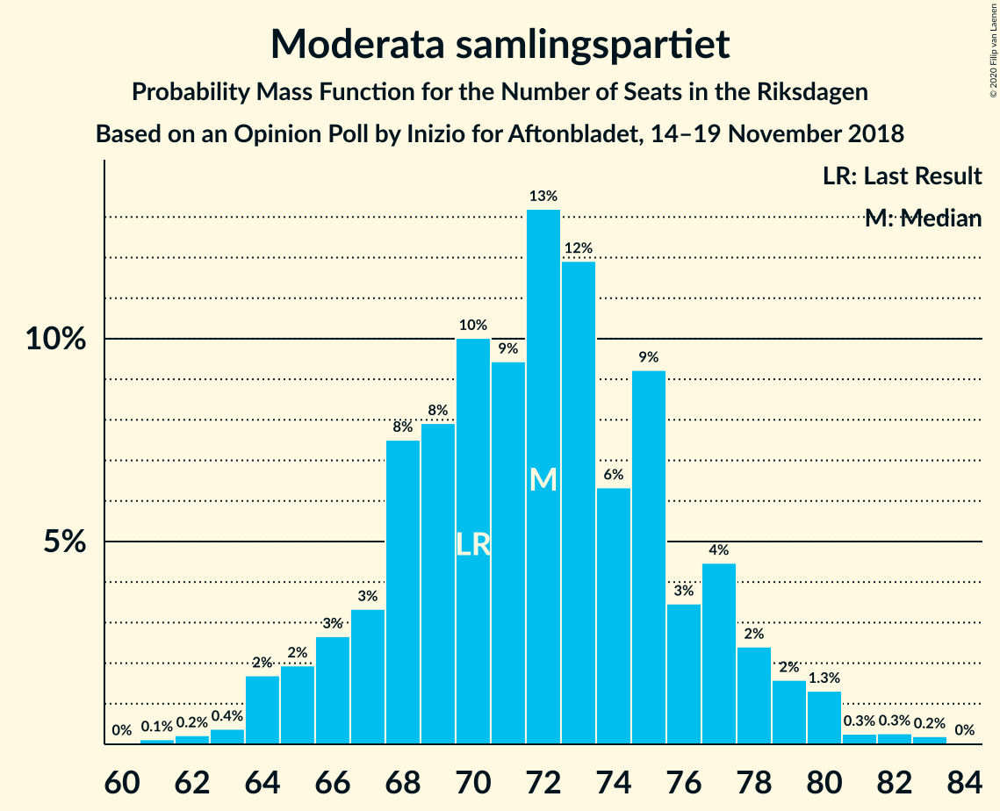

# Opinion Poll by Inizio for Aftonbladet, 14–19 November 2018

<a href="#voting-intentions">Voting Intentions</a> | <a href="#seats">Seats</a> | <a href="#coalitions">Coalitions</a> | <a href="#technical-information">Technical Information</a>

## Voting Intentions

### Confidence Intervals

| Party | Last Result | Poll Result | 80% Confidence Interval | 90% Confidence Interval | 95% Confidence Interval | 99% Confidence Interval |
|:-----:|:-----------:|:-----------:|:-----------------------:|:-----------------------:|:-----------------------:|:-----------------------:|
| Sveriges socialdemokratiska arbetareparti | 28.3% | 29.3% | 28.2–30.5% |27.8–30.9% |27.5–31.2% |27.0–31.8% |
| Moderata samlingspartiet | 19.8% | 19.1% | 18.1–20.2% |17.8–20.5% |17.6–20.8% |17.1–21.3% |
| Sverigedemokraterna | 17.5% | 18.8% | 17.8–19.9% |17.5–20.2% |17.3–20.4% |16.8–20.9% |
| Centerpartiet | 8.6% | 9.2% | 8.5–10.0% |8.3–10.2% |8.1–10.4% |7.8–10.8% |
| Vänsterpartiet | 8.0% | 7.3% | 6.6–8.0% |6.5–8.2% |6.3–8.4% |6.0–8.8% |
| Kristdemokraterna | 6.3% | 7.0% | 6.4–7.7% |6.2–7.9% |6.1–8.1% |5.8–8.4% |
| Liberalerna | 5.5% | 3.9% | 3.4–4.5% |3.3–4.6% |3.2–4.8% |3.0–5.0% |
| Miljöpartiet de gröna | 4.4% | 3.5% | 3.1–4.1% |3.0–4.2% |2.9–4.3% |2.7–4.6% |

*Note:* The poll result column reflects the actual value used in the calculations. Published results may vary slightly, and in addition be rounded to fewer digits.

## Seats

### Confidence Intervals

| Party | Last Result | Median | 80% Confidence Interval | 90% Confidence Interval | 95% Confidence Interval | 99% Confidence Interval |
|:-----:|:-----------:|:------:|:-----------------------:|:-----------------------:|:-----------------------:|:-----------------------:|
| <a href="#sveriges-socialdemokratiska-arbetareparti">Sveriges socialdemokratiska arbetareparti</a> | 100 | 110 | 104–116 |102–117 |101–118 |99–121 |
| <a href="#moderata-samlingspartiet">Moderata samlingspartiet</a> | 70 | 72 | 67–77 |66–78 |65–79 |63–82 |
| <a href="#sverigedemokraterna">Sverigedemokraterna</a> | 62 | 70 | 65–76 |65–77 |64–77 |62–80 |
| <a href="#centerpartiet">Centerpartiet</a> | 31 | 34 | 32–38 |31–39 |30–40 |29–41 |
| <a href="#vänsterpartiet">Vänsterpartiet</a> | 28 | 28 | 24–31 |24–31 |24–32 |22–33 |
| <a href="#kristdemokraterna">Kristdemokraterna</a> | 22 | 26 | 24–29 |23–30 |22–30 |21–32 |
| <a href="#liberalerna">Liberalerna</a> | 20 | 0 | 0–16 |0–17 |0–17 |0–18 |
| <a href="#miljöpartiet-de-gröna">Miljöpartiet de gröna</a> | 16 | 0 | 0–15 |0–15 |0–16 |0–17 |

### Sveriges socialdemokratiska arbetareparti

*For a full overview of the results for this party, see the [Sveriges socialdemokratiska arbetareparti](party-sverigessocialdemokratiskaarbetareparti.html) page.*

| Number of Seats | Probability | Accumulated | Special Marks |
|:---------------:|:-----------:|:-----------:|:-------------:|
| 95 | 0% | 100% |  |
| 96 | 0.1% | 99.9% |  |
| 97 | 0.1% | 99.9% |  |
| 98 | 0.2% | 99.8% |  |
| 99 | 0.6% | 99.6% |  |
| 100 | 0.5% | 99.0% | Last Result |
| 101 | 2% | 98.5% |  |
| 102 | 2% | 97% |  |
| 103 | 3% | 95% |  |
| 104 | 4% | 92% |  |
| 105 | 3% | 88% |  |
| 106 | 7% | 85% |  |
| 107 | 8% | 78% |  |
| 108 | 10% | 70% |  |
| 109 | 7% | 60% |  |
| 110 | 8% | 53% | Median |
| 111 | 9% | 45% |  |
| 112 | 12% | 37% |  |
| 113 | 6% | 25% |  |
| 114 | 4% | 19% |  |
| 115 | 3% | 15% |  |
| 116 | 5% | 12% |  |
| 117 | 4% | 7% |  |
| 118 | 1.5% | 3% |  |
| 119 | 0.5% | 2% |  |
| 120 | 0.7% | 1.2% |  |
| 121 | 0.3% | 0.5% |  |
| 122 | 0.2% | 0.3% |  |
| 123 | 0% | 0.1% |  |
| 124 | 0% | 0.1% |  |
| 125 | 0% | 0% |  |

### Moderata samlingspartiet

*For a full overview of the results for this party, see the [Moderata samlingspartiet](party-moderatasamlingspartiet.html) page.*

| Number of Seats | Probability | Accumulated | Special Marks |
|:---------------:|:-----------:|:-----------:|:-------------:|
| 61 | 0.1% | 100% |  |
| 62 | 0.2% | 99.8% |  |
| 63 | 0.4% | 99.6% |  |
| 64 | 2% | 99.2% |  |
| 65 | 2% | 98% |  |
| 66 | 3% | 96% |  |
| 67 | 3% | 93% |  |
| 68 | 8% | 90% |  |
| 69 | 8% | 82% |  |
| 70 | 10% | 74% | Last Result |
| 71 | 9% | 64% |  |
| 72 | 13% | 55% | Median |
| 73 | 12% | 42% |  |
| 74 | 6% | 30% |  |
| 75 | 9% | 23% |  |
| 76 | 3% | 14% |  |
| 77 | 4% | 11% |  |
| 78 | 2% | 6% |  |
| 79 | 2% | 4% |  |
| 80 | 1.3% | 2% |  |
| 81 | 0.3% | 0.8% |  |
| 82 | 0.3% | 0.5% |  |
| 83 | 0.2% | 0.2% |  |
| 84 | 0% | 0% |  |

### Sverigedemokraterna

*For a full overview of the results for this party, see the [Sverigedemokraterna](party-sverigedemokraterna.html) page.*

| Number of Seats | Probability | Accumulated | Special Marks |
|:---------------:|:-----------:|:-----------:|:-------------:|
| 60 | 0.1% | 100% |  |
| 61 | 0.1% | 99.9% |  |
| 62 | 0.7% | 99.7% | Last Result |
| 63 | 1.0% | 99.1% |  |
| 64 | 3% | 98% |  |
| 65 | 6% | 95% |  |
| 66 | 5% | 90% |  |
| 67 | 9% | 84% |  |
| 68 | 11% | 75% |  |
| 69 | 7% | 65% |  |
| 70 | 10% | 57% | Median |
| 71 | 7% | 47% |  |
| 72 | 9% | 41% |  |
| 73 | 6% | 32% |  |
| 74 | 9% | 26% |  |
| 75 | 6% | 17% |  |
| 76 | 5% | 12% |  |
| 77 | 4% | 6% |  |
| 78 | 1.1% | 2% |  |
| 79 | 0.7% | 1.3% |  |
| 80 | 0.3% | 0.6% |  |
| 81 | 0.2% | 0.3% |  |
| 82 | 0.1% | 0.1% |  |
| 83 | 0% | 0% |  |

### Centerpartiet

*For a full overview of the results for this party, see the [Centerpartiet](party-centerpartiet.html) page.*

| Number of Seats | Probability | Accumulated | Special Marks |
|:---------------:|:-----------:|:-----------:|:-------------:|
| 27 | 0.1% | 100% |  |
| 28 | 0.3% | 99.9% |  |
| 29 | 0.8% | 99.6% |  |
| 30 | 2% | 98.8% |  |
| 31 | 6% | 96% | Last Result |
| 32 | 11% | 90% |  |
| 33 | 9% | 80% |  |
| 34 | 21% | 71% | Median |
| 35 | 16% | 50% |  |
| 36 | 11% | 33% |  |
| 37 | 12% | 23% |  |
| 38 | 6% | 11% |  |
| 39 | 1.3% | 5% |  |
| 40 | 3% | 4% |  |
| 41 | 0.6% | 0.8% |  |
| 42 | 0.1% | 0.2% |  |
| 43 | 0.1% | 0.1% |  |
| 44 | 0% | 0% |  |

### Vänsterpartiet

*For a full overview of the results for this party, see the [Vänsterpartiet](party-vänsterpartiet.html) page.*

| Number of Seats | Probability | Accumulated | Special Marks |
|:---------------:|:-----------:|:-----------:|:-------------:|
| 21 | 0.1% | 100% |  |
| 22 | 0.5% | 99.9% |  |
| 23 | 2% | 99.4% |  |
| 24 | 8% | 98% |  |
| 25 | 10% | 90% |  |
| 26 | 12% | 80% |  |
| 27 | 16% | 67% |  |
| 28 | 19% | 52% | Last Result, Median |
| 29 | 12% | 33% |  |
| 30 | 10% | 20% |  |
| 31 | 7% | 10% |  |
| 32 | 3% | 4% |  |
| 33 | 0.6% | 0.9% |  |
| 34 | 0.2% | 0.3% |  |
| 35 | 0% | 0.1% |  |
| 36 | 0% | 0% |  |

### Kristdemokraterna

*For a full overview of the results for this party, see the [Kristdemokraterna](party-kristdemokraterna.html) page.*

| Number of Seats | Probability | Accumulated | Special Marks |
|:---------------:|:-----------:|:-----------:|:-------------:|
| 20 | 0.1% | 100% |  |
| 21 | 0.7% | 99.9% |  |
| 22 | 2% | 99.2% | Last Result |
| 23 | 6% | 97% |  |
| 24 | 12% | 91% |  |
| 25 | 15% | 80% |  |
| 26 | 21% | 64% | Median |
| 27 | 18% | 43% |  |
| 28 | 13% | 25% |  |
| 29 | 7% | 12% |  |
| 30 | 3% | 6% |  |
| 31 | 1.4% | 2% |  |
| 32 | 0.8% | 0.9% |  |
| 33 | 0.1% | 0.2% |  |
| 34 | 0% | 0.1% |  |
| 35 | 0% | 0% |  |

### Liberalerna

*For a full overview of the results for this party, see the [Liberalerna](party-liberalerna.html) page.*

| Number of Seats | Probability | Accumulated | Special Marks |
|:---------------:|:-----------:|:-----------:|:-------------:|
| 0 | 60% | 100% | Median |
| 1 | 0% | 40% |  |
| 2 | 0% | 40% |  |
| 3 | 0% | 40% |  |
| 4 | 0% | 40% |  |
| 5 | 0% | 40% |  |
| 6 | 0% | 40% |  |
| 7 | 0% | 40% |  |
| 8 | 0% | 40% |  |
| 9 | 0% | 40% |  |
| 10 | 0% | 40% |  |
| 11 | 0% | 40% |  |
| 12 | 0% | 40% |  |
| 13 | 0% | 40% |  |
| 14 | 1.1% | 40% |  |
| 15 | 17% | 39% |  |
| 16 | 14% | 23% |  |
| 17 | 7% | 9% |  |
| 18 | 2% | 2% |  |
| 19 | 0.3% | 0.4% |  |
| 20 | 0% | 0.1% | Last Result |
| 21 | 0% | 0% |  |

### Miljöpartiet de gröna

*For a full overview of the results for this party, see the [Miljöpartiet de gröna](party-miljöpartietdegröna.html) page.*

| Number of Seats | Probability | Accumulated | Special Marks |
|:---------------:|:-----------:|:-----------:|:-------------:|
| 0 | 86% | 100% | Median |
| 1 | 0% | 14% |  |
| 2 | 0% | 14% |  |
| 3 | 0% | 14% |  |
| 4 | 0% | 14% |  |
| 5 | 0% | 14% |  |
| 6 | 0% | 14% |  |
| 7 | 0% | 14% |  |
| 8 | 0% | 14% |  |
| 9 | 0% | 14% |  |
| 10 | 0% | 14% |  |
| 11 | 0% | 14% |  |
| 12 | 0% | 14% |  |
| 13 | 0% | 14% |  |
| 14 | 2% | 14% |  |
| 15 | 8% | 12% |  |
| 16 | 3% | 4% | Last Result |
| 17 | 0.7% | 0.9% |  |
| 18 | 0.1% | 0.1% |  |
| 19 | 0% | 0% |  |

## Coalitions

### Confidence Intervals

| Coalition | Last Result | Median | Majority? | 80% Confidence Interval | 90% Confidence Interval | 95% Confidence Interval | 99% Confidence Interval |
|:---------:|:-----------:|:------:|:---------:|:-----------------------:|:-----------------------:|:-----------------------:|:-----------------------:|
| Sveriges socialdemokratiska arbetareparti – Moderata samlingspartiet – Centerpartiet | 201 | 216 | 100% | 207–226 | 204–227 | 202–228 | 199–230 |
| Sveriges socialdemokratiska arbetareparti – Moderata samlingspartiet | 170 | 182 | 89% | 174–189 | 171–191 | 169–193 | 166–195 |
| Moderata samlingspartiet – Sverigedemokraterna – Kristdemokraterna | 154 | 169 | 12% | 161–176 | 158–178 | 156–178 | 153–182 |
| Moderata samlingspartiet – Sverigedemokraterna | 132 | 143 | 0% | 135–149 | 133–151 | 132–152 | 129–154 |
| Sveriges socialdemokratiska arbetareparti – Vänsterpartiet – Miljöpartiet de gröna | 144 | 140 | 0% | 132–147 | 131–149 | 129–152 | 127–155 |
| Moderata samlingspartiet – Centerpartiet – Kristdemokraterna – Liberalerna | 143 | 139 | 0% | 131–148 | 129–150 | 128–151 | 125–153 |
| Sveriges socialdemokratiska arbetareparti – Vänsterpartiet | 128 | 137 | 0% | 131–144 | 128–145 | 127–147 | 124–149 |
| Moderata samlingspartiet – Centerpartiet – Kristdemokraterna | 123 | 132 | 0% | 126–139 | 124–142 | 122–143 | 120–145 |
| Sveriges socialdemokratiska arbetareparti – Miljöpartiet de gröna | 116 | 111 | 0% | 106–120 | 104–123 | 103–125 | 101–129 |
| Moderata samlingspartiet – Centerpartiet – Liberalerna | 121 | 112 | 0% | 104–123 | 103–124 | 102–125 | 99–127 |
| Moderata samlingspartiet – Centerpartiet | 101 | 107 | 0% | 100–113 | 99–114 | 97–116 | 95–118 |

### Sveriges socialdemokratiska arbetareparti – Moderata samlingspartiet – Centerpartiet

| Number of Seats | Probability | Accumulated | Special Marks |
|:---------------:|:-----------:|:-----------:|:-------------:|
| 195 | 0.1% | 100% |  |
| 196 | 0.1% | 99.9% |  |
| 197 | 0.1% | 99.8% |  |
| 198 | 0.2% | 99.7% |  |
| 199 | 0.5% | 99.6% |  |
| 200 | 0.2% | 99.0% |  |
| 201 | 1.2% | 98.9% | Last Result |
| 202 | 0.4% | 98% |  |
| 203 | 1.4% | 97% |  |
| 204 | 1.2% | 96% |  |
| 205 | 0.7% | 95% |  |
| 206 | 1.2% | 94% |  |
| 207 | 4% | 93% |  |
| 208 | 2% | 88% |  |
| 209 | 2% | 87% |  |
| 210 | 3% | 85% |  |
| 211 | 3% | 81% |  |
| 212 | 4% | 78% |  |
| 213 | 5% | 74% |  |
| 214 | 7% | 69% |  |
| 215 | 7% | 62% |  |
| 216 | 6% | 54% | Median |
| 217 | 3% | 48% |  |
| 218 | 10% | 45% |  |
| 219 | 7% | 36% |  |
| 220 | 4% | 28% |  |
| 221 | 2% | 24% |  |
| 222 | 3% | 22% |  |
| 223 | 3% | 19% |  |
| 224 | 3% | 16% |  |
| 225 | 0.8% | 13% |  |
| 226 | 6% | 12% |  |
| 227 | 4% | 7% |  |
| 228 | 0.9% | 3% |  |
| 229 | 1.1% | 2% |  |
| 230 | 0.5% | 0.9% |  |
| 231 | 0.3% | 0.4% |  |
| 232 | 0.1% | 0.2% |  |
| 233 | 0% | 0% |  |

### Sveriges socialdemokratiska arbetareparti – Moderata samlingspartiet

| Number of Seats | Probability | Accumulated | Special Marks |
|:---------------:|:-----------:|:-----------:|:-------------:|
| 162 | 0% | 100% |  |
| 163 | 0% | 99.9% |  |
| 164 | 0.1% | 99.9% |  |
| 165 | 0.2% | 99.8% |  |
| 166 | 0.4% | 99.6% |  |
| 167 | 0.7% | 99.2% |  |
| 168 | 0.6% | 98% |  |
| 169 | 1.1% | 98% |  |
| 170 | 1.2% | 97% | Last Result |
| 171 | 1.3% | 96% |  |
| 172 | 1.1% | 94% |  |
| 173 | 2% | 93% |  |
| 174 | 3% | 92% |  |
| 175 | 5% | 89% | Majority |
| 176 | 3% | 84% |  |
| 177 | 6% | 81% |  |
| 178 | 5% | 76% |  |
| 179 | 7% | 70% |  |
| 180 | 6% | 64% |  |
| 181 | 6% | 57% |  |
| 182 | 4% | 51% | Median |
| 183 | 6% | 47% |  |
| 184 | 9% | 41% |  |
| 185 | 6% | 32% |  |
| 186 | 4% | 26% |  |
| 187 | 3% | 21% |  |
| 188 | 3% | 18% |  |
| 189 | 6% | 15% |  |
| 190 | 3% | 9% |  |
| 191 | 3% | 6% |  |
| 192 | 0.6% | 3% |  |
| 193 | 0.9% | 3% |  |
| 194 | 1.0% | 2% |  |
| 195 | 0.3% | 0.7% |  |
| 196 | 0.2% | 0.4% |  |
| 197 | 0.1% | 0.2% |  |
| 198 | 0.1% | 0.1% |  |
| 199 | 0% | 0% |  |

### Moderata samlingspartiet – Sverigedemokraterna – Kristdemokraterna

| Number of Seats | Probability | Accumulated | Special Marks |
|:---------------:|:-----------:|:-----------:|:-------------:|
| 150 | 0.1% | 100% |  |
| 151 | 0.1% | 99.8% |  |
| 152 | 0.1% | 99.8% |  |
| 153 | 0.2% | 99.7% |  |
| 154 | 0.6% | 99.5% | Last Result |
| 155 | 0.9% | 98.9% |  |
| 156 | 0.8% | 98% |  |
| 157 | 1.1% | 97% |  |
| 158 | 2% | 96% |  |
| 159 | 1.2% | 95% |  |
| 160 | 0.9% | 93% |  |
| 161 | 5% | 92% |  |
| 162 | 7% | 87% |  |
| 163 | 2% | 80% |  |
| 164 | 2% | 78% |  |
| 165 | 6% | 76% |  |
| 166 | 9% | 70% |  |
| 167 | 5% | 62% |  |
| 168 | 5% | 57% | Median |
| 169 | 5% | 52% |  |
| 170 | 7% | 47% |  |
| 171 | 2% | 40% |  |
| 172 | 5% | 38% |  |
| 173 | 12% | 33% |  |
| 174 | 9% | 21% |  |
| 175 | 0.9% | 12% | Majority |
| 176 | 2% | 11% |  |
| 177 | 4% | 9% |  |
| 178 | 3% | 5% |  |
| 179 | 0.7% | 2% |  |
| 180 | 0.1% | 1.0% |  |
| 181 | 0.3% | 0.9% |  |
| 182 | 0.4% | 0.6% |  |
| 183 | 0.1% | 0.2% |  |
| 184 | 0% | 0% |  |

### Moderata samlingspartiet – Sverigedemokraterna

| Number of Seats | Probability | Accumulated | Special Marks |
|:---------------:|:-----------:|:-----------:|:-------------:|
| 125 | 0.1% | 100% |  |
| 126 | 0% | 99.9% |  |
| 127 | 0.2% | 99.9% |  |
| 128 | 0.1% | 99.7% |  |
| 129 | 0.7% | 99.6% |  |
| 130 | 0.5% | 99.0% |  |
| 131 | 0.5% | 98% |  |
| 132 | 2% | 98% | Last Result |
| 133 | 1.3% | 96% |  |
| 134 | 2% | 95% |  |
| 135 | 3% | 92% |  |
| 136 | 5% | 89% |  |
| 137 | 4% | 84% |  |
| 138 | 5% | 79% |  |
| 139 | 4% | 75% |  |
| 140 | 7% | 71% |  |
| 141 | 7% | 64% |  |
| 142 | 6% | 57% | Median |
| 143 | 10% | 52% |  |
| 144 | 5% | 42% |  |
| 145 | 7% | 37% |  |
| 146 | 5% | 30% |  |
| 147 | 10% | 26% |  |
| 148 | 5% | 16% |  |
| 149 | 2% | 11% |  |
| 150 | 2% | 8% |  |
| 151 | 3% | 6% |  |
| 152 | 1.3% | 3% |  |
| 153 | 0.8% | 2% |  |
| 154 | 0.6% | 1.0% |  |
| 155 | 0.3% | 0.5% |  |
| 156 | 0.1% | 0.2% |  |
| 157 | 0% | 0.1% |  |
| 158 | 0% | 0% |  |

### Sveriges socialdemokratiska arbetareparti – Vänsterpartiet – Miljöpartiet de gröna

| Number of Seats | Probability | Accumulated | Special Marks |
|:---------------:|:-----------:|:-----------:|:-------------:|
| 123 | 0.1% | 100% |  |
| 124 | 0.1% | 99.9% |  |
| 125 | 0.1% | 99.9% |  |
| 126 | 0.2% | 99.8% |  |
| 127 | 0.7% | 99.6% |  |
| 128 | 0.8% | 98.8% |  |
| 129 | 1.3% | 98% |  |
| 130 | 1.3% | 97% |  |
| 131 | 3% | 96% |  |
| 132 | 4% | 93% |  |
| 133 | 4% | 89% |  |
| 134 | 5% | 85% |  |
| 135 | 6% | 80% |  |
| 136 | 5% | 74% |  |
| 137 | 7% | 69% |  |
| 138 | 6% | 61% | Median |
| 139 | 5% | 55% |  |
| 140 | 7% | 50% |  |
| 141 | 7% | 43% |  |
| 142 | 10% | 36% |  |
| 143 | 4% | 26% |  |
| 144 | 3% | 22% | Last Result |
| 145 | 5% | 19% |  |
| 146 | 2% | 14% |  |
| 147 | 2% | 12% |  |
| 148 | 2% | 9% |  |
| 149 | 2% | 7% |  |
| 150 | 1.4% | 5% |  |
| 151 | 0.8% | 4% |  |
| 152 | 0.7% | 3% |  |
| 153 | 0.8% | 2% |  |
| 154 | 0.5% | 1.2% |  |
| 155 | 0.3% | 0.7% |  |
| 156 | 0.2% | 0.5% |  |
| 157 | 0.2% | 0.2% |  |
| 158 | 0.1% | 0.1% |  |
| 159 | 0% | 0% |  |

### Moderata samlingspartiet – Centerpartiet – Kristdemokraterna – Liberalerna

| Number of Seats | Probability | Accumulated | Special Marks |
|:---------------:|:-----------:|:-----------:|:-------------:|
| 121 | 0% | 100% |  |
| 122 | 0.1% | 99.9% |  |
| 123 | 0.1% | 99.8% |  |
| 124 | 0.2% | 99.7% |  |
| 125 | 0.3% | 99.6% |  |
| 126 | 0.4% | 99.3% |  |
| 127 | 0.6% | 98.9% |  |
| 128 | 1.4% | 98% |  |
| 129 | 3% | 97% |  |
| 130 | 2% | 94% |  |
| 131 | 4% | 92% |  |
| 132 | 7% | 88% | Median |
| 133 | 5% | 80% |  |
| 134 | 5% | 75% |  |
| 135 | 7% | 70% |  |
| 136 | 6% | 63% |  |
| 137 | 3% | 57% |  |
| 138 | 3% | 54% |  |
| 139 | 7% | 51% |  |
| 140 | 4% | 44% |  |
| 141 | 4% | 40% |  |
| 142 | 4% | 36% |  |
| 143 | 3% | 32% | Last Result |
| 144 | 3% | 29% |  |
| 145 | 4% | 26% |  |
| 146 | 4% | 22% |  |
| 147 | 4% | 19% |  |
| 148 | 5% | 14% |  |
| 149 | 3% | 9% |  |
| 150 | 2% | 6% |  |
| 151 | 2% | 4% |  |
| 152 | 0.6% | 1.3% |  |
| 153 | 0.3% | 0.7% |  |
| 154 | 0.3% | 0.4% |  |
| 155 | 0.1% | 0.1% |  |
| 156 | 0% | 0.1% |  |
| 157 | 0% | 0% |  |

### Sveriges socialdemokratiska arbetareparti – Vänsterpartiet

| Number of Seats | Probability | Accumulated | Special Marks |
|:---------------:|:-----------:|:-----------:|:-------------:|
| 121 | 0% | 100% |  |
| 122 | 0.1% | 99.9% |  |
| 123 | 0.3% | 99.9% |  |
| 124 | 0.2% | 99.5% |  |
| 125 | 0.3% | 99.3% |  |
| 126 | 0.8% | 99.0% |  |
| 127 | 2% | 98% |  |
| 128 | 1.5% | 96% | Last Result |
| 129 | 2% | 95% |  |
| 130 | 2% | 93% |  |
| 131 | 4% | 91% |  |
| 132 | 5% | 87% |  |
| 133 | 6% | 82% |  |
| 134 | 7% | 76% |  |
| 135 | 6% | 70% |  |
| 136 | 6% | 63% |  |
| 137 | 8% | 57% |  |
| 138 | 6% | 49% | Median |
| 139 | 5% | 42% |  |
| 140 | 7% | 37% |  |
| 141 | 7% | 30% |  |
| 142 | 9% | 23% |  |
| 143 | 3% | 15% |  |
| 144 | 2% | 11% |  |
| 145 | 4% | 9% |  |
| 146 | 2% | 5% |  |
| 147 | 0.8% | 3% |  |
| 148 | 1.0% | 2% |  |
| 149 | 0.5% | 1.0% |  |
| 150 | 0.3% | 0.5% |  |
| 151 | 0.1% | 0.2% |  |
| 152 | 0% | 0.1% |  |
| 153 | 0% | 0% |  |

### Moderata samlingspartiet – Centerpartiet – Kristdemokraterna

| Number of Seats | Probability | Accumulated | Special Marks |
|:---------------:|:-----------:|:-----------:|:-------------:|
| 117 | 0.1% | 100% |  |
| 118 | 0.1% | 99.9% |  |
| 119 | 0.2% | 99.8% |  |
| 120 | 0.4% | 99.6% |  |
| 121 | 0.9% | 99.2% |  |
| 122 | 1.2% | 98% |  |
| 123 | 1.2% | 97% | Last Result |
| 124 | 3% | 96% |  |
| 125 | 2% | 93% |  |
| 126 | 3% | 91% |  |
| 127 | 2% | 88% |  |
| 128 | 5% | 86% |  |
| 129 | 6% | 81% |  |
| 130 | 5% | 75% |  |
| 131 | 8% | 70% |  |
| 132 | 12% | 62% | Median |
| 133 | 8% | 50% |  |
| 134 | 8% | 42% |  |
| 135 | 8% | 34% |  |
| 136 | 7% | 26% |  |
| 137 | 2% | 19% |  |
| 138 | 2% | 17% |  |
| 139 | 6% | 15% |  |
| 140 | 2% | 9% |  |
| 141 | 2% | 7% |  |
| 142 | 2% | 5% |  |
| 143 | 2% | 3% |  |
| 144 | 0.5% | 1.1% |  |
| 145 | 0.3% | 0.7% |  |
| 146 | 0.3% | 0.3% |  |
| 147 | 0% | 0.1% |  |
| 148 | 0% | 0% |  |

### Sveriges socialdemokratiska arbetareparti – Miljöpartiet de gröna

| Number of Seats | Probability | Accumulated | Special Marks |
|:---------------:|:-----------:|:-----------:|:-------------:|
| 98 | 0.1% | 100% |  |
| 99 | 0.2% | 99.9% |  |
| 100 | 0.2% | 99.7% |  |
| 101 | 0.5% | 99.5% |  |
| 102 | 1.4% | 99.0% |  |
| 103 | 2% | 98% |  |
| 104 | 3% | 96% |  |
| 105 | 2% | 93% |  |
| 106 | 5% | 91% |  |
| 107 | 7% | 85% |  |
| 108 | 8% | 79% |  |
| 109 | 5% | 71% |  |
| 110 | 7% | 65% | Median |
| 111 | 8% | 58% |  |
| 112 | 12% | 50% |  |
| 113 | 6% | 38% |  |
| 114 | 4% | 32% |  |
| 115 | 3% | 28% |  |
| 116 | 6% | 25% | Last Result |
| 117 | 5% | 19% |  |
| 118 | 2% | 14% |  |
| 119 | 1.2% | 12% |  |
| 120 | 1.2% | 11% |  |
| 121 | 3% | 9% |  |
| 122 | 0.8% | 7% |  |
| 123 | 2% | 6% |  |
| 124 | 1.3% | 4% |  |
| 125 | 0.8% | 3% |  |
| 126 | 0.2% | 2% |  |
| 127 | 0.9% | 2% |  |
| 128 | 0.2% | 0.7% |  |
| 129 | 0.2% | 0.5% |  |
| 130 | 0.1% | 0.3% |  |
| 131 | 0.2% | 0.3% |  |
| 132 | 0% | 0% |  |

### Moderata samlingspartiet – Centerpartiet – Liberalerna

| Number of Seats | Probability | Accumulated | Special Marks |
|:---------------:|:-----------:|:-----------:|:-------------:|
| 95 | 0.1% | 100% |  |
| 96 | 0% | 99.9% |  |
| 97 | 0.1% | 99.9% |  |
| 98 | 0.1% | 99.8% |  |
| 99 | 0.2% | 99.7% |  |
| 100 | 0.6% | 99.4% |  |
| 101 | 0.8% | 98.8% |  |
| 102 | 2% | 98% |  |
| 103 | 3% | 96% |  |
| 104 | 3% | 93% |  |
| 105 | 4% | 90% |  |
| 106 | 6% | 86% | Median |
| 107 | 10% | 80% |  |
| 108 | 4% | 69% |  |
| 109 | 5% | 65% |  |
| 110 | 4% | 60% |  |
| 111 | 4% | 57% |  |
| 112 | 3% | 53% |  |
| 113 | 4% | 49% |  |
| 114 | 5% | 45% |  |
| 115 | 5% | 40% |  |
| 116 | 3% | 35% |  |
| 117 | 4% | 32% |  |
| 118 | 2% | 28% |  |
| 119 | 4% | 26% |  |
| 120 | 3% | 22% |  |
| 121 | 3% | 18% | Last Result |
| 122 | 3% | 15% |  |
| 123 | 5% | 12% |  |
| 124 | 3% | 7% |  |
| 125 | 1.2% | 4% |  |
| 126 | 1.5% | 2% |  |
| 127 | 0.5% | 0.9% |  |
| 128 | 0.2% | 0.4% |  |
| 129 | 0.1% | 0.2% |  |
| 130 | 0% | 0.1% |  |
| 131 | 0% | 0% |  |

### Moderata samlingspartiet – Centerpartiet

| Number of Seats | Probability | Accumulated | Special Marks |
|:---------------:|:-----------:|:-----------:|:-------------:|
| 92 | 0% | 100% |  |
| 93 | 0.1% | 99.9% |  |
| 94 | 0.2% | 99.9% |  |
| 95 | 0.4% | 99.7% |  |
| 96 | 0.5% | 99.4% |  |
| 97 | 1.4% | 98.8% |  |
| 98 | 1.4% | 97% |  |
| 99 | 2% | 96% |  |
| 100 | 4% | 94% |  |
| 101 | 3% | 90% | Last Result |
| 102 | 5% | 86% |  |
| 103 | 5% | 81% |  |
| 104 | 8% | 75% |  |
| 105 | 7% | 67% |  |
| 106 | 9% | 60% | Median |
| 107 | 13% | 50% |  |
| 108 | 8% | 37% |  |
| 109 | 7% | 30% |  |
| 110 | 4% | 22% |  |
| 111 | 4% | 18% |  |
| 112 | 2% | 14% |  |
| 113 | 3% | 11% |  |
| 114 | 4% | 8% |  |
| 115 | 2% | 5% |  |
| 116 | 1.4% | 3% |  |
| 117 | 0.5% | 1.1% |  |
| 118 | 0.5% | 0.7% |  |
| 119 | 0.1% | 0.2% |  |
| 120 | 0.1% | 0.1% |  |
| 121 | 0% | 0% |  |

## Technical Information

### Opinion Poll

+ **Polling firm:** Inizio
+ **Commissioner(s):** Aftonbladet
+ **Fieldwork period:** 14–19 November 2018

### Calculations

+ **Sample size:** 2414
+ **Simulations done:** 1,048,576
+ **Error estimate:** 0.55%

