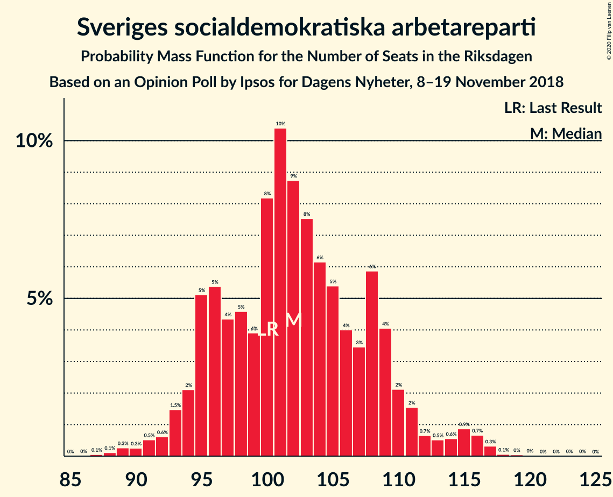
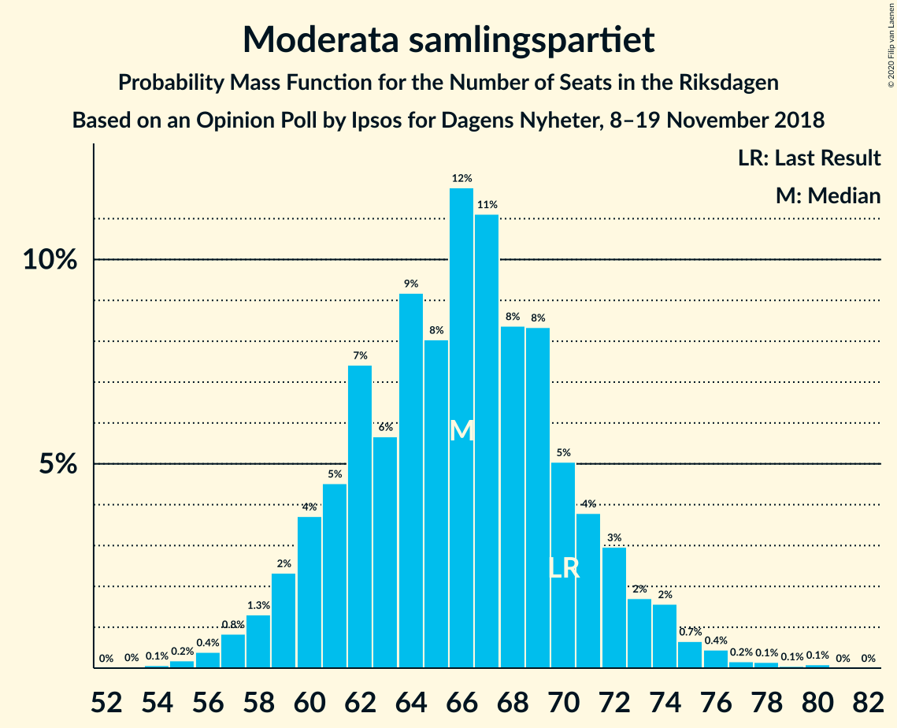
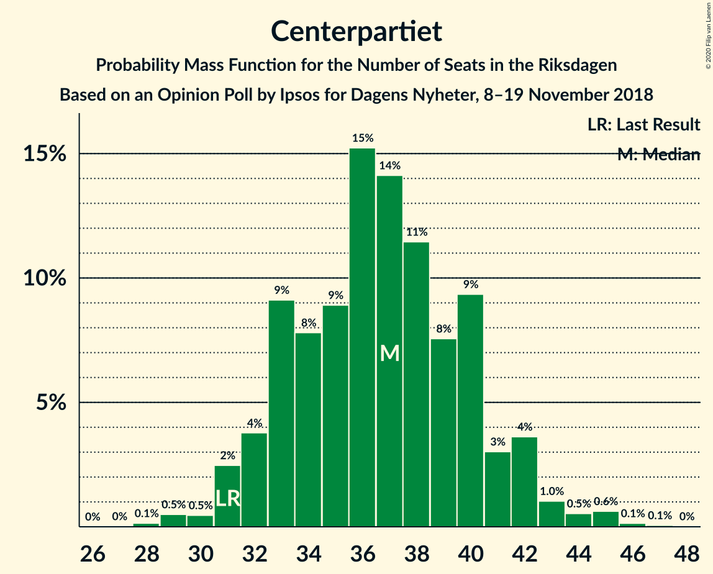

# Opinion Poll by Ipsos for Dagens Nyheter, 8–19 November 2018

<a href="#voting-intentions">Voting Intentions</a> | <a href="#seats">Seats</a> | <a href="#coalitions">Coalitions</a> | <a href="#technical-information">Technical Information</a>

## Voting Intentions

### Confidence Intervals

| Party | Last Result | Poll Result | 80% Confidence Interval | 90% Confidence Interval | 95% Confidence Interval | 99% Confidence Interval |
|:-----:|:-----------:|:-----------:|:-----------------------:|:-----------------------:|:-----------------------:|:-----------------------:|
| Sveriges socialdemokratiska arbetareparti | 28.3% | 28.3% | 26.8–29.8% |26.4–30.2% |26.1–30.6% |25.4–31.3% |
| Sverigedemokraterna | 17.5% | 20.0% | 18.7–21.4% |18.4–21.7% |18.0–22.1% |17.5–22.7% |
| Moderata samlingspartiet | 19.8% | 18.2% | 17.0–19.5% |16.6–19.9% |16.4–20.2% |15.8–20.9% |
| Centerpartiet | 8.6% | 10.1% | 9.2–11.2% |8.9–11.5% |8.7–11.8% |8.3–12.3% |
| Vänsterpartiet | 8.0% | 8.2% | 7.4–9.2% |7.1–9.5% |6.9–9.7% |6.6–10.2% |
| Kristdemokraterna | 6.3% | 5.3% | 4.6–6.1% |4.5–6.4% |4.3–6.6% |4.0–7.0% |
| Liberalerna | 5.5% | 4.5% | 3.9–5.2% |3.7–5.4% |3.5–5.6% |3.3–6.0% |
| Miljöpartiet de gröna | 4.4% | 4.1% | 3.5–4.8% |3.3–5.0% |3.2–5.2% |2.9–5.6% |

*Note:* The poll result column reflects the actual value used in the calculations. Published results may vary slightly, and in addition be rounded to fewer digits.

## Seats

### Confidence Intervals

| Party | Last Result | Median | 80% Confidence Interval | 90% Confidence Interval | 95% Confidence Interval | 99% Confidence Interval |
|:-----:|:-----------:|:------:|:-----------------------:|:-----------------------:|:-----------------------:|:-----------------------:|
| <a href="#sveriges-socialdemokratiska-arbetareparti">Sveriges socialdemokratiska arbetareparti</a> | 100 | 102 | 95–109 |94–111 |93–114 |90–116 |
| <a href="#sverigedemokraterna">Sverigedemokraterna</a> | 62 | 72 | 67–79 |65–81 |64–82 |62–85 |
| <a href="#moderata-samlingspartiet">Moderata samlingspartiet</a> | 70 | 66 | 61–71 |59–72 |58–74 |56–76 |
| <a href="#centerpartiet">Centerpartiet</a> | 31 | 37 | 33–40 |32–42 |31–42 |29–45 |
| <a href="#vänsterpartiet">Vänsterpartiet</a> | 28 | 30 | 26–33 |25–34 |25–35 |23–37 |
| <a href="#kristdemokraterna">Kristdemokraterna</a> | 22 | 20 | 17–22 |16–23 |15–24 |0–26 |
| <a href="#liberalerna">Liberalerna</a> | 20 | 16 | 0–19 |0–20 |0–21 |0–21 |
| <a href="#miljöpartiet-de-gröna">Miljöpartiet de gröna</a> | 16 | 15 | 0–17 |0–18 |0–19 |0–20 |

### Sveriges socialdemokratiska arbetareparti

*For a full overview of the results for this party, see the [Sveriges socialdemokratiska arbetareparti](party-sverigessocialdemokratiskaarbetareparti.html) page.*

| Number of Seats | Probability | Accumulated | Special Marks |
|:---------------:|:-----------:|:-----------:|:-------------:|
| 87 | 0.1% | 100% |  |
| 88 | 0.1% | 99.9% |  |
| 89 | 0.3% | 99.8% |  |
| 90 | 0.3% | 99.5% |  |
| 91 | 0.5% | 99.3% |  |
| 92 | 0.6% | 98.8% |  |
| 93 | 1.5% | 98% |  |
| 94 | 2% | 97% |  |
| 95 | 5% | 95% |  |
| 96 | 5% | 89% |  |
| 97 | 4% | 84% |  |
| 98 | 5% | 80% |  |
| 99 | 4% | 75% |  |
| 100 | 8% | 71% | Last Result |
| 101 | 10% | 63% |  |
| 102 | 9% | 53% | Median |
| 103 | 8% | 44% |  |
| 104 | 6% | 36% |  |
| 105 | 5% | 30% |  |
| 106 | 4% | 25% |  |
| 107 | 3% | 21% |  |
| 108 | 6% | 17% |  |
| 109 | 4% | 11% |  |
| 110 | 2% | 7% |  |
| 111 | 2% | 5% |  |
| 112 | 0.7% | 4% |  |
| 113 | 0.5% | 3% |  |
| 114 | 0.6% | 3% |  |
| 115 | 0.9% | 2% |  |
| 116 | 0.7% | 1.2% |  |
| 117 | 0.3% | 0.5% |  |
| 118 | 0.1% | 0.2% |  |
| 119 | 0% | 0.1% |  |
| 120 | 0% | 0.1% |  |
| 121 | 0% | 0% |  |

### Sverigedemokraterna

*For a full overview of the results for this party, see the [Sverigedemokraterna](party-sverigedemokraterna.html) page.*

| Number of Seats | Probability | Accumulated | Special Marks |
|:---------------:|:-----------:|:-----------:|:-------------:|
| 59 | 0% | 100% |  |
| 60 | 0.1% | 99.9% |  |
| 61 | 0.2% | 99.8% |  |
| 62 | 0.8% | 99.6% | Last Result |
| 63 | 0.9% | 98.8% |  |
| 64 | 1.1% | 98% |  |
| 65 | 3% | 97% |  |
| 66 | 3% | 94% |  |
| 67 | 5% | 91% |  |
| 68 | 7% | 87% |  |
| 69 | 9% | 80% |  |
| 70 | 7% | 70% |  |
| 71 | 7% | 63% |  |
| 72 | 9% | 56% | Median |
| 73 | 9% | 47% |  |
| 74 | 9% | 38% |  |
| 75 | 7% | 29% |  |
| 76 | 5% | 22% |  |
| 77 | 3% | 17% |  |
| 78 | 3% | 14% |  |
| 79 | 3% | 11% |  |
| 80 | 3% | 8% |  |
| 81 | 1.2% | 5% |  |
| 82 | 2% | 4% |  |
| 83 | 0.6% | 2% |  |
| 84 | 0.4% | 1.0% |  |
| 85 | 0.4% | 0.5% |  |
| 86 | 0.1% | 0.2% |  |
| 87 | 0% | 0.1% |  |
| 88 | 0% | 0% |  |

### Moderata samlingspartiet

*For a full overview of the results for this party, see the [Moderata samlingspartiet](party-moderatasamlingspartiet.html) page.*

| Number of Seats | Probability | Accumulated | Special Marks |
|:---------------:|:-----------:|:-----------:|:-------------:|
| 54 | 0.1% | 100% |  |
| 55 | 0.2% | 99.9% |  |
| 56 | 0.4% | 99.7% |  |
| 57 | 0.8% | 99.3% |  |
| 58 | 1.3% | 98% |  |
| 59 | 2% | 97% |  |
| 60 | 4% | 95% |  |
| 61 | 5% | 91% |  |
| 62 | 7% | 87% |  |
| 63 | 6% | 79% |  |
| 64 | 9% | 73% |  |
| 65 | 8% | 64% |  |
| 66 | 12% | 56% | Median |
| 67 | 11% | 45% |  |
| 68 | 8% | 33% |  |
| 69 | 8% | 25% |  |
| 70 | 5% | 17% | Last Result |
| 71 | 4% | 12% |  |
| 72 | 3% | 8% |  |
| 73 | 2% | 5% |  |
| 74 | 2% | 3% |  |
| 75 | 0.7% | 2% |  |
| 76 | 0.4% | 0.9% |  |
| 77 | 0.2% | 0.5% |  |
| 78 | 0.1% | 0.3% |  |
| 79 | 0.1% | 0.2% |  |
| 80 | 0.1% | 0.1% |  |
| 81 | 0% | 0% |  |

### Centerpartiet

*For a full overview of the results for this party, see the [Centerpartiet](party-centerpartiet.html) page.*

| Number of Seats | Probability | Accumulated | Special Marks |
|:---------------:|:-----------:|:-----------:|:-------------:|
| 28 | 0.1% | 100% |  |
| 29 | 0.5% | 99.8% |  |
| 30 | 0.5% | 99.3% |  |
| 31 | 2% | 98.9% | Last Result |
| 32 | 4% | 96% |  |
| 33 | 9% | 93% |  |
| 34 | 8% | 84% |  |
| 35 | 9% | 76% |  |
| 36 | 15% | 67% |  |
| 37 | 14% | 52% | Median |
| 38 | 11% | 37% |  |
| 39 | 8% | 26% |  |
| 40 | 9% | 18% |  |
| 41 | 3% | 9% |  |
| 42 | 4% | 6% |  |
| 43 | 1.0% | 2% |  |
| 44 | 0.5% | 1.4% |  |
| 45 | 0.6% | 0.9% |  |
| 46 | 0.1% | 0.2% |  |
| 47 | 0.1% | 0.1% |  |
| 48 | 0% | 0% |  |

### Vänsterpartiet

*For a full overview of the results for this party, see the [Vänsterpartiet](party-vänsterpartiet.html) page.*

| Number of Seats | Probability | Accumulated | Special Marks |
|:---------------:|:-----------:|:-----------:|:-------------:|
| 22 | 0.1% | 100% |  |
| 23 | 0.4% | 99.8% |  |
| 24 | 2% | 99.4% |  |
| 25 | 4% | 98% |  |
| 26 | 5% | 94% |  |
| 27 | 9% | 89% |  |
| 28 | 13% | 80% | Last Result |
| 29 | 12% | 66% |  |
| 30 | 17% | 54% | Median |
| 31 | 11% | 38% |  |
| 32 | 10% | 26% |  |
| 33 | 8% | 16% |  |
| 34 | 5% | 9% |  |
| 35 | 2% | 4% |  |
| 36 | 1.1% | 2% |  |
| 37 | 0.5% | 1.0% |  |
| 38 | 0.3% | 0.4% |  |
| 39 | 0.1% | 0.1% |  |
| 40 | 0% | 0.1% |  |
| 41 | 0% | 0% |  |

### Kristdemokraterna

*For a full overview of the results for this party, see the [Kristdemokraterna](party-kristdemokraterna.html) page.*

| Number of Seats | Probability | Accumulated | Special Marks |
|:---------------:|:-----------:|:-----------:|:-------------:|
| 0 | 0.6% | 100% |  |
| 1 | 0% | 99.4% |  |
| 2 | 0% | 99.4% |  |
| 3 | 0% | 99.4% |  |
| 4 | 0% | 99.4% |  |
| 5 | 0% | 99.4% |  |
| 6 | 0% | 99.4% |  |
| 7 | 0% | 99.4% |  |
| 8 | 0% | 99.4% |  |
| 9 | 0% | 99.4% |  |
| 10 | 0% | 99.4% |  |
| 11 | 0% | 99.4% |  |
| 12 | 0% | 99.4% |  |
| 13 | 0% | 99.4% |  |
| 14 | 0.7% | 99.4% |  |
| 15 | 2% | 98.7% |  |
| 16 | 5% | 97% |  |
| 17 | 7% | 92% |  |
| 18 | 16% | 85% |  |
| 19 | 15% | 68% |  |
| 20 | 25% | 53% | Median |
| 21 | 12% | 28% |  |
| 22 | 8% | 16% | Last Result |
| 23 | 4% | 8% |  |
| 24 | 2% | 3% |  |
| 25 | 0.9% | 2% |  |
| 26 | 0.5% | 0.7% |  |
| 27 | 0.1% | 0.1% |  |
| 28 | 0% | 0% |  |

### Liberalerna

*For a full overview of the results for this party, see the [Liberalerna](party-liberalerna.html) page.*

| Number of Seats | Probability | Accumulated | Special Marks |
|:---------------:|:-----------:|:-----------:|:-------------:|
| 0 | 21% | 100% |  |
| 1 | 0% | 79% |  |
| 2 | 0% | 79% |  |
| 3 | 0% | 79% |  |
| 4 | 0% | 79% |  |
| 5 | 0% | 79% |  |
| 6 | 0% | 79% |  |
| 7 | 0% | 79% |  |
| 8 | 0% | 79% |  |
| 9 | 0% | 79% |  |
| 10 | 0% | 79% |  |
| 11 | 0% | 79% |  |
| 12 | 0% | 79% |  |
| 13 | 0% | 79% |  |
| 14 | 5% | 79% |  |
| 15 | 17% | 74% |  |
| 16 | 13% | 57% | Median |
| 17 | 16% | 44% |  |
| 18 | 15% | 28% |  |
| 19 | 4% | 13% |  |
| 20 | 6% | 9% | Last Result |
| 21 | 2% | 3% |  |
| 22 | 0.3% | 0.5% |  |
| 23 | 0.1% | 0.1% |  |
| 24 | 0% | 0% |  |

### Miljöpartiet de gröna

*For a full overview of the results for this party, see the [Miljöpartiet de gröna](party-miljöpartietdegröna.html) page.*

| Number of Seats | Probability | Accumulated | Special Marks |
|:---------------:|:-----------:|:-----------:|:-------------:|
| 0 | 40% | 100% |  |
| 1 | 0% | 60% |  |
| 2 | 0% | 60% |  |
| 3 | 0% | 60% |  |
| 4 | 0% | 60% |  |
| 5 | 0% | 60% |  |
| 6 | 0% | 60% |  |
| 7 | 0% | 60% |  |
| 8 | 0% | 60% |  |
| 9 | 0% | 60% |  |
| 10 | 0% | 60% |  |
| 11 | 0% | 60% |  |
| 12 | 0% | 60% |  |
| 13 | 0% | 60% |  |
| 14 | 8% | 60% |  |
| 15 | 19% | 51% | Median |
| 16 | 14% | 32% | Last Result |
| 17 | 11% | 18% |  |
| 18 | 5% | 8% |  |
| 19 | 2% | 3% |  |
| 20 | 0.7% | 0.8% |  |
| 21 | 0.1% | 0.2% |  |
| 22 | 0% | 0% |  |

## Coalitions

### Confidence Intervals

| Coalition | Last Result | Median | Majority? | 80% Confidence Interval | 90% Confidence Interval | 95% Confidence Interval | 99% Confidence Interval |
|:---------:|:-----------:|:------:|:---------:|:-----------------------:|:-----------------------:|:-----------------------:|:-----------------------:|
| Sveriges socialdemokratiska arbetareparti – Moderata samlingspartiet – Centerpartiet | 201 | 204 | 100% | 196–215 | 194–217 | 192–220 | 189–224 |
| Sveriges socialdemokratiska arbetareparti – Moderata samlingspartiet | 170 | 167 | 16% | 161–177 | 158–179 | 156–182 | 153–186 |
| Sverigedemokraterna – Moderata samlingspartiet – Kristdemokraterna | 154 | 157 | 0.7% | 150–166 | 148–169 | 146–172 | 143–175 |
| Sveriges socialdemokratiska arbetareparti – Vänsterpartiet – Miljöpartiet de gröna | 144 | 142 | 0% | 132–151 | 130–154 | 128–155 | 125–159 |
| Sverigedemokraterna – Moderata samlingspartiet | 132 | 137 | 0% | 131–147 | 129–149 | 127–151 | 124–156 |
| Moderata samlingspartiet – Centerpartiet – Kristdemokraterna – Liberalerna | 143 | 136 | 0% | 124–145 | 122–147 | 121–148 | 117–152 |
| Sveriges socialdemokratiska arbetareparti – Vänsterpartiet | 128 | 132 | 0% | 125–140 | 123–142 | 121–145 | 118–149 |
| Moderata samlingspartiet – Centerpartiet – Kristdemokraterna | 123 | 122 | 0% | 115–129 | 113–131 | 111–133 | 107–137 |
| Moderata samlingspartiet – Centerpartiet – Liberalerna | 121 | 117 | 0% | 105–125 | 102–127 | 101–128 | 97–132 |
| Sveriges socialdemokratiska arbetareparti – Miljöpartiet de gröna | 116 | 111 | 0% | 101–121 | 100–123 | 98–125 | 94–130 |
| Moderata samlingspartiet – Centerpartiet | 101 | 102 | 0% | 96–109 | 94–111 | 93–112 | 91–116 |

### Sveriges socialdemokratiska arbetareparti – Moderata samlingspartiet – Centerpartiet

| Number of Seats | Probability | Accumulated | Special Marks |
|:---------------:|:-----------:|:-----------:|:-------------:|
| 185 | 0% | 100% |  |
| 186 | 0.1% | 99.9% |  |
| 187 | 0.1% | 99.9% |  |
| 188 | 0.2% | 99.8% |  |
| 189 | 0.6% | 99.6% |  |
| 190 | 0.4% | 99.0% |  |
| 191 | 0.9% | 98.7% |  |
| 192 | 1.4% | 98% |  |
| 193 | 1.2% | 96% |  |
| 194 | 2% | 95% |  |
| 195 | 2% | 94% |  |
| 196 | 4% | 91% |  |
| 197 | 4% | 88% |  |
| 198 | 4% | 83% |  |
| 199 | 7% | 80% |  |
| 200 | 6% | 72% |  |
| 201 | 5% | 67% | Last Result |
| 202 | 3% | 62% |  |
| 203 | 6% | 59% |  |
| 204 | 4% | 53% |  |
| 205 | 4% | 49% | Median |
| 206 | 6% | 45% |  |
| 207 | 4% | 39% |  |
| 208 | 4% | 35% |  |
| 209 | 4% | 30% |  |
| 210 | 3% | 26% |  |
| 211 | 4% | 23% |  |
| 212 | 3% | 19% |  |
| 213 | 3% | 16% |  |
| 214 | 3% | 13% |  |
| 215 | 4% | 11% |  |
| 216 | 0.6% | 6% |  |
| 217 | 2% | 6% |  |
| 218 | 0.8% | 4% |  |
| 219 | 0.8% | 3% |  |
| 220 | 0.3% | 3% |  |
| 221 | 0.4% | 2% |  |
| 222 | 0.3% | 2% |  |
| 223 | 0.3% | 1.5% |  |
| 224 | 0.8% | 1.2% |  |
| 225 | 0.1% | 0.4% |  |
| 226 | 0.1% | 0.3% |  |
| 227 | 0.1% | 0.2% |  |
| 228 | 0% | 0.1% |  |
| 229 | 0% | 0.1% |  |
| 230 | 0% | 0.1% |  |
| 231 | 0% | 0% |  |

### Sveriges socialdemokratiska arbetareparti – Moderata samlingspartiet

| Number of Seats | Probability | Accumulated | Special Marks |
|:---------------:|:-----------:|:-----------:|:-------------:|
| 150 | 0% | 100% |  |
| 151 | 0.1% | 99.9% |  |
| 152 | 0.1% | 99.8% |  |
| 153 | 0.5% | 99.7% |  |
| 154 | 0.7% | 99.2% |  |
| 155 | 0.7% | 98.6% |  |
| 156 | 0.7% | 98% |  |
| 157 | 1.3% | 97% |  |
| 158 | 1.5% | 96% |  |
| 159 | 3% | 94% |  |
| 160 | 1.2% | 91% |  |
| 161 | 3% | 90% |  |
| 162 | 8% | 87% |  |
| 163 | 8% | 80% |  |
| 164 | 3% | 71% |  |
| 165 | 7% | 68% |  |
| 166 | 6% | 62% |  |
| 167 | 7% | 56% |  |
| 168 | 5% | 49% | Median |
| 169 | 6% | 45% |  |
| 170 | 5% | 39% | Last Result |
| 171 | 7% | 34% |  |
| 172 | 2% | 27% |  |
| 173 | 5% | 25% |  |
| 174 | 4% | 20% |  |
| 175 | 2% | 16% | Majority |
| 176 | 1.5% | 14% |  |
| 177 | 3% | 12% |  |
| 178 | 3% | 9% |  |
| 179 | 2% | 6% |  |
| 180 | 0.6% | 4% |  |
| 181 | 0.7% | 4% |  |
| 182 | 0.6% | 3% |  |
| 183 | 0.7% | 2% |  |
| 184 | 0.2% | 2% |  |
| 185 | 0.2% | 1.4% |  |
| 186 | 0.8% | 1.2% |  |
| 187 | 0.1% | 0.3% |  |
| 188 | 0.1% | 0.2% |  |
| 189 | 0.1% | 0.2% |  |
| 190 | 0.1% | 0.1% |  |
| 191 | 0% | 0.1% |  |
| 192 | 0% | 0% |  |

### Sverigedemokraterna – Moderata samlingspartiet – Kristdemokraterna

| Number of Seats | Probability | Accumulated | Special Marks |
|:---------------:|:-----------:|:-----------:|:-------------:|
| 137 | 0% | 100% |  |
| 138 | 0% | 99.9% |  |
| 139 | 0.1% | 99.9% |  |
| 140 | 0.1% | 99.9% |  |
| 141 | 0.1% | 99.8% |  |
| 142 | 0.2% | 99.7% |  |
| 143 | 0.3% | 99.5% |  |
| 144 | 0.5% | 99.2% |  |
| 145 | 0.6% | 98.8% |  |
| 146 | 0.9% | 98% |  |
| 147 | 2% | 97% |  |
| 148 | 2% | 95% |  |
| 149 | 3% | 93% |  |
| 150 | 2% | 90% |  |
| 151 | 3% | 88% |  |
| 152 | 7% | 85% |  |
| 153 | 5% | 78% |  |
| 154 | 6% | 73% | Last Result |
| 155 | 8% | 67% |  |
| 156 | 8% | 60% |  |
| 157 | 4% | 52% |  |
| 158 | 6% | 48% | Median |
| 159 | 6% | 42% |  |
| 160 | 5% | 37% |  |
| 161 | 6% | 32% |  |
| 162 | 5% | 26% |  |
| 163 | 4% | 21% |  |
| 164 | 3% | 18% |  |
| 165 | 3% | 15% |  |
| 166 | 3% | 12% |  |
| 167 | 2% | 9% |  |
| 168 | 2% | 7% |  |
| 169 | 0.7% | 5% |  |
| 170 | 0.9% | 5% |  |
| 171 | 0.6% | 4% |  |
| 172 | 2% | 3% |  |
| 173 | 0.3% | 1.2% |  |
| 174 | 0.1% | 0.9% |  |
| 175 | 0.3% | 0.7% | Majority |
| 176 | 0.2% | 0.5% |  |
| 177 | 0.1% | 0.3% |  |
| 178 | 0% | 0.2% |  |
| 179 | 0.1% | 0.1% |  |
| 180 | 0% | 0.1% |  |
| 181 | 0% | 0% |  |

### Sveriges socialdemokratiska arbetareparti – Vänsterpartiet – Miljöpartiet de gröna

| Number of Seats | Probability | Accumulated | Special Marks |
|:---------------:|:-----------:|:-----------:|:-------------:|
| 121 | 0.1% | 100% |  |
| 122 | 0.1% | 99.9% |  |
| 123 | 0.1% | 99.8% |  |
| 124 | 0.2% | 99.7% |  |
| 125 | 0.4% | 99.6% |  |
| 126 | 0.3% | 99.2% |  |
| 127 | 0.7% | 98.9% |  |
| 128 | 0.9% | 98% |  |
| 129 | 1.3% | 97% |  |
| 130 | 3% | 96% |  |
| 131 | 3% | 93% |  |
| 132 | 4% | 90% |  |
| 133 | 3% | 86% |  |
| 134 | 4% | 83% |  |
| 135 | 3% | 79% |  |
| 136 | 3% | 76% |  |
| 137 | 2% | 73% |  |
| 138 | 4% | 71% |  |
| 139 | 6% | 67% |  |
| 140 | 6% | 61% |  |
| 141 | 5% | 55% |  |
| 142 | 6% | 50% |  |
| 143 | 3% | 45% |  |
| 144 | 7% | 42% | Last Result |
| 145 | 5% | 34% |  |
| 146 | 5% | 29% |  |
| 147 | 3% | 24% | Median |
| 148 | 5% | 21% |  |
| 149 | 5% | 17% |  |
| 150 | 2% | 12% |  |
| 151 | 2% | 10% |  |
| 152 | 2% | 9% |  |
| 153 | 1.3% | 6% |  |
| 154 | 1.5% | 5% |  |
| 155 | 1.3% | 4% |  |
| 156 | 0.5% | 2% |  |
| 157 | 0.7% | 2% |  |
| 158 | 0.3% | 1.0% |  |
| 159 | 0.3% | 0.7% |  |
| 160 | 0.1% | 0.4% |  |
| 161 | 0.2% | 0.3% |  |
| 162 | 0% | 0.1% |  |
| 163 | 0% | 0.1% |  |
| 164 | 0% | 0% |  |

### Sverigedemokraterna – Moderata samlingspartiet

| Number of Seats | Probability | Accumulated | Special Marks |
|:---------------:|:-----------:|:-----------:|:-------------:|
| 121 | 0% | 100% |  |
| 122 | 0.1% | 99.9% |  |
| 123 | 0.2% | 99.8% |  |
| 124 | 0.3% | 99.6% |  |
| 125 | 0.4% | 99.3% |  |
| 126 | 0.8% | 98.9% |  |
| 127 | 0.9% | 98% |  |
| 128 | 1.2% | 97% |  |
| 129 | 2% | 96% |  |
| 130 | 3% | 94% |  |
| 131 | 3% | 91% |  |
| 132 | 5% | 88% | Last Result |
| 133 | 5% | 83% |  |
| 134 | 7% | 78% |  |
| 135 | 7% | 71% |  |
| 136 | 7% | 64% |  |
| 137 | 8% | 57% |  |
| 138 | 6% | 50% | Median |
| 139 | 5% | 43% |  |
| 140 | 5% | 38% |  |
| 141 | 2% | 33% |  |
| 142 | 6% | 31% |  |
| 143 | 5% | 25% |  |
| 144 | 3% | 20% |  |
| 145 | 2% | 17% |  |
| 146 | 4% | 14% |  |
| 147 | 4% | 10% |  |
| 148 | 1.3% | 6% |  |
| 149 | 0.7% | 5% |  |
| 150 | 0.5% | 4% |  |
| 151 | 2% | 4% |  |
| 152 | 0.3% | 1.4% |  |
| 153 | 0.3% | 1.2% |  |
| 154 | 0.2% | 0.9% |  |
| 155 | 0.1% | 0.7% |  |
| 156 | 0.3% | 0.5% |  |
| 157 | 0.1% | 0.3% |  |
| 158 | 0.1% | 0.2% |  |
| 159 | 0% | 0.1% |  |
| 160 | 0% | 0.1% |  |
| 161 | 0% | 0.1% |  |
| 162 | 0% | 0% |  |

### Moderata samlingspartiet – Centerpartiet – Kristdemokraterna – Liberalerna

| Number of Seats | Probability | Accumulated | Special Marks |
|:---------------:|:-----------:|:-----------:|:-------------:|
| 114 | 0.1% | 100% |  |
| 115 | 0.2% | 99.9% |  |
| 116 | 0.1% | 99.6% |  |
| 117 | 0.2% | 99.5% |  |
| 118 | 0.1% | 99.4% |  |
| 119 | 0.3% | 99.2% |  |
| 120 | 1.3% | 98.9% |  |
| 121 | 2% | 98% |  |
| 122 | 2% | 96% |  |
| 123 | 3% | 93% |  |
| 124 | 0.9% | 91% |  |
| 125 | 1.0% | 90% |  |
| 126 | 1.4% | 89% |  |
| 127 | 1.3% | 87% |  |
| 128 | 6% | 86% |  |
| 129 | 5% | 80% |  |
| 130 | 4% | 74% |  |
| 131 | 3% | 70% |  |
| 132 | 3% | 68% |  |
| 133 | 3% | 65% |  |
| 134 | 6% | 62% |  |
| 135 | 4% | 56% |  |
| 136 | 4% | 52% |  |
| 137 | 5% | 47% |  |
| 138 | 2% | 42% |  |
| 139 | 5% | 40% | Median |
| 140 | 6% | 35% |  |
| 141 | 8% | 29% |  |
| 142 | 4% | 21% |  |
| 143 | 1.4% | 17% | Last Result |
| 144 | 4% | 15% |  |
| 145 | 3% | 11% |  |
| 146 | 3% | 9% |  |
| 147 | 3% | 6% |  |
| 148 | 0.9% | 3% |  |
| 149 | 0.7% | 2% |  |
| 150 | 0.2% | 1.2% |  |
| 151 | 0.4% | 1.0% |  |
| 152 | 0.3% | 0.6% |  |
| 153 | 0.2% | 0.3% |  |
| 154 | 0% | 0.1% |  |
| 155 | 0% | 0.1% |  |
| 156 | 0% | 0% |  |

### Sveriges socialdemokratiska arbetareparti – Vänsterpartiet

| Number of Seats | Probability | Accumulated | Special Marks |
|:---------------:|:-----------:|:-----------:|:-------------:|
| 115 | 0% | 100% |  |
| 116 | 0.1% | 99.9% |  |
| 117 | 0.2% | 99.9% |  |
| 118 | 0.2% | 99.6% |  |
| 119 | 0.5% | 99.4% |  |
| 120 | 0.8% | 98.9% |  |
| 121 | 0.9% | 98% |  |
| 122 | 2% | 97% |  |
| 123 | 2% | 96% |  |
| 124 | 1.4% | 94% |  |
| 125 | 6% | 92% |  |
| 126 | 4% | 87% |  |
| 127 | 7% | 83% |  |
| 128 | 5% | 76% | Last Result |
| 129 | 7% | 71% |  |
| 130 | 8% | 64% |  |
| 131 | 6% | 56% |  |
| 132 | 10% | 51% | Median |
| 133 | 5% | 41% |  |
| 134 | 6% | 36% |  |
| 135 | 3% | 30% |  |
| 136 | 5% | 27% |  |
| 137 | 3% | 21% |  |
| 138 | 3% | 18% |  |
| 139 | 4% | 15% |  |
| 140 | 3% | 11% |  |
| 141 | 2% | 8% |  |
| 142 | 2% | 6% |  |
| 143 | 0.8% | 4% |  |
| 144 | 0.7% | 3% |  |
| 145 | 1.1% | 3% |  |
| 146 | 0.4% | 1.5% |  |
| 147 | 0.1% | 1.1% |  |
| 148 | 0.4% | 1.0% |  |
| 149 | 0.5% | 0.6% |  |
| 150 | 0% | 0.1% |  |
| 151 | 0% | 0.1% |  |
| 152 | 0% | 0.1% |  |
| 153 | 0% | 0% |  |

### Moderata samlingspartiet – Centerpartiet – Kristdemokraterna

| Number of Seats | Probability | Accumulated | Special Marks |
|:---------------:|:-----------:|:-----------:|:-------------:|
| 101 | 0.1% | 100% |  |
| 102 | 0% | 99.9% |  |
| 103 | 0% | 99.9% |  |
| 104 | 0% | 99.9% |  |
| 105 | 0.1% | 99.8% |  |
| 106 | 0.2% | 99.8% |  |
| 107 | 0.1% | 99.6% |  |
| 108 | 0.2% | 99.5% |  |
| 109 | 0.6% | 99.2% |  |
| 110 | 0.5% | 98.6% |  |
| 111 | 1.4% | 98% |  |
| 112 | 2% | 97% |  |
| 113 | 2% | 95% |  |
| 114 | 2% | 94% |  |
| 115 | 6% | 91% |  |
| 116 | 4% | 86% |  |
| 117 | 3% | 82% |  |
| 118 | 4% | 79% |  |
| 119 | 5% | 75% |  |
| 120 | 7% | 70% |  |
| 121 | 7% | 63% |  |
| 122 | 9% | 56% |  |
| 123 | 9% | 47% | Last Result, Median |
| 124 | 10% | 39% |  |
| 125 | 3% | 29% |  |
| 126 | 4% | 26% |  |
| 127 | 3% | 22% |  |
| 128 | 8% | 19% |  |
| 129 | 2% | 11% |  |
| 130 | 3% | 9% |  |
| 131 | 2% | 6% |  |
| 132 | 0.7% | 4% |  |
| 133 | 1.2% | 3% |  |
| 134 | 0.6% | 2% |  |
| 135 | 0.4% | 1.2% |  |
| 136 | 0.2% | 0.7% |  |
| 137 | 0.2% | 0.6% |  |
| 138 | 0.1% | 0.4% |  |
| 139 | 0.2% | 0.3% |  |
| 140 | 0.1% | 0.2% |  |
| 141 | 0.1% | 0.1% |  |
| 142 | 0% | 0% |  |

### Moderata samlingspartiet – Centerpartiet – Liberalerna

| Number of Seats | Probability | Accumulated | Special Marks |
|:---------------:|:-----------:|:-----------:|:-------------:|
| 94 | 0% | 100% |  |
| 95 | 0.1% | 99.9% |  |
| 96 | 0.1% | 99.8% |  |
| 97 | 0.3% | 99.7% |  |
| 98 | 0.1% | 99.4% |  |
| 99 | 0.2% | 99.3% |  |
| 100 | 1.0% | 99.1% |  |
| 101 | 3% | 98% |  |
| 102 | 1.4% | 96% |  |
| 103 | 2% | 94% |  |
| 104 | 0.9% | 92% |  |
| 105 | 2% | 92% |  |
| 106 | 1.5% | 90% |  |
| 107 | 3% | 88% |  |
| 108 | 2% | 86% |  |
| 109 | 3% | 83% |  |
| 110 | 4% | 80% |  |
| 111 | 3% | 76% |  |
| 112 | 5% | 73% |  |
| 113 | 3% | 68% |  |
| 114 | 2% | 65% |  |
| 115 | 7% | 63% |  |
| 116 | 3% | 56% |  |
| 117 | 8% | 53% |  |
| 118 | 5% | 45% |  |
| 119 | 5% | 41% | Median |
| 120 | 5% | 35% |  |
| 121 | 8% | 30% | Last Result |
| 122 | 3% | 21% |  |
| 123 | 4% | 19% |  |
| 124 | 4% | 15% |  |
| 125 | 4% | 12% |  |
| 126 | 2% | 7% |  |
| 127 | 1.5% | 5% |  |
| 128 | 1.3% | 4% |  |
| 129 | 1.2% | 2% |  |
| 130 | 0.5% | 1.3% |  |
| 131 | 0.2% | 0.8% |  |
| 132 | 0.3% | 0.5% |  |
| 133 | 0.1% | 0.3% |  |
| 134 | 0.1% | 0.2% |  |
| 135 | 0.1% | 0.1% |  |
| 136 | 0% | 0% |  |

### Sveriges socialdemokratiska arbetareparti – Miljöpartiet de gröna

| Number of Seats | Probability | Accumulated | Special Marks |
|:---------------:|:-----------:|:-----------:|:-------------:|
| 92 | 0% | 100% |  |
| 93 | 0.1% | 99.9% |  |
| 94 | 0.3% | 99.8% |  |
| 95 | 0.4% | 99.5% |  |
| 96 | 0.6% | 99.1% |  |
| 97 | 1.0% | 98.5% |  |
| 98 | 0.8% | 98% |  |
| 99 | 0.9% | 97% |  |
| 100 | 2% | 96% |  |
| 101 | 5% | 94% |  |
| 102 | 3% | 89% |  |
| 103 | 3% | 86% |  |
| 104 | 4% | 82% |  |
| 105 | 3% | 78% |  |
| 106 | 2% | 75% |  |
| 107 | 2% | 74% |  |
| 108 | 6% | 71% |  |
| 109 | 3% | 66% |  |
| 110 | 9% | 62% |  |
| 111 | 4% | 53% |  |
| 112 | 3% | 49% |  |
| 113 | 3% | 46% |  |
| 114 | 2% | 43% |  |
| 115 | 4% | 40% |  |
| 116 | 7% | 37% | Last Result |
| 117 | 6% | 30% | Median |
| 118 | 6% | 24% |  |
| 119 | 3% | 18% |  |
| 120 | 3% | 15% |  |
| 121 | 2% | 12% |  |
| 122 | 2% | 10% |  |
| 123 | 3% | 8% |  |
| 124 | 1.5% | 5% |  |
| 125 | 2% | 3% |  |
| 126 | 0.5% | 2% |  |
| 127 | 0.2% | 1.1% |  |
| 128 | 0.1% | 0.9% |  |
| 129 | 0.2% | 0.8% |  |
| 130 | 0.4% | 0.6% |  |
| 131 | 0.1% | 0.1% |  |
| 132 | 0% | 0% |  |

### Moderata samlingspartiet – Centerpartiet

| Number of Seats | Probability | Accumulated | Special Marks |
|:---------------:|:-----------:|:-----------:|:-------------:|
| 87 | 0% | 100% |  |
| 88 | 0.1% | 99.9% |  |
| 89 | 0.2% | 99.9% |  |
| 90 | 0.2% | 99.7% |  |
| 91 | 0.5% | 99.5% |  |
| 92 | 0.7% | 99.0% |  |
| 93 | 1.1% | 98% |  |
| 94 | 3% | 97% |  |
| 95 | 3% | 95% |  |
| 96 | 4% | 92% |  |
| 97 | 5% | 88% |  |
| 98 | 3% | 83% |  |
| 99 | 6% | 80% |  |
| 100 | 7% | 74% |  |
| 101 | 9% | 68% | Last Result |
| 102 | 9% | 59% |  |
| 103 | 8% | 49% | Median |
| 104 | 9% | 41% |  |
| 105 | 6% | 33% |  |
| 106 | 5% | 27% |  |
| 107 | 4% | 22% |  |
| 108 | 5% | 18% |  |
| 109 | 4% | 12% |  |
| 110 | 2% | 8% |  |
| 111 | 2% | 6% |  |
| 112 | 2% | 4% |  |
| 113 | 0.9% | 2% |  |
| 114 | 0.3% | 1.4% |  |
| 115 | 0.4% | 1.1% |  |
| 116 | 0.3% | 0.7% |  |
| 117 | 0.1% | 0.4% |  |
| 118 | 0.1% | 0.2% |  |
| 119 | 0.1% | 0.2% |  |
| 120 | 0% | 0.1% |  |
| 121 | 0% | 0% |  |

## Technical Information

### Opinion Poll

+ **Polling firm:** Ipsos
+ **Commissioner(s):** Dagens Nyheter
+ **Fieldwork period:** 8–19 November 2018

### Calculations

+ **Sample size:** 1521
+ **Simulations done:** 1,048,576
+ **Error estimate:** 1.95%

