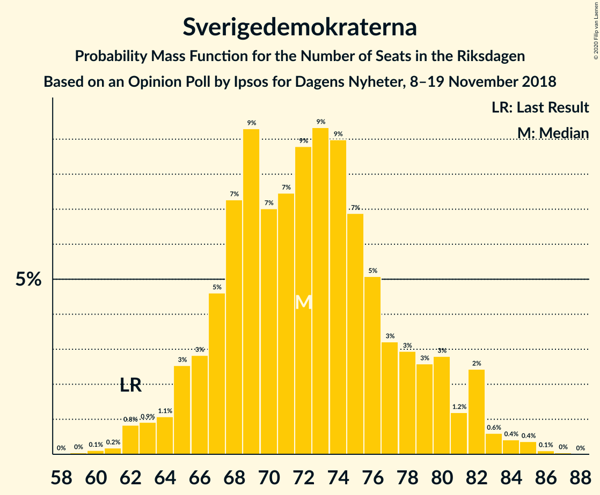
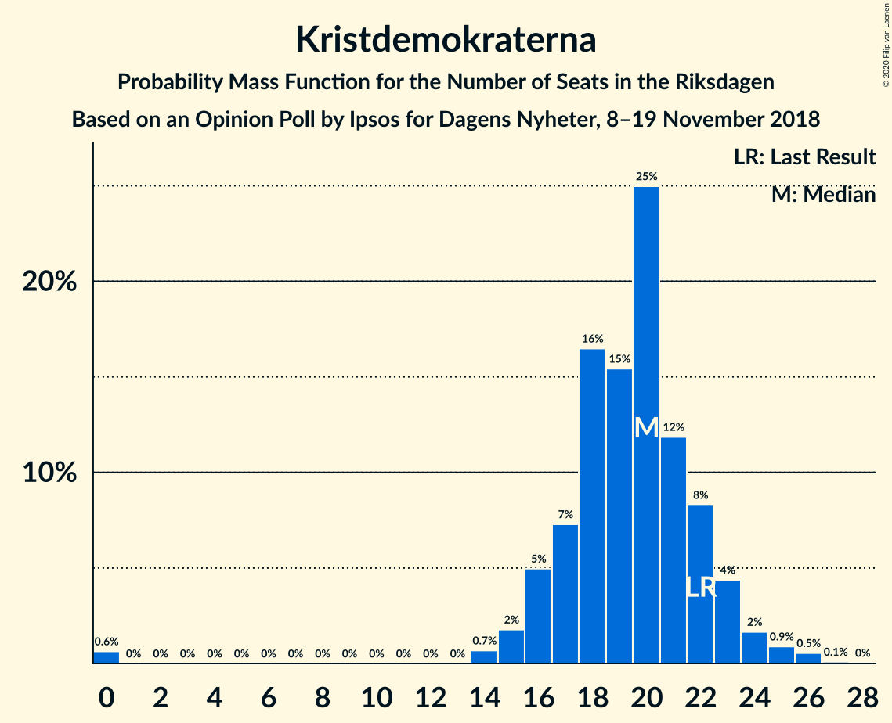
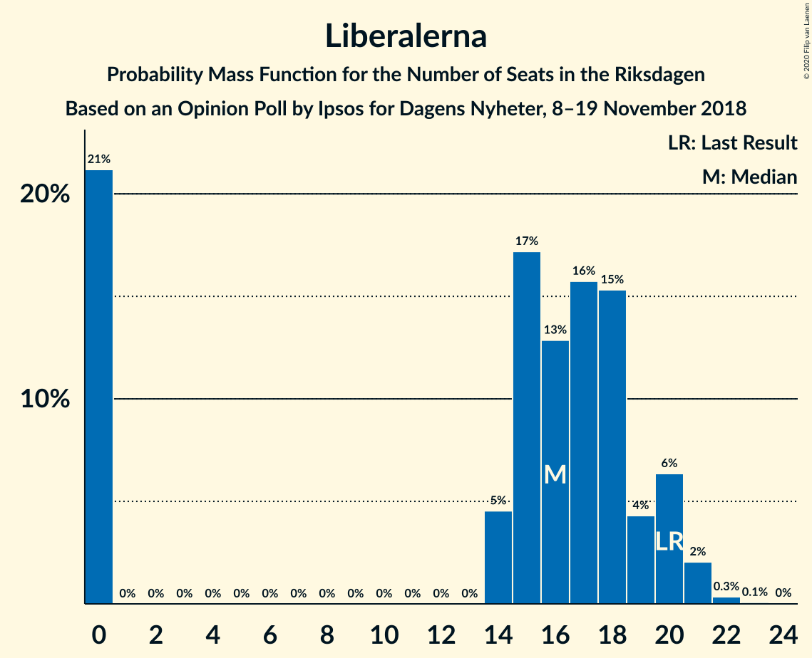
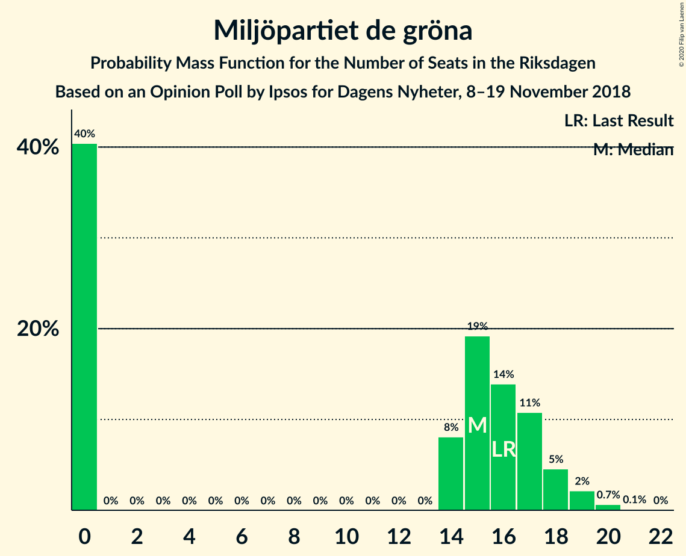

# Opinion Poll by Ipsos for Dagens Nyheter, 8–19 November 2018

<a href="#voting-intentions">Voting Intentions</a> | <a href="#seats">Seats</a> | <a href="#coalitions">Coalitions</a> | <a href="#technical-information">Technical Information</a>

## Voting Intentions

### Confidence Intervals

| Party | Last Result | Poll Result | 80% Confidence Interval | 90% Confidence Interval | 95% Confidence Interval | 99% Confidence Interval |
|:-----:|:-----------:|:-----------:|:-----------------------:|:-----------------------:|:-----------------------:|:-----------------------:|
| Sveriges socialdemokratiska arbetareparti | 28.3% | 28.3% | 26.8–29.8% |26.4–30.2% |26.1–30.6% |25.4–31.3% |
| Sverigedemokraterna | 17.5% | 20.0% | 18.7–21.4% |18.4–21.7% |18.0–22.1% |17.5–22.7% |
| Moderata samlingspartiet | 19.8% | 18.2% | 17.0–19.5% |16.6–19.9% |16.4–20.2% |15.8–20.9% |
| Centerpartiet | 8.6% | 10.1% | 9.2–11.2% |8.9–11.5% |8.7–11.8% |8.3–12.3% |
| Vänsterpartiet | 8.0% | 8.2% | 7.4–9.2% |7.1–9.5% |6.9–9.7% |6.6–10.2% |
| Kristdemokraterna | 6.3% | 5.3% | 4.6–6.1% |4.5–6.4% |4.3–6.6% |4.0–7.0% |
| Liberalerna | 5.5% | 4.5% | 3.9–5.2% |3.7–5.4% |3.5–5.6% |3.3–6.0% |
| Miljöpartiet de gröna | 4.4% | 4.1% | 3.5–4.8% |3.3–5.0% |3.2–5.2% |2.9–5.6% |

*Note:* The poll result column reflects the actual value used in the calculations. Published results may vary slightly, and in addition be rounded to fewer digits.

## Seats

### Confidence Intervals

| Party | Last Result | Median | 80% Confidence Interval | 90% Confidence Interval | 95% Confidence Interval | 99% Confidence Interval |
|:-----:|:-----------:|:------:|:-----------------------:|:-----------------------:|:-----------------------:|:-----------------------:|
| <a href="#sveriges-socialdemokratiska-arbetareparti">Sveriges socialdemokratiska arbetareparti</a> | 100 | 102 | 96–109 |94–111 |93–111 |91–115 |
| <a href="#sverigedemokraterna">Sverigedemokraterna</a> | 62 | 71 | 68–78 |65–78 |64–82 |62–84 |
| <a href="#moderata-samlingspartiet">Moderata samlingspartiet</a> | 70 | 66 | 60–70 |59–73 |58–73 |57–76 |
| <a href="#centerpartiet">Centerpartiet</a> | 31 | 36 | 33–40 |32–41 |32–42 |29–45 |
| <a href="#vänsterpartiet">Vänsterpartiet</a> | 28 | 29 | 26–34 |26–35 |25–35 |24–37 |
| <a href="#kristdemokraterna">Kristdemokraterna</a> | 22 | 20 | 17–22 |16–23 |16–24 |0–26 |
| <a href="#liberalerna">Liberalerna</a> | 20 | 17 | 0–18 |0–20 |0–20 |0–21 |
| <a href="#miljöpartiet-de-gröna">Miljöpartiet de gröna</a> | 16 | 14 | 0–17 |0–18 |0–19 |0–20 |

### Sveriges socialdemokratiska arbetareparti

*For a full overview of the results for this party, see the [Sveriges socialdemokratiska arbetareparti](party-sverigessocialdemokratiskaarbetareparti.html) page.*

| Number of Seats | Probability | Accumulated | Special Marks |
|:---------------:|:-----------:|:-----------:|:-------------:|
| 87 | 0% | 100% |  |
| 88 | 0% | 99.9% |  |
| 89 | 0.3% | 99.9% |  |
| 90 | 0.1% | 99.6% |  |
| 91 | 0.8% | 99.5% |  |
| 92 | 0.8% | 98.7% |  |
| 93 | 2% | 98% |  |
| 94 | 2% | 96% |  |
| 95 | 1.3% | 94% |  |
| 96 | 17% | 93% |  |
| 97 | 4% | 75% |  |
| 98 | 1.4% | 71% |  |
| 99 | 2% | 70% |  |
| 100 | 4% | 68% | Last Result |
| 101 | 11% | 64% |  |
| 102 | 6% | 53% | Median |
| 103 | 9% | 46% |  |
| 104 | 3% | 37% |  |
| 105 | 4% | 34% |  |
| 106 | 2% | 30% |  |
| 107 | 2% | 28% |  |
| 108 | 13% | 26% |  |
| 109 | 5% | 12% |  |
| 110 | 0.7% | 7% |  |
| 111 | 5% | 7% |  |
| 112 | 0.2% | 1.4% |  |
| 113 | 0.2% | 1.2% |  |
| 114 | 0.4% | 1.0% |  |
| 115 | 0.2% | 0.6% |  |
| 116 | 0.2% | 0.3% |  |
| 117 | 0% | 0.1% |  |
| 118 | 0% | 0.1% |  |
| 119 | 0% | 0.1% |  |
| 120 | 0% | 0% |  |

### Sverigedemokraterna

*For a full overview of the results for this party, see the [Sverigedemokraterna](party-sverigedemokraterna.html) page.*

| Number of Seats | Probability | Accumulated | Special Marks |
|:---------------:|:-----------:|:-----------:|:-------------:|
| 59 | 0.1% | 100% |  |
| 60 | 0.2% | 99.9% |  |
| 61 | 0.1% | 99.7% |  |
| 62 | 0.6% | 99.5% | Last Result |
| 63 | 0.8% | 99.0% |  |
| 64 | 2% | 98% |  |
| 65 | 2% | 96% |  |
| 66 | 0.8% | 94% |  |
| 67 | 3% | 93% |  |
| 68 | 13% | 90% |  |
| 69 | 23% | 77% |  |
| 70 | 2% | 54% |  |
| 71 | 7% | 52% | Median |
| 72 | 4% | 45% |  |
| 73 | 10% | 41% |  |
| 74 | 8% | 31% |  |
| 75 | 2% | 23% |  |
| 76 | 5% | 21% |  |
| 77 | 3% | 16% |  |
| 78 | 9% | 13% |  |
| 79 | 0.9% | 5% |  |
| 80 | 0.6% | 4% |  |
| 81 | 0.2% | 3% |  |
| 82 | 2% | 3% |  |
| 83 | 0.6% | 1.1% |  |
| 84 | 0.2% | 0.5% |  |
| 85 | 0% | 0.3% |  |
| 86 | 0.1% | 0.2% |  |
| 87 | 0.1% | 0.1% |  |
| 88 | 0% | 0% |  |

### Moderata samlingspartiet

*For a full overview of the results for this party, see the [Moderata samlingspartiet](party-moderatasamlingspartiet.html) page.*

| Number of Seats | Probability | Accumulated | Special Marks |
|:---------------:|:-----------:|:-----------:|:-------------:|
| 54 | 0.1% | 100% |  |
| 55 | 0% | 99.9% |  |
| 56 | 0.1% | 99.8% |  |
| 57 | 1.3% | 99.7% |  |
| 58 | 1.2% | 98% |  |
| 59 | 7% | 97% |  |
| 60 | 2% | 91% |  |
| 61 | 2% | 89% |  |
| 62 | 7% | 86% |  |
| 63 | 4% | 79% |  |
| 64 | 5% | 75% |  |
| 65 | 4% | 71% |  |
| 66 | 17% | 66% | Median |
| 67 | 21% | 49% |  |
| 68 | 9% | 28% |  |
| 69 | 2% | 19% |  |
| 70 | 7% | 17% | Last Result |
| 71 | 2% | 10% |  |
| 72 | 2% | 7% |  |
| 73 | 3% | 5% |  |
| 74 | 0.8% | 2% |  |
| 75 | 0.4% | 1.1% |  |
| 76 | 0.2% | 0.7% |  |
| 77 | 0.2% | 0.5% |  |
| 78 | 0.1% | 0.3% |  |
| 79 | 0.2% | 0.2% |  |
| 80 | 0% | 0% |  |

### Centerpartiet

*For a full overview of the results for this party, see the [Centerpartiet](party-centerpartiet.html) page.*

| Number of Seats | Probability | Accumulated | Special Marks |
|:---------------:|:-----------:|:-----------:|:-------------:|
| 28 | 0.3% | 100% |  |
| 29 | 0.3% | 99.7% |  |
| 30 | 0.3% | 99.4% |  |
| 31 | 1.3% | 99.1% | Last Result |
| 32 | 6% | 98% |  |
| 33 | 3% | 92% |  |
| 34 | 8% | 89% |  |
| 35 | 5% | 81% |  |
| 36 | 27% | 75% | Median |
| 37 | 13% | 49% |  |
| 38 | 11% | 35% |  |
| 39 | 11% | 25% |  |
| 40 | 6% | 13% |  |
| 41 | 3% | 8% |  |
| 42 | 2% | 5% |  |
| 43 | 0.5% | 2% |  |
| 44 | 0.3% | 2% |  |
| 45 | 1.1% | 1.4% |  |
| 46 | 0.1% | 0.3% |  |
| 47 | 0.2% | 0.2% |  |
| 48 | 0% | 0% |  |

### Vänsterpartiet

*For a full overview of the results for this party, see the [Vänsterpartiet](party-vänsterpartiet.html) page.*

| Number of Seats | Probability | Accumulated | Special Marks |
|:---------------:|:-----------:|:-----------:|:-------------:|
| 21 | 0.1% | 100% |  |
| 22 | 0% | 99.9% |  |
| 23 | 0.4% | 99.9% |  |
| 24 | 1.1% | 99.5% |  |
| 25 | 2% | 98% |  |
| 26 | 10% | 96% |  |
| 27 | 12% | 86% |  |
| 28 | 7% | 74% | Last Result |
| 29 | 21% | 67% | Median |
| 30 | 8% | 46% |  |
| 31 | 7% | 37% |  |
| 32 | 18% | 31% |  |
| 33 | 2% | 12% |  |
| 34 | 4% | 10% |  |
| 35 | 5% | 7% |  |
| 36 | 1.2% | 2% |  |
| 37 | 0.3% | 0.6% |  |
| 38 | 0.2% | 0.3% |  |
| 39 | 0.1% | 0.1% |  |
| 40 | 0% | 0% |  |

### Kristdemokraterna

*For a full overview of the results for this party, see the [Kristdemokraterna](party-kristdemokraterna.html) page.*

| Number of Seats | Probability | Accumulated | Special Marks |
|:---------------:|:-----------:|:-----------:|:-------------:|
| 0 | 1.2% | 100% |  |
| 1 | 0% | 98.8% |  |
| 2 | 0% | 98.8% |  |
| 3 | 0% | 98.8% |  |
| 4 | 0% | 98.8% |  |
| 5 | 0% | 98.8% |  |
| 6 | 0% | 98.8% |  |
| 7 | 0% | 98.8% |  |
| 8 | 0% | 98.8% |  |
| 9 | 0% | 98.8% |  |
| 10 | 0% | 98.8% |  |
| 11 | 0% | 98.8% |  |
| 12 | 0% | 98.8% |  |
| 13 | 0% | 98.8% |  |
| 14 | 0% | 98.8% |  |
| 15 | 1.2% | 98.8% |  |
| 16 | 7% | 98% |  |
| 17 | 2% | 91% |  |
| 18 | 26% | 89% |  |
| 19 | 5% | 63% |  |
| 20 | 39% | 58% | Median |
| 21 | 5% | 19% |  |
| 22 | 5% | 15% | Last Result |
| 23 | 6% | 10% |  |
| 24 | 2% | 3% |  |
| 25 | 1.1% | 2% |  |
| 26 | 0.4% | 0.5% |  |
| 27 | 0.1% | 0.1% |  |
| 28 | 0% | 0% |  |

### Liberalerna

*For a full overview of the results for this party, see the [Liberalerna](party-liberalerna.html) page.*

| Number of Seats | Probability | Accumulated | Special Marks |
|:---------------:|:-----------:|:-----------:|:-------------:|
| 0 | 15% | 100% |  |
| 1 | 0% | 85% |  |
| 2 | 0% | 85% |  |
| 3 | 0% | 85% |  |
| 4 | 0% | 85% |  |
| 5 | 0% | 85% |  |
| 6 | 0% | 85% |  |
| 7 | 0% | 85% |  |
| 8 | 0% | 85% |  |
| 9 | 0% | 85% |  |
| 10 | 0% | 85% |  |
| 11 | 0% | 85% |  |
| 12 | 0% | 85% |  |
| 13 | 0% | 85% |  |
| 14 | 1.2% | 85% |  |
| 15 | 22% | 84% |  |
| 16 | 10% | 62% |  |
| 17 | 7% | 52% | Median |
| 18 | 38% | 45% |  |
| 19 | 3% | 8% |  |
| 20 | 3% | 5% | Last Result |
| 21 | 2% | 2% |  |
| 22 | 0.4% | 0.5% |  |
| 23 | 0% | 0.1% |  |
| 24 | 0% | 0% |  |

### Miljöpartiet de gröna

*For a full overview of the results for this party, see the [Miljöpartiet de gröna](party-miljöpartietdegröna.html) page.*

| Number of Seats | Probability | Accumulated | Special Marks |
|:---------------:|:-----------:|:-----------:|:-------------:|
| 0 | 40% | 100% |  |
| 1 | 0% | 60% |  |
| 2 | 0% | 60% |  |
| 3 | 0% | 60% |  |
| 4 | 0% | 60% |  |
| 5 | 0% | 60% |  |
| 6 | 0% | 60% |  |
| 7 | 0% | 60% |  |
| 8 | 0% | 60% |  |
| 9 | 0% | 60% |  |
| 10 | 0% | 60% |  |
| 11 | 0% | 60% |  |
| 12 | 0% | 60% |  |
| 13 | 0% | 60% |  |
| 14 | 18% | 60% | Median |
| 15 | 20% | 42% |  |
| 16 | 9% | 22% | Last Result |
| 17 | 6% | 13% |  |
| 18 | 3% | 7% |  |
| 19 | 2% | 3% |  |
| 20 | 0.6% | 0.8% |  |
| 21 | 0.1% | 0.2% |  |
| 22 | 0% | 0% |  |

## Coalitions

### Confidence Intervals

| Coalition | Last Result | Median | Majority? | 80% Confidence Interval | 90% Confidence Interval | 95% Confidence Interval | 99% Confidence Interval |
|:---------:|:-----------:|:------:|:---------:|:-----------------------:|:-----------------------:|:-----------------------:|:-----------------------:|
| Sveriges socialdemokratiska arbetareparti – Moderata samlingspartiet – Centerpartiet | 201 | 204 | 100% | 197–215 | 194–215 | 192–218 | 188–223 |
| Sveriges socialdemokratiska arbetareparti – Moderata samlingspartiet | 170 | 167 | 16% | 162–178 | 158–179 | 156–180 | 153–183 |
| Sverigedemokraterna – Moderata samlingspartiet – Kristdemokraterna | 154 | 156 | 0.7% | 150–164 | 148–167 | 145–170 | 141–175 |
| Sveriges socialdemokratiska arbetareparti – Vänsterpartiet – Miljöpartiet de gröna | 144 | 140 | 0% | 133–150 | 130–152 | 128–154 | 125–159 |
| Sverigedemokraterna – Moderata samlingspartiet | 132 | 136 | 0% | 132–145 | 130–147 | 128–149 | 123–156 |
| Moderata samlingspartiet – Centerpartiet – Kristdemokraterna – Liberalerna | 143 | 139 | 0% | 124–144 | 123–147 | 121–148 | 118–150 |
| Sveriges socialdemokratiska arbetareparti – Vänsterpartiet | 128 | 132 | 0% | 125–140 | 123–141 | 121–142 | 117–146 |
| Moderata samlingspartiet – Centerpartiet – Kristdemokraterna | 123 | 123 | 0% | 115–129 | 112–131 | 111–133 | 107–137 |
| Moderata samlingspartiet – Centerpartiet – Liberalerna | 121 | 119 | 0% | 106–124 | 105–126 | 103–129 | 97–130 |
| Sveriges socialdemokratiska arbetareparti – Miljöpartiet de gröna | 116 | 110 | 0% | 103–119 | 101–123 | 98–125 | 94–127 |
| Moderata samlingspartiet – Centerpartiet | 101 | 103 | 0% | 96–109 | 95–110 | 94–112 | 91–116 |

### Sveriges socialdemokratiska arbetareparti – Moderata samlingspartiet – Centerpartiet

| Number of Seats | Probability | Accumulated | Special Marks |
|:---------------:|:-----------:|:-----------:|:-------------:|
| 185 | 0% | 100% |  |
| 186 | 0% | 99.9% |  |
| 187 | 0.1% | 99.9% |  |
| 188 | 0.4% | 99.8% |  |
| 189 | 1.0% | 99.4% |  |
| 190 | 0.3% | 98% |  |
| 191 | 0.2% | 98% |  |
| 192 | 1.1% | 98% |  |
| 193 | 0.4% | 97% |  |
| 194 | 3% | 96% |  |
| 195 | 1.5% | 94% |  |
| 196 | 1.2% | 92% |  |
| 197 | 2% | 91% |  |
| 198 | 2% | 89% |  |
| 199 | 20% | 87% |  |
| 200 | 7% | 68% |  |
| 201 | 3% | 61% | Last Result |
| 202 | 2% | 58% |  |
| 203 | 1.4% | 56% |  |
| 204 | 5% | 55% | Median |
| 205 | 5% | 50% |  |
| 206 | 9% | 45% |  |
| 207 | 1.2% | 36% |  |
| 208 | 3% | 35% |  |
| 209 | 0.6% | 32% |  |
| 210 | 2% | 31% |  |
| 211 | 12% | 30% |  |
| 212 | 2% | 18% |  |
| 213 | 1.2% | 16% |  |
| 214 | 4% | 15% |  |
| 215 | 6% | 11% |  |
| 216 | 0.4% | 5% |  |
| 217 | 2% | 4% |  |
| 218 | 0.5% | 3% |  |
| 219 | 0.1% | 2% |  |
| 220 | 0% | 2% |  |
| 221 | 0.7% | 2% |  |
| 222 | 0% | 1.2% |  |
| 223 | 0.8% | 1.2% |  |
| 224 | 0.2% | 0.4% |  |
| 225 | 0% | 0.2% |  |
| 226 | 0.1% | 0.2% |  |
| 227 | 0% | 0.1% |  |
| 228 | 0% | 0% |  |

### Sveriges socialdemokratiska arbetareparti – Moderata samlingspartiet

| Number of Seats | Probability | Accumulated | Special Marks |
|:---------------:|:-----------:|:-----------:|:-------------:|
| 150 | 0.1% | 100% |  |
| 151 | 0% | 99.9% |  |
| 152 | 0.1% | 99.9% |  |
| 153 | 1.0% | 99.8% |  |
| 154 | 0.3% | 98.8% |  |
| 155 | 0.2% | 98% |  |
| 156 | 1.3% | 98% |  |
| 157 | 2% | 97% |  |
| 158 | 0.9% | 95% |  |
| 159 | 0.6% | 94% |  |
| 160 | 2% | 94% |  |
| 161 | 1.1% | 92% |  |
| 162 | 8% | 91% |  |
| 163 | 18% | 83% |  |
| 164 | 2% | 65% |  |
| 165 | 6% | 63% |  |
| 166 | 2% | 57% |  |
| 167 | 10% | 56% |  |
| 168 | 3% | 45% | Median |
| 169 | 1.3% | 42% |  |
| 170 | 3% | 41% | Last Result |
| 171 | 7% | 38% |  |
| 172 | 1.0% | 30% |  |
| 173 | 3% | 29% |  |
| 174 | 10% | 26% |  |
| 175 | 2% | 16% | Majority |
| 176 | 1.4% | 15% |  |
| 177 | 2% | 13% |  |
| 178 | 4% | 11% |  |
| 179 | 5% | 8% |  |
| 180 | 2% | 3% |  |
| 181 | 0.6% | 2% |  |
| 182 | 0.1% | 1.0% |  |
| 183 | 0.5% | 0.9% |  |
| 184 | 0.1% | 0.4% |  |
| 185 | 0% | 0.3% |  |
| 186 | 0% | 0.3% |  |
| 187 | 0% | 0.3% |  |
| 188 | 0.2% | 0.2% |  |
| 189 | 0.1% | 0.1% |  |
| 190 | 0% | 0% |  |

### Sverigedemokraterna – Moderata samlingspartiet – Kristdemokraterna

| Number of Seats | Probability | Accumulated | Special Marks |
|:---------------:|:-----------:|:-----------:|:-------------:|
| 137 | 0% | 100% |  |
| 138 | 0% | 99.9% |  |
| 139 | 0% | 99.9% |  |
| 140 | 0.1% | 99.9% |  |
| 141 | 0.3% | 99.8% |  |
| 142 | 0.1% | 99.5% |  |
| 143 | 0.5% | 99.4% |  |
| 144 | 0.9% | 98.8% |  |
| 145 | 0.5% | 98% |  |
| 146 | 0.4% | 97% |  |
| 147 | 1.5% | 97% |  |
| 148 | 4% | 96% |  |
| 149 | 1.2% | 92% |  |
| 150 | 0.8% | 91% |  |
| 151 | 3% | 90% |  |
| 152 | 9% | 87% |  |
| 153 | 3% | 78% |  |
| 154 | 10% | 74% | Last Result |
| 155 | 5% | 64% |  |
| 156 | 17% | 59% |  |
| 157 | 3% | 42% | Median |
| 158 | 3% | 39% |  |
| 159 | 5% | 36% |  |
| 160 | 7% | 32% |  |
| 161 | 1.4% | 25% |  |
| 162 | 9% | 23% |  |
| 163 | 4% | 14% |  |
| 164 | 3% | 11% |  |
| 165 | 1.0% | 7% |  |
| 166 | 1.0% | 6% |  |
| 167 | 1.2% | 5% |  |
| 168 | 0.8% | 4% |  |
| 169 | 0.5% | 3% |  |
| 170 | 1.0% | 3% |  |
| 171 | 0.6% | 2% |  |
| 172 | 0.1% | 1.2% |  |
| 173 | 0.4% | 1.1% |  |
| 174 | 0% | 0.8% |  |
| 175 | 0.3% | 0.7% | Majority |
| 176 | 0.3% | 0.5% |  |
| 177 | 0% | 0.2% |  |
| 178 | 0% | 0.2% |  |
| 179 | 0% | 0.2% |  |
| 180 | 0% | 0.2% |  |
| 181 | 0.1% | 0.2% |  |
| 182 | 0% | 0% |  |

### Sveriges socialdemokratiska arbetareparti – Vänsterpartiet – Miljöpartiet de gröna

| Number of Seats | Probability | Accumulated | Special Marks |
|:---------------:|:-----------:|:-----------:|:-------------:|
| 123 | 0.2% | 100% |  |
| 124 | 0% | 99.7% |  |
| 125 | 0.3% | 99.7% |  |
| 126 | 0.1% | 99.4% |  |
| 127 | 0% | 99.2% |  |
| 128 | 2% | 99.2% |  |
| 129 | 2% | 97% |  |
| 130 | 1.3% | 96% |  |
| 131 | 0.6% | 94% |  |
| 132 | 2% | 94% |  |
| 133 | 4% | 92% |  |
| 134 | 0.6% | 88% |  |
| 135 | 2% | 87% |  |
| 136 | 6% | 85% |  |
| 137 | 2% | 80% |  |
| 138 | 9% | 78% |  |
| 139 | 16% | 69% |  |
| 140 | 11% | 53% |  |
| 141 | 3% | 41% |  |
| 142 | 3% | 39% |  |
| 143 | 3% | 35% |  |
| 144 | 7% | 33% | Last Result |
| 145 | 1.5% | 25% | Median |
| 146 | 3% | 24% |  |
| 147 | 1.2% | 21% |  |
| 148 | 7% | 20% |  |
| 149 | 2% | 12% |  |
| 150 | 2% | 11% |  |
| 151 | 1.4% | 9% |  |
| 152 | 5% | 8% |  |
| 153 | 0.3% | 3% |  |
| 154 | 0.3% | 3% |  |
| 155 | 0.3% | 2% |  |
| 156 | 0.8% | 2% |  |
| 157 | 0.5% | 1.2% |  |
| 158 | 0.2% | 0.7% |  |
| 159 | 0.2% | 0.6% |  |
| 160 | 0.1% | 0.3% |  |
| 161 | 0.2% | 0.2% |  |
| 162 | 0% | 0% |  |

### Sverigedemokraterna – Moderata samlingspartiet

| Number of Seats | Probability | Accumulated | Special Marks |
|:---------------:|:-----------:|:-----------:|:-------------:|
| 122 | 0.1% | 100% |  |
| 123 | 0.6% | 99.8% |  |
| 124 | 0.2% | 99.2% |  |
| 125 | 0.1% | 99.0% |  |
| 126 | 0.7% | 98.9% |  |
| 127 | 0.7% | 98% |  |
| 128 | 1.0% | 98% |  |
| 129 | 1.0% | 97% |  |
| 130 | 4% | 96% |  |
| 131 | 0.9% | 91% |  |
| 132 | 8% | 90% | Last Result |
| 133 | 3% | 83% |  |
| 134 | 11% | 79% |  |
| 135 | 5% | 68% |  |
| 136 | 20% | 64% |  |
| 137 | 5% | 44% | Median |
| 138 | 1.3% | 39% |  |
| 139 | 5% | 38% |  |
| 140 | 3% | 33% |  |
| 141 | 3% | 30% |  |
| 142 | 7% | 27% |  |
| 143 | 2% | 20% |  |
| 144 | 7% | 19% |  |
| 145 | 2% | 12% |  |
| 146 | 4% | 10% |  |
| 147 | 3% | 6% |  |
| 148 | 0.5% | 3% |  |
| 149 | 0.8% | 3% |  |
| 150 | 0.1% | 2% |  |
| 151 | 0.9% | 2% |  |
| 152 | 0.1% | 0.9% |  |
| 153 | 0.1% | 0.8% |  |
| 154 | 0.1% | 0.7% |  |
| 155 | 0.1% | 0.6% |  |
| 156 | 0.3% | 0.5% |  |
| 157 | 0% | 0.2% |  |
| 158 | 0% | 0.2% |  |
| 159 | 0% | 0.2% |  |
| 160 | 0% | 0.2% |  |
| 161 | 0% | 0.2% |  |
| 162 | 0% | 0.2% |  |
| 163 | 0.1% | 0.1% |  |
| 164 | 0% | 0% |  |

### Moderata samlingspartiet – Centerpartiet – Kristdemokraterna – Liberalerna

| Number of Seats | Probability | Accumulated | Special Marks |
|:---------------:|:-----------:|:-----------:|:-------------:|
| 114 | 0.1% | 100% |  |
| 115 | 0% | 99.9% |  |
| 116 | 0.3% | 99.9% |  |
| 117 | 0% | 99.6% |  |
| 118 | 0.3% | 99.6% |  |
| 119 | 0.8% | 99.3% |  |
| 120 | 0.6% | 98.6% |  |
| 121 | 0.6% | 98% |  |
| 122 | 0.3% | 97% |  |
| 123 | 7% | 97% |  |
| 124 | 1.0% | 90% |  |
| 125 | 0.1% | 89% |  |
| 126 | 0.5% | 89% |  |
| 127 | 1.1% | 89% |  |
| 128 | 2% | 88% |  |
| 129 | 5% | 86% |  |
| 130 | 2% | 80% |  |
| 131 | 2% | 79% |  |
| 132 | 7% | 77% |  |
| 133 | 3% | 70% |  |
| 134 | 3% | 67% |  |
| 135 | 4% | 64% |  |
| 136 | 2% | 60% |  |
| 137 | 6% | 58% |  |
| 138 | 2% | 52% |  |
| 139 | 4% | 50% | Median |
| 140 | 3% | 47% |  |
| 141 | 25% | 43% |  |
| 142 | 4% | 18% |  |
| 143 | 1.1% | 14% | Last Result |
| 144 | 5% | 13% |  |
| 145 | 0.8% | 8% |  |
| 146 | 1.3% | 7% |  |
| 147 | 2% | 6% |  |
| 148 | 3% | 4% |  |
| 149 | 0.5% | 1.1% |  |
| 150 | 0.2% | 0.6% |  |
| 151 | 0.1% | 0.4% |  |
| 152 | 0.1% | 0.3% |  |
| 153 | 0.1% | 0.2% |  |
| 154 | 0% | 0.1% |  |
| 155 | 0.1% | 0.1% |  |
| 156 | 0% | 0% |  |

### Sveriges socialdemokratiska arbetareparti – Vänsterpartiet

| Number of Seats | Probability | Accumulated | Special Marks |
|:---------------:|:-----------:|:-----------:|:-------------:|
| 116 | 0.2% | 100% |  |
| 117 | 0.4% | 99.8% |  |
| 118 | 0.2% | 99.4% |  |
| 119 | 0.8% | 99.2% |  |
| 120 | 0.5% | 98% |  |
| 121 | 0.4% | 98% |  |
| 122 | 1.1% | 97% |  |
| 123 | 3% | 96% |  |
| 124 | 2% | 94% |  |
| 125 | 17% | 92% |  |
| 126 | 3% | 75% |  |
| 127 | 2% | 72% |  |
| 128 | 3% | 71% | Last Result |
| 129 | 9% | 68% |  |
| 130 | 2% | 58% |  |
| 131 | 4% | 56% | Median |
| 132 | 4% | 52% |  |
| 133 | 11% | 48% |  |
| 134 | 2% | 37% |  |
| 135 | 2% | 35% |  |
| 136 | 8% | 34% |  |
| 137 | 2% | 25% |  |
| 138 | 7% | 23% |  |
| 139 | 0.3% | 16% |  |
| 140 | 10% | 16% |  |
| 141 | 2% | 6% |  |
| 142 | 2% | 4% |  |
| 143 | 0.7% | 2% |  |
| 144 | 0.1% | 1.4% |  |
| 145 | 0.7% | 1.3% |  |
| 146 | 0.2% | 0.6% |  |
| 147 | 0.1% | 0.4% |  |
| 148 | 0% | 0.3% |  |
| 149 | 0.2% | 0.3% |  |
| 150 | 0% | 0.1% |  |
| 151 | 0% | 0.1% |  |
| 152 | 0% | 0.1% |  |
| 153 | 0% | 0% |  |

### Moderata samlingspartiet – Centerpartiet – Kristdemokraterna

| Number of Seats | Probability | Accumulated | Special Marks |
|:---------------:|:-----------:|:-----------:|:-------------:|
| 101 | 0.2% | 100% |  |
| 102 | 0% | 99.8% |  |
| 103 | 0% | 99.8% |  |
| 104 | 0.1% | 99.8% |  |
| 105 | 0% | 99.7% |  |
| 106 | 0% | 99.6% |  |
| 107 | 0.3% | 99.6% |  |
| 108 | 0.5% | 99.3% |  |
| 109 | 0.9% | 98.8% |  |
| 110 | 0.2% | 98% |  |
| 111 | 0.3% | 98% |  |
| 112 | 3% | 97% |  |
| 113 | 0.2% | 95% |  |
| 114 | 4% | 95% |  |
| 115 | 2% | 91% |  |
| 116 | 1.1% | 88% |  |
| 117 | 9% | 87% |  |
| 118 | 3% | 78% |  |
| 119 | 1.4% | 75% |  |
| 120 | 5% | 74% |  |
| 121 | 5% | 68% |  |
| 122 | 5% | 63% | Median |
| 123 | 32% | 58% | Last Result |
| 124 | 3% | 26% |  |
| 125 | 2% | 23% |  |
| 126 | 7% | 21% |  |
| 127 | 2% | 14% |  |
| 128 | 3% | 13% |  |
| 129 | 2% | 10% |  |
| 130 | 3% | 9% |  |
| 131 | 1.2% | 5% |  |
| 132 | 0.5% | 4% |  |
| 133 | 3% | 4% |  |
| 134 | 0.3% | 1.1% |  |
| 135 | 0.1% | 0.7% |  |
| 136 | 0.1% | 0.6% |  |
| 137 | 0.2% | 0.5% |  |
| 138 | 0.1% | 0.3% |  |
| 139 | 0.2% | 0.2% |  |
| 140 | 0% | 0.1% |  |
| 141 | 0.1% | 0.1% |  |
| 142 | 0% | 0% |  |

### Moderata samlingspartiet – Centerpartiet – Liberalerna

| Number of Seats | Probability | Accumulated | Special Marks |
|:---------------:|:-----------:|:-----------:|:-------------:|
| 93 | 0.1% | 100% |  |
| 94 | 0% | 99.9% |  |
| 95 | 0% | 99.9% |  |
| 96 | 0.2% | 99.9% |  |
| 97 | 0.6% | 99.7% |  |
| 98 | 0.1% | 99.1% |  |
| 99 | 0.5% | 99.0% |  |
| 100 | 0.2% | 98% |  |
| 101 | 0.2% | 98% |  |
| 102 | 0.4% | 98% |  |
| 103 | 0.4% | 98% |  |
| 104 | 0.7% | 97% |  |
| 105 | 6% | 97% |  |
| 106 | 0.7% | 90% |  |
| 107 | 0.7% | 89% |  |
| 108 | 0.2% | 89% |  |
| 109 | 1.1% | 89% |  |
| 110 | 4% | 87% |  |
| 111 | 5% | 83% |  |
| 112 | 6% | 78% |  |
| 113 | 2% | 72% |  |
| 114 | 3% | 70% |  |
| 115 | 2% | 67% |  |
| 116 | 0.6% | 65% |  |
| 117 | 6% | 64% |  |
| 118 | 4% | 58% |  |
| 119 | 6% | 54% | Median |
| 120 | 1.4% | 48% |  |
| 121 | 29% | 47% | Last Result |
| 122 | 2% | 18% |  |
| 123 | 0.9% | 16% |  |
| 124 | 6% | 15% |  |
| 125 | 4% | 9% |  |
| 126 | 0.9% | 5% |  |
| 127 | 1.0% | 4% |  |
| 128 | 0.5% | 3% |  |
| 129 | 2% | 3% |  |
| 130 | 0.7% | 1.1% |  |
| 131 | 0.1% | 0.4% |  |
| 132 | 0.1% | 0.3% |  |
| 133 | 0% | 0.2% |  |
| 134 | 0.1% | 0.2% |  |
| 135 | 0% | 0.1% |  |
| 136 | 0% | 0% |  |

### Sveriges socialdemokratiska arbetareparti – Miljöpartiet de gröna

| Number of Seats | Probability | Accumulated | Special Marks |
|:---------------:|:-----------:|:-----------:|:-------------:|
| 93 | 0.3% | 100% |  |
| 94 | 0.3% | 99.6% |  |
| 95 | 0.1% | 99.3% |  |
| 96 | 0.3% | 99.2% |  |
| 97 | 1.0% | 99.0% |  |
| 98 | 0.5% | 98% |  |
| 99 | 0.7% | 97% |  |
| 100 | 0.3% | 97% |  |
| 101 | 2% | 96% |  |
| 102 | 4% | 95% |  |
| 103 | 3% | 91% |  |
| 104 | 2% | 88% |  |
| 105 | 3% | 85% |  |
| 106 | 2% | 82% |  |
| 107 | 2% | 80% |  |
| 108 | 13% | 79% |  |
| 109 | 2% | 66% |  |
| 110 | 19% | 64% |  |
| 111 | 6% | 45% |  |
| 112 | 3% | 39% |  |
| 113 | 1.2% | 36% |  |
| 114 | 2% | 35% |  |
| 115 | 1.3% | 33% |  |
| 116 | 11% | 32% | Last Result, Median |
| 117 | 0.8% | 21% |  |
| 118 | 7% | 20% |  |
| 119 | 3% | 13% |  |
| 120 | 0.6% | 10% |  |
| 121 | 1.1% | 9% |  |
| 122 | 0.7% | 8% |  |
| 123 | 2% | 7% |  |
| 124 | 0.6% | 5% |  |
| 125 | 3% | 4% |  |
| 126 | 0.4% | 1.2% |  |
| 127 | 0.3% | 0.7% |  |
| 128 | 0.1% | 0.4% |  |
| 129 | 0% | 0.3% |  |
| 130 | 0.1% | 0.2% |  |
| 131 | 0.1% | 0.2% |  |
| 132 | 0% | 0% |  |

### Moderata samlingspartiet – Centerpartiet

| Number of Seats | Probability | Accumulated | Special Marks |
|:---------------:|:-----------:|:-----------:|:-------------:|
| 87 | 0% | 100% |  |
| 88 | 0% | 99.9% |  |
| 89 | 0% | 99.9% |  |
| 90 | 0.3% | 99.9% |  |
| 91 | 0.5% | 99.6% |  |
| 92 | 0.2% | 99.1% |  |
| 93 | 0.7% | 98.9% |  |
| 94 | 2% | 98% |  |
| 95 | 2% | 96% |  |
| 96 | 6% | 94% |  |
| 97 | 8% | 89% |  |
| 98 | 2% | 81% |  |
| 99 | 4% | 78% |  |
| 100 | 1.4% | 75% |  |
| 101 | 3% | 73% | Last Result |
| 102 | 4% | 70% | Median |
| 103 | 29% | 66% |  |
| 104 | 9% | 37% |  |
| 105 | 8% | 28% |  |
| 106 | 4% | 20% |  |
| 107 | 2% | 16% |  |
| 108 | 3% | 14% |  |
| 109 | 3% | 11% |  |
| 110 | 4% | 8% |  |
| 111 | 0.9% | 5% |  |
| 112 | 2% | 4% |  |
| 113 | 1.1% | 2% |  |
| 114 | 0.1% | 1.0% |  |
| 115 | 0.2% | 0.8% |  |
| 116 | 0.2% | 0.6% |  |
| 117 | 0.2% | 0.4% |  |
| 118 | 0% | 0.3% |  |
| 119 | 0.2% | 0.2% |  |
| 120 | 0.1% | 0.1% |  |
| 121 | 0% | 0% |  |

## Technical Information

### Opinion Poll

+ **Polling firm:** Ipsos
+ **Commissioner(s):** Dagens Nyheter
+ **Fieldwork period:** 8–19 November 2018

### Calculations

+ **Sample size:** 1521
+ **Simulations done:** 131,072
+ **Error estimate:** 2.39%

