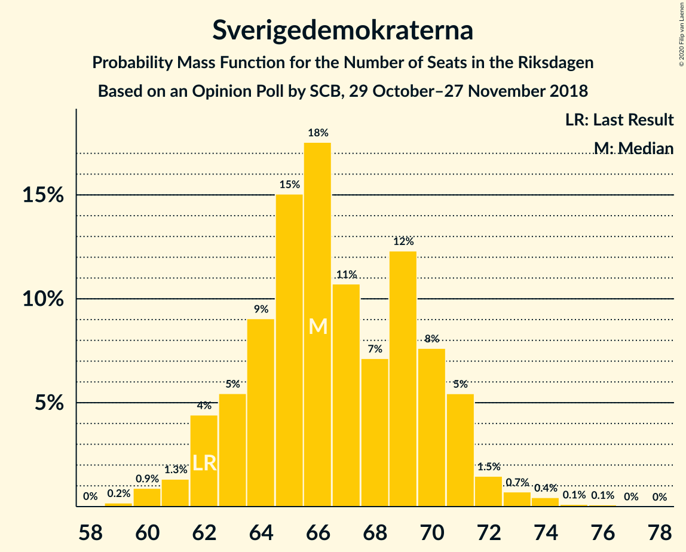
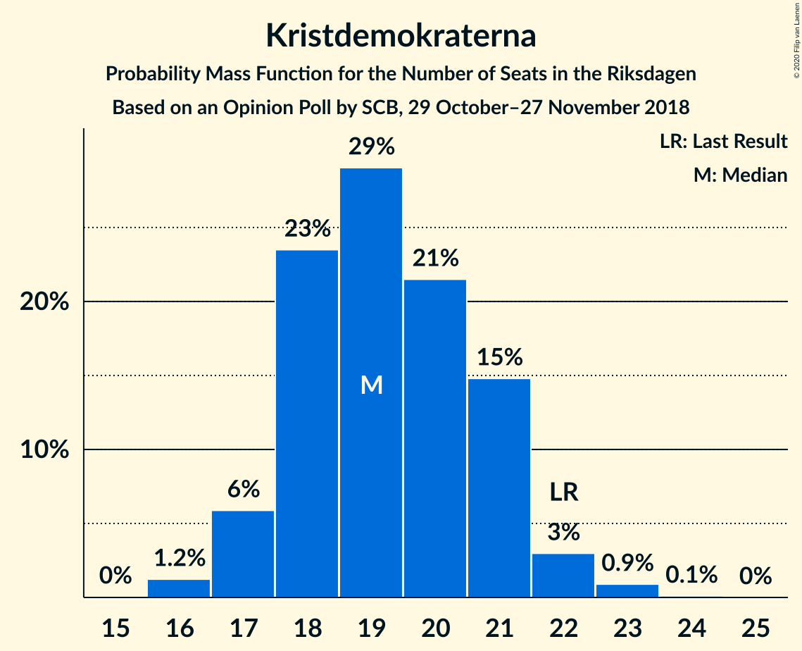
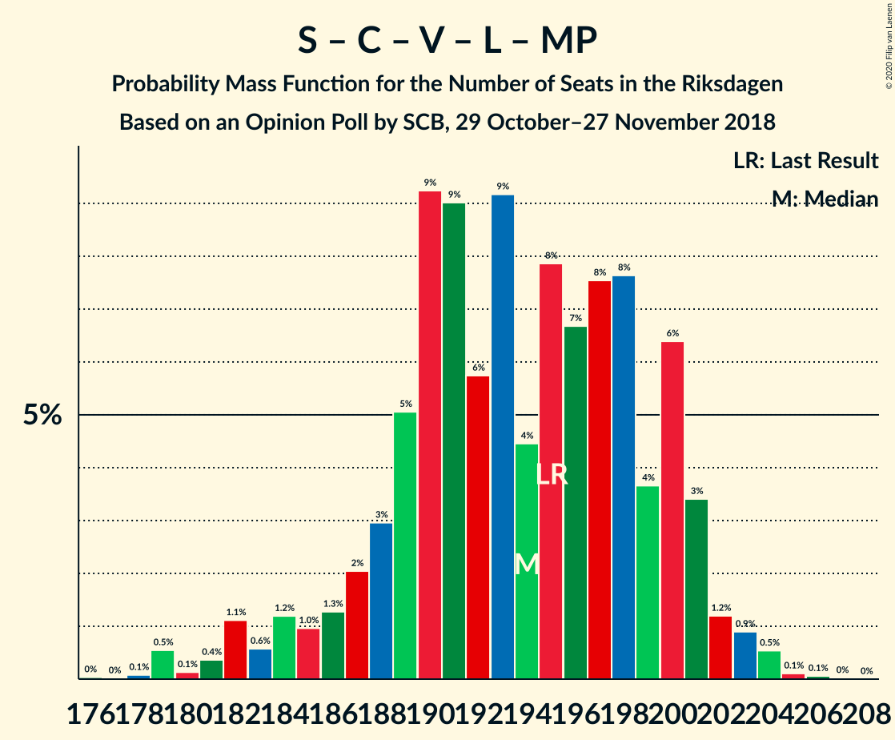
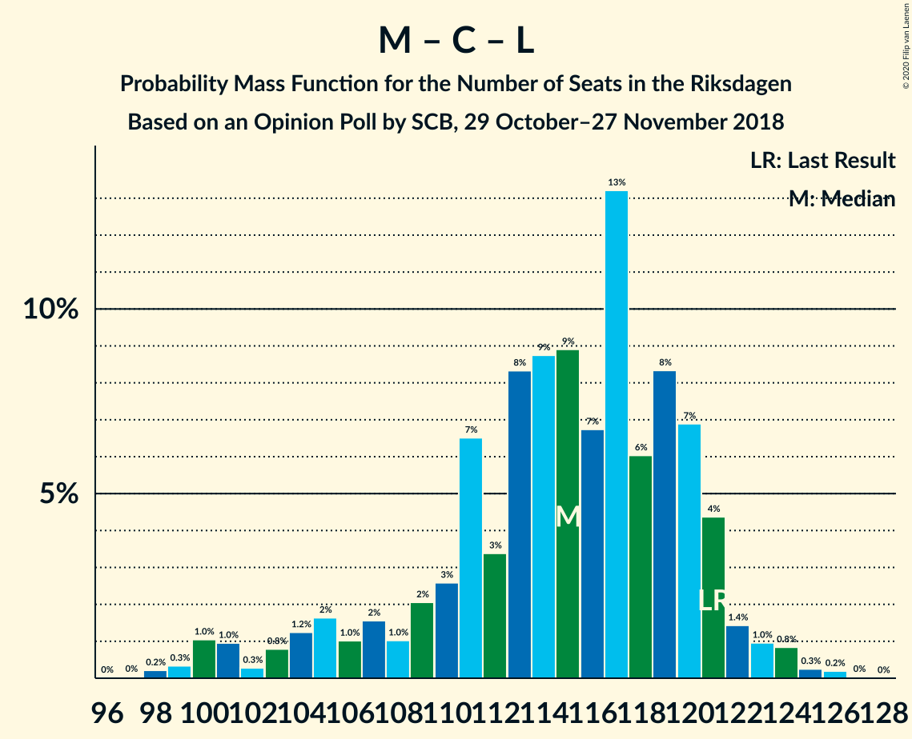

# Opinion Poll by SCB, 29 October–27 November 2018

<a href="#voting-intentions">Voting Intentions</a> | <a href="#seats">Seats</a> | <a href="#coalitions">Coalitions</a> | <a href="#technical-information">Technical Information</a>

## Voting Intentions

### Confidence Intervals

| Party | Last Result | Poll Result | 80% Confidence Interval | 90% Confidence Interval | 95% Confidence Interval | 99% Confidence Interval |
|:-----:|:-----------:|:-----------:|:-----------------------:|:-----------------------:|:-----------------------:|:-----------------------:|
| Sveriges socialdemokratiska arbetareparti | 28.3% | 30.6% | 29.7–31.4% |29.5–31.7% |29.3–31.9% |28.9–32.3% |
| Moderata samlingspartiet | 19.8% | 19.2% | 18.5–20.0% |18.3–20.2% |18.1–20.4% |17.8–20.8% |
| Sverigedemokraterna | 17.5% | 18.3% | 17.6–19.1% |17.4–19.3% |17.3–19.5% |16.9–19.8% |
| Centerpartiet | 8.6% | 8.6% | 8.1–9.2% |8.0–9.3% |7.8–9.5% |7.6–9.7% |
| Vänsterpartiet | 8.0% | 8.4% | 7.9–9.0% |7.8–9.1% |7.7–9.2% |7.4–9.5% |
| Kristdemokraterna | 6.3% | 5.3% | 4.9–5.8% |4.8–5.9% |4.7–6.0% |4.5–6.2% |
| Liberalerna | 5.5% | 4.3% | 3.9–4.7% |3.8–4.8% |3.7–4.9% |3.6–5.1% |
| Miljöpartiet de gröna | 4.4% | 4.0% | 3.7–4.4% |3.6–4.5% |3.5–4.6% |3.3–4.8% |

*Note:* The poll result column reflects the actual value used in the calculations. Published results may vary slightly, and in addition be rounded to fewer digits.

## Seats

### Confidence Intervals

| Party | Last Result | Median | 80% Confidence Interval | 90% Confidence Interval | 95% Confidence Interval | 99% Confidence Interval |
|:-----:|:-----------:|:------:|:-----------------------:|:-----------------------:|:-----------------------:|:-----------------------:|
| <a href="#sveriges-socialdemokratiska-arbetareparti">Sveriges socialdemokratiska arbetareparti</a> | 100 | 110 | 106–115 |105–116 |105–116 |103–119 |
| <a href="#moderata-samlingspartiet">Moderata samlingspartiet</a> | 70 | 69 | 67–72 |67–73 |65–74 |63–77 |
| <a href="#sverigedemokraterna">Sverigedemokraterna</a> | 62 | 66 | 65–70 |63–72 |62–73 |60–73 |
| <a href="#centerpartiet">Centerpartiet</a> | 31 | 32 | 30–33 |29–33 |28–34 |27–35 |
| <a href="#vänsterpartiet">Vänsterpartiet</a> | 28 | 30 | 29–33 |28–33 |28–34 |27–34 |
| <a href="#kristdemokraterna">Kristdemokraterna</a> | 22 | 19 | 18–21 |17–21 |17–22 |16–22 |
| <a href="#liberalerna">Liberalerna</a> | 20 | 15 | 14–16 |0–17 |0–17 |0–18 |
| <a href="#miljöpartiet-de-gröna">Miljöpartiet de gröna</a> | 16 | 14 | 0–15 |0–16 |0–16 |0–17 |

### Sveriges socialdemokratiska arbetareparti

*For a full overview of the results for this party, see the [Sveriges socialdemokratiska arbetareparti](party-sverigessocialdemokratiskaarbetareparti.html) page.*

| Number of Seats | Probability | Accumulated | Special Marks |
|:---------------:|:-----------:|:-----------:|:-------------:|
| 100 | 0.1% | 100% | Last Result |
| 101 | 0% | 99.9% |  |
| 102 | 0.3% | 99.9% |  |
| 103 | 0.4% | 99.6% |  |
| 104 | 1.3% | 99.2% |  |
| 105 | 5% | 98% |  |
| 106 | 8% | 93% |  |
| 107 | 2% | 85% |  |
| 108 | 4% | 83% |  |
| 109 | 27% | 79% |  |
| 110 | 2% | 52% | Median |
| 111 | 13% | 50% |  |
| 112 | 22% | 36% |  |
| 113 | 2% | 14% |  |
| 114 | 2% | 12% |  |
| 115 | 5% | 11% |  |
| 116 | 4% | 6% |  |
| 117 | 0.2% | 2% |  |
| 118 | 1.4% | 2% |  |
| 119 | 0.2% | 0.6% |  |
| 120 | 0.1% | 0.5% |  |
| 121 | 0.3% | 0.3% |  |
| 122 | 0% | 0% |  |

### Moderata samlingspartiet

*For a full overview of the results for this party, see the [Moderata samlingspartiet](party-moderatasamlingspartiet.html) page.*

| Number of Seats | Probability | Accumulated | Special Marks |
|:---------------:|:-----------:|:-----------:|:-------------:|
| 62 | 0.1% | 100% |  |
| 63 | 0.4% | 99.8% |  |
| 64 | 0.7% | 99.4% |  |
| 65 | 2% | 98.8% |  |
| 66 | 1.0% | 97% |  |
| 67 | 35% | 96% |  |
| 68 | 5% | 61% |  |
| 69 | 25% | 56% | Median |
| 70 | 16% | 31% | Last Result |
| 71 | 2% | 15% |  |
| 72 | 5% | 13% |  |
| 73 | 4% | 9% |  |
| 74 | 2% | 4% |  |
| 75 | 0.4% | 2% |  |
| 76 | 0.4% | 1.5% |  |
| 77 | 0.9% | 1.1% |  |
| 78 | 0.1% | 0.2% |  |
| 79 | 0.1% | 0.1% |  |
| 80 | 0% | 0% |  |

### Sverigedemokraterna

*For a full overview of the results for this party, see the [Sverigedemokraterna](party-sverigedemokraterna.html) page.*

| Number of Seats | Probability | Accumulated | Special Marks |
|:---------------:|:-----------:|:-----------:|:-------------:|
| 59 | 0.1% | 100% |  |
| 60 | 0.9% | 99.9% |  |
| 61 | 0.1% | 99.0% |  |
| 62 | 2% | 98.8% | Last Result |
| 63 | 2% | 97% |  |
| 64 | 4% | 95% |  |
| 65 | 15% | 91% |  |
| 66 | 27% | 76% | Median |
| 67 | 4% | 49% |  |
| 68 | 2% | 45% |  |
| 69 | 12% | 43% |  |
| 70 | 23% | 31% |  |
| 71 | 4% | 9% |  |
| 72 | 2% | 5% |  |
| 73 | 3% | 3% |  |
| 74 | 0.2% | 0.2% |  |
| 75 | 0% | 0% |  |

### Centerpartiet

*For a full overview of the results for this party, see the [Centerpartiet](party-centerpartiet.html) page.*

| Number of Seats | Probability | Accumulated | Special Marks |
|:---------------:|:-----------:|:-----------:|:-------------:|
| 27 | 0.6% | 100% |  |
| 28 | 3% | 99.4% |  |
| 29 | 6% | 97% |  |
| 30 | 7% | 91% |  |
| 31 | 32% | 84% | Last Result |
| 32 | 41% | 52% | Median |
| 33 | 7% | 11% |  |
| 34 | 2% | 4% |  |
| 35 | 2% | 2% |  |
| 36 | 0.2% | 0.3% |  |
| 37 | 0% | 0.1% |  |
| 38 | 0% | 0% |  |

### Vänsterpartiet

*For a full overview of the results for this party, see the [Vänsterpartiet](party-vänsterpartiet.html) page.*

| Number of Seats | Probability | Accumulated | Special Marks |
|:---------------:|:-----------:|:-----------:|:-------------:|
| 26 | 0.3% | 100% |  |
| 27 | 1.0% | 99.6% |  |
| 28 | 6% | 98.6% | Last Result |
| 29 | 31% | 93% |  |
| 30 | 27% | 62% | Median |
| 31 | 13% | 34% |  |
| 32 | 4% | 21% |  |
| 33 | 15% | 17% |  |
| 34 | 2% | 3% |  |
| 35 | 0.4% | 0.5% |  |
| 36 | 0% | 0.1% |  |
| 37 | 0% | 0% |  |

### Kristdemokraterna

*For a full overview of the results for this party, see the [Kristdemokraterna](party-kristdemokraterna.html) page.*

| Number of Seats | Probability | Accumulated | Special Marks |
|:---------------:|:-----------:|:-----------:|:-------------:|
| 16 | 1.3% | 100% |  |
| 17 | 8% | 98.7% |  |
| 18 | 32% | 90% |  |
| 19 | 21% | 59% | Median |
| 20 | 27% | 38% |  |
| 21 | 5% | 10% |  |
| 22 | 5% | 5% | Last Result |
| 23 | 0.3% | 0.3% |  |
| 24 | 0.1% | 0.1% |  |
| 25 | 0% | 0% |  |

### Liberalerna

*For a full overview of the results for this party, see the [Liberalerna](party-liberalerna.html) page.*

| Number of Seats | Probability | Accumulated | Special Marks |
|:---------------:|:-----------:|:-----------:|:-------------:|
| 0 | 8% | 100% |  |
| 1 | 0% | 92% |  |
| 2 | 0% | 92% |  |
| 3 | 0% | 92% |  |
| 4 | 0% | 92% |  |
| 5 | 0% | 92% |  |
| 6 | 0% | 92% |  |
| 7 | 0% | 92% |  |
| 8 | 0% | 92% |  |
| 9 | 0% | 92% |  |
| 10 | 0% | 92% |  |
| 11 | 0% | 92% |  |
| 12 | 0% | 92% |  |
| 13 | 0% | 92% |  |
| 14 | 3% | 92% |  |
| 15 | 46% | 89% | Median |
| 16 | 34% | 42% |  |
| 17 | 7% | 9% |  |
| 18 | 0.9% | 1.2% |  |
| 19 | 0.3% | 0.3% |  |
| 20 | 0% | 0% | Last Result |

### Miljöpartiet de gröna

*For a full overview of the results for this party, see the [Miljöpartiet de gröna](party-miljöpartietdegröna.html) page.*

| Number of Seats | Probability | Accumulated | Special Marks |
|:---------------:|:-----------:|:-----------:|:-------------:|
| 0 | 49% | 100% |  |
| 1 | 0% | 51% |  |
| 2 | 0% | 51% |  |
| 3 | 0% | 51% |  |
| 4 | 0% | 51% |  |
| 5 | 0% | 51% |  |
| 6 | 0% | 51% |  |
| 7 | 0% | 51% |  |
| 8 | 0% | 51% |  |
| 9 | 0% | 51% |  |
| 10 | 0% | 51% |  |
| 11 | 0% | 51% |  |
| 12 | 0% | 51% |  |
| 13 | 0% | 51% |  |
| 14 | 27% | 51% | Median |
| 15 | 15% | 24% |  |
| 16 | 7% | 9% | Last Result |
| 17 | 2% | 2% |  |
| 18 | 0% | 0% |  |

## Coalitions

### Confidence Intervals

| Coalition | Last Result | Median | Majority? | 80% Confidence Interval | 90% Confidence Interval | 95% Confidence Interval | 99% Confidence Interval |
|:---------:|:-----------:|:------:|:---------:|:-----------------------:|:-----------------------:|:-----------------------:|:-----------------------:|
| Sveriges socialdemokratiska arbetareparti – Moderata samlingspartiet – Centerpartiet | 201 | 210 | 100% | 205–216 | 205–221 | 203–222 | 201–226 |
| Sveriges socialdemokratiska arbetareparti – Centerpartiet – Vänsterpartiet – Liberalerna – Miljöpartiet de gröna | 195 | 194 | 100% | 188–200 | 184–200 | 182–201 | 182–203 |
| Sveriges socialdemokratiska arbetareparti – Moderata samlingspartiet | 170 | 180 | 84% | 174–185 | 173–188 | 173–190 | 170–193 |
| Sveriges socialdemokratiska arbetareparti – Centerpartiet – Liberalerna – Miljöpartiet de gröna | 167 | 163 | 0.1% | 158–169 | 153–170 | 149–171 | 149–173 |
| Moderata samlingspartiet – Sverigedemokraterna – Kristdemokraterna | 154 | 155 | 0% | 149–161 | 149–165 | 148–167 | 146–167 |
| Sveriges socialdemokratiska arbetareparti – Vänsterpartiet – Miljöpartiet de gröna | 144 | 150 | 0% | 142–152 | 141–156 | 139–158 | 137–162 |
| Sveriges socialdemokratiska arbetareparti – Vänsterpartiet | 128 | 140 | 0% | 136–145 | 134–149 | 134–149 | 133–150 |
| Moderata samlingspartiet – Sverigedemokraterna | 132 | 136 | 0% | 132–142 | 131–145 | 129–145 | 128–149 |
| Moderata samlingspartiet – Centerpartiet – Kristdemokraterna – Liberalerna | 143 | 133 | 0% | 129–137 | 127–139 | 125–141 | 120–143 |
| Moderata samlingspartiet – Centerpartiet – Kristdemokraterna | 123 | 119 | 0% | 116–123 | 116–127 | 114–128 | 111–129 |
| Sveriges socialdemokratiska arbetareparti – Miljöpartiet de gröna | 116 | 119 | 0% | 111–123 | 111–126 | 109–128 | 107–130 |
| Moderata samlingspartiet – Centerpartiet – Liberalerna | 121 | 115 | 0% | 110–117 | 105–119 | 105–121 | 100–124 |
| Moderata samlingspartiet – Centerpartiet | 101 | 100 | 0% | 98–103 | 97–105 | 95–107 | 93–110 |

### Sveriges socialdemokratiska arbetareparti – Moderata samlingspartiet – Centerpartiet

| Number of Seats | Probability | Accumulated | Special Marks |
|:---------------:|:-----------:|:-----------:|:-------------:|
| 199 | 0.2% | 100% |  |
| 200 | 0.1% | 99.8% |  |
| 201 | 1.1% | 99.7% | Last Result |
| 202 | 0.8% | 98.6% |  |
| 203 | 1.3% | 98% |  |
| 204 | 1.3% | 97% |  |
| 205 | 12% | 95% |  |
| 206 | 2% | 83% |  |
| 207 | 26% | 81% |  |
| 208 | 2% | 56% |  |
| 209 | 2% | 54% |  |
| 210 | 2% | 52% |  |
| 211 | 2% | 50% | Median |
| 212 | 2% | 48% |  |
| 213 | 30% | 46% |  |
| 214 | 1.3% | 16% |  |
| 215 | 3% | 14% |  |
| 216 | 2% | 11% |  |
| 217 | 0.1% | 10% |  |
| 218 | 3% | 9% |  |
| 219 | 0.5% | 7% |  |
| 220 | 0.9% | 6% |  |
| 221 | 3% | 5% |  |
| 222 | 0.3% | 3% |  |
| 223 | 0% | 2% |  |
| 224 | 0% | 2% |  |
| 225 | 1.1% | 2% |  |
| 226 | 0.9% | 1.2% |  |
| 227 | 0% | 0.3% |  |
| 228 | 0.1% | 0.3% |  |
| 229 | 0.1% | 0.2% |  |
| 230 | 0% | 0.1% |  |
| 231 | 0% | 0.1% |  |
| 232 | 0.1% | 0.1% |  |
| 233 | 0% | 0% |  |

### Sveriges socialdemokratiska arbetareparti – Centerpartiet – Vänsterpartiet – Liberalerna – Miljöpartiet de gröna

| Number of Seats | Probability | Accumulated | Special Marks |
|:---------------:|:-----------:|:-----------:|:-------------:|
| 178 | 0.1% | 100% |  |
| 179 | 0.1% | 99.9% |  |
| 180 | 0% | 99.8% |  |
| 181 | 0% | 99.8% |  |
| 182 | 4% | 99.8% |  |
| 183 | 1.2% | 96% |  |
| 184 | 0.3% | 95% |  |
| 185 | 0.9% | 95% |  |
| 186 | 2% | 94% |  |
| 187 | 0.8% | 92% |  |
| 188 | 0.9% | 91% |  |
| 189 | 1.1% | 90% |  |
| 190 | 20% | 89% |  |
| 191 | 15% | 69% |  |
| 192 | 1.3% | 54% |  |
| 193 | 3% | 53% |  |
| 194 | 3% | 50% |  |
| 195 | 2% | 47% | Last Result |
| 196 | 5% | 46% |  |
| 197 | 0.8% | 40% |  |
| 198 | 25% | 39% |  |
| 199 | 2% | 14% |  |
| 200 | 8% | 12% |  |
| 201 | 2% | 4% | Median |
| 202 | 1.3% | 2% |  |
| 203 | 0.4% | 0.6% |  |
| 204 | 0.1% | 0.2% |  |
| 205 | 0.1% | 0.1% |  |
| 206 | 0% | 0% |  |

### Sveriges socialdemokratiska arbetareparti – Moderata samlingspartiet

| Number of Seats | Probability | Accumulated | Special Marks |
|:---------------:|:-----------:|:-----------:|:-------------:|
| 167 | 0.1% | 100% |  |
| 168 | 0% | 99.9% |  |
| 169 | 0.3% | 99.9% |  |
| 170 | 0.3% | 99.5% | Last Result |
| 171 | 0.5% | 99.2% |  |
| 172 | 0.8% | 98.7% |  |
| 173 | 7% | 98% |  |
| 174 | 6% | 91% |  |
| 175 | 1.0% | 84% | Majority |
| 176 | 27% | 83% |  |
| 177 | 2% | 56% |  |
| 178 | 2% | 54% |  |
| 179 | 0.9% | 52% | Median |
| 180 | 2% | 51% |  |
| 181 | 31% | 49% |  |
| 182 | 4% | 18% |  |
| 183 | 0.4% | 14% |  |
| 184 | 3% | 14% |  |
| 185 | 1.3% | 11% |  |
| 186 | 1.5% | 10% |  |
| 187 | 0.9% | 8% |  |
| 188 | 4% | 7% |  |
| 189 | 0.1% | 3% |  |
| 190 | 0.3% | 3% |  |
| 191 | 0.2% | 2% |  |
| 192 | 1.1% | 2% |  |
| 193 | 0.9% | 1.2% |  |
| 194 | 0% | 0.3% |  |
| 195 | 0.1% | 0.2% |  |
| 196 | 0% | 0.1% |  |
| 197 | 0% | 0.1% |  |
| 198 | 0.1% | 0.1% |  |
| 199 | 0% | 0% |  |

### Sveriges socialdemokratiska arbetareparti – Centerpartiet – Liberalerna – Miljöpartiet de gröna

| Number of Seats | Probability | Accumulated | Special Marks |
|:---------------:|:-----------:|:-----------:|:-------------:|
| 145 | 0.1% | 100% |  |
| 146 | 0% | 99.9% |  |
| 147 | 0.2% | 99.9% |  |
| 148 | 0% | 99.7% |  |
| 149 | 3% | 99.7% |  |
| 150 | 0.2% | 96% |  |
| 151 | 1.0% | 96% |  |
| 152 | 0.1% | 95% |  |
| 153 | 0.3% | 95% |  |
| 154 | 0.1% | 95% |  |
| 155 | 1.1% | 95% |  |
| 156 | 0.6% | 94% |  |
| 157 | 3% | 93% |  |
| 158 | 13% | 90% |  |
| 159 | 1.3% | 77% |  |
| 160 | 20% | 76% |  |
| 161 | 3% | 56% |  |
| 162 | 2% | 53% |  |
| 163 | 2% | 52% |  |
| 164 | 1.5% | 50% |  |
| 165 | 1.3% | 48% |  |
| 166 | 3% | 47% |  |
| 167 | 5% | 44% | Last Result |
| 168 | 1.2% | 39% |  |
| 169 | 31% | 38% |  |
| 170 | 2% | 7% |  |
| 171 | 3% | 5% | Median |
| 172 | 1.3% | 2% |  |
| 173 | 0.3% | 0.6% |  |
| 174 | 0.2% | 0.3% |  |
| 175 | 0% | 0.1% | Majority |
| 176 | 0.1% | 0.1% |  |
| 177 | 0% | 0% |  |

### Moderata samlingspartiet – Sverigedemokraterna – Kristdemokraterna

| Number of Seats | Probability | Accumulated | Special Marks |
|:---------------:|:-----------:|:-----------:|:-------------:|
| 144 | 0.1% | 100% |  |
| 145 | 0.1% | 99.9% |  |
| 146 | 0.4% | 99.8% |  |
| 147 | 1.3% | 99.4% |  |
| 148 | 2% | 98% |  |
| 149 | 8% | 96% |  |
| 150 | 2% | 88% |  |
| 151 | 25% | 86% |  |
| 152 | 0.8% | 61% |  |
| 153 | 5% | 60% |  |
| 154 | 2% | 54% | Last Result, Median |
| 155 | 3% | 53% |  |
| 156 | 3% | 50% |  |
| 157 | 1.3% | 47% |  |
| 158 | 15% | 46% |  |
| 159 | 20% | 31% |  |
| 160 | 1.1% | 11% |  |
| 161 | 0.9% | 10% |  |
| 162 | 0.8% | 9% |  |
| 163 | 2% | 8% |  |
| 164 | 0.9% | 6% |  |
| 165 | 0.3% | 5% |  |
| 166 | 1.2% | 5% |  |
| 167 | 4% | 4% |  |
| 168 | 0% | 0.2% |  |
| 169 | 0% | 0.2% |  |
| 170 | 0.1% | 0.2% |  |
| 171 | 0.1% | 0.1% |  |
| 172 | 0% | 0% |  |

### Sveriges socialdemokratiska arbetareparti – Vänsterpartiet – Miljöpartiet de gröna

| Number of Seats | Probability | Accumulated | Special Marks |
|:---------------:|:-----------:|:-----------:|:-------------:|
| 136 | 0.1% | 100% |  |
| 137 | 0.4% | 99.8% |  |
| 138 | 1.0% | 99.4% |  |
| 139 | 1.5% | 98% |  |
| 140 | 2% | 97% |  |
| 141 | 0.3% | 95% |  |
| 142 | 19% | 95% |  |
| 143 | 2% | 76% |  |
| 144 | 11% | 74% | Last Result |
| 145 | 4% | 63% |  |
| 146 | 2% | 59% |  |
| 147 | 0.9% | 57% |  |
| 148 | 0.7% | 56% |  |
| 149 | 4% | 56% |  |
| 150 | 7% | 52% |  |
| 151 | 3% | 44% |  |
| 152 | 32% | 42% |  |
| 153 | 2% | 10% |  |
| 154 | 2% | 8% | Median |
| 155 | 0.4% | 6% |  |
| 156 | 1.0% | 6% |  |
| 157 | 2% | 5% |  |
| 158 | 1.2% | 3% |  |
| 159 | 0.2% | 2% |  |
| 160 | 0.7% | 2% |  |
| 161 | 0.1% | 1.0% |  |
| 162 | 0.6% | 0.9% |  |
| 163 | 0.2% | 0.3% |  |
| 164 | 0.1% | 0.1% |  |
| 165 | 0.1% | 0.1% |  |
| 166 | 0% | 0% |  |

### Sveriges socialdemokratiska arbetareparti – Vänsterpartiet

| Number of Seats | Probability | Accumulated | Special Marks |
|:---------------:|:-----------:|:-----------:|:-------------:|
| 128 | 0% | 100% | Last Result |
| 129 | 0% | 100% |  |
| 130 | 0.1% | 100% |  |
| 131 | 0.1% | 99.9% |  |
| 132 | 0.3% | 99.8% |  |
| 133 | 0.6% | 99.5% |  |
| 134 | 5% | 98.9% |  |
| 135 | 1.3% | 94% |  |
| 136 | 3% | 92% |  |
| 137 | 8% | 89% |  |
| 138 | 26% | 82% |  |
| 139 | 4% | 55% |  |
| 140 | 3% | 52% | Median |
| 141 | 2% | 49% |  |
| 142 | 20% | 47% |  |
| 143 | 3% | 27% |  |
| 144 | 11% | 24% |  |
| 145 | 4% | 13% |  |
| 146 | 3% | 9% |  |
| 147 | 0.6% | 6% |  |
| 148 | 0.4% | 6% |  |
| 149 | 3% | 5% |  |
| 150 | 1.3% | 2% |  |
| 151 | 0% | 0.4% |  |
| 152 | 0.1% | 0.4% |  |
| 153 | 0.1% | 0.3% |  |
| 154 | 0% | 0.2% |  |
| 155 | 0% | 0.2% |  |
| 156 | 0.2% | 0.2% |  |
| 157 | 0% | 0% |  |

### Moderata samlingspartiet – Sverigedemokraterna

| Number of Seats | Probability | Accumulated | Special Marks |
|:---------------:|:-----------:|:-----------:|:-------------:|
| 125 | 0% | 100% |  |
| 126 | 0% | 99.9% |  |
| 127 | 0.1% | 99.9% |  |
| 128 | 2% | 99.8% |  |
| 129 | 2% | 98% |  |
| 130 | 0.9% | 96% |  |
| 131 | 0.8% | 96% |  |
| 132 | 10% | 95% | Last Result |
| 133 | 26% | 85% |  |
| 134 | 6% | 59% |  |
| 135 | 2% | 53% | Median |
| 136 | 2% | 51% |  |
| 137 | 4% | 50% |  |
| 138 | 3% | 46% |  |
| 139 | 30% | 42% |  |
| 140 | 1.3% | 12% |  |
| 141 | 0.8% | 11% |  |
| 142 | 2% | 10% |  |
| 143 | 3% | 8% |  |
| 144 | 0.2% | 5% |  |
| 145 | 4% | 5% |  |
| 146 | 0.3% | 1.4% |  |
| 147 | 0% | 1.1% |  |
| 148 | 0% | 1.1% |  |
| 149 | 0.9% | 1.0% |  |
| 150 | 0.1% | 0.1% |  |
| 151 | 0% | 0% |  |

### Moderata samlingspartiet – Centerpartiet – Kristdemokraterna – Liberalerna

| Number of Seats | Probability | Accumulated | Special Marks |
|:---------------:|:-----------:|:-----------:|:-------------:|
| 117 | 0.1% | 100% |  |
| 118 | 0.1% | 99.9% |  |
| 119 | 0.2% | 99.8% |  |
| 120 | 0.6% | 99.6% |  |
| 121 | 0.7% | 99.0% |  |
| 122 | 0.3% | 98% |  |
| 123 | 0.3% | 98% |  |
| 124 | 0.2% | 98% |  |
| 125 | 0.8% | 98% |  |
| 126 | 0.1% | 97% |  |
| 127 | 4% | 97% |  |
| 128 | 3% | 93% |  |
| 129 | 0.8% | 90% |  |
| 130 | 1.1% | 89% |  |
| 131 | 27% | 88% |  |
| 132 | 8% | 62% |  |
| 133 | 4% | 54% |  |
| 134 | 7% | 50% |  |
| 135 | 2% | 43% | Median |
| 136 | 12% | 42% |  |
| 137 | 20% | 30% |  |
| 138 | 3% | 10% |  |
| 139 | 3% | 7% |  |
| 140 | 1.0% | 4% |  |
| 141 | 1.0% | 3% |  |
| 142 | 1.3% | 2% |  |
| 143 | 0.4% | 0.5% | Last Result |
| 144 | 0.1% | 0.1% |  |
| 145 | 0% | 0% |  |

### Moderata samlingspartiet – Centerpartiet – Kristdemokraterna

| Number of Seats | Probability | Accumulated | Special Marks |
|:---------------:|:-----------:|:-----------:|:-------------:|
| 111 | 0.6% | 100% |  |
| 112 | 0.2% | 99.3% |  |
| 113 | 1.1% | 99.1% |  |
| 114 | 0.7% | 98% |  |
| 115 | 2% | 97% |  |
| 116 | 35% | 96% |  |
| 117 | 2% | 60% |  |
| 118 | 2% | 58% |  |
| 119 | 6% | 56% |  |
| 120 | 3% | 50% | Median |
| 121 | 32% | 47% |  |
| 122 | 2% | 16% |  |
| 123 | 4% | 14% | Last Result |
| 124 | 2% | 10% |  |
| 125 | 1.3% | 8% |  |
| 126 | 1.2% | 7% |  |
| 127 | 3% | 6% |  |
| 128 | 2% | 3% |  |
| 129 | 0.1% | 0.5% |  |
| 130 | 0% | 0.4% |  |
| 131 | 0.1% | 0.4% |  |
| 132 | 0.2% | 0.4% |  |
| 133 | 0.1% | 0.2% |  |
| 134 | 0.1% | 0.1% |  |
| 135 | 0% | 0% |  |

### Sveriges socialdemokratiska arbetareparti – Miljöpartiet de gröna

| Number of Seats | Probability | Accumulated | Special Marks |
|:---------------:|:-----------:|:-----------:|:-------------:|
| 105 | 0% | 100% |  |
| 106 | 0.2% | 99.9% |  |
| 107 | 0.5% | 99.8% |  |
| 108 | 0.8% | 99.3% |  |
| 109 | 2% | 98% |  |
| 110 | 0.9% | 96% |  |
| 111 | 11% | 95% |  |
| 112 | 21% | 84% |  |
| 113 | 1.3% | 64% |  |
| 114 | 1.1% | 62% |  |
| 115 | 4% | 61% |  |
| 116 | 3% | 57% | Last Result |
| 117 | 0.4% | 54% |  |
| 118 | 2% | 53% |  |
| 119 | 2% | 52% |  |
| 120 | 0.5% | 50% |  |
| 121 | 12% | 49% |  |
| 122 | 2% | 37% |  |
| 123 | 28% | 35% |  |
| 124 | 0.5% | 8% | Median |
| 125 | 2% | 7% |  |
| 126 | 1.5% | 5% |  |
| 127 | 0.6% | 4% |  |
| 128 | 1.2% | 3% |  |
| 129 | 0.6% | 2% |  |
| 130 | 1.3% | 2% |  |
| 131 | 0.1% | 0.3% |  |
| 132 | 0.1% | 0.2% |  |
| 133 | 0.1% | 0.1% |  |
| 134 | 0% | 0% |  |

### Moderata samlingspartiet – Centerpartiet – Liberalerna

| Number of Seats | Probability | Accumulated | Special Marks |
|:---------------:|:-----------:|:-----------:|:-------------:|
| 98 | 0.2% | 100% |  |
| 99 | 0.1% | 99.7% |  |
| 100 | 0.6% | 99.7% |  |
| 101 | 0.9% | 99.0% |  |
| 102 | 0.1% | 98% |  |
| 103 | 0.3% | 98% |  |
| 104 | 0.1% | 98% |  |
| 105 | 3% | 98% |  |
| 106 | 0.1% | 95% |  |
| 107 | 1.3% | 94% |  |
| 108 | 1.2% | 93% |  |
| 109 | 1.2% | 92% |  |
| 110 | 1.3% | 91% |  |
| 111 | 1.2% | 90% |  |
| 112 | 1.4% | 88% |  |
| 113 | 27% | 87% |  |
| 114 | 3% | 60% |  |
| 115 | 12% | 57% |  |
| 116 | 4% | 45% | Median |
| 117 | 31% | 41% |  |
| 118 | 2% | 9% |  |
| 119 | 3% | 7% |  |
| 120 | 1.3% | 4% |  |
| 121 | 0.4% | 3% | Last Result |
| 122 | 1.0% | 2% |  |
| 123 | 0.1% | 1.0% |  |
| 124 | 0.8% | 0.9% |  |
| 125 | 0.1% | 0.1% |  |
| 126 | 0% | 0% |  |

### Moderata samlingspartiet – Centerpartiet

| Number of Seats | Probability | Accumulated | Special Marks |
|:---------------:|:-----------:|:-----------:|:-------------:|
| 92 | 0% | 100% |  |
| 93 | 0.7% | 99.9% |  |
| 94 | 1.2% | 99.2% |  |
| 95 | 1.2% | 98% |  |
| 96 | 0.6% | 97% |  |
| 97 | 3% | 96% |  |
| 98 | 28% | 93% |  |
| 99 | 9% | 65% |  |
| 100 | 8% | 56% |  |
| 101 | 22% | 48% | Last Result, Median |
| 102 | 12% | 26% |  |
| 103 | 4% | 14% |  |
| 104 | 0.8% | 9% |  |
| 105 | 4% | 9% |  |
| 106 | 0.6% | 5% |  |
| 107 | 2% | 4% |  |
| 108 | 0.9% | 2% |  |
| 109 | 0.1% | 1.3% |  |
| 110 | 0.9% | 1.3% |  |
| 111 | 0.2% | 0.4% |  |
| 112 | 0% | 0.1% |  |
| 113 | 0.1% | 0.1% |  |
| 114 | 0% | 0% |  |

## Technical Information

### Opinion Poll

+ **Polling firm:** SCB
+ **Commissioner(s):** —
+ **Fieldwork period:** 29 October–27 November 2018

### Calculations

+ **Sample size:** 4721
+ **Simulations done:** 131,072
+ **Error estimate:** 0.91%

