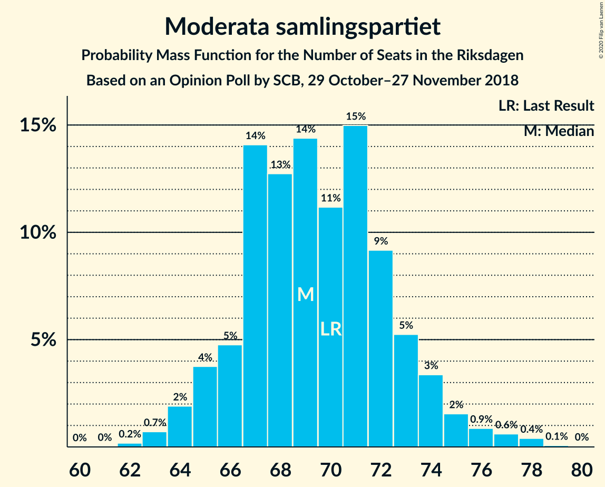
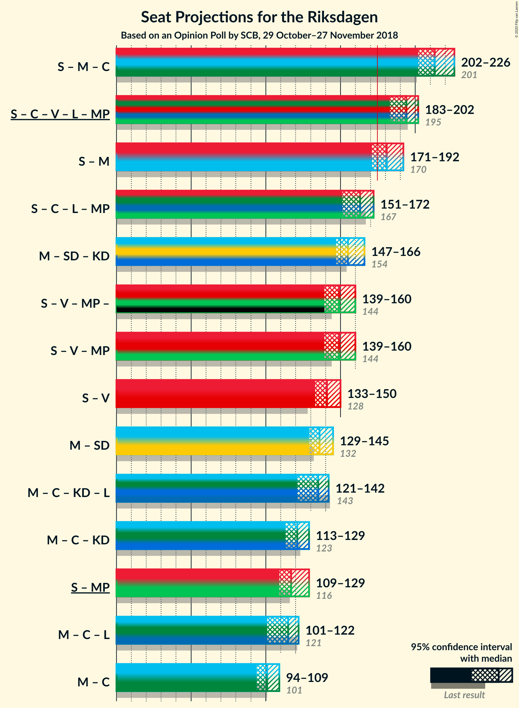

# Opinion Poll by SCB, 29 October–27 November 2018

<a href="#voting-intentions">Voting Intentions</a> | <a href="#seats">Seats</a> | <a href="#coalitions">Coalitions</a> | <a href="#technical-information">Technical Information</a>

## Voting Intentions

### Confidence Intervals

| Party | Last Result | Poll Result | 80% Confidence Interval | 90% Confidence Interval | 95% Confidence Interval | 99% Confidence Interval |
|:-----:|:-----------:|:-----------:|:-----------------------:|:-----------------------:|:-----------------------:|:-----------------------:|
| Sveriges socialdemokratiska arbetareparti | 28.3% | 30.6% | 29.7–31.4% |29.5–31.7% |29.3–31.9% |28.9–32.3% |
| Moderata samlingspartiet | 19.8% | 19.2% | 18.5–20.0% |18.3–20.2% |18.1–20.4% |17.8–20.8% |
| Sverigedemokraterna | 17.5% | 18.3% | 17.6–19.1% |17.4–19.3% |17.3–19.5% |16.9–19.8% |
| Centerpartiet | 8.6% | 8.6% | 8.1–9.2% |8.0–9.3% |7.8–9.5% |7.6–9.7% |
| Vänsterpartiet | 8.0% | 8.4% | 7.9–9.0% |7.8–9.1% |7.7–9.2% |7.4–9.5% |
| Kristdemokraterna | 6.3% | 5.3% | 4.9–5.8% |4.8–5.9% |4.7–6.0% |4.5–6.2% |
| Liberalerna | 5.5% | 4.3% | 3.9–4.7% |3.8–4.8% |3.7–4.9% |3.6–5.1% |
| Miljöpartiet de gröna | 4.4% | 4.0% | 3.7–4.4% |3.6–4.5% |3.5–4.6% |3.3–4.8% |

*Note:* The poll result column reflects the actual value used in the calculations. Published results may vary slightly, and in addition be rounded to fewer digits.

## Seats

### Confidence Intervals

| Party | Last Result | Median | 80% Confidence Interval | 90% Confidence Interval | 95% Confidence Interval | 99% Confidence Interval |
|:-----:|:-----------:|:------:|:-----------------------:|:-----------------------:|:-----------------------:|:-----------------------:|
| <a href="#sveriges-socialdemokratiska-arbetareparti">Sveriges socialdemokratiska arbetareparti</a> | 100 | 109 | 106–115 |105–116 |104–117 |102–120 |
| <a href="#moderata-samlingspartiet">Moderata samlingspartiet</a> | 70 | 69 | 67–73 |65–74 |64–75 |64–77 |
| <a href="#sverigedemokraterna">Sverigedemokraterna</a> | 62 | 67 | 64–71 |63–71 |62–73 |60–74 |
| <a href="#centerpartiet">Centerpartiet</a> | 31 | 32 | 29–33 |28–34 |28–35 |27–35 |
| <a href="#vänsterpartiet">Vänsterpartiet</a> | 28 | 30 | 29–33 |28–33 |28–34 |27–35 |
| <a href="#kristdemokraterna">Kristdemokraterna</a> | 22 | 19 | 18–21 |17–21 |17–22 |16–23 |
| <a href="#liberalerna">Liberalerna</a> | 20 | 15 | 0–17 |0–17 |0–17 |0–18 |
| <a href="#miljöpartiet-de-gröna">Miljöpartiet de gröna</a> | 16 | 0 | 0–16 |0–16 |0–17 |0–17 |

### Sveriges socialdemokratiska arbetareparti

*For a full overview of the results for this party, see the [Sveriges socialdemokratiska arbetareparti](party-sverigessocialdemokratiskaarbetareparti.html) page.*

| Number of Seats | Probability | Accumulated | Special Marks |
|:---------------:|:-----------:|:-----------:|:-------------:|
| 100 | 0.1% | 100% | Last Result |
| 101 | 0.1% | 99.9% |  |
| 102 | 0.7% | 99.8% |  |
| 103 | 0.6% | 99.0% |  |
| 104 | 3% | 98% |  |
| 105 | 4% | 96% |  |
| 106 | 7% | 92% |  |
| 107 | 4% | 86% |  |
| 108 | 6% | 82% |  |
| 109 | 26% | 76% | Median |
| 110 | 3% | 49% |  |
| 111 | 14% | 47% |  |
| 112 | 15% | 33% |  |
| 113 | 3% | 18% |  |
| 114 | 3% | 15% |  |
| 115 | 5% | 12% |  |
| 116 | 4% | 7% |  |
| 117 | 1.4% | 3% |  |
| 118 | 1.0% | 2% |  |
| 119 | 0.2% | 0.8% |  |
| 120 | 0.1% | 0.6% |  |
| 121 | 0.3% | 0.4% |  |
| 122 | 0% | 0.2% |  |
| 123 | 0.1% | 0.2% |  |
| 124 | 0.1% | 0.1% |  |
| 125 | 0% | 0% |  |

### Moderata samlingspartiet

*For a full overview of the results for this party, see the [Moderata samlingspartiet](party-moderatasamlingspartiet.html) page.*

| Number of Seats | Probability | Accumulated | Special Marks |
|:---------------:|:-----------:|:-----------:|:-------------:|
| 62 | 0.1% | 100% |  |
| 63 | 0.4% | 99.9% |  |
| 64 | 3% | 99.5% |  |
| 65 | 3% | 96% |  |
| 66 | 3% | 93% |  |
| 67 | 24% | 91% |  |
| 68 | 11% | 67% |  |
| 69 | 18% | 56% | Median |
| 70 | 12% | 38% | Last Result |
| 71 | 10% | 26% |  |
| 72 | 5% | 16% |  |
| 73 | 5% | 11% |  |
| 74 | 3% | 6% |  |
| 75 | 2% | 3% |  |
| 76 | 0.4% | 1.5% |  |
| 77 | 0.8% | 1.0% |  |
| 78 | 0.2% | 0.3% |  |
| 79 | 0.1% | 0.1% |  |
| 80 | 0% | 0% |  |

### Sverigedemokraterna

*For a full overview of the results for this party, see the [Sverigedemokraterna](party-sverigedemokraterna.html) page.*

| Number of Seats | Probability | Accumulated | Special Marks |
|:---------------:|:-----------:|:-----------:|:-------------:|
| 58 | 0.1% | 100% |  |
| 59 | 0.1% | 99.9% |  |
| 60 | 1.2% | 99.8% |  |
| 61 | 0.3% | 98.6% |  |
| 62 | 1.4% | 98% | Last Result |
| 63 | 4% | 97% |  |
| 64 | 5% | 93% |  |
| 65 | 17% | 88% |  |
| 66 | 20% | 71% |  |
| 67 | 7% | 51% | Median |
| 68 | 2% | 44% |  |
| 69 | 11% | 42% |  |
| 70 | 16% | 31% |  |
| 71 | 11% | 16% |  |
| 72 | 2% | 5% |  |
| 73 | 2% | 3% |  |
| 74 | 1.0% | 1.2% |  |
| 75 | 0.1% | 0.1% |  |
| 76 | 0% | 0% |  |

### Centerpartiet

*For a full overview of the results for this party, see the [Centerpartiet](party-centerpartiet.html) page.*

| Number of Seats | Probability | Accumulated | Special Marks |
|:---------------:|:-----------:|:-----------:|:-------------:|
| 27 | 0.5% | 100% |  |
| 28 | 6% | 99.5% |  |
| 29 | 6% | 93% |  |
| 30 | 8% | 87% |  |
| 31 | 24% | 79% | Last Result |
| 32 | 43% | 56% | Median |
| 33 | 6% | 13% |  |
| 34 | 4% | 7% |  |
| 35 | 2% | 3% |  |
| 36 | 0.4% | 0.5% |  |
| 37 | 0.1% | 0.1% |  |
| 38 | 0% | 0% |  |

### Vänsterpartiet

*For a full overview of the results for this party, see the [Vänsterpartiet](party-vänsterpartiet.html) page.*

| Number of Seats | Probability | Accumulated | Special Marks |
|:---------------:|:-----------:|:-----------:|:-------------:|
| 25 | 0% | 100% |  |
| 26 | 0.4% | 99.9% |  |
| 27 | 1.2% | 99.6% |  |
| 28 | 5% | 98% | Last Result |
| 29 | 25% | 93% |  |
| 30 | 35% | 68% | Median |
| 31 | 11% | 33% |  |
| 32 | 7% | 22% |  |
| 33 | 12% | 15% |  |
| 34 | 3% | 4% |  |
| 35 | 0.6% | 0.7% |  |
| 36 | 0.1% | 0.1% |  |
| 37 | 0% | 0% |  |

### Kristdemokraterna

*For a full overview of the results for this party, see the [Kristdemokraterna](party-kristdemokraterna.html) page.*

| Number of Seats | Probability | Accumulated | Special Marks |
|:---------------:|:-----------:|:-----------:|:-------------:|
| 16 | 1.3% | 100% |  |
| 17 | 7% | 98.6% |  |
| 18 | 25% | 92% |  |
| 19 | 29% | 67% | Median |
| 20 | 24% | 38% |  |
| 21 | 10% | 14% |  |
| 22 | 4% | 5% | Last Result |
| 23 | 0.5% | 0.6% |  |
| 24 | 0.1% | 0.1% |  |
| 25 | 0% | 0% |  |

### Liberalerna

*For a full overview of the results for this party, see the [Liberalerna](party-liberalerna.html) page.*

| Number of Seats | Probability | Accumulated | Special Marks |
|:---------------:|:-----------:|:-----------:|:-------------:|
| 0 | 10% | 100% |  |
| 1 | 0% | 90% |  |
| 2 | 0% | 90% |  |
| 3 | 0% | 90% |  |
| 4 | 0% | 90% |  |
| 5 | 0% | 90% |  |
| 6 | 0% | 90% |  |
| 7 | 0% | 90% |  |
| 8 | 0% | 90% |  |
| 9 | 0% | 90% |  |
| 10 | 0% | 90% |  |
| 11 | 0% | 90% |  |
| 12 | 0% | 90% |  |
| 13 | 0% | 90% |  |
| 14 | 4% | 90% |  |
| 15 | 39% | 86% | Median |
| 16 | 31% | 47% |  |
| 17 | 14% | 16% |  |
| 18 | 2% | 2% |  |
| 19 | 0.3% | 0.4% |  |
| 20 | 0% | 0% | Last Result |

### Miljöpartiet de gröna

*For a full overview of the results for this party, see the [Miljöpartiet de gröna](party-miljöpartietdegröna.html) page.*

| Number of Seats | Probability | Accumulated | Special Marks |
|:---------------:|:-----------:|:-----------:|:-------------:|
| 0 | 50% | 100% | Median |
| 1 | 0% | 50% |  |
| 2 | 0% | 50% |  |
| 3 | 0% | 50% |  |
| 4 | 0% | 50% |  |
| 5 | 0% | 50% |  |
| 6 | 0% | 50% |  |
| 7 | 0% | 50% |  |
| 8 | 0% | 50% |  |
| 9 | 0% | 50% |  |
| 10 | 0% | 50% |  |
| 11 | 0% | 50% |  |
| 12 | 0% | 50% |  |
| 13 | 0% | 50% |  |
| 14 | 19% | 50% |  |
| 15 | 17% | 31% |  |
| 16 | 10% | 14% | Last Result |
| 17 | 3% | 3% |  |
| 18 | 0.1% | 0.1% |  |
| 19 | 0% | 0% |  |

## Coalitions

### Confidence Intervals

| Coalition | Last Result | Median | Majority? | 80% Confidence Interval | 90% Confidence Interval | 95% Confidence Interval | 99% Confidence Interval |
|:---------:|:-----------:|:------:|:---------:|:-----------------------:|:-----------------------:|:-----------------------:|:-----------------------:|
| Sveriges socialdemokratiska arbetareparti – Moderata samlingspartiet – Centerpartiet | 201 | 211 | 100% | 204–218 | 203–221 | 201–223 | 201–226 |
| Sveriges socialdemokratiska arbetareparti – Centerpartiet – Vänsterpartiet – Liberalerna – Miljöpartiet de gröna | 195 | 193 | 100% | 188–200 | 185–201 | 182–201 | 179–203 |
| Sveriges socialdemokratiska arbetareparti – Moderata samlingspartiet | 170 | 180 | 81% | 173–186 | 172–188 | 172–190 | 170–193 |
| Sveriges socialdemokratiska arbetareparti – Centerpartiet – Liberalerna – Miljöpartiet de gröna | 167 | 162 | 0.1% | 158–170 | 151–171 | 149–171 | 146–173 |
| Moderata samlingspartiet – Sverigedemokraterna – Kristdemokraterna | 154 | 156 | 0% | 149–161 | 148–164 | 148–167 | 146–170 |
| Sveriges socialdemokratiska arbetareparti – Vänsterpartiet – Miljöpartiet de gröna | 144 | 149 | 0% | 140–154 | 139–157 | 139–159 | 138–162 |
| Sveriges socialdemokratiska arbetareparti – Vänsterpartiet | 128 | 140 | 0% | 136–146 | 134–148 | 134–149 | 132–152 |
| Moderata samlingspartiet – Sverigedemokraterna | 132 | 137 | 0% | 132–142 | 129–145 | 129–145 | 128–149 |
| Moderata samlingspartiet – Centerpartiet – Kristdemokraterna – Liberalerna | 143 | 134 | 0% | 128–139 | 127–140 | 122–142 | 118–143 |
| Sveriges socialdemokratiska arbetareparti – Miljöpartiet de gröna | 116 | 118 | 0% | 110–125 | 109–126 | 109–129 | 107–131 |
| Moderata samlingspartiet – Centerpartiet – Kristdemokraterna | 123 | 121 | 0% | 116–124 | 115–127 | 113–128 | 111–129 |
| Moderata samlingspartiet – Centerpartiet – Liberalerna | 121 | 115 | 0% | 109–120 | 105–121 | 101–121 | 99–124 |
| Moderata samlingspartiet – Centerpartiet | 101 | 100 | 0% | 96–105 | 96–106 | 94–108 | 93–110 |

### Sveriges socialdemokratiska arbetareparti – Moderata samlingspartiet – Centerpartiet

| Number of Seats | Probability | Accumulated | Special Marks |
|:---------------:|:-----------:|:-----------:|:-------------:|
| 199 | 0.2% | 100% |  |
| 200 | 0.2% | 99.8% |  |
| 201 | 3% | 99.6% | Last Result |
| 202 | 1.5% | 97% |  |
| 203 | 1.4% | 95% |  |
| 204 | 5% | 94% |  |
| 205 | 11% | 89% |  |
| 206 | 1.4% | 78% |  |
| 207 | 18% | 77% |  |
| 208 | 3% | 59% |  |
| 209 | 2% | 56% |  |
| 210 | 2% | 54% | Median |
| 211 | 3% | 52% |  |
| 212 | 7% | 49% |  |
| 213 | 20% | 42% |  |
| 214 | 2% | 22% |  |
| 215 | 4% | 20% |  |
| 216 | 4% | 16% |  |
| 217 | 0.6% | 12% |  |
| 218 | 3% | 12% |  |
| 219 | 2% | 8% |  |
| 220 | 1.1% | 7% |  |
| 221 | 3% | 6% |  |
| 222 | 0.4% | 3% |  |
| 223 | 0.1% | 3% |  |
| 224 | 0.1% | 2% |  |
| 225 | 0.8% | 2% |  |
| 226 | 1.1% | 2% |  |
| 227 | 0.1% | 0.5% |  |
| 228 | 0.1% | 0.4% |  |
| 229 | 0.1% | 0.3% |  |
| 230 | 0% | 0.2% |  |
| 231 | 0% | 0.2% |  |
| 232 | 0.1% | 0.1% |  |
| 233 | 0% | 0% |  |

### Sveriges socialdemokratiska arbetareparti – Centerpartiet – Vänsterpartiet – Liberalerna – Miljöpartiet de gröna

| Number of Seats | Probability | Accumulated | Special Marks |
|:---------------:|:-----------:|:-----------:|:-------------:|
| 178 | 0% | 100% |  |
| 179 | 1.0% | 99.9% |  |
| 180 | 0.2% | 98.9% |  |
| 181 | 0.1% | 98.8% |  |
| 182 | 2% | 98.6% |  |
| 183 | 0.8% | 96% |  |
| 184 | 0.3% | 96% |  |
| 185 | 1.3% | 95% |  |
| 186 | 2% | 94% | Median |
| 187 | 0.8% | 92% |  |
| 188 | 7% | 91% |  |
| 189 | 5% | 84% |  |
| 190 | 14% | 79% |  |
| 191 | 11% | 65% |  |
| 192 | 2% | 54% |  |
| 193 | 4% | 52% |  |
| 194 | 3% | 48% |  |
| 195 | 1.5% | 45% | Last Result |
| 196 | 5% | 43% |  |
| 197 | 6% | 38% |  |
| 198 | 17% | 33% |  |
| 199 | 2% | 15% |  |
| 200 | 8% | 13% |  |
| 201 | 3% | 5% |  |
| 202 | 2% | 2% |  |
| 203 | 0.7% | 0.9% |  |
| 204 | 0.1% | 0.2% |  |
| 205 | 0.1% | 0.1% |  |
| 206 | 0% | 0% |  |

### Sveriges socialdemokratiska arbetareparti – Moderata samlingspartiet

| Number of Seats | Probability | Accumulated | Special Marks |
|:---------------:|:-----------:|:-----------:|:-------------:|
| 167 | 0.1% | 100% |  |
| 168 | 0.1% | 99.9% |  |
| 169 | 0.3% | 99.9% |  |
| 170 | 1.0% | 99.5% | Last Result |
| 171 | 0.5% | 98.5% |  |
| 172 | 4% | 98% |  |
| 173 | 8% | 94% |  |
| 174 | 5% | 86% |  |
| 175 | 3% | 81% | Majority |
| 176 | 18% | 78% |  |
| 177 | 4% | 60% |  |
| 178 | 2% | 57% | Median |
| 179 | 4% | 55% |  |
| 180 | 8% | 51% |  |
| 181 | 20% | 43% |  |
| 182 | 3% | 23% |  |
| 183 | 1.1% | 20% |  |
| 184 | 5% | 19% |  |
| 185 | 3% | 14% |  |
| 186 | 1.2% | 11% |  |
| 187 | 2% | 10% |  |
| 188 | 3% | 8% |  |
| 189 | 2% | 5% |  |
| 190 | 0.3% | 3% |  |
| 191 | 0.1% | 2% |  |
| 192 | 1.2% | 2% |  |
| 193 | 0.7% | 1.2% |  |
| 194 | 0.1% | 0.4% |  |
| 195 | 0.2% | 0.4% |  |
| 196 | 0.1% | 0.2% |  |
| 197 | 0% | 0.2% |  |
| 198 | 0% | 0.1% |  |
| 199 | 0% | 0.1% |  |
| 200 | 0% | 0.1% |  |
| 201 | 0.1% | 0.1% |  |
| 202 | 0% | 0% |  |

### Sveriges socialdemokratiska arbetareparti – Centerpartiet – Liberalerna – Miljöpartiet de gröna

| Number of Seats | Probability | Accumulated | Special Marks |
|:---------------:|:-----------:|:-----------:|:-------------:|
| 145 | 0% | 100% |  |
| 146 | 0.9% | 99.9% |  |
| 147 | 0.3% | 99.0% |  |
| 148 | 0.1% | 98.7% |  |
| 149 | 2% | 98.6% |  |
| 150 | 0.1% | 96% |  |
| 151 | 1.4% | 96% |  |
| 152 | 0.1% | 95% |  |
| 153 | 0.3% | 95% |  |
| 154 | 0.5% | 95% |  |
| 155 | 0.9% | 94% |  |
| 156 | 0.4% | 93% | Median |
| 157 | 2% | 93% |  |
| 158 | 14% | 90% |  |
| 159 | 6% | 76% |  |
| 160 | 13% | 70% |  |
| 161 | 4% | 56% |  |
| 162 | 3% | 52% |  |
| 163 | 3% | 49% |  |
| 164 | 2% | 46% |  |
| 165 | 1.4% | 44% |  |
| 166 | 3% | 43% |  |
| 167 | 5% | 40% | Last Result |
| 168 | 4% | 35% |  |
| 169 | 20% | 31% |  |
| 170 | 5% | 10% |  |
| 171 | 3% | 6% |  |
| 172 | 1.1% | 2% |  |
| 173 | 0.8% | 1.2% |  |
| 174 | 0.3% | 0.4% |  |
| 175 | 0% | 0.1% | Majority |
| 176 | 0% | 0.1% |  |
| 177 | 0% | 0% |  |

### Moderata samlingspartiet – Sverigedemokraterna – Kristdemokraterna

| Number of Seats | Probability | Accumulated | Special Marks |
|:---------------:|:-----------:|:-----------:|:-------------:|
| 144 | 0.1% | 100% |  |
| 145 | 0.1% | 99.9% |  |
| 146 | 0.7% | 99.8% |  |
| 147 | 2% | 99.1% |  |
| 148 | 3% | 98% |  |
| 149 | 8% | 95% |  |
| 150 | 2% | 87% |  |
| 151 | 17% | 85% |  |
| 152 | 6% | 67% |  |
| 153 | 5% | 62% |  |
| 154 | 1.5% | 57% | Last Result |
| 155 | 3% | 55% | Median |
| 156 | 4% | 52% |  |
| 157 | 2% | 48% |  |
| 158 | 11% | 46% |  |
| 159 | 14% | 35% |  |
| 160 | 5% | 21% |  |
| 161 | 7% | 16% |  |
| 162 | 0.8% | 9% |  |
| 163 | 2% | 8% |  |
| 164 | 1.3% | 6% |  |
| 165 | 0.3% | 5% |  |
| 166 | 0.8% | 4% |  |
| 167 | 2% | 4% |  |
| 168 | 0.1% | 1.4% |  |
| 169 | 0.2% | 1.2% |  |
| 170 | 1.0% | 1.1% |  |
| 171 | 0% | 0.1% |  |
| 172 | 0% | 0% |  |

### Sveriges socialdemokratiska arbetareparti – Vänsterpartiet – Miljöpartiet de gröna

| Number of Seats | Probability | Accumulated | Special Marks |
|:---------------:|:-----------:|:-----------:|:-------------:|
| 136 | 0.1% | 100% |  |
| 137 | 0.3% | 99.9% |  |
| 138 | 2% | 99.6% |  |
| 139 | 6% | 98% | Median |
| 140 | 2% | 92% |  |
| 141 | 4% | 90% |  |
| 142 | 13% | 85% |  |
| 143 | 1.2% | 72% |  |
| 144 | 7% | 71% | Last Result |
| 145 | 3% | 64% |  |
| 146 | 3% | 60% |  |
| 147 | 4% | 57% |  |
| 148 | 2% | 54% |  |
| 149 | 4% | 52% |  |
| 150 | 5% | 48% |  |
| 151 | 3% | 43% |  |
| 152 | 20% | 40% |  |
| 153 | 6% | 20% |  |
| 154 | 4% | 13% |  |
| 155 | 2% | 9% |  |
| 156 | 1.0% | 7% |  |
| 157 | 1.2% | 6% |  |
| 158 | 1.1% | 4% |  |
| 159 | 1.0% | 3% |  |
| 160 | 0.9% | 2% |  |
| 161 | 0.4% | 1.3% |  |
| 162 | 0.5% | 0.9% |  |
| 163 | 0.3% | 0.4% |  |
| 164 | 0% | 0.1% |  |
| 165 | 0.1% | 0.1% |  |
| 166 | 0% | 0% |  |

### Sveriges socialdemokratiska arbetareparti – Vänsterpartiet

| Number of Seats | Probability | Accumulated | Special Marks |
|:---------------:|:-----------:|:-----------:|:-------------:|
| 128 | 0% | 100% | Last Result |
| 129 | 0% | 100% |  |
| 130 | 0.1% | 100% |  |
| 131 | 0.2% | 99.9% |  |
| 132 | 1.3% | 99.6% |  |
| 133 | 0.6% | 98% |  |
| 134 | 4% | 98% |  |
| 135 | 2% | 94% |  |
| 136 | 3% | 92% |  |
| 137 | 7% | 89% |  |
| 138 | 23% | 82% |  |
| 139 | 9% | 60% | Median |
| 140 | 4% | 50% |  |
| 141 | 6% | 46% |  |
| 142 | 14% | 40% |  |
| 143 | 2% | 26% |  |
| 144 | 8% | 24% |  |
| 145 | 4% | 16% |  |
| 146 | 3% | 12% |  |
| 147 | 3% | 8% |  |
| 148 | 1.2% | 6% |  |
| 149 | 2% | 5% |  |
| 150 | 0.9% | 2% |  |
| 151 | 0.8% | 1.3% |  |
| 152 | 0.1% | 0.5% |  |
| 153 | 0.1% | 0.4% |  |
| 154 | 0.1% | 0.3% |  |
| 155 | 0% | 0.2% |  |
| 156 | 0.1% | 0.2% |  |
| 157 | 0.1% | 0.1% |  |
| 158 | 0% | 0% |  |

### Moderata samlingspartiet – Sverigedemokraterna

| Number of Seats | Probability | Accumulated | Special Marks |
|:---------------:|:-----------:|:-----------:|:-------------:|
| 124 | 0% | 100% |  |
| 125 | 0% | 99.9% |  |
| 126 | 0% | 99.9% |  |
| 127 | 0.2% | 99.9% |  |
| 128 | 2% | 99.7% |  |
| 129 | 5% | 98% |  |
| 130 | 1.4% | 93% |  |
| 131 | 0.9% | 91% |  |
| 132 | 7% | 91% | Last Result |
| 133 | 22% | 83% |  |
| 134 | 6% | 62% |  |
| 135 | 2% | 55% |  |
| 136 | 2% | 53% | Median |
| 137 | 5% | 51% |  |
| 138 | 4% | 46% |  |
| 139 | 22% | 42% |  |
| 140 | 2% | 20% |  |
| 141 | 1.1% | 17% |  |
| 142 | 9% | 16% |  |
| 143 | 2% | 7% |  |
| 144 | 0.3% | 6% |  |
| 145 | 3% | 5% |  |
| 146 | 0.4% | 2% |  |
| 147 | 0% | 2% |  |
| 148 | 0% | 2% |  |
| 149 | 2% | 2% |  |
| 150 | 0.1% | 0.2% |  |
| 151 | 0% | 0% |  |

### Moderata samlingspartiet – Centerpartiet – Kristdemokraterna – Liberalerna

| Number of Seats | Probability | Accumulated | Special Marks |
|:---------------:|:-----------:|:-----------:|:-------------:|
| 117 | 0.2% | 100% |  |
| 118 | 0.4% | 99.8% |  |
| 119 | 0.2% | 99.4% |  |
| 120 | 0.7% | 99.2% |  |
| 121 | 0.8% | 98% |  |
| 122 | 0.3% | 98% |  |
| 123 | 0.5% | 97% |  |
| 124 | 0.8% | 97% |  |
| 125 | 0.7% | 96% |  |
| 126 | 0.3% | 96% |  |
| 127 | 3% | 95% |  |
| 128 | 3% | 92% |  |
| 129 | 3% | 89% |  |
| 130 | 4% | 86% |  |
| 131 | 20% | 82% |  |
| 132 | 6% | 62% |  |
| 133 | 4% | 56% |  |
| 134 | 6% | 52% |  |
| 135 | 2% | 46% | Median |
| 136 | 9% | 44% |  |
| 137 | 16% | 35% |  |
| 138 | 3% | 19% |  |
| 139 | 11% | 16% |  |
| 140 | 1.0% | 5% |  |
| 141 | 1.2% | 4% |  |
| 142 | 2% | 3% |  |
| 143 | 0.5% | 0.9% | Last Result |
| 144 | 0.2% | 0.4% |  |
| 145 | 0.2% | 0.2% |  |
| 146 | 0% | 0% |  |

### Sveriges socialdemokratiska arbetareparti – Miljöpartiet de gröna

| Number of Seats | Probability | Accumulated | Special Marks |
|:---------------:|:-----------:|:-----------:|:-------------:|
| 105 | 0.1% | 100% |  |
| 106 | 0.1% | 99.9% |  |
| 107 | 0.6% | 99.8% |  |
| 108 | 1.2% | 99.2% |  |
| 109 | 8% | 98% | Median |
| 110 | 0.7% | 90% |  |
| 111 | 11% | 89% |  |
| 112 | 14% | 78% |  |
| 113 | 2% | 65% |  |
| 114 | 2% | 62% |  |
| 115 | 4% | 60% |  |
| 116 | 4% | 56% | Last Result |
| 117 | 2% | 52% |  |
| 118 | 1.5% | 50% |  |
| 119 | 3% | 49% |  |
| 120 | 0.9% | 46% |  |
| 121 | 8% | 45% |  |
| 122 | 2% | 37% |  |
| 123 | 22% | 35% |  |
| 124 | 0.8% | 12% |  |
| 125 | 5% | 12% |  |
| 126 | 2% | 7% |  |
| 127 | 0.8% | 5% |  |
| 128 | 1.0% | 4% |  |
| 129 | 1.1% | 3% |  |
| 130 | 0.9% | 2% |  |
| 131 | 0.5% | 0.8% |  |
| 132 | 0.2% | 0.3% |  |
| 133 | 0.1% | 0.1% |  |
| 134 | 0% | 0% |  |

### Moderata samlingspartiet – Centerpartiet – Kristdemokraterna

| Number of Seats | Probability | Accumulated | Special Marks |
|:---------------:|:-----------:|:-----------:|:-------------:|
| 111 | 0.6% | 100% |  |
| 112 | 0.4% | 99.3% |  |
| 113 | 2% | 98.9% |  |
| 114 | 1.0% | 97% |  |
| 115 | 4% | 96% |  |
| 116 | 27% | 91% |  |
| 117 | 3% | 65% |  |
| 118 | 3% | 62% |  |
| 119 | 5% | 59% |  |
| 120 | 3% | 54% | Median |
| 121 | 25% | 51% |  |
| 122 | 7% | 26% |  |
| 123 | 7% | 18% | Last Result |
| 124 | 2% | 12% |  |
| 125 | 1.2% | 9% |  |
| 126 | 1.1% | 8% |  |
| 127 | 3% | 7% |  |
| 128 | 3% | 4% |  |
| 129 | 0.3% | 0.8% |  |
| 130 | 0.1% | 0.5% |  |
| 131 | 0.1% | 0.4% |  |
| 132 | 0.2% | 0.4% |  |
| 133 | 0.1% | 0.2% |  |
| 134 | 0% | 0.1% |  |
| 135 | 0% | 0% |  |

### Moderata samlingspartiet – Centerpartiet – Liberalerna

| Number of Seats | Probability | Accumulated | Special Marks |
|:---------------:|:-----------:|:-----------:|:-------------:|
| 97 | 0% | 100% |  |
| 98 | 0.4% | 99.9% |  |
| 99 | 0.1% | 99.6% |  |
| 100 | 0.9% | 99.5% |  |
| 101 | 1.1% | 98.5% |  |
| 102 | 0.2% | 97% |  |
| 103 | 0.5% | 97% |  |
| 104 | 0.4% | 97% |  |
| 105 | 2% | 96% |  |
| 106 | 0.1% | 94% |  |
| 107 | 2% | 94% |  |
| 108 | 0.8% | 92% |  |
| 109 | 2% | 91% |  |
| 110 | 3% | 89% |  |
| 111 | 7% | 86% |  |
| 112 | 2% | 80% |  |
| 113 | 18% | 78% |  |
| 114 | 3% | 60% |  |
| 115 | 10% | 57% |  |
| 116 | 5% | 47% | Median |
| 117 | 21% | 42% |  |
| 118 | 5% | 21% |  |
| 119 | 3% | 16% |  |
| 120 | 7% | 13% |  |
| 121 | 3% | 6% | Last Result |
| 122 | 0.7% | 2% |  |
| 123 | 0.4% | 1.4% |  |
| 124 | 0.9% | 1.0% |  |
| 125 | 0.1% | 0.1% |  |
| 126 | 0% | 0% |  |

### Moderata samlingspartiet – Centerpartiet

| Number of Seats | Probability | Accumulated | Special Marks |
|:---------------:|:-----------:|:-----------:|:-------------:|
| 92 | 0.1% | 100% |  |
| 93 | 0.6% | 99.9% |  |
| 94 | 3% | 99.3% |  |
| 95 | 1.0% | 97% |  |
| 96 | 7% | 96% |  |
| 97 | 3% | 89% |  |
| 98 | 19% | 86% |  |
| 99 | 8% | 67% |  |
| 100 | 9% | 59% |  |
| 101 | 15% | 50% | Last Result, Median |
| 102 | 10% | 34% |  |
| 103 | 10% | 24% |  |
| 104 | 2% | 14% |  |
| 105 | 5% | 12% |  |
| 106 | 2% | 7% |  |
| 107 | 2% | 5% |  |
| 108 | 0.8% | 3% |  |
| 109 | 0.8% | 2% |  |
| 110 | 0.7% | 1.0% |  |
| 111 | 0.2% | 0.3% |  |
| 112 | 0% | 0.2% |  |
| 113 | 0.1% | 0.1% |  |
| 114 | 0% | 0% |  |

## Technical Information

### Opinion Poll

+ **Polling firm:** SCB
+ **Commissioner(s):** —
+ **Fieldwork period:** 29 October–27 November 2018

### Calculations

+ **Sample size:** 4721
+ **Simulations done:** 262,144
+ **Error estimate:** 1.10%

