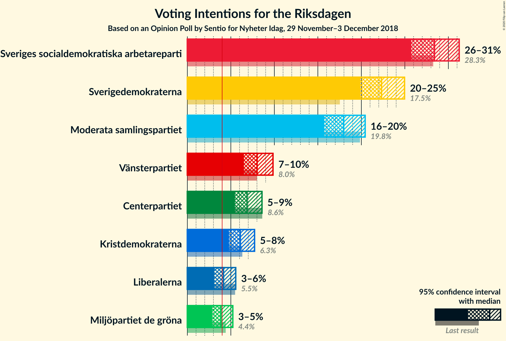
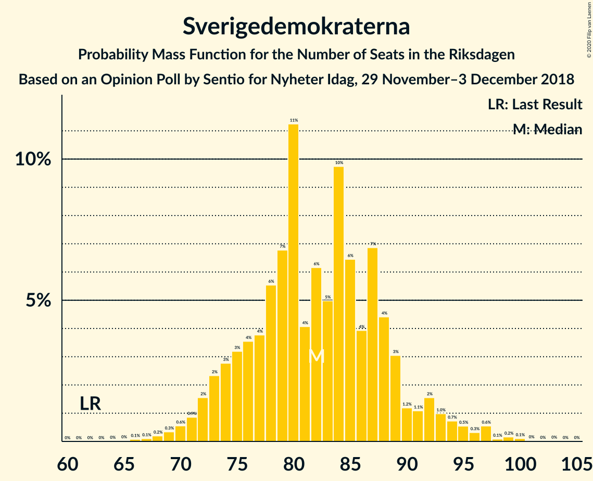
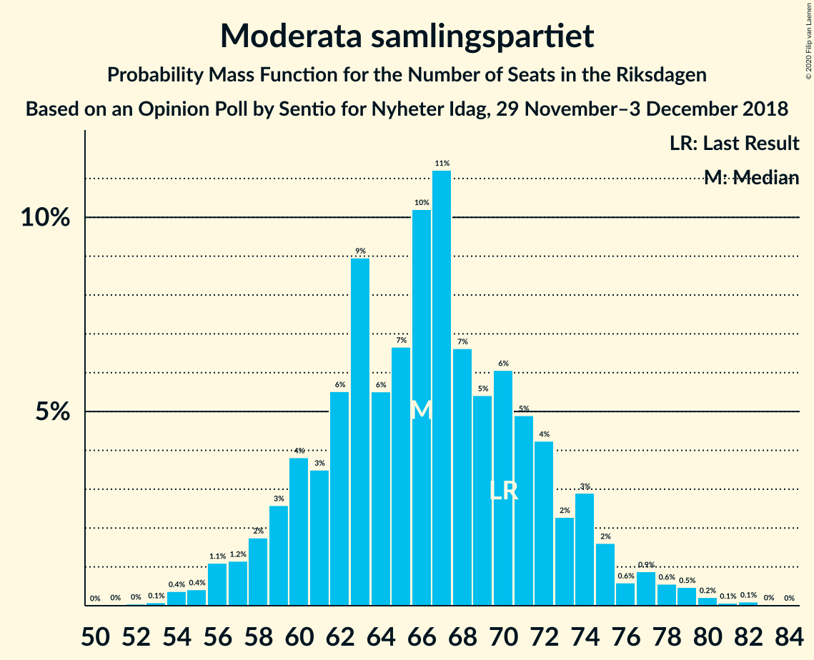
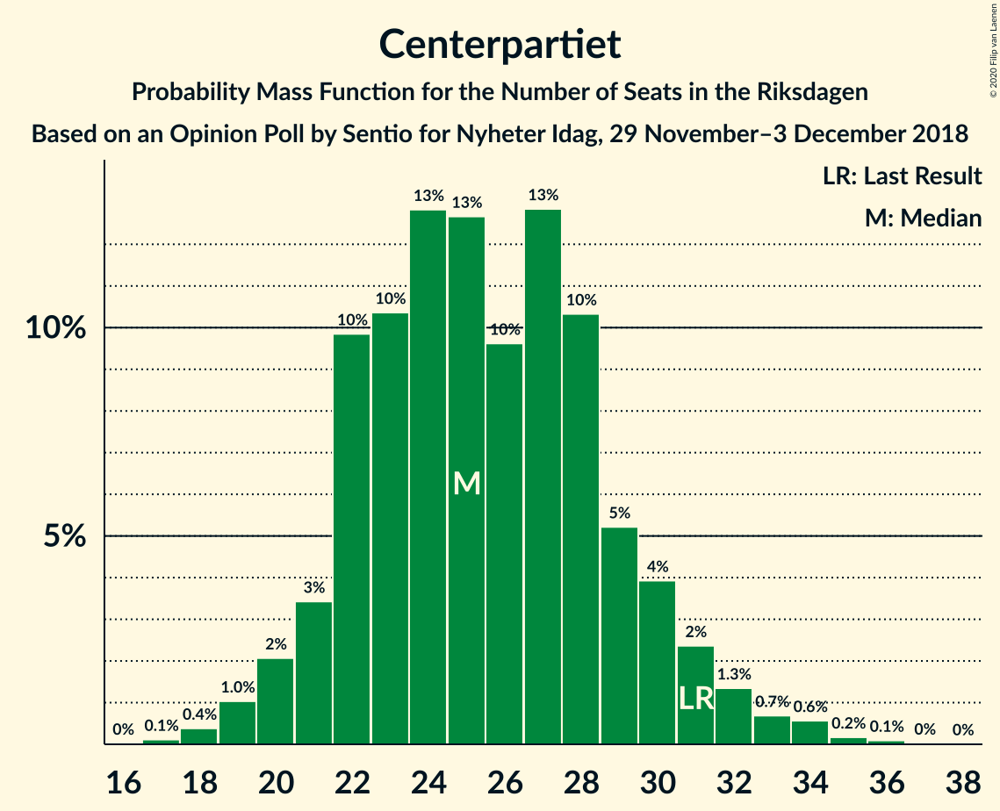
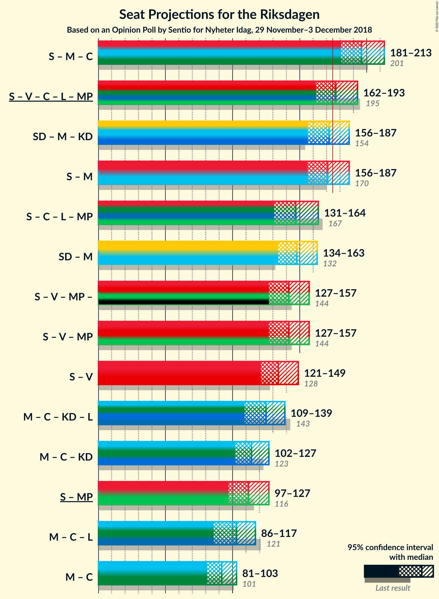

# Opinion Poll by Sentio for Nyheter Idag, 29 November–3 December 2018

<a href="#voting-intentions">Voting Intentions</a> | <a href="#seats">Seats</a> | <a href="#coalitions">Coalitions</a> | <a href="#technical-information">Technical Information</a>

## Voting Intentions

### Confidence Intervals

| Party | Last Result | Poll Result | 80% Confidence Interval | 90% Confidence Interval | 95% Confidence Interval | 99% Confidence Interval |
|:-----:|:-----------:|:-----------:|:-----------------------:|:-----------------------:|:-----------------------:|:-----------------------:|
| Sveriges socialdemokratiska arbetareparti | 28.3% | 28.4% | 26.7–30.3% |26.2–30.8% |25.7–31.2% |24.9–32.1% |
| Sverigedemokraterna | 17.5% | 22.3% | 20.7–24.1% |20.3–24.5% |19.9–25.0% |19.1–25.8% |
| Moderata samlingspartiet | 19.8% | 18.0% | 16.5–19.6% |16.1–20.0% |15.7–20.4% |15.1–21.2% |
| Vänsterpartiet | 8.0% | 8.0% | 7.0–9.2% |6.8–9.5% |6.5–9.8% |6.1–10.4% |
| Centerpartiet | 8.6% | 6.9% | 5.9–8.0% |5.7–8.3% |5.5–8.6% |5.1–9.1% |
| Kristdemokraterna | 6.3% | 6.1% | 5.2–7.1% |5.0–7.5% |4.8–7.7% |4.4–8.3% |
| Liberalerna | 5.5% | 4.2% | 3.5–5.1% |3.3–5.3% |3.1–5.6% |2.8–6.0% |
| Miljöpartiet de gröna | 4.4% | 3.9% | 3.2–4.8% |3.0–5.0% |2.9–5.2% |2.6–5.7% |

*Note:* The poll result column reflects the actual value used in the calculations. Published results may vary slightly, and in addition be rounded to fewer digits.

## Seats

### Confidence Intervals

| Party | Last Result | Median | 80% Confidence Interval | 90% Confidence Interval | 95% Confidence Interval | 99% Confidence Interval |
|:-----:|:-----------:|:------:|:-----------------------:|:-----------------------:|:-----------------------:|:-----------------------:|
| <a href="#sveriges-socialdemokratiska-arbetareparti">Sveriges socialdemokratiska arbetareparti</a> | 100 | 105 | 97–112 |95–115 |93–117 |90–120 |
| <a href="#sverigedemokraterna">Sverigedemokraterna</a> | 62 | 82 | 75–89 |73–92 |72–94 |69–97 |
| <a href="#moderata-samlingspartiet">Moderata samlingspartiet</a> | 70 | 66 | 60–72 |59–74 |57–76 |54–79 |
| <a href="#vänsterpartiet">Vänsterpartiet</a> | 28 | 30 | 26–34 |25–36 |24–37 |22–39 |
| <a href="#centerpartiet">Centerpartiet</a> | 31 | 25 | 22–29 |21–31 |20–32 |18–34 |
| <a href="#kristdemokraterna">Kristdemokraterna</a> | 22 | 23 | 19–26 |18–28 |17–29 |16–31 |
| <a href="#liberalerna">Liberalerna</a> | 20 | 15 | 0–18 |0–19 |0–20 |0–22 |
| <a href="#miljöpartiet-de-gröna">Miljöpartiet de gröna</a> | 16 | 0 | 0–17 |0–18 |0–19 |0–21 |

### Sveriges socialdemokratiska arbetareparti

*For a full overview of the results for this party, see the [Sveriges socialdemokratiska arbetareparti](party-sverigessocialdemokratiskaarbetareparti.html) page.*

| Number of Seats | Probability | Accumulated | Special Marks |
|:---------------:|:-----------:|:-----------:|:-------------:|
| 86 | 0.1% | 100% |  |
| 87 | 0% | 99.9% |  |
| 88 | 0.1% | 99.9% |  |
| 89 | 0.2% | 99.8% |  |
| 90 | 0.2% | 99.6% |  |
| 91 | 0.4% | 99.3% |  |
| 92 | 0.7% | 98.9% |  |
| 93 | 1.0% | 98% |  |
| 94 | 1.3% | 97% |  |
| 95 | 3% | 96% |  |
| 96 | 2% | 93% |  |
| 97 | 3% | 90% |  |
| 98 | 4% | 87% |  |
| 99 | 2% | 83% |  |
| 100 | 8% | 81% | Last Result |
| 101 | 4% | 73% |  |
| 102 | 7% | 69% |  |
| 103 | 5% | 62% |  |
| 104 | 6% | 57% |  |
| 105 | 7% | 50% | Median |
| 106 | 7% | 43% |  |
| 107 | 8% | 37% |  |
| 108 | 5% | 29% |  |
| 109 | 5% | 24% |  |
| 110 | 3% | 19% |  |
| 111 | 4% | 16% |  |
| 112 | 3% | 13% |  |
| 113 | 2% | 10% |  |
| 114 | 2% | 8% |  |
| 115 | 2% | 6% |  |
| 116 | 1.2% | 4% |  |
| 117 | 1.3% | 3% |  |
| 118 | 0.7% | 2% |  |
| 119 | 0.3% | 1.0% |  |
| 120 | 0.3% | 0.8% |  |
| 121 | 0.1% | 0.5% |  |
| 122 | 0.2% | 0.4% |  |
| 123 | 0.1% | 0.2% |  |
| 124 | 0% | 0.1% |  |
| 125 | 0.1% | 0.1% |  |
| 126 | 0% | 0% |  |

### Sverigedemokraterna

*For a full overview of the results for this party, see the [Sverigedemokraterna](party-sverigedemokraterna.html) page.*

| Number of Seats | Probability | Accumulated | Special Marks |
|:---------------:|:-----------:|:-----------:|:-------------:|
| 62 | 0% | 100% | Last Result |
| 63 | 0% | 100% |  |
| 64 | 0% | 100% |  |
| 65 | 0% | 100% |  |
| 66 | 0.1% | 99.9% |  |
| 67 | 0.1% | 99.9% |  |
| 68 | 0.2% | 99.8% |  |
| 69 | 0.3% | 99.6% |  |
| 70 | 0.6% | 99.2% |  |
| 71 | 0.9% | 98.7% |  |
| 72 | 2% | 98% |  |
| 73 | 2% | 96% |  |
| 74 | 3% | 94% |  |
| 75 | 3% | 91% |  |
| 76 | 4% | 88% |  |
| 77 | 4% | 84% |  |
| 78 | 6% | 81% |  |
| 79 | 7% | 75% |  |
| 80 | 11% | 68% |  |
| 81 | 4% | 57% |  |
| 82 | 6% | 53% | Median |
| 83 | 5% | 47% |  |
| 84 | 10% | 42% |  |
| 85 | 6% | 32% |  |
| 86 | 4% | 26% |  |
| 87 | 7% | 22% |  |
| 88 | 4% | 15% |  |
| 89 | 3% | 10% |  |
| 90 | 1.2% | 7% |  |
| 91 | 1.1% | 6% |  |
| 92 | 2% | 5% |  |
| 93 | 1.0% | 4% |  |
| 94 | 0.7% | 3% |  |
| 95 | 0.5% | 2% |  |
| 96 | 0.3% | 1.3% |  |
| 97 | 0.6% | 1.0% |  |
| 98 | 0.1% | 0.4% |  |
| 99 | 0.2% | 0.3% |  |
| 100 | 0.1% | 0.2% |  |
| 101 | 0% | 0.1% |  |
| 102 | 0% | 0% |  |

### Moderata samlingspartiet

*For a full overview of the results for this party, see the [Moderata samlingspartiet](party-moderatasamlingspartiet.html) page.*

| Number of Seats | Probability | Accumulated | Special Marks |
|:---------------:|:-----------:|:-----------:|:-------------:|
| 51 | 0% | 100% |  |
| 52 | 0% | 99.9% |  |
| 53 | 0.1% | 99.9% |  |
| 54 | 0.4% | 99.8% |  |
| 55 | 0.4% | 99.4% |  |
| 56 | 1.1% | 99.0% |  |
| 57 | 1.2% | 98% |  |
| 58 | 2% | 97% |  |
| 59 | 3% | 95% |  |
| 60 | 4% | 92% |  |
| 61 | 3% | 89% |  |
| 62 | 6% | 85% |  |
| 63 | 9% | 80% |  |
| 64 | 6% | 71% |  |
| 65 | 7% | 65% |  |
| 66 | 10% | 58% | Median |
| 67 | 11% | 48% |  |
| 68 | 7% | 37% |  |
| 69 | 5% | 30% |  |
| 70 | 6% | 25% | Last Result |
| 71 | 5% | 19% |  |
| 72 | 4% | 14% |  |
| 73 | 2% | 10% |  |
| 74 | 3% | 7% |  |
| 75 | 2% | 5% |  |
| 76 | 0.6% | 3% |  |
| 77 | 0.9% | 2% |  |
| 78 | 0.6% | 2% |  |
| 79 | 0.5% | 0.9% |  |
| 80 | 0.2% | 0.5% |  |
| 81 | 0.1% | 0.2% |  |
| 82 | 0.1% | 0.2% |  |
| 83 | 0% | 0.1% |  |
| 84 | 0% | 0% |  |

### Vänsterpartiet

*For a full overview of the results for this party, see the [Vänsterpartiet](party-vänsterpartiet.html) page.*

| Number of Seats | Probability | Accumulated | Special Marks |
|:---------------:|:-----------:|:-----------:|:-------------:|
| 20 | 0% | 100% |  |
| 21 | 0.2% | 99.9% |  |
| 22 | 0.4% | 99.7% |  |
| 23 | 1.2% | 99.3% |  |
| 24 | 3% | 98% |  |
| 25 | 4% | 95% |  |
| 26 | 7% | 91% |  |
| 27 | 7% | 84% |  |
| 28 | 13% | 77% | Last Result |
| 29 | 13% | 64% |  |
| 30 | 9% | 52% | Median |
| 31 | 14% | 42% |  |
| 32 | 8% | 29% |  |
| 33 | 6% | 21% |  |
| 34 | 5% | 15% |  |
| 35 | 4% | 10% |  |
| 36 | 3% | 6% |  |
| 37 | 2% | 3% |  |
| 38 | 0.6% | 1.4% |  |
| 39 | 0.5% | 0.9% |  |
| 40 | 0.2% | 0.3% |  |
| 41 | 0.1% | 0.1% |  |
| 42 | 0.1% | 0.1% |  |
| 43 | 0% | 0% |  |

### Centerpartiet

*For a full overview of the results for this party, see the [Centerpartiet](party-centerpartiet.html) page.*

| Number of Seats | Probability | Accumulated | Special Marks |
|:---------------:|:-----------:|:-----------:|:-------------:|
| 17 | 0.1% | 100% |  |
| 18 | 0.4% | 99.9% |  |
| 19 | 1.0% | 99.5% |  |
| 20 | 2% | 98% |  |
| 21 | 3% | 96% |  |
| 22 | 10% | 93% |  |
| 23 | 10% | 83% |  |
| 24 | 13% | 73% |  |
| 25 | 13% | 60% | Median |
| 26 | 10% | 47% |  |
| 27 | 13% | 38% |  |
| 28 | 10% | 25% |  |
| 29 | 5% | 14% |  |
| 30 | 4% | 9% |  |
| 31 | 2% | 5% | Last Result |
| 32 | 1.3% | 3% |  |
| 33 | 0.7% | 2% |  |
| 34 | 0.6% | 0.9% |  |
| 35 | 0.2% | 0.3% |  |
| 36 | 0.1% | 0.1% |  |
| 37 | 0% | 0% |  |

### Kristdemokraterna

*For a full overview of the results for this party, see the [Kristdemokraterna](party-kristdemokraterna.html) page.*

| Number of Seats | Probability | Accumulated | Special Marks |
|:---------------:|:-----------:|:-----------:|:-------------:|
| 0 | 0.1% | 100% |  |
| 1 | 0% | 99.9% |  |
| 2 | 0% | 99.9% |  |
| 3 | 0% | 99.9% |  |
| 4 | 0% | 99.9% |  |
| 5 | 0% | 99.9% |  |
| 6 | 0% | 99.9% |  |
| 7 | 0% | 99.9% |  |
| 8 | 0% | 99.9% |  |
| 9 | 0% | 99.9% |  |
| 10 | 0% | 99.9% |  |
| 11 | 0% | 99.9% |  |
| 12 | 0% | 99.9% |  |
| 13 | 0% | 99.9% |  |
| 14 | 0% | 99.9% |  |
| 15 | 0.2% | 99.9% |  |
| 16 | 0.7% | 99.7% |  |
| 17 | 2% | 99.1% |  |
| 18 | 3% | 97% |  |
| 19 | 8% | 94% |  |
| 20 | 7% | 86% |  |
| 21 | 12% | 79% |  |
| 22 | 16% | 67% | Last Result |
| 23 | 12% | 51% | Median |
| 24 | 10% | 39% |  |
| 25 | 13% | 29% |  |
| 26 | 6% | 16% |  |
| 27 | 5% | 10% |  |
| 28 | 3% | 5% |  |
| 29 | 1.5% | 3% |  |
| 30 | 0.5% | 1.1% |  |
| 31 | 0.3% | 0.6% |  |
| 32 | 0.2% | 0.3% |  |
| 33 | 0.1% | 0.1% |  |
| 34 | 0% | 0% |  |

### Liberalerna

*For a full overview of the results for this party, see the [Liberalerna](party-liberalerna.html) page.*

| Number of Seats | Probability | Accumulated | Special Marks |
|:---------------:|:-----------:|:-----------:|:-------------:|
| 0 | 37% | 100% |  |
| 1 | 0% | 63% |  |
| 2 | 0% | 63% |  |
| 3 | 0% | 63% |  |
| 4 | 0% | 63% |  |
| 5 | 0% | 63% |  |
| 6 | 0% | 63% |  |
| 7 | 0% | 63% |  |
| 8 | 0% | 63% |  |
| 9 | 0% | 63% |  |
| 10 | 0% | 63% |  |
| 11 | 0% | 63% |  |
| 12 | 0% | 63% |  |
| 13 | 0% | 63% |  |
| 14 | 2% | 63% |  |
| 15 | 15% | 61% | Median |
| 16 | 18% | 45% |  |
| 17 | 11% | 27% |  |
| 18 | 7% | 16% |  |
| 19 | 5% | 9% |  |
| 20 | 3% | 4% | Last Result |
| 21 | 0.9% | 2% |  |
| 22 | 0.4% | 0.7% |  |
| 23 | 0.2% | 0.3% |  |
| 24 | 0.1% | 0.1% |  |
| 25 | 0% | 0% |  |

### Miljöpartiet de gröna

*For a full overview of the results for this party, see the [Miljöpartiet de gröna](party-miljöpartietdegröna.html) page.*

| Number of Seats | Probability | Accumulated | Special Marks |
|:---------------:|:-----------:|:-----------:|:-------------:|
| 0 | 54% | 100% | Median |
| 1 | 0% | 46% |  |
| 2 | 0% | 46% |  |
| 3 | 0% | 46% |  |
| 4 | 0% | 46% |  |
| 5 | 0% | 46% |  |
| 6 | 0% | 46% |  |
| 7 | 0% | 46% |  |
| 8 | 0% | 46% |  |
| 9 | 0% | 46% |  |
| 10 | 0% | 46% |  |
| 11 | 0% | 46% |  |
| 12 | 0% | 46% |  |
| 13 | 0% | 46% |  |
| 14 | 2% | 46% |  |
| 15 | 11% | 44% |  |
| 16 | 16% | 33% | Last Result |
| 17 | 7% | 17% |  |
| 18 | 5% | 10% |  |
| 19 | 3% | 4% |  |
| 20 | 1.0% | 2% |  |
| 21 | 0.4% | 0.6% |  |
| 22 | 0.1% | 0.2% |  |
| 23 | 0.1% | 0.1% |  |
| 24 | 0% | 0% |  |

## Coalitions

### Confidence Intervals

| Coalition | Last Result | Median | Majority? | 80% Confidence Interval | 90% Confidence Interval | 95% Confidence Interval | 99% Confidence Interval |
|:---------:|:-----------:|:------:|:---------:|:-----------------------:|:-----------------------:|:-----------------------:|:-----------------------:|
| Sveriges socialdemokratiska arbetareparti – Moderata samlingspartiet – Centerpartiet | 201 | 196 | 99.8% | 185–207 | 183–211 | 181–213 | 177–217 |
| Sverigedemokraterna – Moderata samlingspartiet – Kristdemokraterna | 154 | 172 | 35% | 161–180 | 158–184 | 156–187 | 152–192 |
| Sveriges socialdemokratiska arbetareparti – Moderata samlingspartiet | 170 | 171 | 32% | 161–181 | 158–183 | 156–187 | 152–192 |
| Sverigedemokraterna – Moderata samlingspartiet | 132 | 148 | 0% | 139–158 | 136–161 | 134–163 | 130–169 |
| Sveriges socialdemokratiska arbetareparti – Vänsterpartiet – Miljöpartiet de gröna | 144 | 142 | 0% | 131–153 | 128–155 | 127–157 | 123–163 |
| Sveriges socialdemokratiska arbetareparti – Vänsterpartiet | 128 | 134 | 0% | 125–144 | 124–147 | 121–149 | 118–153 |
| Moderata samlingspartiet – Centerpartiet – Kristdemokraterna – Liberalerna | 143 | 125 | 0% | 114–136 | 112–138 | 109–139 | 105–143 |
| Moderata samlingspartiet – Centerpartiet – Kristdemokraterna | 123 | 114 | 0% | 107–123 | 104–125 | 102–127 | 98–131 |
| Sveriges socialdemokratiska arbetareparti – Miljöpartiet de gröna | 116 | 112 | 0% | 101–123 | 100–125 | 97–127 | 94–132 |
| Moderata samlingspartiet – Centerpartiet – Liberalerna | 121 | 103 | 0% | 91–112 | 89–115 | 86–117 | 83–120 |
| Moderata samlingspartiet – Centerpartiet | 101 | 92 | 0% | 85–99 | 83–101 | 81–103 | 78–107 |

### Sveriges socialdemokratiska arbetareparti – Moderata samlingspartiet – Centerpartiet

| Number of Seats | Probability | Accumulated | Special Marks |
|:---------------:|:-----------:|:-----------:|:-------------:|
| 172 | 0% | 100% |  |
| 173 | 0% | 99.9% |  |
| 174 | 0.1% | 99.9% |  |
| 175 | 0.1% | 99.8% | Majority |
| 176 | 0.1% | 99.8% |  |
| 177 | 0.3% | 99.6% |  |
| 178 | 0.5% | 99.4% |  |
| 179 | 0.5% | 98.9% |  |
| 180 | 0.7% | 98% |  |
| 181 | 0.9% | 98% |  |
| 182 | 1.4% | 97% |  |
| 183 | 3% | 95% |  |
| 184 | 2% | 92% |  |
| 185 | 2% | 91% |  |
| 186 | 2% | 89% |  |
| 187 | 3% | 87% |  |
| 188 | 2% | 84% |  |
| 189 | 2% | 83% |  |
| 190 | 4% | 81% |  |
| 191 | 3% | 76% |  |
| 192 | 3% | 73% |  |
| 193 | 5% | 70% |  |
| 194 | 7% | 65% |  |
| 195 | 6% | 58% |  |
| 196 | 6% | 52% | Median |
| 197 | 6% | 46% |  |
| 198 | 3% | 41% |  |
| 199 | 5% | 38% |  |
| 200 | 3% | 32% |  |
| 201 | 4% | 30% | Last Result |
| 202 | 3% | 26% |  |
| 203 | 3% | 23% |  |
| 204 | 1.1% | 20% |  |
| 205 | 4% | 19% |  |
| 206 | 4% | 15% |  |
| 207 | 2% | 12% |  |
| 208 | 2% | 10% |  |
| 209 | 2% | 8% |  |
| 210 | 0.9% | 6% |  |
| 211 | 1.2% | 5% |  |
| 212 | 1.2% | 4% |  |
| 213 | 0.8% | 3% |  |
| 214 | 0.3% | 2% |  |
| 215 | 0.5% | 2% |  |
| 216 | 0.5% | 1.1% |  |
| 217 | 0.1% | 0.6% |  |
| 218 | 0.1% | 0.5% |  |
| 219 | 0% | 0.3% |  |
| 220 | 0.1% | 0.3% |  |
| 221 | 0.1% | 0.2% |  |
| 222 | 0.1% | 0.1% |  |
| 223 | 0% | 0.1% |  |
| 224 | 0% | 0% |  |

### Sverigedemokraterna – Moderata samlingspartiet – Kristdemokraterna

| Number of Seats | Probability | Accumulated | Special Marks |
|:---------------:|:-----------:|:-----------:|:-------------:|
| 148 | 0% | 100% |  |
| 149 | 0% | 99.9% |  |
| 150 | 0.1% | 99.9% |  |
| 151 | 0.3% | 99.8% |  |
| 152 | 0.1% | 99.5% |  |
| 153 | 0.4% | 99.4% |  |
| 154 | 0.5% | 99.0% | Last Result |
| 155 | 0.5% | 98.5% |  |
| 156 | 2% | 98% |  |
| 157 | 0.6% | 96% |  |
| 158 | 1.1% | 96% |  |
| 159 | 2% | 95% |  |
| 160 | 1.3% | 92% |  |
| 161 | 2% | 91% |  |
| 162 | 3% | 89% |  |
| 163 | 3% | 86% |  |
| 164 | 5% | 83% |  |
| 165 | 3% | 79% |  |
| 166 | 3% | 75% |  |
| 167 | 5% | 73% |  |
| 168 | 3% | 68% |  |
| 169 | 6% | 65% |  |
| 170 | 4% | 59% |  |
| 171 | 5% | 56% | Median |
| 172 | 8% | 51% |  |
| 173 | 3% | 43% |  |
| 174 | 5% | 40% |  |
| 175 | 8% | 35% | Majority |
| 176 | 5% | 27% |  |
| 177 | 3% | 22% |  |
| 178 | 3% | 19% |  |
| 179 | 3% | 16% |  |
| 180 | 3% | 13% |  |
| 181 | 2% | 10% |  |
| 182 | 1.0% | 8% |  |
| 183 | 1.1% | 7% |  |
| 184 | 1.2% | 6% |  |
| 185 | 0.6% | 5% |  |
| 186 | 1.1% | 4% |  |
| 187 | 0.8% | 3% |  |
| 188 | 0.5% | 2% |  |
| 189 | 0.2% | 2% |  |
| 190 | 0.4% | 1.3% |  |
| 191 | 0.3% | 0.9% |  |
| 192 | 0.2% | 0.6% |  |
| 193 | 0.2% | 0.5% |  |
| 194 | 0.2% | 0.3% |  |
| 195 | 0% | 0.1% |  |
| 196 | 0% | 0.1% |  |
| 197 | 0% | 0.1% |  |
| 198 | 0% | 0% |  |

### Sveriges socialdemokratiska arbetareparti – Moderata samlingspartiet

| Number of Seats | Probability | Accumulated | Special Marks |
|:---------------:|:-----------:|:-----------:|:-------------:|
| 148 | 0% | 100% |  |
| 149 | 0% | 99.9% |  |
| 150 | 0.1% | 99.9% |  |
| 151 | 0.2% | 99.8% |  |
| 152 | 0.2% | 99.6% |  |
| 153 | 0.4% | 99.4% |  |
| 154 | 0.4% | 99.1% |  |
| 155 | 0.7% | 98.7% |  |
| 156 | 0.8% | 98% |  |
| 157 | 1.0% | 97% |  |
| 158 | 2% | 96% |  |
| 159 | 2% | 94% |  |
| 160 | 1.0% | 92% |  |
| 161 | 4% | 91% |  |
| 162 | 3% | 87% |  |
| 163 | 2% | 84% |  |
| 164 | 3% | 82% |  |
| 165 | 5% | 79% |  |
| 166 | 3% | 74% |  |
| 167 | 7% | 71% |  |
| 168 | 2% | 65% |  |
| 169 | 5% | 62% |  |
| 170 | 5% | 57% | Last Result |
| 171 | 3% | 52% | Median |
| 172 | 5% | 48% |  |
| 173 | 8% | 44% |  |
| 174 | 4% | 36% |  |
| 175 | 5% | 32% | Majority |
| 176 | 5% | 28% |  |
| 177 | 4% | 23% |  |
| 178 | 2% | 19% |  |
| 179 | 4% | 16% |  |
| 180 | 2% | 13% |  |
| 181 | 4% | 11% |  |
| 182 | 1.1% | 7% |  |
| 183 | 1.3% | 6% |  |
| 184 | 0.4% | 5% |  |
| 185 | 0.8% | 4% |  |
| 186 | 1.0% | 4% |  |
| 187 | 0.9% | 3% |  |
| 188 | 0.2% | 2% |  |
| 189 | 0.7% | 2% |  |
| 190 | 0.2% | 1.0% |  |
| 191 | 0.2% | 0.8% |  |
| 192 | 0.4% | 0.6% |  |
| 193 | 0% | 0.2% |  |
| 194 | 0% | 0.2% |  |
| 195 | 0.1% | 0.1% |  |
| 196 | 0% | 0.1% |  |
| 197 | 0% | 0.1% |  |
| 198 | 0% | 0% |  |

### Sverigedemokraterna – Moderata samlingspartiet

| Number of Seats | Probability | Accumulated | Special Marks |
|:---------------:|:-----------:|:-----------:|:-------------:|
| 127 | 0% | 100% |  |
| 128 | 0% | 99.9% |  |
| 129 | 0.1% | 99.9% |  |
| 130 | 0.3% | 99.8% |  |
| 131 | 0.3% | 99.5% |  |
| 132 | 0.5% | 99.2% | Last Result |
| 133 | 0.6% | 98.7% |  |
| 134 | 1.3% | 98% |  |
| 135 | 0.7% | 97% |  |
| 136 | 1.1% | 96% |  |
| 137 | 2% | 95% |  |
| 138 | 2% | 93% |  |
| 139 | 3% | 90% |  |
| 140 | 2% | 88% |  |
| 141 | 3% | 86% |  |
| 142 | 2% | 82% |  |
| 143 | 2% | 80% |  |
| 144 | 4% | 78% |  |
| 145 | 6% | 73% |  |
| 146 | 4% | 68% |  |
| 147 | 9% | 64% |  |
| 148 | 7% | 55% | Median |
| 149 | 4% | 48% |  |
| 150 | 9% | 44% |  |
| 151 | 5% | 35% |  |
| 152 | 3% | 31% |  |
| 153 | 3% | 27% |  |
| 154 | 7% | 24% |  |
| 155 | 2% | 17% |  |
| 156 | 3% | 15% |  |
| 157 | 1.2% | 12% |  |
| 158 | 2% | 11% |  |
| 159 | 2% | 9% |  |
| 160 | 1.3% | 7% |  |
| 161 | 1.0% | 5% |  |
| 162 | 2% | 4% |  |
| 163 | 0.5% | 3% |  |
| 164 | 0.3% | 2% |  |
| 165 | 0.3% | 2% |  |
| 166 | 0.4% | 2% |  |
| 167 | 0.5% | 1.2% |  |
| 168 | 0.2% | 0.7% |  |
| 169 | 0.3% | 0.5% |  |
| 170 | 0.1% | 0.2% |  |
| 171 | 0.1% | 0.1% |  |
| 172 | 0.1% | 0.1% |  |
| 173 | 0% | 0% |  |

### Sveriges socialdemokratiska arbetareparti – Vänsterpartiet – Miljöpartiet de gröna

| Number of Seats | Probability | Accumulated | Special Marks |
|:---------------:|:-----------:|:-----------:|:-------------:|
| 119 | 0.1% | 100% |  |
| 120 | 0.1% | 99.9% |  |
| 121 | 0.1% | 99.8% |  |
| 122 | 0.1% | 99.7% |  |
| 123 | 0.4% | 99.6% |  |
| 124 | 0.4% | 99.2% |  |
| 125 | 0.4% | 98.8% |  |
| 126 | 0.6% | 98% |  |
| 127 | 0.6% | 98% |  |
| 128 | 2% | 97% |  |
| 129 | 1.2% | 95% |  |
| 130 | 1.1% | 94% |  |
| 131 | 4% | 92% |  |
| 132 | 4% | 88% |  |
| 133 | 3% | 84% |  |
| 134 | 3% | 81% |  |
| 135 | 5% | 78% | Median |
| 136 | 3% | 73% |  |
| 137 | 3% | 70% |  |
| 138 | 4% | 68% |  |
| 139 | 4% | 64% |  |
| 140 | 5% | 60% |  |
| 141 | 3% | 55% |  |
| 142 | 3% | 52% |  |
| 143 | 7% | 48% |  |
| 144 | 3% | 42% | Last Result |
| 145 | 2% | 38% |  |
| 146 | 5% | 36% |  |
| 147 | 4% | 31% |  |
| 148 | 2% | 27% |  |
| 149 | 4% | 25% |  |
| 150 | 2% | 21% |  |
| 151 | 3% | 19% |  |
| 152 | 4% | 16% |  |
| 153 | 3% | 12% |  |
| 154 | 2% | 9% |  |
| 155 | 3% | 8% |  |
| 156 | 1.1% | 5% |  |
| 157 | 2% | 4% |  |
| 158 | 0.6% | 2% |  |
| 159 | 0.3% | 1.4% |  |
| 160 | 0.2% | 1.1% |  |
| 161 | 0.1% | 0.9% |  |
| 162 | 0.2% | 0.7% |  |
| 163 | 0.2% | 0.5% |  |
| 164 | 0.1% | 0.3% |  |
| 165 | 0.1% | 0.2% |  |
| 166 | 0% | 0.1% |  |
| 167 | 0.1% | 0.1% |  |
| 168 | 0% | 0.1% |  |
| 169 | 0% | 0% |  |

### Sveriges socialdemokratiska arbetareparti – Vänsterpartiet

| Number of Seats | Probability | Accumulated | Special Marks |
|:---------------:|:-----------:|:-----------:|:-------------:|
| 113 | 0% | 100% |  |
| 114 | 0% | 99.9% |  |
| 115 | 0.1% | 99.9% |  |
| 116 | 0.1% | 99.8% |  |
| 117 | 0.1% | 99.7% |  |
| 118 | 0.2% | 99.6% |  |
| 119 | 0.3% | 99.4% |  |
| 120 | 0.6% | 99.1% |  |
| 121 | 1.0% | 98% |  |
| 122 | 0.9% | 97% |  |
| 123 | 1.5% | 97% |  |
| 124 | 2% | 95% |  |
| 125 | 4% | 93% |  |
| 126 | 2% | 89% |  |
| 127 | 4% | 87% |  |
| 128 | 5% | 83% | Last Result |
| 129 | 3% | 79% |  |
| 130 | 3% | 76% |  |
| 131 | 7% | 72% |  |
| 132 | 6% | 65% |  |
| 133 | 5% | 59% |  |
| 134 | 6% | 55% |  |
| 135 | 7% | 49% | Median |
| 136 | 6% | 42% |  |
| 137 | 4% | 36% |  |
| 138 | 5% | 32% |  |
| 139 | 6% | 27% |  |
| 140 | 3% | 21% |  |
| 141 | 2% | 18% |  |
| 142 | 3% | 16% |  |
| 143 | 2% | 13% |  |
| 144 | 2% | 11% |  |
| 145 | 0.7% | 9% |  |
| 146 | 2% | 8% |  |
| 147 | 1.2% | 6% |  |
| 148 | 1.1% | 4% |  |
| 149 | 2% | 3% |  |
| 150 | 0.5% | 2% |  |
| 151 | 0.3% | 1.0% |  |
| 152 | 0.1% | 0.7% |  |
| 153 | 0.2% | 0.6% |  |
| 154 | 0.2% | 0.4% |  |
| 155 | 0.1% | 0.2% |  |
| 156 | 0.1% | 0.1% |  |
| 157 | 0% | 0.1% |  |
| 158 | 0% | 0% |  |

### Moderata samlingspartiet – Centerpartiet – Kristdemokraterna – Liberalerna

| Number of Seats | Probability | Accumulated | Special Marks |
|:---------------:|:-----------:|:-----------:|:-------------:|
| 100 | 0% | 100% |  |
| 101 | 0% | 99.9% |  |
| 102 | 0.1% | 99.9% |  |
| 103 | 0.2% | 99.9% |  |
| 104 | 0.2% | 99.7% |  |
| 105 | 0.2% | 99.5% |  |
| 106 | 0.3% | 99.3% |  |
| 107 | 0.2% | 99.0% |  |
| 108 | 0.9% | 98.8% |  |
| 109 | 0.7% | 98% |  |
| 110 | 0.4% | 97% |  |
| 111 | 1.2% | 97% |  |
| 112 | 2% | 96% |  |
| 113 | 2% | 93% |  |
| 114 | 6% | 92% |  |
| 115 | 1.4% | 86% |  |
| 116 | 2% | 85% |  |
| 117 | 4% | 83% |  |
| 118 | 3% | 79% |  |
| 119 | 3% | 76% |  |
| 120 | 3% | 73% |  |
| 121 | 2% | 70% |  |
| 122 | 5% | 68% |  |
| 123 | 5% | 63% |  |
| 124 | 3% | 58% |  |
| 125 | 6% | 55% |  |
| 126 | 5% | 49% |  |
| 127 | 5% | 45% |  |
| 128 | 4% | 40% |  |
| 129 | 3% | 36% | Median |
| 130 | 6% | 33% |  |
| 131 | 5% | 27% |  |
| 132 | 3% | 22% |  |
| 133 | 4% | 19% |  |
| 134 | 1.4% | 15% |  |
| 135 | 2% | 13% |  |
| 136 | 4% | 11% |  |
| 137 | 1.1% | 7% |  |
| 138 | 1.3% | 6% |  |
| 139 | 2% | 5% |  |
| 140 | 0.7% | 2% |  |
| 141 | 0.7% | 2% |  |
| 142 | 0.3% | 0.9% |  |
| 143 | 0.3% | 0.7% | Last Result |
| 144 | 0.1% | 0.4% |  |
| 145 | 0.1% | 0.3% |  |
| 146 | 0.1% | 0.2% |  |
| 147 | 0% | 0.1% |  |
| 148 | 0% | 0.1% |  |
| 149 | 0% | 0% |  |

### Moderata samlingspartiet – Centerpartiet – Kristdemokraterna

| Number of Seats | Probability | Accumulated | Special Marks |
|:---------------:|:-----------:|:-----------:|:-------------:|
| 94 | 0% | 100% |  |
| 95 | 0% | 99.9% |  |
| 96 | 0.1% | 99.9% |  |
| 97 | 0.1% | 99.9% |  |
| 98 | 0.3% | 99.7% |  |
| 99 | 0.2% | 99.5% |  |
| 100 | 0.5% | 99.3% |  |
| 101 | 0.9% | 98.8% |  |
| 102 | 0.6% | 98% |  |
| 103 | 2% | 97% |  |
| 104 | 1.0% | 96% |  |
| 105 | 1.4% | 95% |  |
| 106 | 3% | 93% |  |
| 107 | 3% | 91% |  |
| 108 | 5% | 87% |  |
| 109 | 4% | 82% |  |
| 110 | 5% | 78% |  |
| 111 | 5% | 73% |  |
| 112 | 7% | 68% |  |
| 113 | 3% | 62% |  |
| 114 | 11% | 59% | Median |
| 115 | 3% | 48% |  |
| 116 | 7% | 44% |  |
| 117 | 7% | 38% |  |
| 118 | 5% | 31% |  |
| 119 | 4% | 26% |  |
| 120 | 4% | 22% |  |
| 121 | 3% | 18% |  |
| 122 | 3% | 14% |  |
| 123 | 4% | 11% | Last Result |
| 124 | 0.7% | 7% |  |
| 125 | 2% | 7% |  |
| 126 | 2% | 4% |  |
| 127 | 0.3% | 3% |  |
| 128 | 1.2% | 2% |  |
| 129 | 0.3% | 1.2% |  |
| 130 | 0.1% | 0.8% |  |
| 131 | 0.2% | 0.7% |  |
| 132 | 0.1% | 0.5% |  |
| 133 | 0% | 0.4% |  |
| 134 | 0.2% | 0.3% |  |
| 135 | 0.1% | 0.1% |  |
| 136 | 0% | 0.1% |  |
| 137 | 0% | 0.1% |  |
| 138 | 0% | 0% |  |

### Sveriges socialdemokratiska arbetareparti – Miljöpartiet de gröna

| Number of Seats | Probability | Accumulated | Special Marks |
|:---------------:|:-----------:|:-----------:|:-------------:|
| 90 | 0% | 100% |  |
| 91 | 0.1% | 99.9% |  |
| 92 | 0.2% | 99.9% |  |
| 93 | 0.1% | 99.7% |  |
| 94 | 0.2% | 99.6% |  |
| 95 | 0.4% | 99.4% |  |
| 96 | 0.8% | 99.0% |  |
| 97 | 0.8% | 98% |  |
| 98 | 0.8% | 97% |  |
| 99 | 0.9% | 97% |  |
| 100 | 4% | 96% |  |
| 101 | 2% | 92% |  |
| 102 | 4% | 89% |  |
| 103 | 3% | 86% |  |
| 104 | 3% | 82% |  |
| 105 | 3% | 80% | Median |
| 106 | 4% | 76% |  |
| 107 | 5% | 72% |  |
| 108 | 3% | 67% |  |
| 109 | 4% | 63% |  |
| 110 | 4% | 60% |  |
| 111 | 4% | 56% |  |
| 112 | 4% | 51% |  |
| 113 | 3% | 47% |  |
| 114 | 6% | 44% |  |
| 115 | 3% | 38% |  |
| 116 | 3% | 35% | Last Result |
| 117 | 4% | 32% |  |
| 118 | 3% | 28% |  |
| 119 | 3% | 25% |  |
| 120 | 5% | 22% |  |
| 121 | 3% | 17% |  |
| 122 | 4% | 15% |  |
| 123 | 2% | 11% |  |
| 124 | 3% | 9% |  |
| 125 | 2% | 6% |  |
| 126 | 2% | 5% |  |
| 127 | 0.6% | 3% |  |
| 128 | 0.5% | 2% |  |
| 129 | 0.5% | 2% |  |
| 130 | 0.4% | 1.1% |  |
| 131 | 0.2% | 0.8% |  |
| 132 | 0.2% | 0.5% |  |
| 133 | 0.1% | 0.3% |  |
| 134 | 0.1% | 0.3% |  |
| 135 | 0% | 0.1% |  |
| 136 | 0.1% | 0.1% |  |
| 137 | 0% | 0% |  |

### Moderata samlingspartiet – Centerpartiet – Liberalerna

| Number of Seats | Probability | Accumulated | Special Marks |
|:---------------:|:-----------:|:-----------:|:-------------:|
| 79 | 0% | 100% |  |
| 80 | 0% | 99.9% |  |
| 81 | 0.1% | 99.9% |  |
| 82 | 0.2% | 99.8% |  |
| 83 | 0.1% | 99.6% |  |
| 84 | 0.5% | 99.4% |  |
| 85 | 0.7% | 99.0% |  |
| 86 | 0.9% | 98% |  |
| 87 | 1.0% | 97% |  |
| 88 | 0.6% | 96% |  |
| 89 | 4% | 96% |  |
| 90 | 1.0% | 92% |  |
| 91 | 2% | 91% |  |
| 92 | 4% | 89% |  |
| 93 | 5% | 86% |  |
| 94 | 1.2% | 80% |  |
| 95 | 3% | 79% |  |
| 96 | 3% | 76% |  |
| 97 | 3% | 73% |  |
| 98 | 2% | 70% |  |
| 99 | 3% | 68% |  |
| 100 | 6% | 65% |  |
| 101 | 4% | 59% |  |
| 102 | 5% | 56% |  |
| 103 | 3% | 51% |  |
| 104 | 3% | 48% |  |
| 105 | 7% | 45% |  |
| 106 | 5% | 38% | Median |
| 107 | 3% | 33% |  |
| 108 | 7% | 31% |  |
| 109 | 6% | 24% |  |
| 110 | 2% | 18% |  |
| 111 | 3% | 15% |  |
| 112 | 4% | 13% |  |
| 113 | 1.1% | 9% |  |
| 114 | 3% | 8% |  |
| 115 | 1.5% | 6% |  |
| 116 | 0.9% | 4% |  |
| 117 | 1.0% | 3% |  |
| 118 | 1.2% | 2% |  |
| 119 | 0.2% | 0.9% |  |
| 120 | 0.2% | 0.7% |  |
| 121 | 0.2% | 0.4% | Last Result |
| 122 | 0.1% | 0.3% |  |
| 123 | 0.1% | 0.2% |  |
| 124 | 0.1% | 0.1% |  |
| 125 | 0% | 0.1% |  |
| 126 | 0% | 0% |  |

### Moderata samlingspartiet – Centerpartiet

| Number of Seats | Probability | Accumulated | Special Marks |
|:---------------:|:-----------:|:-----------:|:-------------:|
| 74 | 0% | 100% |  |
| 75 | 0.1% | 99.9% |  |
| 76 | 0.1% | 99.9% |  |
| 77 | 0.2% | 99.8% |  |
| 78 | 0.3% | 99.6% |  |
| 79 | 0.5% | 99.3% |  |
| 80 | 0.6% | 98.8% |  |
| 81 | 2% | 98% |  |
| 82 | 1.0% | 96% |  |
| 83 | 2% | 95% |  |
| 84 | 3% | 94% |  |
| 85 | 5% | 91% |  |
| 86 | 4% | 86% |  |
| 87 | 5% | 82% |  |
| 88 | 4% | 77% |  |
| 89 | 9% | 73% |  |
| 90 | 4% | 63% |  |
| 91 | 6% | 59% | Median |
| 92 | 8% | 53% |  |
| 93 | 10% | 44% |  |
| 94 | 6% | 35% |  |
| 95 | 4% | 29% |  |
| 96 | 4% | 25% |  |
| 97 | 3% | 20% |  |
| 98 | 3% | 17% |  |
| 99 | 4% | 14% |  |
| 100 | 4% | 10% |  |
| 101 | 1.1% | 6% | Last Result |
| 102 | 1.3% | 5% |  |
| 103 | 1.0% | 3% |  |
| 104 | 0.9% | 2% |  |
| 105 | 0.7% | 2% |  |
| 106 | 0.3% | 0.9% |  |
| 107 | 0.2% | 0.6% |  |
| 108 | 0.2% | 0.4% |  |
| 109 | 0.1% | 0.2% |  |
| 110 | 0.1% | 0.2% |  |
| 111 | 0% | 0.1% |  |
| 112 | 0% | 0.1% |  |
| 113 | 0% | 0% |  |

## Technical Information

### Opinion Poll

+ **Polling firm:** Sentio
+ **Commissioner(s):** Nyheter Idag
+ **Fieldwork period:** 29 November–3 December 2018

### Calculations

+ **Sample size:** 1035
+ **Simulations done:** 1,048,576
+ **Error estimate:** 1.07%

