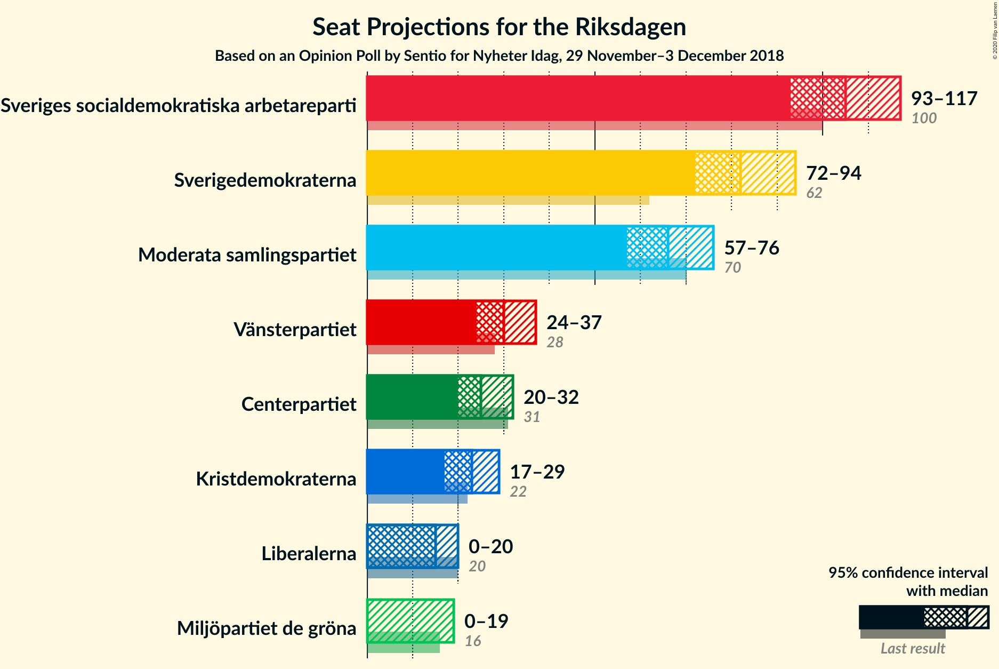
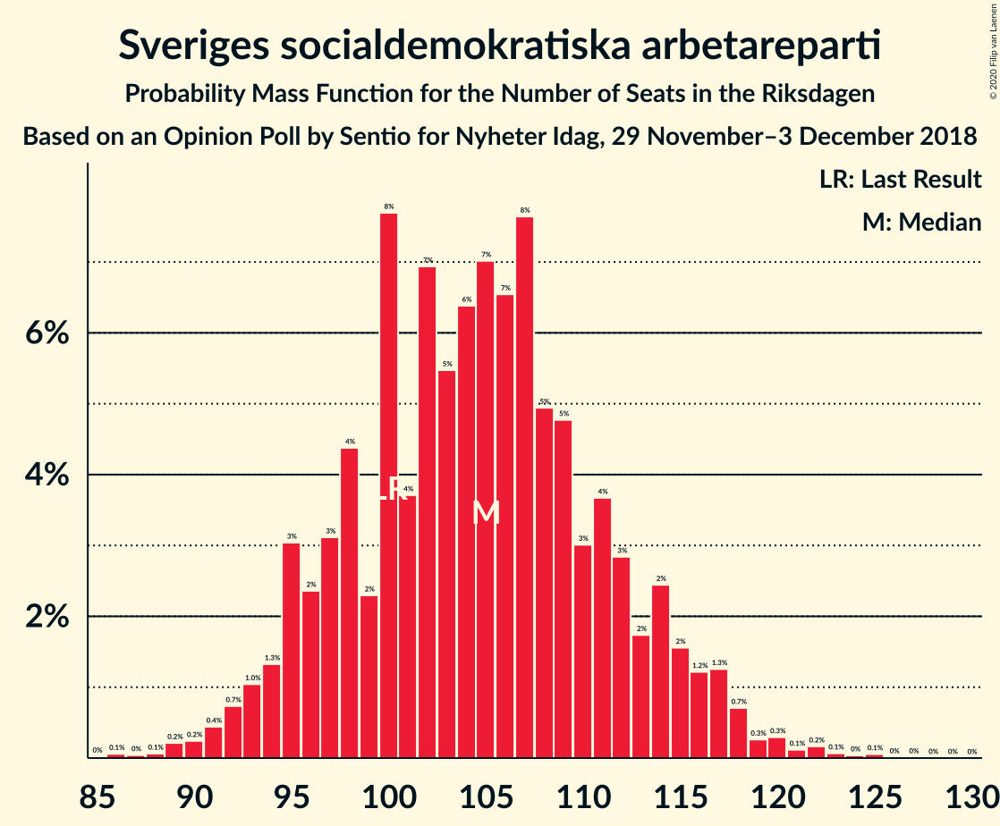
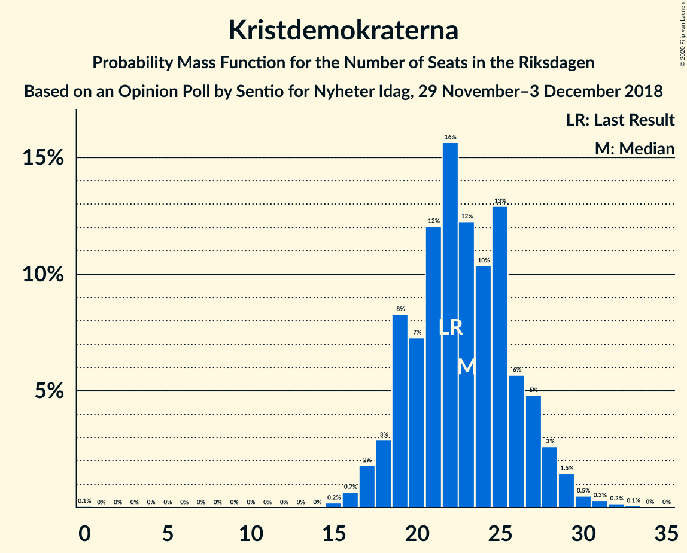
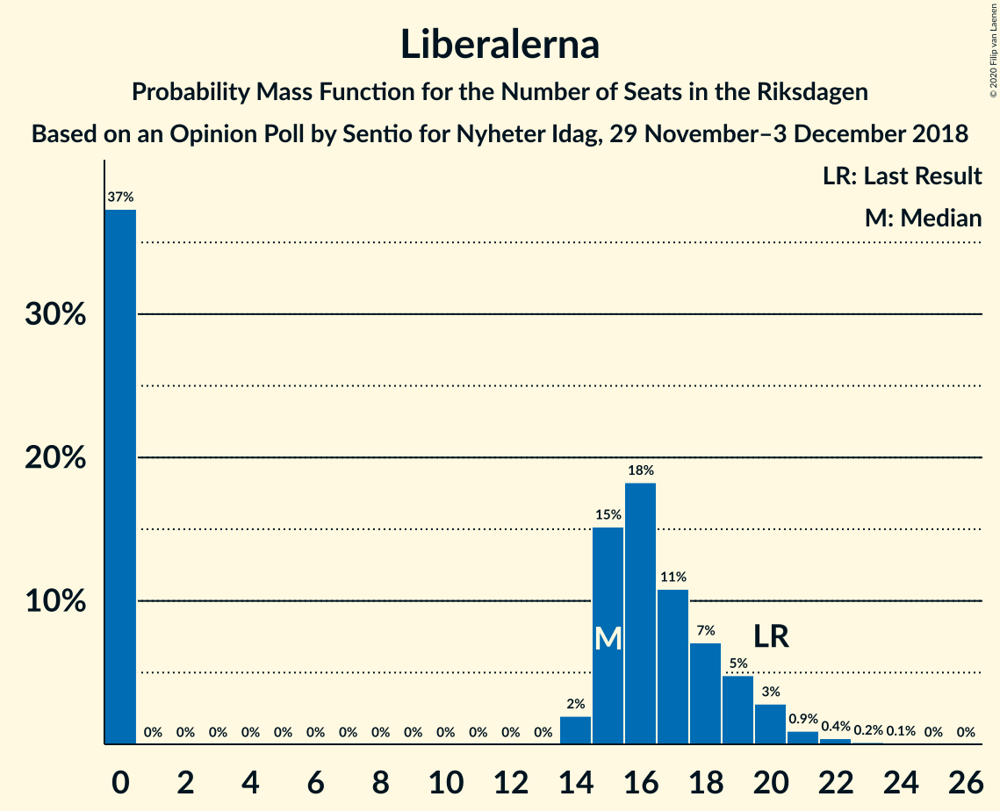
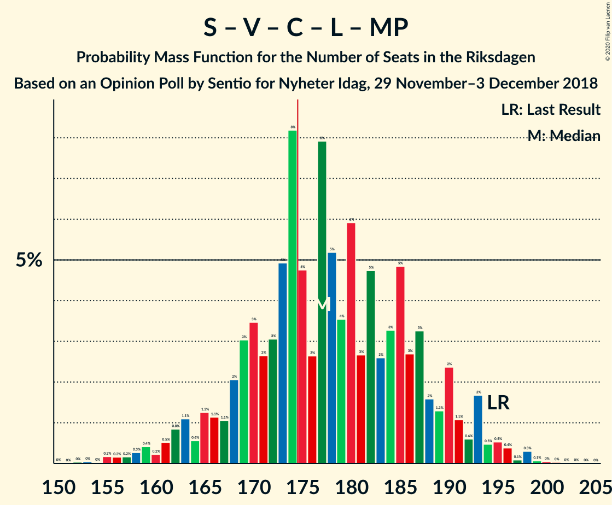

# Opinion Poll by Sentio for Nyheter Idag, 29 November–3 December 2018

<a href="#voting-intentions">Voting Intentions</a> | <a href="#seats">Seats</a> | <a href="#coalitions">Coalitions</a> | <a href="#technical-information">Technical Information</a>

## Voting Intentions

### Confidence Intervals

| Party | Last Result | Poll Result | 80% Confidence Interval | 90% Confidence Interval | 95% Confidence Interval | 99% Confidence Interval |
|:-----:|:-----------:|:-----------:|:-----------------------:|:-----------------------:|:-----------------------:|:-----------------------:|
| Sveriges socialdemokratiska arbetareparti | 28.3% | 28.4% | 26.7–30.3% |26.2–30.8% |25.7–31.2% |24.9–32.1% |
| Sverigedemokraterna | 17.5% | 22.3% | 20.7–24.1% |20.3–24.5% |19.9–25.0% |19.1–25.8% |
| Moderata samlingspartiet | 19.8% | 18.0% | 16.5–19.6% |16.1–20.0% |15.7–20.4% |15.1–21.2% |
| Vänsterpartiet | 8.0% | 8.0% | 7.0–9.2% |6.8–9.5% |6.5–9.8% |6.1–10.4% |
| Centerpartiet | 8.6% | 6.9% | 5.9–8.0% |5.7–8.3% |5.5–8.6% |5.1–9.1% |
| Kristdemokraterna | 6.3% | 6.1% | 5.2–7.1% |5.0–7.5% |4.8–7.7% |4.4–8.3% |
| Liberalerna | 5.5% | 4.2% | 3.5–5.1% |3.3–5.3% |3.1–5.6% |2.8–6.0% |
| Miljöpartiet de gröna | 4.4% | 3.9% | 3.2–4.8% |3.0–5.0% |2.9–5.2% |2.6–5.7% |

*Note:* The poll result column reflects the actual value used in the calculations. Published results may vary slightly, and in addition be rounded to fewer digits.

## Seats

### Confidence Intervals

| Party | Last Result | Median | 80% Confidence Interval | 90% Confidence Interval | 95% Confidence Interval | 99% Confidence Interval |
|:-----:|:-----------:|:------:|:-----------------------:|:-----------------------:|:-----------------------:|:-----------------------:|
| <a href="#sveriges-socialdemokratiska-arbetareparti">Sveriges socialdemokratiska arbetareparti</a> | 100 | 106 | 99–111 |96–113 |93–115 |90–120 |
| <a href="#sverigedemokraterna">Sverigedemokraterna</a> | 62 | 80 | 71–95 |70–97 |68–100 |66–102 |
| <a href="#moderata-samlingspartiet">Moderata samlingspartiet</a> | 70 | 68 | 59–72 |59–72 |57–74 |54–79 |
| <a href="#vänsterpartiet">Vänsterpartiet</a> | 28 | 30 | 24–36 |23–37 |22–38 |21–40 |
| <a href="#centerpartiet">Centerpartiet</a> | 31 | 26 | 22–29 |21–31 |20–32 |19–34 |
| <a href="#kristdemokraterna">Kristdemokraterna</a> | 22 | 22 | 19–25 |18–27 |17–28 |16–30 |
| <a href="#liberalerna">Liberalerna</a> | 20 | 0 | 0–18 |0–18 |0–20 |0–21 |
| <a href="#miljöpartiet-de-gröna">Miljöpartiet de gröna</a> | 16 | 15 | 0–19 |0–19 |0–21 |0–23 |

### Sveriges socialdemokratiska arbetareparti

*For a full overview of the results for this party, see the [Sveriges socialdemokratiska arbetareparti](party-sverigessocialdemokratiskaarbetareparti.html) page.*

| Number of Seats | Probability | Accumulated | Special Marks |
|:---------------:|:-----------:|:-----------:|:-------------:|
| 86 | 0% | 100% |  |
| 87 | 0.1% | 99.9% |  |
| 88 | 0.2% | 99.9% |  |
| 89 | 0.1% | 99.6% |  |
| 90 | 0.1% | 99.5% |  |
| 91 | 0.4% | 99.4% |  |
| 92 | 0.9% | 99.1% |  |
| 93 | 0.7% | 98% |  |
| 94 | 0.9% | 97% |  |
| 95 | 1.0% | 97% |  |
| 96 | 1.4% | 95% |  |
| 97 | 0.9% | 94% |  |
| 98 | 2% | 93% |  |
| 99 | 2% | 91% |  |
| 100 | 2% | 89% | Last Result |
| 101 | 2% | 86% |  |
| 102 | 5% | 85% |  |
| 103 | 7% | 80% |  |
| 104 | 6% | 73% |  |
| 105 | 11% | 67% |  |
| 106 | 8% | 55% | Median |
| 107 | 21% | 47% |  |
| 108 | 3% | 27% |  |
| 109 | 8% | 24% |  |
| 110 | 5% | 16% |  |
| 111 | 2% | 11% |  |
| 112 | 3% | 9% |  |
| 113 | 2% | 6% |  |
| 114 | 1.0% | 4% |  |
| 115 | 0.3% | 3% |  |
| 116 | 1.0% | 2% |  |
| 117 | 0.1% | 1.5% |  |
| 118 | 0.4% | 1.4% |  |
| 119 | 0.1% | 0.9% |  |
| 120 | 0.7% | 0.9% |  |
| 121 | 0.1% | 0.1% |  |
| 122 | 0% | 0.1% |  |
| 123 | 0% | 0.1% |  |
| 124 | 0% | 0.1% |  |
| 125 | 0% | 0% |  |

### Sverigedemokraterna

*For a full overview of the results for this party, see the [Sverigedemokraterna](party-sverigedemokraterna.html) page.*

| Number of Seats | Probability | Accumulated | Special Marks |
|:---------------:|:-----------:|:-----------:|:-------------:|
| 62 | 0% | 100% | Last Result |
| 63 | 0% | 100% |  |
| 64 | 0.1% | 99.9% |  |
| 65 | 0.1% | 99.8% |  |
| 66 | 0.9% | 99.7% |  |
| 67 | 0.3% | 98.9% |  |
| 68 | 2% | 98.6% |  |
| 69 | 1.2% | 97% |  |
| 70 | 1.2% | 95% |  |
| 71 | 7% | 94% |  |
| 72 | 2% | 87% |  |
| 73 | 2% | 85% |  |
| 74 | 3% | 84% |  |
| 75 | 14% | 81% |  |
| 76 | 10% | 67% |  |
| 77 | 3% | 57% |  |
| 78 | 2% | 54% |  |
| 79 | 1.2% | 52% |  |
| 80 | 3% | 51% | Median |
| 81 | 0.3% | 48% |  |
| 82 | 5% | 47% |  |
| 83 | 1.0% | 42% |  |
| 84 | 1.1% | 41% |  |
| 85 | 0.7% | 40% |  |
| 86 | 0.9% | 39% |  |
| 87 | 2% | 39% |  |
| 88 | 3% | 36% |  |
| 89 | 6% | 33% |  |
| 90 | 4% | 28% |  |
| 91 | 2% | 24% |  |
| 92 | 3% | 22% |  |
| 93 | 1.5% | 18% |  |
| 94 | 1.5% | 17% |  |
| 95 | 8% | 16% |  |
| 96 | 2% | 7% |  |
| 97 | 1.2% | 5% |  |
| 98 | 1.0% | 4% |  |
| 99 | 0.6% | 3% |  |
| 100 | 2% | 3% |  |
| 101 | 0.2% | 0.8% |  |
| 102 | 0.2% | 0.6% |  |
| 103 | 0.4% | 0.4% |  |
| 104 | 0.1% | 0.1% |  |
| 105 | 0% | 0% |  |

### Moderata samlingspartiet

*For a full overview of the results for this party, see the [Moderata samlingspartiet](party-moderatasamlingspartiet.html) page.*

| Number of Seats | Probability | Accumulated | Special Marks |
|:---------------:|:-----------:|:-----------:|:-------------:|
| 52 | 0% | 100% |  |
| 53 | 0.4% | 99.9% |  |
| 54 | 0.3% | 99.5% |  |
| 55 | 0.2% | 99.2% |  |
| 56 | 1.0% | 99.0% |  |
| 57 | 0.7% | 98% |  |
| 58 | 2% | 97% |  |
| 59 | 7% | 96% |  |
| 60 | 7% | 89% |  |
| 61 | 4% | 82% |  |
| 62 | 2% | 78% |  |
| 63 | 4% | 76% |  |
| 64 | 6% | 71% |  |
| 65 | 3% | 65% |  |
| 66 | 8% | 62% |  |
| 67 | 3% | 54% |  |
| 68 | 5% | 51% | Median |
| 69 | 22% | 46% |  |
| 70 | 7% | 24% | Last Result |
| 71 | 6% | 17% |  |
| 72 | 7% | 11% |  |
| 73 | 2% | 5% |  |
| 74 | 0.8% | 3% |  |
| 75 | 0.4% | 2% |  |
| 76 | 0.5% | 2% |  |
| 77 | 0.6% | 1.4% |  |
| 78 | 0.2% | 0.9% |  |
| 79 | 0.2% | 0.6% |  |
| 80 | 0.4% | 0.5% |  |
| 81 | 0% | 0.1% |  |
| 82 | 0.1% | 0.1% |  |
| 83 | 0% | 0% |  |

### Vänsterpartiet

*For a full overview of the results for this party, see the [Vänsterpartiet](party-vänsterpartiet.html) page.*

| Number of Seats | Probability | Accumulated | Special Marks |
|:---------------:|:-----------:|:-----------:|:-------------:|
| 19 | 0.1% | 100% |  |
| 20 | 0.2% | 99.8% |  |
| 21 | 0.6% | 99.6% |  |
| 22 | 2% | 99.0% |  |
| 23 | 3% | 97% |  |
| 24 | 9% | 94% |  |
| 25 | 3% | 85% |  |
| 26 | 15% | 83% |  |
| 27 | 2% | 67% |  |
| 28 | 9% | 66% | Last Result |
| 29 | 2% | 57% |  |
| 30 | 5% | 54% | Median |
| 31 | 16% | 49% |  |
| 32 | 2% | 33% |  |
| 33 | 6% | 32% |  |
| 34 | 12% | 25% |  |
| 35 | 3% | 13% |  |
| 36 | 4% | 11% |  |
| 37 | 2% | 7% |  |
| 38 | 2% | 4% |  |
| 39 | 0.7% | 2% |  |
| 40 | 0.9% | 1.4% |  |
| 41 | 0.2% | 0.4% |  |
| 42 | 0.1% | 0.2% |  |
| 43 | 0.1% | 0.1% |  |
| 44 | 0% | 0.1% |  |
| 45 | 0% | 0% |  |

### Centerpartiet

*For a full overview of the results for this party, see the [Centerpartiet](party-centerpartiet.html) page.*

| Number of Seats | Probability | Accumulated | Special Marks |
|:---------------:|:-----------:|:-----------:|:-------------:|
| 17 | 0.1% | 100% |  |
| 18 | 0.3% | 99.9% |  |
| 19 | 1.1% | 99.6% |  |
| 20 | 3% | 98% |  |
| 21 | 4% | 96% |  |
| 22 | 5% | 91% |  |
| 23 | 9% | 86% |  |
| 24 | 14% | 77% |  |
| 25 | 8% | 63% |  |
| 26 | 16% | 55% | Median |
| 27 | 20% | 40% |  |
| 28 | 8% | 20% |  |
| 29 | 3% | 11% |  |
| 30 | 3% | 9% |  |
| 31 | 2% | 6% | Last Result |
| 32 | 2% | 4% |  |
| 33 | 1.1% | 2% |  |
| 34 | 0.5% | 0.7% |  |
| 35 | 0.1% | 0.2% |  |
| 36 | 0.1% | 0.1% |  |
| 37 | 0% | 0.1% |  |
| 38 | 0% | 0% |  |

### Kristdemokraterna

*For a full overview of the results for this party, see the [Kristdemokraterna](party-kristdemokraterna.html) page.*

| Number of Seats | Probability | Accumulated | Special Marks |
|:---------------:|:-----------:|:-----------:|:-------------:|
| 15 | 0.1% | 100% |  |
| 16 | 0.7% | 99.8% |  |
| 17 | 3% | 99.1% |  |
| 18 | 2% | 96% |  |
| 19 | 6% | 94% |  |
| 20 | 7% | 87% |  |
| 21 | 26% | 80% |  |
| 22 | 4% | 54% | Last Result, Median |
| 23 | 17% | 49% |  |
| 24 | 15% | 33% |  |
| 25 | 9% | 18% |  |
| 26 | 3% | 9% |  |
| 27 | 2% | 7% |  |
| 28 | 3% | 4% |  |
| 29 | 0.5% | 1.5% |  |
| 30 | 0.6% | 1.0% |  |
| 31 | 0.3% | 0.5% |  |
| 32 | 0.1% | 0.2% |  |
| 33 | 0% | 0% |  |

### Liberalerna

*For a full overview of the results for this party, see the [Liberalerna](party-liberalerna.html) page.*

| Number of Seats | Probability | Accumulated | Special Marks |
|:---------------:|:-----------:|:-----------:|:-------------:|
| 0 | 52% | 100% | Median |
| 1 | 0% | 48% |  |
| 2 | 0% | 48% |  |
| 3 | 0% | 48% |  |
| 4 | 0% | 48% |  |
| 5 | 0% | 48% |  |
| 6 | 0% | 48% |  |
| 7 | 0% | 48% |  |
| 8 | 0% | 48% |  |
| 9 | 0% | 48% |  |
| 10 | 0% | 48% |  |
| 11 | 0% | 48% |  |
| 12 | 0% | 48% |  |
| 13 | 0% | 48% |  |
| 14 | 0.7% | 48% |  |
| 15 | 12% | 47% |  |
| 16 | 6% | 35% |  |
| 17 | 11% | 29% |  |
| 18 | 14% | 19% |  |
| 19 | 2% | 5% |  |
| 20 | 1.1% | 3% | Last Result |
| 21 | 1.1% | 2% |  |
| 22 | 0.2% | 0.4% |  |
| 23 | 0.1% | 0.2% |  |
| 24 | 0% | 0% |  |

### Miljöpartiet de gröna

*For a full overview of the results for this party, see the [Miljöpartiet de gröna](party-miljöpartietdegröna.html) page.*

| Number of Seats | Probability | Accumulated | Special Marks |
|:---------------:|:-----------:|:-----------:|:-------------:|
| 0 | 49% | 100% |  |
| 1 | 0% | 51% |  |
| 2 | 0% | 51% |  |
| 3 | 0% | 51% |  |
| 4 | 0% | 51% |  |
| 5 | 0% | 51% |  |
| 6 | 0% | 51% |  |
| 7 | 0% | 51% |  |
| 8 | 0% | 51% |  |
| 9 | 0% | 51% |  |
| 10 | 0% | 51% |  |
| 11 | 0% | 51% |  |
| 12 | 0% | 51% |  |
| 13 | 0% | 51% |  |
| 14 | 0.2% | 51% |  |
| 15 | 8% | 51% | Median |
| 16 | 3% | 43% | Last Result |
| 17 | 11% | 40% |  |
| 18 | 8% | 30% |  |
| 19 | 17% | 22% |  |
| 20 | 1.5% | 5% |  |
| 21 | 2% | 3% |  |
| 22 | 0.5% | 1.1% |  |
| 23 | 0.4% | 0.6% |  |
| 24 | 0.2% | 0.2% |  |
| 25 | 0% | 0% |  |

## Coalitions

### Confidence Intervals

| Coalition | Last Result | Median | Majority? | 80% Confidence Interval | 90% Confidence Interval | 95% Confidence Interval | 99% Confidence Interval |
|:---------:|:-----------:|:------:|:---------:|:-----------------------:|:-----------------------:|:-----------------------:|:-----------------------:|
| Sveriges socialdemokratiska arbetareparti – Moderata samlingspartiet – Centerpartiet | 201 | 198 | 99.8% | 189–206 | 184–208 | 181–211 | 177–216 |
| Sveriges socialdemokratiska arbetareparti – Vänsterpartiet – Centerpartiet – Liberalerna – Miljöpartiet de gröna | 195 | 180 | 67% | 159–194 | 158–198 | 158–198 | 153–201 |
| Sverigedemokraterna – Moderata samlingspartiet – Kristdemokraterna | 154 | 169 | 33% | 155–190 | 151–191 | 151–191 | 148–195 |
| Sveriges socialdemokratiska arbetareparti – Moderata samlingspartiet | 170 | 174 | 41% | 163–179 | 160–182 | 158–185 | 154–189 |
| Sverigedemokraterna – Moderata samlingspartiet | 132 | 145 | 0.1% | 134–166 | 130–167 | 130–167 | 128–172 |
| Sveriges socialdemokratiska arbetareparti – Centerpartiet – Liberalerna – Miljöpartiet de gröna | 167 | 150 | 0% | 134–162 | 130–165 | 130–165 | 126–170 |
| Sveriges socialdemokratiska arbetareparti – Vänsterpartiet – Miljöpartiet de gröna | 144 | 144 | 0% | 129–157 | 126–162 | 124–164 | 120–168 |
| Sveriges socialdemokratiska arbetareparti – Vänsterpartiet | 128 | 135 | 0% | 128–142 | 126–146 | 123–148 | 119–151 |
| Moderata samlingspartiet – Centerpartiet – Kristdemokraterna – Liberalerna | 143 | 122 | 0% | 112–132 | 109–136 | 105–139 | 105–141 |
| Sveriges socialdemokratiska arbetareparti – Miljöpartiet de gröna | 116 | 114 | 0% | 103–126 | 101–128 | 98–129 | 93–134 |
| Moderata samlingspartiet – Centerpartiet – Kristdemokraterna | 123 | 117 | 0% | 105–122 | 104–123 | 101–125 | 98–129 |
| Moderata samlingspartiet – Centerpartiet – Liberalerna | 121 | 100 | 0% | 89–111 | 87–113 | 85–115 | 82–118 |
| Moderata samlingspartiet – Centerpartiet | 101 | 93 | 0% | 84–98 | 83–100 | 82–102 | 77–107 |

### Sveriges socialdemokratiska arbetareparti – Moderata samlingspartiet – Centerpartiet

| Number of Seats | Probability | Accumulated | Special Marks |
|:---------------:|:-----------:|:-----------:|:-------------:|
| 172 | 0% | 100% |  |
| 173 | 0% | 99.9% |  |
| 174 | 0.1% | 99.9% |  |
| 175 | 0% | 99.8% | Majority |
| 176 | 0.2% | 99.8% |  |
| 177 | 0.2% | 99.6% |  |
| 178 | 0.2% | 99.4% |  |
| 179 | 0.5% | 99.2% |  |
| 180 | 0.6% | 98.7% |  |
| 181 | 0.8% | 98% |  |
| 182 | 0.7% | 97% |  |
| 183 | 0.8% | 97% |  |
| 184 | 1.2% | 96% |  |
| 185 | 0.9% | 95% |  |
| 186 | 2% | 94% |  |
| 187 | 1.4% | 92% |  |
| 188 | 0.7% | 91% |  |
| 189 | 2% | 90% |  |
| 190 | 4% | 88% |  |
| 191 | 5% | 84% |  |
| 192 | 2% | 79% |  |
| 193 | 7% | 77% |  |
| 194 | 1.5% | 70% |  |
| 195 | 7% | 68% |  |
| 196 | 3% | 62% |  |
| 197 | 6% | 59% |  |
| 198 | 12% | 54% |  |
| 199 | 3% | 42% |  |
| 200 | 3% | 39% | Median |
| 201 | 4% | 36% | Last Result |
| 202 | 2% | 31% |  |
| 203 | 12% | 30% |  |
| 204 | 2% | 18% |  |
| 205 | 5% | 16% |  |
| 206 | 0.7% | 10% |  |
| 207 | 5% | 10% |  |
| 208 | 1.1% | 5% |  |
| 209 | 0.6% | 4% |  |
| 210 | 0.2% | 3% |  |
| 211 | 2% | 3% |  |
| 212 | 0.1% | 2% |  |
| 213 | 0% | 2% |  |
| 214 | 0.9% | 2% |  |
| 215 | 0% | 0.6% |  |
| 216 | 0.4% | 0.6% |  |
| 217 | 0.1% | 0.2% |  |
| 218 | 0% | 0.1% |  |
| 219 | 0% | 0.1% |  |
| 220 | 0% | 0% |  |

### Sveriges socialdemokratiska arbetareparti – Vänsterpartiet – Centerpartiet – Liberalerna – Miljöpartiet de gröna

| Number of Seats | Probability | Accumulated | Special Marks |
|:---------------:|:-----------:|:-----------:|:-------------:|
| 149 | 0.1% | 100% |  |
| 150 | 0% | 99.9% |  |
| 151 | 0% | 99.9% |  |
| 152 | 0.1% | 99.9% |  |
| 153 | 0.3% | 99.8% |  |
| 154 | 0.2% | 99.5% |  |
| 155 | 0.7% | 99.3% |  |
| 156 | 0.2% | 98.6% |  |
| 157 | 0.2% | 98% |  |
| 158 | 4% | 98% |  |
| 159 | 5% | 94% |  |
| 160 | 1.0% | 89% |  |
| 161 | 0.7% | 88% |  |
| 162 | 2% | 87% |  |
| 163 | 1.3% | 85% |  |
| 164 | 2% | 84% |  |
| 165 | 0.7% | 82% |  |
| 166 | 0.7% | 81% |  |
| 167 | 2% | 81% |  |
| 168 | 0.9% | 78% |  |
| 169 | 1.3% | 77% |  |
| 170 | 2% | 76% |  |
| 171 | 1.2% | 74% |  |
| 172 | 4% | 73% |  |
| 173 | 2% | 69% |  |
| 174 | 0.3% | 67% |  |
| 175 | 0.8% | 67% | Majority |
| 176 | 5% | 66% |  |
| 177 | 5% | 61% | Median |
| 178 | 0.5% | 55% |  |
| 179 | 2% | 55% |  |
| 180 | 8% | 53% |  |
| 181 | 0.8% | 44% |  |
| 182 | 0.9% | 44% |  |
| 183 | 1.2% | 43% |  |
| 184 | 12% | 41% |  |
| 185 | 4% | 29% |  |
| 186 | 3% | 25% |  |
| 187 | 2% | 22% |  |
| 188 | 0.7% | 21% |  |
| 189 | 3% | 20% |  |
| 190 | 3% | 17% |  |
| 191 | 1.0% | 14% |  |
| 192 | 1.3% | 13% |  |
| 193 | 0.8% | 12% |  |
| 194 | 2% | 11% |  |
| 195 | 2% | 9% | Last Result |
| 196 | 1.0% | 6% |  |
| 197 | 0.2% | 5% |  |
| 198 | 4% | 5% |  |
| 199 | 0.3% | 1.0% |  |
| 200 | 0.1% | 0.7% |  |
| 201 | 0.3% | 0.6% |  |
| 202 | 0.1% | 0.2% |  |
| 203 | 0.1% | 0.2% |  |
| 204 | 0.1% | 0.1% |  |
| 205 | 0% | 0% |  |

### Sverigedemokraterna – Moderata samlingspartiet – Kristdemokraterna

| Number of Seats | Probability | Accumulated | Special Marks |
|:---------------:|:-----------:|:-----------:|:-------------:|
| 145 | 0.1% | 100% |  |
| 146 | 0.1% | 99.9% |  |
| 147 | 0.1% | 99.8% |  |
| 148 | 0.3% | 99.7% |  |
| 149 | 0.1% | 99.4% |  |
| 150 | 0.3% | 99.3% |  |
| 151 | 4% | 99.0% |  |
| 152 | 0.2% | 95% |  |
| 153 | 1.0% | 95% |  |
| 154 | 2% | 94% | Last Result |
| 155 | 2% | 91% |  |
| 156 | 0.8% | 89% |  |
| 157 | 1.4% | 88% |  |
| 158 | 1.0% | 87% |  |
| 159 | 3% | 86% |  |
| 160 | 3% | 83% |  |
| 161 | 0.7% | 80% |  |
| 162 | 2% | 79% |  |
| 163 | 3% | 78% |  |
| 164 | 4% | 74% |  |
| 165 | 12% | 71% |  |
| 166 | 1.2% | 58% |  |
| 167 | 0.9% | 57% |  |
| 168 | 0.8% | 56% |  |
| 169 | 8% | 56% |  |
| 170 | 2% | 47% | Median |
| 171 | 0.5% | 45% |  |
| 172 | 5% | 45% |  |
| 173 | 5% | 39% |  |
| 174 | 0.8% | 34% |  |
| 175 | 0.3% | 33% | Majority |
| 176 | 2% | 33% |  |
| 177 | 4% | 31% |  |
| 178 | 1.2% | 27% |  |
| 179 | 2% | 26% |  |
| 180 | 1.3% | 24% |  |
| 181 | 0.9% | 23% |  |
| 182 | 2% | 22% |  |
| 183 | 0.7% | 19% |  |
| 184 | 0.7% | 19% |  |
| 185 | 2% | 18% |  |
| 186 | 1.3% | 16% |  |
| 187 | 2% | 15% |  |
| 188 | 0.7% | 13% |  |
| 189 | 1.0% | 12% |  |
| 190 | 5% | 11% |  |
| 191 | 4% | 6% |  |
| 192 | 0.2% | 2% |  |
| 193 | 0.2% | 2% |  |
| 194 | 0.7% | 1.3% |  |
| 195 | 0.2% | 0.7% |  |
| 196 | 0.3% | 0.5% |  |
| 197 | 0% | 0.2% |  |
| 198 | 0% | 0.1% |  |
| 199 | 0% | 0.1% |  |
| 200 | 0.1% | 0.1% |  |
| 201 | 0% | 0% |  |

### Sveriges socialdemokratiska arbetareparti – Moderata samlingspartiet

| Number of Seats | Probability | Accumulated | Special Marks |
|:---------------:|:-----------:|:-----------:|:-------------:|
| 148 | 0% | 100% |  |
| 149 | 0.1% | 99.9% |  |
| 150 | 0.1% | 99.8% |  |
| 151 | 0.1% | 99.8% |  |
| 152 | 0.1% | 99.7% |  |
| 153 | 0.1% | 99.6% |  |
| 154 | 0.4% | 99.5% |  |
| 155 | 0.3% | 99.1% |  |
| 156 | 0.5% | 98.7% |  |
| 157 | 0.5% | 98% |  |
| 158 | 1.3% | 98% |  |
| 159 | 1.0% | 96% |  |
| 160 | 2% | 95% |  |
| 161 | 1.2% | 94% |  |
| 162 | 1.1% | 92% |  |
| 163 | 2% | 91% |  |
| 164 | 3% | 90% |  |
| 165 | 3% | 86% |  |
| 166 | 10% | 83% |  |
| 167 | 5% | 74% |  |
| 168 | 3% | 68% |  |
| 169 | 2% | 65% |  |
| 170 | 2% | 63% | Last Result |
| 171 | 5% | 61% |  |
| 172 | 3% | 57% |  |
| 173 | 1.0% | 54% |  |
| 174 | 12% | 53% | Median |
| 175 | 9% | 41% | Majority |
| 176 | 12% | 32% |  |
| 177 | 0.9% | 20% |  |
| 178 | 1.4% | 19% |  |
| 179 | 10% | 18% |  |
| 180 | 1.2% | 8% |  |
| 181 | 1.2% | 6% |  |
| 182 | 2% | 5% |  |
| 183 | 0.4% | 3% |  |
| 184 | 0.1% | 3% |  |
| 185 | 0.8% | 3% |  |
| 186 | 0.1% | 2% |  |
| 187 | 0.3% | 2% |  |
| 188 | 0.8% | 1.5% |  |
| 189 | 0.5% | 0.7% |  |
| 190 | 0% | 0.1% |  |
| 191 | 0% | 0.1% |  |
| 192 | 0% | 0.1% |  |
| 193 | 0% | 0.1% |  |
| 194 | 0% | 0% |  |

### Sverigedemokraterna – Moderata samlingspartiet

| Number of Seats | Probability | Accumulated | Special Marks |
|:---------------:|:-----------:|:-----------:|:-------------:|
| 123 | 0% | 100% |  |
| 124 | 0.1% | 99.9% |  |
| 125 | 0.1% | 99.9% |  |
| 126 | 0.1% | 99.8% |  |
| 127 | 0.1% | 99.7% |  |
| 128 | 0.3% | 99.6% |  |
| 129 | 0.3% | 99.2% |  |
| 130 | 6% | 98.9% |  |
| 131 | 0.4% | 93% |  |
| 132 | 0.9% | 92% | Last Result |
| 133 | 1.1% | 91% |  |
| 134 | 2% | 90% |  |
| 135 | 1.5% | 89% |  |
| 136 | 2% | 87% |  |
| 137 | 1.5% | 85% |  |
| 138 | 2% | 84% |  |
| 139 | 2% | 81% |  |
| 140 | 3% | 79% |  |
| 141 | 3% | 77% |  |
| 142 | 2% | 74% |  |
| 143 | 0.7% | 72% |  |
| 144 | 14% | 71% |  |
| 145 | 8% | 57% |  |
| 146 | 1.0% | 49% |  |
| 147 | 0.7% | 48% |  |
| 148 | 1.5% | 47% | Median |
| 149 | 5% | 45% |  |
| 150 | 1.0% | 40% |  |
| 151 | 0.8% | 39% |  |
| 152 | 5% | 38% |  |
| 153 | 1.2% | 33% |  |
| 154 | 1.4% | 32% |  |
| 155 | 2% | 31% |  |
| 156 | 1.4% | 28% |  |
| 157 | 0.8% | 27% |  |
| 158 | 5% | 26% |  |
| 159 | 2% | 22% |  |
| 160 | 0.9% | 19% |  |
| 161 | 0.1% | 18% |  |
| 162 | 4% | 18% |  |
| 163 | 0.6% | 14% |  |
| 164 | 0.5% | 13% |  |
| 165 | 0.2% | 13% |  |
| 166 | 6% | 13% |  |
| 167 | 5% | 7% |  |
| 168 | 1.0% | 2% |  |
| 169 | 0.2% | 1.4% |  |
| 170 | 0.3% | 1.1% |  |
| 171 | 0.2% | 0.8% |  |
| 172 | 0.3% | 0.7% |  |
| 173 | 0% | 0.3% |  |
| 174 | 0.2% | 0.3% |  |
| 175 | 0.1% | 0.1% | Majority |
| 176 | 0% | 0.1% |  |
| 177 | 0% | 0% |  |

### Sveriges socialdemokratiska arbetareparti – Centerpartiet – Liberalerna – Miljöpartiet de gröna

| Number of Seats | Probability | Accumulated | Special Marks |
|:---------------:|:-----------:|:-----------:|:-------------:|
| 122 | 0% | 100% |  |
| 123 | 0% | 99.9% |  |
| 124 | 0.1% | 99.9% |  |
| 125 | 0.1% | 99.8% |  |
| 126 | 0.4% | 99.7% |  |
| 127 | 0.2% | 99.3% |  |
| 128 | 0.1% | 99.2% |  |
| 129 | 0.2% | 99.1% |  |
| 130 | 4% | 98.9% |  |
| 131 | 0.7% | 95% |  |
| 132 | 2% | 94% |  |
| 133 | 0.5% | 92% |  |
| 134 | 2% | 91% |  |
| 135 | 5% | 90% |  |
| 136 | 2% | 85% |  |
| 137 | 0.6% | 83% |  |
| 138 | 0.4% | 82% |  |
| 139 | 2% | 82% |  |
| 140 | 0.9% | 80% |  |
| 141 | 2% | 79% |  |
| 142 | 2% | 77% |  |
| 143 | 0.4% | 76% |  |
| 144 | 2% | 75% |  |
| 145 | 2% | 73% |  |
| 146 | 11% | 71% |  |
| 147 | 1.2% | 60% | Median |
| 148 | 3% | 59% |  |
| 149 | 3% | 56% |  |
| 150 | 6% | 53% |  |
| 151 | 8% | 46% |  |
| 152 | 3% | 38% |  |
| 153 | 14% | 35% |  |
| 154 | 1.2% | 22% |  |
| 155 | 2% | 20% |  |
| 156 | 2% | 18% |  |
| 157 | 1.2% | 16% |  |
| 158 | 2% | 15% |  |
| 159 | 0.5% | 13% |  |
| 160 | 1.1% | 13% |  |
| 161 | 0.9% | 12% |  |
| 162 | 1.1% | 11% |  |
| 163 | 2% | 10% |  |
| 164 | 0.7% | 8% |  |
| 165 | 5% | 7% |  |
| 166 | 0.4% | 2% |  |
| 167 | 0.5% | 2% | Last Result |
| 168 | 0.5% | 1.2% |  |
| 169 | 0.1% | 0.7% |  |
| 170 | 0.1% | 0.5% |  |
| 171 | 0.1% | 0.4% |  |
| 172 | 0% | 0.3% |  |
| 173 | 0.2% | 0.2% |  |
| 174 | 0% | 0% |  |

### Sveriges socialdemokratiska arbetareparti – Vänsterpartiet – Miljöpartiet de gröna

| Number of Seats | Probability | Accumulated | Special Marks |
|:---------------:|:-----------:|:-----------:|:-------------:|
| 115 | 0% | 100% |  |
| 116 | 0% | 99.9% |  |
| 117 | 0% | 99.9% |  |
| 118 | 0.1% | 99.9% |  |
| 119 | 0.3% | 99.8% |  |
| 120 | 0.3% | 99.5% |  |
| 121 | 0.6% | 99.2% |  |
| 122 | 0.4% | 98.6% |  |
| 123 | 0.6% | 98% |  |
| 124 | 0.3% | 98% |  |
| 125 | 0.9% | 97% |  |
| 126 | 2% | 96% |  |
| 127 | 0.8% | 94% |  |
| 128 | 1.0% | 94% |  |
| 129 | 3% | 93% |  |
| 130 | 2% | 89% |  |
| 131 | 5% | 88% |  |
| 132 | 11% | 83% |  |
| 133 | 2% | 72% |  |
| 134 | 1.5% | 70% |  |
| 135 | 5% | 69% |  |
| 136 | 0.4% | 63% |  |
| 137 | 1.5% | 63% |  |
| 138 | 0.4% | 61% |  |
| 139 | 2% | 61% |  |
| 140 | 1.1% | 59% |  |
| 141 | 4% | 57% |  |
| 142 | 0.2% | 54% |  |
| 143 | 1.2% | 54% |  |
| 144 | 2% | 52% | Last Result |
| 145 | 0.5% | 50% |  |
| 146 | 0.4% | 50% |  |
| 147 | 0.5% | 49% |  |
| 148 | 3% | 49% |  |
| 149 | 2% | 46% |  |
| 150 | 2% | 44% |  |
| 151 | 2% | 42% | Median |
| 152 | 0.7% | 41% |  |
| 153 | 1.0% | 40% |  |
| 154 | 5% | 39% |  |
| 155 | 5% | 35% |  |
| 156 | 9% | 29% |  |
| 157 | 12% | 20% |  |
| 158 | 0.5% | 9% |  |
| 159 | 0.6% | 8% |  |
| 160 | 2% | 8% |  |
| 161 | 0.5% | 6% |  |
| 162 | 1.3% | 5% |  |
| 163 | 0.1% | 4% |  |
| 164 | 3% | 4% |  |
| 165 | 0.1% | 2% |  |
| 166 | 0.5% | 1.5% |  |
| 167 | 0.4% | 1.0% |  |
| 168 | 0.5% | 0.6% |  |
| 169 | 0.1% | 0.1% |  |
| 170 | 0% | 0% |  |

### Sveriges socialdemokratiska arbetareparti – Vänsterpartiet

| Number of Seats | Probability | Accumulated | Special Marks |
|:---------------:|:-----------:|:-----------:|:-------------:|
| 114 | 0% | 100% |  |
| 115 | 0.1% | 99.9% |  |
| 116 | 0% | 99.9% |  |
| 117 | 0.1% | 99.8% |  |
| 118 | 0.1% | 99.7% |  |
| 119 | 0.4% | 99.6% |  |
| 120 | 0.4% | 99.2% |  |
| 121 | 0.7% | 98.7% |  |
| 122 | 0.4% | 98% |  |
| 123 | 0.8% | 98% |  |
| 124 | 0.6% | 97% |  |
| 125 | 1.1% | 96% |  |
| 126 | 3% | 95% |  |
| 127 | 1.1% | 92% |  |
| 128 | 2% | 91% | Last Result |
| 129 | 5% | 88% |  |
| 130 | 2% | 83% |  |
| 131 | 6% | 81% |  |
| 132 | 12% | 75% |  |
| 133 | 3% | 63% |  |
| 134 | 3% | 60% |  |
| 135 | 8% | 57% |  |
| 136 | 3% | 50% | Median |
| 137 | 4% | 46% |  |
| 138 | 12% | 43% |  |
| 139 | 10% | 30% |  |
| 140 | 6% | 20% |  |
| 141 | 3% | 14% |  |
| 142 | 1.5% | 11% |  |
| 143 | 1.0% | 10% |  |
| 144 | 1.1% | 8% |  |
| 145 | 0.9% | 7% |  |
| 146 | 3% | 6% |  |
| 147 | 0.5% | 3% |  |
| 148 | 1.5% | 3% |  |
| 149 | 0.5% | 2% |  |
| 150 | 0.1% | 1.0% |  |
| 151 | 0.5% | 0.9% |  |
| 152 | 0% | 0.4% |  |
| 153 | 0.1% | 0.3% |  |
| 154 | 0% | 0.3% |  |
| 155 | 0.1% | 0.2% |  |
| 156 | 0% | 0.1% |  |
| 157 | 0% | 0.1% |  |
| 158 | 0% | 0.1% |  |
| 159 | 0% | 0.1% |  |
| 160 | 0% | 0% |  |

### Moderata samlingspartiet – Centerpartiet – Kristdemokraterna – Liberalerna

| Number of Seats | Probability | Accumulated | Special Marks |
|:---------------:|:-----------:|:-----------:|:-------------:|
| 102 | 0.2% | 100% |  |
| 103 | 0% | 99.7% |  |
| 104 | 0.1% | 99.7% |  |
| 105 | 3% | 99.7% |  |
| 106 | 0.3% | 97% |  |
| 107 | 0.2% | 97% |  |
| 108 | 0.9% | 96% |  |
| 109 | 0.7% | 96% |  |
| 110 | 2% | 95% |  |
| 111 | 0.5% | 93% |  |
| 112 | 2% | 92% |  |
| 113 | 0.5% | 90% |  |
| 114 | 2% | 89% |  |
| 115 | 1.0% | 88% |  |
| 116 | 2% | 87% | Median |
| 117 | 20% | 84% |  |
| 118 | 2% | 64% |  |
| 119 | 2% | 62% |  |
| 120 | 3% | 60% |  |
| 121 | 1.4% | 57% |  |
| 122 | 6% | 56% |  |
| 123 | 10% | 50% |  |
| 124 | 4% | 40% |  |
| 125 | 3% | 36% |  |
| 126 | 3% | 34% |  |
| 127 | 2% | 31% |  |
| 128 | 8% | 28% |  |
| 129 | 0.8% | 21% |  |
| 130 | 3% | 20% |  |
| 131 | 1.5% | 17% |  |
| 132 | 6% | 16% |  |
| 133 | 1.5% | 10% |  |
| 134 | 2% | 8% |  |
| 135 | 0.3% | 6% |  |
| 136 | 2% | 6% |  |
| 137 | 0.7% | 4% |  |
| 138 | 0.4% | 3% |  |
| 139 | 0.9% | 3% |  |
| 140 | 0.7% | 2% |  |
| 141 | 0.6% | 0.9% |  |
| 142 | 0.2% | 0.3% |  |
| 143 | 0% | 0.1% | Last Result |
| 144 | 0% | 0.1% |  |
| 145 | 0% | 0.1% |  |
| 146 | 0% | 0% |  |

### Sveriges socialdemokratiska arbetareparti – Miljöpartiet de gröna

| Number of Seats | Probability | Accumulated | Special Marks |
|:---------------:|:-----------:|:-----------:|:-------------:|
| 88 | 0% | 100% |  |
| 89 | 0% | 99.9% |  |
| 90 | 0% | 99.9% |  |
| 91 | 0.2% | 99.9% |  |
| 92 | 0.2% | 99.7% |  |
| 93 | 0.2% | 99.5% |  |
| 94 | 0.3% | 99.3% |  |
| 95 | 0.4% | 99.0% |  |
| 96 | 0.5% | 98.6% |  |
| 97 | 0.3% | 98% |  |
| 98 | 0.4% | 98% |  |
| 99 | 1.2% | 97% |  |
| 100 | 0.8% | 96% |  |
| 101 | 1.0% | 95% |  |
| 102 | 2% | 94% |  |
| 103 | 5% | 93% |  |
| 104 | 6% | 88% |  |
| 105 | 0.9% | 83% |  |
| 106 | 7% | 82% |  |
| 107 | 5% | 75% |  |
| 108 | 2% | 70% |  |
| 109 | 7% | 68% |  |
| 110 | 3% | 61% |  |
| 111 | 2% | 58% |  |
| 112 | 3% | 56% |  |
| 113 | 3% | 53% |  |
| 114 | 1.4% | 50% |  |
| 115 | 0.7% | 49% |  |
| 116 | 2% | 48% | Last Result |
| 117 | 1.3% | 46% |  |
| 118 | 2% | 45% |  |
| 119 | 2% | 43% |  |
| 120 | 4% | 41% |  |
| 121 | 2% | 37% | Median |
| 122 | 12% | 36% |  |
| 123 | 0.5% | 24% |  |
| 124 | 2% | 23% |  |
| 125 | 2% | 21% |  |
| 126 | 12% | 19% |  |
| 127 | 0.6% | 7% |  |
| 128 | 3% | 6% |  |
| 129 | 1.3% | 3% |  |
| 130 | 0.3% | 2% |  |
| 131 | 0.7% | 2% |  |
| 132 | 0.3% | 1.0% |  |
| 133 | 0.1% | 0.6% |  |
| 134 | 0% | 0.5% |  |
| 135 | 0.4% | 0.5% |  |
| 136 | 0.1% | 0.1% |  |
| 137 | 0% | 0.1% |  |
| 138 | 0% | 0% |  |

### Moderata samlingspartiet – Centerpartiet – Kristdemokraterna

| Number of Seats | Probability | Accumulated | Special Marks |
|:---------------:|:-----------:|:-----------:|:-------------:|
| 94 | 0% | 100% |  |
| 95 | 0% | 99.9% |  |
| 96 | 0% | 99.9% |  |
| 97 | 0.2% | 99.9% |  |
| 98 | 0.5% | 99.6% |  |
| 99 | 0.1% | 99.2% |  |
| 100 | 0.2% | 99.1% |  |
| 101 | 2% | 98.9% |  |
| 102 | 1.0% | 97% |  |
| 103 | 0.6% | 96% |  |
| 104 | 0.7% | 95% |  |
| 105 | 7% | 95% |  |
| 106 | 2% | 87% |  |
| 107 | 2% | 86% |  |
| 108 | 2% | 83% |  |
| 109 | 4% | 81% |  |
| 110 | 11% | 78% |  |
| 111 | 1.5% | 66% |  |
| 112 | 4% | 65% |  |
| 113 | 4% | 61% |  |
| 114 | 4% | 57% |  |
| 115 | 2% | 54% |  |
| 116 | 2% | 52% | Median |
| 117 | 25% | 50% |  |
| 118 | 3% | 25% |  |
| 119 | 4% | 22% |  |
| 120 | 2% | 18% |  |
| 121 | 0.7% | 16% |  |
| 122 | 6% | 16% |  |
| 123 | 6% | 10% | Last Result |
| 124 | 0.9% | 4% |  |
| 125 | 1.0% | 3% |  |
| 126 | 0.5% | 2% |  |
| 127 | 0.3% | 2% |  |
| 128 | 0.7% | 1.4% |  |
| 129 | 0.4% | 0.7% |  |
| 130 | 0.1% | 0.3% |  |
| 131 | 0.1% | 0.3% |  |
| 132 | 0.1% | 0.2% |  |
| 133 | 0% | 0.1% |  |
| 134 | 0% | 0.1% |  |
| 135 | 0.1% | 0.1% |  |
| 136 | 0% | 0% |  |

### Moderata samlingspartiet – Centerpartiet – Liberalerna

| Number of Seats | Probability | Accumulated | Special Marks |
|:---------------:|:-----------:|:-----------:|:-------------:|
| 78 | 0.2% | 100% |  |
| 79 | 0% | 99.8% |  |
| 80 | 0.2% | 99.8% |  |
| 81 | 0% | 99.5% |  |
| 82 | 0.1% | 99.5% |  |
| 83 | 0.3% | 99.5% |  |
| 84 | 0.3% | 99.1% |  |
| 85 | 3% | 98.8% |  |
| 86 | 1.0% | 96% |  |
| 87 | 0.4% | 95% |  |
| 88 | 1.5% | 95% |  |
| 89 | 3% | 93% |  |
| 90 | 1.0% | 90% |  |
| 91 | 0.8% | 89% |  |
| 92 | 2% | 88% |  |
| 93 | 8% | 86% |  |
| 94 | 1.2% | 78% | Median |
| 95 | 3% | 77% |  |
| 96 | 13% | 74% |  |
| 97 | 5% | 61% |  |
| 98 | 3% | 57% |  |
| 99 | 3% | 54% |  |
| 100 | 7% | 51% |  |
| 101 | 2% | 44% |  |
| 102 | 7% | 41% |  |
| 103 | 2% | 35% |  |
| 104 | 2% | 33% |  |
| 105 | 6% | 30% |  |
| 106 | 2% | 24% |  |
| 107 | 3% | 22% |  |
| 108 | 0.6% | 20% |  |
| 109 | 3% | 19% |  |
| 110 | 1.3% | 16% |  |
| 111 | 7% | 15% |  |
| 112 | 2% | 8% |  |
| 113 | 3% | 6% |  |
| 114 | 1.2% | 4% |  |
| 115 | 0.5% | 3% |  |
| 116 | 0.7% | 2% |  |
| 117 | 0.3% | 1.5% |  |
| 118 | 0.9% | 1.2% |  |
| 119 | 0.1% | 0.3% |  |
| 120 | 0% | 0.2% |  |
| 121 | 0% | 0.1% | Last Result |
| 122 | 0% | 0.1% |  |
| 123 | 0% | 0.1% |  |
| 124 | 0% | 0% |  |

### Moderata samlingspartiet – Centerpartiet

| Number of Seats | Probability | Accumulated | Special Marks |
|:---------------:|:-----------:|:-----------:|:-------------:|
| 75 | 0% | 100% |  |
| 76 | 0.2% | 99.9% |  |
| 77 | 0.6% | 99.7% |  |
| 78 | 0.3% | 99.1% |  |
| 79 | 0.3% | 98.9% |  |
| 80 | 0.5% | 98.5% |  |
| 81 | 0.4% | 98% |  |
| 82 | 1.0% | 98% |  |
| 83 | 2% | 97% |  |
| 84 | 7% | 95% |  |
| 85 | 7% | 88% |  |
| 86 | 3% | 82% |  |
| 87 | 7% | 79% |  |
| 88 | 4% | 72% |  |
| 89 | 5% | 68% |  |
| 90 | 3% | 63% |  |
| 91 | 2% | 60% |  |
| 92 | 4% | 58% |  |
| 93 | 9% | 54% |  |
| 94 | 5% | 45% | Median |
| 95 | 3% | 39% |  |
| 96 | 18% | 36% |  |
| 97 | 5% | 18% |  |
| 98 | 3% | 13% |  |
| 99 | 2% | 10% |  |
| 100 | 5% | 8% |  |
| 101 | 0.7% | 4% | Last Result |
| 102 | 0.8% | 3% |  |
| 103 | 0.6% | 2% |  |
| 104 | 0.5% | 2% |  |
| 105 | 0.3% | 1.0% |  |
| 106 | 0.2% | 0.7% |  |
| 107 | 0.4% | 0.6% |  |
| 108 | 0.1% | 0.2% |  |
| 109 | 0% | 0.1% |  |
| 110 | 0% | 0% |  |

## Technical Information

### Opinion Poll

+ **Polling firm:** Sentio
+ **Commissioner(s):** Nyheter Idag
+ **Fieldwork period:** 29 November–3 December 2018

### Calculations

+ **Sample size:** 1035
+ **Simulations done:** 131,072
+ **Error estimate:** 3.78%

