# Opinion Poll by Demoskop for Expressen, 27 November–4 December 2018

<a href="#voting-intentions">Voting Intentions</a> | <a href="#seats">Seats</a> | <a href="#coalitions">Coalitions</a> | <a href="#technical-information">Technical Information</a>

## Voting Intentions

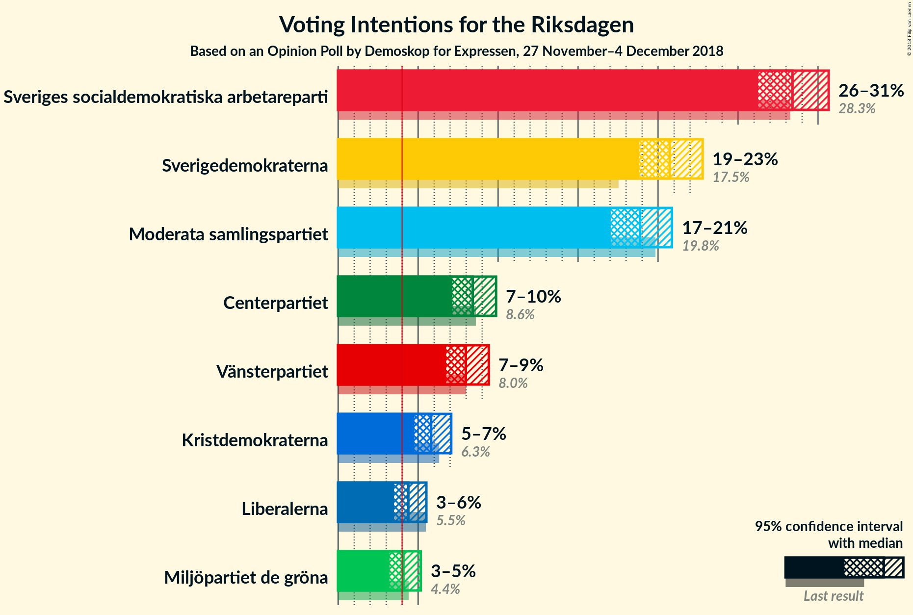

### Confidence Intervals

| Party | Last Result | Poll Result | 80% Confidence Interval | 90% Confidence Interval | 95% Confidence Interval | 99% Confidence Interval |
|:-----:|:-----------:|:-----------:|:-----------------------:|:-----------------------:|:-----------------------:|:-----------------------:|
| Sveriges socialdemokratiska arbetareparti | 28.3% | 28.4% | 27.0–29.9% |26.6–30.3% |26.2–30.7% |25.6–31.4% |
| Sverigedemokraterna | 17.5% | 20.7% | 19.5–22.1% |19.1–22.5% |18.8–22.8% |18.2–23.4% |
| Moderata samlingspartiet | 19.8% | 18.9% | 17.7–20.2% |17.3–20.5% |17.0–20.9% |16.5–21.5% |
| Centerpartiet | 8.6% | 8.4% | 7.6–9.4% |7.3–9.6% |7.1–9.9% |6.8–10.3% |
| Vänsterpartiet | 8.0% | 8.0% | 7.2–8.9% |7.0–9.2% |6.8–9.4% |6.4–9.9% |
| Kristdemokraterna | 6.3% | 5.8% | 5.1–6.6% |4.9–6.9% |4.8–7.1% |4.5–7.5% |
| Liberalerna | 5.5% | 4.4% | 3.8–5.1% |3.6–5.3% |3.5–5.5% |3.2–5.9% |
| Miljöpartiet de gröna | 4.4% | 4.1% | 3.5–4.8% |3.4–5.0% |3.2–5.2% |3.0–5.5% |

*Note:* The poll result column reflects the actual value used in the calculations. Published results may vary slightly, and in addition be rounded to fewer digits.

## Seats

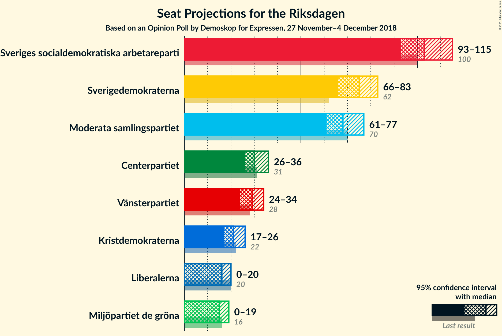

### Confidence Intervals

| Party | Last Result | Median | 80% Confidence Interval | 90% Confidence Interval | 95% Confidence Interval | 99% Confidence Interval |
|:-----:|:-----------:|:------:|:-----------------------:|:-----------------------:|:-----------------------:|:-----------------------:|
| <a href="#sveriges-socialdemokratiska-arbetareparti">Sveriges socialdemokratiska arbetareparti</a> | 100 | 105 | 97–112 |95–112 |93–115 |91–118 |
| <a href="#sverigedemokraterna">Sverigedemokraterna</a> | 62 | 75 | 69–80 |68–82 |66–83 |64–86 |
| <a href="#moderata-samlingspartiet">Moderata samlingspartiet</a> | 70 | 69 | 64–74 |62–75 |61–77 |59–78 |
| <a href="#centerpartiet">Centerpartiet</a> | 31 | 31 | 27–34 |27–35 |26–36 |24–38 |
| <a href="#vänsterpartiet">Vänsterpartiet</a> | 28 | 29 | 26–32 |25–33 |25–34 |23–36 |
| <a href="#kristdemokraterna">Kristdemokraterna</a> | 22 | 21 | 19–23 |18–24 |17–25 |16–27 |
| <a href="#liberalerna">Liberalerna</a> | 20 | 15 | 0–18 |0–19 |0–20 |0–21 |
| <a href="#miljöpartiet-de-gröna">Miljöpartiet de gröna</a> | 16 | 14 | 0–17 |0–18 |0–18 |0–20 |

### Sveriges socialdemokratiska arbetareparti

*For a full overview of the results for this party, see the [Sveriges socialdemokratiska arbetareparti](party-sverigessocialdemokratiskaarbetareparti.html) page.*

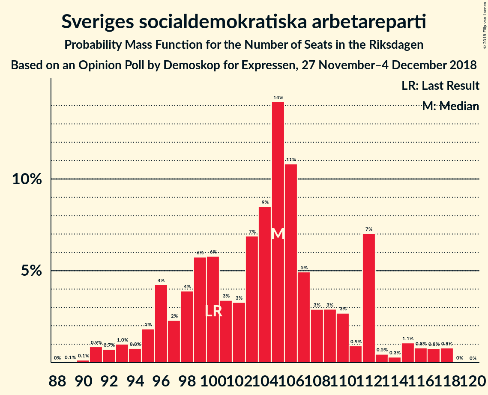

| Number of Seats | Probability | Accumulated | Special Marks |
|:---------------:|:-----------:|:-----------:|:-------------:|
| 88 | 0% | 100% |  |
| 89 | 0.1% | 99.9% |  |
| 90 | 0.1% | 99.9% |  |
| 91 | 0.9% | 99.8% |  |
| 92 | 0.7% | 98.9% |  |
| 93 | 1.0% | 98% |  |
| 94 | 0.8% | 97% |  |
| 95 | 2% | 96% |  |
| 96 | 4% | 95% |  |
| 97 | 2% | 90% |  |
| 98 | 4% | 88% |  |
| 99 | 6% | 84% |  |
| 100 | 6% | 78% | Last Result |
| 101 | 3% | 73% |  |
| 102 | 3% | 69% |  |
| 103 | 7% | 66% |  |
| 104 | 9% | 59% |  |
| 105 | 14% | 51% | Median |
| 106 | 11% | 36% |  |
| 107 | 5% | 26% |  |
| 108 | 3% | 21% |  |
| 109 | 3% | 18% |  |
| 110 | 3% | 15% |  |
| 111 | 0.9% | 12% |  |
| 112 | 7% | 11% |  |
| 113 | 0.5% | 4% |  |
| 114 | 0.3% | 4% |  |
| 115 | 1.1% | 3% |  |
| 116 | 0.8% | 2% |  |
| 117 | 0.8% | 2% |  |
| 118 | 0.8% | 0.8% |  |
| 119 | 0% | 0% |  |

### Sverigedemokraterna

*For a full overview of the results for this party, see the [Sverigedemokraterna](party-sverigedemokraterna.html) page.*

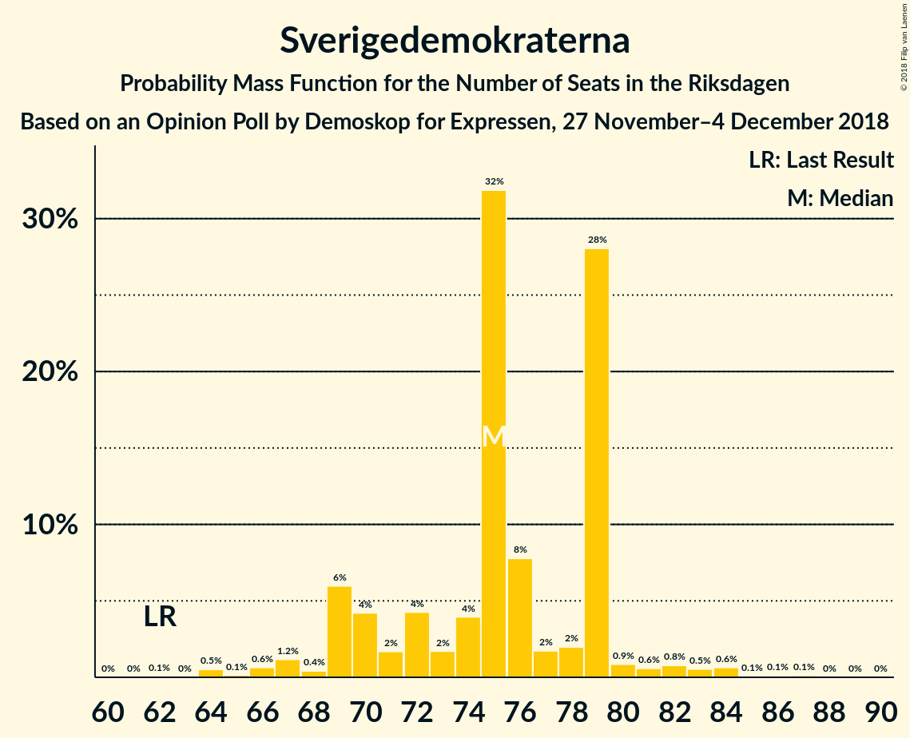

| Number of Seats | Probability | Accumulated | Special Marks |
|:---------------:|:-----------:|:-----------:|:-------------:|
| 62 | 0% | 100% | Last Result |
| 63 | 0.1% | 99.9% |  |
| 64 | 0.4% | 99.8% |  |
| 65 | 0.3% | 99.4% |  |
| 66 | 2% | 99.1% |  |
| 67 | 1.2% | 97% |  |
| 68 | 2% | 95% |  |
| 69 | 6% | 94% |  |
| 70 | 2% | 88% |  |
| 71 | 4% | 85% |  |
| 72 | 4% | 81% |  |
| 73 | 12% | 77% |  |
| 74 | 5% | 64% |  |
| 75 | 17% | 60% | Median |
| 76 | 11% | 43% |  |
| 77 | 3% | 32% |  |
| 78 | 5% | 29% |  |
| 79 | 12% | 25% |  |
| 80 | 6% | 13% |  |
| 81 | 0.6% | 7% |  |
| 82 | 3% | 7% |  |
| 83 | 1.1% | 4% |  |
| 84 | 0.6% | 2% |  |
| 85 | 0.2% | 2% |  |
| 86 | 1.4% | 2% |  |
| 87 | 0.1% | 0.2% |  |
| 88 | 0% | 0.1% |  |
| 89 | 0% | 0.1% |  |
| 90 | 0% | 0.1% |  |
| 91 | 0% | 0.1% |  |
| 92 | 0% | 0% |  |

### Moderata samlingspartiet

*For a full overview of the results for this party, see the [Moderata samlingspartiet](party-moderatasamlingspartiet.html) page.*

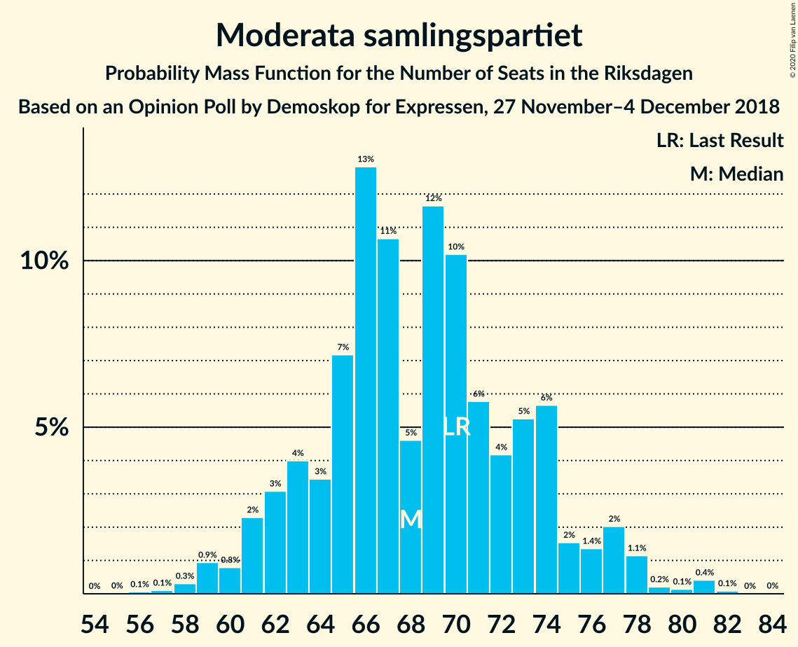

| Number of Seats | Probability | Accumulated | Special Marks |
|:---------------:|:-----------:|:-----------:|:-------------:|
| 56 | 0.1% | 100% |  |
| 57 | 0.1% | 99.9% |  |
| 58 | 0.1% | 99.7% |  |
| 59 | 0.4% | 99.6% |  |
| 60 | 0.3% | 99.2% |  |
| 61 | 2% | 98.9% |  |
| 62 | 2% | 97% |  |
| 63 | 3% | 95% |  |
| 64 | 3% | 92% |  |
| 65 | 7% | 88% |  |
| 66 | 7% | 81% |  |
| 67 | 13% | 74% |  |
| 68 | 4% | 61% |  |
| 69 | 21% | 57% | Median |
| 70 | 5% | 36% | Last Result |
| 71 | 3% | 32% |  |
| 72 | 5% | 29% |  |
| 73 | 5% | 24% |  |
| 74 | 13% | 19% |  |
| 75 | 0.5% | 5% |  |
| 76 | 0.9% | 5% |  |
| 77 | 2% | 4% |  |
| 78 | 2% | 2% |  |
| 79 | 0.1% | 0.5% |  |
| 80 | 0.1% | 0.4% |  |
| 81 | 0.1% | 0.3% |  |
| 82 | 0.2% | 0.2% |  |
| 83 | 0% | 0% |  |

### Centerpartiet

*For a full overview of the results for this party, see the [Centerpartiet](party-centerpartiet.html) page.*

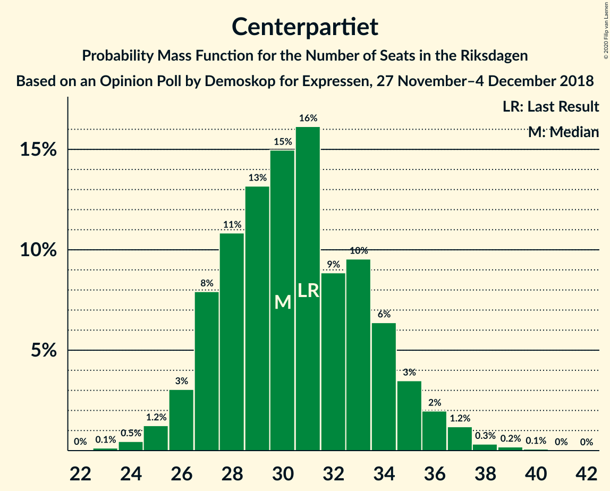

| Number of Seats | Probability | Accumulated | Special Marks |
|:---------------:|:-----------:|:-----------:|:-------------:|
| 23 | 0.1% | 100% |  |
| 24 | 0.5% | 99.8% |  |
| 25 | 0.4% | 99.3% |  |
| 26 | 3% | 98.9% |  |
| 27 | 16% | 96% |  |
| 28 | 8% | 80% |  |
| 29 | 9% | 72% |  |
| 30 | 12% | 63% |  |
| 31 | 25% | 51% | Last Result, Median |
| 32 | 5% | 26% |  |
| 33 | 9% | 21% |  |
| 34 | 4% | 12% |  |
| 35 | 4% | 9% |  |
| 36 | 2% | 5% |  |
| 37 | 2% | 2% |  |
| 38 | 0.4% | 0.7% |  |
| 39 | 0.2% | 0.3% |  |
| 40 | 0.1% | 0.1% |  |
| 41 | 0% | 0% |  |

### Vänsterpartiet

*For a full overview of the results for this party, see the [Vänsterpartiet](party-vänsterpartiet.html) page.*

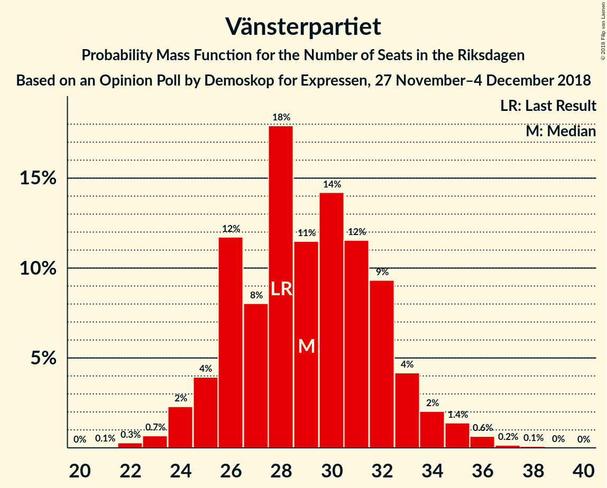

| Number of Seats | Probability | Accumulated | Special Marks |
|:---------------:|:-----------:|:-----------:|:-------------:|
| 22 | 0.2% | 100% |  |
| 23 | 0.8% | 99.7% |  |
| 24 | 1.3% | 99.0% |  |
| 25 | 3% | 98% |  |
| 26 | 22% | 95% |  |
| 27 | 5% | 72% |  |
| 28 | 12% | 67% | Last Result |
| 29 | 9% | 55% | Median |
| 30 | 9% | 46% |  |
| 31 | 17% | 37% |  |
| 32 | 10% | 20% |  |
| 33 | 6% | 10% |  |
| 34 | 2% | 4% |  |
| 35 | 0.8% | 2% |  |
| 36 | 0.8% | 1.0% |  |
| 37 | 0.2% | 0.3% |  |
| 38 | 0% | 0.1% |  |
| 39 | 0% | 0% |  |

### Kristdemokraterna

*For a full overview of the results for this party, see the [Kristdemokraterna](party-kristdemokraterna.html) page.*

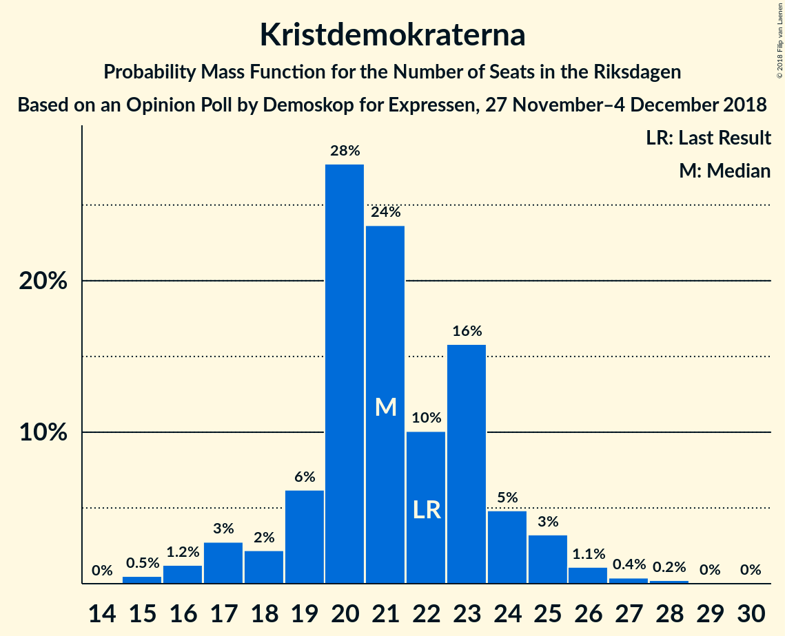

| Number of Seats | Probability | Accumulated | Special Marks |
|:---------------:|:-----------:|:-----------:|:-------------:|
| 15 | 0.3% | 100% |  |
| 16 | 0.9% | 99.7% |  |
| 17 | 2% | 98.8% |  |
| 18 | 6% | 96% |  |
| 19 | 8% | 90% |  |
| 20 | 20% | 82% |  |
| 21 | 18% | 62% | Median |
| 22 | 14% | 44% | Last Result |
| 23 | 20% | 30% |  |
| 24 | 6% | 10% |  |
| 25 | 2% | 4% |  |
| 26 | 1.3% | 2% |  |
| 27 | 0.4% | 0.7% |  |
| 28 | 0.2% | 0.3% |  |
| 29 | 0.1% | 0.1% |  |
| 30 | 0% | 0% |  |

### Liberalerna

*For a full overview of the results for this party, see the [Liberalerna](party-liberalerna.html) page.*

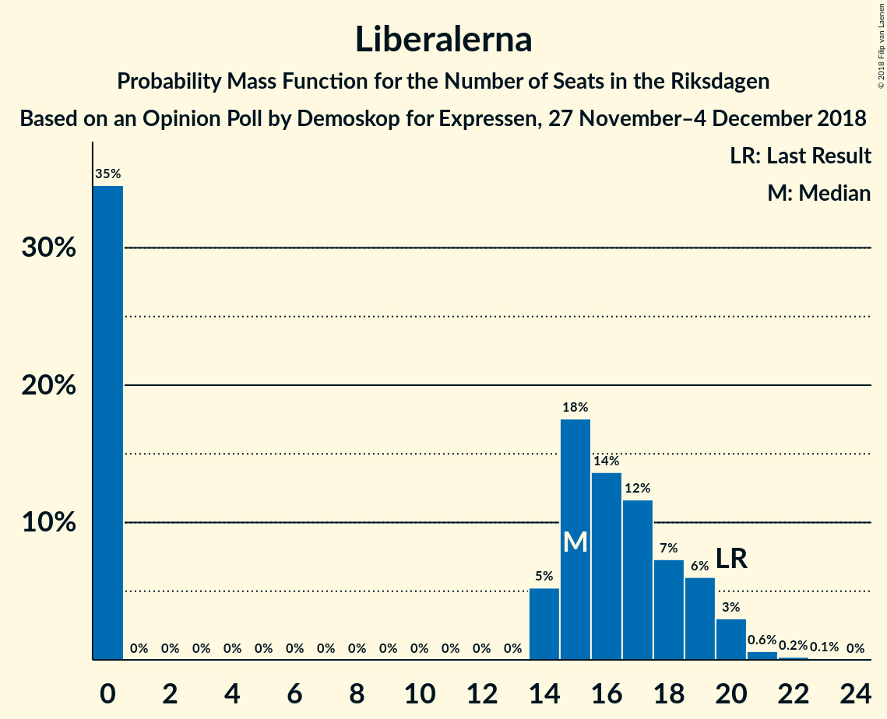

| Number of Seats | Probability | Accumulated | Special Marks |
|:---------------:|:-----------:|:-----------:|:-------------:|
| 0 | 35% | 100% |  |
| 1 | 0% | 65% |  |
| 2 | 0% | 65% |  |
| 3 | 0% | 65% |  |
| 4 | 0% | 65% |  |
| 5 | 0% | 65% |  |
| 6 | 0% | 65% |  |
| 7 | 0% | 65% |  |
| 8 | 0% | 65% |  |
| 9 | 0% | 65% |  |
| 10 | 0% | 65% |  |
| 11 | 0% | 65% |  |
| 12 | 0% | 65% |  |
| 13 | 0% | 65% |  |
| 14 | 5% | 65% |  |
| 15 | 18% | 60% | Median |
| 16 | 14% | 43% |  |
| 17 | 12% | 29% |  |
| 18 | 7% | 17% |  |
| 19 | 6% | 10% |  |
| 20 | 3% | 4% | Last Result |
| 21 | 0.6% | 0.9% |  |
| 22 | 0.2% | 0.3% |  |
| 23 | 0.1% | 0.1% |  |
| 24 | 0% | 0% |  |

### Miljöpartiet de gröna

*For a full overview of the results for this party, see the [Miljöpartiet de gröna](party-miljöpartietdegröna.html) page.*

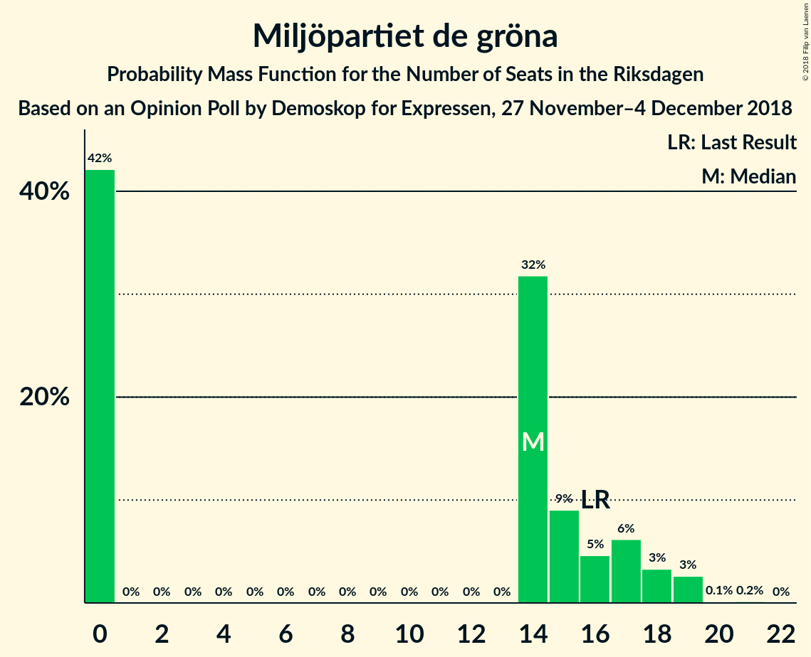

| Number of Seats | Probability | Accumulated | Special Marks |
|:---------------:|:-----------:|:-----------:|:-------------:|
| 0 | 40% | 100% |  |
| 1 | 0% | 60% |  |
| 2 | 0% | 60% |  |
| 3 | 0% | 60% |  |
| 4 | 0% | 60% |  |
| 5 | 0% | 60% |  |
| 6 | 0% | 60% |  |
| 7 | 0% | 60% |  |
| 8 | 0% | 60% |  |
| 9 | 0% | 60% |  |
| 10 | 0% | 60% |  |
| 11 | 0% | 60% |  |
| 12 | 0% | 60% |  |
| 13 | 0% | 60% |  |
| 14 | 12% | 60% | Median |
| 15 | 10% | 48% |  |
| 16 | 22% | 38% | Last Result |
| 17 | 10% | 15% |  |
| 18 | 3% | 6% |  |
| 19 | 1.5% | 2% |  |
| 20 | 0.6% | 0.8% |  |
| 21 | 0.2% | 0.2% |  |
| 22 | 0% | 0% |  |

## Coalitions

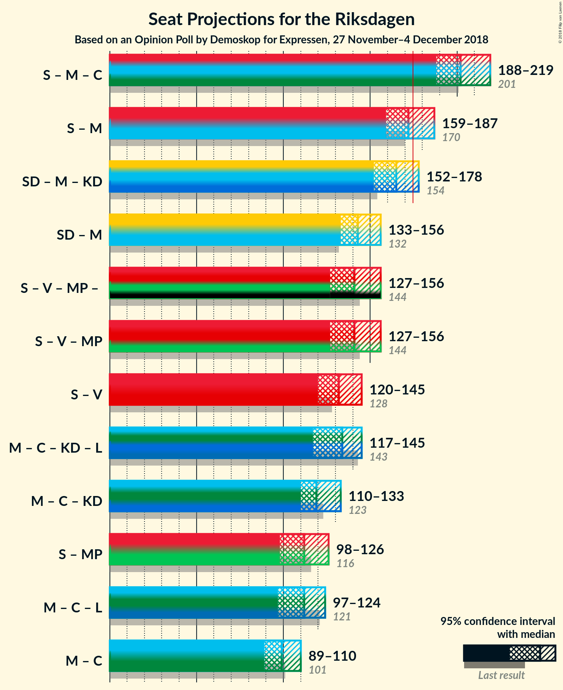

### Confidence Intervals

| Coalition | Last Result | Median | Majority? | 80% Confidence Interval | 90% Confidence Interval | 95% Confidence Interval | 99% Confidence Interval |
|:---------:|:-----------:|:------:|:---------:|:-----------------------:|:-----------------------:|:-----------------------:|:-----------------------:|
| Sveriges socialdemokratiska arbetareparti – Moderata samlingspartiet – Centerpartiet | 201 | 202 | 100% | 193–216 | 189–217 | 188–217 | 185–221 |
| Sveriges socialdemokratiska arbetareparti – Moderata samlingspartiet | 170 | 172 | 38% | 163–184 | 160–186 | 159–186 | 156–188 |
| Sverigedemokraterna – Moderata samlingspartiet – Kristdemokraterna | 154 | 165 | 5% | 156–174 | 154–175 | 152–179 | 149–181 |
| Sverigedemokraterna – Moderata samlingspartiet | 132 | 142 | 0% | 137–153 | 134–153 | 133–156 | 130–160 |
| Sveriges socialdemokratiska arbetareparti – Vänsterpartiet – Miljöpartiet de gröna | 144 | 144 | 0% | 132–153 | 129–153 | 127–155 | 125–157 |
| Sveriges socialdemokratiska arbetareparti – Vänsterpartiet | 128 | 132 | 0% | 126–143 | 123–144 | 121–145 | 118–150 |
| Moderata samlingspartiet – Centerpartiet – Kristdemokraterna – Liberalerna | 143 | 130 | 0% | 123–142 | 121–144 | 118–144 | 116–148 |
| Moderata samlingspartiet – Centerpartiet – Kristdemokraterna | 123 | 121 | 0% | 114–127 | 112–130 | 109–131 | 108–135 |
| Moderata samlingspartiet – Centerpartiet – Liberalerna | 121 | 109 | 0% | 100–121 | 99–122 | 98–124 | 95–127 |
| Sveriges socialdemokratiska arbetareparti – Miljöpartiet de gröna | 116 | 115 | 0% | 102–122 | 100–122 | 96–124 | 95–128 |
| Moderata samlingspartiet – Centerpartiet | 101 | 100 | 0% | 94–106 | 92–108 | 90–109 | 87–111 |

### Sveriges socialdemokratiska arbetareparti – Moderata samlingspartiet – Centerpartiet

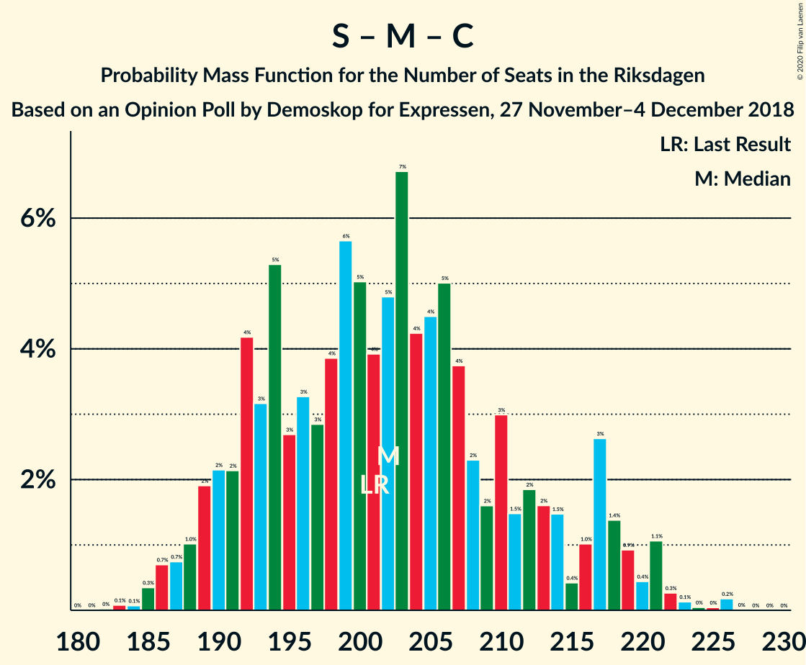

| Number of Seats | Probability | Accumulated | Special Marks |
|:---------------:|:-----------:|:-----------:|:-------------:|
| 183 | 0.1% | 100% |  |
| 184 | 0.1% | 99.9% |  |
| 185 | 0.3% | 99.8% |  |
| 186 | 1.3% | 99.5% |  |
| 187 | 0.6% | 98% |  |
| 188 | 1.2% | 98% |  |
| 189 | 1.5% | 96% |  |
| 190 | 0.7% | 95% |  |
| 191 | 0.8% | 94% |  |
| 192 | 1.2% | 93% |  |
| 193 | 2% | 92% |  |
| 194 | 1.0% | 90% |  |
| 195 | 3% | 89% |  |
| 196 | 3% | 86% |  |
| 197 | 3% | 83% |  |
| 198 | 5% | 80% |  |
| 199 | 13% | 75% |  |
| 200 | 4% | 62% |  |
| 201 | 2% | 58% | Last Result |
| 202 | 7% | 55% |  |
| 203 | 6% | 49% |  |
| 204 | 2% | 43% |  |
| 205 | 1.2% | 41% | Median |
| 206 | 9% | 39% |  |
| 207 | 2% | 30% |  |
| 208 | 2% | 28% |  |
| 209 | 2% | 26% |  |
| 210 | 3% | 25% |  |
| 211 | 2% | 22% |  |
| 212 | 4% | 20% |  |
| 213 | 0.6% | 16% |  |
| 214 | 4% | 15% |  |
| 215 | 0.3% | 12% |  |
| 216 | 2% | 11% |  |
| 217 | 7% | 9% |  |
| 218 | 0.3% | 2% |  |
| 219 | 0.1% | 2% |  |
| 220 | 0.9% | 2% |  |
| 221 | 0.5% | 0.7% |  |
| 222 | 0.1% | 0.2% |  |
| 223 | 0% | 0.1% |  |
| 224 | 0.1% | 0.1% |  |
| 225 | 0% | 0% |  |

### Sveriges socialdemokratiska arbetareparti – Moderata samlingspartiet

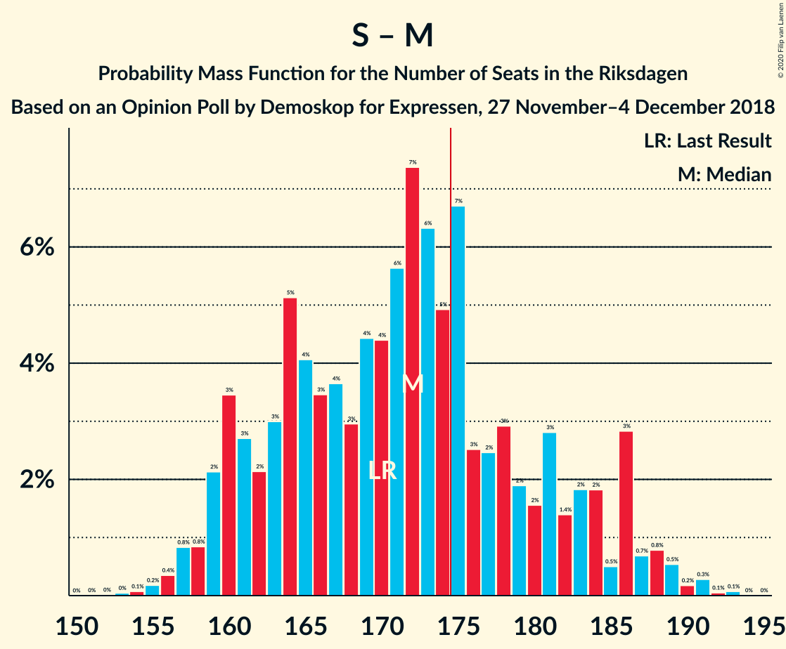

| Number of Seats | Probability | Accumulated | Special Marks |
|:---------------:|:-----------:|:-----------:|:-------------:|
| 153 | 0.1% | 100% |  |
| 154 | 0.1% | 99.9% |  |
| 155 | 0.2% | 99.8% |  |
| 156 | 0.4% | 99.5% |  |
| 157 | 0.7% | 99.2% |  |
| 158 | 0.8% | 98% |  |
| 159 | 0.4% | 98% |  |
| 160 | 3% | 97% |  |
| 161 | 1.4% | 95% |  |
| 162 | 2% | 93% |  |
| 163 | 2% | 91% |  |
| 164 | 1.3% | 90% |  |
| 165 | 5% | 89% |  |
| 166 | 2% | 84% |  |
| 167 | 3% | 82% |  |
| 168 | 4% | 79% |  |
| 169 | 6% | 75% |  |
| 170 | 3% | 69% | Last Result |
| 171 | 3% | 66% |  |
| 172 | 13% | 62% |  |
| 173 | 9% | 50% |  |
| 174 | 2% | 41% | Median |
| 175 | 10% | 38% | Majority |
| 176 | 1.0% | 28% |  |
| 177 | 3% | 27% |  |
| 178 | 0.8% | 24% |  |
| 179 | 1.3% | 23% |  |
| 180 | 2% | 22% |  |
| 181 | 4% | 20% |  |
| 182 | 3% | 16% |  |
| 183 | 2% | 13% |  |
| 184 | 1.4% | 10% |  |
| 185 | 0.3% | 9% |  |
| 186 | 7% | 8% |  |
| 187 | 0.1% | 1.3% |  |
| 188 | 0.9% | 1.3% |  |
| 189 | 0% | 0.4% |  |
| 190 | 0.3% | 0.4% |  |
| 191 | 0% | 0% |  |

### Sverigedemokraterna – Moderata samlingspartiet – Kristdemokraterna

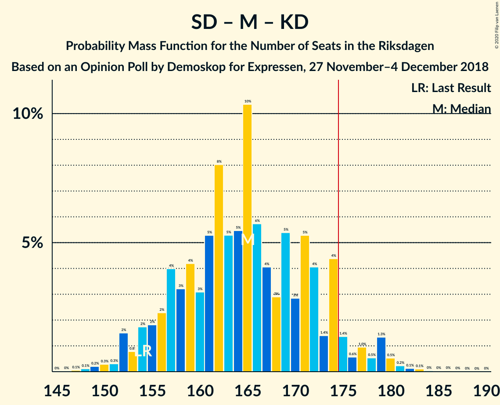

| Number of Seats | Probability | Accumulated | Special Marks |
|:---------------:|:-----------:|:-----------:|:-------------:|
| 146 | 0.1% | 100% |  |
| 147 | 0.1% | 99.9% |  |
| 148 | 0% | 99.8% |  |
| 149 | 0.3% | 99.8% |  |
| 150 | 0.2% | 99.5% |  |
| 151 | 0.2% | 99.3% |  |
| 152 | 2% | 99.1% |  |
| 153 | 1.1% | 97% |  |
| 154 | 0.9% | 96% | Last Result |
| 155 | 3% | 95% |  |
| 156 | 2% | 92% |  |
| 157 | 1.0% | 90% |  |
| 158 | 2% | 89% |  |
| 159 | 3% | 87% |  |
| 160 | 5% | 84% |  |
| 161 | 4% | 80% |  |
| 162 | 14% | 75% |  |
| 163 | 4% | 61% |  |
| 164 | 2% | 57% |  |
| 165 | 14% | 56% | Median |
| 166 | 3% | 42% |  |
| 167 | 3% | 39% |  |
| 168 | 1.0% | 36% |  |
| 169 | 7% | 35% |  |
| 170 | 4% | 28% |  |
| 171 | 7% | 24% |  |
| 172 | 2% | 17% |  |
| 173 | 2% | 15% |  |
| 174 | 8% | 13% |  |
| 175 | 0.8% | 5% | Majority |
| 176 | 0.7% | 4% |  |
| 177 | 0.6% | 4% |  |
| 178 | 0.5% | 3% |  |
| 179 | 2% | 3% |  |
| 180 | 0.1% | 0.7% |  |
| 181 | 0.2% | 0.6% |  |
| 182 | 0% | 0.4% |  |
| 183 | 0.2% | 0.4% |  |
| 184 | 0.1% | 0.2% |  |
| 185 | 0% | 0.1% |  |
| 186 | 0% | 0.1% |  |
| 187 | 0.1% | 0.1% |  |
| 188 | 0% | 0% |  |

### Sverigedemokraterna – Moderata samlingspartiet

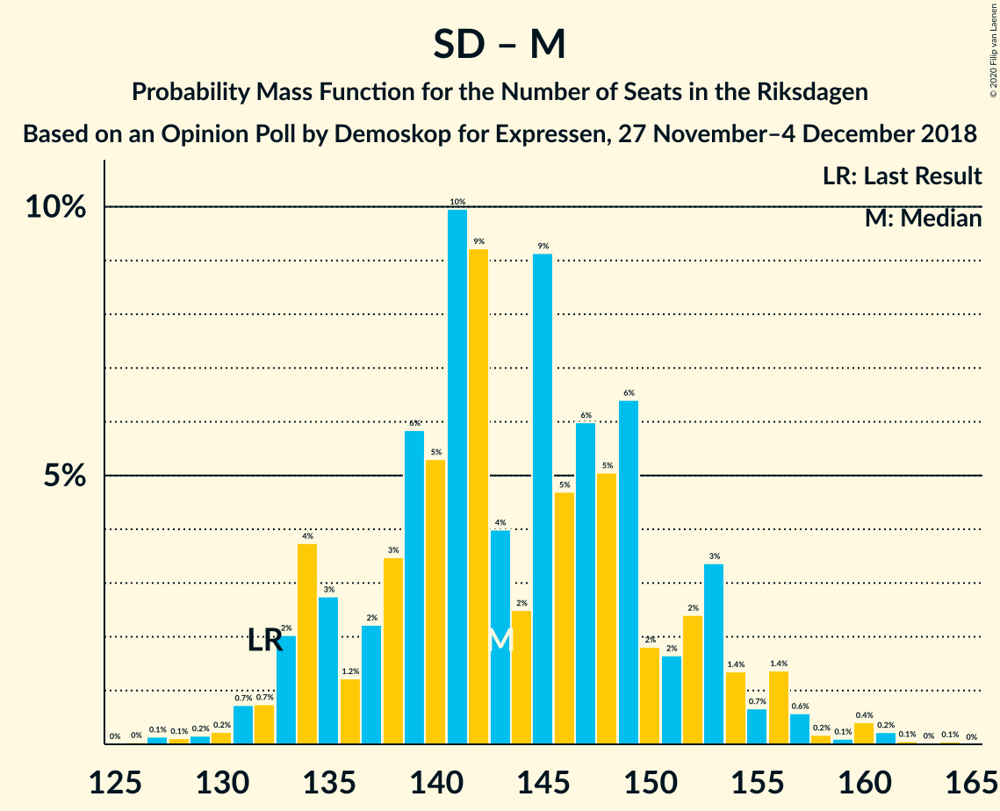

| Number of Seats | Probability | Accumulated | Special Marks |
|:---------------:|:-----------:|:-----------:|:-------------:|
| 126 | 0% | 100% |  |
| 127 | 0.1% | 99.9% |  |
| 128 | 0% | 99.8% |  |
| 129 | 0.2% | 99.8% |  |
| 130 | 0.3% | 99.6% |  |
| 131 | 0.9% | 99.3% |  |
| 132 | 0.8% | 98% | Last Result |
| 133 | 1.3% | 98% |  |
| 134 | 4% | 96% |  |
| 135 | 0.9% | 92% |  |
| 136 | 0.6% | 91% |  |
| 137 | 1.1% | 90% |  |
| 138 | 3% | 89% |  |
| 139 | 6% | 86% |  |
| 140 | 4% | 80% |  |
| 141 | 9% | 76% |  |
| 142 | 19% | 67% |  |
| 143 | 3% | 47% |  |
| 144 | 2% | 44% | Median |
| 145 | 4% | 43% |  |
| 146 | 3% | 39% |  |
| 147 | 3% | 35% |  |
| 148 | 5% | 33% |  |
| 149 | 12% | 27% |  |
| 150 | 1.3% | 16% |  |
| 151 | 0.5% | 15% |  |
| 152 | 2% | 14% |  |
| 153 | 7% | 12% |  |
| 154 | 0.8% | 5% |  |
| 155 | 0.3% | 4% |  |
| 156 | 2% | 4% |  |
| 157 | 0.6% | 2% |  |
| 158 | 0% | 1.4% |  |
| 159 | 0.1% | 1.4% |  |
| 160 | 1.0% | 1.3% |  |
| 161 | 0.1% | 0.3% |  |
| 162 | 0% | 0.2% |  |
| 163 | 0.1% | 0.1% |  |
| 164 | 0.1% | 0.1% |  |
| 165 | 0% | 0% |  |

### Sveriges socialdemokratiska arbetareparti – Vänsterpartiet – Miljöpartiet de gröna

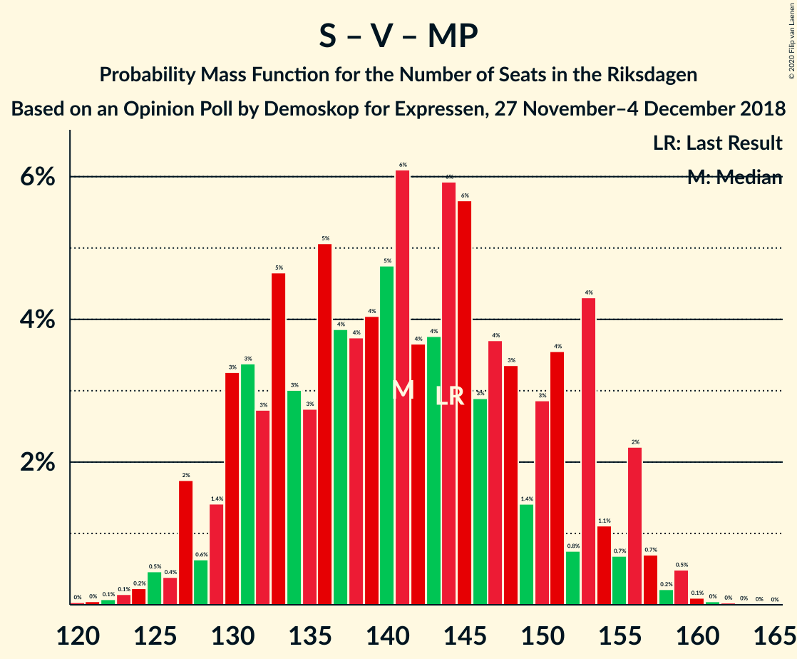

| Number of Seats | Probability | Accumulated | Special Marks |
|:---------------:|:-----------:|:-----------:|:-------------:|
| 120 | 0.1% | 100% |  |
| 121 | 0% | 99.9% |  |
| 122 | 0% | 99.9% |  |
| 123 | 0.2% | 99.9% |  |
| 124 | 0% | 99.6% |  |
| 125 | 0.4% | 99.6% |  |
| 126 | 0.1% | 99.2% |  |
| 127 | 3% | 99.1% |  |
| 128 | 0.7% | 96% |  |
| 129 | 2% | 95% |  |
| 130 | 1.2% | 93% |  |
| 131 | 1.3% | 92% |  |
| 132 | 3% | 91% |  |
| 133 | 4% | 88% |  |
| 134 | 2% | 84% |  |
| 135 | 2% | 82% |  |
| 136 | 2% | 80% |  |
| 137 | 3% | 78% |  |
| 138 | 3% | 75% |  |
| 139 | 2% | 72% |  |
| 140 | 5% | 70% |  |
| 141 | 3% | 65% |  |
| 142 | 1.5% | 62% |  |
| 143 | 6% | 61% |  |
| 144 | 8% | 55% | Last Result |
| 145 | 14% | 46% |  |
| 146 | 1.1% | 32% |  |
| 147 | 5% | 31% |  |
| 148 | 6% | 26% | Median |
| 149 | 0.7% | 20% |  |
| 150 | 6% | 19% |  |
| 151 | 0.4% | 13% |  |
| 152 | 0.5% | 12% |  |
| 153 | 8% | 12% |  |
| 154 | 0.9% | 3% |  |
| 155 | 1.1% | 3% |  |
| 156 | 0.9% | 1.4% |  |
| 157 | 0.1% | 0.6% |  |
| 158 | 0.2% | 0.4% |  |
| 159 | 0% | 0.2% |  |
| 160 | 0.1% | 0.2% |  |
| 161 | 0% | 0% |  |

### Sveriges socialdemokratiska arbetareparti – Vänsterpartiet

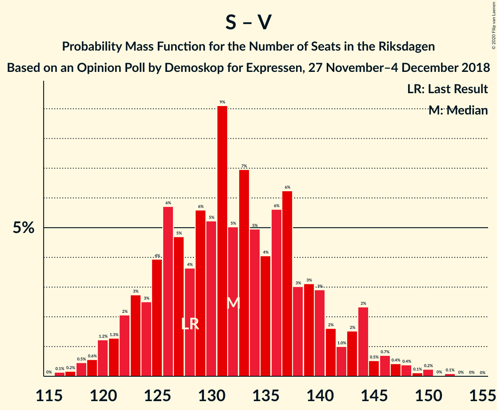

| Number of Seats | Probability | Accumulated | Special Marks |
|:---------------:|:-----------:|:-----------:|:-------------:|
| 116 | 0.2% | 100% |  |
| 117 | 0.1% | 99.8% |  |
| 118 | 0.7% | 99.7% |  |
| 119 | 0.1% | 98.9% |  |
| 120 | 0.8% | 98.8% |  |
| 121 | 1.0% | 98% |  |
| 122 | 0.7% | 97% |  |
| 123 | 2% | 96% |  |
| 124 | 2% | 94% |  |
| 125 | 2% | 93% |  |
| 126 | 4% | 90% |  |
| 127 | 5% | 86% |  |
| 128 | 4% | 82% | Last Result |
| 129 | 5% | 78% |  |
| 130 | 4% | 72% |  |
| 131 | 13% | 68% |  |
| 132 | 8% | 55% |  |
| 133 | 8% | 47% |  |
| 134 | 4% | 39% | Median |
| 135 | 2% | 35% |  |
| 136 | 3% | 33% |  |
| 137 | 10% | 30% |  |
| 138 | 2% | 20% |  |
| 139 | 2% | 18% |  |
| 140 | 3% | 16% |  |
| 141 | 0.7% | 13% |  |
| 142 | 0.2% | 12% |  |
| 143 | 3% | 12% |  |
| 144 | 7% | 9% |  |
| 145 | 0.4% | 3% |  |
| 146 | 0.5% | 2% |  |
| 147 | 0% | 2% |  |
| 148 | 0.8% | 2% |  |
| 149 | 0% | 0.8% |  |
| 150 | 0.7% | 0.8% |  |
| 151 | 0% | 0% |  |

### Moderata samlingspartiet – Centerpartiet – Kristdemokraterna – Liberalerna

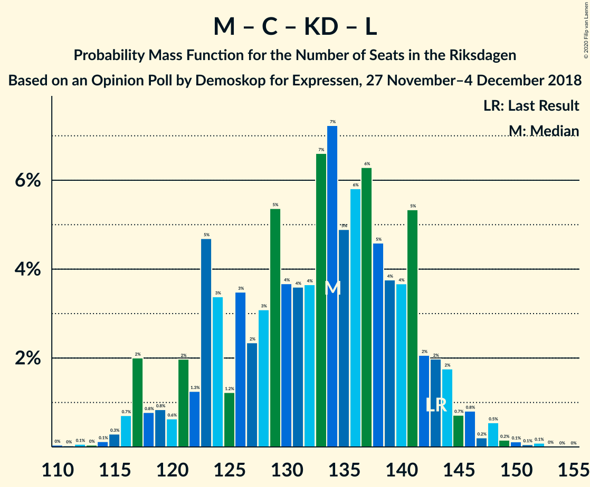

| Number of Seats | Probability | Accumulated | Special Marks |
|:---------------:|:-----------:|:-----------:|:-------------:|
| 112 | 0.1% | 100% |  |
| 113 | 0.1% | 99.8% |  |
| 114 | 0.1% | 99.8% |  |
| 115 | 0.2% | 99.7% |  |
| 116 | 0.1% | 99.5% |  |
| 117 | 1.1% | 99.4% |  |
| 118 | 1.2% | 98% |  |
| 119 | 0.1% | 97% |  |
| 120 | 1.1% | 97% |  |
| 121 | 4% | 96% |  |
| 122 | 0.5% | 92% |  |
| 123 | 12% | 92% |  |
| 124 | 1.3% | 80% |  |
| 125 | 1.3% | 79% |  |
| 126 | 7% | 78% |  |
| 127 | 2% | 70% |  |
| 128 | 1.4% | 69% |  |
| 129 | 13% | 67% |  |
| 130 | 5% | 54% |  |
| 131 | 6% | 49% |  |
| 132 | 2% | 43% |  |
| 133 | 5% | 41% |  |
| 134 | 2% | 36% |  |
| 135 | 6% | 34% |  |
| 136 | 2% | 28% | Median |
| 137 | 2% | 26% |  |
| 138 | 3% | 25% |  |
| 139 | 3% | 22% |  |
| 140 | 2% | 18% |  |
| 141 | 6% | 17% |  |
| 142 | 2% | 11% |  |
| 143 | 3% | 8% | Last Result |
| 144 | 3% | 5% |  |
| 145 | 0.7% | 2% |  |
| 146 | 0.4% | 1.5% |  |
| 147 | 0.2% | 1.0% |  |
| 148 | 0.5% | 0.9% |  |
| 149 | 0% | 0.3% |  |
| 150 | 0.1% | 0.3% |  |
| 151 | 0% | 0.2% |  |
| 152 | 0.1% | 0.1% |  |
| 153 | 0% | 0% |  |

### Moderata samlingspartiet – Centerpartiet – Kristdemokraterna

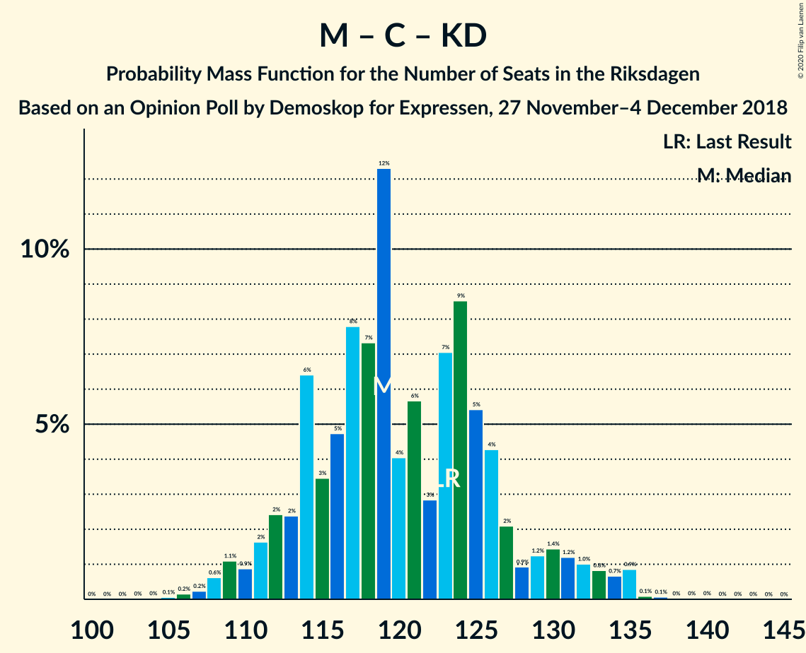

| Number of Seats | Probability | Accumulated | Special Marks |
|:---------------:|:-----------:|:-----------:|:-------------:|
| 104 | 0% | 100% |  |
| 105 | 0% | 99.9% |  |
| 106 | 0.1% | 99.9% |  |
| 107 | 0.2% | 99.8% |  |
| 108 | 0.6% | 99.6% |  |
| 109 | 2% | 99.0% |  |
| 110 | 0.5% | 97% |  |
| 111 | 0.6% | 97% |  |
| 112 | 1.5% | 96% |  |
| 113 | 2% | 95% |  |
| 114 | 15% | 93% |  |
| 115 | 4% | 78% |  |
| 116 | 2% | 74% |  |
| 117 | 4% | 72% |  |
| 118 | 5% | 68% |  |
| 119 | 5% | 63% |  |
| 120 | 3% | 58% |  |
| 121 | 8% | 55% | Median |
| 122 | 2% | 46% |  |
| 123 | 12% | 45% | Last Result |
| 124 | 3% | 33% |  |
| 125 | 10% | 30% |  |
| 126 | 9% | 20% |  |
| 127 | 3% | 11% |  |
| 128 | 0.5% | 8% |  |
| 129 | 2% | 8% |  |
| 130 | 2% | 5% |  |
| 131 | 1.5% | 3% |  |
| 132 | 0.6% | 2% |  |
| 133 | 0.4% | 1.0% |  |
| 134 | 0% | 0.6% |  |
| 135 | 0.3% | 0.6% |  |
| 136 | 0.1% | 0.3% |  |
| 137 | 0.2% | 0.3% |  |
| 138 | 0% | 0.1% |  |
| 139 | 0% | 0.1% |  |
| 140 | 0% | 0% |  |

### Moderata samlingspartiet – Centerpartiet – Liberalerna

| Number of Seats | Probability | Accumulated | Special Marks |
|:---------------:|:-----------:|:-----------:|:-------------:|
| 90 | 0% | 100% |  |
| 91 | 0% | 99.9% |  |
| 92 | 0.1% | 99.9% |  |
| 93 | 0.1% | 99.7% |  |
| 94 | 0.1% | 99.7% |  |
| 95 | 0.3% | 99.5% |  |
| 96 | 1.0% | 99.3% |  |
| 97 | 0.5% | 98% |  |
| 98 | 1.1% | 98% |  |
| 99 | 4% | 97% |  |
| 100 | 8% | 92% |  |
| 101 | 1.3% | 84% |  |
| 102 | 3% | 83% |  |
| 103 | 0.6% | 80% |  |
| 104 | 1.4% | 80% |  |
| 105 | 7% | 78% |  |
| 106 | 3% | 71% |  |
| 107 | 3% | 68% |  |
| 108 | 5% | 65% |  |
| 109 | 14% | 60% |  |
| 110 | 2% | 47% |  |
| 111 | 3% | 44% |  |
| 112 | 5% | 42% |  |
| 113 | 3% | 37% |  |
| 114 | 5% | 34% |  |
| 115 | 2% | 29% | Median |
| 116 | 3% | 27% |  |
| 117 | 5% | 24% |  |
| 118 | 1.2% | 19% |  |
| 119 | 4% | 18% |  |
| 120 | 4% | 14% |  |
| 121 | 4% | 10% | Last Result |
| 122 | 2% | 6% |  |
| 123 | 0.7% | 4% |  |
| 124 | 1.1% | 3% |  |
| 125 | 1.5% | 2% |  |
| 126 | 0.1% | 0.7% |  |
| 127 | 0.3% | 0.5% |  |
| 128 | 0.1% | 0.2% |  |
| 129 | 0% | 0.1% |  |
| 130 | 0% | 0.1% |  |
| 131 | 0% | 0% |  |

### Sveriges socialdemokratiska arbetareparti – Miljöpartiet de gröna

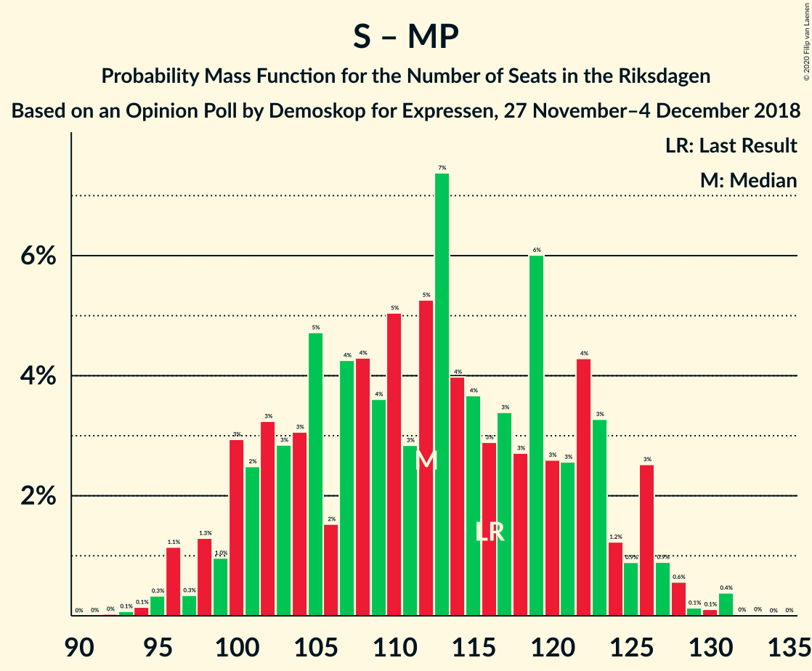

| Number of Seats | Probability | Accumulated | Special Marks |
|:---------------:|:-----------:|:-----------:|:-------------:|
| 92 | 0% | 100% |  |
| 93 | 0.1% | 99.9% |  |
| 94 | 0.1% | 99.8% |  |
| 95 | 0.3% | 99.7% |  |
| 96 | 3% | 99.4% |  |
| 97 | 0.4% | 97% |  |
| 98 | 0.4% | 96% |  |
| 99 | 0.7% | 96% |  |
| 100 | 1.3% | 95% |  |
| 101 | 1.3% | 94% |  |
| 102 | 3% | 93% |  |
| 103 | 3% | 90% |  |
| 104 | 1.1% | 86% |  |
| 105 | 1.5% | 85% |  |
| 106 | 0.8% | 84% |  |
| 107 | 5% | 83% |  |
| 108 | 3% | 78% |  |
| 109 | 3% | 75% |  |
| 110 | 4% | 72% |  |
| 111 | 3% | 68% |  |
| 112 | 7% | 65% |  |
| 113 | 3% | 58% |  |
| 114 | 3% | 55% |  |
| 115 | 4% | 52% |  |
| 116 | 5% | 48% | Last Result |
| 117 | 5% | 43% |  |
| 118 | 2% | 38% |  |
| 119 | 13% | 36% | Median |
| 120 | 4% | 23% |  |
| 121 | 4% | 19% |  |
| 122 | 11% | 15% |  |
| 123 | 0.6% | 3% |  |
| 124 | 0.5% | 3% |  |
| 125 | 2% | 2% |  |
| 126 | 0.3% | 0.9% |  |
| 127 | 0.1% | 0.6% |  |
| 128 | 0.1% | 0.5% |  |
| 129 | 0.1% | 0.4% |  |
| 130 | 0.2% | 0.3% |  |
| 131 | 0.1% | 0.1% |  |
| 132 | 0% | 0% |  |

### Moderata samlingspartiet – Centerpartiet

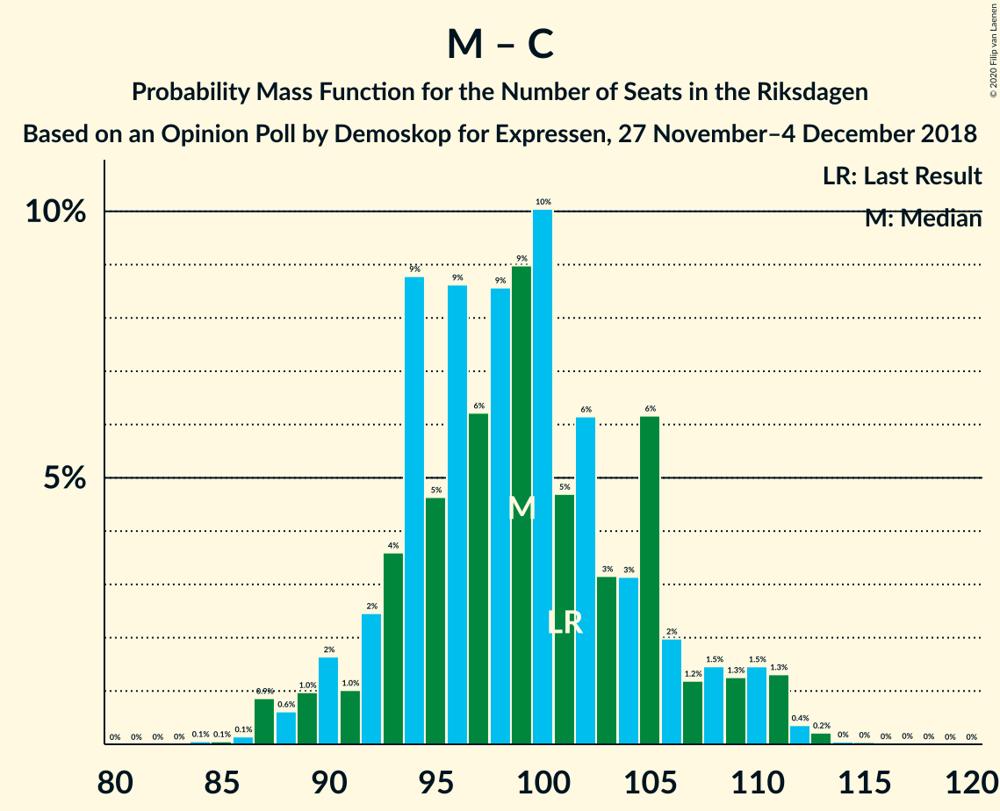

| Number of Seats | Probability | Accumulated | Special Marks |
|:---------------:|:-----------:|:-----------:|:-------------:|
| 84 | 0.1% | 100% |  |
| 85 | 0% | 99.9% |  |
| 86 | 0.1% | 99.8% |  |
| 87 | 0.5% | 99.7% |  |
| 88 | 0.1% | 99.3% |  |
| 89 | 0.6% | 99.1% |  |
| 90 | 2% | 98.5% |  |
| 91 | 1.1% | 96% |  |
| 92 | 2% | 95% |  |
| 93 | 2% | 93% |  |
| 94 | 14% | 91% |  |
| 95 | 3% | 76% |  |
| 96 | 8% | 74% |  |
| 97 | 3% | 65% |  |
| 98 | 5% | 63% |  |
| 99 | 7% | 58% |  |
| 100 | 11% | 51% | Median |
| 101 | 4% | 39% | Last Result |
| 102 | 8% | 35% |  |
| 103 | 3% | 27% |  |
| 104 | 2% | 24% |  |
| 105 | 12% | 22% |  |
| 106 | 4% | 10% |  |
| 107 | 0.8% | 7% |  |
| 108 | 3% | 6% |  |
| 109 | 2% | 3% |  |
| 110 | 0.5% | 1.3% |  |
| 111 | 0.4% | 0.8% |  |
| 112 | 0.1% | 0.4% |  |
| 113 | 0.2% | 0.3% |  |
| 114 | 0% | 0.1% |  |
| 115 | 0.1% | 0.1% |  |
| 116 | 0% | 0% |  |

## Technical Information

### Opinion Poll

+ **Polling firm:** Demoskop
+ **Commissioner(s):** Expressen
+ **Fieldwork period:** 27 November–4 December 2018

### Calculations

+ **Sample size:** 1616
+ **Simulations done:** 262,144
+ **Error estimate:** 1.23%

