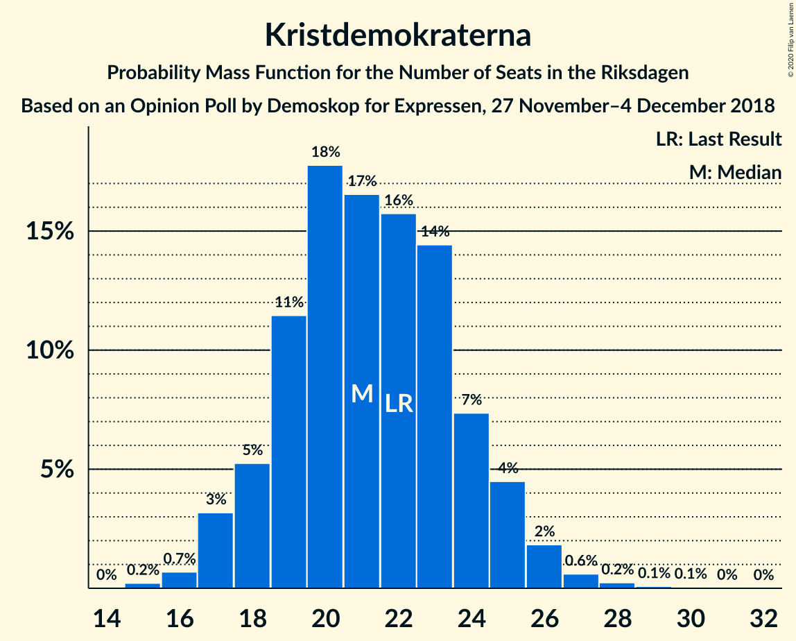
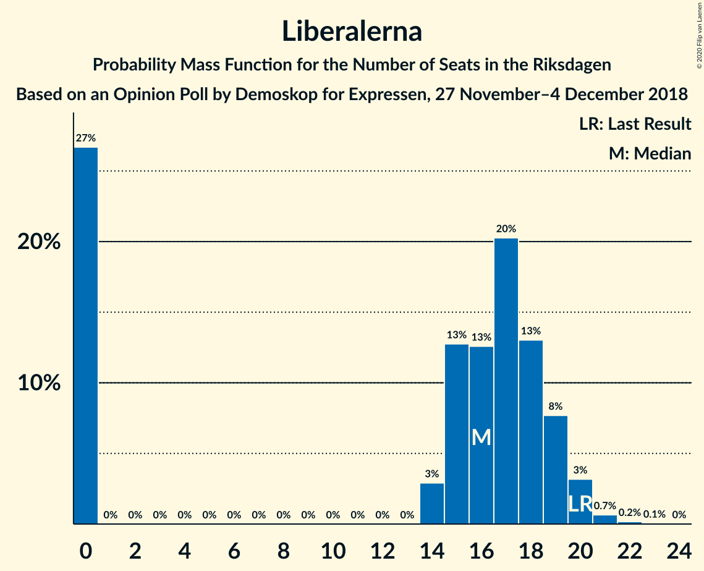
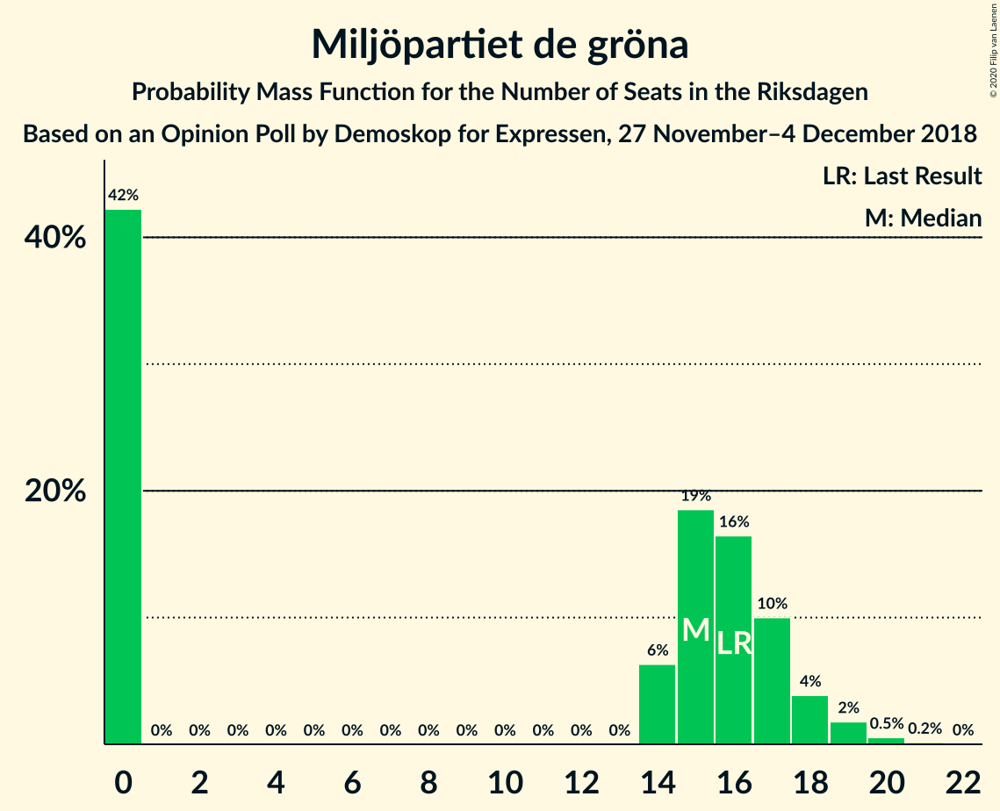

# Opinion Poll by Demoskop for Expressen, 27 November–4 December 2018

<a href="#voting-intentions">Voting Intentions</a> | <a href="#seats">Seats</a> | <a href="#coalitions">Coalitions</a> | <a href="#technical-information">Technical Information</a>

## Voting Intentions

### Confidence Intervals

| Party | Last Result | Poll Result | 80% Confidence Interval | 90% Confidence Interval | 95% Confidence Interval | 99% Confidence Interval |
|:-----:|:-----------:|:-----------:|:-----------------------:|:-----------------------:|:-----------------------:|:-----------------------:|
| Sveriges socialdemokratiska arbetareparti | 28.3% | 28.4% | 27.0–29.9% |26.6–30.3% |26.2–30.7% |25.6–31.4% |
| Sverigedemokraterna | 17.5% | 20.7% | 19.5–22.1% |19.1–22.5% |18.8–22.8% |18.2–23.4% |
| Moderata samlingspartiet | 19.8% | 18.9% | 17.7–20.2% |17.3–20.5% |17.0–20.9% |16.5–21.5% |
| Centerpartiet | 8.6% | 8.4% | 7.6–9.4% |7.3–9.6% |7.1–9.9% |6.8–10.3% |
| Vänsterpartiet | 8.0% | 8.0% | 7.2–8.9% |7.0–9.2% |6.8–9.4% |6.4–9.9% |
| Kristdemokraterna | 6.3% | 5.8% | 5.1–6.6% |4.9–6.9% |4.8–7.1% |4.5–7.5% |
| Liberalerna | 5.5% | 4.4% | 3.8–5.1% |3.6–5.3% |3.5–5.5% |3.2–5.9% |
| Miljöpartiet de gröna | 4.4% | 4.1% | 3.5–4.8% |3.4–5.0% |3.2–5.2% |3.0–5.5% |

*Note:* The poll result column reflects the actual value used in the calculations. Published results may vary slightly, and in addition be rounded to fewer digits.

## Seats

### Confidence Intervals

| Party | Last Result | Median | 80% Confidence Interval | 90% Confidence Interval | 95% Confidence Interval | 99% Confidence Interval |
|:-----:|:-----------:|:------:|:-----------------------:|:-----------------------:|:-----------------------:|:-----------------------:|
| <a href="#sveriges-socialdemokratiska-arbetareparti">Sveriges socialdemokratiska arbetareparti</a> | 100 | 105 | 96–112 |95–112 |92–115 |91–118 |
| <a href="#sverigedemokraterna">Sverigedemokraterna</a> | 62 | 75 | 69–79 |68–82 |66–84 |64–86 |
| <a href="#moderata-samlingspartiet">Moderata samlingspartiet</a> | 70 | 69 | 64–74 |63–76 |61–78 |60–81 |
| <a href="#centerpartiet">Centerpartiet</a> | 31 | 30 | 27–34 |26–36 |26–37 |25–38 |
| <a href="#vänsterpartiet">Vänsterpartiet</a> | 28 | 29 | 26–33 |25–33 |25–34 |23–36 |
| <a href="#kristdemokraterna">Kristdemokraterna</a> | 22 | 21 | 19–23 |18–25 |17–25 |15–27 |
| <a href="#liberalerna">Liberalerna</a> | 20 | 15 | 0–18 |0–19 |0–20 |0–21 |
| <a href="#miljöpartiet-de-gröna">Miljöpartiet de gröna</a> | 16 | 14 | 0–17 |0–18 |0–19 |0–19 |

### Sveriges socialdemokratiska arbetareparti

*For a full overview of the results for this party, see the [Sveriges socialdemokratiska arbetareparti](party-sverigessocialdemokratiskaarbetareparti.html) page.*

| Number of Seats | Probability | Accumulated | Special Marks |
|:---------------:|:-----------:|:-----------:|:-------------:|
| 89 | 0.1% | 100% |  |
| 90 | 0% | 99.9% |  |
| 91 | 1.2% | 99.8% |  |
| 92 | 1.2% | 98.7% |  |
| 93 | 0.5% | 97% |  |
| 94 | 0.9% | 97% |  |
| 95 | 2% | 96% |  |
| 96 | 8% | 94% |  |
| 97 | 2% | 86% |  |
| 98 | 4% | 84% |  |
| 99 | 6% | 81% |  |
| 100 | 6% | 74% | Last Result |
| 101 | 4% | 69% |  |
| 102 | 4% | 65% |  |
| 103 | 2% | 61% |  |
| 104 | 5% | 59% |  |
| 105 | 24% | 54% | Median |
| 106 | 3% | 30% |  |
| 107 | 2% | 27% |  |
| 108 | 1.4% | 25% |  |
| 109 | 2% | 24% |  |
| 110 | 2% | 22% |  |
| 111 | 0.9% | 19% |  |
| 112 | 14% | 18% |  |
| 113 | 0.5% | 5% |  |
| 114 | 0.2% | 4% |  |
| 115 | 2% | 4% |  |
| 116 | 0.2% | 2% |  |
| 117 | 0% | 2% |  |
| 118 | 2% | 2% |  |
| 119 | 0% | 0% |  |

### Sverigedemokraterna

*For a full overview of the results for this party, see the [Sverigedemokraterna](party-sverigedemokraterna.html) page.*

| Number of Seats | Probability | Accumulated | Special Marks |
|:---------------:|:-----------:|:-----------:|:-------------:|
| 62 | 0% | 100% | Last Result |
| 63 | 0.1% | 99.9% |  |
| 64 | 0.4% | 99.9% |  |
| 65 | 0.4% | 99.5% |  |
| 66 | 2% | 99.1% |  |
| 67 | 2% | 97% |  |
| 68 | 0.7% | 96% |  |
| 69 | 5% | 95% |  |
| 70 | 4% | 90% |  |
| 71 | 4% | 86% |  |
| 72 | 4% | 83% |  |
| 73 | 3% | 79% |  |
| 74 | 4% | 75% |  |
| 75 | 24% | 71% | Median |
| 76 | 12% | 47% |  |
| 77 | 2% | 36% |  |
| 78 | 5% | 34% |  |
| 79 | 21% | 29% |  |
| 80 | 2% | 8% |  |
| 81 | 0.7% | 6% |  |
| 82 | 2% | 6% |  |
| 83 | 1.0% | 4% |  |
| 84 | 0.6% | 3% |  |
| 85 | 0.2% | 2% |  |
| 86 | 2% | 2% |  |
| 87 | 0.1% | 0.2% |  |
| 88 | 0% | 0.1% |  |
| 89 | 0% | 0.1% |  |
| 90 | 0% | 0% |  |

### Moderata samlingspartiet

*For a full overview of the results for this party, see the [Moderata samlingspartiet](party-moderatasamlingspartiet.html) page.*

| Number of Seats | Probability | Accumulated | Special Marks |
|:---------------:|:-----------:|:-----------:|:-------------:|
| 56 | 0% | 100% |  |
| 57 | 0.1% | 99.9% |  |
| 58 | 0.1% | 99.9% |  |
| 59 | 0.1% | 99.8% |  |
| 60 | 0.4% | 99.6% |  |
| 61 | 2% | 99.2% |  |
| 62 | 2% | 97% |  |
| 63 | 2% | 95% |  |
| 64 | 6% | 93% |  |
| 65 | 7% | 87% |  |
| 66 | 4% | 80% |  |
| 67 | 21% | 77% |  |
| 68 | 2% | 55% |  |
| 69 | 16% | 53% | Median |
| 70 | 5% | 37% | Last Result |
| 71 | 1.4% | 32% |  |
| 72 | 3% | 31% |  |
| 73 | 4% | 27% |  |
| 74 | 17% | 23% |  |
| 75 | 0.6% | 6% |  |
| 76 | 1.4% | 5% |  |
| 77 | 0.9% | 4% |  |
| 78 | 2% | 3% |  |
| 79 | 0.1% | 0.7% |  |
| 80 | 0.1% | 0.6% |  |
| 81 | 0.1% | 0.5% |  |
| 82 | 0.4% | 0.4% |  |
| 83 | 0% | 0% |  |

### Centerpartiet

*For a full overview of the results for this party, see the [Centerpartiet](party-centerpartiet.html) page.*

| Number of Seats | Probability | Accumulated | Special Marks |
|:---------------:|:-----------:|:-----------:|:-------------:|
| 22 | 0.1% | 100% |  |
| 23 | 0.1% | 99.9% |  |
| 24 | 0.1% | 99.9% |  |
| 25 | 0.4% | 99.7% |  |
| 26 | 4% | 99.3% |  |
| 27 | 27% | 95% |  |
| 28 | 5% | 68% |  |
| 29 | 11% | 63% |  |
| 30 | 8% | 52% | Median |
| 31 | 18% | 44% | Last Result |
| 32 | 4% | 26% |  |
| 33 | 9% | 23% |  |
| 34 | 4% | 13% |  |
| 35 | 4% | 9% |  |
| 36 | 2% | 5% |  |
| 37 | 3% | 4% |  |
| 38 | 0.6% | 0.9% |  |
| 39 | 0.3% | 0.3% |  |
| 40 | 0% | 0.1% |  |
| 41 | 0% | 0% |  |

### Vänsterpartiet

*For a full overview of the results for this party, see the [Vänsterpartiet](party-vänsterpartiet.html) page.*

| Number of Seats | Probability | Accumulated | Special Marks |
|:---------------:|:-----------:|:-----------:|:-------------:|
| 22 | 0.1% | 100% |  |
| 23 | 0.9% | 99.9% |  |
| 24 | 1.1% | 99.0% |  |
| 25 | 5% | 98% |  |
| 26 | 26% | 93% |  |
| 27 | 4% | 68% |  |
| 28 | 7% | 64% | Last Result |
| 29 | 8% | 57% | Median |
| 30 | 10% | 49% |  |
| 31 | 13% | 39% |  |
| 32 | 17% | 27% |  |
| 33 | 6% | 10% |  |
| 34 | 2% | 4% |  |
| 35 | 0.8% | 2% |  |
| 36 | 1.1% | 1.3% |  |
| 37 | 0.1% | 0.2% |  |
| 38 | 0% | 0.1% |  |
| 39 | 0% | 0% |  |

### Kristdemokraterna

*For a full overview of the results for this party, see the [Kristdemokraterna](party-kristdemokraterna.html) page.*

| Number of Seats | Probability | Accumulated | Special Marks |
|:---------------:|:-----------:|:-----------:|:-------------:|
| 15 | 0.5% | 100% |  |
| 16 | 1.2% | 99.5% |  |
| 17 | 3% | 98% |  |
| 18 | 2% | 96% |  |
| 19 | 6% | 93% |  |
| 20 | 28% | 87% |  |
| 21 | 24% | 59% | Median |
| 22 | 10% | 36% | Last Result |
| 23 | 16% | 26% |  |
| 24 | 5% | 10% |  |
| 25 | 3% | 5% |  |
| 26 | 1.1% | 2% |  |
| 27 | 0.4% | 0.7% |  |
| 28 | 0.2% | 0.3% |  |
| 29 | 0% | 0.1% |  |
| 30 | 0% | 0% |  |

### Liberalerna

*For a full overview of the results for this party, see the [Liberalerna](party-liberalerna.html) page.*

| Number of Seats | Probability | Accumulated | Special Marks |
|:---------------:|:-----------:|:-----------:|:-------------:|
| 0 | 31% | 100% |  |
| 1 | 0% | 69% |  |
| 2 | 0% | 69% |  |
| 3 | 0% | 69% |  |
| 4 | 0% | 69% |  |
| 5 | 0% | 69% |  |
| 6 | 0% | 69% |  |
| 7 | 0% | 69% |  |
| 8 | 0% | 69% |  |
| 9 | 0% | 69% |  |
| 10 | 0% | 69% |  |
| 11 | 0% | 69% |  |
| 12 | 0% | 69% |  |
| 13 | 0% | 69% |  |
| 14 | 6% | 69% |  |
| 15 | 31% | 63% | Median |
| 16 | 6% | 32% |  |
| 17 | 10% | 26% |  |
| 18 | 9% | 16% |  |
| 19 | 4% | 7% |  |
| 20 | 2% | 3% | Last Result |
| 21 | 1.1% | 1.4% |  |
| 22 | 0.3% | 0.3% |  |
| 23 | 0% | 0% |  |

### Miljöpartiet de gröna

*For a full overview of the results for this party, see the [Miljöpartiet de gröna](party-miljöpartietdegröna.html) page.*

| Number of Seats | Probability | Accumulated | Special Marks |
|:---------------:|:-----------:|:-----------:|:-------------:|
| 0 | 41% | 100% |  |
| 1 | 0% | 59% |  |
| 2 | 0% | 59% |  |
| 3 | 0% | 59% |  |
| 4 | 0% | 59% |  |
| 5 | 0% | 59% |  |
| 6 | 0% | 59% |  |
| 7 | 0% | 59% |  |
| 8 | 0% | 59% |  |
| 9 | 0% | 59% |  |
| 10 | 0% | 59% |  |
| 11 | 0% | 59% |  |
| 12 | 0% | 59% |  |
| 13 | 0% | 59% |  |
| 14 | 22% | 59% | Median |
| 15 | 13% | 36% |  |
| 16 | 7% | 24% | Last Result |
| 17 | 10% | 16% |  |
| 18 | 3% | 6% |  |
| 19 | 2% | 3% |  |
| 20 | 0.2% | 0.4% |  |
| 21 | 0.2% | 0.2% |  |
| 22 | 0% | 0% |  |

## Coalitions

### Confidence Intervals

| Coalition | Last Result | Median | Majority? | 80% Confidence Interval | 90% Confidence Interval | 95% Confidence Interval | 99% Confidence Interval |
|:---------:|:-----------:|:------:|:---------:|:-----------------------:|:-----------------------:|:-----------------------:|:-----------------------:|
| Sveriges socialdemokratiska arbetareparti – Moderata samlingspartiet – Centerpartiet | 201 | 199 | 100% | 194–217 | 188–217 | 186–220 | 186–221 |
| Sveriges socialdemokratiska arbetareparti – Moderata samlingspartiet | 170 | 172 | 33% | 163–186 | 160–186 | 158–187 | 155–190 |
| Sverigedemokraterna – Moderata samlingspartiet – Kristdemokraterna | 154 | 164 | 6% | 158–174 | 155–176 | 154–179 | 150–181 |
| Sverigedemokraterna – Moderata samlingspartiet | 132 | 142 | 0% | 138–153 | 134–154 | 132–157 | 131–160 |
| Sveriges socialdemokratiska arbetareparti – Vänsterpartiet – Miljöpartiet de gröna | 144 | 144 | 0% | 131–150 | 127–150 | 127–154 | 125–155 |
| Sveriges socialdemokratiska arbetareparti – Vänsterpartiet | 128 | 131 | 0% | 125–144 | 123–144 | 120–145 | 118–148 |
| Moderata samlingspartiet – Centerpartiet – Kristdemokraterna – Liberalerna | 143 | 129 | 0% | 123–142 | 123–143 | 119–144 | 117–148 |
| Moderata samlingspartiet – Centerpartiet – Kristdemokraterna | 123 | 120 | 0% | 114–126 | 112–130 | 109–131 | 108–135 |
| Sveriges socialdemokratiska arbetareparti – Miljöpartiet de gröna | 116 | 114 | 0% | 102–119 | 96–122 | 96–125 | 95–127 |
| Moderata samlingspartiet – Centerpartiet – Liberalerna | 121 | 109 | 0% | 104–120 | 102–121 | 98–123 | 95–127 |
| Moderata samlingspartiet – Centerpartiet | 101 | 99 | 0% | 94–105 | 91–108 | 90–109 | 88–112 |

### Sveriges socialdemokratiska arbetareparti – Moderata samlingspartiet – Centerpartiet

| Number of Seats | Probability | Accumulated | Special Marks |
|:---------------:|:-----------:|:-----------:|:-------------:|
| 183 | 0.1% | 100% |  |
| 184 | 0.1% | 99.9% |  |
| 185 | 0.2% | 99.8% |  |
| 186 | 2% | 99.7% |  |
| 187 | 0.6% | 97% |  |
| 188 | 2% | 97% |  |
| 189 | 1.2% | 95% |  |
| 190 | 0.2% | 94% |  |
| 191 | 1.1% | 93% |  |
| 192 | 0.3% | 92% |  |
| 193 | 1.3% | 92% |  |
| 194 | 2% | 91% |  |
| 195 | 4% | 89% |  |
| 196 | 3% | 86% |  |
| 197 | 2% | 82% |  |
| 198 | 8% | 80% |  |
| 199 | 23% | 72% |  |
| 200 | 2% | 49% |  |
| 201 | 0.9% | 48% | Last Result |
| 202 | 8% | 47% |  |
| 203 | 1.3% | 39% |  |
| 204 | 3% | 37% | Median |
| 205 | 1.0% | 34% |  |
| 206 | 2% | 33% |  |
| 207 | 2% | 31% |  |
| 208 | 2% | 30% |  |
| 209 | 2% | 28% |  |
| 210 | 3% | 26% |  |
| 211 | 2% | 23% |  |
| 212 | 0.7% | 21% |  |
| 213 | 0.9% | 20% |  |
| 214 | 2% | 20% |  |
| 215 | 0.4% | 17% |  |
| 216 | 0.3% | 17% |  |
| 217 | 13% | 17% |  |
| 218 | 0.5% | 3% |  |
| 219 | 0% | 3% |  |
| 220 | 2% | 3% |  |
| 221 | 1.0% | 1.2% |  |
| 222 | 0.1% | 0.3% |  |
| 223 | 0% | 0.2% |  |
| 224 | 0.2% | 0.2% |  |
| 225 | 0% | 0% |  |

### Sveriges socialdemokratiska arbetareparti – Moderata samlingspartiet

| Number of Seats | Probability | Accumulated | Special Marks |
|:---------------:|:-----------:|:-----------:|:-------------:|
| 153 | 0.1% | 100% |  |
| 154 | 0.1% | 99.9% |  |
| 155 | 0.4% | 99.8% |  |
| 156 | 0.2% | 99.4% |  |
| 157 | 0.8% | 99.2% |  |
| 158 | 1.2% | 98% |  |
| 159 | 0.5% | 97% |  |
| 160 | 3% | 97% |  |
| 161 | 0.8% | 94% |  |
| 162 | 1.0% | 93% |  |
| 163 | 2% | 92% |  |
| 164 | 2% | 90% |  |
| 165 | 6% | 88% |  |
| 166 | 1.0% | 82% |  |
| 167 | 5% | 81% |  |
| 168 | 6% | 76% |  |
| 169 | 2% | 70% |  |
| 170 | 3% | 68% | Last Result |
| 171 | 2% | 64% |  |
| 172 | 22% | 62% |  |
| 173 | 6% | 40% |  |
| 174 | 1.4% | 34% | Median |
| 175 | 3% | 33% | Majority |
| 176 | 1.3% | 30% |  |
| 177 | 3% | 28% |  |
| 178 | 1.0% | 26% |  |
| 179 | 1.2% | 25% |  |
| 180 | 1.0% | 23% |  |
| 181 | 2% | 22% |  |
| 182 | 1.0% | 20% |  |
| 183 | 0.4% | 19% |  |
| 184 | 2% | 19% |  |
| 185 | 0.5% | 16% |  |
| 186 | 13% | 16% |  |
| 187 | 0.1% | 3% |  |
| 188 | 2% | 2% |  |
| 189 | 0% | 0.7% |  |
| 190 | 0.6% | 0.7% |  |
| 191 | 0% | 0% |  |

### Sverigedemokraterna – Moderata samlingspartiet – Kristdemokraterna

| Number of Seats | Probability | Accumulated | Special Marks |
|:---------------:|:-----------:|:-----------:|:-------------:|
| 146 | 0% | 100% |  |
| 147 | 0.1% | 99.9% |  |
| 148 | 0% | 99.9% |  |
| 149 | 0.2% | 99.8% |  |
| 150 | 0.1% | 99.6% |  |
| 151 | 0.4% | 99.5% |  |
| 152 | 0.4% | 99.1% |  |
| 153 | 1.1% | 98.7% |  |
| 154 | 0.4% | 98% | Last Result |
| 155 | 3% | 97% |  |
| 156 | 2% | 94% |  |
| 157 | 1.4% | 92% |  |
| 158 | 2% | 91% |  |
| 159 | 1.5% | 89% |  |
| 160 | 6% | 87% |  |
| 161 | 5% | 81% |  |
| 162 | 21% | 76% |  |
| 163 | 3% | 55% |  |
| 164 | 2% | 52% |  |
| 165 | 8% | 50% | Median |
| 166 | 3% | 42% |  |
| 167 | 1.3% | 40% |  |
| 168 | 1.0% | 38% |  |
| 169 | 4% | 37% |  |
| 170 | 5% | 33% |  |
| 171 | 6% | 29% |  |
| 172 | 0.6% | 22% |  |
| 173 | 2% | 22% |  |
| 174 | 14% | 20% |  |
| 175 | 0.4% | 6% | Majority |
| 176 | 1.0% | 5% |  |
| 177 | 0.8% | 4% |  |
| 178 | 0.8% | 4% |  |
| 179 | 2% | 3% |  |
| 180 | 0.1% | 0.9% |  |
| 181 | 0.4% | 0.8% |  |
| 182 | 0% | 0.4% |  |
| 183 | 0.2% | 0.4% |  |
| 184 | 0% | 0.2% |  |
| 185 | 0% | 0.2% |  |
| 186 | 0% | 0.2% |  |
| 187 | 0.1% | 0.1% |  |
| 188 | 0% | 0% |  |

### Sverigedemokraterna – Moderata samlingspartiet

| Number of Seats | Probability | Accumulated | Special Marks |
|:---------------:|:-----------:|:-----------:|:-------------:|
| 126 | 0.1% | 100% |  |
| 127 | 0.1% | 99.9% |  |
| 128 | 0% | 99.8% |  |
| 129 | 0% | 99.8% |  |
| 130 | 0.1% | 99.8% |  |
| 131 | 2% | 99.6% |  |
| 132 | 0.9% | 98% | Last Result |
| 133 | 0.8% | 97% |  |
| 134 | 2% | 96% |  |
| 135 | 1.2% | 95% |  |
| 136 | 0.5% | 93% |  |
| 137 | 2% | 93% |  |
| 138 | 4% | 91% |  |
| 139 | 6% | 88% |  |
| 140 | 3% | 81% |  |
| 141 | 8% | 78% |  |
| 142 | 23% | 70% |  |
| 143 | 3% | 47% |  |
| 144 | 2% | 44% | Median |
| 145 | 3% | 42% |  |
| 146 | 4% | 39% |  |
| 147 | 1.3% | 35% |  |
| 148 | 6% | 34% |  |
| 149 | 6% | 28% |  |
| 150 | 1.4% | 22% |  |
| 151 | 0.7% | 21% |  |
| 152 | 2% | 20% |  |
| 153 | 13% | 19% |  |
| 154 | 1.4% | 5% |  |
| 155 | 0.4% | 4% |  |
| 156 | 0.1% | 4% |  |
| 157 | 1.0% | 3% |  |
| 158 | 0% | 2% |  |
| 159 | 0.1% | 2% |  |
| 160 | 2% | 2% |  |
| 161 | 0.2% | 0.4% |  |
| 162 | 0% | 0.2% |  |
| 163 | 0% | 0.2% |  |
| 164 | 0.1% | 0.1% |  |
| 165 | 0% | 0% |  |

### Sveriges socialdemokratiska arbetareparti – Vänsterpartiet – Miljöpartiet de gröna

| Number of Seats | Probability | Accumulated | Special Marks |
|:---------------:|:-----------:|:-----------:|:-------------:|
| 120 | 0.1% | 100% |  |
| 121 | 0% | 99.9% |  |
| 122 | 0.1% | 99.9% |  |
| 123 | 0.2% | 99.8% |  |
| 124 | 0% | 99.6% |  |
| 125 | 0.6% | 99.6% |  |
| 126 | 0.1% | 99.0% |  |
| 127 | 6% | 99.0% |  |
| 128 | 0.1% | 93% |  |
| 129 | 0.9% | 93% |  |
| 130 | 0.9% | 92% |  |
| 131 | 2% | 91% |  |
| 132 | 3% | 90% |  |
| 133 | 0.9% | 87% |  |
| 134 | 1.3% | 86% |  |
| 135 | 0.4% | 85% |  |
| 136 | 3% | 84% |  |
| 137 | 2% | 81% |  |
| 138 | 2% | 79% |  |
| 139 | 2% | 78% |  |
| 140 | 7% | 75% |  |
| 141 | 4% | 68% |  |
| 142 | 0.4% | 65% |  |
| 143 | 5% | 64% |  |
| 144 | 14% | 59% | Last Result |
| 145 | 21% | 45% |  |
| 146 | 1.2% | 24% |  |
| 147 | 8% | 23% |  |
| 148 | 3% | 14% | Median |
| 149 | 0.9% | 12% |  |
| 150 | 6% | 11% |  |
| 151 | 0.6% | 5% |  |
| 152 | 0.6% | 4% |  |
| 153 | 0.7% | 3% |  |
| 154 | 0.3% | 3% |  |
| 155 | 2% | 2% |  |
| 156 | 0.2% | 0.4% |  |
| 157 | 0.1% | 0.2% |  |
| 158 | 0% | 0.1% |  |
| 159 | 0% | 0.1% |  |
| 160 | 0.1% | 0.1% |  |
| 161 | 0% | 0% |  |

### Sveriges socialdemokratiska arbetareparti – Vänsterpartiet

| Number of Seats | Probability | Accumulated | Special Marks |
|:---------------:|:-----------:|:-----------:|:-------------:|
| 116 | 0.1% | 100% |  |
| 117 | 0.1% | 99.9% |  |
| 118 | 1.4% | 99.8% |  |
| 119 | 0.1% | 98% |  |
| 120 | 1.1% | 98% |  |
| 121 | 1.4% | 97% |  |
| 122 | 0.2% | 96% |  |
| 123 | 1.4% | 96% |  |
| 124 | 2% | 94% |  |
| 125 | 4% | 92% |  |
| 126 | 4% | 89% |  |
| 127 | 6% | 85% |  |
| 128 | 2% | 79% | Last Result |
| 129 | 2% | 77% |  |
| 130 | 6% | 74% |  |
| 131 | 23% | 68% |  |
| 132 | 5% | 46% |  |
| 133 | 5% | 41% |  |
| 134 | 3% | 36% | Median |
| 135 | 1.0% | 33% |  |
| 136 | 5% | 32% |  |
| 137 | 2% | 27% |  |
| 138 | 1.4% | 25% |  |
| 139 | 1.3% | 24% |  |
| 140 | 4% | 23% |  |
| 141 | 1.0% | 19% |  |
| 142 | 0.1% | 18% |  |
| 143 | 2% | 18% |  |
| 144 | 13% | 16% |  |
| 145 | 0.2% | 3% |  |
| 146 | 0.5% | 2% |  |
| 147 | 0.1% | 2% |  |
| 148 | 2% | 2% |  |
| 149 | 0% | 0.1% |  |
| 150 | 0% | 0% |  |

### Moderata samlingspartiet – Centerpartiet – Kristdemokraterna – Liberalerna

| Number of Seats | Probability | Accumulated | Special Marks |
|:---------------:|:-----------:|:-----------:|:-------------:|
| 113 | 0% | 100% |  |
| 114 | 0% | 99.9% |  |
| 115 | 0.2% | 99.9% |  |
| 116 | 0.2% | 99.7% |  |
| 117 | 0.1% | 99.6% |  |
| 118 | 2% | 99.5% |  |
| 119 | 0.1% | 98% |  |
| 120 | 0.5% | 97% |  |
| 121 | 0.3% | 97% |  |
| 122 | 0.4% | 97% |  |
| 123 | 6% | 96% |  |
| 124 | 1.2% | 90% |  |
| 125 | 2% | 89% |  |
| 126 | 14% | 87% |  |
| 127 | 1.3% | 72% |  |
| 128 | 1.1% | 71% |  |
| 129 | 22% | 70% |  |
| 130 | 4% | 48% |  |
| 131 | 5% | 44% |  |
| 132 | 3% | 39% |  |
| 133 | 6% | 37% |  |
| 134 | 1.3% | 31% |  |
| 135 | 4% | 30% | Median |
| 136 | 3% | 26% |  |
| 137 | 2% | 22% |  |
| 138 | 2% | 20% |  |
| 139 | 3% | 18% |  |
| 140 | 0.5% | 15% |  |
| 141 | 2% | 14% |  |
| 142 | 3% | 12% |  |
| 143 | 6% | 9% | Last Result |
| 144 | 1.0% | 3% |  |
| 145 | 0.8% | 2% |  |
| 146 | 0.6% | 2% |  |
| 147 | 0.1% | 1.1% |  |
| 148 | 0.7% | 1.0% |  |
| 149 | 0% | 0.3% |  |
| 150 | 0.1% | 0.2% |  |
| 151 | 0% | 0.1% |  |
| 152 | 0.1% | 0.1% |  |
| 153 | 0% | 0% |  |

### Moderata samlingspartiet – Centerpartiet – Kristdemokraterna

| Number of Seats | Probability | Accumulated | Special Marks |
|:---------------:|:-----------:|:-----------:|:-------------:|
| 105 | 0% | 100% |  |
| 106 | 0.1% | 99.9% |  |
| 107 | 0.1% | 99.8% |  |
| 108 | 0.5% | 99.7% |  |
| 109 | 2% | 99.2% |  |
| 110 | 0.7% | 97% |  |
| 111 | 0.7% | 97% |  |
| 112 | 2% | 96% |  |
| 113 | 3% | 94% |  |
| 114 | 22% | 91% |  |
| 115 | 1.3% | 69% |  |
| 116 | 3% | 67% |  |
| 117 | 2% | 65% |  |
| 118 | 8% | 63% |  |
| 119 | 4% | 55% |  |
| 120 | 3% | 52% | Median |
| 121 | 2% | 49% |  |
| 122 | 2% | 46% |  |
| 123 | 6% | 44% | Last Result |
| 124 | 3% | 38% |  |
| 125 | 12% | 36% |  |
| 126 | 15% | 24% |  |
| 127 | 0.7% | 9% |  |
| 128 | 0.4% | 8% |  |
| 129 | 1.2% | 8% |  |
| 130 | 2% | 6% |  |
| 131 | 3% | 5% |  |
| 132 | 0.9% | 2% |  |
| 133 | 0.5% | 1.1% |  |
| 134 | 0.1% | 0.6% |  |
| 135 | 0.2% | 0.6% |  |
| 136 | 0% | 0.4% |  |
| 137 | 0.3% | 0.4% |  |
| 138 | 0% | 0.1% |  |
| 139 | 0.1% | 0.1% |  |
| 140 | 0% | 0% |  |

### Sveriges socialdemokratiska arbetareparti – Miljöpartiet de gröna

| Number of Seats | Probability | Accumulated | Special Marks |
|:---------------:|:-----------:|:-----------:|:-------------:|
| 92 | 0% | 100% |  |
| 93 | 0.2% | 99.9% |  |
| 94 | 0.2% | 99.7% |  |
| 95 | 0.2% | 99.6% |  |
| 96 | 5% | 99.4% |  |
| 97 | 0.5% | 94% |  |
| 98 | 0.3% | 94% |  |
| 99 | 0.3% | 93% |  |
| 100 | 0.6% | 93% |  |
| 101 | 0.6% | 92% |  |
| 102 | 4% | 92% |  |
| 103 | 1.0% | 88% |  |
| 104 | 2% | 87% |  |
| 105 | 3% | 85% |  |
| 106 | 0.8% | 83% |  |
| 107 | 1.1% | 82% |  |
| 108 | 0.7% | 81% |  |
| 109 | 3% | 80% |  |
| 110 | 4% | 77% |  |
| 111 | 4% | 73% |  |
| 112 | 14% | 69% |  |
| 113 | 2% | 54% |  |
| 114 | 4% | 52% |  |
| 115 | 4% | 48% |  |
| 116 | 5% | 45% | Last Result |
| 117 | 6% | 40% |  |
| 118 | 3% | 34% |  |
| 119 | 21% | 31% | Median |
| 120 | 1.1% | 10% |  |
| 121 | 3% | 9% |  |
| 122 | 2% | 6% |  |
| 123 | 0.6% | 4% |  |
| 124 | 0.5% | 3% |  |
| 125 | 2% | 3% |  |
| 126 | 0.1% | 0.6% |  |
| 127 | 0.1% | 0.5% |  |
| 128 | 0.2% | 0.4% |  |
| 129 | 0.1% | 0.2% |  |
| 130 | 0.1% | 0.1% |  |
| 131 | 0% | 0% |  |

### Moderata samlingspartiet – Centerpartiet – Liberalerna

| Number of Seats | Probability | Accumulated | Special Marks |
|:---------------:|:-----------:|:-----------:|:-------------:|
| 89 | 0% | 100% |  |
| 90 | 0% | 99.9% |  |
| 91 | 0.1% | 99.9% |  |
| 92 | 0% | 99.8% |  |
| 93 | 0% | 99.8% |  |
| 94 | 0.2% | 99.8% |  |
| 95 | 0.1% | 99.6% |  |
| 96 | 0.2% | 99.5% |  |
| 97 | 0.3% | 99.3% |  |
| 98 | 2% | 99.0% |  |
| 99 | 0.3% | 97% |  |
| 100 | 0.5% | 97% |  |
| 101 | 0.7% | 97% |  |
| 102 | 5% | 96% |  |
| 103 | 0.3% | 91% |  |
| 104 | 2% | 91% |  |
| 105 | 14% | 88% |  |
| 106 | 2% | 75% |  |
| 107 | 5% | 73% |  |
| 108 | 2% | 68% |  |
| 109 | 25% | 65% |  |
| 110 | 3% | 40% |  |
| 111 | 5% | 37% |  |
| 112 | 1.2% | 32% |  |
| 113 | 3% | 31% |  |
| 114 | 3% | 28% | Median |
| 115 | 2% | 25% |  |
| 116 | 3% | 23% |  |
| 117 | 6% | 20% |  |
| 118 | 1.1% | 14% |  |
| 119 | 1.0% | 13% |  |
| 120 | 6% | 12% |  |
| 121 | 2% | 6% | Last Result |
| 122 | 0.8% | 3% |  |
| 123 | 0.7% | 3% |  |
| 124 | 0.9% | 2% |  |
| 125 | 0.4% | 1.1% |  |
| 126 | 0.2% | 0.7% |  |
| 127 | 0.3% | 0.5% |  |
| 128 | 0.1% | 0.2% |  |
| 129 | 0% | 0.1% |  |
| 130 | 0.1% | 0.1% |  |
| 131 | 0% | 0% |  |

### Moderata samlingspartiet – Centerpartiet

| Number of Seats | Probability | Accumulated | Special Marks |
|:---------------:|:-----------:|:-----------:|:-------------:|
| 85 | 0% | 100% |  |
| 86 | 0.2% | 99.9% |  |
| 87 | 0.1% | 99.7% |  |
| 88 | 0.2% | 99.6% |  |
| 89 | 1.1% | 99.4% |  |
| 90 | 3% | 98% |  |
| 91 | 0.8% | 95% |  |
| 92 | 3% | 94% |  |
| 93 | 2% | 92% |  |
| 94 | 24% | 90% |  |
| 95 | 1.5% | 67% |  |
| 96 | 7% | 65% |  |
| 97 | 2% | 58% |  |
| 98 | 4% | 56% |  |
| 99 | 3% | 52% | Median |
| 100 | 4% | 49% |  |
| 101 | 3% | 45% | Last Result |
| 102 | 12% | 42% |  |
| 103 | 3% | 30% |  |
| 104 | 4% | 27% |  |
| 105 | 14% | 23% |  |
| 106 | 4% | 10% |  |
| 107 | 0.8% | 6% |  |
| 108 | 0.4% | 5% |  |
| 109 | 3% | 5% |  |
| 110 | 0.5% | 2% |  |
| 111 | 0.6% | 1.1% |  |
| 112 | 0.2% | 0.5% |  |
| 113 | 0.2% | 0.4% |  |
| 114 | 0% | 0.1% |  |
| 115 | 0.1% | 0.1% |  |
| 116 | 0% | 0% |  |

## Technical Information

### Opinion Poll

+ **Polling firm:** Demoskop
+ **Commissioner(s):** Expressen
+ **Fieldwork period:** 27 November–4 December 2018

### Calculations

+ **Sample size:** 1616
+ **Simulations done:** 131,072
+ **Error estimate:** 2.30%

