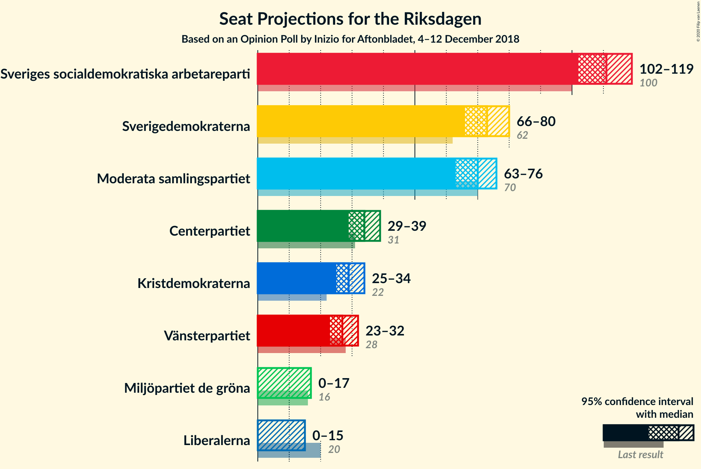
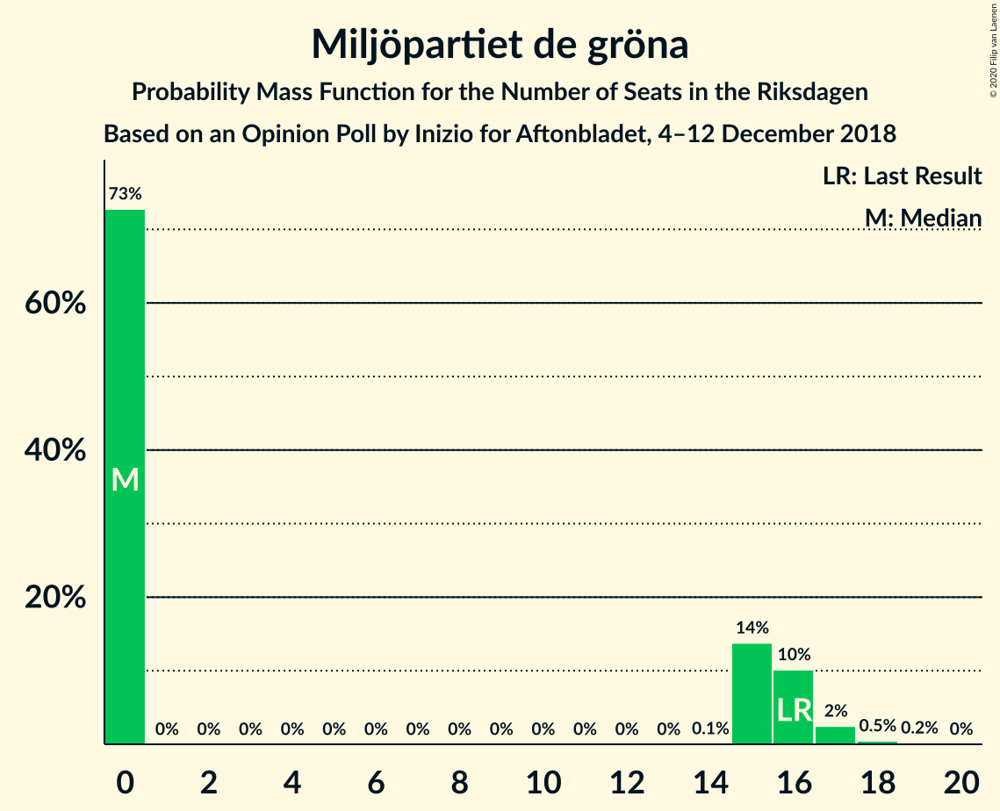

# Opinion Poll by Inizio for Aftonbladet, 4–12 December 2018

<a href="#voting-intentions">Voting Intentions</a> | <a href="#seats">Seats</a> | <a href="#coalitions">Coalitions</a> | <a href="#technical-information">Technical Information</a>

## Voting Intentions

### Confidence Intervals

| Party | Last Result | Poll Result | 80% Confidence Interval | 90% Confidence Interval | 95% Confidence Interval | 99% Confidence Interval |
|:-----:|:-----------:|:-----------:|:-----------------------:|:-----------------------:|:-----------------------:|:-----------------------:|
| Sveriges socialdemokratiska arbetareparti | 28.3% | 29.4% | 28.1–30.6% |27.8–31.0% |27.5–31.3% |26.9–31.9% |
| Sverigedemokraterna | 17.5% | 19.4% | 18.4–20.5% |18.0–20.8% |17.8–21.1% |17.3–21.6% |
| Moderata samlingspartiet | 19.8% | 18.5% | 17.5–19.6% |17.2–19.9% |16.9–20.2% |16.5–20.7% |
| Centerpartiet | 8.6% | 9.0% | 8.2–9.8% |8.0–10.0% |7.9–10.2% |7.5–10.7% |
| Kristdemokraterna | 6.3% | 7.7% | 7.0–8.5% |6.8–8.7% |6.6–8.9% |6.3–9.3% |
| Vänsterpartiet | 8.0% | 7.2% | 6.5–8.0% |6.3–8.2% |6.2–8.4% |5.9–8.7% |
| Miljöpartiet de gröna | 4.4% | 3.7% | 3.2–4.3% |3.1–4.4% |3.0–4.6% |2.8–4.9% |
| Liberalerna | 5.5% | 3.3% | 2.9–3.9% |2.7–4.0% |2.6–4.1% |2.4–4.4% |

*Note:* The poll result column reflects the actual value used in the calculations. Published results may vary slightly, and in addition be rounded to fewer digits.

## Seats

### Confidence Intervals

| Party | Last Result | Median | 80% Confidence Interval | 90% Confidence Interval | 95% Confidence Interval | 99% Confidence Interval |
|:-----:|:-----------:|:------:|:-----------------------:|:-----------------------:|:-----------------------:|:-----------------------:|
| <a href="#sveriges-socialdemokratiska-arbetareparti">Sveriges socialdemokratiska arbetareparti</a> | 100 | 106 | 106 |106–109 |106–111 |102–111 |
| <a href="#sverigedemokraterna">Sverigedemokraterna</a> | 62 | 79 | 79 |79 |79–82 |72–82 |
| <a href="#moderata-samlingspartiet">Moderata samlingspartiet</a> | 70 | 64 | 64 |64–72 |64–72 |64–78 |
| <a href="#centerpartiet">Centerpartiet</a> | 31 | 34 | 34 |30–34 |30–37 |28–37 |
| <a href="#kristdemokraterna">Kristdemokraterna</a> | 22 | 25 | 25 |25–28 |25–30 |25–31 |
| <a href="#vänsterpartiet">Vänsterpartiet</a> | 28 | 25 | 25 |25–29 |25–29 |25–33 |
| <a href="#miljöpartiet-de-gröna">Miljöpartiet de gröna</a> | 16 | 16 | 16 |0–16 |0–16 |0–16 |
| <a href="#liberalerna">Liberalerna</a> | 20 | 0 | 0 |0 |0 |0 |

### Sveriges socialdemokratiska arbetareparti

*For a full overview of the results for this party, see the [Sveriges socialdemokratiska arbetareparti](party-sverigessocialdemokratiskaarbetareparti.html) page.*

| Number of Seats | Probability | Accumulated | Special Marks |
|:---------------:|:-----------:|:-----------:|:-------------:|
| 100 | 0.2% | 100% | Last Result |
| 101 | 0% | 99.7% |  |
| 102 | 0.5% | 99.7% |  |
| 103 | 0.8% | 99.2% |  |
| 104 | 0.2% | 98% |  |
| 105 | 0.2% | 98% |  |
| 106 | 90% | 98% | Median |
| 107 | 0% | 8% |  |
| 108 | 0.1% | 8% |  |
| 109 | 4% | 8% |  |
| 110 | 0% | 4% |  |
| 111 | 3% | 4% |  |
| 112 | 0.2% | 0.5% |  |
| 113 | 0% | 0.3% |  |
| 114 | 0.1% | 0.3% |  |
| 115 | 0% | 0.2% |  |
| 116 | 0% | 0.2% |  |
| 117 | 0% | 0.2% |  |
| 118 | 0.2% | 0.2% |  |
| 119 | 0% | 0% |  |

### Sverigedemokraterna

*For a full overview of the results for this party, see the [Sverigedemokraterna](party-sverigedemokraterna.html) page.*

| Number of Seats | Probability | Accumulated | Special Marks |
|:---------------:|:-----------:|:-----------:|:-------------:|
| 61 | 0.1% | 100% |  |
| 62 | 0% | 99.9% | Last Result |
| 63 | 0% | 99.9% |  |
| 64 | 0% | 99.9% |  |
| 65 | 0% | 99.9% |  |
| 66 | 0% | 99.9% |  |
| 67 | 0% | 99.9% |  |
| 68 | 0% | 99.9% |  |
| 69 | 0% | 99.9% |  |
| 70 | 0.2% | 99.9% |  |
| 71 | 0% | 99.7% |  |
| 72 | 0.2% | 99.7% |  |
| 73 | 0.6% | 99.5% |  |
| 74 | 0.2% | 98.8% |  |
| 75 | 1.1% | 98.6% |  |
| 76 | 0% | 98% |  |
| 77 | 0% | 98% |  |
| 78 | 0% | 98% |  |
| 79 | 93% | 98% | Median |
| 80 | 0.1% | 4% |  |
| 81 | 0% | 4% |  |
| 82 | 4% | 4% |  |
| 83 | 0% | 0% |  |

### Moderata samlingspartiet

*For a full overview of the results for this party, see the [Moderata samlingspartiet](party-moderatasamlingspartiet.html) page.*

| Number of Seats | Probability | Accumulated | Special Marks |
|:---------------:|:-----------:|:-----------:|:-------------:|
| 61 | 0.2% | 100% |  |
| 62 | 0.2% | 99.8% |  |
| 63 | 0% | 99.6% |  |
| 64 | 90% | 99.6% | Median |
| 65 | 0% | 9% |  |
| 66 | 3% | 9% |  |
| 67 | 0.8% | 6% |  |
| 68 | 0% | 5% |  |
| 69 | 0% | 5% |  |
| 70 | 0% | 5% | Last Result |
| 71 | 0.1% | 5% |  |
| 72 | 4% | 5% |  |
| 73 | 0.3% | 1.0% |  |
| 74 | 0% | 0.7% |  |
| 75 | 0% | 0.7% |  |
| 76 | 0% | 0.7% |  |
| 77 | 0% | 0.7% |  |
| 78 | 0.5% | 0.7% |  |
| 79 | 0% | 0.2% |  |
| 80 | 0% | 0.2% |  |
| 81 | 0% | 0.2% |  |
| 82 | 0% | 0.2% |  |
| 83 | 0.2% | 0.2% |  |
| 84 | 0% | 0% |  |

### Centerpartiet

*For a full overview of the results for this party, see the [Centerpartiet](party-centerpartiet.html) page.*

| Number of Seats | Probability | Accumulated | Special Marks |
|:---------------:|:-----------:|:-----------:|:-------------:|
| 27 | 0.2% | 100% |  |
| 28 | 0.9% | 99.8% |  |
| 29 | 0.1% | 98.9% |  |
| 30 | 4% | 98.8% |  |
| 31 | 0% | 95% | Last Result |
| 32 | 0% | 95% |  |
| 33 | 0.3% | 95% |  |
| 34 | 90% | 94% | Median |
| 35 | 0.2% | 4% |  |
| 36 | 0.1% | 4% |  |
| 37 | 3% | 4% |  |
| 38 | 0% | 0.5% |  |
| 39 | 0% | 0.5% |  |
| 40 | 0% | 0.5% |  |
| 41 | 0.5% | 0.5% |  |
| 42 | 0% | 0% |  |

### Kristdemokraterna

*For a full overview of the results for this party, see the [Kristdemokraterna](party-kristdemokraterna.html) page.*

| Number of Seats | Probability | Accumulated | Special Marks |
|:---------------:|:-----------:|:-----------:|:-------------:|
| 22 | 0% | 100% | Last Result |
| 23 | 0% | 100% |  |
| 24 | 0% | 100% |  |
| 25 | 90% | 100% | Median |
| 26 | 0% | 10% |  |
| 27 | 5% | 10% |  |
| 28 | 0.9% | 5% |  |
| 29 | 0.2% | 4% |  |
| 30 | 3% | 4% |  |
| 31 | 0.4% | 0.6% |  |
| 32 | 0.1% | 0.2% |  |
| 33 | 0% | 0.1% |  |
| 34 | 0.1% | 0.1% |  |
| 35 | 0% | 0% |  |

### Vänsterpartiet

*For a full overview of the results for this party, see the [Vänsterpartiet](party-vänsterpartiet.html) page.*

| Number of Seats | Probability | Accumulated | Special Marks |
|:---------------:|:-----------:|:-----------:|:-------------:|
| 25 | 90% | 100% | Median |
| 26 | 4% | 10% |  |
| 27 | 0.1% | 6% |  |
| 28 | 0.5% | 6% | Last Result |
| 29 | 4% | 5% |  |
| 30 | 0.2% | 1.1% |  |
| 31 | 0% | 0.9% |  |
| 32 | 0% | 0.9% |  |
| 33 | 0.9% | 0.9% |  |
| 34 | 0% | 0% |  |

### Miljöpartiet de gröna

*For a full overview of the results for this party, see the [Miljöpartiet de gröna](party-miljöpartietdegröna.html) page.*

| Number of Seats | Probability | Accumulated | Special Marks |
|:---------------:|:-----------:|:-----------:|:-------------:|
| 0 | 9% | 100% |  |
| 1 | 0% | 91% |  |
| 2 | 0% | 91% |  |
| 3 | 0% | 91% |  |
| 4 | 0% | 91% |  |
| 5 | 0% | 91% |  |
| 6 | 0% | 91% |  |
| 7 | 0% | 91% |  |
| 8 | 0% | 91% |  |
| 9 | 0% | 91% |  |
| 10 | 0% | 91% |  |
| 11 | 0% | 91% |  |
| 12 | 0% | 91% |  |
| 13 | 0% | 91% |  |
| 14 | 0% | 91% |  |
| 15 | 1.1% | 91% |  |
| 16 | 90% | 90% | Last Result, Median |
| 17 | 0% | 0% |  |

### Liberalerna

*For a full overview of the results for this party, see the [Liberalerna](party-liberalerna.html) page.*

| Number of Seats | Probability | Accumulated | Special Marks |
|:---------------:|:-----------:|:-----------:|:-------------:|
| 0 | 99.8% | 100% | Median |
| 1 | 0% | 0.2% |  |
| 2 | 0% | 0.2% |  |
| 3 | 0% | 0.2% |  |
| 4 | 0% | 0.2% |  |
| 5 | 0% | 0.2% |  |
| 6 | 0% | 0.2% |  |
| 7 | 0% | 0.2% |  |
| 8 | 0% | 0.2% |  |
| 9 | 0% | 0.2% |  |
| 10 | 0% | 0.2% |  |
| 11 | 0% | 0.2% |  |
| 12 | 0% | 0.2% |  |
| 13 | 0% | 0.2% |  |
| 14 | 0% | 0.2% |  |
| 15 | 0% | 0.2% |  |
| 16 | 0% | 0.2% |  |
| 17 | 0.2% | 0.2% |  |
| 18 | 0% | 0% |  |
| 19 | 0% | 0% |  |
| 20 | 0% | 0% | Last Result |

## Coalitions

### Confidence Intervals

| Coalition | Last Result | Median | Majority? | 80% Confidence Interval | 90% Confidence Interval | 95% Confidence Interval | 99% Confidence Interval |
|:---------:|:-----------:|:------:|:---------:|:-----------------------:|:-----------------------:|:-----------------------:|:-----------------------:|
| Sveriges socialdemokratiska arbetareparti – Moderata samlingspartiet – Centerpartiet | 201 | 204 | 100% | 204 | 204–211 | 204–214 | 198–221 |
| Sveriges socialdemokratiska arbetareparti – Moderata samlingspartiet | 170 | 170 | 9% | 170 | 170–180 | 170–181 | 170–181 |
| Sverigedemokraterna – Moderata samlingspartiet – Kristdemokraterna | 154 | 168 | 8% | 168 | 168–176 | 168–181 | 166–181 |
| Sverigedemokraterna – Moderata samlingspartiet | 132 | 143 | 0% | 143 | 143–147 | 143–154 | 136–154 |
| Sveriges socialdemokratiska arbetareparti – Vänsterpartiet – Miljöpartiet de gröna | 144 | 147 | 0% | 147 | 138–147 | 137–147 | 130–151 |
| Sveriges socialdemokratiska arbetareparti – Vänsterpartiet | 128 | 131 | 0% | 131 | 131–137 | 131–138 | 130–138 |
| Moderata samlingspartiet – Centerpartiet – Kristdemokraterna – Liberalerna | 143 | 123 | 0% | 123 | 123–129 | 123–133 | 123–146 |
| Moderata samlingspartiet – Centerpartiet – Kristdemokraterna | 123 | 123 | 0% | 123 | 123–129 | 123–133 | 123–146 |
| Sveriges socialdemokratiska arbetareparti – Miljöpartiet de gröna | 116 | 122 | 0% | 122 | 111–122 | 109–122 | 102–122 |
| Moderata samlingspartiet – Centerpartiet – Liberalerna | 121 | 98 | 0% | 98 | 98–102 | 98–103 | 95–116 |
| Moderata samlingspartiet – Centerpartiet | 101 | 98 | 0% | 98 | 98–102 | 98–103 | 95–116 |

### Sveriges socialdemokratiska arbetareparti – Moderata samlingspartiet – Centerpartiet

| Number of Seats | Probability | Accumulated | Special Marks |
|:---------------:|:-----------:|:-----------:|:-------------:|
| 197 | 0% | 100% |  |
| 198 | 0.8% | 99.9% |  |
| 199 | 0.2% | 99.1% |  |
| 200 | 0% | 98.9% |  |
| 201 | 0% | 98.9% | Last Result |
| 202 | 0% | 98.9% |  |
| 203 | 0% | 98.9% |  |
| 204 | 90% | 98.9% | Median |
| 205 | 0.2% | 9% |  |
| 206 | 0% | 9% |  |
| 207 | 0% | 9% |  |
| 208 | 0.1% | 8% |  |
| 209 | 0% | 8% |  |
| 210 | 0.2% | 8% |  |
| 211 | 4% | 8% |  |
| 212 | 0% | 4% |  |
| 213 | 0% | 4% |  |
| 214 | 3% | 4% |  |
| 215 | 0% | 1.0% |  |
| 216 | 0.2% | 1.0% |  |
| 217 | 0% | 0.7% |  |
| 218 | 0% | 0.7% |  |
| 219 | 0.2% | 0.7% |  |
| 220 | 0% | 0.5% |  |
| 221 | 0.5% | 0.5% |  |
| 222 | 0% | 0.1% |  |
| 223 | 0.1% | 0.1% |  |
| 224 | 0% | 0% |  |

### Sveriges socialdemokratiska arbetareparti – Moderata samlingspartiet

| Number of Seats | Probability | Accumulated | Special Marks |
|:---------------:|:-----------:|:-----------:|:-------------:|
| 165 | 0.2% | 100% |  |
| 166 | 0% | 99.8% |  |
| 167 | 0% | 99.8% |  |
| 168 | 0% | 99.8% |  |
| 169 | 0% | 99.8% |  |
| 170 | 91% | 99.8% | Last Result, Median |
| 171 | 0% | 9% |  |
| 172 | 0% | 9% |  |
| 173 | 0% | 9% |  |
| 174 | 0% | 9% |  |
| 175 | 0% | 9% | Majority |
| 176 | 0% | 9% |  |
| 177 | 3% | 9% |  |
| 178 | 0.2% | 6% |  |
| 179 | 0.1% | 5% |  |
| 180 | 0.7% | 5% |  |
| 181 | 4% | 5% |  |
| 182 | 0% | 0.5% |  |
| 183 | 0.2% | 0.5% |  |
| 184 | 0.2% | 0.2% |  |
| 185 | 0% | 0.1% |  |
| 186 | 0% | 0.1% |  |
| 187 | 0.1% | 0.1% |  |
| 188 | 0% | 0% |  |

### Sverigedemokraterna – Moderata samlingspartiet – Kristdemokraterna

| Number of Seats | Probability | Accumulated | Special Marks |
|:---------------:|:-----------:|:-----------:|:-------------:|
| 154 | 0% | 100% | Last Result |
| 155 | 0% | 100% |  |
| 156 | 0% | 100% |  |
| 157 | 0% | 100% |  |
| 158 | 0% | 100% |  |
| 159 | 0.2% | 100% |  |
| 160 | 0% | 99.8% |  |
| 161 | 0% | 99.8% |  |
| 162 | 0% | 99.8% |  |
| 163 | 0% | 99.8% |  |
| 164 | 0% | 99.8% |  |
| 165 | 0.2% | 99.7% |  |
| 166 | 0.1% | 99.6% |  |
| 167 | 0% | 99.5% |  |
| 168 | 90% | 99.5% | Median |
| 169 | 0% | 9% |  |
| 170 | 0.8% | 9% |  |
| 171 | 0% | 8% |  |
| 172 | 0% | 8% |  |
| 173 | 0% | 8% |  |
| 174 | 0% | 8% |  |
| 175 | 3% | 8% | Majority |
| 176 | 0.4% | 5% |  |
| 177 | 0% | 5% |  |
| 178 | 0.5% | 5% |  |
| 179 | 0% | 4% |  |
| 180 | 0% | 4% |  |
| 181 | 4% | 4% |  |
| 182 | 0% | 0.4% |  |
| 183 | 0% | 0.4% |  |
| 184 | 0% | 0.3% |  |
| 185 | 0.1% | 0.3% |  |
| 186 | 0% | 0.2% |  |
| 187 | 0.2% | 0.2% |  |
| 188 | 0% | 0% |  |

### Sverigedemokraterna – Moderata samlingspartiet

| Number of Seats | Probability | Accumulated | Special Marks |
|:---------------:|:-----------:|:-----------:|:-------------:|
| 132 | 0.2% | 100% | Last Result |
| 133 | 0% | 99.8% |  |
| 134 | 0.2% | 99.8% |  |
| 135 | 0% | 99.5% |  |
| 136 | 0% | 99.5% |  |
| 137 | 0% | 99.5% |  |
| 138 | 0% | 99.5% |  |
| 139 | 0% | 99.5% |  |
| 140 | 0% | 99.5% |  |
| 141 | 0% | 99.5% |  |
| 142 | 0.8% | 99.5% |  |
| 143 | 90% | 98.6% | Median |
| 144 | 0% | 8% |  |
| 145 | 3% | 8% |  |
| 146 | 0% | 5% |  |
| 147 | 0.2% | 5% |  |
| 148 | 0% | 5% |  |
| 149 | 0% | 5% |  |
| 150 | 0% | 5% |  |
| 151 | 0.6% | 5% |  |
| 152 | 0% | 4% |  |
| 153 | 0% | 4% |  |
| 154 | 4% | 4% |  |
| 155 | 0% | 0.3% |  |
| 156 | 0% | 0.3% |  |
| 157 | 0.2% | 0.2% |  |
| 158 | 0% | 0% |  |

### Sveriges socialdemokratiska arbetareparti – Vänsterpartiet – Miljöpartiet de gröna

| Number of Seats | Probability | Accumulated | Special Marks |
|:---------------:|:-----------:|:-----------:|:-------------:|
| 129 | 0.2% | 100% |  |
| 130 | 0.5% | 99.8% |  |
| 131 | 0% | 99.3% |  |
| 132 | 0% | 99.3% |  |
| 133 | 0% | 99.3% |  |
| 134 | 0% | 99.3% |  |
| 135 | 0.1% | 99.3% |  |
| 136 | 0% | 99.2% |  |
| 137 | 3% | 99.2% |  |
| 138 | 4% | 96% |  |
| 139 | 0% | 92% |  |
| 140 | 0% | 92% |  |
| 141 | 0% | 92% |  |
| 142 | 0% | 92% |  |
| 143 | 0.2% | 92% |  |
| 144 | 0% | 92% | Last Result |
| 145 | 0% | 92% |  |
| 146 | 0.2% | 92% |  |
| 147 | 90% | 91% | Median |
| 148 | 0% | 1.1% |  |
| 149 | 0% | 1.1% |  |
| 150 | 0.2% | 1.1% |  |
| 151 | 0.8% | 0.9% |  |
| 152 | 0% | 0.1% |  |
| 153 | 0% | 0% |  |

### Sveriges socialdemokratiska arbetareparti – Vänsterpartiet

| Number of Seats | Probability | Accumulated | Special Marks |
|:---------------:|:-----------:|:-----------:|:-------------:|
| 128 | 0% | 100% | Last Result |
| 129 | 0.2% | 100% |  |
| 130 | 0.5% | 99.7% |  |
| 131 | 90% | 99.3% | Median |
| 132 | 0% | 9% |  |
| 133 | 0% | 9% |  |
| 134 | 0.2% | 9% |  |
| 135 | 0.1% | 9% |  |
| 136 | 0.8% | 9% |  |
| 137 | 3% | 8% |  |
| 138 | 4% | 5% |  |
| 139 | 0% | 0.3% |  |
| 140 | 0% | 0.3% |  |
| 141 | 0% | 0.3% |  |
| 142 | 0% | 0.3% |  |
| 143 | 0.2% | 0.3% |  |
| 144 | 0% | 0.1% |  |
| 145 | 0% | 0.1% |  |
| 146 | 0% | 0.1% |  |
| 147 | 0.1% | 0.1% |  |
| 148 | 0% | 0% |  |

### Moderata samlingspartiet – Centerpartiet – Kristdemokraterna – Liberalerna

| Number of Seats | Probability | Accumulated | Special Marks |
|:---------------:|:-----------:|:-----------:|:-------------:|
| 123 | 91% | 100% | Median |
| 124 | 0% | 9% |  |
| 125 | 0% | 9% |  |
| 126 | 0.2% | 9% |  |
| 127 | 0% | 9% |  |
| 128 | 0% | 9% |  |
| 129 | 4% | 9% |  |
| 130 | 0% | 5% |  |
| 131 | 0.2% | 5% |  |
| 132 | 0% | 4% |  |
| 133 | 3% | 4% |  |
| 134 | 0.1% | 1.3% |  |
| 135 | 0% | 1.2% |  |
| 136 | 0.4% | 1.2% |  |
| 137 | 0% | 0.8% |  |
| 138 | 0% | 0.8% |  |
| 139 | 0% | 0.8% |  |
| 140 | 0% | 0.8% |  |
| 141 | 0.1% | 0.8% |  |
| 142 | 0% | 0.7% |  |
| 143 | 0% | 0.7% | Last Result |
| 144 | 0% | 0.7% |  |
| 145 | 0% | 0.7% |  |
| 146 | 0.7% | 0.7% |  |
| 147 | 0% | 0% |  |

### Moderata samlingspartiet – Centerpartiet – Kristdemokraterna

| Number of Seats | Probability | Accumulated | Special Marks |
|:---------------:|:-----------:|:-----------:|:-------------:|
| 119 | 0.2% | 100% |  |
| 120 | 0% | 99.8% |  |
| 121 | 0% | 99.8% |  |
| 122 | 0% | 99.8% |  |
| 123 | 91% | 99.7% | Last Result, Median |
| 124 | 0% | 9% |  |
| 125 | 0% | 9% |  |
| 126 | 0.2% | 9% |  |
| 127 | 0% | 9% |  |
| 128 | 0% | 9% |  |
| 129 | 4% | 9% |  |
| 130 | 0% | 4% |  |
| 131 | 0.2% | 4% |  |
| 132 | 0% | 4% |  |
| 133 | 3% | 4% |  |
| 134 | 0.1% | 1.1% |  |
| 135 | 0% | 1.0% |  |
| 136 | 0.2% | 0.9% |  |
| 137 | 0% | 0.8% |  |
| 138 | 0% | 0.8% |  |
| 139 | 0% | 0.8% |  |
| 140 | 0% | 0.8% |  |
| 141 | 0.1% | 0.8% |  |
| 142 | 0% | 0.7% |  |
| 143 | 0% | 0.7% |  |
| 144 | 0% | 0.7% |  |
| 145 | 0% | 0.7% |  |
| 146 | 0.7% | 0.7% |  |
| 147 | 0% | 0% |  |

### Sveriges socialdemokratiska arbetareparti – Miljöpartiet de gröna

| Number of Seats | Probability | Accumulated | Special Marks |
|:---------------:|:-----------:|:-----------:|:-------------:|
| 100 | 0.2% | 100% |  |
| 101 | 0% | 99.8% |  |
| 102 | 0.5% | 99.8% |  |
| 103 | 0% | 99.3% |  |
| 104 | 0% | 99.3% |  |
| 105 | 0% | 99.3% |  |
| 106 | 0% | 99.3% |  |
| 107 | 0% | 99.3% |  |
| 108 | 0.1% | 99.3% |  |
| 109 | 4% | 99.2% |  |
| 110 | 0% | 95% |  |
| 111 | 3% | 95% |  |
| 112 | 0.2% | 92% |  |
| 113 | 0% | 92% |  |
| 114 | 0.1% | 92% |  |
| 115 | 0% | 92% |  |
| 116 | 0% | 92% | Last Result |
| 117 | 0% | 92% |  |
| 118 | 1.1% | 92% |  |
| 119 | 0% | 91% |  |
| 120 | 0.4% | 91% |  |
| 121 | 0% | 90% |  |
| 122 | 90% | 90% | Median |
| 123 | 0% | 0% |  |

### Moderata samlingspartiet – Centerpartiet – Liberalerna

| Number of Seats | Probability | Accumulated | Special Marks |
|:---------------:|:-----------:|:-----------:|:-------------:|
| 95 | 1.0% | 100% |  |
| 96 | 0% | 99.0% |  |
| 97 | 0% | 99.0% |  |
| 98 | 90% | 98.9% | Median |
| 99 | 0% | 9% |  |
| 100 | 0.3% | 9% |  |
| 101 | 0% | 8% |  |
| 102 | 4% | 8% |  |
| 103 | 3% | 4% |  |
| 104 | 0% | 1.2% |  |
| 105 | 0% | 1.2% |  |
| 106 | 0% | 1.2% |  |
| 107 | 0.2% | 1.2% |  |
| 108 | 0% | 1.0% |  |
| 109 | 0.3% | 1.0% |  |
| 110 | 0% | 0.7% |  |
| 111 | 0% | 0.7% |  |
| 112 | 0% | 0.7% |  |
| 113 | 0% | 0.7% |  |
| 114 | 0% | 0.7% |  |
| 115 | 0% | 0.7% |  |
| 116 | 0.2% | 0.7% |  |
| 117 | 0% | 0.5% |  |
| 118 | 0% | 0.5% |  |
| 119 | 0.5% | 0.5% |  |
| 120 | 0% | 0% |  |
| 121 | 0% | 0% | Last Result |

### Moderata samlingspartiet – Centerpartiet

| Number of Seats | Probability | Accumulated | Special Marks |
|:---------------:|:-----------:|:-----------:|:-------------:|
| 92 | 0.2% | 100% |  |
| 93 | 0% | 99.8% |  |
| 94 | 0% | 99.8% |  |
| 95 | 1.0% | 99.7% |  |
| 96 | 0% | 98.7% |  |
| 97 | 0% | 98.7% |  |
| 98 | 90% | 98.7% | Median |
| 99 | 0% | 9% |  |
| 100 | 0.3% | 9% |  |
| 101 | 0% | 8% | Last Result |
| 102 | 4% | 8% |  |
| 103 | 3% | 4% |  |
| 104 | 0% | 1.0% |  |
| 105 | 0% | 1.0% |  |
| 106 | 0% | 1.0% |  |
| 107 | 0.2% | 1.0% |  |
| 108 | 0% | 0.8% |  |
| 109 | 0.1% | 0.8% |  |
| 110 | 0% | 0.7% |  |
| 111 | 0% | 0.7% |  |
| 112 | 0% | 0.7% |  |
| 113 | 0% | 0.7% |  |
| 114 | 0% | 0.7% |  |
| 115 | 0% | 0.7% |  |
| 116 | 0.2% | 0.7% |  |
| 117 | 0% | 0.5% |  |
| 118 | 0% | 0.5% |  |
| 119 | 0.5% | 0.5% |  |
| 120 | 0% | 0% |  |

## Technical Information

### Opinion Poll

+ **Polling firm:** Inizio
+ **Commissioner(s):** Aftonbladet
+ **Fieldwork period:** 4–12 December 2018

### Calculations

+ **Sample size:** 2238
+ **Simulations done:** 1,024
+ **Error estimate:** 1.49%

