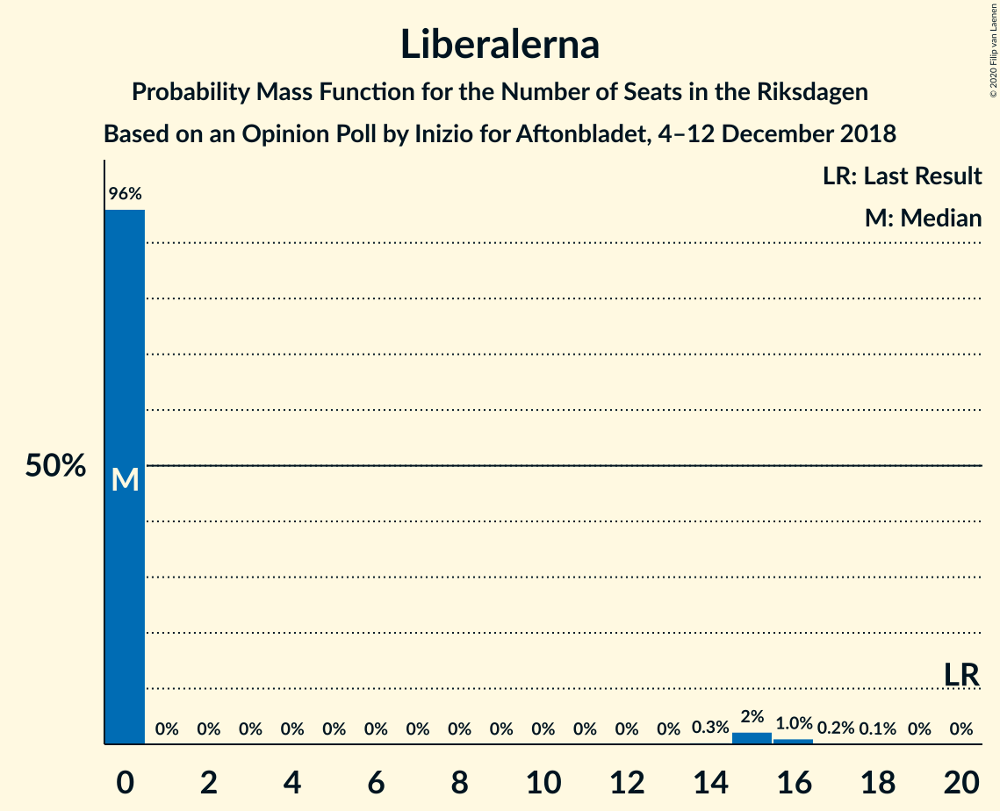

# Opinion Poll by Inizio for Aftonbladet, 4–12 December 2018

<a href="#voting-intentions">Voting Intentions</a> | <a href="#seats">Seats</a> | <a href="#coalitions">Coalitions</a> | <a href="#technical-information">Technical Information</a>

## Voting Intentions

### Confidence Intervals

| Party | Last Result | Poll Result | 80% Confidence Interval | 90% Confidence Interval | 95% Confidence Interval | 99% Confidence Interval |
|:-----:|:-----------:|:-----------:|:-----------------------:|:-----------------------:|:-----------------------:|:-----------------------:|
| Sveriges socialdemokratiska arbetareparti | 28.3% | 29.4% | 28.1–30.6% |27.8–31.0% |27.5–31.3% |26.9–31.9% |
| Sverigedemokraterna | 17.5% | 19.4% | 18.4–20.5% |18.0–20.8% |17.8–21.1% |17.3–21.6% |
| Moderata samlingspartiet | 19.8% | 18.5% | 17.5–19.6% |17.2–19.9% |16.9–20.2% |16.5–20.7% |
| Centerpartiet | 8.6% | 9.0% | 8.2–9.8% |8.0–10.0% |7.9–10.2% |7.5–10.7% |
| Kristdemokraterna | 6.3% | 7.7% | 7.0–8.5% |6.8–8.7% |6.6–8.9% |6.3–9.3% |
| Vänsterpartiet | 8.0% | 7.2% | 6.5–8.0% |6.3–8.2% |6.2–8.4% |5.9–8.7% |
| Miljöpartiet de gröna | 4.4% | 3.7% | 3.2–4.3% |3.1–4.4% |3.0–4.6% |2.8–4.9% |
| Liberalerna | 5.5% | 3.3% | 2.9–3.9% |2.7–4.0% |2.6–4.1% |2.4–4.4% |

*Note:* The poll result column reflects the actual value used in the calculations. Published results may vary slightly, and in addition be rounded to fewer digits.

## Seats

### Confidence Intervals

| Party | Last Result | Median | 80% Confidence Interval | 90% Confidence Interval | 95% Confidence Interval | 99% Confidence Interval |
|:-----:|:-----------:|:------:|:-----------------------:|:-----------------------:|:-----------------------:|:-----------------------:|
| <a href="#sveriges-socialdemokratiska-arbetareparti">Sveriges socialdemokratiska arbetareparti</a> | 100 | 112 | 107–115 |107–116 |106–116 |101–118 |
| <a href="#sverigedemokraterna">Sverigedemokraterna</a> | 62 | 74 | 70–78 |68–79 |66–81 |64–82 |
| <a href="#moderata-samlingspartiet">Moderata samlingspartiet</a> | 70 | 70 | 66–73 |64–75 |64–76 |61–78 |
| <a href="#centerpartiet">Centerpartiet</a> | 31 | 33 | 31–37 |30–38 |29–38 |28–39 |
| <a href="#kristdemokraterna">Kristdemokraterna</a> | 22 | 29 | 27–33 |26–33 |25–34 |24–35 |
| <a href="#vänsterpartiet">Vänsterpartiet</a> | 28 | 28 | 25–30 |24–31 |24–31 |22–33 |
| <a href="#miljöpartiet-de-gröna">Miljöpartiet de gröna</a> | 16 | 0 | 0–16 |0–16 |0–16 |0–18 |
| <a href="#liberalerna">Liberalerna</a> | 20 | 0 | 0 |0 |0–15 |0–16 |

### Sveriges socialdemokratiska arbetareparti

*For a full overview of the results for this party, see the [Sveriges socialdemokratiska arbetareparti](party-sverigessocialdemokratiskaarbetareparti.html) page.*

| Number of Seats | Probability | Accumulated | Special Marks |
|:---------------:|:-----------:|:-----------:|:-------------:|
| 96 | 0% | 100% |  |
| 97 | 0% | 99.9% |  |
| 98 | 0% | 99.9% |  |
| 99 | 0.2% | 99.9% |  |
| 100 | 0.1% | 99.6% | Last Result |
| 101 | 0.1% | 99.5% |  |
| 102 | 0.1% | 99.4% |  |
| 103 | 0.4% | 99.3% |  |
| 104 | 0.3% | 99.0% |  |
| 105 | 0.6% | 98.6% |  |
| 106 | 2% | 98% |  |
| 107 | 10% | 96% |  |
| 108 | 2% | 87% |  |
| 109 | 12% | 85% |  |
| 110 | 7% | 73% |  |
| 111 | 7% | 66% |  |
| 112 | 23% | 59% | Median |
| 113 | 9% | 36% |  |
| 114 | 15% | 27% |  |
| 115 | 5% | 12% |  |
| 116 | 5% | 7% |  |
| 117 | 0.8% | 2% |  |
| 118 | 1.1% | 1.2% |  |
| 119 | 0% | 0.1% |  |
| 120 | 0% | 0.1% |  |
| 121 | 0% | 0.1% |  |
| 122 | 0% | 0.1% |  |
| 123 | 0% | 0.1% |  |
| 124 | 0% | 0% |  |

### Sverigedemokraterna

*For a full overview of the results for this party, see the [Sverigedemokraterna](party-sverigedemokraterna.html) page.*

| Number of Seats | Probability | Accumulated | Special Marks |
|:---------------:|:-----------:|:-----------:|:-------------:|
| 62 | 0.1% | 100% | Last Result |
| 63 | 0.2% | 99.9% |  |
| 64 | 0.4% | 99.7% |  |
| 65 | 2% | 99.3% |  |
| 66 | 0.6% | 98% |  |
| 67 | 1.0% | 97% |  |
| 68 | 2% | 96% |  |
| 69 | 3% | 94% |  |
| 70 | 12% | 91% |  |
| 71 | 15% | 79% |  |
| 72 | 4% | 64% |  |
| 73 | 6% | 59% |  |
| 74 | 28% | 53% | Median |
| 75 | 7% | 25% |  |
| 76 | 6% | 18% |  |
| 77 | 1.0% | 12% |  |
| 78 | 2% | 11% |  |
| 79 | 4% | 9% |  |
| 80 | 0.5% | 5% |  |
| 81 | 3% | 4% |  |
| 82 | 1.0% | 1.2% |  |
| 83 | 0.1% | 0.2% |  |
| 84 | 0% | 0.1% |  |
| 85 | 0% | 0% |  |

### Moderata samlingspartiet

*For a full overview of the results for this party, see the [Moderata samlingspartiet](party-moderatasamlingspartiet.html) page.*

| Number of Seats | Probability | Accumulated | Special Marks |
|:---------------:|:-----------:|:-----------:|:-------------:|
| 59 | 0.1% | 100% |  |
| 60 | 0.1% | 99.9% |  |
| 61 | 0.3% | 99.8% |  |
| 62 | 0.7% | 99.5% |  |
| 63 | 1.0% | 98.8% |  |
| 64 | 3% | 98% |  |
| 65 | 2% | 94% |  |
| 66 | 7% | 92% |  |
| 67 | 14% | 85% |  |
| 68 | 5% | 72% |  |
| 69 | 11% | 67% |  |
| 70 | 12% | 56% | Last Result, Median |
| 71 | 25% | 44% |  |
| 72 | 8% | 19% |  |
| 73 | 1.0% | 11% |  |
| 74 | 3% | 10% |  |
| 75 | 4% | 7% |  |
| 76 | 2% | 3% |  |
| 77 | 0.4% | 1.1% |  |
| 78 | 0.3% | 0.7% |  |
| 79 | 0.3% | 0.4% |  |
| 80 | 0% | 0.1% |  |
| 81 | 0% | 0% |  |

### Centerpartiet

*For a full overview of the results for this party, see the [Centerpartiet](party-centerpartiet.html) page.*

| Number of Seats | Probability | Accumulated | Special Marks |
|:---------------:|:-----------:|:-----------:|:-------------:|
| 27 | 0% | 100% |  |
| 28 | 0.6% | 99.9% |  |
| 29 | 3% | 99.3% |  |
| 30 | 3% | 97% |  |
| 31 | 4% | 93% | Last Result |
| 32 | 16% | 89% |  |
| 33 | 28% | 73% | Median |
| 34 | 28% | 45% |  |
| 35 | 4% | 17% |  |
| 36 | 2% | 13% |  |
| 37 | 5% | 11% |  |
| 38 | 5% | 6% |  |
| 39 | 0.8% | 1.2% |  |
| 40 | 0.2% | 0.4% |  |
| 41 | 0.1% | 0.1% |  |
| 42 | 0.1% | 0.1% |  |
| 43 | 0% | 0% |  |

### Kristdemokraterna

*For a full overview of the results for this party, see the [Kristdemokraterna](party-kristdemokraterna.html) page.*

| Number of Seats | Probability | Accumulated | Special Marks |
|:---------------:|:-----------:|:-----------:|:-------------:|
| 22 | 0% | 100% | Last Result |
| 23 | 0.2% | 100% |  |
| 24 | 1.2% | 99.8% |  |
| 25 | 3% | 98.6% |  |
| 26 | 3% | 95% |  |
| 27 | 9% | 92% |  |
| 28 | 33% | 83% |  |
| 29 | 10% | 50% | Median |
| 30 | 19% | 40% |  |
| 31 | 5% | 21% |  |
| 32 | 3% | 16% |  |
| 33 | 8% | 13% |  |
| 34 | 3% | 4% |  |
| 35 | 0.8% | 1.1% |  |
| 36 | 0.1% | 0.3% |  |
| 37 | 0.2% | 0.2% |  |
| 38 | 0% | 0% |  |

### Vänsterpartiet

*For a full overview of the results for this party, see the [Vänsterpartiet](party-vänsterpartiet.html) page.*

| Number of Seats | Probability | Accumulated | Special Marks |
|:---------------:|:-----------:|:-----------:|:-------------:|
| 21 | 0.2% | 100% |  |
| 22 | 0.8% | 99.8% |  |
| 23 | 0.8% | 99.1% |  |
| 24 | 7% | 98% |  |
| 25 | 8% | 91% |  |
| 26 | 23% | 84% |  |
| 27 | 11% | 61% |  |
| 28 | 10% | 50% | Last Result, Median |
| 29 | 12% | 40% |  |
| 30 | 22% | 29% |  |
| 31 | 4% | 6% |  |
| 32 | 0.6% | 2% |  |
| 33 | 1.1% | 1.5% |  |
| 34 | 0.3% | 0.4% |  |
| 35 | 0.1% | 0.1% |  |
| 36 | 0% | 0% |  |

### Miljöpartiet de gröna

*For a full overview of the results for this party, see the [Miljöpartiet de gröna](party-miljöpartietdegröna.html) page.*

| Number of Seats | Probability | Accumulated | Special Marks |
|:---------------:|:-----------:|:-----------:|:-------------:|
| 0 | 74% | 100% | Median |
| 1 | 0% | 26% |  |
| 2 | 0% | 26% |  |
| 3 | 0% | 26% |  |
| 4 | 0% | 26% |  |
| 5 | 0% | 26% |  |
| 6 | 0% | 26% |  |
| 7 | 0% | 26% |  |
| 8 | 0% | 26% |  |
| 9 | 0% | 26% |  |
| 10 | 0% | 26% |  |
| 11 | 0% | 26% |  |
| 12 | 0% | 26% |  |
| 13 | 0% | 26% |  |
| 14 | 0.2% | 26% |  |
| 15 | 4% | 26% |  |
| 16 | 19% | 21% | Last Result |
| 17 | 2% | 2% |  |
| 18 | 0.5% | 0.7% |  |
| 19 | 0.2% | 0.2% |  |
| 20 | 0% | 0% |  |

### Liberalerna

*For a full overview of the results for this party, see the [Liberalerna](party-liberalerna.html) page.*

| Number of Seats | Probability | Accumulated | Special Marks |
|:---------------:|:-----------:|:-----------:|:-------------:|
| 0 | 97% | 100% | Median |
| 1 | 0% | 3% |  |
| 2 | 0% | 3% |  |
| 3 | 0% | 3% |  |
| 4 | 0% | 3% |  |
| 5 | 0% | 3% |  |
| 6 | 0% | 3% |  |
| 7 | 0% | 3% |  |
| 8 | 0% | 3% |  |
| 9 | 0% | 3% |  |
| 10 | 0% | 3% |  |
| 11 | 0% | 3% |  |
| 12 | 0% | 3% |  |
| 13 | 0% | 3% |  |
| 14 | 0.1% | 3% |  |
| 15 | 2% | 3% |  |
| 16 | 0.7% | 1.1% |  |
| 17 | 0.4% | 0.4% |  |
| 18 | 0% | 0% |  |
| 19 | 0% | 0% |  |
| 20 | 0% | 0% | Last Result |

## Coalitions

### Confidence Intervals

| Coalition | Last Result | Median | Majority? | 80% Confidence Interval | 90% Confidence Interval | 95% Confidence Interval | 99% Confidence Interval |
|:---------:|:-----------:|:------:|:---------:|:-----------------------:|:-----------------------:|:-----------------------:|:-----------------------:|
| Sveriges socialdemokratiska arbetareparti – Moderata samlingspartiet – Centerpartiet | 201 | 216 | 100% | 206–222 | 205–222 | 203–223 | 198–228 |
| Sveriges socialdemokratiska arbetareparti – Moderata samlingspartiet | 170 | 183 | 87% | 173–187 | 173–189 | 171–190 | 167–193 |
| Sverigedemokraterna – Moderata samlingspartiet – Kristdemokraterna | 154 | 173 | 22% | 165–178 | 163–179 | 161–180 | 159–183 |
| Sveriges socialdemokratiska arbetareparti – Vänsterpartiet – Miljöpartiet de gröna | 144 | 142 | 0% | 138–151 | 137–152 | 135–153 | 131–157 |
| Sverigedemokraterna – Moderata samlingspartiet | 132 | 144 | 0% | 137–148 | 134–150 | 133–151 | 131–153 |
| Sveriges socialdemokratiska arbetareparti – Vänsterpartiet | 128 | 140 | 0% | 133–143 | 132–144 | 131–145 | 128–147 |
| Moderata samlingspartiet – Centerpartiet – Kristdemokraterna – Liberalerna | 143 | 133 | 0% | 128–137 | 126–140 | 124–141 | 123–147 |
| Moderata samlingspartiet – Centerpartiet – Kristdemokraterna | 123 | 133 | 0% | 128–137 | 125–137 | 124–140 | 121–143 |
| Sveriges socialdemokratiska arbetareparti – Miljöpartiet de gröna | 116 | 114 | 0% | 111–125 | 110–125 | 109–126 | 105–128 |
| Moderata samlingspartiet – Centerpartiet – Liberalerna | 121 | 104 | 0% | 99–108 | 98–109 | 97–112 | 95–117 |
| Moderata samlingspartiet – Centerpartiet | 101 | 104 | 0% | 99–106 | 98–108 | 96–109 | 93–113 |

### Sveriges socialdemokratiska arbetareparti – Moderata samlingspartiet – Centerpartiet

| Number of Seats | Probability | Accumulated | Special Marks |
|:---------------:|:-----------:|:-----------:|:-------------:|
| 195 | 0% | 100% |  |
| 196 | 0.1% | 99.9% |  |
| 197 | 0.3% | 99.8% |  |
| 198 | 0.1% | 99.5% |  |
| 199 | 0.3% | 99.5% |  |
| 200 | 0.2% | 99.2% |  |
| 201 | 0.3% | 99.0% | Last Result |
| 202 | 0.4% | 98.7% |  |
| 203 | 2% | 98% |  |
| 204 | 0.7% | 97% |  |
| 205 | 1.0% | 96% |  |
| 206 | 7% | 95% |  |
| 207 | 1.1% | 88% |  |
| 208 | 3% | 87% |  |
| 209 | 9% | 84% |  |
| 210 | 3% | 75% |  |
| 211 | 2% | 72% |  |
| 212 | 3% | 70% |  |
| 213 | 5% | 67% |  |
| 214 | 2% | 62% |  |
| 215 | 3% | 60% | Median |
| 216 | 8% | 57% |  |
| 217 | 26% | 49% |  |
| 218 | 3% | 24% |  |
| 219 | 3% | 21% |  |
| 220 | 4% | 17% |  |
| 221 | 1.3% | 13% |  |
| 222 | 7% | 12% |  |
| 223 | 3% | 5% |  |
| 224 | 0.6% | 2% |  |
| 225 | 0.7% | 2% |  |
| 226 | 0.2% | 0.9% |  |
| 227 | 0.1% | 0.7% |  |
| 228 | 0.5% | 0.6% |  |
| 229 | 0% | 0.1% |  |
| 230 | 0% | 0% |  |

### Sveriges socialdemokratiska arbetareparti – Moderata samlingspartiet

| Number of Seats | Probability | Accumulated | Special Marks |
|:---------------:|:-----------:|:-----------:|:-------------:|
| 162 | 0% | 100% |  |
| 163 | 0% | 99.9% |  |
| 164 | 0% | 99.9% |  |
| 165 | 0.2% | 99.9% |  |
| 166 | 0% | 99.7% |  |
| 167 | 0.3% | 99.7% |  |
| 168 | 0.3% | 99.4% |  |
| 169 | 0.7% | 99.1% |  |
| 170 | 0.9% | 98% | Last Result |
| 171 | 1.3% | 98% |  |
| 172 | 0.8% | 96% |  |
| 173 | 7% | 95% |  |
| 174 | 1.3% | 89% |  |
| 175 | 1.0% | 87% | Majority |
| 176 | 10% | 86% |  |
| 177 | 3% | 77% |  |
| 178 | 6% | 74% |  |
| 179 | 1.5% | 68% |  |
| 180 | 8% | 66% |  |
| 181 | 4% | 59% |  |
| 182 | 1.0% | 55% | Median |
| 183 | 21% | 53% |  |
| 184 | 9% | 32% |  |
| 185 | 10% | 23% |  |
| 186 | 1.0% | 13% |  |
| 187 | 2% | 12% |  |
| 188 | 0.8% | 10% |  |
| 189 | 6% | 9% |  |
| 190 | 1.3% | 4% |  |
| 191 | 1.5% | 2% |  |
| 192 | 0.2% | 0.7% |  |
| 193 | 0.4% | 0.5% |  |
| 194 | 0% | 0.1% |  |
| 195 | 0.1% | 0.1% |  |
| 196 | 0% | 0.1% |  |
| 197 | 0% | 0% |  |

### Sverigedemokraterna – Moderata samlingspartiet – Kristdemokraterna

| Number of Seats | Probability | Accumulated | Special Marks |
|:---------------:|:-----------:|:-----------:|:-------------:|
| 154 | 0% | 100% | Last Result |
| 155 | 0.2% | 100% |  |
| 156 | 0.1% | 99.8% |  |
| 157 | 0% | 99.7% |  |
| 158 | 0.1% | 99.7% |  |
| 159 | 0.2% | 99.6% |  |
| 160 | 0.4% | 99.4% |  |
| 161 | 2% | 99.0% |  |
| 162 | 0.8% | 97% |  |
| 163 | 2% | 96% |  |
| 164 | 0.4% | 95% |  |
| 165 | 8% | 94% |  |
| 166 | 3% | 86% |  |
| 167 | 8% | 83% |  |
| 168 | 2% | 76% |  |
| 169 | 2% | 74% |  |
| 170 | 0.9% | 72% |  |
| 171 | 9% | 71% |  |
| 172 | 4% | 62% |  |
| 173 | 22% | 58% | Median |
| 174 | 13% | 36% |  |
| 175 | 1.1% | 22% | Majority |
| 176 | 5% | 21% |  |
| 177 | 2% | 17% |  |
| 178 | 7% | 15% |  |
| 179 | 5% | 8% |  |
| 180 | 1.3% | 3% |  |
| 181 | 0.1% | 2% |  |
| 182 | 0.1% | 2% |  |
| 183 | 1.4% | 2% |  |
| 184 | 0.1% | 0.2% |  |
| 185 | 0.1% | 0.1% |  |
| 186 | 0% | 0% |  |

### Sveriges socialdemokratiska arbetareparti – Vänsterpartiet – Miljöpartiet de gröna

| Number of Seats | Probability | Accumulated | Special Marks |
|:---------------:|:-----------:|:-----------:|:-------------:|
| 127 | 0% | 100% |  |
| 128 | 0.1% | 99.9% |  |
| 129 | 0.1% | 99.9% |  |
| 130 | 0.2% | 99.8% |  |
| 131 | 0.3% | 99.6% |  |
| 132 | 0.2% | 99.3% |  |
| 133 | 0.1% | 99.1% |  |
| 134 | 0.4% | 99.0% |  |
| 135 | 1.3% | 98.6% |  |
| 136 | 0.5% | 97% |  |
| 137 | 5% | 97% |  |
| 138 | 5% | 92% |  |
| 139 | 7% | 87% |  |
| 140 | 8% | 80% | Median |
| 141 | 5% | 72% |  |
| 142 | 26% | 67% |  |
| 143 | 9% | 41% |  |
| 144 | 3% | 32% | Last Result |
| 145 | 2% | 28% |  |
| 146 | 3% | 26% |  |
| 147 | 2% | 24% |  |
| 148 | 1.2% | 22% |  |
| 149 | 6% | 21% |  |
| 150 | 0.5% | 14% |  |
| 151 | 8% | 14% |  |
| 152 | 3% | 6% |  |
| 153 | 0.7% | 3% |  |
| 154 | 1.3% | 2% |  |
| 155 | 0.1% | 0.7% |  |
| 156 | 0.1% | 0.6% |  |
| 157 | 0.5% | 0.5% |  |
| 158 | 0% | 0% |  |

### Sverigedemokraterna – Moderata samlingspartiet

| Number of Seats | Probability | Accumulated | Special Marks |
|:---------------:|:-----------:|:-----------:|:-------------:|
| 126 | 0% | 100% |  |
| 127 | 0% | 99.9% |  |
| 128 | 0% | 99.9% |  |
| 129 | 0.3% | 99.9% |  |
| 130 | 0.1% | 99.6% |  |
| 131 | 0.2% | 99.5% |  |
| 132 | 0.6% | 99.3% | Last Result |
| 133 | 1.3% | 98.7% |  |
| 134 | 3% | 97% |  |
| 135 | 1.0% | 95% |  |
| 136 | 0.7% | 94% |  |
| 137 | 13% | 93% |  |
| 138 | 1.2% | 80% |  |
| 139 | 2% | 79% |  |
| 140 | 3% | 77% |  |
| 141 | 13% | 73% |  |
| 142 | 2% | 60% |  |
| 143 | 5% | 58% |  |
| 144 | 5% | 53% | Median |
| 145 | 30% | 48% |  |
| 146 | 2% | 18% |  |
| 147 | 2% | 16% |  |
| 148 | 9% | 15% |  |
| 149 | 0.8% | 6% |  |
| 150 | 2% | 5% |  |
| 151 | 0.6% | 3% |  |
| 152 | 0.1% | 2% |  |
| 153 | 2% | 2% |  |
| 154 | 0.1% | 0.3% |  |
| 155 | 0% | 0.2% |  |
| 156 | 0.1% | 0.2% |  |
| 157 | 0% | 0% |  |

### Sveriges socialdemokratiska arbetareparti – Vänsterpartiet

| Number of Seats | Probability | Accumulated | Special Marks |
|:---------------:|:-----------:|:-----------:|:-------------:|
| 122 | 0% | 100% |  |
| 123 | 0% | 99.9% |  |
| 124 | 0% | 99.9% |  |
| 125 | 0.1% | 99.9% |  |
| 126 | 0.3% | 99.8% |  |
| 127 | 0.1% | 99.6% |  |
| 128 | 0.1% | 99.5% | Last Result |
| 129 | 0.2% | 99.4% |  |
| 130 | 0.5% | 99.2% |  |
| 131 | 3% | 98.7% |  |
| 132 | 1.4% | 95% |  |
| 133 | 6% | 94% |  |
| 134 | 2% | 87% |  |
| 135 | 9% | 86% |  |
| 136 | 3% | 77% |  |
| 137 | 6% | 74% |  |
| 138 | 6% | 68% |  |
| 139 | 7% | 62% |  |
| 140 | 8% | 55% | Median |
| 141 | 5% | 47% |  |
| 142 | 26% | 42% |  |
| 143 | 9% | 16% |  |
| 144 | 3% | 6% |  |
| 145 | 2% | 3% |  |
| 146 | 0.3% | 1.3% |  |
| 147 | 0.9% | 1.1% |  |
| 148 | 0% | 0.1% |  |
| 149 | 0.1% | 0.1% |  |
| 150 | 0% | 0.1% |  |
| 151 | 0% | 0% |  |

### Moderata samlingspartiet – Centerpartiet – Kristdemokraterna – Liberalerna

| Number of Seats | Probability | Accumulated | Special Marks |
|:---------------:|:-----------:|:-----------:|:-------------:|
| 120 | 0% | 100% |  |
| 121 | 0.1% | 99.9% |  |
| 122 | 0.1% | 99.8% |  |
| 123 | 0.6% | 99.7% |  |
| 124 | 2% | 99.2% |  |
| 125 | 1.5% | 97% |  |
| 126 | 2% | 96% |  |
| 127 | 1.0% | 94% |  |
| 128 | 7% | 93% |  |
| 129 | 7% | 85% |  |
| 130 | 6% | 78% |  |
| 131 | 5% | 72% |  |
| 132 | 6% | 67% | Median |
| 133 | 26% | 61% |  |
| 134 | 6% | 35% |  |
| 135 | 12% | 29% |  |
| 136 | 3% | 16% |  |
| 137 | 6% | 13% |  |
| 138 | 0.9% | 7% |  |
| 139 | 0.9% | 6% |  |
| 140 | 2% | 5% |  |
| 141 | 1.4% | 4% |  |
| 142 | 0.2% | 2% |  |
| 143 | 0.5% | 2% | Last Result |
| 144 | 0.3% | 2% |  |
| 145 | 0.5% | 1.2% |  |
| 146 | 0.1% | 0.6% |  |
| 147 | 0.3% | 0.5% |  |
| 148 | 0.1% | 0.2% |  |
| 149 | 0% | 0.1% |  |
| 150 | 0% | 0% |  |

### Moderata samlingspartiet – Centerpartiet – Kristdemokraterna

| Number of Seats | Probability | Accumulated | Special Marks |
|:---------------:|:-----------:|:-----------:|:-------------:|
| 116 | 0.1% | 100% |  |
| 117 | 0% | 99.9% |  |
| 118 | 0% | 99.9% |  |
| 119 | 0% | 99.9% |  |
| 120 | 0.3% | 99.8% |  |
| 121 | 0.2% | 99.6% |  |
| 122 | 0.3% | 99.4% |  |
| 123 | 0.6% | 99.1% | Last Result |
| 124 | 2% | 98% |  |
| 125 | 2% | 96% |  |
| 126 | 3% | 95% |  |
| 127 | 1.0% | 92% |  |
| 128 | 8% | 91% |  |
| 129 | 8% | 83% |  |
| 130 | 7% | 76% |  |
| 131 | 5% | 69% |  |
| 132 | 6% | 64% | Median |
| 133 | 26% | 59% |  |
| 134 | 6% | 33% |  |
| 135 | 12% | 26% |  |
| 136 | 3% | 14% |  |
| 137 | 6% | 11% |  |
| 138 | 0.9% | 5% |  |
| 139 | 0.9% | 4% |  |
| 140 | 1.5% | 3% |  |
| 141 | 0.8% | 2% |  |
| 142 | 0.1% | 0.7% |  |
| 143 | 0.1% | 0.6% |  |
| 144 | 0% | 0.5% |  |
| 145 | 0.3% | 0.4% |  |
| 146 | 0% | 0.1% |  |
| 147 | 0.1% | 0.1% |  |
| 148 | 0% | 0% |  |

### Sveriges socialdemokratiska arbetareparti – Miljöpartiet de gröna

| Number of Seats | Probability | Accumulated | Special Marks |
|:---------------:|:-----------:|:-----------:|:-------------:|
| 100 | 0% | 100% |  |
| 101 | 0.1% | 99.9% |  |
| 102 | 0.1% | 99.8% |  |
| 103 | 0.2% | 99.8% |  |
| 104 | 0% | 99.6% |  |
| 105 | 0.1% | 99.5% |  |
| 106 | 0.4% | 99.5% |  |
| 107 | 0.4% | 99.0% |  |
| 108 | 0.7% | 98.7% |  |
| 109 | 2% | 98% |  |
| 110 | 6% | 96% |  |
| 111 | 6% | 91% |  |
| 112 | 23% | 85% | Median |
| 113 | 9% | 62% |  |
| 114 | 16% | 53% |  |
| 115 | 5% | 37% |  |
| 116 | 5% | 32% | Last Result |
| 117 | 1.0% | 28% |  |
| 118 | 1.2% | 27% |  |
| 119 | 0.1% | 25% |  |
| 120 | 0.5% | 25% |  |
| 121 | 0.3% | 25% |  |
| 122 | 3% | 24% |  |
| 123 | 7% | 21% |  |
| 124 | 2% | 14% |  |
| 125 | 9% | 12% |  |
| 126 | 1.4% | 3% |  |
| 127 | 1.4% | 2% |  |
| 128 | 0.5% | 0.6% |  |
| 129 | 0.1% | 0.2% |  |
| 130 | 0% | 0% |  |

### Moderata samlingspartiet – Centerpartiet – Liberalerna

| Number of Seats | Probability | Accumulated | Special Marks |
|:---------------:|:-----------:|:-----------:|:-------------:|
| 93 | 0.2% | 100% |  |
| 94 | 0.1% | 99.7% |  |
| 95 | 0.3% | 99.6% |  |
| 96 | 1.4% | 99.3% |  |
| 97 | 2% | 98% |  |
| 98 | 2% | 96% |  |
| 99 | 7% | 94% |  |
| 100 | 11% | 87% |  |
| 101 | 4% | 77% |  |
| 102 | 12% | 72% |  |
| 103 | 6% | 60% | Median |
| 104 | 7% | 55% |  |
| 105 | 30% | 48% |  |
| 106 | 5% | 17% |  |
| 107 | 2% | 13% |  |
| 108 | 5% | 11% |  |
| 109 | 2% | 5% |  |
| 110 | 0.8% | 4% |  |
| 111 | 0.4% | 3% |  |
| 112 | 0.4% | 3% |  |
| 113 | 0.4% | 2% |  |
| 114 | 0.6% | 2% |  |
| 115 | 0.3% | 1.4% |  |
| 116 | 0.4% | 1.1% |  |
| 117 | 0.2% | 0.7% |  |
| 118 | 0.3% | 0.5% |  |
| 119 | 0% | 0.2% |  |
| 120 | 0.1% | 0.1% |  |
| 121 | 0% | 0% | Last Result |

### Moderata samlingspartiet – Centerpartiet

| Number of Seats | Probability | Accumulated | Special Marks |
|:---------------:|:-----------:|:-----------:|:-------------:|
| 92 | 0.3% | 100% |  |
| 93 | 0.3% | 99.7% |  |
| 94 | 0.5% | 99.4% |  |
| 95 | 0.5% | 99.0% |  |
| 96 | 2% | 98% |  |
| 97 | 2% | 97% |  |
| 98 | 3% | 95% |  |
| 99 | 7% | 93% |  |
| 100 | 11% | 85% |  |
| 101 | 5% | 74% | Last Result |
| 102 | 12% | 70% |  |
| 103 | 6% | 58% | Median |
| 104 | 7% | 52% |  |
| 105 | 30% | 45% |  |
| 106 | 4% | 14% |  |
| 107 | 2% | 10% |  |
| 108 | 5% | 8% |  |
| 109 | 1.2% | 3% |  |
| 110 | 0.8% | 2% |  |
| 111 | 0.1% | 0.9% |  |
| 112 | 0.2% | 0.8% |  |
| 113 | 0.1% | 0.5% |  |
| 114 | 0.1% | 0.5% |  |
| 115 | 0.1% | 0.4% |  |
| 116 | 0.2% | 0.3% |  |
| 117 | 0% | 0.1% |  |
| 118 | 0% | 0% |  |

## Technical Information

### Opinion Poll

+ **Polling firm:** Inizio
+ **Commissioner(s):** Aftonbladet
+ **Fieldwork period:** 4–12 December 2018

### Calculations

+ **Sample size:** 2238
+ **Simulations done:** 131,072
+ **Error estimate:** 1.10%

