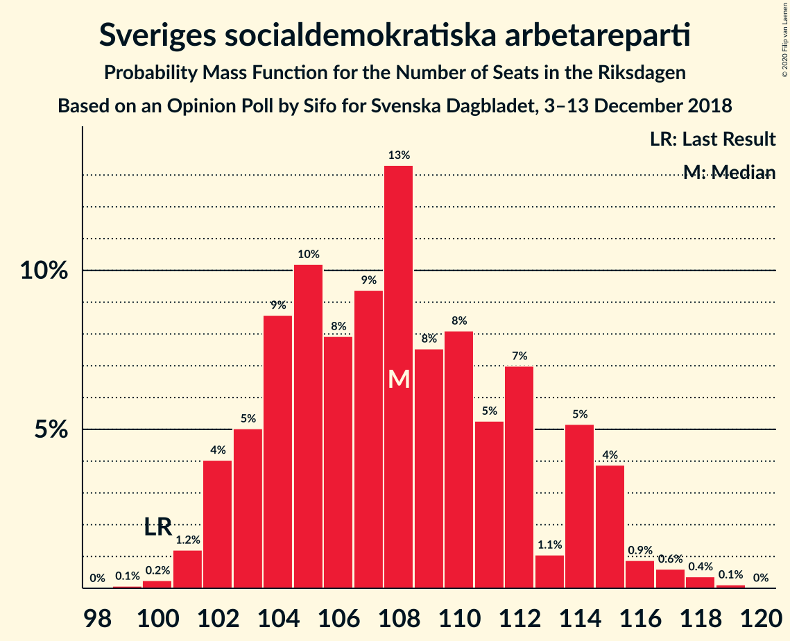
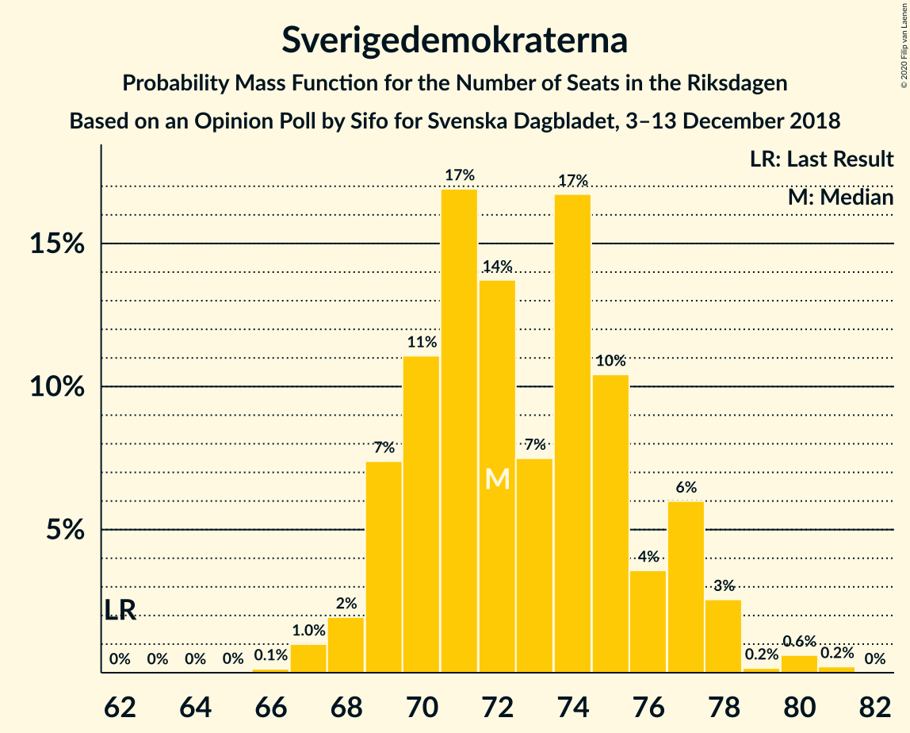
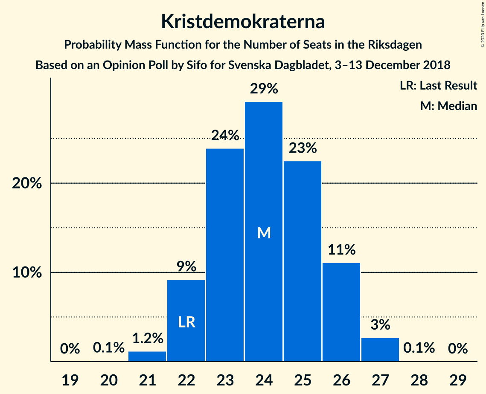
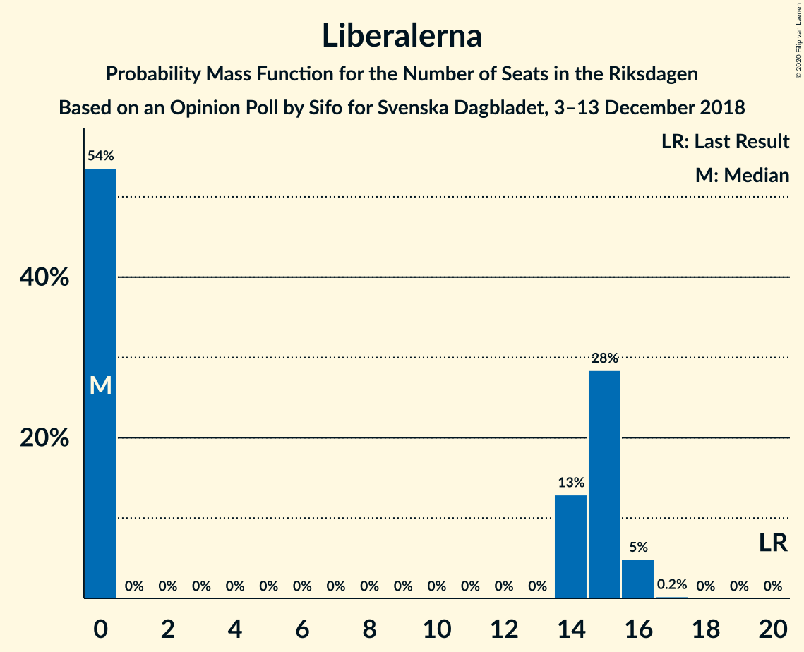
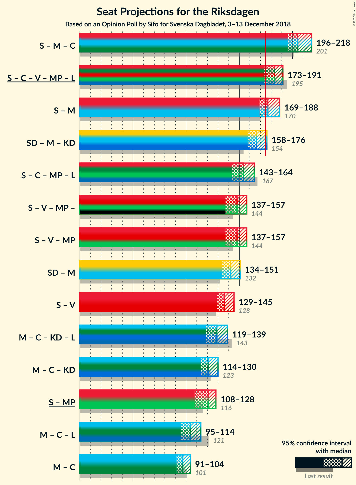

# Opinion Poll by Sifo for Svenska Dagbladet, 3–13 December 2018

<a href="#voting-intentions">Voting Intentions</a> | <a href="#seats">Seats</a> | <a href="#coalitions">Coalitions</a> | <a href="#technical-information">Technical Information</a>

## Voting Intentions

### Confidence Intervals

| Party | Last Result | Poll Result | 80% Confidence Interval | 90% Confidence Interval | 95% Confidence Interval | 99% Confidence Interval |
|:-----:|:-----------:|:-----------:|:-----------------------:|:-----------------------:|:-----------------------:|:-----------------------:|
| Sveriges socialdemokratiska arbetareparti | 28.3% | 29.7% | 29.1–30.3% |28.9–30.5% |28.7–30.7% |28.4–31.0% |
| Sverigedemokraterna | 17.5% | 20.0% | 19.4–20.6% |19.3–20.7% |19.2–20.9% |18.9–21.1% |
| Moderata samlingspartiet | 19.8% | 19.0% | 18.5–19.6% |18.3–19.7% |18.2–19.8% |17.9–20.1% |
| Centerpartiet | 8.6% | 7.7% | 7.3–8.1% |7.2–8.2% |7.1–8.3% |7.0–8.5% |
| Vänsterpartiet | 8.0% | 7.7% | 7.3–8.1% |7.2–8.2% |7.1–8.3% |7.0–8.5% |
| Kristdemokraterna | 6.3% | 6.6% | 6.3–7.0% |6.2–7.1% |6.1–7.1% |5.9–7.3% |
| Miljöpartiet de gröna | 4.4% | 4.2% | 3.9–4.5% |3.9–4.6% |3.8–4.6% |3.7–4.8% |
| Liberalerna | 5.5% | 4.0% | 3.7–4.3% |3.7–4.4% |3.6–4.4% |3.5–4.6% |

*Note:* The poll result column reflects the actual value used in the calculations. Published results may vary slightly, and in addition be rounded to fewer digits.

## Seats

### Confidence Intervals

| Party | Last Result | Median | 80% Confidence Interval | 90% Confidence Interval | 95% Confidence Interval | 99% Confidence Interval |
|:-----:|:-----------:|:------:|:-----------------------:|:-----------------------:|:-----------------------:|:-----------------------:|
| <a href="#sveriges-socialdemokratiska-arbetareparti">Sveriges socialdemokratiska arbetareparti</a> | 100 | 105 | 105–109 |105–114 |105–114 |105–114 |
| <a href="#sverigedemokraterna">Sverigedemokraterna</a> | 62 | 69 | 69–73 |69–73 |69–73 |69–75 |
| <a href="#moderata-samlingspartiet">Moderata samlingspartiet</a> | 70 | 65 | 65–72 |65–72 |65–72 |65–74 |
| <a href="#centerpartiet">Centerpartiet</a> | 31 | 30 | 27–30 |27–30 |27–30 |27–30 |
| <a href="#vänsterpartiet">Vänsterpartiet</a> | 28 | 28 | 28 |27–28 |27–28 |27–31 |
| <a href="#kristdemokraterna">Kristdemokraterna</a> | 22 | 22 | 22–25 |22–25 |22–25 |22–27 |
| <a href="#miljöpartiet-de-gröna">Miljöpartiet de gröna</a> | 16 | 15 | 15–16 |0–16 |0–16 |0–16 |
| <a href="#liberalerna">Liberalerna</a> | 20 | 15 | 0–15 |0–16 |0–16 |0–16 |

### Sveriges socialdemokratiska arbetareparti

*For a full overview of the results for this party, see the [Sveriges socialdemokratiska arbetareparti](party-sverigessocialdemokratiskaarbetareparti.html) page.*

| Number of Seats | Probability | Accumulated | Special Marks |
|:---------------:|:-----------:|:-----------:|:-------------:|
| 100 | 0% | 100% | Last Result |
| 101 | 0% | 100% |  |
| 102 | 0% | 100% |  |
| 103 | 0% | 100% |  |
| 104 | 0% | 100% |  |
| 105 | 56% | 100% | Median |
| 106 | 0.2% | 44% |  |
| 107 | 0% | 43% |  |
| 108 | 0.1% | 43% |  |
| 109 | 34% | 43% |  |
| 110 | 0.1% | 9% |  |
| 111 | 0% | 9% |  |
| 112 | 0% | 9% |  |
| 113 | 0.1% | 9% |  |
| 114 | 9% | 9% |  |
| 115 | 0% | 0% |  |

### Sverigedemokraterna

*For a full overview of the results for this party, see the [Sverigedemokraterna](party-sverigedemokraterna.html) page.*

| Number of Seats | Probability | Accumulated | Special Marks |
|:---------------:|:-----------:|:-----------:|:-------------:|
| 62 | 0% | 100% | Last Result |
| 63 | 0% | 100% |  |
| 64 | 0% | 100% |  |
| 65 | 0% | 100% |  |
| 66 | 0% | 100% |  |
| 67 | 0% | 100% |  |
| 68 | 0% | 100% |  |
| 69 | 55% | 100% | Median |
| 70 | 0.1% | 45% |  |
| 71 | 1.1% | 45% |  |
| 72 | 9% | 44% |  |
| 73 | 34% | 35% |  |
| 74 | 0% | 0.9% |  |
| 75 | 0.4% | 0.9% |  |
| 76 | 0% | 0.5% |  |
| 77 | 0.3% | 0.5% |  |
| 78 | 0% | 0.2% |  |
| 79 | 0% | 0.2% |  |
| 80 | 0.1% | 0.2% |  |
| 81 | 0.1% | 0.1% |  |
| 82 | 0% | 0% |  |

### Moderata samlingspartiet

*For a full overview of the results for this party, see the [Moderata samlingspartiet](party-moderatasamlingspartiet.html) page.*

| Number of Seats | Probability | Accumulated | Special Marks |
|:---------------:|:-----------:|:-----------:|:-------------:|
| 64 | 0.1% | 100% |  |
| 65 | 55% | 99.9% | Median |
| 66 | 0% | 45% |  |
| 67 | 9% | 45% |  |
| 68 | 0.3% | 36% |  |
| 69 | 0% | 36% |  |
| 70 | 0.1% | 36% | Last Result |
| 71 | 0% | 35% |  |
| 72 | 34% | 35% |  |
| 73 | 0.4% | 2% |  |
| 74 | 1.1% | 1.1% |  |
| 75 | 0% | 0% |  |

### Centerpartiet

*For a full overview of the results for this party, see the [Centerpartiet](party-centerpartiet.html) page.*

| Number of Seats | Probability | Accumulated | Special Marks |
|:---------------:|:-----------:|:-----------:|:-------------:|
| 27 | 34% | 100% |  |
| 28 | 10% | 66% |  |
| 29 | 0.2% | 56% |  |
| 30 | 55% | 55% | Median |
| 31 | 0.2% | 0.2% | Last Result |
| 32 | 0% | 0% |  |

### Vänsterpartiet

*For a full overview of the results for this party, see the [Vänsterpartiet](party-vänsterpartiet.html) page.*

| Number of Seats | Probability | Accumulated | Special Marks |
|:---------------:|:-----------:|:-----------:|:-------------:|
| 26 | 0.1% | 100% |  |
| 27 | 9% | 99.9% |  |
| 28 | 89% | 91% | Last Result, Median |
| 29 | 1.1% | 2% |  |
| 30 | 0.2% | 0.7% |  |
| 31 | 0.1% | 0.5% |  |
| 32 | 0.4% | 0.4% |  |
| 33 | 0% | 0% |  |

### Kristdemokraterna

*For a full overview of the results for this party, see the [Kristdemokraterna](party-kristdemokraterna.html) page.*

| Number of Seats | Probability | Accumulated | Special Marks |
|:---------------:|:-----------:|:-----------:|:-------------:|
| 21 | 0.2% | 100% |  |
| 22 | 55% | 99.8% | Last Result, Median |
| 23 | 0.1% | 44% |  |
| 24 | 34% | 44% |  |
| 25 | 9% | 11% |  |
| 26 | 0.2% | 2% |  |
| 27 | 2% | 2% |  |
| 28 | 0% | 0% |  |

### Miljöpartiet de gröna

*For a full overview of the results for this party, see the [Miljöpartiet de gröna](party-miljöpartietdegröna.html) page.*

| Number of Seats | Probability | Accumulated | Special Marks |
|:---------------:|:-----------:|:-----------:|:-------------:|
| 0 | 9% | 100% |  |
| 1 | 0% | 91% |  |
| 2 | 0% | 91% |  |
| 3 | 0% | 91% |  |
| 4 | 0% | 91% |  |
| 5 | 0% | 91% |  |
| 6 | 0% | 91% |  |
| 7 | 0% | 91% |  |
| 8 | 0% | 91% |  |
| 9 | 0% | 91% |  |
| 10 | 0% | 91% |  |
| 11 | 0% | 91% |  |
| 12 | 0% | 91% |  |
| 13 | 0% | 91% |  |
| 14 | 0% | 91% |  |
| 15 | 56% | 91% | Median |
| 16 | 34% | 34% | Last Result |
| 17 | 0.2% | 0.2% |  |
| 18 | 0% | 0% |  |

### Liberalerna

*For a full overview of the results for this party, see the [Liberalerna](party-liberalerna.html) page.*

| Number of Seats | Probability | Accumulated | Special Marks |
|:---------------:|:-----------:|:-----------:|:-------------:|
| 0 | 36% | 100% |  |
| 1 | 0% | 64% |  |
| 2 | 0% | 64% |  |
| 3 | 0% | 64% |  |
| 4 | 0% | 64% |  |
| 5 | 0% | 64% |  |
| 6 | 0% | 64% |  |
| 7 | 0% | 64% |  |
| 8 | 0% | 64% |  |
| 9 | 0% | 64% |  |
| 10 | 0% | 64% |  |
| 11 | 0% | 64% |  |
| 12 | 0% | 64% |  |
| 13 | 0% | 64% |  |
| 14 | 0% | 64% |  |
| 15 | 55% | 64% | Median |
| 16 | 9% | 9% |  |
| 17 | 0% | 0% |  |
| 18 | 0% | 0% |  |
| 19 | 0% | 0% |  |
| 20 | 0% | 0% | Last Result |

## Coalitions

### Confidence Intervals

| Coalition | Last Result | Median | Majority? | 80% Confidence Interval | 90% Confidence Interval | 95% Confidence Interval | 99% Confidence Interval |
|:---------:|:-----------:|:------:|:---------:|:-----------------------:|:-----------------------:|:-----------------------:|:-----------------------:|
| Sveriges socialdemokratiska arbetareparti – Moderata samlingspartiet – Centerpartiet | 201 | 200 | 100% | 200–208 | 200–209 | 200–209 | 200–211 |
| Sveriges socialdemokratiska arbetareparti – Moderata samlingspartiet | 170 | 170 | 44% | 170–181 | 170–181 | 170–181 | 170–183 |
| Sverigedemokraterna – Moderata samlingspartiet – Kristdemokraterna | 154 | 156 | 0.5% | 156–169 | 156–169 | 156–169 | 156–174 |
| Sveriges socialdemokratiska arbetareparti – Vänsterpartiet – Miljöpartiet de gröna | 144 | 148 | 0% | 148–153 | 141–153 | 141–153 | 141–153 |
| Sverigedemokraterna – Moderata samlingspartiet | 132 | 134 | 0% | 134–145 | 134–145 | 134–145 | 134–148 |
| Sveriges socialdemokratiska arbetareparti – Vänsterpartiet | 128 | 133 | 0% | 133–137 | 133–141 | 133–141 | 133–144 |
| Moderata samlingspartiet – Centerpartiet – Kristdemokraterna – Liberalerna | 143 | 132 | 0% | 123–132 | 123–136 | 123–136 | 123–136 |
| Sveriges socialdemokratiska arbetareparti – Miljöpartiet de gröna | 116 | 120 | 0% | 120–125 | 114–125 | 114–125 | 114–125 |
| Moderata samlingspartiet – Centerpartiet – Kristdemokraterna | 123 | 117 | 0% | 117–123 | 117–123 | 117–123 | 117–129 |
| Moderata samlingspartiet – Centerpartiet – Liberalerna | 121 | 110 | 0% | 99–110 | 99–111 | 99–111 | 99–111 |
| Moderata samlingspartiet – Centerpartiet | 101 | 95 | 0% | 95–99 | 95–99 | 95–99 | 95–102 |

### Sveriges socialdemokratiska arbetareparti – Moderata samlingspartiet – Centerpartiet

| Number of Seats | Probability | Accumulated | Special Marks |
|:---------------:|:-----------:|:-----------:|:-------------:|
| 200 | 55% | 100% | Median |
| 201 | 0% | 45% | Last Result |
| 202 | 0.1% | 45% |  |
| 203 | 0% | 45% |  |
| 204 | 0.1% | 45% |  |
| 205 | 0.2% | 45% |  |
| 206 | 0.1% | 44% |  |
| 207 | 1.1% | 44% |  |
| 208 | 34% | 43% |  |
| 209 | 9% | 9% |  |
| 210 | 0% | 0.6% |  |
| 211 | 0.1% | 0.6% |  |
| 212 | 0% | 0.4% |  |
| 213 | 0% | 0.4% |  |
| 214 | 0% | 0.4% |  |
| 215 | 0.4% | 0.4% |  |
| 216 | 0% | 0% |  |

### Sveriges socialdemokratiska arbetareparti – Moderata samlingspartiet

| Number of Seats | Probability | Accumulated | Special Marks |
|:---------------:|:-----------:|:-----------:|:-------------:|
| 170 | 55% | 100% | Last Result, Median |
| 171 | 0% | 45% |  |
| 172 | 0% | 45% |  |
| 173 | 0.1% | 45% |  |
| 174 | 0.2% | 45% |  |
| 175 | 0% | 44% | Majority |
| 176 | 0.1% | 44% |  |
| 177 | 0.1% | 44% |  |
| 178 | 0% | 44% |  |
| 179 | 1.1% | 44% |  |
| 180 | 0% | 43% |  |
| 181 | 43% | 43% |  |
| 182 | 0% | 0.6% |  |
| 183 | 0.1% | 0.5% |  |
| 184 | 0% | 0.4% |  |
| 185 | 0% | 0.4% |  |
| 186 | 0% | 0.4% |  |
| 187 | 0.4% | 0.4% |  |
| 188 | 0% | 0% |  |

### Sverigedemokraterna – Moderata samlingspartiet – Kristdemokraterna

| Number of Seats | Probability | Accumulated | Special Marks |
|:---------------:|:-----------:|:-----------:|:-------------:|
| 154 | 0% | 100% | Last Result |
| 155 | 0% | 100% |  |
| 156 | 55% | 100% | Median |
| 157 | 0% | 45% |  |
| 158 | 0% | 45% |  |
| 159 | 0% | 45% |  |
| 160 | 0% | 45% |  |
| 161 | 0% | 45% |  |
| 162 | 0% | 45% |  |
| 163 | 0% | 45% |  |
| 164 | 9% | 45% |  |
| 165 | 0% | 36% |  |
| 166 | 0.3% | 36% |  |
| 167 | 0.1% | 36% |  |
| 168 | 0% | 36% |  |
| 169 | 34% | 36% |  |
| 170 | 0% | 2% |  |
| 171 | 0.1% | 2% |  |
| 172 | 1.1% | 2% |  |
| 173 | 0% | 0.5% |  |
| 174 | 0% | 0.5% |  |
| 175 | 0.4% | 0.5% | Majority |
| 176 | 0% | 0.1% |  |
| 177 | 0.1% | 0.1% |  |
| 178 | 0% | 0% |  |

### Sveriges socialdemokratiska arbetareparti – Vänsterpartiet – Miljöpartiet de gröna

| Number of Seats | Probability | Accumulated | Special Marks |
|:---------------:|:-----------:|:-----------:|:-------------:|
| 141 | 9% | 100% |  |
| 142 | 0% | 91% |  |
| 143 | 0% | 91% |  |
| 144 | 0.1% | 91% | Last Result |
| 145 | 0% | 91% |  |
| 146 | 0.4% | 91% |  |
| 147 | 0% | 91% |  |
| 148 | 55% | 91% | Median |
| 149 | 1.1% | 35% |  |
| 150 | 0.1% | 34% |  |
| 151 | 0% | 34% |  |
| 152 | 0.2% | 34% |  |
| 153 | 34% | 34% |  |
| 154 | 0% | 0.1% |  |
| 155 | 0% | 0.1% |  |
| 156 | 0.1% | 0.1% |  |
| 157 | 0% | 0% |  |

### Sverigedemokraterna – Moderata samlingspartiet

| Number of Seats | Probability | Accumulated | Special Marks |
|:---------------:|:-----------:|:-----------:|:-------------:|
| 132 | 0% | 100% | Last Result |
| 133 | 0% | 100% |  |
| 134 | 55% | 100% | Median |
| 135 | 0% | 45% |  |
| 136 | 0% | 45% |  |
| 137 | 0.1% | 45% |  |
| 138 | 0% | 45% |  |
| 139 | 9% | 45% |  |
| 140 | 0% | 36% |  |
| 141 | 0.1% | 36% |  |
| 142 | 0% | 36% |  |
| 143 | 0% | 36% |  |
| 144 | 0% | 36% |  |
| 145 | 35% | 36% |  |
| 146 | 0% | 0.6% |  |
| 147 | 0% | 0.6% |  |
| 148 | 0.5% | 0.6% |  |
| 149 | 0% | 0.1% |  |
| 150 | 0% | 0.1% |  |
| 151 | 0.1% | 0.1% |  |
| 152 | 0% | 0% |  |

### Sveriges socialdemokratiska arbetareparti – Vänsterpartiet

| Number of Seats | Probability | Accumulated | Special Marks |
|:---------------:|:-----------:|:-----------:|:-------------:|
| 128 | 0% | 100% | Last Result |
| 129 | 0% | 100% |  |
| 130 | 0% | 100% |  |
| 131 | 0% | 100% |  |
| 132 | 0% | 100% |  |
| 133 | 55% | 99.9% | Median |
| 134 | 1.1% | 45% |  |
| 135 | 0% | 44% |  |
| 136 | 0.3% | 44% |  |
| 137 | 34% | 43% |  |
| 138 | 0% | 9% |  |
| 139 | 0.1% | 9% |  |
| 140 | 0% | 9% |  |
| 141 | 9% | 9% |  |
| 142 | 0% | 0.5% |  |
| 143 | 0% | 0.5% |  |
| 144 | 0.1% | 0.5% |  |
| 145 | 0% | 0.4% |  |
| 146 | 0.4% | 0.4% |  |
| 147 | 0% | 0% |  |

### Moderata samlingspartiet – Centerpartiet – Kristdemokraterna – Liberalerna

| Number of Seats | Probability | Accumulated | Special Marks |
|:---------------:|:-----------:|:-----------:|:-------------:|
| 119 | 0.2% | 100% |  |
| 120 | 0.2% | 99.8% |  |
| 121 | 0% | 99.6% |  |
| 122 | 0% | 99.6% |  |
| 123 | 34% | 99.6% |  |
| 124 | 0.1% | 66% |  |
| 125 | 0% | 66% |  |
| 126 | 0% | 66% |  |
| 127 | 0% | 66% |  |
| 128 | 0.4% | 66% |  |
| 129 | 1.1% | 65% |  |
| 130 | 0% | 64% |  |
| 131 | 0% | 64% |  |
| 132 | 55% | 64% | Median |
| 133 | 0% | 9% |  |
| 134 | 0% | 9% |  |
| 135 | 0% | 9% |  |
| 136 | 9% | 9% |  |
| 137 | 0% | 0% |  |
| 138 | 0% | 0% |  |
| 139 | 0% | 0% |  |
| 140 | 0% | 0% |  |
| 141 | 0% | 0% |  |
| 142 | 0% | 0% |  |
| 143 | 0% | 0% | Last Result |

### Sveriges socialdemokratiska arbetareparti – Miljöpartiet de gröna

| Number of Seats | Probability | Accumulated | Special Marks |
|:---------------:|:-----------:|:-----------:|:-------------:|
| 113 | 0.1% | 100% |  |
| 114 | 9% | 99.9% |  |
| 115 | 0% | 91% |  |
| 116 | 0% | 91% | Last Result |
| 117 | 0% | 91% |  |
| 118 | 0% | 91% |  |
| 119 | 0% | 91% |  |
| 120 | 56% | 91% | Median |
| 121 | 0% | 34% |  |
| 122 | 0.3% | 34% |  |
| 123 | 0% | 34% |  |
| 124 | 0.1% | 34% |  |
| 125 | 34% | 34% |  |
| 126 | 0.1% | 0.2% |  |
| 127 | 0.1% | 0.1% |  |
| 128 | 0% | 0% |  |

### Moderata samlingspartiet – Centerpartiet – Kristdemokraterna

| Number of Seats | Probability | Accumulated | Special Marks |
|:---------------:|:-----------:|:-----------:|:-------------:|
| 117 | 55% | 100% | Median |
| 118 | 0% | 45% |  |
| 119 | 0.2% | 45% |  |
| 120 | 9% | 45% |  |
| 121 | 0% | 36% |  |
| 122 | 0% | 36% |  |
| 123 | 34% | 36% | Last Result |
| 124 | 0.1% | 2% |  |
| 125 | 0% | 2% |  |
| 126 | 0% | 2% |  |
| 127 | 0% | 2% |  |
| 128 | 0.4% | 2% |  |
| 129 | 1.1% | 1.1% |  |
| 130 | 0% | 0% |  |

### Moderata samlingspartiet – Centerpartiet – Liberalerna

| Number of Seats | Probability | Accumulated | Special Marks |
|:---------------:|:-----------:|:-----------:|:-------------:|
| 93 | 0.1% | 100% |  |
| 94 | 0% | 99.9% |  |
| 95 | 0% | 99.9% |  |
| 96 | 0.1% | 99.9% |  |
| 97 | 0% | 99.8% |  |
| 98 | 0.1% | 99.8% |  |
| 99 | 34% | 99.7% |  |
| 100 | 0% | 66% |  |
| 101 | 0.5% | 66% |  |
| 102 | 1.1% | 65% |  |
| 103 | 0% | 64% |  |
| 104 | 0% | 64% |  |
| 105 | 0% | 64% |  |
| 106 | 0% | 64% |  |
| 107 | 0% | 64% |  |
| 108 | 0% | 64% |  |
| 109 | 0% | 64% |  |
| 110 | 55% | 64% | Median |
| 111 | 9% | 9% |  |
| 112 | 0% | 0% |  |
| 113 | 0% | 0% |  |
| 114 | 0% | 0% |  |
| 115 | 0% | 0% |  |
| 116 | 0% | 0% |  |
| 117 | 0% | 0% |  |
| 118 | 0% | 0% |  |
| 119 | 0% | 0% |  |
| 120 | 0% | 0% |  |
| 121 | 0% | 0% | Last Result |

### Moderata samlingspartiet – Centerpartiet

| Number of Seats | Probability | Accumulated | Special Marks |
|:---------------:|:-----------:|:-----------:|:-------------:|
| 93 | 0.1% | 100% |  |
| 94 | 0% | 99.9% |  |
| 95 | 64% | 99.9% | Median |
| 96 | 0.1% | 36% |  |
| 97 | 0% | 36% |  |
| 98 | 0.1% | 36% |  |
| 99 | 34% | 36% |  |
| 100 | 0% | 2% |  |
| 101 | 0.5% | 2% | Last Result |
| 102 | 1.1% | 1.1% |  |
| 103 | 0% | 0% |  |

## Technical Information

### Opinion Poll

+ **Polling firm:** Sifo
+ **Commissioner(s):** Svenska Dagbladet
+ **Fieldwork period:** 3–13 December 2018

### Calculations

+ **Sample size:** 8658
+ **Simulations done:** 1,024
+ **Error estimate:** 1.45%

