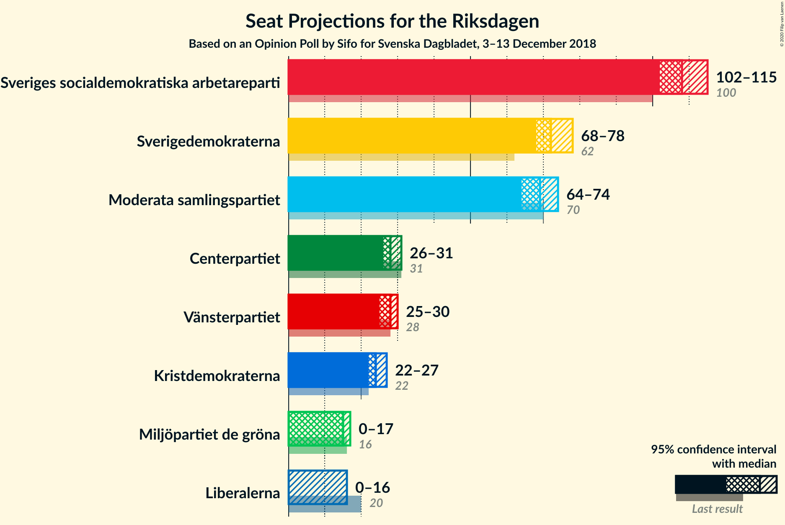
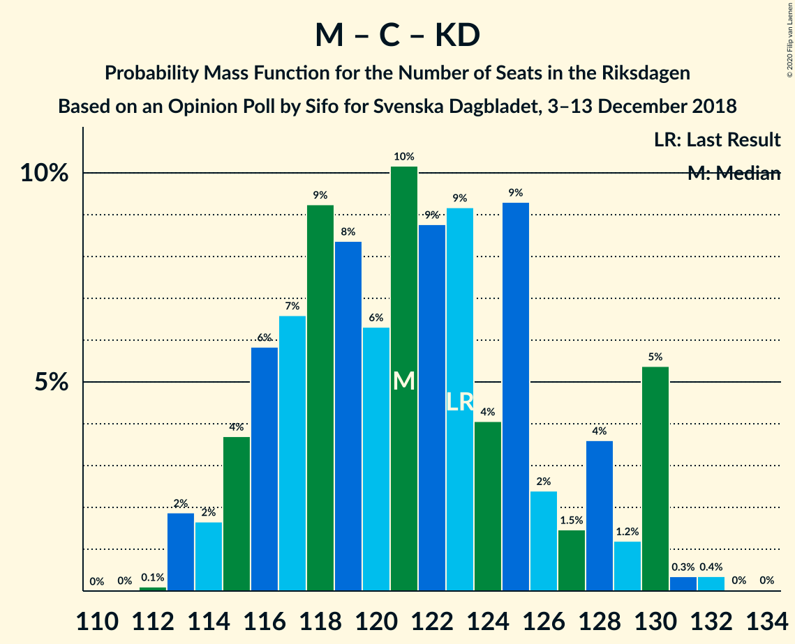

# Opinion Poll by Sifo for Svenska Dagbladet, 3–13 December 2018

<a href="#voting-intentions">Voting Intentions</a> | <a href="#seats">Seats</a> | <a href="#coalitions">Coalitions</a> | <a href="#technical-information">Technical Information</a>

## Voting Intentions

### Confidence Intervals

| Party | Last Result | Poll Result | 80% Confidence Interval | 90% Confidence Interval | 95% Confidence Interval | 99% Confidence Interval |
|:-----:|:-----------:|:-----------:|:-----------------------:|:-----------------------:|:-----------------------:|:-----------------------:|
| Sveriges socialdemokratiska arbetareparti | 28.3% | 29.7% | 29.1–30.3% |28.9–30.5% |28.7–30.7% |28.4–31.0% |
| Sverigedemokraterna | 17.5% | 20.0% | 19.4–20.6% |19.3–20.7% |19.2–20.9% |18.9–21.1% |
| Moderata samlingspartiet | 19.8% | 19.0% | 18.5–19.6% |18.3–19.7% |18.2–19.8% |17.9–20.1% |
| Centerpartiet | 8.6% | 7.7% | 7.3–8.1% |7.2–8.2% |7.1–8.3% |7.0–8.5% |
| Vänsterpartiet | 8.0% | 7.7% | 7.3–8.1% |7.2–8.2% |7.1–8.3% |7.0–8.5% |
| Kristdemokraterna | 6.3% | 6.6% | 6.3–7.0% |6.2–7.1% |6.1–7.1% |5.9–7.3% |
| Miljöpartiet de gröna | 4.4% | 4.2% | 3.9–4.5% |3.9–4.6% |3.8–4.6% |3.7–4.8% |
| Liberalerna | 5.5% | 4.0% | 3.7–4.3% |3.7–4.4% |3.6–4.4% |3.5–4.6% |

*Note:* The poll result column reflects the actual value used in the calculations. Published results may vary slightly, and in addition be rounded to fewer digits.

## Seats

### Confidence Intervals

| Party | Last Result | Median | 80% Confidence Interval | 90% Confidence Interval | 95% Confidence Interval | 99% Confidence Interval |
|:-----:|:-----------:|:------:|:-----------------------:|:-----------------------:|:-----------------------:|:-----------------------:|
| <a href="#sveriges-socialdemokratiska-arbetareparti">Sveriges socialdemokratiska arbetareparti</a> | 100 | 107 | 104–112 |102–112 |102–114 |100–116 |
| <a href="#sverigedemokraterna">Sverigedemokraterna</a> | 62 | 72 | 70–76 |69–78 |68–78 |67–80 |
| <a href="#moderata-samlingspartiet">Moderata samlingspartiet</a> | 70 | 68 | 66–72 |65–73 |64–74 |64–75 |
| <a href="#centerpartiet">Centerpartiet</a> | 31 | 28 | 26–30 |26–31 |25–31 |25–31 |
| <a href="#vänsterpartiet">Vänsterpartiet</a> | 28 | 27 | 25–30 |25–30 |25–30 |25–31 |
| <a href="#kristdemokraterna">Kristdemokraterna</a> | 22 | 24 | 22–25 |22–26 |22–26 |21–27 |
| <a href="#miljöpartiet-de-gröna">Miljöpartiet de gröna</a> | 16 | 15 | 0–16 |0–16 |0–17 |0–18 |
| <a href="#liberalerna">Liberalerna</a> | 20 | 14 | 0–15 |0–16 |0–16 |0–16 |

### Sveriges socialdemokratiska arbetareparti

*For a full overview of the results for this party, see the [Sveriges socialdemokratiska arbetareparti](party-sverigessocialdemokratiskaarbetareparti.html) page.*

| Number of Seats | Probability | Accumulated | Special Marks |
|:---------------:|:-----------:|:-----------:|:-------------:|
| 99 | 0.1% | 100% |  |
| 100 | 0.4% | 99.9% | Last Result |
| 101 | 1.2% | 99.5% |  |
| 102 | 5% | 98% |  |
| 103 | 3% | 93% |  |
| 104 | 12% | 90% |  |
| 105 | 15% | 78% |  |
| 106 | 12% | 63% |  |
| 107 | 13% | 51% | Median |
| 108 | 8% | 38% |  |
| 109 | 8% | 30% |  |
| 110 | 7% | 22% |  |
| 111 | 4% | 15% |  |
| 112 | 7% | 11% |  |
| 113 | 0.8% | 4% |  |
| 114 | 0.5% | 3% |  |
| 115 | 0.6% | 2% |  |
| 116 | 1.4% | 2% |  |
| 117 | 0.2% | 0.4% |  |
| 118 | 0.1% | 0.2% |  |
| 119 | 0.1% | 0.1% |  |
| 120 | 0% | 0% |  |

### Sverigedemokraterna

*For a full overview of the results for this party, see the [Sverigedemokraterna](party-sverigedemokraterna.html) page.*

| Number of Seats | Probability | Accumulated | Special Marks |
|:---------------:|:-----------:|:-----------:|:-------------:|
| 62 | 0% | 100% | Last Result |
| 63 | 0% | 100% |  |
| 64 | 0% | 100% |  |
| 65 | 0% | 100% |  |
| 66 | 0.1% | 100% |  |
| 67 | 0.8% | 99.8% |  |
| 68 | 2% | 99.1% |  |
| 69 | 7% | 97% |  |
| 70 | 10% | 90% |  |
| 71 | 21% | 80% |  |
| 72 | 19% | 59% | Median |
| 73 | 7% | 40% |  |
| 74 | 11% | 34% |  |
| 75 | 10% | 23% |  |
| 76 | 5% | 13% |  |
| 77 | 2% | 8% |  |
| 78 | 5% | 5% |  |
| 79 | 0.2% | 0.7% |  |
| 80 | 0.5% | 0.6% |  |
| 81 | 0% | 0.1% |  |
| 82 | 0% | 0% |  |

### Moderata samlingspartiet

*For a full overview of the results for this party, see the [Moderata samlingspartiet](party-moderatasamlingspartiet.html) page.*

| Number of Seats | Probability | Accumulated | Special Marks |
|:---------------:|:-----------:|:-----------:|:-------------:|
| 63 | 0.3% | 100% |  |
| 64 | 2% | 99.7% |  |
| 65 | 5% | 97% |  |
| 66 | 14% | 92% |  |
| 67 | 21% | 78% |  |
| 68 | 12% | 57% | Median |
| 69 | 14% | 45% |  |
| 70 | 12% | 32% | Last Result |
| 71 | 7% | 20% |  |
| 72 | 4% | 12% |  |
| 73 | 6% | 9% |  |
| 74 | 1.2% | 3% |  |
| 75 | 0.9% | 1.4% |  |
| 76 | 0.3% | 0.4% |  |
| 77 | 0.1% | 0.2% |  |
| 78 | 0% | 0% |  |

### Centerpartiet

*For a full overview of the results for this party, see the [Centerpartiet](party-centerpartiet.html) page.*

| Number of Seats | Probability | Accumulated | Special Marks |
|:---------------:|:-----------:|:-----------:|:-------------:|
| 24 | 0.2% | 100% |  |
| 25 | 3% | 99.8% |  |
| 26 | 20% | 96% |  |
| 27 | 15% | 76% |  |
| 28 | 37% | 62% | Median |
| 29 | 11% | 25% |  |
| 30 | 7% | 14% |  |
| 31 | 6% | 7% | Last Result |
| 32 | 0.2% | 0.2% |  |
| 33 | 0% | 0% |  |

### Vänsterpartiet

*For a full overview of the results for this party, see the [Vänsterpartiet](party-vänsterpartiet.html) page.*

| Number of Seats | Probability | Accumulated | Special Marks |
|:---------------:|:-----------:|:-----------:|:-------------:|
| 24 | 0.1% | 100% |  |
| 25 | 18% | 99.9% |  |
| 26 | 9% | 81% |  |
| 27 | 24% | 73% | Median |
| 28 | 11% | 49% | Last Result |
| 29 | 10% | 38% |  |
| 30 | 25% | 28% |  |
| 31 | 2% | 2% |  |
| 32 | 0.1% | 0.1% |  |
| 33 | 0% | 0% |  |

### Kristdemokraterna

*For a full overview of the results for this party, see the [Kristdemokraterna](party-kristdemokraterna.html) page.*

| Number of Seats | Probability | Accumulated | Special Marks |
|:---------------:|:-----------:|:-----------:|:-------------:|
| 21 | 1.1% | 100% |  |
| 22 | 17% | 98.9% | Last Result |
| 23 | 30% | 82% |  |
| 24 | 28% | 52% | Median |
| 25 | 16% | 24% |  |
| 26 | 7% | 8% |  |
| 27 | 1.3% | 1.4% |  |
| 28 | 0.1% | 0.1% |  |
| 29 | 0% | 0% |  |

### Miljöpartiet de gröna

*For a full overview of the results for this party, see the [Miljöpartiet de gröna](party-miljöpartietdegröna.html) page.*

| Number of Seats | Probability | Accumulated | Special Marks |
|:---------------:|:-----------:|:-----------:|:-------------:|
| 0 | 18% | 100% |  |
| 1 | 0% | 82% |  |
| 2 | 0% | 82% |  |
| 3 | 0% | 82% |  |
| 4 | 0% | 82% |  |
| 5 | 0% | 82% |  |
| 6 | 0% | 82% |  |
| 7 | 0% | 82% |  |
| 8 | 0% | 82% |  |
| 9 | 0% | 82% |  |
| 10 | 0% | 82% |  |
| 11 | 0% | 82% |  |
| 12 | 0% | 82% |  |
| 13 | 0% | 82% |  |
| 14 | 6% | 82% |  |
| 15 | 46% | 76% | Median |
| 16 | 26% | 30% | Last Result |
| 17 | 4% | 4% |  |
| 18 | 0.5% | 0.5% |  |
| 19 | 0% | 0% |  |

### Liberalerna

*For a full overview of the results for this party, see the [Liberalerna](party-liberalerna.html) page.*

| Number of Seats | Probability | Accumulated | Special Marks |
|:---------------:|:-----------:|:-----------:|:-------------:|
| 0 | 37% | 100% |  |
| 1 | 0% | 63% |  |
| 2 | 0% | 63% |  |
| 3 | 0% | 63% |  |
| 4 | 0% | 63% |  |
| 5 | 0% | 63% |  |
| 6 | 0% | 63% |  |
| 7 | 0% | 63% |  |
| 8 | 0% | 63% |  |
| 9 | 0% | 63% |  |
| 10 | 0% | 63% |  |
| 11 | 0% | 63% |  |
| 12 | 0% | 63% |  |
| 13 | 0% | 63% |  |
| 14 | 19% | 63% | Median |
| 15 | 38% | 44% |  |
| 16 | 5% | 5% |  |
| 17 | 0.2% | 0.2% |  |
| 18 | 0% | 0% |  |
| 19 | 0% | 0% |  |
| 20 | 0% | 0% | Last Result |

## Coalitions

### Confidence Intervals

| Coalition | Last Result | Median | Majority? | 80% Confidence Interval | 90% Confidence Interval | 95% Confidence Interval | 99% Confidence Interval |
|:---------:|:-----------:|:------:|:---------:|:-----------------------:|:-----------------------:|:-----------------------:|:-----------------------:|
| Sveriges socialdemokratiska arbetareparti – Moderata samlingspartiet – Centerpartiet | 201 | 202 | 100% | 197–210 | 196–216 | 195–216 | 194–220 |
| Sveriges socialdemokratiska arbetareparti – Moderata samlingspartiet | 170 | 174 | 48% | 170–182 | 169–185 | 169–187 | 167–190 |
| Sverigedemokraterna – Moderata samlingspartiet – Kristdemokraterna | 154 | 164 | 7% | 159–171 | 159–176 | 158–176 | 157–178 |
| Sveriges socialdemokratiska arbetareparti – Vänsterpartiet – Miljöpartiet de gröna | 144 | 147 | 0% | 140–154 | 137–155 | 136–156 | 134–157 |
| Sverigedemokraterna – Moderata samlingspartiet | 132 | 140 | 0% | 137–147 | 136–151 | 134–151 | 133–153 |
| Sveriges socialdemokratiska arbetareparti – Vänsterpartiet | 128 | 134 | 0% | 130–141 | 129–142 | 128–143 | 127–147 |
| Moderata samlingspartiet – Centerpartiet – Kristdemokraterna – Liberalerna | 143 | 131 | 0% | 121–136 | 120–137 | 120–140 | 118–141 |
| Moderata samlingspartiet – Centerpartiet – Kristdemokraterna | 123 | 120 | 0% | 115–125 | 114–129 | 113–129 | 113–131 |
| Sveriges socialdemokratiska arbetareparti – Miljöpartiet de gröna | 116 | 120 | 0% | 112–125 | 108–126 | 107–127 | 106–129 |
| Moderata samlingspartiet – Centerpartiet – Liberalerna | 121 | 108 | 0% | 97–112 | 97–113 | 96–116 | 94–117 |
| Moderata samlingspartiet – Centerpartiet | 101 | 96 | 0% | 93–101 | 91–104 | 90–104 | 90–106 |

### Sveriges socialdemokratiska arbetareparti – Moderata samlingspartiet – Centerpartiet

| Number of Seats | Probability | Accumulated | Special Marks |
|:---------------:|:-----------:|:-----------:|:-------------:|
| 193 | 0.2% | 100% |  |
| 194 | 0.5% | 99.7% |  |
| 195 | 2% | 99.3% |  |
| 196 | 2% | 97% |  |
| 197 | 11% | 95% |  |
| 198 | 7% | 84% |  |
| 199 | 15% | 77% |  |
| 200 | 5% | 61% |  |
| 201 | 5% | 56% | Last Result |
| 202 | 4% | 51% |  |
| 203 | 3% | 47% | Median |
| 204 | 2% | 45% |  |
| 205 | 5% | 42% |  |
| 206 | 7% | 37% |  |
| 207 | 7% | 30% |  |
| 208 | 6% | 23% |  |
| 209 | 5% | 16% |  |
| 210 | 2% | 11% |  |
| 211 | 0.5% | 9% |  |
| 212 | 0.3% | 9% |  |
| 213 | 0.2% | 8% |  |
| 214 | 0.2% | 8% |  |
| 215 | 0.5% | 8% |  |
| 216 | 5% | 7% |  |
| 217 | 0.2% | 2% |  |
| 218 | 0.7% | 2% |  |
| 219 | 0.4% | 1.0% |  |
| 220 | 0.5% | 0.7% |  |
| 221 | 0.1% | 0.2% |  |
| 222 | 0.1% | 0.1% |  |
| 223 | 0% | 0% |  |

### Sveriges socialdemokratiska arbetareparti – Moderata samlingspartiet

| Number of Seats | Probability | Accumulated | Special Marks |
|:---------------:|:-----------:|:-----------:|:-------------:|
| 166 | 0.3% | 100% |  |
| 167 | 0.3% | 99.7% |  |
| 168 | 2% | 99.4% |  |
| 169 | 4% | 98% |  |
| 170 | 5% | 93% | Last Result |
| 171 | 17% | 89% |  |
| 172 | 4% | 72% |  |
| 173 | 14% | 67% |  |
| 174 | 5% | 53% |  |
| 175 | 3% | 48% | Median, Majority |
| 176 | 5% | 45% |  |
| 177 | 8% | 40% |  |
| 178 | 3% | 32% |  |
| 179 | 10% | 29% |  |
| 180 | 4% | 19% |  |
| 181 | 4% | 15% |  |
| 182 | 2% | 11% |  |
| 183 | 0.5% | 9% |  |
| 184 | 0.3% | 8% |  |
| 185 | 4% | 8% |  |
| 186 | 0.7% | 4% |  |
| 187 | 1.2% | 3% |  |
| 188 | 0.2% | 2% |  |
| 189 | 0.3% | 1.4% |  |
| 190 | 0.6% | 1.0% |  |
| 191 | 0.2% | 0.5% |  |
| 192 | 0.2% | 0.2% |  |
| 193 | 0% | 0% |  |

### Sverigedemokraterna – Moderata samlingspartiet – Kristdemokraterna

| Number of Seats | Probability | Accumulated | Special Marks |
|:---------------:|:-----------:|:-----------:|:-------------:|
| 154 | 0% | 100% | Last Result |
| 155 | 0.1% | 100% |  |
| 156 | 0.3% | 99.9% |  |
| 157 | 1.1% | 99.6% |  |
| 158 | 3% | 98.5% |  |
| 159 | 5% | 95% |  |
| 160 | 13% | 90% |  |
| 161 | 14% | 77% |  |
| 162 | 11% | 63% |  |
| 163 | 2% | 52% |  |
| 164 | 5% | 50% | Median |
| 165 | 3% | 46% |  |
| 166 | 10% | 43% |  |
| 167 | 6% | 33% |  |
| 168 | 4% | 26% |  |
| 169 | 6% | 22% |  |
| 170 | 5% | 16% |  |
| 171 | 3% | 11% |  |
| 172 | 1.0% | 9% |  |
| 173 | 0.3% | 8% |  |
| 174 | 0.3% | 7% |  |
| 175 | 0.6% | 7% | Majority |
| 176 | 4% | 6% |  |
| 177 | 1.0% | 2% |  |
| 178 | 0.6% | 0.9% |  |
| 179 | 0.2% | 0.2% |  |
| 180 | 0% | 0.1% |  |
| 181 | 0% | 0% |  |

### Sveriges socialdemokratiska arbetareparti – Vänsterpartiet – Miljöpartiet de gröna

| Number of Seats | Probability | Accumulated | Special Marks |
|:---------------:|:-----------:|:-----------:|:-------------:|
| 133 | 0.2% | 100% |  |
| 134 | 2% | 99.8% |  |
| 135 | 0.1% | 98% |  |
| 136 | 0.7% | 98% |  |
| 137 | 5% | 97% |  |
| 138 | 0.4% | 92% |  |
| 139 | 0.9% | 92% |  |
| 140 | 1.2% | 91% |  |
| 141 | 0.4% | 90% |  |
| 142 | 6% | 89% |  |
| 143 | 3% | 83% |  |
| 144 | 3% | 81% | Last Result |
| 145 | 16% | 78% |  |
| 146 | 3% | 62% |  |
| 147 | 12% | 58% |  |
| 148 | 10% | 47% |  |
| 149 | 2% | 36% | Median |
| 150 | 7% | 34% |  |
| 151 | 3% | 27% |  |
| 152 | 5% | 24% |  |
| 153 | 5% | 19% |  |
| 154 | 4% | 14% |  |
| 155 | 6% | 10% |  |
| 156 | 3% | 4% |  |
| 157 | 0.7% | 1.0% |  |
| 158 | 0.2% | 0.3% |  |
| 159 | 0.1% | 0.1% |  |
| 160 | 0% | 0% |  |

### Sverigedemokraterna – Moderata samlingspartiet

| Number of Seats | Probability | Accumulated | Special Marks |
|:---------------:|:-----------:|:-----------:|:-------------:|
| 132 | 0.1% | 100% | Last Result |
| 133 | 0.6% | 99.8% |  |
| 134 | 2% | 99.3% |  |
| 135 | 1.3% | 97% |  |
| 136 | 5% | 96% |  |
| 137 | 7% | 91% |  |
| 138 | 32% | 84% |  |
| 139 | 2% | 53% |  |
| 140 | 8% | 50% | Median |
| 141 | 3% | 43% |  |
| 142 | 3% | 39% |  |
| 143 | 7% | 36% |  |
| 144 | 6% | 29% |  |
| 145 | 9% | 24% |  |
| 146 | 4% | 15% |  |
| 147 | 2% | 10% |  |
| 148 | 1.0% | 8% |  |
| 149 | 0.7% | 7% |  |
| 150 | 0.8% | 6% |  |
| 151 | 4% | 6% |  |
| 152 | 0.4% | 1.2% |  |
| 153 | 0.7% | 0.8% |  |
| 154 | 0% | 0.1% |  |
| 155 | 0% | 0.1% |  |
| 156 | 0% | 0% |  |

### Sveriges socialdemokratiska arbetareparti – Vänsterpartiet

| Number of Seats | Probability | Accumulated | Special Marks |
|:---------------:|:-----------:|:-----------:|:-------------:|
| 126 | 0.1% | 100% |  |
| 127 | 2% | 99.9% |  |
| 128 | 1.2% | 98% | Last Result |
| 129 | 2% | 96% |  |
| 130 | 12% | 94% |  |
| 131 | 14% | 82% |  |
| 132 | 4% | 68% |  |
| 133 | 11% | 65% |  |
| 134 | 8% | 53% | Median |
| 135 | 3% | 46% |  |
| 136 | 7% | 42% |  |
| 137 | 11% | 35% |  |
| 138 | 2% | 25% |  |
| 139 | 5% | 22% |  |
| 140 | 7% | 17% |  |
| 141 | 2% | 10% |  |
| 142 | 5% | 8% |  |
| 143 | 0.5% | 3% |  |
| 144 | 0.9% | 2% |  |
| 145 | 0.2% | 2% |  |
| 146 | 0.2% | 1.4% |  |
| 147 | 1.0% | 1.2% |  |
| 148 | 0.1% | 0.1% |  |
| 149 | 0% | 0% |  |

### Moderata samlingspartiet – Centerpartiet – Kristdemokraterna – Liberalerna

| Number of Seats | Probability | Accumulated | Special Marks |
|:---------------:|:-----------:|:-----------:|:-------------:|
| 117 | 0.3% | 100% |  |
| 118 | 1.3% | 99.7% |  |
| 119 | 0.8% | 98% |  |
| 120 | 6% | 98% |  |
| 121 | 3% | 92% |  |
| 122 | 5% | 89% |  |
| 123 | 6% | 84% |  |
| 124 | 4% | 78% |  |
| 125 | 2% | 74% |  |
| 126 | 0.8% | 71% |  |
| 127 | 1.3% | 71% |  |
| 128 | 7% | 69% |  |
| 129 | 5% | 62% |  |
| 130 | 7% | 58% |  |
| 131 | 14% | 51% |  |
| 132 | 11% | 37% |  |
| 133 | 5% | 26% |  |
| 134 | 6% | 21% | Median |
| 135 | 4% | 15% |  |
| 136 | 2% | 11% |  |
| 137 | 4% | 9% |  |
| 138 | 0.7% | 4% |  |
| 139 | 0.5% | 4% |  |
| 140 | 2% | 3% |  |
| 141 | 0.2% | 0.5% |  |
| 142 | 0.2% | 0.3% |  |
| 143 | 0.1% | 0.1% | Last Result |
| 144 | 0% | 0% |  |

### Moderata samlingspartiet – Centerpartiet – Kristdemokraterna

| Number of Seats | Probability | Accumulated | Special Marks |
|:---------------:|:-----------:|:-----------:|:-------------:|
| 112 | 0.1% | 100% |  |
| 113 | 4% | 99.9% |  |
| 114 | 3% | 96% |  |
| 115 | 7% | 93% |  |
| 116 | 9% | 87% |  |
| 117 | 7% | 77% |  |
| 118 | 13% | 70% |  |
| 119 | 5% | 57% |  |
| 120 | 12% | 52% | Median |
| 121 | 5% | 39% |  |
| 122 | 10% | 34% |  |
| 123 | 6% | 25% | Last Result |
| 124 | 6% | 18% |  |
| 125 | 3% | 12% |  |
| 126 | 1.1% | 9% |  |
| 127 | 1.2% | 8% |  |
| 128 | 0.6% | 7% |  |
| 129 | 4% | 6% |  |
| 130 | 0.2% | 2% |  |
| 131 | 1.1% | 1.4% |  |
| 132 | 0.2% | 0.3% |  |
| 133 | 0% | 0% |  |

### Sveriges socialdemokratiska arbetareparti – Miljöpartiet de gröna

| Number of Seats | Probability | Accumulated | Special Marks |
|:---------------:|:-----------:|:-----------:|:-------------:|
| 104 | 0% | 100% |  |
| 105 | 0.2% | 99.9% |  |
| 106 | 0.3% | 99.8% |  |
| 107 | 4% | 99.4% |  |
| 108 | 2% | 95% |  |
| 109 | 0.6% | 93% |  |
| 110 | 1.0% | 92% |  |
| 111 | 1.1% | 91% |  |
| 112 | 5% | 90% |  |
| 113 | 0.5% | 85% |  |
| 114 | 0.3% | 84% |  |
| 115 | 1.1% | 84% |  |
| 116 | 3% | 83% | Last Result |
| 117 | 2% | 80% |  |
| 118 | 6% | 78% |  |
| 119 | 5% | 72% |  |
| 120 | 24% | 67% |  |
| 121 | 8% | 43% |  |
| 122 | 4% | 35% | Median |
| 123 | 10% | 31% |  |
| 124 | 7% | 21% |  |
| 125 | 6% | 15% |  |
| 126 | 5% | 9% |  |
| 127 | 3% | 4% |  |
| 128 | 1.1% | 2% |  |
| 129 | 0.4% | 0.5% |  |
| 130 | 0.1% | 0.1% |  |
| 131 | 0% | 0% |  |

### Moderata samlingspartiet – Centerpartiet – Liberalerna

| Number of Seats | Probability | Accumulated | Special Marks |
|:---------------:|:-----------:|:-----------:|:-------------:|
| 93 | 0.2% | 100% |  |
| 94 | 0.7% | 99.8% |  |
| 95 | 1.0% | 99.1% |  |
| 96 | 3% | 98% |  |
| 97 | 10% | 95% |  |
| 98 | 3% | 85% |  |
| 99 | 6% | 82% |  |
| 100 | 3% | 77% |  |
| 101 | 3% | 73% |  |
| 102 | 0.9% | 71% |  |
| 103 | 0.9% | 70% |  |
| 104 | 5% | 69% |  |
| 105 | 4% | 63% |  |
| 106 | 4% | 60% |  |
| 107 | 3% | 56% |  |
| 108 | 23% | 53% |  |
| 109 | 5% | 30% |  |
| 110 | 9% | 26% | Median |
| 111 | 2% | 17% |  |
| 112 | 5% | 14% |  |
| 113 | 5% | 9% |  |
| 114 | 0.3% | 4% |  |
| 115 | 0.8% | 3% |  |
| 116 | 2% | 3% |  |
| 117 | 0.7% | 0.9% |  |
| 118 | 0.2% | 0.2% |  |
| 119 | 0% | 0% |  |
| 120 | 0% | 0% |  |
| 121 | 0% | 0% | Last Result |

### Moderata samlingspartiet – Centerpartiet

| Number of Seats | Probability | Accumulated | Special Marks |
|:---------------:|:-----------:|:-----------:|:-------------:|
| 89 | 0.1% | 100% |  |
| 90 | 4% | 99.9% |  |
| 91 | 1.5% | 96% |  |
| 92 | 4% | 95% |  |
| 93 | 15% | 91% |  |
| 94 | 14% | 76% |  |
| 95 | 9% | 62% |  |
| 96 | 6% | 53% | Median |
| 97 | 16% | 47% |  |
| 98 | 8% | 31% |  |
| 99 | 6% | 23% |  |
| 100 | 6% | 17% |  |
| 101 | 3% | 11% | Last Result |
| 102 | 2% | 8% |  |
| 103 | 0.8% | 7% |  |
| 104 | 5% | 6% |  |
| 105 | 0.2% | 0.9% |  |
| 106 | 0.6% | 0.7% |  |
| 107 | 0% | 0.1% |  |
| 108 | 0% | 0% |  |

## Technical Information

### Opinion Poll

+ **Polling firm:** Sifo
+ **Commissioner(s):** Svenska Dagbladet
+ **Fieldwork period:** 3–13 December 2018

### Calculations

+ **Sample size:** 8658
+ **Simulations done:** 262,144
+ **Error estimate:** 0.35%

