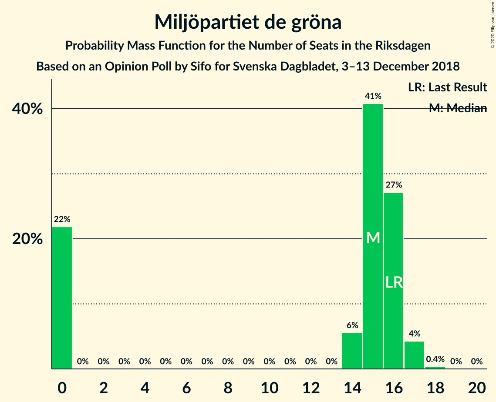

# Opinion Poll by Sifo for Svenska Dagbladet, 3–13 December 2018

<a href="#voting-intentions">Voting Intentions</a> | <a href="#seats">Seats</a> | <a href="#coalitions">Coalitions</a> | <a href="#technical-information">Technical Information</a>

## Voting Intentions

### Confidence Intervals

| Party | Last Result | Poll Result | 80% Confidence Interval | 90% Confidence Interval | 95% Confidence Interval | 99% Confidence Interval |
|:-----:|:-----------:|:-----------:|:-----------------------:|:-----------------------:|:-----------------------:|:-----------------------:|
| Sveriges socialdemokratiska arbetareparti | 28.3% | 29.7% | 29.1–30.3% |28.9–30.5% |28.7–30.7% |28.4–31.0% |
| Sverigedemokraterna | 17.5% | 20.0% | 19.4–20.6% |19.3–20.7% |19.2–20.9% |18.9–21.1% |
| Moderata samlingspartiet | 19.8% | 19.0% | 18.5–19.6% |18.3–19.7% |18.2–19.8% |17.9–20.1% |
| Centerpartiet | 8.6% | 7.7% | 7.3–8.1% |7.2–8.2% |7.1–8.3% |7.0–8.5% |
| Vänsterpartiet | 8.0% | 7.7% | 7.3–8.1% |7.2–8.2% |7.1–8.3% |7.0–8.5% |
| Kristdemokraterna | 6.3% | 6.6% | 6.3–7.0% |6.2–7.1% |6.1–7.1% |5.9–7.3% |
| Miljöpartiet de gröna | 4.4% | 4.2% | 3.9–4.5% |3.9–4.6% |3.8–4.6% |3.7–4.8% |
| Liberalerna | 5.5% | 4.0% | 3.7–4.3% |3.7–4.4% |3.6–4.4% |3.5–4.6% |

*Note:* The poll result column reflects the actual value used in the calculations. Published results may vary slightly, and in addition be rounded to fewer digits.

## Seats

### Confidence Intervals

| Party | Last Result | Median | 80% Confidence Interval | 90% Confidence Interval | 95% Confidence Interval | 99% Confidence Interval |
|:-----:|:-----------:|:------:|:-----------------------:|:-----------------------:|:-----------------------:|:-----------------------:|
| <a href="#sveriges-socialdemokratiska-arbetareparti">Sveriges socialdemokratiska arbetareparti</a> | 100 | 108 | 103–114 |102–115 |102–115 |101–118 |
| <a href="#sverigedemokraterna">Sverigedemokraterna</a> | 62 | 72 | 69–76 |69–77 |68–78 |67–80 |
| <a href="#moderata-samlingspartiet">Moderata samlingspartiet</a> | 70 | 69 | 66–73 |65–74 |64–74 |64–76 |
| <a href="#centerpartiet">Centerpartiet</a> | 31 | 28 | 26–30 |26–30 |26–31 |25–31 |
| <a href="#vänsterpartiet">Vänsterpartiet</a> | 28 | 28 | 26–30 |25–30 |25–30 |25–31 |
| <a href="#kristdemokraterna">Kristdemokraterna</a> | 22 | 24 | 22–26 |22–26 |22–27 |21–27 |
| <a href="#miljöpartiet-de-gröna">Miljöpartiet de gröna</a> | 16 | 15 | 0–16 |0–16 |0–17 |0–17 |
| <a href="#liberalerna">Liberalerna</a> | 20 | 0 | 0–15 |0–16 |0–16 |0–16 |

### Sveriges socialdemokratiska arbetareparti

*For a full overview of the results for this party, see the [Sveriges socialdemokratiska arbetareparti](party-sverigessocialdemokratiskaarbetareparti.html) page.*

| Number of Seats | Probability | Accumulated | Special Marks |
|:---------------:|:-----------:|:-----------:|:-------------:|
| 99 | 0.1% | 100% |  |
| 100 | 0.2% | 99.9% | Last Result |
| 101 | 1.2% | 99.7% |  |
| 102 | 4% | 98% |  |
| 103 | 5% | 94% |  |
| 104 | 9% | 89% |  |
| 105 | 10% | 81% |  |
| 106 | 8% | 71% |  |
| 107 | 9% | 63% |  |
| 108 | 13% | 53% | Median |
| 109 | 8% | 40% |  |
| 110 | 8% | 32% |  |
| 111 | 5% | 24% |  |
| 112 | 7% | 19% |  |
| 113 | 1.1% | 12% |  |
| 114 | 5% | 11% |  |
| 115 | 4% | 6% |  |
| 116 | 0.9% | 2% |  |
| 117 | 0.6% | 1.1% |  |
| 118 | 0.4% | 0.5% |  |
| 119 | 0.1% | 0.1% |  |
| 120 | 0% | 0% |  |

### Sverigedemokraterna

*For a full overview of the results for this party, see the [Sverigedemokraterna](party-sverigedemokraterna.html) page.*

| Number of Seats | Probability | Accumulated | Special Marks |
|:---------------:|:-----------:|:-----------:|:-------------:|
| 62 | 0% | 100% | Last Result |
| 63 | 0% | 100% |  |
| 64 | 0% | 100% |  |
| 65 | 0% | 100% |  |
| 66 | 0.1% | 100% |  |
| 67 | 1.0% | 99.8% |  |
| 68 | 2% | 98.8% |  |
| 69 | 7% | 97% |  |
| 70 | 11% | 90% |  |
| 71 | 17% | 78% |  |
| 72 | 14% | 62% | Median |
| 73 | 7% | 48% |  |
| 74 | 17% | 40% |  |
| 75 | 10% | 24% |  |
| 76 | 4% | 13% |  |
| 77 | 6% | 10% |  |
| 78 | 3% | 4% |  |
| 79 | 0.2% | 1.0% |  |
| 80 | 0.6% | 0.8% |  |
| 81 | 0.2% | 0.2% |  |
| 82 | 0% | 0% |  |

### Moderata samlingspartiet

*For a full overview of the results for this party, see the [Moderata samlingspartiet](party-moderatasamlingspartiet.html) page.*

| Number of Seats | Probability | Accumulated | Special Marks |
|:---------------:|:-----------:|:-----------:|:-------------:|
| 63 | 0.2% | 100% |  |
| 64 | 2% | 99.7% |  |
| 65 | 5% | 97% |  |
| 66 | 9% | 93% |  |
| 67 | 13% | 83% |  |
| 68 | 14% | 71% |  |
| 69 | 16% | 57% | Median |
| 70 | 11% | 41% | Last Result |
| 71 | 9% | 30% |  |
| 72 | 9% | 21% |  |
| 73 | 6% | 13% |  |
| 74 | 6% | 7% |  |
| 75 | 1.0% | 2% |  |
| 76 | 0.4% | 0.5% |  |
| 77 | 0.1% | 0.1% |  |
| 78 | 0% | 0% |  |

### Centerpartiet

*For a full overview of the results for this party, see the [Centerpartiet](party-centerpartiet.html) page.*

| Number of Seats | Probability | Accumulated | Special Marks |
|:---------------:|:-----------:|:-----------:|:-------------:|
| 24 | 0.1% | 100% |  |
| 25 | 2% | 99.9% |  |
| 26 | 12% | 98% |  |
| 27 | 19% | 86% |  |
| 28 | 29% | 67% | Median |
| 29 | 20% | 38% |  |
| 30 | 16% | 19% |  |
| 31 | 3% | 3% | Last Result |
| 32 | 0.3% | 0.4% |  |
| 33 | 0% | 0% |  |

### Vänsterpartiet

*For a full overview of the results for this party, see the [Vänsterpartiet](party-vänsterpartiet.html) page.*

| Number of Seats | Probability | Accumulated | Special Marks |
|:---------------:|:-----------:|:-----------:|:-------------:|
| 24 | 0.3% | 100% |  |
| 25 | 6% | 99.6% |  |
| 26 | 9% | 94% |  |
| 27 | 17% | 84% |  |
| 28 | 21% | 67% | Last Result, Median |
| 29 | 26% | 46% |  |
| 30 | 18% | 20% |  |
| 31 | 2% | 2% |  |
| 32 | 0.2% | 0.2% |  |
| 33 | 0% | 0% |  |

### Kristdemokraterna

*For a full overview of the results for this party, see the [Kristdemokraterna](party-kristdemokraterna.html) page.*

| Number of Seats | Probability | Accumulated | Special Marks |
|:---------------:|:-----------:|:-----------:|:-------------:|
| 20 | 0.1% | 100% |  |
| 21 | 1.2% | 99.9% |  |
| 22 | 9% | 98.7% | Last Result |
| 23 | 24% | 89% |  |
| 24 | 29% | 66% | Median |
| 25 | 23% | 36% |  |
| 26 | 11% | 14% |  |
| 27 | 3% | 3% |  |
| 28 | 0.1% | 0.1% |  |
| 29 | 0% | 0% |  |

### Miljöpartiet de gröna

*For a full overview of the results for this party, see the [Miljöpartiet de gröna](party-miljöpartietdegröna.html) page.*

| Number of Seats | Probability | Accumulated | Special Marks |
|:---------------:|:-----------:|:-----------:|:-------------:|
| 0 | 22% | 100% |  |
| 1 | 0% | 78% |  |
| 2 | 0% | 78% |  |
| 3 | 0% | 78% |  |
| 4 | 0% | 78% |  |
| 5 | 0% | 78% |  |
| 6 | 0% | 78% |  |
| 7 | 0% | 78% |  |
| 8 | 0% | 78% |  |
| 9 | 0% | 78% |  |
| 10 | 0% | 78% |  |
| 11 | 0% | 78% |  |
| 12 | 0% | 78% |  |
| 13 | 0% | 78% |  |
| 14 | 6% | 78% |  |
| 15 | 41% | 73% | Median |
| 16 | 27% | 32% | Last Result |
| 17 | 4% | 5% |  |
| 18 | 0.4% | 0.4% |  |
| 19 | 0% | 0% |  |

### Liberalerna

*For a full overview of the results for this party, see the [Liberalerna](party-liberalerna.html) page.*

| Number of Seats | Probability | Accumulated | Special Marks |
|:---------------:|:-----------:|:-----------:|:-------------:|
| 0 | 54% | 100% | Median |
| 1 | 0% | 46% |  |
| 2 | 0% | 46% |  |
| 3 | 0% | 46% |  |
| 4 | 0% | 46% |  |
| 5 | 0% | 46% |  |
| 6 | 0% | 46% |  |
| 7 | 0% | 46% |  |
| 8 | 0% | 46% |  |
| 9 | 0% | 46% |  |
| 10 | 0% | 46% |  |
| 11 | 0% | 46% |  |
| 12 | 0% | 46% |  |
| 13 | 0% | 46% |  |
| 14 | 13% | 46% |  |
| 15 | 28% | 33% |  |
| 16 | 5% | 5% |  |
| 17 | 0.2% | 0.2% |  |
| 18 | 0% | 0% |  |
| 19 | 0% | 0% |  |
| 20 | 0% | 0% | Last Result |

## Coalitions

### Confidence Intervals

| Coalition | Last Result | Median | Majority? | 80% Confidence Interval | 90% Confidence Interval | 95% Confidence Interval | 99% Confidence Interval |
|:---------:|:-----------:|:------:|:---------:|:-----------------------:|:-----------------------:|:-----------------------:|:-----------------------:|
| Sveriges socialdemokratiska arbetareparti – Moderata samlingspartiet – Centerpartiet | 201 | 205 | 100% | 197–216 | 196–218 | 196–218 | 194–221 |
| Sveriges socialdemokratiska arbetareparti – Centerpartiet – Vänsterpartiet – Miljöpartiet de gröna – Liberalerna | 195 | 183 | 89% | 174–190 | 174–191 | 173–191 | 170–193 |
| Sveriges socialdemokratiska arbetareparti – Moderata samlingspartiet | 170 | 177 | 63% | 170–187 | 169–188 | 169–188 | 167–191 |
| Sverigedemokraterna – Moderata samlingspartiet – Kristdemokraterna | 154 | 166 | 11% | 159–175 | 158–175 | 158–176 | 156–179 |
| Sveriges socialdemokratiska arbetareparti – Centerpartiet – Miljöpartiet de gröna – Liberalerna | 167 | 154 | 0% | 145–163 | 144–163 | 143–164 | 141–166 |
| Sveriges socialdemokratiska arbetareparti – Vänsterpartiet – Miljöpartiet de gröna | 144 | 148 | 0% | 142–155 | 138–156 | 137–157 | 134–157 |
| Sverigedemokraterna – Moderata samlingspartiet | 132 | 142 | 0% | 136–149 | 135–150 | 134–151 | 133–153 |
| Sveriges socialdemokratiska arbetareparti – Vänsterpartiet | 128 | 136 | 0% | 130–144 | 129–144 | 129–145 | 127–147 |
| Moderata samlingspartiet – Centerpartiet – Kristdemokraterna – Liberalerna | 143 | 129 | 0% | 121–135 | 120–137 | 119–139 | 118–141 |
| Moderata samlingspartiet – Centerpartiet – Kristdemokraterna | 123 | 121 | 0% | 116–128 | 115–130 | 114–130 | 113–131 |
| Sveriges socialdemokratiska arbetareparti – Miljöpartiet de gröna | 116 | 121 | 0% | 112–126 | 110–127 | 108–128 | 106–129 |
| Moderata samlingspartiet – Centerpartiet – Liberalerna | 121 | 104 | 0% | 97–111 | 96–113 | 95–114 | 94–116 |
| Moderata samlingspartiet – Centerpartiet | 101 | 97 | 0% | 93–103 | 92–104 | 91–104 | 90–106 |

### Sveriges socialdemokratiska arbetareparti – Moderata samlingspartiet – Centerpartiet

| Number of Seats | Probability | Accumulated | Special Marks |
|:---------------:|:-----------:|:-----------:|:-------------:|
| 193 | 0.2% | 100% |  |
| 194 | 0.5% | 99.8% |  |
| 195 | 2% | 99.3% |  |
| 196 | 3% | 98% |  |
| 197 | 8% | 95% |  |
| 198 | 4% | 87% |  |
| 199 | 9% | 83% |  |
| 200 | 7% | 74% |  |
| 201 | 3% | 67% | Last Result |
| 202 | 2% | 64% |  |
| 203 | 2% | 62% |  |
| 204 | 2% | 60% |  |
| 205 | 9% | 58% | Median |
| 206 | 6% | 49% |  |
| 207 | 8% | 42% |  |
| 208 | 6% | 34% |  |
| 209 | 9% | 28% |  |
| 210 | 4% | 19% |  |
| 211 | 1.4% | 15% |  |
| 212 | 0.3% | 14% |  |
| 213 | 0.2% | 14% |  |
| 214 | 0.3% | 13% |  |
| 215 | 2% | 13% |  |
| 216 | 2% | 11% |  |
| 217 | 0.8% | 10% |  |
| 218 | 8% | 9% |  |
| 219 | 0.4% | 1.5% |  |
| 220 | 0.4% | 1.1% |  |
| 221 | 0.6% | 0.7% |  |
| 222 | 0.1% | 0.1% |  |
| 223 | 0% | 0% |  |

### Sveriges socialdemokratiska arbetareparti – Centerpartiet – Vänsterpartiet – Miljöpartiet de gröna – Liberalerna

| Number of Seats | Probability | Accumulated | Special Marks |
|:---------------:|:-----------:|:-----------:|:-------------:|
| 169 | 0.3% | 100% |  |
| 170 | 1.1% | 99.7% |  |
| 171 | 0.3% | 98.6% |  |
| 172 | 0.4% | 98% |  |
| 173 | 2% | 98% |  |
| 174 | 8% | 96% |  |
| 175 | 1.1% | 89% | Majority |
| 176 | 0.8% | 88% |  |
| 177 | 0.7% | 87% |  |
| 178 | 2% | 86% |  |
| 179 | 6% | 84% | Median |
| 180 | 6% | 77% |  |
| 181 | 9% | 71% |  |
| 182 | 9% | 62% |  |
| 183 | 7% | 53% |  |
| 184 | 4% | 45% |  |
| 185 | 4% | 41% |  |
| 186 | 3% | 37% |  |
| 187 | 4% | 33% |  |
| 188 | 9% | 29% |  |
| 189 | 9% | 20% |  |
| 190 | 6% | 12% |  |
| 191 | 4% | 6% |  |
| 192 | 2% | 2% |  |
| 193 | 0.4% | 0.6% |  |
| 194 | 0.2% | 0.2% |  |
| 195 | 0% | 0% | Last Result |

### Sveriges socialdemokratiska arbetareparti – Moderata samlingspartiet

| Number of Seats | Probability | Accumulated | Special Marks |
|:---------------:|:-----------:|:-----------:|:-------------:|
| 165 | 0.1% | 100% |  |
| 166 | 0.2% | 99.9% |  |
| 167 | 0.5% | 99.8% |  |
| 168 | 2% | 99.3% |  |
| 169 | 4% | 98% |  |
| 170 | 5% | 93% | Last Result |
| 171 | 10% | 89% |  |
| 172 | 7% | 78% |  |
| 173 | 6% | 72% |  |
| 174 | 3% | 65% |  |
| 175 | 2% | 63% | Majority |
| 176 | 6% | 61% |  |
| 177 | 8% | 54% | Median |
| 178 | 5% | 46% |  |
| 179 | 7% | 41% |  |
| 180 | 10% | 34% |  |
| 181 | 6% | 24% |  |
| 182 | 4% | 18% |  |
| 183 | 0.9% | 14% |  |
| 184 | 0.2% | 14% |  |
| 185 | 1.5% | 13% |  |
| 186 | 2% | 12% |  |
| 187 | 1.0% | 10% |  |
| 188 | 7% | 9% |  |
| 189 | 0.3% | 2% |  |
| 190 | 0.6% | 1.5% |  |
| 191 | 0.7% | 0.9% |  |
| 192 | 0.2% | 0.2% |  |
| 193 | 0% | 0% |  |

### Sverigedemokraterna – Moderata samlingspartiet – Kristdemokraterna

| Number of Seats | Probability | Accumulated | Special Marks |
|:---------------:|:-----------:|:-----------:|:-------------:|
| 154 | 0% | 100% | Last Result |
| 155 | 0.2% | 100% |  |
| 156 | 0.4% | 99.8% |  |
| 157 | 2% | 99.4% |  |
| 158 | 4% | 98% |  |
| 159 | 6% | 94% |  |
| 160 | 9% | 88% |  |
| 161 | 9% | 80% |  |
| 162 | 4% | 71% |  |
| 163 | 3% | 67% |  |
| 164 | 4% | 63% |  |
| 165 | 4% | 59% | Median |
| 166 | 7% | 55% |  |
| 167 | 9% | 47% |  |
| 168 | 9% | 38% |  |
| 169 | 6% | 29% |  |
| 170 | 6% | 23% |  |
| 171 | 2% | 16% |  |
| 172 | 0.7% | 14% |  |
| 173 | 0.8% | 13% |  |
| 174 | 1.1% | 12% |  |
| 175 | 8% | 11% | Majority |
| 176 | 2% | 4% |  |
| 177 | 0.4% | 2% |  |
| 178 | 0.3% | 2% |  |
| 179 | 1.1% | 1.4% |  |
| 180 | 0.3% | 0.3% |  |
| 181 | 0% | 0% |  |

### Sveriges socialdemokratiska arbetareparti – Centerpartiet – Miljöpartiet de gröna – Liberalerna

| Number of Seats | Probability | Accumulated | Special Marks |
|:---------------:|:-----------:|:-----------:|:-------------:|
| 139 | 0.1% | 100% |  |
| 140 | 0.3% | 99.9% |  |
| 141 | 1.2% | 99.6% |  |
| 142 | 0.3% | 98% |  |
| 143 | 2% | 98% |  |
| 144 | 5% | 97% |  |
| 145 | 4% | 92% |  |
| 146 | 1.3% | 88% |  |
| 147 | 0.4% | 87% |  |
| 148 | 0.4% | 87% |  |
| 149 | 2% | 86% |  |
| 150 | 5% | 85% |  |
| 151 | 4% | 80% | Median |
| 152 | 12% | 75% |  |
| 153 | 7% | 64% |  |
| 154 | 10% | 57% |  |
| 155 | 4% | 47% |  |
| 156 | 4% | 43% |  |
| 157 | 2% | 39% |  |
| 158 | 2% | 38% |  |
| 159 | 3% | 36% |  |
| 160 | 4% | 33% |  |
| 161 | 7% | 29% |  |
| 162 | 9% | 22% |  |
| 163 | 9% | 14% |  |
| 164 | 2% | 5% |  |
| 165 | 2% | 2% |  |
| 166 | 0.5% | 0.6% |  |
| 167 | 0.1% | 0.1% | Last Result |
| 168 | 0% | 0% |  |

### Sveriges socialdemokratiska arbetareparti – Vänsterpartiet – Miljöpartiet de gröna

| Number of Seats | Probability | Accumulated | Special Marks |
|:---------------:|:-----------:|:-----------:|:-------------:|
| 133 | 0.1% | 100% |  |
| 134 | 0.6% | 99.9% |  |
| 135 | 0.5% | 99.3% |  |
| 136 | 1.1% | 98.8% |  |
| 137 | 2% | 98% |  |
| 138 | 0.5% | 96% |  |
| 139 | 1.1% | 95% |  |
| 140 | 2% | 94% |  |
| 141 | 1.4% | 92% |  |
| 142 | 2% | 90% |  |
| 143 | 1.4% | 88% |  |
| 144 | 10% | 87% | Last Result |
| 145 | 9% | 77% |  |
| 146 | 7% | 68% |  |
| 147 | 9% | 61% |  |
| 148 | 5% | 52% |  |
| 149 | 4% | 47% |  |
| 150 | 7% | 43% |  |
| 151 | 3% | 36% | Median |
| 152 | 9% | 33% |  |
| 153 | 6% | 24% |  |
| 154 | 7% | 18% |  |
| 155 | 5% | 11% |  |
| 156 | 3% | 5% |  |
| 157 | 2% | 3% |  |
| 158 | 0.2% | 0.3% |  |
| 159 | 0.1% | 0.2% |  |
| 160 | 0% | 0% |  |

### Sverigedemokraterna – Moderata samlingspartiet

| Number of Seats | Probability | Accumulated | Special Marks |
|:---------------:|:-----------:|:-----------:|:-------------:|
| 132 | 0.1% | 100% | Last Result |
| 133 | 0.6% | 99.9% |  |
| 134 | 2% | 99.2% |  |
| 135 | 2% | 97% |  |
| 136 | 8% | 95% |  |
| 137 | 7% | 87% |  |
| 138 | 12% | 80% |  |
| 139 | 3% | 68% |  |
| 140 | 6% | 64% |  |
| 141 | 6% | 58% | Median |
| 142 | 8% | 52% |  |
| 143 | 10% | 44% |  |
| 144 | 8% | 34% |  |
| 145 | 5% | 26% |  |
| 146 | 6% | 21% |  |
| 147 | 1.2% | 15% |  |
| 148 | 1.1% | 14% |  |
| 149 | 6% | 13% |  |
| 150 | 3% | 7% |  |
| 151 | 1.3% | 4% |  |
| 152 | 2% | 2% |  |
| 153 | 0.2% | 0.7% |  |
| 154 | 0.4% | 0.5% |  |
| 155 | 0.1% | 0.1% |  |
| 156 | 0% | 0% |  |

### Sveriges socialdemokratiska arbetareparti – Vänsterpartiet

| Number of Seats | Probability | Accumulated | Special Marks |
|:---------------:|:-----------:|:-----------:|:-------------:|
| 126 | 0.1% | 100% |  |
| 127 | 0.8% | 99.9% |  |
| 128 | 2% | 99.1% | Last Result |
| 129 | 3% | 98% |  |
| 130 | 7% | 95% |  |
| 131 | 8% | 88% |  |
| 132 | 7% | 80% |  |
| 133 | 5% | 73% |  |
| 134 | 6% | 67% |  |
| 135 | 6% | 62% |  |
| 136 | 9% | 55% | Median |
| 137 | 9% | 46% |  |
| 138 | 7% | 37% |  |
| 139 | 7% | 30% |  |
| 140 | 6% | 23% |  |
| 141 | 4% | 18% |  |
| 142 | 2% | 13% |  |
| 143 | 0.4% | 11% |  |
| 144 | 8% | 11% |  |
| 145 | 1.3% | 3% |  |
| 146 | 0.4% | 1.4% |  |
| 147 | 0.5% | 1.0% |  |
| 148 | 0.4% | 0.5% |  |
| 149 | 0.1% | 0.1% |  |
| 150 | 0% | 0% |  |

### Moderata samlingspartiet – Centerpartiet – Kristdemokraterna – Liberalerna

| Number of Seats | Probability | Accumulated | Special Marks |
|:---------------:|:-----------:|:-----------:|:-------------:|
| 117 | 0.2% | 100% |  |
| 118 | 1.1% | 99.8% |  |
| 119 | 2% | 98.7% |  |
| 120 | 2% | 97% |  |
| 121 | 8% | 95% | Median |
| 122 | 6% | 86% |  |
| 123 | 8% | 80% |  |
| 124 | 3% | 72% |  |
| 125 | 9% | 69% |  |
| 126 | 2% | 61% |  |
| 127 | 2% | 59% |  |
| 128 | 6% | 57% |  |
| 129 | 3% | 51% |  |
| 130 | 9% | 48% |  |
| 131 | 7% | 40% |  |
| 132 | 10% | 32% |  |
| 133 | 5% | 23% |  |
| 134 | 6% | 17% |  |
| 135 | 3% | 12% |  |
| 136 | 2% | 8% |  |
| 137 | 3% | 7% |  |
| 138 | 0.7% | 4% |  |
| 139 | 1.2% | 3% |  |
| 140 | 0.8% | 2% |  |
| 141 | 0.7% | 0.9% |  |
| 142 | 0.1% | 0.1% |  |
| 143 | 0% | 0% | Last Result |

### Moderata samlingspartiet – Centerpartiet – Kristdemokraterna

| Number of Seats | Probability | Accumulated | Special Marks |
|:---------------:|:-----------:|:-----------:|:-------------:|
| 112 | 0.1% | 100% |  |
| 113 | 2% | 99.9% |  |
| 114 | 2% | 98% |  |
| 115 | 4% | 96% |  |
| 116 | 6% | 93% |  |
| 117 | 7% | 87% |  |
| 118 | 9% | 80% |  |
| 119 | 8% | 71% |  |
| 120 | 6% | 63% |  |
| 121 | 10% | 56% | Median |
| 122 | 9% | 46% |  |
| 123 | 9% | 37% | Last Result |
| 124 | 4% | 28% |  |
| 125 | 9% | 24% |  |
| 126 | 2% | 15% |  |
| 127 | 1.5% | 12% |  |
| 128 | 4% | 11% |  |
| 129 | 1.2% | 7% |  |
| 130 | 5% | 6% |  |
| 131 | 0.3% | 0.8% |  |
| 132 | 0.4% | 0.4% |  |
| 133 | 0% | 0.1% |  |
| 134 | 0% | 0% |  |

### Sveriges socialdemokratiska arbetareparti – Miljöpartiet de gröna

| Number of Seats | Probability | Accumulated | Special Marks |
|:---------------:|:-----------:|:-----------:|:-------------:|
| 105 | 0.2% | 100% |  |
| 106 | 0.3% | 99.8% |  |
| 107 | 2% | 99.4% |  |
| 108 | 2% | 98% |  |
| 109 | 0.5% | 96% |  |
| 110 | 2% | 96% |  |
| 111 | 2% | 94% |  |
| 112 | 2% | 92% |  |
| 113 | 0.4% | 89% |  |
| 114 | 5% | 89% |  |
| 115 | 4% | 84% |  |
| 116 | 2% | 80% | Last Result |
| 117 | 3% | 78% |  |
| 118 | 7% | 75% |  |
| 119 | 7% | 68% |  |
| 120 | 11% | 61% |  |
| 121 | 6% | 50% |  |
| 122 | 7% | 44% |  |
| 123 | 10% | 38% | Median |
| 124 | 8% | 28% |  |
| 125 | 7% | 19% |  |
| 126 | 4% | 12% |  |
| 127 | 5% | 8% |  |
| 128 | 2% | 3% |  |
| 129 | 0.4% | 0.5% |  |
| 130 | 0.1% | 0.1% |  |
| 131 | 0% | 0% |  |

### Moderata samlingspartiet – Centerpartiet – Liberalerna

| Number of Seats | Probability | Accumulated | Special Marks |
|:---------------:|:-----------:|:-----------:|:-------------:|
| 93 | 0.2% | 100% |  |
| 94 | 1.3% | 99.8% |  |
| 95 | 1.2% | 98.5% |  |
| 96 | 4% | 97% |  |
| 97 | 11% | 93% | Median |
| 98 | 6% | 82% |  |
| 99 | 6% | 76% |  |
| 100 | 5% | 70% |  |
| 101 | 6% | 65% |  |
| 102 | 0.8% | 59% |  |
| 103 | 5% | 58% |  |
| 104 | 5% | 53% |  |
| 105 | 2% | 47% |  |
| 106 | 4% | 46% |  |
| 107 | 2% | 42% |  |
| 108 | 10% | 40% |  |
| 109 | 8% | 29% |  |
| 110 | 6% | 21% |  |
| 111 | 5% | 15% |  |
| 112 | 4% | 10% |  |
| 113 | 3% | 6% |  |
| 114 | 0.7% | 3% |  |
| 115 | 1.0% | 2% |  |
| 116 | 1.0% | 1.4% |  |
| 117 | 0.3% | 0.4% |  |
| 118 | 0.1% | 0.1% |  |
| 119 | 0% | 0% |  |
| 120 | 0% | 0% |  |
| 121 | 0% | 0% | Last Result |

### Moderata samlingspartiet – Centerpartiet

| Number of Seats | Probability | Accumulated | Special Marks |
|:---------------:|:-----------:|:-----------:|:-------------:|
| 89 | 0.1% | 100% |  |
| 90 | 1.1% | 99.8% |  |
| 91 | 2% | 98.8% |  |
| 92 | 3% | 97% |  |
| 93 | 8% | 94% |  |
| 94 | 11% | 86% |  |
| 95 | 8% | 75% |  |
| 96 | 10% | 67% |  |
| 97 | 16% | 57% | Median |
| 98 | 9% | 41% |  |
| 99 | 7% | 32% |  |
| 100 | 6% | 26% |  |
| 101 | 7% | 19% | Last Result |
| 102 | 1.1% | 13% |  |
| 103 | 5% | 12% |  |
| 104 | 5% | 6% |  |
| 105 | 0.7% | 1.3% |  |
| 106 | 0.5% | 0.6% |  |
| 107 | 0.1% | 0.1% |  |
| 108 | 0% | 0% |  |

## Technical Information

### Opinion Poll

+ **Polling firm:** Sifo
+ **Commissioner(s):** Svenska Dagbladet
+ **Fieldwork period:** 3–13 December 2018

### Calculations

+ **Sample size:** 8658
+ **Simulations done:** 1,048,576
+ **Error estimate:** 0.56%

