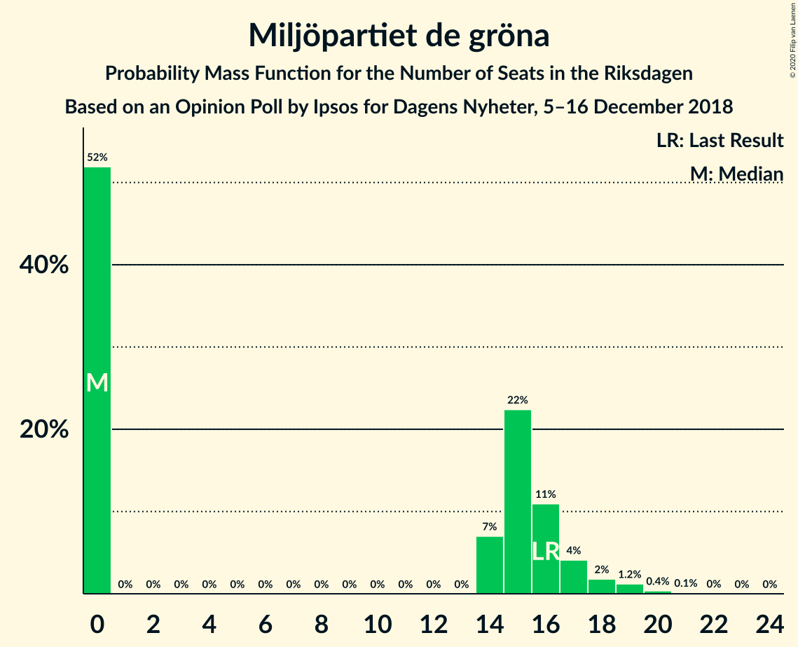
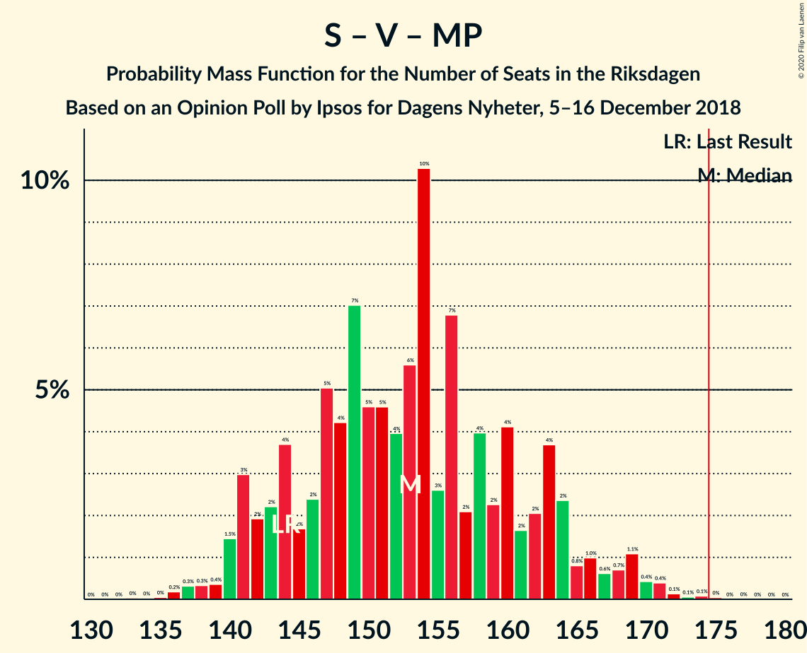

# Opinion Poll by Ipsos for Dagens Nyheter, 5–16 December 2018

<a href="#voting-intentions">Voting Intentions</a> | <a href="#seats">Seats</a> | <a href="#coalitions">Coalitions</a> | <a href="#technical-information">Technical Information</a>

## Voting Intentions

### Confidence Intervals

| Party | Last Result | Poll Result | 80% Confidence Interval | 90% Confidence Interval | 95% Confidence Interval | 99% Confidence Interval |
|:-----:|:-----------:|:-----------:|:-----------------------:|:-----------------------:|:-----------------------:|:-----------------------:|
| Sveriges socialdemokratiska arbetareparti | 28.3% | 32.0% | 30.5–33.6% |30.1–34.0% |29.7–34.4% |29.0–35.1% |
| Moderata samlingspartiet | 19.8% | 18.0% | 16.8–19.3% |16.5–19.7% |16.2–20.0% |15.6–20.7% |
| Sverigedemokraterna | 17.5% | 18.0% | 16.8–19.3% |16.5–19.7% |16.2–20.0% |15.6–20.7% |
| Vänsterpartiet | 8.0% | 8.0% | 7.2–9.0% |6.9–9.2% |6.7–9.5% |6.4–10.0% |
| Kristdemokraterna | 6.3% | 8.0% | 7.2–9.0% |6.9–9.2% |6.7–9.5% |6.4–10.0% |
| Centerpartiet | 8.6% | 7.0% | 6.2–7.9% |6.0–8.2% |5.9–8.4% |5.5–8.9% |
| Liberalerna | 5.5% | 4.0% | 3.4–4.7% |3.2–4.9% |3.1–5.1% |2.9–5.4% |
| Miljöpartiet de gröna | 4.4% | 4.0% | 3.4–4.7% |3.2–4.9% |3.1–5.1% |2.9–5.4% |

*Note:* The poll result column reflects the actual value used in the calculations. Published results may vary slightly, and in addition be rounded to fewer digits.

## Seats

### Confidence Intervals

| Party | Last Result | Median | 80% Confidence Interval | 90% Confidence Interval | 95% Confidence Interval | 99% Confidence Interval |
|:-----:|:-----------:|:------:|:-----------------------:|:-----------------------:|:-----------------------:|:-----------------------:|
| <a href="#sveriges-socialdemokratiska-arbetareparti">Sveriges socialdemokratiska arbetareparti</a> | 100 | 106 | 105–113 |105–119 |105–128 |105–128 |
| <a href="#moderata-samlingspartiet">Moderata samlingspartiet</a> | 70 | 67 | 63–71 |56–71 |56–71 |56–76 |
| <a href="#sverigedemokraterna">Sverigedemokraterna</a> | 62 | 60 | 60–66 |60–69 |60–74 |60–74 |
| <a href="#vänsterpartiet">Vänsterpartiet</a> | 28 | 29 | 24–29 |24–29 |23–31 |23–38 |
| <a href="#kristdemokraterna">Kristdemokraterna</a> | 22 | 29 | 27–33 |27–36 |27–36 |27–36 |
| <a href="#centerpartiet">Centerpartiet</a> | 31 | 26 | 25–27 |25–27 |24–27 |23–27 |
| <a href="#liberalerna">Liberalerna</a> | 20 | 19 | 15–19 |0–19 |0–19 |0–19 |
| <a href="#miljöpartiet-de-gröna">Miljöpartiet de gröna</a> | 16 | 15 | 0–15 |0–16 |0–16 |0–16 |

### Sveriges socialdemokratiska arbetareparti

*For a full overview of the results for this party, see the [Sveriges socialdemokratiska arbetareparti](party-sverigessocialdemokratiskaarbetareparti.html) page.*

| Number of Seats | Probability | Accumulated | Special Marks |
|:---------------:|:-----------:|:-----------:|:-------------:|
| 100 | 0% | 100% | Last Result |
| 101 | 0% | 100% |  |
| 102 | 0% | 100% |  |
| 103 | 0% | 100% |  |
| 104 | 0% | 100% |  |
| 105 | 11% | 100% |  |
| 106 | 41% | 89% | Median |
| 107 | 1.0% | 48% |  |
| 108 | 0.1% | 47% |  |
| 109 | 0% | 47% |  |
| 110 | 0.1% | 47% |  |
| 111 | 2% | 47% |  |
| 112 | 0% | 45% |  |
| 113 | 35% | 45% |  |
| 114 | 0.1% | 10% |  |
| 115 | 0% | 10% |  |
| 116 | 0% | 10% |  |
| 117 | 0% | 10% |  |
| 118 | 0% | 10% |  |
| 119 | 6% | 10% |  |
| 120 | 0% | 4% |  |
| 121 | 0% | 4% |  |
| 122 | 0% | 4% |  |
| 123 | 0.4% | 4% |  |
| 124 | 0% | 3% |  |
| 125 | 0% | 3% |  |
| 126 | 0% | 3% |  |
| 127 | 0% | 3% |  |
| 128 | 3% | 3% |  |
| 129 | 0% | 0% |  |

### Moderata samlingspartiet

*For a full overview of the results for this party, see the [Moderata samlingspartiet](party-moderatasamlingspartiet.html) page.*

| Number of Seats | Probability | Accumulated | Special Marks |
|:---------------:|:-----------:|:-----------:|:-------------:|
| 53 | 0% | 100% |  |
| 54 | 0% | 99.9% |  |
| 55 | 0% | 99.9% |  |
| 56 | 6% | 99.9% |  |
| 57 | 0% | 94% |  |
| 58 | 0% | 94% |  |
| 59 | 0% | 94% |  |
| 60 | 0% | 94% |  |
| 61 | 0.1% | 94% |  |
| 62 | 0% | 94% |  |
| 63 | 11% | 94% |  |
| 64 | 3% | 83% |  |
| 65 | 0% | 80% |  |
| 66 | 0% | 80% |  |
| 67 | 41% | 80% | Median |
| 68 | 0% | 39% |  |
| 69 | 0.4% | 39% |  |
| 70 | 1.0% | 38% | Last Result |
| 71 | 35% | 37% |  |
| 72 | 0% | 2% |  |
| 73 | 0% | 2% |  |
| 74 | 0% | 2% |  |
| 75 | 0.1% | 2% |  |
| 76 | 2% | 2% |  |
| 77 | 0% | 0.1% |  |
| 78 | 0% | 0.1% |  |
| 79 | 0% | 0.1% |  |
| 80 | 0% | 0.1% |  |
| 81 | 0.1% | 0.1% |  |
| 82 | 0% | 0% |  |

### Sverigedemokraterna

*For a full overview of the results for this party, see the [Sverigedemokraterna](party-sverigedemokraterna.html) page.*

| Number of Seats | Probability | Accumulated | Special Marks |
|:---------------:|:-----------:|:-----------:|:-------------:|
| 60 | 52% | 100% | Median |
| 61 | 1.0% | 48% |  |
| 62 | 0.1% | 47% | Last Result |
| 63 | 2% | 47% |  |
| 64 | 0% | 45% |  |
| 65 | 0.1% | 45% |  |
| 66 | 35% | 45% |  |
| 67 | 0% | 10% |  |
| 68 | 0% | 10% |  |
| 69 | 6% | 10% |  |
| 70 | 0% | 4% |  |
| 71 | 0.4% | 4% |  |
| 72 | 0% | 3% |  |
| 73 | 0% | 3% |  |
| 74 | 3% | 3% |  |
| 75 | 0% | 0% |  |

### Vänsterpartiet

*For a full overview of the results for this party, see the [Vänsterpartiet](party-vänsterpartiet.html) page.*

| Number of Seats | Probability | Accumulated | Special Marks |
|:---------------:|:-----------:|:-----------:|:-------------:|
| 23 | 3% | 100% |  |
| 24 | 35% | 97% |  |
| 25 | 0% | 62% |  |
| 26 | 0% | 62% |  |
| 27 | 0% | 62% |  |
| 28 | 6% | 62% | Last Result |
| 29 | 52% | 56% | Median |
| 30 | 0.4% | 4% |  |
| 31 | 2% | 3% |  |
| 32 | 0.3% | 2% |  |
| 33 | 0% | 1.3% |  |
| 34 | 0% | 1.3% |  |
| 35 | 0% | 1.2% |  |
| 36 | 0% | 1.2% |  |
| 37 | 0% | 1.2% |  |
| 38 | 1.2% | 1.2% |  |
| 39 | 0% | 0% |  |

### Kristdemokraterna

*For a full overview of the results for this party, see the [Kristdemokraterna](party-kristdemokraterna.html) page.*

| Number of Seats | Probability | Accumulated | Special Marks |
|:---------------:|:-----------:|:-----------:|:-------------:|
| 22 | 0% | 100% | Last Result |
| 23 | 0.2% | 100% |  |
| 24 | 0% | 99.8% |  |
| 25 | 0% | 99.8% |  |
| 26 | 0% | 99.8% |  |
| 27 | 41% | 99.8% |  |
| 28 | 0.1% | 59% |  |
| 29 | 37% | 59% | Median |
| 30 | 0% | 22% |  |
| 31 | 0% | 22% |  |
| 32 | 0% | 22% |  |
| 33 | 15% | 22% |  |
| 34 | 1.1% | 7% |  |
| 35 | 0% | 6% |  |
| 36 | 6% | 6% |  |
| 37 | 0% | 0% |  |

### Centerpartiet

*For a full overview of the results for this party, see the [Centerpartiet](party-centerpartiet.html) page.*

| Number of Seats | Probability | Accumulated | Special Marks |
|:---------------:|:-----------:|:-----------:|:-------------:|
| 23 | 1.4% | 100% |  |
| 24 | 2% | 98.5% |  |
| 25 | 17% | 97% |  |
| 26 | 41% | 80% | Median |
| 27 | 38% | 38% |  |
| 28 | 0.1% | 0.2% |  |
| 29 | 0% | 0% |  |
| 30 | 0% | 0% |  |
| 31 | 0% | 0% | Last Result |

### Liberalerna

*For a full overview of the results for this party, see the [Liberalerna](party-liberalerna.html) page.*

| Number of Seats | Probability | Accumulated | Special Marks |
|:---------------:|:-----------:|:-----------:|:-------------:|
| 0 | 10% | 100% |  |
| 1 | 0% | 90% |  |
| 2 | 0% | 90% |  |
| 3 | 0% | 90% |  |
| 4 | 0% | 90% |  |
| 5 | 0% | 90% |  |
| 6 | 0% | 90% |  |
| 7 | 0% | 90% |  |
| 8 | 0% | 90% |  |
| 9 | 0% | 90% |  |
| 10 | 0% | 90% |  |
| 11 | 0% | 90% |  |
| 12 | 0% | 90% |  |
| 13 | 0% | 90% |  |
| 14 | 0% | 90% |  |
| 15 | 2% | 90% |  |
| 16 | 1.2% | 88% |  |
| 17 | 0% | 87% |  |
| 18 | 0% | 87% |  |
| 19 | 87% | 87% | Median |
| 20 | 0% | 0% | Last Result |

### Miljöpartiet de gröna

*For a full overview of the results for this party, see the [Miljöpartiet de gröna](party-miljöpartietdegröna.html) page.*

| Number of Seats | Probability | Accumulated | Special Marks |
|:---------------:|:-----------:|:-----------:|:-------------:|
| 0 | 42% | 100% |  |
| 1 | 0% | 58% |  |
| 2 | 0% | 58% |  |
| 3 | 0% | 58% |  |
| 4 | 0% | 58% |  |
| 5 | 0% | 58% |  |
| 6 | 0% | 58% |  |
| 7 | 0% | 58% |  |
| 8 | 0% | 58% |  |
| 9 | 0% | 58% |  |
| 10 | 0% | 58% |  |
| 11 | 0% | 58% |  |
| 12 | 0% | 58% |  |
| 13 | 0% | 58% |  |
| 14 | 0% | 58% |  |
| 15 | 52% | 58% | Median |
| 16 | 6% | 6% | Last Result |
| 17 | 0% | 0.1% |  |
| 18 | 0% | 0% |  |

## Coalitions

### Confidence Intervals

| Coalition | Last Result | Median | Majority? | 80% Confidence Interval | 90% Confidence Interval | 95% Confidence Interval | 99% Confidence Interval |
|:---------:|:-----------:|:------:|:---------:|:-----------------------:|:-----------------------:|:-----------------------:|:-----------------------:|
| Sveriges socialdemokratiska arbetareparti – Moderata samlingspartiet – Centerpartiet | 201 | 199 | 100% | 193–211 | 193–211 | 193–219 | 193–219 |
| Sveriges socialdemokratiska arbetareparti – Vänsterpartiet – Centerpartiet – Liberalerna – Miljöpartiet de gröna | 195 | 193 | 100% | 183–195 | 181–195 | 178–195 | 178–195 |
| Sveriges socialdemokratiska arbetareparti – Moderata samlingspartiet | 170 | 173 | 48% | 168–184 | 168–187 | 168–192 | 168–192 |
| Moderata samlingspartiet – Sverigedemokraterna – Kristdemokraterna | 154 | 156 | 0% | 154–166 | 154–168 | 154–171 | 154–171 |
| Sveriges socialdemokratiska arbetareparti – Centerpartiet – Liberalerna – Miljöpartiet de gröna | 167 | 164 | 0% | 159–166 | 155–166 | 150–166 | 146–166 |
| Sveriges socialdemokratiska arbetareparti – Vänsterpartiet – Miljöpartiet de gröna | 144 | 150 | 0% | 137–150 | 137–163 | 137–163 | 137–163 |
| Sveriges socialdemokratiska arbetareparti – Vänsterpartiet | 128 | 135 | 0% | 134–145 | 134–147 | 134–151 | 134–151 |
| Moderata samlingspartiet – Kristdemokraterna – Centerpartiet – Liberalerna | 143 | 139 | 0% | 139–146 | 117–146 | 117–146 | 117–146 |
| Moderata samlingspartiet – Sverigedemokraterna | 132 | 127 | 0% | 123–137 | 123–138 | 123–138 | 123–140 |
| Sveriges socialdemokratiska arbetareparti – Miljöpartiet de gröna | 116 | 121 | 0% | 113–121 | 113–135 | 111–135 | 107–135 |
| Moderata samlingspartiet – Kristdemokraterna – Centerpartiet | 123 | 121 | 0% | 120–127 | 117–127 | 117–127 | 117–129 |
| Moderata samlingspartiet – Centerpartiet – Liberalerna | 121 | 112 | 0% | 107–117 | 81–117 | 81–117 | 81–117 |
| Moderata samlingspartiet – Centerpartiet | 101 | 93 | 0% | 88–98 | 81–98 | 81–98 | 81–100 |

### Sveriges socialdemokratiska arbetareparti – Moderata samlingspartiet – Centerpartiet

| Number of Seats | Probability | Accumulated | Special Marks |
|:---------------:|:-----------:|:-----------:|:-------------:|
| 193 | 11% | 100% |  |
| 194 | 0% | 89% |  |
| 195 | 0% | 89% |  |
| 196 | 0% | 89% |  |
| 197 | 0% | 89% |  |
| 198 | 0% | 89% |  |
| 199 | 41% | 89% | Median |
| 200 | 7% | 48% |  |
| 201 | 0% | 41% | Last Result |
| 202 | 0% | 41% |  |
| 203 | 0% | 41% |  |
| 204 | 0% | 41% |  |
| 205 | 0% | 41% |  |
| 206 | 0% | 41% |  |
| 207 | 0.1% | 41% |  |
| 208 | 0% | 41% |  |
| 209 | 0% | 41% |  |
| 210 | 0.1% | 41% |  |
| 211 | 37% | 40% |  |
| 212 | 0% | 4% |  |
| 213 | 0% | 4% |  |
| 214 | 0% | 4% |  |
| 215 | 0.4% | 4% |  |
| 216 | 0% | 3% |  |
| 217 | 0.1% | 3% |  |
| 218 | 0.1% | 3% |  |
| 219 | 3% | 3% |  |
| 220 | 0% | 0% |  |

### Sveriges socialdemokratiska arbetareparti – Vänsterpartiet – Centerpartiet – Liberalerna – Miljöpartiet de gröna

| Number of Seats | Probability | Accumulated | Special Marks |
|:---------------:|:-----------:|:-----------:|:-------------:|
| 176 | 0.4% | 100% |  |
| 177 | 0% | 99.6% |  |
| 178 | 3% | 99.6% |  |
| 179 | 0% | 96% |  |
| 180 | 0% | 96% |  |
| 181 | 2% | 96% |  |
| 182 | 0% | 95% |  |
| 183 | 35% | 95% |  |
| 184 | 1.0% | 59% |  |
| 185 | 0.1% | 58% |  |
| 186 | 0.1% | 58% |  |
| 187 | 0% | 58% |  |
| 188 | 6% | 58% |  |
| 189 | 0% | 52% |  |
| 190 | 0% | 52% |  |
| 191 | 0% | 52% |  |
| 192 | 0% | 52% |  |
| 193 | 11% | 52% |  |
| 194 | 0% | 41% |  |
| 195 | 41% | 41% | Last Result, Median |
| 196 | 0% | 0.1% |  |
| 197 | 0% | 0.1% |  |
| 198 | 0% | 0.1% |  |
| 199 | 0% | 0.1% |  |
| 200 | 0% | 0% |  |

### Sveriges socialdemokratiska arbetareparti – Moderata samlingspartiet

| Number of Seats | Probability | Accumulated | Special Marks |
|:---------------:|:-----------:|:-----------:|:-------------:|
| 168 | 11% | 100% |  |
| 169 | 0% | 89% |  |
| 170 | 0% | 89% | Last Result |
| 171 | 0% | 89% |  |
| 172 | 0% | 89% |  |
| 173 | 41% | 89% | Median |
| 174 | 0% | 48% |  |
| 175 | 6% | 48% | Majority |
| 176 | 0.1% | 42% |  |
| 177 | 1.0% | 42% |  |
| 178 | 0% | 41% |  |
| 179 | 0% | 41% |  |
| 180 | 0% | 41% |  |
| 181 | 0% | 41% |  |
| 182 | 0% | 41% |  |
| 183 | 0.1% | 41% |  |
| 184 | 35% | 41% |  |
| 185 | 0% | 6% |  |
| 186 | 0.1% | 6% |  |
| 187 | 2% | 5% |  |
| 188 | 0% | 4% |  |
| 189 | 0% | 4% |  |
| 190 | 0.1% | 4% |  |
| 191 | 0% | 4% |  |
| 192 | 4% | 4% |  |
| 193 | 0% | 0% |  |

### Moderata samlingspartiet – Sverigedemokraterna – Kristdemokraterna

| Number of Seats | Probability | Accumulated | Special Marks |
|:---------------:|:-----------:|:-----------:|:-------------:|
| 150 | 0% | 100% |  |
| 151 | 0% | 99.9% |  |
| 152 | 0% | 99.9% |  |
| 153 | 0% | 99.9% |  |
| 154 | 41% | 99.9% | Last Result |
| 155 | 0% | 59% |  |
| 156 | 11% | 59% | Median |
| 157 | 0% | 48% |  |
| 158 | 0% | 48% |  |
| 159 | 0% | 48% |  |
| 160 | 0% | 48% |  |
| 161 | 6% | 48% |  |
| 162 | 0% | 42% |  |
| 163 | 0.1% | 42% |  |
| 164 | 0.1% | 42% |  |
| 165 | 1.0% | 42% |  |
| 166 | 35% | 41% |  |
| 167 | 0% | 5% |  |
| 168 | 2% | 5% |  |
| 169 | 0% | 4% |  |
| 170 | 0% | 4% |  |
| 171 | 3% | 4% |  |
| 172 | 0% | 0.4% |  |
| 173 | 0.4% | 0.4% |  |
| 174 | 0% | 0% |  |

### Sveriges socialdemokratiska arbetareparti – Centerpartiet – Liberalerna – Miljöpartiet de gröna

| Number of Seats | Probability | Accumulated | Special Marks |
|:---------------:|:-----------:|:-----------:|:-------------:|
| 146 | 1.4% | 100% |  |
| 147 | 0% | 98.6% |  |
| 148 | 0.1% | 98.6% |  |
| 149 | 0.1% | 98% |  |
| 150 | 2% | 98% |  |
| 151 | 0.1% | 97% |  |
| 152 | 0% | 97% |  |
| 153 | 0% | 97% |  |
| 154 | 0% | 97% |  |
| 155 | 3% | 97% |  |
| 156 | 0% | 93% |  |
| 157 | 0% | 93% |  |
| 158 | 0% | 93% |  |
| 159 | 35% | 93% |  |
| 160 | 6% | 58% |  |
| 161 | 0.1% | 52% |  |
| 162 | 0% | 52% |  |
| 163 | 0% | 52% |  |
| 164 | 11% | 52% |  |
| 165 | 0% | 41% |  |
| 166 | 41% | 41% | Median |
| 167 | 0% | 0% | Last Result |

### Sveriges socialdemokratiska arbetareparti – Vänsterpartiet – Miljöpartiet de gröna

| Number of Seats | Probability | Accumulated | Special Marks |
|:---------------:|:-----------:|:-----------:|:-------------:|
| 137 | 35% | 100% |  |
| 138 | 0.1% | 65% |  |
| 139 | 0% | 65% |  |
| 140 | 0% | 65% |  |
| 141 | 0% | 65% |  |
| 142 | 2% | 65% |  |
| 143 | 0.1% | 63% |  |
| 144 | 0% | 63% | Last Result |
| 145 | 1.0% | 63% |  |
| 146 | 0.1% | 62% |  |
| 147 | 0% | 62% |  |
| 148 | 0% | 62% |  |
| 149 | 11% | 62% |  |
| 150 | 41% | 51% | Median |
| 151 | 3% | 10% |  |
| 152 | 0% | 6% |  |
| 153 | 0.4% | 6% |  |
| 154 | 0.1% | 6% |  |
| 155 | 0% | 6% |  |
| 156 | 0% | 6% |  |
| 157 | 0% | 6% |  |
| 158 | 0% | 6% |  |
| 159 | 0% | 6% |  |
| 160 | 0% | 6% |  |
| 161 | 0% | 6% |  |
| 162 | 0% | 6% |  |
| 163 | 6% | 6% |  |
| 164 | 0% | 0% |  |

### Sveriges socialdemokratiska arbetareparti – Vänsterpartiet

| Number of Seats | Probability | Accumulated | Special Marks |
|:---------------:|:-----------:|:-----------:|:-------------:|
| 128 | 0% | 100% | Last Result |
| 129 | 0% | 100% |  |
| 130 | 0% | 100% |  |
| 131 | 0% | 100% |  |
| 132 | 0% | 100% |  |
| 133 | 0% | 100% |  |
| 134 | 11% | 100% |  |
| 135 | 41% | 89% | Median |
| 136 | 0% | 48% |  |
| 137 | 35% | 48% |  |
| 138 | 0.1% | 13% |  |
| 139 | 0% | 13% |  |
| 140 | 0% | 13% |  |
| 141 | 0% | 13% |  |
| 142 | 2% | 13% |  |
| 143 | 0.1% | 11% |  |
| 144 | 0% | 11% |  |
| 145 | 1.0% | 11% |  |
| 146 | 0.1% | 10% |  |
| 147 | 6% | 10% |  |
| 148 | 0% | 4% |  |
| 149 | 0% | 4% |  |
| 150 | 0% | 4% |  |
| 151 | 3% | 4% |  |
| 152 | 0% | 0.5% |  |
| 153 | 0.4% | 0.5% |  |
| 154 | 0% | 0.1% |  |
| 155 | 0% | 0.1% |  |
| 156 | 0% | 0.1% |  |
| 157 | 0% | 0% |  |

### Moderata samlingspartiet – Kristdemokraterna – Centerpartiet – Liberalerna

| Number of Seats | Probability | Accumulated | Special Marks |
|:---------------:|:-----------:|:-----------:|:-------------:|
| 117 | 6% | 100% |  |
| 118 | 0% | 94% |  |
| 119 | 0% | 94% |  |
| 120 | 0% | 94% |  |
| 121 | 0% | 94% |  |
| 122 | 0% | 94% |  |
| 123 | 0% | 94% |  |
| 124 | 3% | 94% |  |
| 125 | 0.4% | 91% |  |
| 126 | 0% | 90% |  |
| 127 | 0% | 90% |  |
| 128 | 0% | 90% |  |
| 129 | 0% | 90% |  |
| 130 | 0% | 90% |  |
| 131 | 0% | 90% |  |
| 132 | 0% | 90% |  |
| 133 | 0% | 90% |  |
| 134 | 0% | 90% |  |
| 135 | 0% | 90% |  |
| 136 | 0% | 90% |  |
| 137 | 0% | 90% |  |
| 138 | 0% | 90% |  |
| 139 | 41% | 90% |  |
| 140 | 11% | 49% |  |
| 141 | 0% | 38% | Median |
| 142 | 0% | 38% |  |
| 143 | 1.1% | 38% | Last Result |
| 144 | 2% | 37% |  |
| 145 | 0% | 35% |  |
| 146 | 35% | 35% |  |
| 147 | 0% | 0% |  |

### Moderata samlingspartiet – Sverigedemokraterna

| Number of Seats | Probability | Accumulated | Special Marks |
|:---------------:|:-----------:|:-----------:|:-------------:|
| 121 | 0% | 100% |  |
| 122 | 0% | 99.9% |  |
| 123 | 11% | 99.9% |  |
| 124 | 0% | 89% |  |
| 125 | 6% | 89% |  |
| 126 | 0% | 83% |  |
| 127 | 41% | 83% | Median |
| 128 | 0% | 42% |  |
| 129 | 0% | 42% |  |
| 130 | 0% | 42% |  |
| 131 | 1.0% | 42% |  |
| 132 | 0% | 41% | Last Result |
| 133 | 0% | 41% |  |
| 134 | 0% | 41% |  |
| 135 | 0.1% | 41% |  |
| 136 | 0% | 41% |  |
| 137 | 35% | 41% |  |
| 138 | 3% | 6% |  |
| 139 | 2% | 2% |  |
| 140 | 0.4% | 0.6% |  |
| 141 | 0.1% | 0.2% |  |
| 142 | 0% | 0.1% |  |
| 143 | 0.1% | 0.1% |  |
| 144 | 0% | 0% |  |

### Sveriges socialdemokratiska arbetareparti – Miljöpartiet de gröna

| Number of Seats | Probability | Accumulated | Special Marks |
|:---------------:|:-----------:|:-----------:|:-------------:|
| 107 | 1.0% | 100% |  |
| 108 | 0.1% | 99.0% |  |
| 109 | 0% | 98.9% |  |
| 110 | 0.1% | 98.9% |  |
| 111 | 2% | 98.7% |  |
| 112 | 0% | 97% |  |
| 113 | 35% | 97% |  |
| 114 | 0.1% | 62% |  |
| 115 | 0% | 62% |  |
| 116 | 0% | 62% | Last Result |
| 117 | 0% | 62% |  |
| 118 | 0% | 62% |  |
| 119 | 0% | 62% |  |
| 120 | 11% | 62% |  |
| 121 | 41% | 51% | Median |
| 122 | 0.1% | 10% |  |
| 123 | 0.4% | 10% |  |
| 124 | 0% | 9% |  |
| 125 | 0% | 9% |  |
| 126 | 0% | 9% |  |
| 127 | 0% | 9% |  |
| 128 | 3% | 9% |  |
| 129 | 0% | 6% |  |
| 130 | 0% | 6% |  |
| 131 | 0% | 6% |  |
| 132 | 0% | 6% |  |
| 133 | 0% | 6% |  |
| 134 | 0% | 6% |  |
| 135 | 6% | 6% |  |
| 136 | 0% | 0% |  |

### Moderata samlingspartiet – Kristdemokraterna – Centerpartiet

| Number of Seats | Probability | Accumulated | Special Marks |
|:---------------:|:-----------:|:-----------:|:-------------:|
| 108 | 0.1% | 100% |  |
| 109 | 0% | 99.9% |  |
| 110 | 0% | 99.9% |  |
| 111 | 0% | 99.9% |  |
| 112 | 0% | 99.9% |  |
| 113 | 0% | 99.9% |  |
| 114 | 0% | 99.9% |  |
| 115 | 0% | 99.9% |  |
| 116 | 0% | 99.9% |  |
| 117 | 6% | 99.9% |  |
| 118 | 0% | 94% |  |
| 119 | 0% | 94% |  |
| 120 | 41% | 94% |  |
| 121 | 11% | 53% |  |
| 122 | 0% | 42% | Median |
| 123 | 0% | 42% | Last Result |
| 124 | 3% | 42% |  |
| 125 | 0.4% | 39% |  |
| 126 | 0% | 38% |  |
| 127 | 36% | 38% |  |
| 128 | 0% | 2% |  |
| 129 | 2% | 2% |  |
| 130 | 0% | 0% |  |

### Moderata samlingspartiet – Centerpartiet – Liberalerna

| Number of Seats | Probability | Accumulated | Special Marks |
|:---------------:|:-----------:|:-----------:|:-------------:|
| 81 | 6% | 100% |  |
| 82 | 0% | 94% |  |
| 83 | 0% | 94% |  |
| 84 | 0% | 94% |  |
| 85 | 0% | 94% |  |
| 86 | 0% | 94% |  |
| 87 | 0% | 94% |  |
| 88 | 0% | 94% |  |
| 89 | 0% | 94% |  |
| 90 | 0% | 94% |  |
| 91 | 3% | 94% |  |
| 92 | 0.4% | 91% |  |
| 93 | 0% | 90% |  |
| 94 | 0% | 90% |  |
| 95 | 0% | 90% |  |
| 96 | 0.1% | 90% |  |
| 97 | 0% | 90% |  |
| 98 | 0% | 90% |  |
| 99 | 0% | 90% |  |
| 100 | 0% | 90% |  |
| 101 | 0% | 90% |  |
| 102 | 0% | 90% |  |
| 103 | 0% | 90% |  |
| 104 | 0% | 90% |  |
| 105 | 0% | 90% |  |
| 106 | 0% | 90% |  |
| 107 | 11% | 90% |  |
| 108 | 0% | 79% |  |
| 109 | 1.1% | 79% |  |
| 110 | 0% | 78% |  |
| 111 | 0% | 78% |  |
| 112 | 41% | 78% | Median |
| 113 | 0% | 37% |  |
| 114 | 0% | 37% |  |
| 115 | 2% | 37% |  |
| 116 | 0% | 35% |  |
| 117 | 35% | 35% |  |
| 118 | 0% | 0.2% |  |
| 119 | 0% | 0.2% |  |
| 120 | 0% | 0.2% |  |
| 121 | 0.1% | 0.2% | Last Result |
| 122 | 0% | 0.1% |  |
| 123 | 0.1% | 0.1% |  |
| 124 | 0% | 0% |  |

### Moderata samlingspartiet – Centerpartiet

| Number of Seats | Probability | Accumulated | Special Marks |
|:---------------:|:-----------:|:-----------:|:-------------:|
| 80 | 0.1% | 100% |  |
| 81 | 6% | 99.9% |  |
| 82 | 0% | 94% |  |
| 83 | 0% | 94% |  |
| 84 | 0% | 94% |  |
| 85 | 0% | 94% |  |
| 86 | 0.1% | 94% |  |
| 87 | 0% | 94% |  |
| 88 | 11% | 94% |  |
| 89 | 0% | 83% |  |
| 90 | 0% | 83% |  |
| 91 | 3% | 83% |  |
| 92 | 0.4% | 80% |  |
| 93 | 42% | 79% | Median |
| 94 | 0% | 37% |  |
| 95 | 0% | 37% |  |
| 96 | 0% | 37% |  |
| 97 | 0% | 37% |  |
| 98 | 35% | 37% |  |
| 99 | 0.1% | 2% |  |
| 100 | 2% | 2% |  |
| 101 | 0% | 0.2% | Last Result |
| 102 | 0% | 0.2% |  |
| 103 | 0% | 0.2% |  |
| 104 | 0.1% | 0.2% |  |
| 105 | 0% | 0.1% |  |
| 106 | 0.1% | 0.1% |  |
| 107 | 0% | 0% |  |

## Technical Information

### Opinion Poll

+ **Polling firm:** Ipsos
+ **Commissioner(s):** Dagens Nyheter
+ **Fieldwork period:** 5–16 December 2018

### Calculations

+ **Sample size:** 1537
+ **Simulations done:** 1,024
+ **Error estimate:** 1.86%

