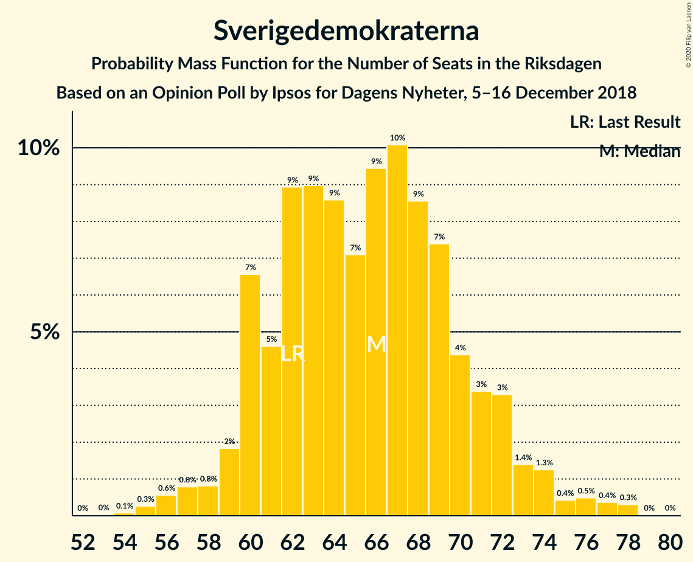
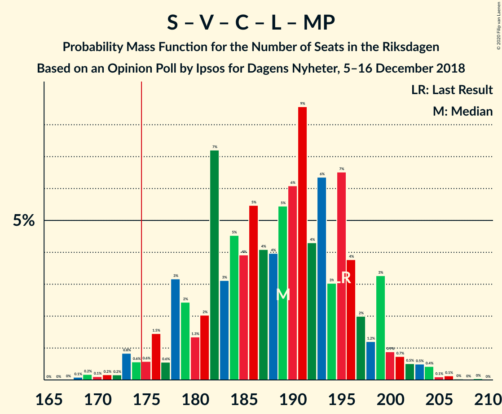

# Opinion Poll by Ipsos for Dagens Nyheter, 5–16 December 2018

<a href="#voting-intentions">Voting Intentions</a> | <a href="#seats">Seats</a> | <a href="#coalitions">Coalitions</a> | <a href="#technical-information">Technical Information</a>

## Voting Intentions

### Confidence Intervals

| Party | Last Result | Poll Result | 80% Confidence Interval | 90% Confidence Interval | 95% Confidence Interval | 99% Confidence Interval |
|:-----:|:-----------:|:-----------:|:-----------------------:|:-----------------------:|:-----------------------:|:-----------------------:|
| Sveriges socialdemokratiska arbetareparti | 28.3% | 32.0% | 30.5–33.6% |30.1–34.0% |29.7–34.4% |29.0–35.1% |
| Moderata samlingspartiet | 19.8% | 18.0% | 16.8–19.3% |16.5–19.7% |16.2–20.0% |15.6–20.7% |
| Sverigedemokraterna | 17.5% | 18.0% | 16.8–19.3% |16.5–19.7% |16.2–20.0% |15.6–20.7% |
| Vänsterpartiet | 8.0% | 8.0% | 7.2–9.0% |6.9–9.2% |6.7–9.5% |6.4–10.0% |
| Kristdemokraterna | 6.3% | 8.0% | 7.2–9.0% |6.9–9.2% |6.7–9.5% |6.4–10.0% |
| Centerpartiet | 8.6% | 7.0% | 6.2–7.9% |6.0–8.2% |5.9–8.4% |5.5–8.9% |
| Liberalerna | 5.5% | 4.0% | 3.4–4.7% |3.2–4.9% |3.1–5.1% |2.9–5.4% |
| Miljöpartiet de gröna | 4.4% | 4.0% | 3.4–4.7% |3.2–4.9% |3.1–5.1% |2.9–5.4% |

*Note:* The poll result column reflects the actual value used in the calculations. Published results may vary slightly, and in addition be rounded to fewer digits.

## Seats

### Confidence Intervals

| Party | Last Result | Median | 80% Confidence Interval | 90% Confidence Interval | 95% Confidence Interval | 99% Confidence Interval |
|:-----:|:-----------:|:------:|:-----------------------:|:-----------------------:|:-----------------------:|:-----------------------:|
| <a href="#sveriges-socialdemokratiska-arbetareparti">Sveriges socialdemokratiska arbetareparti</a> | 100 | 114 | 110–121 |108–124 |107–126 |103–130 |
| <a href="#moderata-samlingspartiet">Moderata samlingspartiet</a> | 70 | 65 | 60–69 |59–72 |57–74 |57–77 |
| <a href="#sverigedemokraterna">Sverigedemokraterna</a> | 62 | 64 | 60–71 |60–72 |58–74 |55–77 |
| <a href="#vänsterpartiet">Vänsterpartiet</a> | 28 | 29 | 27–33 |26–33 |25–34 |23–36 |
| <a href="#kristdemokraterna">Kristdemokraterna</a> | 22 | 29 | 25–32 |25–33 |24–35 |23–37 |
| <a href="#centerpartiet">Centerpartiet</a> | 31 | 26 | 23–29 |22–30 |21–30 |20–32 |
| <a href="#liberalerna">Liberalerna</a> | 20 | 16 | 0–16 |0–16 |0–16 |0–19 |
| <a href="#miljöpartiet-de-gröna">Miljöpartiet de gröna</a> | 16 | 15 | 0–16 |0–17 |0–18 |0–19 |

### Sveriges socialdemokratiska arbetareparti

*For a full overview of the results for this party, see the [Sveriges socialdemokratiska arbetareparti](party-sverigessocialdemokratiskaarbetareparti.html) page.*

| Number of Seats | Probability | Accumulated | Special Marks |
|:---------------:|:-----------:|:-----------:|:-------------:|
| 100 | 0% | 100% | Last Result |
| 101 | 0.1% | 100% |  |
| 102 | 0.3% | 99.9% |  |
| 103 | 0.2% | 99.6% |  |
| 104 | 0.2% | 99.4% |  |
| 105 | 0.4% | 99.2% |  |
| 106 | 1.1% | 98.9% |  |
| 107 | 1.3% | 98% |  |
| 108 | 2% | 96% |  |
| 109 | 2% | 95% |  |
| 110 | 14% | 92% |  |
| 111 | 4% | 78% |  |
| 112 | 4% | 74% |  |
| 113 | 13% | 69% |  |
| 114 | 10% | 57% | Median |
| 115 | 3% | 47% |  |
| 116 | 8% | 44% |  |
| 117 | 6% | 36% |  |
| 118 | 2% | 30% |  |
| 119 | 10% | 28% |  |
| 120 | 7% | 18% |  |
| 121 | 2% | 11% |  |
| 122 | 3% | 9% |  |
| 123 | 2% | 7% |  |
| 124 | 0.6% | 5% |  |
| 125 | 1.0% | 5% |  |
| 126 | 1.3% | 4% |  |
| 127 | 1.0% | 2% |  |
| 128 | 0.6% | 1.4% |  |
| 129 | 0.2% | 0.8% |  |
| 130 | 0.3% | 0.6% |  |
| 131 | 0% | 0.3% |  |
| 132 | 0% | 0.3% |  |
| 133 | 0.2% | 0.3% |  |
| 134 | 0% | 0% |  |

### Moderata samlingspartiet

*For a full overview of the results for this party, see the [Moderata samlingspartiet](party-moderatasamlingspartiet.html) page.*

| Number of Seats | Probability | Accumulated | Special Marks |
|:---------------:|:-----------:|:-----------:|:-------------:|
| 52 | 0% | 100% |  |
| 53 | 0% | 99.9% |  |
| 54 | 0% | 99.9% |  |
| 55 | 0.2% | 99.9% |  |
| 56 | 0.1% | 99.7% |  |
| 57 | 3% | 99.5% |  |
| 58 | 1.5% | 97% |  |
| 59 | 2% | 95% |  |
| 60 | 7% | 93% |  |
| 61 | 2% | 86% |  |
| 62 | 8% | 84% |  |
| 63 | 4% | 76% |  |
| 64 | 5% | 72% |  |
| 65 | 18% | 67% | Median |
| 66 | 15% | 49% |  |
| 67 | 11% | 35% |  |
| 68 | 5% | 23% |  |
| 69 | 9% | 18% |  |
| 70 | 2% | 9% | Last Result |
| 71 | 2% | 7% |  |
| 72 | 1.5% | 6% |  |
| 73 | 1.3% | 4% |  |
| 74 | 1.3% | 3% |  |
| 75 | 0.6% | 2% |  |
| 76 | 0.2% | 1.1% |  |
| 77 | 0.4% | 0.9% |  |
| 78 | 0.3% | 0.5% |  |
| 79 | 0.1% | 0.2% |  |
| 80 | 0% | 0% |  |

### Sverigedemokraterna

*For a full overview of the results for this party, see the [Sverigedemokraterna](party-sverigedemokraterna.html) page.*

| Number of Seats | Probability | Accumulated | Special Marks |
|:---------------:|:-----------:|:-----------:|:-------------:|
| 52 | 0% | 100% |  |
| 53 | 0.1% | 99.9% |  |
| 54 | 0.1% | 99.9% |  |
| 55 | 0.7% | 99.8% |  |
| 56 | 0.3% | 99.2% |  |
| 57 | 1.1% | 98.8% |  |
| 58 | 0.5% | 98% |  |
| 59 | 1.5% | 97% |  |
| 60 | 15% | 96% |  |
| 61 | 4% | 81% |  |
| 62 | 13% | 77% | Last Result |
| 63 | 12% | 64% |  |
| 64 | 5% | 52% | Median |
| 65 | 11% | 47% |  |
| 66 | 4% | 37% |  |
| 67 | 2% | 32% |  |
| 68 | 11% | 30% |  |
| 69 | 2% | 19% |  |
| 70 | 3% | 16% |  |
| 71 | 6% | 13% |  |
| 72 | 2% | 7% |  |
| 73 | 1.5% | 5% |  |
| 74 | 1.4% | 3% |  |
| 75 | 0.7% | 2% |  |
| 76 | 0.2% | 1.0% |  |
| 77 | 0.7% | 0.8% |  |
| 78 | 0.1% | 0.1% |  |
| 79 | 0% | 0% |  |

### Vänsterpartiet

*For a full overview of the results for this party, see the [Vänsterpartiet](party-vänsterpartiet.html) page.*

| Number of Seats | Probability | Accumulated | Special Marks |
|:---------------:|:-----------:|:-----------:|:-------------:|
| 22 | 0.2% | 100% |  |
| 23 | 0.6% | 99.8% |  |
| 24 | 1.3% | 99.2% |  |
| 25 | 2% | 98% |  |
| 26 | 4% | 96% |  |
| 27 | 13% | 92% |  |
| 28 | 26% | 79% | Last Result |
| 29 | 22% | 53% | Median |
| 30 | 6% | 31% |  |
| 31 | 8% | 25% |  |
| 32 | 7% | 17% |  |
| 33 | 7% | 10% |  |
| 34 | 2% | 3% |  |
| 35 | 0.8% | 1.4% |  |
| 36 | 0.3% | 0.6% |  |
| 37 | 0.1% | 0.2% |  |
| 38 | 0% | 0.1% |  |
| 39 | 0% | 0.1% |  |
| 40 | 0% | 0% |  |

### Kristdemokraterna

*For a full overview of the results for this party, see the [Kristdemokraterna](party-kristdemokraterna.html) page.*

| Number of Seats | Probability | Accumulated | Special Marks |
|:---------------:|:-----------:|:-----------:|:-------------:|
| 22 | 0.2% | 100% | Last Result |
| 23 | 0.8% | 99.7% |  |
| 24 | 2% | 99.0% |  |
| 25 | 9% | 97% |  |
| 26 | 5% | 88% |  |
| 27 | 9% | 83% |  |
| 28 | 19% | 74% |  |
| 29 | 11% | 55% | Median |
| 30 | 16% | 44% |  |
| 31 | 16% | 28% |  |
| 32 | 5% | 13% |  |
| 33 | 3% | 8% |  |
| 34 | 2% | 5% |  |
| 35 | 0.7% | 3% |  |
| 36 | 1.1% | 2% |  |
| 37 | 0.3% | 0.7% |  |
| 38 | 0.3% | 0.4% |  |
| 39 | 0.1% | 0.1% |  |
| 40 | 0% | 0% |  |

### Centerpartiet

*For a full overview of the results for this party, see the [Centerpartiet](party-centerpartiet.html) page.*

| Number of Seats | Probability | Accumulated | Special Marks |
|:---------------:|:-----------:|:-----------:|:-------------:|
| 18 | 0% | 100% |  |
| 19 | 0.3% | 99.9% |  |
| 20 | 0.3% | 99.7% |  |
| 21 | 4% | 99.4% |  |
| 22 | 3% | 96% |  |
| 23 | 13% | 93% |  |
| 24 | 7% | 80% |  |
| 25 | 12% | 73% |  |
| 26 | 29% | 60% | Median |
| 27 | 7% | 31% |  |
| 28 | 12% | 24% |  |
| 29 | 5% | 12% |  |
| 30 | 4% | 6% |  |
| 31 | 1.2% | 2% | Last Result |
| 32 | 0.9% | 1.2% |  |
| 33 | 0.2% | 0.3% |  |
| 34 | 0.1% | 0.2% |  |
| 35 | 0% | 0.1% |  |
| 36 | 0% | 0% |  |

### Liberalerna

*For a full overview of the results for this party, see the [Liberalerna](party-liberalerna.html) page.*

| Number of Seats | Probability | Accumulated | Special Marks |
|:---------------:|:-----------:|:-----------:|:-------------:|
| 0 | 44% | 100% |  |
| 1 | 0% | 56% |  |
| 2 | 0% | 56% |  |
| 3 | 0% | 56% |  |
| 4 | 0% | 56% |  |
| 5 | 0% | 56% |  |
| 6 | 0% | 56% |  |
| 7 | 0% | 56% |  |
| 8 | 0% | 56% |  |
| 9 | 0% | 56% |  |
| 10 | 0% | 56% |  |
| 11 | 0% | 56% |  |
| 12 | 0% | 56% |  |
| 13 | 0% | 56% |  |
| 14 | 0% | 56% |  |
| 15 | 3% | 56% |  |
| 16 | 51% | 53% | Median |
| 17 | 0% | 2% |  |
| 18 | 0% | 2% |  |
| 19 | 2% | 2% |  |
| 20 | 0.3% | 0.4% | Last Result |
| 21 | 0% | 0% |  |

### Miljöpartiet de gröna

*For a full overview of the results for this party, see the [Miljöpartiet de gröna](party-miljöpartietdegröna.html) page.*

| Number of Seats | Probability | Accumulated | Special Marks |
|:---------------:|:-----------:|:-----------:|:-------------:|
| 0 | 28% | 100% |  |
| 1 | 0% | 72% |  |
| 2 | 0% | 72% |  |
| 3 | 0% | 72% |  |
| 4 | 0% | 72% |  |
| 5 | 0% | 72% |  |
| 6 | 0% | 72% |  |
| 7 | 0% | 72% |  |
| 8 | 0% | 72% |  |
| 9 | 0% | 72% |  |
| 10 | 0% | 72% |  |
| 11 | 0% | 72% |  |
| 12 | 0% | 72% |  |
| 13 | 0% | 72% |  |
| 14 | 3% | 72% |  |
| 15 | 50% | 69% | Median |
| 16 | 13% | 19% | Last Result |
| 17 | 3% | 6% |  |
| 18 | 2% | 3% |  |
| 19 | 0.9% | 1.2% |  |
| 20 | 0.1% | 0.3% |  |
| 21 | 0.1% | 0.2% |  |
| 22 | 0.1% | 0.1% |  |
| 23 | 0% | 0% |  |

## Coalitions

### Confidence Intervals

| Coalition | Last Result | Median | Majority? | 80% Confidence Interval | 90% Confidence Interval | 95% Confidence Interval | 99% Confidence Interval |
|:---------:|:-----------:|:------:|:---------:|:-----------------------:|:-----------------------:|:-----------------------:|:-----------------------:|
| Sveriges socialdemokratiska arbetareparti – Moderata samlingspartiet – Centerpartiet | 201 | 207 | 100% | 196–215 | 196–218 | 195–221 | 190–226 |
| Sveriges socialdemokratiska arbetareparti – Vänsterpartiet – Centerpartiet – Liberalerna – Miljöpartiet de gröna | 195 | 191 | 98% | 182–199 | 179–199 | 176–202 | 170–204 |
| Sveriges socialdemokratiska arbetareparti – Moderata samlingspartiet | 170 | 181 | 85% | 173–188 | 171–192 | 168–193 | 165–200 |
| Moderata samlingspartiet – Sverigedemokraterna – Kristdemokraterna | 154 | 158 | 2% | 150–167 | 150–170 | 147–173 | 145–179 |
| Sveriges socialdemokratiska arbetareparti – Centerpartiet – Liberalerna – Miljöpartiet de gröna | 167 | 162 | 0.8% | 151–170 | 148–170 | 144–172 | 140–176 |
| Sveriges socialdemokratiska arbetareparti – Vänsterpartiet – Miljöpartiet de gröna | 144 | 156 | 0% | 146–163 | 142–163 | 140–167 | 137–171 |
| Sveriges socialdemokratiska arbetareparti – Vänsterpartiet | 128 | 143 | 0% | 138–152 | 136–155 | 135–158 | 131–162 |
| Moderata samlingspartiet – Kristdemokraterna – Centerpartiet – Liberalerna | 143 | 128 | 0% | 118–137 | 118–141 | 116–143 | 113–148 |
| Moderata samlingspartiet – Sverigedemokraterna | 132 | 128 | 0% | 124–137 | 121–140 | 120–142 | 117–147 |
| Sveriges socialdemokratiska arbetareparti – Miljöpartiet de gröna | 116 | 127 | 0% | 116–134 | 111–135 | 109–138 | 108–143 |
| Moderata samlingspartiet – Kristdemokraterna – Centerpartiet | 123 | 120 | 0% | 112–127 | 112–131 | 111–131 | 108–137 |
| Moderata samlingspartiet – Centerpartiet – Liberalerna | 121 | 100 | 0% | 91–108 | 89–110 | 86–112 | 84–117 |
| Moderata samlingspartiet – Centerpartiet | 101 | 92 | 0% | 84–96 | 83–99 | 83–101 | 80–106 |

### Sveriges socialdemokratiska arbetareparti – Moderata samlingspartiet – Centerpartiet

| Number of Seats | Probability | Accumulated | Special Marks |
|:---------------:|:-----------:|:-----------:|:-------------:|
| 186 | 0% | 100% |  |
| 187 | 0.1% | 99.9% |  |
| 188 | 0% | 99.9% |  |
| 189 | 0% | 99.8% |  |
| 190 | 0.9% | 99.8% |  |
| 191 | 0.2% | 98.9% |  |
| 192 | 0.7% | 98.7% |  |
| 193 | 0.1% | 98% |  |
| 194 | 0.1% | 98% |  |
| 195 | 2% | 98% |  |
| 196 | 6% | 96% |  |
| 197 | 1.4% | 90% |  |
| 198 | 2% | 88% |  |
| 199 | 0.8% | 87% |  |
| 200 | 0.9% | 86% |  |
| 201 | 8% | 85% | Last Result |
| 202 | 17% | 77% |  |
| 203 | 2% | 59% |  |
| 204 | 3% | 57% |  |
| 205 | 2% | 55% | Median |
| 206 | 2% | 52% |  |
| 207 | 10% | 50% |  |
| 208 | 8% | 40% |  |
| 209 | 2% | 32% |  |
| 210 | 2% | 29% |  |
| 211 | 2% | 28% |  |
| 212 | 8% | 26% |  |
| 213 | 5% | 17% |  |
| 214 | 1.4% | 12% |  |
| 215 | 2% | 11% |  |
| 216 | 2% | 9% |  |
| 217 | 1.0% | 7% |  |
| 218 | 2% | 6% |  |
| 219 | 0.7% | 5% |  |
| 220 | 1.0% | 4% |  |
| 221 | 0.7% | 3% |  |
| 222 | 0.1% | 2% |  |
| 223 | 1.0% | 2% |  |
| 224 | 0.3% | 1.1% |  |
| 225 | 0.3% | 0.8% |  |
| 226 | 0% | 0.5% |  |
| 227 | 0% | 0.5% |  |
| 228 | 0.2% | 0.5% |  |
| 229 | 0% | 0.3% |  |
| 230 | 0.3% | 0.3% |  |
| 231 | 0% | 0% |  |

### Sveriges socialdemokratiska arbetareparti – Vänsterpartiet – Centerpartiet – Liberalerna – Miljöpartiet de gröna

| Number of Seats | Probability | Accumulated | Special Marks |
|:---------------:|:-----------:|:-----------:|:-------------:|
| 169 | 0.5% | 100% |  |
| 170 | 0% | 99.5% |  |
| 171 | 0.5% | 99.5% |  |
| 172 | 0.2% | 99.0% |  |
| 173 | 0.3% | 98.8% |  |
| 174 | 0.4% | 98% |  |
| 175 | 0.1% | 98% | Majority |
| 176 | 1.1% | 98% |  |
| 177 | 0.4% | 97% |  |
| 178 | 1.2% | 96% |  |
| 179 | 0.5% | 95% |  |
| 180 | 3% | 95% |  |
| 181 | 0.6% | 92% |  |
| 182 | 8% | 91% |  |
| 183 | 1.3% | 83% |  |
| 184 | 4% | 82% |  |
| 185 | 2% | 77% |  |
| 186 | 7% | 76% |  |
| 187 | 6% | 69% |  |
| 188 | 1.0% | 63% |  |
| 189 | 7% | 62% |  |
| 190 | 0.4% | 55% |  |
| 191 | 14% | 55% |  |
| 192 | 2% | 41% |  |
| 193 | 4% | 40% |  |
| 194 | 1.5% | 35% |  |
| 195 | 18% | 34% | Last Result |
| 196 | 2% | 16% |  |
| 197 | 2% | 14% |  |
| 198 | 0.9% | 13% |  |
| 199 | 9% | 12% |  |
| 200 | 0.2% | 3% | Median |
| 201 | 0.3% | 3% |  |
| 202 | 0.7% | 3% |  |
| 203 | 0.7% | 2% |  |
| 204 | 0.8% | 1.2% |  |
| 205 | 0.1% | 0.4% |  |
| 206 | 0.2% | 0.3% |  |
| 207 | 0.1% | 0.1% |  |
| 208 | 0% | 0% |  |

### Sveriges socialdemokratiska arbetareparti – Moderata samlingspartiet

| Number of Seats | Probability | Accumulated | Special Marks |
|:---------------:|:-----------:|:-----------:|:-------------:|
| 162 | 0% | 100% |  |
| 163 | 0.1% | 99.9% |  |
| 164 | 0% | 99.9% |  |
| 165 | 0.4% | 99.8% |  |
| 166 | 0.9% | 99.5% |  |
| 167 | 0.2% | 98.6% |  |
| 168 | 2% | 98% |  |
| 169 | 0.5% | 96% |  |
| 170 | 0.5% | 96% | Last Result |
| 171 | 1.1% | 95% |  |
| 172 | 0.9% | 94% |  |
| 173 | 6% | 93% |  |
| 174 | 2% | 87% |  |
| 175 | 4% | 85% | Majority |
| 176 | 19% | 82% |  |
| 177 | 3% | 63% |  |
| 178 | 3% | 60% |  |
| 179 | 4% | 57% | Median |
| 180 | 2% | 53% |  |
| 181 | 8% | 51% |  |
| 182 | 10% | 43% |  |
| 183 | 3% | 33% |  |
| 184 | 9% | 30% |  |
| 185 | 1.4% | 21% |  |
| 186 | 3% | 20% |  |
| 187 | 4% | 17% |  |
| 188 | 3% | 13% |  |
| 189 | 2% | 10% |  |
| 190 | 0.6% | 8% |  |
| 191 | 2% | 7% |  |
| 192 | 0.6% | 5% |  |
| 193 | 2% | 5% |  |
| 194 | 0.3% | 2% |  |
| 195 | 0.2% | 2% |  |
| 196 | 0.5% | 2% |  |
| 197 | 0.3% | 1.4% |  |
| 198 | 0.1% | 1.1% |  |
| 199 | 0.3% | 1.0% |  |
| 200 | 0.4% | 0.7% |  |
| 201 | 0% | 0.3% |  |
| 202 | 0.3% | 0.3% |  |
| 203 | 0% | 0% |  |

### Moderata samlingspartiet – Sverigedemokraterna – Kristdemokraterna

| Number of Seats | Probability | Accumulated | Special Marks |
|:---------------:|:-----------:|:-----------:|:-------------:|
| 142 | 0.1% | 100% |  |
| 143 | 0.2% | 99.9% |  |
| 144 | 0.1% | 99.7% |  |
| 145 | 0.8% | 99.6% |  |
| 146 | 0.7% | 98.8% |  |
| 147 | 0.7% | 98% |  |
| 148 | 0.3% | 97% |  |
| 149 | 0.2% | 97% |  |
| 150 | 9% | 97% |  |
| 151 | 0.9% | 88% |  |
| 152 | 2% | 87% |  |
| 153 | 2% | 86% |  |
| 154 | 18% | 84% | Last Result |
| 155 | 1.5% | 66% |  |
| 156 | 4% | 65% |  |
| 157 | 2% | 60% |  |
| 158 | 14% | 59% | Median |
| 159 | 0.4% | 45% |  |
| 160 | 7% | 45% |  |
| 161 | 1.0% | 38% |  |
| 162 | 6% | 37% |  |
| 163 | 7% | 31% |  |
| 164 | 2% | 24% |  |
| 165 | 4% | 23% |  |
| 166 | 1.3% | 18% |  |
| 167 | 8% | 17% |  |
| 168 | 0.6% | 9% |  |
| 169 | 3% | 8% |  |
| 170 | 0.5% | 5% |  |
| 171 | 1.2% | 5% |  |
| 172 | 0.4% | 4% |  |
| 173 | 1.1% | 3% |  |
| 174 | 0.1% | 2% |  |
| 175 | 0.4% | 2% | Majority |
| 176 | 0.3% | 2% |  |
| 177 | 0.2% | 1.2% |  |
| 178 | 0.5% | 1.0% |  |
| 179 | 0% | 0.5% |  |
| 180 | 0.5% | 0.5% |  |
| 181 | 0% | 0% |  |

### Sveriges socialdemokratiska arbetareparti – Centerpartiet – Liberalerna – Miljöpartiet de gröna

| Number of Seats | Probability | Accumulated | Special Marks |
|:---------------:|:-----------:|:-----------:|:-------------:|
| 138 | 0% | 100% |  |
| 139 | 0% | 99.9% |  |
| 140 | 0.8% | 99.9% |  |
| 141 | 0.1% | 99.1% |  |
| 142 | 0.2% | 99.0% |  |
| 143 | 0.4% | 98.8% |  |
| 144 | 1.0% | 98% |  |
| 145 | 0.5% | 97% |  |
| 146 | 0.3% | 97% |  |
| 147 | 1.5% | 97% |  |
| 148 | 0.5% | 95% |  |
| 149 | 2% | 95% |  |
| 150 | 0.7% | 92% |  |
| 151 | 2% | 92% |  |
| 152 | 2% | 90% |  |
| 153 | 2% | 87% |  |
| 154 | 8% | 85% |  |
| 155 | 2% | 77% |  |
| 156 | 2% | 75% |  |
| 157 | 7% | 72% |  |
| 158 | 5% | 65% |  |
| 159 | 2% | 61% |  |
| 160 | 2% | 59% |  |
| 161 | 5% | 57% |  |
| 162 | 9% | 52% |  |
| 163 | 2% | 43% |  |
| 164 | 1.3% | 40% |  |
| 165 | 2% | 39% |  |
| 166 | 4% | 37% |  |
| 167 | 13% | 33% | Last Result |
| 168 | 6% | 20% |  |
| 169 | 3% | 14% |  |
| 170 | 6% | 11% |  |
| 171 | 1.0% | 5% | Median |
| 172 | 1.4% | 4% |  |
| 173 | 0.5% | 2% |  |
| 174 | 0.9% | 2% |  |
| 175 | 0.3% | 0.8% | Majority |
| 176 | 0.2% | 0.5% |  |
| 177 | 0.3% | 0.4% |  |
| 178 | 0% | 0.1% |  |
| 179 | 0% | 0.1% |  |
| 180 | 0% | 0% |  |

### Sveriges socialdemokratiska arbetareparti – Vänsterpartiet – Miljöpartiet de gröna

| Number of Seats | Probability | Accumulated | Special Marks |
|:---------------:|:-----------:|:-----------:|:-------------:|
| 134 | 0.1% | 100% |  |
| 135 | 0% | 99.9% |  |
| 136 | 0.2% | 99.9% |  |
| 137 | 0.2% | 99.7% |  |
| 138 | 0.5% | 99.5% |  |
| 139 | 0.3% | 99.0% |  |
| 140 | 2% | 98.7% |  |
| 141 | 0.2% | 97% |  |
| 142 | 2% | 97% |  |
| 143 | 1.5% | 94% |  |
| 144 | 0.5% | 93% | Last Result |
| 145 | 2% | 93% |  |
| 146 | 1.3% | 91% |  |
| 147 | 0.7% | 90% |  |
| 148 | 4% | 89% |  |
| 149 | 0.5% | 85% |  |
| 150 | 6% | 85% |  |
| 151 | 2% | 78% |  |
| 152 | 0.8% | 76% |  |
| 153 | 14% | 75% |  |
| 154 | 6% | 61% |  |
| 155 | 2% | 55% |  |
| 156 | 14% | 53% |  |
| 157 | 0.9% | 39% |  |
| 158 | 8% | 38% | Median |
| 159 | 3% | 30% |  |
| 160 | 9% | 27% |  |
| 161 | 1.1% | 18% |  |
| 162 | 2% | 17% |  |
| 163 | 11% | 16% |  |
| 164 | 0.4% | 5% |  |
| 165 | 0.8% | 4% |  |
| 166 | 0.7% | 3% |  |
| 167 | 0.3% | 3% |  |
| 168 | 0.9% | 2% |  |
| 169 | 0.5% | 2% |  |
| 170 | 0.3% | 1.1% |  |
| 171 | 0.5% | 0.8% |  |
| 172 | 0.1% | 0.4% |  |
| 173 | 0% | 0.2% |  |
| 174 | 0.2% | 0.2% |  |
| 175 | 0% | 0% | Majority |

### Sveriges socialdemokratiska arbetareparti – Vänsterpartiet

| Number of Seats | Probability | Accumulated | Special Marks |
|:---------------:|:-----------:|:-----------:|:-------------:|
| 128 | 0.2% | 100% | Last Result |
| 129 | 0.1% | 99.8% |  |
| 130 | 0.1% | 99.7% |  |
| 131 | 0.3% | 99.6% |  |
| 132 | 0.3% | 99.2% |  |
| 133 | 0.9% | 98.9% |  |
| 134 | 0.3% | 98% |  |
| 135 | 0.8% | 98% |  |
| 136 | 2% | 97% |  |
| 137 | 0.9% | 95% |  |
| 138 | 13% | 94% |  |
| 139 | 3% | 81% |  |
| 140 | 9% | 77% |  |
| 141 | 8% | 69% |  |
| 142 | 4% | 60% |  |
| 143 | 10% | 57% | Median |
| 144 | 2% | 47% |  |
| 145 | 9% | 45% |  |
| 146 | 2% | 35% |  |
| 147 | 1.0% | 33% |  |
| 148 | 13% | 32% |  |
| 149 | 1.1% | 19% |  |
| 150 | 7% | 18% |  |
| 151 | 1.0% | 11% |  |
| 152 | 1.3% | 10% |  |
| 153 | 2% | 9% |  |
| 154 | 2% | 7% |  |
| 155 | 2% | 5% |  |
| 156 | 1.0% | 4% |  |
| 157 | 0.4% | 3% |  |
| 158 | 0.5% | 3% |  |
| 159 | 0.3% | 2% |  |
| 160 | 0.8% | 2% |  |
| 161 | 0.1% | 1.0% |  |
| 162 | 0.5% | 0.8% |  |
| 163 | 0% | 0.3% |  |
| 164 | 0% | 0.3% |  |
| 165 | 0.2% | 0.3% |  |
| 166 | 0% | 0% |  |

### Moderata samlingspartiet – Kristdemokraterna – Centerpartiet – Liberalerna

| Number of Seats | Probability | Accumulated | Special Marks |
|:---------------:|:-----------:|:-----------:|:-------------:|
| 108 | 0.1% | 100% |  |
| 109 | 0% | 99.9% |  |
| 110 | 0% | 99.9% |  |
| 111 | 0.1% | 99.8% |  |
| 112 | 0.2% | 99.7% |  |
| 113 | 0.1% | 99.5% |  |
| 114 | 0.5% | 99.4% |  |
| 115 | 0.8% | 98.9% |  |
| 116 | 0.8% | 98% |  |
| 117 | 2% | 97% |  |
| 118 | 5% | 95% |  |
| 119 | 3% | 90% |  |
| 120 | 0.5% | 87% |  |
| 121 | 1.3% | 87% |  |
| 122 | 0.5% | 85% |  |
| 123 | 4% | 85% |  |
| 124 | 10% | 81% |  |
| 125 | 7% | 70% |  |
| 126 | 1.2% | 63% |  |
| 127 | 2% | 62% |  |
| 128 | 13% | 60% |  |
| 129 | 1.1% | 48% |  |
| 130 | 4% | 46% |  |
| 131 | 5% | 42% |  |
| 132 | 0.8% | 37% |  |
| 133 | 3% | 36% |  |
| 134 | 4% | 33% |  |
| 135 | 3% | 29% |  |
| 136 | 13% | 26% | Median |
| 137 | 4% | 12% |  |
| 138 | 0.8% | 8% |  |
| 139 | 0.5% | 7% |  |
| 140 | 1.1% | 7% |  |
| 141 | 0.7% | 6% |  |
| 142 | 2% | 5% |  |
| 143 | 2% | 3% | Last Result |
| 144 | 0.4% | 2% |  |
| 145 | 0.1% | 1.1% |  |
| 146 | 0.1% | 1.0% |  |
| 147 | 0.4% | 0.9% |  |
| 148 | 0.1% | 0.6% |  |
| 149 | 0.4% | 0.4% |  |
| 150 | 0% | 0% |  |

### Moderata samlingspartiet – Sverigedemokraterna

| Number of Seats | Probability | Accumulated | Special Marks |
|:---------------:|:-----------:|:-----------:|:-------------:|
| 113 | 0% | 100% |  |
| 114 | 0% | 99.9% |  |
| 115 | 0.1% | 99.9% |  |
| 116 | 0% | 99.8% |  |
| 117 | 1.2% | 99.8% |  |
| 118 | 0.2% | 98.6% |  |
| 119 | 0.3% | 98% |  |
| 120 | 3% | 98% |  |
| 121 | 0.5% | 95% |  |
| 122 | 1.4% | 95% |  |
| 123 | 0.7% | 93% |  |
| 124 | 3% | 93% |  |
| 125 | 11% | 89% |  |
| 126 | 13% | 78% |  |
| 127 | 12% | 65% |  |
| 128 | 4% | 53% |  |
| 129 | 2% | 49% | Median |
| 130 | 7% | 47% |  |
| 131 | 4% | 40% |  |
| 132 | 3% | 36% | Last Result |
| 133 | 0.9% | 33% |  |
| 134 | 6% | 32% |  |
| 135 | 2% | 26% |  |
| 136 | 7% | 24% |  |
| 137 | 7% | 16% |  |
| 138 | 2% | 10% |  |
| 139 | 0.8% | 8% |  |
| 140 | 3% | 7% |  |
| 141 | 0.2% | 5% |  |
| 142 | 2% | 5% |  |
| 143 | 0.1% | 2% |  |
| 144 | 0.9% | 2% |  |
| 145 | 0.6% | 1.3% |  |
| 146 | 0% | 0.8% |  |
| 147 | 0.5% | 0.7% |  |
| 148 | 0% | 0.2% |  |
| 149 | 0% | 0.2% |  |
| 150 | 0.1% | 0.2% |  |
| 151 | 0% | 0% |  |

### Sveriges socialdemokratiska arbetareparti – Miljöpartiet de gröna

| Number of Seats | Probability | Accumulated | Special Marks |
|:---------------:|:-----------:|:-----------:|:-------------:|
| 103 | 0.1% | 100% |  |
| 104 | 0% | 99.9% |  |
| 105 | 0% | 99.9% |  |
| 106 | 0.1% | 99.9% |  |
| 107 | 0.2% | 99.8% |  |
| 108 | 0.6% | 99.6% |  |
| 109 | 2% | 99.0% |  |
| 110 | 2% | 97% |  |
| 111 | 0.8% | 96% |  |
| 112 | 0.5% | 95% |  |
| 113 | 0.8% | 94% |  |
| 114 | 1.3% | 93% |  |
| 115 | 1.2% | 92% |  |
| 116 | 1.1% | 91% | Last Result |
| 117 | 4% | 90% |  |
| 118 | 0.8% | 86% |  |
| 119 | 3% | 85% |  |
| 120 | 3% | 82% |  |
| 121 | 2% | 79% |  |
| 122 | 3% | 77% |  |
| 123 | 2% | 74% |  |
| 124 | 0.9% | 71% |  |
| 125 | 14% | 70% |  |
| 126 | 3% | 57% |  |
| 127 | 5% | 54% |  |
| 128 | 8% | 50% |  |
| 129 | 14% | 42% | Median |
| 130 | 1.3% | 28% |  |
| 131 | 7% | 27% |  |
| 132 | 2% | 20% |  |
| 133 | 1.0% | 18% |  |
| 134 | 8% | 17% |  |
| 135 | 4% | 8% |  |
| 136 | 0.9% | 4% |  |
| 137 | 0.4% | 3% |  |
| 138 | 0.6% | 3% |  |
| 139 | 0.5% | 2% |  |
| 140 | 0.1% | 2% |  |
| 141 | 0.7% | 2% |  |
| 142 | 0.3% | 1.0% |  |
| 143 | 0.4% | 0.7% |  |
| 144 | 0.1% | 0.3% |  |
| 145 | 0.1% | 0.2% |  |
| 146 | 0.1% | 0.1% |  |
| 147 | 0% | 0% |  |

### Moderata samlingspartiet – Kristdemokraterna – Centerpartiet

| Number of Seats | Probability | Accumulated | Special Marks |
|:---------------:|:-----------:|:-----------:|:-------------:|
| 103 | 0% | 100% |  |
| 104 | 0% | 99.9% |  |
| 105 | 0.1% | 99.9% |  |
| 106 | 0.2% | 99.8% |  |
| 107 | 0% | 99.7% |  |
| 108 | 0.2% | 99.6% |  |
| 109 | 0.5% | 99.4% |  |
| 110 | 0.3% | 98.9% |  |
| 111 | 1.4% | 98.6% |  |
| 112 | 13% | 97% |  |
| 113 | 1.3% | 85% |  |
| 114 | 4% | 83% |  |
| 115 | 2% | 79% |  |
| 116 | 1.4% | 77% |  |
| 117 | 4% | 75% |  |
| 118 | 10% | 71% |  |
| 119 | 5% | 62% |  |
| 120 | 15% | 57% | Median |
| 121 | 5% | 42% |  |
| 122 | 0.6% | 36% |  |
| 123 | 5% | 36% | Last Result |
| 124 | 11% | 31% |  |
| 125 | 7% | 20% |  |
| 126 | 3% | 13% |  |
| 127 | 3% | 10% |  |
| 128 | 0.5% | 8% |  |
| 129 | 0.5% | 7% |  |
| 130 | 0.4% | 7% |  |
| 131 | 4% | 6% |  |
| 132 | 0.4% | 2% |  |
| 133 | 0.9% | 2% |  |
| 134 | 0% | 1.0% |  |
| 135 | 0% | 1.0% |  |
| 136 | 0.3% | 1.0% |  |
| 137 | 0.6% | 0.7% |  |
| 138 | 0% | 0.1% |  |
| 139 | 0% | 0.1% |  |
| 140 | 0% | 0.1% |  |
| 141 | 0% | 0% |  |

### Moderata samlingspartiet – Centerpartiet – Liberalerna

| Number of Seats | Probability | Accumulated | Special Marks |
|:---------------:|:-----------:|:-----------:|:-------------:|
| 81 | 0% | 100% |  |
| 82 | 0.2% | 99.9% |  |
| 83 | 0% | 99.7% |  |
| 84 | 1.3% | 99.7% |  |
| 85 | 0.2% | 98% |  |
| 86 | 0.9% | 98% |  |
| 87 | 0.8% | 97% |  |
| 88 | 1.3% | 97% |  |
| 89 | 0.5% | 95% |  |
| 90 | 1.5% | 95% |  |
| 91 | 6% | 93% |  |
| 92 | 2% | 87% |  |
| 93 | 13% | 86% |  |
| 94 | 0.4% | 72% |  |
| 95 | 8% | 72% |  |
| 96 | 0.6% | 64% |  |
| 97 | 3% | 64% |  |
| 98 | 2% | 61% |  |
| 99 | 8% | 59% |  |
| 100 | 3% | 51% |  |
| 101 | 1.1% | 48% |  |
| 102 | 2% | 47% |  |
| 103 | 7% | 45% |  |
| 104 | 3% | 38% |  |
| 105 | 4% | 35% |  |
| 106 | 9% | 31% |  |
| 107 | 1.0% | 23% | Median |
| 108 | 13% | 22% |  |
| 109 | 2% | 8% |  |
| 110 | 2% | 7% |  |
| 111 | 0.6% | 5% |  |
| 112 | 2% | 4% |  |
| 113 | 0.6% | 2% |  |
| 114 | 0.2% | 1.4% |  |
| 115 | 0.3% | 1.2% |  |
| 116 | 0.3% | 0.9% |  |
| 117 | 0.2% | 0.6% |  |
| 118 | 0% | 0.4% |  |
| 119 | 0.3% | 0.4% |  |
| 120 | 0% | 0% |  |
| 121 | 0% | 0% | Last Result |

### Moderata samlingspartiet – Centerpartiet

| Number of Seats | Probability | Accumulated | Special Marks |
|:---------------:|:-----------:|:-----------:|:-------------:|
| 78 | 0.1% | 100% |  |
| 79 | 0.1% | 99.8% |  |
| 80 | 0.3% | 99.7% |  |
| 81 | 0.8% | 99.4% |  |
| 82 | 0.8% | 98.6% |  |
| 83 | 7% | 98% |  |
| 84 | 4% | 91% |  |
| 85 | 0.9% | 87% |  |
| 86 | 2% | 87% |  |
| 87 | 7% | 84% |  |
| 88 | 4% | 77% |  |
| 89 | 4% | 73% |  |
| 90 | 9% | 69% |  |
| 91 | 8% | 60% | Median |
| 92 | 15% | 52% |  |
| 93 | 15% | 37% |  |
| 94 | 2% | 23% |  |
| 95 | 8% | 20% |  |
| 96 | 2% | 12% |  |
| 97 | 2% | 10% |  |
| 98 | 2% | 7% |  |
| 99 | 2% | 6% |  |
| 100 | 0.8% | 4% |  |
| 101 | 0.4% | 3% | Last Result |
| 102 | 0.3% | 2% |  |
| 103 | 0.4% | 2% |  |
| 104 | 1.0% | 2% |  |
| 105 | 0.1% | 0.7% |  |
| 106 | 0.5% | 0.6% |  |
| 107 | 0% | 0.1% |  |
| 108 | 0% | 0.1% |  |
| 109 | 0% | 0% |  |

## Technical Information

### Opinion Poll

+ **Polling firm:** Ipsos
+ **Commissioner(s):** Dagens Nyheter
+ **Fieldwork period:** 5–16 December 2018

### Calculations

+ **Sample size:** 1537
+ **Simulations done:** 262,144
+ **Error estimate:** 1.46%

