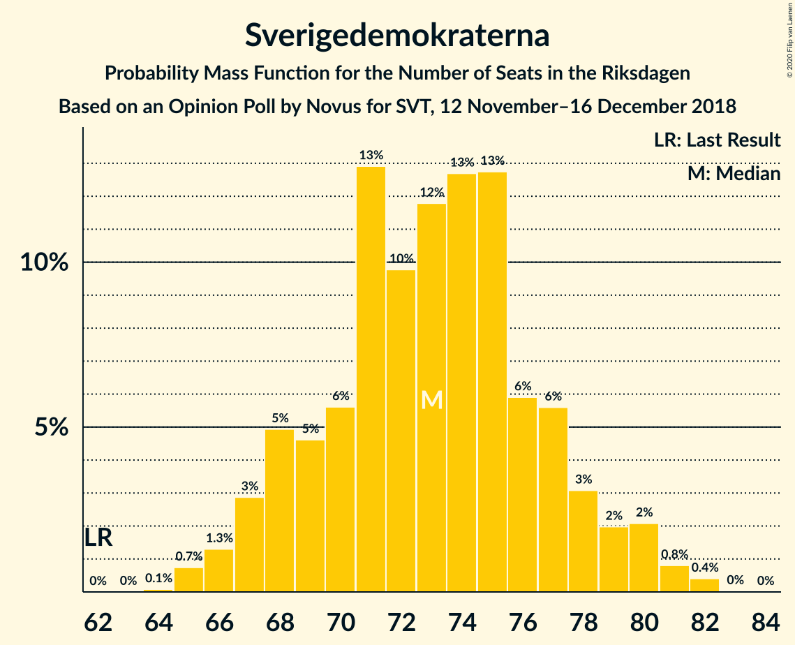
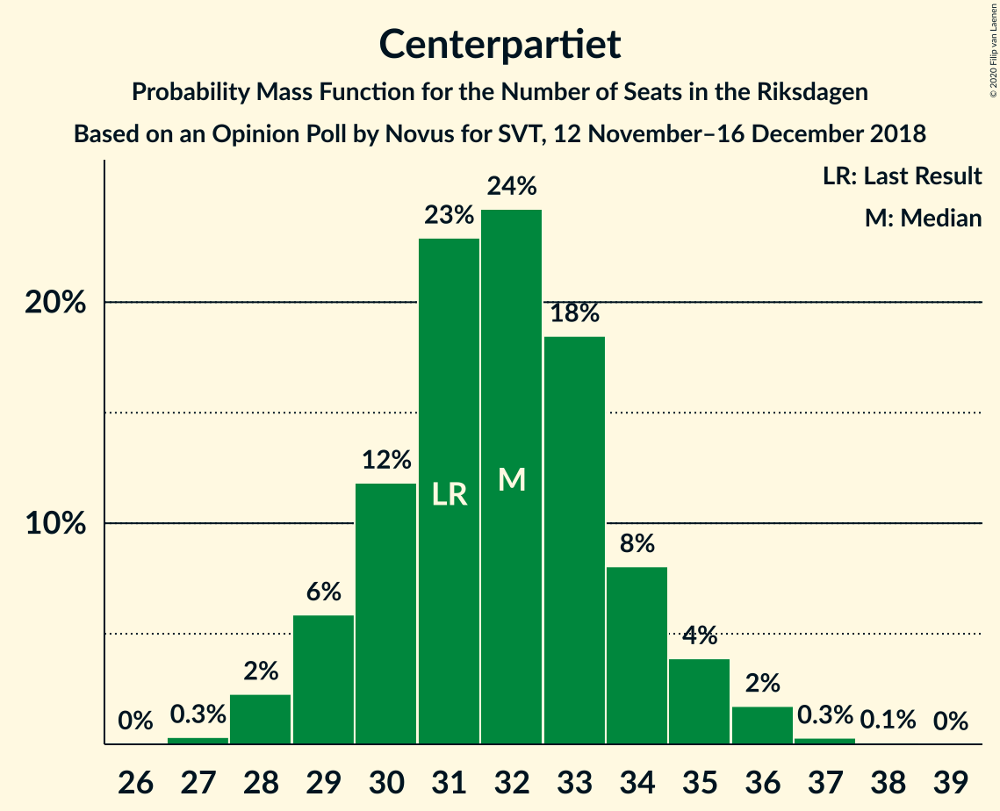

# Opinion Poll by Novus for SVT, 12 November–16 December 2018

<a href="#voting-intentions">Voting Intentions</a> | <a href="#seats">Seats</a> | <a href="#coalitions">Coalitions</a> | <a href="#technical-information">Technical Information</a>

## Voting Intentions

### Confidence Intervals

| Party | Last Result | Poll Result | 80% Confidence Interval | 90% Confidence Interval | 95% Confidence Interval | 99% Confidence Interval |
|:-----:|:-----------:|:-----------:|:-----------------------:|:-----------------------:|:-----------------------:|:-----------------------:|
| Sveriges socialdemokratiska arbetareparti | 28.3% | 30.0% | 29.2–30.8% |29.0–31.0% |28.8–31.2% |28.4–31.6% |
| Sverigedemokraterna | 17.5% | 19.8% | 19.1–20.5% |18.9–20.7% |18.7–20.9% |18.4–21.2% |
| Moderata samlingspartiet | 19.8% | 18.3% | 17.6–19.0% |17.5–19.2% |17.3–19.4% |17.0–19.7% |
| Centerpartiet | 8.6% | 8.6% | 8.1–9.1% |8.0–9.3% |7.9–9.4% |7.7–9.6% |
| Vänsterpartiet | 8.0% | 7.7% | 7.3–8.2% |7.1–8.3% |7.0–8.4% |6.8–8.7% |
| Kristdemokraterna | 6.3% | 6.5% | 6.1–7.0% |6.0–7.1% |5.9–7.2% |5.7–7.4% |
| Miljöpartiet de gröna | 4.4% | 4.0% | 3.7–4.4% |3.6–4.5% |3.5–4.6% |3.4–4.8% |
| Liberalerna | 5.5% | 3.9% | 3.6–4.3% |3.5–4.4% |3.4–4.5% |3.3–4.6% |

*Note:* The poll result column reflects the actual value used in the calculations. Published results may vary slightly, and in addition be rounded to fewer digits.

## Seats

### Confidence Intervals

| Party | Last Result | Median | 80% Confidence Interval | 90% Confidence Interval | 95% Confidence Interval | 99% Confidence Interval |
|:-----:|:-----------:|:------:|:-----------------------:|:-----------------------:|:-----------------------:|:-----------------------:|
| <a href="#sveriges-socialdemokratiska-arbetareparti">Sveriges socialdemokratiska arbetareparti</a> | 100 | 109 | 103–113 |101–117 |101–118 |101–121 |
| <a href="#sverigedemokraterna">Sverigedemokraterna</a> | 62 | 73 | 69–77 |67–79 |67–81 |65–82 |
| <a href="#moderata-samlingspartiet">Moderata samlingspartiet</a> | 70 | 66 | 63–71 |62–73 |62–73 |61–74 |
| <a href="#centerpartiet">Centerpartiet</a> | 31 | 31 | 30–33 |29–34 |28–35 |27–36 |
| <a href="#vänsterpartiet">Vänsterpartiet</a> | 28 | 28 | 26–30 |25–31 |25–32 |24–33 |
| <a href="#kristdemokraterna">Kristdemokraterna</a> | 22 | 23 | 22–25 |21–26 |21–26 |20–28 |
| <a href="#miljöpartiet-de-gröna">Miljöpartiet de gröna</a> | 16 | 15 | 0–17 |0–17 |0–17 |0–17 |
| <a href="#liberalerna">Liberalerna</a> | 20 | 0 | 0–15 |0–16 |0–16 |0–17 |

### Sveriges socialdemokratiska arbetareparti

*For a full overview of the results for this party, see the [Sveriges socialdemokratiska arbetareparti](party-sverigessocialdemokratiskaarbetareparti.html) page.*

| Number of Seats | Probability | Accumulated | Special Marks |
|:---------------:|:-----------:|:-----------:|:-------------:|
| 100 | 0.2% | 100% | Last Result |
| 101 | 8% | 99.8% |  |
| 102 | 1.1% | 92% |  |
| 103 | 2% | 91% |  |
| 104 | 1.4% | 89% |  |
| 105 | 3% | 87% |  |
| 106 | 2% | 84% |  |
| 107 | 4% | 82% |  |
| 108 | 25% | 78% |  |
| 109 | 18% | 53% | Median |
| 110 | 6% | 35% |  |
| 111 | 13% | 29% |  |
| 112 | 4% | 16% |  |
| 113 | 4% | 13% |  |
| 114 | 2% | 9% |  |
| 115 | 1.0% | 7% |  |
| 116 | 0.9% | 6% |  |
| 117 | 2% | 5% |  |
| 118 | 1.0% | 3% |  |
| 119 | 0.1% | 2% |  |
| 120 | 1.0% | 2% |  |
| 121 | 0.9% | 1.0% |  |
| 122 | 0.1% | 0.1% |  |
| 123 | 0% | 0% |  |

### Sverigedemokraterna

*For a full overview of the results for this party, see the [Sverigedemokraterna](party-sverigedemokraterna.html) page.*

| Number of Seats | Probability | Accumulated | Special Marks |
|:---------------:|:-----------:|:-----------:|:-------------:|
| 62 | 0% | 100% | Last Result |
| 63 | 0% | 100% |  |
| 64 | 0.1% | 100% |  |
| 65 | 0.8% | 99.8% |  |
| 66 | 0.4% | 99.0% |  |
| 67 | 5% | 98.7% |  |
| 68 | 2% | 93% |  |
| 69 | 12% | 92% |  |
| 70 | 6% | 80% |  |
| 71 | 8% | 74% |  |
| 72 | 11% | 66% |  |
| 73 | 6% | 54% | Median |
| 74 | 16% | 49% |  |
| 75 | 15% | 33% |  |
| 76 | 8% | 18% |  |
| 77 | 1.3% | 10% |  |
| 78 | 2% | 9% |  |
| 79 | 3% | 7% |  |
| 80 | 0.6% | 4% |  |
| 81 | 2% | 3% |  |
| 82 | 0.6% | 0.6% |  |
| 83 | 0% | 0% |  |

### Moderata samlingspartiet

*For a full overview of the results for this party, see the [Moderata samlingspartiet](party-moderatasamlingspartiet.html) page.*

| Number of Seats | Probability | Accumulated | Special Marks |
|:---------------:|:-----------:|:-----------:|:-------------:|
| 58 | 0.1% | 100% |  |
| 59 | 0% | 99.9% |  |
| 60 | 0.3% | 99.9% |  |
| 61 | 0.2% | 99.6% |  |
| 62 | 5% | 99.4% |  |
| 63 | 8% | 95% |  |
| 64 | 4% | 87% |  |
| 65 | 20% | 83% |  |
| 66 | 19% | 63% | Median |
| 67 | 4% | 44% |  |
| 68 | 11% | 40% |  |
| 69 | 9% | 29% |  |
| 70 | 5% | 20% | Last Result |
| 71 | 9% | 15% |  |
| 72 | 0.7% | 6% |  |
| 73 | 4% | 5% |  |
| 74 | 0.7% | 0.8% |  |
| 75 | 0.1% | 0.1% |  |
| 76 | 0% | 0% |  |

### Centerpartiet

*For a full overview of the results for this party, see the [Centerpartiet](party-centerpartiet.html) page.*

| Number of Seats | Probability | Accumulated | Special Marks |
|:---------------:|:-----------:|:-----------:|:-------------:|
| 26 | 0% | 100% |  |
| 27 | 0.7% | 99.9% |  |
| 28 | 3% | 99.2% |  |
| 29 | 5% | 97% |  |
| 30 | 14% | 92% |  |
| 31 | 30% | 77% | Last Result, Median |
| 32 | 22% | 47% |  |
| 33 | 16% | 26% |  |
| 34 | 7% | 10% |  |
| 35 | 2% | 3% |  |
| 36 | 0.7% | 0.9% |  |
| 37 | 0.2% | 0.3% |  |
| 38 | 0% | 0% |  |

### Vänsterpartiet

*For a full overview of the results for this party, see the [Vänsterpartiet](party-vänsterpartiet.html) page.*

| Number of Seats | Probability | Accumulated | Special Marks |
|:---------------:|:-----------:|:-----------:|:-------------:|
| 24 | 1.0% | 100% |  |
| 25 | 7% | 99.0% |  |
| 26 | 14% | 92% |  |
| 27 | 13% | 78% |  |
| 28 | 24% | 65% | Last Result, Median |
| 29 | 17% | 41% |  |
| 30 | 15% | 23% |  |
| 31 | 4% | 8% |  |
| 32 | 4% | 5% |  |
| 33 | 0.8% | 1.0% |  |
| 34 | 0.1% | 0.1% |  |
| 35 | 0% | 0% |  |

### Kristdemokraterna

*For a full overview of the results for this party, see the [Kristdemokraterna](party-kristdemokraterna.html) page.*

| Number of Seats | Probability | Accumulated | Special Marks |
|:---------------:|:-----------:|:-----------:|:-------------:|
| 19 | 0.1% | 100% |  |
| 20 | 0.5% | 99.9% |  |
| 21 | 6% | 99.4% |  |
| 22 | 13% | 93% | Last Result |
| 23 | 34% | 80% | Median |
| 24 | 21% | 46% |  |
| 25 | 19% | 25% |  |
| 26 | 4% | 6% |  |
| 27 | 2% | 2% |  |
| 28 | 0.6% | 0.7% |  |
| 29 | 0% | 0.1% |  |
| 30 | 0% | 0% |  |

### Miljöpartiet de gröna

*For a full overview of the results for this party, see the [Miljöpartiet de gröna](party-miljöpartietdegröna.html) page.*

| Number of Seats | Probability | Accumulated | Special Marks |
|:---------------:|:-----------:|:-----------:|:-------------:|
| 0 | 31% | 100% |  |
| 1 | 0% | 69% |  |
| 2 | 0% | 69% |  |
| 3 | 0% | 69% |  |
| 4 | 0% | 69% |  |
| 5 | 0% | 69% |  |
| 6 | 0% | 69% |  |
| 7 | 0% | 69% |  |
| 8 | 0% | 69% |  |
| 9 | 0% | 69% |  |
| 10 | 0% | 69% |  |
| 11 | 0% | 69% |  |
| 12 | 0% | 69% |  |
| 13 | 0% | 69% |  |
| 14 | 10% | 69% |  |
| 15 | 25% | 59% | Median |
| 16 | 20% | 33% | Last Result |
| 17 | 13% | 13% |  |
| 18 | 0.2% | 0.2% |  |
| 19 | 0% | 0% |  |

### Liberalerna

*For a full overview of the results for this party, see the [Liberalerna](party-liberalerna.html) page.*

| Number of Seats | Probability | Accumulated | Special Marks |
|:---------------:|:-----------:|:-----------:|:-------------:|
| 0 | 56% | 100% | Median |
| 1 | 0% | 44% |  |
| 2 | 0% | 44% |  |
| 3 | 0% | 44% |  |
| 4 | 0% | 44% |  |
| 5 | 0% | 44% |  |
| 6 | 0% | 44% |  |
| 7 | 0% | 44% |  |
| 8 | 0% | 44% |  |
| 9 | 0% | 44% |  |
| 10 | 0% | 44% |  |
| 11 | 0% | 44% |  |
| 12 | 0% | 44% |  |
| 13 | 0% | 44% |  |
| 14 | 11% | 44% |  |
| 15 | 25% | 33% |  |
| 16 | 6% | 8% |  |
| 17 | 1.3% | 1.5% |  |
| 18 | 0.1% | 0.1% |  |
| 19 | 0% | 0% |  |
| 20 | 0% | 0% | Last Result |

## Coalitions

### Confidence Intervals

| Coalition | Last Result | Median | Majority? | 80% Confidence Interval | 90% Confidence Interval | 95% Confidence Interval | 99% Confidence Interval |
|:---------:|:-----------:|:------:|:---------:|:-----------------------:|:-----------------------:|:-----------------------:|:-----------------------:|
| Sveriges socialdemokratiska arbetareparti – Moderata samlingspartiet – Centerpartiet | 201 | 206 | 100% | 198–216 | 197–219 | 196–223 | 195–223 |
| Sveriges socialdemokratiska arbetareparti – Moderata samlingspartiet | 170 | 174 | 44% | 167–183 | 166–187 | 165–189 | 163–190 |
| Sverigedemokraterna – Moderata samlingspartiet – Kristdemokraterna | 154 | 164 | 7% | 155–171 | 154–176 | 152–177 | 152–177 |
| Sveriges socialdemokratiska arbetareparti – Vänsterpartiet – Miljöpartiet de gröna | 144 | 149 | 0% | 139–154 | 138–154 | 136–155 | 133–158 |
| Sverigedemokraterna – Moderata samlingspartiet | 132 | 140 | 0% | 132–146 | 132–152 | 131–152 | 129–153 |
| Sveriges socialdemokratiska arbetareparti – Vänsterpartiet | 128 | 136 | 0% | 130–144 | 129–145 | 129–148 | 128–150 |
| Moderata samlingspartiet – Centerpartiet – Kristdemokraterna – Liberalerna | 143 | 129 | 0% | 120–135 | 120–139 | 120–141 | 119–143 |
| Moderata samlingspartiet – Centerpartiet – Kristdemokraterna | 123 | 121 | 0% | 117–128 | 116–129 | 113–130 | 113–132 |
| Sveriges socialdemokratiska arbetareparti – Miljöpartiet de gröna | 116 | 123 | 0% | 111–125 | 109–127 | 109–127 | 105–130 |
| Moderata samlingspartiet – Centerpartiet – Liberalerna | 121 | 104 | 0% | 97–112 | 97–115 | 96–116 | 95–120 |
| Moderata samlingspartiet – Centerpartiet | 101 | 97 | 0% | 94–104 | 93–105 | 92–106 | 90–107 |

### Sveriges socialdemokratiska arbetareparti – Moderata samlingspartiet – Centerpartiet

| Number of Seats | Probability | Accumulated | Special Marks |
|:---------------:|:-----------:|:-----------:|:-------------:|
| 193 | 0.1% | 100% |  |
| 194 | 0.3% | 99.9% |  |
| 195 | 1.5% | 99.5% |  |
| 196 | 2% | 98% |  |
| 197 | 5% | 96% |  |
| 198 | 2% | 91% |  |
| 199 | 0.4% | 88% |  |
| 200 | 2% | 88% |  |
| 201 | 4% | 86% | Last Result |
| 202 | 1.2% | 83% |  |
| 203 | 13% | 81% |  |
| 204 | 1.3% | 68% |  |
| 205 | 12% | 67% |  |
| 206 | 9% | 55% | Median |
| 207 | 6% | 46% |  |
| 208 | 2% | 40% |  |
| 209 | 0.8% | 37% |  |
| 210 | 3% | 37% |  |
| 211 | 10% | 34% |  |
| 212 | 4% | 24% |  |
| 213 | 1.4% | 20% |  |
| 214 | 1.2% | 19% |  |
| 215 | 4% | 18% |  |
| 216 | 7% | 14% |  |
| 217 | 1.5% | 7% |  |
| 218 | 0.3% | 6% |  |
| 219 | 0.6% | 6% |  |
| 220 | 0.4% | 5% |  |
| 221 | 0.8% | 5% |  |
| 222 | 1.2% | 4% |  |
| 223 | 2% | 3% |  |
| 224 | 0% | 0.1% |  |
| 225 | 0% | 0.1% |  |
| 226 | 0.1% | 0.1% |  |
| 227 | 0% | 0% |  |

### Sveriges socialdemokratiska arbetareparti – Moderata samlingspartiet

| Number of Seats | Probability | Accumulated | Special Marks |
|:---------------:|:-----------:|:-----------:|:-------------:|
| 163 | 1.0% | 100% |  |
| 164 | 0.9% | 99.0% |  |
| 165 | 0.6% | 98% |  |
| 166 | 6% | 97% |  |
| 167 | 1.2% | 91% |  |
| 168 | 0.6% | 90% |  |
| 169 | 0.3% | 89% |  |
| 170 | 3% | 89% | Last Result |
| 171 | 3% | 86% |  |
| 172 | 9% | 83% |  |
| 173 | 7% | 74% |  |
| 174 | 23% | 67% |  |
| 175 | 2% | 44% | Median, Majority |
| 176 | 3% | 42% |  |
| 177 | 3% | 39% |  |
| 178 | 3% | 36% |  |
| 179 | 5% | 33% |  |
| 180 | 8% | 28% |  |
| 181 | 2% | 20% |  |
| 182 | 4% | 18% |  |
| 183 | 5% | 14% |  |
| 184 | 3% | 9% |  |
| 185 | 0.3% | 6% |  |
| 186 | 0.2% | 5% |  |
| 187 | 1.0% | 5% |  |
| 188 | 1.0% | 4% |  |
| 189 | 1.3% | 3% |  |
| 190 | 2% | 2% |  |
| 191 | 0.1% | 0.1% |  |
| 192 | 0.1% | 0.1% |  |
| 193 | 0% | 0% |  |

### Sverigedemokraterna – Moderata samlingspartiet – Kristdemokraterna

| Number of Seats | Probability | Accumulated | Special Marks |
|:---------------:|:-----------:|:-----------:|:-------------:|
| 151 | 0.3% | 100% |  |
| 152 | 2% | 99.7% |  |
| 153 | 0.5% | 97% |  |
| 154 | 6% | 97% | Last Result |
| 155 | 7% | 91% |  |
| 156 | 0.4% | 84% |  |
| 157 | 0.4% | 84% |  |
| 158 | 4% | 83% |  |
| 159 | 9% | 80% |  |
| 160 | 3% | 71% |  |
| 161 | 2% | 67% |  |
| 162 | 4% | 65% | Median |
| 163 | 6% | 61% |  |
| 164 | 16% | 55% |  |
| 165 | 13% | 39% |  |
| 166 | 2% | 26% |  |
| 167 | 7% | 24% |  |
| 168 | 2% | 18% |  |
| 169 | 2% | 16% |  |
| 170 | 1.0% | 15% |  |
| 171 | 6% | 14% |  |
| 172 | 0.3% | 8% |  |
| 173 | 0.5% | 8% |  |
| 174 | 0.6% | 7% |  |
| 175 | 0.2% | 7% | Majority |
| 176 | 3% | 6% |  |
| 177 | 3% | 3% |  |
| 178 | 0.1% | 0.1% |  |
| 179 | 0% | 0% |  |

### Sveriges socialdemokratiska arbetareparti – Vänsterpartiet – Miljöpartiet de gröna

| Number of Seats | Probability | Accumulated | Special Marks |
|:---------------:|:-----------:|:-----------:|:-------------:|
| 131 | 0.1% | 100% |  |
| 132 | 0.3% | 99.9% |  |
| 133 | 0.6% | 99.5% |  |
| 134 | 0.1% | 98.9% |  |
| 135 | 0.2% | 98.8% |  |
| 136 | 2% | 98.6% |  |
| 137 | 0.2% | 96% |  |
| 138 | 1.5% | 96% |  |
| 139 | 8% | 95% |  |
| 140 | 0.3% | 87% |  |
| 141 | 5% | 86% |  |
| 142 | 3% | 81% |  |
| 143 | 1.1% | 79% |  |
| 144 | 10% | 78% | Last Result |
| 145 | 5% | 68% |  |
| 146 | 1.1% | 63% |  |
| 147 | 4% | 62% |  |
| 148 | 3% | 58% |  |
| 149 | 8% | 55% |  |
| 150 | 8% | 47% |  |
| 151 | 8% | 39% |  |
| 152 | 11% | 31% | Median |
| 153 | 3% | 20% |  |
| 154 | 13% | 17% |  |
| 155 | 2% | 4% |  |
| 156 | 0.4% | 2% |  |
| 157 | 0.3% | 2% |  |
| 158 | 1.1% | 1.4% |  |
| 159 | 0.2% | 0.3% |  |
| 160 | 0.1% | 0.1% |  |
| 161 | 0% | 0% |  |

### Sverigedemokraterna – Moderata samlingspartiet

| Number of Seats | Probability | Accumulated | Special Marks |
|:---------------:|:-----------:|:-----------:|:-------------:|
| 128 | 0.1% | 100% |  |
| 129 | 0.4% | 99.9% |  |
| 130 | 0.9% | 99.5% |  |
| 131 | 3% | 98.6% |  |
| 132 | 12% | 96% | Last Result |
| 133 | 0.4% | 84% |  |
| 134 | 3% | 84% |  |
| 135 | 4% | 80% |  |
| 136 | 7% | 77% |  |
| 137 | 2% | 70% |  |
| 138 | 5% | 68% |  |
| 139 | 3% | 63% | Median |
| 140 | 12% | 61% |  |
| 141 | 15% | 48% |  |
| 142 | 10% | 33% |  |
| 143 | 7% | 24% |  |
| 144 | 2% | 17% |  |
| 145 | 1.4% | 15% |  |
| 146 | 4% | 14% |  |
| 147 | 2% | 9% |  |
| 148 | 0.3% | 7% |  |
| 149 | 0.3% | 7% |  |
| 150 | 0.2% | 7% |  |
| 151 | 0.6% | 6% |  |
| 152 | 5% | 6% |  |
| 153 | 0.6% | 0.8% |  |
| 154 | 0.1% | 0.1% |  |
| 155 | 0% | 0% |  |

### Sveriges socialdemokratiska arbetareparti – Vänsterpartiet

| Number of Seats | Probability | Accumulated | Special Marks |
|:---------------:|:-----------:|:-----------:|:-------------:|
| 127 | 0.1% | 100% |  |
| 128 | 2% | 99.9% | Last Result |
| 129 | 8% | 98% |  |
| 130 | 0.6% | 90% |  |
| 131 | 0.5% | 90% |  |
| 132 | 3% | 89% |  |
| 133 | 3% | 86% |  |
| 134 | 0.7% | 83% |  |
| 135 | 18% | 82% |  |
| 136 | 17% | 65% |  |
| 137 | 14% | 48% | Median |
| 138 | 3% | 34% |  |
| 139 | 10% | 31% |  |
| 140 | 2% | 21% |  |
| 141 | 5% | 19% |  |
| 142 | 2% | 14% |  |
| 143 | 0.9% | 12% |  |
| 144 | 2% | 11% |  |
| 145 | 5% | 9% |  |
| 146 | 0.3% | 4% |  |
| 147 | 0.7% | 4% |  |
| 148 | 1.2% | 3% |  |
| 149 | 0.1% | 2% |  |
| 150 | 2% | 2% |  |
| 151 | 0% | 0.3% |  |
| 152 | 0.2% | 0.3% |  |
| 153 | 0% | 0% |  |

### Moderata samlingspartiet – Centerpartiet – Kristdemokraterna – Liberalerna

| Number of Seats | Probability | Accumulated | Special Marks |
|:---------------:|:-----------:|:-----------:|:-------------:|
| 116 | 0.1% | 100% |  |
| 117 | 0.1% | 99.9% |  |
| 118 | 0.2% | 99.8% |  |
| 119 | 2% | 99.6% |  |
| 120 | 10% | 98% | Median |
| 121 | 3% | 88% |  |
| 122 | 2% | 84% |  |
| 123 | 9% | 82% |  |
| 124 | 2% | 73% |  |
| 125 | 4% | 70% |  |
| 126 | 6% | 67% |  |
| 127 | 3% | 61% |  |
| 128 | 5% | 58% |  |
| 129 | 9% | 52% |  |
| 130 | 3% | 44% |  |
| 131 | 8% | 41% |  |
| 132 | 7% | 32% |  |
| 133 | 2% | 25% |  |
| 134 | 9% | 23% |  |
| 135 | 6% | 14% |  |
| 136 | 0.5% | 8% |  |
| 137 | 1.3% | 7% |  |
| 138 | 1.1% | 6% |  |
| 139 | 2% | 5% |  |
| 140 | 0.7% | 3% |  |
| 141 | 0.9% | 3% |  |
| 142 | 0.7% | 2% |  |
| 143 | 0.9% | 1.2% | Last Result |
| 144 | 0.1% | 0.3% |  |
| 145 | 0.1% | 0.1% |  |
| 146 | 0% | 0% |  |

### Moderata samlingspartiet – Centerpartiet – Kristdemokraterna

| Number of Seats | Probability | Accumulated | Special Marks |
|:---------------:|:-----------:|:-----------:|:-------------:|
| 112 | 0.4% | 100% |  |
| 113 | 2% | 99.6% |  |
| 114 | 0.9% | 97% |  |
| 115 | 0.7% | 96% |  |
| 116 | 1.2% | 96% |  |
| 117 | 13% | 95% |  |
| 118 | 3% | 82% |  |
| 119 | 11% | 79% |  |
| 120 | 16% | 68% | Median |
| 121 | 5% | 52% |  |
| 122 | 3% | 47% |  |
| 123 | 11% | 44% | Last Result |
| 124 | 4% | 33% |  |
| 125 | 4% | 30% |  |
| 126 | 7% | 25% |  |
| 127 | 3% | 18% |  |
| 128 | 5% | 15% |  |
| 129 | 6% | 9% |  |
| 130 | 2% | 3% |  |
| 131 | 0.5% | 1.5% |  |
| 132 | 0.5% | 1.0% |  |
| 133 | 0.3% | 0.5% |  |
| 134 | 0.1% | 0.1% |  |
| 135 | 0% | 0% |  |

### Sveriges socialdemokratiska arbetareparti – Miljöpartiet de gröna

| Number of Seats | Probability | Accumulated | Special Marks |
|:---------------:|:-----------:|:-----------:|:-------------:|
| 103 | 0.1% | 100% |  |
| 104 | 0.3% | 99.9% |  |
| 105 | 0.1% | 99.5% |  |
| 106 | 0.1% | 99.5% |  |
| 107 | 0.4% | 99.4% |  |
| 108 | 1.1% | 99.0% |  |
| 109 | 5% | 98% |  |
| 110 | 3% | 93% |  |
| 111 | 8% | 90% |  |
| 112 | 1.5% | 82% |  |
| 113 | 4% | 81% |  |
| 114 | 1.5% | 77% |  |
| 115 | 2% | 76% |  |
| 116 | 7% | 74% | Last Result |
| 117 | 5% | 66% |  |
| 118 | 1.5% | 61% |  |
| 119 | 3% | 60% |  |
| 120 | 2% | 57% |  |
| 121 | 3% | 55% |  |
| 122 | 1.0% | 53% |  |
| 123 | 15% | 52% |  |
| 124 | 10% | 36% | Median |
| 125 | 17% | 26% |  |
| 126 | 2% | 9% |  |
| 127 | 5% | 7% |  |
| 128 | 0.2% | 2% |  |
| 129 | 1.0% | 2% |  |
| 130 | 0.2% | 0.6% |  |
| 131 | 0.3% | 0.4% |  |
| 132 | 0.1% | 0.1% |  |
| 133 | 0% | 0% |  |

### Moderata samlingspartiet – Centerpartiet – Liberalerna

| Number of Seats | Probability | Accumulated | Special Marks |
|:---------------:|:-----------:|:-----------:|:-------------:|
| 93 | 0.1% | 100% |  |
| 94 | 0.2% | 99.9% |  |
| 95 | 1.4% | 99.7% |  |
| 96 | 1.2% | 98% |  |
| 97 | 12% | 97% | Median |
| 98 | 5% | 85% |  |
| 99 | 3% | 80% |  |
| 100 | 7% | 77% |  |
| 101 | 4% | 70% |  |
| 102 | 7% | 66% |  |
| 103 | 6% | 59% |  |
| 104 | 4% | 53% |  |
| 105 | 3% | 49% |  |
| 106 | 2% | 46% |  |
| 107 | 4% | 44% |  |
| 108 | 9% | 40% |  |
| 109 | 1.2% | 31% |  |
| 110 | 7% | 29% |  |
| 111 | 7% | 22% |  |
| 112 | 7% | 15% |  |
| 113 | 0.9% | 8% |  |
| 114 | 0.5% | 7% |  |
| 115 | 2% | 6% |  |
| 116 | 3% | 5% |  |
| 117 | 0.3% | 2% |  |
| 118 | 0.8% | 2% |  |
| 119 | 0.1% | 1.1% |  |
| 120 | 0.8% | 1.0% |  |
| 121 | 0.2% | 0.2% | Last Result |
| 122 | 0% | 0% |  |

### Moderata samlingspartiet – Centerpartiet

| Number of Seats | Probability | Accumulated | Special Marks |
|:---------------:|:-----------:|:-----------:|:-------------:|
| 88 | 0.1% | 100% |  |
| 89 | 0.2% | 99.9% |  |
| 90 | 0.5% | 99.8% |  |
| 91 | 0.1% | 99.3% |  |
| 92 | 3% | 99.2% |  |
| 93 | 4% | 96% |  |
| 94 | 7% | 92% |  |
| 95 | 9% | 85% |  |
| 96 | 7% | 76% |  |
| 97 | 20% | 69% | Median |
| 98 | 6% | 49% |  |
| 99 | 4% | 43% |  |
| 100 | 8% | 39% |  |
| 101 | 7% | 31% | Last Result |
| 102 | 8% | 24% |  |
| 103 | 6% | 16% |  |
| 104 | 4% | 10% |  |
| 105 | 3% | 6% |  |
| 106 | 2% | 3% |  |
| 107 | 0.9% | 1.0% |  |
| 108 | 0% | 0.2% |  |
| 109 | 0.1% | 0.1% |  |
| 110 | 0.1% | 0.1% |  |
| 111 | 0% | 0% |  |

## Technical Information

### Opinion Poll

+ **Polling firm:** Novus
+ **Commissioner(s):** SVT
+ **Fieldwork period:** 12 November–16 December 2018

### Calculations

+ **Sample size:** 5414
+ **Simulations done:** 131,072
+ **Error estimate:** 0.90%

