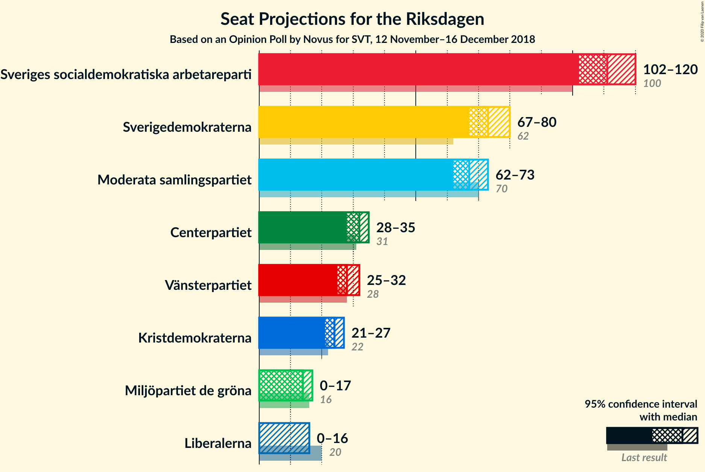
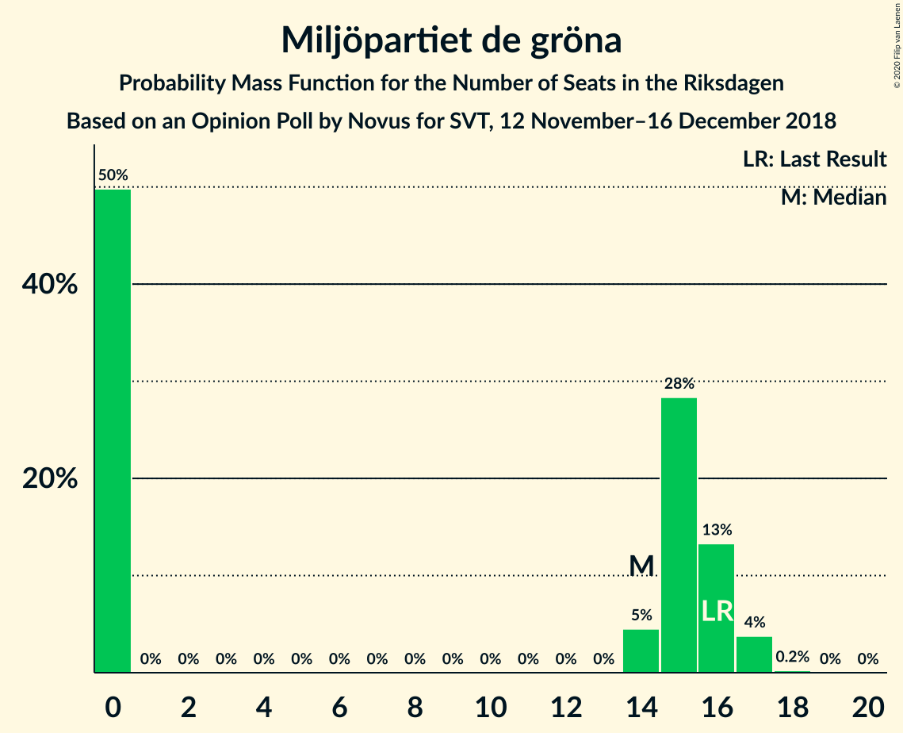
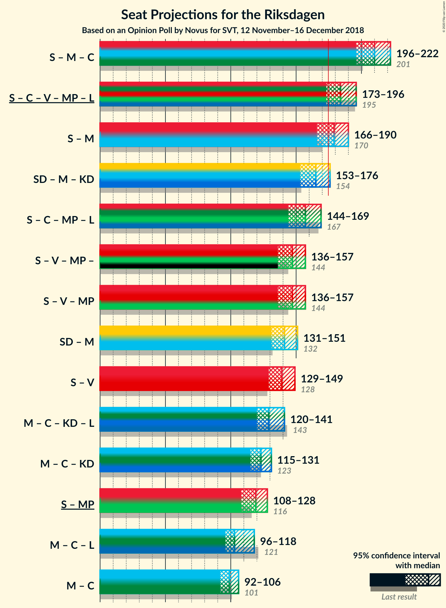

# Opinion Poll by Novus for SVT, 12 November–16 December 2018

<a href="#voting-intentions">Voting Intentions</a> | <a href="#seats">Seats</a> | <a href="#coalitions">Coalitions</a> | <a href="#technical-information">Technical Information</a>

## Voting Intentions

### Confidence Intervals

| Party | Last Result | Poll Result | 80% Confidence Interval | 90% Confidence Interval | 95% Confidence Interval | 99% Confidence Interval |
|:-----:|:-----------:|:-----------:|:-----------------------:|:-----------------------:|:-----------------------:|:-----------------------:|
| Sveriges socialdemokratiska arbetareparti | 28.3% | 30.0% | 29.2–30.8% |29.0–31.0% |28.8–31.2% |28.4–31.6% |
| Sverigedemokraterna | 17.5% | 19.8% | 19.1–20.5% |18.9–20.7% |18.7–20.9% |18.4–21.2% |
| Moderata samlingspartiet | 19.8% | 18.3% | 17.6–19.0% |17.5–19.2% |17.3–19.4% |17.0–19.7% |
| Centerpartiet | 8.6% | 8.6% | 8.1–9.1% |8.0–9.3% |7.9–9.4% |7.7–9.6% |
| Vänsterpartiet | 8.0% | 7.7% | 7.3–8.2% |7.1–8.3% |7.0–8.4% |6.8–8.7% |
| Kristdemokraterna | 6.3% | 6.5% | 6.1–7.0% |6.0–7.1% |5.9–7.2% |5.7–7.4% |
| Miljöpartiet de gröna | 4.4% | 4.0% | 3.7–4.4% |3.6–4.5% |3.5–4.6% |3.4–4.8% |
| Liberalerna | 5.5% | 3.9% | 3.6–4.3% |3.5–4.4% |3.4–4.5% |3.3–4.6% |

*Note:* The poll result column reflects the actual value used in the calculations. Published results may vary slightly, and in addition be rounded to fewer digits.

## Seats

### Confidence Intervals

| Party | Last Result | Median | 80% Confidence Interval | 90% Confidence Interval | 95% Confidence Interval | 99% Confidence Interval |
|:-----:|:-----------:|:------:|:-----------------------:|:-----------------------:|:-----------------------:|:-----------------------:|
| <a href="#sveriges-socialdemokratiska-arbetareparti">Sveriges socialdemokratiska arbetareparti</a> | 100 | 111 | 104–113 |104–116 |104–116 |104–116 |
| <a href="#sverigedemokraterna">Sverigedemokraterna</a> | 62 | 67 | 64–76 |64–76 |64–76 |64–76 |
| <a href="#moderata-samlingspartiet">Moderata samlingspartiet</a> | 70 | 68 | 64–73 |64–73 |62–73 |62–78 |
| <a href="#centerpartiet">Centerpartiet</a> | 31 | 31 | 31–36 |30–36 |26–36 |26–36 |
| <a href="#vänsterpartiet">Vänsterpartiet</a> | 28 | 28 | 28–31 |26–31 |26–31 |26–34 |
| <a href="#kristdemokraterna">Kristdemokraterna</a> | 22 | 24 | 22–27 |22–27 |22–27 |22–27 |
| <a href="#miljöpartiet-de-gröna">Miljöpartiet de gröna</a> | 16 | 14 | 0–15 |0–15 |0–15 |0–17 |
| <a href="#liberalerna">Liberalerna</a> | 20 | 0 | 0–16 |0–16 |0–16 |0–16 |

### Sveriges socialdemokratiska arbetareparti

*For a full overview of the results for this party, see the [Sveriges socialdemokratiska arbetareparti](party-sverigessocialdemokratiskaarbetareparti.html) page.*

| Number of Seats | Probability | Accumulated | Special Marks |
|:---------------:|:-----------:|:-----------:|:-------------:|
| 100 | 0.1% | 100% | Last Result |
| 101 | 0% | 99.9% |  |
| 102 | 0% | 99.9% |  |
| 103 | 0% | 99.9% |  |
| 104 | 36% | 99.9% |  |
| 105 | 0.9% | 64% |  |
| 106 | 0.7% | 63% |  |
| 107 | 0.2% | 62% |  |
| 108 | 0.1% | 62% |  |
| 109 | 0% | 62% |  |
| 110 | 0% | 62% |  |
| 111 | 26% | 62% | Median |
| 112 | 3% | 35% |  |
| 113 | 26% | 33% |  |
| 114 | 0.7% | 7% |  |
| 115 | 0% | 6% |  |
| 116 | 6% | 6% |  |
| 117 | 0% | 0% |  |

### Sverigedemokraterna

*For a full overview of the results for this party, see the [Sverigedemokraterna](party-sverigedemokraterna.html) page.*

| Number of Seats | Probability | Accumulated | Special Marks |
|:---------------:|:-----------:|:-----------:|:-------------:|
| 62 | 0% | 100% | Last Result |
| 63 | 0% | 100% |  |
| 64 | 36% | 100% |  |
| 65 | 0% | 64% |  |
| 66 | 0% | 64% |  |
| 67 | 24% | 64% | Median |
| 68 | 0% | 40% |  |
| 69 | 0% | 40% |  |
| 70 | 3% | 40% |  |
| 71 | 0% | 37% |  |
| 72 | 0.9% | 37% |  |
| 73 | 7% | 36% |  |
| 74 | 0.7% | 29% |  |
| 75 | 0% | 28% |  |
| 76 | 28% | 28% |  |
| 77 | 0% | 0% |  |

### Moderata samlingspartiet

*For a full overview of the results for this party, see the [Moderata samlingspartiet](party-moderatasamlingspartiet.html) page.*

| Number of Seats | Probability | Accumulated | Special Marks |
|:---------------:|:-----------:|:-----------:|:-------------:|
| 62 | 4% | 100% |  |
| 63 | 0.8% | 96% |  |
| 64 | 6% | 96% |  |
| 65 | 0.1% | 90% |  |
| 66 | 0% | 89% |  |
| 67 | 0% | 89% |  |
| 68 | 60% | 89% | Median |
| 69 | 0% | 29% |  |
| 70 | 0.1% | 29% | Last Result |
| 71 | 1.1% | 29% |  |
| 72 | 0% | 28% |  |
| 73 | 26% | 28% |  |
| 74 | 0% | 2% |  |
| 75 | 0% | 2% |  |
| 76 | 0% | 2% |  |
| 77 | 0% | 2% |  |
| 78 | 2% | 2% |  |
| 79 | 0% | 0% |  |

### Centerpartiet

*For a full overview of the results for this party, see the [Centerpartiet](party-centerpartiet.html) page.*

| Number of Seats | Probability | Accumulated | Special Marks |
|:---------------:|:-----------:|:-----------:|:-------------:|
| 26 | 3% | 100% |  |
| 27 | 0.2% | 97% |  |
| 28 | 0% | 97% |  |
| 29 | 2% | 97% |  |
| 30 | 0.7% | 95% |  |
| 31 | 62% | 94% | Last Result, Median |
| 32 | 0% | 33% |  |
| 33 | 6% | 33% |  |
| 34 | 0% | 26% |  |
| 35 | 0.1% | 26% |  |
| 36 | 26% | 26% |  |
| 37 | 0% | 0% |  |

### Vänsterpartiet

*For a full overview of the results for this party, see the [Vänsterpartiet](party-vänsterpartiet.html) page.*

| Number of Seats | Probability | Accumulated | Special Marks |
|:---------------:|:-----------:|:-----------:|:-------------:|
| 23 | 0.1% | 100% |  |
| 24 | 0% | 99.9% |  |
| 25 | 0% | 99.9% |  |
| 26 | 6% | 99.9% |  |
| 27 | 3% | 94% |  |
| 28 | 62% | 91% | Last Result, Median |
| 29 | 0% | 29% |  |
| 30 | 0.9% | 29% |  |
| 31 | 27% | 28% |  |
| 32 | 0.2% | 0.9% |  |
| 33 | 0% | 0.7% |  |
| 34 | 0.7% | 0.7% |  |
| 35 | 0% | 0% |  |

### Kristdemokraterna

*For a full overview of the results for this party, see the [Kristdemokraterna](party-kristdemokraterna.html) page.*

| Number of Seats | Probability | Accumulated | Special Marks |
|:---------------:|:-----------:|:-----------:|:-------------:|
| 22 | 33% | 100% | Last Result |
| 23 | 4% | 67% |  |
| 24 | 36% | 63% | Median |
| 25 | 2% | 26% |  |
| 26 | 0.7% | 25% |  |
| 27 | 24% | 24% |  |
| 28 | 0% | 0% |  |

### Miljöpartiet de gröna

*For a full overview of the results for this party, see the [Miljöpartiet de gröna](party-miljöpartietdegröna.html) page.*

| Number of Seats | Probability | Accumulated | Special Marks |
|:---------------:|:-----------:|:-----------:|:-------------:|
| 0 | 28% | 100% |  |
| 1 | 0% | 72% |  |
| 2 | 0% | 72% |  |
| 3 | 0% | 72% |  |
| 4 | 0% | 72% |  |
| 5 | 0% | 72% |  |
| 6 | 0% | 72% |  |
| 7 | 0% | 72% |  |
| 8 | 0% | 72% |  |
| 9 | 0% | 72% |  |
| 10 | 0% | 72% |  |
| 11 | 0% | 72% |  |
| 12 | 0% | 72% |  |
| 13 | 0% | 72% |  |
| 14 | 39% | 72% | Median |
| 15 | 31% | 33% |  |
| 16 | 0.1% | 2% | Last Result |
| 17 | 2% | 2% |  |
| 18 | 0% | 0% |  |

### Liberalerna

*For a full overview of the results for this party, see the [Liberalerna](party-liberalerna.html) page.*

| Number of Seats | Probability | Accumulated | Special Marks |
|:---------------:|:-----------:|:-----------:|:-------------:|
| 0 | 60% | 100% | Median |
| 1 | 0% | 40% |  |
| 2 | 0% | 40% |  |
| 3 | 0% | 40% |  |
| 4 | 0% | 40% |  |
| 5 | 0% | 40% |  |
| 6 | 0% | 40% |  |
| 7 | 0% | 40% |  |
| 8 | 0% | 40% |  |
| 9 | 0% | 40% |  |
| 10 | 0% | 40% |  |
| 11 | 0% | 40% |  |
| 12 | 0% | 40% |  |
| 13 | 0% | 40% |  |
| 14 | 0% | 40% |  |
| 15 | 3% | 40% |  |
| 16 | 37% | 37% |  |
| 17 | 0.1% | 0.1% |  |
| 18 | 0% | 0% |  |
| 19 | 0% | 0% |  |
| 20 | 0% | 0% | Last Result |

## Coalitions

### Confidence Intervals

| Coalition | Last Result | Median | Majority? | 80% Confidence Interval | 90% Confidence Interval | 95% Confidence Interval | 99% Confidence Interval |
|:---------:|:-----------:|:------:|:---------:|:-----------------------:|:-----------------------:|:-----------------------:|:-----------------------:|
| Sveriges socialdemokratiska arbetareparti – Moderata samlingspartiet – Centerpartiet | 201 | 212 | 100% | 203–220 | 203–220 | 200–220 | 200–220 |
| Sveriges socialdemokratiska arbetareparti – Moderata samlingspartiet | 170 | 181 | 60% | 172–184 | 172–184 | 172–184 | 169–191 |
| Sverigedemokraterna – Moderata samlingspartiet – Kristdemokraterna | 154 | 162 | 2% | 156–171 | 156–171 | 155–171 | 155–179 |
| Sveriges socialdemokratiska arbetareparti – Vänsterpartiet – Miljöpartiet de gröna | 144 | 146 | 0% | 142–156 | 142–157 | 142–157 | 141–162 |
| Sverigedemokraterna – Moderata samlingspartiet | 132 | 135 | 0% | 132–149 | 132–149 | 132–149 | 132–154 |
| Sveriges socialdemokratiska arbetareparti – Vänsterpartiet | 128 | 141 | 0% | 132–142 | 132–142 | 132–142 | 132–145 |
| Moderata samlingspartiet – Centerpartiet – Kristdemokraterna – Liberalerna | 143 | 131 | 0% | 126–139 | 119–139 | 119–139 | 114–139 |
| Moderata samlingspartiet – Centerpartiet – Kristdemokraterna | 123 | 126 | 0% | 120–131 | 119–131 | 111–131 | 111–132 |
| Sveriges socialdemokratiska arbetareparti – Miljöpartiet de gröna | 116 | 118 | 0% | 111–128 | 111–131 | 111–131 | 111–131 |
| Moderata samlingspartiet – Centerpartiet – Liberalerna | 121 | 109 | 0% | 99–115 | 97–115 | 97–115 | 92–115 |
| Moderata samlingspartiet – Centerpartiet | 101 | 99 | 0% | 97–109 | 97–109 | 88–109 | 88–109 |

### Sveriges socialdemokratiska arbetareparti – Moderata samlingspartiet – Centerpartiet

| Number of Seats | Probability | Accumulated | Special Marks |
|:---------------:|:-----------:|:-----------:|:-------------:|
| 192 | 0.1% | 100% |  |
| 193 | 0% | 99.9% |  |
| 194 | 0% | 99.9% |  |
| 195 | 0% | 99.9% |  |
| 196 | 0% | 99.9% |  |
| 197 | 0% | 99.9% |  |
| 198 | 0% | 99.9% |  |
| 199 | 0% | 99.9% |  |
| 200 | 4% | 99.9% |  |
| 201 | 0% | 96% | Last Result |
| 202 | 0% | 96% |  |
| 203 | 36% | 96% |  |
| 204 | 0% | 60% |  |
| 205 | 0.2% | 60% |  |
| 206 | 0.7% | 60% |  |
| 207 | 0.9% | 59% |  |
| 208 | 0% | 58% |  |
| 209 | 0.1% | 58% |  |
| 210 | 0.1% | 58% | Median |
| 211 | 0.1% | 58% |  |
| 212 | 24% | 58% |  |
| 213 | 6% | 34% |  |
| 214 | 0% | 28% |  |
| 215 | 0% | 28% |  |
| 216 | 0% | 28% |  |
| 217 | 0% | 28% |  |
| 218 | 0% | 28% |  |
| 219 | 0% | 28% |  |
| 220 | 28% | 28% |  |
| 221 | 0% | 0% |  |

### Sveriges socialdemokratiska arbetareparti – Moderata samlingspartiet

| Number of Seats | Probability | Accumulated | Special Marks |
|:---------------:|:-----------:|:-----------:|:-------------:|
| 163 | 0.1% | 100% |  |
| 164 | 0% | 99.9% |  |
| 165 | 0% | 99.9% |  |
| 166 | 0% | 99.9% |  |
| 167 | 0% | 99.9% |  |
| 168 | 0% | 99.9% |  |
| 169 | 0.7% | 99.9% |  |
| 170 | 0% | 99.2% | Last Result |
| 171 | 0% | 99.2% |  |
| 172 | 36% | 99.2% |  |
| 173 | 0% | 63% |  |
| 174 | 3% | 63% |  |
| 175 | 0.1% | 60% | Majority |
| 176 | 2% | 60% |  |
| 177 | 0% | 58% |  |
| 178 | 0.2% | 58% |  |
| 179 | 0% | 58% | Median |
| 180 | 6% | 58% |  |
| 181 | 24% | 52% |  |
| 182 | 0% | 28% |  |
| 183 | 0% | 28% |  |
| 184 | 26% | 28% |  |
| 185 | 0% | 2% |  |
| 186 | 0% | 2% |  |
| 187 | 0% | 2% |  |
| 188 | 0% | 2% |  |
| 189 | 0% | 2% |  |
| 190 | 0% | 2% |  |
| 191 | 2% | 2% |  |
| 192 | 0% | 0% |  |

### Sverigedemokraterna – Moderata samlingspartiet – Kristdemokraterna

| Number of Seats | Probability | Accumulated | Special Marks |
|:---------------:|:-----------:|:-----------:|:-------------:|
| 154 | 0% | 100% | Last Result |
| 155 | 3% | 100% |  |
| 156 | 36% | 97% |  |
| 157 | 0.7% | 61% |  |
| 158 | 0.1% | 60% |  |
| 159 | 6% | 60% | Median |
| 160 | 0% | 54% |  |
| 161 | 0% | 54% |  |
| 162 | 24% | 54% |  |
| 163 | 0.7% | 30% |  |
| 164 | 0% | 29% |  |
| 165 | 0% | 29% |  |
| 166 | 0.9% | 29% |  |
| 167 | 0.2% | 28% |  |
| 168 | 0% | 28% |  |
| 169 | 0.1% | 28% |  |
| 170 | 0.1% | 28% |  |
| 171 | 26% | 28% |  |
| 172 | 0% | 2% |  |
| 173 | 0% | 2% |  |
| 174 | 0% | 2% |  |
| 175 | 0% | 2% | Majority |
| 176 | 0% | 2% |  |
| 177 | 0% | 2% |  |
| 178 | 0% | 2% |  |
| 179 | 2% | 2% |  |
| 180 | 0% | 0% |  |

### Sveriges socialdemokratiska arbetareparti – Vänsterpartiet – Miljöpartiet de gröna

| Number of Seats | Probability | Accumulated | Special Marks |
|:---------------:|:-----------:|:-----------:|:-------------:|
| 139 | 0.2% | 100% |  |
| 140 | 0% | 99.8% |  |
| 141 | 2% | 99.8% |  |
| 142 | 26% | 98% |  |
| 143 | 0% | 72% |  |
| 144 | 0.1% | 72% | Last Result |
| 145 | 0% | 72% |  |
| 146 | 36% | 72% |  |
| 147 | 0.1% | 35% |  |
| 148 | 0% | 35% |  |
| 149 | 0% | 35% |  |
| 150 | 0% | 35% |  |
| 151 | 0% | 35% |  |
| 152 | 0.9% | 35% |  |
| 153 | 3% | 34% | Median |
| 154 | 0% | 31% |  |
| 155 | 0.7% | 31% |  |
| 156 | 24% | 31% |  |
| 157 | 6% | 7% |  |
| 158 | 0.1% | 0.8% |  |
| 159 | 0% | 0.7% |  |
| 160 | 0% | 0.7% |  |
| 161 | 0% | 0.7% |  |
| 162 | 0.7% | 0.7% |  |
| 163 | 0% | 0% |  |

### Sverigedemokraterna – Moderata samlingspartiet

| Number of Seats | Probability | Accumulated | Special Marks |
|:---------------:|:-----------:|:-----------:|:-------------:|
| 132 | 39% | 100% | Last Result |
| 133 | 0% | 61% |  |
| 134 | 0% | 61% |  |
| 135 | 25% | 61% | Median |
| 136 | 0.1% | 36% |  |
| 137 | 7% | 36% |  |
| 138 | 0% | 29% |  |
| 139 | 0% | 29% |  |
| 140 | 0% | 29% |  |
| 141 | 0% | 29% |  |
| 142 | 0% | 29% |  |
| 143 | 0.9% | 29% |  |
| 144 | 0.2% | 28% |  |
| 145 | 0% | 28% |  |
| 146 | 0.1% | 28% |  |
| 147 | 0% | 28% |  |
| 148 | 0% | 28% |  |
| 149 | 26% | 28% |  |
| 150 | 0% | 2% |  |
| 151 | 0% | 2% |  |
| 152 | 0% | 2% |  |
| 153 | 0% | 2% |  |
| 154 | 2% | 2% |  |
| 155 | 0% | 0% |  |

### Sveriges socialdemokratiska arbetareparti – Vänsterpartiet

| Number of Seats | Probability | Accumulated | Special Marks |
|:---------------:|:-----------:|:-----------:|:-------------:|
| 127 | 0.1% | 100% |  |
| 128 | 0% | 99.9% | Last Result |
| 129 | 0% | 99.9% |  |
| 130 | 0% | 99.9% |  |
| 131 | 0.1% | 99.9% |  |
| 132 | 36% | 99.9% |  |
| 133 | 0% | 63% |  |
| 134 | 0% | 63% |  |
| 135 | 0.9% | 63% |  |
| 136 | 0% | 63% |  |
| 137 | 0.1% | 63% |  |
| 138 | 0% | 63% |  |
| 139 | 3% | 63% | Median |
| 140 | 0.7% | 59% |  |
| 141 | 26% | 59% |  |
| 142 | 32% | 33% |  |
| 143 | 0% | 0.7% |  |
| 144 | 0% | 0.7% |  |
| 145 | 0.7% | 0.7% |  |
| 146 | 0% | 0% |  |

### Moderata samlingspartiet – Centerpartiet – Kristdemokraterna – Liberalerna

| Number of Seats | Probability | Accumulated | Special Marks |
|:---------------:|:-----------:|:-----------:|:-------------:|
| 114 | 0.7% | 100% |  |
| 115 | 0% | 99.3% |  |
| 116 | 0% | 99.3% |  |
| 117 | 0% | 99.3% |  |
| 118 | 0% | 99.3% |  |
| 119 | 6% | 99.3% |  |
| 120 | 0.7% | 93% |  |
| 121 | 0% | 92% |  |
| 122 | 0% | 92% |  |
| 123 | 0% | 92% | Median |
| 124 | 0% | 92% |  |
| 125 | 0.9% | 92% |  |
| 126 | 27% | 91% |  |
| 127 | 0% | 65% |  |
| 128 | 0% | 65% |  |
| 129 | 0% | 65% |  |
| 130 | 0% | 65% |  |
| 131 | 26% | 65% |  |
| 132 | 2% | 39% |  |
| 133 | 0% | 37% |  |
| 134 | 0% | 37% |  |
| 135 | 0% | 37% |  |
| 136 | 0% | 37% |  |
| 137 | 0.2% | 37% |  |
| 138 | 0% | 36% |  |
| 139 | 36% | 36% |  |
| 140 | 0% | 0% |  |
| 141 | 0% | 0% |  |
| 142 | 0% | 0% |  |
| 143 | 0% | 0% | Last Result |

### Moderata samlingspartiet – Centerpartiet – Kristdemokraterna

| Number of Seats | Probability | Accumulated | Special Marks |
|:---------------:|:-----------:|:-----------:|:-------------:|
| 111 | 3% | 100% |  |
| 112 | 0% | 97% |  |
| 113 | 0% | 97% |  |
| 114 | 0.7% | 97% |  |
| 115 | 0.1% | 96% |  |
| 116 | 0% | 96% |  |
| 117 | 0% | 96% |  |
| 118 | 0% | 96% |  |
| 119 | 6% | 96% |  |
| 120 | 0.7% | 90% |  |
| 121 | 0.2% | 89% |  |
| 122 | 0% | 89% |  |
| 123 | 36% | 89% | Last Result, Median |
| 124 | 0% | 53% |  |
| 125 | 0.9% | 53% |  |
| 126 | 24% | 52% |  |
| 127 | 0% | 28% |  |
| 128 | 0% | 28% |  |
| 129 | 0% | 28% |  |
| 130 | 0% | 28% |  |
| 131 | 26% | 28% |  |
| 132 | 2% | 2% |  |
| 133 | 0% | 0% |  |

### Sveriges socialdemokratiska arbetareparti – Miljöpartiet de gröna

| Number of Seats | Probability | Accumulated | Special Marks |
|:---------------:|:-----------:|:-----------:|:-------------:|
| 107 | 0.2% | 100% |  |
| 108 | 0% | 99.8% |  |
| 109 | 0% | 99.8% |  |
| 110 | 0% | 99.8% |  |
| 111 | 26% | 99.8% |  |
| 112 | 0% | 74% |  |
| 113 | 2% | 74% |  |
| 114 | 0% | 72% |  |
| 115 | 0% | 72% |  |
| 116 | 0% | 72% | Last Result |
| 117 | 0.1% | 72% |  |
| 118 | 36% | 72% |  |
| 119 | 0% | 35% |  |
| 120 | 0% | 35% |  |
| 121 | 0.7% | 35% |  |
| 122 | 0.9% | 35% |  |
| 123 | 0% | 34% |  |
| 124 | 0.1% | 34% |  |
| 125 | 0% | 34% | Median |
| 126 | 3% | 34% |  |
| 127 | 0% | 31% |  |
| 128 | 24% | 31% |  |
| 129 | 0% | 7% |  |
| 130 | 0% | 7% |  |
| 131 | 7% | 7% |  |
| 132 | 0% | 0% |  |

### Moderata samlingspartiet – Centerpartiet – Liberalerna

| Number of Seats | Probability | Accumulated | Special Marks |
|:---------------:|:-----------:|:-----------:|:-------------:|
| 92 | 0.7% | 100% |  |
| 93 | 0% | 99.3% |  |
| 94 | 0.7% | 99.3% |  |
| 95 | 0% | 98.6% |  |
| 96 | 0% | 98.6% |  |
| 97 | 6% | 98.6% |  |
| 98 | 0% | 92% |  |
| 99 | 24% | 92% | Median |
| 100 | 0% | 69% |  |
| 101 | 0% | 69% |  |
| 102 | 0.9% | 69% |  |
| 103 | 3% | 68% |  |
| 104 | 0% | 65% |  |
| 105 | 0% | 65% |  |
| 106 | 0% | 65% |  |
| 107 | 2% | 65% |  |
| 108 | 0% | 63% |  |
| 109 | 26% | 63% |  |
| 110 | 0% | 37% |  |
| 111 | 0% | 37% |  |
| 112 | 0% | 37% |  |
| 113 | 0% | 37% |  |
| 114 | 0.2% | 37% |  |
| 115 | 36% | 36% |  |
| 116 | 0% | 0% |  |
| 117 | 0% | 0% |  |
| 118 | 0% | 0% |  |
| 119 | 0% | 0% |  |
| 120 | 0% | 0% |  |
| 121 | 0% | 0% | Last Result |

### Moderata samlingspartiet – Centerpartiet

| Number of Seats | Probability | Accumulated | Special Marks |
|:---------------:|:-----------:|:-----------:|:-------------:|
| 88 | 3% | 100% |  |
| 89 | 0% | 97% |  |
| 90 | 0% | 97% |  |
| 91 | 0% | 97% |  |
| 92 | 0.8% | 97% |  |
| 93 | 0% | 96% |  |
| 94 | 0.7% | 96% |  |
| 95 | 0% | 96% |  |
| 96 | 0% | 96% |  |
| 97 | 6% | 96% |  |
| 98 | 0.2% | 89% |  |
| 99 | 60% | 89% | Median |
| 100 | 0% | 29% |  |
| 101 | 0% | 29% | Last Result |
| 102 | 0.9% | 29% |  |
| 103 | 0.1% | 28% |  |
| 104 | 0% | 28% |  |
| 105 | 0% | 28% |  |
| 106 | 0% | 28% |  |
| 107 | 2% | 28% |  |
| 108 | 0% | 26% |  |
| 109 | 26% | 26% |  |
| 110 | 0% | 0% |  |

## Technical Information

### Opinion Poll

+ **Polling firm:** Novus
+ **Commissioner(s):** SVT
+ **Fieldwork period:** 12 November–16 December 2018

### Calculations

+ **Sample size:** 5414
+ **Simulations done:** 1,024
+ **Error estimate:** 1.78%

