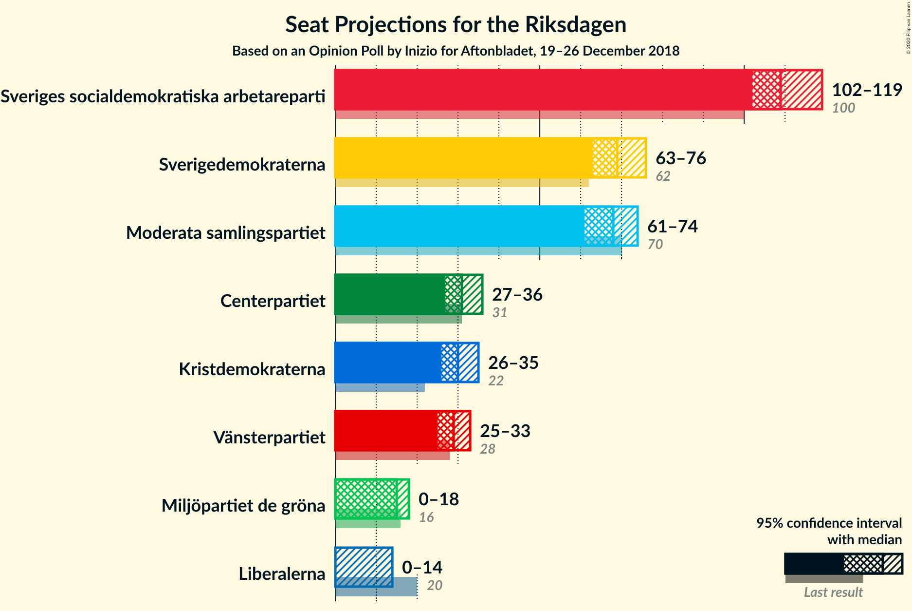
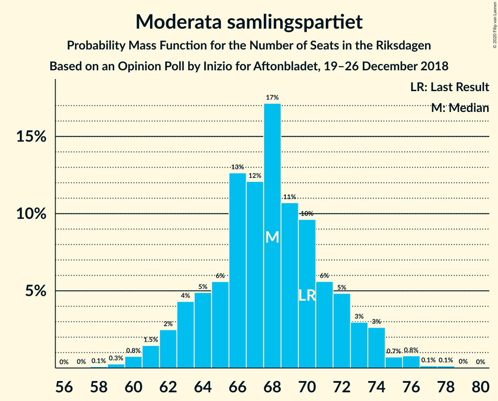
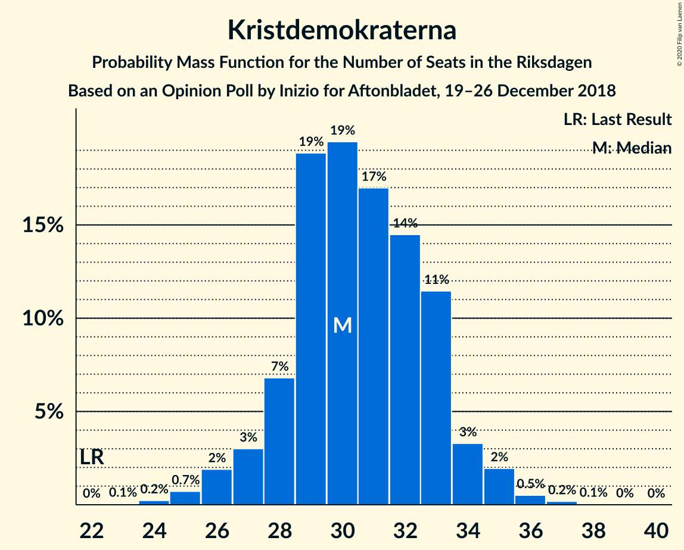
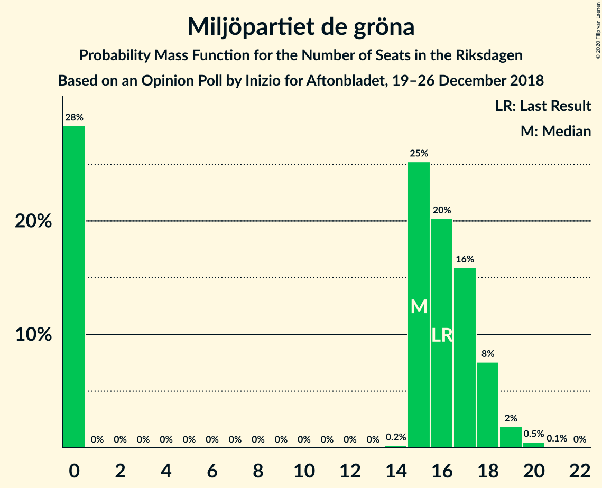
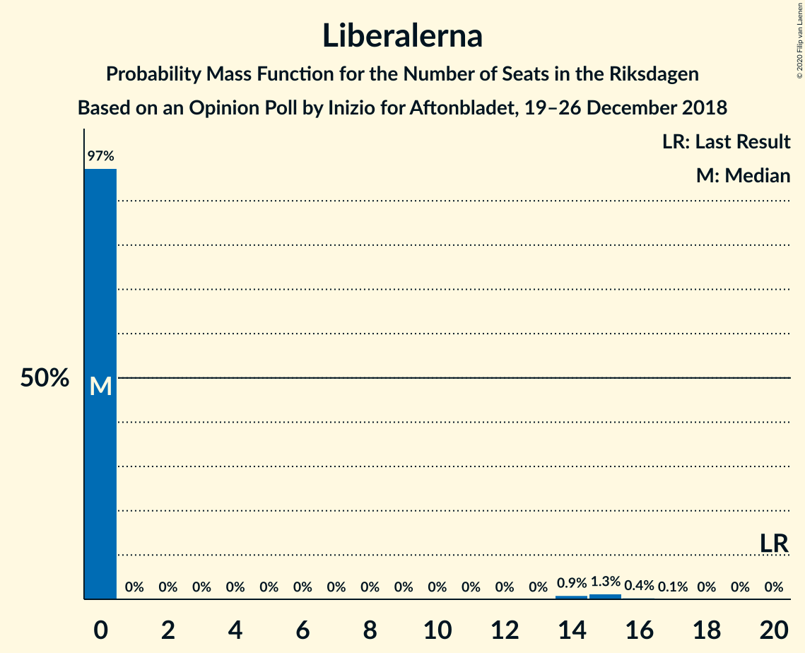
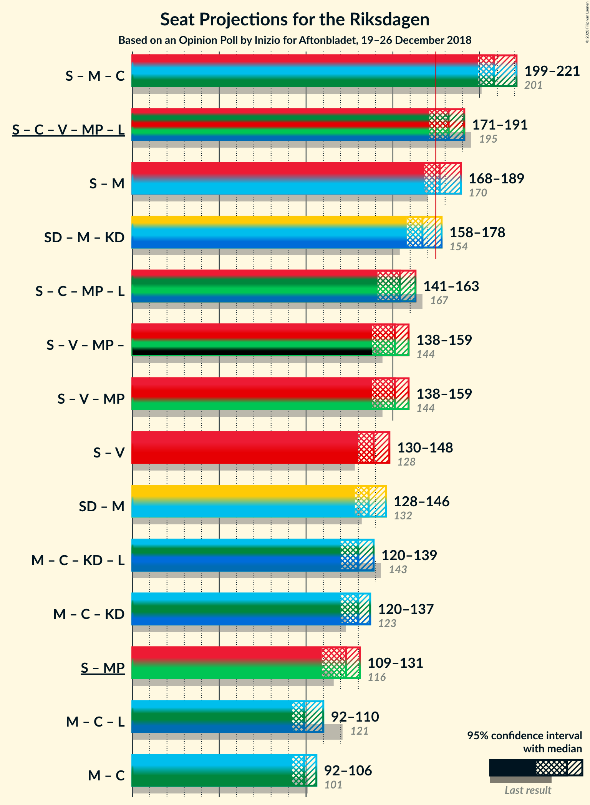

# Opinion Poll by Inizio for Aftonbladet, 19–26 December 2018

<a href="#voting-intentions">Voting Intentions</a> | <a href="#seats">Seats</a> | <a href="#coalitions">Coalitions</a> | <a href="#technical-information">Technical Information</a>

## Voting Intentions

### Confidence Intervals

| Party | Last Result | Poll Result | 80% Confidence Interval | 90% Confidence Interval | 95% Confidence Interval | 99% Confidence Interval |
|:-----:|:-----------:|:-----------:|:-----------------------:|:-----------------------:|:-----------------------:|:-----------------------:|
| Sveriges socialdemokratiska arbetareparti | 28.3% | 29.8% | 28.6–31.0% |28.2–31.4% |27.9–31.7% |27.4–32.3% |
| Sverigedemokraterna | 17.5% | 18.8% | 17.8–19.9% |17.5–20.2% |17.2–20.4% |16.8–21.0% |
| Moderata samlingspartiet | 19.8% | 18.3% | 17.3–19.3% |17.0–19.6% |16.7–19.9% |16.3–20.4% |
| Centerpartiet | 8.6% | 8.4% | 7.7–9.2% |7.5–9.4% |7.3–9.6% |7.0–10.0% |
| Kristdemokraterna | 6.3% | 8.2% | 7.5–9.0% |7.3–9.2% |7.1–9.4% |6.8–9.8% |
| Vänsterpartiet | 8.0% | 7.7% | 7.0–8.5% |6.8–8.7% |6.7–8.9% |6.4–9.2% |
| Miljöpartiet de gröna | 4.4% | 4.2% | 3.7–4.8% |3.6–5.0% |3.5–5.1% |3.2–5.4% |
| Liberalerna | 5.5% | 3.2% | 2.8–3.7% |2.7–3.9% |2.6–4.0% |2.4–4.3% |

*Note:* The poll result column reflects the actual value used in the calculations. Published results may vary slightly, and in addition be rounded to fewer digits.

## Seats

### Confidence Intervals

| Party | Last Result | Median | 80% Confidence Interval | 90% Confidence Interval | 95% Confidence Interval | 99% Confidence Interval |
|:-----:|:-----------:|:------:|:-----------------------:|:-----------------------:|:-----------------------:|:-----------------------:|
| <a href="#sveriges-socialdemokratiska-arbetareparti">Sveriges socialdemokratiska arbetareparti</a> | 100 | 111 | 105–115 |104–117 |103–118 |101–121 |
| <a href="#sverigedemokraterna">Sverigedemokraterna</a> | 62 | 69 | 66–73 |65–74 |64–75 |62–78 |
| <a href="#moderata-samlingspartiet">Moderata samlingspartiet</a> | 70 | 67 | 64–71 |63–73 |62–74 |60–76 |
| <a href="#centerpartiet">Centerpartiet</a> | 31 | 32 | 29–34 |28–35 |27–36 |27–37 |
| <a href="#kristdemokraterna">Kristdemokraterna</a> | 22 | 31 | 28–32 |28–34 |27–35 |25–36 |
| <a href="#vänsterpartiet">Vänsterpartiet</a> | 28 | 29 | 26–32 |25–32 |25–33 |23–34 |
| <a href="#miljöpartiet-de-gröna">Miljöpartiet de gröna</a> | 16 | 15 | 0–17 |0–18 |0–18 |0–20 |
| <a href="#liberalerna">Liberalerna</a> | 20 | 0 | 0 |0 |0 |0–15 |

### Sveriges socialdemokratiska arbetareparti

*For a full overview of the results for this party, see the [Sveriges socialdemokratiska arbetareparti](party-sverigessocialdemokratiskaarbetareparti.html) page.*

| Number of Seats | Probability | Accumulated | Special Marks |
|:---------------:|:-----------:|:-----------:|:-------------:|
| 97 | 0% | 100% |  |
| 98 | 0% | 99.9% |  |
| 99 | 0% | 99.9% |  |
| 100 | 0.3% | 99.9% | Last Result |
| 101 | 0.5% | 99.6% |  |
| 102 | 1.5% | 99.1% |  |
| 103 | 0.9% | 98% |  |
| 104 | 2% | 97% |  |
| 105 | 8% | 95% |  |
| 106 | 5% | 86% |  |
| 107 | 11% | 81% |  |
| 108 | 5% | 70% |  |
| 109 | 6% | 65% |  |
| 110 | 5% | 59% |  |
| 111 | 27% | 54% | Median |
| 112 | 4% | 27% |  |
| 113 | 8% | 23% |  |
| 114 | 2% | 15% |  |
| 115 | 5% | 13% |  |
| 116 | 3% | 8% |  |
| 117 | 3% | 6% |  |
| 118 | 0.2% | 3% |  |
| 119 | 1.1% | 2% |  |
| 120 | 0.8% | 1.3% |  |
| 121 | 0.3% | 0.6% |  |
| 122 | 0.1% | 0.2% |  |
| 123 | 0.1% | 0.1% |  |
| 124 | 0% | 0.1% |  |
| 125 | 0% | 0% |  |

### Sverigedemokraterna

*For a full overview of the results for this party, see the [Sverigedemokraterna](party-sverigedemokraterna.html) page.*

| Number of Seats | Probability | Accumulated | Special Marks |
|:---------------:|:-----------:|:-----------:|:-------------:|
| 60 | 0% | 100% |  |
| 61 | 0.2% | 99.9% |  |
| 62 | 0.9% | 99.7% | Last Result |
| 63 | 1.1% | 98.8% |  |
| 64 | 3% | 98% |  |
| 65 | 3% | 95% |  |
| 66 | 11% | 92% |  |
| 67 | 17% | 81% |  |
| 68 | 8% | 64% |  |
| 69 | 10% | 56% | Median |
| 70 | 15% | 46% |  |
| 71 | 8% | 31% |  |
| 72 | 10% | 23% |  |
| 73 | 5% | 12% |  |
| 74 | 4% | 8% |  |
| 75 | 1.4% | 4% |  |
| 76 | 1.0% | 2% |  |
| 77 | 0.7% | 1.2% |  |
| 78 | 0.4% | 0.6% |  |
| 79 | 0.1% | 0.2% |  |
| 80 | 0.1% | 0.1% |  |
| 81 | 0% | 0% |  |

### Moderata samlingspartiet

*For a full overview of the results for this party, see the [Moderata samlingspartiet](party-moderatasamlingspartiet.html) page.*

| Number of Seats | Probability | Accumulated | Special Marks |
|:---------------:|:-----------:|:-----------:|:-------------:|
| 58 | 0.1% | 100% |  |
| 59 | 0.3% | 99.9% |  |
| 60 | 0.6% | 99.5% |  |
| 61 | 0.9% | 98.9% |  |
| 62 | 2% | 98% |  |
| 63 | 6% | 96% |  |
| 64 | 4% | 90% |  |
| 65 | 5% | 86% |  |
| 66 | 18% | 81% |  |
| 67 | 17% | 63% | Median |
| 68 | 8% | 46% |  |
| 69 | 8% | 38% |  |
| 70 | 15% | 30% | Last Result |
| 71 | 6% | 15% |  |
| 72 | 3% | 9% |  |
| 73 | 2% | 6% |  |
| 74 | 3% | 4% |  |
| 75 | 0.5% | 1.3% |  |
| 76 | 0.4% | 0.8% |  |
| 77 | 0.1% | 0.4% |  |
| 78 | 0.2% | 0.3% |  |
| 79 | 0% | 0% |  |

### Centerpartiet

*For a full overview of the results for this party, see the [Centerpartiet](party-centerpartiet.html) page.*

| Number of Seats | Probability | Accumulated | Special Marks |
|:---------------:|:-----------:|:-----------:|:-------------:|
| 25 | 0.1% | 100% |  |
| 26 | 0.3% | 99.8% |  |
| 27 | 4% | 99.5% |  |
| 28 | 3% | 95% |  |
| 29 | 18% | 93% |  |
| 30 | 14% | 75% |  |
| 31 | 5% | 61% | Last Result |
| 32 | 40% | 56% | Median |
| 33 | 5% | 16% |  |
| 34 | 6% | 11% |  |
| 35 | 2% | 5% |  |
| 36 | 2% | 3% |  |
| 37 | 0.8% | 1.0% |  |
| 38 | 0.2% | 0.3% |  |
| 39 | 0% | 0% |  |

### Kristdemokraterna

*For a full overview of the results for this party, see the [Kristdemokraterna](party-kristdemokraterna.html) page.*

| Number of Seats | Probability | Accumulated | Special Marks |
|:---------------:|:-----------:|:-----------:|:-------------:|
| 22 | 0% | 100% | Last Result |
| 23 | 0% | 100% |  |
| 24 | 0.1% | 99.9% |  |
| 25 | 0.6% | 99.8% |  |
| 26 | 2% | 99.2% |  |
| 27 | 2% | 98% |  |
| 28 | 6% | 96% |  |
| 29 | 25% | 90% |  |
| 30 | 14% | 65% |  |
| 31 | 27% | 50% | Median |
| 32 | 15% | 23% |  |
| 33 | 3% | 8% |  |
| 34 | 3% | 6% |  |
| 35 | 2% | 3% |  |
| 36 | 0.5% | 0.8% |  |
| 37 | 0.3% | 0.3% |  |
| 38 | 0% | 0% |  |

### Vänsterpartiet

*For a full overview of the results for this party, see the [Vänsterpartiet](party-vänsterpartiet.html) page.*

| Number of Seats | Probability | Accumulated | Special Marks |
|:---------------:|:-----------:|:-----------:|:-------------:|
| 22 | 0% | 100% |  |
| 23 | 0.7% | 99.9% |  |
| 24 | 0.9% | 99.2% |  |
| 25 | 5% | 98% |  |
| 26 | 8% | 93% |  |
| 27 | 10% | 85% |  |
| 28 | 22% | 74% | Last Result |
| 29 | 23% | 52% | Median |
| 30 | 11% | 29% |  |
| 31 | 4% | 18% |  |
| 32 | 11% | 14% |  |
| 33 | 0.9% | 3% |  |
| 34 | 1.2% | 2% |  |
| 35 | 0.3% | 0.4% |  |
| 36 | 0.1% | 0.2% |  |
| 37 | 0% | 0% |  |

### Miljöpartiet de gröna

*For a full overview of the results for this party, see the [Miljöpartiet de gröna](party-miljöpartietdegröna.html) page.*

| Number of Seats | Probability | Accumulated | Special Marks |
|:---------------:|:-----------:|:-----------:|:-------------:|
| 0 | 28% | 100% |  |
| 1 | 0% | 72% |  |
| 2 | 0% | 72% |  |
| 3 | 0% | 72% |  |
| 4 | 0% | 72% |  |
| 5 | 0% | 72% |  |
| 6 | 0% | 72% |  |
| 7 | 0% | 72% |  |
| 8 | 0% | 72% |  |
| 9 | 0% | 72% |  |
| 10 | 0% | 72% |  |
| 11 | 0% | 72% |  |
| 12 | 0% | 72% |  |
| 13 | 0% | 72% |  |
| 14 | 0.1% | 72% |  |
| 15 | 29% | 72% | Median |
| 16 | 17% | 44% | Last Result |
| 17 | 19% | 27% |  |
| 18 | 5% | 8% |  |
| 19 | 2% | 2% |  |
| 20 | 0.5% | 0.5% |  |
| 21 | 0.1% | 0.1% |  |
| 22 | 0% | 0% |  |

### Liberalerna

*For a full overview of the results for this party, see the [Liberalerna](party-liberalerna.html) page.*

| Number of Seats | Probability | Accumulated | Special Marks |
|:---------------:|:-----------:|:-----------:|:-------------:|
| 0 | 98% | 100% | Median |
| 1 | 0% | 2% |  |
| 2 | 0% | 2% |  |
| 3 | 0% | 2% |  |
| 4 | 0% | 2% |  |
| 5 | 0% | 2% |  |
| 6 | 0% | 2% |  |
| 7 | 0% | 2% |  |
| 8 | 0% | 2% |  |
| 9 | 0% | 2% |  |
| 10 | 0% | 2% |  |
| 11 | 0% | 2% |  |
| 12 | 0% | 2% |  |
| 13 | 0% | 2% |  |
| 14 | 0.3% | 2% |  |
| 15 | 1.3% | 2% |  |
| 16 | 0.2% | 0.3% |  |
| 17 | 0.1% | 0.1% |  |
| 18 | 0% | 0% |  |
| 19 | 0% | 0% |  |
| 20 | 0% | 0% | Last Result |

## Coalitions

### Confidence Intervals

| Coalition | Last Result | Median | Majority? | 80% Confidence Interval | 90% Confidence Interval | 95% Confidence Interval | 99% Confidence Interval |
|:---------:|:-----------:|:------:|:---------:|:-----------------------:|:-----------------------:|:-----------------------:|:-----------------------:|
| Sveriges socialdemokratiska arbetareparti – Moderata samlingspartiet – Centerpartiet | 201 | 209 | 100% | 202–215 | 201–219 | 200–221 | 195–225 |
| Sveriges socialdemokratiska arbetareparti – Centerpartiet – Vänsterpartiet – Miljöpartiet de gröna – Liberalerna | 195 | 182 | 91% | 175–187 | 173–189 | 173–191 | 167–194 |
| Sveriges socialdemokratiska arbetareparti – Moderata samlingspartiet | 170 | 177 | 75% | 171–184 | 170–188 | 169–189 | 165–192 |
| Sverigedemokraterna – Moderata samlingspartiet – Kristdemokraterna | 154 | 167 | 9% | 162–174 | 160–176 | 158–176 | 155–182 |
| Sveriges socialdemokratiska arbetareparti – Centerpartiet – Miljöpartiet de gröna – Liberalerna | 167 | 155 | 0% | 145–159 | 144–160 | 142–163 | 138–166 |
| Sveriges socialdemokratiska arbetareparti – Vänsterpartiet – Miljöpartiet de gröna | 144 | 150 | 0% | 143–156 | 141–158 | 139–159 | 135–161 |
| Sveriges socialdemokratiska arbetareparti – Vänsterpartiet | 128 | 139 | 0% | 133–145 | 131–146 | 130–147 | 128–150 |
| Sverigedemokraterna – Moderata samlingspartiet | 132 | 137 | 0% | 132–142 | 130–144 | 127–145 | 125–150 |
| Moderata samlingspartiet – Centerpartiet – Kristdemokraterna – Liberalerna | 143 | 129 | 0% | 126–134 | 125–135 | 121–138 | 119–143 |
| Moderata samlingspartiet – Centerpartiet – Kristdemokraterna | 123 | 129 | 0% | 126–133 | 124–135 | 121–136 | 118–143 |
| Sveriges socialdemokratiska arbetareparti – Miljöpartiet de gröna | 116 | 123 | 0% | 113–128 | 111–129 | 110–131 | 105–133 |
| Moderata samlingspartiet – Centerpartiet – Liberalerna | 121 | 98 | 0% | 95–103 | 94–105 | 92–108 | 90–113 |
| Moderata samlingspartiet – Centerpartiet | 101 | 98 | 0% | 95–103 | 93–105 | 92–105 | 89–109 |

### Sveriges socialdemokratiska arbetareparti – Moderata samlingspartiet – Centerpartiet

| Number of Seats | Probability | Accumulated | Special Marks |
|:---------------:|:-----------:|:-----------:|:-------------:|
| 192 | 0.2% | 100% |  |
| 193 | 0% | 99.7% |  |
| 194 | 0.2% | 99.7% |  |
| 195 | 0.1% | 99.6% |  |
| 196 | 0.4% | 99.5% |  |
| 197 | 0.2% | 99.1% |  |
| 198 | 0.4% | 99.0% |  |
| 199 | 1.1% | 98.6% |  |
| 200 | 2% | 98% |  |
| 201 | 3% | 96% | Last Result |
| 202 | 5% | 93% |  |
| 203 | 2% | 88% |  |
| 204 | 10% | 87% |  |
| 205 | 3% | 77% |  |
| 206 | 6% | 74% |  |
| 207 | 14% | 68% |  |
| 208 | 2% | 55% |  |
| 209 | 17% | 52% |  |
| 210 | 5% | 35% | Median |
| 211 | 3% | 31% |  |
| 212 | 2% | 28% |  |
| 213 | 6% | 25% |  |
| 214 | 3% | 20% |  |
| 215 | 7% | 17% |  |
| 216 | 1.5% | 10% |  |
| 217 | 0.5% | 8% |  |
| 218 | 0.3% | 8% |  |
| 219 | 3% | 8% |  |
| 220 | 2% | 4% |  |
| 221 | 0.4% | 3% |  |
| 222 | 0.9% | 2% |  |
| 223 | 0.3% | 1.3% |  |
| 224 | 0.1% | 0.9% |  |
| 225 | 0.8% | 0.9% |  |
| 226 | 0.1% | 0.1% |  |
| 227 | 0% | 0% |  |

### Sveriges socialdemokratiska arbetareparti – Centerpartiet – Vänsterpartiet – Miljöpartiet de gröna – Liberalerna

| Number of Seats | Probability | Accumulated | Special Marks |
|:---------------:|:-----------:|:-----------:|:-------------:|
| 164 | 0.1% | 100% |  |
| 165 | 0% | 99.9% |  |
| 166 | 0.3% | 99.9% |  |
| 167 | 0.1% | 99.5% |  |
| 168 | 0% | 99.4% |  |
| 169 | 0.4% | 99.4% |  |
| 170 | 0.2% | 98.9% |  |
| 171 | 0.6% | 98.7% |  |
| 172 | 0.3% | 98% |  |
| 173 | 4% | 98% |  |
| 174 | 3% | 94% |  |
| 175 | 2% | 91% | Majority |
| 176 | 5% | 89% |  |
| 177 | 8% | 84% |  |
| 178 | 3% | 76% |  |
| 179 | 9% | 73% |  |
| 180 | 3% | 64% |  |
| 181 | 5% | 61% |  |
| 182 | 9% | 56% |  |
| 183 | 1.5% | 47% |  |
| 184 | 7% | 45% |  |
| 185 | 13% | 38% |  |
| 186 | 3% | 25% |  |
| 187 | 15% | 23% | Median |
| 188 | 1.3% | 8% |  |
| 189 | 2% | 7% |  |
| 190 | 2% | 5% |  |
| 191 | 1.2% | 3% |  |
| 192 | 0.1% | 2% |  |
| 193 | 0.9% | 2% |  |
| 194 | 0.3% | 0.8% |  |
| 195 | 0.3% | 0.4% | Last Result |
| 196 | 0% | 0.1% |  |
| 197 | 0% | 0.1% |  |
| 198 | 0% | 0.1% |  |
| 199 | 0% | 0.1% |  |
| 200 | 0% | 0% |  |

### Sveriges socialdemokratiska arbetareparti – Moderata samlingspartiet

| Number of Seats | Probability | Accumulated | Special Marks |
|:---------------:|:-----------:|:-----------:|:-------------:|
| 162 | 0.2% | 100% |  |
| 163 | 0.1% | 99.7% |  |
| 164 | 0.1% | 99.6% |  |
| 165 | 0.1% | 99.5% |  |
| 166 | 0.2% | 99.4% |  |
| 167 | 0.5% | 99.2% |  |
| 168 | 0.9% | 98.7% |  |
| 169 | 0.8% | 98% |  |
| 170 | 6% | 97% | Last Result |
| 171 | 2% | 91% |  |
| 172 | 5% | 89% |  |
| 173 | 4% | 84% |  |
| 174 | 4% | 79% |  |
| 175 | 8% | 75% | Majority |
| 176 | 1.5% | 68% |  |
| 177 | 19% | 66% |  |
| 178 | 13% | 47% | Median |
| 179 | 3% | 34% |  |
| 180 | 3% | 31% |  |
| 181 | 6% | 27% |  |
| 182 | 4% | 22% |  |
| 183 | 8% | 18% |  |
| 184 | 2% | 10% |  |
| 185 | 2% | 8% |  |
| 186 | 0.5% | 7% |  |
| 187 | 0.9% | 6% |  |
| 188 | 0.3% | 5% |  |
| 189 | 3% | 5% |  |
| 190 | 0.6% | 2% |  |
| 191 | 0.2% | 1.2% |  |
| 192 | 0.7% | 1.0% |  |
| 193 | 0.2% | 0.2% |  |
| 194 | 0% | 0.1% |  |
| 195 | 0% | 0% |  |

### Sverigedemokraterna – Moderata samlingspartiet – Kristdemokraterna

| Number of Seats | Probability | Accumulated | Special Marks |
|:---------------:|:-----------:|:-----------:|:-------------:|
| 150 | 0% | 100% |  |
| 151 | 0% | 99.9% |  |
| 152 | 0% | 99.9% |  |
| 153 | 0% | 99.9% |  |
| 154 | 0.3% | 99.9% | Last Result |
| 155 | 0.3% | 99.6% |  |
| 156 | 0.9% | 99.2% |  |
| 157 | 0.1% | 98% |  |
| 158 | 1.2% | 98% |  |
| 159 | 2% | 97% |  |
| 160 | 2% | 95% |  |
| 161 | 1.3% | 93% |  |
| 162 | 15% | 92% |  |
| 163 | 3% | 77% |  |
| 164 | 13% | 75% |  |
| 165 | 7% | 62% |  |
| 166 | 1.5% | 55% |  |
| 167 | 9% | 53% | Median |
| 168 | 5% | 44% |  |
| 169 | 3% | 39% |  |
| 170 | 9% | 36% |  |
| 171 | 3% | 27% |  |
| 172 | 8% | 24% |  |
| 173 | 5% | 16% |  |
| 174 | 2% | 11% |  |
| 175 | 3% | 9% | Majority |
| 176 | 4% | 6% |  |
| 177 | 0.3% | 2% |  |
| 178 | 0.6% | 2% |  |
| 179 | 0.2% | 1.3% |  |
| 180 | 0.4% | 1.1% |  |
| 181 | 0% | 0.6% |  |
| 182 | 0.1% | 0.6% |  |
| 183 | 0.3% | 0.5% |  |
| 184 | 0% | 0.1% |  |
| 185 | 0.1% | 0.1% |  |
| 186 | 0% | 0% |  |

### Sveriges socialdemokratiska arbetareparti – Centerpartiet – Miljöpartiet de gröna – Liberalerna

| Number of Seats | Probability | Accumulated | Special Marks |
|:---------------:|:-----------:|:-----------:|:-------------:|
| 136 | 0.1% | 100% |  |
| 137 | 0.3% | 99.9% |  |
| 138 | 0.1% | 99.6% |  |
| 139 | 0.3% | 99.5% |  |
| 140 | 0.3% | 99.1% |  |
| 141 | 1.1% | 98.8% |  |
| 142 | 0.4% | 98% |  |
| 143 | 0.5% | 97% |  |
| 144 | 5% | 97% |  |
| 145 | 11% | 92% |  |
| 146 | 0.6% | 81% |  |
| 147 | 1.0% | 81% |  |
| 148 | 2% | 80% |  |
| 149 | 4% | 78% |  |
| 150 | 2% | 74% |  |
| 151 | 9% | 72% |  |
| 152 | 2% | 62% |  |
| 153 | 3% | 60% |  |
| 154 | 6% | 56% |  |
| 155 | 7% | 50% |  |
| 156 | 7% | 44% |  |
| 157 | 10% | 37% |  |
| 158 | 16% | 26% | Median |
| 159 | 3% | 11% |  |
| 160 | 3% | 7% |  |
| 161 | 0.5% | 4% |  |
| 162 | 0.9% | 4% |  |
| 163 | 1.1% | 3% |  |
| 164 | 1.1% | 2% |  |
| 165 | 0.2% | 0.7% |  |
| 166 | 0.1% | 0.5% |  |
| 167 | 0.2% | 0.4% | Last Result |
| 168 | 0.1% | 0.2% |  |
| 169 | 0% | 0.2% |  |
| 170 | 0.1% | 0.2% |  |
| 171 | 0% | 0.1% |  |
| 172 | 0.1% | 0.1% |  |
| 173 | 0% | 0% |  |

### Sveriges socialdemokratiska arbetareparti – Vänsterpartiet – Miljöpartiet de gröna

| Number of Seats | Probability | Accumulated | Special Marks |
|:---------------:|:-----------:|:-----------:|:-------------:|
| 130 | 0% | 100% |  |
| 131 | 0% | 99.9% |  |
| 132 | 0% | 99.9% |  |
| 133 | 0% | 99.9% |  |
| 134 | 0.4% | 99.9% |  |
| 135 | 0.2% | 99.5% |  |
| 136 | 0.4% | 99.4% |  |
| 137 | 0.8% | 99.0% |  |
| 138 | 0.6% | 98% |  |
| 139 | 1.1% | 98% |  |
| 140 | 0.4% | 96% |  |
| 141 | 2% | 96% |  |
| 142 | 0.5% | 94% |  |
| 143 | 4% | 93% |  |
| 144 | 4% | 90% | Last Result |
| 145 | 9% | 86% |  |
| 146 | 3% | 77% |  |
| 147 | 3% | 74% |  |
| 148 | 3% | 71% |  |
| 149 | 8% | 68% |  |
| 150 | 10% | 59% |  |
| 151 | 5% | 50% |  |
| 152 | 3% | 44% |  |
| 153 | 7% | 41% |  |
| 154 | 2% | 34% |  |
| 155 | 16% | 33% | Median |
| 156 | 9% | 16% |  |
| 157 | 2% | 8% |  |
| 158 | 0.9% | 6% |  |
| 159 | 3% | 5% |  |
| 160 | 0.4% | 2% |  |
| 161 | 0.9% | 1.4% |  |
| 162 | 0.2% | 0.4% |  |
| 163 | 0.2% | 0.2% |  |
| 164 | 0% | 0.1% |  |
| 165 | 0% | 0% |  |

### Sveriges socialdemokratiska arbetareparti – Vänsterpartiet

| Number of Seats | Probability | Accumulated | Special Marks |
|:---------------:|:-----------:|:-----------:|:-------------:|
| 125 | 0% | 100% |  |
| 126 | 0.1% | 99.9% |  |
| 127 | 0.2% | 99.8% |  |
| 128 | 0.2% | 99.6% | Last Result |
| 129 | 0.2% | 99.4% |  |
| 130 | 2% | 99.2% |  |
| 131 | 3% | 97% |  |
| 132 | 4% | 94% |  |
| 133 | 2% | 91% |  |
| 134 | 12% | 89% |  |
| 135 | 7% | 77% |  |
| 136 | 6% | 71% |  |
| 137 | 7% | 65% |  |
| 138 | 2% | 58% |  |
| 139 | 10% | 56% |  |
| 140 | 15% | 45% | Median |
| 141 | 4% | 30% |  |
| 142 | 2% | 26% |  |
| 143 | 4% | 24% |  |
| 144 | 5% | 20% |  |
| 145 | 9% | 15% |  |
| 146 | 3% | 6% |  |
| 147 | 1.5% | 4% |  |
| 148 | 0.8% | 2% |  |
| 149 | 0.7% | 1.4% |  |
| 150 | 0.3% | 0.7% |  |
| 151 | 0.2% | 0.4% |  |
| 152 | 0% | 0.2% |  |
| 153 | 0.1% | 0.1% |  |
| 154 | 0% | 0% |  |

### Sverigedemokraterna – Moderata samlingspartiet

| Number of Seats | Probability | Accumulated | Special Marks |
|:---------------:|:-----------:|:-----------:|:-------------:|
| 122 | 0.1% | 100% |  |
| 123 | 0% | 99.9% |  |
| 124 | 0% | 99.9% |  |
| 125 | 0.5% | 99.9% |  |
| 126 | 0.2% | 99.3% |  |
| 127 | 2% | 99.1% |  |
| 128 | 0.3% | 97% |  |
| 129 | 1.2% | 97% |  |
| 130 | 2% | 96% |  |
| 131 | 2% | 94% |  |
| 132 | 6% | 92% | Last Result |
| 133 | 23% | 86% |  |
| 134 | 3% | 64% |  |
| 135 | 6% | 61% |  |
| 136 | 5% | 55% | Median |
| 137 | 6% | 51% |  |
| 138 | 10% | 45% |  |
| 139 | 4% | 35% |  |
| 140 | 2% | 30% |  |
| 141 | 7% | 28% |  |
| 142 | 11% | 21% |  |
| 143 | 3% | 10% |  |
| 144 | 2% | 7% |  |
| 145 | 3% | 5% |  |
| 146 | 0.3% | 2% |  |
| 147 | 0.7% | 2% |  |
| 148 | 0.2% | 1.0% |  |
| 149 | 0.1% | 0.8% |  |
| 150 | 0.1% | 0.6% |  |
| 151 | 0.1% | 0.5% |  |
| 152 | 0.3% | 0.4% |  |
| 153 | 0% | 0% |  |

### Moderata samlingspartiet – Centerpartiet – Kristdemokraterna – Liberalerna

| Number of Seats | Probability | Accumulated | Special Marks |
|:---------------:|:-----------:|:-----------:|:-------------:|
| 116 | 0.1% | 100% |  |
| 117 | 0.2% | 99.9% |  |
| 118 | 0.2% | 99.7% |  |
| 119 | 0.3% | 99.5% |  |
| 120 | 1.2% | 99.2% |  |
| 121 | 0.9% | 98% |  |
| 122 | 0.7% | 97% |  |
| 123 | 0.3% | 96% |  |
| 124 | 0.4% | 96% |  |
| 125 | 2% | 96% |  |
| 126 | 5% | 94% |  |
| 127 | 27% | 89% |  |
| 128 | 5% | 62% |  |
| 129 | 10% | 57% |  |
| 130 | 12% | 47% | Median |
| 131 | 7% | 36% |  |
| 132 | 13% | 28% |  |
| 133 | 5% | 15% |  |
| 134 | 2% | 10% |  |
| 135 | 3% | 8% |  |
| 136 | 1.1% | 5% |  |
| 137 | 0.8% | 4% |  |
| 138 | 0.7% | 3% |  |
| 139 | 0.2% | 2% |  |
| 140 | 0.2% | 2% |  |
| 141 | 0.1% | 2% |  |
| 142 | 0.8% | 2% |  |
| 143 | 0.8% | 1.1% | Last Result |
| 144 | 0.1% | 0.3% |  |
| 145 | 0.1% | 0.2% |  |
| 146 | 0% | 0.1% |  |
| 147 | 0% | 0.1% |  |
| 148 | 0% | 0% |  |

### Moderata samlingspartiet – Centerpartiet – Kristdemokraterna

| Number of Seats | Probability | Accumulated | Special Marks |
|:---------------:|:-----------:|:-----------:|:-------------:|
| 115 | 0% | 100% |  |
| 116 | 0.1% | 99.9% |  |
| 117 | 0.2% | 99.9% |  |
| 118 | 0.2% | 99.7% |  |
| 119 | 0.5% | 99.5% |  |
| 120 | 1.4% | 99.0% |  |
| 121 | 1.0% | 98% |  |
| 122 | 0.7% | 97% |  |
| 123 | 0.5% | 96% | Last Result |
| 124 | 0.5% | 95% |  |
| 125 | 2% | 95% |  |
| 126 | 5% | 93% |  |
| 127 | 27% | 88% |  |
| 128 | 5% | 61% |  |
| 129 | 10% | 56% |  |
| 130 | 12% | 45% | Median |
| 131 | 7% | 34% |  |
| 132 | 13% | 26% |  |
| 133 | 4% | 13% |  |
| 134 | 2% | 9% |  |
| 135 | 3% | 6% |  |
| 136 | 1.0% | 3% |  |
| 137 | 0.7% | 2% |  |
| 138 | 0.6% | 2% |  |
| 139 | 0.1% | 1.1% |  |
| 140 | 0% | 1.0% |  |
| 141 | 0% | 0.9% |  |
| 142 | 0.3% | 0.9% |  |
| 143 | 0.5% | 0.6% |  |
| 144 | 0.1% | 0.1% |  |
| 145 | 0% | 0% |  |

### Sveriges socialdemokratiska arbetareparti – Miljöpartiet de gröna

| Number of Seats | Probability | Accumulated | Special Marks |
|:---------------:|:-----------:|:-----------:|:-------------:|
| 104 | 0.1% | 100% |  |
| 105 | 0.8% | 99.9% |  |
| 106 | 0.1% | 99.1% |  |
| 107 | 0.4% | 99.0% |  |
| 108 | 0.2% | 98.6% |  |
| 109 | 0.7% | 98% |  |
| 110 | 0.7% | 98% |  |
| 111 | 3% | 97% |  |
| 112 | 3% | 94% |  |
| 113 | 6% | 91% |  |
| 114 | 0.9% | 84% |  |
| 115 | 4% | 83% |  |
| 116 | 2% | 79% | Last Result |
| 117 | 3% | 77% |  |
| 118 | 1.4% | 74% |  |
| 119 | 4% | 73% |  |
| 120 | 1.2% | 69% |  |
| 121 | 5% | 68% |  |
| 122 | 11% | 63% |  |
| 123 | 4% | 52% |  |
| 124 | 8% | 48% |  |
| 125 | 6% | 40% |  |
| 126 | 15% | 34% | Median |
| 127 | 3% | 19% |  |
| 128 | 11% | 16% |  |
| 129 | 2% | 6% |  |
| 130 | 0.8% | 4% |  |
| 131 | 1.0% | 3% |  |
| 132 | 1.5% | 2% |  |
| 133 | 0.2% | 0.5% |  |
| 134 | 0.1% | 0.3% |  |
| 135 | 0.1% | 0.2% |  |
| 136 | 0% | 0% |  |

### Moderata samlingspartiet – Centerpartiet – Liberalerna

| Number of Seats | Probability | Accumulated | Special Marks |
|:---------------:|:-----------:|:-----------:|:-------------:|
| 87 | 0% | 100% |  |
| 88 | 0.1% | 99.9% |  |
| 89 | 0.1% | 99.9% |  |
| 90 | 0.2% | 99.7% |  |
| 91 | 0.6% | 99.5% |  |
| 92 | 1.5% | 98.9% |  |
| 93 | 2% | 97% |  |
| 94 | 3% | 96% |  |
| 95 | 6% | 93% |  |
| 96 | 13% | 87% |  |
| 97 | 8% | 74% |  |
| 98 | 17% | 67% |  |
| 99 | 11% | 50% | Median |
| 100 | 3% | 38% |  |
| 101 | 9% | 36% |  |
| 102 | 14% | 27% |  |
| 103 | 4% | 14% |  |
| 104 | 3% | 10% |  |
| 105 | 3% | 7% |  |
| 106 | 0.6% | 4% |  |
| 107 | 0.8% | 3% |  |
| 108 | 0.3% | 3% |  |
| 109 | 0.5% | 2% |  |
| 110 | 0.4% | 2% |  |
| 111 | 0.1% | 1.2% |  |
| 112 | 0.6% | 1.2% |  |
| 113 | 0.2% | 0.6% |  |
| 114 | 0.1% | 0.4% |  |
| 115 | 0.2% | 0.3% |  |
| 116 | 0% | 0.1% |  |
| 117 | 0% | 0.1% |  |
| 118 | 0% | 0% |  |
| 119 | 0% | 0% |  |
| 120 | 0% | 0% |  |
| 121 | 0% | 0% | Last Result |

### Moderata samlingspartiet – Centerpartiet

| Number of Seats | Probability | Accumulated | Special Marks |
|:---------------:|:-----------:|:-----------:|:-------------:|
| 87 | 0% | 100% |  |
| 88 | 0.1% | 99.9% |  |
| 89 | 0.3% | 99.8% |  |
| 90 | 0.3% | 99.5% |  |
| 91 | 0.6% | 99.1% |  |
| 92 | 2% | 98.5% |  |
| 93 | 2% | 97% |  |
| 94 | 3% | 95% |  |
| 95 | 6% | 92% |  |
| 96 | 13% | 86% |  |
| 97 | 8% | 73% |  |
| 98 | 17% | 65% |  |
| 99 | 11% | 48% | Median |
| 100 | 3% | 37% |  |
| 101 | 9% | 34% | Last Result |
| 102 | 14% | 25% |  |
| 103 | 4% | 12% |  |
| 104 | 3% | 8% |  |
| 105 | 3% | 5% |  |
| 106 | 0.6% | 2% |  |
| 107 | 0.6% | 2% |  |
| 108 | 0.3% | 1.1% |  |
| 109 | 0.5% | 0.9% |  |
| 110 | 0.3% | 0.4% |  |
| 111 | 0% | 0.1% |  |
| 112 | 0% | 0% |  |

## Technical Information

### Opinion Poll

+ **Polling firm:** Inizio
+ **Commissioner(s):** Aftonbladet
+ **Fieldwork period:** 19–26 December 2018

### Calculations

+ **Sample size:** 2300
+ **Simulations done:** 262,144
+ **Error estimate:** 0.91%

