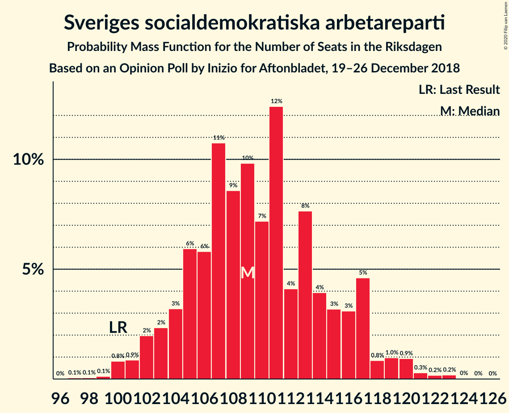
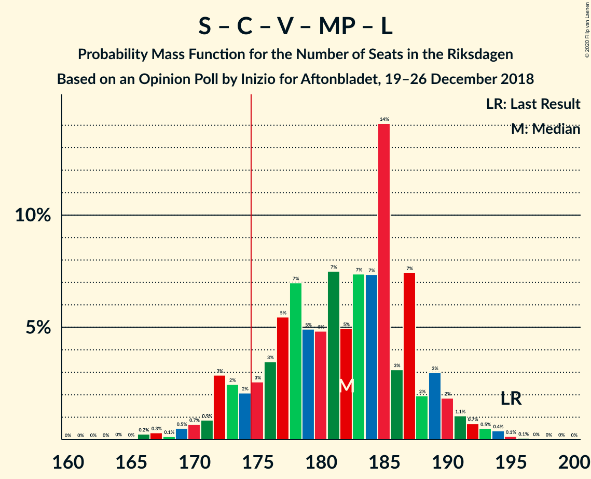

# Opinion Poll by Inizio for Aftonbladet, 19–26 December 2018

<a href="#voting-intentions">Voting Intentions</a> | <a href="#seats">Seats</a> | <a href="#coalitions">Coalitions</a> | <a href="#technical-information">Technical Information</a>

## Voting Intentions

### Confidence Intervals

| Party | Last Result | Poll Result | 80% Confidence Interval | 90% Confidence Interval | 95% Confidence Interval | 99% Confidence Interval |
|:-----:|:-----------:|:-----------:|:-----------------------:|:-----------------------:|:-----------------------:|:-----------------------:|
| Sveriges socialdemokratiska arbetareparti | 28.3% | 29.8% | 28.6–31.0% |28.2–31.4% |27.9–31.7% |27.4–32.3% |
| Sverigedemokraterna | 17.5% | 18.8% | 17.8–19.9% |17.5–20.2% |17.2–20.4% |16.8–21.0% |
| Moderata samlingspartiet | 19.8% | 18.3% | 17.3–19.3% |17.0–19.6% |16.7–19.9% |16.3–20.4% |
| Centerpartiet | 8.6% | 8.4% | 7.7–9.2% |7.5–9.4% |7.3–9.6% |7.0–10.0% |
| Kristdemokraterna | 6.3% | 8.2% | 7.5–9.0% |7.3–9.2% |7.1–9.4% |6.8–9.8% |
| Vänsterpartiet | 8.0% | 7.7% | 7.0–8.5% |6.8–8.7% |6.7–8.9% |6.4–9.2% |
| Miljöpartiet de gröna | 4.4% | 4.2% | 3.7–4.8% |3.6–5.0% |3.5–5.1% |3.2–5.4% |
| Liberalerna | 5.5% | 3.2% | 2.8–3.7% |2.7–3.9% |2.6–4.0% |2.4–4.3% |

*Note:* The poll result column reflects the actual value used in the calculations. Published results may vary slightly, and in addition be rounded to fewer digits.

## Seats

### Confidence Intervals

| Party | Last Result | Median | 80% Confidence Interval | 90% Confidence Interval | 95% Confidence Interval | 99% Confidence Interval |
|:-----:|:-----------:|:------:|:-----------------------:|:-----------------------:|:-----------------------:|:-----------------------:|
| <a href="#sveriges-socialdemokratiska-arbetareparti">Sveriges socialdemokratiska arbetareparti</a> | 100 | 111 | 105–115 |104–117 |102–117 |100–121 |
| <a href="#sverigedemokraterna">Sverigedemokraterna</a> | 62 | 70 | 66–73 |65–73 |64–76 |63–78 |
| <a href="#moderata-samlingspartiet">Moderata samlingspartiet</a> | 70 | 68 | 64–71 |63–74 |61–74 |59–77 |
| <a href="#centerpartiet">Centerpartiet</a> | 31 | 31 | 29–34 |28–36 |28–36 |27–37 |
| <a href="#kristdemokraterna">Kristdemokraterna</a> | 22 | 31 | 28–32 |28–33 |26–34 |25–36 |
| <a href="#vänsterpartiet">Vänsterpartiet</a> | 28 | 28 | 26–32 |25–32 |25–32 |23–34 |
| <a href="#miljöpartiet-de-gröna">Miljöpartiet de gröna</a> | 16 | 15 | 0–17 |0–18 |0–19 |0–19 |
| <a href="#liberalerna">Liberalerna</a> | 20 | 0 | 0 |0 |0 |0–15 |

### Sveriges socialdemokratiska arbetareparti

*For a full overview of the results for this party, see the [Sveriges socialdemokratiska arbetareparti](party-sverigessocialdemokratiskaarbetareparti.html) page.*

| Number of Seats | Probability | Accumulated | Special Marks |
|:---------------:|:-----------:|:-----------:|:-------------:|
| 97 | 0.1% | 100% |  |
| 98 | 0% | 99.9% |  |
| 99 | 0% | 99.9% |  |
| 100 | 0.4% | 99.9% | Last Result |
| 101 | 0.2% | 99.5% |  |
| 102 | 2% | 99.2% |  |
| 103 | 1.1% | 97% |  |
| 104 | 2% | 96% |  |
| 105 | 6% | 94% |  |
| 106 | 9% | 87% |  |
| 107 | 12% | 78% |  |
| 108 | 3% | 66% |  |
| 109 | 5% | 63% |  |
| 110 | 3% | 58% |  |
| 111 | 19% | 55% | Median |
| 112 | 6% | 36% |  |
| 113 | 15% | 30% |  |
| 114 | 0.9% | 15% |  |
| 115 | 5% | 14% |  |
| 116 | 0.9% | 9% |  |
| 117 | 6% | 8% |  |
| 118 | 0.1% | 2% |  |
| 119 | 1.4% | 2% |  |
| 120 | 0.1% | 0.7% |  |
| 121 | 0.4% | 0.6% |  |
| 122 | 0.1% | 0.2% |  |
| 123 | 0% | 0.1% |  |
| 124 | 0% | 0.1% |  |
| 125 | 0% | 0% |  |

### Sverigedemokraterna

*For a full overview of the results for this party, see the [Sverigedemokraterna](party-sverigedemokraterna.html) page.*

| Number of Seats | Probability | Accumulated | Special Marks |
|:---------------:|:-----------:|:-----------:|:-------------:|
| 60 | 0% | 100% |  |
| 61 | 0.1% | 99.9% |  |
| 62 | 0.3% | 99.8% | Last Result |
| 63 | 0.8% | 99.5% |  |
| 64 | 3% | 98.8% |  |
| 65 | 3% | 96% |  |
| 66 | 18% | 93% |  |
| 67 | 3% | 75% |  |
| 68 | 7% | 71% |  |
| 69 | 4% | 64% |  |
| 70 | 20% | 60% | Median |
| 71 | 11% | 40% |  |
| 72 | 17% | 29% |  |
| 73 | 7% | 12% |  |
| 74 | 0.9% | 5% |  |
| 75 | 1.4% | 4% |  |
| 76 | 1.2% | 3% |  |
| 77 | 0.7% | 1.4% |  |
| 78 | 0.5% | 0.7% |  |
| 79 | 0.1% | 0.2% |  |
| 80 | 0.1% | 0.1% |  |
| 81 | 0% | 0% |  |

### Moderata samlingspartiet

*For a full overview of the results for this party, see the [Moderata samlingspartiet](party-moderatasamlingspartiet.html) page.*

| Number of Seats | Probability | Accumulated | Special Marks |
|:---------------:|:-----------:|:-----------:|:-------------:|
| 58 | 0.1% | 100% |  |
| 59 | 0.5% | 99.9% |  |
| 60 | 0.9% | 99.4% |  |
| 61 | 1.2% | 98.6% |  |
| 62 | 0.6% | 97% |  |
| 63 | 3% | 97% |  |
| 64 | 6% | 94% |  |
| 65 | 6% | 88% |  |
| 66 | 3% | 82% |  |
| 67 | 22% | 79% |  |
| 68 | 13% | 57% | Median |
| 69 | 9% | 43% |  |
| 70 | 15% | 35% | Last Result |
| 71 | 11% | 20% |  |
| 72 | 1.0% | 10% |  |
| 73 | 2% | 9% |  |
| 74 | 5% | 6% |  |
| 75 | 0.7% | 2% |  |
| 76 | 0.5% | 1.0% |  |
| 77 | 0.1% | 0.6% |  |
| 78 | 0.4% | 0.5% |  |
| 79 | 0% | 0% |  |

### Centerpartiet

*For a full overview of the results for this party, see the [Centerpartiet](party-centerpartiet.html) page.*

| Number of Seats | Probability | Accumulated | Special Marks |
|:---------------:|:-----------:|:-----------:|:-------------:|
| 25 | 0.1% | 100% |  |
| 26 | 0.3% | 99.8% |  |
| 27 | 1.0% | 99.5% |  |
| 28 | 4% | 98.5% |  |
| 29 | 29% | 95% |  |
| 30 | 15% | 66% |  |
| 31 | 9% | 51% | Last Result, Median |
| 32 | 25% | 43% |  |
| 33 | 2% | 18% |  |
| 34 | 10% | 17% |  |
| 35 | 1.1% | 7% |  |
| 36 | 4% | 5% |  |
| 37 | 0.9% | 1.4% |  |
| 38 | 0.4% | 0.4% |  |
| 39 | 0% | 0% |  |

### Kristdemokraterna

*For a full overview of the results for this party, see the [Kristdemokraterna](party-kristdemokraterna.html) page.*

| Number of Seats | Probability | Accumulated | Special Marks |
|:---------------:|:-----------:|:-----------:|:-------------:|
| 22 | 0% | 100% | Last Result |
| 23 | 0.1% | 100% |  |
| 24 | 0.1% | 99.9% |  |
| 25 | 0.8% | 99.8% |  |
| 26 | 2% | 99.0% |  |
| 27 | 2% | 97% |  |
| 28 | 9% | 95% |  |
| 29 | 12% | 87% |  |
| 30 | 18% | 74% |  |
| 31 | 36% | 57% | Median |
| 32 | 14% | 21% |  |
| 33 | 4% | 7% |  |
| 34 | 2% | 3% |  |
| 35 | 0.3% | 1.3% |  |
| 36 | 0.8% | 1.0% |  |
| 37 | 0.2% | 0.2% |  |
| 38 | 0% | 0% |  |

### Vänsterpartiet

*For a full overview of the results for this party, see the [Vänsterpartiet](party-vänsterpartiet.html) page.*

| Number of Seats | Probability | Accumulated | Special Marks |
|:---------------:|:-----------:|:-----------:|:-------------:|
| 22 | 0% | 100% |  |
| 23 | 1.0% | 99.9% |  |
| 24 | 0.7% | 98.9% |  |
| 25 | 6% | 98% |  |
| 26 | 6% | 92% |  |
| 27 | 5% | 86% |  |
| 28 | 37% | 81% | Last Result, Median |
| 29 | 12% | 44% |  |
| 30 | 6% | 32% |  |
| 31 | 4% | 26% |  |
| 32 | 21% | 23% |  |
| 33 | 1.1% | 2% |  |
| 34 | 0.4% | 0.8% |  |
| 35 | 0.3% | 0.4% |  |
| 36 | 0.1% | 0.1% |  |
| 37 | 0% | 0% |  |

### Miljöpartiet de gröna

*For a full overview of the results for this party, see the [Miljöpartiet de gröna](party-miljöpartietdegröna.html) page.*

| Number of Seats | Probability | Accumulated | Special Marks |
|:---------------:|:-----------:|:-----------:|:-------------:|
| 0 | 35% | 100% |  |
| 1 | 0% | 65% |  |
| 2 | 0% | 65% |  |
| 3 | 0% | 65% |  |
| 4 | 0% | 65% |  |
| 5 | 0% | 65% |  |
| 6 | 0% | 65% |  |
| 7 | 0% | 65% |  |
| 8 | 0% | 65% |  |
| 9 | 0% | 65% |  |
| 10 | 0% | 65% |  |
| 11 | 0% | 65% |  |
| 12 | 0% | 65% |  |
| 13 | 0% | 65% |  |
| 14 | 0.1% | 65% |  |
| 15 | 22% | 65% | Median |
| 16 | 12% | 43% | Last Result |
| 17 | 22% | 32% |  |
| 18 | 7% | 10% |  |
| 19 | 3% | 3% |  |
| 20 | 0.2% | 0.3% |  |
| 21 | 0.1% | 0.1% |  |
| 22 | 0% | 0% |  |

### Liberalerna

*For a full overview of the results for this party, see the [Liberalerna](party-liberalerna.html) page.*

| Number of Seats | Probability | Accumulated | Special Marks |
|:---------------:|:-----------:|:-----------:|:-------------:|
| 0 | 98.6% | 100% | Median |
| 1 | 0% | 1.4% |  |
| 2 | 0% | 1.4% |  |
| 3 | 0% | 1.4% |  |
| 4 | 0% | 1.4% |  |
| 5 | 0% | 1.4% |  |
| 6 | 0% | 1.4% |  |
| 7 | 0% | 1.4% |  |
| 8 | 0% | 1.4% |  |
| 9 | 0% | 1.4% |  |
| 10 | 0% | 1.4% |  |
| 11 | 0% | 1.4% |  |
| 12 | 0% | 1.4% |  |
| 13 | 0% | 1.4% |  |
| 14 | 0.4% | 1.4% |  |
| 15 | 0.7% | 1.0% |  |
| 16 | 0.2% | 0.3% |  |
| 17 | 0.1% | 0.1% |  |
| 18 | 0% | 0% |  |
| 19 | 0% | 0% |  |
| 20 | 0% | 0% | Last Result |

## Coalitions

### Confidence Intervals

| Coalition | Last Result | Median | Majority? | 80% Confidence Interval | 90% Confidence Interval | 95% Confidence Interval | 99% Confidence Interval |
|:---------:|:-----------:|:------:|:---------:|:-----------------------:|:-----------------------:|:-----------------------:|:-----------------------:|
| Sveriges socialdemokratiska arbetareparti – Moderata samlingspartiet – Centerpartiet | 201 | 207 | 100% | 203–219 | 200–219 | 199–220 | 194–225 |
| Sveriges socialdemokratiska arbetareparti – Centerpartiet – Vänsterpartiet – Miljöpartiet de gröna – Liberalerna | 195 | 180 | 92% | 176–187 | 173–189 | 172–190 | 166–194 |
| Sveriges socialdemokratiska arbetareparti – Moderata samlingspartiet | 170 | 178 | 80% | 171–184 | 170–189 | 168–189 | 163–191 |
| Sverigedemokraterna – Moderata samlingspartiet – Kristdemokraterna | 154 | 169 | 8% | 162–173 | 160–176 | 159–177 | 155–183 |
| Sveriges socialdemokratiska arbetareparti – Centerpartiet – Miljöpartiet de gröna – Liberalerna | 167 | 151 | 0% | 145–159 | 144–160 | 144–163 | 137–165 |
| Sveriges socialdemokratiska arbetareparti – Vänsterpartiet – Miljöpartiet de gröna | 144 | 149 | 0% | 144–156 | 143–158 | 139–159 | 134–161 |
| Sveriges socialdemokratiska arbetareparti – Vänsterpartiet | 128 | 139 | 0% | 133–145 | 131–146 | 131–147 | 127–149 |
| Sverigedemokraterna – Moderata samlingspartiet | 132 | 138 | 0% | 132–142 | 130–145 | 130–147 | 125–152 |
| Moderata samlingspartiet – Centerpartiet – Kristdemokraterna – Liberalerna | 143 | 130 | 0% | 126–134 | 125–135 | 121–138 | 119–143 |
| Moderata samlingspartiet – Centerpartiet – Kristdemokraterna | 123 | 130 | 0% | 126–133 | 124–135 | 120–137 | 118–143 |
| Sveriges socialdemokratiska arbetareparti – Miljöpartiet de gröna | 116 | 122 | 0% | 113–128 | 112–129 | 110–130 | 105–133 |
| Moderata samlingspartiet – Centerpartiet – Liberalerna | 121 | 99 | 0% | 95–104 | 93–105 | 93–107 | 91–112 |
| Moderata samlingspartiet – Centerpartiet | 101 | 99 | 0% | 95–104 | 93–105 | 92–106 | 89–109 |

### Sveriges socialdemokratiska arbetareparti – Moderata samlingspartiet – Centerpartiet

| Number of Seats | Probability | Accumulated | Special Marks |
|:---------------:|:-----------:|:-----------:|:-------------:|
| 192 | 0.4% | 100% |  |
| 193 | 0% | 99.6% |  |
| 194 | 0.2% | 99.6% |  |
| 195 | 0% | 99.3% |  |
| 196 | 0.6% | 99.3% |  |
| 197 | 0.2% | 98.7% |  |
| 198 | 0.1% | 98.5% |  |
| 199 | 2% | 98% |  |
| 200 | 3% | 97% |  |
| 201 | 3% | 94% | Last Result |
| 202 | 0.6% | 91% |  |
| 203 | 2% | 90% |  |
| 204 | 13% | 88% |  |
| 205 | 0.5% | 75% |  |
| 206 | 3% | 75% |  |
| 207 | 24% | 72% |  |
| 208 | 4% | 48% |  |
| 209 | 2% | 44% |  |
| 210 | 2% | 42% | Median |
| 211 | 5% | 40% |  |
| 212 | 0.8% | 35% |  |
| 213 | 7% | 34% |  |
| 214 | 1.2% | 27% |  |
| 215 | 12% | 26% |  |
| 216 | 3% | 14% |  |
| 217 | 0.5% | 11% |  |
| 218 | 0.2% | 11% |  |
| 219 | 6% | 11% |  |
| 220 | 3% | 5% |  |
| 221 | 0.1% | 2% |  |
| 222 | 1.3% | 2% |  |
| 223 | 0.2% | 0.9% |  |
| 224 | 0.1% | 0.7% |  |
| 225 | 0.5% | 0.6% |  |
| 226 | 0.1% | 0.2% |  |
| 227 | 0% | 0% |  |

### Sveriges socialdemokratiska arbetareparti – Centerpartiet – Vänsterpartiet – Miljöpartiet de gröna – Liberalerna

| Number of Seats | Probability | Accumulated | Special Marks |
|:---------------:|:-----------:|:-----------:|:-------------:|
| 165 | 0.1% | 100% |  |
| 166 | 0.6% | 99.9% |  |
| 167 | 0% | 99.3% |  |
| 168 | 0% | 99.3% |  |
| 169 | 0.7% | 99.3% |  |
| 170 | 0.2% | 98.6% |  |
| 171 | 0.8% | 98% |  |
| 172 | 0.3% | 98% |  |
| 173 | 4% | 97% |  |
| 174 | 0.5% | 93% |  |
| 175 | 1.1% | 92% | Majority |
| 176 | 9% | 91% |  |
| 177 | 13% | 83% |  |
| 178 | 3% | 70% |  |
| 179 | 16% | 67% |  |
| 180 | 3% | 51% |  |
| 181 | 2% | 48% |  |
| 182 | 7% | 46% |  |
| 183 | 1.0% | 38% |  |
| 184 | 6% | 37% |  |
| 185 | 18% | 31% | Median |
| 186 | 2% | 13% |  |
| 187 | 3% | 11% |  |
| 188 | 2% | 9% |  |
| 189 | 2% | 7% |  |
| 190 | 3% | 5% |  |
| 191 | 0.4% | 2% |  |
| 192 | 0.1% | 1.5% |  |
| 193 | 0.6% | 1.4% |  |
| 194 | 0.4% | 0.8% |  |
| 195 | 0.3% | 0.4% | Last Result |
| 196 | 0% | 0.1% |  |
| 197 | 0% | 0% |  |

### Sveriges socialdemokratiska arbetareparti – Moderata samlingspartiet

| Number of Seats | Probability | Accumulated | Special Marks |
|:---------------:|:-----------:|:-----------:|:-------------:|
| 162 | 0.4% | 100% |  |
| 163 | 0.1% | 99.6% |  |
| 164 | 0% | 99.5% |  |
| 165 | 0.1% | 99.4% |  |
| 166 | 0.3% | 99.3% |  |
| 167 | 0.7% | 99.0% |  |
| 168 | 1.5% | 98% |  |
| 169 | 1.0% | 97% |  |
| 170 | 5% | 96% | Last Result |
| 171 | 3% | 91% |  |
| 172 | 3% | 88% |  |
| 173 | 2% | 85% |  |
| 174 | 2% | 83% |  |
| 175 | 10% | 80% | Majority |
| 176 | 1.5% | 70% |  |
| 177 | 11% | 69% |  |
| 178 | 18% | 58% |  |
| 179 | 2% | 40% | Median |
| 180 | 5% | 38% |  |
| 181 | 7% | 33% |  |
| 182 | 2% | 27% |  |
| 183 | 12% | 25% |  |
| 184 | 3% | 13% |  |
| 185 | 0.8% | 10% |  |
| 186 | 0.6% | 9% |  |
| 187 | 0.6% | 8% |  |
| 188 | 0.2% | 7% |  |
| 189 | 5% | 7% |  |
| 190 | 1.1% | 2% |  |
| 191 | 0.2% | 0.7% |  |
| 192 | 0.1% | 0.5% |  |
| 193 | 0.3% | 0.4% |  |
| 194 | 0% | 0.1% |  |
| 195 | 0% | 0.1% |  |
| 196 | 0% | 0% |  |

### Sverigedemokraterna – Moderata samlingspartiet – Kristdemokraterna

| Number of Seats | Probability | Accumulated | Special Marks |
|:---------------:|:-----------:|:-----------:|:-------------:|
| 153 | 0% | 100% |  |
| 154 | 0.3% | 99.9% | Last Result |
| 155 | 0.4% | 99.6% |  |
| 156 | 0.6% | 99.2% |  |
| 157 | 0.1% | 98.6% |  |
| 158 | 0.4% | 98.5% |  |
| 159 | 3% | 98% |  |
| 160 | 2% | 95% |  |
| 161 | 2% | 93% |  |
| 162 | 3% | 91% |  |
| 163 | 2% | 89% |  |
| 164 | 18% | 87% |  |
| 165 | 6% | 69% |  |
| 166 | 1.0% | 63% |  |
| 167 | 7% | 62% |  |
| 168 | 2% | 54% |  |
| 169 | 3% | 52% | Median |
| 170 | 16% | 49% |  |
| 171 | 3% | 33% |  |
| 172 | 13% | 30% |  |
| 173 | 9% | 17% |  |
| 174 | 1.1% | 9% |  |
| 175 | 0.5% | 8% | Majority |
| 176 | 4% | 7% |  |
| 177 | 0.3% | 3% |  |
| 178 | 0.8% | 2% |  |
| 179 | 0.2% | 2% |  |
| 180 | 0.7% | 1.4% |  |
| 181 | 0% | 0.7% |  |
| 182 | 0% | 0.7% |  |
| 183 | 0.6% | 0.7% |  |
| 184 | 0.1% | 0.1% |  |
| 185 | 0% | 0% |  |

### Sveriges socialdemokratiska arbetareparti – Centerpartiet – Miljöpartiet de gröna – Liberalerna

| Number of Seats | Probability | Accumulated | Special Marks |
|:---------------:|:-----------:|:-----------:|:-------------:|
| 136 | 0% | 100% |  |
| 137 | 0.6% | 99.9% |  |
| 138 | 0.2% | 99.4% |  |
| 139 | 0.3% | 99.2% |  |
| 140 | 0.4% | 98.9% |  |
| 141 | 0.2% | 98% |  |
| 142 | 0.4% | 98% |  |
| 143 | 0.3% | 98% |  |
| 144 | 6% | 98% |  |
| 145 | 16% | 91% |  |
| 146 | 0.4% | 75% |  |
| 147 | 1.2% | 75% |  |
| 148 | 0.6% | 73% |  |
| 149 | 5% | 73% |  |
| 150 | 3% | 68% |  |
| 151 | 16% | 64% |  |
| 152 | 1.2% | 49% |  |
| 153 | 4% | 47% |  |
| 154 | 4% | 43% |  |
| 155 | 3% | 39% |  |
| 156 | 6% | 37% |  |
| 157 | 16% | 31% | Median |
| 158 | 4% | 15% |  |
| 159 | 5% | 12% |  |
| 160 | 3% | 7% |  |
| 161 | 0.4% | 4% |  |
| 162 | 0.6% | 4% |  |
| 163 | 2% | 3% |  |
| 164 | 0.7% | 1.3% |  |
| 165 | 0.2% | 0.6% |  |
| 166 | 0.1% | 0.5% |  |
| 167 | 0.3% | 0.4% | Last Result |
| 168 | 0% | 0.1% |  |
| 169 | 0% | 0% |  |

### Sveriges socialdemokratiska arbetareparti – Vänsterpartiet – Miljöpartiet de gröna

| Number of Seats | Probability | Accumulated | Special Marks |
|:---------------:|:-----------:|:-----------:|:-------------:|
| 133 | 0% | 100% |  |
| 134 | 0.7% | 99.9% |  |
| 135 | 0.1% | 99.3% |  |
| 136 | 0.7% | 99.2% |  |
| 137 | 0.3% | 98% |  |
| 138 | 0.7% | 98% |  |
| 139 | 0.7% | 98% |  |
| 140 | 0.5% | 97% |  |
| 141 | 0.8% | 96% |  |
| 142 | 0.4% | 96% |  |
| 143 | 5% | 95% |  |
| 144 | 7% | 91% | Last Result |
| 145 | 12% | 84% |  |
| 146 | 5% | 72% |  |
| 147 | 5% | 67% |  |
| 148 | 5% | 63% |  |
| 149 | 9% | 58% |  |
| 150 | 10% | 49% |  |
| 151 | 4% | 39% |  |
| 152 | 3% | 35% |  |
| 153 | 3% | 31% |  |
| 154 | 0.5% | 28% | Median |
| 155 | 4% | 28% |  |
| 156 | 16% | 23% |  |
| 157 | 2% | 7% |  |
| 158 | 1.1% | 6% |  |
| 159 | 3% | 4% |  |
| 160 | 0.5% | 1.4% |  |
| 161 | 0.5% | 0.9% |  |
| 162 | 0.3% | 0.4% |  |
| 163 | 0% | 0.1% |  |
| 164 | 0% | 0% |  |

### Sveriges socialdemokratiska arbetareparti – Vänsterpartiet

| Number of Seats | Probability | Accumulated | Special Marks |
|:---------------:|:-----------:|:-----------:|:-------------:|
| 125 | 0% | 100% |  |
| 126 | 0.2% | 99.9% |  |
| 127 | 0.3% | 99.7% |  |
| 128 | 0.1% | 99.4% | Last Result |
| 129 | 0.2% | 99.3% |  |
| 130 | 1.1% | 99.2% |  |
| 131 | 5% | 98% |  |
| 132 | 2% | 93% |  |
| 133 | 2% | 91% |  |
| 134 | 12% | 90% |  |
| 135 | 9% | 77% |  |
| 136 | 6% | 69% |  |
| 137 | 6% | 62% |  |
| 138 | 2% | 57% |  |
| 139 | 16% | 55% | Median |
| 140 | 2% | 39% |  |
| 141 | 3% | 37% |  |
| 142 | 2% | 35% |  |
| 143 | 5% | 33% |  |
| 144 | 8% | 29% |  |
| 145 | 12% | 20% |  |
| 146 | 5% | 8% |  |
| 147 | 2% | 3% |  |
| 148 | 0.7% | 1.4% |  |
| 149 | 0.2% | 0.7% |  |
| 150 | 0.1% | 0.5% |  |
| 151 | 0.3% | 0.4% |  |
| 152 | 0% | 0.2% |  |
| 153 | 0.1% | 0.2% |  |
| 154 | 0% | 0.1% |  |
| 155 | 0% | 0% |  |

### Sverigedemokraterna – Moderata samlingspartiet

| Number of Seats | Probability | Accumulated | Special Marks |
|:---------------:|:-----------:|:-----------:|:-------------:|
| 125 | 0.9% | 100% |  |
| 126 | 0.3% | 99.0% |  |
| 127 | 0.3% | 98.7% |  |
| 128 | 0.3% | 98% |  |
| 129 | 0.4% | 98% |  |
| 130 | 3% | 98% |  |
| 131 | 4% | 95% |  |
| 132 | 2% | 91% | Last Result |
| 133 | 16% | 88% |  |
| 134 | 2% | 72% |  |
| 135 | 5% | 71% |  |
| 136 | 9% | 66% |  |
| 137 | 6% | 57% |  |
| 138 | 9% | 52% | Median |
| 139 | 2% | 43% |  |
| 140 | 3% | 41% |  |
| 141 | 10% | 39% |  |
| 142 | 20% | 29% |  |
| 143 | 2% | 9% |  |
| 144 | 0.5% | 8% |  |
| 145 | 4% | 7% |  |
| 146 | 0.1% | 3% |  |
| 147 | 1.3% | 3% |  |
| 148 | 0.4% | 1.3% |  |
| 149 | 0.2% | 1.0% |  |
| 150 | 0.1% | 0.8% |  |
| 151 | 0% | 0.7% |  |
| 152 | 0.7% | 0.7% |  |
| 153 | 0% | 0% |  |

### Moderata samlingspartiet – Centerpartiet – Kristdemokraterna – Liberalerna

| Number of Seats | Probability | Accumulated | Special Marks |
|:---------------:|:-----------:|:-----------:|:-------------:|
| 116 | 0.1% | 100% |  |
| 117 | 0.2% | 99.9% |  |
| 118 | 0.2% | 99.7% |  |
| 119 | 0.1% | 99.6% |  |
| 120 | 2% | 99.4% |  |
| 121 | 0.2% | 98% |  |
| 122 | 0.9% | 97% |  |
| 123 | 0.5% | 96% |  |
| 124 | 0.3% | 96% |  |
| 125 | 2% | 96% |  |
| 126 | 5% | 93% |  |
| 127 | 18% | 88% |  |
| 128 | 3% | 71% |  |
| 129 | 12% | 68% |  |
| 130 | 17% | 56% | Median |
| 131 | 4% | 39% |  |
| 132 | 20% | 35% |  |
| 133 | 5% | 15% |  |
| 134 | 0.6% | 10% |  |
| 135 | 5% | 9% |  |
| 136 | 1.0% | 5% |  |
| 137 | 0.9% | 4% |  |
| 138 | 1.0% | 3% |  |
| 139 | 0.2% | 2% |  |
| 140 | 0.2% | 2% |  |
| 141 | 0% | 2% |  |
| 142 | 0.5% | 1.5% |  |
| 143 | 0.8% | 1.0% | Last Result |
| 144 | 0.1% | 0.2% |  |
| 145 | 0% | 0.1% |  |
| 146 | 0% | 0.1% |  |
| 147 | 0% | 0.1% |  |
| 148 | 0% | 0% |  |

### Moderata samlingspartiet – Centerpartiet – Kristdemokraterna

| Number of Seats | Probability | Accumulated | Special Marks |
|:---------------:|:-----------:|:-----------:|:-------------:|
| 116 | 0.1% | 100% |  |
| 117 | 0.2% | 99.9% |  |
| 118 | 0.2% | 99.7% |  |
| 119 | 0.5% | 99.5% |  |
| 120 | 2% | 99.0% |  |
| 121 | 0.3% | 97% |  |
| 122 | 1.0% | 97% |  |
| 123 | 0.7% | 96% | Last Result |
| 124 | 0.5% | 95% |  |
| 125 | 2% | 95% |  |
| 126 | 5% | 92% |  |
| 127 | 18% | 87% |  |
| 128 | 3% | 69% |  |
| 129 | 12% | 66% |  |
| 130 | 17% | 54% | Median |
| 131 | 4% | 38% |  |
| 132 | 20% | 33% |  |
| 133 | 4% | 14% |  |
| 134 | 0.6% | 9% |  |
| 135 | 5% | 9% |  |
| 136 | 0.9% | 4% |  |
| 137 | 0.8% | 3% |  |
| 138 | 0.8% | 2% |  |
| 139 | 0.2% | 1.3% |  |
| 140 | 0% | 1.2% |  |
| 141 | 0% | 1.2% |  |
| 142 | 0.5% | 1.1% |  |
| 143 | 0.6% | 0.7% |  |
| 144 | 0.1% | 0.1% |  |
| 145 | 0% | 0% |  |

### Sveriges socialdemokratiska arbetareparti – Miljöpartiet de gröna

| Number of Seats | Probability | Accumulated | Special Marks |
|:---------------:|:-----------:|:-----------:|:-------------:|
| 104 | 0.1% | 100% |  |
| 105 | 0.6% | 99.9% |  |
| 106 | 0.1% | 99.3% |  |
| 107 | 0.4% | 99.2% |  |
| 108 | 0.1% | 98.8% |  |
| 109 | 0.5% | 98.7% |  |
| 110 | 1.0% | 98% |  |
| 111 | 1.0% | 97% |  |
| 112 | 6% | 96% |  |
| 113 | 12% | 90% |  |
| 114 | 0.4% | 78% |  |
| 115 | 5% | 78% |  |
| 116 | 1.0% | 73% | Last Result |
| 117 | 5% | 72% |  |
| 118 | 3% | 67% |  |
| 119 | 4% | 64% |  |
| 120 | 0.3% | 61% |  |
| 121 | 8% | 60% |  |
| 122 | 14% | 53% |  |
| 123 | 0.8% | 38% |  |
| 124 | 4% | 37% |  |
| 125 | 7% | 33% |  |
| 126 | 0.5% | 26% | Median |
| 127 | 3% | 26% |  |
| 128 | 17% | 23% |  |
| 129 | 2% | 6% |  |
| 130 | 0.9% | 3% |  |
| 131 | 2% | 2% |  |
| 132 | 0.3% | 0.8% |  |
| 133 | 0.3% | 0.5% |  |
| 134 | 0.1% | 0.2% |  |
| 135 | 0.1% | 0.1% |  |
| 136 | 0% | 0% |  |

### Moderata samlingspartiet – Centerpartiet – Liberalerna

| Number of Seats | Probability | Accumulated | Special Marks |
|:---------------:|:-----------:|:-----------:|:-------------:|
| 88 | 0.1% | 100% |  |
| 89 | 0.1% | 99.9% |  |
| 90 | 0.3% | 99.8% |  |
| 91 | 0.4% | 99.5% |  |
| 92 | 2% | 99.1% |  |
| 93 | 3% | 98% |  |
| 94 | 2% | 95% |  |
| 95 | 4% | 93% |  |
| 96 | 17% | 89% |  |
| 97 | 9% | 72% |  |
| 98 | 5% | 63% |  |
| 99 | 9% | 59% | Median |
| 100 | 3% | 50% |  |
| 101 | 16% | 47% |  |
| 102 | 15% | 30% |  |
| 103 | 4% | 15% |  |
| 104 | 5% | 11% |  |
| 105 | 2% | 6% |  |
| 106 | 1.0% | 4% |  |
| 107 | 1.1% | 3% |  |
| 108 | 0.4% | 2% |  |
| 109 | 0.6% | 2% |  |
| 110 | 0.4% | 1.1% |  |
| 111 | 0.1% | 0.7% |  |
| 112 | 0.2% | 0.6% |  |
| 113 | 0.3% | 0.4% |  |
| 114 | 0% | 0.1% |  |
| 115 | 0% | 0.1% |  |
| 116 | 0% | 0.1% |  |
| 117 | 0% | 0.1% |  |
| 118 | 0% | 0% |  |
| 119 | 0% | 0% |  |
| 120 | 0% | 0% |  |
| 121 | 0% | 0% | Last Result |

### Moderata samlingspartiet – Centerpartiet

| Number of Seats | Probability | Accumulated | Special Marks |
|:---------------:|:-----------:|:-----------:|:-------------:|
| 87 | 0% | 100% |  |
| 88 | 0.1% | 99.9% |  |
| 89 | 0.5% | 99.9% |  |
| 90 | 0.4% | 99.4% |  |
| 91 | 0.4% | 99.0% |  |
| 92 | 2% | 98.6% |  |
| 93 | 3% | 97% |  |
| 94 | 2% | 94% |  |
| 95 | 4% | 92% |  |
| 96 | 17% | 88% |  |
| 97 | 9% | 71% |  |
| 98 | 5% | 62% |  |
| 99 | 9% | 57% | Median |
| 100 | 3% | 49% |  |
| 101 | 16% | 45% | Last Result |
| 102 | 15% | 29% |  |
| 103 | 3% | 14% |  |
| 104 | 5% | 10% |  |
| 105 | 2% | 5% |  |
| 106 | 1.0% | 3% |  |
| 107 | 1.0% | 2% |  |
| 108 | 0.4% | 1.4% |  |
| 109 | 0.6% | 1.0% |  |
| 110 | 0.4% | 0.5% |  |
| 111 | 0% | 0.1% |  |
| 112 | 0% | 0% |  |

## Technical Information

### Opinion Poll

+ **Polling firm:** Inizio
+ **Commissioner(s):** Aftonbladet
+ **Fieldwork period:** 19–26 December 2018

### Calculations

+ **Sample size:** 2300
+ **Simulations done:** 131,072
+ **Error estimate:** 0.81%

