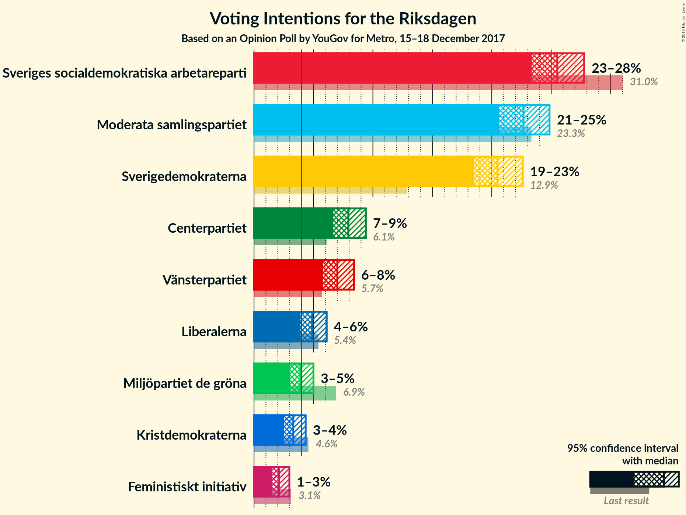
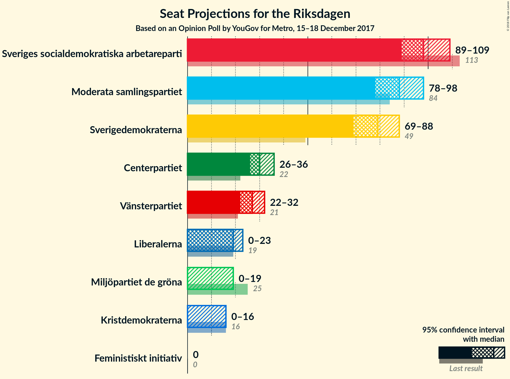
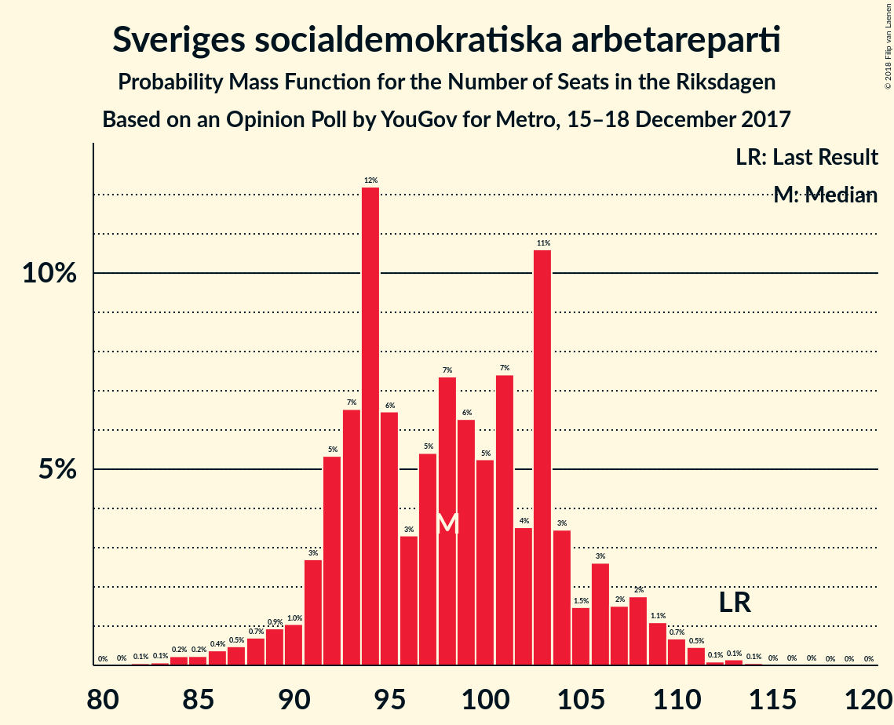
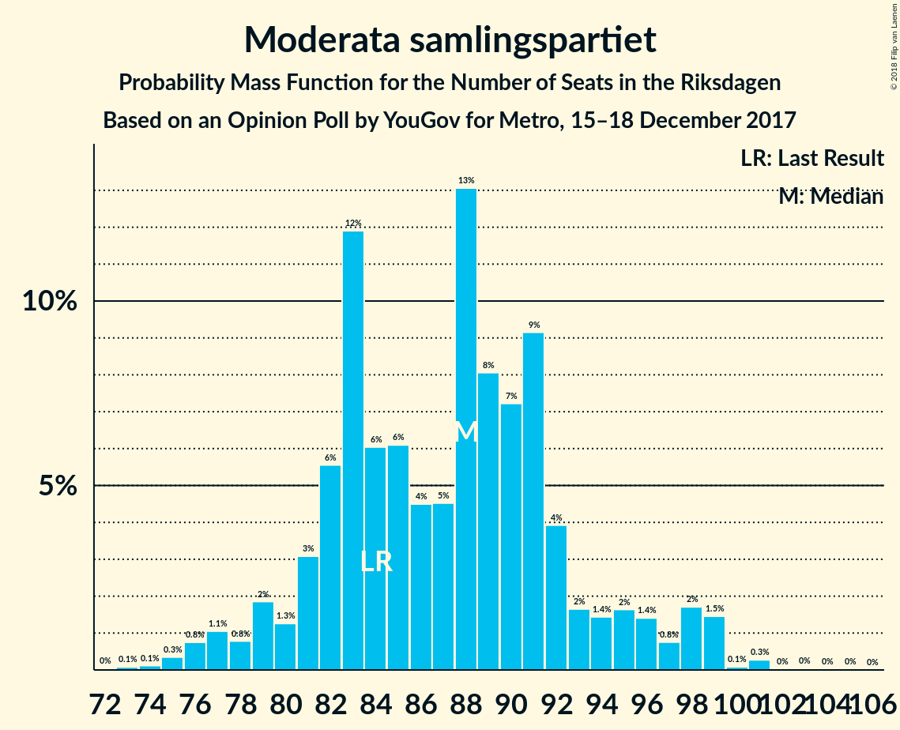
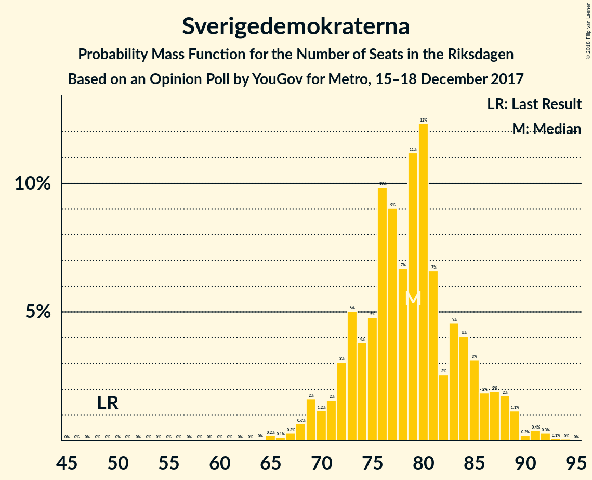
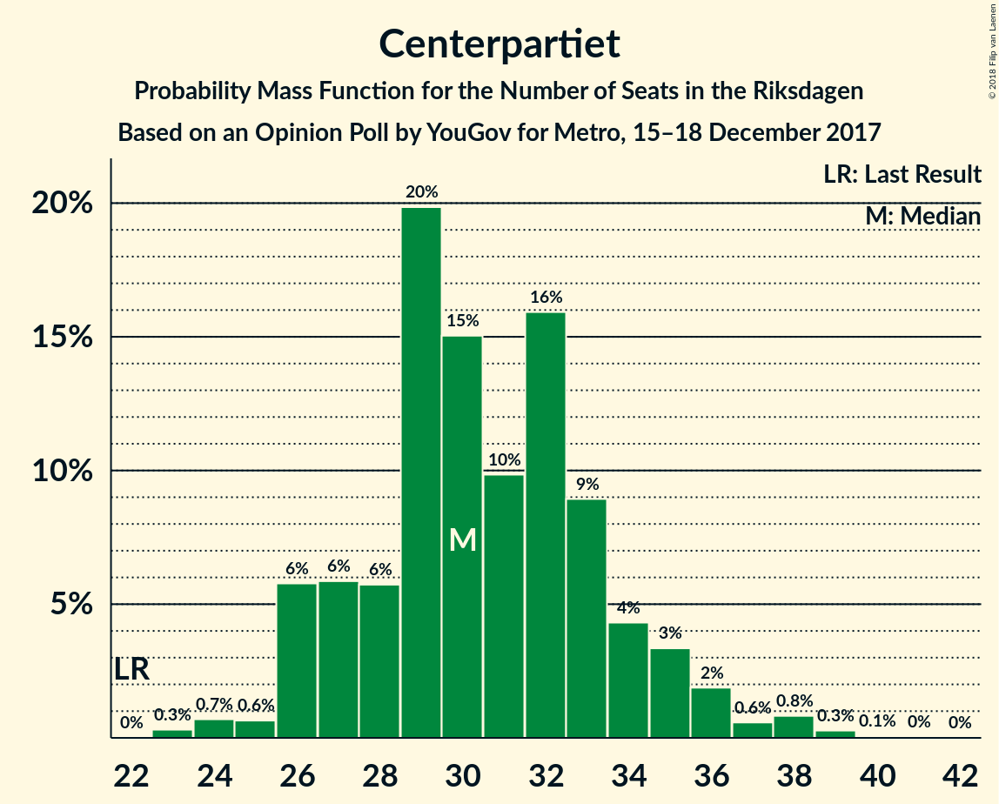
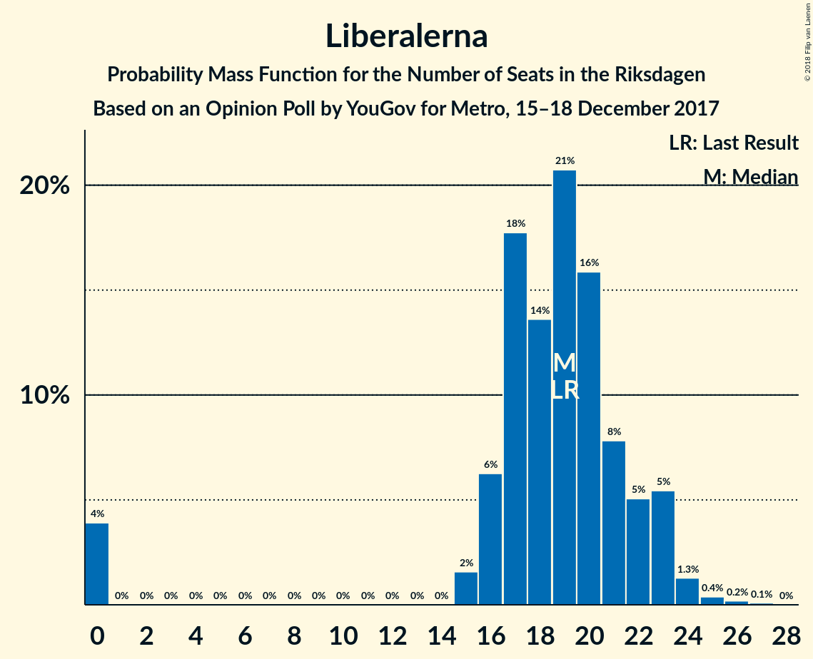
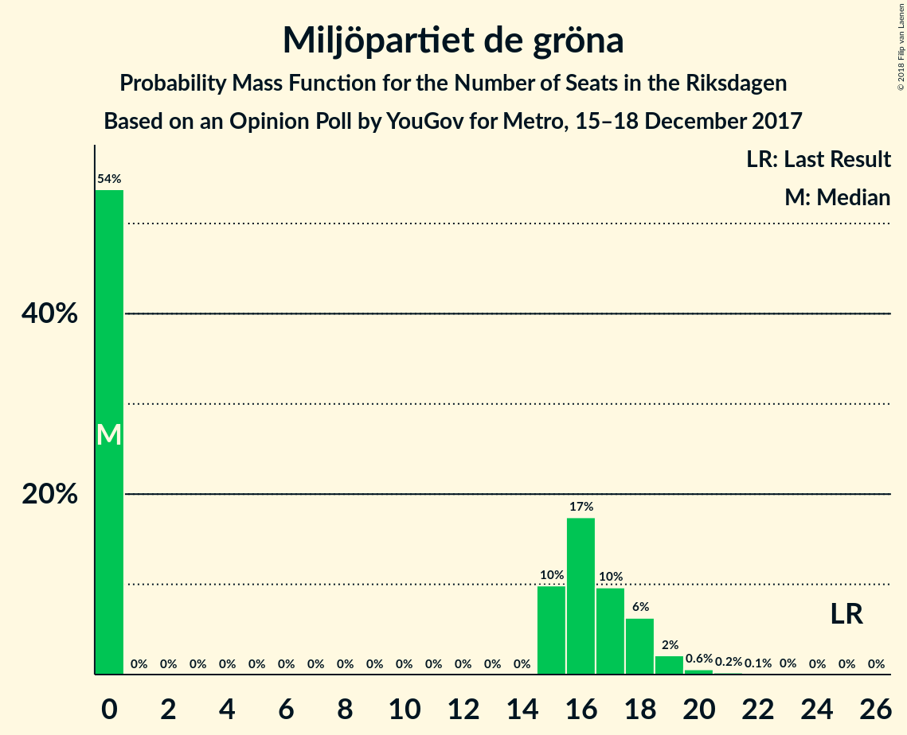
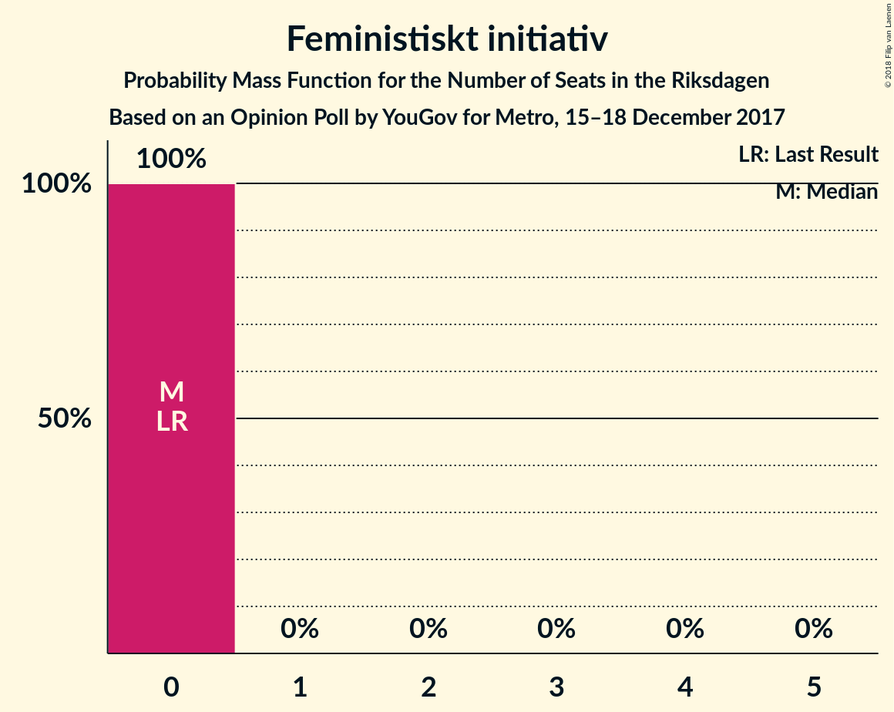
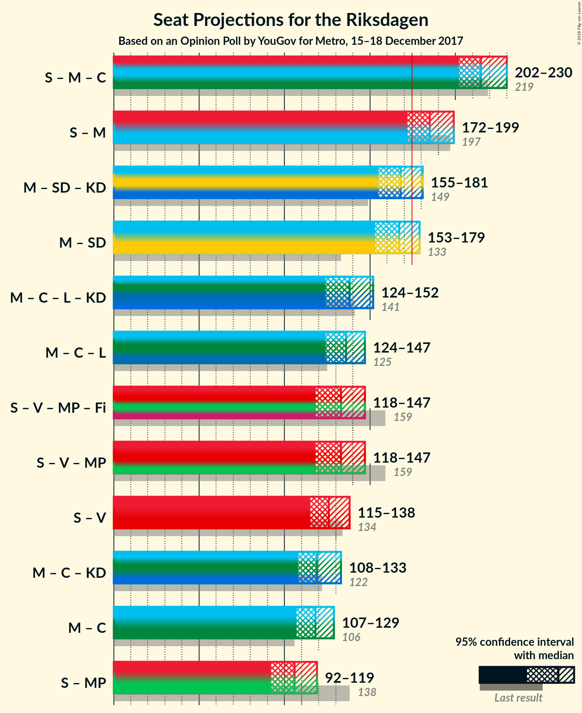

# Opinion Poll by YouGov for Metro, 15–18 December 2017

<a href="#voting-intentions">Voting Intentions</a> | <a href="#seats">Seats</a> | <a href="#coalitions">Coalitions</a> | <a href="#technical-information">Technical Information</a>

## Voting Intentions

### Confidence Intervals

| Party | Last Result | Poll Result | 80% Confidence Interval | 90% Confidence Interval | 95% Confidence Interval | 99% Confidence Interval |
|:-----:|:-----------:|:-----------:|:-----------------------:|:-----------------------:|:-----------------------:|:-----------------------:|
| Sveriges socialdemokratiska arbetareparti | 31.0% | 25.5% | 24.1–27.0% |23.7–27.4% |23.4–27.8% |22.7–28.5% |
| Moderata samlingspartiet | 23.3% | 22.7% | 21.3–24.1% |21.0–24.5% |20.6–24.9% |20.0–25.5% |
| Sverigedemokraterna | 12.9% | 20.5% | 19.2–21.9% |18.8–22.3% |18.5–22.6% |17.9–23.3% |
| Centerpartiet | 6.1% | 7.9% | 7.1–8.9% |6.9–9.2% |6.7–9.4% |6.3–9.9% |
| Vänsterpartiet | 5.7% | 7.0% | 6.2–7.9% |6.0–8.2% |5.8–8.4% |5.5–8.9% |
| Liberalerna | 5.4% | 4.9% | 4.2–5.7% |4.1–5.9% |3.9–6.1% |3.6–6.5% |
| Miljöpartiet de gröna | 6.9% | 3.9% | 3.3–4.6% |3.2–4.8% |3.0–5.0% |2.8–5.4% |
| Kristdemokraterna | 4.6% | 3.3% | 2.8–4.0% |2.6–4.2% |2.5–4.3% |2.3–4.7% |
| Feministiskt initiativ | 3.1% | 2.1% | 1.7–2.7% |1.6–2.8% |1.5–3.0% |1.3–3.3% |

*Note:* The poll result column reflects the actual value used in the calculations. Published results may vary slightly, and in addition be rounded to fewer digits.

## Seats

### Confidence Intervals

| Party | Last Result | Median | 80% Confidence Interval | 90% Confidence Interval | 95% Confidence Interval | 99% Confidence Interval |
|:-----:|:-----------:|:------:|:-----------------------:|:-----------------------:|:-----------------------:|:-----------------------:|
| <a href="#sveriges-socialdemokratiska-arbetareparti">Sveriges socialdemokratiska arbetareparti</a> | 113 | 98 | 92–104 |91–107 |89–109 |85–111 |
| <a href="#moderata-samlingspartiet">Moderata samlingspartiet</a> | 84 | 88 | 82–93 |79–96 |78–98 |75–99 |
| <a href="#sverigedemokraterna">Sverigedemokraterna</a> | 49 | 79 | 73–85 |71–87 |69–88 |67–91 |
| <a href="#centerpartiet">Centerpartiet</a> | 22 | 30 | 27–34 |26–35 |26–36 |24–38 |
| <a href="#vänsterpartiet">Vänsterpartiet</a> | 21 | 27 | 23–31 |23–32 |22–32 |21–34 |
| <a href="#liberalerna">Liberalerna</a> | 19 | 19 | 16–22 |15–23 |0–23 |0–25 |
| <a href="#miljöpartiet-de-gröna">Miljöpartiet de gröna</a> | 25 | 0 | 0–17 |0–18 |0–19 |0–20 |
| <a href="#kristdemokraterna">Kristdemokraterna</a> | 16 | 0 | 0–15 |0–15 |0–16 |0–17 |
| <a href="#feministiskt-initiativ">Feministiskt initiativ</a> | 0 | 0 | 0 |0 |0 |0 |

### Sveriges socialdemokratiska arbetareparti

*For a full overview of the results for this party, see the [Sveriges socialdemokratiska arbetareparti](party-sverigessocialdemokratiskaarbetareparti.html) page.*

| Number of Seats | Probability | Accumulated | Special Marks |
|:---------------:|:-----------:|:-----------:|:-------------:|
| 82 | 0.1% | 100% |  |
| 83 | 0.1% | 99.9% |  |
| 84 | 0.2% | 99.8% |  |
| 85 | 0.2% | 99.6% |  |
| 86 | 0.4% | 99.4% |  |
| 87 | 0.5% | 99.0% |  |
| 88 | 0.7% | 98.5% |  |
| 89 | 0.9% | 98% |  |
| 90 | 1.0% | 97% |  |
| 91 | 3% | 96% |  |
| 92 | 5% | 93% |  |
| 93 | 7% | 88% |  |
| 94 | 12% | 81% |  |
| 95 | 6% | 69% |  |
| 96 | 3% | 63% |  |
| 97 | 5% | 59% |  |
| 98 | 7% | 54% | Median |
| 99 | 6% | 46% |  |
| 100 | 5% | 40% |  |
| 101 | 7% | 35% |  |
| 102 | 4% | 28% |  |
| 103 | 11% | 24% |  |
| 104 | 3% | 13% |  |
| 105 | 1.5% | 10% |  |
| 106 | 3% | 8% |  |
| 107 | 2% | 6% |  |
| 108 | 2% | 4% |  |
| 109 | 1.1% | 3% |  |
| 110 | 0.7% | 2% |  |
| 111 | 0.5% | 0.8% |  |
| 112 | 0.1% | 0.4% |  |
| 113 | 0.1% | 0.3% | Last Result |
| 114 | 0.1% | 0.1% |  |
| 115 | 0% | 0.1% |  |
| 116 | 0% | 0% |  |

### Moderata samlingspartiet

*For a full overview of the results for this party, see the [Moderata samlingspartiet](party-moderatasamlingspartiet.html) page.*

| Number of Seats | Probability | Accumulated | Special Marks |
|:---------------:|:-----------:|:-----------:|:-------------:|
| 72 | 0% | 100% |  |
| 73 | 0.1% | 99.9% |  |
| 74 | 0.1% | 99.9% |  |
| 75 | 0.3% | 99.7% |  |
| 76 | 0.8% | 99.4% |  |
| 77 | 1.1% | 98.6% |  |
| 78 | 0.8% | 98% |  |
| 79 | 2% | 97% |  |
| 80 | 1.3% | 95% |  |
| 81 | 3% | 94% |  |
| 82 | 6% | 91% |  |
| 83 | 12% | 85% |  |
| 84 | 6% | 73% | Last Result |
| 85 | 6% | 67% |  |
| 86 | 4% | 61% |  |
| 87 | 5% | 57% |  |
| 88 | 13% | 52% | Median |
| 89 | 8% | 39% |  |
| 90 | 7% | 31% |  |
| 91 | 9% | 24% |  |
| 92 | 4% | 14% |  |
| 93 | 2% | 11% |  |
| 94 | 1.4% | 9% |  |
| 95 | 2% | 7% |  |
| 96 | 1.4% | 6% |  |
| 97 | 0.8% | 4% |  |
| 98 | 2% | 4% |  |
| 99 | 1.5% | 2% |  |
| 100 | 0.1% | 0.5% |  |
| 101 | 0.3% | 0.4% |  |
| 102 | 0% | 0.1% |  |
| 103 | 0% | 0.1% |  |
| 104 | 0% | 0.1% |  |
| 105 | 0% | 0% |  |

### Sverigedemokraterna

*For a full overview of the results for this party, see the [Sverigedemokraterna](party-sverigedemokraterna.html) page.*

| Number of Seats | Probability | Accumulated | Special Marks |
|:---------------:|:-----------:|:-----------:|:-------------:|
| 49 | 0% | 100% | Last Result |
| 50 | 0% | 100% |  |
| 51 | 0% | 100% |  |
| 52 | 0% | 100% |  |
| 53 | 0% | 100% |  |
| 54 | 0% | 100% |  |
| 55 | 0% | 100% |  |
| 56 | 0% | 100% |  |
| 57 | 0% | 100% |  |
| 58 | 0% | 100% |  |
| 59 | 0% | 100% |  |
| 60 | 0% | 100% |  |
| 61 | 0% | 100% |  |
| 62 | 0% | 100% |  |
| 63 | 0% | 100% |  |
| 64 | 0% | 100% |  |
| 65 | 0.2% | 100% |  |
| 66 | 0.1% | 99.8% |  |
| 67 | 0.3% | 99.7% |  |
| 68 | 0.6% | 99.4% |  |
| 69 | 2% | 98.7% |  |
| 70 | 1.2% | 97% |  |
| 71 | 2% | 96% |  |
| 72 | 3% | 94% |  |
| 73 | 5% | 91% |  |
| 74 | 4% | 86% |  |
| 75 | 5% | 82% |  |
| 76 | 10% | 78% |  |
| 77 | 9% | 68% |  |
| 78 | 7% | 59% |  |
| 79 | 11% | 52% | Median |
| 80 | 12% | 41% |  |
| 81 | 7% | 29% |  |
| 82 | 3% | 22% |  |
| 83 | 5% | 19% |  |
| 84 | 4% | 15% |  |
| 85 | 3% | 11% |  |
| 86 | 2% | 8% |  |
| 87 | 2% | 6% |  |
| 88 | 2% | 4% |  |
| 89 | 1.1% | 2% |  |
| 90 | 0.2% | 1.0% |  |
| 91 | 0.4% | 0.8% |  |
| 92 | 0.3% | 0.4% |  |
| 93 | 0.1% | 0.2% |  |
| 94 | 0% | 0.1% |  |
| 95 | 0% | 0% |  |

### Centerpartiet

*For a full overview of the results for this party, see the [Centerpartiet](party-centerpartiet.html) page.*

| Number of Seats | Probability | Accumulated | Special Marks |
|:---------------:|:-----------:|:-----------:|:-------------:|
| 22 | 0% | 100% | Last Result |
| 23 | 0.3% | 100% |  |
| 24 | 0.7% | 99.7% |  |
| 25 | 0.6% | 99.0% |  |
| 26 | 6% | 98% |  |
| 27 | 6% | 93% |  |
| 28 | 6% | 87% |  |
| 29 | 20% | 81% |  |
| 30 | 15% | 61% | Median |
| 31 | 10% | 46% |  |
| 32 | 16% | 36% |  |
| 33 | 9% | 20% |  |
| 34 | 4% | 11% |  |
| 35 | 3% | 7% |  |
| 36 | 2% | 4% |  |
| 37 | 0.6% | 2% |  |
| 38 | 0.8% | 1.2% |  |
| 39 | 0.3% | 0.4% |  |
| 40 | 0.1% | 0.1% |  |
| 41 | 0% | 0.1% |  |
| 42 | 0% | 0% |  |

### Vänsterpartiet

*For a full overview of the results for this party, see the [Vänsterpartiet](party-vänsterpartiet.html) page.*

| Number of Seats | Probability | Accumulated | Special Marks |
|:---------------:|:-----------:|:-----------:|:-------------:|
| 19 | 0.1% | 100% |  |
| 20 | 0.2% | 99.9% |  |
| 21 | 0.7% | 99.8% | Last Result |
| 22 | 2% | 99.0% |  |
| 23 | 9% | 97% |  |
| 24 | 7% | 88% |  |
| 25 | 11% | 81% |  |
| 26 | 13% | 70% |  |
| 27 | 17% | 57% | Median |
| 28 | 11% | 40% |  |
| 29 | 6% | 29% |  |
| 30 | 8% | 24% |  |
| 31 | 9% | 16% |  |
| 32 | 5% | 7% |  |
| 33 | 1.1% | 2% |  |
| 34 | 0.6% | 0.9% |  |
| 35 | 0.3% | 0.4% |  |
| 36 | 0.1% | 0.1% |  |
| 37 | 0% | 0% |  |

### Liberalerna

*For a full overview of the results for this party, see the [Liberalerna](party-liberalerna.html) page.*

| Number of Seats | Probability | Accumulated | Special Marks |
|:---------------:|:-----------:|:-----------:|:-------------:|
| 0 | 4% | 100% |  |
| 1 | 0% | 96% |  |
| 2 | 0% | 96% |  |
| 3 | 0% | 96% |  |
| 4 | 0% | 96% |  |
| 5 | 0% | 96% |  |
| 6 | 0% | 96% |  |
| 7 | 0% | 96% |  |
| 8 | 0% | 96% |  |
| 9 | 0% | 96% |  |
| 10 | 0% | 96% |  |
| 11 | 0% | 96% |  |
| 12 | 0% | 96% |  |
| 13 | 0% | 96% |  |
| 14 | 0% | 96% |  |
| 15 | 2% | 96% |  |
| 16 | 6% | 95% |  |
| 17 | 18% | 88% |  |
| 18 | 14% | 71% |  |
| 19 | 21% | 57% | Last Result, Median |
| 20 | 16% | 36% |  |
| 21 | 8% | 20% |  |
| 22 | 5% | 12% |  |
| 23 | 5% | 7% |  |
| 24 | 1.3% | 2% |  |
| 25 | 0.4% | 0.7% |  |
| 26 | 0.2% | 0.3% |  |
| 27 | 0.1% | 0.1% |  |
| 28 | 0% | 0% |  |

### Miljöpartiet de gröna

*For a full overview of the results for this party, see the [Miljöpartiet de gröna](party-miljöpartietdegröna.html) page.*

| Number of Seats | Probability | Accumulated | Special Marks |
|:---------------:|:-----------:|:-----------:|:-------------:|
| 0 | 54% | 100% | Median |
| 1 | 0% | 46% |  |
| 2 | 0% | 46% |  |
| 3 | 0% | 46% |  |
| 4 | 0% | 46% |  |
| 5 | 0% | 46% |  |
| 6 | 0% | 46% |  |
| 7 | 0% | 46% |  |
| 8 | 0% | 46% |  |
| 9 | 0% | 46% |  |
| 10 | 0% | 46% |  |
| 11 | 0% | 46% |  |
| 12 | 0% | 46% |  |
| 13 | 0% | 46% |  |
| 14 | 0% | 46% |  |
| 15 | 10% | 46% |  |
| 16 | 17% | 36% |  |
| 17 | 10% | 19% |  |
| 18 | 6% | 9% |  |
| 19 | 2% | 3% |  |
| 20 | 0.6% | 0.9% |  |
| 21 | 0.2% | 0.3% |  |
| 22 | 0.1% | 0.1% |  |
| 23 | 0% | 0% |  |
| 24 | 0% | 0% |  |
| 25 | 0% | 0% | Last Result |

### Kristdemokraterna

*For a full overview of the results for this party, see the [Kristdemokraterna](party-kristdemokraterna.html) page.*

| Number of Seats | Probability | Accumulated | Special Marks |
|:---------------:|:-----------:|:-----------:|:-------------:|
| 0 | 90% | 100% | Median |
| 1 | 0% | 10% |  |
| 2 | 0% | 10% |  |
| 3 | 0% | 10% |  |
| 4 | 0% | 10% |  |
| 5 | 0% | 10% |  |
| 6 | 0% | 10% |  |
| 7 | 0% | 10% |  |
| 8 | 0% | 10% |  |
| 9 | 0% | 10% |  |
| 10 | 0% | 10% |  |
| 11 | 0% | 10% |  |
| 12 | 0% | 10% |  |
| 13 | 0% | 10% |  |
| 14 | 0% | 10% |  |
| 15 | 7% | 10% |  |
| 16 | 1.5% | 4% | Last Result |
| 17 | 2% | 2% |  |
| 18 | 0.3% | 0.5% |  |
| 19 | 0.1% | 0.1% |  |
| 20 | 0% | 0% |  |

### Feministiskt initiativ

*For a full overview of the results for this party, see the [Feministiskt initiativ](party-feministisktinitiativ.html) page.*

| Number of Seats | Probability | Accumulated | Special Marks |
|:---------------:|:-----------:|:-----------:|:-------------:|
| 0 | 100% | 100% | Last Result, Median |

## Coalitions

### Confidence Intervals

| Coalition | Last Result | Median | Majority? | 80% Confidence Interval | 90% Confidence Interval | 95% Confidence Interval | 99% Confidence Interval |
|:---------:|:-----------:|:------:|:---------:|:-----------------------:|:-----------------------:|:-----------------------:|:-----------------------:|
| Sveriges socialdemokratiska arbetareparti – Moderata samlingspartiet – Centerpartiet | 219 | 215 | 100% | 206–226 | 203–227 | 202–230 | 197–235 |
| Sveriges socialdemokratiska arbetareparti – Moderata samlingspartiet | 197 | 185 | 93% | 175–194 | 173–198 | 172–199 | 167–206 |
| Moderata samlingspartiet – Sverigedemokraterna – Kristdemokraterna | 149 | 168 | 16% | 159–175 | 156–179 | 155–181 | 153–185 |
| Moderata samlingspartiet – Sverigedemokraterna | 133 | 167 | 12% | 157–175 | 155–176 | 153–179 | 147–183 |
| Moderata samlingspartiet – Centerpartiet – Liberalerna – Kristdemokraterna | 141 | 138 | 0% | 130–146 | 127–149 | 124–152 | 115–156 |
| Moderata samlingspartiet – Centerpartiet – Liberalerna | 125 | 136 | 0% | 128–143 | 126–146 | 124–147 | 115–151 |
| Sveriges socialdemokratiska arbetareparti – Vänsterpartiet – Miljöpartiet de gröna – Feministiskt initiativ | 159 | 133 | 0% | 123–143 | 121–145 | 118–147 | 114–149 |
| Sveriges socialdemokratiska arbetareparti – Vänsterpartiet – Miljöpartiet de gröna | 159 | 133 | 0% | 123–143 | 121–145 | 118–147 | 114–149 |
| Sveriges socialdemokratiska arbetareparti – Vänsterpartiet | 134 | 126 | 0% | 117–133 | 115–136 | 115–138 | 111–140 |
| Moderata samlingspartiet – Centerpartiet – Kristdemokraterna | 122 | 119 | 0% | 112–127 | 110–130 | 108–133 | 105–139 |
| Moderata samlingspartiet – Centerpartiet | 106 | 118 | 0% | 111–125 | 109–127 | 107–129 | 104–132 |
| Sveriges socialdemokratiska arbetareparti – Miljöpartiet de gröna | 138 | 106 | 0% | 96–115 | 94–118 | 92–119 | 90–123 |

### Sveriges socialdemokratiska arbetareparti – Moderata samlingspartiet – Centerpartiet

| Number of Seats | Probability | Accumulated | Special Marks |
|:---------------:|:-----------:|:-----------:|:-------------:|
| 192 | 0.1% | 100% |  |
| 193 | 0% | 99.9% |  |
| 194 | 0.1% | 99.8% |  |
| 195 | 0.1% | 99.8% |  |
| 196 | 0.1% | 99.7% |  |
| 197 | 0.3% | 99.5% |  |
| 198 | 0.1% | 99.3% |  |
| 199 | 0.4% | 99.1% |  |
| 200 | 0.2% | 98.7% |  |
| 201 | 0.7% | 98.6% |  |
| 202 | 2% | 98% |  |
| 203 | 2% | 95% |  |
| 204 | 2% | 93% |  |
| 205 | 0.8% | 91% |  |
| 206 | 6% | 91% |  |
| 207 | 3% | 85% |  |
| 208 | 2% | 81% |  |
| 209 | 2% | 79% |  |
| 210 | 3% | 77% |  |
| 211 | 5% | 74% |  |
| 212 | 4% | 69% |  |
| 213 | 7% | 66% |  |
| 214 | 8% | 58% |  |
| 215 | 3% | 51% |  |
| 216 | 2% | 47% | Median |
| 217 | 3% | 45% |  |
| 218 | 4% | 43% |  |
| 219 | 3% | 39% | Last Result |
| 220 | 4% | 36% |  |
| 221 | 3% | 32% |  |
| 222 | 3% | 28% |  |
| 223 | 2% | 25% |  |
| 224 | 6% | 23% |  |
| 225 | 2% | 17% |  |
| 226 | 9% | 15% |  |
| 227 | 1.1% | 6% |  |
| 228 | 0.9% | 5% |  |
| 229 | 1.4% | 4% |  |
| 230 | 0.2% | 3% |  |
| 231 | 0.4% | 2% |  |
| 232 | 0.2% | 2% |  |
| 233 | 0.3% | 2% |  |
| 234 | 0.5% | 1.4% |  |
| 235 | 0.4% | 0.9% |  |
| 236 | 0.1% | 0.4% |  |
| 237 | 0.2% | 0.3% |  |
| 238 | 0% | 0.2% |  |
| 239 | 0% | 0.2% |  |
| 240 | 0.1% | 0.2% |  |
| 241 | 0% | 0.1% |  |
| 242 | 0% | 0.1% |  |
| 243 | 0% | 0.1% |  |
| 244 | 0% | 0% |  |

### Sveriges socialdemokratiska arbetareparti – Moderata samlingspartiet

| Number of Seats | Probability | Accumulated | Special Marks |
|:---------------:|:-----------:|:-----------:|:-------------:|
| 163 | 0.1% | 100% |  |
| 164 | 0.1% | 99.8% |  |
| 165 | 0% | 99.8% |  |
| 166 | 0.1% | 99.7% |  |
| 167 | 0.3% | 99.6% |  |
| 168 | 0.1% | 99.3% |  |
| 169 | 0.4% | 99.2% |  |
| 170 | 0.6% | 98.8% |  |
| 171 | 0.5% | 98% |  |
| 172 | 0.4% | 98% |  |
| 173 | 3% | 97% |  |
| 174 | 2% | 95% |  |
| 175 | 3% | 93% | Majority |
| 176 | 1.1% | 90% |  |
| 177 | 7% | 89% |  |
| 178 | 2% | 82% |  |
| 179 | 3% | 80% |  |
| 180 | 4% | 78% |  |
| 181 | 5% | 73% |  |
| 182 | 7% | 69% |  |
| 183 | 5% | 62% |  |
| 184 | 6% | 58% |  |
| 185 | 4% | 52% |  |
| 186 | 5% | 48% | Median |
| 187 | 5% | 43% |  |
| 188 | 2% | 37% |  |
| 189 | 2% | 35% |  |
| 190 | 5% | 33% |  |
| 191 | 6% | 28% |  |
| 192 | 3% | 22% |  |
| 193 | 2% | 19% |  |
| 194 | 7% | 17% |  |
| 195 | 1.1% | 9% |  |
| 196 | 3% | 8% |  |
| 197 | 0.5% | 6% | Last Result |
| 198 | 1.5% | 5% |  |
| 199 | 1.3% | 4% |  |
| 200 | 0.4% | 2% |  |
| 201 | 0.4% | 2% |  |
| 202 | 0.1% | 1.5% |  |
| 203 | 0.1% | 1.4% |  |
| 204 | 0.6% | 1.2% |  |
| 205 | 0.1% | 0.6% |  |
| 206 | 0.4% | 0.5% |  |
| 207 | 0% | 0.1% |  |
| 208 | 0% | 0.1% |  |
| 209 | 0% | 0.1% |  |
| 210 | 0% | 0.1% |  |
| 211 | 0% | 0% |  |

### Moderata samlingspartiet – Sverigedemokraterna – Kristdemokraterna

| Number of Seats | Probability | Accumulated | Special Marks |
|:---------------:|:-----------:|:-----------:|:-------------:|
| 149 | 0% | 100% | Last Result |
| 150 | 0.1% | 99.9% |  |
| 151 | 0.2% | 99.8% |  |
| 152 | 0.1% | 99.6% |  |
| 153 | 0.5% | 99.5% |  |
| 154 | 0.2% | 99.0% |  |
| 155 | 3% | 98.7% |  |
| 156 | 1.0% | 96% |  |
| 157 | 2% | 95% |  |
| 158 | 2% | 93% |  |
| 159 | 8% | 91% |  |
| 160 | 3% | 83% |  |
| 161 | 3% | 80% |  |
| 162 | 2% | 78% |  |
| 163 | 6% | 75% |  |
| 164 | 4% | 70% |  |
| 165 | 2% | 65% |  |
| 166 | 4% | 63% |  |
| 167 | 5% | 59% | Median |
| 168 | 7% | 54% |  |
| 169 | 7% | 47% |  |
| 170 | 11% | 41% |  |
| 171 | 4% | 30% |  |
| 172 | 6% | 26% |  |
| 173 | 3% | 20% |  |
| 174 | 2% | 17% |  |
| 175 | 6% | 16% | Majority |
| 176 | 3% | 10% |  |
| 177 | 1.1% | 7% |  |
| 178 | 0.5% | 6% |  |
| 179 | 2% | 5% |  |
| 180 | 0.5% | 3% |  |
| 181 | 0.3% | 3% |  |
| 182 | 0.3% | 2% |  |
| 183 | 0.8% | 2% |  |
| 184 | 0.2% | 1.2% |  |
| 185 | 0.6% | 1.0% |  |
| 186 | 0.1% | 0.4% |  |
| 187 | 0.1% | 0.3% |  |
| 188 | 0.1% | 0.2% |  |
| 189 | 0.1% | 0.2% |  |
| 190 | 0% | 0.1% |  |
| 191 | 0% | 0.1% |  |
| 192 | 0% | 0% |  |

### Moderata samlingspartiet – Sverigedemokraterna

| Number of Seats | Probability | Accumulated | Special Marks |
|:---------------:|:-----------:|:-----------:|:-------------:|
| 133 | 0% | 100% | Last Result |
| 134 | 0% | 100% |  |
| 135 | 0% | 100% |  |
| 136 | 0% | 100% |  |
| 137 | 0% | 100% |  |
| 138 | 0% | 100% |  |
| 139 | 0% | 100% |  |
| 140 | 0% | 100% |  |
| 141 | 0% | 100% |  |
| 142 | 0% | 100% |  |
| 143 | 0% | 100% |  |
| 144 | 0.3% | 100% |  |
| 145 | 0% | 99.7% |  |
| 146 | 0% | 99.7% |  |
| 147 | 0.3% | 99.7% |  |
| 148 | 0.1% | 99.3% |  |
| 149 | 0.3% | 99.2% |  |
| 150 | 0.3% | 98.9% |  |
| 151 | 0.4% | 98.6% |  |
| 152 | 0.2% | 98% |  |
| 153 | 0.8% | 98% |  |
| 154 | 1.3% | 97% |  |
| 155 | 5% | 96% |  |
| 156 | 1.3% | 91% |  |
| 157 | 3% | 90% |  |
| 158 | 3% | 87% |  |
| 159 | 8% | 84% |  |
| 160 | 3% | 76% |  |
| 161 | 3% | 73% |  |
| 162 | 2% | 70% |  |
| 163 | 6% | 68% |  |
| 164 | 4% | 62% |  |
| 165 | 2% | 57% |  |
| 166 | 4% | 55% |  |
| 167 | 5% | 51% | Median |
| 168 | 7% | 46% |  |
| 169 | 6% | 40% |  |
| 170 | 10% | 34% |  |
| 171 | 3% | 24% |  |
| 172 | 5% | 20% |  |
| 173 | 2% | 15% |  |
| 174 | 0.9% | 13% |  |
| 175 | 5% | 12% | Majority |
| 176 | 2% | 7% |  |
| 177 | 0.7% | 5% |  |
| 178 | 0.3% | 4% |  |
| 179 | 2% | 4% |  |
| 180 | 0.2% | 2% |  |
| 181 | 0.2% | 1.5% |  |
| 182 | 0.2% | 1.3% |  |
| 183 | 0.7% | 1.1% |  |
| 184 | 0.2% | 0.4% |  |
| 185 | 0.1% | 0.3% |  |
| 186 | 0% | 0.2% |  |
| 187 | 0.1% | 0.2% |  |
| 188 | 0% | 0.1% |  |
| 189 | 0% | 0.1% |  |
| 190 | 0% | 0% |  |

### Moderata samlingspartiet – Centerpartiet – Liberalerna – Kristdemokraterna

| Number of Seats | Probability | Accumulated | Special Marks |
|:---------------:|:-----------:|:-----------:|:-------------:|
| 110 | 0% | 100% |  |
| 111 | 0% | 99.9% |  |
| 112 | 0% | 99.9% |  |
| 113 | 0% | 99.9% |  |
| 114 | 0.1% | 99.9% |  |
| 115 | 0.4% | 99.9% |  |
| 116 | 0.1% | 99.5% |  |
| 117 | 0.1% | 99.4% |  |
| 118 | 0.1% | 99.3% |  |
| 119 | 0.1% | 99.2% |  |
| 120 | 0.1% | 99.1% |  |
| 121 | 0.1% | 99.0% |  |
| 122 | 0.4% | 99.0% |  |
| 123 | 0.3% | 98.6% |  |
| 124 | 1.2% | 98% |  |
| 125 | 0.5% | 97% |  |
| 126 | 1.2% | 97% |  |
| 127 | 0.8% | 95% |  |
| 128 | 3% | 95% |  |
| 129 | 0.9% | 91% |  |
| 130 | 4% | 90% |  |
| 131 | 4% | 86% |  |
| 132 | 9% | 82% |  |
| 133 | 4% | 73% |  |
| 134 | 3% | 69% |  |
| 135 | 4% | 66% |  |
| 136 | 5% | 61% |  |
| 137 | 3% | 56% | Median |
| 138 | 5% | 53% |  |
| 139 | 4% | 48% |  |
| 140 | 13% | 44% |  |
| 141 | 4% | 31% | Last Result |
| 142 | 6% | 27% |  |
| 143 | 4% | 21% |  |
| 144 | 2% | 16% |  |
| 145 | 4% | 15% |  |
| 146 | 3% | 11% |  |
| 147 | 1.5% | 8% |  |
| 148 | 1.3% | 6% |  |
| 149 | 1.0% | 5% |  |
| 150 | 1.0% | 4% |  |
| 151 | 0.5% | 3% |  |
| 152 | 0.8% | 3% |  |
| 153 | 0.2% | 2% |  |
| 154 | 0.2% | 2% |  |
| 155 | 0.6% | 1.4% |  |
| 156 | 0.4% | 0.8% |  |
| 157 | 0.1% | 0.5% |  |
| 158 | 0.1% | 0.4% |  |
| 159 | 0.1% | 0.3% |  |
| 160 | 0.1% | 0.2% |  |
| 161 | 0% | 0.1% |  |
| 162 | 0% | 0% |  |

### Moderata samlingspartiet – Centerpartiet – Liberalerna

| Number of Seats | Probability | Accumulated | Special Marks |
|:---------------:|:-----------:|:-----------:|:-------------:|
| 110 | 0.1% | 100% |  |
| 111 | 0% | 99.9% |  |
| 112 | 0% | 99.9% |  |
| 113 | 0% | 99.9% |  |
| 114 | 0.1% | 99.9% |  |
| 115 | 0.4% | 99.8% |  |
| 116 | 0.1% | 99.5% |  |
| 117 | 0.2% | 99.4% |  |
| 118 | 0.1% | 99.1% |  |
| 119 | 0.1% | 99.0% |  |
| 120 | 0.1% | 98.9% |  |
| 121 | 0.1% | 98.8% |  |
| 122 | 0.5% | 98.7% |  |
| 123 | 0.4% | 98% |  |
| 124 | 2% | 98% |  |
| 125 | 1.0% | 96% | Last Result |
| 126 | 1.4% | 95% |  |
| 127 | 1.3% | 94% |  |
| 128 | 4% | 93% |  |
| 129 | 2% | 88% |  |
| 130 | 5% | 87% |  |
| 131 | 5% | 82% |  |
| 132 | 10% | 76% |  |
| 133 | 5% | 67% |  |
| 134 | 3% | 62% |  |
| 135 | 5% | 59% |  |
| 136 | 6% | 54% |  |
| 137 | 3% | 48% | Median |
| 138 | 5% | 45% |  |
| 139 | 4% | 40% |  |
| 140 | 13% | 36% |  |
| 141 | 4% | 23% |  |
| 142 | 6% | 18% |  |
| 143 | 3% | 13% |  |
| 144 | 1.2% | 9% |  |
| 145 | 3% | 8% |  |
| 146 | 2% | 5% |  |
| 147 | 1.2% | 3% |  |
| 148 | 0.6% | 2% |  |
| 149 | 0.5% | 1.4% |  |
| 150 | 0.2% | 0.8% |  |
| 151 | 0.4% | 0.6% |  |
| 152 | 0.1% | 0.3% |  |
| 153 | 0% | 0.2% |  |
| 154 | 0.1% | 0.1% |  |
| 155 | 0% | 0.1% |  |
| 156 | 0% | 0% |  |

### Sveriges socialdemokratiska arbetareparti – Vänsterpartiet – Miljöpartiet de gröna – Feministiskt initiativ

| Number of Seats | Probability | Accumulated | Special Marks |
|:---------------:|:-----------:|:-----------:|:-------------:|
| 111 | 0% | 100% |  |
| 112 | 0% | 99.9% |  |
| 113 | 0.3% | 99.9% |  |
| 114 | 0.1% | 99.6% |  |
| 115 | 0.2% | 99.4% |  |
| 116 | 0.2% | 99.2% |  |
| 117 | 0.7% | 99.0% |  |
| 118 | 0.8% | 98% |  |
| 119 | 0.3% | 97% |  |
| 120 | 0.9% | 97% |  |
| 121 | 1.5% | 96% |  |
| 122 | 1.5% | 95% |  |
| 123 | 3% | 93% |  |
| 124 | 3% | 90% |  |
| 125 | 2% | 87% | Median |
| 126 | 5% | 85% |  |
| 127 | 7% | 80% |  |
| 128 | 5% | 74% |  |
| 129 | 3% | 69% |  |
| 130 | 11% | 66% |  |
| 131 | 2% | 55% |  |
| 132 | 2% | 53% |  |
| 133 | 7% | 51% |  |
| 134 | 3% | 44% |  |
| 135 | 3% | 41% |  |
| 136 | 5% | 38% |  |
| 137 | 4% | 33% |  |
| 138 | 4% | 29% |  |
| 139 | 3% | 25% |  |
| 140 | 3% | 23% |  |
| 141 | 5% | 19% |  |
| 142 | 3% | 14% |  |
| 143 | 2% | 10% |  |
| 144 | 3% | 9% |  |
| 145 | 2% | 6% |  |
| 146 | 0.7% | 4% |  |
| 147 | 2% | 3% |  |
| 148 | 0.7% | 1.2% |  |
| 149 | 0.1% | 0.5% |  |
| 150 | 0.1% | 0.5% |  |
| 151 | 0.1% | 0.4% |  |
| 152 | 0% | 0.2% |  |
| 153 | 0% | 0.2% |  |
| 154 | 0% | 0.2% |  |
| 155 | 0.1% | 0.1% |  |
| 156 | 0% | 0.1% |  |
| 157 | 0% | 0.1% |  |
| 158 | 0% | 0% |  |
| 159 | 0% | 0% | Last Result |

### Sveriges socialdemokratiska arbetareparti – Vänsterpartiet – Miljöpartiet de gröna

| Number of Seats | Probability | Accumulated | Special Marks |
|:---------------:|:-----------:|:-----------:|:-------------:|
| 111 | 0% | 100% |  |
| 112 | 0% | 99.9% |  |
| 113 | 0.3% | 99.9% |  |
| 114 | 0.1% | 99.6% |  |
| 115 | 0.2% | 99.4% |  |
| 116 | 0.2% | 99.2% |  |
| 117 | 0.7% | 99.0% |  |
| 118 | 0.8% | 98% |  |
| 119 | 0.3% | 97% |  |
| 120 | 0.9% | 97% |  |
| 121 | 1.5% | 96% |  |
| 122 | 1.5% | 95% |  |
| 123 | 3% | 93% |  |
| 124 | 3% | 90% |  |
| 125 | 2% | 87% | Median |
| 126 | 5% | 85% |  |
| 127 | 7% | 80% |  |
| 128 | 5% | 74% |  |
| 129 | 3% | 69% |  |
| 130 | 11% | 66% |  |
| 131 | 2% | 55% |  |
| 132 | 2% | 53% |  |
| 133 | 7% | 51% |  |
| 134 | 3% | 44% |  |
| 135 | 3% | 41% |  |
| 136 | 5% | 38% |  |
| 137 | 4% | 33% |  |
| 138 | 4% | 29% |  |
| 139 | 3% | 25% |  |
| 140 | 3% | 23% |  |
| 141 | 5% | 19% |  |
| 142 | 3% | 14% |  |
| 143 | 2% | 10% |  |
| 144 | 3% | 9% |  |
| 145 | 2% | 6% |  |
| 146 | 0.7% | 4% |  |
| 147 | 2% | 3% |  |
| 148 | 0.7% | 1.2% |  |
| 149 | 0.1% | 0.5% |  |
| 150 | 0.1% | 0.5% |  |
| 151 | 0.1% | 0.4% |  |
| 152 | 0% | 0.2% |  |
| 153 | 0% | 0.2% |  |
| 154 | 0% | 0.2% |  |
| 155 | 0.1% | 0.1% |  |
| 156 | 0% | 0.1% |  |
| 157 | 0% | 0.1% |  |
| 158 | 0% | 0% |  |
| 159 | 0% | 0% | Last Result |

### Sveriges socialdemokratiska arbetareparti – Vänsterpartiet

| Number of Seats | Probability | Accumulated | Special Marks |
|:---------------:|:-----------:|:-----------:|:-------------:|
| 107 | 0.1% | 100% |  |
| 108 | 0.1% | 99.9% |  |
| 109 | 0.1% | 99.9% |  |
| 110 | 0.1% | 99.7% |  |
| 111 | 0.2% | 99.6% |  |
| 112 | 0.3% | 99.4% |  |
| 113 | 0.7% | 99.1% |  |
| 114 | 0.8% | 98% |  |
| 115 | 3% | 98% |  |
| 116 | 2% | 95% |  |
| 117 | 5% | 93% |  |
| 118 | 4% | 88% |  |
| 119 | 3% | 83% |  |
| 120 | 2% | 81% |  |
| 121 | 4% | 79% |  |
| 122 | 4% | 75% |  |
| 123 | 6% | 71% |  |
| 124 | 8% | 66% |  |
| 125 | 8% | 58% | Median |
| 126 | 8% | 50% |  |
| 127 | 8% | 42% |  |
| 128 | 8% | 34% |  |
| 129 | 3% | 26% |  |
| 130 | 9% | 23% |  |
| 131 | 2% | 14% |  |
| 132 | 2% | 12% |  |
| 133 | 2% | 10% |  |
| 134 | 1.3% | 9% | Last Result |
| 135 | 2% | 7% |  |
| 136 | 2% | 6% |  |
| 137 | 0.8% | 4% |  |
| 138 | 2% | 3% |  |
| 139 | 1.0% | 2% |  |
| 140 | 0.1% | 0.5% |  |
| 141 | 0.1% | 0.4% |  |
| 142 | 0.1% | 0.3% |  |
| 143 | 0% | 0.1% |  |
| 144 | 0.1% | 0.1% |  |
| 145 | 0% | 0% |  |

### Moderata samlingspartiet – Centerpartiet – Kristdemokraterna

| Number of Seats | Probability | Accumulated | Special Marks |
|:---------------:|:-----------:|:-----------:|:-------------:|
| 102 | 0% | 100% |  |
| 103 | 0.1% | 99.9% |  |
| 104 | 0.1% | 99.8% |  |
| 105 | 0.4% | 99.7% |  |
| 106 | 0.3% | 99.3% |  |
| 107 | 1.3% | 99.0% |  |
| 108 | 1.1% | 98% |  |
| 109 | 0.5% | 97% |  |
| 110 | 2% | 96% |  |
| 111 | 0.9% | 94% |  |
| 112 | 8% | 93% |  |
| 113 | 5% | 85% |  |
| 114 | 6% | 80% |  |
| 115 | 7% | 74% |  |
| 116 | 3% | 67% |  |
| 117 | 7% | 65% |  |
| 118 | 6% | 58% | Median |
| 119 | 5% | 52% |  |
| 120 | 5% | 47% |  |
| 121 | 8% | 42% |  |
| 122 | 3% | 35% | Last Result |
| 123 | 10% | 31% |  |
| 124 | 3% | 21% |  |
| 125 | 2% | 19% |  |
| 126 | 4% | 17% |  |
| 127 | 3% | 12% |  |
| 128 | 2% | 10% |  |
| 129 | 2% | 8% |  |
| 130 | 2% | 6% |  |
| 131 | 0.7% | 4% |  |
| 132 | 0.8% | 4% |  |
| 133 | 0.8% | 3% |  |
| 134 | 0.4% | 2% |  |
| 135 | 0.6% | 2% |  |
| 136 | 0.1% | 1.0% |  |
| 137 | 0.3% | 0.9% |  |
| 138 | 0% | 0.6% |  |
| 139 | 0.2% | 0.6% |  |
| 140 | 0.1% | 0.4% |  |
| 141 | 0.2% | 0.3% |  |
| 142 | 0% | 0.1% |  |
| 143 | 0% | 0.1% |  |
| 144 | 0% | 0.1% |  |
| 145 | 0% | 0% |  |

### Moderata samlingspartiet – Centerpartiet

| Number of Seats | Probability | Accumulated | Special Marks |
|:---------------:|:-----------:|:-----------:|:-------------:|
| 101 | 0% | 100% |  |
| 102 | 0.1% | 99.9% |  |
| 103 | 0.2% | 99.8% |  |
| 104 | 0.3% | 99.7% |  |
| 105 | 0.6% | 99.4% |  |
| 106 | 0.7% | 98.8% | Last Result |
| 107 | 2% | 98% |  |
| 108 | 1.2% | 96% |  |
| 109 | 1.2% | 95% |  |
| 110 | 3% | 94% |  |
| 111 | 2% | 91% |  |
| 112 | 9% | 89% |  |
| 113 | 5% | 80% |  |
| 114 | 7% | 75% |  |
| 115 | 8% | 68% |  |
| 116 | 3% | 60% |  |
| 117 | 7% | 57% |  |
| 118 | 7% | 50% | Median |
| 119 | 5% | 43% |  |
| 120 | 5% | 38% |  |
| 121 | 7% | 33% |  |
| 122 | 3% | 26% |  |
| 123 | 9% | 23% |  |
| 124 | 2% | 13% |  |
| 125 | 2% | 11% |  |
| 126 | 3% | 9% |  |
| 127 | 2% | 6% |  |
| 128 | 2% | 4% |  |
| 129 | 1.4% | 3% |  |
| 130 | 0.3% | 1.2% |  |
| 131 | 0.2% | 0.8% |  |
| 132 | 0.3% | 0.7% |  |
| 133 | 0.1% | 0.4% |  |
| 134 | 0% | 0.3% |  |
| 135 | 0.1% | 0.2% |  |
| 136 | 0% | 0.1% |  |
| 137 | 0% | 0.1% |  |
| 138 | 0% | 0% |  |

### Sveriges socialdemokratiska arbetareparti – Miljöpartiet de gröna

| Number of Seats | Probability | Accumulated | Special Marks |
|:---------------:|:-----------:|:-----------:|:-------------:|
| 85 | 0% | 100% |  |
| 86 | 0% | 99.9% |  |
| 87 | 0.1% | 99.9% |  |
| 88 | 0.2% | 99.8% |  |
| 89 | 0.1% | 99.6% |  |
| 90 | 0.5% | 99.5% |  |
| 91 | 0.7% | 99.1% |  |
| 92 | 1.2% | 98% |  |
| 93 | 2% | 97% |  |
| 94 | 1.2% | 95% |  |
| 95 | 3% | 94% |  |
| 96 | 2% | 91% |  |
| 97 | 3% | 89% |  |
| 98 | 4% | 86% | Median |
| 99 | 3% | 82% |  |
| 100 | 4% | 80% |  |
| 101 | 5% | 75% |  |
| 102 | 3% | 70% |  |
| 103 | 11% | 67% |  |
| 104 | 2% | 56% |  |
| 105 | 2% | 54% |  |
| 106 | 3% | 52% |  |
| 107 | 4% | 49% |  |
| 108 | 4% | 45% |  |
| 109 | 5% | 40% |  |
| 110 | 11% | 35% |  |
| 111 | 3% | 24% |  |
| 112 | 3% | 21% |  |
| 113 | 2% | 18% |  |
| 114 | 4% | 16% |  |
| 115 | 3% | 12% |  |
| 116 | 2% | 9% |  |
| 117 | 1.1% | 7% |  |
| 118 | 3% | 6% |  |
| 119 | 2% | 3% |  |
| 120 | 0.6% | 1.5% |  |
| 121 | 0.2% | 0.9% |  |
| 122 | 0.1% | 0.8% |  |
| 123 | 0.3% | 0.6% |  |
| 124 | 0.1% | 0.3% |  |
| 125 | 0.1% | 0.2% |  |
| 126 | 0.1% | 0.1% |  |
| 127 | 0% | 0.1% |  |
| 128 | 0% | 0.1% |  |
| 129 | 0% | 0.1% |  |
| 130 | 0% | 0% |  |
| 131 | 0% | 0% |  |
| 132 | 0% | 0% |  |
| 133 | 0% | 0% |  |
| 134 | 0% | 0% |  |
| 135 | 0% | 0% |  |
| 136 | 0% | 0% |  |
| 137 | 0% | 0% |  |
| 138 | 0% | 0% | Last Result |

## Technical Information

### Opinion Poll

+ **Polling firm:** YouGov
+ **Commissioner(s):** Metro
+ **Fieldwork period:** 15–18 December 2017

### Calculations

+ **Sample size:** 1513
+ **Simulations done:** 1,048,576
+ **Error estimate:** 1.34%

