# Opinion Poll by Inizio for Aftonbladet, 3–8 January 2018

<a href="#voting-intentions">Voting Intentions</a> | <a href="#seats">Seats</a> | <a href="#coalitions">Coalitions</a> | <a href="#technical-information">Technical Information</a>

## Voting Intentions

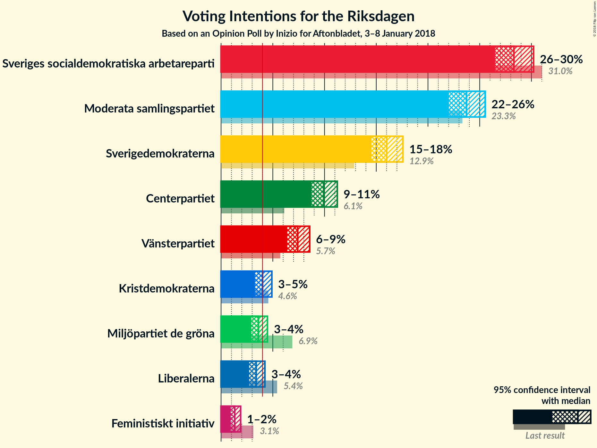

### Confidence Intervals

| Party | Last Result | Poll Result | 80% Confidence Interval | 90% Confidence Interval | 95% Confidence Interval | 99% Confidence Interval |
|:-----:|:-----------:|:-----------:|:-----------------------:|:-----------------------:|:-----------------------:|:-----------------------:|
| Sveriges socialdemokratiska arbetareparti | 31.0% | 28.3% | 27.1–29.6% |26.8–29.9% |26.5–30.2% |25.9–30.8% |
| Moderata samlingspartiet | 23.3% | 23.7% | 22.6–24.9% |22.3–25.2% |22.0–25.5% |21.5–26.1% |
| Sverigedemokraterna | 12.9% | 16.0% | 15.0–17.0% |14.8–17.3% |14.5–17.6% |14.1–18.1% |
| Centerpartiet | 6.1% | 9.9% | 9.1–10.8% |8.9–11.0% |8.7–11.2% |8.4–11.6% |
| Vänsterpartiet | 5.7% | 7.4% | 6.7–8.2% |6.6–8.4% |6.4–8.6% |6.1–8.9% |
| Kristdemokraterna | 4.6% | 4.0% | 3.5–4.6% |3.4–4.8% |3.3–4.9% |3.1–5.2% |
| Miljöpartiet de gröna | 6.9% | 3.6% | 3.2–4.2% |3.0–4.3% |2.9–4.5% |2.7–4.8% |
| Liberalerna | 5.4% | 3.4% | 2.9–3.9% |2.8–4.1% |2.7–4.2% |2.5–4.5% |
| Feministiskt initiativ | 3.1% | 1.3% | 1.1–1.7% |1.0–1.8% |0.9–1.9% |0.8–2.1% |

*Note:* The poll result column reflects the actual value used in the calculations. Published results may vary slightly, and in addition be rounded to fewer digits.

## Seats

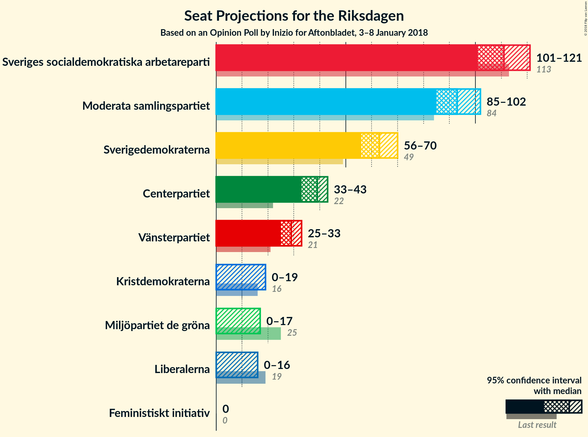

### Confidence Intervals

| Party | Last Result | Median | 80% Confidence Interval | 90% Confidence Interval | 95% Confidence Interval | 99% Confidence Interval |
|:-----:|:-----------:|:------:|:-----------------------:|:-----------------------:|:-----------------------:|:-----------------------:|
| <a href="#sveriges-socialdemokratiska-arbetareparti">Sveriges socialdemokratiska arbetareparti</a> | 113 | 111 | 105–119 |103–120 |101–121 |99–124 |
| <a href="#moderata-samlingspartiet">Moderata samlingspartiet</a> | 84 | 93 | 88–99 |86–100 |85–102 |83–105 |
| <a href="#sverigedemokraterna">Sverigedemokraterna</a> | 49 | 63 | 59–68 |58–68 |56–70 |54–72 |
| <a href="#centerpartiet">Centerpartiet</a> | 22 | 39 | 36–43 |35–43 |33–43 |32–46 |
| <a href="#vänsterpartiet">Vänsterpartiet</a> | 21 | 29 | 27–32 |25–33 |25–33 |24–36 |
| <a href="#kristdemokraterna">Kristdemokraterna</a> | 16 | 0 | 0–18 |0–18 |0–19 |0–20 |
| <a href="#miljöpartiet-de-gröna">Miljöpartiet de gröna</a> | 25 | 0 | 0–16 |0–17 |0–17 |0–18 |
| <a href="#liberalerna">Liberalerna</a> | 19 | 0 | 0 |0–16 |0–16 |0–17 |
| <a href="#feministiskt-initiativ">Feministiskt initiativ</a> | 0 | 0 | 0 |0 |0 |0 |

### Sveriges socialdemokratiska arbetareparti

*For a full overview of the results for this party, see the [Sveriges socialdemokratiska arbetareparti](party-sverigessocialdemokratiskaarbetareparti.html) page.*

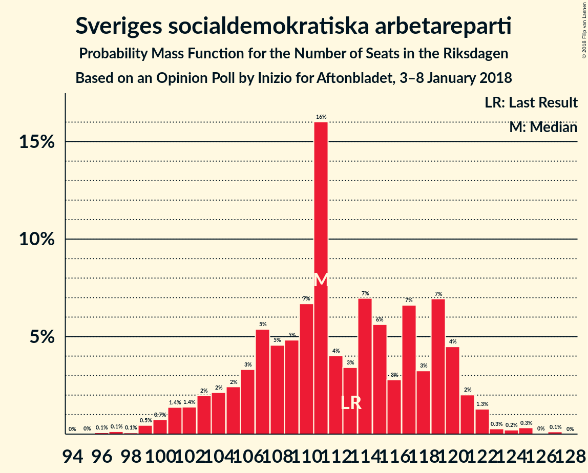

| Number of Seats | Probability | Accumulated | Special Marks |
|:---------------:|:-----------:|:-----------:|:-------------:|
| 95 | 0% | 100% |  |
| 96 | 0.1% | 99.9% |  |
| 97 | 0.1% | 99.9% |  |
| 98 | 0.1% | 99.7% |  |
| 99 | 0.5% | 99.7% |  |
| 100 | 0.7% | 99.2% |  |
| 101 | 1.4% | 98% |  |
| 102 | 1.4% | 97% |  |
| 103 | 2% | 96% |  |
| 104 | 2% | 94% |  |
| 105 | 2% | 92% |  |
| 106 | 3% | 89% |  |
| 107 | 5% | 86% |  |
| 108 | 5% | 80% |  |
| 109 | 5% | 76% |  |
| 110 | 7% | 71% |  |
| 111 | 16% | 64% | Median |
| 112 | 4% | 48% |  |
| 113 | 3% | 44% | Last Result |
| 114 | 7% | 41% |  |
| 115 | 6% | 34% |  |
| 116 | 3% | 28% |  |
| 117 | 7% | 26% |  |
| 118 | 3% | 19% |  |
| 119 | 7% | 16% |  |
| 120 | 4% | 9% |  |
| 121 | 2% | 4% |  |
| 122 | 1.3% | 2% |  |
| 123 | 0.3% | 1.0% |  |
| 124 | 0.2% | 0.7% |  |
| 125 | 0.3% | 0.5% |  |
| 126 | 0% | 0.2% |  |
| 127 | 0.1% | 0.1% |  |
| 128 | 0% | 0% |  |

### Moderata samlingspartiet

*For a full overview of the results for this party, see the [Moderata samlingspartiet](party-moderatasamlingspartiet.html) page.*

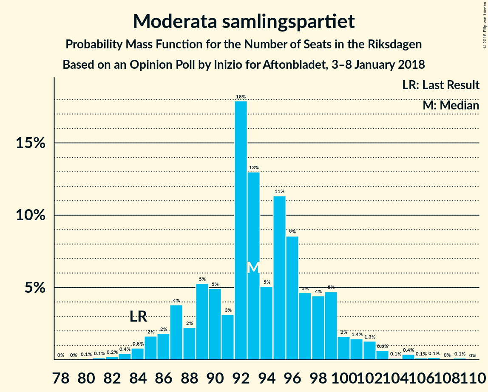

| Number of Seats | Probability | Accumulated | Special Marks |
|:---------------:|:-----------:|:-----------:|:-------------:|
| 79 | 0% | 100% |  |
| 80 | 0.1% | 99.9% |  |
| 81 | 0.1% | 99.9% |  |
| 82 | 0.2% | 99.7% |  |
| 83 | 0.4% | 99.5% |  |
| 84 | 0.8% | 99.1% | Last Result |
| 85 | 2% | 98% |  |
| 86 | 2% | 97% |  |
| 87 | 4% | 95% |  |
| 88 | 2% | 91% |  |
| 89 | 5% | 89% |  |
| 90 | 5% | 84% |  |
| 91 | 3% | 79% |  |
| 92 | 18% | 75% |  |
| 93 | 13% | 58% | Median |
| 94 | 5% | 45% |  |
| 95 | 11% | 40% |  |
| 96 | 9% | 28% |  |
| 97 | 5% | 20% |  |
| 98 | 4% | 15% |  |
| 99 | 5% | 11% |  |
| 100 | 2% | 6% |  |
| 101 | 1.4% | 4% |  |
| 102 | 1.3% | 3% |  |
| 103 | 0.6% | 2% |  |
| 104 | 0.1% | 0.9% |  |
| 105 | 0.4% | 0.8% |  |
| 106 | 0.1% | 0.4% |  |
| 107 | 0.1% | 0.3% |  |
| 108 | 0% | 0.1% |  |
| 109 | 0.1% | 0.1% |  |
| 110 | 0% | 0% |  |

### Sverigedemokraterna

*For a full overview of the results for this party, see the [Sverigedemokraterna](party-sverigedemokraterna.html) page.*

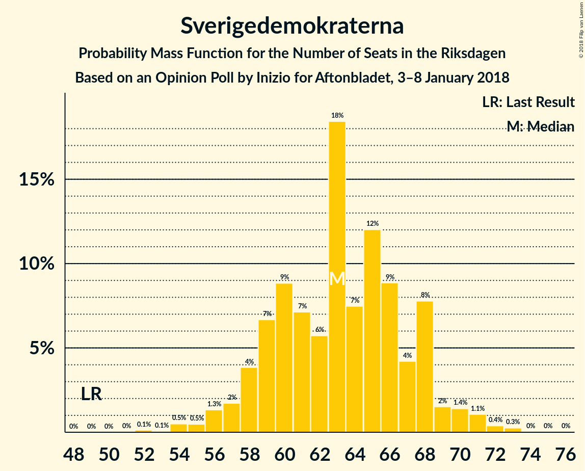

| Number of Seats | Probability | Accumulated | Special Marks |
|:---------------:|:-----------:|:-----------:|:-------------:|
| 49 | 0% | 100% | Last Result |
| 50 | 0% | 100% |  |
| 51 | 0% | 100% |  |
| 52 | 0.1% | 100% |  |
| 53 | 0.1% | 99.8% |  |
| 54 | 0.5% | 99.8% |  |
| 55 | 0.5% | 99.3% |  |
| 56 | 1.3% | 98.8% |  |
| 57 | 2% | 97% |  |
| 58 | 4% | 96% |  |
| 59 | 7% | 92% |  |
| 60 | 9% | 85% |  |
| 61 | 7% | 76% |  |
| 62 | 6% | 69% |  |
| 63 | 18% | 64% | Median |
| 64 | 7% | 45% |  |
| 65 | 12% | 38% |  |
| 66 | 9% | 26% |  |
| 67 | 4% | 17% |  |
| 68 | 8% | 13% |  |
| 69 | 2% | 5% |  |
| 70 | 1.4% | 3% |  |
| 71 | 1.1% | 2% |  |
| 72 | 0.4% | 0.7% |  |
| 73 | 0.3% | 0.4% |  |
| 74 | 0% | 0.1% |  |
| 75 | 0% | 0.1% |  |
| 76 | 0% | 0% |  |

### Centerpartiet

*For a full overview of the results for this party, see the [Centerpartiet](party-centerpartiet.html) page.*

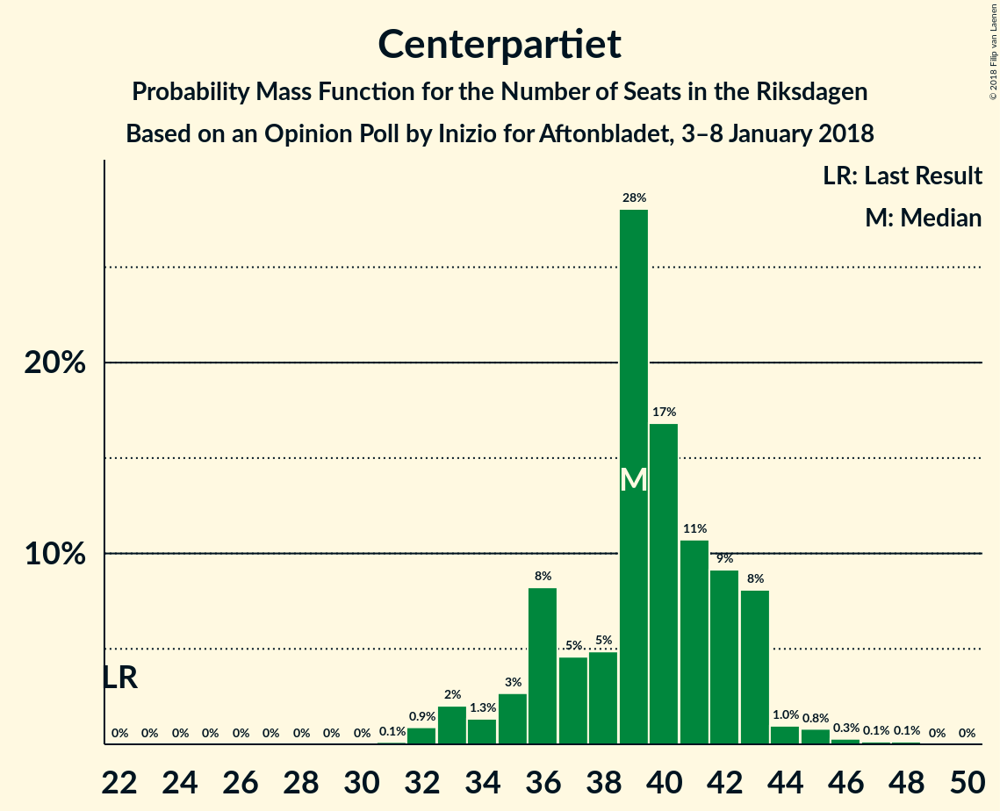

| Number of Seats | Probability | Accumulated | Special Marks |
|:---------------:|:-----------:|:-----------:|:-------------:|
| 22 | 0% | 100% | Last Result |
| 23 | 0% | 100% |  |
| 24 | 0% | 100% |  |
| 25 | 0% | 100% |  |
| 26 | 0% | 100% |  |
| 27 | 0% | 100% |  |
| 28 | 0% | 100% |  |
| 29 | 0% | 100% |  |
| 30 | 0% | 100% |  |
| 31 | 0.1% | 100% |  |
| 32 | 0.9% | 99.9% |  |
| 33 | 2% | 99.0% |  |
| 34 | 1.3% | 97% |  |
| 35 | 3% | 96% |  |
| 36 | 8% | 93% |  |
| 37 | 5% | 85% |  |
| 38 | 5% | 80% |  |
| 39 | 28% | 75% | Median |
| 40 | 17% | 47% |  |
| 41 | 11% | 30% |  |
| 42 | 9% | 20% |  |
| 43 | 8% | 10% |  |
| 44 | 1.0% | 2% |  |
| 45 | 0.8% | 1.4% |  |
| 46 | 0.3% | 0.6% |  |
| 47 | 0.1% | 0.3% |  |
| 48 | 0.1% | 0.2% |  |
| 49 | 0% | 0.1% |  |
| 50 | 0% | 0% |  |

### Vänsterpartiet

*For a full overview of the results for this party, see the [Vänsterpartiet](party-vänsterpartiet.html) page.*

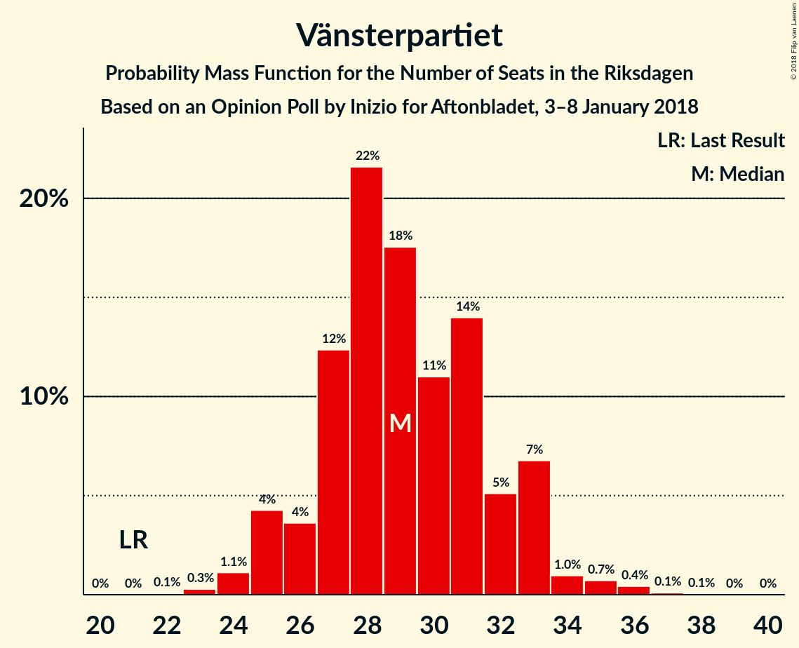

| Number of Seats | Probability | Accumulated | Special Marks |
|:---------------:|:-----------:|:-----------:|:-------------:|
| 21 | 0% | 100% | Last Result |
| 22 | 0.1% | 100% |  |
| 23 | 0.3% | 99.9% |  |
| 24 | 1.1% | 99.6% |  |
| 25 | 4% | 98.5% |  |
| 26 | 4% | 94% |  |
| 27 | 12% | 91% |  |
| 28 | 22% | 78% |  |
| 29 | 18% | 57% | Median |
| 30 | 11% | 39% |  |
| 31 | 14% | 28% |  |
| 32 | 5% | 14% |  |
| 33 | 7% | 9% |  |
| 34 | 1.0% | 2% |  |
| 35 | 0.7% | 1.3% |  |
| 36 | 0.4% | 0.6% |  |
| 37 | 0.1% | 0.2% |  |
| 38 | 0.1% | 0.1% |  |
| 39 | 0% | 0% |  |

### Kristdemokraterna

*For a full overview of the results for this party, see the [Kristdemokraterna](party-kristdemokraterna.html) page.*

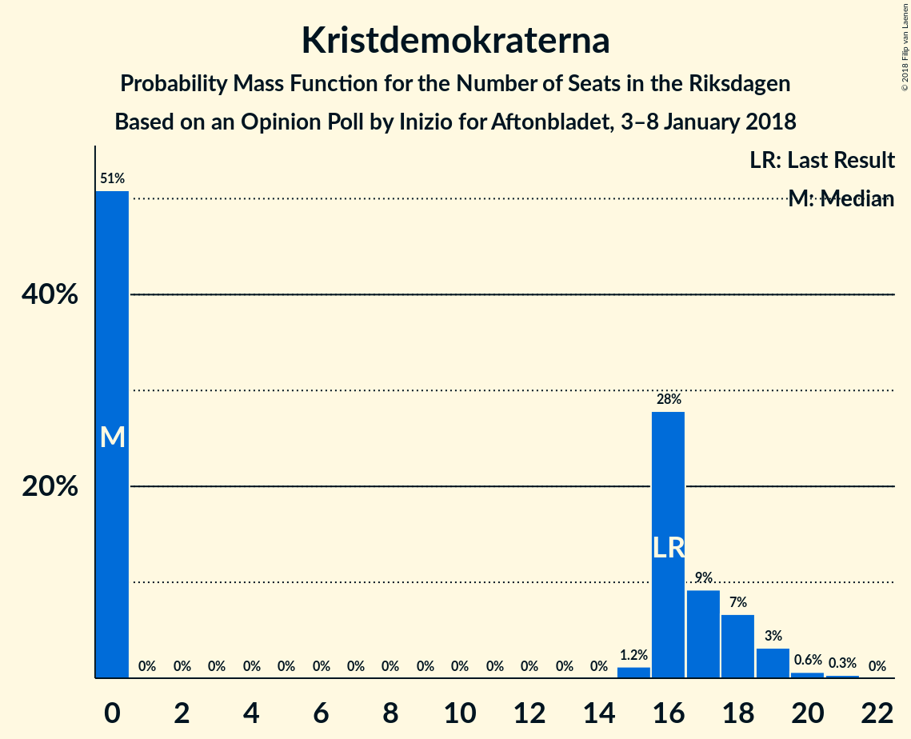

| Number of Seats | Probability | Accumulated | Special Marks |
|:---------------:|:-----------:|:-----------:|:-------------:|
| 0 | 51% | 100% | Median |
| 1 | 0% | 49% |  |
| 2 | 0% | 49% |  |
| 3 | 0% | 49% |  |
| 4 | 0% | 49% |  |
| 5 | 0% | 49% |  |
| 6 | 0% | 49% |  |
| 7 | 0% | 49% |  |
| 8 | 0% | 49% |  |
| 9 | 0% | 49% |  |
| 10 | 0% | 49% |  |
| 11 | 0% | 49% |  |
| 12 | 0% | 49% |  |
| 13 | 0% | 49% |  |
| 14 | 0% | 49% |  |
| 15 | 1.2% | 49% |  |
| 16 | 28% | 48% | Last Result |
| 17 | 9% | 20% |  |
| 18 | 7% | 11% |  |
| 19 | 3% | 4% |  |
| 20 | 0.6% | 1.0% |  |
| 21 | 0.3% | 0.4% |  |
| 22 | 0% | 0% |  |

### Miljöpartiet de gröna

*For a full overview of the results for this party, see the [Miljöpartiet de gröna](party-miljöpartietdegröna.html) page.*

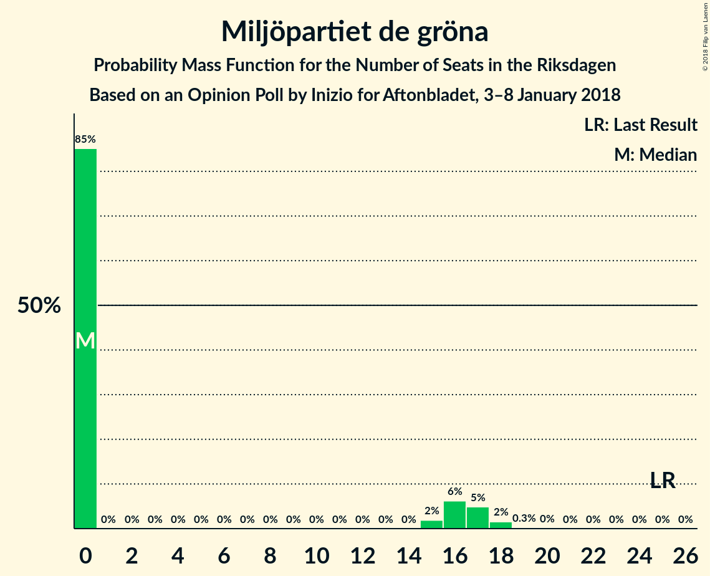

| Number of Seats | Probability | Accumulated | Special Marks |
|:---------------:|:-----------:|:-----------:|:-------------:|
| 0 | 85% | 100% | Median |
| 1 | 0% | 15% |  |
| 2 | 0% | 15% |  |
| 3 | 0% | 15% |  |
| 4 | 0% | 15% |  |
| 5 | 0% | 15% |  |
| 6 | 0% | 15% |  |
| 7 | 0% | 15% |  |
| 8 | 0% | 15% |  |
| 9 | 0% | 15% |  |
| 10 | 0% | 15% |  |
| 11 | 0% | 15% |  |
| 12 | 0% | 15% |  |
| 13 | 0% | 15% |  |
| 14 | 0% | 15% |  |
| 15 | 2% | 15% |  |
| 16 | 6% | 13% |  |
| 17 | 5% | 7% |  |
| 18 | 2% | 2% |  |
| 19 | 0.3% | 0.3% |  |
| 20 | 0% | 0% |  |
| 21 | 0% | 0% |  |
| 22 | 0% | 0% |  |
| 23 | 0% | 0% |  |
| 24 | 0% | 0% |  |
| 25 | 0% | 0% | Last Result |

### Liberalerna

*For a full overview of the results for this party, see the [Liberalerna](party-liberalerna.html) page.*

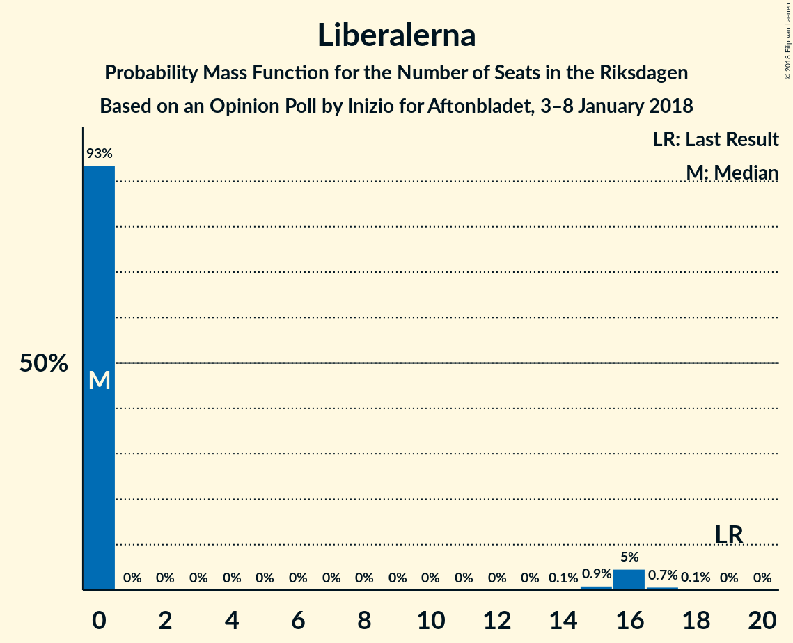

| Number of Seats | Probability | Accumulated | Special Marks |
|:---------------:|:-----------:|:-----------:|:-------------:|
| 0 | 93% | 100% | Median |
| 1 | 0% | 7% |  |
| 2 | 0% | 7% |  |
| 3 | 0% | 7% |  |
| 4 | 0% | 7% |  |
| 5 | 0% | 7% |  |
| 6 | 0% | 7% |  |
| 7 | 0% | 7% |  |
| 8 | 0% | 7% |  |
| 9 | 0% | 7% |  |
| 10 | 0% | 7% |  |
| 11 | 0% | 7% |  |
| 12 | 0% | 7% |  |
| 13 | 0% | 7% |  |
| 14 | 0.1% | 7% |  |
| 15 | 0.9% | 6% |  |
| 16 | 5% | 6% |  |
| 17 | 0.7% | 0.9% |  |
| 18 | 0.1% | 0.2% |  |
| 19 | 0% | 0.1% | Last Result |
| 20 | 0% | 0% |  |

### Feministiskt initiativ

*For a full overview of the results for this party, see the [Feministiskt initiativ](party-feministisktinitiativ.html) page.*

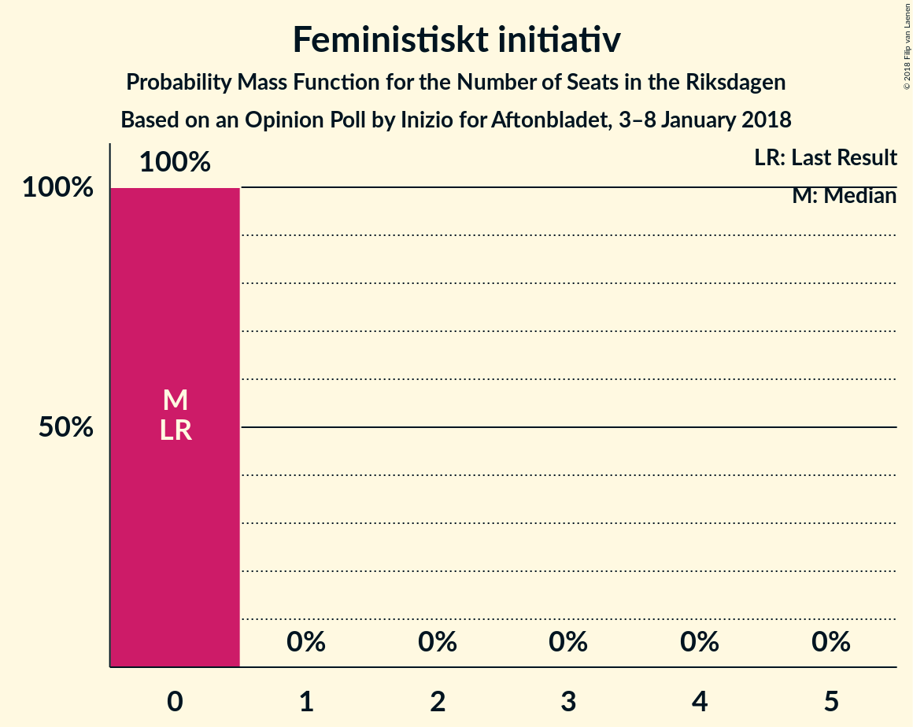

| Number of Seats | Probability | Accumulated | Special Marks |
|:---------------:|:-----------:|:-----------:|:-------------:|
| 0 | 100% | 100% | Last Result, Median |

## Coalitions

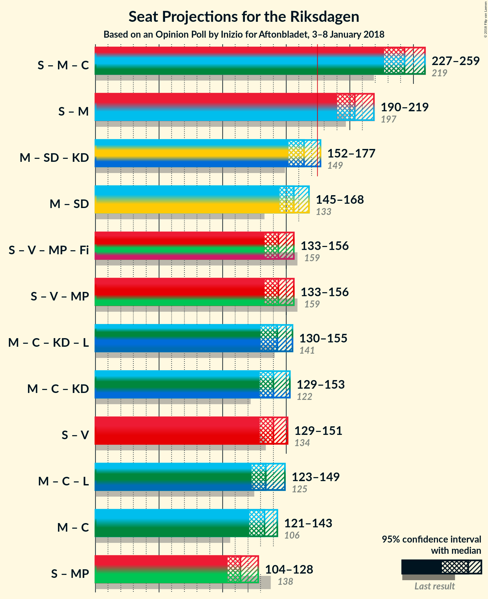

### Confidence Intervals

| Coalition | Last Result | Median | Majority? | 80% Confidence Interval | 90% Confidence Interval | 95% Confidence Interval | 99% Confidence Interval |
|:---------:|:-----------:|:------:|:---------:|:-----------------------:|:-----------------------:|:-----------------------:|:-----------------------:|
| Sveriges socialdemokratiska arbetareparti – Moderata samlingspartiet – Centerpartiet | 219 | 243 | 100% | 235–256 | 230–258 | 227–259 | 222–262 |
| Sveriges socialdemokratiska arbetareparti – Moderata samlingspartiet | 197 | 204 | 100% | 196–215 | 193–217 | 190–219 | 185–222 |
| Moderata samlingspartiet – Sverigedemokraterna – Kristdemokraterna | 149 | 164 | 8% | 155–173 | 153–177 | 152–177 | 147–179 |
| Moderata samlingspartiet – Sverigedemokraterna | 133 | 156 | 0.1% | 149–163 | 147–165 | 145–168 | 141–170 |
| Sveriges socialdemokratiska arbetareparti – Vänsterpartiet – Miljöpartiet de gröna – Feministiskt initiativ | 159 | 144 | 0% | 136–151 | 134–155 | 133–156 | 129–161 |
| Sveriges socialdemokratiska arbetareparti – Vänsterpartiet – Miljöpartiet de gröna | 159 | 144 | 0% | 136–151 | 134–155 | 133–156 | 129–161 |
| Moderata samlingspartiet – Centerpartiet – Kristdemokraterna – Liberalerna | 141 | 143 | 0% | 133–151 | 132–153 | 130–155 | 126–160 |
| Moderata samlingspartiet – Centerpartiet – Kristdemokraterna | 122 | 140 | 0% | 133–150 | 131–152 | 129–153 | 125–156 |
| Sveriges socialdemokratiska arbetareparti – Vänsterpartiet | 134 | 140 | 0% | 134–149 | 131–151 | 129–151 | 125–154 |
| Moderata samlingspartiet – Centerpartiet – Liberalerna | 125 | 134 | 0% | 127–140 | 126–144 | 123–149 | 118–152 |
| Moderata samlingspartiet – Centerpartiet | 106 | 133 | 0% | 126–138 | 124–140 | 121–143 | 117–145 |
| Sveriges socialdemokratiska arbetareparti – Miljöpartiet de gröna | 138 | 114 | 0% | 107–122 | 106–126 | 104–128 | 101–133 |

### Sveriges socialdemokratiska arbetareparti – Moderata samlingspartiet – Centerpartiet

| Number of Seats | Probability | Accumulated | Special Marks |
|:---------------:|:-----------:|:-----------:|:-------------:|
| 214 | 0.1% | 100% |  |
| 215 | 0% | 99.9% |  |
| 216 | 0% | 99.9% |  |
| 217 | 0% | 99.9% |  |
| 218 | 0.1% | 99.9% |  |
| 219 | 0.1% | 99.8% | Last Result |
| 220 | 0% | 99.7% |  |
| 221 | 0.1% | 99.7% |  |
| 222 | 0.1% | 99.5% |  |
| 223 | 0.2% | 99.4% |  |
| 224 | 0.2% | 99.2% |  |
| 225 | 0.2% | 99.0% |  |
| 226 | 1.0% | 98.9% |  |
| 227 | 0.5% | 98% |  |
| 228 | 0.7% | 97% |  |
| 229 | 1.2% | 97% |  |
| 230 | 1.1% | 95% |  |
| 231 | 0.6% | 94% |  |
| 232 | 0.9% | 94% |  |
| 233 | 0.9% | 93% |  |
| 234 | 2% | 92% |  |
| 235 | 1.3% | 90% |  |
| 236 | 2% | 89% |  |
| 237 | 4% | 87% |  |
| 238 | 3% | 83% |  |
| 239 | 5% | 80% |  |
| 240 | 2% | 75% |  |
| 241 | 3% | 73% |  |
| 242 | 14% | 69% |  |
| 243 | 6% | 55% | Median |
| 244 | 2% | 49% |  |
| 245 | 4% | 46% |  |
| 246 | 3% | 42% |  |
| 247 | 1.1% | 40% |  |
| 248 | 3% | 38% |  |
| 249 | 1.0% | 35% |  |
| 250 | 4% | 34% |  |
| 251 | 3% | 30% |  |
| 252 | 6% | 28% |  |
| 253 | 2% | 22% |  |
| 254 | 2% | 20% |  |
| 255 | 8% | 18% |  |
| 256 | 3% | 10% |  |
| 257 | 0.8% | 7% |  |
| 258 | 3% | 7% |  |
| 259 | 2% | 4% |  |
| 260 | 0.3% | 2% |  |
| 261 | 0.7% | 1.2% |  |
| 262 | 0.5% | 0.6% |  |
| 263 | 0% | 0% |  |

### Sveriges socialdemokratiska arbetareparti – Moderata samlingspartiet

| Number of Seats | Probability | Accumulated | Special Marks |
|:---------------:|:-----------:|:-----------:|:-------------:|
| 180 | 0% | 100% |  |
| 181 | 0% | 99.9% |  |
| 182 | 0.2% | 99.9% |  |
| 183 | 0% | 99.8% |  |
| 184 | 0.1% | 99.7% |  |
| 185 | 0.2% | 99.6% |  |
| 186 | 0.3% | 99.5% |  |
| 187 | 0.1% | 99.1% |  |
| 188 | 0.2% | 99.0% |  |
| 189 | 0.7% | 98.8% |  |
| 190 | 1.0% | 98% |  |
| 191 | 0.5% | 97% |  |
| 192 | 1.2% | 97% |  |
| 193 | 1.1% | 95% |  |
| 194 | 2% | 94% |  |
| 195 | 2% | 93% |  |
| 196 | 2% | 91% |  |
| 197 | 2% | 89% | Last Result |
| 198 | 2% | 87% |  |
| 199 | 3% | 84% |  |
| 200 | 3% | 81% |  |
| 201 | 4% | 78% |  |
| 202 | 3% | 74% |  |
| 203 | 19% | 71% |  |
| 204 | 2% | 52% | Median |
| 205 | 3% | 50% |  |
| 206 | 5% | 47% |  |
| 207 | 4% | 43% |  |
| 208 | 4% | 39% |  |
| 209 | 2% | 35% |  |
| 210 | 5% | 33% |  |
| 211 | 4% | 28% |  |
| 212 | 3% | 23% |  |
| 213 | 1.1% | 21% |  |
| 214 | 7% | 19% |  |
| 215 | 4% | 12% |  |
| 216 | 1.1% | 8% |  |
| 217 | 2% | 7% |  |
| 218 | 0.6% | 5% |  |
| 219 | 2% | 4% |  |
| 220 | 1.1% | 2% |  |
| 221 | 0.4% | 1.0% |  |
| 222 | 0.2% | 0.6% |  |
| 223 | 0.3% | 0.4% |  |
| 224 | 0.1% | 0.1% |  |
| 225 | 0% | 0% |  |

### Moderata samlingspartiet – Sverigedemokraterna – Kristdemokraterna

| Number of Seats | Probability | Accumulated | Special Marks |
|:---------------:|:-----------:|:-----------:|:-------------:|
| 144 | 0.1% | 100% |  |
| 145 | 0% | 99.9% |  |
| 146 | 0.3% | 99.9% |  |
| 147 | 0.1% | 99.5% |  |
| 148 | 0.2% | 99.4% |  |
| 149 | 0.3% | 99.3% | Last Result |
| 150 | 0.4% | 99.0% |  |
| 151 | 0.3% | 98.6% |  |
| 152 | 2% | 98% |  |
| 153 | 3% | 96% |  |
| 154 | 1.3% | 93% |  |
| 155 | 3% | 92% |  |
| 156 | 2% | 89% | Median |
| 157 | 3% | 88% |  |
| 158 | 1.1% | 85% |  |
| 159 | 10% | 84% |  |
| 160 | 8% | 74% |  |
| 161 | 4% | 65% |  |
| 162 | 3% | 61% |  |
| 163 | 4% | 58% |  |
| 164 | 4% | 54% |  |
| 165 | 4% | 50% |  |
| 166 | 2% | 46% |  |
| 167 | 3% | 44% |  |
| 168 | 2% | 41% |  |
| 169 | 2% | 39% |  |
| 170 | 5% | 37% |  |
| 171 | 15% | 32% |  |
| 172 | 4% | 17% |  |
| 173 | 5% | 14% |  |
| 174 | 1.2% | 9% |  |
| 175 | 2% | 8% | Majority |
| 176 | 0.8% | 6% |  |
| 177 | 3% | 5% |  |
| 178 | 1.1% | 2% |  |
| 179 | 0.7% | 1.1% |  |
| 180 | 0.1% | 0.4% |  |
| 181 | 0.2% | 0.3% |  |
| 182 | 0.1% | 0.1% |  |
| 183 | 0% | 0% |  |

### Moderata samlingspartiet – Sverigedemokraterna

| Number of Seats | Probability | Accumulated | Special Marks |
|:---------------:|:-----------:|:-----------:|:-------------:|
| 133 | 0% | 100% | Last Result |
| 134 | 0% | 100% |  |
| 135 | 0% | 100% |  |
| 136 | 0% | 100% |  |
| 137 | 0.1% | 100% |  |
| 138 | 0.1% | 99.9% |  |
| 139 | 0.2% | 99.8% |  |
| 140 | 0.1% | 99.7% |  |
| 141 | 0.2% | 99.5% |  |
| 142 | 0.3% | 99.3% |  |
| 143 | 0.4% | 99.0% |  |
| 144 | 0.7% | 98.6% |  |
| 145 | 0.9% | 98% |  |
| 146 | 2% | 97% |  |
| 147 | 1.5% | 95% |  |
| 148 | 2% | 94% |  |
| 149 | 2% | 92% |  |
| 150 | 1.4% | 90% |  |
| 151 | 3% | 88% |  |
| 152 | 4% | 85% |  |
| 153 | 6% | 81% |  |
| 154 | 6% | 76% |  |
| 155 | 17% | 70% |  |
| 156 | 3% | 52% | Median |
| 157 | 5% | 49% |  |
| 158 | 2% | 44% |  |
| 159 | 12% | 42% |  |
| 160 | 9% | 30% |  |
| 161 | 6% | 22% |  |
| 162 | 3% | 16% |  |
| 163 | 3% | 13% |  |
| 164 | 2% | 10% |  |
| 165 | 3% | 7% |  |
| 166 | 0.9% | 4% |  |
| 167 | 0.6% | 3% |  |
| 168 | 0.6% | 3% |  |
| 169 | 0.7% | 2% |  |
| 170 | 1.1% | 2% |  |
| 171 | 0.2% | 0.5% |  |
| 172 | 0.1% | 0.3% |  |
| 173 | 0.1% | 0.2% |  |
| 174 | 0.1% | 0.1% |  |
| 175 | 0% | 0.1% | Majority |
| 176 | 0% | 0% |  |

### Sveriges socialdemokratiska arbetareparti – Vänsterpartiet – Miljöpartiet de gröna – Feministiskt initiativ

| Number of Seats | Probability | Accumulated | Special Marks |
|:---------------:|:-----------:|:-----------:|:-------------:|
| 125 | 0% | 100% |  |
| 126 | 0.1% | 99.9% |  |
| 127 | 0% | 99.8% |  |
| 128 | 0.1% | 99.8% |  |
| 129 | 0.2% | 99.7% |  |
| 130 | 0.3% | 99.5% |  |
| 131 | 0.4% | 99.2% |  |
| 132 | 1.0% | 98.8% |  |
| 133 | 1.2% | 98% |  |
| 134 | 2% | 97% |  |
| 135 | 2% | 94% |  |
| 136 | 5% | 92% |  |
| 137 | 4% | 87% |  |
| 138 | 3% | 83% |  |
| 139 | 14% | 80% |  |
| 140 | 6% | 66% | Median |
| 141 | 3% | 60% |  |
| 142 | 3% | 57% |  |
| 143 | 3% | 54% |  |
| 144 | 3% | 51% |  |
| 145 | 7% | 48% |  |
| 146 | 3% | 41% |  |
| 147 | 5% | 38% |  |
| 148 | 12% | 33% |  |
| 149 | 3% | 21% |  |
| 150 | 3% | 18% |  |
| 151 | 6% | 15% |  |
| 152 | 1.5% | 10% |  |
| 153 | 2% | 8% |  |
| 154 | 1.4% | 7% |  |
| 155 | 0.8% | 5% |  |
| 156 | 2% | 4% |  |
| 157 | 0.4% | 2% |  |
| 158 | 0.8% | 2% |  |
| 159 | 0.4% | 1.1% | Last Result |
| 160 | 0.2% | 0.7% |  |
| 161 | 0.1% | 0.5% |  |
| 162 | 0.1% | 0.5% |  |
| 163 | 0.3% | 0.4% |  |
| 164 | 0.1% | 0.1% |  |
| 165 | 0% | 0% |  |

### Sveriges socialdemokratiska arbetareparti – Vänsterpartiet – Miljöpartiet de gröna

| Number of Seats | Probability | Accumulated | Special Marks |
|:---------------:|:-----------:|:-----------:|:-------------:|
| 125 | 0% | 100% |  |
| 126 | 0.1% | 99.9% |  |
| 127 | 0% | 99.8% |  |
| 128 | 0.1% | 99.8% |  |
| 129 | 0.2% | 99.7% |  |
| 130 | 0.3% | 99.5% |  |
| 131 | 0.4% | 99.2% |  |
| 132 | 1.0% | 98.8% |  |
| 133 | 1.2% | 98% |  |
| 134 | 2% | 97% |  |
| 135 | 2% | 94% |  |
| 136 | 5% | 92% |  |
| 137 | 4% | 87% |  |
| 138 | 3% | 83% |  |
| 139 | 14% | 80% |  |
| 140 | 6% | 66% | Median |
| 141 | 3% | 60% |  |
| 142 | 3% | 57% |  |
| 143 | 3% | 54% |  |
| 144 | 3% | 51% |  |
| 145 | 7% | 48% |  |
| 146 | 3% | 41% |  |
| 147 | 5% | 38% |  |
| 148 | 12% | 33% |  |
| 149 | 3% | 21% |  |
| 150 | 3% | 18% |  |
| 151 | 6% | 15% |  |
| 152 | 1.5% | 10% |  |
| 153 | 2% | 8% |  |
| 154 | 1.4% | 7% |  |
| 155 | 0.8% | 5% |  |
| 156 | 2% | 4% |  |
| 157 | 0.4% | 2% |  |
| 158 | 0.8% | 2% |  |
| 159 | 0.4% | 1.1% | Last Result |
| 160 | 0.2% | 0.7% |  |
| 161 | 0.1% | 0.5% |  |
| 162 | 0.1% | 0.5% |  |
| 163 | 0.3% | 0.4% |  |
| 164 | 0.1% | 0.1% |  |
| 165 | 0% | 0% |  |

### Moderata samlingspartiet – Centerpartiet – Kristdemokraterna – Liberalerna

| Number of Seats | Probability | Accumulated | Special Marks |
|:---------------:|:-----------:|:-----------:|:-------------:|
| 123 | 0.1% | 100% |  |
| 124 | 0.1% | 99.9% |  |
| 125 | 0.1% | 99.8% |  |
| 126 | 0.8% | 99.8% |  |
| 127 | 0.7% | 99.0% |  |
| 128 | 0.1% | 98% |  |
| 129 | 0.6% | 98% |  |
| 130 | 1.3% | 98% |  |
| 131 | 1.0% | 96% |  |
| 132 | 2% | 95% | Median |
| 133 | 3% | 93% |  |
| 134 | 3% | 90% |  |
| 135 | 8% | 86% |  |
| 136 | 9% | 78% |  |
| 137 | 4% | 69% |  |
| 138 | 5% | 65% |  |
| 139 | 3% | 60% |  |
| 140 | 2% | 57% |  |
| 141 | 2% | 54% | Last Result |
| 142 | 1.4% | 52% |  |
| 143 | 3% | 51% |  |
| 144 | 5% | 47% |  |
| 145 | 3% | 43% |  |
| 146 | 3% | 39% |  |
| 147 | 14% | 37% |  |
| 148 | 5% | 23% |  |
| 149 | 4% | 18% |  |
| 150 | 2% | 14% |  |
| 151 | 3% | 11% |  |
| 152 | 1.2% | 9% |  |
| 153 | 3% | 7% |  |
| 154 | 2% | 4% |  |
| 155 | 0.8% | 3% |  |
| 156 | 0.7% | 2% |  |
| 157 | 0.2% | 1.3% |  |
| 158 | 0.1% | 1.1% |  |
| 159 | 0.1% | 0.9% |  |
| 160 | 0.5% | 0.8% |  |
| 161 | 0.2% | 0.3% |  |
| 162 | 0% | 0.1% |  |
| 163 | 0% | 0.1% |  |
| 164 | 0% | 0.1% |  |
| 165 | 0% | 0% |  |

### Moderata samlingspartiet – Centerpartiet – Kristdemokraterna

| Number of Seats | Probability | Accumulated | Special Marks |
|:---------------:|:-----------:|:-----------:|:-------------:|
| 119 | 0% | 100% |  |
| 120 | 0% | 99.9% |  |
| 121 | 0.1% | 99.9% |  |
| 122 | 0% | 99.8% | Last Result |
| 123 | 0.1% | 99.8% |  |
| 124 | 0.1% | 99.7% |  |
| 125 | 0.1% | 99.5% |  |
| 126 | 0.8% | 99.5% |  |
| 127 | 0.9% | 98.7% |  |
| 128 | 0.2% | 98% |  |
| 129 | 0.6% | 98% |  |
| 130 | 1.4% | 97% |  |
| 131 | 1.2% | 96% |  |
| 132 | 3% | 94% | Median |
| 133 | 6% | 92% |  |
| 134 | 4% | 86% |  |
| 135 | 8% | 82% |  |
| 136 | 10% | 74% |  |
| 137 | 4% | 65% |  |
| 138 | 5% | 61% |  |
| 139 | 4% | 55% |  |
| 140 | 2% | 52% |  |
| 141 | 2% | 49% |  |
| 142 | 2% | 47% |  |
| 143 | 3% | 45% |  |
| 144 | 5% | 42% |  |
| 145 | 4% | 37% |  |
| 146 | 3% | 34% |  |
| 147 | 14% | 31% |  |
| 148 | 5% | 17% |  |
| 149 | 2% | 12% |  |
| 150 | 2% | 11% |  |
| 151 | 2% | 8% |  |
| 152 | 0.9% | 6% |  |
| 153 | 3% | 5% |  |
| 154 | 1.1% | 2% |  |
| 155 | 0.5% | 1.2% |  |
| 156 | 0.5% | 0.7% |  |
| 157 | 0.1% | 0.2% |  |
| 158 | 0.1% | 0.1% |  |
| 159 | 0% | 0.1% |  |
| 160 | 0% | 0% |  |

### Sveriges socialdemokratiska arbetareparti – Vänsterpartiet

| Number of Seats | Probability | Accumulated | Special Marks |
|:---------------:|:-----------:|:-----------:|:-------------:|
| 122 | 0% | 100% |  |
| 123 | 0.1% | 99.9% |  |
| 124 | 0.1% | 99.9% |  |
| 125 | 0.5% | 99.7% |  |
| 126 | 0.4% | 99.2% |  |
| 127 | 0.4% | 98.8% |  |
| 128 | 0.4% | 98% |  |
| 129 | 1.3% | 98% |  |
| 130 | 1.3% | 97% |  |
| 131 | 1.3% | 95% |  |
| 132 | 1.3% | 94% |  |
| 133 | 2% | 93% |  |
| 134 | 3% | 91% | Last Result |
| 135 | 3% | 88% |  |
| 136 | 6% | 85% |  |
| 137 | 5% | 78% |  |
| 138 | 5% | 74% |  |
| 139 | 15% | 69% |  |
| 140 | 7% | 54% | Median |
| 141 | 3% | 47% |  |
| 142 | 4% | 44% |  |
| 143 | 2% | 41% |  |
| 144 | 2% | 39% |  |
| 145 | 7% | 36% |  |
| 146 | 2% | 29% |  |
| 147 | 5% | 27% |  |
| 148 | 11% | 22% |  |
| 149 | 2% | 11% |  |
| 150 | 2% | 9% |  |
| 151 | 4% | 7% |  |
| 152 | 1.0% | 2% |  |
| 153 | 0.4% | 1.2% |  |
| 154 | 0.4% | 0.8% |  |
| 155 | 0.1% | 0.3% |  |
| 156 | 0.1% | 0.2% |  |
| 157 | 0% | 0.1% |  |
| 158 | 0% | 0.1% |  |
| 159 | 0% | 0% |  |

### Moderata samlingspartiet – Centerpartiet – Liberalerna

| Number of Seats | Probability | Accumulated | Special Marks |
|:---------------:|:-----------:|:-----------:|:-------------:|
| 114 | 0% | 100% |  |
| 115 | 0% | 99.9% |  |
| 116 | 0% | 99.9% |  |
| 117 | 0.4% | 99.9% |  |
| 118 | 0.2% | 99.5% |  |
| 119 | 0.1% | 99.4% |  |
| 120 | 0.3% | 99.3% |  |
| 121 | 0.9% | 99.0% |  |
| 122 | 0.3% | 98% |  |
| 123 | 0.6% | 98% |  |
| 124 | 0.9% | 97% |  |
| 125 | 1.3% | 96% | Last Result |
| 126 | 5% | 95% |  |
| 127 | 3% | 90% |  |
| 128 | 3% | 88% |  |
| 129 | 2% | 85% |  |
| 130 | 4% | 83% |  |
| 131 | 15% | 78% |  |
| 132 | 7% | 63% | Median |
| 133 | 5% | 56% |  |
| 134 | 6% | 51% |  |
| 135 | 10% | 46% |  |
| 136 | 11% | 35% |  |
| 137 | 5% | 24% |  |
| 138 | 5% | 20% |  |
| 139 | 3% | 14% |  |
| 140 | 2% | 11% |  |
| 141 | 1.4% | 9% |  |
| 142 | 0.8% | 8% |  |
| 143 | 0.5% | 7% |  |
| 144 | 2% | 7% |  |
| 145 | 0.7% | 5% |  |
| 146 | 0.3% | 4% |  |
| 147 | 0.2% | 4% |  |
| 148 | 0.2% | 4% |  |
| 149 | 2% | 3% |  |
| 150 | 0.3% | 1.0% |  |
| 151 | 0.1% | 0.7% |  |
| 152 | 0.2% | 0.6% |  |
| 153 | 0.2% | 0.4% |  |
| 154 | 0.1% | 0.2% |  |
| 155 | 0% | 0.1% |  |
| 156 | 0.1% | 0.1% |  |
| 157 | 0% | 0% |  |

### Moderata samlingspartiet – Centerpartiet

| Number of Seats | Probability | Accumulated | Special Marks |
|:---------------:|:-----------:|:-----------:|:-------------:|
| 106 | 0% | 100% | Last Result |
| 107 | 0% | 100% |  |
| 108 | 0% | 100% |  |
| 109 | 0% | 100% |  |
| 110 | 0% | 100% |  |
| 111 | 0% | 100% |  |
| 112 | 0% | 100% |  |
| 113 | 0% | 100% |  |
| 114 | 0.1% | 100% |  |
| 115 | 0.1% | 99.9% |  |
| 116 | 0.1% | 99.9% |  |
| 117 | 0.5% | 99.8% |  |
| 118 | 0.2% | 99.3% |  |
| 119 | 0.2% | 99.1% |  |
| 120 | 0.4% | 98.9% |  |
| 121 | 1.4% | 98% |  |
| 122 | 0.4% | 97% |  |
| 123 | 0.8% | 97% |  |
| 124 | 1.2% | 96% |  |
| 125 | 1.4% | 95% |  |
| 126 | 5% | 93% |  |
| 127 | 3% | 88% |  |
| 128 | 3% | 85% |  |
| 129 | 2% | 82% |  |
| 130 | 4% | 80% |  |
| 131 | 15% | 75% |  |
| 132 | 7% | 60% | Median |
| 133 | 7% | 53% |  |
| 134 | 6% | 46% |  |
| 135 | 10% | 40% |  |
| 136 | 11% | 30% |  |
| 137 | 5% | 19% |  |
| 138 | 5% | 14% |  |
| 139 | 3% | 9% |  |
| 140 | 2% | 6% |  |
| 141 | 1.2% | 4% |  |
| 142 | 0.7% | 3% |  |
| 143 | 0.2% | 3% |  |
| 144 | 1.2% | 2% |  |
| 145 | 0.6% | 1.1% |  |
| 146 | 0.1% | 0.4% |  |
| 147 | 0.1% | 0.3% |  |
| 148 | 0.1% | 0.2% |  |
| 149 | 0% | 0.1% |  |
| 150 | 0.1% | 0.1% |  |
| 151 | 0% | 0% |  |

### Sveriges socialdemokratiska arbetareparti – Miljöpartiet de gröna

| Number of Seats | Probability | Accumulated | Special Marks |
|:---------------:|:-----------:|:-----------:|:-------------:|
| 97 | 0% | 100% |  |
| 98 | 0% | 99.9% |  |
| 99 | 0.1% | 99.9% |  |
| 100 | 0.1% | 99.9% |  |
| 101 | 0.4% | 99.8% |  |
| 102 | 0.6% | 99.4% |  |
| 103 | 1.1% | 98.8% |  |
| 104 | 1.0% | 98% |  |
| 105 | 1.3% | 97% |  |
| 106 | 2% | 95% |  |
| 107 | 4% | 93% |  |
| 108 | 4% | 89% |  |
| 109 | 3% | 85% |  |
| 110 | 6% | 82% |  |
| 111 | 15% | 76% | Median |
| 112 | 4% | 61% |  |
| 113 | 3% | 57% |  |
| 114 | 6% | 54% |  |
| 115 | 6% | 48% |  |
| 116 | 3% | 42% |  |
| 117 | 7% | 38% |  |
| 118 | 4% | 32% |  |
| 119 | 8% | 28% |  |
| 120 | 5% | 20% |  |
| 121 | 3% | 14% |  |
| 122 | 2% | 11% |  |
| 123 | 2% | 9% |  |
| 124 | 1.4% | 8% |  |
| 125 | 1.3% | 6% |  |
| 126 | 1.0% | 5% |  |
| 127 | 0.9% | 4% |  |
| 128 | 0.6% | 3% |  |
| 129 | 0.6% | 2% |  |
| 130 | 0.9% | 2% |  |
| 131 | 0.2% | 1.0% |  |
| 132 | 0.1% | 0.8% |  |
| 133 | 0.5% | 0.7% |  |
| 134 | 0.1% | 0.2% |  |
| 135 | 0% | 0.1% |  |
| 136 | 0% | 0.1% |  |
| 137 | 0% | 0% |  |
| 138 | 0% | 0% | Last Result |

## Technical Information

### Opinion Poll

+ **Polling firm:** Inizio
+ **Commissioner(s):** Aftonbladet
+ **Fieldwork period:** 3–8 January 2018

### Calculations

+ **Sample size:** 2268
+ **Simulations done:** 1,048,576
+ **Error estimate:** 1.10%

