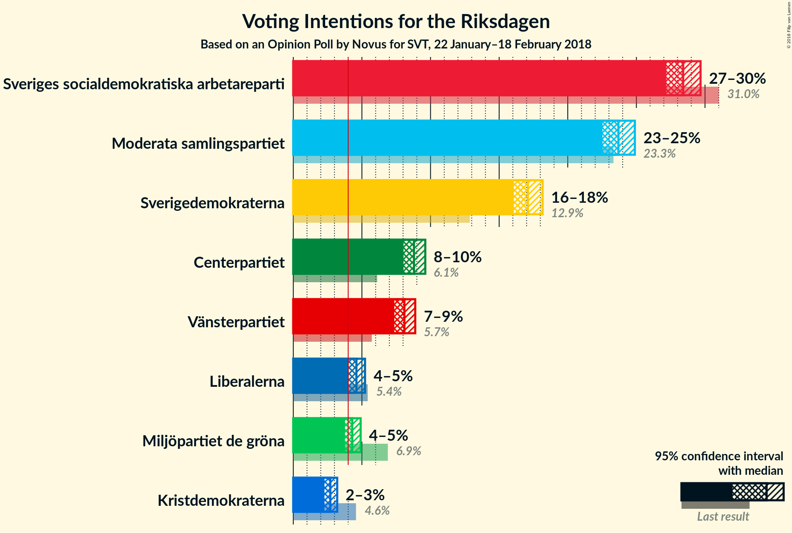
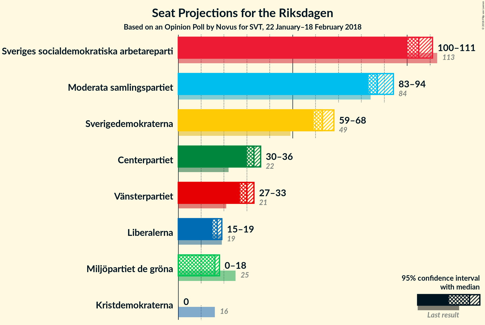
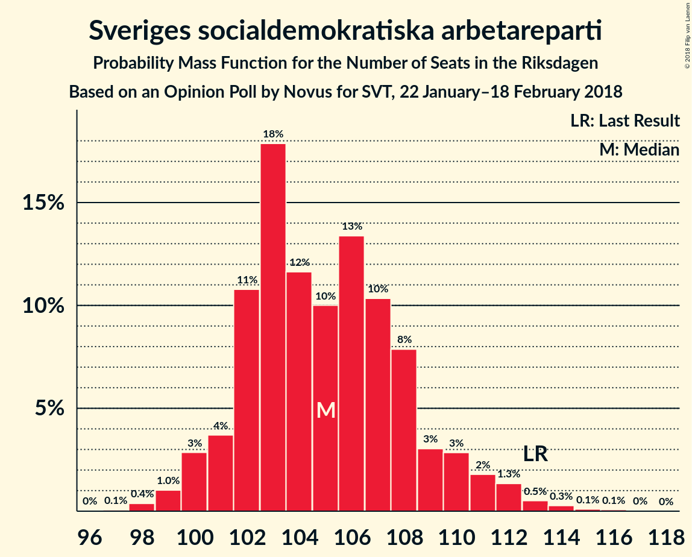
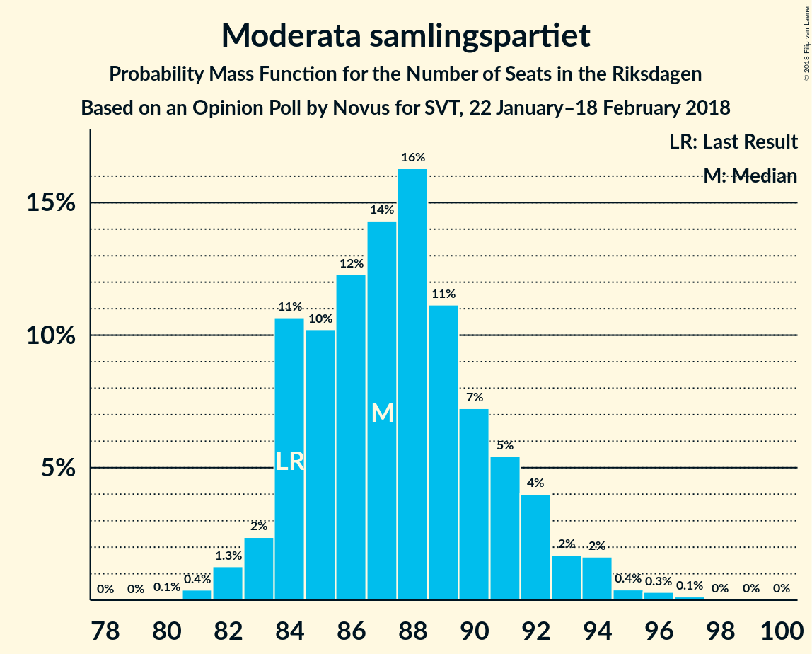
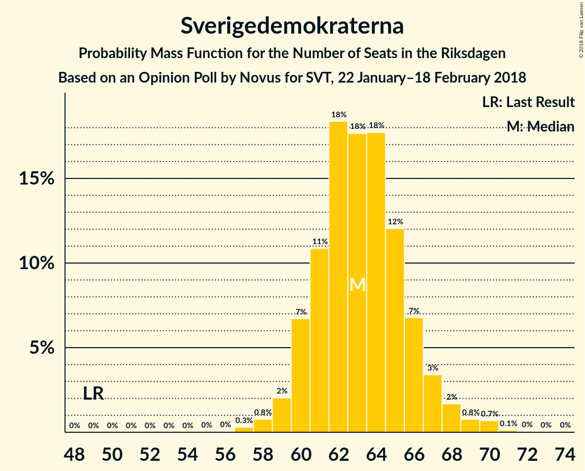
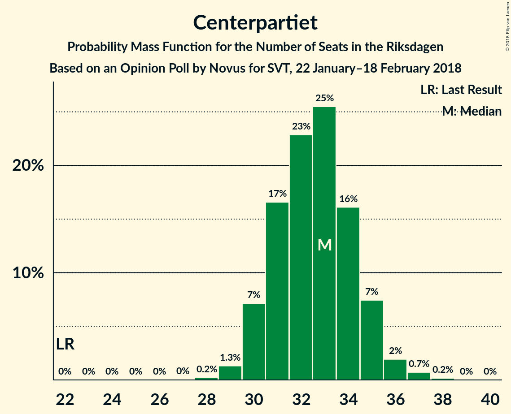
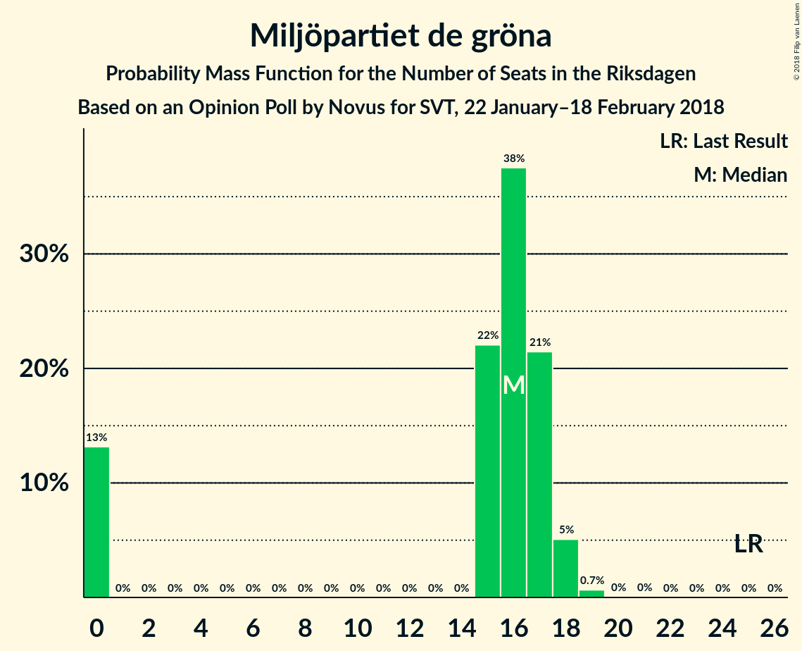
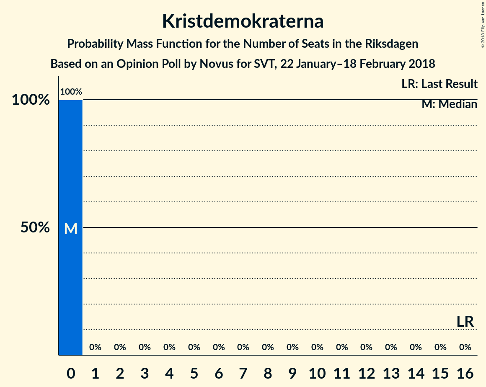
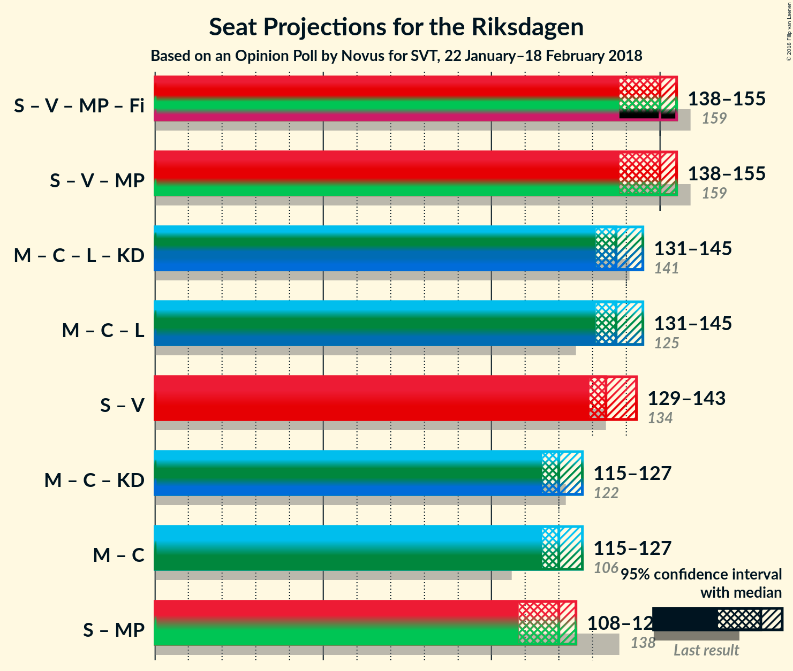

# Opinion Poll by Novus for SVT, 22 January–18 February 2018

<a href="#voting-intentions">Voting Intentions</a> | <a href="#seats">Seats</a> | <a href="#coalitions">Coalitions</a> | <a href="#technical-information">Technical Information</a>

## Voting Intentions

### Confidence Intervals

| Party | Last Result | Poll Result | 80% Confidence Interval | 90% Confidence Interval | 95% Confidence Interval | 99% Confidence Interval |
|:-----:|:-----------:|:-----------:|:-----------------------:|:-----------------------:|:-----------------------:|:-----------------------:|
| Sveriges socialdemokratiska arbetareparti | 31.0% | 28.4% | 27.6–29.2% |27.4–29.5% |27.2–29.7% |26.8–30.1% |
| Moderata samlingspartiet | 23.3% | 23.7% | 22.9–24.5% |22.7–24.7% |22.5–24.9% |22.2–25.3% |
| Sverigedemokraterna | 12.9% | 17.1% | 16.4–17.8% |16.2–18.0% |16.1–18.2% |15.8–18.5% |
| Centerpartiet | 6.1% | 8.8% | 8.3–9.3% |8.2–9.5% |8.0–9.6% |7.8–9.9% |
| Vänsterpartiet | 5.7% | 8.1% | 7.6–8.6% |7.5–8.8% |7.4–8.9% |7.1–9.1% |
| Liberalerna | 5.4% | 4.6% | 4.2–5.0% |4.1–5.1% |4.0–5.2% |3.9–5.4% |
| Miljöpartiet de gröna | 6.9% | 4.3% | 3.9–4.7% |3.8–4.8% |3.8–4.9% |3.6–5.1% |
| Kristdemokraterna | 4.6% | 2.7% | 2.4–3.0% |2.3–3.1% |2.3–3.2% |2.1–3.4% |

*Note:* The poll result column reflects the actual value used in the calculations. Published results may vary slightly, and in addition be rounded to fewer digits.

## Seats

### Confidence Intervals

| Party | Last Result | Median | 80% Confidence Interval | 90% Confidence Interval | 95% Confidence Interval | 99% Confidence Interval |
|:-----:|:-----------:|:------:|:-----------------------:|:-----------------------:|:-----------------------:|:-----------------------:|
| <a href="#sveriges-socialdemokratiska-arbetareparti">Sveriges socialdemokratiska arbetareparti</a> | 113 | 105 | 102–109 |101–110 |100–111 |99–114 |
| <a href="#moderata-samlingspartiet">Moderata samlingspartiet</a> | 84 | 87 | 84–91 |84–92 |83–94 |82–96 |
| <a href="#sverigedemokraterna">Sverigedemokraterna</a> | 49 | 63 | 61–66 |60–67 |59–68 |58–70 |
| <a href="#centerpartiet">Centerpartiet</a> | 22 | 33 | 31–35 |30–35 |30–36 |29–37 |
| <a href="#vänsterpartiet">Vänsterpartiet</a> | 21 | 30 | 28–32 |28–33 |27–33 |26–34 |
| <a href="#liberalerna">Liberalerna</a> | 19 | 17 | 16–19 |15–19 |15–19 |0–20 |
| <a href="#miljöpartiet-de-gröna">Miljöpartiet de gröna</a> | 25 | 16 | 0–17 |0–18 |0–18 |0–19 |
| <a href="#kristdemokraterna">Kristdemokraterna</a> | 16 | 0 | 0 |0 |0 |0 |

### Sveriges socialdemokratiska arbetareparti

*For a full overview of the results for this party, see the [Sveriges socialdemokratiska arbetareparti](party-sverigessocialdemokratiskaarbetareparti.html) page.*

| Number of Seats | Probability | Accumulated | Special Marks |
|:---------------:|:-----------:|:-----------:|:-------------:|
| 97 | 0.1% | 100% |  |
| 98 | 0.4% | 99.9% |  |
| 99 | 1.0% | 99.5% |  |
| 100 | 3% | 98.5% |  |
| 101 | 4% | 96% |  |
| 102 | 11% | 92% |  |
| 103 | 18% | 81% |  |
| 104 | 12% | 63% |  |
| 105 | 10% | 52% | Median |
| 106 | 13% | 42% |  |
| 107 | 10% | 28% |  |
| 108 | 8% | 18% |  |
| 109 | 3% | 10% |  |
| 110 | 3% | 7% |  |
| 111 | 2% | 4% |  |
| 112 | 1.3% | 2% |  |
| 113 | 0.5% | 1.0% | Last Result |
| 114 | 0.3% | 0.5% |  |
| 115 | 0.1% | 0.3% |  |
| 116 | 0.1% | 0.2% |  |
| 117 | 0% | 0.1% |  |
| 118 | 0% | 0% |  |

### Moderata samlingspartiet

*For a full overview of the results for this party, see the [Moderata samlingspartiet](party-moderatasamlingspartiet.html) page.*

| Number of Seats | Probability | Accumulated | Special Marks |
|:---------------:|:-----------:|:-----------:|:-------------:|
| 80 | 0.1% | 100% |  |
| 81 | 0.4% | 99.9% |  |
| 82 | 1.3% | 99.5% |  |
| 83 | 2% | 98% |  |
| 84 | 11% | 96% | Last Result |
| 85 | 10% | 85% |  |
| 86 | 12% | 75% |  |
| 87 | 14% | 63% | Median |
| 88 | 16% | 48% |  |
| 89 | 11% | 32% |  |
| 90 | 7% | 21% |  |
| 91 | 5% | 14% |  |
| 92 | 4% | 8% |  |
| 93 | 2% | 4% |  |
| 94 | 2% | 3% |  |
| 95 | 0.4% | 0.9% |  |
| 96 | 0.3% | 0.5% |  |
| 97 | 0.1% | 0.2% |  |
| 98 | 0% | 0.1% |  |
| 99 | 0% | 0.1% |  |
| 100 | 0% | 0% |  |

### Sverigedemokraterna

*For a full overview of the results for this party, see the [Sverigedemokraterna](party-sverigedemokraterna.html) page.*

| Number of Seats | Probability | Accumulated | Special Marks |
|:---------------:|:-----------:|:-----------:|:-------------:|
| 49 | 0% | 100% | Last Result |
| 50 | 0% | 100% |  |
| 51 | 0% | 100% |  |
| 52 | 0% | 100% |  |
| 53 | 0% | 100% |  |
| 54 | 0% | 100% |  |
| 55 | 0% | 100% |  |
| 56 | 0% | 100% |  |
| 57 | 0.3% | 100% |  |
| 58 | 0.8% | 99.7% |  |
| 59 | 2% | 98.9% |  |
| 60 | 7% | 97% |  |
| 61 | 11% | 90% |  |
| 62 | 18% | 79% |  |
| 63 | 18% | 61% | Median |
| 64 | 18% | 43% |  |
| 65 | 12% | 26% |  |
| 66 | 7% | 13% |  |
| 67 | 3% | 7% |  |
| 68 | 2% | 3% |  |
| 69 | 0.8% | 2% |  |
| 70 | 0.7% | 0.8% |  |
| 71 | 0.1% | 0.2% |  |
| 72 | 0% | 0.1% |  |
| 73 | 0% | 0% |  |

### Centerpartiet

*For a full overview of the results for this party, see the [Centerpartiet](party-centerpartiet.html) page.*

| Number of Seats | Probability | Accumulated | Special Marks |
|:---------------:|:-----------:|:-----------:|:-------------:|
| 22 | 0% | 100% | Last Result |
| 23 | 0% | 100% |  |
| 24 | 0% | 100% |  |
| 25 | 0% | 100% |  |
| 26 | 0% | 100% |  |
| 27 | 0% | 100% |  |
| 28 | 0.2% | 100% |  |
| 29 | 1.3% | 99.7% |  |
| 30 | 7% | 98% |  |
| 31 | 17% | 91% |  |
| 32 | 23% | 75% |  |
| 33 | 25% | 52% | Median |
| 34 | 16% | 26% |  |
| 35 | 7% | 10% |  |
| 36 | 2% | 3% |  |
| 37 | 0.7% | 0.9% |  |
| 38 | 0.2% | 0.2% |  |
| 39 | 0% | 0% |  |

### Vänsterpartiet

*For a full overview of the results for this party, see the [Vänsterpartiet](party-vänsterpartiet.html) page.*

| Number of Seats | Probability | Accumulated | Special Marks |
|:---------------:|:-----------:|:-----------:|:-------------:|
| 21 | 0% | 100% | Last Result |
| 22 | 0% | 100% |  |
| 23 | 0% | 100% |  |
| 24 | 0% | 100% |  |
| 25 | 0.1% | 100% |  |
| 26 | 0.7% | 99.9% |  |
| 27 | 3% | 99.2% |  |
| 28 | 11% | 96% |  |
| 29 | 24% | 85% |  |
| 30 | 28% | 61% | Median |
| 31 | 17% | 33% |  |
| 32 | 11% | 16% |  |
| 33 | 4% | 5% |  |
| 34 | 1.0% | 1.3% |  |
| 35 | 0.2% | 0.3% |  |
| 36 | 0% | 0% |  |

### Liberalerna

*For a full overview of the results for this party, see the [Liberalerna](party-liberalerna.html) page.*

| Number of Seats | Probability | Accumulated | Special Marks |
|:---------------:|:-----------:|:-----------:|:-------------:|
| 0 | 2% | 100% |  |
| 1 | 0% | 98% |  |
| 2 | 0% | 98% |  |
| 3 | 0% | 98% |  |
| 4 | 0% | 98% |  |
| 5 | 0% | 98% |  |
| 6 | 0% | 98% |  |
| 7 | 0% | 98% |  |
| 8 | 0% | 98% |  |
| 9 | 0% | 98% |  |
| 10 | 0% | 98% |  |
| 11 | 0% | 98% |  |
| 12 | 0% | 98% |  |
| 13 | 0% | 98% |  |
| 14 | 0% | 98% |  |
| 15 | 5% | 98% |  |
| 16 | 26% | 93% |  |
| 17 | 34% | 67% | Median |
| 18 | 22% | 33% |  |
| 19 | 9% | 11% | Last Result |
| 20 | 1.4% | 2% |  |
| 21 | 0.1% | 0.2% |  |
| 22 | 0% | 0% |  |

### Miljöpartiet de gröna

*For a full overview of the results for this party, see the [Miljöpartiet de gröna](party-miljöpartietdegröna.html) page.*

| Number of Seats | Probability | Accumulated | Special Marks |
|:---------------:|:-----------:|:-----------:|:-------------:|
| 0 | 13% | 100% |  |
| 1 | 0% | 87% |  |
| 2 | 0% | 87% |  |
| 3 | 0% | 87% |  |
| 4 | 0% | 87% |  |
| 5 | 0% | 87% |  |
| 6 | 0% | 87% |  |
| 7 | 0% | 87% |  |
| 8 | 0% | 87% |  |
| 9 | 0% | 87% |  |
| 10 | 0% | 87% |  |
| 11 | 0% | 87% |  |
| 12 | 0% | 87% |  |
| 13 | 0% | 87% |  |
| 14 | 0% | 87% |  |
| 15 | 22% | 87% |  |
| 16 | 38% | 65% | Median |
| 17 | 21% | 27% |  |
| 18 | 5% | 6% |  |
| 19 | 0.7% | 0.7% |  |
| 20 | 0% | 0% |  |
| 21 | 0% | 0% |  |
| 22 | 0% | 0% |  |
| 23 | 0% | 0% |  |
| 24 | 0% | 0% |  |
| 25 | 0% | 0% | Last Result |

### Kristdemokraterna

*For a full overview of the results for this party, see the [Kristdemokraterna](party-kristdemokraterna.html) page.*

| Number of Seats | Probability | Accumulated | Special Marks |
|:---------------:|:-----------:|:-----------:|:-------------:|
| 0 | 100% | 100% | Median |
| 1 | 0% | 0% |  |
| 2 | 0% | 0% |  |
| 3 | 0% | 0% |  |
| 4 | 0% | 0% |  |
| 5 | 0% | 0% |  |
| 6 | 0% | 0% |  |
| 7 | 0% | 0% |  |
| 8 | 0% | 0% |  |
| 9 | 0% | 0% |  |
| 10 | 0% | 0% |  |
| 11 | 0% | 0% |  |
| 12 | 0% | 0% |  |
| 13 | 0% | 0% |  |
| 14 | 0% | 0% |  |
| 15 | 0% | 0% |  |
| 16 | 0% | 0% | Last Result |

## Coalitions

### Confidence Intervals

| Coalition | Last Result | Median | Majority? | 80% Confidence Interval | 90% Confidence Interval | 95% Confidence Interval | 99% Confidence Interval |
|:---------:|:-----------:|:------:|:---------:|:-----------------------:|:-----------------------:|:-----------------------:|:-----------------------:|
| Sveriges socialdemokratiska arbetareparti – Vänsterpartiet – Miljöpartiet de gröna | 159 | 150 | 0% | 143–154 | 140–154 | 138–155 | 136–159 |
| Moderata samlingspartiet – Centerpartiet – Liberalerna – Kristdemokraterna | 141 | 137 | 0% | 133–141 | 132–144 | 131–145 | 124–147 |
| Moderata samlingspartiet – Centerpartiet – Liberalerna | 125 | 137 | 0% | 133–141 | 132–144 | 131–145 | 124–147 |
| Sveriges socialdemokratiska arbetareparti – Vänsterpartiet | 134 | 134 | 0% | 131–140 | 130–141 | 129–143 | 128–145 |
| Moderata samlingspartiet – Centerpartiet – Kristdemokraterna | 122 | 120 | 0% | 116–124 | 116–126 | 115–127 | 113–130 |
| Moderata samlingspartiet – Centerpartiet | 106 | 120 | 0% | 116–124 | 116–126 | 115–127 | 113–130 |
| Sveriges socialdemokratiska arbetareparti – Miljöpartiet de gröna | 138 | 120 | 0% | 111–123 | 108–124 | 108–125 | 105–127 |

### Sveriges socialdemokratiska arbetareparti – Vänsterpartiet – Miljöpartiet de gröna

| Number of Seats | Probability | Accumulated | Special Marks |
|:---------------:|:-----------:|:-----------:|:-------------:|
| 134 | 0.1% | 100% |  |
| 135 | 0.2% | 99.8% |  |
| 136 | 0.2% | 99.6% |  |
| 137 | 1.0% | 99.4% |  |
| 138 | 3% | 98% |  |
| 139 | 0.7% | 96% |  |
| 140 | 3% | 95% |  |
| 141 | 2% | 93% |  |
| 142 | 0.7% | 91% |  |
| 143 | 2% | 90% |  |
| 144 | 1.4% | 88% |  |
| 145 | 2% | 87% |  |
| 146 | 3% | 84% |  |
| 147 | 7% | 82% |  |
| 148 | 12% | 75% |  |
| 149 | 10% | 63% |  |
| 150 | 12% | 53% |  |
| 151 | 17% | 41% | Median |
| 152 | 9% | 24% |  |
| 153 | 5% | 15% |  |
| 154 | 6% | 10% |  |
| 155 | 2% | 4% |  |
| 156 | 1.1% | 2% |  |
| 157 | 0.3% | 1.2% |  |
| 158 | 0.2% | 0.9% |  |
| 159 | 0.5% | 0.7% | Last Result |
| 160 | 0.1% | 0.3% |  |
| 161 | 0.1% | 0.2% |  |
| 162 | 0.1% | 0.1% |  |
| 163 | 0% | 0% |  |

### Moderata samlingspartiet – Centerpartiet – Liberalerna – Kristdemokraterna

| Number of Seats | Probability | Accumulated | Special Marks |
|:---------------:|:-----------:|:-----------:|:-------------:|
| 121 | 0% | 100% |  |
| 122 | 0.1% | 99.9% |  |
| 123 | 0.1% | 99.9% |  |
| 124 | 0.3% | 99.8% |  |
| 125 | 0.1% | 99.5% |  |
| 126 | 0.4% | 99.3% |  |
| 127 | 0.3% | 99.0% |  |
| 128 | 0.2% | 98.6% |  |
| 129 | 0.2% | 98% |  |
| 130 | 0.8% | 98% |  |
| 131 | 1.2% | 98% |  |
| 132 | 3% | 96% |  |
| 133 | 10% | 94% |  |
| 134 | 10% | 84% |  |
| 135 | 11% | 73% |  |
| 136 | 11% | 62% |  |
| 137 | 10% | 52% | Median |
| 138 | 15% | 41% |  |
| 139 | 6% | 26% |  |
| 140 | 7% | 20% |  |
| 141 | 4% | 14% | Last Result |
| 142 | 2% | 10% |  |
| 143 | 2% | 8% |  |
| 144 | 1.3% | 6% |  |
| 145 | 3% | 5% |  |
| 146 | 0.8% | 2% |  |
| 147 | 0.3% | 0.8% |  |
| 148 | 0.2% | 0.5% |  |
| 149 | 0.2% | 0.3% |  |
| 150 | 0.1% | 0.1% |  |
| 151 | 0% | 0% |  |

### Moderata samlingspartiet – Centerpartiet – Liberalerna

| Number of Seats | Probability | Accumulated | Special Marks |
|:---------------:|:-----------:|:-----------:|:-------------:|
| 121 | 0% | 100% |  |
| 122 | 0.1% | 99.9% |  |
| 123 | 0.1% | 99.9% |  |
| 124 | 0.3% | 99.8% |  |
| 125 | 0.1% | 99.5% | Last Result |
| 126 | 0.4% | 99.3% |  |
| 127 | 0.3% | 99.0% |  |
| 128 | 0.2% | 98.6% |  |
| 129 | 0.2% | 98% |  |
| 130 | 0.8% | 98% |  |
| 131 | 1.2% | 98% |  |
| 132 | 3% | 96% |  |
| 133 | 10% | 94% |  |
| 134 | 10% | 84% |  |
| 135 | 11% | 73% |  |
| 136 | 11% | 62% |  |
| 137 | 10% | 52% | Median |
| 138 | 15% | 41% |  |
| 139 | 6% | 26% |  |
| 140 | 7% | 20% |  |
| 141 | 4% | 14% |  |
| 142 | 2% | 10% |  |
| 143 | 2% | 8% |  |
| 144 | 1.3% | 6% |  |
| 145 | 3% | 5% |  |
| 146 | 0.8% | 2% |  |
| 147 | 0.3% | 0.8% |  |
| 148 | 0.2% | 0.5% |  |
| 149 | 0.2% | 0.3% |  |
| 150 | 0.1% | 0.1% |  |
| 151 | 0% | 0% |  |

### Sveriges socialdemokratiska arbetareparti – Vänsterpartiet

| Number of Seats | Probability | Accumulated | Special Marks |
|:---------------:|:-----------:|:-----------:|:-------------:|
| 126 | 0.1% | 100% |  |
| 127 | 0.2% | 99.9% |  |
| 128 | 0.7% | 99.7% |  |
| 129 | 2% | 99.0% |  |
| 130 | 3% | 97% |  |
| 131 | 7% | 94% |  |
| 132 | 13% | 87% |  |
| 133 | 9% | 74% |  |
| 134 | 15% | 65% | Last Result |
| 135 | 13% | 50% | Median |
| 136 | 7% | 36% |  |
| 137 | 10% | 29% |  |
| 138 | 7% | 19% |  |
| 139 | 2% | 13% |  |
| 140 | 4% | 10% |  |
| 141 | 2% | 7% |  |
| 142 | 1.1% | 5% |  |
| 143 | 2% | 4% |  |
| 144 | 0.6% | 2% |  |
| 145 | 0.7% | 1.1% |  |
| 146 | 0.2% | 0.4% |  |
| 147 | 0.1% | 0.2% |  |
| 148 | 0.1% | 0.1% |  |
| 149 | 0% | 0.1% |  |
| 150 | 0% | 0% |  |

### Moderata samlingspartiet – Centerpartiet – Kristdemokraterna

| Number of Seats | Probability | Accumulated | Special Marks |
|:---------------:|:-----------:|:-----------:|:-------------:|
| 111 | 0% | 100% |  |
| 112 | 0.1% | 99.9% |  |
| 113 | 0.4% | 99.8% |  |
| 114 | 2% | 99.4% |  |
| 115 | 2% | 98% |  |
| 116 | 10% | 96% |  |
| 117 | 9% | 86% |  |
| 118 | 11% | 77% |  |
| 119 | 13% | 66% |  |
| 120 | 11% | 53% | Median |
| 121 | 13% | 41% |  |
| 122 | 8% | 28% | Last Result |
| 123 | 6% | 21% |  |
| 124 | 4% | 14% |  |
| 125 | 2% | 10% |  |
| 126 | 4% | 8% |  |
| 127 | 2% | 4% |  |
| 128 | 1.0% | 2% |  |
| 129 | 0.5% | 1.1% |  |
| 130 | 0.3% | 0.6% |  |
| 131 | 0.2% | 0.3% |  |
| 132 | 0.1% | 0.1% |  |
| 133 | 0% | 0.1% |  |
| 134 | 0% | 0% |  |

### Moderata samlingspartiet – Centerpartiet

| Number of Seats | Probability | Accumulated | Special Marks |
|:---------------:|:-----------:|:-----------:|:-------------:|
| 106 | 0% | 100% | Last Result |
| 107 | 0% | 100% |  |
| 108 | 0% | 100% |  |
| 109 | 0% | 100% |  |
| 110 | 0% | 100% |  |
| 111 | 0% | 100% |  |
| 112 | 0.1% | 99.9% |  |
| 113 | 0.4% | 99.8% |  |
| 114 | 2% | 99.4% |  |
| 115 | 2% | 98% |  |
| 116 | 10% | 96% |  |
| 117 | 9% | 86% |  |
| 118 | 11% | 77% |  |
| 119 | 13% | 66% |  |
| 120 | 11% | 53% | Median |
| 121 | 13% | 41% |  |
| 122 | 8% | 28% |  |
| 123 | 6% | 21% |  |
| 124 | 4% | 14% |  |
| 125 | 2% | 10% |  |
| 126 | 4% | 8% |  |
| 127 | 2% | 4% |  |
| 128 | 1.0% | 2% |  |
| 129 | 0.5% | 1.1% |  |
| 130 | 0.3% | 0.6% |  |
| 131 | 0.2% | 0.3% |  |
| 132 | 0.1% | 0.1% |  |
| 133 | 0% | 0.1% |  |
| 134 | 0% | 0% |  |

### Sveriges socialdemokratiska arbetareparti – Miljöpartiet de gröna

| Number of Seats | Probability | Accumulated | Special Marks |
|:---------------:|:-----------:|:-----------:|:-------------:|
| 103 | 0.1% | 100% |  |
| 104 | 0.3% | 99.9% |  |
| 105 | 0.5% | 99.6% |  |
| 106 | 0.4% | 99.1% |  |
| 107 | 1.0% | 98.7% |  |
| 108 | 4% | 98% |  |
| 109 | 2% | 94% |  |
| 110 | 2% | 92% |  |
| 111 | 2% | 90% |  |
| 112 | 1.2% | 89% |  |
| 113 | 0.5% | 88% |  |
| 114 | 0.5% | 87% |  |
| 115 | 1.1% | 87% |  |
| 116 | 3% | 85% |  |
| 117 | 4% | 83% |  |
| 118 | 8% | 79% |  |
| 119 | 19% | 71% |  |
| 120 | 9% | 52% |  |
| 121 | 11% | 43% | Median |
| 122 | 16% | 31% |  |
| 123 | 8% | 15% |  |
| 124 | 4% | 8% |  |
| 125 | 1.3% | 4% |  |
| 126 | 1.2% | 2% |  |
| 127 | 0.8% | 1.2% |  |
| 128 | 0.2% | 0.4% |  |
| 129 | 0.1% | 0.2% |  |
| 130 | 0.1% | 0.2% |  |
| 131 | 0% | 0.1% |  |
| 132 | 0% | 0% |  |
| 133 | 0% | 0% |  |
| 134 | 0% | 0% |  |
| 135 | 0% | 0% |  |
| 136 | 0% | 0% |  |
| 137 | 0% | 0% |  |
| 138 | 0% | 0% | Last Result |

## Technical Information

### Opinion Poll

+ **Polling firm:** Novus
+ **Commissioner(s):** SVT
+ **Fieldwork period:** 22 January–18 February 2018

### Calculations

+ **Sample size:** 5002
+ **Simulations done:** 1,048,576
+ **Error estimate:** 0.79%

