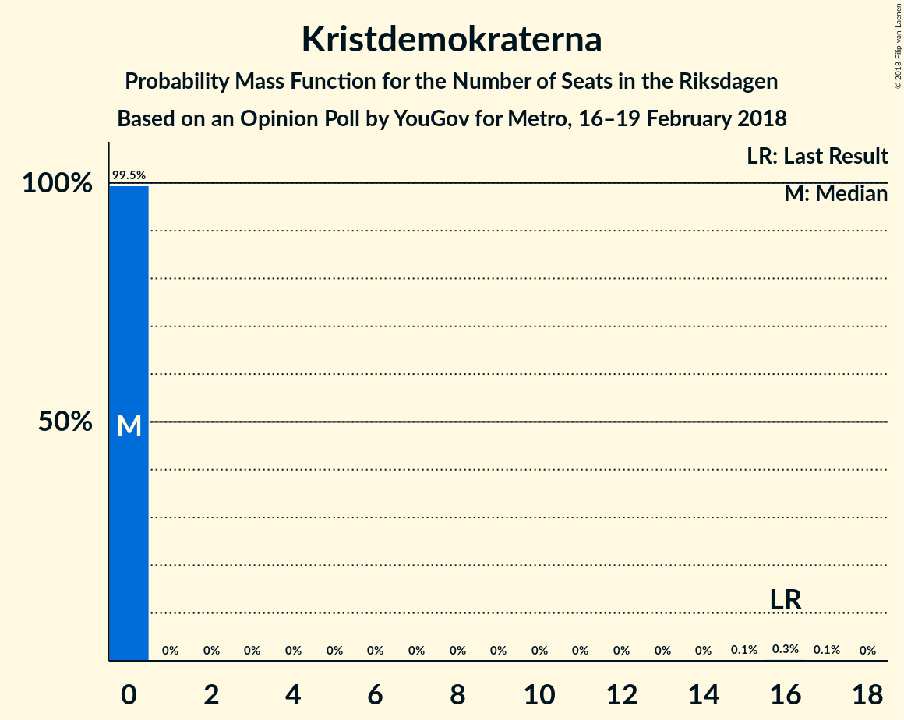

# Opinion Poll by YouGov for Metro, 16–19 February 2018

<a href="#voting-intentions">Voting Intentions</a> | <a href="#seats">Seats</a> | <a href="#coalitions">Coalitions</a> | <a href="#technical-information">Technical Information</a>

## Voting Intentions

### Confidence Intervals

| Party | Last Result | Poll Result | 80% Confidence Interval | 90% Confidence Interval | 95% Confidence Interval | 99% Confidence Interval |
|:-----:|:-----------:|:-----------:|:-----------------------:|:-----------------------:|:-----------------------:|:-----------------------:|
| Sveriges socialdemokratiska arbetareparti | 31.0% | 22.4% | 20.9–24.0% |20.4–24.5% |20.1–24.9% |19.4–25.7% |
| Sverigedemokraterna | 12.9% | 22.1% | 20.6–23.8% |20.2–24.2% |19.8–24.6% |19.1–25.4% |
| Moderata samlingspartiet | 23.3% | 20.5% | 19.0–22.1% |18.6–22.5% |18.3–22.9% |17.6–23.7% |
| Vänsterpartiet | 5.7% | 10.0% | 9.0–11.2% |8.7–11.6% |8.4–11.9% |7.9–12.5% |
| Centerpartiet | 6.1% | 9.3% | 8.3–10.5% |8.0–10.9% |7.8–11.2% |7.3–11.8% |
| Liberalerna | 5.4% | 4.7% | 4.0–5.6% |3.8–5.8% |3.6–6.1% |3.3–6.5% |
| Miljöpartiet de gröna | 6.9% | 3.4% | 2.8–4.2% |2.6–4.4% |2.5–4.6% |2.2–5.0% |
| Kristdemokraterna | 4.6% | 2.6% | 2.1–3.3% |1.9–3.5% |1.8–3.7% |1.6–4.1% |
| Feministiskt initiativ | 3.1% | 2.5% | 2.0–3.2% |1.9–3.4% |1.8–3.6% |1.5–3.9% |

*Note:* The poll result column reflects the actual value used in the calculations. Published results may vary slightly, and in addition be rounded to fewer digits.

## Seats

### Confidence Intervals

| Party | Last Result | Median | 80% Confidence Interval | 90% Confidence Interval | 95% Confidence Interval | 99% Confidence Interval |
|:-----:|:-----------:|:------:|:-----------------------:|:-----------------------:|:-----------------------:|:-----------------------:|
| <a href="#sveriges-socialdemokratiska-arbetareparti">Sveriges socialdemokratiska arbetareparti</a> | 113 | 88 | 81–94 |79–96 |78–97 |75–101 |
| <a href="#sverigedemokraterna">Sverigedemokraterna</a> | 49 | 86 | 80–92 |78–95 |77–97 |74–100 |
| <a href="#moderata-samlingspartiet">Moderata samlingspartiet</a> | 84 | 80 | 76–85 |73–87 |71–89 |68–95 |
| <a href="#vänsterpartiet">Vänsterpartiet</a> | 21 | 39 | 35–43 |34–44 |33–46 |31–49 |
| <a href="#centerpartiet">Centerpartiet</a> | 22 | 37 | 32–41 |31–42 |30–44 |29–46 |
| <a href="#liberalerna">Liberalerna</a> | 19 | 18 | 0–21 |0–22 |0–23 |0–25 |
| <a href="#miljöpartiet-de-gröna">Miljöpartiet de gröna</a> | 25 | 0 | 0–16 |0–17 |0–17 |0–18 |
| <a href="#kristdemokraterna">Kristdemokraterna</a> | 16 | 0 | 0 |0 |0 |0–15 |
| <a href="#feministiskt-initiativ">Feministiskt initiativ</a> | 0 | 0 | 0 |0 |0 |0 |

### Sveriges socialdemokratiska arbetareparti

*For a full overview of the results for this party, see the [Sveriges socialdemokratiska arbetareparti](party-sverigessocialdemokratiskaarbetareparti.html) page.*

| Number of Seats | Probability | Accumulated | Special Marks |
|:---------------:|:-----------:|:-----------:|:-------------:|
| 71 | 0% | 100% |  |
| 72 | 0.1% | 99.9% |  |
| 73 | 0% | 99.9% |  |
| 74 | 0.1% | 99.8% |  |
| 75 | 0.6% | 99.7% |  |
| 76 | 0.2% | 99.1% |  |
| 77 | 0.4% | 98.8% |  |
| 78 | 3% | 98% |  |
| 79 | 1.0% | 96% |  |
| 80 | 1.3% | 95% |  |
| 81 | 4% | 94% |  |
| 82 | 3% | 89% |  |
| 83 | 3% | 87% |  |
| 84 | 10% | 83% |  |
| 85 | 4% | 74% |  |
| 86 | 1.4% | 69% |  |
| 87 | 17% | 68% |  |
| 88 | 6% | 51% | Median |
| 89 | 1.4% | 45% |  |
| 90 | 18% | 43% |  |
| 91 | 8% | 25% |  |
| 92 | 2% | 17% |  |
| 93 | 3% | 15% |  |
| 94 | 5% | 12% |  |
| 95 | 2% | 7% |  |
| 96 | 2% | 6% |  |
| 97 | 2% | 4% |  |
| 98 | 0.4% | 2% |  |
| 99 | 0.4% | 2% |  |
| 100 | 0.9% | 1.5% |  |
| 101 | 0.2% | 0.6% |  |
| 102 | 0.1% | 0.3% |  |
| 103 | 0.1% | 0.2% |  |
| 104 | 0% | 0.1% |  |
| 105 | 0.1% | 0.1% |  |
| 106 | 0% | 0% |  |
| 107 | 0% | 0% |  |
| 108 | 0% | 0% |  |
| 109 | 0% | 0% |  |
| 110 | 0% | 0% |  |
| 111 | 0% | 0% |  |
| 112 | 0% | 0% |  |
| 113 | 0% | 0% | Last Result |

### Sverigedemokraterna

*For a full overview of the results for this party, see the [Sverigedemokraterna](party-sverigedemokraterna.html) page.*

| Number of Seats | Probability | Accumulated | Special Marks |
|:---------------:|:-----------:|:-----------:|:-------------:|
| 49 | 0% | 100% | Last Result |
| 50 | 0% | 100% |  |
| 51 | 0% | 100% |  |
| 52 | 0% | 100% |  |
| 53 | 0% | 100% |  |
| 54 | 0% | 100% |  |
| 55 | 0% | 100% |  |
| 56 | 0% | 100% |  |
| 57 | 0% | 100% |  |
| 58 | 0% | 100% |  |
| 59 | 0% | 100% |  |
| 60 | 0% | 100% |  |
| 61 | 0% | 100% |  |
| 62 | 0% | 100% |  |
| 63 | 0% | 100% |  |
| 64 | 0% | 100% |  |
| 65 | 0% | 100% |  |
| 66 | 0% | 100% |  |
| 67 | 0% | 100% |  |
| 68 | 0% | 100% |  |
| 69 | 0% | 100% |  |
| 70 | 0% | 100% |  |
| 71 | 0% | 100% |  |
| 72 | 0.1% | 99.9% |  |
| 73 | 0.1% | 99.8% |  |
| 74 | 0.4% | 99.7% |  |
| 75 | 0.5% | 99.3% |  |
| 76 | 0.9% | 98.8% |  |
| 77 | 2% | 98% |  |
| 78 | 2% | 96% |  |
| 79 | 2% | 94% |  |
| 80 | 4% | 92% |  |
| 81 | 6% | 88% |  |
| 82 | 5% | 82% |  |
| 83 | 4% | 77% |  |
| 84 | 8% | 72% |  |
| 85 | 14% | 65% |  |
| 86 | 5% | 50% | Median |
| 87 | 18% | 46% |  |
| 88 | 4% | 28% |  |
| 89 | 3% | 24% |  |
| 90 | 3% | 21% |  |
| 91 | 7% | 19% |  |
| 92 | 3% | 12% |  |
| 93 | 2% | 9% |  |
| 94 | 2% | 7% |  |
| 95 | 2% | 5% |  |
| 96 | 0.5% | 3% |  |
| 97 | 1.3% | 3% |  |
| 98 | 0.4% | 1.3% |  |
| 99 | 0.3% | 0.9% |  |
| 100 | 0.2% | 0.6% |  |
| 101 | 0.2% | 0.4% |  |
| 102 | 0.2% | 0.3% |  |
| 103 | 0% | 0.1% |  |
| 104 | 0% | 0.1% |  |
| 105 | 0% | 0.1% |  |
| 106 | 0% | 0% |  |

### Moderata samlingspartiet

*For a full overview of the results for this party, see the [Moderata samlingspartiet](party-moderatasamlingspartiet.html) page.*

| Number of Seats | Probability | Accumulated | Special Marks |
|:---------------:|:-----------:|:-----------:|:-------------:|
| 64 | 0% | 100% |  |
| 65 | 0.1% | 99.9% |  |
| 66 | 0.1% | 99.9% |  |
| 67 | 0.2% | 99.7% |  |
| 68 | 0.2% | 99.5% |  |
| 69 | 0.4% | 99.3% |  |
| 70 | 0.6% | 98.9% |  |
| 71 | 0.9% | 98% |  |
| 72 | 1.3% | 97% |  |
| 73 | 1.3% | 96% |  |
| 74 | 2% | 95% |  |
| 75 | 2% | 93% |  |
| 76 | 4% | 90% |  |
| 77 | 6% | 86% |  |
| 78 | 9% | 80% |  |
| 79 | 20% | 71% |  |
| 80 | 19% | 51% | Median |
| 81 | 6% | 31% |  |
| 82 | 7% | 25% |  |
| 83 | 4% | 18% |  |
| 84 | 4% | 14% | Last Result |
| 85 | 2% | 10% |  |
| 86 | 3% | 8% |  |
| 87 | 1.5% | 5% |  |
| 88 | 1.0% | 4% |  |
| 89 | 0.7% | 3% |  |
| 90 | 0.7% | 2% |  |
| 91 | 0.3% | 2% |  |
| 92 | 0.3% | 1.2% |  |
| 93 | 0.1% | 0.9% |  |
| 94 | 0.2% | 0.8% |  |
| 95 | 0.4% | 0.5% |  |
| 96 | 0.1% | 0.2% |  |
| 97 | 0.1% | 0.1% |  |
| 98 | 0% | 0% |  |

### Vänsterpartiet

*For a full overview of the results for this party, see the [Vänsterpartiet](party-vänsterpartiet.html) page.*

| Number of Seats | Probability | Accumulated | Special Marks |
|:---------------:|:-----------:|:-----------:|:-------------:|
| 21 | 0% | 100% | Last Result |
| 22 | 0% | 100% |  |
| 23 | 0% | 100% |  |
| 24 | 0% | 100% |  |
| 25 | 0% | 100% |  |
| 26 | 0% | 100% |  |
| 27 | 0% | 100% |  |
| 28 | 0% | 100% |  |
| 29 | 0.1% | 100% |  |
| 30 | 0.2% | 99.9% |  |
| 31 | 0.4% | 99.7% |  |
| 32 | 1.0% | 99.2% |  |
| 33 | 1.5% | 98% |  |
| 34 | 3% | 97% |  |
| 35 | 4% | 94% |  |
| 36 | 6% | 89% |  |
| 37 | 9% | 83% |  |
| 38 | 22% | 75% |  |
| 39 | 10% | 53% | Median |
| 40 | 5% | 43% |  |
| 41 | 17% | 37% |  |
| 42 | 8% | 20% |  |
| 43 | 2% | 12% |  |
| 44 | 5% | 9% |  |
| 45 | 2% | 5% |  |
| 46 | 0.6% | 3% |  |
| 47 | 1.0% | 2% |  |
| 48 | 0.6% | 1.1% |  |
| 49 | 0.1% | 0.5% |  |
| 50 | 0.2% | 0.4% |  |
| 51 | 0.1% | 0.2% |  |
| 52 | 0% | 0.1% |  |
| 53 | 0.1% | 0.1% |  |
| 54 | 0% | 0% |  |

### Centerpartiet

*For a full overview of the results for this party, see the [Centerpartiet](party-centerpartiet.html) page.*

| Number of Seats | Probability | Accumulated | Special Marks |
|:---------------:|:-----------:|:-----------:|:-------------:|
| 22 | 0% | 100% | Last Result |
| 23 | 0% | 100% |  |
| 24 | 0% | 100% |  |
| 25 | 0% | 100% |  |
| 26 | 0.1% | 100% |  |
| 27 | 0.1% | 99.9% |  |
| 28 | 0.3% | 99.8% |  |
| 29 | 1.0% | 99.6% |  |
| 30 | 2% | 98.5% |  |
| 31 | 2% | 97% |  |
| 32 | 5% | 94% |  |
| 33 | 5% | 89% |  |
| 34 | 5% | 84% |  |
| 35 | 7% | 79% |  |
| 36 | 10% | 72% |  |
| 37 | 21% | 62% | Median |
| 38 | 17% | 41% |  |
| 39 | 5% | 24% |  |
| 40 | 5% | 19% |  |
| 41 | 5% | 14% |  |
| 42 | 4% | 9% |  |
| 43 | 2% | 5% |  |
| 44 | 1.3% | 3% |  |
| 45 | 0.8% | 1.4% |  |
| 46 | 0.3% | 0.6% |  |
| 47 | 0.2% | 0.3% |  |
| 48 | 0.1% | 0.2% |  |
| 49 | 0% | 0.1% |  |
| 50 | 0.1% | 0.1% |  |
| 51 | 0% | 0% |  |

### Liberalerna

*For a full overview of the results for this party, see the [Liberalerna](party-liberalerna.html) page.*

| Number of Seats | Probability | Accumulated | Special Marks |
|:---------------:|:-----------:|:-----------:|:-------------:|
| 0 | 14% | 100% |  |
| 1 | 0% | 86% |  |
| 2 | 0% | 86% |  |
| 3 | 0% | 86% |  |
| 4 | 0% | 86% |  |
| 5 | 0% | 86% |  |
| 6 | 0% | 86% |  |
| 7 | 0% | 86% |  |
| 8 | 0% | 86% |  |
| 9 | 0% | 86% |  |
| 10 | 0% | 86% |  |
| 11 | 0% | 86% |  |
| 12 | 0% | 86% |  |
| 13 | 0% | 86% |  |
| 14 | 0% | 86% |  |
| 15 | 0.7% | 86% |  |
| 16 | 5% | 85% |  |
| 17 | 15% | 80% |  |
| 18 | 31% | 65% | Median |
| 19 | 11% | 35% | Last Result |
| 20 | 7% | 24% |  |
| 21 | 8% | 17% |  |
| 22 | 5% | 9% |  |
| 23 | 3% | 4% |  |
| 24 | 0.7% | 1.4% |  |
| 25 | 0.5% | 0.7% |  |
| 26 | 0.1% | 0.2% |  |
| 27 | 0.1% | 0.1% |  |
| 28 | 0% | 0% |  |

### Miljöpartiet de gröna

*For a full overview of the results for this party, see the [Miljöpartiet de gröna](party-miljöpartietdegröna.html) page.*

| Number of Seats | Probability | Accumulated | Special Marks |
|:---------------:|:-----------:|:-----------:|:-------------:|
| 0 | 82% | 100% | Median |
| 1 | 0% | 18% |  |
| 2 | 0% | 18% |  |
| 3 | 0% | 18% |  |
| 4 | 0% | 18% |  |
| 5 | 0% | 18% |  |
| 6 | 0% | 18% |  |
| 7 | 0% | 18% |  |
| 8 | 0% | 18% |  |
| 9 | 0% | 18% |  |
| 10 | 0% | 18% |  |
| 11 | 0% | 18% |  |
| 12 | 0% | 18% |  |
| 13 | 0% | 18% |  |
| 14 | 0% | 18% |  |
| 15 | 1.0% | 18% |  |
| 16 | 11% | 17% |  |
| 17 | 5% | 6% |  |
| 18 | 1.5% | 2% |  |
| 19 | 0.2% | 0.4% |  |
| 20 | 0.1% | 0.2% |  |
| 21 | 0% | 0.1% |  |
| 22 | 0% | 0% |  |
| 23 | 0% | 0% |  |
| 24 | 0% | 0% |  |
| 25 | 0% | 0% | Last Result |

### Kristdemokraterna

*For a full overview of the results for this party, see the [Kristdemokraterna](party-kristdemokraterna.html) page.*

| Number of Seats | Probability | Accumulated | Special Marks |
|:---------------:|:-----------:|:-----------:|:-------------:|
| 0 | 99.5% | 100% | Median |
| 1 | 0% | 0.5% |  |
| 2 | 0% | 0.5% |  |
| 3 | 0% | 0.5% |  |
| 4 | 0% | 0.5% |  |
| 5 | 0% | 0.5% |  |
| 6 | 0% | 0.5% |  |
| 7 | 0% | 0.5% |  |
| 8 | 0% | 0.5% |  |
| 9 | 0% | 0.5% |  |
| 10 | 0% | 0.5% |  |
| 11 | 0% | 0.5% |  |
| 12 | 0% | 0.5% |  |
| 13 | 0% | 0.5% |  |
| 14 | 0% | 0.5% |  |
| 15 | 0.1% | 0.5% |  |
| 16 | 0.3% | 0.4% | Last Result |
| 17 | 0.1% | 0.1% |  |
| 18 | 0% | 0% |  |

### Feministiskt initiativ

*For a full overview of the results for this party, see the [Feministiskt initiativ](party-feministisktinitiativ.html) page.*

| Number of Seats | Probability | Accumulated | Special Marks |
|:---------------:|:-----------:|:-----------:|:-------------:|
| 0 | 99.7% | 100% | Last Result, Median |
| 1 | 0% | 0.3% |  |
| 2 | 0% | 0.3% |  |
| 3 | 0% | 0.3% |  |
| 4 | 0% | 0.3% |  |
| 5 | 0% | 0.3% |  |
| 6 | 0% | 0.3% |  |
| 7 | 0% | 0.3% |  |
| 8 | 0% | 0.3% |  |
| 9 | 0% | 0.3% |  |
| 10 | 0% | 0.3% |  |
| 11 | 0% | 0.3% |  |
| 12 | 0% | 0.3% |  |
| 13 | 0% | 0.3% |  |
| 14 | 0% | 0.3% |  |
| 15 | 0.1% | 0.3% |  |
| 16 | 0.1% | 0.2% |  |
| 17 | 0.1% | 0.1% |  |
| 18 | 0% | 0% |  |

## Coalitions

### Confidence Intervals

| Coalition | Last Result | Median | Majority? | 80% Confidence Interval | 90% Confidence Interval | 95% Confidence Interval | 99% Confidence Interval |
|:---------:|:-----------:|:------:|:---------:|:-----------------------:|:-----------------------:|:-----------------------:|:-----------------------:|
| Sveriges socialdemokratiska arbetareparti – Vänsterpartiet – Miljöpartiet de gröna – Feministiskt initiativ | 159 | 128 | 0% | 122–140 | 119–144 | 117–148 | 114–149 |
| Sveriges socialdemokratiska arbetareparti – Vänsterpartiet – Miljöpartiet de gröna | 159 | 128 | 0% | 122–140 | 119–144 | 117–148 | 114–149 |
| Moderata samlingspartiet – Centerpartiet – Liberalerna – Kristdemokraterna | 141 | 134 | 0% | 123–141 | 119–143 | 117–145 | 112–148 |
| Moderata samlingspartiet – Centerpartiet – Liberalerna | 125 | 134 | 0% | 122–141 | 119–143 | 117–145 | 112–148 |
| Sveriges socialdemokratiska arbetareparti – Vänsterpartiet | 134 | 128 | 0% | 119–133 | 116–135 | 115–137 | 112–142 |
| Moderata samlingspartiet – Centerpartiet – Kristdemokraterna | 122 | 116 | 0% | 111–123 | 109–125 | 107–128 | 103–133 |
| Moderata samlingspartiet – Centerpartiet | 106 | 116 | 0% | 111–123 | 109–125 | 106–128 | 103–133 |
| Sveriges socialdemokratiska arbetareparti – Miljöpartiet de gröna | 138 | 90 | 0% | 83–101 | 81–105 | 79–106 | 77–110 |

### Sveriges socialdemokratiska arbetareparti – Vänsterpartiet – Miljöpartiet de gröna – Feministiskt initiativ

| Number of Seats | Probability | Accumulated | Special Marks |
|:---------------:|:-----------:|:-----------:|:-------------:|
| 110 | 0% | 100% |  |
| 111 | 0.1% | 99.9% |  |
| 112 | 0% | 99.9% |  |
| 113 | 0.2% | 99.8% |  |
| 114 | 0.3% | 99.6% |  |
| 115 | 0.6% | 99.3% |  |
| 116 | 0.5% | 98.7% |  |
| 117 | 2% | 98% |  |
| 118 | 0.9% | 96% |  |
| 119 | 2% | 95% |  |
| 120 | 1.0% | 93% |  |
| 121 | 2% | 92% |  |
| 122 | 0.9% | 91% |  |
| 123 | 3% | 90% |  |
| 124 | 1.2% | 87% |  |
| 125 | 4% | 86% |  |
| 126 | 5% | 81% |  |
| 127 | 4% | 77% | Median |
| 128 | 25% | 73% |  |
| 129 | 5% | 48% |  |
| 130 | 6% | 43% |  |
| 131 | 4% | 36% |  |
| 132 | 5% | 32% |  |
| 133 | 2% | 27% |  |
| 134 | 3% | 24% |  |
| 135 | 3% | 21% |  |
| 136 | 2% | 18% |  |
| 137 | 3% | 17% |  |
| 138 | 2% | 13% |  |
| 139 | 0.9% | 12% |  |
| 140 | 1.5% | 11% |  |
| 141 | 3% | 9% |  |
| 142 | 0.5% | 6% |  |
| 143 | 0.4% | 6% |  |
| 144 | 0.4% | 5% |  |
| 145 | 0.2% | 5% |  |
| 146 | 0.4% | 5% |  |
| 147 | 0.6% | 4% |  |
| 148 | 2% | 4% |  |
| 149 | 2% | 2% |  |
| 150 | 0% | 0.2% |  |
| 151 | 0% | 0.2% |  |
| 152 | 0% | 0.2% |  |
| 153 | 0% | 0.1% |  |
| 154 | 0% | 0.1% |  |
| 155 | 0% | 0.1% |  |
| 156 | 0% | 0.1% |  |
| 157 | 0% | 0% |  |
| 158 | 0% | 0% |  |
| 159 | 0% | 0% | Last Result |

### Sveriges socialdemokratiska arbetareparti – Vänsterpartiet – Miljöpartiet de gröna

| Number of Seats | Probability | Accumulated | Special Marks |
|:---------------:|:-----------:|:-----------:|:-------------:|
| 110 | 0% | 100% |  |
| 111 | 0.1% | 99.9% |  |
| 112 | 0% | 99.9% |  |
| 113 | 0.2% | 99.8% |  |
| 114 | 0.3% | 99.6% |  |
| 115 | 0.6% | 99.3% |  |
| 116 | 0.5% | 98.7% |  |
| 117 | 2% | 98% |  |
| 118 | 0.9% | 96% |  |
| 119 | 2% | 95% |  |
| 120 | 1.0% | 93% |  |
| 121 | 2% | 92% |  |
| 122 | 0.9% | 91% |  |
| 123 | 3% | 90% |  |
| 124 | 1.2% | 87% |  |
| 125 | 4% | 86% |  |
| 126 | 5% | 81% |  |
| 127 | 4% | 76% | Median |
| 128 | 25% | 73% |  |
| 129 | 5% | 48% |  |
| 130 | 7% | 42% |  |
| 131 | 4% | 36% |  |
| 132 | 5% | 32% |  |
| 133 | 2% | 27% |  |
| 134 | 3% | 24% |  |
| 135 | 3% | 21% |  |
| 136 | 2% | 18% |  |
| 137 | 3% | 16% |  |
| 138 | 2% | 13% |  |
| 139 | 0.9% | 11% |  |
| 140 | 1.5% | 11% |  |
| 141 | 3% | 9% |  |
| 142 | 0.5% | 6% |  |
| 143 | 0.3% | 6% |  |
| 144 | 0.4% | 5% |  |
| 145 | 0.2% | 5% |  |
| 146 | 0.4% | 5% |  |
| 147 | 0.6% | 4% |  |
| 148 | 2% | 4% |  |
| 149 | 2% | 2% |  |
| 150 | 0% | 0.2% |  |
| 151 | 0% | 0.2% |  |
| 152 | 0% | 0.1% |  |
| 153 | 0% | 0.1% |  |
| 154 | 0% | 0.1% |  |
| 155 | 0% | 0.1% |  |
| 156 | 0% | 0.1% |  |
| 157 | 0% | 0% |  |
| 158 | 0% | 0% |  |
| 159 | 0% | 0% | Last Result |

### Moderata samlingspartiet – Centerpartiet – Liberalerna – Kristdemokraterna

| Number of Seats | Probability | Accumulated | Special Marks |
|:---------------:|:-----------:|:-----------:|:-------------:|
| 107 | 0% | 100% |  |
| 108 | 0% | 99.9% |  |
| 109 | 0% | 99.9% |  |
| 110 | 0.3% | 99.9% |  |
| 111 | 0.1% | 99.6% |  |
| 112 | 0.1% | 99.6% |  |
| 113 | 0.1% | 99.5% |  |
| 114 | 1.4% | 99.4% |  |
| 115 | 0.1% | 98% |  |
| 116 | 0.2% | 98% |  |
| 117 | 2% | 98% |  |
| 118 | 0.2% | 95% |  |
| 119 | 1.1% | 95% |  |
| 120 | 1.1% | 94% |  |
| 121 | 0.8% | 93% |  |
| 122 | 2% | 92% |  |
| 123 | 1.3% | 90% |  |
| 124 | 2% | 89% |  |
| 125 | 2% | 87% |  |
| 126 | 1.1% | 86% |  |
| 127 | 1.4% | 84% |  |
| 128 | 4% | 83% |  |
| 129 | 2% | 79% |  |
| 130 | 3% | 77% |  |
| 131 | 6% | 73% |  |
| 132 | 5% | 67% |  |
| 133 | 3% | 62% |  |
| 134 | 16% | 59% |  |
| 135 | 4% | 42% | Median |
| 136 | 12% | 38% |  |
| 137 | 2% | 26% |  |
| 138 | 4% | 23% |  |
| 139 | 6% | 20% |  |
| 140 | 2% | 14% |  |
| 141 | 2% | 12% | Last Result |
| 142 | 3% | 9% |  |
| 143 | 2% | 6% |  |
| 144 | 1.1% | 4% |  |
| 145 | 2% | 3% |  |
| 146 | 0.4% | 1.4% |  |
| 147 | 0.2% | 1.1% |  |
| 148 | 0.4% | 0.8% |  |
| 149 | 0.1% | 0.4% |  |
| 150 | 0.1% | 0.3% |  |
| 151 | 0.1% | 0.2% |  |
| 152 | 0.1% | 0.1% |  |
| 153 | 0% | 0.1% |  |
| 154 | 0% | 0.1% |  |
| 155 | 0% | 0% |  |

### Moderata samlingspartiet – Centerpartiet – Liberalerna

| Number of Seats | Probability | Accumulated | Special Marks |
|:---------------:|:-----------:|:-----------:|:-------------:|
| 107 | 0% | 100% |  |
| 108 | 0% | 99.9% |  |
| 109 | 0% | 99.9% |  |
| 110 | 0.3% | 99.9% |  |
| 111 | 0.1% | 99.6% |  |
| 112 | 0.1% | 99.6% |  |
| 113 | 0.1% | 99.5% |  |
| 114 | 1.4% | 99.4% |  |
| 115 | 0.1% | 98% |  |
| 116 | 0.2% | 98% |  |
| 117 | 2% | 98% |  |
| 118 | 0.2% | 95% |  |
| 119 | 1.1% | 95% |  |
| 120 | 1.1% | 94% |  |
| 121 | 0.8% | 93% |  |
| 122 | 2% | 92% |  |
| 123 | 1.3% | 90% |  |
| 124 | 2% | 89% |  |
| 125 | 2% | 87% | Last Result |
| 126 | 1.2% | 85% |  |
| 127 | 1.4% | 84% |  |
| 128 | 4% | 83% |  |
| 129 | 2% | 79% |  |
| 130 | 3% | 76% |  |
| 131 | 6% | 73% |  |
| 132 | 6% | 67% |  |
| 133 | 3% | 61% |  |
| 134 | 16% | 58% |  |
| 135 | 4% | 42% | Median |
| 136 | 12% | 37% |  |
| 137 | 2% | 25% |  |
| 138 | 3% | 23% |  |
| 139 | 6% | 19% |  |
| 140 | 2% | 14% |  |
| 141 | 2% | 11% |  |
| 142 | 3% | 9% |  |
| 143 | 2% | 6% |  |
| 144 | 1.1% | 4% |  |
| 145 | 2% | 3% |  |
| 146 | 0.4% | 1.3% |  |
| 147 | 0.2% | 0.9% |  |
| 148 | 0.4% | 0.7% |  |
| 149 | 0.1% | 0.4% |  |
| 150 | 0.1% | 0.3% |  |
| 151 | 0.1% | 0.2% |  |
| 152 | 0.1% | 0.1% |  |
| 153 | 0% | 0.1% |  |
| 154 | 0% | 0% |  |

### Sveriges socialdemokratiska arbetareparti – Vänsterpartiet

| Number of Seats | Probability | Accumulated | Special Marks |
|:---------------:|:-----------:|:-----------:|:-------------:|
| 107 | 0% | 100% |  |
| 108 | 0% | 99.9% |  |
| 109 | 0% | 99.9% |  |
| 110 | 0.1% | 99.9% |  |
| 111 | 0.2% | 99.8% |  |
| 112 | 0.2% | 99.6% |  |
| 113 | 1.1% | 99.3% |  |
| 114 | 0.6% | 98% |  |
| 115 | 1.3% | 98% |  |
| 116 | 2% | 96% |  |
| 117 | 2% | 95% |  |
| 118 | 2% | 92% |  |
| 119 | 3% | 91% |  |
| 120 | 1.1% | 88% |  |
| 121 | 5% | 87% |  |
| 122 | 2% | 82% |  |
| 123 | 3% | 80% |  |
| 124 | 3% | 77% |  |
| 125 | 5% | 73% |  |
| 126 | 5% | 69% |  |
| 127 | 4% | 63% | Median |
| 128 | 25% | 59% |  |
| 129 | 5% | 34% |  |
| 130 | 6% | 29% |  |
| 131 | 4% | 23% |  |
| 132 | 6% | 19% |  |
| 133 | 4% | 13% |  |
| 134 | 3% | 10% | Last Result |
| 135 | 3% | 7% |  |
| 136 | 1.0% | 4% |  |
| 137 | 0.9% | 3% |  |
| 138 | 0.3% | 2% |  |
| 139 | 0.3% | 2% |  |
| 140 | 0.5% | 2% |  |
| 141 | 0.8% | 1.3% |  |
| 142 | 0.2% | 0.6% |  |
| 143 | 0% | 0.3% |  |
| 144 | 0.1% | 0.3% |  |
| 145 | 0% | 0.2% |  |
| 146 | 0.1% | 0.2% |  |
| 147 | 0% | 0.1% |  |
| 148 | 0% | 0% |  |

### Moderata samlingspartiet – Centerpartiet – Kristdemokraterna

| Number of Seats | Probability | Accumulated | Special Marks |
|:---------------:|:-----------:|:-----------:|:-------------:|
| 98 | 0% | 100% |  |
| 99 | 0% | 99.9% |  |
| 100 | 0.1% | 99.9% |  |
| 101 | 0.1% | 99.8% |  |
| 102 | 0.1% | 99.7% |  |
| 103 | 0.3% | 99.6% |  |
| 104 | 0.4% | 99.3% |  |
| 105 | 0.5% | 98.9% |  |
| 106 | 0.8% | 98% |  |
| 107 | 1.4% | 98% |  |
| 108 | 0.9% | 96% |  |
| 109 | 2% | 95% |  |
| 110 | 2% | 93% |  |
| 111 | 4% | 91% |  |
| 112 | 5% | 86% |  |
| 113 | 4% | 82% |  |
| 114 | 8% | 78% |  |
| 115 | 3% | 70% |  |
| 116 | 17% | 67% |  |
| 117 | 8% | 50% | Median |
| 118 | 11% | 42% |  |
| 119 | 5% | 30% |  |
| 120 | 6% | 25% |  |
| 121 | 2% | 19% |  |
| 122 | 6% | 17% | Last Result |
| 123 | 3% | 11% |  |
| 124 | 1.4% | 8% |  |
| 125 | 2% | 7% |  |
| 126 | 0.9% | 5% |  |
| 127 | 0.7% | 4% |  |
| 128 | 0.6% | 3% |  |
| 129 | 0.4% | 2% |  |
| 130 | 0.4% | 2% |  |
| 131 | 0.4% | 2% |  |
| 132 | 0.4% | 1.3% |  |
| 133 | 0.4% | 0.9% |  |
| 134 | 0.1% | 0.5% |  |
| 135 | 0.2% | 0.4% |  |
| 136 | 0.1% | 0.2% |  |
| 137 | 0% | 0.1% |  |
| 138 | 0% | 0.1% |  |
| 139 | 0% | 0% |  |

### Moderata samlingspartiet – Centerpartiet

| Number of Seats | Probability | Accumulated | Special Marks |
|:---------------:|:-----------:|:-----------:|:-------------:|
| 98 | 0% | 100% |  |
| 99 | 0% | 99.9% |  |
| 100 | 0.1% | 99.9% |  |
| 101 | 0.1% | 99.8% |  |
| 102 | 0.2% | 99.7% |  |
| 103 | 0.3% | 99.6% |  |
| 104 | 0.4% | 99.2% |  |
| 105 | 0.5% | 98.8% |  |
| 106 | 0.8% | 98% | Last Result |
| 107 | 1.5% | 97% |  |
| 108 | 1.0% | 96% |  |
| 109 | 2% | 95% |  |
| 110 | 2% | 93% |  |
| 111 | 5% | 91% |  |
| 112 | 5% | 86% |  |
| 113 | 4% | 81% |  |
| 114 | 8% | 78% |  |
| 115 | 3% | 70% |  |
| 116 | 17% | 66% |  |
| 117 | 8% | 49% | Median |
| 118 | 11% | 41% |  |
| 119 | 5% | 30% |  |
| 120 | 6% | 25% |  |
| 121 | 2% | 19% |  |
| 122 | 6% | 17% |  |
| 123 | 3% | 11% |  |
| 124 | 1.4% | 8% |  |
| 125 | 2% | 7% |  |
| 126 | 0.8% | 4% |  |
| 127 | 0.7% | 4% |  |
| 128 | 0.6% | 3% |  |
| 129 | 0.4% | 2% |  |
| 130 | 0.3% | 2% |  |
| 131 | 0.4% | 2% |  |
| 132 | 0.4% | 1.2% |  |
| 133 | 0.4% | 0.9% |  |
| 134 | 0.1% | 0.4% |  |
| 135 | 0.2% | 0.3% |  |
| 136 | 0.1% | 0.1% |  |
| 137 | 0% | 0.1% |  |
| 138 | 0% | 0% |  |

### Sveriges socialdemokratiska arbetareparti – Miljöpartiet de gröna

| Number of Seats | Probability | Accumulated | Special Marks |
|:---------------:|:-----------:|:-----------:|:-------------:|
| 73 | 0% | 100% |  |
| 74 | 0% | 99.9% |  |
| 75 | 0.3% | 99.9% |  |
| 76 | 0.1% | 99.6% |  |
| 77 | 0.3% | 99.5% |  |
| 78 | 1.3% | 99.3% |  |
| 79 | 0.5% | 98% |  |
| 80 | 0.8% | 97% |  |
| 81 | 3% | 97% |  |
| 82 | 2% | 94% |  |
| 83 | 2% | 92% |  |
| 84 | 5% | 89% |  |
| 85 | 4% | 84% |  |
| 86 | 1.1% | 80% |  |
| 87 | 15% | 79% |  |
| 88 | 6% | 64% | Median |
| 89 | 1.4% | 58% |  |
| 90 | 16% | 57% |  |
| 91 | 8% | 41% |  |
| 92 | 2% | 33% |  |
| 93 | 3% | 31% |  |
| 94 | 4% | 28% |  |
| 95 | 2% | 23% |  |
| 96 | 2% | 21% |  |
| 97 | 2% | 20% |  |
| 98 | 2% | 17% |  |
| 99 | 0.9% | 15% |  |
| 100 | 3% | 14% |  |
| 101 | 3% | 11% |  |
| 102 | 0.6% | 8% |  |
| 103 | 2% | 7% |  |
| 104 | 0.4% | 6% |  |
| 105 | 0.6% | 5% |  |
| 106 | 2% | 5% |  |
| 107 | 0.3% | 2% |  |
| 108 | 0.1% | 2% |  |
| 109 | 0.1% | 2% |  |
| 110 | 1.4% | 2% |  |
| 111 | 0.3% | 0.5% |  |
| 112 | 0.1% | 0.2% |  |
| 113 | 0% | 0.1% |  |
| 114 | 0% | 0.1% |  |
| 115 | 0% | 0.1% |  |
| 116 | 0% | 0% |  |
| 117 | 0% | 0% |  |
| 118 | 0% | 0% |  |
| 119 | 0% | 0% |  |
| 120 | 0% | 0% |  |
| 121 | 0% | 0% |  |
| 122 | 0% | 0% |  |
| 123 | 0% | 0% |  |
| 124 | 0% | 0% |  |
| 125 | 0% | 0% |  |
| 126 | 0% | 0% |  |
| 127 | 0% | 0% |  |
| 128 | 0% | 0% |  |
| 129 | 0% | 0% |  |
| 130 | 0% | 0% |  |
| 131 | 0% | 0% |  |
| 132 | 0% | 0% |  |
| 133 | 0% | 0% |  |
| 134 | 0% | 0% |  |
| 135 | 0% | 0% |  |
| 136 | 0% | 0% |  |
| 137 | 0% | 0% |  |
| 138 | 0% | 0% | Last Result |

## Technical Information

### Opinion Poll

+ **Polling firm:** YouGov
+ **Commissioner(s):** Metro
+ **Fieldwork period:** 16–19 February 2018

### Calculations

+ **Sample size:** 1157
+ **Simulations done:** 1,048,576
+ **Error estimate:** 1.22%

