# Opinion Poll by Ipsos for Dagens Nyheter, 10–21 May 2018

<a href="#voting-intentions">Voting Intentions</a> | <a href="#seats">Seats</a> | <a href="#coalitions">Coalitions</a> | <a href="#technical-information">Technical Information</a>

## Voting Intentions

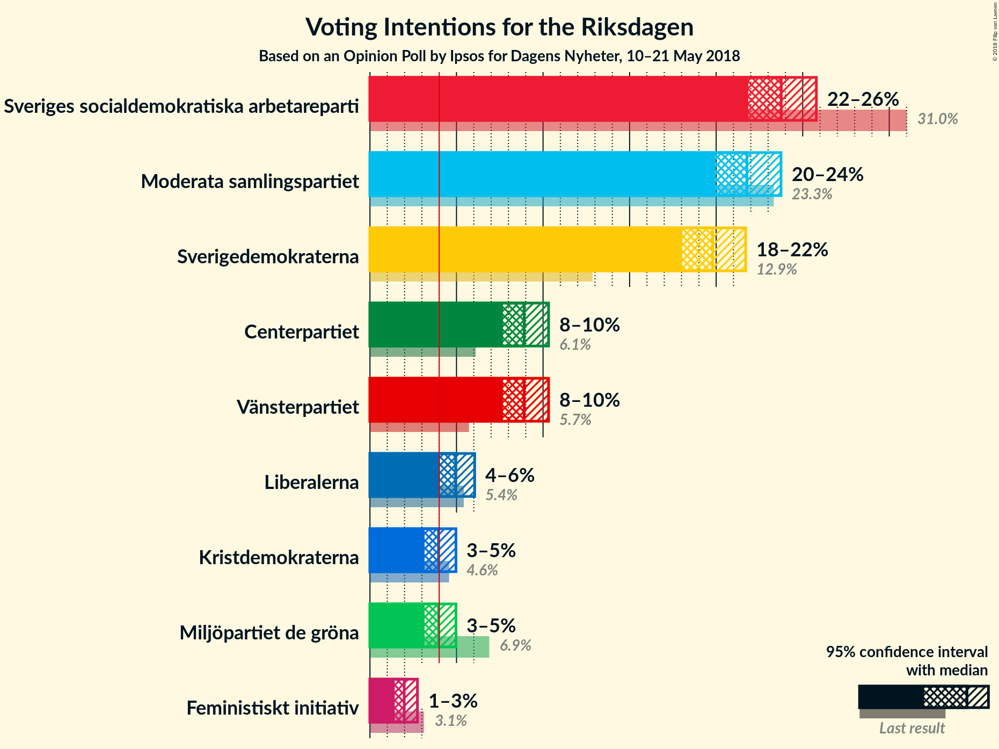

### Confidence Intervals

| Party | Last Result | Poll Result | 80% Confidence Interval | 90% Confidence Interval | 95% Confidence Interval | 99% Confidence Interval |
|:-----:|:-----------:|:-----------:|:-----------------------:|:-----------------------:|:-----------------------:|:-----------------------:|
| Sveriges socialdemokratiska arbetareparti | 31.0% | 23.8% | 22.5–25.1% |22.2–25.5% |21.9–25.8% |21.3–26.4% |
| Moderata samlingspartiet | 23.3% | 21.8% | 20.6–23.1% |20.2–23.4% |19.9–23.7% |19.4–24.4% |
| Sverigedemokraterna | 12.9% | 19.8% | 18.6–21.0% |18.3–21.4% |18.0–21.7% |17.5–22.3% |
| Centerpartiet | 6.1% | 8.9% | 8.1–9.8% |7.9–10.1% |7.7–10.3% |7.3–10.8% |
| Vänsterpartiet | 5.7% | 8.9% | 8.1–9.8% |7.9–10.1% |7.7–10.3% |7.3–10.8% |
| Liberalerna | 5.4% | 5.0% | 4.3–5.7% |4.2–5.9% |4.0–6.1% |3.8–6.4% |
| Miljöpartiet de gröna | 6.9% | 4.0% | 3.4–4.6% |3.3–4.8% |3.2–5.0% |2.9–5.3% |
| Kristdemokraterna | 4.6% | 4.0% | 3.4–4.6% |3.3–4.8% |3.2–5.0% |2.9–5.3% |
| Feministiskt initiativ | 3.1% | 2.0% | 1.6–2.5% |1.5–2.6% |1.4–2.7% |1.3–3.0% |

*Note:* The poll result column reflects the actual value used in the calculations. Published results may vary slightly, and in addition be rounded to fewer digits.

## Seats

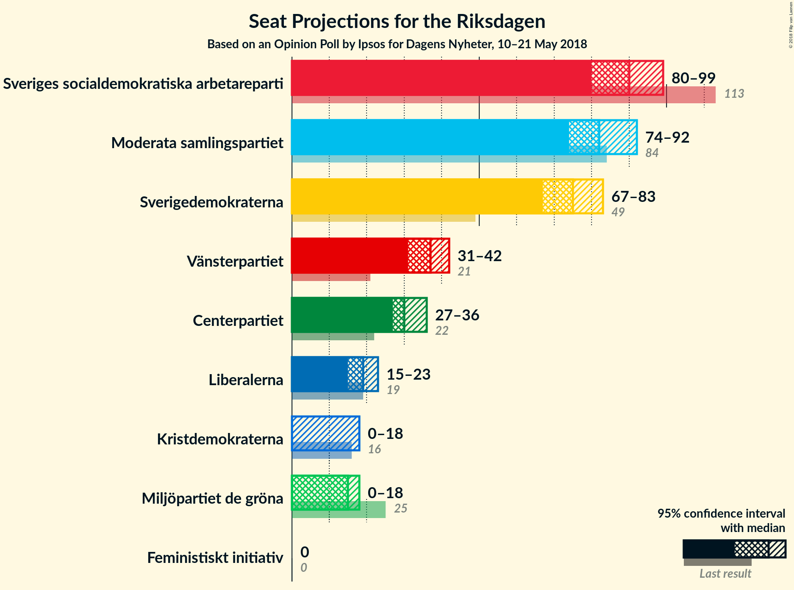

### Confidence Intervals

| Party | Last Result | Median | 80% Confidence Interval | 90% Confidence Interval | 95% Confidence Interval | 99% Confidence Interval |
|:-----:|:-----------:|:------:|:-----------------------:|:-----------------------:|:-----------------------:|:-----------------------:|
| <a href="#sveriges-socialdemokratiska-arbetareparti">Sveriges socialdemokratiska arbetareparti</a> | 113 | 90 | 84–95 |82–97 |80–99 |78–102 |
| <a href="#moderata-samlingspartiet">Moderata samlingspartiet</a> | 84 | 82 | 76–90 |75–92 |74–92 |71–94 |
| <a href="#sverigedemokraterna">Sverigedemokraterna</a> | 49 | 75 | 69–80 |68–82 |67–83 |64–86 |
| <a href="#centerpartiet">Centerpartiet</a> | 22 | 30 | 28–34 |27–35 |27–36 |26–42 |
| <a href="#vänsterpartiet">Vänsterpartiet</a> | 21 | 37 | 34–40 |33–41 |31–42 |27–43 |
| <a href="#liberalerna">Liberalerna</a> | 19 | 19 | 16–21 |16–22 |15–23 |0–24 |
| <a href="#miljöpartiet-de-gröna">Miljöpartiet de gröna</a> | 25 | 15 | 0–17 |0–18 |0–18 |0–20 |
| <a href="#kristdemokraterna">Kristdemokraterna</a> | 16 | 0 | 0–17 |0–18 |0–18 |0–20 |
| <a href="#feministiskt-initiativ">Feministiskt initiativ</a> | 0 | 0 | 0 |0 |0 |0 |

### Sveriges socialdemokratiska arbetareparti

*For a full overview of the results for this party, see the [Sveriges socialdemokratiska arbetareparti](party-sverigessocialdemokratiskaarbetareparti.html) page.*

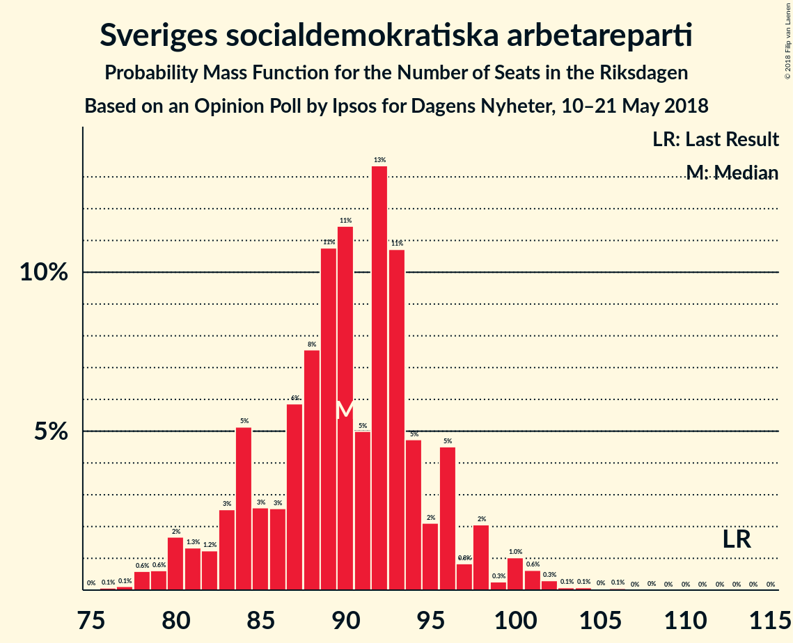

| Number of Seats | Probability | Accumulated | Special Marks |
|:---------------:|:-----------:|:-----------:|:-------------:|
| 75 | 0% | 100% |  |
| 76 | 0.1% | 99.9% |  |
| 77 | 0.1% | 99.9% |  |
| 78 | 0.6% | 99.8% |  |
| 79 | 0.6% | 99.2% |  |
| 80 | 2% | 98.5% |  |
| 81 | 1.3% | 97% |  |
| 82 | 1.2% | 96% |  |
| 83 | 3% | 94% |  |
| 84 | 5% | 92% |  |
| 85 | 3% | 87% |  |
| 86 | 3% | 84% |  |
| 87 | 6% | 81% |  |
| 88 | 8% | 76% |  |
| 89 | 11% | 68% |  |
| 90 | 11% | 57% | Median |
| 91 | 5% | 46% |  |
| 92 | 13% | 41% |  |
| 93 | 11% | 27% |  |
| 94 | 5% | 17% |  |
| 95 | 2% | 12% |  |
| 96 | 5% | 10% |  |
| 97 | 0.8% | 5% |  |
| 98 | 2% | 5% |  |
| 99 | 0.3% | 3% |  |
| 100 | 1.0% | 2% |  |
| 101 | 0.6% | 1.2% |  |
| 102 | 0.3% | 0.6% |  |
| 103 | 0.1% | 0.3% |  |
| 104 | 0.1% | 0.2% |  |
| 105 | 0% | 0.1% |  |
| 106 | 0.1% | 0.1% |  |
| 107 | 0% | 0% |  |
| 108 | 0% | 0% |  |
| 109 | 0% | 0% |  |
| 110 | 0% | 0% |  |
| 111 | 0% | 0% |  |
| 112 | 0% | 0% |  |
| 113 | 0% | 0% | Last Result |

### Moderata samlingspartiet

*For a full overview of the results for this party, see the [Moderata samlingspartiet](party-moderatasamlingspartiet.html) page.*

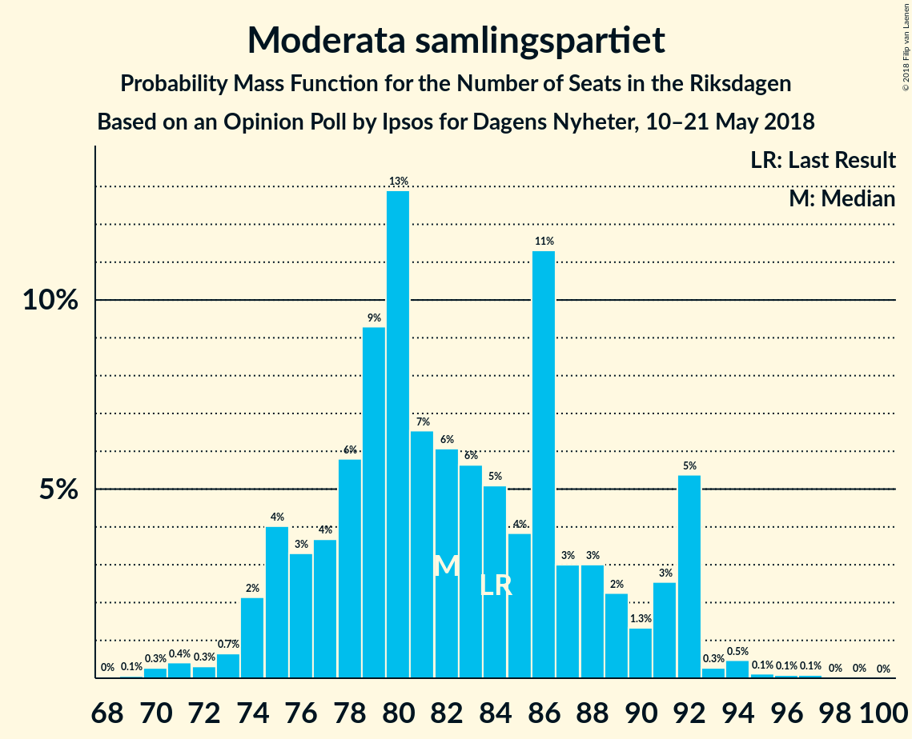

| Number of Seats | Probability | Accumulated | Special Marks |
|:---------------:|:-----------:|:-----------:|:-------------:|
| 68 | 0% | 100% |  |
| 69 | 0.1% | 99.9% |  |
| 70 | 0.3% | 99.9% |  |
| 71 | 0.4% | 99.6% |  |
| 72 | 0.3% | 99.2% |  |
| 73 | 0.7% | 98.9% |  |
| 74 | 2% | 98% |  |
| 75 | 4% | 96% |  |
| 76 | 3% | 92% |  |
| 77 | 4% | 89% |  |
| 78 | 6% | 85% |  |
| 79 | 9% | 79% |  |
| 80 | 13% | 70% |  |
| 81 | 7% | 57% |  |
| 82 | 6% | 51% | Median |
| 83 | 6% | 44% |  |
| 84 | 5% | 39% | Last Result |
| 85 | 4% | 34% |  |
| 86 | 11% | 30% |  |
| 87 | 3% | 19% |  |
| 88 | 3% | 16% |  |
| 89 | 2% | 13% |  |
| 90 | 1.3% | 10% |  |
| 91 | 3% | 9% |  |
| 92 | 5% | 6% |  |
| 93 | 0.3% | 1.1% |  |
| 94 | 0.5% | 0.8% |  |
| 95 | 0.1% | 0.3% |  |
| 96 | 0.1% | 0.2% |  |
| 97 | 0.1% | 0.1% |  |
| 98 | 0% | 0.1% |  |
| 99 | 0% | 0% |  |

### Sverigedemokraterna

*For a full overview of the results for this party, see the [Sverigedemokraterna](party-sverigedemokraterna.html) page.*

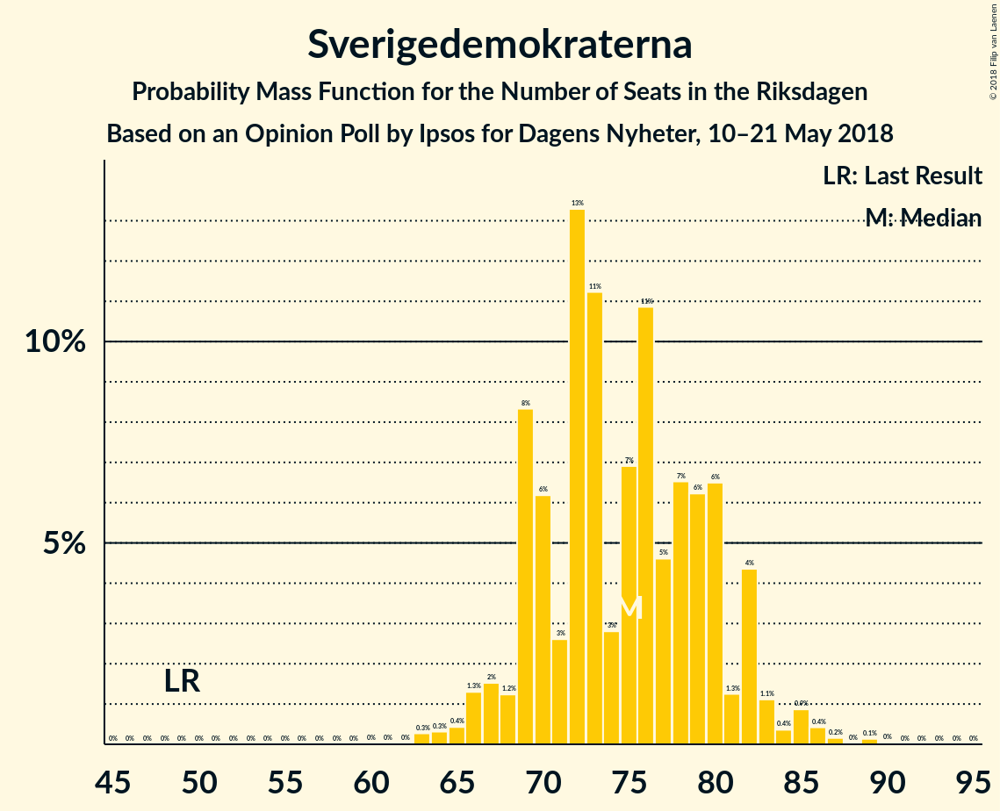

| Number of Seats | Probability | Accumulated | Special Marks |
|:---------------:|:-----------:|:-----------:|:-------------:|
| 49 | 0% | 100% | Last Result |
| 50 | 0% | 100% |  |
| 51 | 0% | 100% |  |
| 52 | 0% | 100% |  |
| 53 | 0% | 100% |  |
| 54 | 0% | 100% |  |
| 55 | 0% | 100% |  |
| 56 | 0% | 100% |  |
| 57 | 0% | 100% |  |
| 58 | 0% | 100% |  |
| 59 | 0% | 100% |  |
| 60 | 0% | 100% |  |
| 61 | 0% | 100% |  |
| 62 | 0% | 100% |  |
| 63 | 0.3% | 99.9% |  |
| 64 | 0.3% | 99.7% |  |
| 65 | 0.4% | 99.3% |  |
| 66 | 1.3% | 98.9% |  |
| 67 | 2% | 98% |  |
| 68 | 1.2% | 96% |  |
| 69 | 8% | 95% |  |
| 70 | 6% | 87% |  |
| 71 | 3% | 80% |  |
| 72 | 13% | 78% |  |
| 73 | 11% | 64% |  |
| 74 | 3% | 53% |  |
| 75 | 7% | 50% | Median |
| 76 | 11% | 43% |  |
| 77 | 5% | 33% |  |
| 78 | 7% | 28% |  |
| 79 | 6% | 21% |  |
| 80 | 6% | 15% |  |
| 81 | 1.3% | 9% |  |
| 82 | 4% | 8% |  |
| 83 | 1.1% | 3% |  |
| 84 | 0.4% | 2% |  |
| 85 | 0.9% | 2% |  |
| 86 | 0.4% | 0.8% |  |
| 87 | 0.2% | 0.4% |  |
| 88 | 0% | 0.2% |  |
| 89 | 0.1% | 0.2% |  |
| 90 | 0% | 0.1% |  |
| 91 | 0% | 0% |  |

### Centerpartiet

*For a full overview of the results for this party, see the [Centerpartiet](party-centerpartiet.html) page.*

| Number of Seats | Probability | Accumulated | Special Marks |
|:---------------:|:-----------:|:-----------:|:-------------:|
| 22 | 0% | 100% | Last Result |
| 23 | 0% | 100% |  |
| 24 | 0.1% | 100% |  |
| 25 | 0.3% | 99.9% |  |
| 26 | 1.0% | 99.6% |  |
| 27 | 5% | 98.6% |  |
| 28 | 9% | 94% |  |
| 29 | 13% | 84% |  |
| 30 | 23% | 71% | Median |
| 31 | 18% | 49% |  |
| 32 | 14% | 31% |  |
| 33 | 6% | 17% |  |
| 34 | 5% | 10% |  |
| 35 | 2% | 6% |  |
| 36 | 1.4% | 4% |  |
| 37 | 0.5% | 2% |  |
| 38 | 0.5% | 2% |  |
| 39 | 0.5% | 2% |  |
| 40 | 0.3% | 1.1% |  |
| 41 | 0.3% | 0.8% |  |
| 42 | 0.2% | 0.6% |  |
| 43 | 0.2% | 0.3% |  |
| 44 | 0.1% | 0.2% |  |
| 45 | 0% | 0.1% |  |
| 46 | 0% | 0% |  |

### Vänsterpartiet

*For a full overview of the results for this party, see the [Vänsterpartiet](party-vänsterpartiet.html) page.*

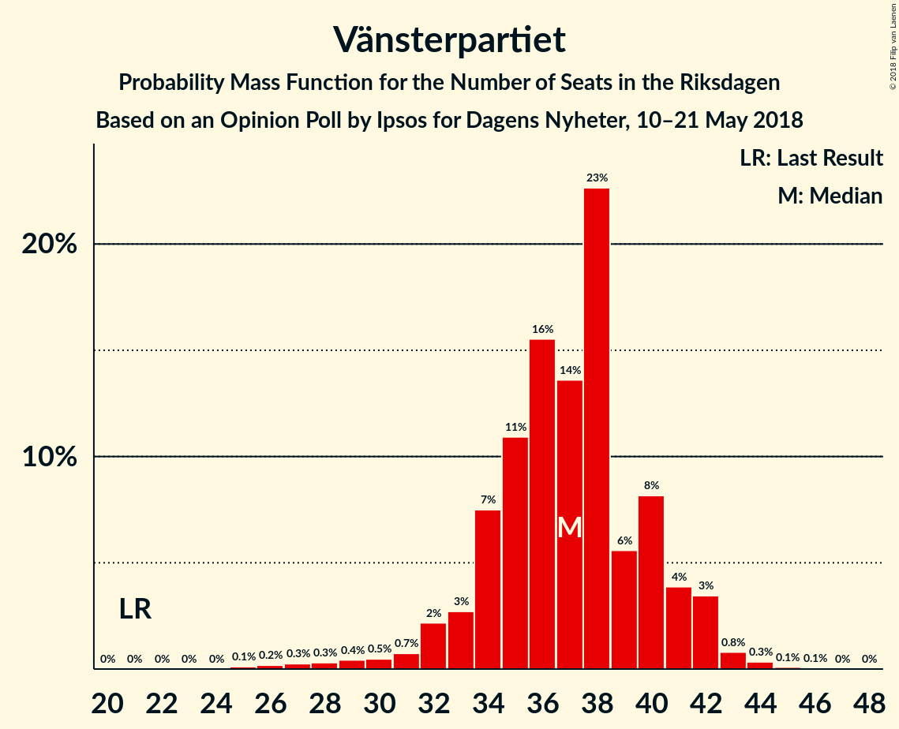

| Number of Seats | Probability | Accumulated | Special Marks |
|:---------------:|:-----------:|:-----------:|:-------------:|
| 21 | 0% | 100% | Last Result |
| 22 | 0% | 100% |  |
| 23 | 0% | 100% |  |
| 24 | 0% | 100% |  |
| 25 | 0.1% | 100% |  |
| 26 | 0.2% | 99.9% |  |
| 27 | 0.3% | 99.7% |  |
| 28 | 0.3% | 99.4% |  |
| 29 | 0.4% | 99.1% |  |
| 30 | 0.5% | 98.7% |  |
| 31 | 0.7% | 98% |  |
| 32 | 2% | 97% |  |
| 33 | 3% | 95% |  |
| 34 | 7% | 93% |  |
| 35 | 11% | 85% |  |
| 36 | 16% | 74% |  |
| 37 | 14% | 59% | Median |
| 38 | 23% | 45% |  |
| 39 | 6% | 22% |  |
| 40 | 8% | 17% |  |
| 41 | 4% | 9% |  |
| 42 | 3% | 5% |  |
| 43 | 0.8% | 1.3% |  |
| 44 | 0.3% | 0.5% |  |
| 45 | 0.1% | 0.2% |  |
| 46 | 0.1% | 0.1% |  |
| 47 | 0% | 0% |  |

### Liberalerna

*For a full overview of the results for this party, see the [Liberalerna](party-liberalerna.html) page.*

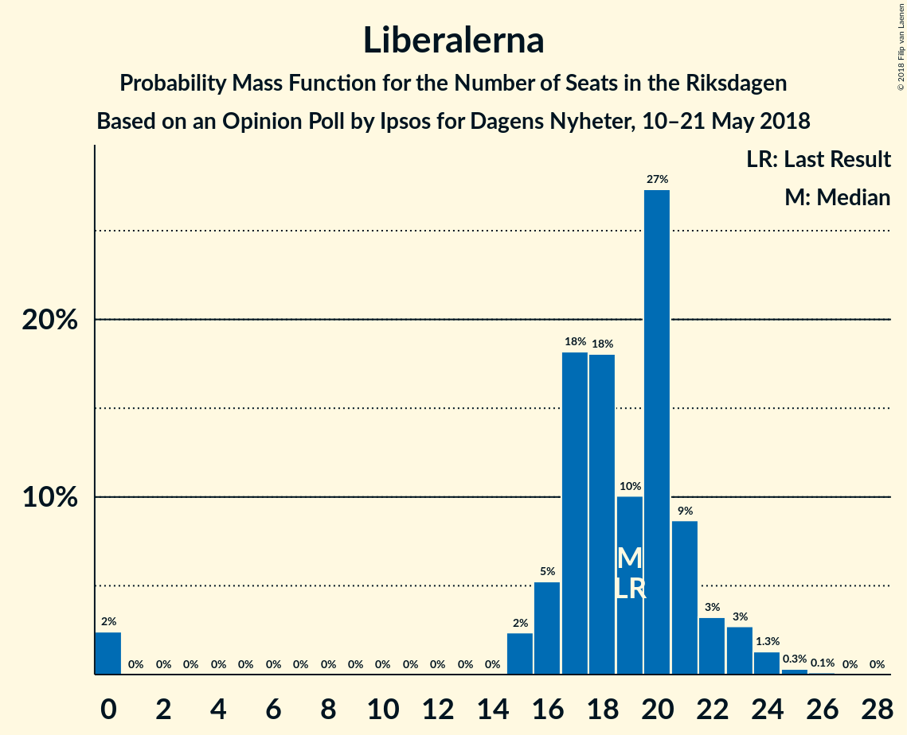

| Number of Seats | Probability | Accumulated | Special Marks |
|:---------------:|:-----------:|:-----------:|:-------------:|
| 0 | 2% | 100% |  |
| 1 | 0% | 98% |  |
| 2 | 0% | 98% |  |
| 3 | 0% | 98% |  |
| 4 | 0% | 98% |  |
| 5 | 0% | 98% |  |
| 6 | 0% | 98% |  |
| 7 | 0% | 98% |  |
| 8 | 0% | 98% |  |
| 9 | 0% | 98% |  |
| 10 | 0% | 98% |  |
| 11 | 0% | 98% |  |
| 12 | 0% | 98% |  |
| 13 | 0% | 98% |  |
| 14 | 0% | 98% |  |
| 15 | 2% | 98% |  |
| 16 | 5% | 95% |  |
| 17 | 18% | 90% |  |
| 18 | 18% | 72% |  |
| 19 | 10% | 54% | Last Result, Median |
| 20 | 27% | 44% |  |
| 21 | 9% | 16% |  |
| 22 | 3% | 8% |  |
| 23 | 3% | 4% |  |
| 24 | 1.3% | 2% |  |
| 25 | 0.3% | 0.4% |  |
| 26 | 0.1% | 0.1% |  |
| 27 | 0% | 0% |  |

### Miljöpartiet de gröna

*For a full overview of the results for this party, see the [Miljöpartiet de gröna](party-miljöpartietdegröna.html) page.*

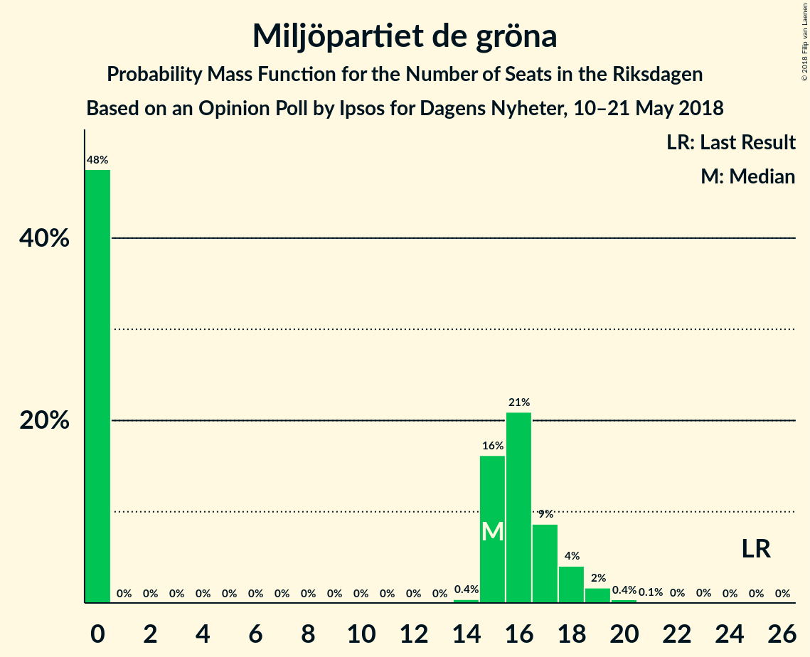

| Number of Seats | Probability | Accumulated | Special Marks |
|:---------------:|:-----------:|:-----------:|:-------------:|
| 0 | 48% | 100% |  |
| 1 | 0% | 52% |  |
| 2 | 0% | 52% |  |
| 3 | 0% | 52% |  |
| 4 | 0% | 52% |  |
| 5 | 0% | 52% |  |
| 6 | 0% | 52% |  |
| 7 | 0% | 52% |  |
| 8 | 0% | 52% |  |
| 9 | 0% | 52% |  |
| 10 | 0% | 52% |  |
| 11 | 0% | 52% |  |
| 12 | 0% | 52% |  |
| 13 | 0% | 52% |  |
| 14 | 0.4% | 52% |  |
| 15 | 16% | 52% | Median |
| 16 | 21% | 36% |  |
| 17 | 9% | 15% |  |
| 18 | 4% | 6% |  |
| 19 | 2% | 2% |  |
| 20 | 0.4% | 0.5% |  |
| 21 | 0.1% | 0.1% |  |
| 22 | 0% | 0% |  |
| 23 | 0% | 0% |  |
| 24 | 0% | 0% |  |
| 25 | 0% | 0% | Last Result |

### Kristdemokraterna

*For a full overview of the results for this party, see the [Kristdemokraterna](party-kristdemokraterna.html) page.*

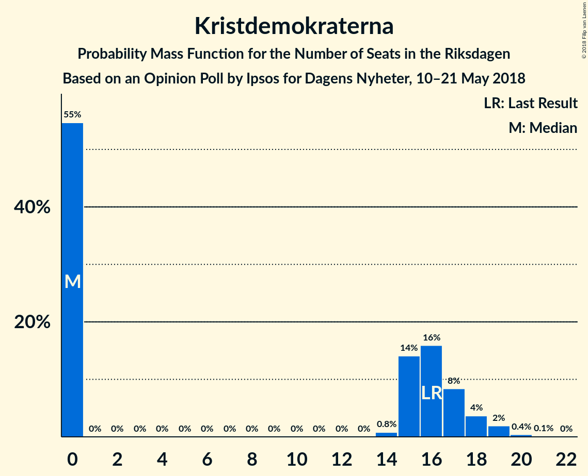

| Number of Seats | Probability | Accumulated | Special Marks |
|:---------------:|:-----------:|:-----------:|:-------------:|
| 0 | 55% | 100% | Median |
| 1 | 0% | 45% |  |
| 2 | 0% | 45% |  |
| 3 | 0% | 45% |  |
| 4 | 0% | 45% |  |
| 5 | 0% | 45% |  |
| 6 | 0% | 45% |  |
| 7 | 0% | 45% |  |
| 8 | 0% | 45% |  |
| 9 | 0% | 45% |  |
| 10 | 0% | 45% |  |
| 11 | 0% | 45% |  |
| 12 | 0% | 45% |  |
| 13 | 0% | 45% |  |
| 14 | 0.8% | 45% |  |
| 15 | 14% | 45% |  |
| 16 | 16% | 30% | Last Result |
| 17 | 8% | 15% |  |
| 18 | 4% | 6% |  |
| 19 | 2% | 2% |  |
| 20 | 0.4% | 0.5% |  |
| 21 | 0.1% | 0.1% |  |
| 22 | 0% | 0% |  |

### Feministiskt initiativ

*For a full overview of the results for this party, see the [Feministiskt initiativ](party-feministisktinitiativ.html) page.*

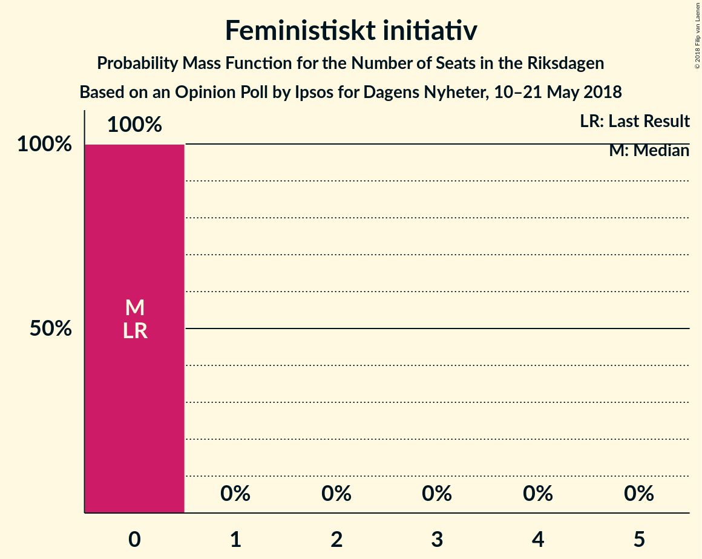

| Number of Seats | Probability | Accumulated | Special Marks |
|:---------------:|:-----------:|:-----------:|:-------------:|
| 0 | 100% | 100% | Last Result, Median |

## Coalitions

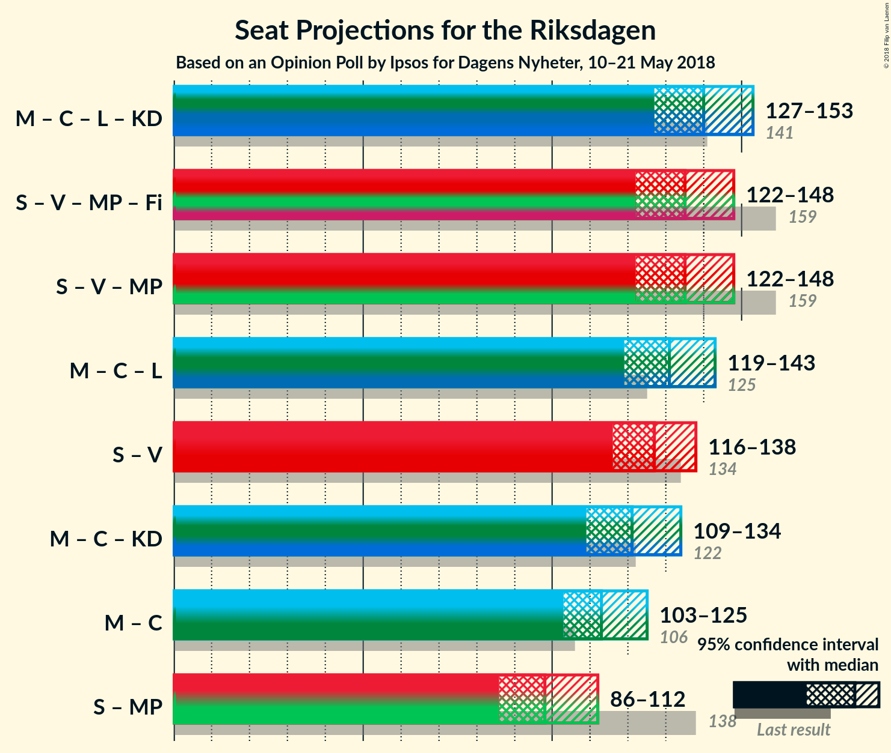

### Confidence Intervals

| Coalition | Last Result | Median | Majority? | 80% Confidence Interval | 90% Confidence Interval | 95% Confidence Interval | 99% Confidence Interval |
|:---------:|:-----------:|:------:|:---------:|:-----------------------:|:-----------------------:|:-----------------------:|:-----------------------:|
| Moderata samlingspartiet – Centerpartiet – Liberalerna – Kristdemokraterna | 141 | 140 | 0% | 129–147 | 128–150 | 127–153 | 118–157 |
| Sveriges socialdemokratiska arbetareparti – Vänsterpartiet – Miljöpartiet de gröna – Feministiskt initiativ | 159 | 135 | 0% | 127–146 | 124–147 | 122–148 | 118–152 |
| Sveriges socialdemokratiska arbetareparti – Vänsterpartiet – Miljöpartiet de gröna | 159 | 135 | 0% | 127–146 | 124–147 | 122–148 | 118–152 |
| Moderata samlingspartiet – Centerpartiet – Liberalerna | 125 | 131 | 0% | 124–142 | 120–142 | 119–143 | 114–148 |
| Sveriges socialdemokratiska arbetareparti – Vänsterpartiet | 134 | 127 | 0% | 120–134 | 117–136 | 116–138 | 113–142 |
| Moderata samlingspartiet – Centerpartiet – Kristdemokraterna | 122 | 121 | 0% | 110–129 | 109–131 | 109–134 | 107–138 |
| Moderata samlingspartiet – Centerpartiet | 106 | 113 | 0% | 106–122 | 104–124 | 103–125 | 100–128 |
| Sveriges socialdemokratiska arbetareparti – Miljöpartiet de gröna | 138 | 98 | 0% | 90–109 | 88–110 | 86–112 | 82–114 |

### Moderata samlingspartiet – Centerpartiet – Liberalerna – Kristdemokraterna

| Number of Seats | Probability | Accumulated | Special Marks |
|:---------------:|:-----------:|:-----------:|:-------------:|
| 115 | 0% | 100% |  |
| 116 | 0% | 99.9% |  |
| 117 | 0.1% | 99.9% |  |
| 118 | 0.5% | 99.9% |  |
| 119 | 0.1% | 99.4% |  |
| 120 | 0.1% | 99.3% |  |
| 121 | 0.1% | 99.2% |  |
| 122 | 0.1% | 99.1% |  |
| 123 | 0.2% | 99.0% |  |
| 124 | 0.2% | 98.8% |  |
| 125 | 0.3% | 98.6% |  |
| 126 | 0.5% | 98% |  |
| 127 | 2% | 98% |  |
| 128 | 3% | 96% |  |
| 129 | 6% | 93% |  |
| 130 | 0.8% | 88% |  |
| 131 | 2% | 87% | Median |
| 132 | 2% | 85% |  |
| 133 | 5% | 82% |  |
| 134 | 5% | 77% |  |
| 135 | 3% | 72% |  |
| 136 | 7% | 69% |  |
| 137 | 5% | 62% |  |
| 138 | 2% | 57% |  |
| 139 | 3% | 55% |  |
| 140 | 10% | 52% |  |
| 141 | 4% | 42% | Last Result |
| 142 | 10% | 38% |  |
| 143 | 5% | 29% |  |
| 144 | 2% | 23% |  |
| 145 | 2% | 21% |  |
| 146 | 4% | 19% |  |
| 147 | 6% | 15% |  |
| 148 | 2% | 9% |  |
| 149 | 2% | 8% |  |
| 150 | 1.2% | 6% |  |
| 151 | 0.8% | 4% |  |
| 152 | 0.5% | 4% |  |
| 153 | 1.1% | 3% |  |
| 154 | 0.7% | 2% |  |
| 155 | 0.5% | 1.3% |  |
| 156 | 0.1% | 0.8% |  |
| 157 | 0.2% | 0.7% |  |
| 158 | 0.3% | 0.5% |  |
| 159 | 0.1% | 0.2% |  |
| 160 | 0% | 0.1% |  |
| 161 | 0% | 0.1% |  |
| 162 | 0% | 0.1% |  |
| 163 | 0% | 0% |  |

### Sveriges socialdemokratiska arbetareparti – Vänsterpartiet – Miljöpartiet de gröna – Feministiskt initiativ

| Number of Seats | Probability | Accumulated | Special Marks |
|:---------------:|:-----------:|:-----------:|:-------------:|
| 113 | 0% | 100% |  |
| 114 | 0.1% | 99.9% |  |
| 115 | 0.1% | 99.9% |  |
| 116 | 0.1% | 99.8% |  |
| 117 | 0.1% | 99.7% |  |
| 118 | 0.1% | 99.6% |  |
| 119 | 0.1% | 99.5% |  |
| 120 | 0.9% | 99.4% |  |
| 121 | 0.7% | 98% |  |
| 122 | 2% | 98% |  |
| 123 | 0.9% | 96% |  |
| 124 | 0.7% | 95% |  |
| 125 | 2% | 95% |  |
| 126 | 2% | 93% |  |
| 127 | 2% | 91% |  |
| 128 | 6% | 89% |  |
| 129 | 6% | 83% |  |
| 130 | 10% | 77% |  |
| 131 | 3% | 67% |  |
| 132 | 4% | 64% |  |
| 133 | 3% | 61% |  |
| 134 | 4% | 57% |  |
| 135 | 5% | 53% |  |
| 136 | 2% | 49% |  |
| 137 | 5% | 47% |  |
| 138 | 4% | 42% |  |
| 139 | 5% | 38% |  |
| 140 | 7% | 33% |  |
| 141 | 8% | 26% |  |
| 142 | 1.3% | 18% | Median |
| 143 | 3% | 17% |  |
| 144 | 2% | 14% |  |
| 145 | 1.2% | 12% |  |
| 146 | 0.9% | 11% |  |
| 147 | 6% | 10% |  |
| 148 | 2% | 4% |  |
| 149 | 0.8% | 2% |  |
| 150 | 0.2% | 1.2% |  |
| 151 | 0.2% | 1.0% |  |
| 152 | 0.6% | 0.8% |  |
| 153 | 0% | 0.2% |  |
| 154 | 0.1% | 0.2% |  |
| 155 | 0% | 0.1% |  |
| 156 | 0% | 0.1% |  |
| 157 | 0% | 0% |  |
| 158 | 0% | 0% |  |
| 159 | 0% | 0% | Last Result |

### Sveriges socialdemokratiska arbetareparti – Vänsterpartiet – Miljöpartiet de gröna

| Number of Seats | Probability | Accumulated | Special Marks |
|:---------------:|:-----------:|:-----------:|:-------------:|
| 113 | 0% | 100% |  |
| 114 | 0.1% | 99.9% |  |
| 115 | 0.1% | 99.9% |  |
| 116 | 0.1% | 99.8% |  |
| 117 | 0.1% | 99.7% |  |
| 118 | 0.1% | 99.6% |  |
| 119 | 0.1% | 99.5% |  |
| 120 | 0.9% | 99.4% |  |
| 121 | 0.7% | 98% |  |
| 122 | 2% | 98% |  |
| 123 | 0.9% | 96% |  |
| 124 | 0.7% | 95% |  |
| 125 | 2% | 95% |  |
| 126 | 2% | 93% |  |
| 127 | 2% | 91% |  |
| 128 | 6% | 89% |  |
| 129 | 6% | 83% |  |
| 130 | 10% | 77% |  |
| 131 | 3% | 67% |  |
| 132 | 4% | 64% |  |
| 133 | 3% | 61% |  |
| 134 | 4% | 57% |  |
| 135 | 5% | 53% |  |
| 136 | 2% | 49% |  |
| 137 | 5% | 47% |  |
| 138 | 4% | 42% |  |
| 139 | 5% | 38% |  |
| 140 | 7% | 33% |  |
| 141 | 8% | 26% |  |
| 142 | 1.3% | 18% | Median |
| 143 | 3% | 17% |  |
| 144 | 2% | 14% |  |
| 145 | 1.2% | 12% |  |
| 146 | 0.9% | 11% |  |
| 147 | 6% | 10% |  |
| 148 | 2% | 4% |  |
| 149 | 0.8% | 2% |  |
| 150 | 0.2% | 1.2% |  |
| 151 | 0.2% | 1.0% |  |
| 152 | 0.6% | 0.8% |  |
| 153 | 0% | 0.2% |  |
| 154 | 0.1% | 0.2% |  |
| 155 | 0% | 0.1% |  |
| 156 | 0% | 0.1% |  |
| 157 | 0% | 0% |  |
| 158 | 0% | 0% |  |
| 159 | 0% | 0% | Last Result |

### Moderata samlingspartiet – Centerpartiet – Liberalerna

| Number of Seats | Probability | Accumulated | Special Marks |
|:---------------:|:-----------:|:-----------:|:-------------:|
| 108 | 0% | 100% |  |
| 109 | 0% | 99.9% |  |
| 110 | 0.2% | 99.9% |  |
| 111 | 0.1% | 99.7% |  |
| 112 | 0% | 99.6% |  |
| 113 | 0.1% | 99.6% |  |
| 114 | 0.1% | 99.5% |  |
| 115 | 0.2% | 99.4% |  |
| 116 | 0.1% | 99.2% |  |
| 117 | 0.3% | 99.1% |  |
| 118 | 0.8% | 98.8% |  |
| 119 | 1.1% | 98% |  |
| 120 | 3% | 97% |  |
| 121 | 0.7% | 94% |  |
| 122 | 0.3% | 94% |  |
| 123 | 0.9% | 93% |  |
| 124 | 3% | 92% |  |
| 125 | 9% | 90% | Last Result |
| 126 | 6% | 81% |  |
| 127 | 4% | 74% |  |
| 128 | 4% | 70% |  |
| 129 | 7% | 67% |  |
| 130 | 3% | 60% |  |
| 131 | 9% | 56% | Median |
| 132 | 4% | 48% |  |
| 133 | 6% | 43% |  |
| 134 | 5% | 37% |  |
| 135 | 3% | 32% |  |
| 136 | 6% | 30% |  |
| 137 | 6% | 24% |  |
| 138 | 2% | 18% |  |
| 139 | 1.0% | 16% |  |
| 140 | 3% | 15% |  |
| 141 | 2% | 13% |  |
| 142 | 7% | 11% |  |
| 143 | 2% | 4% |  |
| 144 | 0.4% | 2% |  |
| 145 | 0.5% | 1.4% |  |
| 146 | 0.2% | 0.9% |  |
| 147 | 0.1% | 0.7% |  |
| 148 | 0.2% | 0.5% |  |
| 149 | 0.1% | 0.4% |  |
| 150 | 0.1% | 0.2% |  |
| 151 | 0.1% | 0.2% |  |
| 152 | 0% | 0.1% |  |
| 153 | 0% | 0% |  |

### Sveriges socialdemokratiska arbetareparti – Vänsterpartiet

| Number of Seats | Probability | Accumulated | Special Marks |
|:---------------:|:-----------:|:-----------:|:-------------:|
| 108 | 0% | 100% |  |
| 109 | 0% | 99.9% |  |
| 110 | 0.1% | 99.9% |  |
| 111 | 0.1% | 99.8% |  |
| 112 | 0.1% | 99.7% |  |
| 113 | 0.3% | 99.6% |  |
| 114 | 0.7% | 99.3% |  |
| 115 | 0.4% | 98.6% |  |
| 116 | 2% | 98% |  |
| 117 | 2% | 96% |  |
| 118 | 2% | 95% |  |
| 119 | 2% | 92% |  |
| 120 | 3% | 91% |  |
| 121 | 3% | 88% |  |
| 122 | 7% | 85% |  |
| 123 | 4% | 78% |  |
| 124 | 4% | 74% |  |
| 125 | 12% | 70% |  |
| 126 | 4% | 58% |  |
| 127 | 5% | 55% | Median |
| 128 | 7% | 49% |  |
| 129 | 6% | 42% |  |
| 130 | 12% | 36% |  |
| 131 | 8% | 24% |  |
| 132 | 3% | 16% |  |
| 133 | 2% | 13% |  |
| 134 | 2% | 11% | Last Result |
| 135 | 3% | 9% |  |
| 136 | 1.2% | 6% |  |
| 137 | 1.4% | 5% |  |
| 138 | 1.4% | 3% |  |
| 139 | 0.6% | 2% |  |
| 140 | 0.5% | 1.2% |  |
| 141 | 0.2% | 0.7% |  |
| 142 | 0.3% | 0.5% |  |
| 143 | 0% | 0.2% |  |
| 144 | 0.1% | 0.2% |  |
| 145 | 0% | 0.1% |  |
| 146 | 0% | 0.1% |  |
| 147 | 0% | 0% |  |

### Moderata samlingspartiet – Centerpartiet – Kristdemokraterna

| Number of Seats | Probability | Accumulated | Special Marks |
|:---------------:|:-----------:|:-----------:|:-------------:|
| 103 | 0.1% | 100% |  |
| 104 | 0.1% | 99.9% |  |
| 105 | 0.1% | 99.8% |  |
| 106 | 0.2% | 99.7% |  |
| 107 | 0.8% | 99.5% |  |
| 108 | 0.6% | 98.7% |  |
| 109 | 6% | 98% |  |
| 110 | 2% | 92% |  |
| 111 | 2% | 89% |  |
| 112 | 2% | 88% | Median |
| 113 | 2% | 86% |  |
| 114 | 4% | 83% |  |
| 115 | 3% | 79% |  |
| 116 | 7% | 76% |  |
| 117 | 7% | 70% |  |
| 118 | 5% | 63% |  |
| 119 | 4% | 57% |  |
| 120 | 3% | 54% |  |
| 121 | 2% | 50% |  |
| 122 | 8% | 49% | Last Result |
| 123 | 7% | 41% |  |
| 124 | 5% | 34% |  |
| 125 | 4% | 29% |  |
| 126 | 3% | 25% |  |
| 127 | 8% | 22% |  |
| 128 | 2% | 14% |  |
| 129 | 3% | 12% |  |
| 130 | 2% | 9% |  |
| 131 | 3% | 7% |  |
| 132 | 1.0% | 5% |  |
| 133 | 1.0% | 4% |  |
| 134 | 0.8% | 3% |  |
| 135 | 0.3% | 2% |  |
| 136 | 0.7% | 2% |  |
| 137 | 0.2% | 1.0% |  |
| 138 | 0.4% | 0.9% |  |
| 139 | 0.2% | 0.5% |  |
| 140 | 0.1% | 0.3% |  |
| 141 | 0% | 0.2% |  |
| 142 | 0% | 0.2% |  |
| 143 | 0% | 0.1% |  |
| 144 | 0% | 0.1% |  |
| 145 | 0% | 0% |  |

### Moderata samlingspartiet – Centerpartiet

| Number of Seats | Probability | Accumulated | Special Marks |
|:---------------:|:-----------:|:-----------:|:-------------:|
| 98 | 0.1% | 100% |  |
| 99 | 0.2% | 99.9% |  |
| 100 | 0.6% | 99.7% |  |
| 101 | 0.3% | 99.1% |  |
| 102 | 1.1% | 98.8% |  |
| 103 | 2% | 98% |  |
| 104 | 2% | 96% |  |
| 105 | 1.4% | 93% |  |
| 106 | 3% | 92% | Last Result |
| 107 | 4% | 89% |  |
| 108 | 8% | 85% |  |
| 109 | 8% | 77% |  |
| 110 | 6% | 69% |  |
| 111 | 8% | 63% |  |
| 112 | 4% | 54% | Median |
| 113 | 5% | 51% |  |
| 114 | 6% | 46% |  |
| 115 | 4% | 40% |  |
| 116 | 7% | 36% |  |
| 117 | 7% | 28% |  |
| 118 | 5% | 21% |  |
| 119 | 3% | 17% |  |
| 120 | 2% | 14% |  |
| 121 | 1.5% | 12% |  |
| 122 | 3% | 11% |  |
| 123 | 0.9% | 8% |  |
| 124 | 4% | 7% |  |
| 125 | 2% | 3% |  |
| 126 | 0.3% | 1.4% |  |
| 127 | 0.4% | 1.1% |  |
| 128 | 0.3% | 0.7% |  |
| 129 | 0.1% | 0.5% |  |
| 130 | 0.1% | 0.4% |  |
| 131 | 0.1% | 0.2% |  |
| 132 | 0% | 0.2% |  |
| 133 | 0.1% | 0.1% |  |
| 134 | 0% | 0.1% |  |
| 135 | 0% | 0% |  |

### Sveriges socialdemokratiska arbetareparti – Miljöpartiet de gröna

| Number of Seats | Probability | Accumulated | Special Marks |
|:---------------:|:-----------:|:-----------:|:-------------:|
| 78 | 0.1% | 100% |  |
| 79 | 0% | 99.9% |  |
| 80 | 0.1% | 99.9% |  |
| 81 | 0.2% | 99.8% |  |
| 82 | 0.4% | 99.7% |  |
| 83 | 0.5% | 99.3% |  |
| 84 | 0.4% | 98.8% |  |
| 85 | 0.6% | 98% |  |
| 86 | 1.3% | 98% |  |
| 87 | 1.1% | 97% |  |
| 88 | 3% | 95% |  |
| 89 | 2% | 92% |  |
| 90 | 7% | 91% |  |
| 91 | 3% | 84% |  |
| 92 | 12% | 81% |  |
| 93 | 4% | 69% |  |
| 94 | 3% | 64% |  |
| 95 | 2% | 62% |  |
| 96 | 5% | 60% |  |
| 97 | 1.5% | 55% |  |
| 98 | 3% | 53% |  |
| 99 | 5% | 50% |  |
| 100 | 2% | 45% |  |
| 101 | 3% | 43% |  |
| 102 | 3% | 40% |  |
| 103 | 5% | 37% |  |
| 104 | 2% | 32% |  |
| 105 | 13% | 30% | Median |
| 106 | 2% | 17% |  |
| 107 | 1.3% | 16% |  |
| 108 | 3% | 14% |  |
| 109 | 6% | 11% |  |
| 110 | 1.1% | 5% |  |
| 111 | 1.2% | 4% |  |
| 112 | 1.4% | 3% |  |
| 113 | 0.6% | 1.5% |  |
| 114 | 0.6% | 0.8% |  |
| 115 | 0% | 0.2% |  |
| 116 | 0.1% | 0.1% |  |
| 117 | 0% | 0.1% |  |
| 118 | 0% | 0% |  |
| 119 | 0% | 0% |  |
| 120 | 0% | 0% |  |
| 121 | 0% | 0% |  |
| 122 | 0% | 0% |  |
| 123 | 0% | 0% |  |
| 124 | 0% | 0% |  |
| 125 | 0% | 0% |  |
| 126 | 0% | 0% |  |
| 127 | 0% | 0% |  |
| 128 | 0% | 0% |  |
| 129 | 0% | 0% |  |
| 130 | 0% | 0% |  |
| 131 | 0% | 0% |  |
| 132 | 0% | 0% |  |
| 133 | 0% | 0% |  |
| 134 | 0% | 0% |  |
| 135 | 0% | 0% |  |
| 136 | 0% | 0% |  |
| 137 | 0% | 0% |  |
| 138 | 0% | 0% | Last Result |

## Technical Information

### Opinion Poll

+ **Polling firm:** Ipsos
+ **Commissioner(s):** Dagens Nyheter
+ **Fieldwork period:** 10–21 May 2018

### Calculations

+ **Sample size:** 1818
+ **Simulations done:** 1,048,576
+ **Error estimate:** 0.35%

