# Opinion Poll by Sentio for Nyheter Idag, 27 July–1 August 2018

<a href="#voting-intentions">Voting Intentions</a> | <a href="#seats">Seats</a> | <a href="#coalitions">Coalitions</a> | <a href="#technical-information">Technical Information</a>

## Voting Intentions

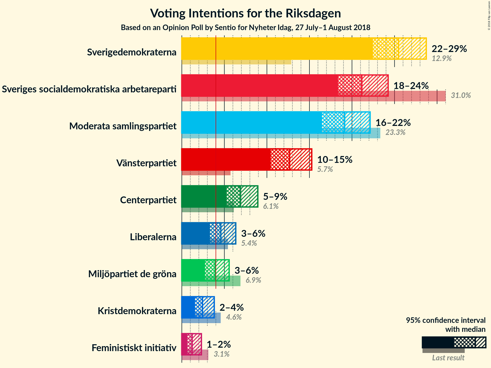

### Confidence Intervals

| Party | Last Result | Poll Result | 80% Confidence Interval | 90% Confidence Interval | 95% Confidence Interval | 99% Confidence Interval |
|:-----:|:-----------:|:-----------:|:-----------------------:|:-----------------------:|:-----------------------:|:-----------------------:|
| Sverigedemokraterna | 12.9% | 25.5% | 23.5–27.6% |22.9–28.2% |22.5–28.7% |21.5–29.8% |
| Sveriges socialdemokratiska arbetareparti | 31.0% | 21.2% | 19.3–23.2% |18.8–23.7% |18.4–24.2% |17.5–25.2% |
| Moderata samlingspartiet | 23.3% | 19.1% | 17.4–21.1% |16.9–21.6% |16.5–22.1% |15.7–23.1% |
| Vänsterpartiet | 5.7% | 12.7% | 11.2–14.4% |10.8–14.8% |10.5–15.3% |9.8–16.1% |
| Centerpartiet | 6.1% | 6.9% | 5.8–8.2% |5.5–8.6% |5.3–8.9% |4.8–9.6% |
| Liberalerna | 5.4% | 4.6% | 3.7–5.7% |3.5–6.1% |3.3–6.3% |2.9–6.9% |
| Miljöpartiet de gröna | 6.9% | 3.9% | 3.1–5.0% |2.9–5.3% |2.7–5.6% |2.4–6.1% |
| Kristdemokraterna | 4.6% | 2.4% | 1.8–3.3% |1.7–3.6% |1.5–3.8% |1.3–4.3% |
| Feministiskt initiativ | 3.1% | 1.2% | 0.8–1.9% |0.7–2.1% |0.6–2.3% |0.5–2.7% |

*Note:* The poll result column reflects the actual value used in the calculations. Published results may vary slightly, and in addition be rounded to fewer digits.

## Seats

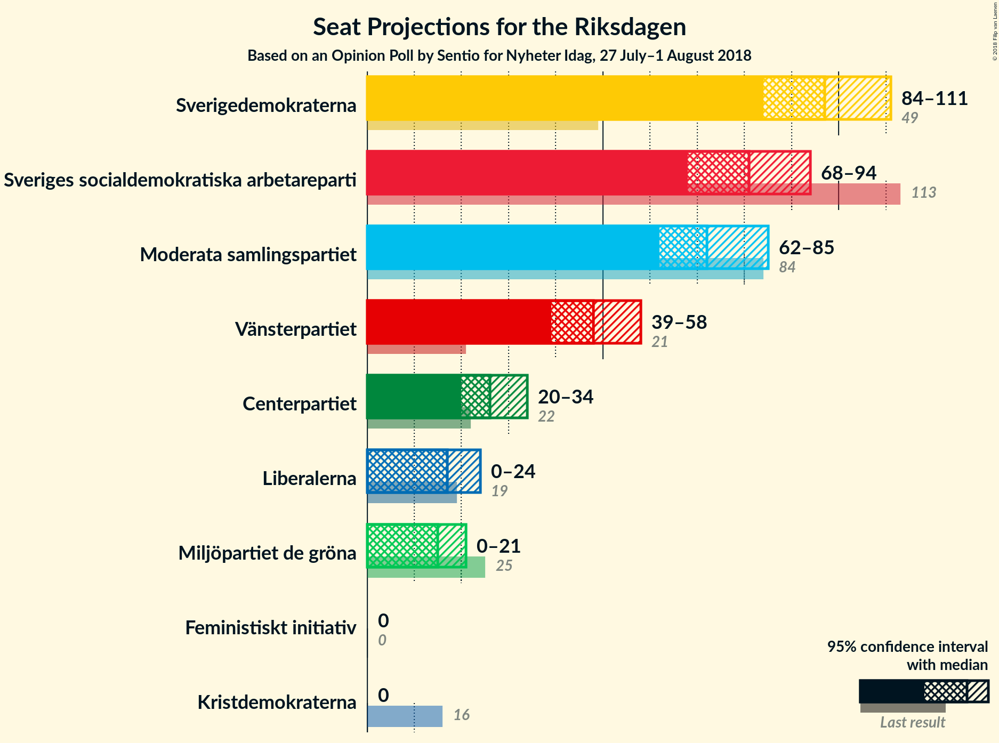

### Confidence Intervals

| Party | Last Result | Median | 80% Confidence Interval | 90% Confidence Interval | 95% Confidence Interval | 99% Confidence Interval |
|:-----:|:-----------:|:------:|:-----------------------:|:-----------------------:|:-----------------------:|:-----------------------:|
| <a href="#sverigedemokraterna">Sverigedemokraterna</a> | 49 | 97 | 88–106 |86–108 |84–111 |80–114 |
| <a href="#sveriges-socialdemokratiska-arbetareparti">Sveriges socialdemokratiska arbetareparti</a> | 113 | 81 | 72–89 |70–91 |68–94 |65–98 |
| <a href="#moderata-samlingspartiet">Moderata samlingspartiet</a> | 84 | 72 | 65–81 |63–83 |62–85 |59–89 |
| <a href="#vänsterpartiet">Vänsterpartiet</a> | 21 | 48 | 42–55 |41–57 |39–58 |37–62 |
| <a href="#centerpartiet">Centerpartiet</a> | 22 | 26 | 22–31 |21–33 |20–34 |18–37 |
| <a href="#liberalerna">Liberalerna</a> | 19 | 17 | 0–22 |0–23 |0–24 |0–26 |
| <a href="#miljöpartiet-de-gröna">Miljöpartiet de gröna</a> | 25 | 15 | 0–19 |0–20 |0–21 |0–23 |
| <a href="#kristdemokraterna">Kristdemokraterna</a> | 16 | 0 | 0 |0 |0 |0–16 |
| <a href="#feministiskt-initiativ">Feministiskt initiativ</a> | 0 | 0 | 0 |0 |0 |0 |

### Sverigedemokraterna

*For a full overview of the results for this party, see the [Sverigedemokraterna](party-sverigedemokraterna.html) page.*

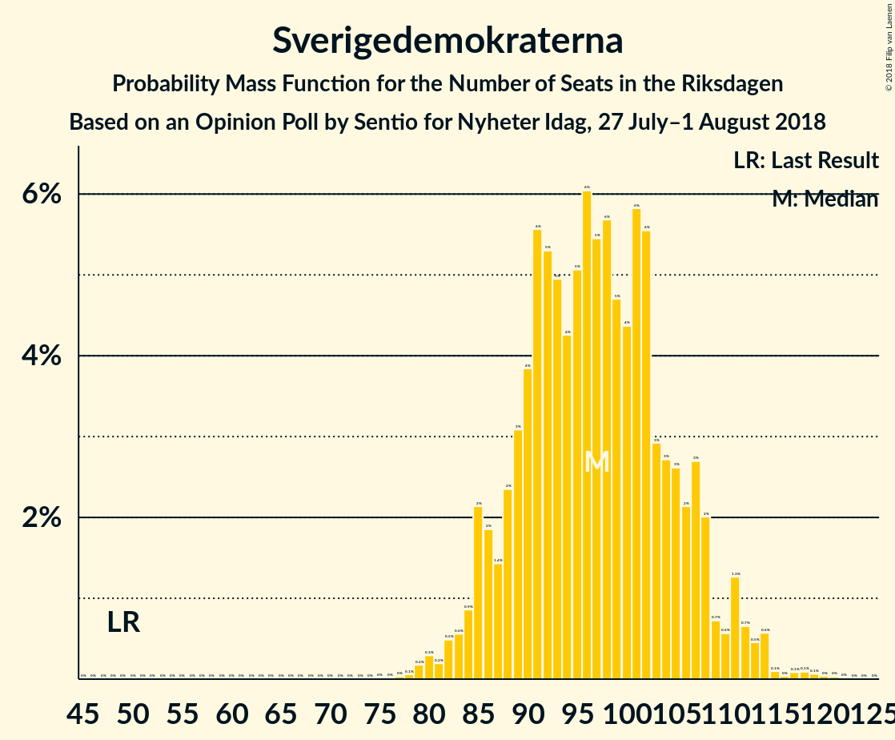

| Number of Seats | Probability | Accumulated | Special Marks |
|:---------------:|:-----------:|:-----------:|:-------------:|
| 49 | 0% | 100% | Last Result |
| 50 | 0% | 100% |  |
| 51 | 0% | 100% |  |
| 52 | 0% | 100% |  |
| 53 | 0% | 100% |  |
| 54 | 0% | 100% |  |
| 55 | 0% | 100% |  |
| 56 | 0% | 100% |  |
| 57 | 0% | 100% |  |
| 58 | 0% | 100% |  |
| 59 | 0% | 100% |  |
| 60 | 0% | 100% |  |
| 61 | 0% | 100% |  |
| 62 | 0% | 100% |  |
| 63 | 0% | 100% |  |
| 64 | 0% | 100% |  |
| 65 | 0% | 100% |  |
| 66 | 0% | 100% |  |
| 67 | 0% | 100% |  |
| 68 | 0% | 100% |  |
| 69 | 0% | 100% |  |
| 70 | 0% | 100% |  |
| 71 | 0% | 100% |  |
| 72 | 0% | 100% |  |
| 73 | 0% | 100% |  |
| 74 | 0% | 100% |  |
| 75 | 0% | 100% |  |
| 76 | 0% | 100% |  |
| 77 | 0% | 99.9% |  |
| 78 | 0.1% | 99.9% |  |
| 79 | 0.2% | 99.9% |  |
| 80 | 0.3% | 99.7% |  |
| 81 | 0.2% | 99.4% |  |
| 82 | 0.5% | 99.2% |  |
| 83 | 0.6% | 98.7% |  |
| 84 | 0.9% | 98% |  |
| 85 | 2% | 97% |  |
| 86 | 2% | 95% |  |
| 87 | 1.4% | 93% |  |
| 88 | 2% | 92% |  |
| 89 | 3% | 90% |  |
| 90 | 4% | 86% |  |
| 91 | 6% | 83% |  |
| 92 | 5% | 77% |  |
| 93 | 5% | 72% |  |
| 94 | 4% | 67% |  |
| 95 | 5% | 63% |  |
| 96 | 6% | 57% |  |
| 97 | 5% | 51% | Median |
| 98 | 6% | 46% |  |
| 99 | 5% | 40% |  |
| 100 | 4% | 36% |  |
| 101 | 6% | 31% |  |
| 102 | 6% | 25% |  |
| 103 | 3% | 20% |  |
| 104 | 3% | 17% |  |
| 105 | 3% | 14% |  |
| 106 | 2% | 12% |  |
| 107 | 3% | 9% |  |
| 108 | 2% | 7% |  |
| 109 | 0.7% | 5% |  |
| 110 | 0.6% | 4% |  |
| 111 | 1.3% | 3% |  |
| 112 | 0.7% | 2% |  |
| 113 | 0.5% | 2% |  |
| 114 | 0.6% | 1.1% |  |
| 115 | 0.1% | 0.5% |  |
| 116 | 0% | 0.4% |  |
| 117 | 0.1% | 0.3% |  |
| 118 | 0.1% | 0.3% |  |
| 119 | 0.1% | 0.2% |  |
| 120 | 0% | 0.1% |  |
| 121 | 0% | 0.1% |  |
| 122 | 0% | 0% |  |

### Sveriges socialdemokratiska arbetareparti

*For a full overview of the results for this party, see the [Sveriges socialdemokratiska arbetareparti](party-sverigessocialdemokratiskaarbetareparti.html) page.*

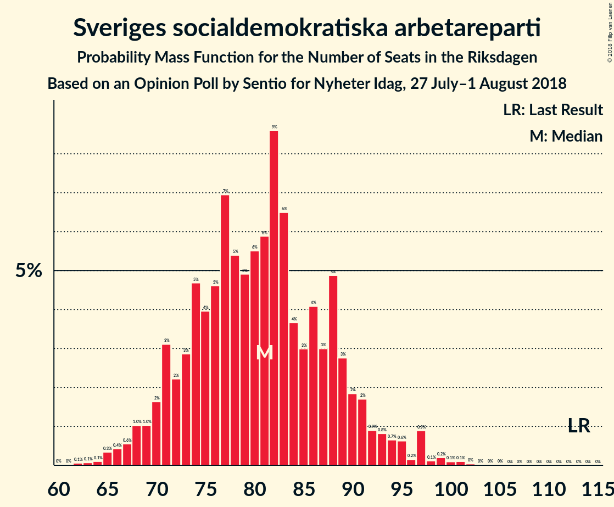

| Number of Seats | Probability | Accumulated | Special Marks |
|:---------------:|:-----------:|:-----------:|:-------------:|
| 62 | 0.1% | 100% |  |
| 63 | 0.1% | 99.9% |  |
| 64 | 0.1% | 99.8% |  |
| 65 | 0.3% | 99.7% |  |
| 66 | 0.4% | 99.4% |  |
| 67 | 0.6% | 99.0% |  |
| 68 | 1.0% | 98% |  |
| 69 | 1.0% | 97% |  |
| 70 | 2% | 96% |  |
| 71 | 3% | 95% |  |
| 72 | 2% | 92% |  |
| 73 | 3% | 89% |  |
| 74 | 5% | 87% |  |
| 75 | 4% | 82% |  |
| 76 | 5% | 78% |  |
| 77 | 7% | 73% |  |
| 78 | 5% | 66% |  |
| 79 | 5% | 61% |  |
| 80 | 6% | 56% |  |
| 81 | 6% | 51% | Median |
| 82 | 9% | 45% |  |
| 83 | 6% | 36% |  |
| 84 | 4% | 30% |  |
| 85 | 3% | 26% |  |
| 86 | 4% | 23% |  |
| 87 | 3% | 19% |  |
| 88 | 5% | 16% |  |
| 89 | 3% | 11% |  |
| 90 | 2% | 8% |  |
| 91 | 2% | 6% |  |
| 92 | 0.9% | 5% |  |
| 93 | 0.8% | 4% |  |
| 94 | 0.7% | 3% |  |
| 95 | 0.6% | 2% |  |
| 96 | 0.2% | 2% |  |
| 97 | 0.9% | 1.5% |  |
| 98 | 0.1% | 0.6% |  |
| 99 | 0.2% | 0.5% |  |
| 100 | 0.1% | 0.3% |  |
| 101 | 0.1% | 0.2% |  |
| 102 | 0% | 0.1% |  |
| 103 | 0% | 0% |  |
| 104 | 0% | 0% |  |
| 105 | 0% | 0% |  |
| 106 | 0% | 0% |  |
| 107 | 0% | 0% |  |
| 108 | 0% | 0% |  |
| 109 | 0% | 0% |  |
| 110 | 0% | 0% |  |
| 111 | 0% | 0% |  |
| 112 | 0% | 0% |  |
| 113 | 0% | 0% | Last Result |

### Moderata samlingspartiet

*For a full overview of the results for this party, see the [Moderata samlingspartiet](party-moderatasamlingspartiet.html) page.*

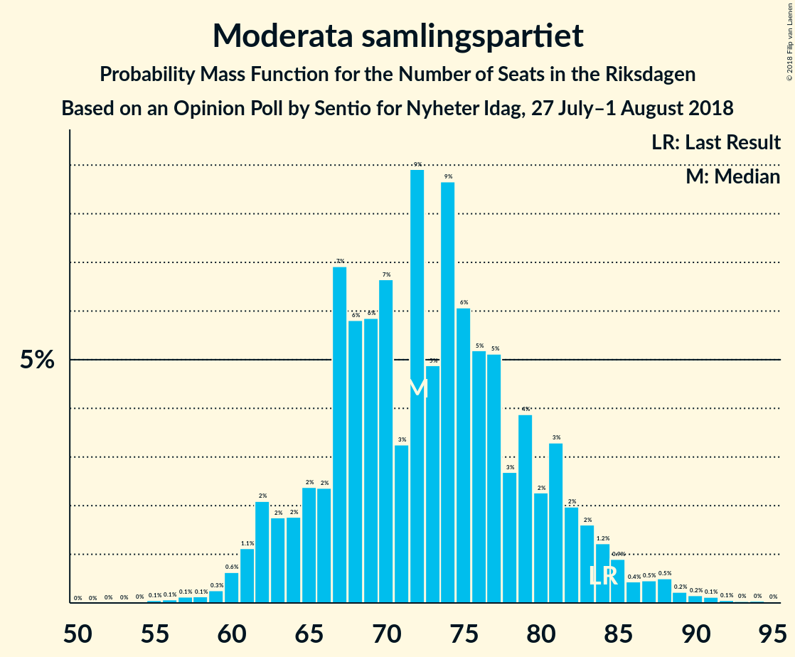

| Number of Seats | Probability | Accumulated | Special Marks |
|:---------------:|:-----------:|:-----------:|:-------------:|
| 55 | 0.1% | 100% |  |
| 56 | 0.1% | 99.9% |  |
| 57 | 0.1% | 99.8% |  |
| 58 | 0.1% | 99.7% |  |
| 59 | 0.3% | 99.6% |  |
| 60 | 0.6% | 99.3% |  |
| 61 | 1.1% | 98.7% |  |
| 62 | 2% | 98% |  |
| 63 | 2% | 95% |  |
| 64 | 2% | 94% |  |
| 65 | 2% | 92% |  |
| 66 | 2% | 90% |  |
| 67 | 7% | 87% |  |
| 68 | 6% | 80% |  |
| 69 | 6% | 74% |  |
| 70 | 7% | 69% |  |
| 71 | 3% | 62% |  |
| 72 | 9% | 59% | Median |
| 73 | 5% | 50% |  |
| 74 | 9% | 45% |  |
| 75 | 6% | 36% |  |
| 76 | 5% | 30% |  |
| 77 | 5% | 25% |  |
| 78 | 3% | 20% |  |
| 79 | 4% | 17% |  |
| 80 | 2% | 13% |  |
| 81 | 3% | 11% |  |
| 82 | 2% | 8% |  |
| 83 | 2% | 6% |  |
| 84 | 1.2% | 4% | Last Result |
| 85 | 0.9% | 3% |  |
| 86 | 0.4% | 2% |  |
| 87 | 0.5% | 2% |  |
| 88 | 0.5% | 1.2% |  |
| 89 | 0.2% | 0.7% |  |
| 90 | 0.2% | 0.4% |  |
| 91 | 0.1% | 0.3% |  |
| 92 | 0.1% | 0.2% |  |
| 93 | 0% | 0.1% |  |
| 94 | 0% | 0.1% |  |
| 95 | 0% | 0% |  |

### Vänsterpartiet

*For a full overview of the results for this party, see the [Vänsterpartiet](party-vänsterpartiet.html) page.*

| Number of Seats | Probability | Accumulated | Special Marks |
|:---------------:|:-----------:|:-----------:|:-------------:|
| 21 | 0% | 100% | Last Result |
| 22 | 0% | 100% |  |
| 23 | 0% | 100% |  |
| 24 | 0% | 100% |  |
| 25 | 0% | 100% |  |
| 26 | 0% | 100% |  |
| 27 | 0% | 100% |  |
| 28 | 0% | 100% |  |
| 29 | 0% | 100% |  |
| 30 | 0% | 100% |  |
| 31 | 0% | 100% |  |
| 32 | 0% | 100% |  |
| 33 | 0% | 100% |  |
| 34 | 0.1% | 100% |  |
| 35 | 0.1% | 99.9% |  |
| 36 | 0.3% | 99.8% |  |
| 37 | 0.5% | 99.5% |  |
| 38 | 0.8% | 99.0% |  |
| 39 | 1.1% | 98% |  |
| 40 | 1.4% | 97% |  |
| 41 | 3% | 96% |  |
| 42 | 4% | 92% |  |
| 43 | 5% | 88% |  |
| 44 | 7% | 83% |  |
| 45 | 7% | 76% |  |
| 46 | 7% | 69% |  |
| 47 | 7% | 62% |  |
| 48 | 9% | 55% | Median |
| 49 | 8% | 46% |  |
| 50 | 7% | 39% |  |
| 51 | 7% | 32% |  |
| 52 | 6% | 25% |  |
| 53 | 4% | 19% |  |
| 54 | 3% | 15% |  |
| 55 | 3% | 12% |  |
| 56 | 2% | 8% |  |
| 57 | 2% | 6% |  |
| 58 | 2% | 5% |  |
| 59 | 1.2% | 2% |  |
| 60 | 0.4% | 1.3% |  |
| 61 | 0.3% | 1.0% |  |
| 62 | 0.2% | 0.7% |  |
| 63 | 0.2% | 0.4% |  |
| 64 | 0.1% | 0.2% |  |
| 65 | 0.1% | 0.2% |  |
| 66 | 0% | 0.1% |  |
| 67 | 0% | 0% |  |

### Centerpartiet

*For a full overview of the results for this party, see the [Centerpartiet](party-centerpartiet.html) page.*

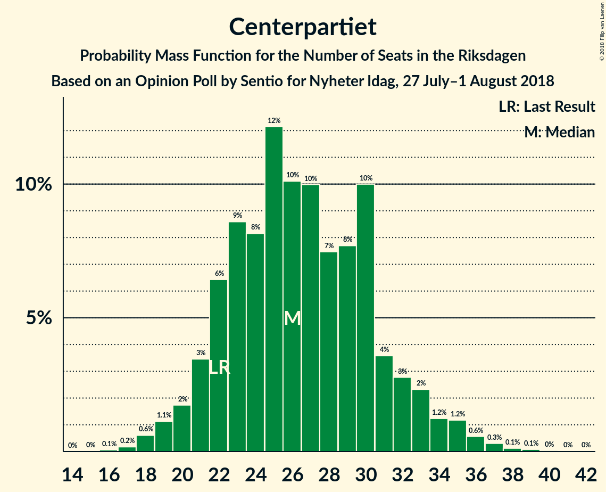

| Number of Seats | Probability | Accumulated | Special Marks |
|:---------------:|:-----------:|:-----------:|:-------------:|
| 16 | 0.1% | 100% |  |
| 17 | 0.2% | 99.9% |  |
| 18 | 0.6% | 99.7% |  |
| 19 | 1.1% | 99.1% |  |
| 20 | 2% | 98% |  |
| 21 | 3% | 96% |  |
| 22 | 6% | 93% | Last Result |
| 23 | 9% | 86% |  |
| 24 | 8% | 78% |  |
| 25 | 12% | 70% |  |
| 26 | 10% | 57% | Median |
| 27 | 10% | 47% |  |
| 28 | 7% | 37% |  |
| 29 | 8% | 30% |  |
| 30 | 10% | 22% |  |
| 31 | 4% | 12% |  |
| 32 | 3% | 9% |  |
| 33 | 2% | 6% |  |
| 34 | 1.2% | 4% |  |
| 35 | 1.2% | 2% |  |
| 36 | 0.6% | 1.2% |  |
| 37 | 0.3% | 0.6% |  |
| 38 | 0.1% | 0.3% |  |
| 39 | 0.1% | 0.2% |  |
| 40 | 0% | 0.1% |  |
| 41 | 0% | 0% |  |

### Liberalerna

*For a full overview of the results for this party, see the [Liberalerna](party-liberalerna.html) page.*

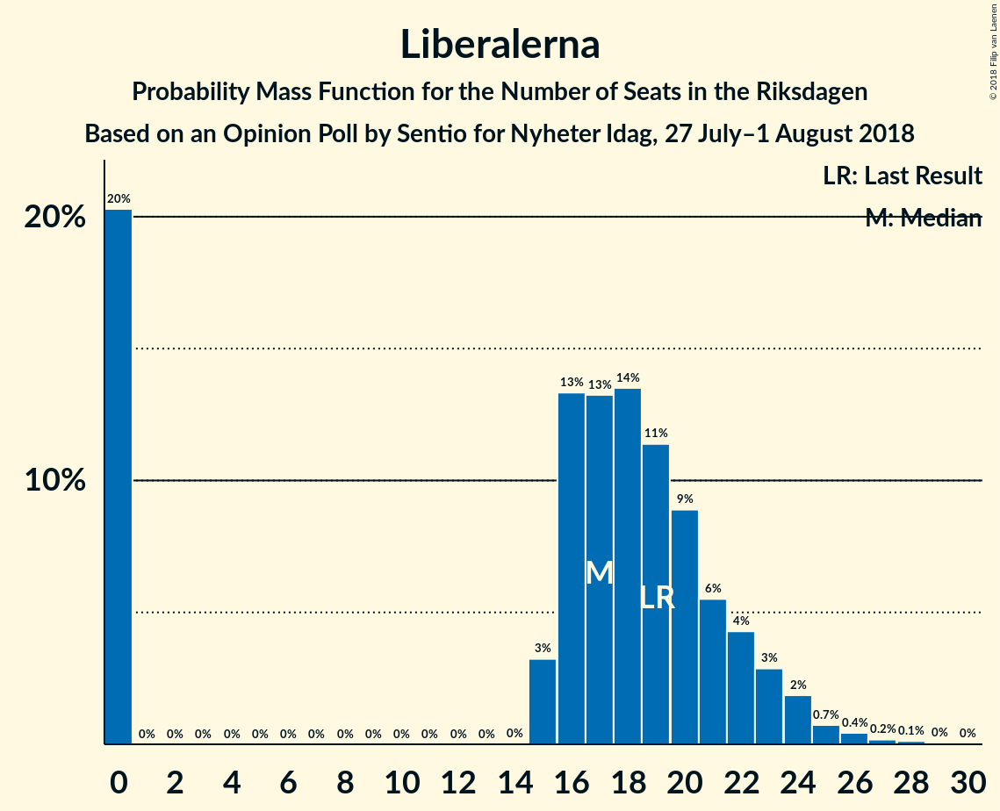

| Number of Seats | Probability | Accumulated | Special Marks |
|:---------------:|:-----------:|:-----------:|:-------------:|
| 0 | 20% | 100% |  |
| 1 | 0% | 80% |  |
| 2 | 0% | 80% |  |
| 3 | 0% | 80% |  |
| 4 | 0% | 80% |  |
| 5 | 0% | 80% |  |
| 6 | 0% | 80% |  |
| 7 | 0% | 80% |  |
| 8 | 0% | 80% |  |
| 9 | 0% | 80% |  |
| 10 | 0% | 80% |  |
| 11 | 0% | 80% |  |
| 12 | 0% | 80% |  |
| 13 | 0% | 80% |  |
| 14 | 0% | 80% |  |
| 15 | 3% | 80% |  |
| 16 | 13% | 76% |  |
| 17 | 13% | 63% | Median |
| 18 | 14% | 50% |  |
| 19 | 11% | 36% | Last Result |
| 20 | 9% | 25% |  |
| 21 | 6% | 16% |  |
| 22 | 4% | 11% |  |
| 23 | 3% | 6% |  |
| 24 | 2% | 3% |  |
| 25 | 0.7% | 2% |  |
| 26 | 0.4% | 0.8% |  |
| 27 | 0.2% | 0.4% |  |
| 28 | 0.1% | 0.2% |  |
| 29 | 0% | 0.1% |  |
| 30 | 0% | 0% |  |

### Miljöpartiet de gröna

*For a full overview of the results for this party, see the [Miljöpartiet de gröna](party-miljöpartietdegröna.html) page.*

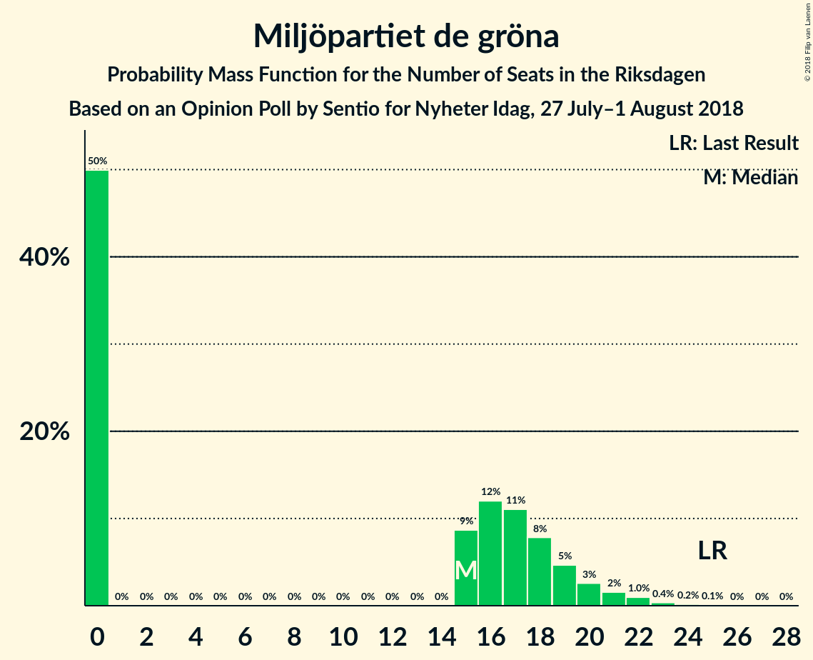

| Number of Seats | Probability | Accumulated | Special Marks |
|:---------------:|:-----------:|:-----------:|:-------------:|
| 0 | 50% | 100% |  |
| 1 | 0% | 50% |  |
| 2 | 0% | 50% |  |
| 3 | 0% | 50% |  |
| 4 | 0% | 50% |  |
| 5 | 0% | 50% |  |
| 6 | 0% | 50% |  |
| 7 | 0% | 50% |  |
| 8 | 0% | 50% |  |
| 9 | 0% | 50% |  |
| 10 | 0% | 50% |  |
| 11 | 0% | 50% |  |
| 12 | 0% | 50% |  |
| 13 | 0% | 50% |  |
| 14 | 0% | 50% |  |
| 15 | 9% | 50% | Median |
| 16 | 12% | 41% |  |
| 17 | 11% | 29% |  |
| 18 | 8% | 18% |  |
| 19 | 5% | 10% |  |
| 20 | 3% | 6% |  |
| 21 | 2% | 3% |  |
| 22 | 1.0% | 2% |  |
| 23 | 0.4% | 0.7% |  |
| 24 | 0.2% | 0.3% |  |
| 25 | 0.1% | 0.1% | Last Result |
| 26 | 0% | 0.1% |  |
| 27 | 0% | 0% |  |

### Kristdemokraterna

*For a full overview of the results for this party, see the [Kristdemokraterna](party-kristdemokraterna.html) page.*

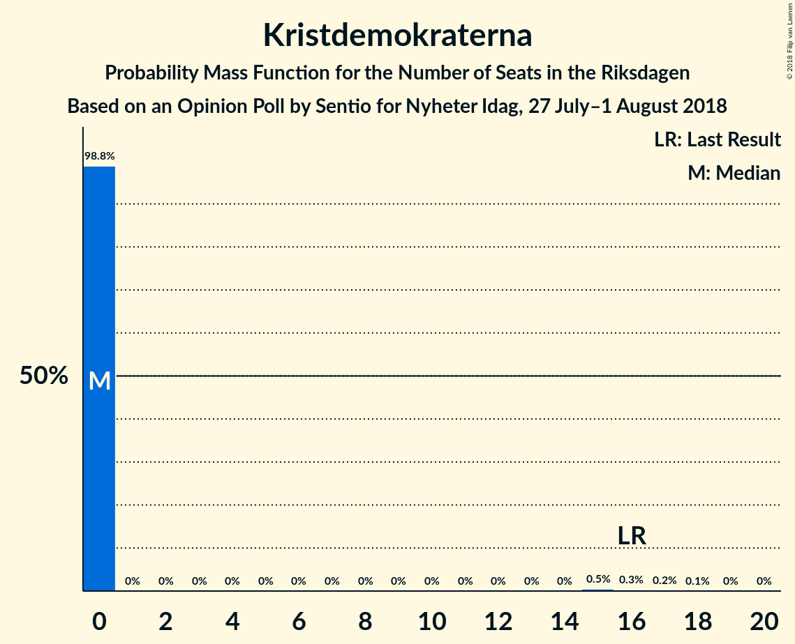

| Number of Seats | Probability | Accumulated | Special Marks |
|:---------------:|:-----------:|:-----------:|:-------------:|
| 0 | 98.8% | 100% | Median |
| 1 | 0% | 1.2% |  |
| 2 | 0% | 1.2% |  |
| 3 | 0% | 1.2% |  |
| 4 | 0% | 1.2% |  |
| 5 | 0% | 1.2% |  |
| 6 | 0% | 1.2% |  |
| 7 | 0% | 1.2% |  |
| 8 | 0% | 1.2% |  |
| 9 | 0% | 1.2% |  |
| 10 | 0% | 1.2% |  |
| 11 | 0% | 1.2% |  |
| 12 | 0% | 1.2% |  |
| 13 | 0% | 1.2% |  |
| 14 | 0% | 1.2% |  |
| 15 | 0.5% | 1.1% |  |
| 16 | 0.3% | 0.6% | Last Result |
| 17 | 0.2% | 0.3% |  |
| 18 | 0.1% | 0.1% |  |
| 19 | 0% | 0% |  |

### Feministiskt initiativ

*For a full overview of the results for this party, see the [Feministiskt initiativ](party-feministisktinitiativ.html) page.*

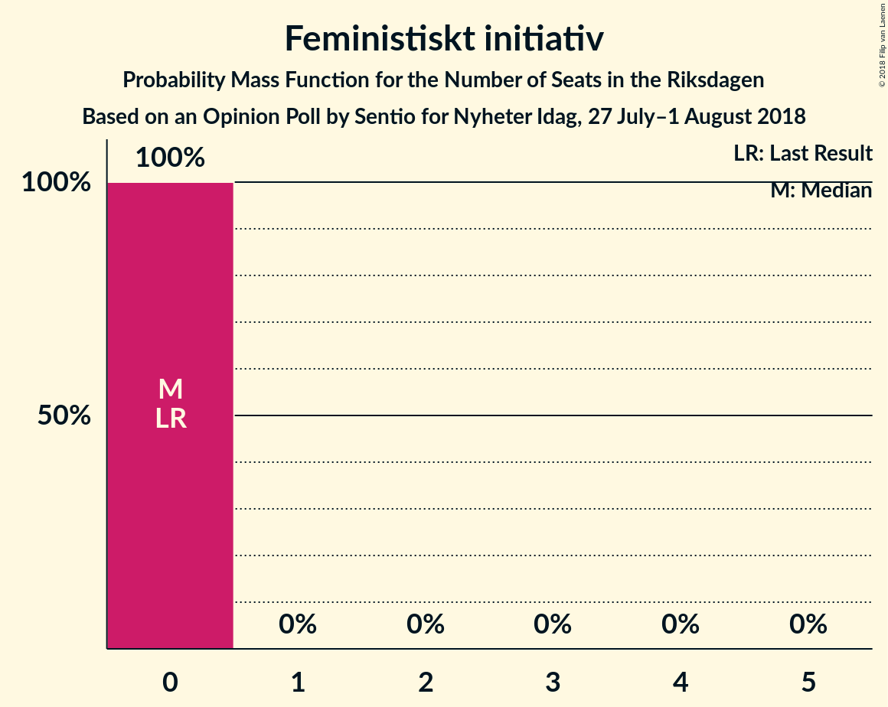

| Number of Seats | Probability | Accumulated | Special Marks |
|:---------------:|:-----------:|:-----------:|:-------------:|
| 0 | 100% | 100% | Last Result, Median |

## Coalitions

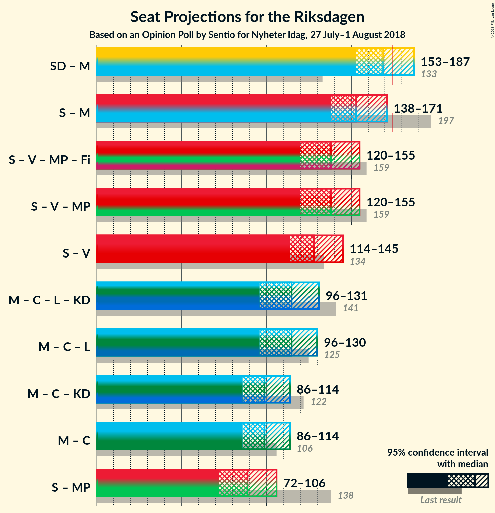

### Confidence Intervals

| Coalition | Last Result | Median | Majority? | 80% Confidence Interval | 90% Confidence Interval | 95% Confidence Interval | 99% Confidence Interval |
|:---------:|:-----------:|:------:|:---------:|:-----------------------:|:-----------------------:|:-----------------------:|:-----------------------:|
| Sverigedemokraterna – Moderata samlingspartiet | 133 | 169 | 29% | 158–182 | 155–185 | 153–187 | 149–193 |
| Sveriges socialdemokratiska arbetareparti – Moderata samlingspartiet | 197 | 153 | 0.8% | 143–165 | 140–168 | 138–171 | 133–176 |
| Sveriges socialdemokratiska arbetareparti – Vänsterpartiet – Miljöpartiet de gröna – Feministiskt initiativ | 159 | 138 | 0% | 126–149 | 123–152 | 120–155 | 115–161 |
| Sveriges socialdemokratiska arbetareparti – Vänsterpartiet – Miljöpartiet de gröna | 159 | 138 | 0% | 126–149 | 123–152 | 120–155 | 115–161 |
| Sveriges socialdemokratiska arbetareparti – Vänsterpartiet | 134 | 128 | 0% | 119–139 | 117–142 | 114–145 | 110–150 |
| Moderata samlingspartiet – Centerpartiet – Liberalerna – Kristdemokraterna | 141 | 115 | 0% | 102–125 | 99–128 | 96–131 | 91–135 |
| Moderata samlingspartiet – Centerpartiet – Liberalerna | 125 | 115 | 0% | 102–124 | 99–127 | 96–130 | 91–134 |
| Moderata samlingspartiet – Centerpartiet – Kristdemokraterna | 122 | 99 | 0% | 90–108 | 89–112 | 86–114 | 83–119 |
| Moderata samlingspartiet – Centerpartiet | 106 | 99 | 0% | 90–108 | 89–111 | 86–114 | 83–119 |
| Sveriges socialdemokratiska arbetareparti – Miljöpartiet de gröna | 138 | 89 | 0% | 77–101 | 74–104 | 72–106 | 69–110 |

### Sverigedemokraterna – Moderata samlingspartiet

| Number of Seats | Probability | Accumulated | Special Marks |
|:---------------:|:-----------:|:-----------:|:-------------:|
| 133 | 0% | 100% | Last Result |
| 134 | 0% | 100% |  |
| 135 | 0% | 100% |  |
| 136 | 0% | 100% |  |
| 137 | 0% | 100% |  |
| 138 | 0% | 100% |  |
| 139 | 0% | 100% |  |
| 140 | 0% | 100% |  |
| 141 | 0% | 100% |  |
| 142 | 0% | 100% |  |
| 143 | 0% | 100% |  |
| 144 | 0% | 100% |  |
| 145 | 0% | 99.9% |  |
| 146 | 0.1% | 99.9% |  |
| 147 | 0.1% | 99.8% |  |
| 148 | 0.1% | 99.7% |  |
| 149 | 0.2% | 99.5% |  |
| 150 | 0.3% | 99.3% |  |
| 151 | 0.4% | 99.0% |  |
| 152 | 0.4% | 98.6% |  |
| 153 | 2% | 98% |  |
| 154 | 0.8% | 97% |  |
| 155 | 0.9% | 96% |  |
| 156 | 2% | 95% |  |
| 157 | 1.3% | 93% |  |
| 158 | 2% | 92% |  |
| 159 | 2% | 90% |  |
| 160 | 3% | 87% |  |
| 161 | 3% | 84% |  |
| 162 | 3% | 82% |  |
| 163 | 3% | 79% |  |
| 164 | 4% | 76% |  |
| 165 | 5% | 71% |  |
| 166 | 5% | 67% |  |
| 167 | 4% | 62% |  |
| 168 | 5% | 58% |  |
| 169 | 7% | 53% | Median |
| 170 | 3% | 47% |  |
| 171 | 4% | 43% |  |
| 172 | 3% | 40% |  |
| 173 | 4% | 37% |  |
| 174 | 4% | 33% |  |
| 175 | 5% | 29% | Majority |
| 176 | 3% | 25% |  |
| 177 | 3% | 22% |  |
| 178 | 2% | 19% |  |
| 179 | 3% | 17% |  |
| 180 | 2% | 15% |  |
| 181 | 2% | 13% |  |
| 182 | 2% | 11% |  |
| 183 | 2% | 9% |  |
| 184 | 2% | 7% |  |
| 185 | 2% | 6% |  |
| 186 | 1.1% | 4% |  |
| 187 | 0.7% | 3% |  |
| 188 | 0.3% | 2% |  |
| 189 | 0.3% | 2% |  |
| 190 | 0.5% | 2% |  |
| 191 | 0.4% | 1.3% |  |
| 192 | 0.2% | 0.9% |  |
| 193 | 0.3% | 0.7% |  |
| 194 | 0.1% | 0.4% |  |
| 195 | 0.1% | 0.4% |  |
| 196 | 0.1% | 0.3% |  |
| 197 | 0% | 0.2% |  |
| 198 | 0% | 0.1% |  |
| 199 | 0% | 0.1% |  |
| 200 | 0% | 0.1% |  |
| 201 | 0% | 0.1% |  |
| 202 | 0% | 0% |  |

### Sveriges socialdemokratiska arbetareparti – Moderata samlingspartiet

| Number of Seats | Probability | Accumulated | Special Marks |
|:---------------:|:-----------:|:-----------:|:-------------:|
| 128 | 0% | 100% |  |
| 129 | 0% | 99.9% |  |
| 130 | 0.1% | 99.9% |  |
| 131 | 0.1% | 99.8% |  |
| 132 | 0.2% | 99.8% |  |
| 133 | 0.1% | 99.6% |  |
| 134 | 0.3% | 99.4% |  |
| 135 | 0.3% | 99.2% |  |
| 136 | 0.4% | 98.8% |  |
| 137 | 0.7% | 98% |  |
| 138 | 0.8% | 98% |  |
| 139 | 1.0% | 97% |  |
| 140 | 2% | 96% |  |
| 141 | 2% | 94% |  |
| 142 | 2% | 93% |  |
| 143 | 2% | 90% |  |
| 144 | 3% | 88% |  |
| 145 | 3% | 85% |  |
| 146 | 3% | 83% |  |
| 147 | 4% | 80% |  |
| 148 | 5% | 76% |  |
| 149 | 3% | 71% |  |
| 150 | 7% | 68% |  |
| 151 | 6% | 61% |  |
| 152 | 4% | 55% |  |
| 153 | 3% | 51% | Median |
| 154 | 5% | 48% |  |
| 155 | 3% | 43% |  |
| 156 | 5% | 39% |  |
| 157 | 3% | 34% |  |
| 158 | 6% | 31% |  |
| 159 | 4% | 25% |  |
| 160 | 2% | 21% |  |
| 161 | 3% | 19% |  |
| 162 | 2% | 16% |  |
| 163 | 2% | 13% |  |
| 164 | 2% | 12% |  |
| 165 | 2% | 10% |  |
| 166 | 1.1% | 8% |  |
| 167 | 2% | 7% |  |
| 168 | 0.8% | 5% |  |
| 169 | 0.8% | 4% |  |
| 170 | 0.4% | 3% |  |
| 171 | 1.3% | 3% |  |
| 172 | 0.3% | 2% |  |
| 173 | 0.2% | 1.3% |  |
| 174 | 0.3% | 1.1% |  |
| 175 | 0.2% | 0.8% | Majority |
| 176 | 0.1% | 0.6% |  |
| 177 | 0.1% | 0.5% |  |
| 178 | 0% | 0.4% |  |
| 179 | 0.1% | 0.3% |  |
| 180 | 0.1% | 0.3% |  |
| 181 | 0% | 0.1% |  |
| 182 | 0% | 0.1% |  |
| 183 | 0% | 0.1% |  |
| 184 | 0% | 0.1% |  |
| 185 | 0% | 0% |  |
| 186 | 0% | 0% |  |
| 187 | 0% | 0% |  |
| 188 | 0% | 0% |  |
| 189 | 0% | 0% |  |
| 190 | 0% | 0% |  |
| 191 | 0% | 0% |  |
| 192 | 0% | 0% |  |
| 193 | 0% | 0% |  |
| 194 | 0% | 0% |  |
| 195 | 0% | 0% |  |
| 196 | 0% | 0% |  |
| 197 | 0% | 0% | Last Result |

### Sveriges socialdemokratiska arbetareparti – Vänsterpartiet – Miljöpartiet de gröna – Feministiskt initiativ

| Number of Seats | Probability | Accumulated | Special Marks |
|:---------------:|:-----------:|:-----------:|:-------------:|
| 111 | 0% | 100% |  |
| 112 | 0% | 99.9% |  |
| 113 | 0.1% | 99.9% |  |
| 114 | 0.2% | 99.8% |  |
| 115 | 0.1% | 99.6% |  |
| 116 | 0.3% | 99.5% |  |
| 117 | 0.3% | 99.2% |  |
| 118 | 0.6% | 98.9% |  |
| 119 | 0.5% | 98% |  |
| 120 | 0.5% | 98% |  |
| 121 | 0.9% | 97% |  |
| 122 | 0.8% | 96% |  |
| 123 | 2% | 96% |  |
| 124 | 1.4% | 93% |  |
| 125 | 2% | 92% |  |
| 126 | 1.2% | 90% |  |
| 127 | 3% | 89% |  |
| 128 | 2% | 85% |  |
| 129 | 2% | 83% |  |
| 130 | 3% | 81% |  |
| 131 | 3% | 78% |  |
| 132 | 4% | 75% |  |
| 133 | 5% | 72% |  |
| 134 | 4% | 66% |  |
| 135 | 3% | 62% |  |
| 136 | 5% | 60% |  |
| 137 | 3% | 54% |  |
| 138 | 7% | 51% |  |
| 139 | 5% | 45% |  |
| 140 | 3% | 40% |  |
| 141 | 4% | 37% |  |
| 142 | 5% | 33% |  |
| 143 | 3% | 29% |  |
| 144 | 4% | 25% | Median |
| 145 | 2% | 21% |  |
| 146 | 3% | 19% |  |
| 147 | 2% | 16% |  |
| 148 | 3% | 14% |  |
| 149 | 2% | 11% |  |
| 150 | 2% | 9% |  |
| 151 | 0.8% | 7% |  |
| 152 | 2% | 6% |  |
| 153 | 0.9% | 5% |  |
| 154 | 0.8% | 4% |  |
| 155 | 0.9% | 3% |  |
| 156 | 0.6% | 2% |  |
| 157 | 0.4% | 2% |  |
| 158 | 0.3% | 1.1% |  |
| 159 | 0.2% | 0.8% | Last Result |
| 160 | 0.1% | 0.6% |  |
| 161 | 0.2% | 0.5% |  |
| 162 | 0.1% | 0.3% |  |
| 163 | 0.1% | 0.2% |  |
| 164 | 0% | 0.1% |  |
| 165 | 0% | 0.1% |  |
| 166 | 0% | 0.1% |  |
| 167 | 0% | 0% |  |

### Sveriges socialdemokratiska arbetareparti – Vänsterpartiet – Miljöpartiet de gröna

| Number of Seats | Probability | Accumulated | Special Marks |
|:---------------:|:-----------:|:-----------:|:-------------:|
| 111 | 0% | 100% |  |
| 112 | 0% | 99.9% |  |
| 113 | 0.1% | 99.9% |  |
| 114 | 0.2% | 99.8% |  |
| 115 | 0.1% | 99.6% |  |
| 116 | 0.3% | 99.5% |  |
| 117 | 0.3% | 99.2% |  |
| 118 | 0.6% | 98.9% |  |
| 119 | 0.5% | 98% |  |
| 120 | 0.5% | 98% |  |
| 121 | 0.9% | 97% |  |
| 122 | 0.8% | 96% |  |
| 123 | 2% | 96% |  |
| 124 | 1.4% | 93% |  |
| 125 | 2% | 92% |  |
| 126 | 1.2% | 90% |  |
| 127 | 3% | 89% |  |
| 128 | 2% | 85% |  |
| 129 | 2% | 83% |  |
| 130 | 3% | 81% |  |
| 131 | 3% | 78% |  |
| 132 | 4% | 75% |  |
| 133 | 5% | 72% |  |
| 134 | 4% | 66% |  |
| 135 | 3% | 62% |  |
| 136 | 5% | 60% |  |
| 137 | 3% | 54% |  |
| 138 | 7% | 51% |  |
| 139 | 5% | 45% |  |
| 140 | 3% | 40% |  |
| 141 | 4% | 37% |  |
| 142 | 5% | 33% |  |
| 143 | 3% | 29% |  |
| 144 | 4% | 25% | Median |
| 145 | 2% | 21% |  |
| 146 | 3% | 19% |  |
| 147 | 2% | 16% |  |
| 148 | 3% | 14% |  |
| 149 | 2% | 11% |  |
| 150 | 2% | 9% |  |
| 151 | 0.8% | 7% |  |
| 152 | 2% | 6% |  |
| 153 | 0.9% | 5% |  |
| 154 | 0.8% | 4% |  |
| 155 | 0.9% | 3% |  |
| 156 | 0.6% | 2% |  |
| 157 | 0.4% | 2% |  |
| 158 | 0.3% | 1.1% |  |
| 159 | 0.2% | 0.8% | Last Result |
| 160 | 0.1% | 0.6% |  |
| 161 | 0.2% | 0.5% |  |
| 162 | 0.1% | 0.3% |  |
| 163 | 0.1% | 0.2% |  |
| 164 | 0% | 0.1% |  |
| 165 | 0% | 0.1% |  |
| 166 | 0% | 0.1% |  |
| 167 | 0% | 0% |  |

### Sveriges socialdemokratiska arbetareparti – Vänsterpartiet

| Number of Seats | Probability | Accumulated | Special Marks |
|:---------------:|:-----------:|:-----------:|:-------------:|
| 106 | 0% | 100% |  |
| 107 | 0.1% | 99.9% |  |
| 108 | 0.1% | 99.8% |  |
| 109 | 0.1% | 99.7% |  |
| 110 | 0.2% | 99.6% |  |
| 111 | 0.3% | 99.4% |  |
| 112 | 0.3% | 99.1% |  |
| 113 | 0.7% | 98.8% |  |
| 114 | 0.6% | 98% |  |
| 115 | 1.2% | 97% |  |
| 116 | 0.9% | 96% |  |
| 117 | 3% | 95% |  |
| 118 | 2% | 93% |  |
| 119 | 2% | 91% |  |
| 120 | 2% | 89% |  |
| 121 | 4% | 87% |  |
| 122 | 3% | 83% |  |
| 123 | 7% | 80% |  |
| 124 | 4% | 73% |  |
| 125 | 6% | 69% |  |
| 126 | 3% | 63% |  |
| 127 | 7% | 60% |  |
| 128 | 4% | 54% |  |
| 129 | 4% | 50% | Median |
| 130 | 5% | 46% |  |
| 131 | 4% | 40% |  |
| 132 | 3% | 36% |  |
| 133 | 6% | 33% |  |
| 134 | 5% | 27% | Last Result |
| 135 | 3% | 23% |  |
| 136 | 4% | 20% |  |
| 137 | 3% | 16% |  |
| 138 | 2% | 14% |  |
| 139 | 2% | 11% |  |
| 140 | 2% | 9% |  |
| 141 | 1.0% | 7% |  |
| 142 | 1.3% | 6% |  |
| 143 | 0.9% | 5% |  |
| 144 | 0.8% | 4% |  |
| 145 | 0.7% | 3% |  |
| 146 | 0.4% | 2% |  |
| 147 | 0.3% | 2% |  |
| 148 | 0.9% | 2% |  |
| 149 | 0.1% | 0.7% |  |
| 150 | 0.1% | 0.6% |  |
| 151 | 0.1% | 0.5% |  |
| 152 | 0.1% | 0.4% |  |
| 153 | 0.1% | 0.3% |  |
| 154 | 0% | 0.2% |  |
| 155 | 0% | 0.1% |  |
| 156 | 0.1% | 0.1% |  |
| 157 | 0% | 0% |  |

### Moderata samlingspartiet – Centerpartiet – Liberalerna – Kristdemokraterna

| Number of Seats | Probability | Accumulated | Special Marks |
|:---------------:|:-----------:|:-----------:|:-------------:|
| 86 | 0.1% | 100% |  |
| 87 | 0% | 99.9% |  |
| 88 | 0.1% | 99.9% |  |
| 89 | 0.1% | 99.8% |  |
| 90 | 0.1% | 99.7% |  |
| 91 | 0.2% | 99.6% |  |
| 92 | 0.3% | 99.4% |  |
| 93 | 0.6% | 99.1% |  |
| 94 | 0.3% | 98.5% |  |
| 95 | 0.5% | 98% |  |
| 96 | 0.6% | 98% |  |
| 97 | 0.5% | 97% |  |
| 98 | 1.0% | 97% |  |
| 99 | 2% | 96% |  |
| 100 | 1.0% | 94% |  |
| 101 | 2% | 93% |  |
| 102 | 2% | 91% |  |
| 103 | 2% | 89% |  |
| 104 | 0.9% | 87% |  |
| 105 | 2% | 86% |  |
| 106 | 2% | 84% |  |
| 107 | 2% | 82% |  |
| 108 | 4% | 80% |  |
| 109 | 4% | 76% |  |
| 110 | 3% | 72% |  |
| 111 | 4% | 68% |  |
| 112 | 3% | 64% |  |
| 113 | 3% | 61% |  |
| 114 | 4% | 58% |  |
| 115 | 5% | 53% | Median |
| 116 | 3% | 48% |  |
| 117 | 10% | 45% |  |
| 118 | 4% | 35% |  |
| 119 | 4% | 30% |  |
| 120 | 3% | 26% |  |
| 121 | 2% | 23% |  |
| 122 | 4% | 20% |  |
| 123 | 2% | 16% |  |
| 124 | 3% | 14% |  |
| 125 | 2% | 10% |  |
| 126 | 2% | 9% |  |
| 127 | 2% | 7% |  |
| 128 | 0.7% | 5% |  |
| 129 | 1.1% | 5% |  |
| 130 | 1.2% | 4% |  |
| 131 | 0.8% | 3% |  |
| 132 | 0.4% | 2% |  |
| 133 | 0.6% | 1.3% |  |
| 134 | 0.1% | 0.8% |  |
| 135 | 0.3% | 0.6% |  |
| 136 | 0.1% | 0.3% |  |
| 137 | 0.1% | 0.3% |  |
| 138 | 0.1% | 0.2% |  |
| 139 | 0% | 0.1% |  |
| 140 | 0% | 0.1% |  |
| 141 | 0% | 0.1% | Last Result |
| 142 | 0% | 0% |  |

### Moderata samlingspartiet – Centerpartiet – Liberalerna

| Number of Seats | Probability | Accumulated | Special Marks |
|:---------------:|:-----------:|:-----------:|:-------------:|
| 86 | 0.1% | 100% |  |
| 87 | 0% | 99.9% |  |
| 88 | 0.1% | 99.9% |  |
| 89 | 0.1% | 99.8% |  |
| 90 | 0.1% | 99.7% |  |
| 91 | 0.2% | 99.6% |  |
| 92 | 0.3% | 99.4% |  |
| 93 | 0.6% | 99.1% |  |
| 94 | 0.3% | 98% |  |
| 95 | 0.5% | 98% |  |
| 96 | 0.6% | 98% |  |
| 97 | 0.5% | 97% |  |
| 98 | 1.0% | 97% |  |
| 99 | 2% | 96% |  |
| 100 | 1.0% | 94% |  |
| 101 | 2% | 93% |  |
| 102 | 2% | 91% |  |
| 103 | 2% | 89% |  |
| 104 | 0.9% | 87% |  |
| 105 | 2% | 86% |  |
| 106 | 2% | 84% |  |
| 107 | 2% | 82% |  |
| 108 | 4% | 79% |  |
| 109 | 4% | 75% |  |
| 110 | 3% | 71% |  |
| 111 | 4% | 68% |  |
| 112 | 3% | 64% |  |
| 113 | 3% | 61% |  |
| 114 | 4% | 57% |  |
| 115 | 6% | 53% | Median |
| 116 | 3% | 47% |  |
| 117 | 10% | 44% |  |
| 118 | 4% | 34% |  |
| 119 | 4% | 30% |  |
| 120 | 3% | 25% |  |
| 121 | 2% | 22% |  |
| 122 | 4% | 20% |  |
| 123 | 2% | 15% |  |
| 124 | 3% | 13% |  |
| 125 | 2% | 10% | Last Result |
| 126 | 2% | 8% |  |
| 127 | 1.5% | 6% |  |
| 128 | 0.6% | 5% |  |
| 129 | 1.1% | 4% |  |
| 130 | 1.1% | 3% |  |
| 131 | 0.8% | 2% |  |
| 132 | 0.2% | 1.4% |  |
| 133 | 0.5% | 1.1% |  |
| 134 | 0.1% | 0.6% |  |
| 135 | 0.2% | 0.5% |  |
| 136 | 0.1% | 0.3% |  |
| 137 | 0% | 0.2% |  |
| 138 | 0.1% | 0.1% |  |
| 139 | 0% | 0.1% |  |
| 140 | 0% | 0% |  |

### Moderata samlingspartiet – Centerpartiet – Kristdemokraterna

| Number of Seats | Probability | Accumulated | Special Marks |
|:---------------:|:-----------:|:-----------:|:-------------:|
| 78 | 0% | 100% |  |
| 79 | 0% | 99.9% |  |
| 80 | 0.1% | 99.9% |  |
| 81 | 0.1% | 99.8% |  |
| 82 | 0.1% | 99.8% |  |
| 83 | 0.3% | 99.6% |  |
| 84 | 0.8% | 99.4% |  |
| 85 | 0.6% | 98.6% |  |
| 86 | 0.7% | 98% |  |
| 87 | 0.8% | 97% |  |
| 88 | 1.3% | 96% |  |
| 89 | 3% | 95% |  |
| 90 | 3% | 92% |  |
| 91 | 3% | 90% |  |
| 92 | 3% | 87% |  |
| 93 | 4% | 84% |  |
| 94 | 3% | 79% |  |
| 95 | 6% | 77% |  |
| 96 | 6% | 70% |  |
| 97 | 5% | 65% |  |
| 98 | 4% | 60% | Median |
| 99 | 6% | 55% |  |
| 100 | 6% | 49% |  |
| 101 | 5% | 43% |  |
| 102 | 6% | 37% |  |
| 103 | 6% | 31% |  |
| 104 | 3% | 25% |  |
| 105 | 3% | 22% |  |
| 106 | 3% | 18% |  |
| 107 | 3% | 15% |  |
| 108 | 2% | 12% |  |
| 109 | 2% | 10% |  |
| 110 | 2% | 8% |  |
| 111 | 1.0% | 6% |  |
| 112 | 1.4% | 5% |  |
| 113 | 0.7% | 4% |  |
| 114 | 0.8% | 3% |  |
| 115 | 0.5% | 2% |  |
| 116 | 0.5% | 2% |  |
| 117 | 0.3% | 1.1% |  |
| 118 | 0.1% | 0.8% |  |
| 119 | 0.2% | 0.7% |  |
| 120 | 0.2% | 0.5% |  |
| 121 | 0% | 0.3% |  |
| 122 | 0.1% | 0.3% | Last Result |
| 123 | 0% | 0.2% |  |
| 124 | 0% | 0.1% |  |
| 125 | 0% | 0.1% |  |
| 126 | 0% | 0.1% |  |
| 127 | 0% | 0% |  |

### Moderata samlingspartiet – Centerpartiet

| Number of Seats | Probability | Accumulated | Special Marks |
|:---------------:|:-----------:|:-----------:|:-------------:|
| 78 | 0% | 100% |  |
| 79 | 0% | 99.9% |  |
| 80 | 0.1% | 99.9% |  |
| 81 | 0.1% | 99.8% |  |
| 82 | 0.1% | 99.7% |  |
| 83 | 0.3% | 99.6% |  |
| 84 | 0.8% | 99.3% |  |
| 85 | 0.6% | 98.5% |  |
| 86 | 0.8% | 98% |  |
| 87 | 0.8% | 97% |  |
| 88 | 1.3% | 96% |  |
| 89 | 3% | 95% |  |
| 90 | 3% | 92% |  |
| 91 | 3% | 89% |  |
| 92 | 3% | 87% |  |
| 93 | 4% | 83% |  |
| 94 | 3% | 79% |  |
| 95 | 6% | 76% |  |
| 96 | 6% | 70% |  |
| 97 | 5% | 64% |  |
| 98 | 4% | 59% | Median |
| 99 | 6% | 55% |  |
| 100 | 6% | 48% |  |
| 101 | 5% | 42% |  |
| 102 | 6% | 37% |  |
| 103 | 6% | 30% |  |
| 104 | 3% | 24% |  |
| 105 | 3% | 21% |  |
| 106 | 3% | 18% | Last Result |
| 107 | 3% | 15% |  |
| 108 | 2% | 12% |  |
| 109 | 2% | 9% |  |
| 110 | 2% | 7% |  |
| 111 | 1.0% | 5% |  |
| 112 | 1.3% | 4% |  |
| 113 | 0.7% | 3% |  |
| 114 | 0.7% | 3% |  |
| 115 | 0.5% | 2% |  |
| 116 | 0.5% | 1.4% |  |
| 117 | 0.3% | 0.9% |  |
| 118 | 0.1% | 0.6% |  |
| 119 | 0.2% | 0.5% |  |
| 120 | 0.1% | 0.3% |  |
| 121 | 0% | 0.2% |  |
| 122 | 0.1% | 0.2% |  |
| 123 | 0% | 0.1% |  |
| 124 | 0% | 0.1% |  |
| 125 | 0% | 0% |  |

### Sveriges socialdemokratiska arbetareparti – Miljöpartiet de gröna

| Number of Seats | Probability | Accumulated | Special Marks |
|:---------------:|:-----------:|:-----------:|:-------------:|
| 65 | 0% | 100% |  |
| 66 | 0.1% | 99.9% |  |
| 67 | 0.1% | 99.9% |  |
| 68 | 0.2% | 99.8% |  |
| 69 | 0.3% | 99.6% |  |
| 70 | 0.3% | 99.3% |  |
| 71 | 0.8% | 99.0% |  |
| 72 | 1.1% | 98% |  |
| 73 | 1.1% | 97% |  |
| 74 | 2% | 96% |  |
| 75 | 2% | 94% |  |
| 76 | 2% | 92% |  |
| 77 | 4% | 91% |  |
| 78 | 2% | 87% |  |
| 79 | 2% | 86% |  |
| 80 | 3% | 83% |  |
| 81 | 3% | 81% |  |
| 82 | 5% | 78% |  |
| 83 | 4% | 73% |  |
| 84 | 3% | 70% |  |
| 85 | 3% | 67% |  |
| 86 | 5% | 65% |  |
| 87 | 2% | 60% |  |
| 88 | 5% | 57% |  |
| 89 | 6% | 53% |  |
| 90 | 2% | 47% |  |
| 91 | 3% | 45% |  |
| 92 | 3% | 42% |  |
| 93 | 3% | 39% |  |
| 94 | 2% | 36% |  |
| 95 | 5% | 33% |  |
| 96 | 2% | 28% | Median |
| 97 | 7% | 26% |  |
| 98 | 2% | 20% |  |
| 99 | 4% | 17% |  |
| 100 | 2% | 13% |  |
| 101 | 2% | 11% |  |
| 102 | 1.3% | 8% |  |
| 103 | 2% | 7% |  |
| 104 | 1.1% | 5% |  |
| 105 | 1.1% | 4% |  |
| 106 | 1.2% | 3% |  |
| 107 | 0.5% | 2% |  |
| 108 | 0.5% | 2% |  |
| 109 | 0.4% | 1.0% |  |
| 110 | 0.2% | 0.6% |  |
| 111 | 0.2% | 0.4% |  |
| 112 | 0.1% | 0.3% |  |
| 113 | 0.1% | 0.2% |  |
| 114 | 0% | 0.1% |  |
| 115 | 0% | 0.1% |  |
| 116 | 0% | 0% |  |
| 117 | 0% | 0% |  |
| 118 | 0% | 0% |  |
| 119 | 0% | 0% |  |
| 120 | 0% | 0% |  |
| 121 | 0% | 0% |  |
| 122 | 0% | 0% |  |
| 123 | 0% | 0% |  |
| 124 | 0% | 0% |  |
| 125 | 0% | 0% |  |
| 126 | 0% | 0% |  |
| 127 | 0% | 0% |  |
| 128 | 0% | 0% |  |
| 129 | 0% | 0% |  |
| 130 | 0% | 0% |  |
| 131 | 0% | 0% |  |
| 132 | 0% | 0% |  |
| 133 | 0% | 0% |  |
| 134 | 0% | 0% |  |
| 135 | 0% | 0% |  |
| 136 | 0% | 0% |  |
| 137 | 0% | 0% |  |
| 138 | 0% | 0% | Last Result |

## Technical Information

### Opinion Poll

+ **Polling firm:** Sentio
+ **Commissioner(s):** Nyheter Idag
+ **Fieldwork period:** 27 July–1 August 2018

### Calculations

+ **Sample size:** 742
+ **Simulations done:** 4,194,304
+ **Error estimate:** 1.63%

