# Opinion Poll by Sifo for Svenska Dagbladet, 21–26 August 2018

<a href="#voting-intentions">Voting Intentions</a> | <a href="#seats">Seats</a> | <a href="#coalitions">Coalitions</a> | <a href="#technical-information">Technical Information</a>

## Voting Intentions

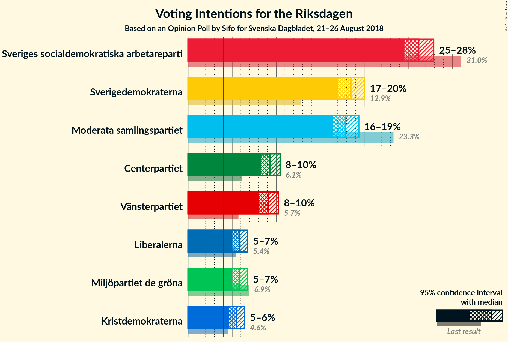

### Confidence Intervals

| Party | Last Result | Poll Result | 80% Confidence Interval | 90% Confidence Interval | 95% Confidence Interval | 99% Confidence Interval |
|:-----:|:-----------:|:-----------:|:-----------------------:|:-----------------------:|:-----------------------:|:-----------------------:|
| Sveriges socialdemokratiska arbetareparti | 31.0% | 26.2% | 25.1–27.3% |24.8–27.6% |24.6–27.9% |24.1–28.4% |
| Sverigedemokraterna | 12.9% | 18.5% | 17.6–19.5% |17.3–19.8% |17.1–20.0% |16.6–20.5% |
| Moderata samlingspartiet | 23.3% | 17.9% | 17.0–18.9% |16.7–19.2% |16.5–19.4% |16.0–19.9% |
| Centerpartiet | 6.1% | 9.3% | 8.6–10.1% |8.4–10.3% |8.3–10.5% |7.9–10.8% |
| Vänsterpartiet | 5.7% | 9.1% | 8.4–9.9% |8.2–10.1% |8.1–10.3% |7.8–10.6% |
| Miljöpartiet de gröna | 6.9% | 5.8% | 5.3–6.4% |5.1–6.6% |5.0–6.8% |4.7–7.1% |
| Liberalerna | 5.4% | 5.8% | 5.3–6.4% |5.1–6.6% |5.0–6.8% |4.7–7.1% |
| Kristdemokraterna | 4.6% | 5.5% | 5.0–6.1% |4.8–6.3% |4.7–6.4% |4.4–6.7% |

*Note:* The poll result column reflects the actual value used in the calculations. Published results may vary slightly, and in addition be rounded to fewer digits.

## Seats

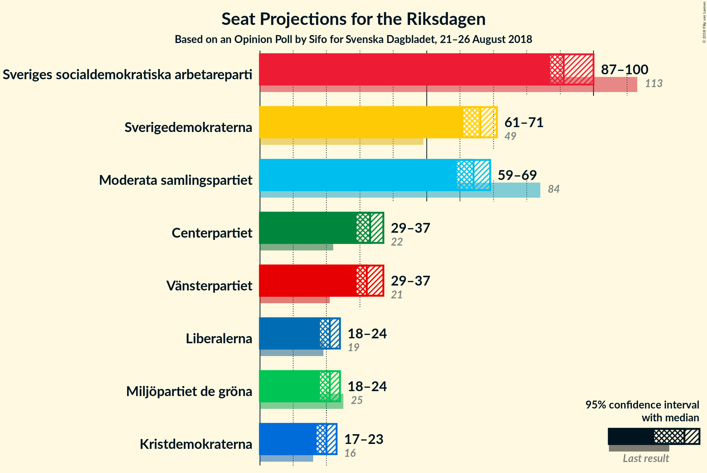

### Confidence Intervals

| Party | Last Result | Median | 80% Confidence Interval | 90% Confidence Interval | 95% Confidence Interval | 99% Confidence Interval |
|:-----:|:-----------:|:------:|:-----------------------:|:-----------------------:|:-----------------------:|:-----------------------:|
| <a href="#sveriges-socialdemokratiska-arbetareparti">Sveriges socialdemokratiska arbetareparti</a> | 113 | 91 | 88–97 |87–99 |87–100 |86–102 |
| <a href="#sverigedemokraterna">Sverigedemokraterna</a> | 49 | 66 | 63–70 |62–70 |61–71 |59–73 |
| <a href="#moderata-samlingspartiet">Moderata samlingspartiet</a> | 84 | 64 | 60–67 |59–68 |59–69 |57–71 |
| <a href="#centerpartiet">Centerpartiet</a> | 22 | 33 | 31–36 |30–37 |29–37 |28–39 |
| <a href="#vänsterpartiet">Vänsterpartiet</a> | 21 | 32 | 30–35 |30–36 |29–37 |28–38 |
| <a href="#miljöpartiet-de-gröna">Miljöpartiet de gröna</a> | 25 | 21 | 19–23 |18–24 |18–24 |17–25 |
| <a href="#liberalerna">Liberalerna</a> | 19 | 21 | 19–23 |18–24 |18–24 |17–25 |
| <a href="#kristdemokraterna">Kristdemokraterna</a> | 16 | 20 | 18–22 |17–23 |17–23 |16–24 |

### Sveriges socialdemokratiska arbetareparti

*For a full overview of the results for this party, see the [Sveriges socialdemokratiska arbetareparti](party-sverigessocialdemokratiskaarbetareparti.html) page.*

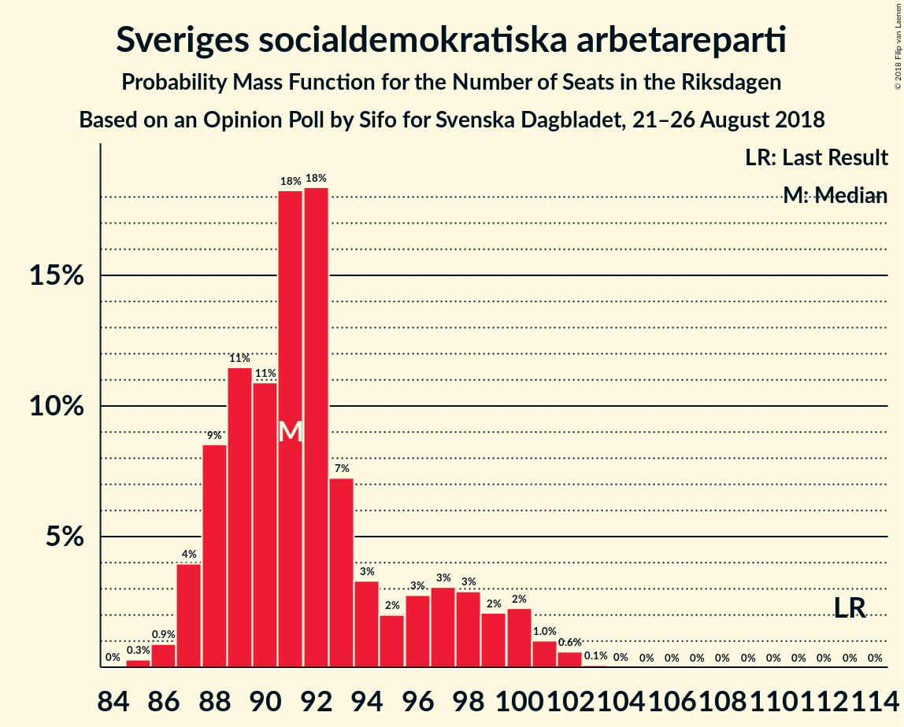

| Number of Seats | Probability | Accumulated | Special Marks |
|:---------------:|:-----------:|:-----------:|:-------------:|
| 85 | 0.3% | 100% |  |
| 86 | 0.9% | 99.7% |  |
| 87 | 4% | 98.8% |  |
| 88 | 9% | 95% |  |
| 89 | 11% | 86% |  |
| 90 | 11% | 75% |  |
| 91 | 18% | 64% | Median |
| 92 | 18% | 46% |  |
| 93 | 7% | 27% |  |
| 94 | 3% | 20% |  |
| 95 | 2% | 17% |  |
| 96 | 3% | 15% |  |
| 97 | 3% | 12% |  |
| 98 | 3% | 9% |  |
| 99 | 2% | 6% |  |
| 100 | 2% | 4% |  |
| 101 | 1.0% | 2% |  |
| 102 | 0.6% | 0.7% |  |
| 103 | 0.1% | 0.1% |  |
| 104 | 0% | 0% |  |
| 105 | 0% | 0% |  |
| 106 | 0% | 0% |  |
| 107 | 0% | 0% |  |
| 108 | 0% | 0% |  |
| 109 | 0% | 0% |  |
| 110 | 0% | 0% |  |
| 111 | 0% | 0% |  |
| 112 | 0% | 0% |  |
| 113 | 0% | 0% | Last Result |

### Sverigedemokraterna

*For a full overview of the results for this party, see the [Sverigedemokraterna](party-sverigedemokraterna.html) page.*

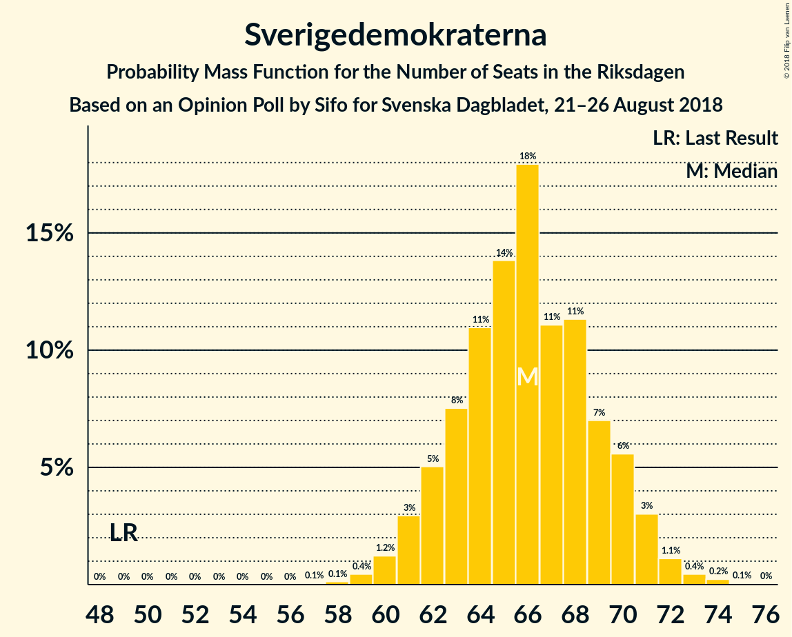

| Number of Seats | Probability | Accumulated | Special Marks |
|:---------------:|:-----------:|:-----------:|:-------------:|
| 49 | 0% | 100% | Last Result |
| 50 | 0% | 100% |  |
| 51 | 0% | 100% |  |
| 52 | 0% | 100% |  |
| 53 | 0% | 100% |  |
| 54 | 0% | 100% |  |
| 55 | 0% | 100% |  |
| 56 | 0% | 100% |  |
| 57 | 0.1% | 100% |  |
| 58 | 0.1% | 99.9% |  |
| 59 | 0.4% | 99.8% |  |
| 60 | 1.2% | 99.4% |  |
| 61 | 3% | 98% |  |
| 62 | 5% | 95% |  |
| 63 | 8% | 90% |  |
| 64 | 11% | 83% |  |
| 65 | 14% | 72% |  |
| 66 | 18% | 58% | Median |
| 67 | 11% | 40% |  |
| 68 | 11% | 29% |  |
| 69 | 7% | 17% |  |
| 70 | 6% | 10% |  |
| 71 | 3% | 5% |  |
| 72 | 1.1% | 2% |  |
| 73 | 0.4% | 0.8% |  |
| 74 | 0.2% | 0.3% |  |
| 75 | 0.1% | 0.1% |  |
| 76 | 0% | 0% |  |

### Moderata samlingspartiet

*For a full overview of the results for this party, see the [Moderata samlingspartiet](party-moderatasamlingspartiet.html) page.*

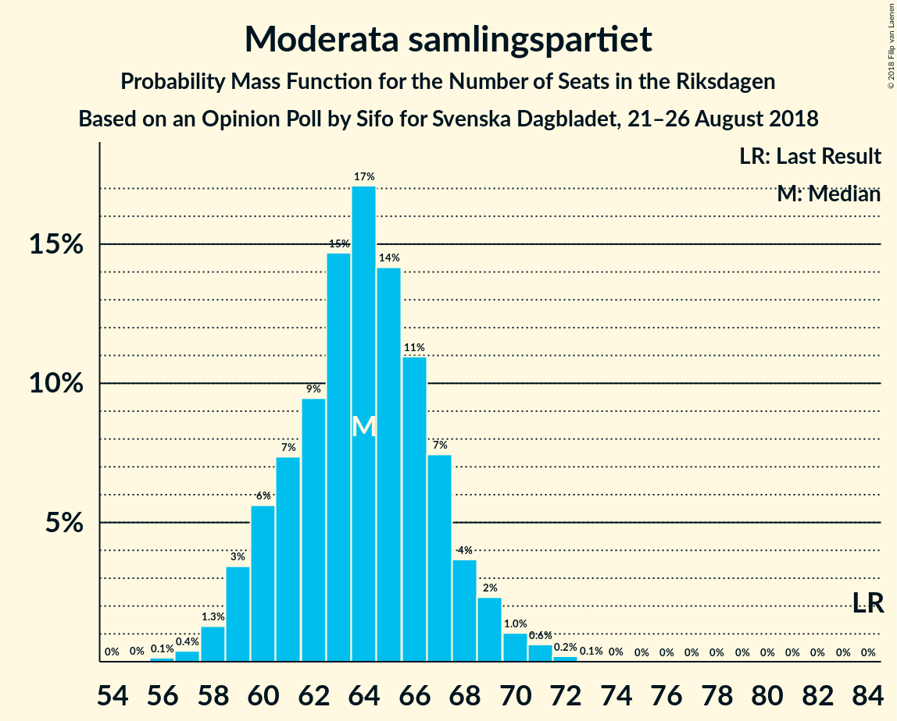

| Number of Seats | Probability | Accumulated | Special Marks |
|:---------------:|:-----------:|:-----------:|:-------------:|
| 55 | 0% | 100% |  |
| 56 | 0.1% | 99.9% |  |
| 57 | 0.4% | 99.8% |  |
| 58 | 1.3% | 99.4% |  |
| 59 | 3% | 98% |  |
| 60 | 6% | 95% |  |
| 61 | 7% | 89% |  |
| 62 | 9% | 82% |  |
| 63 | 15% | 72% |  |
| 64 | 17% | 58% | Median |
| 65 | 14% | 40% |  |
| 66 | 11% | 26% |  |
| 67 | 7% | 15% |  |
| 68 | 4% | 8% |  |
| 69 | 2% | 4% |  |
| 70 | 1.0% | 2% |  |
| 71 | 0.6% | 0.9% |  |
| 72 | 0.2% | 0.3% |  |
| 73 | 0.1% | 0.1% |  |
| 74 | 0% | 0% |  |
| 75 | 0% | 0% |  |
| 76 | 0% | 0% |  |
| 77 | 0% | 0% |  |
| 78 | 0% | 0% |  |
| 79 | 0% | 0% |  |
| 80 | 0% | 0% |  |
| 81 | 0% | 0% |  |
| 82 | 0% | 0% |  |
| 83 | 0% | 0% |  |
| 84 | 0% | 0% | Last Result |

### Centerpartiet

*For a full overview of the results for this party, see the [Centerpartiet](party-centerpartiet.html) page.*

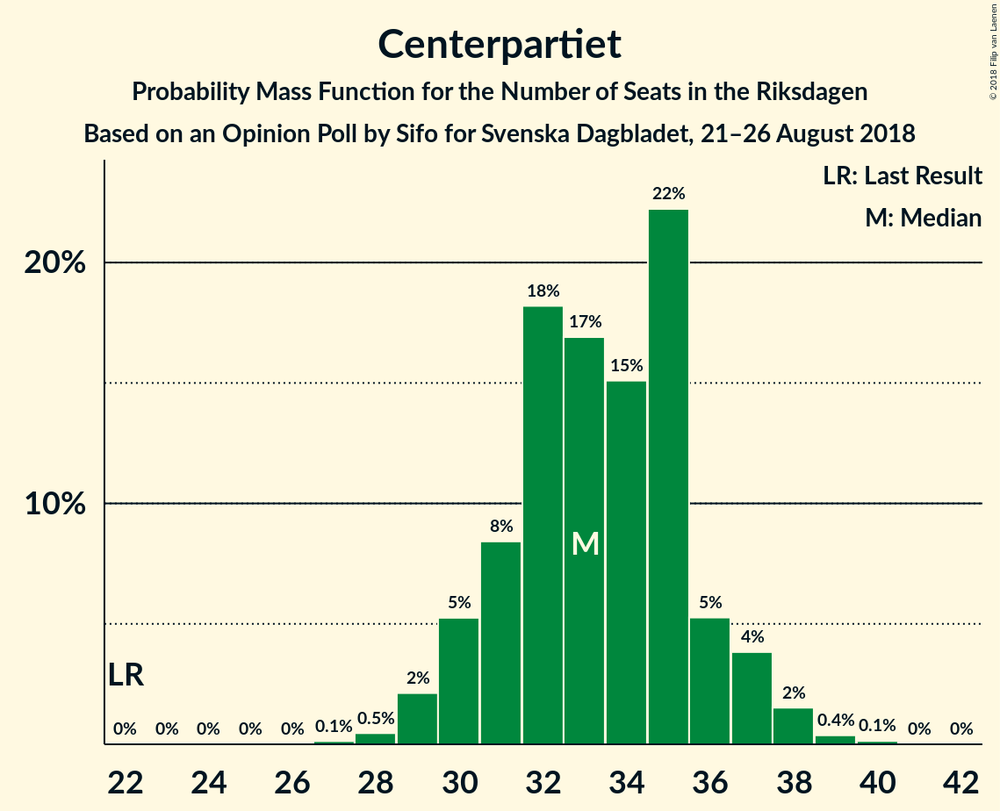

| Number of Seats | Probability | Accumulated | Special Marks |
|:---------------:|:-----------:|:-----------:|:-------------:|
| 22 | 0% | 100% | Last Result |
| 23 | 0% | 100% |  |
| 24 | 0% | 100% |  |
| 25 | 0% | 100% |  |
| 26 | 0% | 100% |  |
| 27 | 0.1% | 100% |  |
| 28 | 0.5% | 99.9% |  |
| 29 | 2% | 99.4% |  |
| 30 | 5% | 97% |  |
| 31 | 8% | 92% |  |
| 32 | 18% | 84% |  |
| 33 | 17% | 65% | Median |
| 34 | 15% | 48% |  |
| 35 | 22% | 33% |  |
| 36 | 5% | 11% |  |
| 37 | 4% | 6% |  |
| 38 | 2% | 2% |  |
| 39 | 0.4% | 0.5% |  |
| 40 | 0.1% | 0.2% |  |
| 41 | 0% | 0% |  |

### Vänsterpartiet

*For a full overview of the results for this party, see the [Vänsterpartiet](party-vänsterpartiet.html) page.*

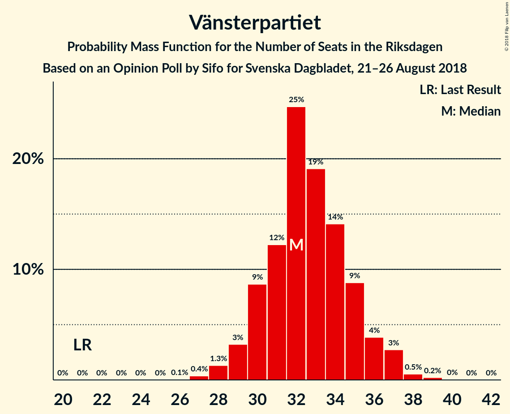

| Number of Seats | Probability | Accumulated | Special Marks |
|:---------------:|:-----------:|:-----------:|:-------------:|
| 21 | 0% | 100% | Last Result |
| 22 | 0% | 100% |  |
| 23 | 0% | 100% |  |
| 24 | 0% | 100% |  |
| 25 | 0% | 100% |  |
| 26 | 0.1% | 100% |  |
| 27 | 0.4% | 99.9% |  |
| 28 | 1.3% | 99.6% |  |
| 29 | 3% | 98% |  |
| 30 | 9% | 95% |  |
| 31 | 12% | 86% |  |
| 32 | 25% | 74% | Median |
| 33 | 19% | 49% |  |
| 34 | 14% | 30% |  |
| 35 | 9% | 16% |  |
| 36 | 4% | 7% |  |
| 37 | 3% | 4% |  |
| 38 | 0.5% | 0.8% |  |
| 39 | 0.2% | 0.3% |  |
| 40 | 0% | 0.1% |  |
| 41 | 0% | 0% |  |

### Miljöpartiet de gröna

*For a full overview of the results for this party, see the [Miljöpartiet de gröna](party-miljöpartietdegröna.html) page.*

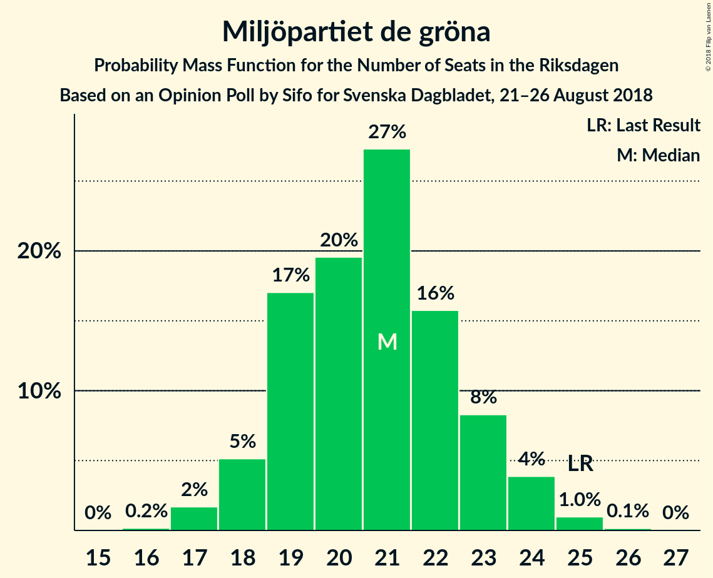

| Number of Seats | Probability | Accumulated | Special Marks |
|:---------------:|:-----------:|:-----------:|:-------------:|
| 16 | 0.2% | 100% |  |
| 17 | 2% | 99.8% |  |
| 18 | 5% | 98% |  |
| 19 | 17% | 93% |  |
| 20 | 20% | 76% |  |
| 21 | 27% | 56% | Median |
| 22 | 16% | 29% |  |
| 23 | 8% | 13% |  |
| 24 | 4% | 5% |  |
| 25 | 1.0% | 1.2% | Last Result |
| 26 | 0.1% | 0.2% |  |
| 27 | 0% | 0% |  |

### Liberalerna

*For a full overview of the results for this party, see the [Liberalerna](party-liberalerna.html) page.*

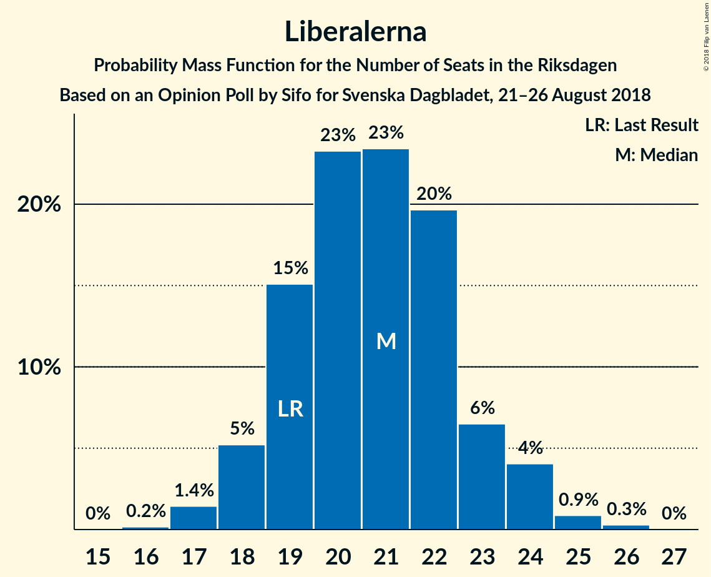

| Number of Seats | Probability | Accumulated | Special Marks |
|:---------------:|:-----------:|:-----------:|:-------------:|
| 16 | 0.2% | 100% |  |
| 17 | 1.4% | 99.8% |  |
| 18 | 5% | 98% |  |
| 19 | 15% | 93% | Last Result |
| 20 | 23% | 78% |  |
| 21 | 23% | 55% | Median |
| 22 | 20% | 31% |  |
| 23 | 6% | 12% |  |
| 24 | 4% | 5% |  |
| 25 | 0.9% | 1.2% |  |
| 26 | 0.3% | 0.3% |  |
| 27 | 0% | 0% |  |

### Kristdemokraterna

*For a full overview of the results for this party, see the [Kristdemokraterna](party-kristdemokraterna.html) page.*

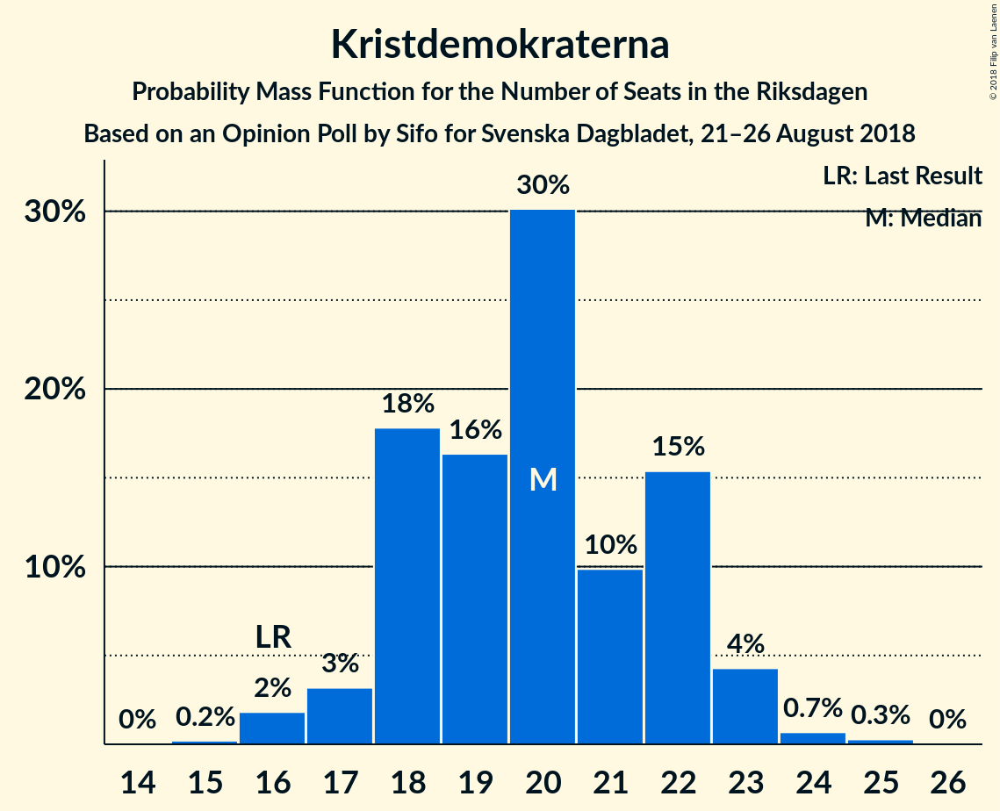

| Number of Seats | Probability | Accumulated | Special Marks |
|:---------------:|:-----------:|:-----------:|:-------------:|
| 15 | 0.2% | 100% |  |
| 16 | 2% | 99.8% | Last Result |
| 17 | 3% | 98% |  |
| 18 | 18% | 95% |  |
| 19 | 16% | 77% |  |
| 20 | 30% | 61% | Median |
| 21 | 10% | 30% |  |
| 22 | 15% | 21% |  |
| 23 | 4% | 5% |  |
| 24 | 0.7% | 1.0% |  |
| 25 | 0.3% | 0.3% |  |
| 26 | 0% | 0% |  |

## Coalitions

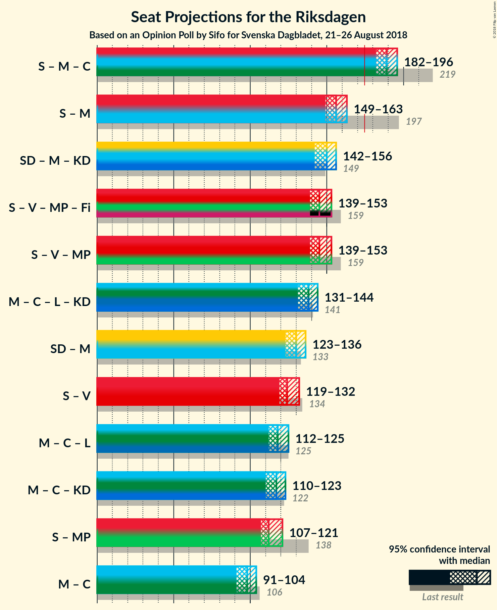

### Confidence Intervals

| Coalition | Last Result | Median | Majority? | 80% Confidence Interval | 90% Confidence Interval | 95% Confidence Interval | 99% Confidence Interval |
|:---------:|:-----------:|:------:|:---------:|:-----------------------:|:-----------------------:|:-----------------------:|:-----------------------:|
| Sveriges socialdemokratiska arbetareparti – Moderata samlingspartiet – Centerpartiet | 219 | 189 | 100% | 185–193 | 184–195 | 182–196 | 180–199 |
| Sveriges socialdemokratiska arbetareparti – Moderata samlingspartiet | 197 | 156 | 0% | 152–160 | 150–162 | 149–163 | 147–166 |
| Sverigedemokraterna – Moderata samlingspartiet – Kristdemokraterna | 149 | 150 | 0% | 144–154 | 143–155 | 142–156 | 140–158 |
| Sveriges socialdemokratiska arbetareparti – Vänsterpartiet – Miljöpartiet de gröna | 159 | 145 | 0% | 141–150 | 140–152 | 139–153 | 137–156 |
| Moderata samlingspartiet – Centerpartiet – Liberalerna – Kristdemokraterna | 141 | 138 | 0% | 133–142 | 132–143 | 131–144 | 128–146 |
| Sverigedemokraterna – Moderata samlingspartiet | 133 | 130 | 0% | 126–134 | 124–135 | 123–136 | 121–138 |
| Sveriges socialdemokratiska arbetareparti – Vänsterpartiet | 134 | 124 | 0% | 120–129 | 119–131 | 119–132 | 117–135 |
| Moderata samlingspartiet – Centerpartiet – Liberalerna | 125 | 118 | 0% | 114–122 | 112–123 | 112–125 | 110–126 |
| Moderata samlingspartiet – Centerpartiet – Kristdemokraterna | 122 | 117 | 0% | 113–121 | 111–122 | 110–123 | 108–125 |
| Sveriges socialdemokratiska arbetareparti – Miljöpartiet de gröna | 138 | 112 | 0% | 109–118 | 108–120 | 107–121 | 106–123 |
| Moderata samlingspartiet – Centerpartiet | 106 | 98 | 0% | 93–100 | 92–102 | 91–104 | 89–105 |

### Sveriges socialdemokratiska arbetareparti – Moderata samlingspartiet – Centerpartiet

| Number of Seats | Probability | Accumulated | Special Marks |
|:---------------:|:-----------:|:-----------:|:-------------:|
| 178 | 0.1% | 100% |  |
| 179 | 0.1% | 99.9% |  |
| 180 | 0.5% | 99.8% |  |
| 181 | 0.6% | 99.3% |  |
| 182 | 1.4% | 98.7% |  |
| 183 | 2% | 97% |  |
| 184 | 4% | 95% |  |
| 185 | 5% | 91% |  |
| 186 | 8% | 86% |  |
| 187 | 11% | 78% |  |
| 188 | 10% | 67% | Median |
| 189 | 11% | 57% |  |
| 190 | 11% | 47% |  |
| 191 | 17% | 35% |  |
| 192 | 5% | 19% |  |
| 193 | 5% | 14% |  |
| 194 | 3% | 9% |  |
| 195 | 2% | 6% |  |
| 196 | 2% | 4% |  |
| 197 | 1.1% | 2% |  |
| 198 | 0.5% | 1.1% |  |
| 199 | 0.4% | 0.6% |  |
| 200 | 0.1% | 0.2% |  |
| 201 | 0% | 0.1% |  |
| 202 | 0% | 0% |  |
| 203 | 0% | 0% |  |
| 204 | 0% | 0% |  |
| 205 | 0% | 0% |  |
| 206 | 0% | 0% |  |
| 207 | 0% | 0% |  |
| 208 | 0% | 0% |  |
| 209 | 0% | 0% |  |
| 210 | 0% | 0% |  |
| 211 | 0% | 0% |  |
| 212 | 0% | 0% |  |
| 213 | 0% | 0% |  |
| 214 | 0% | 0% |  |
| 215 | 0% | 0% |  |
| 216 | 0% | 0% |  |
| 217 | 0% | 0% |  |
| 218 | 0% | 0% |  |
| 219 | 0% | 0% | Last Result |

### Sveriges socialdemokratiska arbetareparti – Moderata samlingspartiet

| Number of Seats | Probability | Accumulated | Special Marks |
|:---------------:|:-----------:|:-----------:|:-------------:|
| 145 | 0% | 100% |  |
| 146 | 0.1% | 99.9% |  |
| 147 | 0.3% | 99.8% |  |
| 148 | 0.9% | 99.5% |  |
| 149 | 1.3% | 98.6% |  |
| 150 | 3% | 97% |  |
| 151 | 3% | 94% |  |
| 152 | 10% | 91% |  |
| 153 | 8% | 81% |  |
| 154 | 12% | 73% |  |
| 155 | 8% | 61% | Median |
| 156 | 17% | 53% |  |
| 157 | 10% | 36% |  |
| 158 | 7% | 26% |  |
| 159 | 5% | 19% |  |
| 160 | 5% | 14% |  |
| 161 | 4% | 9% |  |
| 162 | 2% | 5% |  |
| 163 | 1.3% | 4% |  |
| 164 | 1.1% | 2% |  |
| 165 | 0.7% | 1.2% |  |
| 166 | 0.2% | 0.5% |  |
| 167 | 0.2% | 0.3% |  |
| 168 | 0.1% | 0.1% |  |
| 169 | 0% | 0% |  |
| 170 | 0% | 0% |  |
| 171 | 0% | 0% |  |
| 172 | 0% | 0% |  |
| 173 | 0% | 0% |  |
| 174 | 0% | 0% |  |
| 175 | 0% | 0% | Majority |
| 176 | 0% | 0% |  |
| 177 | 0% | 0% |  |
| 178 | 0% | 0% |  |
| 179 | 0% | 0% |  |
| 180 | 0% | 0% |  |
| 181 | 0% | 0% |  |
| 182 | 0% | 0% |  |
| 183 | 0% | 0% |  |
| 184 | 0% | 0% |  |
| 185 | 0% | 0% |  |
| 186 | 0% | 0% |  |
| 187 | 0% | 0% |  |
| 188 | 0% | 0% |  |
| 189 | 0% | 0% |  |
| 190 | 0% | 0% |  |
| 191 | 0% | 0% |  |
| 192 | 0% | 0% |  |
| 193 | 0% | 0% |  |
| 194 | 0% | 0% |  |
| 195 | 0% | 0% |  |
| 196 | 0% | 0% |  |
| 197 | 0% | 0% | Last Result |

### Sverigedemokraterna – Moderata samlingspartiet – Kristdemokraterna

| Number of Seats | Probability | Accumulated | Special Marks |
|:---------------:|:-----------:|:-----------:|:-------------:|
| 137 | 0% | 100% |  |
| 138 | 0.1% | 99.9% |  |
| 139 | 0.2% | 99.8% |  |
| 140 | 0.2% | 99.6% |  |
| 141 | 0.5% | 99.3% |  |
| 142 | 2% | 98.9% |  |
| 143 | 3% | 97% |  |
| 144 | 5% | 95% |  |
| 145 | 2% | 89% |  |
| 146 | 2% | 87% |  |
| 147 | 4% | 85% |  |
| 148 | 19% | 81% |  |
| 149 | 11% | 62% | Last Result |
| 150 | 10% | 50% | Median |
| 151 | 7% | 40% |  |
| 152 | 7% | 33% |  |
| 153 | 8% | 27% |  |
| 154 | 10% | 19% |  |
| 155 | 5% | 9% |  |
| 156 | 3% | 4% |  |
| 157 | 0.4% | 1.1% |  |
| 158 | 0.3% | 0.6% |  |
| 159 | 0.2% | 0.3% |  |
| 160 | 0.1% | 0.2% |  |
| 161 | 0% | 0% |  |

### Sveriges socialdemokratiska arbetareparti – Vänsterpartiet – Miljöpartiet de gröna

| Number of Seats | Probability | Accumulated | Special Marks |
|:---------------:|:-----------:|:-----------:|:-------------:|
| 135 | 0% | 100% |  |
| 136 | 0.2% | 99.9% |  |
| 137 | 0.3% | 99.7% |  |
| 138 | 0.8% | 99.4% |  |
| 139 | 2% | 98.6% |  |
| 140 | 5% | 97% |  |
| 141 | 6% | 92% |  |
| 142 | 11% | 87% |  |
| 143 | 12% | 75% |  |
| 144 | 10% | 64% | Median |
| 145 | 17% | 54% |  |
| 146 | 8% | 37% |  |
| 147 | 5% | 29% |  |
| 148 | 6% | 24% |  |
| 149 | 4% | 18% |  |
| 150 | 4% | 13% |  |
| 151 | 3% | 9% |  |
| 152 | 2% | 6% |  |
| 153 | 1.3% | 4% |  |
| 154 | 1.2% | 2% |  |
| 155 | 0.6% | 1.1% |  |
| 156 | 0.3% | 0.5% |  |
| 157 | 0.1% | 0.2% |  |
| 158 | 0% | 0.1% |  |
| 159 | 0% | 0% | Last Result |

### Moderata samlingspartiet – Centerpartiet – Liberalerna – Kristdemokraterna

| Number of Seats | Probability | Accumulated | Special Marks |
|:---------------:|:-----------:|:-----------:|:-------------:|
| 126 | 0% | 100% |  |
| 127 | 0.1% | 99.9% |  |
| 128 | 0.4% | 99.8% |  |
| 129 | 0.5% | 99.4% |  |
| 130 | 0.9% | 98.9% |  |
| 131 | 2% | 98% |  |
| 132 | 3% | 96% |  |
| 133 | 4% | 93% |  |
| 134 | 7% | 89% |  |
| 135 | 5% | 83% |  |
| 136 | 8% | 78% |  |
| 137 | 11% | 70% |  |
| 138 | 14% | 59% | Median |
| 139 | 11% | 44% |  |
| 140 | 12% | 33% |  |
| 141 | 8% | 21% | Last Result |
| 142 | 4% | 12% |  |
| 143 | 4% | 8% |  |
| 144 | 2% | 5% |  |
| 145 | 1.3% | 2% |  |
| 146 | 0.6% | 1.0% |  |
| 147 | 0.2% | 0.4% |  |
| 148 | 0.1% | 0.2% |  |
| 149 | 0% | 0% |  |

### Sverigedemokraterna – Moderata samlingspartiet

| Number of Seats | Probability | Accumulated | Special Marks |
|:---------------:|:-----------:|:-----------:|:-------------:|
| 118 | 0% | 100% |  |
| 119 | 0.1% | 99.9% |  |
| 120 | 0.2% | 99.8% |  |
| 121 | 0.3% | 99.6% |  |
| 122 | 0.6% | 99.3% |  |
| 123 | 1.4% | 98.7% |  |
| 124 | 4% | 97% |  |
| 125 | 4% | 94% |  |
| 126 | 5% | 90% |  |
| 127 | 9% | 85% |  |
| 128 | 13% | 77% |  |
| 129 | 11% | 64% |  |
| 130 | 13% | 53% | Median |
| 131 | 8% | 40% |  |
| 132 | 6% | 32% |  |
| 133 | 9% | 26% | Last Result |
| 134 | 7% | 17% |  |
| 135 | 6% | 10% |  |
| 136 | 3% | 4% |  |
| 137 | 0.7% | 1.5% |  |
| 138 | 0.3% | 0.7% |  |
| 139 | 0.2% | 0.4% |  |
| 140 | 0.2% | 0.2% |  |
| 141 | 0% | 0.1% |  |
| 142 | 0% | 0% |  |

### Sveriges socialdemokratiska arbetareparti – Vänsterpartiet

| Number of Seats | Probability | Accumulated | Special Marks |
|:---------------:|:-----------:|:-----------:|:-------------:|
| 115 | 0.1% | 100% |  |
| 116 | 0.2% | 99.9% |  |
| 117 | 0.9% | 99.7% |  |
| 118 | 1.0% | 98.8% |  |
| 119 | 3% | 98% |  |
| 120 | 6% | 95% |  |
| 121 | 8% | 89% |  |
| 122 | 14% | 81% |  |
| 123 | 10% | 68% | Median |
| 124 | 15% | 58% |  |
| 125 | 12% | 43% |  |
| 126 | 8% | 31% |  |
| 127 | 7% | 24% |  |
| 128 | 4% | 17% |  |
| 129 | 4% | 13% |  |
| 130 | 3% | 9% |  |
| 131 | 2% | 6% |  |
| 132 | 1.5% | 4% |  |
| 133 | 1.2% | 2% |  |
| 134 | 0.7% | 1.3% | Last Result |
| 135 | 0.4% | 0.6% |  |
| 136 | 0.1% | 0.2% |  |
| 137 | 0.1% | 0.1% |  |
| 138 | 0% | 0% |  |

### Moderata samlingspartiet – Centerpartiet – Liberalerna

| Number of Seats | Probability | Accumulated | Special Marks |
|:---------------:|:-----------:|:-----------:|:-------------:|
| 107 | 0% | 100% |  |
| 108 | 0.1% | 99.9% |  |
| 109 | 0.2% | 99.8% |  |
| 110 | 0.8% | 99.6% |  |
| 111 | 1.2% | 98.7% |  |
| 112 | 3% | 98% |  |
| 113 | 4% | 95% |  |
| 114 | 4% | 90% |  |
| 115 | 6% | 86% |  |
| 116 | 10% | 80% |  |
| 117 | 10% | 69% |  |
| 118 | 13% | 60% | Median |
| 119 | 14% | 47% |  |
| 120 | 13% | 33% |  |
| 121 | 8% | 20% |  |
| 122 | 5% | 12% |  |
| 123 | 4% | 8% |  |
| 124 | 1.4% | 4% |  |
| 125 | 1.3% | 3% | Last Result |
| 126 | 0.8% | 1.3% |  |
| 127 | 0.2% | 0.4% |  |
| 128 | 0.1% | 0.2% |  |
| 129 | 0.1% | 0.1% |  |
| 130 | 0% | 0% |  |

### Moderata samlingspartiet – Centerpartiet – Kristdemokraterna

| Number of Seats | Probability | Accumulated | Special Marks |
|:---------------:|:-----------:|:-----------:|:-------------:|
| 106 | 0.1% | 100% |  |
| 107 | 0.3% | 99.9% |  |
| 108 | 0.6% | 99.6% |  |
| 109 | 1.2% | 99.0% |  |
| 110 | 1.4% | 98% |  |
| 111 | 3% | 96% |  |
| 112 | 2% | 94% |  |
| 113 | 6% | 92% |  |
| 114 | 7% | 86% |  |
| 115 | 7% | 79% |  |
| 116 | 8% | 72% |  |
| 117 | 15% | 64% | Median |
| 118 | 13% | 49% |  |
| 119 | 13% | 36% |  |
| 120 | 9% | 23% |  |
| 121 | 7% | 15% |  |
| 122 | 3% | 8% | Last Result |
| 123 | 2% | 4% |  |
| 124 | 1.2% | 2% |  |
| 125 | 0.7% | 1.0% |  |
| 126 | 0.2% | 0.4% |  |
| 127 | 0.1% | 0.1% |  |
| 128 | 0% | 0% |  |

### Sveriges socialdemokratiska arbetareparti – Miljöpartiet de gröna

| Number of Seats | Probability | Accumulated | Special Marks |
|:---------------:|:-----------:|:-----------:|:-------------:|
| 104 | 0% | 100% |  |
| 105 | 0.2% | 99.9% |  |
| 106 | 1.1% | 99.7% |  |
| 107 | 1.5% | 98.6% |  |
| 108 | 5% | 97% |  |
| 109 | 9% | 92% |  |
| 110 | 12% | 83% |  |
| 111 | 17% | 70% |  |
| 112 | 13% | 53% | Median |
| 113 | 14% | 40% |  |
| 114 | 5% | 26% |  |
| 115 | 3% | 21% |  |
| 116 | 3% | 18% |  |
| 117 | 2% | 15% |  |
| 118 | 3% | 13% |  |
| 119 | 3% | 9% |  |
| 120 | 3% | 6% |  |
| 121 | 2% | 4% |  |
| 122 | 0.7% | 2% |  |
| 123 | 0.6% | 0.9% |  |
| 124 | 0.2% | 0.2% |  |
| 125 | 0% | 0.1% |  |
| 126 | 0% | 0% |  |
| 127 | 0% | 0% |  |
| 128 | 0% | 0% |  |
| 129 | 0% | 0% |  |
| 130 | 0% | 0% |  |
| 131 | 0% | 0% |  |
| 132 | 0% | 0% |  |
| 133 | 0% | 0% |  |
| 134 | 0% | 0% |  |
| 135 | 0% | 0% |  |
| 136 | 0% | 0% |  |
| 137 | 0% | 0% |  |
| 138 | 0% | 0% | Last Result |

### Moderata samlingspartiet – Centerpartiet

| Number of Seats | Probability | Accumulated | Special Marks |
|:---------------:|:-----------:|:-----------:|:-------------:|
| 87 | 0% | 100% |  |
| 88 | 0.2% | 99.9% |  |
| 89 | 0.4% | 99.8% |  |
| 90 | 1.2% | 99.4% |  |
| 91 | 3% | 98% |  |
| 92 | 3% | 95% |  |
| 93 | 5% | 93% |  |
| 94 | 8% | 88% |  |
| 95 | 7% | 80% |  |
| 96 | 8% | 72% |  |
| 97 | 9% | 65% | Median |
| 98 | 16% | 56% |  |
| 99 | 20% | 39% |  |
| 100 | 10% | 19% |  |
| 101 | 3% | 9% |  |
| 102 | 2% | 6% |  |
| 103 | 2% | 5% |  |
| 104 | 2% | 3% |  |
| 105 | 0.8% | 1.2% |  |
| 106 | 0.3% | 0.4% | Last Result |
| 107 | 0.1% | 0.1% |  |
| 108 | 0% | 0% |  |

## Technical Information

### Opinion Poll

+ **Polling firm:** Sifo
+ **Commissioner(s):** Svenska Dagbladet
+ **Fieldwork period:** 21–26 August 2018

### Calculations

+ **Sample size:** 2699
+ **Simulations done:** 1,048,576
+ **Error estimate:** 1.49%

