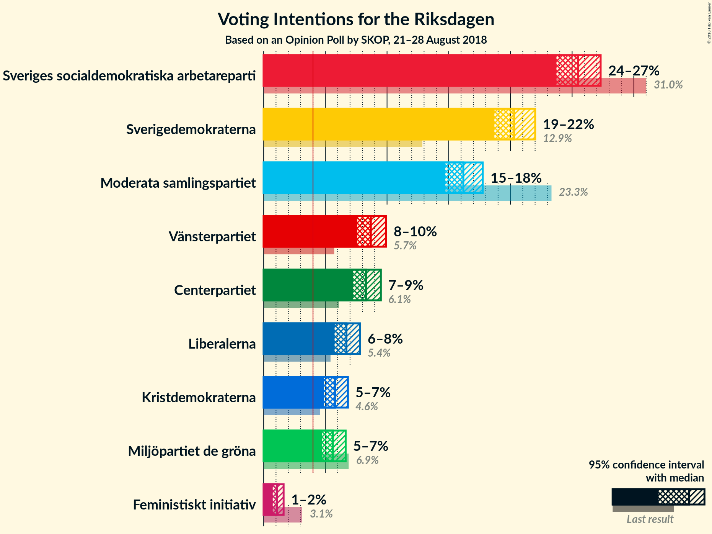
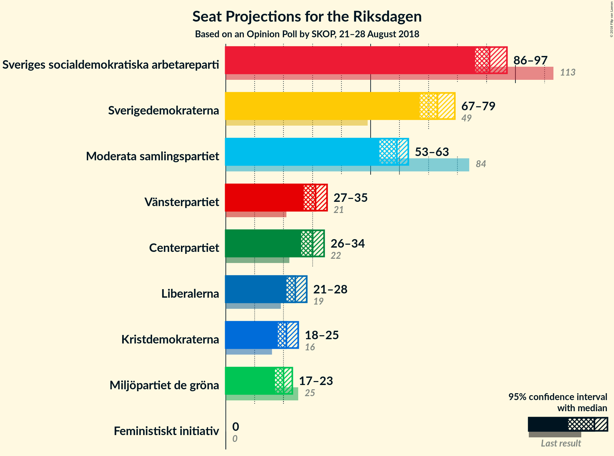
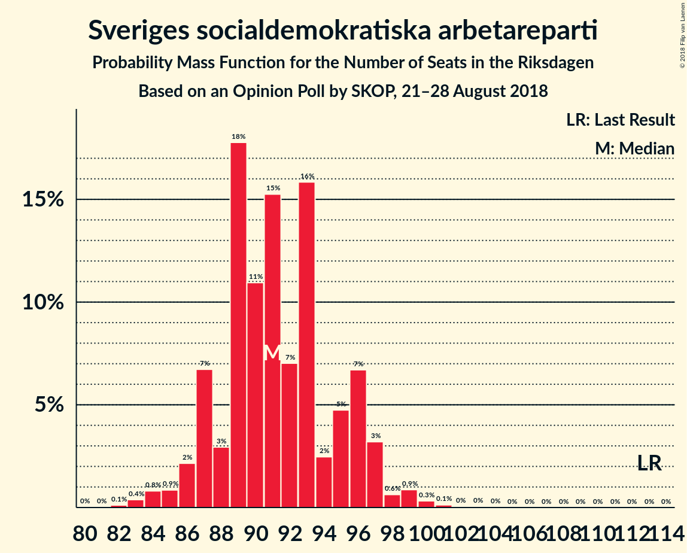
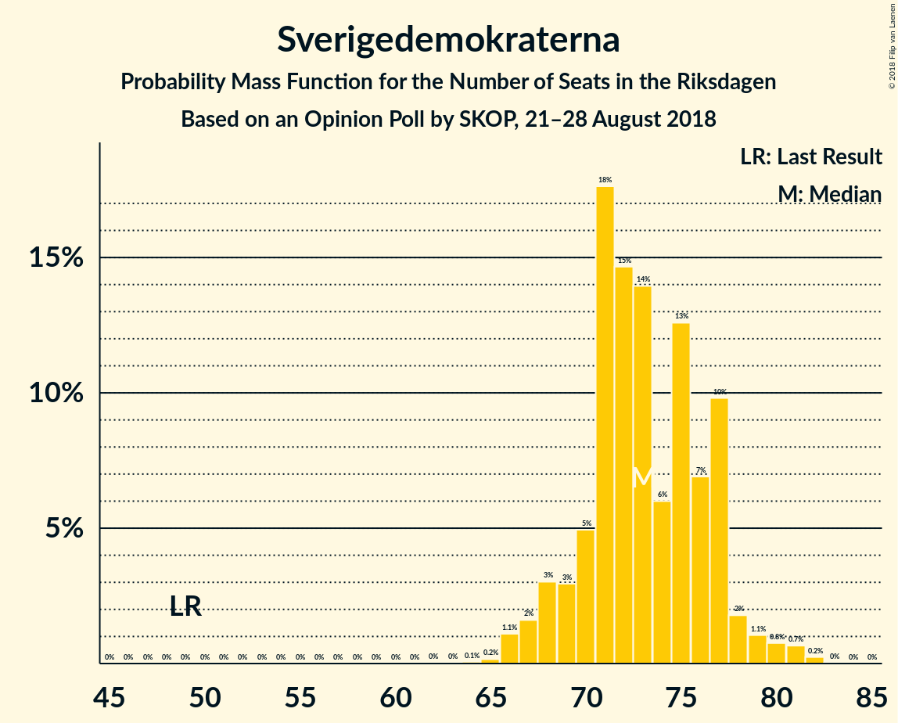
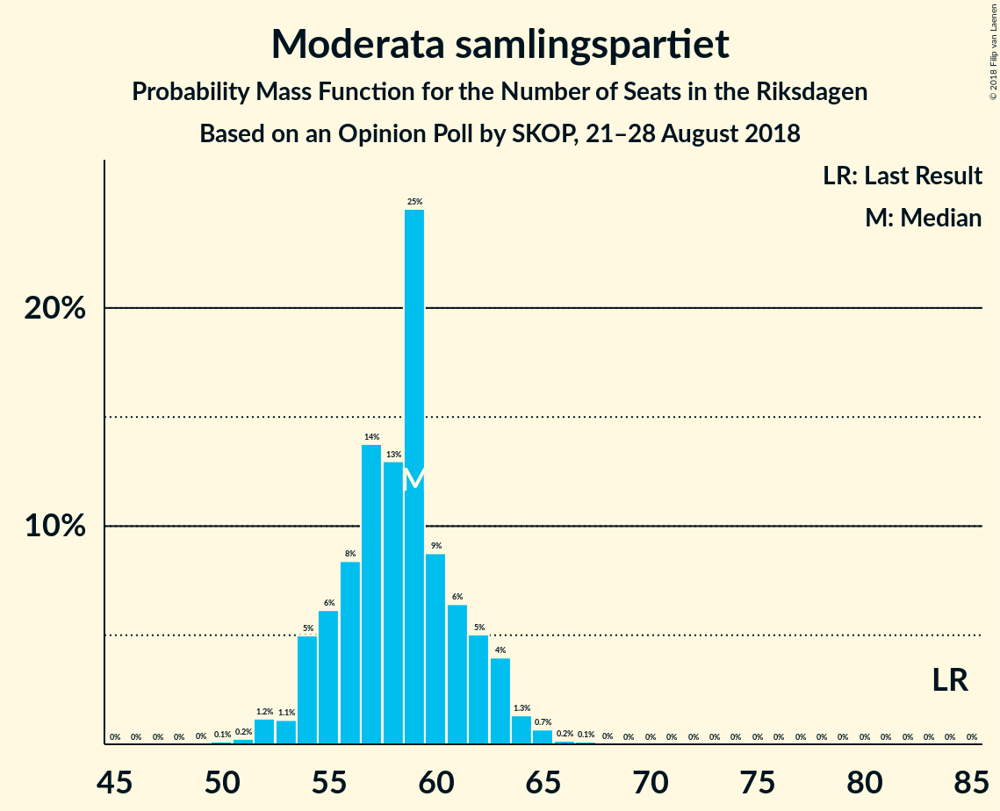
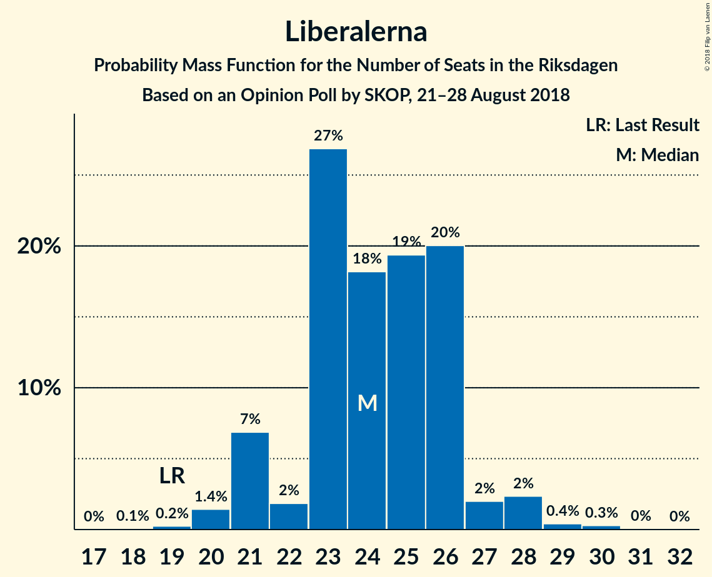
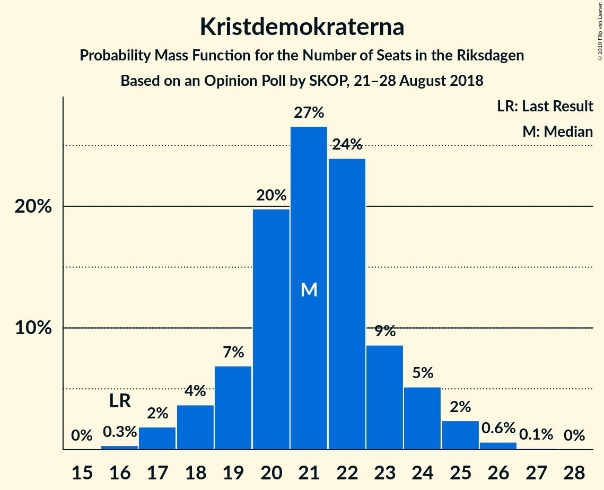
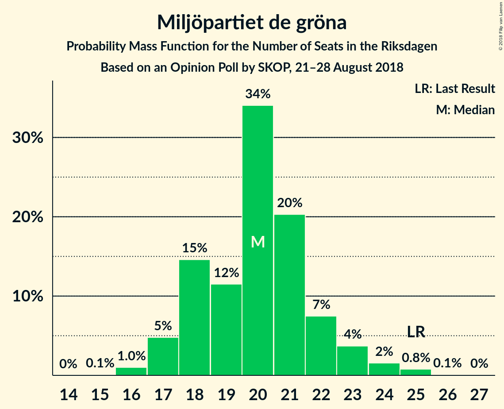
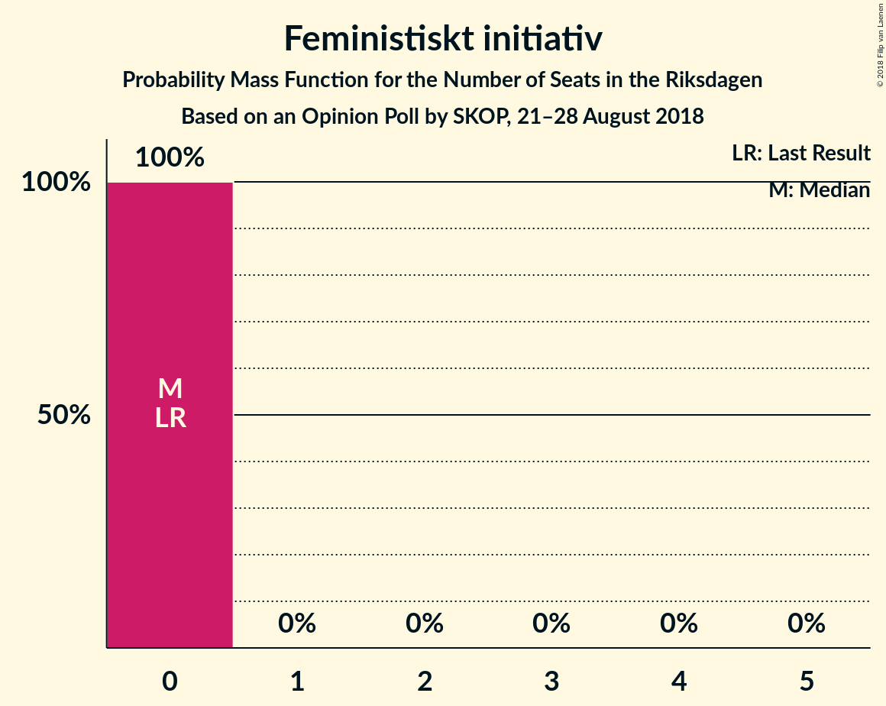
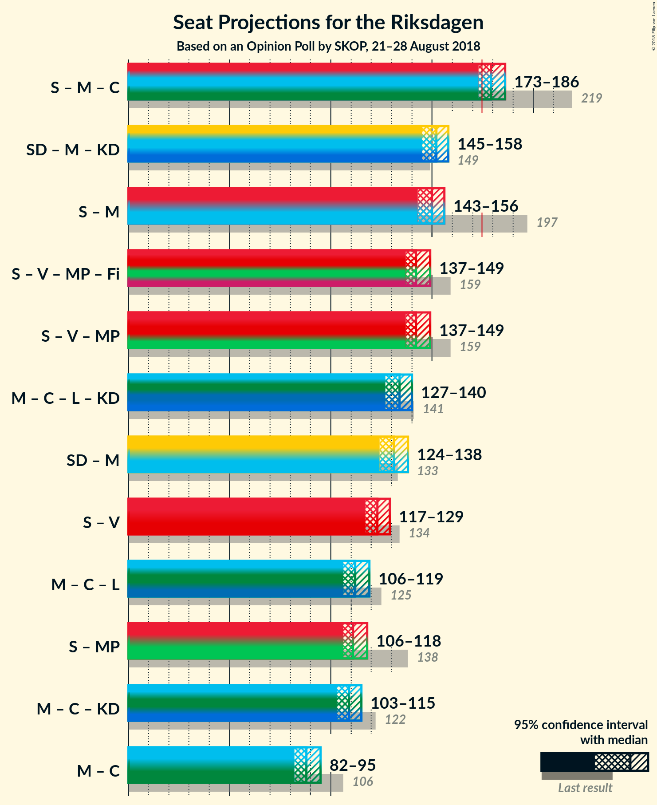

# Opinion Poll by SKOP, 21–28 August 2018

<a href="#voting-intentions">Voting Intentions</a> | <a href="#seats">Seats</a> | <a href="#coalitions">Coalitions</a> | <a href="#technical-information">Technical Information</a>

## Voting Intentions

### Confidence Intervals

| Party | Last Result | Poll Result | 80% Confidence Interval | 90% Confidence Interval | 95% Confidence Interval | 99% Confidence Interval |
|:-----:|:-----------:|:-----------:|:-----------------------:|:-----------------------:|:-----------------------:|:-----------------------:|
| Sveriges socialdemokratiska arbetareparti | 31.0% | 25.5% | 24.3–26.7% |24.0–27.0% |23.7–27.3% |23.2–27.9% |
| Sverigedemokraterna | 12.9% | 20.3% | 19.3–21.4% |19.0–21.7% |18.7–22.0% |18.2–22.6% |
| Moderata samlingspartiet | 23.3% | 16.2% | 15.2–17.2% |15.0–17.5% |14.7–17.8% |14.3–18.3% |
| Vänsterpartiet | 5.7% | 8.7% | 8.0–9.5% |7.8–9.7% |7.6–9.9% |7.3–10.3% |
| Centerpartiet | 6.1% | 8.3% | 7.6–9.1% |7.4–9.3% |7.2–9.5% |6.9–9.9% |
| Liberalerna | 5.4% | 6.7% | 6.1–7.4% |5.9–7.6% |5.7–7.8% |5.5–8.2% |
| Kristdemokraterna | 4.6% | 5.8% | 5.2–6.5% |5.0–6.7% |4.9–6.8% |4.6–7.2% |
| Miljöpartiet de gröna | 6.9% | 5.6% | 5.0–6.3% |4.9–6.5% |4.7–6.6% |4.5–7.0% |
| Feministiskt initiativ | 3.1% | 1.1% | 0.9–1.4% |0.8–1.5% |0.7–1.6% |0.6–1.8% |

*Note:* The poll result column reflects the actual value used in the calculations. Published results may vary slightly, and in addition be rounded to fewer digits.

## Seats

### Confidence Intervals

| Party | Last Result | Median | 80% Confidence Interval | 90% Confidence Interval | 95% Confidence Interval | 99% Confidence Interval |
|:-----:|:-----------:|:------:|:-----------------------:|:-----------------------:|:-----------------------:|:-----------------------:|
| <a href="#sveriges-socialdemokratiska-arbetareparti">Sveriges socialdemokratiska arbetareparti</a> | 113 | 91 | 87–96 |87–97 |86–97 |83–100 |
| <a href="#sverigedemokraterna">Sverigedemokraterna</a> | 49 | 73 | 70–77 |68–77 |67–79 |66–81 |
| <a href="#moderata-samlingspartiet">Moderata samlingspartiet</a> | 84 | 59 | 55–62 |54–63 |53–63 |52–65 |
| <a href="#vänsterpartiet">Vänsterpartiet</a> | 21 | 31 | 28–34 |28–35 |27–35 |26–37 |
| <a href="#centerpartiet">Centerpartiet</a> | 22 | 30 | 27–32 |27–33 |26–34 |25–35 |
| <a href="#liberalerna">Liberalerna</a> | 19 | 24 | 22–26 |21–27 |21–28 |20–29 |
| <a href="#kristdemokraterna">Kristdemokraterna</a> | 16 | 21 | 19–23 |18–24 |18–25 |17–26 |
| <a href="#miljöpartiet-de-gröna">Miljöpartiet de gröna</a> | 25 | 20 | 18–22 |17–23 |17–23 |16–25 |
| <a href="#feministiskt-initiativ">Feministiskt initiativ</a> | 0 | 0 | 0 |0 |0 |0 |

### Sveriges socialdemokratiska arbetareparti

*For a full overview of the results for this party, see the [Sveriges socialdemokratiska arbetareparti](party-sverigessocialdemokratiskaarbetareparti.html) page.*

| Number of Seats | Probability | Accumulated | Special Marks |
|:---------------:|:-----------:|:-----------:|:-------------:|
| 81 | 0% | 100% |  |
| 82 | 0.1% | 99.9% |  |
| 83 | 0.4% | 99.8% |  |
| 84 | 0.8% | 99.4% |  |
| 85 | 0.9% | 98.6% |  |
| 86 | 2% | 98% |  |
| 87 | 7% | 96% |  |
| 88 | 3% | 89% |  |
| 89 | 18% | 86% |  |
| 90 | 11% | 68% |  |
| 91 | 15% | 57% | Median |
| 92 | 7% | 42% |  |
| 93 | 16% | 35% |  |
| 94 | 2% | 19% |  |
| 95 | 5% | 17% |  |
| 96 | 7% | 12% |  |
| 97 | 3% | 5% |  |
| 98 | 0.6% | 2% |  |
| 99 | 0.9% | 1.4% |  |
| 100 | 0.3% | 0.5% |  |
| 101 | 0.1% | 0.2% |  |
| 102 | 0% | 0.1% |  |
| 103 | 0% | 0% |  |
| 104 | 0% | 0% |  |
| 105 | 0% | 0% |  |
| 106 | 0% | 0% |  |
| 107 | 0% | 0% |  |
| 108 | 0% | 0% |  |
| 109 | 0% | 0% |  |
| 110 | 0% | 0% |  |
| 111 | 0% | 0% |  |
| 112 | 0% | 0% |  |
| 113 | 0% | 0% | Last Result |

### Sverigedemokraterna

*For a full overview of the results for this party, see the [Sverigedemokraterna](party-sverigedemokraterna.html) page.*

| Number of Seats | Probability | Accumulated | Special Marks |
|:---------------:|:-----------:|:-----------:|:-------------:|
| 49 | 0% | 100% | Last Result |
| 50 | 0% | 100% |  |
| 51 | 0% | 100% |  |
| 52 | 0% | 100% |  |
| 53 | 0% | 100% |  |
| 54 | 0% | 100% |  |
| 55 | 0% | 100% |  |
| 56 | 0% | 100% |  |
| 57 | 0% | 100% |  |
| 58 | 0% | 100% |  |
| 59 | 0% | 100% |  |
| 60 | 0% | 100% |  |
| 61 | 0% | 100% |  |
| 62 | 0% | 100% |  |
| 63 | 0% | 100% |  |
| 64 | 0.1% | 100% |  |
| 65 | 0.2% | 99.9% |  |
| 66 | 1.1% | 99.7% |  |
| 67 | 2% | 98.6% |  |
| 68 | 3% | 97% |  |
| 69 | 3% | 94% |  |
| 70 | 5% | 91% |  |
| 71 | 18% | 86% |  |
| 72 | 15% | 68% |  |
| 73 | 14% | 54% | Median |
| 74 | 6% | 40% |  |
| 75 | 13% | 34% |  |
| 76 | 7% | 21% |  |
| 77 | 10% | 14% |  |
| 78 | 2% | 5% |  |
| 79 | 1.1% | 3% |  |
| 80 | 0.8% | 2% |  |
| 81 | 0.7% | 1.0% |  |
| 82 | 0.2% | 0.3% |  |
| 83 | 0% | 0.1% |  |
| 84 | 0% | 0% |  |

### Moderata samlingspartiet

*For a full overview of the results for this party, see the [Moderata samlingspartiet](party-moderatasamlingspartiet.html) page.*

| Number of Seats | Probability | Accumulated | Special Marks |
|:---------------:|:-----------:|:-----------:|:-------------:|
| 50 | 0.1% | 100% |  |
| 51 | 0.2% | 99.8% |  |
| 52 | 1.2% | 99.6% |  |
| 53 | 1.1% | 98% |  |
| 54 | 5% | 97% |  |
| 55 | 6% | 92% |  |
| 56 | 8% | 86% |  |
| 57 | 14% | 78% |  |
| 58 | 13% | 64% |  |
| 59 | 25% | 51% | Median |
| 60 | 9% | 27% |  |
| 61 | 6% | 18% |  |
| 62 | 5% | 11% |  |
| 63 | 4% | 6% |  |
| 64 | 1.3% | 2% |  |
| 65 | 0.7% | 1.0% |  |
| 66 | 0.2% | 0.3% |  |
| 67 | 0.1% | 0.2% |  |
| 68 | 0% | 0.1% |  |
| 69 | 0% | 0% |  |
| 70 | 0% | 0% |  |
| 71 | 0% | 0% |  |
| 72 | 0% | 0% |  |
| 73 | 0% | 0% |  |
| 74 | 0% | 0% |  |
| 75 | 0% | 0% |  |
| 76 | 0% | 0% |  |
| 77 | 0% | 0% |  |
| 78 | 0% | 0% |  |
| 79 | 0% | 0% |  |
| 80 | 0% | 0% |  |
| 81 | 0% | 0% |  |
| 82 | 0% | 0% |  |
| 83 | 0% | 0% |  |
| 84 | 0% | 0% | Last Result |

### Vänsterpartiet

*For a full overview of the results for this party, see the [Vänsterpartiet](party-vänsterpartiet.html) page.*

| Number of Seats | Probability | Accumulated | Special Marks |
|:---------------:|:-----------:|:-----------:|:-------------:|
| 21 | 0% | 100% | Last Result |
| 22 | 0% | 100% |  |
| 23 | 0% | 100% |  |
| 24 | 0% | 100% |  |
| 25 | 0.1% | 100% |  |
| 26 | 0.6% | 99.8% |  |
| 27 | 2% | 99.2% |  |
| 28 | 7% | 97% |  |
| 29 | 7% | 90% |  |
| 30 | 23% | 83% |  |
| 31 | 25% | 60% | Median |
| 32 | 12% | 36% |  |
| 33 | 6% | 24% |  |
| 34 | 12% | 18% |  |
| 35 | 4% | 6% |  |
| 36 | 1.3% | 2% |  |
| 37 | 0.3% | 0.5% |  |
| 38 | 0.2% | 0.2% |  |
| 39 | 0% | 0.1% |  |
| 40 | 0% | 0% |  |

### Centerpartiet

*For a full overview of the results for this party, see the [Centerpartiet](party-centerpartiet.html) page.*

| Number of Seats | Probability | Accumulated | Special Marks |
|:---------------:|:-----------:|:-----------:|:-------------:|
| 22 | 0% | 100% | Last Result |
| 23 | 0.1% | 100% |  |
| 24 | 0.2% | 99.9% |  |
| 25 | 0.6% | 99.8% |  |
| 26 | 3% | 99.1% |  |
| 27 | 13% | 96% |  |
| 28 | 10% | 83% |  |
| 29 | 17% | 73% |  |
| 30 | 15% | 56% | Median |
| 31 | 18% | 41% |  |
| 32 | 16% | 23% |  |
| 33 | 5% | 8% |  |
| 34 | 1.4% | 3% |  |
| 35 | 1.0% | 1.3% |  |
| 36 | 0.3% | 0.3% |  |
| 37 | 0.1% | 0.1% |  |
| 38 | 0% | 0% |  |

### Liberalerna

*For a full overview of the results for this party, see the [Liberalerna](party-liberalerna.html) page.*

| Number of Seats | Probability | Accumulated | Special Marks |
|:---------------:|:-----------:|:-----------:|:-------------:|
| 18 | 0.1% | 100% |  |
| 19 | 0.2% | 99.9% | Last Result |
| 20 | 1.4% | 99.7% |  |
| 21 | 7% | 98% |  |
| 22 | 2% | 91% |  |
| 23 | 27% | 90% |  |
| 24 | 18% | 63% | Median |
| 25 | 19% | 44% |  |
| 26 | 20% | 25% |  |
| 27 | 2% | 5% |  |
| 28 | 2% | 3% |  |
| 29 | 0.4% | 0.7% |  |
| 30 | 0.3% | 0.3% |  |
| 31 | 0% | 0.1% |  |
| 32 | 0% | 0% |  |

### Kristdemokraterna

*For a full overview of the results for this party, see the [Kristdemokraterna](party-kristdemokraterna.html) page.*

| Number of Seats | Probability | Accumulated | Special Marks |
|:---------------:|:-----------:|:-----------:|:-------------:|
| 16 | 0.3% | 100% | Last Result |
| 17 | 2% | 99.6% |  |
| 18 | 4% | 98% |  |
| 19 | 7% | 94% |  |
| 20 | 20% | 87% |  |
| 21 | 27% | 67% | Median |
| 22 | 24% | 41% |  |
| 23 | 9% | 17% |  |
| 24 | 5% | 8% |  |
| 25 | 2% | 3% |  |
| 26 | 0.6% | 0.7% |  |
| 27 | 0.1% | 0.1% |  |
| 28 | 0% | 0% |  |

### Miljöpartiet de gröna

*For a full overview of the results for this party, see the [Miljöpartiet de gröna](party-miljöpartietdegröna.html) page.*

| Number of Seats | Probability | Accumulated | Special Marks |
|:---------------:|:-----------:|:-----------:|:-------------:|
| 15 | 0.1% | 100% |  |
| 16 | 1.0% | 99.9% |  |
| 17 | 5% | 98.9% |  |
| 18 | 15% | 94% |  |
| 19 | 12% | 80% |  |
| 20 | 34% | 68% | Median |
| 21 | 20% | 34% |  |
| 22 | 7% | 14% |  |
| 23 | 4% | 6% |  |
| 24 | 2% | 2% |  |
| 25 | 0.8% | 0.9% | Last Result |
| 26 | 0.1% | 0.1% |  |
| 27 | 0% | 0% |  |

### Feministiskt initiativ

*For a full overview of the results for this party, see the [Feministiskt initiativ](party-feministisktinitiativ.html) page.*

| Number of Seats | Probability | Accumulated | Special Marks |
|:---------------:|:-----------:|:-----------:|:-------------:|
| 0 | 100% | 100% | Last Result, Median |

## Coalitions

### Confidence Intervals

| Coalition | Last Result | Median | Majority? | 80% Confidence Interval | 90% Confidence Interval | 95% Confidence Interval | 99% Confidence Interval |
|:---------:|:-----------:|:------:|:---------:|:-----------------------:|:-----------------------:|:-----------------------:|:-----------------------:|
| Sveriges socialdemokratiska arbetareparti – Moderata samlingspartiet – Centerpartiet | 219 | 179 | 90% | 175–183 | 174–185 | 173–186 | 170–189 |
| Sverigedemokraterna – Moderata samlingspartiet – Kristdemokraterna | 149 | 152 | 0% | 149–157 | 147–158 | 145–158 | 142–161 |
| Sveriges socialdemokratiska arbetareparti – Moderata samlingspartiet | 197 | 150 | 0% | 145–154 | 144–156 | 143–156 | 140–159 |
| Sveriges socialdemokratiska arbetareparti – Vänsterpartiet – Miljöpartiet de gröna – Feministiskt initiativ | 159 | 142 | 0% | 138–146 | 137–148 | 137–149 | 134–152 |
| Sveriges socialdemokratiska arbetareparti – Vänsterpartiet – Miljöpartiet de gröna | 159 | 142 | 0% | 138–146 | 137–148 | 137–149 | 134–152 |
| Moderata samlingspartiet – Centerpartiet – Liberalerna – Kristdemokraterna | 141 | 134 | 0% | 129–138 | 128–139 | 127–140 | 124–143 |
| Sverigedemokraterna – Moderata samlingspartiet | 133 | 131 | 0% | 127–136 | 126–137 | 124–138 | 122–140 |
| Sveriges socialdemokratiska arbetareparti – Vänsterpartiet | 134 | 123 | 0% | 118–127 | 117–128 | 117–129 | 114–132 |
| Moderata samlingspartiet – Centerpartiet – Liberalerna | 125 | 112 | 0% | 108–116 | 107–118 | 106–119 | 104–121 |
| Sveriges socialdemokratiska arbetareparti – Miljöpartiet de gröna | 138 | 111 | 0% | 107–115 | 106–117 | 106–118 | 103–121 |
| Moderata samlingspartiet – Centerpartiet – Kristdemokraterna | 122 | 109 | 0% | 105–112 | 104–115 | 103–115 | 100–118 |
| Moderata samlingspartiet – Centerpartiet | 106 | 88 | 0% | 84–92 | 83–93 | 82–95 | 80–96 |

### Sveriges socialdemokratiska arbetareparti – Moderata samlingspartiet – Centerpartiet

| Number of Seats | Probability | Accumulated | Special Marks |
|:---------------:|:-----------:|:-----------:|:-------------:|
| 167 | 0.1% | 100% |  |
| 168 | 0% | 99.9% |  |
| 169 | 0.1% | 99.9% |  |
| 170 | 0.9% | 99.8% |  |
| 171 | 0.5% | 98.9% |  |
| 172 | 0.8% | 98% |  |
| 173 | 2% | 98% |  |
| 174 | 5% | 95% |  |
| 175 | 2% | 90% | Majority |
| 176 | 6% | 88% |  |
| 177 | 12% | 82% |  |
| 178 | 3% | 70% |  |
| 179 | 20% | 67% |  |
| 180 | 13% | 47% | Median |
| 181 | 4% | 33% |  |
| 182 | 8% | 29% |  |
| 183 | 12% | 21% |  |
| 184 | 2% | 9% |  |
| 185 | 2% | 7% |  |
| 186 | 2% | 5% |  |
| 187 | 1.2% | 2% |  |
| 188 | 0.6% | 1.2% |  |
| 189 | 0.3% | 0.5% |  |
| 190 | 0.1% | 0.3% |  |
| 191 | 0.1% | 0.2% |  |
| 192 | 0% | 0.1% |  |
| 193 | 0% | 0% |  |
| 194 | 0% | 0% |  |
| 195 | 0% | 0% |  |
| 196 | 0% | 0% |  |
| 197 | 0% | 0% |  |
| 198 | 0% | 0% |  |
| 199 | 0% | 0% |  |
| 200 | 0% | 0% |  |
| 201 | 0% | 0% |  |
| 202 | 0% | 0% |  |
| 203 | 0% | 0% |  |
| 204 | 0% | 0% |  |
| 205 | 0% | 0% |  |
| 206 | 0% | 0% |  |
| 207 | 0% | 0% |  |
| 208 | 0% | 0% |  |
| 209 | 0% | 0% |  |
| 210 | 0% | 0% |  |
| 211 | 0% | 0% |  |
| 212 | 0% | 0% |  |
| 213 | 0% | 0% |  |
| 214 | 0% | 0% |  |
| 215 | 0% | 0% |  |
| 216 | 0% | 0% |  |
| 217 | 0% | 0% |  |
| 218 | 0% | 0% |  |
| 219 | 0% | 0% | Last Result |

### Sverigedemokraterna – Moderata samlingspartiet – Kristdemokraterna

| Number of Seats | Probability | Accumulated | Special Marks |
|:---------------:|:-----------:|:-----------:|:-------------:|
| 140 | 0.1% | 100% |  |
| 141 | 0.1% | 99.9% |  |
| 142 | 0.4% | 99.8% |  |
| 143 | 0.3% | 99.4% |  |
| 144 | 0.6% | 99.1% |  |
| 145 | 1.1% | 98.5% |  |
| 146 | 2% | 97% |  |
| 147 | 3% | 95% |  |
| 148 | 2% | 93% |  |
| 149 | 3% | 90% | Last Result |
| 150 | 7% | 87% |  |
| 151 | 25% | 80% |  |
| 152 | 9% | 55% |  |
| 153 | 7% | 46% | Median |
| 154 | 7% | 39% |  |
| 155 | 12% | 32% |  |
| 156 | 8% | 20% |  |
| 157 | 5% | 12% |  |
| 158 | 5% | 7% |  |
| 159 | 0.7% | 2% |  |
| 160 | 0.9% | 1.4% |  |
| 161 | 0.3% | 0.6% |  |
| 162 | 0.1% | 0.3% |  |
| 163 | 0.1% | 0.1% |  |
| 164 | 0% | 0.1% |  |
| 165 | 0% | 0% |  |

### Sveriges socialdemokratiska arbetareparti – Moderata samlingspartiet

| Number of Seats | Probability | Accumulated | Special Marks |
|:---------------:|:-----------:|:-----------:|:-------------:|
| 138 | 0% | 100% |  |
| 139 | 0.2% | 99.9% |  |
| 140 | 0.3% | 99.8% |  |
| 141 | 0.8% | 99.5% |  |
| 142 | 1.0% | 98.7% |  |
| 143 | 2% | 98% |  |
| 144 | 4% | 96% |  |
| 145 | 7% | 92% |  |
| 146 | 5% | 85% |  |
| 147 | 5% | 79% |  |
| 148 | 12% | 74% |  |
| 149 | 7% | 62% |  |
| 150 | 18% | 55% | Median |
| 151 | 6% | 38% |  |
| 152 | 13% | 31% |  |
| 153 | 6% | 18% |  |
| 154 | 4% | 12% |  |
| 155 | 3% | 8% |  |
| 156 | 3% | 6% |  |
| 157 | 0.8% | 2% |  |
| 158 | 0.9% | 2% |  |
| 159 | 0.2% | 0.7% |  |
| 160 | 0.4% | 0.5% |  |
| 161 | 0% | 0.1% |  |
| 162 | 0.1% | 0.1% |  |
| 163 | 0% | 0% |  |
| 164 | 0% | 0% |  |
| 165 | 0% | 0% |  |
| 166 | 0% | 0% |  |
| 167 | 0% | 0% |  |
| 168 | 0% | 0% |  |
| 169 | 0% | 0% |  |
| 170 | 0% | 0% |  |
| 171 | 0% | 0% |  |
| 172 | 0% | 0% |  |
| 173 | 0% | 0% |  |
| 174 | 0% | 0% |  |
| 175 | 0% | 0% | Majority |
| 176 | 0% | 0% |  |
| 177 | 0% | 0% |  |
| 178 | 0% | 0% |  |
| 179 | 0% | 0% |  |
| 180 | 0% | 0% |  |
| 181 | 0% | 0% |  |
| 182 | 0% | 0% |  |
| 183 | 0% | 0% |  |
| 184 | 0% | 0% |  |
| 185 | 0% | 0% |  |
| 186 | 0% | 0% |  |
| 187 | 0% | 0% |  |
| 188 | 0% | 0% |  |
| 189 | 0% | 0% |  |
| 190 | 0% | 0% |  |
| 191 | 0% | 0% |  |
| 192 | 0% | 0% |  |
| 193 | 0% | 0% |  |
| 194 | 0% | 0% |  |
| 195 | 0% | 0% |  |
| 196 | 0% | 0% |  |
| 197 | 0% | 0% | Last Result |

### Sveriges socialdemokratiska arbetareparti – Vänsterpartiet – Miljöpartiet de gröna – Feministiskt initiativ

| Number of Seats | Probability | Accumulated | Special Marks |
|:---------------:|:-----------:|:-----------:|:-------------:|
| 131 | 0% | 100% |  |
| 132 | 0.1% | 99.9% |  |
| 133 | 0.2% | 99.9% |  |
| 134 | 0.5% | 99.7% |  |
| 135 | 0.4% | 99.1% |  |
| 136 | 0.8% | 98.7% |  |
| 137 | 7% | 98% |  |
| 138 | 4% | 91% |  |
| 139 | 6% | 88% |  |
| 140 | 19% | 82% |  |
| 141 | 4% | 63% |  |
| 142 | 10% | 58% | Median |
| 143 | 7% | 48% |  |
| 144 | 6% | 41% |  |
| 145 | 21% | 35% |  |
| 146 | 5% | 14% |  |
| 147 | 3% | 9% |  |
| 148 | 2% | 6% |  |
| 149 | 1.4% | 4% |  |
| 150 | 0.8% | 2% |  |
| 151 | 0.9% | 2% |  |
| 152 | 0.3% | 0.8% |  |
| 153 | 0.3% | 0.5% |  |
| 154 | 0.1% | 0.2% |  |
| 155 | 0% | 0% |  |
| 156 | 0% | 0% |  |
| 157 | 0% | 0% |  |
| 158 | 0% | 0% |  |
| 159 | 0% | 0% | Last Result |

### Sveriges socialdemokratiska arbetareparti – Vänsterpartiet – Miljöpartiet de gröna

| Number of Seats | Probability | Accumulated | Special Marks |
|:---------------:|:-----------:|:-----------:|:-------------:|
| 131 | 0% | 100% |  |
| 132 | 0.1% | 99.9% |  |
| 133 | 0.2% | 99.9% |  |
| 134 | 0.5% | 99.7% |  |
| 135 | 0.4% | 99.1% |  |
| 136 | 0.8% | 98.7% |  |
| 137 | 7% | 98% |  |
| 138 | 4% | 91% |  |
| 139 | 6% | 88% |  |
| 140 | 19% | 82% |  |
| 141 | 4% | 63% |  |
| 142 | 10% | 58% | Median |
| 143 | 7% | 48% |  |
| 144 | 6% | 41% |  |
| 145 | 21% | 35% |  |
| 146 | 5% | 14% |  |
| 147 | 3% | 9% |  |
| 148 | 2% | 6% |  |
| 149 | 1.4% | 4% |  |
| 150 | 0.8% | 2% |  |
| 151 | 0.9% | 2% |  |
| 152 | 0.3% | 0.8% |  |
| 153 | 0.3% | 0.5% |  |
| 154 | 0.1% | 0.2% |  |
| 155 | 0% | 0% |  |
| 156 | 0% | 0% |  |
| 157 | 0% | 0% |  |
| 158 | 0% | 0% |  |
| 159 | 0% | 0% | Last Result |

### Moderata samlingspartiet – Centerpartiet – Liberalerna – Kristdemokraterna

| Number of Seats | Probability | Accumulated | Special Marks |
|:---------------:|:-----------:|:-----------:|:-------------:|
| 122 | 0% | 100% |  |
| 123 | 0.3% | 99.9% |  |
| 124 | 0.3% | 99.6% |  |
| 125 | 0.4% | 99.3% |  |
| 126 | 1.1% | 98.9% |  |
| 127 | 2% | 98% |  |
| 128 | 3% | 96% |  |
| 129 | 4% | 92% |  |
| 130 | 4% | 88% |  |
| 131 | 8% | 84% |  |
| 132 | 18% | 75% |  |
| 133 | 6% | 58% |  |
| 134 | 14% | 52% | Median |
| 135 | 9% | 37% |  |
| 136 | 9% | 28% |  |
| 137 | 3% | 19% |  |
| 138 | 11% | 16% |  |
| 139 | 3% | 5% |  |
| 140 | 1.2% | 3% |  |
| 141 | 0.5% | 1.4% | Last Result |
| 142 | 0.2% | 0.8% |  |
| 143 | 0.4% | 0.6% |  |
| 144 | 0.1% | 0.2% |  |
| 145 | 0% | 0.1% |  |
| 146 | 0% | 0% |  |

### Sverigedemokraterna – Moderata samlingspartiet

| Number of Seats | Probability | Accumulated | Special Marks |
|:---------------:|:-----------:|:-----------:|:-------------:|
| 120 | 0.1% | 100% |  |
| 121 | 0.3% | 99.9% |  |
| 122 | 0.2% | 99.5% |  |
| 123 | 0.6% | 99.3% |  |
| 124 | 2% | 98.7% |  |
| 125 | 0.9% | 97% |  |
| 126 | 4% | 96% |  |
| 127 | 3% | 93% |  |
| 128 | 6% | 90% |  |
| 129 | 10% | 84% |  |
| 130 | 11% | 74% |  |
| 131 | 18% | 63% |  |
| 132 | 12% | 45% | Median |
| 133 | 8% | 34% | Last Result |
| 134 | 8% | 25% |  |
| 135 | 5% | 17% |  |
| 136 | 6% | 12% |  |
| 137 | 3% | 7% |  |
| 138 | 2% | 4% |  |
| 139 | 0.6% | 1.1% |  |
| 140 | 0.2% | 0.5% |  |
| 141 | 0.2% | 0.3% |  |
| 142 | 0.1% | 0.1% |  |
| 143 | 0% | 0.1% |  |
| 144 | 0% | 0% |  |

### Sveriges socialdemokratiska arbetareparti – Vänsterpartiet

| Number of Seats | Probability | Accumulated | Special Marks |
|:---------------:|:-----------:|:-----------:|:-------------:|
| 111 | 0.1% | 100% |  |
| 112 | 0.1% | 99.9% |  |
| 113 | 0.3% | 99.9% |  |
| 114 | 0.3% | 99.6% |  |
| 115 | 0.6% | 99.3% |  |
| 116 | 1.1% | 98.7% |  |
| 117 | 5% | 98% |  |
| 118 | 5% | 93% |  |
| 119 | 14% | 88% |  |
| 120 | 11% | 74% |  |
| 121 | 6% | 63% |  |
| 122 | 7% | 57% | Median |
| 123 | 5% | 50% |  |
| 124 | 15% | 46% |  |
| 125 | 12% | 31% |  |
| 126 | 5% | 19% |  |
| 127 | 6% | 13% |  |
| 128 | 3% | 7% |  |
| 129 | 1.4% | 3% |  |
| 130 | 1.0% | 2% |  |
| 131 | 0.4% | 0.9% |  |
| 132 | 0.3% | 0.5% |  |
| 133 | 0.1% | 0.2% |  |
| 134 | 0% | 0.1% | Last Result |
| 135 | 0% | 0% |  |

### Moderata samlingspartiet – Centerpartiet – Liberalerna

| Number of Seats | Probability | Accumulated | Special Marks |
|:---------------:|:-----------:|:-----------:|:-------------:|
| 101 | 0% | 100% |  |
| 102 | 0.1% | 99.9% |  |
| 103 | 0.3% | 99.8% |  |
| 104 | 0.4% | 99.5% |  |
| 105 | 0.9% | 99.1% |  |
| 106 | 2% | 98% |  |
| 107 | 5% | 97% |  |
| 108 | 2% | 92% |  |
| 109 | 12% | 89% |  |
| 110 | 8% | 77% |  |
| 111 | 6% | 70% |  |
| 112 | 14% | 64% |  |
| 113 | 15% | 50% | Median |
| 114 | 6% | 35% |  |
| 115 | 11% | 29% |  |
| 116 | 10% | 18% |  |
| 117 | 2% | 8% |  |
| 118 | 2% | 6% |  |
| 119 | 2% | 4% |  |
| 120 | 1.3% | 2% |  |
| 121 | 0.3% | 0.7% |  |
| 122 | 0.3% | 0.4% |  |
| 123 | 0.1% | 0.1% |  |
| 124 | 0% | 0% |  |
| 125 | 0% | 0% | Last Result |

### Sveriges socialdemokratiska arbetareparti – Miljöpartiet de gröna

| Number of Seats | Probability | Accumulated | Special Marks |
|:---------------:|:-----------:|:-----------:|:-------------:|
| 101 | 0.1% | 100% |  |
| 102 | 0.3% | 99.9% |  |
| 103 | 0.4% | 99.6% |  |
| 104 | 0.5% | 99.3% |  |
| 105 | 0.7% | 98.8% |  |
| 106 | 7% | 98% |  |
| 107 | 3% | 91% |  |
| 108 | 2% | 88% |  |
| 109 | 7% | 86% |  |
| 110 | 23% | 78% |  |
| 111 | 18% | 55% | Median |
| 112 | 3% | 38% |  |
| 113 | 13% | 35% |  |
| 114 | 9% | 22% |  |
| 115 | 5% | 13% |  |
| 116 | 1.3% | 8% |  |
| 117 | 2% | 6% |  |
| 118 | 2% | 4% |  |
| 119 | 1.1% | 2% |  |
| 120 | 0.1% | 0.7% |  |
| 121 | 0.3% | 0.6% |  |
| 122 | 0.3% | 0.3% |  |
| 123 | 0% | 0% |  |
| 124 | 0% | 0% |  |
| 125 | 0% | 0% |  |
| 126 | 0% | 0% |  |
| 127 | 0% | 0% |  |
| 128 | 0% | 0% |  |
| 129 | 0% | 0% |  |
| 130 | 0% | 0% |  |
| 131 | 0% | 0% |  |
| 132 | 0% | 0% |  |
| 133 | 0% | 0% |  |
| 134 | 0% | 0% |  |
| 135 | 0% | 0% |  |
| 136 | 0% | 0% |  |
| 137 | 0% | 0% |  |
| 138 | 0% | 0% | Last Result |

### Moderata samlingspartiet – Centerpartiet – Kristdemokraterna

| Number of Seats | Probability | Accumulated | Special Marks |
|:---------------:|:-----------:|:-----------:|:-------------:|
| 98 | 0.1% | 100% |  |
| 99 | 0.1% | 99.9% |  |
| 100 | 0.3% | 99.8% |  |
| 101 | 0.6% | 99.4% |  |
| 102 | 1.2% | 98.9% |  |
| 103 | 1.4% | 98% |  |
| 104 | 2% | 96% |  |
| 105 | 5% | 94% |  |
| 106 | 5% | 89% |  |
| 107 | 5% | 84% |  |
| 108 | 20% | 78% |  |
| 109 | 17% | 59% |  |
| 110 | 3% | 42% | Median |
| 111 | 12% | 39% |  |
| 112 | 18% | 28% |  |
| 113 | 2% | 10% |  |
| 114 | 1.3% | 8% |  |
| 115 | 5% | 6% |  |
| 116 | 0.7% | 2% |  |
| 117 | 0.4% | 1.0% |  |
| 118 | 0.4% | 0.6% |  |
| 119 | 0.2% | 0.2% |  |
| 120 | 0% | 0.1% |  |
| 121 | 0% | 0% |  |
| 122 | 0% | 0% | Last Result |

### Moderata samlingspartiet – Centerpartiet

| Number of Seats | Probability | Accumulated | Special Marks |
|:---------------:|:-----------:|:-----------:|:-------------:|
| 78 | 0.1% | 100% |  |
| 79 | 0.1% | 99.9% |  |
| 80 | 0.6% | 99.8% |  |
| 81 | 0.5% | 99.2% |  |
| 82 | 2% | 98.7% |  |
| 83 | 1.4% | 96% |  |
| 84 | 5% | 95% |  |
| 85 | 4% | 90% |  |
| 86 | 16% | 85% |  |
| 87 | 9% | 69% |  |
| 88 | 21% | 61% |  |
| 89 | 3% | 40% | Median |
| 90 | 18% | 36% |  |
| 91 | 7% | 18% |  |
| 92 | 5% | 12% |  |
| 93 | 2% | 7% |  |
| 94 | 2% | 5% |  |
| 95 | 0.8% | 3% |  |
| 96 | 1.5% | 2% |  |
| 97 | 0.2% | 0.4% |  |
| 98 | 0.2% | 0.2% |  |
| 99 | 0% | 0.1% |  |
| 100 | 0% | 0% |  |
| 101 | 0% | 0% |  |
| 102 | 0% | 0% |  |
| 103 | 0% | 0% |  |
| 104 | 0% | 0% |  |
| 105 | 0% | 0% |  |
| 106 | 0% | 0% | Last Result |

## Technical Information

### Opinion Poll

+ **Polling firm:** SKOP
+ **Commissioner(s):** —
+ **Fieldwork period:** 21–28 August 2018

### Calculations

+ **Sample size:** 2280
+ **Simulations done:** 1,048,576
+ **Error estimate:** 1.04%

