# Opinion Poll by SKOP, 26 August–2 September 2018

<a href="#voting-intentions">Voting Intentions</a> | <a href="#seats">Seats</a> | <a href="#coalitions">Coalitions</a> | <a href="#technical-information">Technical Information</a>

## Voting Intentions

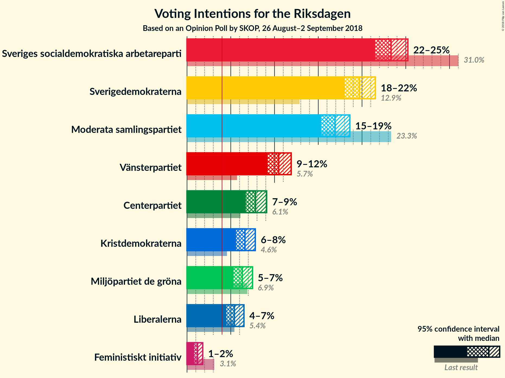

### Confidence Intervals

| Party | Last Result | Poll Result | 80% Confidence Interval | 90% Confidence Interval | 95% Confidence Interval | 99% Confidence Interval |
|:-----:|:-----------:|:-----------:|:-----------------------:|:-----------------------:|:-----------------------:|:-----------------------:|
| Sveriges socialdemokratiska arbetareparti | 31.0% | 23.3% | 22.1–24.6% |21.8–24.9% |21.5–25.2% |21.0–25.8% |
| Sverigedemokraterna | 12.9% | 19.7% | 18.6–20.9% |18.3–21.2% |18.0–21.5% |17.5–22.1% |
| Moderata samlingspartiet | 23.3% | 16.9% | 15.9–18.0% |15.6–18.3% |15.3–18.6% |14.8–19.2% |
| Vänsterpartiet | 5.7% | 10.5% | 9.6–11.4% |9.4–11.7% |9.2–11.9% |8.8–12.4% |
| Centerpartiet | 6.1% | 7.8% | 7.1–8.7% |6.9–8.9% |6.7–9.1% |6.4–9.5% |
| Kristdemokraterna | 4.6% | 6.6% | 5.9–7.4% |5.8–7.6% |5.6–7.8% |5.3–8.2% |
| Miljöpartiet de gröna | 6.9% | 6.3% | 5.7–7.1% |5.5–7.3% |5.3–7.5% |5.0–7.9% |
| Liberalerna | 5.4% | 5.4% | 4.8–6.1% |4.6–6.3% |4.5–6.5% |4.2–6.9% |
| Feministiskt initiativ | 3.1% | 1.2% | 0.9–1.6% |0.9–1.7% |0.8–1.8% |0.7–2.0% |

*Note:* The poll result column reflects the actual value used in the calculations. Published results may vary slightly, and in addition be rounded to fewer digits.

## Seats

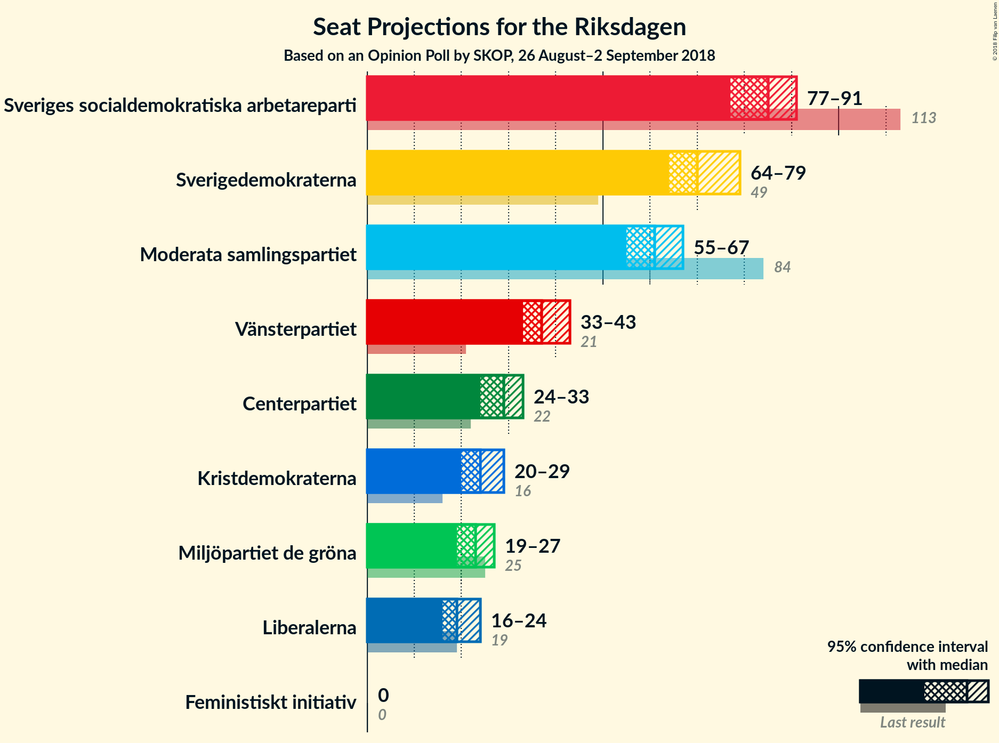

### Confidence Intervals

| Party | Last Result | Median | 80% Confidence Interval | 90% Confidence Interval | 95% Confidence Interval | 99% Confidence Interval |
|:-----:|:-----------:|:------:|:-----------------------:|:-----------------------:|:-----------------------:|:-----------------------:|
| <a href="#sveriges-socialdemokratiska-arbetareparti">Sveriges socialdemokratiska arbetareparti</a> | 113 | 85 | 80–89 |79–90 |77–91 |75–94 |
| <a href="#sverigedemokraterna">Sverigedemokraterna</a> | 49 | 70 | 66–76 |65–77 |64–79 |62–80 |
| <a href="#moderata-samlingspartiet">Moderata samlingspartiet</a> | 84 | 61 | 57–65 |56–66 |55–67 |53–69 |
| <a href="#vänsterpartiet">Vänsterpartiet</a> | 21 | 37 | 34–41 |33–42 |33–43 |31–45 |
| <a href="#centerpartiet">Centerpartiet</a> | 22 | 29 | 25–32 |24–33 |24–33 |22–35 |
| <a href="#kristdemokraterna">Kristdemokraterna</a> | 16 | 24 | 22–27 |21–28 |20–29 |19–30 |
| <a href="#miljöpartiet-de-gröna">Miljöpartiet de gröna</a> | 25 | 23 | 20–26 |20–26 |19–27 |18–29 |
| <a href="#liberalerna">Liberalerna</a> | 19 | 19 | 17–22 |17–23 |16–24 |15–25 |
| <a href="#feministiskt-initiativ">Feministiskt initiativ</a> | 0 | 0 | 0 |0 |0 |0 |

### Sveriges socialdemokratiska arbetareparti

*For a full overview of the results for this party, see the [Sveriges socialdemokratiska arbetareparti](party-sverigessocialdemokratiskaarbetareparti.html) page.*

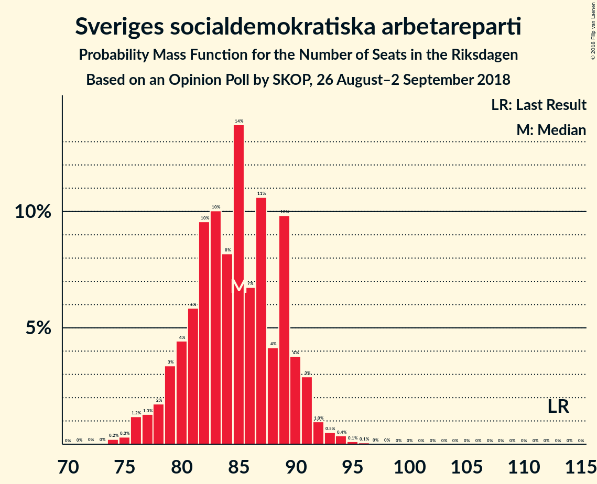

| Number of Seats | Probability | Accumulated | Special Marks |
|:---------------:|:-----------:|:-----------:|:-------------:|
| 72 | 0% | 100% |  |
| 73 | 0% | 99.9% |  |
| 74 | 0.2% | 99.9% |  |
| 75 | 0.3% | 99.7% |  |
| 76 | 1.2% | 99.4% |  |
| 77 | 1.3% | 98% |  |
| 78 | 2% | 97% |  |
| 79 | 3% | 95% |  |
| 80 | 4% | 92% |  |
| 81 | 6% | 87% |  |
| 82 | 10% | 82% |  |
| 83 | 10% | 72% |  |
| 84 | 8% | 62% |  |
| 85 | 14% | 54% | Median |
| 86 | 7% | 40% |  |
| 87 | 11% | 33% |  |
| 88 | 4% | 23% |  |
| 89 | 10% | 19% |  |
| 90 | 4% | 9% |  |
| 91 | 3% | 5% |  |
| 92 | 1.0% | 2% |  |
| 93 | 0.5% | 1.1% |  |
| 94 | 0.4% | 0.6% |  |
| 95 | 0.1% | 0.2% |  |
| 96 | 0.1% | 0.1% |  |
| 97 | 0% | 0% |  |
| 98 | 0% | 0% |  |
| 99 | 0% | 0% |  |
| 100 | 0% | 0% |  |
| 101 | 0% | 0% |  |
| 102 | 0% | 0% |  |
| 103 | 0% | 0% |  |
| 104 | 0% | 0% |  |
| 105 | 0% | 0% |  |
| 106 | 0% | 0% |  |
| 107 | 0% | 0% |  |
| 108 | 0% | 0% |  |
| 109 | 0% | 0% |  |
| 110 | 0% | 0% |  |
| 111 | 0% | 0% |  |
| 112 | 0% | 0% |  |
| 113 | 0% | 0% | Last Result |

### Sverigedemokraterna

*For a full overview of the results for this party, see the [Sverigedemokraterna](party-sverigedemokraterna.html) page.*

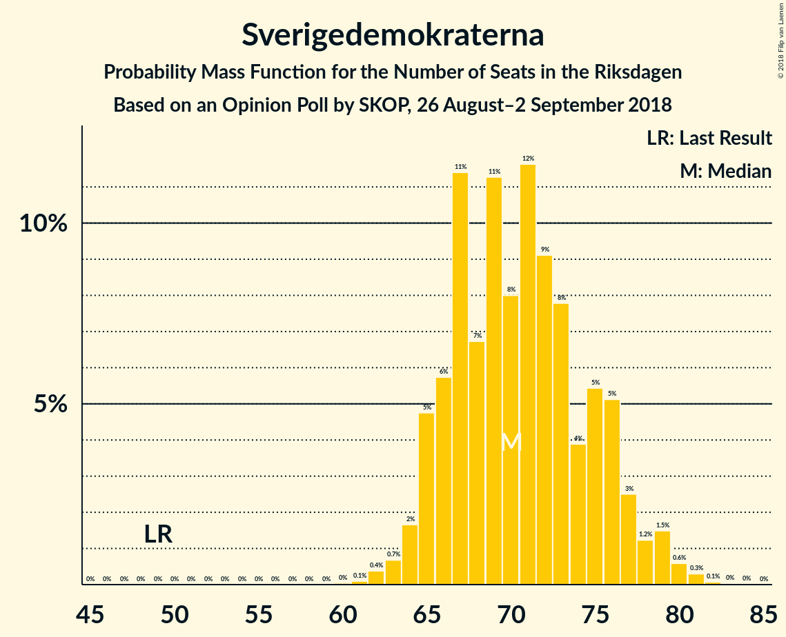

| Number of Seats | Probability | Accumulated | Special Marks |
|:---------------:|:-----------:|:-----------:|:-------------:|
| 49 | 0% | 100% | Last Result |
| 50 | 0% | 100% |  |
| 51 | 0% | 100% |  |
| 52 | 0% | 100% |  |
| 53 | 0% | 100% |  |
| 54 | 0% | 100% |  |
| 55 | 0% | 100% |  |
| 56 | 0% | 100% |  |
| 57 | 0% | 100% |  |
| 58 | 0% | 100% |  |
| 59 | 0% | 100% |  |
| 60 | 0% | 100% |  |
| 61 | 0.1% | 99.9% |  |
| 62 | 0.4% | 99.8% |  |
| 63 | 0.7% | 99.5% |  |
| 64 | 2% | 98.8% |  |
| 65 | 5% | 97% |  |
| 66 | 6% | 92% |  |
| 67 | 11% | 87% |  |
| 68 | 7% | 75% |  |
| 69 | 11% | 68% |  |
| 70 | 8% | 57% | Median |
| 71 | 12% | 49% |  |
| 72 | 9% | 38% |  |
| 73 | 8% | 28% |  |
| 74 | 4% | 21% |  |
| 75 | 5% | 17% |  |
| 76 | 5% | 11% |  |
| 77 | 3% | 6% |  |
| 78 | 1.2% | 4% |  |
| 79 | 1.5% | 3% |  |
| 80 | 0.6% | 1.0% |  |
| 81 | 0.3% | 0.4% |  |
| 82 | 0.1% | 0.1% |  |
| 83 | 0% | 0.1% |  |
| 84 | 0% | 0% |  |

### Moderata samlingspartiet

*For a full overview of the results for this party, see the [Moderata samlingspartiet](party-moderatasamlingspartiet.html) page.*

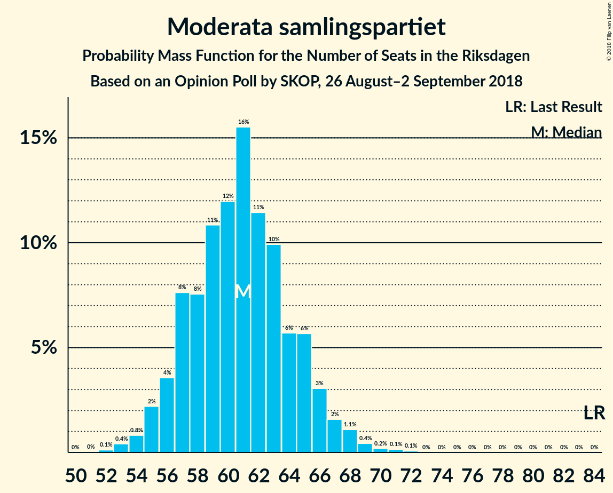

| Number of Seats | Probability | Accumulated | Special Marks |
|:---------------:|:-----------:|:-----------:|:-------------:|
| 51 | 0% | 100% |  |
| 52 | 0.1% | 99.9% |  |
| 53 | 0.4% | 99.8% |  |
| 54 | 0.8% | 99.4% |  |
| 55 | 2% | 98.6% |  |
| 56 | 4% | 96% |  |
| 57 | 8% | 93% |  |
| 58 | 8% | 85% |  |
| 59 | 11% | 78% |  |
| 60 | 12% | 67% |  |
| 61 | 16% | 55% | Median |
| 62 | 11% | 39% |  |
| 63 | 10% | 28% |  |
| 64 | 6% | 18% |  |
| 65 | 6% | 12% |  |
| 66 | 3% | 7% |  |
| 67 | 2% | 4% |  |
| 68 | 1.1% | 2% |  |
| 69 | 0.4% | 0.9% |  |
| 70 | 0.2% | 0.4% |  |
| 71 | 0.1% | 0.2% |  |
| 72 | 0.1% | 0.1% |  |
| 73 | 0% | 0% |  |
| 74 | 0% | 0% |  |
| 75 | 0% | 0% |  |
| 76 | 0% | 0% |  |
| 77 | 0% | 0% |  |
| 78 | 0% | 0% |  |
| 79 | 0% | 0% |  |
| 80 | 0% | 0% |  |
| 81 | 0% | 0% |  |
| 82 | 0% | 0% |  |
| 83 | 0% | 0% |  |
| 84 | 0% | 0% | Last Result |

### Vänsterpartiet

*For a full overview of the results for this party, see the [Vänsterpartiet](party-vänsterpartiet.html) page.*

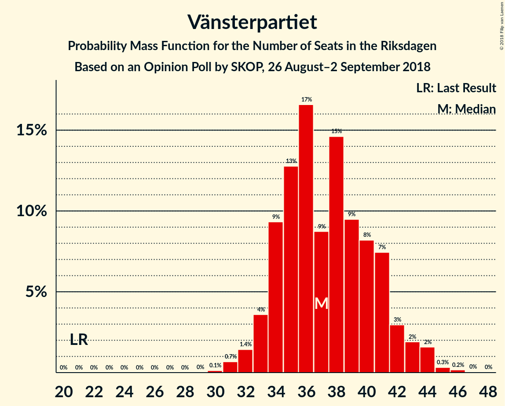

| Number of Seats | Probability | Accumulated | Special Marks |
|:---------------:|:-----------:|:-----------:|:-------------:|
| 21 | 0% | 100% | Last Result |
| 22 | 0% | 100% |  |
| 23 | 0% | 100% |  |
| 24 | 0% | 100% |  |
| 25 | 0% | 100% |  |
| 26 | 0% | 100% |  |
| 27 | 0% | 100% |  |
| 28 | 0% | 100% |  |
| 29 | 0% | 100% |  |
| 30 | 0.1% | 100% |  |
| 31 | 0.7% | 99.9% |  |
| 32 | 1.4% | 99.2% |  |
| 33 | 4% | 98% |  |
| 34 | 9% | 94% |  |
| 35 | 13% | 85% |  |
| 36 | 17% | 72% |  |
| 37 | 9% | 55% | Median |
| 38 | 15% | 47% |  |
| 39 | 9% | 32% |  |
| 40 | 8% | 23% |  |
| 41 | 7% | 14% |  |
| 42 | 3% | 7% |  |
| 43 | 2% | 4% |  |
| 44 | 2% | 2% |  |
| 45 | 0.3% | 0.6% |  |
| 46 | 0.2% | 0.2% |  |
| 47 | 0% | 0.1% |  |
| 48 | 0% | 0% |  |

### Centerpartiet

*For a full overview of the results for this party, see the [Centerpartiet](party-centerpartiet.html) page.*

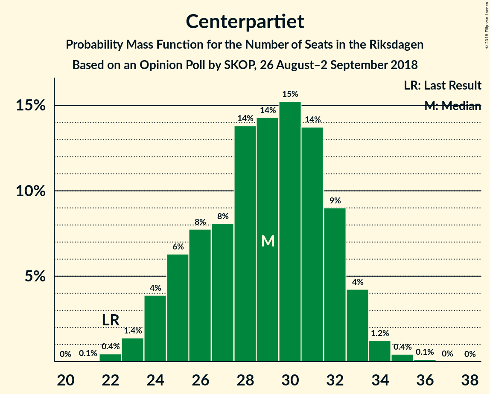

| Number of Seats | Probability | Accumulated | Special Marks |
|:---------------:|:-----------:|:-----------:|:-------------:|
| 21 | 0.1% | 100% |  |
| 22 | 0.4% | 99.9% | Last Result |
| 23 | 1.4% | 99.5% |  |
| 24 | 4% | 98% |  |
| 25 | 6% | 94% |  |
| 26 | 8% | 88% |  |
| 27 | 8% | 80% |  |
| 28 | 14% | 72% |  |
| 29 | 14% | 58% | Median |
| 30 | 15% | 44% |  |
| 31 | 14% | 29% |  |
| 32 | 9% | 15% |  |
| 33 | 4% | 6% |  |
| 34 | 1.2% | 2% |  |
| 35 | 0.4% | 0.6% |  |
| 36 | 0.1% | 0.2% |  |
| 37 | 0% | 0% |  |

### Kristdemokraterna

*For a full overview of the results for this party, see the [Kristdemokraterna](party-kristdemokraterna.html) page.*

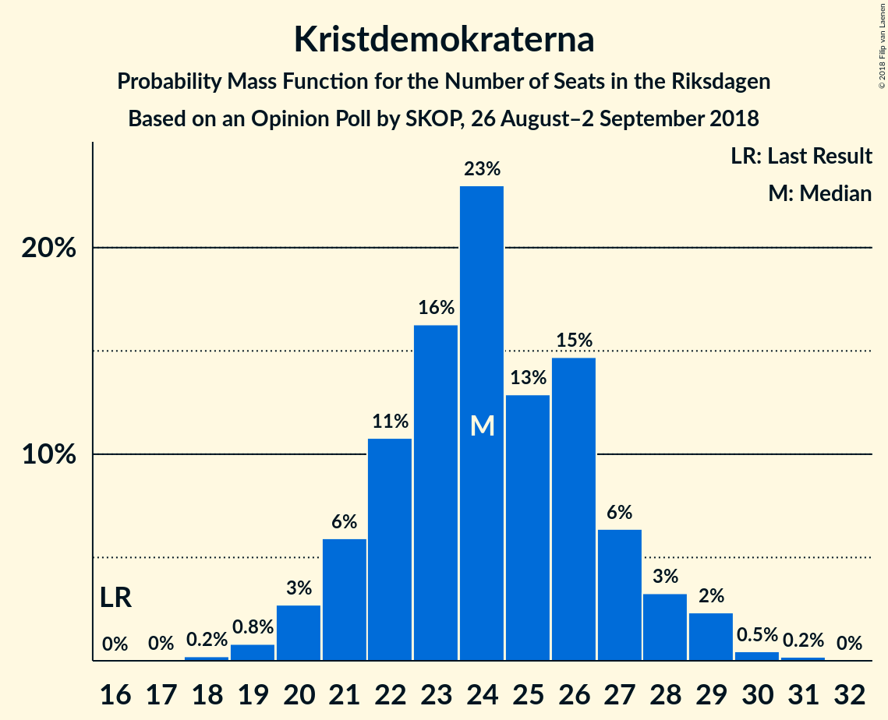

| Number of Seats | Probability | Accumulated | Special Marks |
|:---------------:|:-----------:|:-----------:|:-------------:|
| 16 | 0% | 100% | Last Result |
| 17 | 0% | 100% |  |
| 18 | 0.2% | 100% |  |
| 19 | 0.8% | 99.8% |  |
| 20 | 3% | 99.0% |  |
| 21 | 6% | 96% |  |
| 22 | 11% | 90% |  |
| 23 | 16% | 80% |  |
| 24 | 23% | 63% | Median |
| 25 | 13% | 40% |  |
| 26 | 15% | 27% |  |
| 27 | 6% | 13% |  |
| 28 | 3% | 6% |  |
| 29 | 2% | 3% |  |
| 30 | 0.5% | 0.7% |  |
| 31 | 0.2% | 0.2% |  |
| 32 | 0% | 0% |  |

### Miljöpartiet de gröna

*For a full overview of the results for this party, see the [Miljöpartiet de gröna](party-miljöpartietdegröna.html) page.*

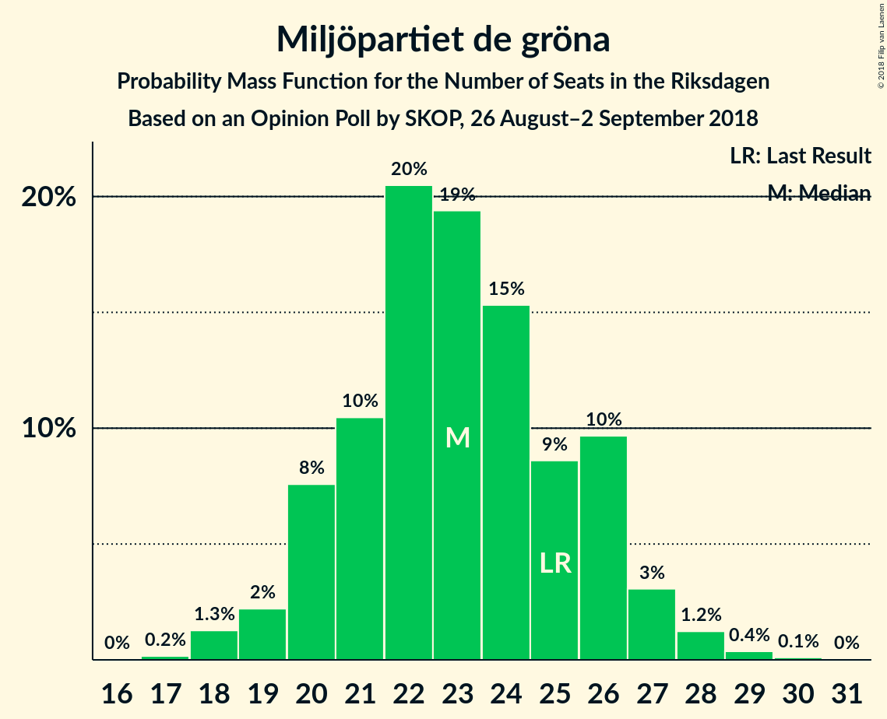

| Number of Seats | Probability | Accumulated | Special Marks |
|:---------------:|:-----------:|:-----------:|:-------------:|
| 17 | 0.2% | 100% |  |
| 18 | 1.3% | 99.8% |  |
| 19 | 2% | 98.5% |  |
| 20 | 8% | 96% |  |
| 21 | 10% | 89% |  |
| 22 | 20% | 78% |  |
| 23 | 19% | 58% | Median |
| 24 | 15% | 38% |  |
| 25 | 9% | 23% | Last Result |
| 26 | 10% | 14% |  |
| 27 | 3% | 5% |  |
| 28 | 1.2% | 2% |  |
| 29 | 0.4% | 0.5% |  |
| 30 | 0.1% | 0.1% |  |
| 31 | 0% | 0% |  |

### Liberalerna

*For a full overview of the results for this party, see the [Liberalerna](party-liberalerna.html) page.*

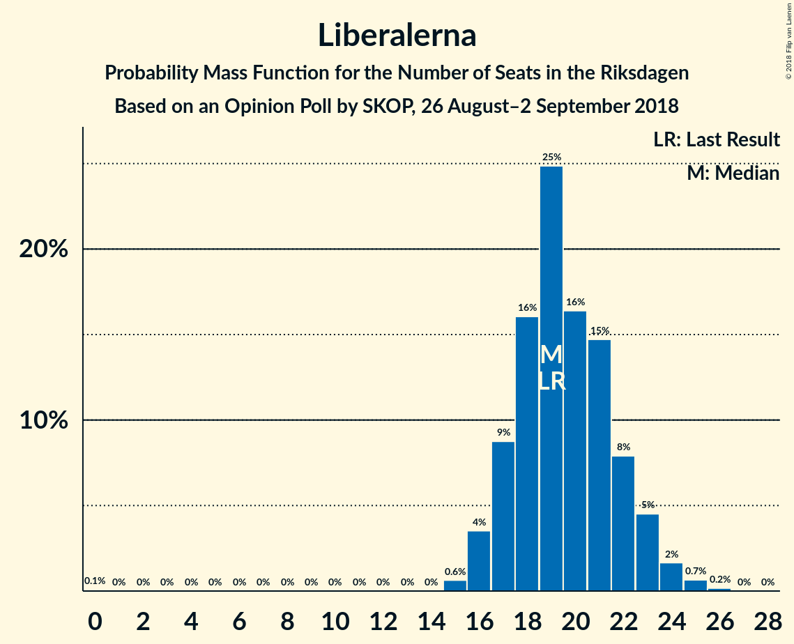

| Number of Seats | Probability | Accumulated | Special Marks |
|:---------------:|:-----------:|:-----------:|:-------------:|
| 0 | 0.1% | 100% |  |
| 1 | 0% | 99.9% |  |
| 2 | 0% | 99.9% |  |
| 3 | 0% | 99.9% |  |
| 4 | 0% | 99.9% |  |
| 5 | 0% | 99.9% |  |
| 6 | 0% | 99.9% |  |
| 7 | 0% | 99.9% |  |
| 8 | 0% | 99.9% |  |
| 9 | 0% | 99.9% |  |
| 10 | 0% | 99.9% |  |
| 11 | 0% | 99.9% |  |
| 12 | 0% | 99.9% |  |
| 13 | 0% | 99.9% |  |
| 14 | 0% | 99.9% |  |
| 15 | 0.6% | 99.9% |  |
| 16 | 4% | 99.3% |  |
| 17 | 9% | 96% |  |
| 18 | 16% | 87% |  |
| 19 | 25% | 71% | Last Result, Median |
| 20 | 16% | 46% |  |
| 21 | 15% | 30% |  |
| 22 | 8% | 15% |  |
| 23 | 5% | 7% |  |
| 24 | 2% | 3% |  |
| 25 | 0.7% | 0.9% |  |
| 26 | 0.2% | 0.2% |  |
| 27 | 0% | 0% |  |

### Feministiskt initiativ

*For a full overview of the results for this party, see the [Feministiskt initiativ](party-feministisktinitiativ.html) page.*

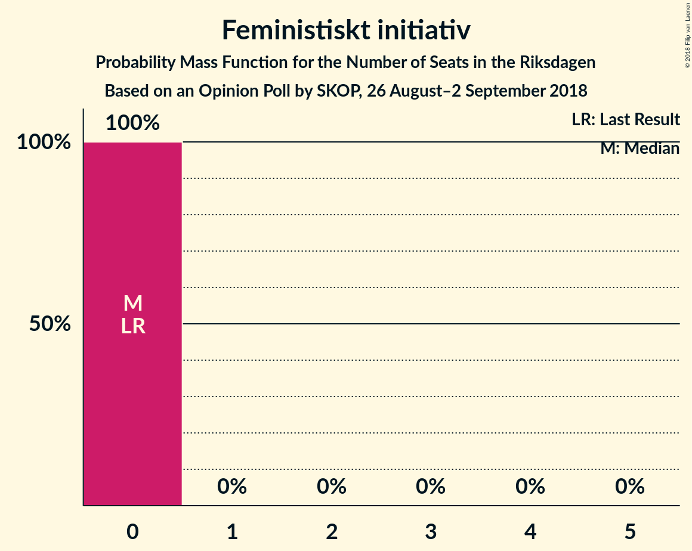

| Number of Seats | Probability | Accumulated | Special Marks |
|:---------------:|:-----------:|:-----------:|:-------------:|
| 0 | 100% | 100% | Last Result, Median |

## Coalitions

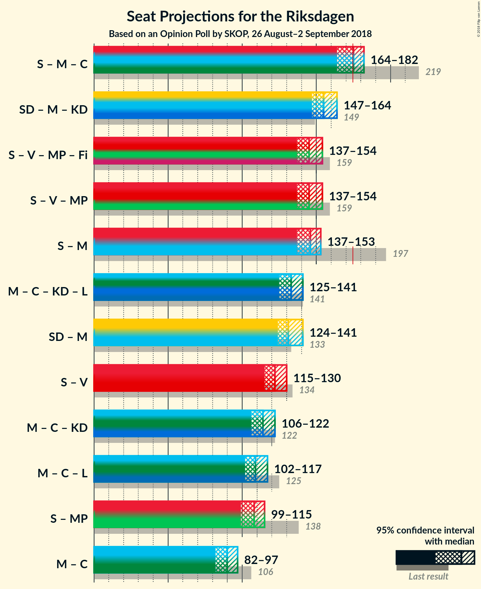

### Confidence Intervals

| Coalition | Last Result | Median | Majority? | 80% Confidence Interval | 90% Confidence Interval | 95% Confidence Interval | 99% Confidence Interval |
|:---------:|:-----------:|:------:|:---------:|:-----------------------:|:-----------------------:|:-----------------------:|:-----------------------:|
| Sveriges socialdemokratiska arbetareparti – Moderata samlingspartiet – Centerpartiet | 219 | 175 | 59% | 167–179 | 166–181 | 164–182 | 162–184 |
| Sverigedemokraterna – Moderata samlingspartiet – Kristdemokraterna | 149 | 155 | 0% | 151–162 | 149–163 | 147–164 | 145–167 |
| Sveriges socialdemokratiska arbetareparti – Vänsterpartiet – Miljöpartiet de gröna – Feministiskt initiativ | 159 | 145 | 0% | 140–150 | 138–152 | 137–154 | 135–156 |
| Sveriges socialdemokratiska arbetareparti – Vänsterpartiet – Miljöpartiet de gröna | 159 | 145 | 0% | 140–150 | 138–152 | 137–154 | 135–156 |
| Sveriges socialdemokratiska arbetareparti – Moderata samlingspartiet | 197 | 146 | 0% | 140–150 | 138–151 | 137–153 | 134–155 |
| Moderata samlingspartiet – Centerpartiet – Kristdemokraterna – Liberalerna | 141 | 133 | 0% | 129–139 | 126–140 | 125–141 | 123–145 |
| Sverigedemokraterna – Moderata samlingspartiet | 133 | 131 | 0% | 126–138 | 125–139 | 124–141 | 122–143 |
| Sveriges socialdemokratiska arbetareparti – Vänsterpartiet | 134 | 122 | 0% | 117–127 | 116–128 | 115–130 | 112–132 |
| Moderata samlingspartiet – Centerpartiet – Kristdemokraterna | 122 | 114 | 0% | 108–119 | 107–120 | 106–122 | 104–124 |
| Moderata samlingspartiet – Centerpartiet – Liberalerna | 125 | 109 | 0% | 104–115 | 103–115 | 102–117 | 99–120 |
| Sveriges socialdemokratiska arbetareparti – Miljöpartiet de gröna | 138 | 108 | 0% | 102–113 | 101–114 | 99–115 | 97–118 |
| Moderata samlingspartiet – Centerpartiet | 106 | 90 | 0% | 85–94 | 84–96 | 82–97 | 80–99 |

### Sveriges socialdemokratiska arbetareparti – Moderata samlingspartiet – Centerpartiet

| Number of Seats | Probability | Accumulated | Special Marks |
|:---------------:|:-----------:|:-----------:|:-------------:|
| 160 | 0.1% | 100% |  |
| 161 | 0.2% | 99.9% |  |
| 162 | 0.3% | 99.7% |  |
| 163 | 0.5% | 99.5% |  |
| 164 | 2% | 99.0% |  |
| 165 | 2% | 97% |  |
| 166 | 1.3% | 95% |  |
| 167 | 4% | 94% |  |
| 168 | 3% | 90% |  |
| 169 | 2% | 87% |  |
| 170 | 3% | 84% |  |
| 171 | 5% | 81% |  |
| 172 | 6% | 76% |  |
| 173 | 4% | 69% |  |
| 174 | 6% | 66% |  |
| 175 | 16% | 59% | Median, Majority |
| 176 | 9% | 44% |  |
| 177 | 8% | 35% |  |
| 178 | 8% | 27% |  |
| 179 | 13% | 20% |  |
| 180 | 2% | 7% |  |
| 181 | 2% | 5% |  |
| 182 | 2% | 3% |  |
| 183 | 0.5% | 1.1% |  |
| 184 | 0.2% | 0.6% |  |
| 185 | 0.3% | 0.4% |  |
| 186 | 0.1% | 0.2% |  |
| 187 | 0% | 0.1% |  |
| 188 | 0% | 0.1% |  |
| 189 | 0% | 0% |  |
| 190 | 0% | 0% |  |
| 191 | 0% | 0% |  |
| 192 | 0% | 0% |  |
| 193 | 0% | 0% |  |
| 194 | 0% | 0% |  |
| 195 | 0% | 0% |  |
| 196 | 0% | 0% |  |
| 197 | 0% | 0% |  |
| 198 | 0% | 0% |  |
| 199 | 0% | 0% |  |
| 200 | 0% | 0% |  |
| 201 | 0% | 0% |  |
| 202 | 0% | 0% |  |
| 203 | 0% | 0% |  |
| 204 | 0% | 0% |  |
| 205 | 0% | 0% |  |
| 206 | 0% | 0% |  |
| 207 | 0% | 0% |  |
| 208 | 0% | 0% |  |
| 209 | 0% | 0% |  |
| 210 | 0% | 0% |  |
| 211 | 0% | 0% |  |
| 212 | 0% | 0% |  |
| 213 | 0% | 0% |  |
| 214 | 0% | 0% |  |
| 215 | 0% | 0% |  |
| 216 | 0% | 0% |  |
| 217 | 0% | 0% |  |
| 218 | 0% | 0% |  |
| 219 | 0% | 0% | Last Result |

### Sverigedemokraterna – Moderata samlingspartiet – Kristdemokraterna

| Number of Seats | Probability | Accumulated | Special Marks |
|:---------------:|:-----------:|:-----------:|:-------------:|
| 142 | 0% | 100% |  |
| 143 | 0.1% | 99.9% |  |
| 144 | 0.1% | 99.9% |  |
| 145 | 0.3% | 99.8% |  |
| 146 | 1.4% | 99.5% |  |
| 147 | 2% | 98% |  |
| 148 | 1.0% | 96% |  |
| 149 | 4% | 95% | Last Result |
| 150 | 1.2% | 92% |  |
| 151 | 5% | 90% |  |
| 152 | 13% | 85% |  |
| 153 | 9% | 73% |  |
| 154 | 9% | 64% |  |
| 155 | 8% | 55% | Median |
| 156 | 5% | 47% |  |
| 157 | 12% | 42% |  |
| 158 | 5% | 31% |  |
| 159 | 7% | 25% |  |
| 160 | 4% | 19% |  |
| 161 | 3% | 15% |  |
| 162 | 4% | 12% |  |
| 163 | 4% | 7% |  |
| 164 | 1.4% | 3% |  |
| 165 | 0.8% | 2% |  |
| 166 | 0.3% | 1.1% |  |
| 167 | 0.4% | 0.8% |  |
| 168 | 0.2% | 0.4% |  |
| 169 | 0.1% | 0.2% |  |
| 170 | 0.1% | 0.1% |  |
| 171 | 0% | 0% |  |

### Sveriges socialdemokratiska arbetareparti – Vänsterpartiet – Miljöpartiet de gröna – Feministiskt initiativ

| Number of Seats | Probability | Accumulated | Special Marks |
|:---------------:|:-----------:|:-----------:|:-------------:|
| 132 | 0% | 100% |  |
| 133 | 0.1% | 99.9% |  |
| 134 | 0.2% | 99.8% |  |
| 135 | 0.4% | 99.6% |  |
| 136 | 1.1% | 99.2% |  |
| 137 | 2% | 98% |  |
| 138 | 2% | 96% |  |
| 139 | 4% | 94% |  |
| 140 | 6% | 90% |  |
| 141 | 6% | 85% |  |
| 142 | 5% | 79% |  |
| 143 | 11% | 74% |  |
| 144 | 9% | 63% |  |
| 145 | 6% | 53% | Median |
| 146 | 6% | 47% |  |
| 147 | 14% | 42% |  |
| 148 | 5% | 28% |  |
| 149 | 10% | 22% |  |
| 150 | 4% | 13% |  |
| 151 | 4% | 9% |  |
| 152 | 2% | 6% |  |
| 153 | 1.0% | 4% |  |
| 154 | 1.2% | 3% |  |
| 155 | 0.8% | 1.4% |  |
| 156 | 0.4% | 0.6% |  |
| 157 | 0.1% | 0.2% |  |
| 158 | 0.1% | 0.1% |  |
| 159 | 0% | 0.1% | Last Result |
| 160 | 0% | 0% |  |

### Sveriges socialdemokratiska arbetareparti – Vänsterpartiet – Miljöpartiet de gröna

| Number of Seats | Probability | Accumulated | Special Marks |
|:---------------:|:-----------:|:-----------:|:-------------:|
| 132 | 0% | 100% |  |
| 133 | 0.1% | 99.9% |  |
| 134 | 0.2% | 99.8% |  |
| 135 | 0.4% | 99.6% |  |
| 136 | 1.1% | 99.2% |  |
| 137 | 2% | 98% |  |
| 138 | 2% | 96% |  |
| 139 | 4% | 94% |  |
| 140 | 6% | 90% |  |
| 141 | 6% | 85% |  |
| 142 | 5% | 79% |  |
| 143 | 11% | 74% |  |
| 144 | 9% | 63% |  |
| 145 | 6% | 53% | Median |
| 146 | 6% | 47% |  |
| 147 | 14% | 42% |  |
| 148 | 5% | 28% |  |
| 149 | 10% | 22% |  |
| 150 | 4% | 13% |  |
| 151 | 4% | 9% |  |
| 152 | 2% | 6% |  |
| 153 | 1.0% | 4% |  |
| 154 | 1.2% | 3% |  |
| 155 | 0.8% | 1.4% |  |
| 156 | 0.4% | 0.6% |  |
| 157 | 0.1% | 0.2% |  |
| 158 | 0.1% | 0.1% |  |
| 159 | 0% | 0.1% | Last Result |
| 160 | 0% | 0% |  |

### Sveriges socialdemokratiska arbetareparti – Moderata samlingspartiet

| Number of Seats | Probability | Accumulated | Special Marks |
|:---------------:|:-----------:|:-----------:|:-------------:|
| 133 | 0.1% | 100% |  |
| 134 | 0.4% | 99.9% |  |
| 135 | 0.3% | 99.4% |  |
| 136 | 0.8% | 99.1% |  |
| 137 | 1.1% | 98% |  |
| 138 | 3% | 97% |  |
| 139 | 2% | 94% |  |
| 140 | 3% | 92% |  |
| 141 | 5% | 90% |  |
| 142 | 6% | 85% |  |
| 143 | 9% | 79% |  |
| 144 | 7% | 70% |  |
| 145 | 5% | 63% |  |
| 146 | 20% | 58% | Median |
| 147 | 9% | 38% |  |
| 148 | 4% | 28% |  |
| 149 | 8% | 24% |  |
| 150 | 6% | 16% |  |
| 151 | 5% | 10% |  |
| 152 | 2% | 5% |  |
| 153 | 0.8% | 3% |  |
| 154 | 1.2% | 2% |  |
| 155 | 0.8% | 1.2% |  |
| 156 | 0.2% | 0.4% |  |
| 157 | 0.1% | 0.2% |  |
| 158 | 0% | 0.1% |  |
| 159 | 0% | 0% |  |
| 160 | 0% | 0% |  |
| 161 | 0% | 0% |  |
| 162 | 0% | 0% |  |
| 163 | 0% | 0% |  |
| 164 | 0% | 0% |  |
| 165 | 0% | 0% |  |
| 166 | 0% | 0% |  |
| 167 | 0% | 0% |  |
| 168 | 0% | 0% |  |
| 169 | 0% | 0% |  |
| 170 | 0% | 0% |  |
| 171 | 0% | 0% |  |
| 172 | 0% | 0% |  |
| 173 | 0% | 0% |  |
| 174 | 0% | 0% |  |
| 175 | 0% | 0% | Majority |
| 176 | 0% | 0% |  |
| 177 | 0% | 0% |  |
| 178 | 0% | 0% |  |
| 179 | 0% | 0% |  |
| 180 | 0% | 0% |  |
| 181 | 0% | 0% |  |
| 182 | 0% | 0% |  |
| 183 | 0% | 0% |  |
| 184 | 0% | 0% |  |
| 185 | 0% | 0% |  |
| 186 | 0% | 0% |  |
| 187 | 0% | 0% |  |
| 188 | 0% | 0% |  |
| 189 | 0% | 0% |  |
| 190 | 0% | 0% |  |
| 191 | 0% | 0% |  |
| 192 | 0% | 0% |  |
| 193 | 0% | 0% |  |
| 194 | 0% | 0% |  |
| 195 | 0% | 0% |  |
| 196 | 0% | 0% |  |
| 197 | 0% | 0% | Last Result |

### Moderata samlingspartiet – Centerpartiet – Kristdemokraterna – Liberalerna

| Number of Seats | Probability | Accumulated | Special Marks |
|:---------------:|:-----------:|:-----------:|:-------------:|
| 119 | 0% | 100% |  |
| 120 | 0% | 99.9% |  |
| 121 | 0.1% | 99.9% |  |
| 122 | 0.1% | 99.8% |  |
| 123 | 0.5% | 99.7% |  |
| 124 | 1.0% | 99.2% |  |
| 125 | 2% | 98% |  |
| 126 | 2% | 97% |  |
| 127 | 2% | 95% |  |
| 128 | 3% | 93% |  |
| 129 | 7% | 90% |  |
| 130 | 9% | 83% |  |
| 131 | 9% | 75% |  |
| 132 | 5% | 66% |  |
| 133 | 12% | 61% | Median |
| 134 | 13% | 49% |  |
| 135 | 8% | 36% |  |
| 136 | 5% | 29% |  |
| 137 | 6% | 23% |  |
| 138 | 4% | 17% |  |
| 139 | 6% | 13% |  |
| 140 | 2% | 7% |  |
| 141 | 2% | 4% | Last Result |
| 142 | 1.0% | 2% |  |
| 143 | 0.4% | 1.3% |  |
| 144 | 0.3% | 0.8% |  |
| 145 | 0.4% | 0.5% |  |
| 146 | 0% | 0.1% |  |
| 147 | 0.1% | 0.1% |  |
| 148 | 0% | 0% |  |

### Sverigedemokraterna – Moderata samlingspartiet

| Number of Seats | Probability | Accumulated | Special Marks |
|:---------------:|:-----------:|:-----------:|:-------------:|
| 119 | 0% | 100% |  |
| 120 | 0% | 99.9% |  |
| 121 | 0.2% | 99.9% |  |
| 122 | 0.9% | 99.7% |  |
| 123 | 1.3% | 98.8% |  |
| 124 | 1.3% | 98% |  |
| 125 | 6% | 96% |  |
| 126 | 4% | 91% |  |
| 127 | 1.4% | 87% |  |
| 128 | 16% | 85% |  |
| 129 | 9% | 69% |  |
| 130 | 6% | 60% |  |
| 131 | 9% | 55% | Median |
| 132 | 11% | 45% |  |
| 133 | 3% | 34% | Last Result |
| 134 | 6% | 31% |  |
| 135 | 8% | 26% |  |
| 136 | 3% | 18% |  |
| 137 | 3% | 15% |  |
| 138 | 6% | 12% |  |
| 139 | 2% | 6% |  |
| 140 | 2% | 4% |  |
| 141 | 1.3% | 3% |  |
| 142 | 0.8% | 1.3% |  |
| 143 | 0.2% | 0.5% |  |
| 144 | 0.2% | 0.3% |  |
| 145 | 0.1% | 0.2% |  |
| 146 | 0% | 0% |  |

### Sveriges socialdemokratiska arbetareparti – Vänsterpartiet

| Number of Seats | Probability | Accumulated | Special Marks |
|:---------------:|:-----------:|:-----------:|:-------------:|
| 110 | 0.1% | 100% |  |
| 111 | 0.1% | 99.9% |  |
| 112 | 0.5% | 99.8% |  |
| 113 | 0.6% | 99.3% |  |
| 114 | 0.9% | 98.7% |  |
| 115 | 1.4% | 98% |  |
| 116 | 4% | 96% |  |
| 117 | 6% | 93% |  |
| 118 | 7% | 87% |  |
| 119 | 5% | 80% |  |
| 120 | 8% | 75% |  |
| 121 | 14% | 67% |  |
| 122 | 7% | 53% | Median |
| 123 | 10% | 47% |  |
| 124 | 10% | 36% |  |
| 125 | 8% | 26% |  |
| 126 | 7% | 18% |  |
| 127 | 5% | 11% |  |
| 128 | 2% | 6% |  |
| 129 | 2% | 5% |  |
| 130 | 1.0% | 3% |  |
| 131 | 0.7% | 2% |  |
| 132 | 0.8% | 1.2% |  |
| 133 | 0.2% | 0.4% |  |
| 134 | 0.1% | 0.2% | Last Result |
| 135 | 0% | 0.1% |  |
| 136 | 0% | 0% |  |

### Moderata samlingspartiet – Centerpartiet – Kristdemokraterna

| Number of Seats | Probability | Accumulated | Special Marks |
|:---------------:|:-----------:|:-----------:|:-------------:|
| 101 | 0% | 100% |  |
| 102 | 0.1% | 99.9% |  |
| 103 | 0.2% | 99.8% |  |
| 104 | 0.7% | 99.5% |  |
| 105 | 1.2% | 98.8% |  |
| 106 | 1.5% | 98% |  |
| 107 | 4% | 96% |  |
| 108 | 3% | 92% |  |
| 109 | 4% | 90% |  |
| 110 | 6% | 85% |  |
| 111 | 5% | 79% |  |
| 112 | 10% | 74% |  |
| 113 | 8% | 64% |  |
| 114 | 9% | 56% | Median |
| 115 | 14% | 47% |  |
| 116 | 7% | 33% |  |
| 117 | 7% | 26% |  |
| 118 | 7% | 19% |  |
| 119 | 3% | 12% |  |
| 120 | 5% | 10% |  |
| 121 | 1.1% | 4% |  |
| 122 | 2% | 3% | Last Result |
| 123 | 0.6% | 1.2% |  |
| 124 | 0.3% | 0.6% |  |
| 125 | 0.2% | 0.3% |  |
| 126 | 0.1% | 0.1% |  |
| 127 | 0% | 0% |  |

### Moderata samlingspartiet – Centerpartiet – Liberalerna

| Number of Seats | Probability | Accumulated | Special Marks |
|:---------------:|:-----------:|:-----------:|:-------------:|
| 95 | 0% | 100% |  |
| 96 | 0% | 99.9% |  |
| 97 | 0.1% | 99.9% |  |
| 98 | 0.1% | 99.9% |  |
| 99 | 0.4% | 99.8% |  |
| 100 | 0.5% | 99.3% |  |
| 101 | 0.7% | 98.9% |  |
| 102 | 1.2% | 98% |  |
| 103 | 3% | 97% |  |
| 104 | 5% | 94% |  |
| 105 | 6% | 89% |  |
| 106 | 6% | 83% |  |
| 107 | 6% | 77% |  |
| 108 | 13% | 71% |  |
| 109 | 15% | 58% | Median |
| 110 | 9% | 42% |  |
| 111 | 7% | 33% |  |
| 112 | 7% | 26% |  |
| 113 | 5% | 19% |  |
| 114 | 4% | 15% |  |
| 115 | 6% | 10% |  |
| 116 | 1.0% | 4% |  |
| 117 | 1.2% | 3% |  |
| 118 | 0.9% | 2% |  |
| 119 | 0.5% | 1.1% |  |
| 120 | 0.5% | 0.6% |  |
| 121 | 0.1% | 0.1% |  |
| 122 | 0% | 0.1% |  |
| 123 | 0% | 0% |  |
| 124 | 0% | 0% |  |
| 125 | 0% | 0% | Last Result |

### Sveriges socialdemokratiska arbetareparti – Miljöpartiet de gröna

| Number of Seats | Probability | Accumulated | Special Marks |
|:---------------:|:-----------:|:-----------:|:-------------:|
| 95 | 0.1% | 100% |  |
| 96 | 0.4% | 99.9% |  |
| 97 | 0.4% | 99.5% |  |
| 98 | 1.1% | 99.2% |  |
| 99 | 1.0% | 98% |  |
| 100 | 1.3% | 97% |  |
| 101 | 2% | 96% |  |
| 102 | 4% | 93% |  |
| 103 | 4% | 89% |  |
| 104 | 9% | 85% |  |
| 105 | 7% | 77% |  |
| 106 | 7% | 69% |  |
| 107 | 11% | 62% |  |
| 108 | 8% | 51% | Median |
| 109 | 9% | 44% |  |
| 110 | 5% | 35% |  |
| 111 | 11% | 30% |  |
| 112 | 4% | 19% |  |
| 113 | 8% | 14% |  |
| 114 | 2% | 6% |  |
| 115 | 2% | 5% |  |
| 116 | 1.2% | 2% |  |
| 117 | 0.3% | 0.8% |  |
| 118 | 0.4% | 0.6% |  |
| 119 | 0.1% | 0.2% |  |
| 120 | 0.1% | 0.1% |  |
| 121 | 0% | 0% |  |
| 122 | 0% | 0% |  |
| 123 | 0% | 0% |  |
| 124 | 0% | 0% |  |
| 125 | 0% | 0% |  |
| 126 | 0% | 0% |  |
| 127 | 0% | 0% |  |
| 128 | 0% | 0% |  |
| 129 | 0% | 0% |  |
| 130 | 0% | 0% |  |
| 131 | 0% | 0% |  |
| 132 | 0% | 0% |  |
| 133 | 0% | 0% |  |
| 134 | 0% | 0% |  |
| 135 | 0% | 0% |  |
| 136 | 0% | 0% |  |
| 137 | 0% | 0% |  |
| 138 | 0% | 0% | Last Result |

### Moderata samlingspartiet – Centerpartiet

| Number of Seats | Probability | Accumulated | Special Marks |
|:---------------:|:-----------:|:-----------:|:-------------:|
| 78 | 0.1% | 100% |  |
| 79 | 0.1% | 99.9% |  |
| 80 | 0.6% | 99.8% |  |
| 81 | 0.6% | 99.2% |  |
| 82 | 1.2% | 98.7% |  |
| 83 | 2% | 97% |  |
| 84 | 3% | 96% |  |
| 85 | 5% | 93% |  |
| 86 | 8% | 88% |  |
| 87 | 8% | 80% |  |
| 88 | 6% | 72% |  |
| 89 | 14% | 66% |  |
| 90 | 15% | 52% | Median |
| 91 | 4% | 37% |  |
| 92 | 9% | 33% |  |
| 93 | 8% | 24% |  |
| 94 | 8% | 16% |  |
| 95 | 3% | 8% |  |
| 96 | 2% | 5% |  |
| 97 | 0.9% | 3% |  |
| 98 | 1.2% | 2% |  |
| 99 | 0.7% | 0.9% |  |
| 100 | 0.1% | 0.2% |  |
| 101 | 0% | 0.1% |  |
| 102 | 0% | 0.1% |  |
| 103 | 0% | 0% |  |
| 104 | 0% | 0% |  |
| 105 | 0% | 0% |  |
| 106 | 0% | 0% | Last Result |

## Technical Information

### Opinion Poll

+ **Polling firm:** SKOP
+ **Commissioner(s):** —
+ **Fieldwork period:** 26 August–2 September 2018

### Calculations

+ **Sample size:** 1994
+ **Simulations done:** 1,048,576
+ **Error estimate:** 0.76%

